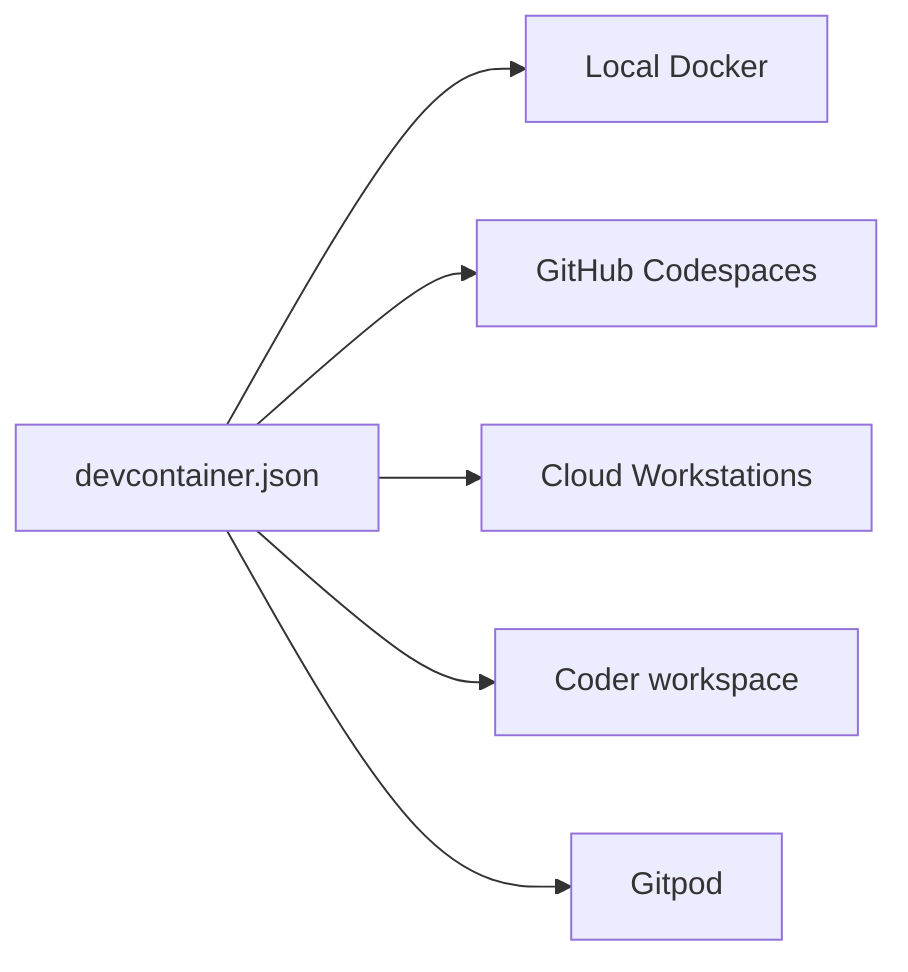
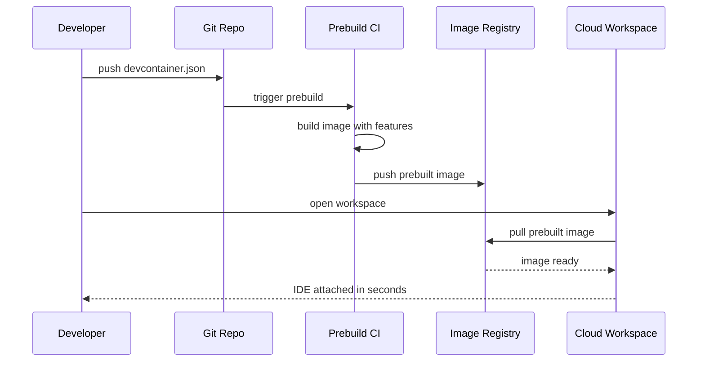
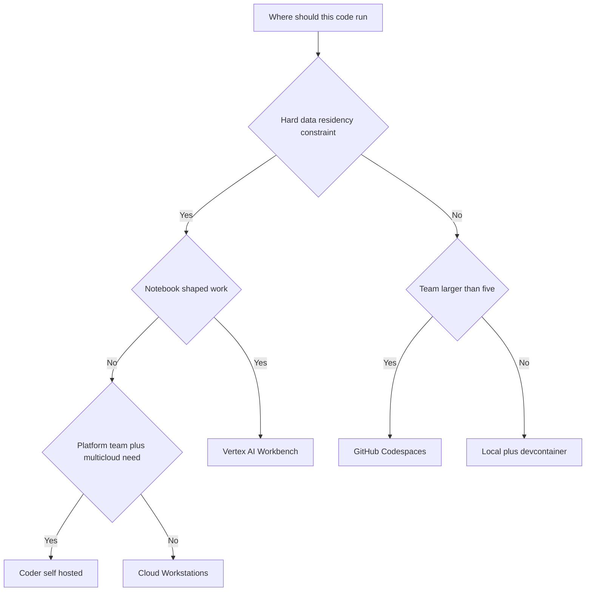
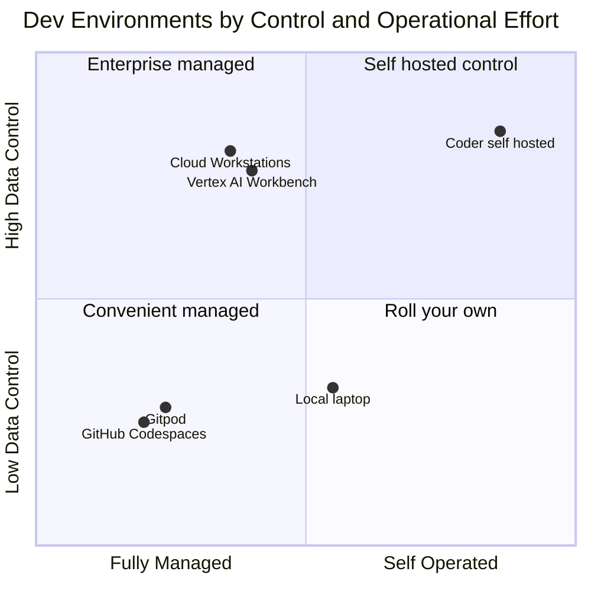

# Where Your Code Should Live: Cloud Workstations, Workbench, Coder, and the AI Team's Dev Environment

## The Kitchen Is Not a Personal Preference

Walk into a serious restaurant kitchen during service and you notice two things at once. The first is shared infrastructure: the line, the walk-in cooler, the gas, the dish pit, the hood. None of it belongs to any one cook. It is governed, maintained, inspected, and expensive, and the whole brigade depends on it being identical and reliable every single night. The second is the personal station: each cook's mise en place, their knives, the way they arrange their pans within arm's reach. That part is preference, and good chefs leave it alone as long as the food comes out right.

A development environment is the kitchen your team cooks in. And the mistake I see most often, in my own work and in the teams I review, is treating the entire kitchen as personal preference. People argue about editors and shells and dotfiles, which is the mise en place, and never decide the thing that actually matters: where the gas line runs. Where does the code execute? Where does the data live while you work on it? Who can see the secrets? Can you rebuild this exact station tomorrow, and can you prove to an auditor what was on it last March?

I have spent the last year as a Knowledge Data Engineer at a financial institution, building a corporate knowledge base, a vector-database proof of concept, and lakehouse-resident agents on a GCP-first stack. In that context the dev environment stopped being a comfort question and became an architecture question. Data cannot leave the VPC. GPUs are scarce and metered. Secrets are governed by a team that does not care about your productivity. Environments must be reproducible and auditable. And now the AI coding agents we all use run shell commands on our behalf, which means the environment is also a sandbox for a semi-autonomous process with my credentials.

This post is the one I went looking for and could not find. It evaluates the real options for where AI engineers should write and run code in 2027, honestly, with what each one costs and how each one breaks, and ends with an opinionated matrix for four kinds of team. The throughline is simple: **the environment is part of the architecture, not a personal preference.** Decide it on purpose.

## Prerequisites and Assumptions

This is a decision-framework post, not a tutorial. I assume you are comfortable with the things the rest of this blog already covers and will not re-derive them here:

- You know what a container is and why it matters. If not, start with [Docker for ML engineers](https://juanlara18.github.io/portfolio/#/blog/docker-for-ml-engineers), because every option below is downstream of the container.
- You know what infrastructure as code buys you. The self-hosted option leans entirely on [Terraform](https://juanlara18.github.io/portfolio/#/blog/terraform-infrastructure-as-code).
- You have used an AI coding agent that executes commands, in the [Claude Code](https://juanlara18.github.io/portfolio/#/blog/claude-code-complete-guide) sense, not just inline autocomplete. That changes the sandbox requirement materially.
- You accept the framing that cloud is a different way of building, not just bigger computers, which I argued in [cloud infrastructure for ML](https://juanlara18.github.io/portfolio/#/blog/cloud-ml-infrastructure).

I also assume a working definition of "AI work" that is broader than training models. It includes RAG and agent development, data engineering against a warehouse, notebook-driven analysis, fine-tuning, and the long tail of glue code that touches production data. These have different gravity, and that is the whole point.

One more assumption worth stating: there is no single right answer. There is a right answer *for a given workload in a given organization under given constraints*. The criteria below are more transferable than my picks, so weight them for your own context.

## The Forces That Decide Where Code Lives

Before the options, the forces. Six of them push code off the laptop and into managed or governed environments. When none of them apply, the laptop wins, and you should let it. When several apply at once, you are no longer choosing for comfort.

**GPU access.** A modern laptop has a capable CPU and, if you are lucky, a consumer GPU with enough memory for inference on a small quantized model. It does not have an H100. Any workload that needs real accelerator memory has to run somewhere else, and the question becomes how cleanly your editor reaches that somewhere else.

**Data gravity.** Data is heavy. If your training set or your document corpus lives in BigQuery or a Cloud Storage bucket inside a VPC, dragging it to a laptop is slow, expensive, and frequently illegal. It is far cheaper to move the compute to the data than the data to the compute. This single fact bends most enterprise decisions toward cloud environments that sit next to the data.

**Secrets and credentials.** A laptop that holds a long-lived service-account key is a breach waiting for a lost bag. Governed environments let you bind short-lived, workload-scoped identity to the environment itself, so the secret never lands on a portable disk. This is the same capability-token discipline I argued for at the application layer in [the stack I would adopt after 100 posts](https://juanlara18.github.io/portfolio/#/blog/stack-recommendations-after-100-posts), applied one floor down.

**Reproducibility.** "Works on my machine" is not a joke, it is a failure mode with a cost. When the environment is a versioned artifact, every cook gets the same station. When it is a laptop that accreted state over eighteen months, onboarding is a week and bugs are unfalsifiable.

**Auditability.** In regulated work you must be able to answer "who had access to what data, from where, when, with which tools." A laptop answers none of those questions. A managed environment with central logging answers all of them in one query.

**The agent sandbox.** This is the new force, and it is the one most stacks have not absorbed yet. When an AI coding agent runs `bash` on your behalf, it can install packages, hit the network, read every file the process can read, and make commits. You want that to happen inside a blast radius you defined, not on the same disk as your tax returns and your SSH keys. The environment is now also a containment boundary.



The diagram above is the punchline of the next several sections, so I am putting it up front. There is one configuration layer, the dev container spec, that cuts across almost every option. Get that layer right and the choice of where the container runs becomes a deployment decision rather than a rewrite. Let me take the options one at a time.

## Option 1: Local Development

**What it is.** Your laptop, your editor, your shell. The default for the entire history of software, and still the fastest inner loop ever built. Nothing beats the latency of code that compiles and runs on the metal under your fingers.

**How it works.** You install a language runtime, a package manager, an editor, and you go. State accumulates. Over time the machine becomes a unique snowflake that nobody, including you, can reproduce.

**What it costs.** The hardware, once, plus the hidden tax of drift. The sticker price is low and the total cost of ownership is deceptive, because the expensive part is the hours lost to environment mismatches and the days lost onboarding a new hire to an undocumented setup.

**Who it is for.** Solo developers, early prototyping, anything where the data is small and public and there is no GPU requirement and no compliance surface. For a large amount of real engineering, local is correct and you should not feel bad about it.

**Where it breaks for AI work.** All six forces hit local hardest. No serious GPU. The data is in the cloud and you are not allowed to download it. Secrets end up in a `.env` file that is one `git add .` away from a public repo. Reproducibility is whatever your shell history happened to do. There is no audit trail. And the AI agent you just gave shell access is running on the same machine as everything else you own.

The honest position is not "local is dead." It is "local is a wonderful place to *edit* and a dangerous place to *run* once any of the six forces apply." The modern pattern keeps the editor local for latency and pushes execution somewhere governed. The bridge that makes that pattern painless is the dev container.

## Option 2: Dev Containers, the Portable Config Layer

**What it is.** The dev container specification, hosted at containers.dev, is an open, tool-agnostic format for describing a development environment as a file in your repository. A `.devcontainer/devcontainer.json` declares the base image, the tools to layer on, the editor extensions, the ports to forward, the environment variables, and the commands to run after the container is created. It is not a place to run code; it is a *description* of the kitchen that every other option can consume.

**How it works.** The spec is supported by VS Code and by JetBrains IDEs, and it is the substrate underneath GitHub Codespaces. The most important idea in the spec is Features: modular, shareable units of functionality referenced by identifier, which the building tool installs and merges into your image. You do not hand-write the steps to install the GitHub CLI; you reference the feature and it is composed in.

Here is a realistic configuration for a Python RAG service that talks to GCP. Every field below is in the spec, and every feature identifier is a real published feature.

```json
{
  "name": "rag-service-dev",
  "image": "mcr.microsoft.com/devcontainers/python:3.12-bookworm",
  "features": {
    "ghcr.io/devcontainers/features/docker-in-docker:2": {},
    "ghcr.io/devcontainers/features/github-cli:1": {},
    "ghcr.io/devcontainers/features/google-cloud-cli:1": {
      "version": "latest"
    }
  },
  "customizations": {
    "vscode": {
      "extensions": [
        "ms-python.python",
        "ms-python.vscode-pylance",
        "charliermarsh.ruff"
      ],
      "settings": {
        "python.defaultInterpreterPath": "/usr/local/bin/python",
        "editor.formatOnSave": true
      }
    }
  },
  "forwardPorts": [8000],
  "containerEnv": {
    "PYTHONUNBUFFERED": "1"
  },
  "remoteEnv": {
    "GOOGLE_CLOUD_PROJECT": "${localEnv:GOOGLE_CLOUD_PROJECT}"
  },
  "postCreateCommand": "uv sync --frozen",
  "remoteUser": "vscode"
}
```

A few things worth pointing at. The `features` block is the whole game: three lines pull in Docker-in-Docker, the GitHub CLI, and the Google Cloud CLI, fully composed, with no bespoke install scripting. The `customizations` object is namespaced per tool, so a `vscode` block and a `jetbrains` block can coexist without fighting. `postCreateCommand` runs `uv sync --frozen` once after creation, which pins the dependency tree exactly. And `remoteEnv` pulls a value from the host so the project ID is not baked into the image.

**Prebuilds** are the performance unlock. Installing features on every container start is slow. Instead you build the image once in CI, with the Dev Container CLI or the official GitHub Action, push it to a registry, and reference the prebuilt image. The spec even supports a `devcontainer.metadata` image label so the configuration travels with the image and merges back in at create time. The result is the difference between a thirty-second start and a five-minute one.



**What it costs.** Nothing, as a spec. The cost is the discipline of maintaining the file and the CI that prebuilds it. That cost is trivial relative to what it buys.

**Who it is for.** Everyone. This is the layer I would adopt first, before deciding anything else, because it makes the next decision reversible. If your environment is captured in a dev container, moving from local Docker to Codespaces to Cloud Workstations is a change of where the container runs, not a migration.

**Failure modes.** The big one is letting the dev container drift from production. If your `Dockerfile` for deployment and your dev container diverge, you have reintroduced "works on my machine" with extra steps. Keep them sharing a base image. The second is feature soup: pulling in twenty features until startup is slow and the image is enormous. Prebuild, and prune.

## Option 3: GitHub Codespaces

**What it is.** Managed cloud development environments, backed by the dev container spec, hosted by GitHub. You click "open in Codespace" on a repository and a few seconds later you have a full VS Code, in the browser or attached from your desktop, running your dev container on a GitHub-managed VM.

**How it works.** Under the hood a Codespace is exactly the diagram from option two, executed on GitHub's infrastructure. GitHub provisions a Linux VM, runs your dev container inside it for kernel isolation between tenants, and attaches your editor. If you have no `devcontainer.json`, you get a capable default image with common languages and tools. If you do, you get your tailored environment. Compute comes in machine sizes from small to large, billed by the hour while running, with storage billed separately, and personal accounts get a monthly free allowance.

**What it costs.** A per-core-hour compute charge while the Codespace is running plus a per-gigabyte-month storage charge while it exists, stopped or not. The operational cost is near zero because GitHub runs it. The trap is forgetting to stop idle Codespaces, which is why the auto-stop timeout matters.

**Who it is for.** Teams already living in GitHub who want zero-friction, reproducible environments and whose code and data are not subject to hard residency constraints. Open-source projects. Onboarding-heavy teams where "clone and you are productive in two minutes" is worth real money. It is the fastest path from a dev container to a running cloud environment that exists.

**Failure modes.** The decisive one for my world: your code and the runtime live on GitHub's infrastructure, in GitHub's regions, under GitHub's tenancy. For a financial institution with VPC Service Controls and data-residency rules, that is frequently a non-starter, and no amount of convenience changes the compliance answer. There is also the quieter cost trap of long-lived idle environments, and the dependency on a single vendor's availability for your entire team's ability to work. Codespaces is excellent, and for regulated GCP-resident data it is usually the wrong building.

## Option 4: Google Cloud Workstations

**What it is.** Managed, secured development environments that run inside your own GCP project, on Compute Engine VMs in your VPC, reachable through a browser IDE, from local VS Code or JetBrains over SSH, or through tunnels. This is the option built for exactly the constraint that rules out Codespaces: the environment sits inside your perimeter, under your IAM, compatible with VPC Service Controls.

**How it works.** There are three nouns. A **cluster** is the control plane that lives in your VPC, typically one per network, owned by the platform team. A **configuration** is the reproducible template: the machine type, the disk, the timeouts, and crucially a container image that defines the environment. A **workstation** is an instance of a configuration for a specific developer, backed by an ephemeral VM with a persistent disk so your home directory survives between sessions. Update the configuration and every workstation picks up the change on its next start, which is reproducibility enforced by the platform.

```bash
# 1. Platform team: one cluster per VPC, wired into your network
gcloud workstations clusters create kb-cluster \
    --region=us-central1 \
    --network="projects/PROJECT_ID/global/networks/kb-vpc" \
    --subnetwork="projects/PROJECT_ID/regions/us-central1/subnetworks/kb-subnet"

# 2. A configuration is the reproducible environment template
gcloud workstations configs create python-ml-config \
    --cluster=kb-cluster \
    --region=us-central1 \
    --machine-type=e2-standard-8 \
    --pd-disk-size=200 \
    --idle-timeout=1800 \
    --running-timeout=43200 \
    --container-custom-image="us-central1-docker.pkg.dev/PROJECT_ID/dev/ml-workstation:latest"

# 3. A workstation is one developer's instance of that config
gcloud workstations create juan-ws \
    --cluster=kb-cluster \
    --config=python-ml-config \
    --region=us-central1

# 4. Start it; open the browser IDE or attach a local editor
gcloud workstations start juan-ws \
    --cluster=kb-cluster \
    --config=python-ml-config \
    --region=us-central1
```

Notice the `--idle-timeout` and `--running-timeout` in seconds. Idle timeout stops a workstation that nobody is touching; running timeout caps the absolute session length. Both exist because the VM bills like any other Compute Engine VM, and an idle dev box is pure waste. The custom container image is where your dev container base image goes, so the same definition that runs locally runs here.

**What it costs.** Three line items. A workstation management fee of $0.05$ dollars per vCPU per hour while the workstation is running, a control-plane fee of $0.20$ dollars per hour for which a single control plane usually suffices, and then the underlying Compute Engine VM and persistent disk billed at standard rates. Attach a GPU and it bills on top, at GPU rates. The mental model: you pay a small premium over raw Compute Engine for the management, security, and reproducibility layer.

**Who it is for.** Exactly the team this post is written from. Regulated or security-sensitive organizations on GCP that need development to happen inside the perimeter, under existing IAM, with central control over what is installed and audit over who did what. The native Gemini integration is a bonus for teams standardizing on Google's models. If your data lives in BigQuery and AlloyDB inside a VPC, this is the kitchen that is already in the right building.

**Failure modes.** It is not free and the bill surprises teams that leave workstations running, which is what the timeouts are for, so set them aggressively. It is GCP-only, so it deepens cloud lock-in, which is fine if you already committed to GCP and a real cost if you did not. And it is a platform-team product: someone has to own the cluster, the configurations, and the base images, which is the right model for an enterprise and overkill for three people in a garage.

## Option 5: Vertex AI Workbench

**What it is.** Managed JupyterLab notebook instances on GCP, prepackaged with the deep-learning stack and wired into the rest of the Vertex platform. Where Cloud Workstations gives you a general-purpose IDE, Workbench gives you a notebook-first environment for data science and ML exploration, with CPU-only or GPU-enabled instances and a preinstalled suite that includes the major frameworks.

**How it works.** You create an instance, it boots a Compute Engine VM with JupyterLab and the libraries already installed, and you get an "Open JupyterLab" link. The instance has a persistent disk so your notebooks and data survive restarts. It speaks to BigQuery, Cloud Storage, and the rest of Vertex natively. There is a scheduled-execution feature so a notebook can run on a recurring basis even while the interactive instance is stopped.

```bash
gcloud workbench instances create juan-notebook \
    --project=PROJECT_ID \
    --location=us-central1-a \
    --machine-type=n1-standard-8 \
    --accelerator-type=NVIDIA_TESLA_T4 \
    --accelerator-core-count=1 \
    --metadata=idle-timeout-seconds=1800 \
    --vm-image-project=cloud-notebooks-managed \
    --vm-image-family=workbench-instances
```

The `idle-timeout-seconds` metadata key is the most important flag in that command, and it is the one people forget. Workbench instances enable idle shutdown by default, set to 180 inactive minutes, and a GPU instance left running overnight by accident is an expensive mistake. The shutdown watches kernel activity specifically: running a cell or printing output resets the timer, but raw CPU usage does not, which is a subtlety that bites long-running background jobs. Set the timeout deliberately for your workload, and lower it for GPU instances.

**What it costs.** The underlying VM and disk at Compute Engine rates, plus accelerator cost when you attach a GPU. There is no separate management premium of the Workstations kind; you are essentially paying for a managed-notebook VM. The dominant cost driver is the GPU, which is why idle shutdown is a budget control, not a convenience.

**Who it is for.** Data scientists and ML engineers doing exploratory, notebook-shaped work close to GCP data: feature exploration, model prototyping, ad hoc analysis against BigQuery, fine-tuning experiments. When the unit of work is "open a notebook, pull a sample, plot something, try a model," this is the right environment and a general IDE would be friction.

**Failure modes.** The big one is the **notebook-to-production gap**. A notebook is a wonderful exploration surface and a terrible production artifact. Code that lives only in cells, with hidden execution order and global state, does not become a pipeline by wishing. Teams that treat Workbench as the place where things ship end up with unreviewable, unversioned, irreproducible logic, which is exactly the chaos I warned about in [structuring ML projects](https://juanlara18.github.io/portfolio/#/blog/structuring-ml-projects). Use Workbench to explore, then promote the logic into versioned modules that run in a real environment. The second failure mode is forgetting idle shutdown and paying for sleeping GPUs. The third is reaching for a notebook when the task is general software engineering, where a notebook is the wrong shape entirely.

## Option 6: Coder

**What it is.** An open-source, self-hosted platform for cloud development environments, where every workspace is defined in Terraform and runs on infrastructure you control. If Cloud Workstations is the managed GCP answer, Coder is the bring-your-own-control-plane answer: you run the Coder server, you write the templates, and workspaces provision onto your EC2, your GKE pods, your Docker hosts, or your on-prem hardware.

**How it works.** This is where the [Terraform](https://juanlara18.github.io/portfolio/#/blog/terraform-infrastructure-as-code) knowledge pays off. A Coder template is a complete Terraform configuration using the `coder` provider. The non-negotiable resource is a `coder_agent`, which runs inside the workspace and facilitates connections over a secure tunnel, with SSH, port forwarding, and IDE access. You attach editors and services with `coder_app`. Workspaces connect over a WireGuard tunnel and shut down automatically when idle to save money.

```hcl
terraform {
  required_providers {
    coder  = { source = "coder/coder" }
    docker = { source = "kreuzwerker/docker" }
  }
}

provider "coder" {}
provider "docker" {}

data "coder_workspace" "me" {}
data "coder_workspace_owner" "me" {}

resource "coder_agent" "main" {
  os             = "linux"
  arch           = "amd64"
  startup_script = <<-EOT
    set -e
    uv sync --frozen
  EOT

  metadata {
    display_name = "CPU usage"
    key          = "cpu"
    script       = "coder stat cpu"
    interval     = 10
    timeout      = 1
  }
}

resource "coder_app" "code-server" {
  agent_id     = coder_agent.main.id
  slug         = "code-server"
  display_name = "VS Code"
  url          = "http://localhost:13337/?folder=/home/coder"
  icon         = "/icon/code.svg"
  subdomain    = true
}

resource "docker_image" "workspace" {
  name = "codercom/enterprise-base:ubuntu"
}

resource "docker_container" "workspace" {
  count   = data.coder_workspace.me.start_count
  image   = docker_image.workspace.name
  name    = "coder-${data.coder_workspace_owner.me.name}-${data.coder_workspace.me.name}"
  env     = ["CODER_AGENT_TOKEN=${coder_agent.main.token}"]
  command = ["sh", "-c", coder_agent.main.init_script]

  host {
    host = "host.docker.internal"
    ip   = "host-gateway"
  }
}
```

The `count = data.coder_workspace.me.start_count` line is the small trick that powers idle shutdown: when the workspace is stopped, the count goes to zero and Terraform destroys the expensive container while preserving the persistent volume, so you pay for storage but not compute. Swap the `docker_container` for a `kubernetes_pod` or an `aws_instance` and the same template targets a completely different substrate, which is the entire value proposition: your environment is infrastructure as code, on infrastructure you chose.

Coder has also leaned into the agent era. Recent versions can run an AI coding agent whose loop executes in the control plane on your infrastructure, with no API keys sitting in the workspace, which is a direct answer to the agent-sandbox force from earlier.

**What it costs.** The software is open source under a copyleft license, so there is no per-seat fee for the core, though there is a commercial edition with enterprise features. The real cost is operational: you run the control plane, you maintain the templates, you own the upgrades and the security patching. You are trading a vendor's management fee for your own platform team's time.

**Who it is for.** Organizations with a real platform team, strong opinions about control and cost, multi-cloud or on-prem requirements, or a need to keep absolutely everything on infrastructure they own. It is the most flexible option and the most demanding. If you want the governance of Cloud Workstations without committing to a single cloud, and you have the people to run it, Coder is the answer.

**Failure modes.** It demands Terraform fluency from whoever writes templates, which is a real barrier, and it demands ongoing operational ownership. A Coder deployment with one overworked maintainer is a single point of failure for the whole team's ability to work. Self-hosting means you own the uptime. The flexibility is genuine and so is the burden; do not adopt Coder for the flexibility unless you can staff the burden.

## Honorable Mentions, and the Agents That Change the Question

**Gitpod** occupies the same conceptual space as Codespaces: managed, spec-driven, ephemeral cloud development environments, with a stronger historical emphasis on standardized, automated, ready-in-seconds workspaces. For teams not married to GitHub it is a credible managed option, and its push toward standardized environment definitions has influenced the whole category. The same residency caveat as Codespaces applies: if it is someone else's infrastructure, your compliance team gets a vote.

**JetBrains remote development** is less a separate environment and more a way to attach a heavy, full-featured IDE backend to a remote machine while keeping a thin client local. It composes with most of the options above rather than competing with them, and it matters because not everyone lives in VS Code. JetBrains IDEs also consume the dev container spec, so the portable-config layer still applies.

The deeper shift is **AI coding agents**, the [Claude Code](https://juanlara18.github.io/portfolio/#/blog/claude-code-complete-guide) and Cursor generation, which have quietly changed what an environment is for. An agent that reads files, runs shell commands, installs dependencies, and iterates until a task is done is not autocomplete; it is a process acting with your authority. That reframes the environment as a sandbox in two ways. First, you want the agent's blast radius bounded to a disposable workspace, not your personal machine, which pushes toward ephemeral cloud environments you can destroy and recreate. Second, you want the agent's network and credential access scoped, which is exactly what governed environments provide and what a laptop does not. The reason this whole post matters more in 2027 than it would have in 2023 is that the agent made "where does the code run" inseparable from "where does an autonomous process run with my keys."

## The Comparison Table

One table, seven axes. This is the executive summary; the prose above is why.

| Option | Setup cost | Data locality | GPU access | Reproducibility | Governance | Price model | Best for |
| --- | --- | --- | --- | --- | --- | --- | --- |
| Local laptop | Low | On device only | Consumer only | Poor, drifts | None | One-time hardware | Solo dev, public data, no GPU |
| Dev containers | Low | Inherits host | Inherits host | Excellent, versioned | Inherits host | Free spec | Every team, as the base layer |
| GitHub Codespaces | Very low | Vendor cloud | Available, billed | Excellent | GitHub-controlled | Per core-hour plus storage | GitHub-native teams, no residency limits |
| Cloud Workstations | Medium | In your VPC | Attachable, billed | Excellent, config-enforced | Strong, your IAM and VPC-SC | Mgmt fee plus VM plus disk | Regulated GCP teams |
| Vertex AI Workbench | Low | In your VPC | First-class, billed | Weak for code, strong for env | Strong, your IAM | VM plus disk plus GPU | Notebook-first data science |
| Coder | High | Wherever you run it | Whatever you provision | Excellent, Terraform-defined | Strong, fully yours | Open source plus your infra ops | Platform teams, multi-cloud, on-prem |

A note on reading it: no row is best on every axis, and the rows are not mutually exclusive. The dev-container row is special because it composes with the four cloud rows rather than competing with them. The right architecture for most enterprises is "dev containers, running on Cloud Workstations, with Workbench for notebook work," not a single pick.

## Common Gotchas

These are the ones I have personally stepped on or watched a colleague step on.

**Idle environments billing all night.** Every cloud option bills for running compute. Cloud Workstations has idle and running timeouts; Workbench has idle shutdown defaulting to 180 minutes; Coder destroys the compute on stop. Set them aggressively, especially on GPU instances, and treat a forgotten running GPU as the budget incident it is.

**Workbench idle shutdown watches kernels, not CPU.** A long background job that pegs the CPU but produces no kernel activity can be killed by idle shutdown mid-run, because the timer only resets on cell execution and output. Know this before you launch an eight-hour job and walk away.

**Dev container drift from production.** If the dev container and the production image diverge, you have reintroduced the exact bug containers were supposed to kill. Share a base image between them and treat divergence as a defect.

**Secrets baked into images or env files.** The whole point of governed environments is workload-scoped identity. Do not undo it by committing a service-account key into a dev container image or a `.env`. Use the environment's native identity binding. This is the same discipline as the capability tokens in [the 100-posts stack manifesto](https://juanlara18.github.io/portfolio/#/blog/stack-recommendations-after-100-posts).

**Treating notebooks as production.** Workbench is for exploration. Logic that matters gets promoted into versioned, tested modules that run in a real environment. The notebook-to-production gap is where the most expensive irreproducibility lives.

**Self-hosting Coder with one maintainer.** A self-hosted control plane is a dependency for the whole team. If exactly one person understands the templates and the upgrades, that person is a single point of failure for everyone's ability to write code. Staff it like the platform it is.

**Forgetting the agent runs as you.** When you grant an AI agent shell access, scope what that shell can reach. An agent on a laptop can read everything you can; an agent in an ephemeral, credential-scoped workspace cannot. Choose the environment with the agent's authority in mind, not just your own.

## How to Decide

Here is the framework I actually use. Walk the forces, not the features. Ask, in order:

1. **Is there a hard data-residency or compliance constraint?** If data cannot leave your VPC, the vendor-cloud options are out regardless of how nice they are. You are choosing among Cloud Workstations, Workbench, and self-hosted Coder. This question dominates everything else, so ask it first.
2. **Is the work notebook-shaped or software-shaped?** Exploratory, data-heavy, plot-driven analysis is a notebook, and Workbench fits. Building a service, an agent, or a pipeline is software, and a general IDE environment fits. Many teams need both, side by side.
3. **Do you have a platform team and a reason to own the control plane?** If yes, and you need multi-cloud or on-prem, Coder rewards you. If no, a managed option saves you from running infrastructure you are not staffed to run.
4. **How big is the team, and how much does onboarding cost?** The larger and more churn-prone the team, the more a reproducible, click-to-start environment pays for itself. For one person, the overhead of a control plane is pure cost.
5. **Whatever you pick, did you capture it as a dev container first?** This is the meta-answer. Capture the environment in the spec, and the choice above becomes reversible. Skip it, and you have welded yourself to one option.



The diagram is a simplification, on purpose. Real teams land on combinations, and the residency question at the top is the one that does the heavy lifting. Everything below it is optimization.



The quadrant places the options on two axes that actually decide enterprise outcomes: how managed the thing is, and how much control you keep over the data. The top half is where regulated work has to live. The left half is where small teams want to be. Cloud Workstations and Workbench sit in the sweet spot for my world, top-and-managed. Coder sits top-and-self-operated, which is the right corner if and only if you can staff it. Codespaces and Gitpod are bottom-left, which is exactly right for teams without residency constraints and exactly wrong for those with them.

## The Recommendation Matrix

I promised an opinionated stance for four kinds of team, so here it is, with reasons.

**Solo developer.** Local plus a dev container, full stop. Keep the inner loop on your laptop where latency is unbeatable, and capture the environment in `.devcontainer/devcontainer.json` so that the day you need a GPU you spin up a cloud workspace from the same definition with no rewrite. Reach for a Codespace or a single cloud VM only when a specific task needs hardware or data you do not have locally. Do not run a control plane for one person; that is cooking for one in a commercial kitchen.

**Small AI startup.** GitHub Codespaces plus dev containers, assuming you have no hard residency constraints, which most early startups do not. The reproducibility and two-minute onboarding are worth real money when you are hiring fast and every new engineer is expensive idle time until they are productive. Pay the per-hour bill, set aggressive auto-stop, and do not build a platform team you cannot afford. Revisit the moment you sign your first regulated customer, because that contract will move you into the enterprise row overnight.

**Mid-size team.** Dev containers as the universal base, then a deliberate split: Codespaces or Cloud Workstations for general development depending on your cloud and your data sensitivity, and Vertex AI Workbench for the data scientists doing notebook work. This is the stage where you should appoint someone to own the environment as a product, even part-time, because the cost of drift across thirty engineers exceeds the cost of one owner. If you are GCP-native and touch any sensitive data, lean Cloud Workstations over Codespaces; the perimeter is worth the management fee.

**Regulated enterprise AI team.** This is my seat, so I will be most concrete here. Dev containers as the standard, mandated and prebuilt in CI. Cloud Workstations as the default development environment, inside the VPC, under existing IAM, with VPC Service Controls, idle and running timeouts set tight, and base images owned by the platform team. Vertex AI Workbench for notebook-driven data science, with idle shutdown configured low for GPU instances and a hard cultural rule that notebooks explore and modules ship. Consider self-hosted Coder only if you have a genuine multi-cloud or on-prem requirement and a platform team that can own the control plane; otherwise the managed GCP options give you the same governance for less operational risk. Codespaces and Gitpod stay off the table for regulated data, not because they are bad, but because the data cannot live there. The non-negotiables are the same ones that run through everything I build: the environment is inside the perimeter, identity is workload-scoped and short-lived, every action is auditable, and the AI agent's blast radius is a disposable workspace, never a laptop.

The unifying stance: pick the most managed option that satisfies your residency and control constraints, capture everything as a dev container so the choice stays reversible, and treat idle compute as a cost to be killed. The kitchen is shared infrastructure. Build it on purpose, govern it like the gas line it is, and let the cooks keep their knives.

## Going Deeper

The body cites the products directly, so this section points at the durable references and the questions worth sitting with.

**Books:**

- Kim, G., Debois, P., Willis, J., Humble, J., Forsgren, N. (2021). *The DevOps Handbook*, 2nd ed. IT Revolution. The canonical treatment of why fast, reproducible developer feedback loops are an organizational capability, not a personal tooling choice. The chapters on the deployment pipeline frame why environment reproducibility is load-bearing.
- Forsgren, N., Humble, J., Kim, G. (2018). *Accelerate: The Science of Lean Software and DevOps.* IT Revolution. The research that connects developer-experience metrics to organizational performance. Read it before you argue that environment investment is a luxury.
- Morris, K. (2020). *Infrastructure as Code*, 2nd ed. O'Reilly. The mental model that the Coder option assumes. If you are going to define environments in Terraform, internalize the patterns and anti-patterns here first.
- Kleppmann, M. (2017). *Designing Data-Intensive Applications.* O'Reilly. Tangential but essential: the data-gravity argument that pushes compute toward the data, rather than the reverse, is this book's worldview applied to dev environments.

**Online Resources:**

- [Development Containers specification](https://containers.dev/) and the [devcontainer.json reference](https://github.com/devcontainers/spec/blob/main/docs/specs/devcontainerjson-reference.md). The open spec underneath nearly every option in this post. Read the Features section closely.
- [Cloud Workstations documentation](https://cloud.google.com/workstations/docs/overview) and [pricing](https://cloud.google.com/workstations/pricing). The authoritative source for the cluster, configuration, and workstation model, and the management plus control-plane fee structure.
- [Vertex AI Workbench idle shutdown](https://cloud.google.com/vertex-ai/docs/workbench/instances/idle-shutdown). The single page that will save you the most money. Understand that the timer watches kernel activity, not CPU.
- [Coder on GitHub](https://github.com/coder/coder) and the [Coder Terraform provider](https://registry.terraform.io/providers/coder/coder/latest/docs). The starting point for self-hosted, Terraform-defined workspaces, including the `coder_agent` and `coder_app` resources used above.

**Videos:**

- ["What is Cloud Workstations?"](https://www.youtube.com/watch?v=E1cblFqb8nk) by Google Cloud Tech. A concise official overview of the managed-development-environment model and the security-sensitive use cases it targets.
- ["Dev Containers and GitHub Codespaces - Simplify the dev experience"](https://www.youtube.com/watch?v=-D2BwSV9Pg0) by John Savill's Technical Training. A thorough walkthrough of how dev containers run locally and how Codespaces is, in effect, the same container running on a cloud VM.

**References:**

- The GitHub documentation on [dev containers in Codespaces](https://docs.github.com/en/codespaces/setting-up-your-project-for-codespaces/adding-a-dev-container-configuration/introduction-to-dev-containers), which explains how the spec and the managed service relate.
- The VS Code [Developing inside a Container](https://code.visualstudio.com/docs/devcontainers/containers) guide, the most practical end-to-end treatment of prebuilds and registry-referenced images.

**Questions to Explore:**

- If your AI coding agent runs its loop in the environment's control plane rather than in the workspace, as Coder now supports, how does that change where you are willing to let it execute, and what credentials you are willing to expose?
- At what team size does the operational cost of self-hosting Coder drop below the accumulated management fees of a managed option? Model it for your own headcount and cloud bill before you assume self-hosting is cheaper.
- The notebook-to-production gap has survived a decade of tooling attempts to close it. Is the gap a tooling problem, or is it intrinsic to the notebook as a medium, and what would a serious answer look like for your team?
- If every environment is captured as a dev container, what stops the dev container itself from becoming the drift you were trying to eliminate, and who owns keeping it honest against production?
- When the regulator asks "where did this code run, with what data access, under whose identity, when," which of your current environments can answer in one query, and which cannot?
