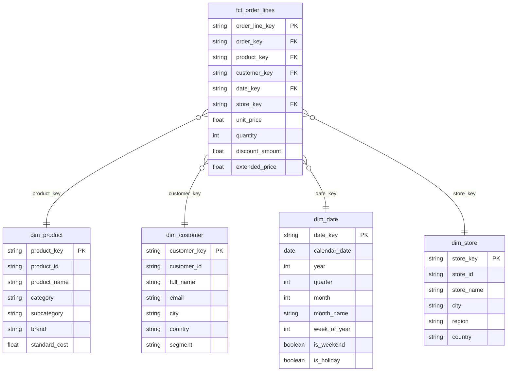
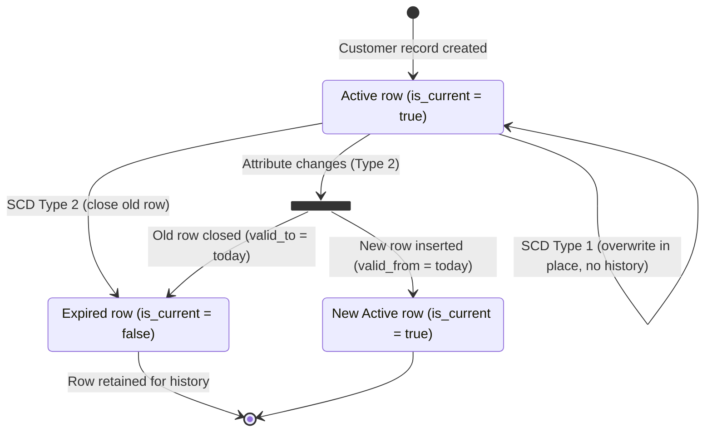
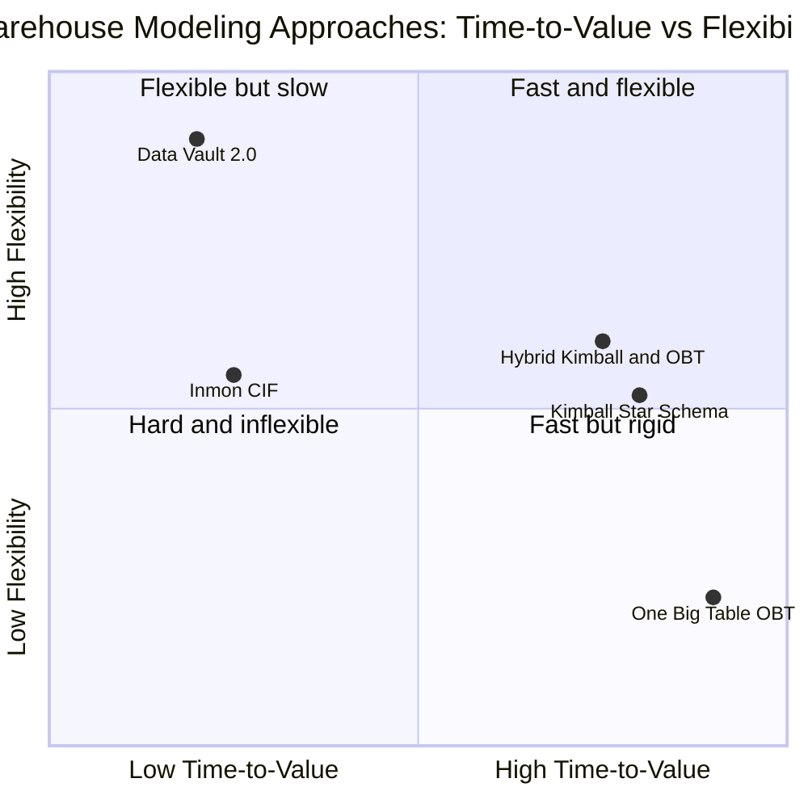

# Dimensional Modeling: The Kimball Method for Analytical Data Warehouses

## The Query That Started It All

Imagine you inherit a data warehouse. The pipelines are clean, the data is accurate, it lands on time every morning. You open the BI tool and click the revenue dashboard.

Forty-five seconds later, three numbers appear.

You look at the query. It joins nine tables. It scans four hundred million rows. It filters, aggregates, and re-joins in ways that make the query planner emit what can only be described as a cry for help. The data is there. The model is the problem.

This is the situation Ralph Kimball built his methodology to solve. In the 1990s, he observed that analytical queries — the ones that answer "how much did we sell, to whom, where, and compared to last year?" — have a fundamentally different shape than transactional queries. Transactional databases are normalized to minimize redundancy and ensure write integrity. Analytical queries need the opposite: denormalized, intuitive structures optimized for aggregation, slicing, and exploration.

Kimball's answer was the **dimensional model** — a design philosophy built around two types of tables (facts and dimensions), one critical decision (the grain), and a deceptively simple visual structure (the star schema). Three decades later, it remains the dominant approach for analytical data warehouse design, implemented today in BigQuery, Snowflake, Databricks, and Redshift by teams using dbt.

This post covers everything: the four-step design process, fact and dimension table patterns, slowly changing dimensions (all six types), the bus matrix, and how it all maps to a real dbt project. We also cover the honest weaknesses of Kimball and when you should reach for something else.

The post assumes you have read [Data Engineering Fundamentals](/blog/data-engineering-fundamentals) and are comfortable with SQL. No prior data warehousing experience required.

---

## The Four-Step Kimball Design Process

Every dimensional model begins with four decisions, in this exact order. Skipping any step — especially step two — produces a model that will need to be rebuilt.

### Step 1: Select the Business Process

A business process is a measurable event that the organization performs. Examples:

- A sale is completed
- An order is shipped
- A customer logs in
- A support ticket is resolved
- An ad impression is served

One business process becomes one fact table. The mistake teams make is modeling the *data source* instead of the business process — building a fact table that mirrors a transactional table in the source system, rather than one that answers analytical questions about a business event.

**Rule:** One business process. One fact table. One grain.

### Step 2: Declare the Grain

The grain is the most important decision in dimensional modeling. It defines exactly what one row in the fact table represents. Everything else flows from this.

> *"The grain establishes exactly what a single fact table row represents. The grain must be declared before choosing dimensions or facts." — Kimball & Ross, The Data Warehouse Toolkit (3rd ed., 2013)*

A well-declared grain is atomic and specific:
- **Good grain:** One line item on one order, at the time of order placement
- **Vague grain:** "Order data" (ambiguous — one row per order? per product? per shipment?)

The grain determines what you *cannot* answer from the fact table without building a different one. If your grain is "one order line," you cannot get the total time an order spent in each warehouse directly from that fact table — that requires a different process (order fulfillment tracking) with a different grain.

**Rule:** Declare the grain in one sentence before writing a single column. When in doubt, choose the most atomic grain available. You can always aggregate up; you can never disaggregate down.

### Step 3: Choose the Dimensions

Given the grain, dimensions are the "who, what, where, when, why, and how" context of each fact row. For an order line grain:

- **Who:** Customer, salesperson
- **What:** Product
- **Where:** Store, shipping address
- **When:** Order date, ship date
- **How:** Payment method, sales channel

Dimensions are the things you filter by, group by, and pivot on in analytics queries. A good set of dimensions lets a business user answer any relevant question without custom SQL.

### Step 4: Identify the Facts

Facts are the numeric measurements captured at the declared grain. For an order line:

- `unit_price` — price at time of sale
- `quantity` — units ordered
- `discount_amount` — discount applied
- `extended_price` — unit_price × quantity

Every fact must be true at the declared grain. If a measurement only exists at a different grain (say, the total order level), it does not belong in an order-line fact table. Put it in its own fact table or aggregate up in a mart.

---

## Anatomy of a Star Schema

The output of the four-step process is a star schema: a central fact table connected by foreign keys to a set of dimension tables. The result literally looks like a star.

Here is a concrete example for an e-commerce orders model:



The fact table contains measurements and foreign keys — and nothing else. All descriptive context lives in the dimension tables. This is what makes star schemas fast: for most analytical queries, you only need to join the one or two dimensions you're filtering on, not all of them.

---

## Fact Table Types

Not all business processes produce the same kind of fact. Kimball identifies three fact table types, each matching a different pattern of measurement.

### Transaction Fact Tables

The most common type. Each row records a discrete event at a point in time.

- One row per order line, per ad click, per payment, per log entry
- Events are immutable — once written, they don't change
- Supports unlimited historical analysis

```sql
-- fct_order_lines: one row per order line item
select
    order_line_key,
    order_key,
    product_key,
    customer_key,
    order_date_key,
    unit_price,
    quantity,
    extended_price
from {{ ref('int_order_lines_enriched') }}
```

### Periodic Snapshot Fact Tables

Each row captures the state of something at a regular interval (end of day, end of month).

- One row per account per day, per product per week
- Rows are written even when nothing changed — the absence of a transaction is itself information
- Used for inventory levels, account balances, customer lifetime value

```sql
-- fct_daily_inventory: one row per product per day
select
    date_key,
    product_key,
    warehouse_key,
    units_on_hand,
    units_on_order,
    reorder_point,
    days_of_supply
from {{ ref('int_inventory_daily_snapshot') }}
```

### Accumulating Snapshot Fact Tables

Each row tracks the complete lifecycle of a process that has a known start and end (an order fulfillment pipeline, a loan application, a support ticket).

- One row per order, updated each time the order advances through a stage
- Contains multiple date foreign keys: order_date, confirmed_date, shipped_date, delivered_date
- "Lag" columns (days from order to ship) are computed at query time or materialized

```sql
-- fct_order_fulfillment: one row per order, updated in place
select
    order_key,
    customer_key,
    order_date_key,
    confirmed_date_key,
    shipped_date_key,
    delivered_date_key,
    days_to_confirm,
    days_to_ship,
    days_to_deliver,
    current_status
from {{ ref('int_order_fulfillment_pipeline') }}
```

### Fact Additivity

A critical property to understand before choosing aggregations:

| Type | Example | Can SUM across | Cannot SUM across |
|---|---|---|---|
| **Fully additive** | Revenue, quantity | Time, product, customer, store | Nothing |
| **Semi-additive** | Account balance, inventory | Product, store | Time (daily balance ≠ sum of balances) |
| **Non-additive** | Ratio, percentage, rate | Nothing directly | Any dimension |

Semi-additive and non-additive facts require explicit handling in your BI tool or SQL. An `AVG` or `LAST_VALUE` over time is often the correct aggregation for balance-type facts.

---

## Dimension Table Patterns

Dimensions contain the descriptive context that makes facts meaningful. Several patterns come up repeatedly.

### Conformed Dimensions

A dimension used by multiple fact tables in the same warehouse. `dim_customer`, `dim_date`, and `dim_product` are classic examples — the same physical tables, referenced from multiple fact tables with the same keys.

Conformed dimensions are what make cross-process analysis possible. If `fct_orders` and `fct_support_tickets` both reference the same `dim_customer`, you can join them to ask: "Do customers who raise more support tickets have higher churn?"

**This is the bus matrix.** (See the dedicated section below.)

### Degenerate Dimensions

A dimension that has no attributes — just an identifier. The order number is the classic example. The order number itself is a meaningful grouping key, but there is nothing else to say about it beyond what's already in the fact table.

Instead of creating a `dim_order` table with a single `order_id` column, Kimball prescribes storing the order number directly in the fact table as a degenerate dimension:

```sql
-- In fct_order_lines:
order_line_key,   -- surrogate key
order_number,     -- degenerate dimension: stored directly, no dim table
product_key,      -- FK to dim_product
...
```

### Junk Dimensions

Fact tables often have a collection of low-cardinality flags and status codes — `is_gift_wrap`, `order_channel`, `payment_method`, `promotion_applied`. Each individually has too few values to warrant its own dimension table, but together they add meaningful context.

A junk dimension consolidates these into a single table:

```sql
-- dim_order_flags: all combinations of low-cardinality attributes
select
    {{ dbt_utils.generate_surrogate_key([
        'is_gift_wrap', 'order_channel', 'payment_method', 'promotion_applied'
    ]) }} as order_flags_key,
    is_gift_wrap,
    order_channel,
    payment_method,
    promotion_applied
from (
    select distinct
        is_gift_wrap,
        order_channel,
        payment_method,
        promotion_applied
    from {{ ref('stg_orders') }}
)
```

This reduces the fact table from four flag columns to one `order_flags_key` foreign key.

### Role-Playing Dimensions

A single dimension table used multiple times in the same fact table, each time in a different role.

`dim_date` is the canonical example. An order fact might need three dates — order date, ship date, delivery date — all resolved against the same calendar dimension:

```sql
select
    f.order_line_key,
    order_date.calendar_date  as order_date,
    order_date.month_name     as order_month,
    ship_date.calendar_date   as ship_date,
    ship_date.is_weekend      as shipped_on_weekend,
    delivered_date.calendar_date as delivered_date
from fct_order_lines f
left join dim_date order_date     on f.order_date_key = order_date.date_key
left join dim_date ship_date      on f.ship_date_key = ship_date.date_key
left join dim_date delivered_date on f.delivered_date_key = delivered_date.date_key
```

One physical `dim_date` table, aliased three times. In your dbt schema tests, test the surrogate keys against the single canonical dimension — not three separate views.

---

## Slowly Changing Dimensions: When History Matters

Dimension attributes change. Customers move to different cities. Products are recategorized. Employees change managers. How you handle these changes determines whether your historical analysis is accurate or silently wrong.

Kimball defines six SCD types. In practice, Type 1 and Type 2 cover ninety percent of real cases.



### SCD Type 0 — Retain Original

The attribute never changes once set. Use for birthdates, original signup channel, first order date. Write once, never update.

### SCD Type 1 — Overwrite

Overwrite the attribute in place. No history is kept. The current value is always what matters.

```sql
-- Type 1: just update the row
update dim_customer
set city = 'Chicago'
where customer_id = 'CUST-001'
```

Use for corrections (fixing a misspelling), or when history genuinely doesn't matter (internal employee status for non-regulated reporting).

**Warning:** Type 1 silently corrupts historical analysis. If a customer moved from New York to Chicago and you apply Type 1, all their past orders will appear as Chicago orders. Use only intentionally.

### SCD Type 2 — Add a New Row

The workhorse. When an attribute changes, close the current row by setting `valid_to` and `is_current = false`, then insert a new row with the new value, `valid_from = today`, and `is_current = true`.

```sql
-- dim_customer with Type 2 columns
select
    customer_key,       -- surrogate key (changes with each version)
    customer_id,        -- natural key (stable across versions)
    full_name,
    city,
    country,
    valid_from,
    valid_to,           -- NULL or '9999-12-31' for current row
    is_current
from dim_customer
where customer_id = 'CUST-001'
```

| customer_key | customer_id | city | valid_from | valid_to | is_current |
|---|---|---|---|---|---|
| abc123 | CUST-001 | New York | 2022-01-15 | 2024-06-30 | false |
| def456 | CUST-001 | Chicago | 2024-07-01 | NULL | true |

This preserves full history. Orders placed before July 2024 join to the New York row; orders after join to Chicago.

In dbt, Type 2 is implemented with **snapshots**:

```yaml
# snapshots/snp_customers.yml
snapshots:
  - name: snp_customers
    relation: source('crm', 'customers')
    config:
      strategy: timestamp
      unique_key: customer_id
      updated_at: updated_at
      invalidate_hard_deletes: true
```

dbt manages `dbt_valid_from`, `dbt_valid_to`, and `dbt_scd_id` automatically.

### SCD Type 3 — Add a New Column

Add a "previous value" column alongside the current one:

```sql
-- dim_customer with Type 3
customer_id,
current_city,      -- current value
previous_city,     -- one version back
city_changed_date
```

Use when you only need one version of history (current + immediately prior), and when side-by-side comparison is more natural than row lookup. Rarely useful beyond two versions.

### SCD Type 4 — Mini-Dimension

When certain attributes change very frequently (income band, credit score tier, customer lifetime value bucket), separating them into a **mini-dimension** prevents the Type 2 table from exploding with rows.

The frequently-changing attributes move into a small `dim_customer_profile` table, joined separately from the stable `dim_customer` table.

### SCD Type 6 — Hybrid (1 + 2 + 3)

The name is a joke: 1 + 2 + 3 = 6. Combines all three approaches: add a new row (Type 2) AND overwrite a "current value" column on all historical rows (Type 1) AND add a "prior value" column (Type 3).

Useful when you want both full history (Type 2) and the ability to filter on current state without a complex join:

```sql
-- All orders attributed to current city, regardless of when placed
select * from fct_order_lines f
join dim_customer c on f.customer_key = c.customer_key
where c.current_city = 'Chicago'  -- hits all rows for this customer
```

---

## The Bus Matrix: Conformed Dimensions Across Processes

As your warehouse grows beyond one fact table, conformed dimensions are what hold it together. The **bus matrix** is the planning artifact that maps which dimensions are shared across which business processes.

A simple retail bus matrix:

| Dimension | Orders | Inventory | Returns | Marketing |
|---|---|---|---|---|
| Date | ✓ | ✓ | ✓ | ✓ |
| Customer | ✓ | | ✓ | ✓ |
| Product | ✓ | ✓ | ✓ | |
| Store | ✓ | ✓ | ✓ | |
| Promotion | ✓ | | ✓ | ✓ |

Every ✓ means that fact table uses that dimension with the same keys and definitions. This is what makes cross-process analysis work: "show me the return rate by product for customers who also responded to the Q4 promotion" becomes a straightforward join.

Building the bus matrix before writing any SQL forces you to align on definitions. If "customer" means different things in the orders system and the marketing system, you need to resolve that before writing `dim_customer`. The matrix surfaces that conflict early.

---

## Kimball vs Inmon vs Data Vault

These three approaches are not interchangeable, and choosing based on marketing materials leads to expensive rebuilds. Here is an honest comparison:



### Inmon (Top-Down)

Bill Inmon's approach builds a normalized Enterprise Data Warehouse (EDW) first — a single, fully integrated 3NF model that covers the entire organization — then derives department-specific data marts from it.

**Strengths:** Single source of truth with rigorous integration. Excellent for regulated industries where audits require tracing every number to its source. The EDW survives reorganizations and product changes because it models the business, not the reporting needs.

**Weaknesses:** First useful query takes months. Requires upfront modeling of the entire enterprise. Business users cannot easily read a normalized schema. Small teams rarely have the capacity for a true Inmon build.

**Use when:** You are in a regulated industry (banking, healthcare, insurance) where auditability matters more than time-to-insight, and you have the engineering capacity for a multi-year build.

### Data Vault 2.0

Developed by Dan Linstedt, Data Vault separates business keys (Hubs), relationships between them (Links), and descriptive attributes (Satellites). The raw vault loads source data with minimal transformation; a business vault layer applies rules; a presentation layer (often Kimball-style) delivers to consumers.

**Strengths:** Handles schema changes gracefully — a new attribute adds a Satellite, not a remodel. Full audit trail by design. Parallelizable loading. Genuinely handles the "we don't know the final schema" problem.

**Weaknesses:** High modeling overhead. Many tables, many joins. Requires tooling (dbt packages, AutomateDV) to be practical. Overkill for most teams under fifty engineers.

**Use when:** You have many source systems with constantly changing schemas, you need full historical auditability of source data, and you have engineers familiar with the methodology.

### Kimball (Bottom-Up)

Build dimensional models for specific business processes first. Conformed dimensions connect them over time. No central normalized layer required.

**Strengths:** First useful mart in days, not months. Business users can read star schemas without SQL expertise. Columnar warehouses (BigQuery, Snowflake) are highly optimized for star schema joins. The dbt ecosystem is built around Kimball conventions.

**Weaknesses:** Siloed origins can create integration debt if conformed dimensions are not planned. Historical analysis can require complex SCD Type 2 handling. Not ideal for the "store everything raw, figure out the model later" approach that Data Vault enables.

**Use when:** You need to deliver analytical value quickly, your business processes are relatively stable, and you have a team comfortable with dbt.

---

## Star Schema vs One Big Table in Modern Columnar Warehouses

The rise of columnar warehouses — BigQuery, Snowflake, Redshift, ClickHouse — has reopened the star schema vs OBT debate. Fivetran's benchmarks show OBT outperforms star schema by 25–50% on average across all three platforms, with BigQuery showing the largest gap (up to 49% faster on equivalent queries).

The argument for OBT is straightforward in a columnar world: joins are expensive even in columnar warehouses, and storage is effectively free. Why pay join cost every query when you can pre-join once during transformation?

**The case for star schema:**
- Dimension updates are cheap: one row updated in `dim_customer` propagates everywhere
- A customer moving from New York to Chicago requires updating one record, not rebuilding a table
- Schema changes (adding a dimension attribute) are non-breaking
- BI tools with semantic layers (dbt metrics, Looker LookML) work naturally with star schemas
- Easier to reason about, easier to test, easier to onboard new engineers

**The case for OBT:**
- Fastest query performance, especially for dashboards with heavy filtering
- Simpler for BI tools without semantic layers
- Fewer joins for analysts writing ad-hoc SQL

**The modern answer is hybrid**, as Brooklyn Data and others have documented: build a star schema as the canonical mart layer, then materialize OBT views or tables downstream for specific high-traffic dashboards.

```sql
-- consumption/wide_orders.sql: OBT built from the star
with f as (select * from {{ ref('fct_order_lines') }}),
     p as (select * from {{ ref('dim_product') }}),
     c as (select * from {{ ref('dim_customer') }}),
     d as (select * from {{ ref('dim_date') }})
select
    f.order_line_key,
    f.unit_price,
    f.quantity,
    f.extended_price,
    p.product_name,
    p.category,
    c.full_name     as customer_name,
    c.city          as customer_city,
    c.segment       as customer_segment,
    d.calendar_date as order_date,
    d.year          as order_year,
    d.month_name    as order_month
from f
left join p on f.product_key = p.product_key
left join c on f.customer_key = c.customer_key
left join d on f.date_key = d.date_key
```

Materialized as a table with `+materialized: table`, this OBT gets rebuilt on each dbt run from the star schema upstream. The star schema is the source of truth; the OBT is a performance artifact.

---

## Implementing Kimball in dbt

dbt is the natural implementation layer for Kimball models. The official dbt project structure maps directly onto the Kimball methodology.

### The Layer Convention

```
models/
├── staging/           # stg_: 1-to-1 with source tables, minimal transformation
│   ├── stg_orders.sql
│   ├── stg_customers.sql
│   └── stg_products.sql
├── intermediate/      # int_: joins and business logic, not yet Kimball-shaped
│   ├── int_order_lines_enriched.sql
│   └── int_customers_with_lifetime_value.sql
└── marts/             # fct_ and dim_: the dimensional model
    ├── fct_order_lines.sql
    ├── dim_customer.sql
    ├── dim_product.sql
    └── dim_date.sql
```

The three layers correspond to three levels of transformation:
- **Staging:** Cast types, rename columns to snake_case, apply basic filters. Never join across sources.
- **Intermediate:** Business logic — calculate lifetime value, flag high-value customers, enrich order lines with return data. Not yet user-facing.
- **Marts:** Kimball-shaped dimensional models, surrogate keys, documented and tested.

```mermaid
flowchart LR
    SRC["Source Systems\n(CRM, ERP, Events)"]

    SRC --> STG

    subgraph STG["Staging stg_"]
        S1["stg_orders"]
        S2["stg_customers"]
        S3["stg_products"]
    end

    STG --> INT

    subgraph INT["Intermediate int_"]
        I1["int_order_lines_enriched"]
        I2["int_customers_ltv"]
    end

    INT --> MART

    subgraph MART["Marts fct_ and dim_"]
        F1["fct_order_lines"]
        D1["dim_customer"]
        D2["dim_product"]
        D3["dim_date"]
    end

    MART --> OBT["Consumption\nOBT / wide tables"]
```



### Surrogate Keys

Every dimension table needs a surrogate key — a stable, synthetic primary key that is independent of the source system. This protects the warehouse from source system changes and enables SCD Type 2 (where the same natural key produces multiple rows with different surrogate keys).

Use `dbt_utils.generate_surrogate_key()`:

```python
-- dim_customer.sql
with source as (
    select * from {{ ref('stg_customers') }}
),

final as (
    select
        -- Surrogate key: hash of the natural key
        {{ dbt_utils.generate_surrogate_key(['customer_id']) }}
            as customer_key,

        -- Natural key: original identifier from source
        customer_id,

        -- Attributes
        first_name || ' ' || last_name as full_name,
        email,
        city,
        country,
        customer_segment,
        created_at

    from source
)

select * from final
```

For SCD Type 2, the surrogate key includes the version identifier — typically `dbt_scd_id` from a snapshot:

```python
-- dim_customer_scd2.sql (built from a snapshot)
with snapshot as (
    select * from {{ ref('snp_customers') }}
),

final as (
    select
        -- Surrogate key includes SCD version
        {{ dbt_utils.generate_surrogate_key(['customer_id', 'dbt_scd_id']) }}
            as customer_key,

        customer_id,
        full_name,
        city,
        country,

        -- SCD Type 2 metadata
        dbt_valid_from  as valid_from,
        dbt_valid_to    as valid_to,
        case
            when dbt_valid_to is null then true
            else false
        end             as is_current

    from snapshot
)

select * from final
```

### Testing the Model

Every surrogate key should have `not_null` and `unique` tests. Every foreign key in the fact table should have a `relationships` test:

```yaml
# marts/fct_order_lines.yml
models:
  - name: fct_order_lines
    columns:
      - name: order_line_key
        tests:
          - not_null
          - unique

      - name: product_key
        tests:
          - not_null
          - relationships:
              to: ref('dim_product')
              field: product_key

      - name: customer_key
        tests:
          - not_null
          - relationships:
              to: ref('dim_customer')
              field: customer_key

      - name: extended_price
        tests:
          - not_null
          - dbt_utils.accepted_range:
              min_value: 0
```

These tests run on every `dbt test` and catch referential integrity breaks before they reach dashboards.

---

## When Kimball Breaks Down

Kimball is not universally correct. Three situations where it struggles:

**1. Highly normalized source systems with many-to-many relationships.** A customer can belong to multiple segments; a product can appear in multiple categories; an order can be partially fulfilled across multiple warehouses. Bridge tables exist in Kimball to handle many-to-many, but they complicate the model significantly. If your domain is dominated by these relationships, the star schema's simplicity advantage erodes quickly.

**2. Rapidly changing schemas.** If your source systems add new entities and attributes every month, the overhead of maintaining conformed dimensions and re-running Type 2 snapshots accumulates. Data Vault handles this case better — a new Satellite can be added without touching existing models.

**3. "Raw data warehouse" as the primary artifact.** Some organizations want to store everything from source systems in its original form first, and decide the model later. Kimball requires upfront modeling decisions. If your data strategy is "land it all first, model on demand," a more schema-flexible approach (or just Parquet on object storage with Iceberg) may be more appropriate.

---

## Going Deeper

**Books:**

- Kimball, R. & Ross, M. (2013). *The Data Warehouse Toolkit: The Definitive Guide to Dimensional Modeling.* 3rd ed. Wiley.
  - The canonical reference. Chapters 1–3 cover the four-step process and fact/dimension fundamentals; Chapter 5 covers procurement and inventory patterns; Chapter 19 is the complete SCD reference. Read the first five chapters before anything else.

- Kleppmann, M. (2017). *Designing Data-Intensive Applications.* O'Reilly.
  - Chapter 3 covers storage engines and column-oriented storage — the "why" behind star schema performance in columnar warehouses. Essential context for understanding why BigQuery and Snowflake behave differently from Postgres on star schema queries.

- Linstedt, D. & Olschimke, M. (2015). *Building a Scalable Data Warehouse with Data Vault 2.0.* Morgan Kaufmann.
  - The counterargument to Kimball. Read this after The Data Warehouse Toolkit to understand when dimensional modeling is the wrong choice.

- Reis, J. & Housley, M. (2022). *Fundamentals of Data Engineering.* O'Reilly.
  - Chapter 9 on serving data covers dimensional modeling, OBT, and the query patterns that drive architecture decisions. Good bridge between pipeline design and warehouse modeling.

**Online Resources:**

- [The Kimball Group's Dimensional Modeling Techniques](https://www.kimballgroup.com/data-warehouse-business-intelligence-resources/kimball-techniques/dimensional-modeling-techniques/) — The official reference for every technique: conformed dimensions, SCD types, bridge tables, factless fact tables, and more. Authoritative and concise.

- [Building a Kimball Dimensional Model with dbt](https://docs.getdbt.com/blog/kimball-dimensional-model) — dbt Labs' practical tutorial implementing a full star schema (dim_product, dim_customer, fct_sales) with surrogate keys, schema tests, and YAML documentation.

- [How We Structure Our dbt Projects](https://docs.getdbt.com/best-practices/how-we-structure/1-guide-overview) — The official dbt best practices guide for the staging/intermediate/marts layer convention. Shows exact naming conventions, materialization strategies, and subdirectory structure.

- [Our Hybrid Kimball and OBT Approach](https://www.brooklyndata.co/ideas/2025/01/08/our-hybrid-kimball-and-obt-data-modeling-approach) — Brooklyn Data's argument for building star schemas as the canonical layer with OBTs downstream. One of the clearest articulations of the modern hybrid pattern.

**Videos:**

- ["Is Kimball Still Relevant in the Modern Data Stack?"](https://www.youtube.com/watch?v=3OcS2TMXELU) by Seattle Data Guy — A thorough walk-through of Kimball's core concepts with an honest assessment of where it fits and where it doesn't in modern cloud warehouses with dbt.

- ["Slowly Changing Dimensions in dbt"](https://www.youtube.com/watch?v=9kJgHuTPMXw) by dbt Labs (Coalesce) — Live implementation of SCD Type 2 using dbt snapshots, covering the timestamp and check strategies, edge cases with out-of-order records, and real production patterns.

**Academic Papers:**

- Kimball, R. (1996). ["Slowly Changing Dimensions."](https://www.kimballgroup.com/1996/02/slowly-changing-dimensions/) *DBMS Magazine.*
  - The original article where Kimball introduced the SCD taxonomy. Short and readable — the Type 1/2/3 distinction is explained in about three pages.

- Inmon, W.H. (2005). *Building the Data Warehouse.* 4th ed. Wiley. (Often cited as the Inmon "paper" but is a book — included here for the direct comparison to Kimball's approach.)

**Questions to Explore:**

- If the grain of a fact table is "one order line," can you answer the question "what is the average number of days between a customer's first and second order"? If not, what would you build?
- A customer's annual revenue tier (Bronze/Silver/Gold) changes quarterly. Should this be SCD Type 1 (always current tier), Type 2 (full history), or Type 4 (mini-dimension)? What does the answer depend on?
- Why does `dim_date` not need SCD handling, while `dim_customer` usually does?
- At what point does maintaining conformed dimensions across twenty fact tables become more expensive than just building a Data Vault? What are the organizational signals that you've crossed that threshold?
- Modern BI tools (Tableau, Looker, Power BI) have semantic layers that can hide join complexity from end users. Does this eliminate the performance advantage of star schemas, or does the advantage still hold at the warehouse layer?
