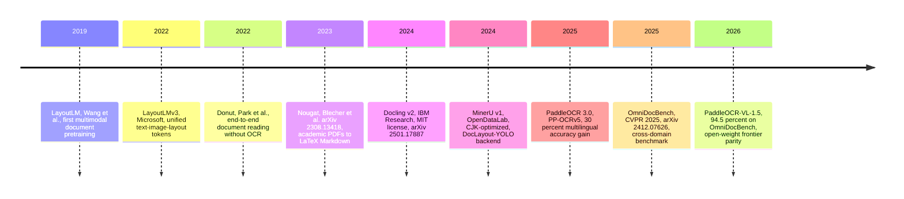
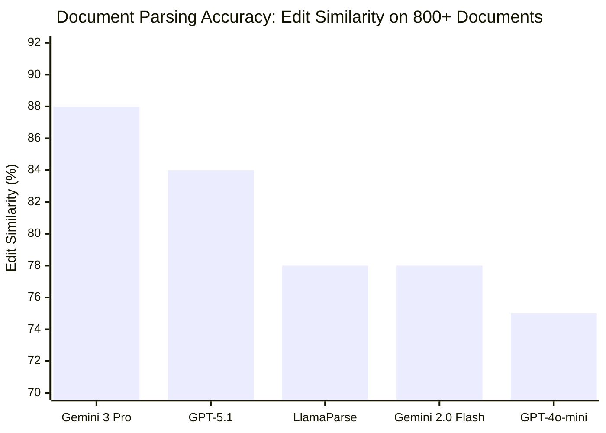
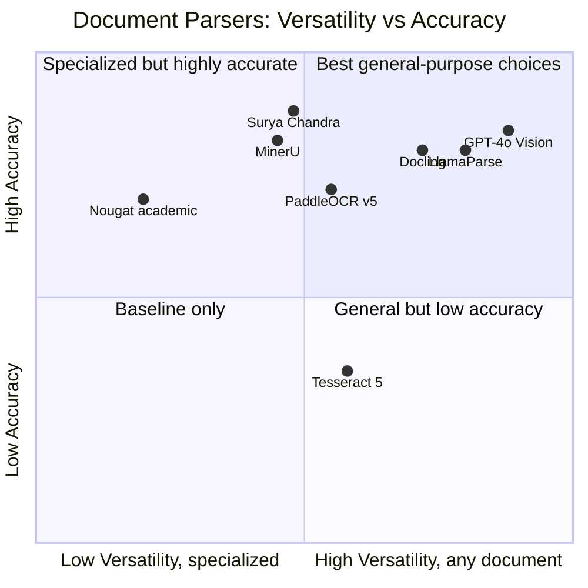
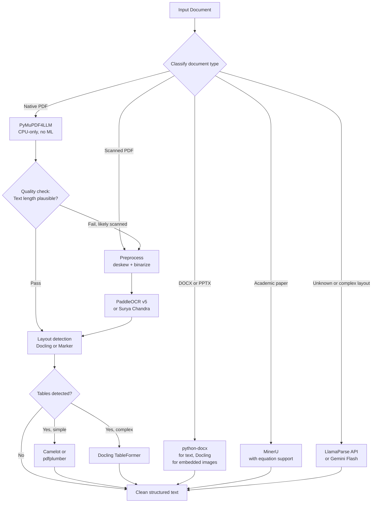

# Document Processing: OCR, Layout Detection, and the Path to Clean Text

Here is the part of every RAG tutorial that gets one sentence: "load your documents." Here is what that sentence actually means in production.

You have a 40-page PDF that is a scan of a paper document. The pages are skewed two degrees. Page 7 has a coffee stain. Page 12 has a three-column layout. Pages 24–27 contain a table that spans pages, with merged header cells. Page 31 is a photograph of a whiteboard. The document also has a cover page that is native PDF — embedded text, no scan — and six pages of appendices in a different font with a watermark.

Your RAG pipeline will be wrong on all of it if you do not handle each case explicitly. Most pipelines do not.

This post is the complete treatment of document processing — everything that happens between receiving a file and having clean, structured text ready for chunking. We will cover the full stack: input classification, image preprocessing, OCR engines, layout detection, full-pipeline parsers, table extraction, commercial APIs, vision LLMs, and the benchmarks that let you compare options objectively. The next post covers chunking strategy; this one stops at clean text.

---

## Know Your Input: The Document Taxonomy

The single most important decision in document processing is classifying what you have before applying any tool. The right approach for a native PDF is wrong for a scanned PDF, and both are wrong for a PPTX.

**Native/digital PDFs** embed a character map and font data. You can extract text directly — no OCR, no ML, no GPU. PyMuPDF (`pip install pymupdf`) returns exact text in microseconds. The challenge is that digital PDFs have no obligation to store text in reading order. A two-column layout may interleave characters from both columns. Ligatures and non-standard encodings break copy-paste. The text is there; the structure is not.

**Scanned PDFs** are images of paper, wrapped in a PDF container. There is zero embedded text. Every character must be inferred by a model reading pixels. Add physical degradation: ink bleed, coffee stains, punch holes punched through text, documents photocopied from documents that were photocopied from the original. A 200 DPI scan loses meaningful accuracy compared to 300 DPI — the optical resolution matters before any algorithm touches it.

**Mixed PDFs** alternate between native and scanned pages. A corporate annual report might have native-PDF financial tables and scanned exhibits. You must classify each page individually before routing it to the appropriate processing path.

**Office formats** (DOCX, PPTX, XLSX) are ZIP archives of XML. `python-docx` and `openpyxl` parse them directly, but three things will break your extraction: embedded images that contain critical content not present in any XML node (charts, diagrams, infographics); XLSX cells with formulas whose computed value is what you want, not the formula string; and DOCX tracked-changes markup that leaves both the original and the edit in the XML — a naive parser returns both.

**HTML and web content** requires a headless browser to render JavaScript before extraction, navigation and boilerplate stripping to remove what is not content, and paywall-awareness when a site returns a teaser page instead of the full article. Firecrawl, Jina Reader, and similar tools address this specifically.

The taxonomy drives the routing logic that every production pipeline must implement. Get this wrong at the start and every subsequent step operates on garbage input.

---

## Image Preprocessing: Before OCR Starts

If you pass a skewed, low-contrast, noisy image directly to an OCR engine, the engine works harder and produces worse results. Preprocessing is cheap and its returns are high. Research on unprocessed poor-quality scans shows accuracy can drop below 70%; proper preprocessing on the same scans recovers 15–20 percentage points.

### Deskewing

Documents placed on flatbed scanners are rarely perfectly aligned. Even a 2–3 degree rotation degrades OCR accuracy measurably. The standard OpenCV approach detects the dominant angle and corrects it:

```python
import cv2
import numpy as np

def deskew(image: np.ndarray) -> np.ndarray:
    gray = cv2.cvtColor(image, cv2.COLOR_BGR2GRAY)
    # Threshold to isolate text blobs
    _, thresh = cv2.threshold(gray, 0, 255, cv2.THRESH_BINARY_INV + cv2.THRESH_OTSU)

    # Find the minimum bounding box of all text pixels — its angle is the skew
    coords = np.column_stack(np.where(thresh > 0))
    angle = cv2.minAreaRect(coords)[-1]

    # minAreaRect returns angles in [-90, 0); normalize to [-45, 45)
    if angle < -45:
        angle = -(90 + angle)
    else:
        angle = -angle

    (h, w) = image.shape[:2]
    center = (w // 2, h // 2)
    M = cv2.getRotationMatrix2D(center, angle, 1.0)
    return cv2.warpAffine(image, M, (w, h),
                          flags=cv2.INTER_CUBIC,
                          borderMode=cv2.BORDER_REPLICATE)
```

For more complex cases — camera-captured documents with perspective distortion (not just rotation) — you need a four-point perspective transform. PaddleOCR's pipeline includes a `use_doc_unwarping` option that handles this automatically.

### Binarization

Converting a grayscale scan to black-and-white makes OCR faster and more accurate by eliminating the ambiguity of gray pixels. Two methods dominate:

**Otsu's method** computes a single global threshold that minimizes intra-class variance. It is fast and parameter-free, but fails when illumination is uneven — a dark shadow on one corner of a page will make the threshold wrong for that region.

**Sauvola's method** computes a local threshold for each pixel based on its neighborhood's mean and standard deviation. Benchmarked at **F1 = 0.938 on scanned documents** and **0.980 on camera-captured images**, it is the right choice for real-world documents:

```python
from skimage.filters import threshold_sauvola
import numpy as np

def binarize_sauvola(image: np.ndarray, window_size: int = 25, k: float = 0.05) -> np.ndarray:
    """
    window_size=25 and k=0.05 are the recommended values for scanned documents.
    For camera-captured images, k=0.04 tends to perform better.
    """
    gray = cv2.cvtColor(image, cv2.COLOR_BGR2GRAY)
    thresh = threshold_sauvola(gray, window_size=window_size, k=k)
    binary = (gray > thresh).astype(np.uint8) * 255
    return binary
```

### Denoising

For salt-and-pepper noise (isolated black pixels on a white background): a median filter preserves edges while removing noise. For more structured noise (scanner lines, background textures): morphological operations — opening (erosion then dilation) removes small noise blobs while keeping larger text structures.

```python
def denoise_document(binary: np.ndarray) -> np.ndarray:
    # Median filter for impulse noise — kernel size 3 is sufficient for most scans
    cleaned = cv2.medianBlur(binary, 3)

    # Morphological opening removes tiny blobs (noise) smaller than the kernel
    kernel = cv2.getStructuringElement(cv2.MORPH_RECT, (2, 2))
    return cv2.morphologyEx(cleaned, cv2.MORPH_OPEN, kernel)
```

The preprocessing pipeline is: load → deskew → binarize (Sauvola) → denoise → pass to OCR. On documents with known good quality (clean digital scans at ≥300 DPI), skip all three. On production ingestion of user-submitted documents, apply all three defensively.

---

## OCR Engines: The Character Recognition Layer

Once the image is clean, the character recognition step converts pixels to text. The landscape in 2026 has three tiers: traditional engines, modern deep learning OCR, and the new generation of full-page OCR models.

### Tesseract 5.5

The open-source standard. Current version: **5.5.1 (May 2025)**. Supports 100+ languages, Apache 2.0 license, CPU-only, no external ML dependencies. Works well on clean printed text at ≥300 DPI. The documented accuracy ceiling: **80–85% on real-world scanned documents**, with heavy sensitivity to preprocessing quality. No table structure detection, poor multi-column layout handling, and near-zero accuracy on handwriting.

Use Tesseract when you need an offline, dependency-free baseline. Do not use it as your production OCR without acknowledging its ceiling.

### PaddleOCR / PP-OCRv5

**PaddleOCR 3.0** was released May 2025 with the PP-OCRv5 model at its core. Paper: arXiv 2507.05595.

PP-OCRv5 is a 0.07B parameter model supporting 5 script types plus 40+ languages. On the OmniDocBench benchmark it achieves the highest average 1-edit-distance score — outperforming Gemini 2.5 Pro, GPT-4o, and Qwen2.5-VL on OCR accuracy — with a **13-point accuracy gain over PP-OCRv4** and **30%+ improvement on multilingual text recognition**. The January 2026 release added **PaddleOCR-VL-1.5** (0.9B vision-language model) achieving **94.5% on OmniDocBench v1.5**, surpassing frontier LLMs at a fraction of the inference cost.

```python
from paddleocr import PaddleOCR

# use_doc_orientation_classify=True handles page rotation automatically
# use_doc_unwarping=True corrects perspective distortion from camera capture
ocr = PaddleOCR(
    use_doc_orientation_classify=True,
    use_doc_unwarping=True,
    lang="en"
)

result = ocr.predict("document_page.jpg")
for block in result:
    print(block["rec_text"], block["rec_score"])  # text + confidence
```

PaddleOCR is the recommended open-source OCR choice in 2026 for anyone needing multi-language support or higher accuracy than Tesseract.

### Surya / Datalab Chandra

Surya (GitHub: `datalab-to/surya`) is an OCR, layout analysis, reading-order, and table recognition toolkit covering 90+ languages, maintained by Vikas Paruchuri at Datalab. The underlying model — **Chandra** (released October 2025) — drives three accuracy tiers in Datalab's commercial OCR service.

On Datalab's own ELO benchmark (5,005 documents across finance, healthcare, legal, research papers, textbooks, forms, and 8 language scripts):

| Model | ELO Score |
|---|---|
| Datalab Accurate (Chandra + enhancements) | 1798 |
| Datalab Balanced (Chandra) | 1638 |
| dots.ocr | 1489 |
| olmOCR 2 | 1387 |
| DeepSeek-OCR | 1336 |
| Tesseract 5 | ~1100 (estimated) |

Surya is the OCR backbone behind Marker (described below). As a standalone engine, it is the accuracy leader among open-weight models.

### Choosing an OCR Engine

| Situation | Recommended engine |
|---|---|
| Offline, CPU-only, English, clean scans | Tesseract 5.5 |
| Multilingual, mixed-quality, high accuracy | PaddleOCR 3.0 / PP-OCRv5 |
| Best possible open-weight accuracy | Surya / Chandra (via Marker) |
| GPU available, academic/scientific documents | MinerU with PaddleOCR backend |
| Maximum accuracy, API budget available | Datalab API or cloud provider |

---

## Full-Pipeline Parsers: Layout + OCR Combined

The shift in 2024–2025 was from treating OCR and layout detection as separate steps to using integrated systems that classify document elements (text block, table, figure, header, footnote), maintain reading order, and produce clean structured output in one pass. These tools are the right starting point for most production use cases.

The field has developed rapidly:



### Docling (IBM Research)

GitHub: `docling-project/docling` — 20K+ stars. Current version: **v2.5.2** (v2 released October 2024). MIT licensed. Paper: arXiv 2501.17887.

Docling's architecture has three pillars: configurable pipelines, parser backends (EasyOCR or Tesseract selectable), and the `DoclingDocument` data model — a structured semantic representation that preserves hierarchy (section → paragraph → sentence) rather than just flat text. Supported inputs: PDF, DOCX, PPTX, XLSX, HTML, images, EPUB.

The core AI components: an **RT-DETR layout detector** trained on DocLayNet (IBM's human-annotated cross-domain dataset) that classifies page elements into text, table, figure, header, footer, page number, and footnote; and **TableFormer**, a vision-transformer for table structure that handles borderless tables, complex merged cells, and header detection. TableFormer achieves **97.9% cell accuracy on complex tables** in the Procycons benchmark — versus 75% for Unstructured.io on the same test.

Processing speed benchmarks:
- x86 CPU: **3.1 sec/page**
- M3 Max SoC: **1.27 sec/page**
- Nvidia L4 GPU: **0.49 sec/page**

```python
from docling.document_converter import DocumentConverter

converter = DocumentConverter()
result = converter.convert("report.pdf")

# DoclingDocument preserves full hierarchy
doc = result.document
for element, level in doc.iterate_items():
    print(f"[{element.label}] {element.text[:80]}")

# Export to Markdown with structure
markdown = doc.export_to_markdown()
```

Docling is the recommended open-source choice for enterprise documents (financial reports, legal contracts, technical manuals) with complex tables. Its MIT license removes the licensing friction that affected earlier tools.

### Marker

GitHub: `datalab-to/marker` — 19K+ stars. Uses Surya OCR and Chandra layout detection internally. Inputs: PDF, DOCX, PPTX, XLSX, HTML, EPUB. Output: clean Markdown.

Processing speed: **~25 pages/second on an H100 in batch mode** — the highest throughput of any parser in this comparison. The `--use_llm` flag routes uncertain elements through a cloud LLM for accuracy improvement at additional cost, making Marker a hybrid pipeline when needed.

```python
from marker.converters.pdf import PdfConverter
from marker.models import create_model_dict

models = create_model_dict()
converter = PdfConverter(artifact_dict=models)

rendered = converter("document.pdf")
markdown_text = rendered.markdown
```

Marker is the best choice when throughput matters more than fine-grained structure control. For GPU-available batch processing of mixed document types, it is the fastest open-source option.

### MinerU

GitHub: `opendatalab/MinerU` — 30K+ stars (most starred of the parsers). Current version: **v2.7.6 (February 2026)**. Uses PaddleOCR as the OCR backend and **DocLayout-YOLO** for layout detection, achieving **77.6% mAP on academic paper layout** versus 52.8% for DocXchain on the same test.

MinerU's particular strengths: CJK (Chinese-Japanese-Korean) document processing, scientific papers with LaTeX equations (it produces LaTeX-formatted math output), and support for Chinese AI accelerators (Ascend, Cambricon) in addition to NVIDIA and AMD GPUs. It is the recommended choice for academic/scientific document pipelines and for teams operating in Chinese language environments.

### Nougat (Meta AI)

arXiv: 2308.13418. Architecture: Swin Transformer encoder + mBART decoder (Donut-based). Trained on arXiv and PubMed Central papers. The key innovation: end-to-end conversion of PDF pages directly to Markdown with **LaTeX math equations** — no separate OCR step, no layout detection step, just a vision transformer reading the page image and decoding semantic Markdown including `$$\frac{d}{dx}...$$` notation.

The weakness: Nougat hallucinates on documents outside its training distribution. Give it a financial report or a legal contract and expect degraded or nonsensical output. Use it only for scientific literature.

---

## Table Extraction: The Hardest Element

Tables are the most common source of extraction failure. The problem is structural: a table is not text — it is a two-dimensional semantic structure where the meaning of a cell depends on its row and column context. A parser that reads a table left-to-right-top-to-bottom returns a sequence of numbers with no structure. A RAG system chunking that sequence cannot answer "what was the Q3 revenue?" correctly.

Three categories of tools address this differently:

**Vision transformers for structure recognition** — TableFormer (IBM, integrated in Docling) achieves **93.6% average accuracy** across large diverse table banks and handles borderless tables and merged cells. TATR (Table Transformer by Microsoft, available as `microsoft/table-transformer-detection` on HuggingFace) is DETR-based, trained on PubTables-1M, and best for financial and scientific documents. Both require GPU for practical throughput.

**Rule-based native PDF extractors** — Camelot and pdfplumber work only on native PDFs with embedded text (no OCR), but are extremely precise when they apply. Camelot has two modes: Lattice (uses visible table borders — highly accurate when borders exist) and Stream (uses whitespace alignment — works for borderless tables in clean PDFs). pdfplumber offers finer spatial control. Benchmark: Camelot **73.0% average accuracy** on mixed table types; pdfplumber performs better on structured government/financial PDFs. Neither works on scanned documents.

**LLM-based extraction** — For complex tables that defeat structural models (deeply nested headers, footnoted cells, tables with prose in cells), passing the table image to a vision LLM with a structured output schema can outperform any deterministic approach. Cost: $0.001–0.010 per table page depending on the LLM.

```python
import pdfplumber

def extract_tables_from_native_pdf(pdf_path: str) -> list[list[list[str | None]]]:
    """
    Extracts tables as nested lists. Returns one list per page, each containing
    a list of tables, each table being a list of rows.
    """
    tables_by_page = []
    with pdfplumber.open(pdf_path) as pdf:
        for page in pdf.pages:
            page_tables = page.extract_tables()  # list of table matrices
            tables_by_page.append(page_tables)
    return tables_by_page
```

The practical decision: Docling's TableFormer is the default for production pipelines requiring high table accuracy. Camelot/pdfplumber are good for native-PDF-only pipelines where the table borders are reliable. LLM extraction is the fallback for high-value documents where a few failures are unacceptable.

---

## Cloud APIs and Commercial Options

Self-hosted parsers require GPU infrastructure, model management, and engineering time. Commercial APIs trade these for per-page cost. The right choice depends on volume and the value of the documents being processed.

### LlamaParse (LlamaIndex)

Pricing: **1,000 pages/day free**, then **$0.003/page** ($3 per 1,000 pages). New accounts: 10,000 free credits.

From the Applied-AI benchmark of 800+ documents across 7 frontier parsers: LlamaParse achieves **78% edit similarity** and **81% ChrF++ robustness** (the best ChrF++ score of all tested parsers). Processing time: **~6 seconds regardless of document size** due to cloud parallelism — a 1-page and a 50-page document both process in ~6 seconds. This makes LlamaParse the best cost/quality option for moderate volumes where API latency is acceptable.

### Unstructured.io

Open-source ETL for 65+ file types, with a cloud API. Pricing: per-page, with free tier. Benchmark (Procycons): **75% cell accuracy on complex tables**, 141 seconds for 50 pages. Strong on OCR, weak on table structural fidelity. The enterprise plan includes scheduled workflows and per-document routing intelligence. Good for teams that need a managed solution and can tolerate the table extraction limitations.

### AWS Textract

Pricing:
- Detect Text (raw OCR): **$1.50/1,000 pages** (first 1M pages), then **$0.60/1,000 pages**
- Analyze Document (tables + forms + queries): **$15–$65/1,000 pages** depending on features

AWS Textract is a natural choice for AWS-native stacks. The 2026 updates improved accuracy on rotated text and low-resolution faxes. At high volume (200K+ pages/month), negotiated pricing reduces these rates significantly.

### Azure Document Intelligence

Pricing: **$10 per 1,000 pages** for the Prebuilt Layout model. Higher than Textract for raw OCR, but the Layout model returns rich structural information (reading order, table structure, selection marks) that Textract's basic tier does not. Native integration with Azure AI Foundry and Azure OpenAI makes it attractive for teams already in the Microsoft stack.

### Google Document AI

**$1.50–$50 per 1,000 pages** depending on processor type (OCR, Form Parser, Document OCR). Industry-specific processors (invoices, receipts, contracts) have strong out-of-the-box accuracy for their target document types. Volume pricing drops to ~$0.60/1,000 pages for basic OCR at scale. Native GCP integration makes it the default for GCP-based knowledge pipelines.

### Cost at Scale

At 1 million pages per month, the economics diverge significantly:

| Approach | Monthly cost at 1M pages | Notes |
|---|---|---|
| AWS Textract (basic OCR) | ~$1,500 | First 1M pages at standard rate |
| Google Document AI OCR | ~$1,500 | Volume pricing |
| LlamaParse | ~$3,000 | $3/1,000 pages |
| Azure Document Intelligence Layout | ~$10,000 | $10/1,000 pages |
| Self-hosted Docling (L4 GPU) | ~$200–500 | Infrastructure only |
| Self-hosted MinerU | ~$200–500 | Similar infrastructure |

The self-hosted crossover point is roughly **$2,000–3,000/month in API costs** — below that, the engineering overhead of running your own GPU infrastructure exceeds the cost savings. Above that, self-hosting compounds.

---

## When to Use Vision LLMs

Vision LLMs approach document parsing as a **contextual understanding task** — they know that the number below "Total Amount Due" is what you owe — whereas traditional OCR is a **character recognition task** that sees the number without the context.

Current top accuracy on DocVQA: Qwen2.5 VL 72B Instruct at **96.4%**, with LandingAI's agentic pipeline achieving **99.16%** using multi-step verification. On the Applied-AI benchmark with real-world documents, frontier LLMs score:



Critically: **GPT-4o-mini achieves 75% text accuracy but only 13% tree similarity** (structural fidelity). For RAG, structural preservation matters as much as text accuracy — a parser that extracts the right words in the wrong hierarchy creates malformed chunks.

**Use traditional parsers (Docling/MinerU/Marker) when:**
- Volume is high (>10,000 pages/day)
- Documents have consistent layouts (invoices, forms, reports from known sources)
- Latency requirements are strict (<2 seconds/page)
- Budget is constrained or the deployment environment is air-gapped

**Use vision LLMs when:**
- Documents have unpredictable or highly variable layouts
- Complex tables consistently defeat structural parsers
- Rapid development with prompt tuning is preferable to infrastructure setup
- Volumes are moderate and per-document value is high
- The task requires contextual interpretation ("what is the contract expiry date?")

**Use a hybrid pipeline when:**
- A deterministic parser handles the 80% of documents that process cleanly
- A VLM resolves only the elements where the deterministic parser signals low confidence
- The hybrid achieves better cost/accuracy than either approach alone

---

## Benchmarks: How to Compare Options

The current state of document parsing benchmarks is informative but requires calibration.

**OmniDocBench** (arXiv 2412.07626, CVPR 2025) — the most rigorous cross-domain benchmark as of 2026. Covers 9 document categories (academic papers, textbooks, slides, financial reports, newspapers, handwritten notes, exam papers, magazines, research reports), 19 layout categories, 15 attribute labels. Current SOTA: PaddleOCR-VL-1.5 at **94.5%**, GLM-OCR at **>94%**, Gemini 3 Pro at **90.3%**. Note: LlamaIndex has called OmniDocBench "saturated" for frontier models — SOTA scores are high enough that it no longer discriminates well between the best systems.

**DocVQA** — 50,000+ question-answer pairs over 12,000+ document images. SOTA at 96.4% (Qwen2.5 VL 72B). Approaching saturation. Useful for comparing OCR+understanding capabilities, not parsing pipeline quality.

**PubLayNet** — 360,000+ academic paper pages, 5 element categories. SOTA: **97.3% AP** with DETR-based models. Largely solved for academic papers; models trained here generalize poorly to business documents.

**DocLayNet** (IBM) — 6 diverse document categories (Financial Reports, Scientific Articles, Patents, Tenders, Laws, Manuals). More challenging: models typically see a **10–20 mAP drop** moving from PubLayNet to DocLayNet, exposing how much PubLayNet-trained models rely on academic paper formatting conventions.

**Applied-AI benchmark (800+ documents)** — The most practically useful for RAG pipeline selection. Covers real-world diversity across document types and measures both text accuracy (edit similarity) and structural fidelity (tree similarity). The key finding: **domain variance within a document type exceeds variance between parsers**. Legal contracts span a 40-point accuracy gap between best and worst parsers; academic papers span 52 points. This means document-type-specific routing matters more than picking the globally best parser.

The positioning of current tools across versatility (handles diverse document types) and accuracy:



---

## Building a Production Routing Pipeline

No single parser handles all document types optimally. A mature production pipeline classifies incoming documents and routes each to the appropriate parser — then applies a quality check to catch failures before they reach downstream components.



The quality check after native PDF extraction is critical: a mixed PDF that routes to the native extractor will return nearly empty text for scanned pages, which is detectable by checking expected character count versus actual extracted length. Anything below ~50 characters per page is suspicious and should re-route to the OCR path.

```python
from pathlib import Path
import pymupdf4llm
import fitz  # PyMuPDF

def classify_pdf(pdf_path: str) -> str:
    """Classify a PDF as native, scanned, or mixed based on text density."""
    doc = fitz.open(pdf_path)
    text_densities = []

    for page in doc:
        text = page.get_text()
        # Chars per page: <50 suggests scanned, >200 suggests native
        text_densities.append(len(text.strip()))

    doc.close()

    native_pages = sum(1 for d in text_densities if d > 200)
    scanned_pages = sum(1 for d in text_densities if d < 50)
    total = len(text_densities)

    if scanned_pages / total > 0.8:
        return "scanned"
    elif native_pages / total > 0.8:
        return "native"
    else:
        return "mixed"


def extract_document(file_path: str) -> str:
    """Route document to appropriate parser based on type."""
    path = Path(file_path)
    suffix = path.suffix.lower()

    if suffix == ".pdf":
        doc_type = classify_pdf(file_path)

        if doc_type == "native":
            # PyMuPDF4LLM: CPU-only, fast, preserves Markdown structure
            return pymupdf4llm.to_markdown(file_path)

        elif doc_type == "scanned":
            # Full OCR pipeline via Docling
            from docling.document_converter import DocumentConverter
            converter = DocumentConverter()
            result = converter.convert(file_path)
            return result.document.export_to_markdown()

        else:  # mixed
            # Docling handles mixed PDFs natively — page-level strategy selection
            from docling.document_converter import DocumentConverter
            converter = DocumentConverter()
            result = converter.convert(file_path)
            return result.document.export_to_markdown()

    elif suffix in (".docx", ".pptx"):
        # Docling handles Office formats with embedded image extraction
        from docling.document_converter import DocumentConverter
        converter = DocumentConverter()
        result = converter.convert(file_path)
        return result.document.export_to_markdown()

    else:
        raise ValueError(f"Unsupported file type: {suffix}")
```

For scale, wrap this router in a task queue (Celery, Cloud Tasks) that processes documents asynchronously. The page-level classification and routing can be parallelized trivially — each page is independent.

**The quality gate** runs after extraction. The minimum check: is the extracted text long enough given the document's page count? A heuristic of 300 words per page (for English-language documents) catches catastrophic extraction failures. More sophisticated: run a fast language detection model to ensure the extracted language matches the expected language — OCR failures produce garbled character sequences that fool simple length checks but fail language detection.

---

## What This Means in Practice

Document processing is the foundation on which your entire knowledge pipeline rests. A retrieval system that produces wrong answers often has bad extraction at its root — the answer was in the document, but the parser scrambled it, dropped it, or merged it into an adjacent block with no structural context.

The decisions with the highest leverage:

**Invest in the routing layer first.** Knowing what you have before applying a tool is more impactful than optimizing any individual parser. A native PDF run through a heavy OCR pipeline wastes GPU. A scanned PDF run through PyMuPDF returns empty text silently.

**Pick Docling or MinerU as your default parser.** Both are MIT-licensed, production-grade, and handle the common cases well. Docling is stronger on enterprise documents with complex tables; MinerU is stronger on academic papers and CJK content. Both beat the legacy tools (Tesseract raw, pdf2text, PDFMiner) significantly.

**Use LlamaParse or a vision LLM as your escalation path.** For documents that defeat your deterministic pipeline — unusual layouts, handwritten annotations, extremely complex tables — the cloud API is the escape valve. At $0.003/page (LlamaParse), the cost of processing 1,000 difficult documents is $3.

**Table extraction needs explicit handling.** Do not assume your general-purpose parser handles tables correctly. Test with the specific table types in your corpus. For financial reports with complex merged headers, Docling's TableFormer is the right choice. For simple bordered tables in government PDFs, Camelot is faster and more predictable.

**Benchmark on your own documents.** The academic benchmarks (DocVQA, PubLayNet, OmniDocBench) measure general capability. Your corpus may be systematically different. The Applied-AI finding — that domain variance within a document type exceeds variance between parsers — means you need to measure on real samples from your target domain before committing to a tool.

---

## Going Deeper

**Books:**
- Antonacopoulos, A. & Bridson, D. (Eds.). (2023). *Document Analysis and Recognition — ICDAR 2023.* Springer LNCS.
  - The proceedings of the premier document analysis conference. The 2023 edition covers layout detection, table recognition, and historical document processing. Reading the short papers here gives a sense of where the open problems are: multi-page table extraction, handwritten text in mixed-mode documents, and domain transfer from academic to business layouts.
- Bhatt, C., Patel, P., & Bhattacharyya, T. (2022). *Intelligent Document Processing.* Wiley.
  - Practical treatment of the full IDP stack — classification, extraction, validation, integration. Written with enterprise automation in mind. Useful for framing document processing as a business process problem, not just an ML problem.
- Staar, P. et al. (2024). *Docling Documentation and Architecture Guide.* IBM Research Technical Report.
  - The companion technical reference to the arXiv paper. Covers the DoclingDocument data model, pipeline configuration, and backend selection in detail. Available on the Docling GitHub wiki.

**Online Resources:**
- [Docling Documentation](https://ds4sd.github.io/docling/) — The official IBM Research documentation. Start with the pipeline configuration guide and the DoclingDocument export formats. The backend comparison table is particularly useful for choosing between EasyOCR and Tesseract backends.
- [Datalab Benchmark](https://www.datalab.to/benchmark/overall) — The ELO-ranked OCR benchmark from the Surya/Marker team. The most up-to-date comparison of open-weight and commercial OCR models on diverse document types.
- [Applied-AI PDF Parsing Benchmark](https://www.applied-ai.com/briefings/pdf-parsing-benchmark/) — 800+ real-world documents, 7 frontier parsers, edit similarity and structural fidelity scores. The most practically useful benchmark for RAG pipeline selection.
- [OmniDocBench GitHub](https://github.com/opendatalab/OmniDocBench) — The CVPR 2025 benchmark codebase. The evaluation scripts let you run your own parser against the benchmark, which is more useful than reading published numbers.

**Videos:**
- [Docling: Open Source Document Conversion by IBM Research](https://www.youtube.com/watch?v=UYbV3QqZIa4) — IBM Research walkthrough of Docling's architecture, the TableFormer model, and the DocLayNet dataset. Covers the RT-DETR layout detector and how it was trained on diverse document categories.
- [Building Production Document Pipelines with Marker and Surya](https://www.youtube.com/watch?v=VqC3bMOKi4U) by Vikram Nair / Datalab — Walks through the Marker converter architecture, the Chandra OCR model, and how to configure the `--use_llm` hybrid mode for difficult documents.

**Academic Papers:**
- Blecher, L. et al. (2023). ["Nougat: Neural Optical Understanding for Academic Documents."](https://arxiv.org/abs/2308.13418) *arXiv 2308.13418*.
  - The end-to-end academic PDF parser. The architecture section on the Swin Transformer encoder and mBART decoder explains why this approach generalizes well within its domain but fails outside it — a useful lesson about training distribution and deployment distribution.
- Ouyang, L. et al. (2024). ["OmniDocBench: Benchmarking Diverse PDF Document Parsing with Comprehensive Annotations."](https://arxiv.org/abs/2412.07626) *CVPR 2025*.
  - The benchmark paper. Section 3 on the annotation schema (19 layout categories, 15 attribute labels) is valuable for understanding what "layout detection accuracy" actually measures. Section 5 on the failure mode analysis for each parser type is the most practically useful part.
- Auer, C. et al. (2024). ["Docling Technical Report."](https://arxiv.org/abs/2501.17887) *arXiv 2501.17887*.
  - The IBM Research paper describing Docling's architecture, training data, and benchmarks. Section 4 on the DocLayNet-based RT-DETR model and Section 5 on TableFormer accuracy are the key technical contributions.

**Questions to Explore:**
- The quality check after extraction (is the text length plausible?) is a heuristic. Could a lightweight ML model trained on extraction failures do a better job of detecting when a parser has silently failed — without requiring ground-truth text for comparison?
- PubLayNet-trained layout models drop 10–20 mAP when applied to DocLayNet. Is this purely a domain adaptation problem (different visual styles) or does it reflect a structural difference in how academic and business documents encode semantics into layout?
- Tables in documents encode information in a 2D structure that linearization destroys. If the next post in this series covers chunking, what is the right unit of text for a table cell — should it carry its row and column header context, and if so, how much?
- Vision LLMs achieve near-human accuracy on DocVQA but 13% tree similarity on structure extraction benchmarks. What would it take for an LLM-based approach to match the structural fidelity of a dedicated layout parser like Docling?
- As OmniDocBench approaches saturation for frontier models, what are the genuinely unsolved problems in document understanding? Handwritten text mixed with printed text, multi-page table continuation, infographics that encode information in spatial relationships — which of these represents the next meaningful benchmark gap?
