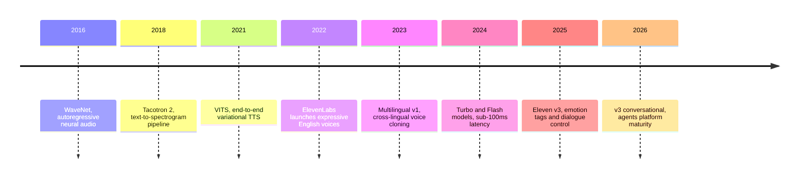
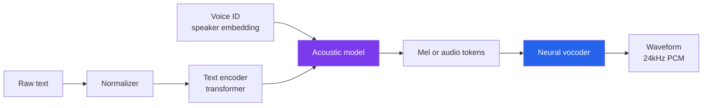
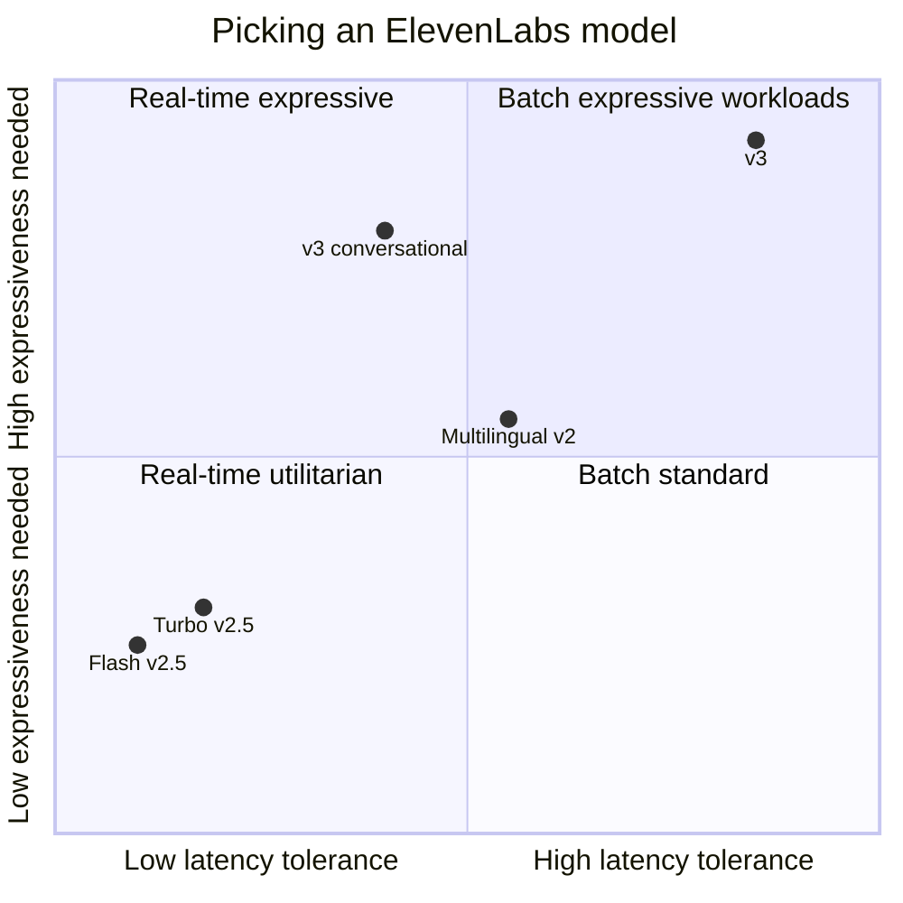
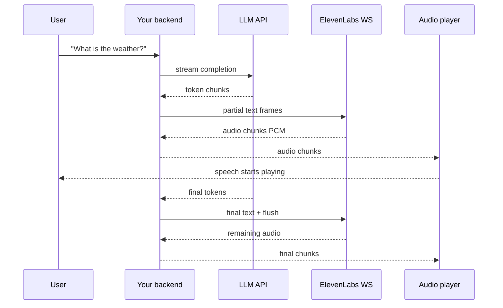

# ElevenLabs in Production: How Neural Voice Synthesis Actually Works

The first time I heard an ElevenLabs clone of my own voice, I stopped mid-sentence. Not because it was impressive — by 2026 that bar is low — but because it hesitated in exactly the wrong place, added a breath where I would have added a breath, and stumbled on a word I always stumble on. It didn't sound like a recording. It sounded like me trying to remember what I was about to say.

That's the unsettling part of modern voice synthesis. The tech crossed a threshold somewhere between 2023 and 2025 where the question stopped being "does it sound human?" and became "what do we do now that it does?" ElevenLabs is, for better or worse, the company that dragged the rest of the industry across that threshold. If you're building anything that talks — a voice agent, an audiobook pipeline, a dubbed video product, an accessibility tool, a game character — you will almost certainly run into them.

This post is a working engineer's guide. We'll cover how neural TTS actually works under the hood, the specific architecture choices ElevenLabs has made public, the model family and when to use each one, streaming and WebSocket APIs with runnable Python code, voice cloning (Instant vs Professional), production pitfalls around rate limits and cost, and the ethical and legal considerations that are not optional in 2026. By the end, you should be able to ship a voice feature with your eyes open.

## Why Voice AI Is Suddenly Hard to Ignore

Text-to-speech has existed since the 1960s. What changed recently is not the goal but the quality curve. For decades, TTS lived in three uncomfortable categories: robotic concatenative voices (think old GPS units), parametric voices that sounded like a ghost in a wind tunnel, and expensive custom voice-actor pipelines that took weeks to produce a single audiobook.

Neural TTS collapsed all three into a single API call. The shift happened in stages:

- **2016 — WaveNet** (DeepMind) proved autoregressive neural audio generation could sound natural.
- **2018 — Tacotron 2** (Google) decoupled text-to-spectrogram from spectrogram-to-audio, making the system trainable end-to-end.
- **2021 — VITS** unified the pipeline into a single variational model.
- **2022 — ElevenLabs launches**, betting that better data, better sampling, and expressive control could beat the incumbents.
- **2024 onwards** — diffusion-based vocoders, latent audio models, and instruction-tuned speech synthesis pushed quality past the point where most listeners could reliably tell AI from human in blind tests.

ElevenLabs' contribution was less about a single novel architecture and more about relentless focus on the parts that matter: expressiveness, cross-lingual transfer, low-latency streaming, and a developer experience that doesn't make you want to quit.

Here's the evolution as a quick visual.



## What's Actually Inside a Neural TTS Model

ElevenLabs' exact architecture is proprietary, but the broad strokes are public and match what the rest of the field does. Any modern neural TTS system has three jobs: understand the text, decide how it should sound, and produce the waveform.

### Stage 1, text understanding

The raw text is normalized (expanding abbreviations, numbers, dates), converted to phonemes or sub-word tokens, and fed through a text encoder — usually a transformer. The encoder's job is to turn "Dr. Smith earned $2.5M in 2026" into something the acoustic model can reason about: a sequence of linguistic units with stress, punctuation, and semantic hints. The hard parts are homographs ("read" past vs present), proper nouns, and code-switched languages mid-sentence.

### Stage 2, acoustic modelling

This is where ElevenLabs' magic lives. The acoustic model takes the encoded text plus a speaker embedding (the "who" — voice identity) and produces an intermediate audio representation, usually a mel-spectrogram or a sequence of discrete audio tokens from a neural audio codec. Three families dominate:

- **Autoregressive token models**, which treat audio as a sequence and predict one chunk at a time (good expressiveness, higher latency).
- **Non-autoregressive parallel models**, which predict the whole spectrogram in one shot (fast, sometimes robotic).
- **Diffusion / flow-matching models**, which iteratively denoise an audio latent (high quality, tunable compute/quality trade-off).

ElevenLabs has publicly hinted that their stack combines autoregressive planning with parallel synthesis for speed, and their Flash models clearly optimize for parallelism.

### Stage 3, the vocoder

Once you have a spectrogram or audio tokens, you still need a vocoder to turn them into actual 24 kHz or 44.1 kHz waveform samples. Modern systems use neural vocoders (HiFi-GAN, BigVGAN) or, increasingly, codec decoders that skip the spectrogram stage entirely.

The pipeline looks like this:



The parts you never see — text normalization and phoneme handling — are where most "weird pronunciation" bugs come from. The parts you feel — latency, emotional range, speaker identity — come from the acoustic model and the training data.

## The ElevenLabs Model Family

As of late 2026, ElevenLabs exposes several model IDs through the API, and picking the right one is the single highest-leverage decision you'll make. They trade off on the same three axes: quality, latency, and cost.

| Model ID | Best for | Latency | Languages | Relative cost |
|---|---|---|---|---|
| `eleven_v3` | Expressive long-form, audiobooks, narration | Higher, batch only | 70+ | Highest |
| `eleven_v3_conversational` | Voice agents needing expressiveness | Moderate | 70+ | High |
| `eleven_multilingual_v2` | Reliable cross-lingual workhorse | Moderate | 29 | Standard |
| `eleven_flash_v2_5` | Real-time agents, live captioning | ~75ms | 32 | Half of v2 |
| `eleven_turbo_v2_5` | Legacy low-latency use cases | ~150ms | 32 | Half of v2 |

Two things worth internalizing. First, Flash and Turbo charge **0.5 credits per character** compared to 1.0 for the v2 multilingual and v3 models — the cost difference compounds fast at scale. Second, ElevenLabs officially recommends Flash over Turbo in all use cases; Turbo exists for backwards compatibility. If you're starting fresh in 2026, never pick Turbo.

### Where each model actually fits

Think of your use case on two axes: how much expressiveness you need, and how tight your latency budget is. A real-time customer support agent cannot afford 800ms of first-audio delay. A pre-rendered audiobook absolutely can, and should spend that budget on warmth and pacing.



A quick heuristic that works most of the time: start with `eleven_flash_v2_5` for anything that touches real users in real time, and use `eleven_v3` for anything that's generated once and played many times.

## Prerequisites and Environment

Before any code, here's what you actually need on your machine or in your cloud environment to follow along.

**Account:** a free ElevenLabs account gives you 10,000 credits per month, roughly 10 minutes of audio with the multilingual v2 model or 20 minutes with Flash. That's enough to build and test a prototype end to end. You will need to upgrade to the Starter plan ($5/mo in 2026) the moment you want commercial rights — the free tier explicitly forbids monetization and requires attribution.

**API key:** grab it from `elevenlabs.io` → Profile → API Keys. Treat it like a password; a leaked key can burn your credits in minutes.

**Python environment:** Python 3.10+, a virtualenv, and the official SDK:

```bash
python -m venv .venv
source .venv/bin/activate   # on Windows: .venv\Scripts\activate
pip install "elevenlabs>=1.8" python-dotenv
```

**Audio playback (optional but useful):** the SDK's built-in `play` helper needs `mpv` or `ffmpeg` on the system path. On macOS `brew install mpv`, on Ubuntu `sudo apt install mpv`, on Windows install from `mpv.io` and add to PATH.

**Environment variable:** put your key in a `.env` file so it never touches git:

```
ELEVENLABS_API_KEY=sk_your_key_here
```

**Where to run:** nothing in this post needs a GPU. The heavy lifting happens on ElevenLabs' servers — you only need enough local compute to encode HTTPS requests and play audio. A laptop, a free-tier Colab, or a $5/mo VPS is more than enough. This makes ElevenLabs a genuinely accessible tool, in contrast to self-hosted TTS stacks that demand an A100 to run in real time.

## Hello, World: Your First Synthesis

The simplest thing that works: one string in, one MP3 out.

```python
import os
from dotenv import load_dotenv
from elevenlabs.client import ElevenLabs

load_dotenv()
client = ElevenLabs(api_key=os.environ["ELEVENLABS_API_KEY"])

audio = client.text_to_speech.convert(
    voice_id="JBFqnCBsd6RMkjVDRZzb",   # "George", a stock voice
    model_id="eleven_flash_v2_5",
    text="Hello from ElevenLabs. This is a live synthesis test.",
    output_format="mp3_44100_128",
)

with open("hello.mp3", "wb") as f:
    for chunk in audio:
        f.write(chunk)

print("wrote hello.mp3")
```

A few things worth noting even in this tiny example. The `convert` method returns a streaming iterator, not a single bytes object — you accumulate chunks as they arrive, which matters even for non-streaming use because it keeps memory flat for long inputs. The `voice_id` is a permanent identifier; stock voices like "George" are stable across the library. The `output_format` is explicit, and for anything going to a browser you'll want `mp3_44100_128`; for voice agents that need lower bandwidth, use `mp3_22050_32` or `pcm_16000`.

**Verify it works** by opening `hello.mp3` in any player. If you hear nothing, the usual culprits are a malformed API key (you'll get a 401 before synthesis even starts) or an out-of-credits account (you'll get a 402).

## Streaming: The Real Reason You're Here

Batch synthesis is fine for audiobooks. For anything interactive — chat agents, live captioning, game NPCs — the first-audio latency is what kills the experience. Users tolerate a 200ms delay. They notice 500ms. They hate 1s.

ElevenLabs exposes streaming in two flavors: **HTTP chunked streaming**, where you send one text blob and receive audio chunks as they're generated, and **WebSocket streaming**, where you feed text incrementally (ideal when your text itself comes from a streaming LLM).

### HTTP streaming

```python
from elevenlabs import stream
from elevenlabs.client import ElevenLabs
import os

client = ElevenLabs(api_key=os.environ["ELEVENLABS_API_KEY"])

audio_stream = client.text_to_speech.stream(
    voice_id="JBFqnCBsd6RMkjVDRZzb",
    model_id="eleven_flash_v2_5",
    text="Streaming lets you start playback before generation finishes.",
    output_format="mp3_44100_128",
)

stream(audio_stream)   # plays through mpv/ffmpeg as chunks arrive
```

First audio arrives in ~120-200ms with Flash v2.5 from a well-placed region. That's the difference between feeling alive and feeling broken.

### WebSocket streaming for LLM-coupled voice agents

The WebSocket API is where this gets interesting. Your LLM is probably already streaming tokens; you don't want to wait for the full response before starting TTS. You want to pipe LLM chunks straight into synthesis so audio starts while the model is still thinking.

Conceptually the flow is a two-layer streaming pipeline. The LLM streams tokens to your backend. Your backend buffers them into reasonable boundaries and forwards them to the ElevenLabs WebSocket. ElevenLabs streams audio chunks back. You forward those to the client for playback.



Here's a minimal end-to-end example. It's not production hardened, but it shows the shape.

```python
import asyncio
import json
import base64
import websockets
import os

VOICE_ID = "JBFqnCBsd6RMkjVDRZzb"
MODEL_ID = "eleven_flash_v2_5"
API_KEY = os.environ["ELEVENLABS_API_KEY"]

URI = (
    f"wss://api.elevenlabs.io/v1/text-to-speech/{VOICE_ID}"
    f"/stream-input?model_id={MODEL_ID}"
)

async def synthesize_streaming(text_chunks):
    async with websockets.connect(URI) as ws:
        # 1. session init: voice settings, generation params, auth
        await ws.send(json.dumps({
            "text": " ",
            "voice_settings": {"stability": 0.5, "similarity_boost": 0.8},
            "generation_config": {"chunk_length_schedule": [120, 160, 250, 290]},
            "xi_api_key": API_KEY,
        }))

        # 2. producer: forward text chunks as they arrive
        async def producer():
            for chunk in text_chunks:
                await ws.send(json.dumps({"text": chunk, "try_trigger_generation": True}))
            await ws.send(json.dumps({"text": ""}))   # EOS

        # 3. consumer: write incoming audio to disk as it streams
        async def consumer():
            with open("streamed.mp3", "wb") as f:
                async for message in ws:
                    data = json.loads(message)
                    if data.get("audio"):
                        f.write(base64.b64decode(data["audio"]))
                    if data.get("isFinal"):
                        break

        await asyncio.gather(producer(), consumer())

if __name__ == "__main__":
    fake_llm_output = [
        "ElevenLabs streaming is most useful ",
        "when your text source is itself a stream. ",
        "In that case, you do not want to wait ",
        "for generation to finish before playback starts.",
    ]
    asyncio.run(synthesize_streaming(fake_llm_output))
    print("wrote streamed.mp3")
```

A few subtleties here. `chunk_length_schedule` tells the server how many characters to buffer before committing to a generation boundary. Smaller values mean lower latency but worse prosody at boundaries; larger values sound better but delay first audio. The defaults (120, 160, 250, 290) are a reasonable starting point. `try_trigger_generation` nudges the server to start generating if the accumulated text has reached the next threshold. The final empty-text message is your signal that no more input is coming, which lets the server flush the last audio chunk cleanly.

**Verify it works** by playing `streamed.mp3`. If you want to actually hear it as it streams, pipe the decoded bytes into a process like `mpv --no-video -` instead of writing to a file.

## Voice Cloning: Instant vs Professional

ElevenLabs' second killer feature, and the one that deserves the most care, is voice cloning. There are two flavors.

**Instant Voice Cloning (IVC)** is the one most people mean when they say "voice clone." You upload 1–5 minutes of clean audio, wait a few seconds, and get back a voice ID you can use exactly like a stock voice. The cloning is zero-shot — it conditions the model on your samples without any fine-tuning. Quality is remarkable for the effort, but it's not indistinguishable from you, and it will drift on long passages or accents far from your training samples.

**Professional Voice Cloning (PVC)** is a different beast. You provide at least 30 minutes, ideally several hours, of high-quality studio audio across varied emotional registers. ElevenLabs actually fine-tunes a voice model on your data, which takes several hours and is only available on Creator plans and up. The result is dramatically closer to the source — good enough to ship as a narrator for a production audiobook series.

```python
from elevenlabs.client import ElevenLabs
import os

client = ElevenLabs(api_key=os.environ["ELEVENLABS_API_KEY"])

voice = client.voices.add(
    name="Narrator Alex",
    files=[
        open("samples/alex_reading_01.mp3", "rb"),
        open("samples/alex_reading_02.mp3", "rb"),
        open("samples/alex_reading_03.mp3", "rb"),
    ],
    description="Calm, mid-range male narrator for technical content.",
)

print("created voice_id:", voice.voice_id)
```

The usual pitfalls when cloning:

- **Noisy samples produce noisy clones.** The model learns everything — background hum, room echo, keyboard clicks. Record in a treated room or denoise aggressively before uploading.
- **One emotional register means one emotional range.** If you only upload calm reading, your clone will sound weird trying to be excited. Include varied samples if you want flexibility.
- **Consent is non-negotiable.** ElevenLabs' Terms of Service require that you have explicit consent from the voice owner, or that the voice is your own. There are automated verification steps (you may be asked to read a one-time phrase aloud to prove you control the voice). More on this below.

## Voice Settings: The Four Dials That Matter

Every synthesis call accepts a `voice_settings` object, and the defaults are rarely optimal. Four dials matter:

- **stability** (0.0–1.0): how much the voice varies between generations. Low stability means the model is freer to emote, which is great for narration and terrible for brand-consistent voice agents that need to sound the same every time. For agents, use 0.5 or higher. For audiobooks, try 0.3.
- **similarity_boost** (0.0–1.0): how hard the model tries to stay on-voice versus generalizing. High values preserve identity at the cost of occasionally amplifying artifacts from the training samples. 0.75 is a safe default.
- **style** (0.0–1.0, v2 and later): exaggerates the stylistic tendencies of the voice. Useful for characters, risky for utilitarian use. Leave at 0 unless you know why you're touching it.
- **use_speaker_boost** (bool): adds a post-processing pass that makes the voice more "present." Costs a few ms of latency. Turn on for long-form, off for real-time.

```python
audio = client.text_to_speech.convert(
    voice_id="JBFqnCBsd6RMkjVDRZzb",
    model_id="eleven_v3",
    text="Let's make this sound like an audiobook narrator.",
    voice_settings={
        "stability": 0.35,
        "similarity_boost": 0.75,
        "style": 0.15,
        "use_speaker_boost": True,
    },
)
```

If your output sounds monotone, lower stability. If it sounds drunk, raise it. If it sounds like a different person, lower similarity_boost. Iterate on a known test sentence — don't chase the dial with ever-changing inputs.

## Production Realities: Rate Limits, Retries, and Failure Modes

Getting a synthesis call to work in a notebook is the easy 20%. The other 80% is staying alive in production.

### Rate limits and concurrency

ElevenLabs enforces two distinct kinds of limits that return the same HTTP 429, and they require different mitigations. The error body tells you which one you hit:

- `too_many_concurrent_requests` — you exceeded your plan's concurrent-request ceiling. The Free and Starter plans cap at 2 and 3 concurrent requests respectively; Creator is 5, Pro is 10. Exponential backoff does not help here; the right fix is client-side queuing with a bounded semaphore.
- `system_busy` — the platform itself is congested. Exponential backoff with jitter is the correct response.

A production-grade retry wrapper:

```python
import asyncio
import httpx
import random

class ElevenClient:
    def __init__(self, api_key, max_concurrency=5):
        self._sem = asyncio.Semaphore(max_concurrency)
        self._headers = {"xi-api-key": api_key}
        self._http = httpx.AsyncClient(timeout=60.0)

    async def synthesize(self, voice_id, text, model_id="eleven_flash_v2_5"):
        async with self._sem:
            return await self._call_with_retries(voice_id, text, model_id)

    async def _call_with_retries(self, voice_id, text, model_id):
        url = f"https://api.elevenlabs.io/v1/text-to-speech/{voice_id}"
        payload = {"text": text, "model_id": model_id}
        for attempt in range(5):
            resp = await self._http.post(url, json=payload, headers=self._headers)
            if resp.status_code == 200:
                return resp.content
            if resp.status_code == 429:
                body = resp.json().get("detail", {})
                if body.get("status") == "too_many_concurrent_requests":
                    raise RuntimeError("concurrency ceiling hit; queue smaller")
                # system_busy: back off
                delay = min(2 ** attempt + random.random(), 32)
                await asyncio.sleep(delay)
                continue
            resp.raise_for_status()
        raise RuntimeError("exceeded retry budget")
```

Two things this wrapper gets right that most ad-hoc code misses. First, the bounded semaphore caps your in-flight requests below your plan's concurrency limit, so you never trigger the concurrent-request 429 in the first place. Second, it distinguishes the two 429 causes and only retries the one where retry makes sense.

### Failure modes worth knowing about

A non-exhaustive list of real gotchas that will eat your time if you don't know them ahead:

- **400 "invalid JSON" is usually unescaped characters in the text.** If your text comes from user input, always JSON-encode it through your HTTP library — don't build payloads by string concatenation.
- **401 means the API key is wrong or missing** — check whether you're passing it as the `xi-api-key` header; the SDK hides this but raw HTTP calls don't.
- **Credits are only deducted on successful generations.** A 400 or 500 does not cost you anything, so aggressive validation is free.
- **Per-request character limits depend on your plan.** Free is 500 characters per request, Starter is 5000, higher tiers go to 10000 and beyond. Long passages need to be chunked on sentence boundaries, not arbitrarily.
- **Homographs bite.** "I read the book" versus "I will read the book" — the model sometimes guesses wrong. If accuracy matters, use SSML-style phoneme hints or just rephrase.
- **Numbers and dates get localized.** "03/05" is March 5 in the US and May 3 in most of the world, and the model may pick wrong depending on voice locale. Spell ambiguous dates out.
- **Streaming WebSockets drop after ~20s of idle.** If your producer is slow, send keepalive whitespace or restructure to the multi-context WebSocket endpoint.

### Cost and credits

This is where teams get surprised. The credit math is simple but the compounding is not. At the 2026 rates:

| Model family | Credits per character | Approx $/1k chars (API) |
|---|---|---|
| Flash v2.5 / Turbo v2.5 | 0.5 | $0.06 |
| Multilingual v2 | 1.0 | $0.12 |
| Eleven v3 | 1.0 | $0.12 |

The average English sentence is ~75 characters. A 10-minute voice agent conversation might generate 15,000 characters of assistant output. On Multilingual v2 that's 15,000 credits per session. A Creator plan's 100,000 monthly credits disappears in **six such sessions**. If you're building a voice product, model your credit burn per session and pick the smallest model that gives you acceptable quality, then plan for overage pricing at scale.

A simple rule: if your agent is chatty, Flash cuts your bill in half and most users can't tell in blind tests.

## Ethics, Consent, and Why This Section Is Not Optional

I considered putting this section last because it's the least fun. Then I moved it up because shipping a voice product without thinking about it is irresponsible and, increasingly, illegal.

Voice cloning is one of the most potent deepfake vectors in existence. A few seconds of audio scraped from a podcast or a voicemail is enough to produce a clone good enough for a phone scam. Real attacks have already happened — executives tricked into authorizing wire transfers, families receiving fake ransom calls, political robocalls impersonating public figures. The 2024 US election saw multiple incidents of AI-cloned candidate voices used in voter suppression campaigns, and the 2025 EU AI Act explicitly categorizes certain synthetic audio applications as high-risk.

ElevenLabs has implemented several safeguards, and you should understand them because they shape what you can and can't build on the platform:

- **Explicit consent required.** The Terms of Service require that any cloned voice either belongs to you or has explicit permission from the voice owner. PVC goes further and requires verification — you or the voice owner reads a time-stamped phrase aloud to prove control.
- **No-go voices.** ElevenLabs maintains a blocklist of public figures (politicians, celebrities, heads of state) that the cloning pipeline actively rejects. The list expands around election cycles.
- **Automated moderation.** All generated audio is scanned for prohibited content categories. Violations can result in account suspension.
- **AI Speech Classifier.** A public tool where anyone can upload audio and get back a probability that it was generated by ElevenLabs. It's not perfect but it's a starting point for provenance disputes.
- **Watermarking research.** Inaudible watermarks are being embedded in generated audio to support downstream detection.

What this means for you as a builder:

1. **If you're cloning voices, get consent in writing and keep a record.** A signed release, an email chain, a recorded verbal consent — something. If the voice owner is a minor, get parental consent and check local regulations.
2. **Disclose synthetic audio where it matters.** For news, political content, or anything where the listener might reasonably assume it's a real person, say so. Many jurisdictions now require this by law — California's AB 730, the EU AI Act Article 50, China's deepfake provisions.
3. **Never use cloned voices for impersonation.** Even with consent from the voice owner, using a cloned voice to trick a third party (the classic "boss voice asking finance to wire money" scenario) is fraud.
4. **Protect your own voice assets.** If you've built a product around a cloned brand voice, treat the voice_id like a trade secret and the training samples like PII.

The ethics here are not about whether voice AI is "good" or "bad" — the technology exists and isn't going away. They're about whether the thing you're building adds value without enabling harm. Most voice agent products do. Most audiobook and dubbing products do. The edge cases that don't are usually obvious in hindsight; the trick is to see them in foresight.

## Where Flash Shines and Where It Breaks

Flash v2.5 is the model I reach for by default, so it's worth knowing its failure modes.

**It shines at:** short conversational turns, live captioning, real-time agents, game dialogue, accessibility tools, IVR replacements. Anything where the text is shortish and the listener is in the loop.

**It breaks at:** long-form narration with nuanced emotional beats, highly stylized characters, very slow or very fast pacing, dense technical terminology with uncommon pronunciations, and cross-lingual passages with rapid code-switching. For those, step up to Multilingual v2 or v3.

**A concrete heuristic I use:** if the generated passage is longer than ~3 sentences and the result will outlive the session (audiobook, video, recorded podcast), use v3. If it's a live reply that the user will hear once and move on, use Flash. Almost every decision I make falls into one of those two buckets.

## Alternatives Worth Knowing

This post is about ElevenLabs, but you should know what else exists so you can make informed trade-offs.

| Tool | Strengths | Weaknesses | When to pick |
|---|---|---|---|
| **ElevenLabs** | Best expressiveness, mature cloning, great DX | Most expensive, closed-source | Default for quality-first products |
| **OpenAI TTS** | Cheap, bundled with GPT API | Fewer voices, less expressive, no cloning | If you're already deep in OpenAI |
| **Google Cloud TTS** | Huge language coverage, enterprise SLAs | Robotic compared to neural competitors | Enterprise compliance needs |
| **Azure Speech** | Strong SSML support, good for IVR | Dated neural voices outside English | Microsoft-stack shops |
| **Cartesia (Sonic)** | Extremely low latency, open weights for some models | Smaller voice library | Real-time agents on tight budgets |
| **Coqui XTTS / F5-TTS** | Open source, self-hostable, no per-char fees | Needs your own GPU, lower quality ceiling | On-prem or privacy-critical use cases |

The open-source scene has gotten genuinely competitive. F5-TTS and XTTS produce decent clones from a few seconds of audio and run on a single consumer GPU. For projects where you cannot send customer voices to a third party — healthcare, legal, some government contracts — self-hosted is now a real option. For everything else, ElevenLabs' quality and operational simplicity still make it the default.

## A Minimal Voice Agent: Putting It All Together

Here's a small but complete example: a CLI that takes typed input, streams a reply from an LLM, and speaks it back through ElevenLabs as the reply streams. It's under 60 lines and demonstrates most of the patterns above.

```python
import os
import asyncio
import json
import base64
import websockets
from openai import AsyncOpenAI

EL_VOICE = "JBFqnCBsd6RMkjVDRZzb"
EL_MODEL = "eleven_flash_v2_5"
EL_KEY = os.environ["ELEVENLABS_API_KEY"]
EL_URI = (
    f"wss://api.elevenlabs.io/v1/text-to-speech/{EL_VOICE}"
    f"/stream-input?model_id={EL_MODEL}"
)

llm = AsyncOpenAI()

async def speak_llm_reply(user_text):
    async with websockets.connect(EL_URI) as ws:
        await ws.send(json.dumps({
            "text": " ",
            "voice_settings": {"stability": 0.5, "similarity_boost": 0.8},
            "xi_api_key": EL_KEY,
        }))

        async def producer():
            stream = await llm.chat.completions.create(
                model="gpt-4o-mini",
                messages=[{"role": "user", "content": user_text}],
                stream=True,
            )
            async for chunk in stream:
                delta = chunk.choices[0].delta.content or ""
                if delta:
                    await ws.send(json.dumps({
                        "text": delta,
                        "try_trigger_generation": True,
                    }))
            await ws.send(json.dumps({"text": ""}))

        async def consumer():
            with open("reply.mp3", "wb") as f:
                async for msg in ws:
                    data = json.loads(msg)
                    if data.get("audio"):
                        f.write(base64.b64decode(data["audio"]))
                    if data.get("isFinal"):
                        break

        await asyncio.gather(producer(), consumer())

async def main():
    while True:
        user = input("you: ").strip()
        if not user:
            break
        await speak_llm_reply(user)
        print("wrote reply.mp3 — play it to hear the response")

if __name__ == "__main__":
    asyncio.run(main())
```

What's interesting about this isn't the code itself — it's that both streams run concurrently. The LLM is still generating tokens while the user is already hearing the first sentence. The perceived latency from "hit enter" to "hear reply" is close to the LLM's own time-to-first-token, plus Flash's ~75ms synthesis delay. Under 300ms end to end on a good day. That's the threshold where voice stops feeling like a gimmick and starts feeling like conversation.

**Verify it works** by running the script, typing a question, and playing `reply.mp3`. For real-time playback, swap the file writer for a `sounddevice.OutputStream` writing decoded PCM directly.

## Honest Limitations

A few things ElevenLabs genuinely cannot do well as of late 2026, which are worth knowing before you over-commit:

- **Singing is not a product feature.** There's a separate experimental music endpoint, but general voice IDs will not convincingly sing, and trying will produce unsettling results.
- **Sound effects and non-speech audio are a separate model.** `sound-effects` is its own endpoint; don't try to coax them out of TTS.
- **Very long monologues drift.** Anything over ~5 minutes of continuous speech from a single request can lose consistency. Chunk long documents into scenes and preserve a consistent voice_id.
- **Non-Latin scripts work but pronunciation guarantees are weaker** than for English, Spanish, French, German, and a few others in the top tier. Test before shipping.
- **Latency from outside North America and Europe varies.** The WebSocket endpoint is anycast but synthesis happens in US/EU regions; plan for 100-200ms of added network RTT if your users are in Asia or South America.
- **Deterministic reproduction is not guaranteed.** Even with identical settings, the same text can produce slightly different audio across calls. If you need exact reproducibility, cache the output.

## Closing Thought

The most interesting thing about ElevenLabs isn't the tech — it's that we've reached a point where building something that talks naturally is a library-import away. A decade ago, an expressive voice actor for your product was a casting call, a studio, a pile of WAV files, and weeks of turnaround. Today it's an API key and a voice ID. The surface area of what individual builders can ship has expanded accordingly.

The tradeoff is that every product decision now carries weight it didn't have to before. Whose voice is this? Did they consent? Can someone clone it from our output? What happens when the listener can't tell they're talking to a machine? Those are not problems you can outsource to a vendor, no matter how good the safeguards are. They're problems you build into or out of your product before the first line of code.

Build thoughtfully. The rest is just API calls.

## Going Deeper

**Books:**
- Kreuk, F., & Taigman, Y. (2024). *Generative AI for Audio: Principles, Models, and Applications.* Cambridge University Press.
  - A rare technical textbook that covers the full generative audio stack, including TTS, music, and sound effects, with enough math to actually understand the trade-offs different architectures make.
- Taylor, P. (2009). *Text-to-Speech Synthesis.* Cambridge University Press.
  - Pre-neural but foundational. Reading it makes you appreciate how much of modern TTS is just better ways of doing things the field already knew were needed.
- Russell, S., & Norvig, P. (2020). *Artificial Intelligence: A Modern Approach* (4th ed.). Pearson.
  - Chapter 25 on natural language for speech remains the best textbook-level primer on why TTS is a sequence-to-sequence problem with extra steps.
- O'Neil, C. (2016). *Weapons of Math Destruction.* Crown.
  - Not about voice specifically, but the framework she provides for thinking about where AI systems cause measurable harm maps cleanly onto voice cloning ethics.

**Online Resources:**
- [ElevenLabs Official Docs](https://elevenlabs.io/docs/overview/intro) — The reference you'll actually come back to; keep the Models and Latency Optimization pages bookmarked.
- [ElevenLabs Changelog](https://elevenlabs.io/docs/changelog) — Updated weekly; the fastest way to know when a new model or voice setting lands.
- [ElevenLabs Python SDK on GitHub](https://github.com/elevenlabs/elevenlabs-python) — Source is readable, examples folder is underrated.
- [AI Speech Classifier](https://elevenlabs.io/ai-speech-classifier) — Upload audio and get back a probability it was generated by ElevenLabs. Useful for provenance disputes and for testing how your own output fingerprints.
- [Partnership on AI — Responsible Practices for Synthetic Media](https://syntheticmedia.partnershiponai.org/) — Industry guidance on disclosure, consent, and harm mitigation that reads like common sense because it is.

**Videos:**
- [How ElevenLabs Actually Works](https://www.youtube.com/@elevenlabsio) by ElevenLabs' own YouTube channel — A mix of product walkthroughs and technical talks; the playlist on streaming is the single most useful hour you can spend.
- [Two Minute Papers — Neural TTS](https://www.youtube.com/@TwoMinutePapers) by Károly Zsolnai-Fehér — His coverage of Tacotron, WaveNet, and the evolution since is both accessible and accurate.

**Academic Papers:**
- Van den Oord, A., et al. (2016). ["WaveNet: A Generative Model for Raw Audio."](https://arxiv.org/abs/1609.03499) *arXiv:1609.03499*.
  - The paper that started modern neural audio generation. Still worth reading for the dilated-convolution architecture and the autoregressive framing.
- Shen, J., et al. (2018). ["Natural TTS Synthesis by Conditioning WaveNet on Mel Spectrogram Predictions."](https://arxiv.org/abs/1712.05884) *arXiv:1712.05884*.
  - Tacotron 2 — the first time text-to-spectrogram-to-waveform became practical as an end-to-end trainable pipeline.
- Kim, J., Kong, J., & Son, J. (2021). ["Conditional Variational Autoencoder with Adversarial Learning for End-to-End Text-to-Speech."](https://arxiv.org/abs/2106.06103) *arXiv:2106.06103*.
  - VITS, the architecture that unified the pipeline and is a spiritual ancestor of what many modern commercial systems do under the hood.
- Casanova, E., et al. (2022). ["YourTTS: Towards Zero-Shot Multi-Speaker TTS and Zero-Shot Voice Conversion for Everyone."](https://arxiv.org/abs/2112.02418) *arXiv:2112.02418*.
  - One of the first compelling zero-shot voice cloning systems. Reading it helps you understand what ElevenLabs' Instant Voice Cloning is probably doing.

**Questions to Explore:**
- If voice cloning becomes perfect and undetectable, what new primitives does society need to establish trust in voice communication? Digital signatures for live speech? Ceremonial code words? Something we haven't invented yet?
- Why do we find an almost-perfect voice clone more unsettling than a crude one? What does that say about how the human auditory system handles identity?
- If the marginal cost of a custom voice drops to cents, does "voice as brand identity" survive, or does every product end up with its own distinctive voice the way every product now has its own color palette?
- How should product decisions change when the voice interface is no longer a novelty but the default? What breaks when users expect every app to talk back?
- When a voice agent fails in a way that embarrasses a real human whose voice it clones, who carries the liability — the cloning platform, the product builder, or the person who gave consent?
