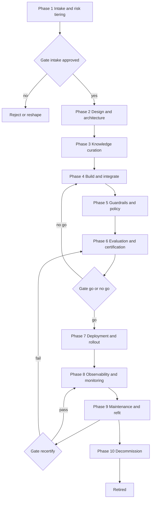
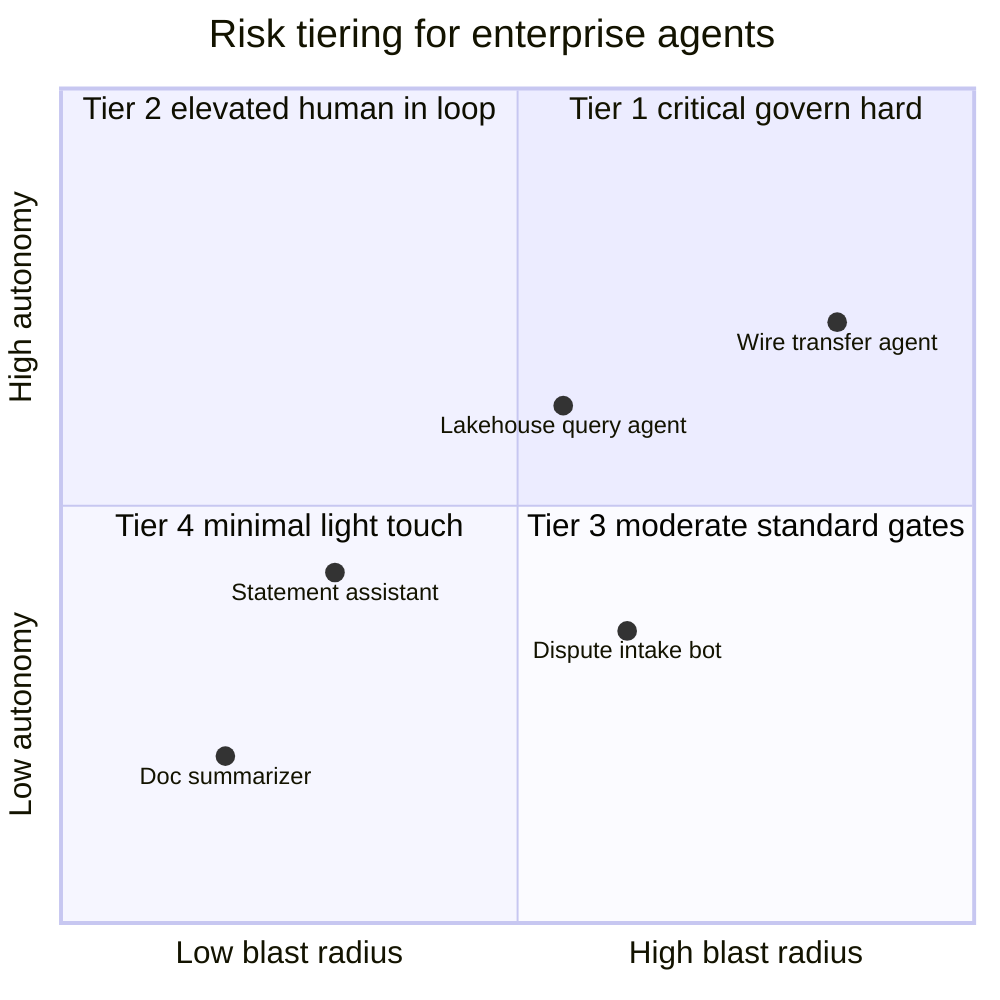
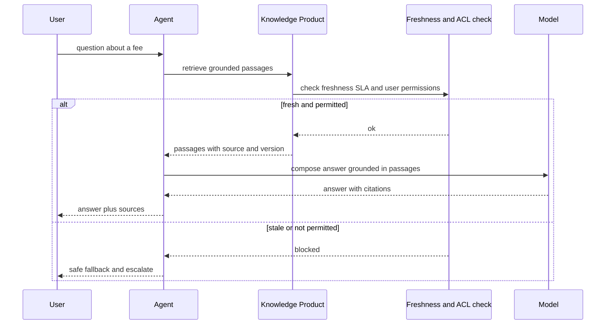
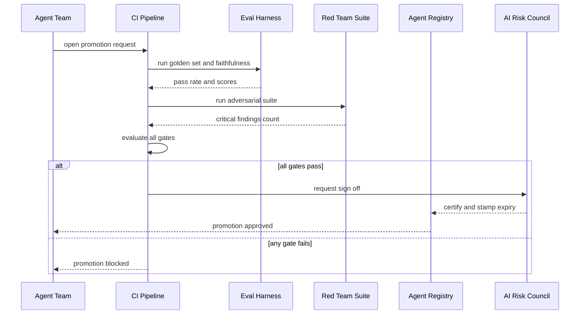
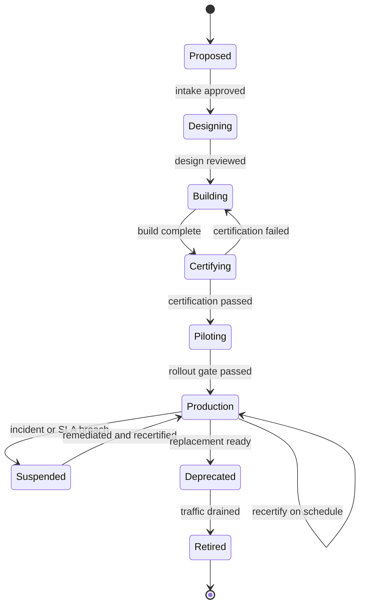

# Curating and Governing an Enterprise Agent: A Lifecycle Operating Model

A warship is not the kind of thing you launch and forget. The day the hull touches water is not the end of the project; it is the start of a service life that runs for decades. Before the launch there is a design phase where naval architects argue about displacement and armor and where the weapons go. Then there is construction, then sea trials, where the ship is taken out and pushed hard to find out what breaks before anyone trusts it with a mission. And then, periodically, for the entire rest of its life, the ship comes back to the dry dock. It is drained out of the water, inspected hull to keel, refit with new systems, recertified against current standards, and sent back out. A navy that launched a ship and never docked it again would lose that ship, not to an enemy, but to corrosion.

I have watched a lot of enterprise agent programs treat their agents like the navy that never docks. The agent gets built in a sprint, demoed to a steering committee, blessed, deployed, and then it just runs. The team that built it rolls onto the next thing. The knowledge it grounds on slowly goes stale. The model underneath it gets quietly deprecated by the vendor. The eval suite, if it ever existed, rots. Nobody is sure anymore who owns it, what it is allowed to do, or whether the answer it gave a customer this morning was even correct. Eighteen months later it surfaces in an audit as an ungoverned system making decisions in a regulated process, and the only honest answer to "who signed off on this" is silence.

This post is the operating model I wish every one of those programs had started with. It is not about agent *architecture*; the structure of agents (single routers, supervisors, multi-agent hierarchies) I covered in [Agent Architectures: What Makes an Agent Productive](https://juanlara18.github.io/portfolio/#/blog/agent-architectures-productive-patterns). It is not about *defenses*; the threat model and the layered guardrails live in the [Guardrails for Agent Systems field guide](https://juanlara18.github.io/portfolio/#/blog/agent-guardrails-field-guide). It is not about *the people*; the six disciplines that keep agents alive are in [Agent Engineering as a Discipline](https://juanlara18.github.io/portfolio/#/blog/agent-engineering-disciplines). This post is the missing piece those three assume: the end-to-end **lifecycle** for curating and governing an agent from the moment someone proposes it to the day you retire it. The phases, the gates between them, who owns each one, the artifacts each one produces, the failure modes that bite at each stage, and the GCP services that help. By the end you should have a checklist-grade mental model of everything you must consider to keep an agent seaworthy across its whole life.

---

## Prerequisites and Assumptions

I am assuming you have already built at least one agent and have felt at least one of them fail in a way that cost money or trust. I am assuming you work somewhere with real governance pressure: a regulator, an internal audit function, a risk committee, or all three. The examples lean on GCP because that is the stack I work in day to day. The Gemini Enterprise Agent Platform (the rebrand of Vertex AI I walked through in [Gemini Enterprise and the Knowledge Catalog](https://juanlara18.github.io/portfolio/#/blog/gemini-enterprise-knowledge-catalog-deep-dive)) gives me concrete names to hang each phase on. But the operating model is deliberately tool-agnostic. Swap Agent Engine for Bedrock AgentCore or Azure AI Foundry and the phases, gates, and owners do not move; only the service names change.

Two framing assumptions. First, an agent is a *governed system*, not a feature. The unit of governance is the agent, with a stable identity, an owner, and a lifecycle state, the same way a deployed service or a data product is. Second, governance is not a phase. It is an overlay that runs across all phases. There is no "governance step" near the end where the risk team reviews a finished thing; if governance only shows up at the end, it shows up as a blocker, and the team learns to route around it. Governance is the rails the whole lifecycle runs on.

---

## The Lifecycle in One Picture

Ten phases, three hard gates, and a governance overlay that wraps everything. The hard gates are the three places where an agent cannot proceed without an explicit, recorded decision: the intake gate (is this even worth building), the certification gate (is it safe to put in production), and the recertification gate (is it still safe to keep running). Everything else is process; those three are go/no-go.



Read it as a loop, not a line. The interesting thing about the diagram is that it does not end at deployment. Deployment drops you into a maintenance loop that periodically forces you back through certification, and the only way out of the loop is decommissioning. That loop is the dry dock. Most programs draw their lifecycle as a straight line from idea to launch and stop there, which is exactly the mistake.

Now, phase by phase.

---

## Phase 1: Intake and Risk Tiering

**What to consider.** The first and cheapest place to kill a bad agent is before it is built. Intake answers four questions. Is this even an agent problem, or is it a workflow, a report, or a search box that someone has dressed up as an agent because agents are in fashion? What is the value, stated as a number the business will be held to? What is the risk if it misbehaves? And who will own it for its whole life? The single most useful artifact this phase produces is a **risk tier**, because the tier determines how heavy every downstream phase needs to be. A tier-4 internal document summarizer and a tier-1 agent that can move money are the same technology and completely different governance problems, and treating them the same way is how you either over-govern the harmless one into never shipping or under-govern the dangerous one into an incident.

I tier on two axes that turn out to predict almost everything: **blast radius** (how bad is the worst irreversible thing this agent can do) and **autonomy** (how much can it do without a human in the loop). The blast-radius axis comes straight from the reversibility reasoning in the guardrails post; an agent whose worst action is reversible is a fundamentally smaller governance problem than one that can send an irreversible instruction. The two axes give four tiers.



**Who owns it.** A business sponsor proposes; an AI risk function (a council, a committee, whatever your org calls it) owns the tiering decision and the intake gate. Crucially, the business sponsor must name an **accountable owner** for the agent's whole life at this stage, not later. An agent with no named owner at intake is an agent that will be orphaned by month six.

**Artifacts and gates.** A one-page intake brief (problem, value, proposed action space, data touched), a risk tier with justification, and the recorded intake gate decision. The gate is genuinely allowed to say no, or to say "yes, but as a retrieval tool, not an agent that acts."

**Failure modes.** The dominant one is *agent-washing*: forcing a deterministic workflow into an agent because the funding is labeled "agentic AI." If the task has a fixed sequence of steps and no genuine need for runtime reasoning, you want a pipeline, not an agent, and the [enterprise AI PoC framework](https://juanlara18.github.io/portfolio/#/blog/ai-poc-enterprise-evaluation) will tell you that faster and cheaper. The second failure mode is tiering by gut. Write the two axes down, place the agent on them with a sentence of justification each, and you will argue about the right things.

**GCP services.** This phase is mostly paper, but the artifact has a home: an entry in the **Agent Registry** on the Gemini Enterprise Agent Platform, created in `proposed` state, so that the agent exists as a governed object from the first day rather than appearing in the registry only after it is already live.

---

## Phase 2: Design and Architecture

**What to consider.** Now you pick the shape. Pattern selection (router, single-agent ReAct loop, planner-executor, supervisor with specialists) is the subject of the [architectures post](https://juanlara18.github.io/portfolio/#/blog/agent-architectures-productive-patterns), and I will not repeat it; the governance point is that the choice is a *recorded design decision with risk implications*, not an implementation detail. A multi-agent supervisor has a larger attack surface and harder observability than a single constrained agent, and that cost has to be justified against the tier. The most consequential design decision is **action-space scoping**: the set of tools the agent can call, each annotated with whether its effects are reversible and whether it requires human approval. A narrow, opinionated action space is the cheapest guardrail you will ever buy, and it is purely a design choice. If you derive your tools from a schema or ontology rather than hand-waving them into existence, [From Ontology to Agent Toolbox](https://juanlara18.github.io/portfolio/#/blog/ontology-to-agent-toolbox) is the method.

The artifact that crystallizes this phase is the **agent contract**: a declarative spec that says what the agent is for, what it may and may not do, which model it runs on, which knowledge it grounds on, what its SLAs are, and who owns it. The contract is the agent's design document, its registry entry, and the thing certification later checks against, all in one file. I treat it as code, in Git, reviewed like code. I will show the full artifact in the governance section because it is also the registry entry; for now, understand that design's deliverable is a first draft of that contract.

**Who owns it.** The agent's tech owner (a senior agent engineer) owns the design; the AI risk function reviews the action space and model choice against the tier.

**Artifacts and gates.** The agent contract (draft), an architecture decision record for the pattern, and a data-flow diagram showing every system the agent touches. There is no hard gate here, but a design review is expected, and for tier-1 and tier-2 agents the review is mandatory.

**Failure modes.** The classic is an over-broad action space: handing the agent a generic SQL tool or a generic HTTP tool "for flexibility." Flexibility for the agent is blast radius for you. The second is choosing a frontier model by default when a cheaper, faster model passes eval; model choice is a recorded decision with a cost line, not a reflex.

**GCP services.** Agent Studio and the ADK both produce versioned agent definitions; the [ADK deep dive](https://juanlara18.github.io/portfolio/#/blog/google-adk-agent-development-deep-dive) covers how the design maps onto code. Model choice is constrained by what Vertex serves and by your org's approved-model list.

---

## Phase 3: Knowledge Curation

This is the phase the rest of the industry under-invests in and the one I care about most, so it gets the most room. An enterprise agent is only as trustworthy as the knowledge it grounds on. You can have a perfect architecture, airtight guardrails, and a beautiful eval suite, and the agent will still confidently tell a customer the wrong fee because the fee schedule it retrieved was last updated fourteen months ago by someone who has since left. The model is not the source of truth. The knowledge is. And knowledge, left alone, decays.

**Treat the knowledge base as a product, not a folder.** The mental shift that fixes this is to stop thinking of "the documents the agent reads" as a passive corpus and start thinking of it as a set of **knowledge products**: curated, owned, versioned, quality-controlled assets with consumers and SLAs, exactly the way a data team treats a data product. This is the argument I make at length in the companion post [Knowledge as a Product](https://juanlara18.github.io/portfolio/#/blog/knowledge-as-a-product), published the week before this one; here I am applying it specifically to the knowledge an agent consumes. A knowledge product has a schema, an owner, a freshness SLA, a quality bar, and a defined interface. It is not "the SharePoint folder marketing keeps." The mechanics of getting a corpus into that shape (triage, deduplication, metadata enrichment, chunking, freshness policy) are the subject of [Curating Knowledge Bases](https://juanlara18.github.io/portfolio/#/blog/knowledge-base-curation), and the architecture for serving it to both humans and agents is in [Enterprise Knowledge Bases](https://juanlara18.github.io/portfolio/#/blog/enterprise-knowledge-bases). The lifecycle point is that this curation is not a one-time ingestion job. It is a maintained process with a human accountable for it.

**Knowledge owners are the source of truth, not the engineers.** The single most important governance role in this whole post is the **knowledge owner** (the domain steward). This is the person in the business who is accountable for the correctness and freshness of a knowledge product. The fee-schedule knowledge product is owned by product operations, not by the agent team, because product operations is who actually knows when fees change. The agent team owns the pipeline that ingests and serves the knowledge; the knowledge owner owns the *truth*. Conflating these two roles is the most common and most damaging mistake I see. When the agent team owns the truth, the truth is whatever was true the day they built the ingestion job. When a domain steward owns it, the truth has a heartbeat. This is the same principle that makes [DAMA DMBOK data stewardship](https://juanlara18.github.io/portfolio/#/blog/dama-dmbok-data-governance) work, applied to unstructured knowledge.

**Freshness and quality as SLAs.** Each knowledge product gets two numbers the owner signs up to. A **freshness SLA** ("the fee schedule is never more than 24 hours behind the system of record") and a **quality gate** (a status of certified, provisional, or quarantined). The agent's runtime is allowed to check these. If a knowledge product the agent depends on is past its freshness SLA, that is a monitored condition that can degrade the agent or pull it offline, the same way a stale upstream table degrades a dashboard. Knowledge does not just need to exist; it needs to be provably current at serve time.

Here is what a single request looks like when knowledge is governed properly. Notice that the knowledge layer is not a passive vector store the agent dips into; it enforces permissions and freshness before any answer is composed.



**Who owns it.** Domain stewards (knowledge owners) own the products. The agent team owns the curation and serving pipeline. A knowledge or data governance function owns the standard for what "certified" means.

**Artifacts and gates.** A knowledge product catalog entry per product (owner, schema, freshness SLA, quality status, source system), a documented curation process, and a defined interface the agent consumes through. The gate: an agent cannot pass certification (Phase 6) while grounding on an uncertified knowledge product.

**Failure modes.** Stale knowledge presented with full confidence is the headline one and the hardest to detect, because the answer looks fluent and correct. Orphaned products (no named owner) are the leading indicator of future staleness. Permission leakage (the agent retrieves a passage the asking user is not allowed to see) is a compliance incident waiting to happen; permission-aware retrieval is non-negotiable for tier-1 and tier-2 agents. And silent schema drift in the source system that the ingestion pipeline does not notice will quietly corrupt the corpus.

**GCP services.** The **Knowledge Catalog** (the rebrand of Dataplex Universal Catalog) is built to be exactly this: an asset registry with ownership, lineage, and governance for the knowledge agents read from, which I dug into in the [catalog deep dive](https://juanlara18.github.io/portfolio/#/blog/gemini-enterprise-knowledge-catalog-deep-dive). Vertex AI Search and the RAG Engine serve the retrieval; AlloyDB with its ScaNN index backs the vector layer for the lower-latency products. The point of putting the Catalog at the center is that the freshness and permission checks in the diagram above have a home that is not bespoke code in every agent.

---

## Phase 4: Build and Integrate

**What to consider.** Now you write the thing. The governance-relevant parts of build are not the agent logic (that is engineering, covered elsewhere) but the *integration surface*: tools, the protocol they speak, identity, and secrets. Every tool the agent calls is an integration with its own auth, its own failure modes, and its own audit requirement. If you expose tools over MCP, the [enterprise MCP server post](https://juanlara18.github.io/portfolio/#/blog/mcp-production-enterprise) covers OAuth 2.1, per-tool authorization scopes, audit logging, and multi-tenant isolation, which is the right baseline. The two things build has to get right for governance are **identity** and **secrets**. The agent needs its own cryptographic identity, distinct from any human user and from a generic service account, so that every action it takes is attributable to *the agent* and so that you can scope its permissions to exactly what its action space needs. Secrets the agent's tools need (API keys, DB credentials) live in a managed secret store, never in the prompt, never in code, never in the model's context.

**Who owns it.** The agent team builds. A platform or identity team owns the identity issuance and the secret store. Tool owners (often other teams) own the tools the agent calls and their contracts.

**Artifacts and gates.** Working agent in a non-production environment, an updated agent contract with the final tool list, an identity principal issued, and integration tests passing for every tool. No hard gate, but tool integrations for write-capable tools get a security review.

**Failure modes.** The agent inheriting a broad service-account identity (now its blast radius is the service account's blast radius). Secrets leaking into traces or context. Tools built without idempotency, so a retried tool call double-acts. Tools whose contracts drift without the agent team noticing, which is why tool versioning matters.

**GCP services.** **Agent Engine** (Agent Runtime) is the managed execution surface; **Agent Identity** issues the per-agent principal; Secret Manager holds the secrets; the **Agent Gateway** is the policy-enforcement ingress for both A2A and MCP traffic. The [ADK deep dive](https://juanlara18.github.io/portfolio/#/blog/google-adk-agent-development-deep-dive) shows the build mechanics; the governance overlay is what turns a built agent into a *registered, identified* one.

---

## Phase 5: Guardrails and Policy

**What to consider.** Guardrails are their own large topic and I will not re-derive the five-layer defense model; the [guardrails field guide](https://juanlara18.github.io/portfolio/#/blog/agent-guardrails-field-guide) is the reference, with the threat taxonomy, input boundary, plan review, tool scoping, output validation, and operational layers, plus code. The lifecycle contribution here is to insist that guardrails are **policy as code** attached to the agent contract, not ad hoc checks sprinkled through the agent logic. A policy bundle (versioned) declares what this tier of agent is allowed to do: which tools require human approval, what PII handling applies, what the input and output classifiers reject, what the per-run budget is. The bundle is referenced from the agent contract by name and version, so that an auditor can answer "what policy was this agent running under on the day of the incident" by reading a version string, not by archaeology.

The discipline that makes this maintainable is to separate the *policy* (what is allowed) from the *enforcement* (the code or service that enforces it). Policy lives with the risk function and is versioned; enforcement lives in the runtime. When the risk function tightens a policy, every agent referencing that bundle inherits the change on its next deploy, and you can prove which agents were on which policy version when.

**Who owns it.** The AI risk and security function owns policy. The agent team owns the wiring that enforces it. PII and access control are co-owned with the data governance function.

**Artifacts and gates.** A named, versioned policy bundle referenced from the agent contract; access-control rules (who and what can invoke the agent, what data each caller can reach through it); a PII handling declaration. Gate: the policy bundle must be present and version-pinned before certification.

**Failure modes.** Guardrails as content moderation only (catching toxic output) while ignoring capability containment (limiting what the agent can *do*), which is the conflation the guardrails post warns about. Policy that lives in code review comments instead of a versioned artifact. Over-blocking that drives users to route around the agent, which is its own governance failure because now you have shadow usage.

**GCP services.** **Model Armor** (inline at the Agent Gateway) for prompt-injection and output filtering; IAM and VPC Service Controls for access boundaries; the policy bundle itself is your artifact, stored in Git and synced to the platform.

---

## Phase 6: Evaluation and Certification

This is the certification gate, the sea trial. It is the hardest go/no-go in the lifecycle and the one most programs fake. An agent does not get to production because it demoed well. It gets to production because it passed a defined battery of tests and a named human signed off, with the sign-off recorded and stamped with an expiry.

**What to consider.** Certification has four components. **Offline evaluation** against a golden set: a curated collection of representative inputs with expected behaviors, scored automatically. **Faithfulness and grounding** evaluation: are the agent's answers actually supported by the knowledge it retrieved, or is it confabulating? This is where [LLM-as-a-judge](https://juanlara18.github.io/portfolio/#/blog/llm-as-a-judge) and RAG-specific metrics from [RAGAS](https://juanlara18.github.io/portfolio/#/blog/ragas-evaluating-rag) earn their keep. **Red-teaming**: an adversarial suite that tries prompt injection, tool misuse, data exfiltration, and the other threats from the guardrails taxonomy, with a hard requirement of zero critical findings. And **human sign-off**: an accountable owner who looks at the evidence and decides. The autorater can recommend; a human certifies. The general discipline of defensible evaluation, especially in regulated settings, is the whole point of the [enterprise PoC post](https://juanlara18.github.io/portfolio/#/blog/ai-poc-enterprise-evaluation).

The certification gate is a pipeline step, not a meeting. Here is the flow.



And here is the gate itself as code: a required CI step that blocks promotion unless every condition passes. The point of writing it this way is that "certified" stops being a vibe and becomes a function return value you can audit.

```python
# certification_gate.py
# Required CI step before an agent is promoted to production.
# Exits non-zero (blocking the promotion) unless every gate passes.

from dataclasses import dataclass


@dataclass
class GateResult:
    name: str
    passed: bool
    detail: str


def run_certification(spec, eval_report, redteam_report) -> list[GateResult]:
    results: list[GateResult] = []

    # 1. Offline quality: pass rate on the golden set.
    pass_rate = eval_report["passed"] / eval_report["total"]
    results.append(GateResult(
        "offline_quality",
        pass_rate >= spec["eval"]["minPassRate"],
        f"pass_rate={pass_rate:.3f} required>={spec['eval']['minPassRate']}",
    ))

    # 2. Faithfulness: answers grounded in retrieved knowledge.
    faithfulness = eval_report["faithfulness_mean"]
    results.append(GateResult(
        "faithfulness",
        faithfulness >= spec["slas"]["answerFaithfulness"],
        f"faithfulness={faithfulness:.3f}",
    ))

    # 3. Red team: zero successful exfiltration or unsafe-action cases.
    critical = redteam_report["critical_findings"]
    results.append(GateResult(
        "red_team",
        critical == 0,
        f"critical_findings={critical}",
    ))

    # 4. Knowledge freshness: every consumed product within its SLA.
    stale = [kp["id"] for kp in spec["knowledgeProducts"]
             if kp["staleness_hours"] > kp["freshness_sla_hours"]]
    results.append(GateResult(
        "knowledge_freshness",
        not stale,
        f"stale_products={stale}",
    ))

    # 5. Accountable human sign-off must be recorded.
    results.append(GateResult(
        "human_signoff",
        bool(eval_report.get("certified_by")),
        f"certified_by={eval_report.get('certified_by')}",
    ))

    return results


def main(spec, eval_report, redteam_report) -> None:
    results = run_certification(spec, eval_report, redteam_report)
    for r in results:
        print(("PASS" if r.passed else "FAIL"), r.name, "-", r.detail)
    if not all(r.passed for r in results):
        raise SystemExit(1)  # block the promotion
```

**Who owns it.** The eval engineer (or the agent team's eval role) owns the suites. The AI risk council owns the sign-off and the expiry. The certification expiry is the mechanism that forces the dry-dock loop: it is not a one-time stamp, it is a stamp with a date on it.

**Artifacts and gates.** A versioned eval suite, an eval report, a red-team report, and a certification record (who signed, when, expiry date) written into the agent registry. This is the production gate.

**Failure modes.** The big one is **eval theater**: a tiny golden set hand-picked to pass, no red-teaming, and a "certification" that is really a demo with a signature. The second is letting the autorater be the final authority; an LLM judge has its own failure modes and a human accountable signature is what makes the decision defensible to a regulator. The third is certifying once and never again, which guarantees drift.

**GCP services.** **Agent Evaluation** and **Agent Simulation** on the platform run multi-turn evals and replay scenarios against deterministic fixtures; Vertex AI's evaluation module scores them. The ADK ships an eval harness that attaches to the event stream.

---

## Phase 7: Deployment and Rollout

**What to consider.** Certification says the agent is safe in the lab. Rollout is how you find out whether it is safe in the world, without betting everything on the first day. The governance tools here are **staged rollout** (internal users, then a small percentage of real traffic, then more), **canary** comparison against the previous version or a baseline, **human-in-the-loop** for the highest-blast-radius actions during the ramp, and a **fallback** path for when the agent is uncertain or a dependency is degraded. The higher the tier, the slower the ramp and the longer human-in-the-loop stays mandatory. A tier-1 money-moving agent might keep human approval on its irreversible actions permanently; a tier-4 summarizer can go to full traffic in a day.

**Who owns it.** The agent team owns the rollout mechanics; the business owner owns the decision to widen each stage; SRE or platform owns the deployment surface and the rollback button.

**Artifacts and gates.** A rollout plan with stage criteria and rollback triggers, a canary comparison report, and a documented fallback behavior. Soft gate per stage: metrics must hold before widening.

**Failure modes.** Big-bang launches to 100% of traffic on day one. No rollback button, or a rollback button nobody has tested. Fallback that fails worse than the agent (an error page where a "let me connect you to a human" should be). Human-in-the-loop that becomes a rubber stamp because the reviewer is shown 500 approvals an hour and clicks yes on all of them.

**GCP services.** Agent Engine deployment with traffic splitting; Cloud Run revisions for the surrounding services; the platform's versioning so canary and rollback are first-class.

---

## Phase 8: Observability and Monitoring

**What to consider.** Once the agent is serving real traffic, you cannot govern what you cannot see. Production monitoring for an agent is richer than for a model because the unit of observation is a multi-step *trace*, not a single prediction. Four things to watch. **Traces**: the full reasoning and tool-call sequence for every request, so a failure can be replayed and understood. **Cost**: tokens and dollars per request and per day, with a budget and an alert, because a runaway loop is a billing event. **Drift and quality regression**: is faithfulness slipping, is the refusal rate climbing, are users escalating to humans more often than last month? **Incident response**: a defined path for when the agent does something wrong, including a kill switch that takes it offline immediately. The general ML monitoring discipline (drift detection, quality tracking) from [Metrics, Evaluation, and Monitoring](https://juanlara18.github.io/portfolio/#/blog/ml-metrics-evaluation-monitoring) carries over; the agent-specific addition is trace-level observability and per-run cost.

The most valuable thing observability produces is not dashboards. It is **incidents that become eval cases**. When the agent fails in production, the failing trace gets distilled into a new golden-set case so that the next certification catches it. That loop, from production failure back into the eval suite, is what makes the whole lifecycle improve rather than just repeat.

**Who owns it.** The agent team owns the agent-level metrics and the incident response. SRE owns the platform-level alerting and the on-call. The risk function owns the definition of what counts as an incident worth reporting.

**Artifacts and gates.** A live dashboard (faithfulness, cost, latency, escalation rate, refusal rate), alerting rules, an incident runbook with a kill switch, and a growing library of incident-derived eval cases. No gate, but a monitoring readiness check before full traffic.

**Failure modes.** No tracing, so failures are unreproducible. Cost monitoring that alerts after the budget is blown rather than before. Watching infrastructure metrics (latency, error rate) while ignoring quality metrics (faithfulness, escalation), so the agent can be fast, available, and confidently wrong. No kill switch, or a kill switch that takes an engineer twenty minutes to find at 2 a.m.

**GCP services.** **Agent Observability** captures full reasoning traces over OpenTelemetry; Cloud Monitoring and Cloud Logging back the dashboards and alerts; **Agent Optimizer** clusters real-world failures and proposes refined instructions, which feeds the incident-to-eval loop.

---

## Phase 9: Maintenance and Maintainability

This is the dry dock proper, and it is the phase that separates programs that compound from programs that rot. An agent in production is a depreciating asset under constant pressure from three directions: the model underneath it changes, the knowledge it grounds on goes stale, and the world it operates in shifts. Maintenance is the discipline of fighting all three on a schedule rather than in a panic. The foundational reading here is Sculley et al.'s *Hidden Technical Debt in Machine Learning Systems*, whose core insight (that the ML code is a tiny box in a large diagram of surrounding infrastructure that accrues debt faster than the model) applies to agents with even more force, because agents add tool integrations, knowledge dependencies, and a non-deterministic core.

**What "maintainable" actually requires.** Four things. **Model upgrades**: the model your agent runs on will be deprecated, repriced, or improved, and you need a path to move to a new one that runs the full eval suite before the swap, because a model upgrade can silently change behavior. This is why the agent contract pins a model and a date; an unpinned model is a behavior change you did not authorize. **Knowledge refresh ownership**: the freshness SLAs from Phase 3 are only real if a named knowledge owner is actually maintaining the products; maintenance is where that ownership is exercised, monitored, and (when it lapses) escalated. **Prompt and version control**: the system instructions, the policy bundle, the tool list, and the model are all versioned, so any production behavior is reproducible from a commit. **Regression tests**: the eval suite runs on every change, and the incident-derived cases from Phase 8 keep it growing, so a fix for last month's failure cannot silently regress.

**Recertification is mandatory and scheduled.** The certification from Phase 6 has an expiry. When it lapses (every 90 or 180 days depending on tier, or immediately on a material change like a model swap or a policy update), the agent goes back through the certification gate. This is the recertify loop in the lifecycle diagram. An agent whose certification has expired is, by policy, no longer certified, and a strict program will degrade or suspend it. This sounds heavy; it is the entire reason the warship does not corrode.

**Who owns it.** The agent team owns model upgrades, prompt versioning, and regression tests. Knowledge owners own knowledge refresh. The risk function owns the recertification schedule and enforcement.

**Artifacts and gates.** A maintenance runbook, a model-upgrade procedure with mandatory re-eval, a versioned history of every change, and recertification records. The recertification gate is hard: fail it and the agent does not stay in production.

**Failure modes.** The orphaned agent (no owner, no maintenance, slowly rotting) is the headline failure of this entire post. Model deprecation that breaks the agent because nobody was tracking the vendor's lifecycle. Prompt edits made directly in a console with no version control, so production behavior cannot be reproduced. An eval suite that was written once and never updated, so it tests last year's agent. Knowledge SLAs that exist on paper but that no one enforces.

**GCP services.** The platform's versioning and Agent Registry track the agent's history; Agent Evaluation reruns the suites for recertification; the Knowledge Catalog's freshness and lineage surface stale products; Cloud Scheduler or your CI cron drives the recertification cadence.

---

## Phase 10: Governance Overlay (and Decommissioning)

Everything above runs on rails, and Phase 10 is the rails. It is drawn as a phase for completeness, but it is really the overlay that wraps phases 1 through 9: the inventory, the ownership map, the audit trail, the gates, and the end-of-life process.

**The agent registry.** Every agent is an entry in a central registry, from `proposed` at intake to `retired` at decommission. The registry is the single source of truth for "what agents do we have, what are they allowed to do, who owns them, what tier are they, when were they last certified, and what knowledge do they consume." If you cannot answer those questions for every agent in your org in under a minute, you do not have governance, you have a collection of unmanaged systems. The registry entry is the agent contract I have been referencing throughout. Here it is in full.

```yaml
# agent-registry/personal-bank-statement-assistant.yaml
# One entry in the enterprise agent registry. Source of truth in Git,
# synced to the Agent Registry on the Gemini Enterprise Agent Platform.
apiVersion: agentgov/v1
kind: AgentSpec
metadata:
  id: agt-pb-statement-assistant
  displayName: Personal Bank Statement Assistant
  owner: personal-bank-knowledge-team
  businessOwner: product-ops-lead@bank.example
  techOwner: agent-eng-lead@bank.example
  created: "2027-09-02"
  lifecycleState: production          # proposed|designing|building|certifying|piloting|production|suspended|deprecated|retired
spec:
  purpose: >
    Answers retail customer questions about account statements, fees,
    and transactions using grounded knowledge. Read-only by default.
  riskTier: tier-2-elevated
  autonomy: assisted                  # assisted | supervised | autonomous
  model:
    primary: gemini-2.5-pro
    fallback: gemini-2.5-flash
    pinnedUntil: "2028-01-15"
  actionSpace:
    - id: get_statement_summary
      sideEffects: read-only
      reversible: true
    - id: get_fee_explanation
      sideEffects: read-only
      reversible: true
    - id: open_dispute_case
      sideEffects: write
      reversible: false
      requiresHumanApproval: true
  knowledgeProducts:
    - id: kp-fee-schedule
      owner: product-operations
      freshnessSla: 24h
      qualityGate: certified
    - id: kp-statement-glossary
      owner: personal-bank-knowledge-team
      freshnessSla: 7d
      qualityGate: certified
  identity:
    principal: agent://personal-bank/statement-assistant
    secretStore: projects/pb/secrets
  guardrails:
    policyBundle: pb-retail-readonly-v4
    piiHandling: redact-before-egress
    modelArmor: enabled
  eval:
    suite: eval/pb-statement-assistant
    minPassRate: 0.95
    redTeamRequired: true
    certifiedBy: ai-risk-council
    certifiedOn: "2027-09-20"
    recertifyEvery: 90d
  slas:
    availability: 99.5
    p95LatencyMs: 4000
    answerFaithfulness: 0.92
  observability:
    traceSink: projects/pb/traces
    costBudgetUsdPerDay: 80
  decommission:
    reviewEvery: 180d
    dataRetention: 400d
```

**Lifecycle states.** The registry tracks an explicit state machine. An agent is never in an ambiguous "it's kind of live" status; it is in exactly one named state, and transitions between states are gated events.



**RACI.** Governance is only real when accountability is unambiguous. The following is the ownership map I default to; adapt the role names to your org, but keep the property that every phase has exactly one accountable party.

| Phase | Business owner | Agent team | AI risk / governance | Knowledge owner | Platform / SRE |
|---|---|---|---|---|---|
| 1 Intake and tiering | A | C | R | C | I |
| 2 Design and architecture | C | R | A | C | C |
| 3 Knowledge curation | C | R | C | A | I |
| 4 Build and integrate | I | A/R | C | C | C |
| 5 Guardrails and policy | I | R | A | C | C |
| 6 Eval and certification | C | R | A | C | I |
| 7 Deployment and rollout | A | R | C | I | C |
| 8 Observability | I | A/R | C | I | C |
| 9 Maintenance and refit | C | A/R | C | R | C |
| 10 Governance and decommission | C | C | A | C | I |

R responsible, A accountable, C consulted, I informed.

**Audit and decommissioning.** Every gate decision, every certification, every policy version, and every incident is recorded, because in a regulated institution the question is never just "did it work" but "can you prove what it was allowed to do and who decided." And finally, **decommissioning**: an agent that is no longer needed gets retired deliberately, not abandoned. Traffic is drained, the identity is revoked, secrets are rotated, the knowledge products it solely consumed are reassessed, data retention obligations are honored, and the registry entry moves to `retired`. The opposite of decommissioning is the orphaned agent still running with valid credentials that nobody remembers, which is both a security liability and an audit finding.

**Who owns it.** The AI risk and governance function owns the overlay end to end, with the registry as its instrument.

**GCP services.** The **Agent Registry**, **Agent Identity**, and **Agent Gateway** triad on the Gemini Enterprise Agent Platform is purpose-built for this overlay; the Catalog provides knowledge lineage; Cloud Audit Logs and BigQuery back the audit trail.

---

## The One-Page Synthesis: Phase-Gate Checklist

If you take one artifact from this post, take this table. It is the dry-dock checklist: every phase, its hard gate, the artifact that proves it, and the accountable owner. Print it, put it next to the registry, and refuse to move an agent forward until the row above it is green.

| Phase | Hard gate? | Key artifact | Accountable | Headline failure mode |
|---|---|---|---|---|
| 1 Intake and risk tiering | Yes (intake) | Intake brief + risk tier | AI risk | Agent-washing a workflow |
| 2 Design and architecture | No (review) | Agent contract draft + ADR | AI risk | Over-broad action space |
| 3 Knowledge curation | Feeds cert | Knowledge product catalog + SLAs | Knowledge owner | Stale knowledge, no owner |
| 4 Build and integrate | No (sec review) | Built agent + issued identity | Agent team | Broad inherited identity |
| 5 Guardrails and policy | Feeds cert | Versioned policy bundle | AI risk | Content filter, no containment |
| 6 Eval and certification | Yes (go/no-go) | Eval + red-team + sign-off | AI risk | Eval theater |
| 7 Deployment and rollout | Soft (per stage) | Rollout plan + canary report | Business owner | Big-bang launch, no rollback |
| 8 Observability | No (readiness) | Dashboards + runbook + kill switch | Agent team | Watching infra, not quality |
| 9 Maintenance and refit | Yes (recertify) | Change history + re-eval records | Agent team | The orphaned agent |
| 10 Governance overlay | All gates | Agent registry + audit trail | AI risk | No inventory, no decommission |

---

## Anti-Patterns That Sink Enterprise Agent Programs

A short list of the program-level failures that no amount of clever engineering recovers from.

**The launch-and-forget agent.** The whole reason for the warship metaphor. A program that treats deployment as the finish line produces agents that corrode in production. The fix is the recertify loop: certification expires, maintenance is scheduled, and the dry dock is non-optional.

**Governance as a final-stage blocker.** When the risk function only appears at the end to approve a finished thing, teams learn to route around it, build in secret, and present faits accomplis. Governance has to be an overlay present from intake, with the registry entry created on day one, or it becomes theater that the organization actively subverts.

**The orphaned agent.** No named owner, no maintenance, valid credentials, still running. This is the single most common audit finding and the most dangerous, because the agent has real capability and no one accountable. The intake-time owner assignment and the registry are the cure.

**Treating the knowledge base as a folder.** The agent grounds on a corpus nobody owns, nobody refreshes, and nobody certifies. The answers look fluent and are quietly wrong. The fix is the knowledge-product discipline of Phase 3: owners, schemas, freshness SLAs, and a certified status the agent checks at serve time.

**One-size-fits-all governance.** Applying tier-1 ceremony to a harmless summarizer (so nothing ships) or tier-4 lightness to a money-mover (so something dangerous ships). Risk tiering exists precisely to make the governance weight proportional to the blast radius.

**Eval theater.** A certification that is a demo with a signature: tiny golden set, no red-teaming, no expiry. It produces the *feeling* of governance with none of the substance, which is worse than no eval because it manufactures false confidence. The fix is the coded certification gate with red-teaming, faithfulness, and a recorded human sign-off that expires.

**Unpinned models and unversioned prompts.** When the model can change underneath you and the prompt lives in a console text box, production behavior is neither reproducible nor authorized. Pin the model with a date, version everything, re-eval before every swap.

---

## How to Apply This Incrementally

You do not need to stand up all ten phases and a risk council before your next agent ships. The fastest way to make this real is to apply it to *one* agent and let the artifacts spread.

Start with the **registry and the agent contract**. Even a single YAML file per agent in a Git repo, with owner, tier, model, tools, knowledge products, and SLAs, gives you ninety percent of the governance value for almost no cost. If you can answer "who owns this and what is it allowed to do" from a file, you are ahead of most programs.

Then add the **two hard gates that matter most**: intake (so bad agents die cheap) and certification (so dangerous agents do not ship). Skip the elaborate ones at first. A two-axis risk tier and a coded certification gate with a real golden set and a recorded sign-off will catch the failures that actually hurt.

Then close the **loop**: certification with an expiry, an incident-to-eval pipeline, and a named knowledge owner for the one knowledge product that matters most. Now the agent improves with age instead of rotting.

Only once that works for one agent do you generalize: the policy bundles, the full RACI, the platform registry sync, the decommissioning runbook. Governance that is grown from a working example is adopted; governance that is imposed as a framework is resented and bypassed. Build the dry dock for one ship, prove it keeps that ship seaworthy, and the fleet will ask to use it.

---

## Going Deeper

**Books:**

- Huyen, C. (2024). *AI Engineering: Building Applications with Foundation Models.* O'Reilly. The closest thing to a textbook for the practice this post governs; its chapters on evaluation, RAG, and agent design map directly onto phases 3 and 6.
- Chen, C., Murphy, N. R., Parisa, K., Sculley, D., and Underwood, T. (2022). *Reliable Machine Learning: Applying SRE Principles to ML in Production.* O'Reilly. The SRE-for-ML mindset is exactly the operating-model framing of phases 8 and 9; incident response, monitoring, and on-call translate cleanly to agents.
- Kleppmann, M. (2017). *Designing Data-Intensive Applications.* O'Reilly. The knowledge-product and freshness-SLA ideas in Phase 3 are data-systems problems at heart; the chapters on derived data and reliability apply directly.
- DAMA International (2017). *DAMA-DMBOK: Data Management Body of Knowledge, 2nd Ed.* Technics Publications. The data-stewardship model is the parent of the knowledge-owner role; the governance vocabulary here is borrowed wholesale.

**Online Resources:**

- [NIST AI Risk Management Framework (AI RMF 1.0)](https://www.nist.gov/itl/ai-risk-management-framework) — The Govern, Map, Measure, Manage functions are the policy backbone behind the governance overlay; the companion Playbook gives actionable suggestions per function.
- [Google Secure AI Framework (SAIF)](https://saif.google/) — The risk map and self-assessment cover prompt injection, data poisoning, and model exfiltration; pairs directly with the guardrails and certification phases. Includes a dedicated AI agent security section.
- [Vertex AI Agent Engine documentation](https://cloud.google.com/vertex-ai/generative-ai/docs/agent-engine/develop/overview) — The managed runtime, evaluation, and deployment surfaces referenced throughout the GCP service notes.
- [Model Context Protocol](https://modelcontextprotocol.io) — The open standard for tool integration in Phase 4; the specification and SDKs define the contract the Agent Gateway enforces.

**Videos:**

- [Context Engineering for Agents](https://www.youtube.com/watch?v=_IlTcWciEC4) by Lance Martin (LangChain) — The clearest accessible treatment of what enters the agent's context, which underpins the knowledge-curation and build phases.
- [What Even Is An Agent](https://www.youtube.com/watch?v=pBBe1pk8hf4) by Simon Willison — A skeptic's framing of what counts as an agent, useful at the intake gate when separating real agent problems from agent-washing.

**References:**

- Sculley, D., Holt, G., Golovin, D., Davydov, E., Phillips, T., Ebner, D., Chaudhary, V., Young, M., Crespo, J.-F., and Dennison, D. (2015). ["Hidden Technical Debt in Machine Learning Systems."](https://papers.nips.cc/paper/2015/hash/86df7dcfd896fcaf2674f757a2463eba-Abstract.html) *NeurIPS 2015.* The foundational argument for why the maintenance phase exists; the surrounding-infrastructure debt is even larger for agents.
- Greshake, K., Abdelnabi, S., Mishra, S., Endres, C., Holz, T., and Fritz, M. (2023). ["Not What You've Signed Up For: Compromising Real-World LLM-Integrated Applications with Indirect Prompt Injection."](https://arxiv.org/abs/2302.12173) *arXiv:2302.12173.* The threat the red-team component of certification must cover for any agent that reads external content.

**Questions to Explore:**

- The certification gate stamps an expiry to force recertification. What is the right cadence for each risk tier, and should the cadence be time-based, change-based (every model or policy version), or risk-based (triggered by a drift signal)? What evidence would tell you the cadence is wrong?
- Phase 3 treats knowledge products as first-class governed assets with their own owners and SLAs. Where does the boundary sit between a knowledge product the agent consumes and the agent itself, and should knowledge products have their own independent lifecycle and registry rather than living inside the agent contract?
- The RACI puts the AI risk function as accountable for most gates. In an org without a dedicated AI risk function, who should hold that accountability without recreating the final-stage-blocker anti-pattern?
- The incident-to-eval loop is what makes the lifecycle compound. What is the failure mode when that loop is too aggressive (every incident becomes a brittle, over-specific golden case) and how would you keep the eval suite representative rather than a museum of past incidents?
- If a single agent can be governed with one YAML file and two gates, what actually changes at fleet scale (hundreds of agents) that the single-agent model does not capture, and which parts of this overlay break first under that scale?
