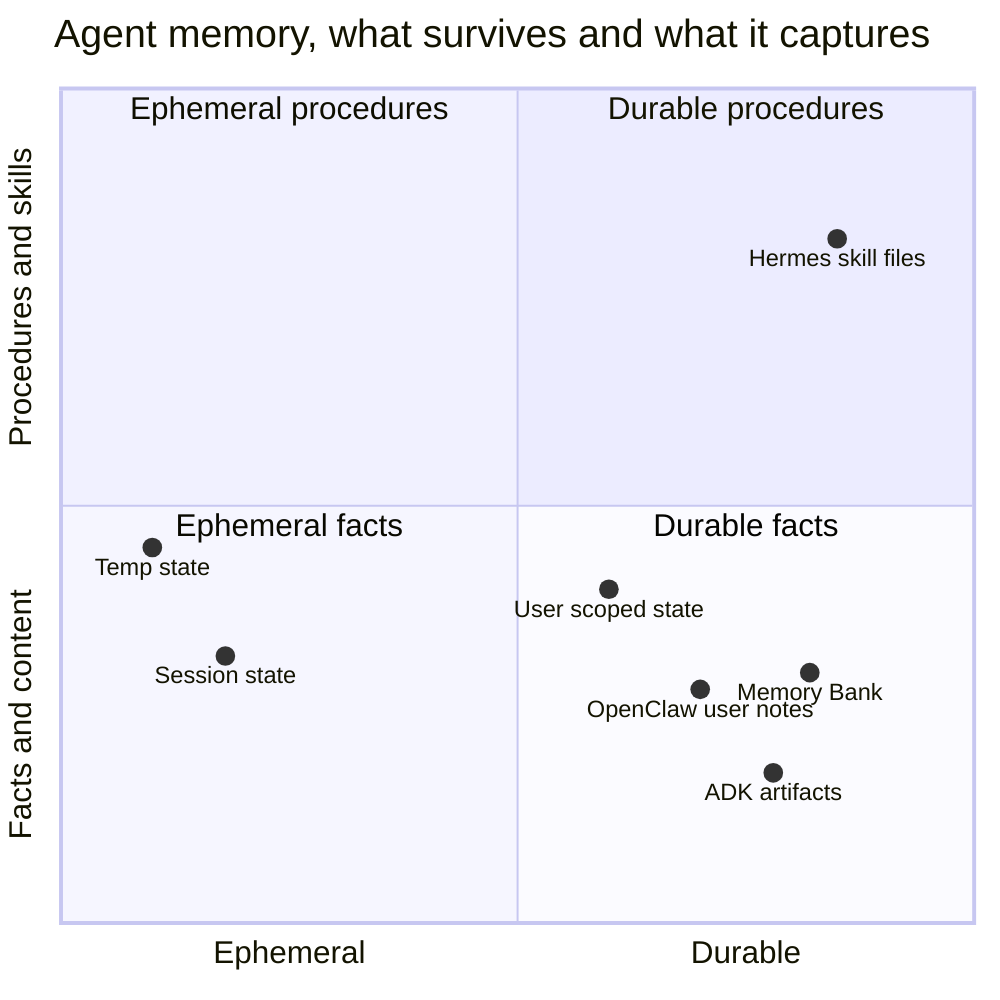
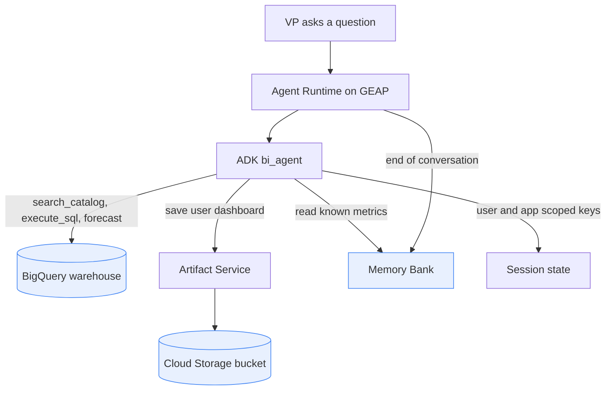
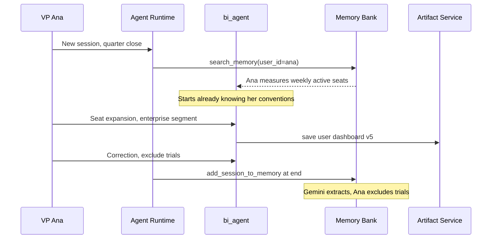
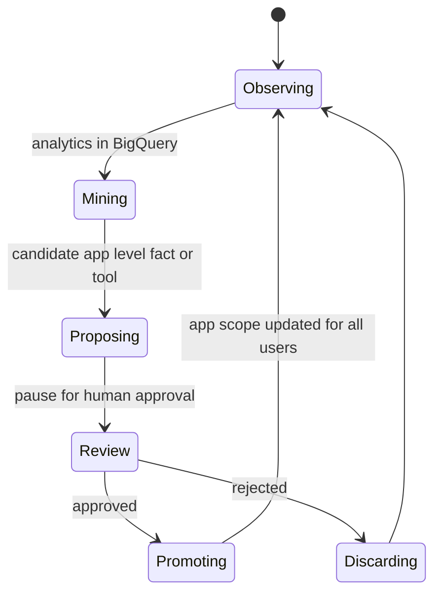

# The Agent That Remembers You: Continuity Engineering on ADK 2.0 and Gemini Enterprise

The two agents I wrote about over the last few weeks — [OpenClaw](https://juanlara18.github.io/portfolio/#/blog/openclaw-anatomy-viral-agent-platform) and [Hermes](https://juanlara18.github.io/portfolio/#/blog/hermes-self-improving-agent-persistent-memory) — share a quality that is hard to name until you have used them for a month. They feel *alive*. Not in any mystical sense. In a very concrete one: they remember. You told Hermes last Tuesday that your staging database lives behind a bastion host, and this Tuesday it just knows. OpenClaw watched you triage the same class of email three mornings running and, on the fourth, offered to do it. The agent you are talking to today is measurably more useful than the one you met, and it got that way without anyone shipping a new version.

Now hold that feeling next to the agent you most recently deployed to production. Mine was a perfectly competent analytics assistant. It answered the same question with the same fluency in June as it did in January. It also answered it with the same fluency for the CFO as for a summer intern, having learned precisely nothing about either in six months of daily use. It was, in the most literal sense, the same agent every single time — and it would stay that way until I redeployed a new one. Thousands of conversations flowed through it and evaporated.

That gap is the subject of this post. Not "how do I clone Hermes at work" — you do not want to, and I will spend a good part of this essay on *why* not. The interesting question is subtler. The hobbyist agents expose a real capability that the enterprise ones mostly lack: **continuity**. Memory that accrues, experience that compounds, a relationship that deepens. The question is how much of that you can and *should* engineer into a multi-user production agent — and it turns out that if you are building on Google's stack, you already have most of the parts. The work is not invention. It is **memory engineering**: deciding what to remember, at what scope, how it compounds, and how you keep one user's memory from poisoning another's.

I am going to make this concrete with one running example, carried the whole way through: a **business-intelligence agent** that builds dashboards from datasets in BigQuery, used by a handful of VPs who each care about very different numbers. By the end you should be able to see exactly which Google-managed primitive does which job, where the seams are, and where you have to write the interesting code yourself.

Let me start by being precise about the thing we are chasing, because "memory" is doing an enormous amount of unexamined work in most conversations about agents.

## A taxonomy of agent memory

When someone says an agent "has memory," they could mean any of at least four different mechanisms, and conflating them is how you end up building the wrong thing. Let me separate them along two axes: how long the information survives (ephemeral to durable), and what kind of thing it captures (content and facts, versus procedures and skills).


```mermaid
quadrantChart
    title Agent memory, what survives and what it captures
    x-axis Ephemeral --> Durable
    y-axis Facts and content --> Procedures and skills
    quadrant-1 Durable procedures
    quadrant-2 Ephemeral procedures
    quadrant-3 Ephemeral facts
    quadrant-4 Durable facts
    Session state: [0.18, 0.32]
    Temp state: [0.1, 0.45]
    Memory Bank: [0.82, 0.3]
    ADK artifacts: [0.78, 0.18]
    OpenClaw user notes: [0.7, 0.28]
    Hermes skill files: [0.85, 0.82]
    User scoped state: [0.6, 0.4]
```

The bottom-left quadrant is **working memory**: the current conversation. In ADK this is the `Session` — a `session_id`, an append-only list of `Event` objects (user messages, tool calls, model responses), and a mutable `state` dictionary the agent scribbles in as it works. It is precise, it is cheap, and it dies when the conversation ends unless you deliberately persist it. Everyone builds this by default; nobody confuses it with a relationship.

Working memory has a failure mode that is worth naming here rather than discovering in production: it grows. A quarter-close conversation with a VP is forty turns of SQL, schema dumps, and chart specs, and by turn forty the event log is both expensive to resend and too long for the model to attend to well. There are two distinct answers to that, they solve different problems, and ADK now ships both as managed features — I will come back to them by name in the next section, because they are the clearest example of a layer whose ownership you should *not* take on yourself.

The bottom-right quadrant is **durable facts**: things worth remembering *about a user or a domain* across conversations. "This VP measures the business in weekly active seats, not monthly revenue." "The finance mart's canonical date column is `close_date`, not `created_at`." OpenClaw's "user notes" — vectorized snippets stored in Chroma or Milvus and retrieved by similarity — live here. So does Google's **Memory Bank**, which I will come back to. This is the quadrant that produces the feeling of *being known*.

The top-right quadrant is **durable procedures**: not facts but *know-how*. This is where Hermes made its bet — the `SKILL.md` file that captures "here is how I successfully migrated a schema, including the two things that went wrong." It is memory of *how to do something*, written down so it can be replayed and improved. Almost no enterprise agent has this, and it is the hardest and most interesting quadrant to reach responsibly.

The crucial thing every one of these shares — and I want to nail this down before we go further, because the marketing around both hobbyist agents smudges it — is that **none of them touch the model's weights**. Hermes is not fine-tuning itself at 3am. OpenClaw is not doing gradient descent on your inbox. "Self-improving" and "learns from you" describe an agent accumulating *external, inspectable state* — text, embeddings, files — that gets fed back into the context window at the right moment. That is a profoundly good thing for enterprise work, because it means the memory is auditable, deletable, and governable in a way that a fine-tuned weight delta never is. The entire discipline of memory engineering lives outside the model. Once you internalize that, the enterprise problem stops looking like ML research and starts looking like what it actually is: **data engineering with a language model in the loop**.

So the taxonomy gives us our shopping list. To make an agent that feels continuous, we need working memory (have it), durable facts about users (need it), durable artifacts they produce (need it), and — ambitiously — durable procedures (want it, carefully). Let us see what Google already hands us for each.

## What Google already solved, and what it leaves to you

Here is the temptation I want to talk you out of. You read the Hermes post, you get excited, and you start sketching a Postgres schema for a bespoke memory store, a vector index, a file service, a background job that summarizes conversations. Two months later you have rebuilt, badly, a system that ADK and the Gemini Enterprise Agent Platform (GEAP) already ship, and you have taken on the operational burden of running it. Don't. The wheel is built. Your job is to decide how to *drive*.

Let me lay out the parts, because knowing their exact shape is what lets you avoid reinventing them.

**Sessions and state scopes.** ADK's `Session` handles working memory. What most people miss is that the `state` dictionary is not flat — keys carry *scope prefixes* that decide how long a value lives and who sees it:

- A bare key like `state["draft_query"]` is **session-scoped**. It vanishes with the conversation.
- `state["user:preferred_granularity"]` is **user-scoped**. It follows one user across every session they ever have with this app.
- `state["app:fiscal_year_start"]` is **app-scoped**. It is shared across every user of the agent.
- `state["temp:raw_api_blob"]` is **temporary**. It is scoped to the current *invocation* and discarded when it completes, so it is never persisted even when everything else is.

That prefix convention is doing quiet, load-bearing work. It is, in miniature, the entire multi-tenant memory problem — *whose* memory is this? — solved at the key level. We will lean on it hard. One caveat that is easy to miss and expensive to learn: the prefixes describe *scope*, not *storage*. They only actually survive a restart when you are running a persistent `SessionService` — `DatabaseSessionService` or the managed `VertexAiSessionService`. Under `InMemorySessionService` the docs are explicit that prefixed state is held in process and lost when the process dies, which means a local demo will happily convince you that `user:` memory works before you have configured anything that would make it true.

**Context compression and model context caching.** These are the two managed answers to the growth problem I flagged in the taxonomy, and they are worth separating because engineers routinely reach for one when they need the other.

*Context compression* — compaction, in the ADK docs — answers "the session got too long." It summarizes older event history in place, keeping the recent raw turns verbatim, so the agent retains the thread of the conversation without carrying every token of it. You configure it on the `App` object that wraps your root agent, and you can point the summarization at a cheap model rather than your reasoning model. The primary knobs are token-based (`token_threshold` to trigger compaction, `event_retention_size` for how many recent raw events to keep untouched), with a supplementary sliding-window mode (`compaction_interval` turns between compactions, `overlap_size` events kept as overlapping context).

*Model context caching* answers a different question: "we resend the same prefix every single turn." Your BI agent's instruction block, its tool schemas, and the schema dump for `fct_subscription_seats` do not change between turn three and turn thirty, and you are paying full input price for them thirty times. Caching is configured on the same `App` object and is supported on Gemini 2.0 and higher.

```python
from google.adk.apps.app import App, EventsCompactionConfig
from google.adk.apps.llm_event_summarizer import LlmEventSummarizer
from google.adk.agents.context_cache_config import ContextCacheConfig
from google.adk.models import Gemini

app = App(
    name="bi_agent_app",
    root_agent=bi_agent,
    # Summarize old history with a cheap model, keep the recent turns raw.
    events_compaction_config=EventsCompactionConfig(
        compaction_interval=3,
        overlap_size=1,
        summarizer=LlmEventSummarizer(llm=Gemini(model="gemini-flash-latest")),
    ),
    # Stop paying full price for a prefix that never changes.
    context_cache_config=ContextCacheConfig(
        min_tokens=2048,      # only cache when it is worth it
        ttl_seconds=600,
        cache_intervals=5,    # reuse the same cache this many invocations
    ),
)
```

The reason these belong in the post is not the API. It is that their existence sharpens the argument about layers. Compression is a *lossy transformation of working memory*; caching is a *cost optimization on the transport*. Neither is durable memory, and neither will make your agent know that Ana measures seats. Decide that summarizing the session *is* your memory strategy and you get an agent that forgets more slowly and still forgets. Compression and caching keep the ephemeral quadrant affordable; Memory Bank and artifacts move information *out* of it into something that survives.

**Memory Bank.** This is the managed durable-facts store, and it is more clever than a vector database. You do not write memories to it directly; you hand it *completed sessions*, and a Gemini model reads the transcript and **extracts** what is worth keeping — the durable facts, distilled from the chatter. The relevant ADK surface is small:

```python
from google.adk.memory import VertexAiMemoryBankService

memory_service = VertexAiMemoryBankService(
    project="my-project",
    location="us-central1",
    agent_engine_id="1234567890",
)

# At the end of a conversation, ingest it. Gemini extracts the durable bits.
await memory_service.add_session_to_memory(session)

# Later, in another session, retrieve what is relevant to the current query.
response = await memory_service.search_memory(
    app_name="bi_agent",
    user_id="vp_ana",
    query="what revenue metric does this user care about",
)
# response.memories -> list[MemoryEntry], each a distilled fact
```

Note the `user_id` in `search_memory`. Memory Bank is namespaced by user out of the box. Ana's extracted facts are retrieved only for Ana. That single parameter is the difference between "an agent that knows its users" and "a data breach."

Two details on the write path are worth having in your head before you design around it. `add_session_to_memory` takes a whole completed session, which is the right granularity at the end of a conversation but wasteful mid-flight; for that there is `add_events_to_memory`, which appends the recent turn's deltas without re-ingesting everything you already sent. And both accept a `custom_metadata` dictionary, which is how you tag a memory with the provenance you will want later when someone asks *why* the agent believes something.

There are two sibling services worth knowing so you pick correctly: `VertexAiRagMemoryService` gives you classic vector-indexed retrieval over a RAG corpus with `similarity_top_k` and a distance threshold (the right tool when the durable knowledge is a *corpus*, not *conversation-derived facts*), and `InMemoryMemoryService` does keyword matching in process for local development. Same interface, three storage strategies. Choose by what your durable knowledge actually is.

**Artifacts.** Facts are not the only thing worth keeping. Agents *produce* things — a chart, a compiled report, a `.sql` file, a dashboard specification. In ADK these are **artifacts**: named, versioned binary blobs with a MIME type, stored through an `ArtifactService`. `InMemoryArtifactService` for dev, `GcsArtifactService` for production (it writes to a Cloud Storage bucket). The API is deliberately filesystem-shaped:

```python
from google.genai import types

async def save_dashboard(spec_json: bytes, tool_context) -> dict:
    artifact = types.Part.from_bytes(
        data=spec_json,
        mime_type="application/json",
    )
    # Plain filename -> scoped to THIS session.
    version = await tool_context.save_artifact("dashboard.json", artifact)
    return {"saved_version": version}
```

And here is the detail that makes artifacts a memory primitive and not just a file dump: the **same `user:` prefix convention** applies to filenames. `save_artifact("dashboard.json", ...)` is scoped to the current session and disappears with it. `save_artifact("user:latest_dashboard.json", ...)` follows the user across every session. One character decides whether the VP's dashboard is a throwaway or a durable possession.

**Agent Runtime.** Finally, the thing that runs all of this in production. Note the name, because it changed: what was called **Vertex AI Agent Engine** was renamed **Agent Runtime** when Google folded the developer platform into the Gemini Enterprise Agent Platform at Cloud Next in April 2026, GA under the new name on April 22. The underlying API resource is still literally `ReasoningEngine` for backwards compatibility, and ADK constructor arguments still say `agent_engine_id`, so you will meet all three vintages of the name in one afternoon of reading. There is only one product.

It is a managed environment that deploys your ADK agent and, critically, *provisions the Sessions, Memory Bank, and Artifact services for you*, wires in an agent identity for IAM, and adds tracing. You get sub-second cold starts, per-instance scaling controls, and — the feature that matters most here — support for **long-running operations lasting up to seven days**, state maintained across the whole window, Memory Bank behind it for anything longer. Seven days is not an arbitrary number to a BI agent: it is the shape of a quarter-close week. An agent resident that long holds a working context across the whole exercise instead of restarting from zero every morning.

```python
import vertexai
from vertexai import types as ve_types   # note: NOT google.genai.types

client = vertexai.Client(project="my-project", location="us-central1")

remote_agent = client.agent_engines.create(
    agent=app,   # the App object from above, root_agent wrapped with its context config
    config={
        "requirements": ["google-cloud-aiplatform[agent_engines,adk]", "google-adk>=2.0"],
        "staging_bucket": "gs://my-agent-staging",
        # Give the agent its own identity so IAM, not the caller, bounds its reach.
        "identity_type": ve_types.IdentityType.AGENT_IDENTITY,
    },
)
```

Two things about that call are easy to get wrong. First, it is **client-based**: `client.agent_engines.create(...)` on a `vertexai.Client`, not the module-level `agent_engines.create(...)` that older tutorials show. Second, `identity_type` is what gives the deployed agent its own first-class principal — a dedicated agent identity with its own SPIFFE ID and certificate — rather than a borrowed service account. For a multi-tenant memory system that is the security model, not a nicety.

Scaling and resource controls are runtime settings rather than kwargs you pass here: minimum instances (0 to 10, default 1 — keep one warm for latency), maximum instances (1 to 1000, default 100), CPU and memory limits per container, and container concurrency, which for async ADK agents the docs suggest starting at a multiple of nine. A precision note worth internalizing, because it is exactly the kind of thing that rots: the *content* types (`Part`, `Content`) come from the Google Gen AI SDK, `from google.genai import types`, while *deployment* types like `IdentityType` still live under `from vertexai import types`. Two modules named `types`, two different jobs. Keep them straight.

Put the parts side by side and the shape of the work becomes clear. Google gives you working memory, durable-fact memory, artifact memory, and a runtime that hosts all three with identity and isolation. What Google does *not* do — what it cannot do, because it is domain-specific judgment — is decide **what your agent should remember, at what scope, and when**. That decision is the entire craft.

### You are not locked into ADK

Before we build, a word so this does not read as an advertisement for one vendor. The four needs — working memory, durable facts, durable procedures and outputs, and a governed way to change behavior — are universal. Every serious agent framework has grown an answer to each. What differs is how much is *managed* for you versus how much you *assemble*.

| Need | ADK and GEAP | LangGraph 1.x | Claude Agent SDK | OpenAI Agents SDK and AgentKit | Bedrock AgentCore |
| --- | --- | --- | --- | --- | --- |
| Working memory | `Session`, `state`, managed compaction | checkpointer, thread scoped | messages, subagent context windows | `Session`, SQLite or Conversations | short term memory per session |
| Durable facts across sessions | Memory Bank, a model extracts them | `store`, plus a reflection step or LangMem | memory tool, the agent writes files | assemble it, vector store or a memory service | long term memory strategies, managed extraction |
| Scope and isolation | `user:` `app:` `temp:` prefixes | store namespace tuples, like a path | your filesystem layout, per subagent context | your own keying | memory branching inside one memory resource |
| Durable procedures and outputs | Artifact service, versioned | `store` or external storage | folder based Skills, memory files | files and sandbox workspaces | your own storage |
| Survive a crash mid run | Agent Runtime, up to seven days | durable execution, resumes where it stopped | session resume and hooks | snapshotting and rehydration, or Temporal | managed runtime sessions |
| Human approval gate | ADK 2.0 pause and resume | `interrupt()` | hooks and permission callbacks | your own loop, or Temporal signals | your own loop |

The columns are not interchangeable, and the differences are instructive rather than cosmetic.

**LangGraph** makes the *graph* the first-class object and hangs memory off it as a `store` namespaced by tuples like `("users", "ana", "facts")`. In 1.x its headline property is **durable execution**: the persistence layer checkpoints a `StateSnapshot` at every super-step, so a workflow interrupted by a crash or by a human resumes *exactly where it left off* rather than replaying from the start. Short-term working memory and long-term cross-session memory are both first-class concerns rather than add-ons, and `interrupt()` remains the cleanest human-in-the-loop primitive in the field precisely because it rides on that same checkpoint machinery.

**Anthropic's Claude Agent SDK** takes the opposite instinct: hand the agent a filesystem and get out of the way. Subagents get *isolated context windows*, so a research subagent can burn a hundred thousand tokens without polluting the lead agent's context — a memory-isolation mechanism dressed as an orchestration feature. Lifecycle hooks fire deterministically at defined points, which is where your governance goes. Skills are folders on disk, the closest thing to Hermes's self-written procedures in a mainstream SDK. Two 2026 additions push it further toward this post's subject: **Dynamic Workflows**, where a lead agent plans and fans out tens to hundreds of parallel subagents inside a single session, and **Performance Outcomes**, where a separate grader scores the artifact against a rubric and sends subagents back to revise until it passes. **Managed Agents** sit on the same primitives and add a scheduler, rubric-based outcome grading, and — the one I cannot stop thinking about — a **dreaming pass**: a scheduled job that reviews past sessions and memory stores, extracts patterns, and curates what the agent keeps. That is `add_session_to_memory` promoted from a callback into background consolidation: Memory Bank's extraction on a cron, aimed at procedures as well as facts. If you want to see where the compounding thesis of this post is heading, watch that feature.

**OpenAI** gives you strong working-memory sessions in the Agents SDK, with AgentKit layered on for building and deploying, and has invested in durability rather than memory semantics: agent state is externalized, and built-in **snapshotting and rehydration** mean losing a sandbox container does not lose the run — state is restored in a fresh container from the last checkpoint. For real orchestration guarantees there is a **Temporal integration that went GA on March 23, 2026**. Durable cross-user memory is still yours to build.

**AWS** deserves the mention this post would otherwise skip, because Bedrock **AgentCore** (GA October 2025) attacks exactly the problem the rest of this essay is about. It is a framework-neutral managed runtime — LangGraph, CrewAI, Strands, or your own loop — and its **Memory Branching** lets multiple specialized agents keep *isolated memory contexts while sharing one memory resource*. The analogy the docs reach for is Git: one repository, many branches, every agent sharing a `memory_id` and `session_id` while working in its own `branch_name`. That is a genuinely different answer to isolation than ADK's key prefixes. Google isolates by *namespace*; AWS isolates by *branch*, which additionally gives you a merge story prefixes do not have. If your problem is many agents over one shared context rather than many users over one shared agent, that shape may fit better.

ADK's distinctive bet, against all of these, is that inside an *enterprise* the extraction, the versioning, the isolation, and the identity should be managed and audited rather than hand-rolled. Read the rest of this post through that lens: the primitives below are Google's, but the *decisions* transfer to whichever column you live in.

Let us make it, for a real agent.

## Worked example A: a BI agent that builds dashboards

The agent I keep coming back to, because it is the one my actual job keeps demanding, is a BI assistant. A VP types "show me seat expansion in the enterprise segment this quarter versus last," and a dashboard appears. Under the hood this is less exotic than it sounds, because ADK ships a `BigQueryToolset` that does the heavy lifting.

```python
import google.auth
from google.adk.agents import Agent
from google.adk.tools.bigquery import BigQueryToolset, BigQueryCredentialsConfig

credentials, _ = google.auth.default()
bq_toolset = BigQueryToolset(
    credentials_config=BigQueryCredentialsConfig(credentials=credentials),
)

bi_agent = Agent(
    model="gemini-3.5-flash",
    name="bi_agent",
    instruction=(
        "You help executives explore company data in BigQuery and assemble "
        "dashboards. Discover the right tables before you query. Prefer the "
        "user's known metric definitions when they exist."
    ),
    tools=[bq_toolset],
)
```

That `bq_toolset` is not one tool but a suite of eleven, hand-written to be model-friendly rather than auto-generated from the API surface, and the specific members matter for a BI use case, so let me name the ones that earn their place:

- `search_catalog` — Dataplex-powered semantic search over your data catalog. The VP says "seat expansion"; this is what finds the `fct_subscription_seats` table without the VP knowing it exists. This is the single most underrated tool in the set, because in a real warehouse the hard part is never the SQL, it is *finding the right table among four thousand*.
- `get_table_info` / `list_table_ids` — schema discovery, so the model writes correct column names instead of hallucinating them.
- `execute_sql` — runs the query the model composes.
- `ask_data_insights` — a natural-language-to-answer path for when you want a number, not a query.
- `forecast` — wraps BigQuery's `AI.FORECAST` function. "Project seat growth to year-end" becomes a real statistical forecast, not the model guessing.
- `detect_anomalies` and `analyze_contribution` — anomaly detection over a time series and BigQuery ML contribution analysis respectively; the tools that turn a dashboard from decoration into insight. Contribution analysis in particular ("*what drove* the seat jump?") is exactly the follow-up question a VP asks second.

So far this is a competent, *stateless* BI agent. It would answer identically for everyone, forever. Now we make it produce something durable. When the agent finishes composing a view, it should not just stream chart JSON into the chat and forget it. It should save a **dashboard artifact**:

```python
from google.genai import types

async def publish_dashboard(
    title: str,
    spec: dict,          # a Vega-Lite / Looker-style spec the model built
    tool_context,
) -> dict:
    """Persist the assembled dashboard so the user can return to it."""
    blob = json.dumps({"title": title, "spec": spec}).encode("utf-8")
    part = types.Part.from_bytes(data=blob, mime_type="application/json")

    # user: prefix -> this dashboard belongs to the VP across all sessions.
    filename = f"user:dashboard_{slugify(title)}.json"
    version = await tool_context.save_artifact(filename, part)

    # Leave a breadcrumb in user-scoped state so the agent can list them later.
    boards = tool_context.state.get("user:dashboards", [])
    boards.append({"title": title, "file": filename, "version": version})
    tool_context.state["user:dashboards"] = boards

    return {"status": "published", "file": filename, "version": version}
```

Two design choices in that small function are the whole point. First, the `user:` prefix on the artifact name means the dashboard is not a message that scrolls away — it is a durable object the VP owns, retrievable next week in a brand-new conversation. Second, I mirror a lightweight index into `user:dashboards` state, so the agent can answer "what dashboards have I built?" without scanning storage. The `ArtifactService` is versioned automatically, so when the VP says "update my seat dashboard with October," `save_artifact` returns version 4 and the prior three are still there if finance needs to audit what changed.

Here is the architecture assembled — the agent in Agent Runtime, reaching into BigQuery for data and into the managed memory and artifact services for continuity.


```mermaid
flowchart TD
    VP[VP asks a question] --> RT[Agent Runtime on GEAP]
    RT --> AG[ADK bi_agent]
    AG -->|search_catalog, execute_sql, forecast| BQ[(BigQuery warehouse)]
    AG -->|save user dashboard| ART[Artifact Service]
    ART --> GCS[(Cloud Storage bucket)]
    AG -->|read known metrics| MEM[Memory Bank]
    AG -->|user and app scoped keys| ST[Session state]
    RT -->|end of conversation| MEM
    classDef g fill:#e8f0fe,stroke:#4285f4;
    class BQ,GCS,MEM g;
```

This agent is now genuinely useful. It is not yet continuous. Answer the same VP tomorrow and it will re-discover her tables, re-learn her definitions, and re-derive that she always wants the enterprise segment split out. The dashboards persist, but the *understanding* does not. That is the second half of the example, and it is where the interesting engineering lives.

## Worked example B: making it feel like *her* agent

Ana is a VP of Sales. She has talked to the BI agent maybe forty times. Every single time she has, at some point, corrected it in the same way: "seats, not revenue — I run the number on weekly active seats." A stateless agent makes her do this on interaction forty-one. A continuous agent should have learned it by interaction three.

The mechanism is Memory Bank, and the discipline is knowing *what* to feed it and *when* to read it back. Let me walk the full loop of a single conversation, then show it as a sequence.

At the **start** of Ana's turn, before the model plans anything, we want her durable facts in context. ADK gives you three documented ways to do this, and they differ in who decides. `preload_memory` is the blunt, reliable one: drop it into the agent's tool list and ADK runs a memory search at the top of each turn and injects the results automatically — no agency required. `load_memory` is the same retrieval exposed as an ordinary tool, so the *model* chooses when past context is worth fetching, which is cheaper and less reliable. The surgical option is to call `search_memory` yourself from *inside a tool* via the `ToolContext`, so *you* control the query and how the results are framed:

```python
from google.adk.tools import preload_memory

# Option 1, automatic: let ADK preload relevant memories every turn.
bi_agent = Agent(
    model="gemini-3.5-flash",
    name="bi_agent",
    tools=[bq_toolset, preload_memory],
    instruction="...prefer the user's known metric definitions when they exist...",
)

# Option 2, surgical: a tool that pulls this user's conventions on demand.
async def recall_user_conventions(tool_context) -> dict:
    """Load what we durably know about this specific user before we query."""
    resp = await tool_context.search_memory(
        "this user's preferred metrics, segments, and reporting conventions"
    )
    facts = [m.content.parts[0].text for m in resp.memories]
    # temp: prefix -> re-fetched each turn, so never persist it.
    tool_context.state["temp:user_facts"] = facts
    return {"known_conventions": facts}
```

Notice the `temp:` prefix on where I stash the retrieved facts: they are re-fetched every turn, so there is no reason to persist them and every reason not to. Either way, the model begins its work already knowing that Ana means seats.

During the conversation, ordinary tool calls happen — `search_catalog`, `execute_sql`, `publish_dashboard`. Ana corrects something, refines a filter, approves a chart. All of that lands in the session's event log.

At the **end** of the conversation, an `after_agent_callback` calls `add_session_to_memory()`. This is the step that makes tomorrow better than today:

```python
async def remember_this_session(callback_context) -> None:
    # Gemini reads the transcript and extracts the durable facts, filed by user_id.
    await callback_context.add_session_to_memory()

bi_agent = Agent(
    model="gemini-3.5-flash",
    name="bi_agent",
    tools=[bq_toolset, preload_memory],
    after_agent_callback=remember_this_session,
    instruction="...",
)
```

When you deploy this on the ADK Agent Runtime template, `VertexAiMemoryBankService` is the default backing store, so that one callback is the whole write path. Gemini extracts the durable residue — *"Ana measures the business in weekly active seats"*, *"Ana's default view excludes the SMB segment"* — and files it under her `user_id`. Not the raw transcript. The *distilled facts*. Next week, `search_memory` surfaces them, and Ana never has to say "seats, not revenue" again.

*How memory gets **written** is where the frameworks diverge most visibly, and it is worth pausing on because it foreshadows the next example. ADK extracts facts for you with a model. In LangGraph you add the extraction yourself — a reflection node, or the LangMem helper — and write the result into the `store`. Anthropic inverts the whole thing: it hands the agent a memory directory and lets it decide what to persist, the same instinct that drives Hermes's self-written `SKILL.md` files. None of these is simply "correct." Managed extraction is safer and less flexible; agent-authored memory is more flexible and more dangerous. In an enterprise I want the safe default for facts — and, carefully gated, the flexible one for procedures.*


```mermaid
sequenceDiagram
    participant Ana as VP Ana
    participant RT as Agent Runtime
    participant Agent as bi_agent
    participant Mem as Memory Bank
    participant Art as Artifact Service

    Ana->>RT: New session, quarter close
    RT->>Mem: search_memory(user_id=ana)
    Mem-->>Agent: Ana measures weekly active seats
    Note over Agent: Starts already knowing her conventions
    Ana->>Agent: Seat expansion, enterprise segment
    Agent->>Art: save user dashboard v5
    Ana->>Agent: Correction, exclude trials
    RT->>Mem: add_session_to_memory at end
    Note over Mem: Gemini extracts, Ana excludes trials
```

The result is an agent that, from Ana's chair, is *learning her*. And — this is the part the hobbyist agents cannot do and the enterprise context demands — it is doing so inside hard walls. When the CFO opens his own session, `search_memory(user_id="cfo_marco")` returns *his* facts. Ana's conventions never leak into Marco's context, because the retrieval is namespaced by identity and Agent Runtime binds that identity through IAM. The `user:` scope on artifacts and state does the same for dashboards and preferences. Multi-tenancy is not a feature you add later; it is the property that lets you offer continuity to a thousand VPs without offering each of them a window into the others.

This is precisely why "just run Hermes at work" is the wrong instinct. Hermes's beautiful single `~/.hermes/` memory directory assumes one trusted principal. Point it at an organization and that assumption becomes the vulnerability. The enterprise version of continuity is not *less* engineered than the hobbyist version — it is *more*, because it has to be continuous **and** isolated at the same time.

### The gotcha nobody warns you about: memory quality and drift

Before I move on, a warning that cost me real debugging time. Memory Bank extracts facts with a model, which means it can extract *wrong* facts, or over-general ones. One frustrated session where Ana said "no, not that segment, ugh, revenue is fine for this one" got distilled into "Ana wants revenue" — the exact opposite of her durable preference — and polluted her next three sessions. Durable memory is durable bugs. Treat what goes into Memory Bank with the same care you treat a write to your production database, because that is what it is. In practice this means: prefer to summarize into memory *deliberately* at well-defined moments rather than dumping every session, give users a way to see and delete what the agent believes about them (Memory Bank supports deletion — expose it), and periodically sample extracted memories in evaluation. An agent that remembers is an agent that can remember wrong, confidently, forever.

## The other quadrant: an agent that accumulates know-how

The BI agent lives almost entirely in one corner of the taxonomy: durable *facts*. Ana's metric definitions, the canonical date column, the segment she excludes — content, not procedure. That is the easy, safe quadrant, and Memory Bank owns it. But look back at the opening diagram; there is a whole region we have not touched. The top-right: durable *procedures*. Know-how. The quadrant where Hermes made its home with self-written `SKILL.md` files. Reaching it responsibly in an enterprise is the more interesting problem, and it takes a different agent to see it clearly.

So take a second example: an **on-call agent** that helps engineers work incidents. It can read logs, query metrics, page a human, and roll back a deploy. On the surface it is just another tool-using agent. What makes it interesting is what should survive an incident. When a sev-2 is finally cleared at 3am, the valuable residue is not a *fact* — it is a *procedure*: "when the checkout queue backs up, it is almost always the stuck-consumer bug; here is the exact sequence that cleared it, and here are the two dead ends that wasted twenty minutes." That is a runbook, and it is precisely a Hermes `SKILL.md` in enterprise clothing.

Here is the shape of capturing it. Notice that, unlike Ana's facts, we do *not* let a background extractor guess at the procedure — the engineer authored it deliberately, at the moment of resolution, which is exactly the agent-authored-memory pattern from the aside above:

```python
async def capture_runbook(
    symptom: str,
    procedure: list[str],
    dead_ends: list[str],   # the time-wasters, like a SKILL.md pitfalls block
    tool_context,
) -> dict:
    """At incident resolution, persist the procedure that actually worked."""
    runbook = {
        "symptom": symptom,
        "procedure": procedure,
        "dead_ends": dead_ends,
        "authored_by": tool_context.state.get("user:engineer_id"),
    }
    blob = json.dumps(runbook, indent=2).encode("utf-8")
    part = types.Part.from_bytes(data=blob, mime_type="application/json")

    # user: scope -> the engineer owns their runbook immediately, versioned.
    version = await tool_context.save_artifact(
        f"user:runbook_{slugify(symptom)}.json", part
    )
    # But its VALUE is to the whole rotation. Queue it for promotion.
    # The agent may NOT activate a fleet-wide procedure on its own.
    proposals = tool_context.state.get("app:runbook_proposals", [])
    proposals.append({"symptom": symptom, "version": version})
    tool_context.state["app:runbook_proposals"] = proposals
    return {"status": "captured", "queued_for_review": True, "version": version}
```

Two moves make this enterprise-grade rather than Hermes-grade. First, the procedure becomes a **user-scoped artifact** the instant it is written — versioned, auditable, owned by a named engineer. Second, and this is the entire difference between a hobbyist agent and a production one, the runbook is *not* self-activated across the fleet. It lands in an `app:`-scoped **proposal queue**. The agent can accumulate know-how all night; it cannot unilaterally change how the on-call rotation behaves. Who promotes a proposal into a live, fleet-wide procedure, and how — that is the next section, and it is where an enterprise finally earns the continuity that Hermes gets for free.

## Making the *fleet* improve, not just the individual

Everything so far buys per-user continuity: each VP gets an agent that learns *them*, and each engineer accumulates their own runbooks. But re-read the complaint I opened with. It had two halves. One was "it does not know me" — solved. The other was "it does not get better unless I redeploy it." That is a different problem, and it is about the agent as a *product* serving everyone, not the agent as a *companion* serving one person.

Here is the distinction that unlocks it. Per-user memory improves the *individual experience* but, by design, is walled off — Ana's facts must not change Marco's agent. So per-user memory *cannot* be the mechanism by which the product improves for everyone. For that you need to learn across users, at the `app:` scope, and you need to do it deliberately, because aggregating across users is exactly where privacy and governance bite.

The raw material is already being produced. The **BigQuery Agent Analytics** plugin streams every interaction — every LLM call, tool call, latency, token count, and outcome — into BigQuery with essentially one line of configuration, and by default it also creates flat, per-event-type views (`v_llm_request`, `v_tool_completed`, and friends) that unnest the JSON payload into typed columns while keeping the identity headers you actually join on: `timestamp`, `session_id`, `invocation_id`, `user_id`, `trace_id`. ADK 2.0 added workflow-aware views on top of that — `v_agent_transfer`, `v_agent_state_checkpoint`, `v_event_compaction`, `v_tool_paused` — plus `pause_kind` and `function_call_id` columns on `v_tool_completed`. Note that `v_event_compaction` view: your context-compression decisions are themselves telemetry you can audit, which is the sort of thing you only appreciate after a summarizer has quietly eaten a detail you needed.

Your agent is, without any extra work, generating a rich event log of how ten thousand conversations actually went. That log is a goldmine for *product-level* improvement. The shape of the query is this — treat the column names as a sketch, since they track the plugin version:

```sql
-- Which tables do people ask for that our catalog search keeps missing?
SELECT
  tool_args_json AS attempted_lookup,
  COUNT(*) AS attempts,
  COUNTIF(status = 'error') AS failures
FROM `bi_agent_analytics.v_tool_completed`
WHERE tool_name = 'search_catalog'
GROUP BY attempted_lookup
HAVING failures > 0
ORDER BY attempts DESC
LIMIT 50;
```

Run that and you are not guessing at what to improve — you are reading it. The failures cluster: a whole segment of the business uses a term your catalog does not map to a table. The fix is not to redeploy a smarter model. It is to write one `app:`-scoped fact — a synonym mapping, a canonical-metric glossary — that *every* user's agent now benefits from. This is the fleet analogue of a Hermes skill: a piece of durable know-how, learned from experience, that raises the floor for everyone. The difference is the governance gate. A Hermes-style agent writes its own skills and runs them. An enterprise agent should *propose* the improvement and let a human approve it.

And here ADK 2.0 hands you exactly the right tool, almost as if it were designed for this: the **pause/resume human-in-the-loop** capability. Because the graph-based Workflow Runtime catches exceptions itself in order to drive retries, telemetry, and HITL pauses, it can suspend an execution mid-graph, surface a proposed change for review, wait for a human to approve or reject it, and then resume — with the pause itself landing in the analytics as a `v_tool_paused` row. The candidate can be either kind of durable knowledge we have met — a synonym mapping mined from the BI agent's failures, or a runbook the on-call agent captured and queued — and the gate is identical. (I unpack the Workflow Runtime and its node model properly in [ADK graph workflows and deterministic orchestration](https://juanlara18.github.io/portfolio/#/blog/adk-graph-workflows-deterministic-orchestration); here I only need the pause.) So the self-improvement loop for the fleet looks like this:


```mermaid
stateDiagram-v2
    [*] --> Observing
    Observing --> Mining: analytics in BigQuery
    Mining --> Proposing: candidate app level fact or tool
    Proposing --> Review: pause for human approval
    Review --> Promoting: approved
    Review --> Discarding: rejected
    Promoting --> Observing: app scope updated for all users
    Discarding --> Observing
```

*If that interruptible loop feels familiar from elsewhere, it should: LangGraph's `interrupt()` pioneered the pattern, checkpointing graph state at every super-step so an agent can wait minutes, hours, or days for a human without holding compute — the same machinery that lets a crashed run resume exactly where it stopped. OpenAI gets the equivalent durability from snapshotting and rehydration, or from Temporal when you want real workflow guarantees, but leaves the approval semantics to you. Anthropic puts the gate in deterministic lifecycle hooks. ADK 2.0's contribution is not the idea but the packaging — the same pause-and-resume, managed inside the enterprise runtime with the identity and audit trail already attached.*

That loop is the honest, enterprise-appropriate version of "self-improving." It compounds like Hermes — experience becomes durable capability — but every increment passes a human gate and lands in a governed, versioned, auditable scope. You escape "it only improves when I redeploy" not by making the model rewrite itself unsupervised, but by turning the *organization's* accumulated experience into `app:`-scoped knowledge, continuously, with a person in the loop. The agent gets better every week. Nobody ships a new model to make that happen.

## The frontier is opening

I want to end by widening the lens, because the ground here is moving fast and it would be a disservice to present the current Google stack as the finished state of the art.

Two forces are pulling agent memory in different directions. One is the **managed-and-governed** direction this whole post has lived in: memory as an external, inspectable, access-controlled data layer, with a human in the loop for anything that changes behavior for many users. This is where enterprise reality lives, and it will only get more capable.

The other is the **local-and-autonomous** direction that Hermes and NVIDIA are pushing. Hermes running on a DGX Spark with a resident Qwen mixture-of-experts model, rewriting its own skills in seconds, points at a world where the loop between *experience* and *capability* closes without a round trip to a data center or a human approver. NVIDIA's whole bet — unified memory big enough to keep a serious model plus its accumulated context resident, inference fast enough that "refine my own procedure" is a sub-minute operation — is a bet that the compounding loop wants to run *hot and close to the metal*. It is genuinely exciting, and it is genuinely dangerous, and the interesting engineering question of the next two years is where the boundary between those two worlds should sit. My strong suspicion is that the enterprise answer is a hybrid: fast local memory for the *individual's* working continuity, governed cloud memory for anything that touches *other people*. The `user:` versus `app:` distinction we have been leaning on all post may turn out to be the same line, drawn in hardware.

But you do not have to wait for any of that to build something that feels alive. The whole argument of this post is that the parts are already on the shelf. Sessions for working memory. Memory Bank for durable facts, namespaced by user. Artifacts for the things your agent makes, owned by the people it makes them for. Analytics and `app:` scope and human-gated promotion for the slow compounding of the whole fleet. None of it is model training. All of it is memory engineering — the deliberate, auditable, scope-aware design of what an agent is allowed to remember. Do that work, and the agent your VPs talk to in December will be visibly wiser than the one they met in June, and it will have gotten that way the same way good colleagues do: by paying attention, and not forgetting.

## Prerequisites and gotchas

If you want to build the agent in this post, here is the honest checklist and the places I stubbed my toes.

**Prerequisites.** A Google Cloud project with the Gemini Enterprise Agent Platform (formerly Vertex AI) and BigQuery enabled; ADK 2.x — everything here is written against the 2.6 line, and the 1.x branch is still separately maintained if you are not ready to move; an Agent Runtime instance to back Memory Bank and to host the agent; a GCS bucket for `GcsArtifactService`; and IAM roles wired so the agent's own identity can read the specific BigQuery datasets you intend to expose and nothing more.

**Gotchas, learned the hard way.**

- **Scope every key on purpose.** The difference between `dashboard.json` and `user:dashboard.json` is one string and a completely different product. Decide scope at design time, in writing, for every piece of state and every artifact. An un-prefixed key that should have been `user:` is a feature that silently does not work; an un-prefixed key that should have been `temp:` is a slow storage leak.
- **Prefixes describe scope, not storage.** `user:` and `app:` only survive a restart under a persistent `SessionService` — `DatabaseSessionService` or the managed one. On `InMemorySessionService` they work perfectly in your demo and vanish with the process. Test persistence on the backend you will actually deploy.
- **The 2.0 session schema is a one-way door on rigid backends.** ADK 2.0 added `node_info` and `output` fields to `Event`. Sessions written by 2.0 are readable by ADK 1.28+, which ignores the extra fields, but they are *not* compatible with older 1.x, and if you implemented a custom `BaseSessionService` over rigid SQL columns rather than a JSON blob, inserting a 2.0 event will fail on insertion or ORM deserialization. Migrate the schema and update every reader *before* you write a single 2.0 session into a shared store. For a system whose whole value proposition is durable memory, a store you can write but not read back is the worst possible failure. I walk through this and the rest of the upgrade in [migrating ADK 1.x to 2.x](https://juanlara18.github.io/portfolio/#/blog/migrating-adk-1x-to-2x).
- **Compaction is lossy, and it is a memory decision.** Turning on `events_compaction_config` means a model is deciding which parts of the conversation stop existing. That is usually right and occasionally catastrophic — the detail it drops is sometimes the one the next tool call needed. Audit it through the `v_event_compaction` view, and if a fact matters beyond this session, write it to memory or an artifact rather than trusting it to survive a summarizer.
- **Memory Bank stores what a model decided, not what the user said.** Sample extracted memories in your evals. Give users a delete button. Assume it will sometimes be wrong and design so that wrong is recoverable.
- **`add_session_to_memory` is a write to production.** Do not call it on every trivial session reflexively. Call it when a session contains something worth keeping. Extraction costs a model call and, more importantly, extraction *pollutes* if you feed it noise.
- **BigQuery permissions are the real security boundary.** The agent is exactly as safe as the IAM grants on its identity. `search_catalog` will happily surface a table the VP should never see if the agent's identity can read it. Scope dataset access to the agent's role, not to the humans behind it.
- **Long-running agents hold state you must reason about.** An operation resident for up to seven days is wonderful for continuity and a liability if its in-memory working state drifts. Persist what matters through the managed services; treat the resident process as a cache, not a source of truth.
- **Use the current SDKs, and know which is which.** The generative modules of the old Vertex AI SDK — `vertexai.generative_models`, `vertexai.language_models`, `vertexai.tuning`, `vertexai.caching` and friends — were deprecated on June 24, 2025 and removed exactly a year later. Content types now come from the Google Gen AI SDK (`from google.genai import types`). Agent *deployment* and identity types still live under `vertexai`, and the deployment surface is client-based (`vertexai.Client()`, then `client.agent_engines.create(...)`), not module-level. Copy-pasting an older tutorial is the fastest way to write code that no longer imports.
- **Test the isolation, not just the happy path.** Write an explicit test that runs a query as user A, then user B, and asserts that none of A's memories, artifacts, or state keys are visible to B. Multi-tenant leakage is the failure that will not show up in a demo and will end your project.

## Going Deeper

**Books:**
- Huyen, C. (2022). *Designing Machine Learning Systems.* O'Reilly.
  - The best available treatment of ML systems as *data and infrastructure* problems; the mental model that turns "agent memory" into "a data layer you engineer."
- Kleppmann, M. (2017). *Designing Data-Intensive Applications.* O'Reilly.
  - Not about agents at all, and exactly the right book for reasoning about durability, isolation, and versioning of the memory stores in this post.
- Bommasani, R. et al. (2021). *On the Opportunities and Risks of Foundation Models.* Stanford CRFM.
  - Useful framing for why capability that lives *outside* the weights (memory, tools, retrieval) is where most practical agent progress happens.

**Online Resources:**
- [Gemini Enterprise Agent Platform documentation](https://docs.cloud.google.com/gemini-enterprise-agent-platform) — the canonical reference for Agent Runtime, deployment, and the managed memory services.
- [ADK documentation: Sessions, State, and Memory](https://adk.dev/sessions/memory/) — exact API surfaces for `MemoryService`, `Session`, and state scoping.
- [ADK documentation: Artifacts](https://adk.dev/artifacts/) — the artifact service, versioning, and the `user:` scoping convention.
- [ADK documentation: Context compression](https://adk.dev/context/compaction/) — `EventsCompactionConfig`, the token-based and sliding-window modes, and how to point summarization at a cheaper model.
- [ADK documentation: Model context caching](https://adk.dev/context/caching/) — `ContextCacheConfig`, its `min_tokens` / `ttl_seconds` / `cache_intervals` knobs, and when caching actually pays.
- [ADK documentation: Migrate sessions](https://adk.dev/sessions/session/migrate/) — the `node_info` and `output` schema change and what it means for existing stores.
- [Introducing BigQuery Agent Analytics](https://cloud.google.com/blog/products/data-analytics/introducing-bigquery-agent-analytics) — how to stream agent telemetry into BigQuery for the fleet-improvement loop.
- [LangGraph durable execution](https://docs.langchain.com/oss/python/langgraph/durable-execution) — checkpointed super-steps, resuming exactly where a run stopped, and `interrupt()` for human-in-the-loop.
- [Claude Agent SDK documentation](https://platform.claude.com/docs/en/api/agent-sdk/overview) — subagents with isolated context windows, lifecycle hooks, and folder-based Skills; the agent-authored memory model that most resembles Hermes.
- [OpenAI Agents SDK: Sessions](https://openai.github.io/openai-agents-python/sessions/) — working-memory sessions over the Responses and Conversations APIs, and where you must add durable memory yourself.
- [Temporal: durable execution for the OpenAI Agents SDK](https://temporal.io/blog/announcing-openai-agents-sdk-integration) — the integration that went GA in March 2026, and a good primer on what durability buys an agent.
- [Amazon Bedrock AgentCore Memory](https://docs.aws.amazon.com/bedrock-agentcore/latest/devguide/harness-memory.html) — memory branching, and the closest published answer to isolating many agents inside one shared memory resource.

**Videos:**
- [Google I/O 2026 developer keynote](https://www.youtube.com/results?search_query=google+io+2026+developer+keynote) — the ADK 2.0 and Gemini Enterprise Agent Platform announcements in context.
- [Google Cloud Tech: agent memory and state with ADK](https://www.youtube.com/results?search_query=ADK+agent+memory+state+google+cloud) — walkthroughs of Memory Bank and session state from the team that built them.

**Academic Papers:**
- Packer, C. et al. (2023). ["MemGPT: Towards LLMs as Operating Systems."](https://arxiv.org/abs/2310.08560) *arXiv:2310.08560.*
  - The clearest articulation of hierarchical, paged memory for agents; the intellectual ancestor of much of what Memory Bank automates.
- Park, J. S. et al. (2023). ["Generative Agents: Interactive Simulacra of Human Behavior."](https://arxiv.org/abs/2304.03442) *arXiv:2304.03442.*
  - The memory-stream-and-reflection architecture that reframed agent memory as retrieval plus periodic distillation, which is exactly what `add_session_to_memory` implements.

**Questions to Explore:**
- If per-user memory improves the individual and `app:`-scoped memory improves the fleet, what is the right mechanism for *team*-scoped memory — a VP's whole org sharing conventions without leaking to another org?
- When Memory Bank and a fine-tuned model disagree about a user's preference, which should win, and how would the agent even detect the conflict?
- Is a human-approval gate on fleet improvement a permanent feature of enterprise agents, or a transitional one we will look back on the way we look back on manual database migrations?
- Where should the boundary between fast local memory and governed cloud memory actually sit — and is that an engineering decision, a regulatory one, or both?
- If an agent can be resident for days, at what point does its working context become a record the organization is legally obliged to retain, disclose, or delete?
