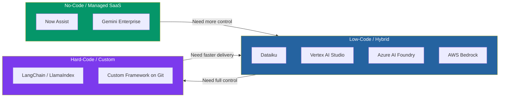
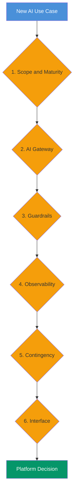
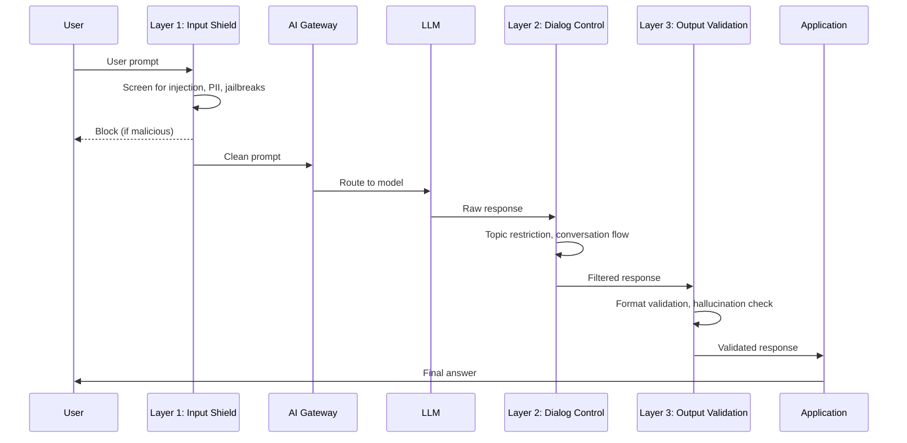
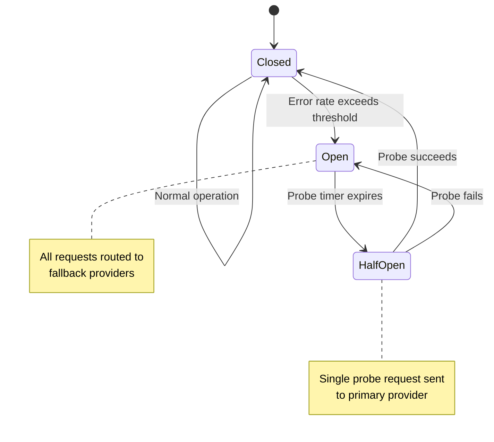
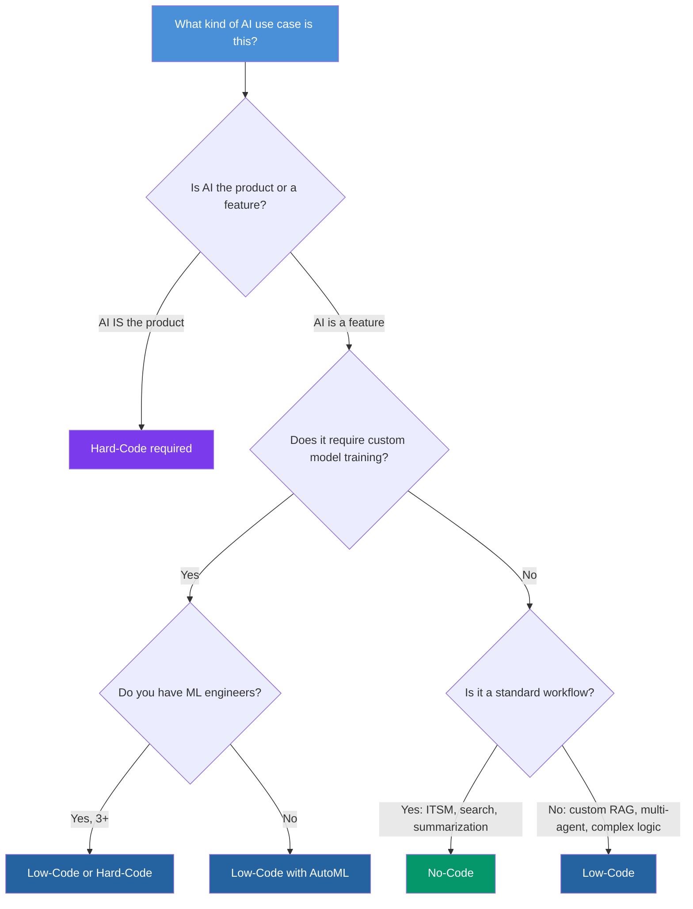

# Enterprise AI Stack: A Decision Framework That Outlasts the Hype Cycle

There's a specific moment in every organization's AI journey where the excitement curdles into paralysis. Someone — usually a VP who just returned from a conference — drops a name in a meeting. "We should be using Vertex AI." The next week it's Dataiku. The week after, someone on the data team has already spun up a LangChain prototype in a Git repo. Meanwhile, IT just renewed the ServiceNow license and is asking why nobody's using Now Assist.

Six months later, you have three disconnected pilots, two vendor contracts, a shadow LangChain repo that's somehow in production, and a CFO asking what exactly the AI budget is buying.

This isn't a technology problem. It's a decision-making problem. The AI platform market grew from $101 billion in 2025 to a projected $201 billion by 2030, and with that growth came a blizzard of overlapping tools that make rational selection nearly impossible without a framework. Forty-two percent of companies scrapped AI initiatives in 2024 due to timeline and selection failures — not technical ones.

This post doesn't tell you which tool to buy. It gives you a framework for deciding — one built around six durable axes that remain relevant even as specific products evolve. Whether you're an ML engineer evaluating options, a data scientist choosing where to build, or a CDO presenting a strategy to the board, the same axes apply. The tools plugged into them will change; the axes won't.

## The Three Paradigms: A Balanced View

Before diving into the framework, let's calibrate on the three fundamental paradigms for building AI systems. Every platform, from ServiceNow to a raw Git repo, falls somewhere on this spectrum.



### No-Code / Managed SaaS

**What it is:** Pre-built AI capabilities embedded in platforms you already use. Configuration over coding.

**Best for:** Operational productivity — IT service management, document summarization, enterprise search, employee assistants.

**Honest trade-off:** You ship in days, but you hit a ceiling within months. When your use case doesn't fit the platform's pre-built patterns, you're stuck. Migration is expensive.

**Examples:** ServiceNow Now Assist, Gemini Enterprise, Copilot for Microsoft 365.

### Low-Code / Hybrid

**What it is:** Visual tools for common workflows plus the ability to inject custom code (Python, SQL) when the visual interface isn't enough.

**Best for:** Teams with mixed skill levels — data scientists, analysts, and engineers working on the same project. MLOps at scale. Multi-model orchestration.

**Honest trade-off:** You get flexibility without building everything from scratch, but you're betting on a platform vendor's roadmap. If they deprecate a feature you depend on, you feel it.

**Examples:** Dataiku on GKE/GCP, Vertex AI Studio + Agent Builder, Azure AI Foundry, AWS Bedrock + SageMaker.

### Hard-Code / Custom

**What it is:** Full control. You write, host, and maintain the entire stack using open-source frameworks and your own infrastructure.

**Best for:** When AI *is* the product, not a feature. When regulatory requirements demand total data isolation. When you need algorithmic control that no platform exposes.

**Honest trade-off:** Maximum control comes with maximum responsibility. The 65% rule applies — 65% of software cost materializes *after* the initial deployment. A three-month build becomes a nine-month maintenance commitment. First-year costs for a serious in-house stack run $200K-$400K in engineering alone.

**Examples:** LangChain, LlamaIndex, CrewAI, custom agents on Git.

### The Cloud Provider Factor

Before evaluating paradigms, acknowledge the elephant in the room: most organizations choose their AI platform based on their existing cloud commitment. An AWS-first organization gravitates toward Bedrock. A company whose data lives in BigQuery reaches for Vertex AI. An enterprise standardized on Azure and Microsoft 365 defaults to Azure AI Foundry.

This isn't irrational — it's pragmatic. Data gravity is real. Moving terabytes of training data across cloud providers costs money and time. Identity management, networking, and compliance are already configured. The integration friction drops to near zero when you stay within the same cloud.

But here's the trap: cloud gravity can override good architectural decisions. An AWS-first organization might force Bedrock on a use case better served by Dataiku, simply because "we're an AWS shop." The framework below helps you evaluate use cases on their merits first, then factor in cloud alignment as a weighted variable — not a veto.

The three major cloud AI platforms have converged on similar capabilities but retain distinct strengths:

| Platform | Model Catalog | Unique Strength | Pricing Edge |
|----------|--------------|-----------------|-------------|
| **AWS Bedrock** | Claude, Llama, Mistral, Titan | Lowest latency for Claude models. AgentCore for agent deployment. | Pay-per-use, no provisioning needed. 25-30% better cost-performance for inference. |
| **Azure AI Foundry** | GPT, Claude, Llama, DeepSeek, 200+ models | Deepest enterprise integration (M365, Teams, Power Platform). 65% of Azure customers adopting. | Reserved capacity with 30-50% savings for predictable workloads. |
| **Vertex AI** | Gemini, open-source via Model Garden | Strongest AutoML and custom training (40-60% faster). Native BigQuery integration. | TPU support for batch processing at scale. |

### The Nuance the Vendors Won't Tell You

Most organizations need **more than one paradigm simultaneously**. The insight isn't "pick one." It's "pick the right one for each use case." Your IT helpdesk automation belongs in No-Code. Your customer-facing recommendation engine might need Hard-Code. Your analytics team's model pipeline lives in Low-Code. The framework below helps you map use cases to paradigms systematically.

## The Six Decision Axes

Here's the core of the framework. Instead of comparing platforms feature-by-feature (a moving target), evaluate every AI use case across six axes. Each axis is a question your team must answer *before* choosing a tool.



### Axis 1: Scope and Maturity

**The question:** How complex is the use case, and how mature is our team?

This is the first filter because it eliminates options immediately. A team that has never deployed an ML model in production shouldn't start with LangChain. An organization with 50 data scientists and a mature MLOps practice shouldn't constrain itself to Now Assist.

| Maturity Level | Characteristics | Recommended Paradigm |
|---|---|---|
| **Exploring** | No AI in production. Small team. Proving value to leadership. | No-Code / Managed SaaS |
| **Scaling** | 1-3 models in production. Dedicated data team. Need repeatability. | Low-Code / Hybrid |
| **Differentiating** | AI is a competitive advantage. Large engineering team. Custom requirements. | Hard-Code + Low-Code backbone |

The maturity assessment from Gartner's AI Readiness framework evaluates seven interdependent areas: strategy, product, governance, engineering, data, operating models, and culture. You don't need a formal assessment — but you need honest answers to:

- *Do we have engineers who can maintain a production ML pipeline?*
- *Do we have data governance in place, or are we still discovering where our data lives?*
- *Is AI a cost-optimization play or a revenue-generation play?*

The answers determine your starting paradigm. They don't lock you in forever — organizations naturally move from Exploring to Scaling to Differentiating over time.

### Axis 2: AI Gateway

**The question:** How do we abstract model access so we're not locked to a single provider?

An AI Gateway is the layer between your applications and the LLMs they call. It handles routing, cost tracking, rate limiting, caching, and failover. In 2026, this is no longer optional — 40% of organizations now use multi-provider setups, up from 23% a year ago.

**Why it matters:** Without a gateway, every application hard-codes API calls to a specific model (e.g., `openai.ChatCompletion.create()`). When a cheaper or better model appears — and it will — you refactor every application. With a gateway, you change the routing rule once.

The Dataiku LLM Mesh is essentially a built-in AI Gateway for Dataiku users — it abstracts model connections, enforces cost limits, and routes requests across providers (Gemini, OpenAI, self-hosted models) from a single interface. But the concept applies universally.

| Gateway | Type | Best For | Latency Overhead |
|---------|------|----------|-----------------|
| **Dataiku LLM Mesh** | Built into Dataiku | Dataiku users needing multi-model orchestration + governance | Minimal (internal) |
| **Portkey** | SaaS | Regulated industries (HIPAA, SOC 2). Multi-team governance. | 20-40ms |
| **LiteLLM** | Open-source, self-hosted | Python teams, moderate traffic (under 500 RPS), prototyping | Variable |
| **Kong AI Gateway** | Infrastructure-grade | High-throughput production (228% faster than Portkey in benchmarks) | Very low |
| **Vertex AI Model Garden** | GCP-native | Teams already on GCP. Access to Gemini + open-source models. | Minimal (same cloud) |
| **Azure AI Foundry** | Azure-native | Microsoft ecosystem. 200+ models including GPT, Claude, Llama. | Minimal (same cloud) |
| **AWS Bedrock** | AWS-native | AWS-first orgs. Lowest latency for Claude and Llama models. | Minimal (same cloud) |

The practical reality: if your organization is committed to a single cloud provider, the cloud-native gateway (Vertex, Foundry, Bedrock) is the path of least resistance. If you're multi-cloud or cloud-agnostic, an independent gateway (Portkey, Kong, LiteLLM) provides the abstraction layer you need.

**Durable principle:** Always have an abstraction layer between your application logic and your LLM calls. Whether it's a full gateway or a simple wrapper library, the goal is the same — swap models without refactoring applications. The specific tool will change; the need for abstraction won't.

### Axis 3: Guardrails

**The question:** How do we prevent the AI from doing something dangerous, wrong, or embarrassing?

This axis covers input validation (blocking prompt injection, PII leakage, off-topic requests) and output validation (preventing hallucinations, enforcing format, filtering toxic content). In production, guardrails run as middleware — intercepting every request and response before they reach the user.

The current best practice is a **layered architecture**:



| Layer | Purpose | Tools (2026) | When to Use |
|-------|---------|-------------|-------------|
| **Input Shield** | Block prompt injection, PII, jailbreaks | Lakera Guard, Llama Guard, Azure Content Safety | Always. Non-negotiable for user-facing systems. |
| **Dialog Control** | Topic restriction, conversation flow, anti-hallucination rules | NVIDIA NeMo Guardrails (v0.20), Colang policies | When the AI must stay within a defined domain. |
| **Output Validation** | Format enforcement, schema compliance, factual grounding | Guardrails AI, Pydantic + instructor, SHACL (for KG outputs) | When outputs feed into downstream systems or decisions. |

**Platform coverage:**
- **No-Code platforms** (Now Assist, Gemini Enterprise) include basic guardrails by default — content filtering, DLP, permission-aware retrieval. You can't customize them deeply, but they cover the 80% case.
- **Low-Code platforms** (Dataiku, Vertex AI) provide configurable guardrails plus the ability to inject custom validation. Dataiku's LLM Mesh includes built-in PII anonymization and toxicity detection. Vertex AI offers Responsible AI tools.
- **Hard-Code** requires you to build the entire guardrails stack yourself — NeMo Guardrails + Guardrails AI + Lakera is a common production combination, but you own every line of configuration and every failure mode.

**Durable principle:** Guardrails are not a feature — they're an architecture layer. The specific tools will evolve, but the three-layer pattern (input shield, dialog control, output validation) is stable. Budget for this layer in every project, regardless of paradigm.

### Axis 4: Observability

**The question:** Can we see what the AI is doing, why it's doing it, and whether it's getting worse?

LLM observability is fundamentally different from traditional application monitoring. You're not just tracking uptime and latency — you're tracking *semantic quality*: Is the model's output correct? Is retrieval pulling the right context? Is the system hallucinating more this week than last?

| Tool | Strengths | Deployment | Best For |
|------|-----------|------------|----------|
| **Langfuse** | Open-source. OpenTelemetry-native. 6M+ SDK installs/month. Session replays. | Self-hosted or cloud | Teams wanting full ownership of traces. Framework-agnostic. |
| **LangSmith** | Deep LangChain/LangGraph integration. Fast prototyping. | SaaS | LangChain-native teams. Rapid development loops. |
| **Arize Phoenix** | RAG pipeline debugging. Embedding drift detection. Visual retrieval analysis. | Open-source | RAG-heavy systems. Detecting silent quality degradation. |
| **Arize AX** | Data lake integration (Iceberg, Parquet). Zero-copy access. Years of data at 100x lower cost. | SaaS | Regulated industries. Long-term audit trails. |
| **Dataiku monitoring** | Built-in model monitoring, drift detection, cost tracking. | Built into Dataiku | Dataiku users. Unified MLOps + GenAI observability. |
| **Vertex AI Experiments** | Integrated with Vertex pipelines. Evaluation metrics. | GCP-native | Vertex AI users. Model comparison and A/B testing. |

The critical metrics to track across any tool:

1. **Latency distribution** (p50, p95, p99) — not just average
2. **Token usage and cost** per query, per user, per use case
3. **Retrieval relevance** — are the right chunks being pulled? (for RAG systems)
4. **Output quality scores** — LLM-as-judge, human feedback loops, or automated evaluation frameworks like RAGAS
5. **Drift detection** — is the model's behavior changing over time without explicit updates?

**Durable principle:** Observability is the difference between "our AI works" and "our AI works *and we can prove it*." For CDOs and CTOs, this is the axis that matters most for governance reporting. Track cost, quality, and drift from day one — retrofitting observability into a running system is painful and unreliable.

### Axis 5: Contingency and Resilience

**The question:** What happens when the AI fails — and how fast do we recover?

This is the axis most teams skip. They build for the happy path — the model responds, the retrieval works, the output is valid. But LLM APIs fail regularly. Anthropic's API experienced 114 incidents in a 90-day window in early 2026. Average API uptime across major providers fell from 99.66% to 99.46% between 2024 and 2025 — that's 55 minutes of downtime per week.

The resilience stack has three layers:

**Retries** — for transient glitches (network timeouts, rate limits). Exponential backoff with jitter. Simple, always implement.

**Fallbacks** — for persistent failures. A production fallback chain might look like:

```
Primary: Claude Sonnet 4 → Fallback 1: Claude Haiku → Fallback 2: GPT-4o → Fallback 3: Local model (no external dependency)
```

**Circuit breakers** — for systemic degradation. When a provider's error rate exceeds a threshold, the circuit "opens" and routes all traffic to fallbacks automatically. Closes again after a probe period. This prevents cascading failures when a provider has a bad day.



**Platform coverage:**
- **No-Code:** Resilience is fully managed by the vendor. You can't configure it, but you don't have to think about it either.
- **Low-Code:** AI Gateways (Portkey, Kong, Dataiku LLM Mesh) handle retries, fallbacks, and routing. Circuit breakers are typically configurable.
- **Hard-Code:** You build the entire resilience stack. Libraries like PyBreaker (Python) or Resilience4j (Java) help, but you own the configuration and testing.

**Emerging challenge:** Classic circuit breakers assume binary failure (up or down). But LLM failures are often *partial* — the model responds, but the quality degrades (more hallucinations, worse reasoning). Production systems in 2026 are starting to implement **semantic circuit breakers** that detect quality degradation, not just HTTP errors.

**Durable principle:** Design for failure from day one. Every LLM call should have a defined fallback. Every fallback should have a graceful degradation path. The specific providers will change; the need for resilience won't.

### Axis 6: Interface and User Access

**The question:** How do different users in the organization interact with the AI system?

This axis is often treated as an afterthought — "we'll build a chat UI." But the interface determines adoption, and adoption determines ROI. Different user personas need different access patterns:

| Persona | What They Need | Interface Pattern |
|---------|---------------|------------------|
| **Executive / CDO** | Dashboards. Cost reports. Quality metrics. Compliance status. | Observability dashboards (Langfuse, Dataiku monitoring, custom BI) |
| **Business analyst** | Query data without code. Build simple workflows. | No-Code tools (Gemini Enterprise, Now Assist, Dataiku visual recipes) |
| **Data scientist** | Experiment with models. Fine-tune. Build RAG pipelines. | Low-Code + notebooks (Dataiku, Vertex AI, Azure AI Foundry) |
| **ML engineer** | Full control. CI/CD. Custom agents. Production deployment. | Hard-Code (LangChain, custom frameworks, Git + CI/CD) |
| **End user (non-technical)** | Ask a question, get an answer. Submit a ticket. Summarize a document. | Chat interfaces, embedded assistants, Slack/Teams bots |

The mistake most teams make is building for one persona and hoping the others adapt. A successful enterprise AI deployment provides **tiered access** — the same underlying knowledge base and model infrastructure, exposed through different interfaces for different users.

**Platform mapping:**
- **Gemini Enterprise** excels here — it's designed as the "front door" for non-technical employees, with permission-aware search across Google Workspace and Microsoft 365. No infrastructure to manage.
- **Now Assist** provides AI directly within ServiceNow workflows — no separate interface needed for IT and HR operations.
- **Dataiku** spans analysts (visual tools) and engineers (Python/R) on the same project, making it the natural choice for hybrid teams.
- **Vertex AI / Azure AI Foundry / Bedrock** are primarily builder tools — they provide the backend that powers interfaces you build yourself.
- **LangChain / custom** — you build every interface from scratch. Maximum control, maximum effort.

**Durable principle:** Your AI system needs at least two interfaces — one for builders, one for consumers. The consumer interface determines adoption rates. Invest in it proportionally.

## The Platform Landscape: Mapped to the Axes

Now that the axes are defined, here's how the major platforms map against them. This isn't a "best platform" ranking — it's a compatibility matrix.

| Platform | Scope Sweet Spot | Gateway | Guardrails | Observability | Contingency | Interface |
|----------|-----------------|---------|------------|---------------|-------------|-----------|
| **Now Assist** | ITSM, CSM, HR ops | N/A (single model) | Built-in (basic) | ServiceNow reporting | Managed by vendor | Embedded in ServiceNow |
| **Gemini Enterprise** | Org-wide productivity | Google models + Workspace | DLP, IAM-aware, content filtering | Google Cloud Monitoring | Managed by Google | Chat, Workspace integration |
| **Dataiku (GKE)** | ML lifecycle + GenAI | LLM Mesh (multi-model) | PII anonymization, toxicity | Built-in monitoring + cost | LLM Mesh routing | Visual + code notebooks |
| **Vertex AI** | Custom ML + RAG + agents | Model Garden (150+ models) | Responsible AI tools | Vertex Experiments | Configurable | Agent Builder (low-code) + ADK (code) |
| **Azure AI Foundry** | Enterprise AI apps | 200+ models, multi-provider | Azure Content Safety, RBAC | Tracing, monitoring, evals | Multi-region, managed | Foundry portal + SDK |
| **AWS Bedrock** | Foundation model access | Model catalog, AgentCore | Guardrails API | CloudWatch + Bedrock logs | Multi-model routing | Console + SDK |
| **LangChain/Custom** | Full custom control | You build it (LiteLLM, etc.) | You build it (NeMo, etc.) | You build it (Langfuse, etc.) | You build it | You build it |

## The Decision Framework

With the axes and platforms mapped, here's how to actually make decisions. For each new AI use case, run through this sequence:

### Step 1: Classify the Use Case



### Step 2: Score Against the Axes

For each use case, rate the importance of each axis on a 1-5 scale, then match to the platform that scores highest where it matters most.

| Axis | Weight (1-5) | Guiding Question |
|------|:---:|---|
| Scope / Maturity | — | How complex is this, and can our team handle it? |
| Gateway | — | Do we need multi-model flexibility, or is one provider enough? |
| Guardrails | — | What's the risk if the AI produces wrong or harmful output? |
| Observability | — | How important is proving quality to regulators or leadership? |
| Contingency | — | What's the business impact of 1 hour of AI downtime? |
| Interface | — | Who uses this — engineers only, or the entire organization? |

A high-stakes, customer-facing RAG system might score: Gateway=5, Guardrails=5, Contingency=5, Observability=4, Interface=3, Scope=3. That profile screams Low-Code with robust gateway + guardrails (Dataiku or Vertex AI + external guardrails stack).

An internal IT helpdesk automation might score: Interface=5, Scope=2, Guardrails=3, Gateway=1, Contingency=2, Observability=2. That's Now Assist if you're on ServiceNow, or Gemini Enterprise if you're on Google Workspace.

### Step 3: Check the Cost Reality

The PDF's cost analysis is directionally correct but undersells the nuance:

| Paradigm | Year 1 Cost | Ongoing Annual | Hidden Costs |
|----------|-------------|---------------|--------------|
| **No-Code** | $50K-150K (licensing) | Predictable, per-seat | Ceiling: you outgrow it and migration is expensive |
| **Low-Code** | $100K-300K (platform + cloud) | Variable (compute + licensing) | FinOps discipline required to avoid runaway cloud spend |
| **Hard-Code** | $200K-500K (engineering) | $150K-400K (maintenance) | 65% of cost is post-deployment. Talent retention risk. |

The critical insight: **the cheapest option is the one that matches your use case**. A Hard-Code system that should have been No-Code wastes $300K in over-engineering. A No-Code system that should have been Low-Code wastes $300K in migration costs when you hit the ceiling.

### Step 4: Map Your Portfolio

Most enterprises end up with a portfolio of paradigms — not a single choice. A common pattern:

| Layer | Paradigm | Platform | Serves |
|-------|----------|----------|--------|
| **Employee productivity** | No-Code | Gemini Enterprise or Copilot | All employees |
| **IT/HR operations** | No-Code | Now Assist (if on ServiceNow) | Support teams |
| **Analytics + ML** | Low-Code | Dataiku on GKE | Data team |
| **Custom RAG / Agents** | Low-Code | Vertex AI or Azure AI Foundry | Engineering |
| **Core product AI** | Hard-Code | Custom on Git | Product engineering |
| **Cross-cutting** | Infrastructure | AI Gateway + Guardrails + Observability | Platform team |

The "cross-cutting" layer is what ties it all together. An AI Gateway (LLM Mesh, Portkey, or cloud-native) provides a single control plane for cost, routing, and governance across all paradigms. Observability tools (Langfuse, Arize) aggregate traces from every layer. Guardrails policies apply consistently regardless of which platform generated the output.

## Making It Durable: Principles Over Products

The platforms in this post will evolve. Some will merge, some will die, some that don't exist yet will dominate in 18 months. But the framework survives because it's built on principles, not products:

1. **Separate the interface from the infrastructure.** How users access AI is a different decision from how AI is built and run. Conflating them leads to choosing platforms for the wrong reasons.

2. **Always have an abstraction layer between your code and your models.** Whether it's an AI Gateway, an LLM Mesh, or a simple wrapper library — never hard-code model calls directly into application logic.

3. **Guardrails are architecture, not afterthoughts.** Budget for input validation, dialog control, and output validation in every project. The three-layer pattern is stable even as tools change.

4. **Observability is your governance story.** When the board asks "is our AI safe?", the answer lives in your traces, quality scores, and cost dashboards. Build this from day one.

5. **Design for failure.** Every LLM call should have a fallback. Every fallback should have a degradation path. Uptime numbers for LLM APIs are worse than you think.

6. **Match paradigm to use case, not to organizational preference.** The same company should comfortably run No-Code for productivity, Low-Code for analytics, and Hard-Code for product AI. Forcing a single paradigm across all use cases is the root cause of most enterprise AI failures.

7. **Revisit quarterly.** The scoring matrix from Step 2 isn't a one-time exercise. Re-evaluate as your team matures, as new tools emerge, and as use cases evolve from experimental to production.

### How to Present This to Leadership

If you're the person who needs to sell this framework internally, here's the translation layer:

**For the CDO/CTO:** "We're not choosing one AI tool — we're building an AI capability portfolio. Each use case maps to the right paradigm based on six criteria. Here's the scoring for our top five use cases, and here's the cost projection for each."

**For the CFO:** "Hard-Code everything costs $400K+ year one and $300K+ ongoing. Smart layering — No-Code for productivity, Low-Code for analytics, Hard-Code only for differentiators — cuts total cost by 40-60% while increasing coverage. Here's the TCO comparison by scenario."

**For the Board:** "Our AI strategy has three layers: managed tools for everyday productivity (low risk, fast deployment), hybrid platforms for our data and ML operations (moderate investment, high flexibility), and custom development only where AI is our competitive moat. Every layer has built-in guardrails, observability, and fallback plans."

The framework isn't just a technical decision tool — it's a communication structure that lets different stakeholders understand AI investments in terms they care about: risk, cost, speed, and competitive advantage.

## Going Deeper

**Books:**
- Lakshmanan, V., Robinson, S., & Munn, M. (2020). *Machine Learning Design Patterns.* O'Reilly.
  - Solutions to recurring ML problems in data preparation, model building, and MLOps. The "Build vs Buy" and "Workflow Pipeline" patterns directly inform platform selection decisions.
- Huyen, C. (2022). *Designing Machine Learning Systems.* O'Reilly.
  - Covers the full ML lifecycle with emphasis on production concerns: data engineering, feature stores, deployment, monitoring. Essential reading before choosing any platform.
- Reis, J. & Housley, M. (2022). *Fundamentals of Data Engineering.* O'Reilly.
  - The data infrastructure perspective that should precede any AI platform decision. Your AI platform is only as good as your data platform.
- Beyer, B. et al. (2016). *Site Reliability Engineering.* O'Reilly.
  - The resilience patterns (circuit breakers, graceful degradation, error budgets) in this post draw directly from SRE principles applied to AI systems.

**Online Resources:**
- [A Framework for the Adoption and Integration of Generative AI (FAIGMOE)](https://arxiv.org/html/2510.19997v1) — Academic framework for GenAI adoption in midsize organizations. Provides a structured methodology for build-vs-buy decisions.
- [Portkey: Retries, Fallbacks, and Circuit Breakers in LLM Apps](https://portkey.ai/blog/retries-fallbacks-and-circuit-breakers-in-llm-apps/) — Practical guide to the resilience patterns discussed in the Contingency axis.
- [A Definitive Guide to AI Gateways in 2026](https://www.truefoundry.com/blog/a-definitive-guide-to-ai-gateways-in-2026-competitive-landscape-comparison) — Comprehensive comparison of AI Gateway solutions with benchmarks and architecture patterns.
- [Top 5 LLM Observability Platforms for 2026](https://www.getmaxim.ai/articles/top-5-llm-observability-platforms-for-2026/) — Side-by-side evaluation of Langfuse, LangSmith, Arize, and alternatives with deployment considerations.

**Videos:**
- [Knowledge Graphs and Graph Databases Explained](https://youtu.be/p4W56HYaO_s) — Covers how knowledge graphs and ontologies fit into enterprise AI architectures, relevant to the data foundation layer of platform selection.

**Academic Papers:**
- Shankar, S. et al. (2025). ["Who Validates the Validators? Aligning LLM-Assisted Evaluation of LLM Outputs with Human Preferences."](https://arxiv.org/abs/2404.12272) *arXiv:2404.12272*.
  - Critical for understanding how to evaluate AI quality — directly relevant to the Observability axis and choosing evaluation frameworks.
- Pan, J. et al. (2026). ["Construct, Align, and Reason: Large Ontology Models for Enterprise."](https://arxiv.org/abs/2602.00029) *arXiv:2602.00029*.
  - Introduces the Large Ontology Model framework — relevant for teams considering ontology-driven knowledge bases as part of their AI stack.
- Zhao, W.X. et al. (2023). ["A Survey of Large Language Models."](https://arxiv.org/abs/2303.18223) *arXiv:2303.18223*.
  - Comprehensive survey covering model capabilities, training approaches, and evaluation — essential background for anyone making model selection decisions.

**Questions to Explore:**
- If 42% of AI initiatives fail due to selection and timeline issues rather than technical ones, is the real bottleneck organizational decision-making capacity rather than engineering capability?
- As AI Gateways commoditize model access, does the "model" become irrelevant — with competitive advantage shifting entirely to data quality, guardrails design, and domain-specific fine-tuning?
- Can a single enterprise AI platform ever serve the full spectrum from No-Code to Hard-Code, or is the multi-platform portfolio the permanent steady state?
- How should organizations measure the ROI of guardrails and observability — investments that prevent losses rather than generate revenue?
- If the average LLM API downtime is 55 minutes per week, what's the real cost of *not* implementing a multi-provider fallback strategy — and why do most teams still skip it?
