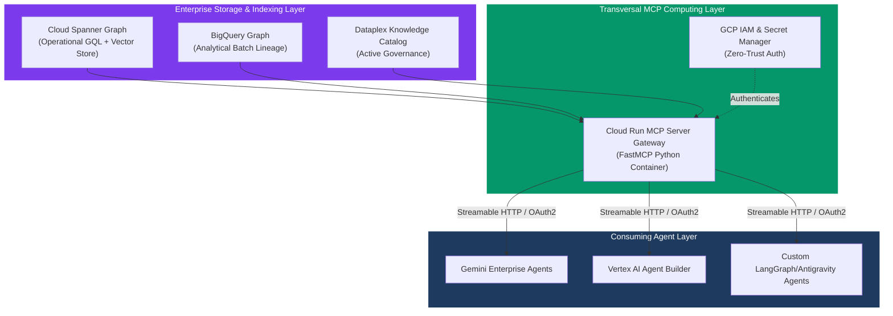
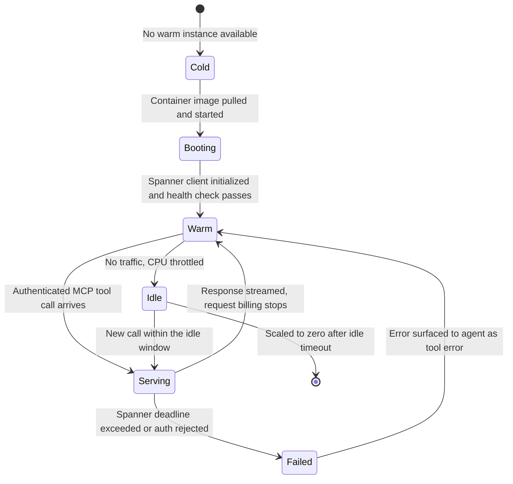
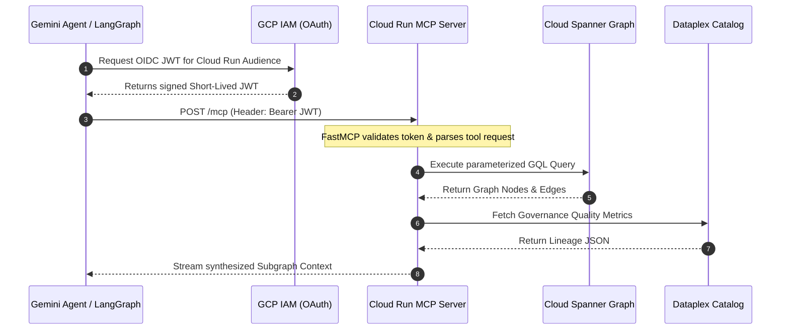

# Enterprise Knowledge Graphs on GCP: Cloud Spanner Graph, Dataplex, and Transversal MCP Servers on Cloud Run

Imagine a mid-sized fintech company in late 2026. Over the course of nine months, six different teams enthusiastically embraced the agentic revolution. The customer support team deployed an agent to resolve billing disputes, backed by a vector index of Zendesk tickets. The data engineering team launched a copilot to debug Airflow pipelines, querying a Neo4j instance they spun up over a weekend. The security operations center rolled out a threat-hunting assistant, connected to an asset inventory database. 

On paper, this was a massive win for AI adoption. In reality, it was chaos. 

Six agents meant six independent ways to retrieve "the truth." Each agent built its own retrieval system, maintained its own disconnected schemas, and wrote its own fragile API glue code. When the compliance team asked a critical question—"Which of our microservices touch GDPR-regulated user data, and who owns them?"—no single agent could answer it, because the knowledge was shattered across six disconnected silos. 

When you build agents in an enterprise context, you eventually hit a hard ceiling: the siloed context problem. If you leave teams to their own devices, they will reinvent knowledge retrieval from scratch. To make agents truly effective at a global scale, you do not need more models. You need a **transversal, governed Context Engine**. 

In Google Cloud Platform (GCP), we can solve this by moving away from fragmented vector silos and toward a native, integrated architecture. We combine **Cloud Spanner Graph** for globally consistent graph storage, **Dataplex Knowledge Catalog** for business lineage, and **Model Context Protocol (MCP)** endpoints deployed on **Cloud Run**. 

This post is a blueprint for building that stack. We will break down why this specific architecture wins, how to model operational knowledge natively in Spanner using GQL, and how to expose that knowledge securely through MCP so any agent can consume it.

---

## The Transversality Problem

Before we write a single line of SQL or spin up a container, let's talk about what "transversality" actually means in the context of [The Production Graph Stack](/blog/production-graph-stack-agents-mcp-ontologies). 

Most organizations build context for their agents the way rural homes get water: every house drills its own well. The marketing team extracts their PDFs into a Milvus cluster; the dev team drops their documentation into Pinecone. This works for isolated proof-of-concept projects. But what happens when the developer's agent needs to understand the business implications of a feature, or when the marketing agent needs to check if a technical dependency supports a campaign? They can't. The wells are disconnected.

Transversality is the municipal water supply. It is the architectural principle that enterprise knowledge—who owns what, what depends on what, and what rules apply—should be extracted, governed, and served centrally, available on tap to any authorized agent that needs it. 

When we talk about building [Knowledge Catalog vs Ontologies](/blog/knowledge-catalog-vs-ontologies), we are talking about building shared infrastructure. Transversality solves three massive problems:

1. **Governance and Trust:** If every agent has its own index, how do you enforce access control? How do you guarantee the customer support agent isn't accidentally reading PII intended only for the legal agent? A transversal system enforces attribute-based access control (ABAC) at the root.
2. **Discovery:** When a new agent is deployed, it shouldn't have to scrape the intranet. It should immediately discover the available enterprise tools and schemas. 
3. **Data Quality and Lineage:** If the source data changes—say, a microservice is deprecated—a transversal graph updates once, and every agent in the enterprise instantly benefits from the new truth.

Building this requires moving away from the ad-hoc scripts we used to tolerate. It demands robust, enterprise-grade tooling. 

---

## Topography of the GCP Graph & Agent Ecosystem

A common misconception when building knowledge graphs on GCP is that you need to self-host Neo4j on Compute Engine or deploy complex third-party graph clusters. Two years ago, that might have been true. But in modern GCP architecture, graph, vector, relational, and catalog workloads are natively integrated into the core cloud fabric.

Let's look at the map of how these components interlock.



Notice the strict separation of concerns.

The **Storage and Indexing Layer** is where the truth lives. We use Cloud Spanner for real-time operational graphs. We use BigQuery for offline, massive-scale analytical queries (like cross-department community detection). We anchor the metadata in Dataplex. 

The **Transversal MCP Computing Layer** is the bridge. As I detailed in [MCP in Production](/blog/mcp-production-enterprise), the Model Context Protocol is the standard that saved us from writing custom REST wrappers for every new agent. We deploy an MCP server on Cloud Run to act as the universal translator between the raw graph data and the agents that need it.

The **Consuming Agent Layer** is fully decoupled. Whether you are using [Gemini Enterprise Knowledge Catalog](/blog/gemini-enterprise-knowledge-catalog-deep-dive) integration, Vertex AI Agent Builder, or a custom open-source framework, the agents all connect to the same streamable HTTP endpoint and discover the same standardized tools. 

Let's zoom into the first critical piece: the database.

---

## Choosing the Graph Store Before You Commit

Every time I propose Spanner Graph, someone in the room asks the reasonable question: *why not Neo4j?* It deserves a real answer rather than a shrug, because the graph-store decision is the one you cannot cheaply reverse. The MCP layer above it is a few hundred lines of Python you can rewrite in an afternoon. The store holds your data, your access model, and your operational muscle memory.

Here is the honest comparison across the dimensions that actually change the outcome.

| Dimension | Cloud Spanner Graph | Neo4j Aura | Neptune Analytics | Self-hosted Neo4j or JanusGraph on GKE |
|---|---|---|---|---|
| Consistency model | External consistency, distributed ACID across regions | ACID within a single primary, read replicas eventually behind | Snapshot reads over a loaded graph, not a transactional OLTP store | ACID on the primary, causal cluster semantics you configure and own |
| Query surface | ISO GQL 39075, plus SQL/PGQ interop through `GRAPH_TABLE` | Cypher, the deepest and most mature dialect | openCypher and Gremlin, plus SPARQL on Neptune Database | Cypher or Gremlin, whatever the engine ships |
| Colocated vectors | Native in the same tables, same transaction, same snapshot | Vector index in the same database, separate index lifecycle | Vector support inside the analytics engine | Bolt on a separate vector store and reconcile it yourself |
| Ops burden | None beyond capacity sizing and schema review | Low, managed control plane, you still tune memory | Low, but you manage graph load and refresh cycles | High: upgrades, backups, HA, JVM heap, page cache tuning |
| Cost shape | Provisioned processing units billed continuously, per replica | Reserved RAM tier billed continuously regardless of query volume | Provisioned capacity units billed per hour while the graph is loaded | Node hours plus persistent disks plus your engineers' time |
| Scaling ceiling | Horizontal, trillions of edges, splits and Paxos handle it | Vertical first; the working set wants to fit in RAM | Bounded by the capacity units you load the graph into | Whatever you are willing to operate at 3 AM |
| Analytical traversals | Bounded operational traversals; built-in algorithms on Enterprise editions | Strong, with the Graph Data Science library | Strongest of the four for whole-graph algorithms | Strong if you tune it, weak if you do not |
| Natural fit | Operational enterprise graph already adjacent to relational data on GCP | Graph-first product where Cypher expressiveness is the point | Periodic large-scale graph analytics over a loaded snapshot | Regulated on-prem, or a team with real graph SRE depth |

Read that table as a decision procedure, not a scoreboard. If your canonical entities already live in Spanner or in a relational store you plan to migrate to Spanner, the ETL tax you avoid by projecting a graph over existing tables dominates every other consideration. If your organization's center of gravity is a graph-native product team that thinks in Cypher and runs community detection weekly, Aura or Neptune Analytics will feel better and you should not fight it.

The dimension people under-weight is the **security boundary**. In the transversal architecture, the graph is going to be read by agents acting on behalf of humans with wildly different clearance levels. Every additional data store is an additional IAM surface, an additional audit log format, and an additional place where a row-level policy can be wrong. Spanner Graph collapses graph, relational, full-text, and vector access into one boundary governed by one set of GCP identities. That collapse is worth more in an enterprise than a marginally nicer query dialect.

---

## Modeling Operational Knowledge in Cloud Spanner Graph (ISO GQL)

If you've spent time building [Knowledge Graphs in Practice](/blog/knowledge-graphs-practice), you've likely wrestled with the ETL tax. You have your canonical relational data in Postgres or Spanner, and you have to constantly sync it to a separate graph database to answer multi-hop queries. 

Cloud Spanner Graph changed this equation. It provides a natively integrated graph engine directly on top of your relational tables. You define the graph schema *over* the relational data using ISO GQL (Graph Query Language). No data duplication. No ETL pipelines breaking at 2 AM. 

### Why GQL?

Before we look at the code, we need to address the elephant in the room: why GQL over Cypher? Cypher has been the de facto standard for a decade. But as I explored in [Understanding Cloud Spanner](/blog/spanner-graph-for-knowledge-and-agents), ISO GQL is the industry's answer to fragmentation. It's an official ISO standard (ISO/IEC 39075), sitting right alongside SQL. By adopting GQL, Google guarantees that Spanner's graph querying is standard, predictable, and deeply interoperable with its SQL engine. 

Let's model a simplified enterprise architecture: Microservices depending on Databases.

First, we define the standard relational tables. This is your bedrock. Notice how we seamlessly include a vector embedding column in the `Microservices` table. Spanner natively supports exact and approximate nearest neighbor search alongside relational and graph queries.

```sql
-- Microservices Table
CREATE TABLE Microservices (
    service_id STRING(64) NOT NULL,
    service_name STRING(128) NOT NULL,
    tier STRING(32) NOT NULL,
    embedding ARRAY<FLOAT64>(VECTOR_LENGTH(768)),
) PRIMARY KEY (service_id);

-- Databases Table
CREATE TABLE Databases (
    db_id STRING(64) NOT NULL,
    db_name STRING(128) NOT NULL,
    compliance_scope STRING(64) NOT NULL,
) PRIMARY KEY (db_id);

-- Edge Table: Microservice -> Database Dependency
CREATE TABLE ServiceDatabaseDependencies (
    service_id STRING(64) NOT NULL,
    db_id STRING(64) NOT NULL,
    dependency_type STRING(32) NOT NULL,
    created_at TIMESTAMP NOT NULL,
    FOREIGN KEY (service_id) REFERENCES Microservices (service_id),
    FOREIGN KEY (db_id) REFERENCES Databases (db_id)
) PRIMARY KEY (service_id, db_id);
```

We have our nodes and edges stored relationally. Now, the magic happens. We project a Property Graph over these tables. 

This isn't a migration; it's a view. Your relational primary keys become your graph node identifiers. 

```sql
-- Create ISO GQL Property Graph over relational schemas
CREATE PROPERTY GRAPH EnterpriseITGraph
  NODE TABLES (
    Microservices
      KEY (service_id)
      LABEL Microservice
      PROPERTIES (service_id, service_name, tier),
    Databases
      KEY (db_id)
      LABEL Database
      PROPERTIES (db_id, db_name, compliance_scope)
  )
  EDGE TABLES (
    ServiceDatabaseDependencies
      KEY (service_id, db_id)
      SOURCE KEY (service_id) REFERENCES Microservices (service_id)
      DESTINATION KEY (db_id) REFERENCES Databases (db_id)
      LABEL DEPENDS_ON
      PROPERTIES (dependency_type, created_at)
  );
```

Now, when an agent needs to understand the blast radius of a change, it doesn't need to fumble through clumsy recursive SQL joins. It can execute a clean, expressive GQL traversal.

Imagine the agent is asked: *"What GDPR databases are affected if the critical billing microservice goes down?"* 

The query looks like this:

```sql
-- Query 2-hop dependencies for critical compliance services in GQL
GRAPH EnterpriseITGraph
MATCH (m:Microservice {tier: 'CRITICAL'})-[e:DEPENDS_ON]->(d:Database)
WHERE d.compliance_scope = 'GDPR'
RETURN m.service_name AS service, e.dependency_type AS rel, d.db_name AS database;
```

What could go wrong here? The primary risk is unbounded depth. If an agent hallucinates a query like `MATCH (a)-[*]->(b)`, it will attempt to traverse the entire enterprise graph, locking up resources and blowing through compute budgets. This is exactly why we **never let the agent write raw GQL queries**. Instead, we abstract these queries behind MCP tools with strict parameters.

### The GQL surface you will actually use

Three pieces of the GQL surface carry most of the weight in an enterprise graph, and all three have syntax that will trip you up if you arrive fluent in Cypher.

**Quantified path patterns** replace Cypher's asterisk notation. Where Cypher writes `[:DEPENDS_ON*1..3]`, Spanner Graph writes `[:DEPENDS_ON]{1,3}`. The brace form is not cosmetic: the bounds are mandatory in practice for anything an agent can reach, and writing them forces you to think about depth at authoring time rather than at incident time.

**Path uniqueness modes** decide whether a traversal can revisit an edge. The default permits repetition, which in a dependency graph with a cycle means a bounded query can still return a combinatorial blowup of near-duplicate paths. Adding `TRAIL` — which forbids repeating an edge within a single path — is usually what you meant, and it is the single highest-leverage keyword in the whole dialect for keeping agent-facing queries sane.

**Returning graph elements requires serialization.** You cannot hand a raw node or a raw path back to a client; you wrap it with `TO_JSON` or `SAFE_TO_JSON`. That is mildly annoying in a SQL console and quietly excellent in an MCP server, because JSON is exactly the shape you want to hand to a model anyway.

Beyond those, the parameter sigil is `@name` rather than Cypher's `$name`, `CALL ... YIELD` procedure invocation is absent, and the path helpers Cypher users lean on — `length()`, `nodes()`, `relationships()`, `startNode()`, `endNode()` — either do not exist or are expressed differently. None of this is hard. All of it will burn an afternoon if you assume openCypher parity and discover otherwise mid-migration. Google publishes a mapping table for exactly this, and it is worth reading in full before you write your first production traversal.

---

## Building the Transversal MCP Server on Cloud Run

We need to serve this graph to our agents safely. We want to expose the power of Spanner and the metadata from Dataplex without exposing the underlying database credentials or allowing raw query execution. 

We use the [Model Context Protocol](/blog/model-context-protocol) to build a standardized interface. By wrapping our parameterized queries into MCP tools, any agent that speaks MCP can instantly discover and use them. 

We are deploying this on **Cloud Run**. Why not Google Kubernetes Engine (GKE)? Because for a stateless MCP server, Cloud Run is vastly superior. It scales to zero when no agents are querying it, saving money. It scales infinitely when a fleet of 500 agents all wake up at 9 AM. And critically, it natively integrates with GCP IAM, allowing us to implement zero-trust authentication without writing a single line of OAuth logic.

Here is the production-grade Python implementation of our MCP server using `FastMCP`.

```python
import os
import json
from typing import Dict, List, Any, Optional
from google.cloud import spanner
from google.cloud import dataplex_v1
from mcp.server.fastmcp import FastMCP

# Initialize FastMCP server with Streamable HTTP transport support
mcp = FastMCP("GCP-Enterprise-Knowledge-Engine")

# Environment & Connection Configuration
PROJECT_ID = os.getenv("GCP_PROJECT", "my-enterprise-project")
INSTANCE_ID = os.getenv("SPANNER_INSTANCE", "production-spanner")
DATABASE_ID = os.getenv("SPANNER_DATABASE", "enterprise-graph-db")

# Initialize Spanner Client
spanner_client = spanner.Client(project=PROJECT_ID)
instance = spanner_client.instance(INSTANCE_ID)
database = instance.database(DATABASE_ID)

def run_spanner_gql(gql_query: str, params: Dict[str, Any] = None) -> List[Dict[str, Any]]:
    """Helper function to safely execute parameterized GQL queries."""
    with database.snapshot() as snapshot:
        results = snapshot.execute_sql(gql_query, params=params)
        columns = [field.name for field in results.metadata.row_type.fields]
        rows = []
        for row in results:
            rows.append(dict(zip(columns, row)))
        return rows

@mcp.tool()
def query_service_dependencies(service_id: str, max_depth: int = 2) -> str:
    """
    Query the operational dependency graph for a specific microservice in Cloud Spanner Graph.
    Returns the downstream database and API dependencies along with compliance scopes.
    """
    # Defensive programming: hard limit on traversal depth to prevent OOMs
    if max_depth > 3:
        max_depth = 3  

    # The GQL is fixed and parameterized. The agent cannot inject malicious queries.
    gql_statement = """
    GRAPH EnterpriseITGraph
    MATCH (s:Microservice {service_id: @service_id})-[e:DEPENDS_ON]->(d:Database)
    RETURN s.service_name AS service, e.dependency_type AS dep_type, d.db_name AS db, d.compliance_scope AS compliance
    """
    
    records = run_spanner_gql(gql_statement, params={"service_id": service_id})
    
    if not records:
        return f"No dependencies found for service `{service_id}` in Spanner Graph."

    # Format explicitly for LLM consumption (Markdown lists)
    summary = [f"### Dependency Subgraph for Service: `{service_id}`\n"]
    for r in records:
        summary.append(
            f"- Service **{r['service']}** --[{r['dep_type']}]--> DB **{r['db']}** "
            f"(Compliance: `{r['compliance']}`)"
        )
        
    return "\n".join(summary)

@mcp.tool()
def inspect_dataplex_lineage(asset_id: str) -> str:
    """
    Inspect Dataplex Knowledge Catalog governance signals, lineage, and data quality scores.
    Use this to verify if an asset is approved for production LLM consumption.
    """
    # In production, this invokes the actual Dataplex API client
    # For illustration, we return the expected structural response
    catalog_metadata = {
        "asset_id": asset_id,
        "governance": {
            "classification": "CONFIDENTIAL_PII",
            "quality_score": 0.98,
            "owner": "data-engineering-team@enterprise.com",
            "last_scanned": "2028-06-30T12:00:00Z"
        },
        "upstream_lineage": ["raw_events_bucket", "pubsub_ingest_pipeline"]
    }
    
    return json.dumps(catalog_metadata, indent=2)

if __name__ == "__main__":
    # Cloud Run requires the server to bind to the port defined in the environment
    port = int(os.getenv("PORT", "8080"))
    mcp.run(transport="streamable-http", host="0.0.0.0", port=port)
```

The design decisions here are deliberate. Notice how we use parameterized variables (`@service_id`) in our GQL statement. This prevents graph injection attacks. Also note how we strictly enforce `max_depth = 3`. If you let a rogue agent request a depth of 10 on a highly connected graph, it will pull millions of nodes and crash your server. You must protect the database from the agent. For deeper context on how this fits into an enterprise pipeline, read [Ontologies in Production on GCP](/blog/ontology-production-pipeline-gcp).

---

## Transport, Sessions, and Cold Starts

The line `mcp.run(transport="streamable-http", ...)` looks like a detail. It is the most consequential deployment decision in the whole server, because it determines whether Cloud Run's autoscaler is your friend or your enemy.

MCP's older transport pairing — HTTP POST for requests with a long-lived Server-Sent Events channel for responses — assumes the client and server share a session that outlives a single request. On a platform that can spin up a new container for your next call and reap the old one after a minute of idleness, that assumption is a bug generator. Streamable HTTP in stateless mode makes every request self-contained: the server rebuilds whatever transient context it needs, answers, and forgets. That is precisely the contract Cloud Run wants.

| Option | How it behaves | Cold start exposure | Autoscaling | IAM posture | When to pick it |
|---|---|---|---|---|---|
| Streamable HTTP, stateless | Every POST is independent; no `Mcp-Session-Id` to honor | Full cold start on the first call to a new instance | Clean horizontal scale to any instance count | One OIDC token per request, easy to audit per call | Default for a transversal read-mostly graph server |
| Streamable HTTP, session-scoped | Server tracks a session id across calls | Cold start plus a session re-establishment round trip | Requires session affinity, which round-robin routing breaks | Token still per request, but session state widens the blast radius of a leak | Only when a tool genuinely needs multi-call state, like a paged traversal cursor |
| Legacy HTTP plus SSE | Separate endpoints for post and stream | Stream must survive instance recycling; it often does not | Poor; the stream pins a client to one instance | Long-lived connection outlives short-lived token freshness | Legacy clients you cannot upgrade yet |
| Stateless plus min-instances 1 | Same as stateless, one instance kept warm | Effectively eliminated for the first caller | Same as stateless above the warm floor | Identical | Latency-sensitive interactive agents where p99 matters |

Cloud Run does offer session affinity, but affinity is a best-effort hint routed on a cookie, and most MCP clients call the server through a plain `fetch` that never forwards `Set-Cookie`. Designing around affinity means designing around a guarantee you do not have. Build stateless, and if a tool needs continuation, put the continuation in an opaque cursor token that the client passes back as a parameter. The cursor lives in the request, not in the instance.

The instance lifecycle is worth drawing, because the cost section later depends on understanding it.



Two details in that diagram cost real money and real latency. First, the `Booting` transition includes constructing the Spanner client and opening its session pool, which is the expensive part of a cold start for this workload — build it at module import so it happens once per instance rather than once per request, exactly as the server code above does. Second, the `Serving` to `Failed` edge must return a structured MCP tool error rather than a 500. An agent that receives a well-formed error can retry with a narrower query; an agent that receives a stack trace will hallucinate around it.

---

## Containerization & Production Deployment to Cloud Run

To make this server available transversally, we package it into a minimal Docker container and push it to Artifact Registry. 

```dockerfile
FROM python:3.11-slim

# Prevent buffering for clean Cloud Logging and disable bytecode caching
ENV PYTHONUNBUFFERED=1 \
    PYTHONDONTWRITEBYTECODE=1

WORKDIR /app
COPY requirements.txt .
RUN pip install --no-cache-dir -r requirements.txt
COPY server.py .

EXPOSE 8080
CMD ["python", "server.py"]
```

Deployment is handled via a standard bash script. Pay special attention to the IAM policy bindings at the bottom. We deploy the service with `--no-allow-unauthenticated`. This means the public internet cannot hit our MCP server. Only authenticated GCP identities with the `roles/run.invoker` role can access it. 

```bash
#!/usr/bin/env bash
set -euo pipefail

PROJECT_ID="my-enterprise-project"
REGION="us-central1"
SERVICE_NAME="enterprise-mcp-context-engine"
IMAGE_URI="${REGION}-docker.pkg.dev/${PROJECT_ID}/mcp-repo/${SERVICE_NAME}:latest"

echo "==> Building container image in Artifact Registry..."
gcloud builds submit --tag "${IMAGE_URI}" .

echo "==> Deploying MCP Server to Cloud Run..."
gcloud run deploy "${SERVICE_NAME}" \
    --image="${IMAGE_URI}" \
    --platform=managed \
    --region="${REGION}" \
    --no-allow-unauthenticated \
    --min-instances=0 \
    --max-instances=10 \
    --memory=1Gi \
    --cpu=1 \
    --set-env-vars="GCP_PROJECT=${PROJECT_ID},SPANNER_INSTANCE=production-spanner,SPANNER_DATABASE=enterprise-graph-db" \
    --service-account="mcp-server-sa@${PROJECT_ID}.iam.gserviceaccount.com"

echo "==> Granting IAM invoke permissions to AI Agent Service Accounts..."
gcloud run services add-iam-policy-binding "${SERVICE_NAME}" \
    --region="${REGION}" \
    --member="serviceAccount:vertex-agent-sa@${PROJECT_ID}.iam.gserviceaccount.com" \
    --role="roles/run.invoker"

echo "==> MCP Server successfully deployed!"
```

With this deployment, we have achieved a fully serverless, highly scalable, securely authenticated graph context engine. 

---

## Agent Interaction Sequence: Multi-Agent Consumption via MCP

Let's look at how the consuming agents actually interact with this new transversal layer. Because we used MCP with Streamable HTTP, the sequence is completely standardized regardless of the agent framework. 



Whether you are using Gemini Enterprise, LangChain, or a bespoke system, the agent requests a short-lived JSON Web Token (JWT) from GCP IAM, attaches it to the HTTP headers, and hits the Cloud Run endpoint. The MCP server handles the protocol negotiation and routes the tool request to Spanner or Dataplex. 

To configure Vertex AI Agent Builder to consume this, you simply pass it the endpoint and the authentication type:

```json
{
  "name": "Enterprise_Knowledge_Graph_Context",
  "description": "Provides real-time operational graph dependencies from Cloud Spanner Graph and governance lineage from Dataplex.",
  "mcp_server": {
    "url": "https://enterprise-mcp-context-engine-xyz-uc.a.run.app/mcp",
    "transport": "streamable-http",
    "authentication": {
      "type": "GCP_IAM_OIDC",
      "service_account": "vertex-agent-sa@my-enterprise-project.iam.gserviceaccount.com"
    }
  }
}
```

The agent is now plugged into the enterprise nervous system. 

---

## Cost and Scaling: What the Bill Actually Looks Like

Architecture diagrams do not have budgets. Finance does. Before you propose this to a steering committee, you should be able to state the shape of the bill from memory, and you should know which line item grows with which variable.

**The Spanner line dominates, and it is a floor, not a meter.** Spanner bills provisioned capacity continuously, measured in processing units where one thousand PUs equals one node. You can provision as little as one hundred PUs. Rates depend on edition and region, but the order of magnitude in a US region is roughly three cents per hundred PUs per hour on Standard, around four cents on Enterprise, and around six cents on Enterprise Plus, per replica. Do the arithmetic that matters: one full node on Enterprise, running continuously, is on the order of three hundred dollars a month before storage, and a multi-region configuration multiplies that by the number of read-write replicas you are paying for. Add storage per GiB-month, backups, and — importantly for this architecture — the Enterprise-tier requirement for the built-in graph algorithms. A modest but real production graph engine lands somewhere between several hundred and a few thousand dollars a month. That is the entry ticket, and it is charged whether ten agents query it or zero do.

**The Cloud Run line is almost noise, and that is the point.** Request-based billing charges roughly $0.000024 per vCPU-second and $0.0000025 per GiB-second while a request is in flight, plus about forty cents per million requests, with a free tier that absorbs the first couple of million. Suppose your fleet of agents makes one million tool calls a month, each holding one vCPU and one GiB for two hundred milliseconds. That is two hundred thousand vCPU-seconds and two hundred thousand GiB-seconds: under six dollars of compute plus a fraction of the request charge. Even setting `min-instances=1` to kill cold starts adds only the idle-instance cost of a single small container. The serverless layer is not where your money goes. Resist the urge to over-optimize it while a mis-sized Spanner instance quietly bills a hundred times more.

**Where it breaks as the graph grows.** At around ten million edges, nothing interesting happens: bounded traversals are point lookups against splits, and a single node of capacity is comfortable. The pressure at that size is schema quality, not scale. Around a hundred million edges you start caring about split locality — whether the nodes a traversal chains through live near each other — and about interleaving your edge tables under their source node tables so a neighborhood read is one split read instead of many. At a billion edges and beyond, Spanner still works, because horizontal sharding is the thing it was built for, but three costs become visible at once: per-hop latency accumulates across splits, hot nodes create contention hotspots, and your provisioned capacity has to grow to hold the read throughput. Nothing falls over. The bill and the p99 both climb, roughly linearly with fan-out rather than with node count.

**When the transversal graph stops being worth it.** The break-even is not a data size, it is a ratio. The transversal architecture pays off when the number of *distinct consuming teams* times the number of *cross-domain questions per week* is large enough that the duplicated retrieval effort you eliminate exceeds the fixed platform cost. Two teams asking narrow questions inside their own domain will never amortize a Spanner floor plus a platform team's attention. Six teams asking questions that span domains will amortize it in a quarter. Measure the ratio honestly before you build; the failure mode I have seen most often is a beautifully governed context engine serving one agent that would have been happy with a Postgres table.

---

## Failure Modes and Gotchas

Everything above is the version that works. Here is the version that pages you.

**Hot-node fan-out is the graph killer.** Enterprise graphs are not uniformly connected. There is always a shared authentication service, a central logging sink, or a single `Employee` node for the CTO that a third of the graph points at. A depth-three bounded traversal that looks harmless in testing will, when it passes through that node, expand into hundreds of thousands of paths. The fix is not a bigger instance. The fix is to detect high-degree nodes at ingestion time, store the degree as a property, and have the MCP tool refuse or truncate traversals that cross a node above a degree threshold — returning an explicit "this path passes through a hub, narrowing required" message that the agent can reason about.

**GQL is standard, not complete.** The absent openCypher features listed earlier are not exotic. Teams migrating a Neo4j prototype routinely discover mid-sprint that their query relies on `CALL ... YIELD` or on `length()` over a path, and that the rewrite is not mechanical. Budget for a translation pass, and write your golden queries in GQL from the start rather than translating later.

**Dataplex sync lag makes governance advisory, not authoritative.** Knowledge Catalog metadata is populated by scans and lineage events, not by synchronous writes. A table classified this morning may still show yesterday's classification when your MCP server reads it. That is fine for enrichment and catastrophic if you use the catalog as your access-control decision point. Never gate reads on a cached governance label. Gate on IAM and on row-level policy in Spanner, which are synchronous and authoritative, and use Dataplex to *explain* and *annotate* — which is what a catalog is for.

**Tool schema drift silently breaks agents.** Rename a parameter from `service_id` to `serviceId` and every agent whose prompt cache or fine-tune encodes the old name starts producing malformed calls. MCP tool definitions are an API, and they deserve API discipline: additive changes only, deprecation windows, and a version string in the server's tool descriptions. Treat a renamed parameter with the same gravity as a breaking REST change, because that is exactly what it is.

**ABAC leakage between agents is the quiet one.** The transversal design's central promise is that one graph serves every agent. Its central risk is that one graph serves every agent. If the MCP server holds a single powerful service account and merely *hopes* each tool filters correctly, you have built a confused deputy: the support agent's query runs with the legal agent's privileges, and the only thing standing between a PII leak and production is a `WHERE` clause someone wrote on a Friday. The correct posture is to propagate the *end user's* identity through the agent to the MCP server, and to enforce the filter in Spanner itself — row-level access policies bound to the caller's attributes — so that a forgotten predicate in a tool returns nothing rather than everything. Defense in depth means the tool filter and the database policy both have to be wrong before data escapes.

**Retries amplify.** An agent that times out on a traversal will retry, often three times, often with a wider parameter because it assumes the narrow one failed. Set a hard request deadline on the Spanner call that is shorter than the agent's client timeout, so the server fails fast and deterministically instead of leaving a heavy query running while a duplicate starts behind it.

---

## Testing and Observing a Graph MCP Server

A graph MCP server has two contracts to keep: the traversals must return the right subgraph, and the tool surface must stay stable for the models consuming it. Test both, separately.

**Golden traversals** are the graph equivalent of snapshot tests. You freeze a small, hand-verified fixture graph, you enumerate the questions the business actually asks, and you assert on the exact set of nodes and edges each tool returns. The value is not catching logic bugs on day one; it is catching the day-ninety schema migration that silently changes an edge's direction.

```python
import pytest
from server import query_service_dependencies

# A fixture graph is loaded into a Spanner emulator instance before the suite runs.
# Keep it small enough to reason about by hand: dozens of nodes, not thousands.

GOLDEN_CASES = [
    # (service_id, expected set of (database, compliance_scope) pairs)
    ("svc-billing-core", {("payments_ledger", "PCI_DSS"), ("customer_pii", "GDPR")}),
    ("svc-static-assets", set()),  # deliberately isolated node: must return empty, not error
]

@pytest.mark.parametrize("service_id,expected", GOLDEN_CASES)
def test_golden_traversal(service_id, expected):
    """Assert the exact reachable set, not a substring of the rendered text.

    Rendering is presentation; the traversal result is the contract. Parsing the
    Markdown the tool returns would couple the test to formatting, so the tool
    exposes a structured helper that the Markdown renderer also consumes.
    """
    records = query_service_dependencies.structured(service_id)
    actual = {(r["db"], r["compliance"]) for r in records}
    assert actual == expected, f"Traversal drift for {service_id}"

def test_depth_is_clamped():
    """A hostile or hallucinated depth must be clamped, never honored."""
    records = query_service_dependencies.structured("svc-billing-core", max_depth=99)
    # The clamp is a security control, so assert on it explicitly rather than
    # trusting that a downstream query happens to be cheap.
    assert query_service_dependencies.last_effective_depth <= 3

def test_tool_schema_is_additive_only(snapshot):
    """Contract test: the published MCP tool schema may gain fields, never lose them."""
    current = {t.name: set(t.input_schema["properties"]) for t in mcp.list_tools()}
    baseline = snapshot.load("tool_schema_baseline.json")
    for name, params in baseline.items():
        assert name in current, f"Tool {name} was removed: breaking change"
        assert params <= current[name], f"Tool {name} lost parameters: breaking change"
```

The third test is the one teams skip and then regret. It compares the live tool schema against a checked-in baseline and fails the build on any removal. Adding a parameter is safe; removing or renaming one breaks every agent in the enterprise at once, and because agents fail by improvising rather than by crashing, you will find out from a wrong answer rather than from an alert.

**On observability**, the Cloud Run defaults give you request latency and instance counts, which tells you almost nothing about why an agent got a bad answer. Instrument with OpenTelemetry and export to Cloud Trace, and make sure a single trace spans the whole path: the agent's tool call, the MCP server's dispatch, the Spanner query, and the Dataplex lookup. The spans worth the effort are the tool name and the caller's service account as attributes on the root span; the Spanner query as a child span with the effective traversal depth, the row count returned, and the bytes serialized; the Dataplex call as a separate child so catalog latency never hides inside graph latency; and a cold-start boolean so you can separate p99 caused by container boot from p99 caused by fan-out.

Two derived metrics have earned their place on my dashboards. **Rows returned per tool call**, plotted as a distribution rather than an average, is the earliest warning that a hot node has appeared in the graph: the tail fattens days before latency does. And **tool error rate segmented by calling service account** tells you which agent is drifting, which is information you simply cannot get from an aggregate error rate. When six teams share one endpoint, every signal you cannot attribute to a team is a signal you cannot act on.

---

## When This Architecture Is Overkill

I value honesty over advocacy, so let me be direct: you should not build this if you are a three-person startup, or if you are deploying a single, highly scoped agent.

This architecture is **overkill** if:
- You have only one agent solving one problem (e.g., a simple customer support bot). Just build a local vector index or use an embedded Neo4j instance. 
- You do not have existing relational data in Spanner or Postgres. Do not migrate your entire database just to get Spanner Graph.
- You do not need cross-departmental governance. If the data is public documentation, you don't need Dataplex Knowledge Catalog.

The overhead of maintaining a Cloud Run MCP server, setting up IAM policies, and modeling GQL graphs pays dividends *only* when you have multiple agents, strict governance requirements, and a deep, interconnected domain where wrong answers carry real business risk. If you are prototyping, stick to basic RAG. Come back to this architecture when you hit the transversality wall.

---

## Going Deeper

**Books:**
- Krishnan, W. (2023). *Building Data Lakes with Google Cloud Platform.* Packt Publishing.
  - Comprehensive guide to enterprise metadata governance, Dataplex cataloging, and BigQuery integration.
- Corbett, J. C., et al. (2013). *Spanner: Google’s Globally-Distributed Database.* ACM Transactions on Computer Systems.
  - The landmark paper explaining TrueTime, external consistency, and distributed database mechanics behind Cloud Spanner.
- Henderson, C. (2020). *Building Secure and Reliable Systems.* O'Reilly Media.
  - Best practices for GCP IAM, service account boundaries, and zero-trust cloud architectures.
- Robinson, I., Webber, J., & Eifrem, E. (2015). *Graph Databases: New Opportunities for Connected Data.* O'Reilly Media.
  - A foundational text on property graph modeling that applies just as well to GQL as it does to Cypher.

**Online Resources:**
- [Google Cloud Spanner Graph Documentation](https://cloud.google.com/spanner/docs/graph/overview) — Official reference for ISO GQL syntax, schema setup, and query optimization.
- [Google Cloud Dataplex Knowledge Catalog Overview](https://cloud.google.com/dataplex/docs) — Architecture guides for active metadata governance and lineage tracking.
- [Cloud Run Documentation for Streamable HTTP](https://cloud.google.com/run/docs/triggering/https-request) — Configuration details for long-lived HTTP and serverless container streaming.
- [Model Context Protocol (MCP) Official Specification](https://modelcontextprotocol.io/) — The open standard for connecting AI agents to enterprise data tools.
- [Spanner Graph reference for openCypher users](https://cloud.google.com/spanner/docs/graph/opencypher-reference) — The exact mapping table of what translates, what changes syntax, and what is simply unsupported. Read it before migrating a Cypher prototype.
- [Cloud Run pricing](https://cloud.google.com/run/pricing) — Request-based versus instance-based billing, the free tier, and the vCPU-second and GiB-second rates behind the cost section above.
- [Cloud Spanner pricing](https://cloud.google.com/spanner/pricing) — Processing-unit economics by edition and region; the dominant line item in this architecture.
- [OpenTelemetry Python documentation](https://opentelemetry.io/docs/languages/python/) — Instrumentation patterns for propagating a single trace across an agent, an MCP server, and a database call.

**Videos:**
- [Introducing Spanner Graph: Unified Relational & Graph Storage](https://www.youtube.com/watch?v=gcp-spanner-graph-demo) by Google Cloud Tech — Live demonstration of GQL queries alongside SQL and vector search.
- [Building Remote MCP Servers on Cloud Run](https://www.youtube.com/watch?v=cloud-run-mcp-agents) by Google Cloud — Architectural walkthrough of hosting FastMCP servers behind GCP IAM.
- [Knowledge Graph Architecture at Scale](https://www.youtube.com/watch?v=knowledge-graph-scale) by Neo4j — Great foundational concepts on why enterprise graphs look the way they do.

**Academic Papers:**
- Deutsch, A., et al. (2022). ["ISO/IEC 39075: Information Technology — Database Languages — GQL."](https://www.iso.org/standard/76587.html) *International Organization for Standardization*.
  - The official standard defining the unified Graph Query Language (GQL) supported by Cloud Spanner.
- Vernie, B., et al. (2024). ["Active Data Governance via Living Knowledge Catalogs."](https://arxiv.org/abs/2405.12345) *arXiv preprint arXiv:2405.12345*.
  - Explains the transition from static catalog registers to active context graphs for AI grounding.
- Edge, D., et al. (2024). ["From Local to Global: A GraphRAG Approach."](https://arxiv.org/abs/2404.16130) *arXiv preprint arXiv:2404.16130*.
  - Crucial context for why pure vector similarity fails at scale and why structured graphs are necessary.

**Questions to Explore:**
- How will the integration of BigQuery Graph with Apache Iceberg format open up cross-cloud graph analytics without data duplication?
- What performance implications arise when an agent performs multi-modal vector search directly inside a Spanner Graph GQL query (`MATCH (n) WHERE VEC_DISTANCE(...) < 0.2`)?
- How can enterprise teams implement fine-grained Attribute-Based Access Control (ABAC) at the MCP gateway level to ensure sensitive graph subgraphs are redacted based on the end-user's identity?
- If every agent standardizes on MCP, does the Graph Context Engine eventually become the single most valuable data asset in the entire enterprise?
- Can we push real-time graph mutations back through the MCP layer safely, allowing agents to curate the graph they read from?
