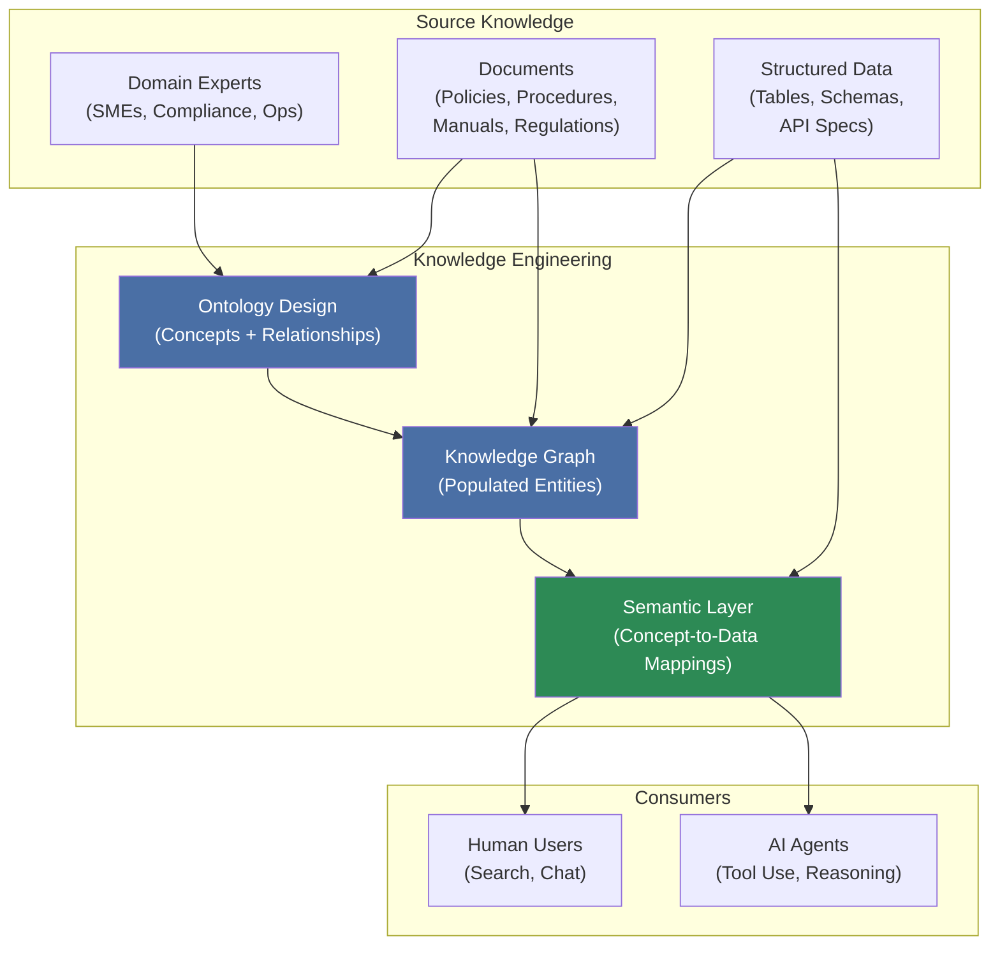
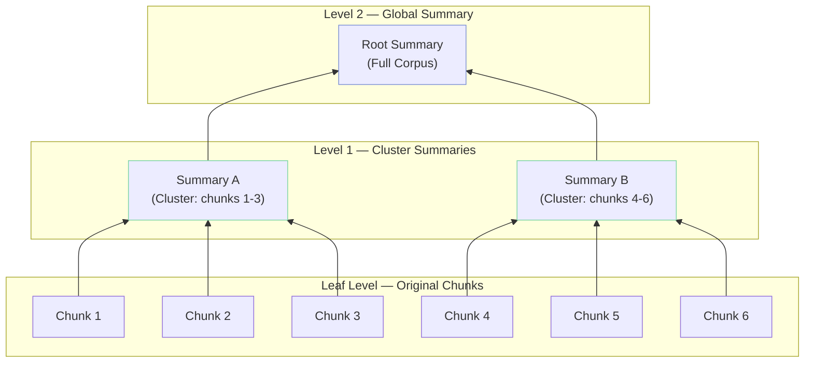
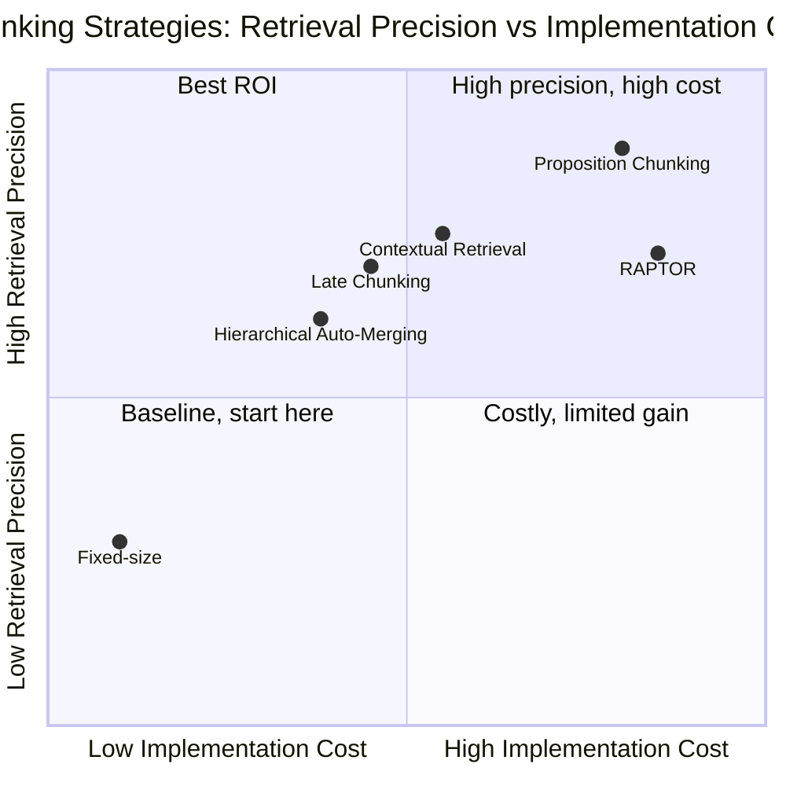
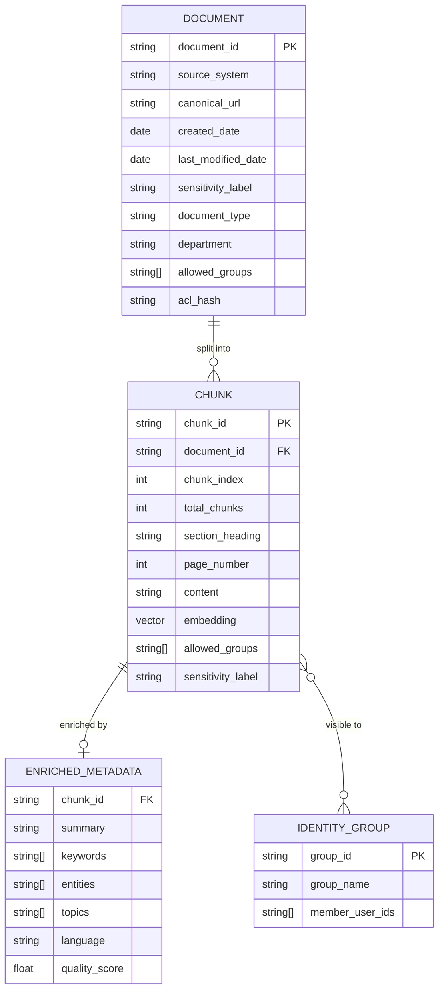
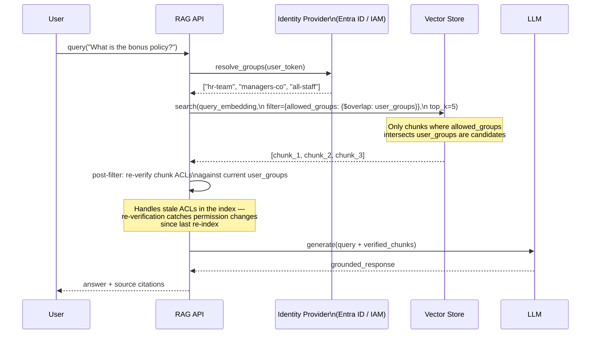
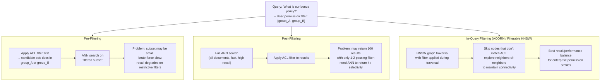
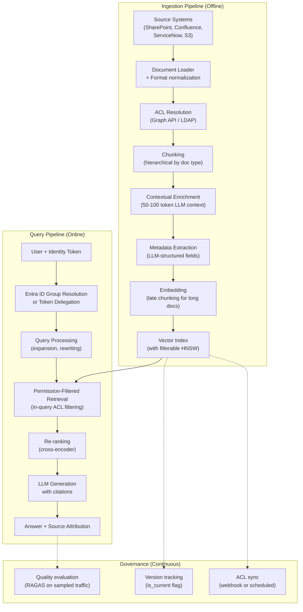

# Enterprise Knowledge Bases: From RAG Pipelines to Agent-Ready Context Engines

## The Demo That Worked Too Well

The prototype was impressive. You built it in a week: connect to the company's SharePoint, chunk the documents, embed them with OpenAI, store in a vector database, wire a GPT-4 front end. The leadership demo went smoothly. Questions were answered with citations. Someone called it "the future of knowledge management."

Then you deployed it.

Three days later, a sales associate used it to research a customer and received, verbatim, confidential details from an ongoing HR investigation involving that customer's account team. The document had been stored in a site the associate was explicitly not permitted to access. The RAG system had no idea. From its perspective, every document in the vector database was equally reachable by every user.

The same week, a junior engineer queried the system about a software architecture decision and received an authoritative-sounding answer citing a design document that had been superseded eight months earlier. The new document existed in the same SharePoint site, but the original had been embedded during the initial ingestion and never removed. The system didn't know about versions. It knew about vectors.

And in the legal team's pilot, the system had split a contract's indemnification clause across two chunks during ingestion, placing the critical limiting language in a chunk that was never retrieved. The answer the system gave was technically derived from the document. It was also wrong in a way that could create liability.

None of these failures were bugs. They were the natural consequence of applying a demo-scale architecture to enterprise-scale requirements. The technical components worked exactly as designed. The design was wrong for the context.

Enterprise knowledge bases are a different problem from demo RAG. They involve organizational scale—millions of documents, thousands of users, dozens of teams—but more fundamentally, they involve organizational complexity: access control hierarchies, document lifecycles, departmental ontologies, compliance requirements, and information governance policies that have no equivalent in a clean academic benchmark. The tools and techniques exist to handle all of this correctly. Using them requires understanding what makes enterprise RAG hard in the first place.

## The Four Failure Modes at Enterprise Scale

Before solutions, the problems. Enterprise knowledge bases fail in four characteristic ways that prototype architectures never encounter.

**Access control failures** happen when the retrieval layer is unaware of organizational permissions. Every enterprise document exists within an access control structure—SharePoint permissions, Active Directory groups, sensitivity labels, regulatory restrictions. A RAG pipeline that embeds all documents into a shared index and retrieves based purely on semantic similarity will return confidential documents to unauthorized users. This is not a minor inconvenience. Depending on the document content—HR data, legal matters, financial projections, M&A planning—it can constitute a compliance violation, a data breach, or a litigation risk.

**Temporal failures** happen when the knowledge base contains outdated content that the system cannot distinguish from current content. Policies get updated. Pricing changes. Procedures are revised. Organizational structures shift. A document from 2022 and its 2025 replacement can coexist in the same index, and pure semantic similarity will surface whichever one happens to be most similar to the query without any awareness of recency.

**Structural failures** happen when chunking destroys the semantic integrity of enterprise documents. Unlike clean Wikipedia paragraphs, enterprise documents have complex structures: contracts with cross-references, policies with exceptions buried three sections away from the rule, financial reports where a table's meaning depends on the header in the previous page, engineering specifications where a requirement can only be understood in the context of its parent section. Fixed-size and even semantic chunking routinely violates these structures, producing chunks that are formally valid text but semantically incomplete.

**Scale failures** happen when an architecture designed for thousands of documents is applied to hundreds of thousands. Re-indexing becomes expensive enough that documents are never updated. Metadata schemas drift across teams. The index becomes a graveyard of stale content without the governance infrastructure to identify what is current.

Each of these failure modes has known solutions. The rest of this post covers them in order of their architectural significance.

**Agent blindness** is a fifth failure mode that has emerged more recently, as organizations deploy AI agents alongside human users. A knowledge base built exclusively for human-facing chat interfaces is typically invisible to agents: it exposes no programmatic tool API, it returns natural language prose that requires additional parsing, it has no concept of machine-consumable output formats, and it conflates retrieval with generation in ways that make it hard for an agent to retrieve raw evidence and reason over it independently. The same knowledge base that serves a human user answering a question should also serve an agent deciding whether to approve a transaction, escalating a complaint, or generating a regulatory filing. Building for agents from the start means exposing knowledge as callable tools, not just as chat responses.

## The Three Knowledge Base Archetypes

Before solving the technical problems of chunking and access control, there is a more fundamental question: what kind of knowledge base are you actually building? The failure modes above apply to all enterprise knowledge bases, but the solutions vary significantly by archetype. And in most organizations, you will eventually need all three.

### Procedures and Policies KB

This is the archetype the rest of this post has historically covered. The knowledge lives in documents: HR policies, operational procedures, compliance guidelines, technical manuals, product documentation. The query pattern is predominantly unstructured — "What is the process for opening a new account?", "What documentation is required for a large cash transaction?" — and the retrieval mechanism is vector similarity search over chunked text.

This archetype is well-served by the technologies covered in detail below: hierarchical chunking, LLM-enriched metadata, permission-aware retrieval. It is also the archetype where failures are most narratively visible — a wrong answer to a policy question has direct operational consequences. The rest of this post gives you the architecture to build it correctly.

### Structured Data KB

The second archetype is less about documents and more about data: the metrics, tables, records, and measurements that live in databases and data warehouses. An agent asked "What was our total transaction volume last quarter broken down by product line?" needs to query a structured data store, not a document vector index.

The core technology here is text-to-SQL: natural language query → SQL generation → query execution → structured result. The knowledge base exposes schema documentation, entity definitions, and column descriptions that allow an LLM to translate intent into executable SQL. The [text-to-SQL post](/blog/text-to-sql) covers this architecture in full, including schema linking, multi-agent validation, and BigQuery-specific patterns. The [lakehouse architecture post](/blog/lakehouse-architecture) covers how the underlying storage layer should be structured to support agentic queries reliably.

The structured data KB requires a different kind of documentation: not chunked prose, but a semantic layer — a formal mapping of business concepts to underlying tables, columns, and metrics. "Revenue" maps to this column in that table with these business rules applied. "Active customer" has a specific definition that governs which records qualify. Without this semantic layer, text-to-SQL agents generate SQL that is syntactically valid but semantically incorrect, and the errors are hard to catch because the results look plausible.

### Conversational and Transactional KB

The third archetype is the most sophisticated and the least commonly implemented correctly. It combines the first two — unstructured procedural knowledge plus structured transactional data — and adds the dimension of user-specific context. The agent needs to answer questions that require reasoning across all three simultaneously.

Consider a banking personal assistant. The user asks: "Can I make a transfer to an international account I haven't used before?" A complete answer requires: the account's current balance (structured data), the bank's policy on international transfers (procedural KB), and the user's transaction history and any existing blocks on their account (user-specific structured data). None of these questions can be answered independently, and the final response must synthesize all three with the user's specific context in scope.

This is the "Personal Bank" pattern: a knowledge base that is simultaneously a document store, a data warehouse interface, and a personalized memory system. The [LangGraph multi-agent workflows post](/blog/langgraph-multi-agent-workflows) covers the orchestration layer that coordinates these retrieval paths. What makes the third archetype architecturally distinct is that the context is not just shared organizational knowledge — it includes private user data that can never be exposed to other users, making permission enforcement even more critical than in the first two archetypes.

### Why the Archetypes Matter

The distinction between archetypes is not academic. It determines which retrieval technology to deploy, what the agent's tool surface looks like, and where access control must be enforced at what granularity. Most enterprise AI failures happen when teams build one archetype but deploy it as if it covers the other two — a well-designed procedures KB cannot answer "what is my account balance," and a well-designed structured data KB cannot answer "what does the policy say about this situation."

The architectural challenge is the unified retrieval layer: a router that recognizes which archetype a query requires (or whether it requires multiple), dispatches to the appropriate retrieval backend, and fuses the results into a coherent response. The "From RAG Pipeline to Context Engine" section later in this post covers how to build this router in practice.

## Knowledge Engineering: Designing Before Building

There is a mistake that almost every team makes when building an enterprise knowledge base for the first time: they start with the documents. They stand up a vector database, run the documents through a chunker, embed the chunks, and call it a knowledge base. Three months later they discover that the system can retrieve paragraphs but cannot answer the questions the organization actually needs answered, because those questions require understanding relationships between concepts that the embedding model learned implicitly but never explicitly represented.

The discipline that addresses this gap is knowledge engineering: the practice of making organizational knowledge explicit, structured, and machine-consumable before it is indexed. KPMG's 2026 knowledge engineering report makes the case that knowledge engineering is the difference between AI that hallucinates and AI that reasons — that the semantic structure it produces is what allows agents to interpret data correctly rather than pattern-matching on superficial similarity.

### From Documents to Knowledge Models

A knowledge model is a formal representation of the concepts, entities, and relationships in a domain. It is the answer to the question: what does this organization actually know, and how does it know that things are related?

The process begins with **ontology design**: defining the concepts and their relationships in the domain. For a financial institution, the ontology might define: products (current accounts, savings accounts, credit cards, mortgages, CDTs), regulatory frameworks (AML, GDPR, PCI-DSS, Basel III), processes (account opening, fund transfer, dispute resolution, KYC), organizational units (retail banking, corporate banking, risk, compliance, operations), and the relationships between them (a CDT opening is governed by specific KYC requirements; AML rules apply differently to different product categories; dispute resolution processes vary by product type and channel).

This ontology does two things that pure document indexing cannot. First, it provides disambiguation: the word "account" means different things in different contexts, and an ontology resolves which meaning applies to which query. Second, it makes implicit organizational knowledge explicit: the fact that AML rules for cash transactions above a certain threshold trigger a specific compliance process may exist in three different documents, none of which explicitly states the relationship. The ontology connects them.

```python
from pydantic import BaseModel, Field
from typing import Optional

# A minimal banking domain ontology fragment
class Product(BaseModel):
    product_id: str
    name: str
    category: str  # "deposit", "credit", "investment", "insurance"
    regulatory_framework: list[str]  # e.g., ["AML", "GDPR", "PCI-DSS"]
    associated_processes: list[str]  # e.g., ["account_opening", "kyc_verification"]

class ComplianceRequirement(BaseModel):
    requirement_id: str
    regulation: str
    applies_to_products: list[str]
    trigger_conditions: str  # human-readable condition description
    governing_documents: list[str]  # document IDs in the KB

class KnowledgeGraph(BaseModel):
    products: list[Product]
    requirements: list[ComplianceRequirement]
    # At indexing time, each chunk is tagged with relevant entities from this graph
    # Queries can traverse: "which products trigger requirement X?" without 
    # relying solely on embedding similarity
```

From the ontology, a **knowledge graph** is constructed: a network of entities and relationships populated from both the organizational documents and structured data sources. Unlike the embedding space, the knowledge graph makes relationships explicit and traversable. A query about "AML requirements for wire transfers above threshold" can traverse the graph from the concept of wire transfer to the applicable AML regulation to the specific procedural document, rather than hoping the embedding space has captured this relationship correctly.

A November 2025 paper (arXiv:2511.05991) compared standard vector-based RAG, GraphRAG, and retrieval over ontology-guided knowledge graphs built from the same documents. The finding: ontology-guided KGs incorporating chunk-level information achieved competitive performance with state-of-the-art GraphRAG frameworks while substantially outperforming pure vector retrieval on queries that required relationship reasoning. The ontology investment paid for itself in retrieval quality.

### The Semantic Layer

The final layer of the knowledge engineering stack is the **semantic layer**: the abstraction between raw data (documents, tables, graph nodes) and the consumers of that data (human users and AI agents). The semantic layer maps business concepts to their underlying data representations, regardless of whether that representation is a document chunk, a database column, or a graph node.

For an agent, the semantic layer is what makes it possible to ask "what is the current policy on early CDT withdrawal penalties?" and receive a correct answer that draws from both the document KB (the policy text) and the structured DB (the actual penalty rates by product type), unified through the shared concept of "CDT early withdrawal" that the semantic layer defines.

The semantic layer is also what prevents the most common class of enterprise RAG failure: the agent that retrieves the right document but uses the wrong version, or retrieves semantically similar text that refers to a different product category. By making concept-to-data mappings explicit, the semantic layer narrows the retrieval search space and makes the system's behavior predictable.

The knowledge engineering pipeline, from raw organizational knowledge to agent-consumable structured representation:



The practical implication: knowledge engineering is not a one-time activity before indexing — it is a design discipline that precedes the entire technical build. Domains with complex regulatory structures (banking, healthcare, legal) benefit most from explicit ontology design. Domains with simpler, more self-explanatory document corpora can achieve reasonable results with lighter ontology work. But no domain benefits from zero knowledge engineering: even a rough concept taxonomy, applied consistently as metadata during indexing, produces better retrieval than a purely content-based approach.

## The Chunking Hierarchy

The previous post in this series covered basic chunking strategies: fixed-size splitting, recursive character splitting, and sentence-level semantic chunking. For enterprise knowledge bases, these are the starting point, not the destination.

There is now a hierarchy of chunking approaches with a reasonably clear mapping between approach and use case. Understanding the trade-offs across this hierarchy—and knowing which approach matches which document type and query pattern—is one of the highest-leverage decisions in enterprise RAG design.

### Hierarchical Chunking: Small for Precision, Large for Context

The fundamental tension in chunking is that small chunks are precise—a narrow, focused unit is more likely to be an exact match for a specific query—but strip away context that the generator needs to produce a coherent answer. Large chunks preserve context but dilute relevance and inflate retrieved content.

Hierarchical chunking, sometimes called parent-child chunking or auto-merging retrieval, resolves this tension by maintaining both representations simultaneously. Documents are chunked at multiple granularities—for example, 2048 tokens at the section level, 512 tokens at the paragraph level, 128 tokens at the sentence level—and each small chunk retains a pointer to its parent. Only the smallest chunks are embedded and stored in the dense index. At retrieval time, similarity search runs on small chunks, but a merging rule promotes to the parent: if a threshold fraction of a parent's children are retrieved (typically more than half), the parent chunk is substituted and sent to the generator instead.

```python
from llama_index.core.node_parser import HierarchicalNodeParser, get_leaf_nodes
from llama_index.core.storage.docstore import SimpleDocumentStore
from llama_index.core.retrievers import AutoMergingRetriever
from llama_index.core import VectorStoreIndex

# Build the hierarchy: section → paragraph → sentence
node_parser = HierarchicalNodeParser.from_defaults(
    chunk_sizes=[2048, 512, 128],
)

nodes = node_parser.get_nodes_from_documents(documents)
leaf_nodes = get_leaf_nodes(nodes)  # Only 128-token chunks go into the dense index

# Store the full hierarchy in a document store for merging later
docstore = SimpleDocumentStore()
docstore.add_documents(nodes)

# Build the vector index on leaf nodes only
leaf_index = VectorStoreIndex(leaf_nodes)

# At query time: retrieve small, merge up to parent when relevant
base_retriever = leaf_index.as_retriever(similarity_top_k=12)
auto_merging_retriever = AutoMergingRetriever(
    base_retriever,
    docstore=docstore,
    simple_ratio_thresh=0.5,  # Merge to parent if >50% of its children retrieved
)
```

The effect is elegant: a query about a specific data point retrieves the exact 128-token sentence containing it. A query that touches multiple facets of the same section triggers the merge, and the generator receives the full 2048-token section rather than a fragmented collection of small pieces.

For enterprise contracts, policies, and structured reports—documents where multiple nearby paragraphs form a single coherent unit—hierarchical chunking consistently outperforms flat approaches. The merging step naturally handles the case where the "answer" spans several paragraphs within the same section.

### Proposition Chunking: Maximum Precision, Maximum Cost

The Dense X Retrieval paper (Chen et al., arXiv:2312.06648, EMNLP 2024) introduced a more radical granularity: rather than chunking at sentence or paragraph level, decompose documents into **propositions**—atomic, self-contained factual statements that can be understood independently of their surrounding text.

Where a sentence might say "The system was introduced in 2019 and has since processed over ten million transactions," a proposition representation breaks this into: "The system was introduced in 2019." and "The system has processed over ten million transactions." Each proposition is maximally specific, independently queryable, and carries no ambiguous pronouns or assumed context.

```python
from langchain_openai import ChatOpenAI
from langchain.prompts import ChatPromptTemplate
from langchain_core.output_parsers import JsonOutputParser
from pydantic import BaseModel, Field

class PropositionList(BaseModel):
    propositions: list[str] = Field(
        description="List of atomic factual statements extracted from the passage"
    )

llm = ChatOpenAI(model="gpt-4o-mini", temperature=0)
parser = JsonOutputParser(pydantic_object=PropositionList)

propositionize_prompt = ChatPromptTemplate.from_template(
    """Decompose the following passage into a list of atomic, self-contained
    factual propositions. Each proposition must:
    - Express exactly one fact
    - Be understandable without external context (no pronouns without antecedents)
    - Be written as a complete declarative sentence

    Return a JSON object with a "propositions" key containing a list of strings.

    Passage:
    {passage}
    """
)

def extract_propositions(passage: str) -> list[str]:
    chain = propositionize_prompt | llm | parser
    result = chain.invoke({"passage": passage})
    return result["propositions"]
```

The retrieval precision gains are real: the Chen et al. paper found proposition-level retrieval outperformed passage-level and sentence-level approaches on most QA benchmarks, with the sweet spot granularity around 100–200 words (~10 propositions). The cost is equally real: generating propositions requires an LLM call for every passage during indexing, adding significant expense for large corpora.

The practical deployment pattern is selective: use proposition chunking for high-value, high-precision content—regulatory documents where exact clauses matter, contractual terms, security policies—and standard hierarchical chunking for the bulk of the knowledge base.

### Late Chunking: Context Without the Cost

Late chunking (Günther et al., JinaAI, arXiv:2409.04701, September 2024) addresses a different aspect of the context problem. Standard RAG loses cross-chunk context because chunks are embedded independently: a chunk that refers to "the system" has no way to embed the fact that earlier paragraphs established what "the system" is.

The inversion is elegant: instead of chunking first and then embedding, late chunking reverses the order. The full document is passed through the transformer's attention layers—all tokens attend to all other tokens across the document—producing per-token embeddings that encode full-document context. Chunking then happens at the pooling stage rather than before the encoder.

```
Standard chunking:
Document → [split into chunks] → [embed each chunk independently] → Index
                                       ↑ no cross-chunk context

Late chunking:
Document → [full-document transformer pass] → [per-token contextual embeddings]
        → [chunk boundaries applied at pooling] → Index
                ↑ every token embedding is informed by the full document
```

The result: a chunk containing "it was discontinued in 2023" inherits from the document-level pass the knowledge that "it" refers to a specific product line. The embedding is contextually grounded in a way that independent-chunk encoding cannot achieve.

Late chunking is available through `jina-embeddings-v3`, which was specifically designed to support this inference pattern. A 2025 comparative evaluation (arXiv:2504.19754) found it consistently outperforms standard chunking approaches while being more compute-efficient than contextual retrieval—a meaningful advantage at the throughput levels enterprise ingestion requires.

### Contextual Retrieval: The Pragmatic Middle Ground

Anthropic's contextual retrieval approach (September 2024) achieves much of the benefit of late chunking through a different mechanism: rather than changing the embedding architecture, it prepends 50–100 tokens of LLM-generated context to each chunk before embedding.

The process: for each chunk, prompt Claude to produce a brief contextual statement placing this chunk within its source document. "This excerpt is from Section 4.3 of the Data Retention Policy (revised March 2025) and describes the exception procedures for legal hold requests." This context-enriched version is embedded, while the original chunk text is stored for display.

```python
import anthropic

client = anthropic.Anthropic()

def add_chunk_context(document_text: str, chunk_text: str) -> str:
    """Prepend LLM-generated context to a chunk before embedding."""
    response = client.messages.create(
        model="claude-haiku-4-5-20251001",  # Fast and cheap for bulk processing
        max_tokens=100,
        system=(
            "You are a document analyst. Given a document and a specific excerpt from it, "
            "write 1-2 sentences that situate the excerpt within the document. "
            "Be specific about the document's purpose and where this excerpt fits. "
            "Do not summarize the excerpt—only provide context that helps a retriever "
            "understand what this excerpt is about."
        ),
        messages=[{
            "role": "user",
            "content": (
                f"<document>\n{document_text[:2000]}...\n</document>\n\n"
                f"<excerpt>\n{chunk_text}\n</excerpt>\n\n"
                "Situating context (1-2 sentences):"
            ),
        }],
    )
    context = response.content[0].text.strip()
    return f"{context}\n\n{chunk_text}"

# At indexing time
for chunk in chunks:
    contextualized = add_chunk_context(source_document, chunk.text)
    embedding = embed(contextualized)
    # Store contextualized version for embedding; original for display
    chunk.embedding = embedding
    chunk.display_text = chunk.text
```

The result is substantial: Anthropic reported a 49% reduction in retrieval failures (from 5.7% to 2.9% miss rate at top-20 recall) when combining contextual retrieval with BM25 hybrid search and reranking. For enterprise use cases where document terminology is specialized and context-dependent, this improvement is often the difference between a system that users trust and one they abandon.

### RAPTOR: When the Query Spans the Corpus

Hierarchical chunking, proposition chunking, and late chunking all address the same challenge: retrieving the right passage for a specific, locatable fact. RAPTOR (Sarthi et al., Stanford, arXiv:2401.18059, ICLR 2024) addresses a different challenge: answering questions where the answer is not contained in any single passage but must be synthesized across many.

"What is the overall regulatory stance in our compliance documentation?" "Summarize our organization's approach to data governance across all policy documents." "What are the recurring themes in customer escalations from Q3?" These questions cannot be answered by retrieving the most relevant chunk—they require synthesis across the entire corpus.

RAPTOR builds a tree of abstractions:



The algorithm: cluster leaf chunks using Gaussian Mixture Models on their embeddings (with UMAP for dimensionality reduction), generate LLM summaries of each cluster, repeat recursively until a root summary covers the full corpus. At query time, retrieval can happen at any level of the tree—or across all levels simultaneously.

On the QuALITY multi-document QA benchmark, RAPTOR achieved a 20% absolute accuracy improvement over previous best results when combined with GPT-4. For enterprise use cases with large, interconnected document corpora—compliance documentation, research archives, knowledge management systems—the hierarchical summary tree provides a retrieval surface that flat indexing fundamentally cannot.

The cost is real: the upfront indexing requires LLM summarization calls per cluster at every level. For corpora of hundreds of thousands of documents, this is a significant investment that should be weighed against the frequency and value of global synthesis queries in the specific use case.

### Choosing the Right Strategy

The decision is not which strategy is best in absolute terms—it is which combination of strategies fits the corpus structure and query distribution.

| Document type | Query type | Recommended approach |
|---|---|---|
| Long-form prose (policy docs, manuals) | Specific fact lookup | Late chunking or contextual retrieval |
| Structured sections with subsections | Mixed fact + context | Hierarchical (auto-merging) |
| High-precision technical/legal | Exact clause retrieval | Proposition chunking |
| Large inter-connected corpora | Synthesis / summarization | RAPTOR tree + standard index |
| All types at scale | Any | Contextual retrieval as baseline enhancement |

In practice, mature enterprise knowledge bases layer these strategies by document type rather than applying a single approach uniformly.



## Enterprise Metadata Architecture

Metadata is the infrastructure that makes retrieval controllable. Without it, you can retrieve by semantic similarity only. With it, you can restrict retrieval by department, date range, document type, sensitivity level, regulatory scope, and—critically—the permission set of the querying user.

Metadata architecture at enterprise scale involves three distinct problems that prototype systems never encounter: what to store, how to ensure quality at scale, and how to handle lifecycle changes.

### What to Store

A production enterprise metadata schema spans several categories:

**Provenance** captures where a document came from and how to find it again: `source_system` (SharePoint / Confluence / ServiceNow / GDrive), `document_id` (stable identifier within the source system), `canonical_url`, `ingestion_timestamp`.

**Temporal** captures the document's position in time: `created_date`, `last_modified_date`, and for regulatory and policy documents, `effective_date`, `expiry_date`, and `superseded_by` when a newer version exists. These fields are what enable recency-aware retrieval.

**Classification** captures what the document is: `document_type` (policy / procedure / FAQ / contract / specification / report), `department` (source organizational unit), `sensitivity_label` (Public / Internal / Confidential / Restricted), and `regulatory_scope` for documents subject to specific regulations (GDPR, HIPAA, SOX, CCPA).

**Access control** captures who can see it: `allowed_groups` (list of identity group IDs), `acl_hash` (a hash of the current ACL state, useful for detecting permission changes), `data_classification` at both document and chunk level for documents with mixed sensitivity.

**Content structure** captures where within the document a chunk lives: `chunk_index`, `total_chunks`, `page_number`, `section_heading`, `parent_section`. These fields are essential for attribution and for the hierarchical chunking merge logic.

**Semantic enrichment** captures automatically extracted meaning: `summary` (brief LLM-generated summary of the chunk's content), `keywords`, `entities`, `topics`, `language`.

The relationships between these metadata entities — and how they map to what gets stored in the vector index alongside each embedding:



### LLM-Enriched Metadata

Manually maintaining semantic metadata at scale is impossible. The practical solution is LLM-based metadata extraction at ingestion time: for each document or chunk, an LLM extracts structured metadata fields using a schema-constrained output.

A December 2024 systematic study (arXiv:2512.05411) demonstrated that metadata-enriched retrieval with LLM-extracted fields improved precision by approximately 9 percentage points over content-only approaches on enterprise document corpora. The investment in the enrichment step pays for itself in retrieval quality.

```python
from pydantic import BaseModel, Field
from langchain_openai import ChatOpenAI
from langchain_core.prompts import ChatPromptTemplate
from enum import Enum

class DocumentType(str, Enum):
    POLICY = "policy"
    PROCEDURE = "procedure"
    CONTRACT = "contract"
    FAQ = "faq"
    REPORT = "report"
    SPECIFICATION = "specification"
    OTHER = "other"

class SensitivityLevel(str, Enum):
    PUBLIC = "public"
    INTERNAL = "internal"
    CONFIDENTIAL = "confidential"
    RESTRICTED = "restricted"

class EnrichedMetadata(BaseModel):
    document_type: DocumentType
    department: str = Field(description="Primary owning department, e.g. 'Legal', 'HR', 'Engineering'")
    sensitivity_level: SensitivityLevel
    summary: str = Field(description="2-3 sentence summary of this chunk's content and purpose")
    keywords: list[str] = Field(description="3-7 keywords most relevant to this chunk")
    entities: list[str] = Field(description="Named entities: people, systems, products, regulations")
    topics: list[str] = Field(description="Conceptual topics covered, e.g. 'data retention', 'GDPR compliance'")
    regulatory_scope: list[str] = Field(
        default=[],
        description="Applicable regulations or standards, e.g. ['GDPR', 'SOX']"
    )
    has_tables: bool = Field(description="Whether this chunk contains tabular data")
    has_code: bool = Field(description="Whether this chunk contains code or commands")

llm = ChatOpenAI(model="gpt-4o-mini", temperature=0)

enrichment_prompt = ChatPromptTemplate.from_template(
    """Analyze the following document chunk and extract structured metadata.
    The document is from: {source_system}
    Original filename: {filename}

    Chunk content:
    {chunk_text}

    Return valid JSON matching the requested schema exactly.
    """
)

def enrich_chunk_metadata(
    chunk_text: str,
    source_system: str,
    filename: str,
) -> EnrichedMetadata:
    structured_llm = llm.with_structured_output(EnrichedMetadata)
    chain = enrichment_prompt | structured_llm
    return chain.invoke({
        "chunk_text": chunk_text,
        "source_system": source_system,
        "filename": filename,
    })
```

The cost at scale: enriching a 100,000-document corpus with a fast model at average chunk sizes around 512 tokens runs to roughly 500 million input tokens. At GPT-4o-mini pricing (approximately $0.15/M input tokens as of early 2026), this costs around $75 for the extraction pass—a reasonable one-time investment for a corpus that will be queried thousands of times. For very large corpora, enrichment can be batched and parallelized, and selective enrichment (only for document types where metadata quality matters most) reduces cost further.

### Document Lifecycle Management

The stale document problem has a name now: temporal drift. VersionRAG (arXiv:2510.08109, October 2025) studied it specifically and found that standard RAG achieves only 58–64% accuracy on version-sensitive questions—questions where the correct answer depends on knowing which version of a document is current.

The core requirement is a versioning model that makes "current" and "superseded" first-class metadata concepts:

```python
from datetime import datetime

class DocumentVersion(BaseModel):
    document_id: str           # Stable ID across versions
    version: str               # "v1.0", "2025-03-15", etc.
    effective_date: datetime
    expiry_date: datetime | None = None
    superseded_by: str | None = None   # document_id of newer version
    is_current: bool = True

def index_document_version(doc: DocumentVersion, chunks: list[dict]):
    """
    When a new version is indexed, mark the previous version as superseded.
    Only current versions are retrieved by default.
    """
    # Mark previous versions as superseded
    vectorstore.update_metadata_where(
        filter={"document_id": doc.document_id, "is_current": True},
        update={"is_current": False, "superseded_by": doc.document_id}
    )
    # Index the new version with is_current=True
    for chunk in chunks:
        chunk["metadata"]["is_current"] = True
        chunk["metadata"]["document_id"] = doc.document_id
        chunk["metadata"]["version"] = doc.version
        chunk["metadata"]["effective_date"] = doc.effective_date.isoformat()

    vectorstore.add_documents(chunks)

# At query time, filter to current versions by default
def retrieve_current(query: str, k: int = 5) -> list:
    return vectorstore.similarity_search(
        query=query,
        filter={"is_current": True},
        k=k,
    )
```

The atomic alias pattern complements version tagging for large re-indexing operations: build the new index version in a shadow collection, validate it, then atomically update a named alias to point to the new collection. Queries continue hitting the old index during the build; the cutover is instantaneous and rollback is trivial.

## Permission-Aware Retrieval

This is the section that separates enterprise RAG from every tutorial and demo that came before it. Handling permissions correctly is not a feature you add on top of a working knowledge base—it is a requirement that shapes the architecture from the ground up.

### The Security Time Bomb

The failure mode is straightforward: standard RAG embeds all documents into a shared index indiscriminately. At query time, every user can retrieve every document. If your knowledge base contains HR investigation files, M&A planning documents, compensation data, or any other sensitive material, every user with access to the RAG frontend has effective access to all of it—not because they asked for it, but because their query happened to be semantically similar to a chunk from a document they were never authorized to see.

The September 2025 Microsoft paper "Enterprise AI Must Enforce Participant-Aware Access Control" (arXiv:2509.14608) demonstrated concrete data exfiltration attacks against RAG systems without access controls, describing how standard semantic similarity can inadvertently surface sensitive documents. The paper described the fix that was deployed to Microsoft Copilot—but the attack vector exists in any deployment that didn't implement equivalent controls.

### Security Trimming

**Security trimming** is the term Microsoft coined in SharePoint's enterprise search era for filtering query results to exclude documents the querying user is not authorized to see. The terminology has carried over to enterprise RAG.

The canonical security trimming pattern has two parts: **indexing-time ACL storage** and **query-time permission enforcement**.



At indexing time, each document's ACL is resolved to a list of group identifiers and stored as filterable metadata alongside the embeddings:

```python
from msgraph.generated.models.o_data_errors import ODataError
import requests

def resolve_document_acl(
    site_id: str,
    item_id: str,
    graph_client,
) -> list[str]:
    """
    Fetch the permission set for a SharePoint document via Microsoft Graph.
    Returns a list of group/user principal IDs that have read access.
    """
    permissions = graph_client.sites.by_site_id(site_id)\
        .drive.items.by_drive_item_id(item_id)\
        .permissions.get().value

    principal_ids = []
    for perm in permissions:
        if perm.roles and "read" in perm.roles:
            if perm.granted_to_v2:
                if perm.granted_to_v2.group:
                    principal_ids.append(perm.granted_to_v2.group.id)
                if perm.granted_to_v2.user:
                    principal_ids.append(perm.granted_to_v2.user.id)
            if perm.granted_to_identities_v2:
                for identity in perm.granted_to_identities_v2:
                    if identity.group:
                        principal_ids.append(identity.group.id)

    return principal_ids

def index_with_acl(document, chunks, graph_client):
    acl = resolve_document_acl(
        site_id=document.site_id,
        item_id=document.item_id,
        graph_client=graph_client,
    )
    for chunk in chunks:
        chunk["metadata"]["allowed_groups"] = acl
        chunk["metadata"]["acl_hash"] = hash(frozenset(acl))  # For change detection

    vectorstore.add_documents(chunks)
```

At query time, the user's identity is resolved to their current group memberships, and those groups are injected as a filter on every retrieval:

```python
def permission_aware_retrieve(
    query: str,
    user_id: str,
    graph_client,
    k: int = 5,
) -> list:
    """
    Retrieve documents only accessible to the querying user.
    """
    # Get the user's transitive group memberships from Entra ID
    user_groups = graph_client.users.by_user_id(user_id)\
        .transitive_member_of.get()

    group_ids = [g.id for g in user_groups.value if hasattr(g, 'id')]
    group_ids.append(user_id)  # Include the user's own ID

    # Retrieve with ACL filter
    # Syntax varies by vector database; this uses Qdrant-style filter
    return vectorstore.similarity_search(
        query=query,
        filter={
            "must": [
                {
                    "key": "allowed_groups",
                    "match": {"any": group_ids}  # chunk must be in at least one of user's groups
                }
            ]
        },
        k=k,
    )
```

### Pre-Filtering, Post-Filtering, and In-Query Filtering

How the vector database applies the permission filter is not an implementation detail—it determines whether permission filtering degrades retrieval quality and by how much.



**Pre-filtering** applies the ACL filter before ANN search, running similarity search only on the permitted document subset. The problem emerges with restrictive permissions: when a user can only access 2% of the corpus, the HNSW graph over that 2% may be poorly connected, forcing a brute-force scan of the filtered subset. Recall degrades significantly for highly selective filters.

**Post-filtering** runs standard ANN search over the full index, then filters the results by ACL. The problem is that when permissions are restrictive, you may retrieve 100 candidate chunks and keep only two. To guarantee top-k results after filtering, the ANN search must over-retrieve by a factor of 1/selectivity—which can be 50x or more for users with limited access. Result sets can also be empty.

**In-query filtering** (filterable HNSW in Qdrant, the ACORN algorithm in Weaviate) is the engineering solution: the permission filter is applied during HNSW graph traversal rather than before or after. When a candidate node fails the filter, the traversal expands to that node's neighbors ("two-hop" expansion) to maintain graph connectivity and recall without requiring brute-force fallback.

The ACORN paper (arXiv:2403.04871, Weaviate Research, March 2024) introduced the two-hop neighborhood expansion approach. Weaviate benchmarks reported 10x speedup on restrictive filters compared to pre-filtering. Qdrant implemented filterable HNSW independently, with an adaptive query planner that chooses between filterable HNSW traversal and brute-force based on estimated filter cardinality.

For enterprise deployments with permission-filtered retrieval, the vector database choice should be evaluated explicitly on filtered recall benchmarks, not just unfiltered throughput. A system that reports 10,000 QPS at 0.95 recall on an unfiltered benchmark may perform dramatically worse under the permission filters that characterize real enterprise traffic.

### The Permission Explosion Problem

Enterprise identity structures are hierarchies, not flat lists. A user belongs to a team, which belongs to a department, which belongs to a division. SharePoint permissions inherit from site to library to folder to file. Documents accessible to a top-level group are implicitly accessible to every nested subgroup.

Flattening this hierarchy into a stored list of permitted principals per chunk creates a combinatorial explosion: a document accessible to an organization-wide group effectively requires storing the principal IDs of every employee. At tens of thousands of employees, this metadata field alone becomes a significant storage overhead—and worse, it becomes instantly stale whenever an employee joins, leaves, or changes roles.

There are three practical approaches to the explosion problem, each with different trade-offs:

**Store group SIDs, resolve at query time.** Store only the immediate permission groups per chunk (not expanded user lists). At query time, call the identity provider to get the user's transitive group memberships. Microsoft Graph's `/users/{id}/memberOf?$transitiveMemberOf` returns up to 999 groups per call, which covers most enterprise use cases. The trade-off: query latency increases by the time to make the Graph API call (typically 100–300ms), and if the user belongs to hundreds of groups, the filter expression becomes long.

**Token-based delegation.** Pass the user's Entra ID token directly to Azure AI Search, which resolves group memberships internally against Entra's identity store. The application never enumerates group IDs; Azure AI Search handles the resolution as part of query processing. This is Microsoft's recommended approach as of the `2025-05-01-preview` API, and it eliminates both the latency penalty of application-side group enumeration and the storage problem of expanded user lists. The `x-ms-query-source-authorization` header carries the user's JWT; the search service validates it against the document ACL metadata and Entra's group membership graph simultaneously.

**Relationship-Based Access Control (ReBAC).** For organizations with complex, policy-driven permission logic that exceeds what flat group membership can express, a Zanzibar-inspired ReBAC system (Google Zanzibar, SpiceDB, OpenFGA) stores the permission graph separately from the document index. At query time, post-retrieval filtering calls the ReBAC service to evaluate "can user U access document D?" for each retrieved document. This is architecturally the most correct approach for complex permission policies but adds a dependency on the ReBAC service latency for every retrieval call.

**HoneyBee** (Zhong et al., Georgia Tech, arXiv:2505.01538, SIGMOD 2026) represents the current research frontier on this problem. Rather than applying permission filtering during or after retrieval, HoneyBee partitions the vector index by roles—the "thin waist" of RBAC hierarchies—and replicates vectors selectively across role-partitioned sub-indexes. A query from a user with role R1 searches only the R1 partition. The paper reports 13.5x lower latency than row-level security with 1.24x memory overhead. This is a research result as of early 2026, not a production-ready system, but the approach points toward where enterprise permission-aware retrieval is heading.

### Handling ACL Changes

One of the most practically dangerous scenarios in enterprise knowledge bases is the revoked-permission problem: a document is indexed with a certain ACL; later, a user's access is revoked (they change roles, leave a project, or the document is reclassified); but the indexed ACL metadata is stale.

This is not a hypothetical risk. In active organizations, permissions change continuously—role transitions, project rotations, security reclassifications. A knowledge base with monthly reindexing has a window of up to 30 days during which revoked permissions are not enforced.

Three mitigation approaches:

**Real-time ACL sync.** Use webhooks or change data capture from the identity provider to trigger incremental re-indexing when permissions change. Microsoft Graph provides change notifications for permissions via `subscriptions` to the `/sites/{siteId}/drive/items/{itemId}/permissions` endpoint. When a permission changes, the delta is applied to the affected chunks within minutes. This is the most complete solution but requires infrastructure for processing permission change events and correlating them with indexed chunks.

**Hash-based change detection.** Store an `acl_hash` (hash of the current ACL state) per chunk during indexing. On a scheduled scan (daily or hourly), re-fetch ACLs for all indexed documents and compare against the stored hash. When hashes differ, re-index the affected chunks with the updated ACL. This is operationally simpler than webhook-based sync and catches any permission change within the scan interval.

**Always-fresh query-time resolution.** The Microsoft token delegation approach is the most elegant solution to stale ACLs because it never stores expanded ACLs in the first place. The user's token is validated against Entra's live identity graph at query time, so permission revocations take effect the next time the revoked user attempts a query—with no reindexing required.

## Multi-Tenant Knowledge Bases

When a single knowledge base serves multiple distinct groups—business units, customer organizations in a SaaS product, or regulatory domains that must not cross-contaminate—the isolation strategy is itself an architectural decision with performance, cost, and security implications.

Three isolation patterns map to different requirements:

**Collection-per-tenant** (separate HNSW index per tenant): Maximum isolation—each tenant's documents are in a completely separate index with no shared infrastructure. Provides the strongest security guarantees and enables per-tenant configuration (different embedding models, chunking strategies, metadata schemas). The cost is linear in the number of tenants: a thousand-tenant deployment requires a thousand indexes, with associated memory and compute overhead. Practical for high-security, low-to-medium tenant count deployments.

**Namespace or partition per tenant** (shared infrastructure, logical isolation): A single vector store with logical partitions—Qdrant named collections with quota controls, Weaviate multi-tenant classes, Pinecone namespaces. Shared HNSW graph construction reduces memory overhead; per-namespace query routing provides logical isolation. The security boundary is enforced by the application layer and the database's namespace filtering, not by physical index separation. Practical for many-tenant, read-heavy deployments where the per-query cost of namespace filtering is acceptable.

**Metadata-tag isolation** (filter-based): All tenants share a single flat index; tenant membership is a metadata field; every query includes a tenant filter. The lowest cost and operationally simplest approach. The weakest security boundary—enforcement depends entirely on correct application-layer filter injection; a bug in the filter logic can cross-contaminate results. Acceptable for internal organizational units (departments) that are separated by policy rather than by a hard security requirement.

```python
# Namespace-based isolation (Pinecone example)
from pinecone import Pinecone

pc = Pinecone(api_key="...")
index = pc.Index("enterprise-knowledge-base")

def upsert_for_tenant(tenant_id: str, vectors: list, metadata: dict):
    """Route all writes to the tenant's namespace."""
    index.upsert(vectors=vectors, namespace=tenant_id)

def query_for_tenant(tenant_id: str, query_vector: list, k: int = 5):
    """Queries are scoped to the tenant's namespace."""
    return index.query(
        vector=query_vector,
        top_k=k,
        namespace=tenant_id,
        include_metadata=True,
    )
```

For enterprise deployments serving internal teams, the practical default is namespace isolation with metadata-tag permission filtering for fine-grained ACL enforcement within each namespace. This provides organizational isolation between departments without the overhead of per-department indexes, while permission filtering handles document-level access control within each department's namespace.

## GraphRAG at Enterprise Scale

Graph-based approaches to knowledge retrieval represent a qualitatively different architecture from vector similarity—one where the relationships between entities, concepts, and documents are first-class structures rather than emergent properties of embedding proximity.

Microsoft's GraphRAG (Edge et al., arXiv:2404.16130, April 2024) builds a knowledge graph during indexing: an LLM extracts entities and relationships from every chunk, and community detection algorithms cluster the graph into hierarchically nested communities, each with LLM-generated summaries. At query time, local search traverses the graph from seed entities; global search synthesizes across community summaries to answer corpus-spanning questions.

The performance on synthesis tasks is substantial—GraphRAG with GPT-4 improved global synthesis quality by significant margins over standard RAG on complex multi-document questions. The production reality is more nuanced.

**Full GraphRAG** requires LLM extraction passes on every chunk during indexing, making initial corpus processing expensive. For a hundred-thousand-document enterprise corpus, the extraction cost can be substantial enough to require staged rollout rather than bulk migration.

**LazyGraphRAG** (Microsoft Research, late 2024) addresses this with a key architectural inversion: rather than building the knowledge graph upfront, it constructs graph relationships dynamically at query time, using the query to guide which entities and relationships to extract. Indexing cost equals standard vector RAG; query-time cost increases modestly. For enterprise deployments where global synthesis queries are occasional rather than the dominant pattern, LazyGraphRAG provides most of the benefit at a fraction of the indexing cost.

The practical enterprise deployment pattern that has emerged in 2025 is a hybrid retriever: vector similarity search for the majority of queries (specific fact lookup, procedural guidance, document search), supplemented by graph traversal for queries that require understanding relationships across documents—"find all contracts with Vendor X modified after the policy change," "which compliance requirements apply to this new system architecture?" The vector index and the knowledge graph are maintained in parallel, and query routing logic dispatches to the appropriate retrieval path based on query classification.

## Putting It Together: The Enterprise RAG Stack

A production enterprise knowledge base integrates all of these layers. The architecture is more complex than a demo, but the components fit together coherently.



Every component in this diagram has direct counterparts in what we have covered:

- **ACL resolution** at ingestion time populates `allowed_groups` metadata; Entra token delegation or hash-based ACL sync keeps it current
- **Hierarchical chunking** by document type routes policies to auto-merging, technical docs to proposition chunking, and large corpora requiring synthesis to RAPTOR
- **Contextual enrichment** prepends LLM-generated context before embedding, reducing retrieval failures by ~50%
- **LLM-structured metadata extraction** adds semantic fields (summary, topics, entities, sensitivity) that enable controlled-vocabulary filtering
- **Filterable HNSW or ACORN** applies permission filters during graph traversal, maintaining recall under restrictive access profiles
- **Version tracking** keeps `is_current` current, preventing temporal drift

The governance layer—version management, ACL sync, quality evaluation—is what makes the difference between a knowledge base that degrades over time and one that improves. The RAG evaluation post in this series covers how to measure quality systematically; the operational processes for ACL sync and version management are what keep the underlying data correct.

## Closing: Infrastructure for Trust

The HR document that reached the wrong person. The superseded policy that produced a wrong answer. The contract clause that the chunker split apart. These are not random failures—they are predictable consequences of applying a demo architecture to an enterprise problem.

Enterprise knowledge bases are infrastructure in the full sense of the word: they carry organizational knowledge that people make decisions from, and failures have real consequences. An employee who receives wrong guidance from a RAG system trained on their company's internal documentation will act on that guidance. A customer service agent who surfaces confidential information from a poorly secured knowledge base creates a liability. A compliance officer who relies on a system returning superseded regulatory text is working from fiction.

The techniques in this post—hierarchical and contextual chunking for structural integrity, LLM-enriched metadata for controlled retrieval, in-query permission filtering for access control, versioning for temporal correctness—are not advanced features. They are the baseline requirements for a knowledge base that an organization can actually trust. Building a demo is easy. Building infrastructure for trust takes more care.

The investment is worth it. An enterprise knowledge base that respects permissions, tracks document lifecycle, chunks for semantic integrity, and enriches documents with structured metadata is a system that scales with the organization rather than accumulating debt as the corpus grows and the user base expands. Every engineering decision in this post is one that pays forward.

---

## Going Deeper

**The Papers:**

- Chen, J., Deng, H., Su, Q., & Zhao, X. (2023). ["Dense X Retrieval: What Retrieval Granularity Should We Use?"](https://arxiv.org/abs/2312.06648) arXiv:2312.06648. EMNLP 2024. — The proposition chunking paper. The ablation on retrieval granularity is the most instructive section: it characterizes exactly when fine-grained propositions beat coarser chunks, which makes the cost-benefit decision for your corpus concrete.

- Sarthi, P., Abdullah, S., Tuli, A., Khanna, S., Goldie, A., & Manning, C. D. (2024). ["RAPTOR: Recursive Abstractive Processing for Tree-Organized Retrieval."](https://arxiv.org/abs/2401.18059) *ICLR 2024*. — The hierarchical summarization approach for global synthesis queries. The QuALITY benchmark results (20% absolute accuracy improvement) make a compelling case for the approach on multi-document synthesis tasks.

- Günther, M., Mohr, I., Williams, D., Wang, B., & Xiao, H. (2024). ["Late Chunking: Contextual Chunk Embeddings Using Long-Context Embedding Models."](https://arxiv.org/abs/2409.04701) arXiv:2409.04701. — The JinaAI late chunking paper. The core inversion (chunk after the transformer, not before) is the key insight. The benchmark comparisons against standard approaches demonstrate the accuracy/cost trade-off clearly.

- Patel, L., et al. (2024). ["ACORN: Performant and Predicate-Agnostic Search Over Vector Embeddings and Structured Data."](https://arxiv.org/abs/2403.04871) arXiv:2403.04871. — The ACORN paper from Weaviate Research. The analysis of why pre-filtering degrades recall on restrictive predicates is the essential theoretical foundation for understanding filtered vector search. The 10x speedup results for enterprise-style permission filters are directly applicable.

- Zhong, Y., et al. (2025). ["HoneyBee: Efficient RBAC for Vector Databases via Dynamic Partitioning."](https://arxiv.org/abs/2505.01538) arXiv:2505.01538. SIGMOD 2026. — The state of the art on permission-aware vector retrieval. The 13.5x latency improvement over row-level security and the role-partition design are the research directions that enterprise vector databases are likely to implement over the next 1-2 years.

- Edge, D., Trinh, H., Cheng, N., Bradley, J., Chao, A., Mody, A., ... & Larson, J. (2024). ["From Local to Global: A Graph RAG Approach to Query-Focused Summarization."](https://arxiv.org/abs/2404.16130) arXiv:2404.16130. — The Microsoft GraphRAG paper. The distinction between local search (entity-grounded) and global search (community-summary-based) is what makes the approach powerful for enterprise synthesis queries.

- Anonymous. (2025). ["Enterprise AI Must Enforce Participant-Aware Access Control."](https://arxiv.org/abs/2509.14608) arXiv:2509.14608. — Documents concrete data exfiltration attacks against RAG systems without access controls, then describes the fix deployed to Microsoft Copilot. Essential reading for anyone building enterprise-facing knowledge retrieval systems.

**Books:**

- Huyen, C. *AI Engineering.* O'Reilly Media, 2025. — Chapter 4 on knowledge bases and Chapter 7 on deployment cover the production engineering perspective on enterprise knowledge systems, including lifecycle management and quality tracking.

- Harness, J., & Liedtke, P. *Enterprise AI Playbook.* Manning Publications, 2025. — Specifically covers the governance, compliance, and access control requirements for enterprise AI systems. One of the few books that treats permissions and data governance as first-class concerns rather than afterthoughts.

- Kleppmann, M. *Designing Data-Intensive Applications.* O'Reilly Media, 2017. — Not about RAG, but Chapters 3–4 on storage and retrieval, and Chapter 11 on stream processing, provide the foundational mental models for understanding why document lifecycle management and real-time ACL sync are the same class of problem as database change data capture.

**Online Resources:**

- [Microsoft Learn: Document-Level Access Control in Azure AI Search](https://learn.microsoft.com/en-us/azure/search/search-document-level-access-overview) — The most complete reference for permission-aware retrieval in an enterprise context. Covers all four access control approaches (security filters, POSIX-like ACLs, SharePoint ACLs, Purview sensitivity labels) with implementation details and API version requirements.

- [Anthropic Contextual Retrieval](https://www.anthropic.com/news/contextual-retrieval) — The announcement blog post includes a detailed breakdown of the 49% failure reduction result with methodology. The code examples are directly adaptable to any chunking pipeline.

- [LlamaIndex HierarchicalNodeParser documentation](https://docs.llamaindex.ai/en/stable/module_guides/indexing/document_management/) — The reference implementation for auto-merging hierarchical chunking. The notebook examples make the merge logic concrete.

- [Qdrant Filterable HNSW](https://qdrant.tech/articles/filterable-hnsw/) — Qdrant's technical explanation of how their filtered search maintains recall under restrictive predicates. Includes the adaptive query planner logic.

- [OpenFGA documentation](https://openfga.dev/) — The open-source Zanzibar-inspired ReBAC system maintained by Auth0/Okta. The best starting point for organizations with complex permission hierarchies that exceed what flat group membership can express.

**Videos:**

- ["5 Levels of Text Splitting"](https://youtu.be/8OJC21T2SL4) by Greg Kamradt — The definitive visual walkthrough of chunking strategies from character-level splitting to semantic and agentic approaches. Essential watch before choosing a chunking strategy for production.

- [LlamaIndex Workshop: Improving RAG with Advanced Parsing and Metadata](https://youtu.be/V_-WNJgTvgg) — Hosted with the founders of Deasie. Covers how both parsing quality and metadata enrichment affect retrieval, with live demos of hierarchical indexing and auto-merging retrieval in LlamaIndex.

**Questions to Explore:**

- The permission explosion problem and the stale ACL problem are both symptoms of the same underlying tension: organizational identity structures are graphs, but vector databases are built for flat metadata. What would a vector database architecture look like if permission relationships were first-class primitives rather than metadata fields? How would query planning change?

- Proposition chunking and hierarchical chunking represent two different philosophies about what a "chunk" is: the proposition approach says chunks should be atomic facts; the hierarchical approach says chunks should be structural units that map to how documents were authored. For a specific enterprise corpus, what signals would tell you which philosophy is more appropriate?

- LLM-enriched metadata introduces an interesting failure mode: the metadata is only as good as the LLM's understanding of the document domain. In a specialized enterprise domain (pharmaceutical regulatory submissions, financial derivatives documentation, military logistics), the LLM enriching the metadata may lack domain expertise, producing metadata that is superficially plausible but substantively wrong. How would you detect and correct for this, and at what scale does the quality degradation become significant?

- The enterprise knowledge base problem has a deep information architecture question at its core: what is the right level of granularity for "a unit of knowledge"? Files are too large; sentences are too small. Organizations have implicit notions of knowledge granularity encoded in how they create and organize documents—but these notions vary by department, document type, and organizational culture. To what extent can automated chunking recover these implicit structures, and where does it require explicit organizational design?

- As enterprise RAG systems become more capable and more trusted, they effectively become organizational memory—the system through which employees access and act on institutional knowledge. What are the second-order effects of making organizational memory searchable and queryable in this way? Does it change how knowledge is created and documented within organizations, in the same way that version control changed how code is written?
