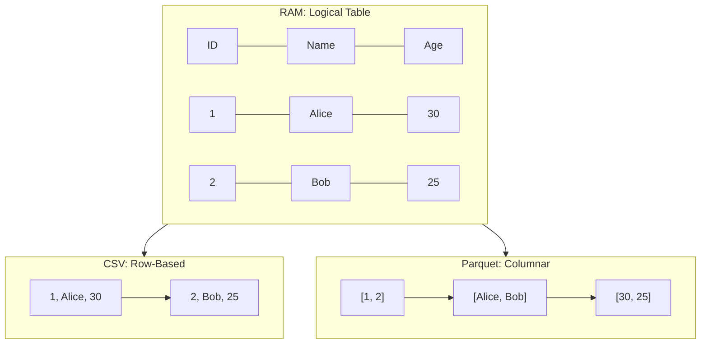
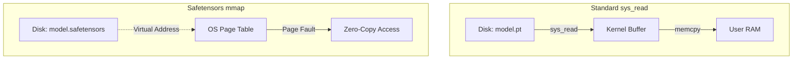

# Files Under the Hood: From Bits to Tensors

## The Great Abstraction

If you open a terminal and type `ls`, you see a list of names. If you double-click one of those names in a GUI, an application opens and displays text, an image, or a video. We have been conditioned to think of these as discrete, physical objects living inside our hard drives—like documents inside a filing cabinet.

But there is no filing cabinet. There are no documents. 

At the hardware level, your solid-state drive is just a massive grid of floating-gate transistors trapping electrons. It has no concept of a "JPEG" or a "CSV". It only knows blocks of bits, typically grouped into 4KB or 8KB pages.

The "file" is one of the most successful abstractions in the history of computer science. It is an illusion maintained entirely by the operating system (OS) and the file system (like ext4, NTFS, or APFS). When you ask the OS to read a file, you are invoking a system call (like `sys_read`). The OS looks up an **inode** (index node)—a data structure that holds metadata about the file (permissions, creation date) and, crucially, a map of where the actual data blocks are physically scattered across the disk. 

The OS takes those scattered hardware blocks and presents them to your application as a pristine, continuous 1D array of bytes. 

Everything is just a sequence of bytes. The operating system does not care what those bytes represent. The distinction between a "text file" and a "binary file" is entirely artificial. A text file is simply a binary file where the sequence of bytes happens to map to human-readable characters according to an agreed-upon encoding standard, like UTF-8. 

If you understand this—that a file is just a 1D array of bytes mapped to a physical disk by the OS—you understand the fundamental problem of computing: **Serialization**.

## The Serialization Problem

Your application lives in RAM. In RAM, data is alive. It exists as complex, multi-dimensional structures: objects with pointers to other objects, nested dictionaries, graph nodes, C-structs, and n-dimensional floating-point arrays. Memory is non-linear, heavily cross-referenced, and blazingly fast.

But RAM is volatile. When the power goes out, the electrons bleed away, and the data dies.

To save your data, you must persist it to disk. But the disk only accepts that 1D sequence of bytes. **Serialization** is the painful process of taking a beautiful, complex 3D memory structure, flattening it into a 1D string of bytes, and writing it to disk. **Deserialization** is the process of reading those bytes and reconstructing the original memory structure.

This is fundamentally difficult because memory structures rely on pointers (memory addresses). You cannot write a memory address to a file, because when you load the file tomorrow, your application will be assigned different memory addresses by the OS. You have to translate everything into raw values. Furthermore, you have to deal with **endianness**—does your CPU store the most significant byte of an integer first (Big-Endian) or last (Little-Endian)? 

For decades, we relied on simple text-based formats to bypass these hardware-specific headaches.

### The Era of Text: CSV and JSON

**CSV (Comma-Separated Values)** is perhaps the most universally understood serialization format. It is a text file that pretends to be a table by using commas as column delimiters and newlines as row delimiters. It is human-readable, which is its greatest strength, but it is computationally tragic. 

To read the 10,000th row of a CSV, the computer cannot just jump to a memory offset. It must parse every single character from the very beginning, counting newline characters, because it has no index of where rows start. Furthermore, parsing text into native floating-point numbers is incredibly CPU-intensive. The CPU has to read the string `"3.14"`, calculate powers of 10, and construct an IEEE 754 float in memory. 

**JSON (JavaScript Object Notation)** emerged as the undisputed king of web APIs. It excels at representing nested, hierarchical data without the rigid schemas of its predecessor, XML. But JSON is notoriously bloated. A number like `3.14159265` takes 10 bytes to represent as text in JSON, whereas it would only take 4 or 8 bytes in a native binary float. More importantly, JSON requires parsing the entire document to build a syntax tree in memory. If you have a 5 GB JSON file, you need significantly more than 5 GB of RAM just to parse it.

These text formats work perfectly for configurations, web requests, and small datasets. But as the era of Big Data and Machine Learning arrived, we hit a wall. When you are dealing with terabytes of telemetry or billion-parameter models, text-based serialization is not just slow—it brings systems to a halt.

## Big Data & Columnar Storage: Parquet

Let us talk about data engineering. Suppose you have a table with 100 columns and 100 million rows representing user events. You want to compute the average of just one column: `session_duration`.

Traditionally, relational databases (OLTP systems like PostgreSQL) store data in a **Row-Based** format. The data is serialized row by row. Row 1 (all 100 columns), then Row 2 (all 100 columns). 

If you want to read just the `session_duration` column, the disk must read the entire file into the OS Buffer Cache, skipping over 99 columns of irrelevant data for every single row. You are drowning in I/O (Input/Output) overhead.

Enter **Columnar Storage**, and its champion for analytics (OLAP): **Apache Parquet**.

Parquet flips the matrix. It serializes data column by column. All 100 million values of Column 1 are stored physically together, followed by all values of Column 2, and so on.

This simple architectural shift changes everything for analytics:

1. **Projection Pushdown**: If your query only asks for `session_duration`, the query engine only reads that specific contiguous chunk of the file. Disk I/O is reduced by 99% instantly.
2. **Predicate Pushdown**: Parquet files contain metadata headers with statistics (min/max values) for chunks of data (row groups). If your query says `WHERE age > 40`, and the chunk metadata says the max age in this block is 35, the query engine completely skips reading that block.
3. **Extreme Compression**: Because all values in a column are of the exact same type (e.g., all 32-bit integers), compression algorithms work phenomenally well. Parquet uses **Dictionary Encoding** (if a string column only contains "Yes" or "No", it maps them to `0` and `1` internally) and **Run-Length Encoding (RLE)** (if there are 1000 zeroes in a row, it just stores `0 x 1000`).

Parquet is not a human-readable file. If you `cat` a Parquet file, you will see binary garbage. But for machines, it is a masterpiece of efficiency, forming the backbone of modern data lakes (AWS Athena, Snowflake, Databricks).

## Python's Object Persistence: Pickle and Joblib

While data engineers were busy optimizing tables with Parquet, machine learning engineers faced a different serialization problem: how do you save a complex Python object?

Imagine you train a Random Forest in `scikit-learn`. The trained model is not a flat table. It is a deeply nested Python object with decision trees, arrays of thresholds, node impurities, and hyperparameter dictionaries. You cannot save this to a CSV or Parquet file.

Python's built-in solution is `pickle`. Pickle traverses a Python object hierarchy and converts it into a byte stream. It is magical in its simplicity: `pickle.dump(model, file)` saves your entire model state, and `pickle.load(file)` resurrects it.

But under the hood, Pickle is fundamentally flawed for ML in two critical ways.

First, it is **inefficient for large numerical arrays**. Pickle was designed for general Python objects (lists, dicts, classes), not gigabytes of continuous NumPy matrices. Serializing a massive NumPy array through Pickle adds unnecessary overhead. To solve this, the ML community adopted **Joblib**. Joblib is essentially an optimized version of Pickle that detects large NumPy arrays and saves them efficiently (often by memory-mapping them to separate files or applying heavy compression). If you are saving a classic machine learning model, you should be using Joblib.

Second, Pickle is a **massive security vulnerability**. 
Pickle does not just save static data; it saves the *instructions* required to reconstruct the object. The pickled byte stream is actually a sequence of opcodes for a specialized stack-based virtual machine built into the Python interpreter. When you call `pickle.load()`, you are instructing this VM to execute those opcodes. 

A malicious actor can easily craft a pickled file that contains instructions to import the `os` module and execute arbitrary shell commands. If you download an untrusted `.pkl` file from the internet and load it, you have essentially run a remote script on your machine, granting the attacker full access. This is Arbitrary Code Execution (ACE), and it is the reason why the modern ML community is urgently migrating away from Pickle.

## The Bridge: HDF5

Before we talk about modern LLMs, we must acknowledge **HDF5 (Hierarchical Data Format)**. Created for the scientific community (physics, astronomy, bioinformatics), HDF5 was designed to store massive, complex, heterogeneous data.

HDF5 acts like a virtual file system *inside* a file. It can store directories, datasets, and metadata all in one binary artifact. For years, this was the gold standard for saving deep learning weights (especially in Keras and early TensorFlow). It allowed engineers to save multi-dimensional arrays (tensors) efficiently without the security flaws of Pickle. 

However, HDF5 is a massive, complex C library. It is notoriously difficult to use in highly concurrent, multi-threaded environments due to global locks. As PyTorch grew to dominate research, the community needed something native, simpler, and tailored specifically for Deep Learning.

## Modern AI: The Era of Tensors

As Deep Learning models grew from millions to hundreds of billions of parameters, the artifacts we needed to save changed. A modern Large Language Model (LLM) is not a complex web of Python objects. It is simply a massive collection of **Tensors**—multi-dimensional arrays of floating-point numbers (weights)—along with some lightweight metadata (names of the layers, tensor shapes).

### The PyTorch Standard: `.pt` / `.pth`

For years, the standard way to save PyTorch models was using `torch.save()`, which produced `.pt` or `.pth` files. But what is actually inside this file?

If you inspect a `.pt` file, you will discover it is just a ZIP archive. Inside that archive is a Pickled Python dictionary. The keys are the names of the neural network layers (e.g., `transformer.layers.0.attention.weight`), and the values are pointers to the raw tensor bytes stored elsewhere in the ZIP.

Because it relies heavily on Pickle, `.pt` files inherit the exact same Arbitrary Code Execution security vulnerabilities. You should **never** load an untrusted `.pt` file from the internet. 

Furthermore, the loading process is incredibly inefficient. To extract a tensor from a `.pt` file, PyTorch must:
1. Unzip the archive.
2. Run the Pickle VM to reconstruct the dictionary.
3. Allocate empty memory in RAM.
4. Issue a `sys_read` to copy the bytes from the file on disk into the OS Kernel Buffer, and then copy them again into the allocated RAM.

If you are loading a 70 GB model, this process takes significant time, spikes CPU usage, and requires 70 GB of available RAM just to perform the copy operations.

### The Paradigm Shift: Safetensors

In 2023, Hugging Face introduced **Safetensors**, which rapidly became the new industry standard. Safetensors solves the two massive flaws of PyTorch `.pt` files: security and loading latency.

Safetensors entirely eliminates Pickle and ZIP archives. The file format is radically, beautifully simple:
1. An 8-byte integer at the very beginning specifying the size of the header.
2. A strict JSON header containing metadata (layer names, shapes, data types, and exact byte offsets).
3. The raw, contiguous byte buffers of the tensors.

Because the header is pure JSON, there is absolutely no code execution. It is provably safe to download and inspect.

But the true genius of Safetensors is **Zero-Copy Loading via Memory Mapping (`mmap`)**.

We need to talk about Virtual Memory. Modern operating systems do not give applications direct access to physical RAM. They provide a "Virtual Address Space" and use Page Tables to map virtual addresses to physical RAM. 

`mmap` is an OS-level system call that tells the kernel: *"Take this file on the hard drive, and map it directly into my application's virtual address space."* 

The OS tricks the application into thinking the entire 70 GB file is already sitting in RAM. In reality, nothing has been copied. When the application actually tries to access a specific tensor, the CPU triggers a **Page Fault**. The OS catches this, pauses the application, fetches that specific 4KB page from the SSD, places it in RAM, and resumes the application.

Because the tensor data in a Safetensors file is stored sequentially and perfectly aligned, PyTorch can map it instantly. Loading a 10 GB model takes milliseconds instead of seconds. You don't need double the RAM to perform the copy, and the OS manages memory paging automatically, dropping pages from RAM if the system runs low on memory. It is a masterpiece of systems engineering applied to AI.

### The Local LLM Revolution: GGUF

As the open-source community pushed to run massive LLMs on consumer hardware (like MacBooks and gaming PCs), we needed a format optimized for extreme quantization (converting 16-bit floats to 4-bit or 8-bit integers) and fast loading in C/C++ environments, bypassing Python entirely.

Enter **GGUF (GPT-Generated Unified Format)**, created by Georgi Gerganov and the `llama.cpp` team. 

GGUF is a binary format specifically designed for distributing LLMs for local inference. It is highly extensible, meaning developers can inject new metadata (like chat templates, tokenizer rules, or prompt formats) directly into the file without breaking older parsers. 

Crucially, GGUF natively supports highly complex quantization schemas at the block level. This allows a massive 70B parameter model to be compressed and run on a machine with just 32GB of unified memory. Like Safetensors, GGUF is designed from the ground up to rely heavily on `mmap` for instant, zero-copy loading in C++. If you are downloading models to run locally via LM Studio, Ollama, or text-generation-webui, you are downloading `.gguf` files.

## The Matrix: When to Use What

We have moved from the lowest-level OS abstraction of a file to the cutting edge of AI tensor serialization. As an engineer, choosing the right file format is an architectural decision. Here is the modern pragmatic matrix:

| Use Case | Recommended Format | Why? | What to Avoid |
|----------|-------------------|------|---------------|
| **Tabular Data / Analytics** | `Parquet` | Columnar, projection pushdown, extreme compression (RLE, Dict). | `CSV` (slow parsing, massive I/O overhead). |
| **Complex Configurations** | `YAML` or `JSON` | Human-readable, strict schema support. | `Pickle` (security risk). |
| **Traditional ML Models** | `Joblib` | Optimized for large NumPy arrays and `scikit-learn`. | `Pickle` (unoptimized for large arrays). |
| **Deep Learning Weights** | `Safetensors` | Zero-copy loading (`mmap`), zero ACE vulnerabilities. | `.pt` / `.pth` (Pickle vulnerabilities, slow loading). |
| **Local LLM Distribution** | `GGUF` | Built-in quantization, C++ native, extensible metadata. | Raw `.bin` files (lack metadata and structure). |
| **Scientific Arrays / Bio** | `HDF5` | Standard for physics/bio, supports partial heterogeneous reading. | Writing custom binary formats from scratch. |

## The End of the File

The "file" remains an illusion—a 1D array of bytes mapped to silicon by the OS. But our ability to structure the bytes within that illusion has defined the limits of computing at every era. 

We outgrew CSV when we needed to analyze petabytes of telemetry, giving rise to Parquet. We outgrew Pickle and `.pt` as models crossed the hundred-billion parameter threshold, exposing security flaws and memory bottlenecks. Safetensors and GGUF are not just incremental updates; they represent a fundamental architectural shift towards OS-level memory mapping and secure-by-default serialization.

The next time you download a model, save a dataframe, or even write a simple text log, remember what is actually happening under the hood. You are commanding the operating system to arrange billions of electrons into a precise, sequential pattern, hoping that one day, a parser will know exactly how to resurrect the memory it represents.

---

## Going Deeper

**Books:**

- Kerrisk, M. (2010). *The Linux Programming Interface.* No Starch Press. — The definitive guide to Linux system calls, including the complete `mmap`, file I/O, and virtual memory chapters. Chapter 49 on `mmap` alone is worth the price. Heavy but authoritative.

- Kleppmann, M. (2017). *Designing Data-Intensive Applications.* O'Reilly. — Chapter 3 on storage engines explains why columnar formats like Parquet exist, what B-trees and LSM trees are, and how storage format choices affect query performance at every scale.

- Gorelick, M., & Ozsvald, I. (2020). *High Performance Python.* 3rd ed. O'Reilly. — Chapters on NumPy memory layout, memory profiling, and data serialization explain the practical performance implications of format choices in Python.

**Videos:**

- ["How SSDs Work"](https://www.youtube.com/watch?v=5Mh3o886qpg) by Branch Education — An exceptional visual explainer on NAND flash architecture, wear leveling, and why random reads on SSDs are faster than on spinning disks. Directly relevant to understanding why memory-mapped I/O matters.

- ["Apache Arrow: The Secret of Lightning Fast Analytics"](https://www.youtube.com/watch?v=Hki3BiqEIKs) by Uwe Korn (PyData) — A talk from one of the Arrow contributors explaining the columnar memory format, zero-copy reads, and why Arrow became the lingua franca for in-memory analytics.

- ["Why Parquet?"](https://www.youtube.com/watch?v=1j8SdS7s_NY) by Databricks — A well-produced explanation of columnar storage, predicate pushdown, and projection pushdown with benchmarks.

**Online Resources:**

- [Apache Parquet Documentation](https://parquet.apache.org/docs/) — The format specification. The "File Format" section explains encoding, compression, and the row group / column chunk structure.
- [Safetensors on Hugging Face](https://huggingface.co/docs/safetensors/) — Complete spec with the security rationale and the zero-copy loading design.
- [GGUF Format Specification](https://github.com/ggerganov/ggml/blob/master/docs/gguf.md) — The llama.cpp documentation with full metadata key definitions and quantization type descriptions.
- [Python `mmap` Documentation](https://docs.python.org/3/library/mmap.html) — The standard library reference for memory-mapped file objects in Python.

**Key Papers:**

- Harris, C.R., et al. (2020). ["Array programming with NumPy."](https://www.nature.com/articles/s41586-020-2649-2) *Nature*, 585, 357–362. — The formal paper documenting NumPy's design philosophy, memory model, and its role as the foundation for the Python data science stack.

- Zaharia, M., et al. (2016). ["Apache Spark: A Unified Engine for Big Data Processing."](https://dl.acm.org/doi/10.1145/2934664) *Communications of the ACM*, 59(11). — Explains the storage layer design that made Parquet the dominant format for large-scale analytics.

**Questions to Explore:**

What happens at the operating system level when you call `mmap` on a 10 GB file? What is the difference between a page fault and a cache miss in this context? Why does loading a Safetensors file scale better than loading a Pickle file as model size grows from 1 GB to 100 GB?