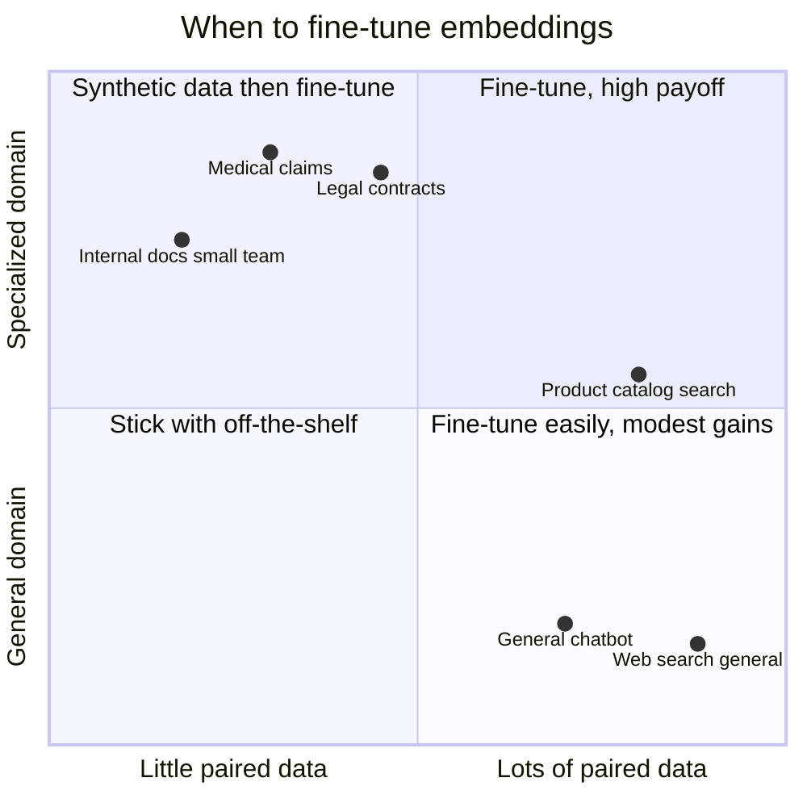
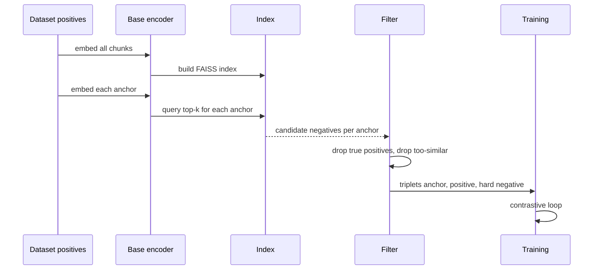
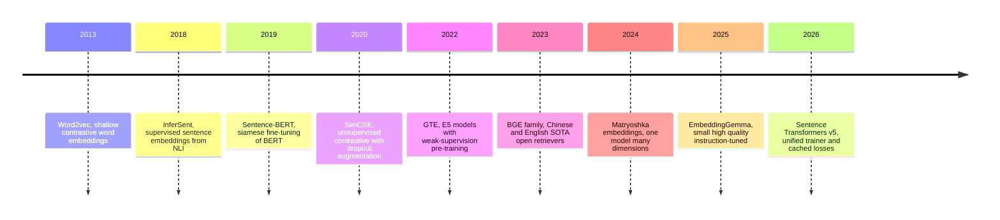

# Fine-Tuning Embeddings: What You Gain, What You Need, and How to Actually Do It

Here's a pattern I've watched play out on four different RAG projects in the last year. The team starts with `text-embedding-3-large` from OpenAI because it's easy. Recall@10 on their hand-labeled eval set is 61%. They read that BGE or Nomic is better and cheaper, so they swap. Recall@10 jumps to 68%. Morale goes up. They launch. Users start complaining that the chatbot misses obvious things — clauses in internal policies, part numbers in the product catalog, abbreviations the whole company uses but nobody outside the company has ever heard. Recall@10 on those failure queries is 40% and no amount of chunking or prompt engineering moves it.

At this point, most teams reach for reranking, hybrid search, or a bigger LLM. These help. But the thing very few teams reach for — and the thing with the highest ceiling — is **fine-tuning the embedding model itself**. You took a model trained on general web text and asked it to distinguish between two policies that differ only in a regulatory reference code. It was never going to be great at that out of the box. The surprising part is how much better it can become with a few thousand examples and an afternoon of training.

This post is the full playbook. We'll cover what fine-tuning an embedding model actually means (and how it differs from fine-tuning an LLM), when it's worth the effort and when it isn't, what training data looks like and how to generate it synthetically when you don't have any, the zoo of loss functions and which one to actually use, why hard negative mining is the single highest-leverage decision in the whole pipeline, a complete walkthrough with Sentence Transformers v5, how to evaluate the result honestly, and the production gotchas around shipping a new embedding model without nuking your vector index.

This post assumes you've read (or at least agree with the premises of) [Embeddings: The Geometry of Meaning](/blog/research/embeddings-geometry-of-meaning) and [MTEB: Choosing the Right Embedding Model](/blog/field-notes/mteb-embedding-benchmarks). You have an off-the-shelf embedding model picked. It works okay. You want to know whether fine-tuning is worth the effort for your use case, and if so, how to do it without burning a week on dead ends.

## What Fine-Tuning an Embedding Model Actually Is

Worth clearing up a confusion I hit every time I explain this. "Fine-tuning" in 2026 mostly means LoRA on a decoder LLM to change its output style or behavior. Fine-tuning an embedding model is a different thing. You're not changing what the model *says*. You're changing what it considers *similar*.

An embedding model is a function $f: \text{text} \to \mathbb{R}^d$ that maps strings to vectors. Two strings are "similar" if their vectors are close, usually by cosine similarity. Fine-tuning reshapes the geometry of that vector space: you show the model pairs of things that should be close and pairs of things that should be far apart, and the model adjusts its weights so the embedding space starts respecting your domain's notion of "close."

Formally, most embedding fine-tuning is a form of **metric learning**. You have a learnable function $f_\theta$ (the encoder, typically a BERT-style transformer with mean pooling on top) and a similarity measure $s(u, v) = \cos(f_\theta(u), f_\theta(v))$. You train with a loss that encourages $s(\text{anchor}, \text{positive}) > s(\text{anchor}, \text{negative})$ for all pairs in your training set. After training, the encoder's geometry is reshaped so that your domain's positives cluster and your domain's negatives separate.

The crucial implication: **you are not teaching the model new facts**. You're teaching it a new distance. A fine-tuned embedding model for medical insurance claims doesn't "know" more about insurance than the base model. It's just gotten much better at deciding that "HCPCS J3490" and "unclassified injectable drug" should be close, and that "out-of-network" and "in-network" should be far apart. Those decisions weren't wrong in the base model — they were just undifferentiated, because the base model had no reason to care about the distinction.

That's the whole game. Re-shape the geometry.

## When It's Actually Worth It

Fine-tuning an embedding model is neither expensive nor risky compared to fine-tuning an LLM, but it's also not free. You need data (or you need to generate it), training time, evaluation infrastructure, and a plan for re-embedding your corpus when you ship the new model. Before you commit, it's worth checking whether you're actually in the regime where fine-tuning pays.

Here's the decision surface I use. Two axes matter: **how specialized your domain is** and **how much paired data you can get your hands on**.



A few rules of thumb I've landed on after watching this go wrong and right:

**Fine-tune when your queries and your documents speak different registers.** If your users type casual questions and your documents are dense technical prose, there's a consistent translation the model can learn. Retrieval quality often jumps by 8-15 points of NDCG@10 with only a few thousand synthetic pairs.

**Fine-tune when your domain has terminology the base model has not seen enough.** Part numbers, regulatory codes, company-internal acronyms, drug names, gene symbols, legal citations. The base model treats these as rare tokens with weak embeddings; a domain fine-tune teaches it which codes are near-synonyms, which are hierarchical, and which are unrelated.

**Don't fine-tune as a first response to "retrieval is bad."** Retrieval can fail for dozens of reasons that have nothing to do with the embedding model: bad chunking, missing metadata, wrong distance metric, a reranker that would help, unindexed fields, or just vector search being the wrong tool for a query that needs exact keyword match. Check all of those first. I have seen teams fine-tune when their real problem was that they were chunking at 1024 tokens and their answer spans were 1500.

**Don't fine-tune if your corpus changes daily.** Re-embedding a million documents every time you retrain is a real operational burden. If the domain is moving fast, keep the embedding model stable and move intelligence into reranking, query rewriting, or retrieval fusion, where changes don't require a corpus rebuild.

**Do fine-tune if the model will be stable for six months.** The cost is paid once; the benefit compounds every query.

## What Training Data Actually Looks Like

Here is the secret nobody tells you when they demo fine-tuning on a slide: the quality of your fine-tuned embedding model is **almost entirely** a function of the quality of your training pairs. The loss function matters a lot less than people think. The architecture matters even less. The data is the whole thing.

Fine-tuning data for embedding models comes in a few shapes:

**Positive pairs** $(a, p)$ — anchor and positive. The anchor is typically a query; the positive is a document (or sentence, or chunk) that genuinely answers it. The model learns to pull these together. This is by far the most common format and is what you need for Multiple Negatives Ranking Loss.

**Triplets** $(a, p, n)$ — anchor, positive, and negative. The negative is an explicitly chosen "close but wrong" document. The model learns to pull positives in while pushing the specific negative away. More expensive to curate, but the extra signal from a well-chosen negative is significant.

**Pairs with labels** $(s_1, s_2, y)$ where $y \in \{0, 1\}$ or $y \in [0, 1]$ — two sentences and a similarity score. This is the classic STS-benchmark format. Useful for sentence-similarity tasks, less common for retrieval.

For RAG retrieval — which is why 90% of people reading this care — you want positive pairs of the form (query, answer-chunk). A good dataset has somewhere between 5,000 and 50,000 such pairs. Below 5,000 you're often fighting noise; above 50,000 the marginal return drops off, because the base model is already strong.

### Where the data comes from

You have three realistic sources.

**Option 1: Harvest from your logs.** If you already have a RAG system in production, every user query paired with the chunk that produced a successful answer is a training example. Filter by user feedback (thumbs up, conversion, downstream success) and you get a high-quality dataset for free. This is the gold standard and nobody has enough of it.

**Option 2: Harvest from your domain.** Pull Q&A pairs from your help center, your FAQ, your internal Confluence, your customer support tickets with resolved outcomes. These are naturally noisy but plentiful, and "noisy but plentiful" is often better than "clean but tiny" for contrastive learning.

**Option 3: Synthesize with an LLM.** For each chunk in your corpus, ask an LLM to generate 3-5 questions that chunk answers. This is the technique that unlocked domain-specific embedding fine-tuning for small teams. Phil Schmid popularized it in 2024; it's now the default starting point if you don't have logs.

Here's the skeleton:

```python
from openai import OpenAI
import json

client = OpenAI()

GEN_PROMPT = """You are a query generator for a retrieval system.
Given the passage below, write {n} distinct questions that a user
might ask whose answer is specifically in this passage.
Questions should be natural, varied in length and style, and
must be answerable ONLY from the given passage.

Passage:
\"\"\"{passage}\"\"\"

Return a JSON list of {n} question strings, nothing else."""

def generate_queries(passage: str, n: int = 3) -> list[str]:
    resp = client.chat.completions.create(
        model="gpt-4o-mini",
        messages=[{"role": "user", "content": GEN_PROMPT.format(n=n, passage=passage)}],
        response_format={"type": "json_object"},
        temperature=0.7,
    )
    data = json.loads(resp.choices[0].message.content)
    return data.get("questions", data if isinstance(data, list) else [])

def build_training_pairs(chunks: list[str], n_per_chunk: int = 3):
    pairs = []
    for chunk in chunks:
        for q in generate_queries(chunk, n=n_per_chunk):
            pairs.append({"anchor": q, "positive": chunk})
    return pairs
```

Three things to know about synthetic data that are not obvious the first time:

1. **The generator model matters less than you'd think.** `gpt-4o-mini` and `Claude Haiku` both produce questions that are good enough. Don't over-optimize here.
2. **Diversity matters more than fluency.** Generate with temperature 0.7 or higher. Ask for questions in different styles (casual, formal, keyword-style, question-style). The model will overfit to a single register if you let it.
3. **You must evaluate on real queries, not synthetic ones.** Synthetic questions are easier than real user questions because the LLM can see the passage. A model that crushes synthetic evals can still fail on production traffic. Always hold out a small hand-labeled real eval set.

## The Loss Zoo and Which One to Pick

The Sentence Transformers library as of v5 ships about 30 loss functions. Reading them all on a Saturday afternoon is a rite of passage. Here's the pragmatic short version for people who have a deadline.

| Loss | When to use | What it needs | Notes |
|---|---|---|---|
| **MultipleNegativesRankingLoss** (MNR) | Default choice for retrieval | Positive pairs only | Uses other items in the batch as implicit negatives; best quality-per-effort in the library |
| **CachedMultipleNegativesRankingLoss** | Same as MNR but on small GPUs | Same as MNR | Trades speed for memory; lets you simulate large batches |
| **TripletLoss** | When you have explicit hard negatives | Triplets $(a, p, n)$ | Needs thoughtful margin tuning; good when negatives are carefully curated |
| **ContrastiveLoss** | Binary similar/dissimilar pairs | Labeled pairs | Classical choice; rarely the best for retrieval in 2026 |
| **CoSENTLoss** | Continuous similarity scores | Labeled pairs with float labels | Modern replacement for CosineSimilarityLoss; smoother gradients |
| **MatryoshkaLoss** | When you want one model with many dimensions | Wraps another loss | Produces embeddings you can truncate (768 → 256 → 128) with minimal quality loss |
| **CachedSpladeLoss** (v5) | Sparse learned retrieval | Text pairs | For SPLADE-style sparse embeddings; not relevant for dense retrieval |

If I'm forced to give one recommendation for a team fine-tuning a dense retrieval model for RAG in 2026, it is this: **wrap MultipleNegativesRankingLoss inside MatryoshkaLoss**. You get the quality of the best contrastive loss for retrieval, plus the ability to ship one model and use different dimensions at different stages of your pipeline (768 for accurate final retrieval, 128 for cheap candidate generation). This is the configuration that most of the top open retrieval models in 2026 use.

### A quick look at how MNR actually works

MNR is elegant. You construct a batch of $N$ pairs $(a_1, p_1), (a_2, p_2), \ldots, (a_N, p_N)$. For each anchor $a_i$, the positive is $p_i$ and **every other $p_j$ in the batch is treated as a negative**. The loss is a cross-entropy over similarities:

$$
\mathcal{L} = -\frac{1}{N} \sum_{i=1}^{N} \log \frac{\exp(s(a_i, p_i) / \tau)}{\sum_{j=1}^{N} \exp(s(a_i, p_j) / \tau)}
$$

where $s$ is cosine similarity and $\tau$ is a temperature parameter. Intuitively: for each anchor, the positive should "win" against all the other positives in the batch.

This has a beautiful property: **larger batches mean more negatives**, which means a harder task, which means better-learned embeddings. Batch size is not just a speed parameter; it's a quality parameter. Push it as high as your GPU will allow. Use gradient accumulation or `CachedMultipleNegativesRankingLoss` if you need bigger effective batches than your VRAM supports.

## Hard Negative Mining: The Secret Ingredient

Here's the single most important thing I can tell you about fine-tuning embeddings: **random negatives are too easy**. The model learns to separate "refund policy" from "Paris tourism" in about ten minutes and then plateaus. What actually improves the model is being forced to separate "refund policy" from "return policy" — two chunks that look almost identical but answer different questions.

Negatives that are hard but still correctly negative are called **hard negatives**. Mining them is a process, not a one-liner. The standard loop:

1. Start with positive pairs only.
2. Embed all your corpus chunks with the base (pre-fine-tune) model.
3. For each anchor in your training set, retrieve the top-$k$ most similar chunks using the base model.
4. Any of those top-$k$ that is **not** the true positive is a candidate hard negative.
5. Optionally filter: discard candidates that are too similar to the positive (these might be "false negatives" — things that should be positive but aren't labeled).

The filtered candidates become your hard negatives. Feed triplets `(anchor, positive, hard_negative)` into training and watch the quality jump. In my experience, hard negative mining is worth another 3-6 points of NDCG@10 on top of whatever the loss function gives you.



A few subtleties worth knowing. First, **mine negatives with the base model, not a random initialization**. Random negatives from random initializations are not hard; they're just noise. Second, **remine periodically**. After a few epochs of training, your current model is a stronger retriever than the base model, and negatives that were once hard are now trivial. Re-embed and re-mine once the validation metrics plateau to get a fresh batch of harder negatives. Third, **use a margin when filtering**. If a candidate negative has cosine similarity to the positive above ~0.95, it's probably a genuine paraphrase that your labeling missed. Drop it.

## Prerequisites and Environment

Everything in this post runs on a single GPU. I'll assume you have one with at least 16 GB of VRAM — that's enough for base-size models (BGE-base, Nomic v1.5, BAAI BGE-M3) at reasonable batch sizes. For large-size models (BGE-large) you'll want 24 GB; for the biggest multilingual models you'll want 40 GB. Free Colab T4s (15 GB) work for small models; Colab Pro A100s (40 GB) are comfortable for anything in this post.

```bash
python -m venv .venv
source .venv/bin/activate
pip install "sentence-transformers>=5.3" "datasets>=3.0" "accelerate>=0.34" faiss-cpu openai
```

No special hardware config beyond having CUDA set up. If you don't have a local GPU, the Sentence Transformers documentation now has a Colab-compatible notebook for most of the flows in this post.

## A Complete Fine-Tuning Walkthrough

Let's fine-tune BGE-base on a synthetic RAG dataset end-to-end. This is the pattern that maps most cleanly to a real project. I'm going to show the full code because the gotchas live in the details.

### Step 1: build the dataset

Assume you have a list of chunks from your corpus as `corpus_chunks: list[str]`. We'll generate queries synthetically, producing positive pairs.

```python
from datasets import Dataset
import json

pairs = build_training_pairs(corpus_chunks, n_per_chunk=3)
# pairs = [{"anchor": "...", "positive": "..."}, ...]

ds = Dataset.from_list(pairs)
ds = ds.shuffle(seed=42)
split = ds.train_test_split(test_size=0.05, seed=42)
train_ds, eval_ds = split["train"], split["test"]
print(f"train: {len(train_ds)}  eval: {len(eval_ds)}")
```

### Step 2: set up the model and loss

```python
from sentence_transformers import SentenceTransformer
from sentence_transformers.losses import (
    MultipleNegativesRankingLoss,
    MatryoshkaLoss,
)

model = SentenceTransformer("BAAI/bge-base-en-v1.5")

inner_loss = MultipleNegativesRankingLoss(model)
loss = MatryoshkaLoss(
    model=model,
    loss=inner_loss,
    matryoshka_dims=[768, 512, 256, 128, 64],
)
```

What this does: MNR is the inner loss doing the actual retrieval learning. `MatryoshkaLoss` wraps it and forces the model to produce embeddings that are *also* useful at truncated dimensions. At inference you can call the model and either take the full 768-dim vector or slice the first 128 dimensions — both will give reasonable retrieval quality, with the 128-dim version trading a few points of recall for 6x smaller storage and faster search.

### Step 3: build an Information Retrieval evaluator

This is the part most tutorials skip, and it's how you avoid shipping a worse model than you started with. The Sentence Transformers library has an `InformationRetrievalEvaluator` that computes NDCG@k, Recall@k, and MRR@k on a held-out set of queries and a corpus.

```python
from sentence_transformers.evaluation import InformationRetrievalEvaluator

queries = {f"q{i}": ex["anchor"] for i, ex in enumerate(eval_ds)}
corpus = {f"d{i}": ex["positive"] for i, ex in enumerate(eval_ds)}
relevant_docs = {f"q{i}": {f"d{i}"} for i in range(len(eval_ds))}

evaluator = InformationRetrievalEvaluator(
    queries=queries,
    corpus=corpus,
    relevant_docs=relevant_docs,
    name="domain-eval",
    ndcg_at_k=[1, 5, 10],
    accuracy_at_k=[1, 5, 10],
    map_at_k=[10],
    show_progress_bar=True,
)

# Baseline: evaluate before training
baseline = evaluator(model)
print("baseline:", baseline)
```

Run the evaluator on the base model first. This is your floor. If your fine-tuned model doesn't beat it, something is wrong with your data, your loss, or your hyperparameters, and you need to debug before shipping.

### Step 4: train

```python
from sentence_transformers import SentenceTransformerTrainer, SentenceTransformerTrainingArguments

args = SentenceTransformerTrainingArguments(
    output_dir="models/bge-base-domain-ft",
    num_train_epochs=3,
    per_device_train_batch_size=64,
    per_device_eval_batch_size=64,
    learning_rate=2e-5,
    warmup_ratio=0.1,
    fp16=True,
    eval_strategy="steps",
    eval_steps=200,
    save_strategy="steps",
    save_steps=200,
    save_total_limit=2,
    load_best_model_at_end=True,
    metric_for_best_model="domain-eval_cosine_ndcg@10",
    report_to="none",
)

trainer = SentenceTransformerTrainer(
    model=model,
    args=args,
    train_dataset=train_ds,
    eval_dataset=eval_ds,
    loss=loss,
    evaluator=evaluator,
)

trainer.train()
```

Things worth explaining. Learning rate `2e-5` is a safe default; going higher on a base-size model often hurts. Batch size 64 on a 16 GB GPU is tight but workable; with CachedMNR you can push it higher. `load_best_model_at_end` plus `metric_for_best_model` means the checkpoint you save is the one with the best NDCG@10, not the last step — critical, because embedding models can and do overfit quickly on small datasets.

### Step 5: re-mine hard negatives and train again

After the first round, remine:

```python
from sentence_transformers.util import mine_hard_negatives

hard_train_ds = mine_hard_negatives(
    dataset=train_ds,
    model=model,            # the freshly trained model
    anchor_column_name="anchor",
    positive_column_name="positive",
    num_negatives=5,
    range_min=10,           # skip the top 10 most similar, they might be true positives
    range_max=50,
    max_score=0.95,         # drop candidates almost identical to the positive
    margin=0.05,            # require gap between positive and negative
    sampling_strategy="top",
    batch_size=256,
)
```

This produces a new dataset of triplets. Switch to `TripletLoss` (or a multi-negatives-aware variant) for the second round, train for another epoch or two, and re-evaluate. This two-stage training — MNR first, then hard-mined triplets — is where the final 3-6 points of quality come from.

### Step 6: verify the saved model works

Critically important, and often skipped. Load the saved model from disk as if you were a downstream service and confirm it produces reasonable embeddings:

```python
from sentence_transformers import SentenceTransformer
import numpy as np

loaded = SentenceTransformer("models/bge-base-domain-ft")
q = "what's our policy on expired invoices?"
docs = [
    "Invoices more than 90 days past due should be flagged in NetSuite.",
    "Employees should book travel through Navan for compliance tracking.",
    "Expired invoices are written off at quarter-end after manager review.",
]
qv = loaded.encode(q, normalize_embeddings=True)
dv = loaded.encode(docs, normalize_embeddings=True)
sims = dv @ qv
for s, d in sorted(zip(sims, docs), reverse=True):
    print(f"{s:.3f}  {d}")
```

If the ordering looks wrong here, you have a problem. If it looks right, you have a model that's ready for a proper eval pass on real traffic.

## Evaluation That Won't Lie to You

Training metrics are not the same as deployment metrics, and evaluating embedding models honestly is harder than it looks. Three rules I've learned the expensive way.

**Hold out a real query set.** Not synthetic, not generated, not paraphrased. Get a list of real user queries from production logs or from hand-written examples by someone who understands the domain. 100-200 is plenty. This is your ground truth and the metric that matters.

**Evaluate against the full corpus, not just the positives.** The `InformationRetrievalEvaluator` in Sentence Transformers does this correctly, but if you're rolling your own, make sure the "distractors" in the retrieval pool are the entire corpus, not just the positive set. A model that beats another on a toy 1,000-document eval can tie or lose on a 100,000-document index.

**Report NDCG@10 and Recall@50**, not just Recall@1. NDCG is sensitive to ranking quality, which matters when a reranker will see the top-k. Recall@50 tells you whether the right answer is in the candidate set at all, which matters when you're feeding the results to an LLM that can sift through them. A model that crushes Recall@1 but tanks Recall@50 is often memorizing exact pairs from training rather than learning the domain geometry — a classic overfit.

As a sanity check: a good fine-tune on a well-specified domain with 10k synthetic pairs typically moves NDCG@10 by 6-12 points over the base model. Below 3 points, your data is probably too noisy or too easy. Above 20 points, you're probably overfitting and should evaluate against a held-out corpus from a different source to verify.

## Production Considerations

Shipping a fine-tuned embedding model is where the operational pain hides. The rules are simple but every team learns them once by violating them.

**Re-embed everything, no exceptions.** A new embedding model produces a new geometry. Mixing vectors from the old model and the new model in the same index is nonsense — distances are meaningless across models. Before flipping traffic to the new model, run a full batch re-embed of your entire corpus. For a million chunks at 10ms per chunk on a GPU, that's ~3 hours. Budget accordingly.

**Version the model alongside the index.** Every index needs to know which model produced it. I use `bge-base-domain-v3` as both the model name and an index tag. Query-side embedding with the wrong model against a corpus-side index of the right model is a silent failure — you get nonsense results without any error, and it can take days to notice.

**Deploy with blue-green indexes.** Keep the old index live while you build the new one in parallel. Cutover is a pointer swap, rollback is the reverse swap. Never delete the old index until the new one has been stable in production for at least a week.

**A/B test the retrieval layer in isolation.** Use a hand-curated eval set of real user queries, run them through the old and new retrieval stacks, and compare NDCG and Recall blindly (annotator doesn't know which is which). If you skip this, you'll discover post-launch that your new model is 5 points worse on the tail of queries you never thought about.

**Monitor embedding drift over time.** As your corpus changes, the distribution of text the model sees at query time will drift. Retrain the embedding model every 3-6 months on fresh data if your domain is evolving. This is a real maintenance cost, and you should decide upfront whether you're willing to pay it.

## The Evolution of Embedding Training

A short historical detour, because it clarifies where the current tooling came from and why.



Two inflection points are worth naming. **Sentence-BERT (2019)** proved that BERT's CLS token wasn't good for sentence similarity but that a siamese fine-tune with mean pooling was. That paper is the reason "embedding model" became a distinct product category. **SimCSE (2020)** showed that contrastive fine-tuning with dropout-based augmentation could produce strong embeddings without labeled data, which made the technique accessible to anyone with a corpus. Everything since — E5, BGE, GTE, Nomic, EmbeddingGemma — is a refinement of that playbook: bigger base models, better data curation, smarter contrastive losses, and more aggressive hard negative mining.

The next frontier, as of late 2026, is instruction-tuned embedding models (E5-Mistral, EmbeddingGemma, NV-Embed) where the embedding changes based on the task instruction prepended to the input. Fine-tuning these is fundamentally the same process as fine-tuning a plain encoder, except you need to curate the instructions carefully and the base models are larger (7B is now normal for top-of-leaderboard retrievers). If you're starting a new project, consider one of these as your base — the ceiling is higher even before you fine-tune.

## Honest Limitations

A few things fine-tuning embeddings cannot fix, and it's worth naming them so you don't waste a week discovering them:

- **Exact keyword matching.** If your users search by product code or ISBN, no amount of embedding fine-tuning will beat BM25 on those queries. Use hybrid search.
- **Fundamentally different modalities.** A text embedding model fine-tuned for retrieval will not learn to handle images, tables, or code unless the base model was trained with those in mind.
- **Multi-hop reasoning.** Embeddings are a similarity measure, not an inference engine. If your query requires combining information from three chunks, retrieval gets you the candidates but the LLM has to do the reasoning.
- **Very long documents.** If your chunks are 4000 tokens and the base model was trained at 512, fine-tuning won't magically extend context. Switch to a long-context base model (Jina v3, Nomic long-context) first.
- **Distribution shift from synthetic to real.** If you train only on synthetic LLM-generated queries, the model will be great at synthetic queries and weaker on real ones. Mix in real queries whenever you can, even a few hundred.

## When the Payoff Is Small and You Should Move On

Fine-tuning is not always the right lever. If your base model is already strong on your domain and the remaining retrieval failures are cases where the LLM misreads the context, or where the query is genuinely ambiguous, a better reranker or a query rewriter will move the needle more than a fine-tune. Build a simple cross-encoder reranker (also fine-tunable, and often easier) and see how it compares. Sometimes the answer is "both."

The signal that fine-tuning has paid off is that your NDCG@10 on a real held-out eval set jumps by a margin that matters — 5 points or more — and the wins are durable when you A/B test on real traffic. If you see smaller gains or gains that disappear in A/B, the embedding model was not the bottleneck, and your time is better spent elsewhere in the retrieval pipeline.

## Closing

The reason I keep reaching for fine-tuned embeddings on domain RAG projects is that very few other techniques give you 8-12 points of retrieval quality for a few days of work. LLM upgrades are more expensive and move slower. Reranking helps but has its own compute cost. Prompt engineering plateaus. Fine-tuning the embedding model is the thing that reshapes the space the whole rest of the pipeline operates in, and the leverage is hard to beat.

The reason teams skip it is cultural, not technical. "Fine-tuning" sounds big and scary and reminds people of the six months they spent on a BERT project in 2019. A modern embedding fine-tune is not that. It's one GPU, one afternoon, a few thousand pairs, and a commitment to evaluating honestly. The tools have gotten good enough that the hard part is picking the right data, not wrestling the training loop.

If you're running a RAG system and you haven't tried it yet, this is the post I'd want you to read before you conclude your retrieval is as good as it's going to get. Chances are it's leaving 10 points on the table.

## Going Deeper

**Books:**
- Manning, C. D., Raghavan, P., & Schütze, H. (2008). *Introduction to Information Retrieval.* Cambridge University Press.
  - Still the single best foundation for understanding what retrieval metrics like NDCG and MAP actually mean. Chapter 8 on evaluation in particular is essential for anyone building or fine-tuning a retrieval system.
- Jurafsky, D., & Martin, J. H. (2025). *Speech and Language Processing* (3rd ed., draft). Stanford.
  - The chapters on vector semantics, contextual embeddings, and information retrieval are the clearest textbook account of the full lineage from word2vec through Sentence-BERT to modern dense retrievers.
- Goodfellow, I., Bengio, Y., & Courville, A. (2016). *Deep Learning.* MIT Press.
  - Chapter 15 on representation learning provides the framework for understanding why metric learning works and what it's actually optimizing.
- Géron, A. (2022). *Hands-On Machine Learning with Scikit-Learn, Keras, and TensorFlow* (3rd ed.). O'Reilly.
  - The practical companion: actual training loops, evaluation code, and common debugging patterns that map directly to embedding fine-tuning workflows.

**Online Resources:**
- [Sentence Transformers Training Overview](https://sbert.net/docs/sentence_transformer/training_overview.html) — The canonical reference. Bookmark the losses page and the training arguments page; you'll reach for them constantly.
- [Phil Schmid: Fine-tune Embedding Models for RAG](https://www.philschmid.de/fine-tune-embedding-model-for-rag) — The post that popularized synthetic-query generation for domain fine-tuning. Still the clearest end-to-end walkthrough with real numbers.
- [Hugging Face blog: Training Sentence Transformers v3](https://huggingface.co/blog/train-sentence-transformers) — Walks through the v3 trainer API that underpins v5. The data format section alone is worth the read.
- [Matryoshka Representation Learning paper page on HF](https://huggingface.co/blog/matryoshka) — The blog post version of the Matryoshka paper with runnable code. The best quick introduction to why multi-dimension embeddings are useful.
- [MTEB Leaderboard](https://huggingface.co/spaces/mteb/leaderboard) — The standing scoreboard of open embedding models. Useful for picking a base model and for sanity-checking your fine-tuned model against the state of the art on general tasks.

**Videos:**
- [Sentence Transformers walkthrough](https://www.youtube.com/@jamesbriggs) by James Briggs — Practical, code-heavy videos on training and using embedding models. The MNR loss video is especially clear.
- [Jo Bergum on retrieval and rerankers](https://www.youtube.com/@Vespa) by Vespa — Less about fine-tuning specifically and more about the full retrieval stack, which is the context every fine-tuning decision needs.

**Academic Papers:**
- Reimers, N., & Gurevych, I. (2019). ["Sentence-BERT: Sentence Embeddings using Siamese BERT-Networks."](https://arxiv.org/abs/1908.10084) *EMNLP 2019.*
  - The paper that made BERT usable for sentence similarity and retrieval. Every modern embedding model is a descendant.
- Gao, T., Yao, X., & Chen, D. (2021). ["SimCSE: Simple Contrastive Learning of Sentence Embeddings."](https://arxiv.org/abs/2104.08821) *EMNLP 2021.*
  - The elegant observation that dropout alone provides enough augmentation for contrastive learning on text. Worth reading for the simplicity of the idea.
- Kusupati, A., et al. (2022). ["Matryoshka Representation Learning."](https://arxiv.org/abs/2205.13147) *NeurIPS 2022.*
  - The paper behind MatryoshkaLoss. Concise, well-written, and the technique is now standard in production embedding models.
- Xiao, S., Liu, Z., Zhang, P., & Muennighoff, N. (2023). ["C-Pack: Packaged Resources To Advance General Chinese Embedding."](https://arxiv.org/abs/2309.07597) *arXiv:2309.07597.*
  - The paper behind the BGE family. Includes the hard negative mining recipe and data curation strategy that produced the models most people fine-tune today.
- Wang, L., et al. (2024). ["Improving Text Embeddings with Large Language Models."](https://arxiv.org/abs/2401.00368) *arXiv:2401.00368.*
  - The E5-Mistral paper that showed LLM-based generation of synthetic training data could produce retrievers that beat carefully curated datasets. Changed how the field thinks about data.

**Questions to Explore:**
- If synthetic query generation is now the default training signal for embedding models, are we in a "model eating its own tail" regime where all future embeddings are shaped by whatever biases the LLMs producing the training data carry? What does that mean for retrieval diversity?
- Matryoshka representations let one model serve many dimensions. What's the analogous flexibility in the *other* direction — one model, many domains? Are mixture-of-experts embedding models the next step?
- Hard negative mining is empirically load-bearing, but the theory of why is thin. What is the right formalism for "difficulty" of a negative, and can we derive an optimal mining strategy rather than reaching for heuristics?
- When will instruction-tuned embeddings (where the same model produces different vectors based on a task prompt) replace the "one model per task" paradigm? What breaks first — evaluation, fine-tuning tooling, or production serving?
- What does fine-tuning look like when embeddings become multimodal by default? Does the playbook in this post survive the transition from text to text+image+audio+code, or is metric learning across modalities a fundamentally different beast?
