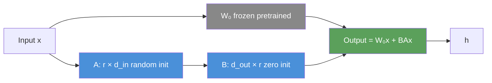
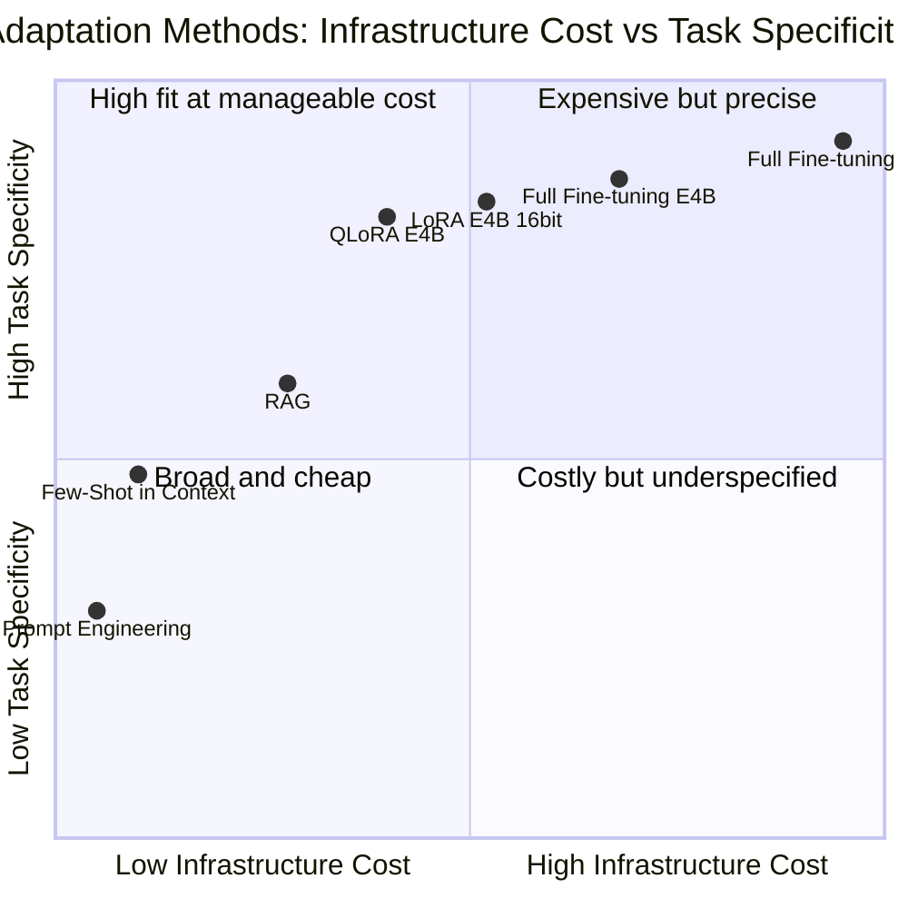
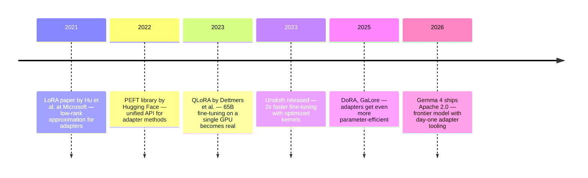

# Fine-tuning Gemma 4: When Prompting Isn't Enough

You've been there. You built a production pipeline around a foundation model. You crafted your system prompt carefully — tone, format, examples. It works about 80% of the time. But that remaining 20% is a problem: the model slips back into its default voice, ignores the output schema you specified, or confidently uses the wrong terminology for your industry. You add more examples to the prompt. The cost goes up. The 20% shrinks but doesn't disappear.

This is the ceiling of prompting — and it's real.

The question isn't "should I fine-tune?" as a philosophical stance. It's a practical judgment call: is the gap between what the model does by default and what your use case needs small enough to close with instructions, or structural enough that you need to change the weights? When the problem is behavioral — the model needs to internalize a domain, a voice, a schema — prompting has a ceiling that no amount of prompt engineering can break through.

On April 2, 2026, Google DeepMind released Gemma 4: four architecturally distinct models under a single family name, all under Apache 2.0, all multimodal, all with day-one adaptation tooling. It's the most capable open model available for fine-tuning today, and it gives us a natural way to explore what fine-tuning really means — not as an abstract process, but as a concrete set of decisions about models, hardware, data, and trade-offs.

This post is that concrete guide. We'll work through the Gemma 4 family in enough depth to make the variant choice deliberate, then go through LoRA and QLoRA with the level of detail that lets you reason about what you're actually doing — not just copy-paste the code and hope.

---

## The Gemma 4 Family: Four Models, Not Just Four Sizes

Most model families release a single architecture at multiple scales: the same transformer, just bigger. Gemma 4 isn't that. Google DeepMind released four variants that differ architecturally, not just in parameter count. Understanding these differences isn't academic — they directly determine which fine-tuning approach is viable on your hardware.

### E2B and E4B: Per-Layer Embeddings

The two smaller variants use a technique Google calls **Per-Layer Embeddings (PLE)**. In a standard transformer, each token gets a single embedding at the input and that representation is refined through successive layers. PLE injects a secondary, lighter embedding signal throughout the decoder stack, not just at the input.

The effect is that these models develop richer intermediate representations than their parameter count would suggest. The E4B (4.5 billion effective parameters) consistently scores on benchmarks closer to an 8B model than to a 4B one. On LiveCodeBench v6, the E4B scores 52% — comparable to models twice its size from one year ago.

Both variants support **128K context**, images, and audio. The audio encoder uses a USM-style conformer supporting speech recognition up to 30 seconds. The vision encoder uses learned 2D position encoding that scales with image resolution. This multimodal capability is available out of the box and can also be fine-tuned.

For most teams doing fine-tuning, **E4B is the starting point**. It's the smallest variant that's genuinely powerful enough to absorb domain adaptation without the quality floor becoming a problem. E2B is the right choice when your deployment target is genuinely resource-constrained: the E2B fits under 1.5 GB with 2-bit quantization and runs on Raspberry Pi 5 at 7.6 decode tokens/sec. That's a remarkable capability for edge deployment, but it's a different use case.

### 26B-A4B: Mixture-of-Experts

The third variant is a **Mixture-of-Experts (MoE)** model with 25.2 billion total parameters but only 3.8 billion active per forward pass. A learned router at each layer decides which of the experts (subnetworks) to activate for a given token. The remaining experts are dormant — their weights are in memory but don't contribute computations.

This creates an interesting trade-off. Memory footprint corresponds to total parameters (you need all 25.2B weights loaded), but inference compute scales with active parameters. For inference-heavy workloads, the 26B-A4B can match or exceed the 31B dense model's quality while using less GPU compute per token — once the model is loaded.

For **fine-tuning**, MoE models require care. The router mechanism is sensitive to weight distribution, and 4-bit quantization noise can perturb routing decisions unpredictably. The practical recommendation: use 16-bit LoRA (not QLoRA) for the 26B-A4B when possible. If memory forces QLoRA, start with conservative ranks (r=8) and validate that routing behavior hasn't changed by checking whether the same prompts still activate similar expert patterns before and after training.

Context window: **256K tokens**, plus image and video (up to 60 seconds at 1fps) support.

### 31B Dense: The Flagship

The 31B variant is a conventional dense transformer — every parameter participates in every forward pass. It achieves the highest quality across benchmarks: 89.2% on AIME 2026 mathematical reasoning (compared to Gemma 3's 20.8%), 80.0% on LiveCodeBench v6, 84.3% on GPQA scientific reasoning. It also supports 256K context, images, and video.

At full precision, the 31B requires ~62GB of VRAM just for weights. QLoRA reduces this to ~40GB — still requiring an RTX 4090 (24GB) multi-GPU setup or a dedicated training instance. This is the right model when you need the highest quality and have the hardware budget for it, or when you're running inference at scale and want the best output per token.

### The Complete Hardware Picture

Before choosing a variant, be honest about your hardware:

| Variant | Inference VRAM | QLoRA Training | Minimum GPU |
|---|---|---|---|
| E2B | ~3GB | ~4–5GB | GTX 1660 / RTX 3050 |
| E4B | ~8GB | ~8–10GB | RTX 3060 12GB |
| 26B-A4B | ~20GB | ~22–26GB | RTX 3090 / A100 40GB |
| 31B | ~32GB | ~38–42GB | 2× RTX 4090 / A100 80GB |

These are practical estimates for QLoRA at 4-bit precision. CPU inference is possible for E2B and E4B via GGUF (Ollama), but meaningful fine-tuning requires GPU VRAM. The VRAM numbers assume `max_seq_length=2048`; longer sequences increase KV cache requirements proportionally.

### Where to Run: Local, Cloud, or Free

The code in this post runs identically on your local machine, a rented cloud GPU, or a free notebook. There is no difference in the recipe — only in who owns the hardware. This is worth stating explicitly because many guides leave the impression that fine-tuning requires expensive cloud infrastructure. It doesn't. QLoRA on the E4B fits on a 12GB consumer GPU.

**Free options (no cost at all).**

| Platform | GPU | VRAM | Weekly Limit | Supports |
|---|---|---|---|---|
| Google Colab Free | T4 | 16 GB | ~12h sessions, variable | E2B, E4B (QLoRA) |
| Kaggle Notebooks | T4 × 2 | 16 GB each | 30h/week GPU | E2B, E4B (QLoRA) |

Unsloth provides [pre-built Colab notebooks](https://unsloth.ai/docs/models/gemma-4/train) for every Gemma 4 variant — text, vision, and audio — that work on the free tier. You can go from zero to a trained adapter without installing anything locally. For a first fine-tuning experiment, this is the lowest-friction path.

**Low-cost cloud ($0.10–$1.30/hour).**

If you need more VRAM (for the 26B-A4B or 31B), longer sessions, or faster iteration, renting a GPU by the hour is the next step:

| Provider | GPU | VRAM | $/hour | Supports |
|---|---|---|---|---|
| Colab Pro | A100 | 40 GB | ~$0.12 (via $12/mo plan) | All variants |
| RunPod (community) | A30 | 24 GB | ~$0.11 | E2B, E4B, 26B-A4B |
| RunPod (community) | A100 80GB | 80 GB | ~$0.79 | All variants |
| Vast.ai | A100 80GB | 80 GB | ~$0.70 | All variants |
| Lambda Labs | A100 80GB | 80 GB | ~$1.29 | All variants |

RunPod and Vast.ai offer the best price-to-VRAM ratio for one-off fine-tuning runs. Colab Pro at $12/month is the simplest upgrade if you're already comfortable with Colab. Lambda Labs has higher prices but excellent reliability and multi-GPU configurations for the 31B.

**Local hardware.**

If you own a discrete NVIDIA GPU with enough VRAM, you can run the entire workflow on your own machine — no internet required after downloading the model. The relevant tiers:

- **GTX 1660 / RTX 3050 (6–8 GB):** E2B QLoRA only. Tight but functional.
- **RTX 3060 12GB / RTX 4060 Ti 16GB:** E4B QLoRA with headroom. This is the sweet spot for local fine-tuning.
- **RTX 3090 / RTX 4090 (24 GB):** E4B at 16-bit LoRA, or 26B-A4B with QLoRA.
- **2× RTX 4090 or A100 80GB:** 31B QLoRA.

Local fine-tuning requires a working CUDA installation (CUDA 12.1+ recommended), Python 3.10+, and the packages listed in the recipe below. On Windows, WSL2 with Ubuntu is the most reliable path. On Linux and macOS (Apple Silicon via MPS for inference only — training requires NVIDIA GPUs), the setup is straightforward.

The practical recommendation: start with a **free Colab notebook** to validate that your data and hyperparameters work. Once the recipe is stable, move to local hardware or a rented GPU for longer runs and iteration.

---

## When Fine-tuning Is the Right Call

Fine-tuning has a reputation for being over-applied. Let's be specific about when it actually changes outcomes.

**Style and format consistency at scale.** A foundation model's default voice is the statistical average of its training data — which was the entire internet. If your product requires consistently formal medical language, or JSON output that never deviates from a specific schema, or responses that always lead with a structured summary before elaborating — system prompts can get you 80% of the way. Fine-tuning gets you to 98%.

The key word is *scale*. With 100 requests a day, you can inspect outputs and catch regressions. With 100,000 requests a day, format failures become invisible until a downstream system breaks. Fine-tuning reduces the variance, not just the mean.

**Domain vocabulary that the model doesn't have.** Public pre-training data is sparse on proprietary terminology — internal codenames, specialized legal citations, niche technical jargon, company-specific product names. When the base model encounters a term it's uncertain about, it hallucinates plausible-sounding substitutes. Fine-tuning on domain documents moves that vocabulary from "uncertain" to "known." You're not teaching the model facts; you're shifting its prior over a specific vocabulary.

**Task-specific structure adherence.** Some tasks require output formats complex enough that prompting alone doesn't reliably produce them at volume: extracting fields from messy documents into a typed schema, generating code in an internal DSL, following a multi-step reasoning format across thousands of varied inputs. When the task has a clear input-output structure and you have labeled examples, fine-tuning converges on that structure in a way that generalizes better than in-context examples.

**When fine-tuning won't help.** If the model doesn't know a fact, training on examples of that fact won't reliably teach it. LLMs learn *patterns*, not *knowledge* — or rather, knowledge is encoded implicitly through patterns. Fine-tuning on Q&A pairs does work to some degree, but it's brittle: the model may learn to produce the right answer for inputs that closely resemble training examples while hallucinating on variants it hasn't seen. For factual grounding, RAG (Retrieval Augmented Generation) is more reliable because it doesn't require encoding knowledge into weights. Fine-tuning and RAG are complementary: fine-tuning shapes behavior, RAG shapes knowledge.

---

## Why Full Fine-tuning Is a Non-starter for Most Teams

When engineers say "fine-tune the model," they sometimes mean: run gradient descent on all the parameters with your training data. This works, and for some research contexts it's the right approach. For most production teams, it's economically indefensible.

The memory arithmetic is brutal. The E4B has approximately 8 billion total parameters. At 16-bit (BF16) precision, that's 16 bytes per parameter, or ~16 GB just for the weights.

But during training, you need three additional copies of that memory:

**Gradients:** The backward pass computes a gradient for every parameter — the same size as the weights. Another ~16 GB.

**Optimizer states:** Adam maintains two momentum statistics (first and second moment) for every parameter. Another ~32 GB.

**Activations:** During the forward pass, intermediate layer outputs must be stored for use in the backward pass. For a single training example with 2048 tokens and 32 layers, this is batch_size × sequence_length × hidden_dim × num_layers × 2 bytes. At batch_size=1, sequence_length=2048, hidden_dim=3584 (E4B), 32 layers: roughly 7 GB.

Add it up: ~71 GB minimum for the E4B with full fine-tuning. That's two H100 80GB GPUs for a comfortable margin. For the 31B, you're in 4–8× A100 territory.

Cloud costs for this: running 8× A100 80GB on AWS (p4d.24xlarge) costs ~$30/hour. A fine-tuning run that takes 10 hours costs $300. If you need to iterate — adjust hyperparameters, fix data quality issues, retrain — costs multiply quickly.

This isn't a reason to give up on fine-tuning. It's a reason to use the methods that make full fine-tuning unnecessary.

---

## LoRA: The Elegant Approximation

Low-Rank Adaptation (LoRA) starts from an empirical observation about how pre-trained weights change during fine-tuning. When you run gradient descent on all parameters for a downstream task, the update matrix $\Delta W = W_{\text{fine-tuned}} - W_0$ has surprisingly low intrinsic rank. Most of the information in the update lives in a small number of dimensions.

If the update is low-rank, you don't need to store or compute the full matrix. You can approximate:

$$\Delta W \approx BA, \quad B \in \mathbb{R}^{d \times r}, \quad A \in \mathbb{R}^{r \times d}, \quad r \ll d$$

The adapted weight is then $W_{\text{adapted}} = W_0 + BA$. During training, $W_0$ is frozen, and only $B$ and $A$ are updated. At initialization, $B$ is zeroed and $A$ is random, so $BA = 0$ and the model starts from the exact pre-trained state.



The parameter count comparison makes the efficiency concrete. A single weight matrix in the E4B has dimensions approximately 3584 × 3584 = ~12.8M parameters. A LoRA adapter with rank 16 applied to that same matrix: 2 × 16 × 3584 = ~115K parameters — less than 1% of the original. For the full E4B with 32 layers and 7 adapted weight matrices per layer, the total trainable parameters are roughly 26M — about 0.3% of the full model.

### Rank: The Most Consequential Hyperparameter

Rank $r$ controls the expressiveness of the LoRA adapter. Higher rank means more trainable parameters and the ability to capture more complex adaptations. Lower rank means fewer parameters, faster training, and smaller adapters — but a tighter constraint on what the model can learn.

| Rank | Trainable Params (E4B) | What It Can Express |
|---|---|---|
| r=4 | ~13M | Style and tone shifts, simple format changes |
| r=8 | ~26M | Format adherence, vocabulary narrowing |
| r=16 | ~52M | Domain adaptation, task-specific behavior |
| r=32 | ~104M | Complex behavior changes, multi-task adaptation |
| r=64 | ~208M | Near-full fine-tuning expressiveness for small tasks |

The conventional starting point is r=16. Empirically, many tasks plateau around r=16 — going higher doesn't measurably improve quality but does increase memory and training time. The exceptions: highly specialized domains where the model needs to develop vocabulary that's genuinely absent from pre-training data (r=32–64 can help) and simple style tasks where r=4–8 is sufficient.

### Alpha: The Scaling Factor

LoRA includes a scaling term $\alpha$ that scales the adapter output: the effective contribution is $\frac{\alpha}{r} \cdot BA$. This controls the relative magnitude of the adapter updates versus the frozen base.

The common heuristic is to set `alpha = r`, which makes the scaling factor 1.0. Some practitioners use `alpha = 2r` (scaling factor 2.0) to give the adapter more influence early in training, then reduce it later. What you should avoid: very high alpha values (like alpha=128 with r=16) can destabilize training by letting early random adapter activations overwhelm the frozen weights.

In practice: start with `alpha = r`. Only tune this if convergence is slow or training is unstable.

---

## QLoRA: The Access Revolution

LoRA made fine-tuning parameter-efficient. QLoRA made it memory-efficient. The combination is what put a functional frontier model on an RTX 3060.

The core idea: during LoRA training, the frozen base weights must remain in GPU memory, but they never need to be updated — only read. If you can reduce their memory footprint without meaningfully degrading the gradient computation, you free up VRAM for the trainable adapters and activations.

QLoRA (Quantized LoRA, Dettmers et al. 2023) accomplishes this with three innovations:

**NF4 (NormalFloat 4).** Standard quantization divides the float range into equal-sized bins. NF4 divides the range into bins of equal probability under a standard normal distribution, which better matches the actual distribution of pre-trained neural network weights. The quantization error at the tails (where values are rare) is worse than in the middle of the distribution, but since pre-trained weights are typically near-zero, this error is low on average. NF4 reduces memory from 2 bytes/parameter (BF16) to 0.5 bytes/parameter — a 4× compression.

**Double quantization.** Quantization requires storing quantization constants (scale and offset) for each block of quantized weights. These constants themselves take memory. Double quantization quantizes those constants too, further reducing memory by about 0.37 bits per parameter on average — small individually, but meaningful across billions of parameters.

**Paged optimizers.** Adam's optimizer states are only needed during the backward pass, not the forward pass. paged optimizers use GPU-to-CPU memory transfer (via NVLink or PCIe) to evict optimizer states to CPU RAM when not in use and page them back when needed. This handles the occasional memory spikes during gradient accumulation that would otherwise cause OOM crashes.

The combined effect on the E4B: from ~71 GB for full fine-tuning to ~8–10 GB for QLoRA. An RTX 3060 12GB can handle it with some headroom.

**The accuracy cost.** NF4 quantization is not lossless. The accuracy difference between QLoRA and full-precision LoRA is typically 0.5–2% on downstream task benchmarks. For most production use cases, this is fully acceptable. For tasks where 1% matters — competitive benchmarks, extremely high-stakes classification — you'll want to validate empirically rather than assume.

---

## Fine-tuning Gemma 4 E4B: The Complete Recipe

### Step 0: Getting the Model

Gemma 4 is released under **Apache 2.0** with no gating on Hugging Face — no access request, no waitlist, no approval delay. You can download the weights immediately.

**What you need installed** before anything else: Python 3.10+, a CUDA-capable GPU with drivers installed, and pip. On Windows, WSL2 with Ubuntu is recommended. On Colab or Kaggle, everything is pre-installed.

**Install the toolchain:**

```bash
pip install unsloth transformers peft trl datasets bitsandbytes
```

Unsloth is the recommended toolchain for Gemma 4 fine-tuning. It provides optimized CUDA kernels for Gemma 4's architecture (including the PLE attention path), trains ~1.5× faster with ~60% less VRAM than standard Hugging Face training, and handles the quantization setup automatically.

**How the model download works.** When you call `FastLanguageModel.from_pretrained("google/gemma-4-E4B-it")` in Step 1, Hugging Face's `transformers` library downloads the model weights automatically (~8 GB for E4B) and caches them in `~/.cache/huggingface/hub/`. Subsequent runs load from cache — no re-download. On Colab or Kaggle, this takes 3–5 minutes on a good connection.

If you prefer to download the model separately (useful for offline environments, shared servers, or to verify the download before training):

```bash
pip install huggingface-hub
huggingface-cli download google/gemma-4-E4B-it
```

**Try the model before fine-tuning.** Before investing time in training data and hyperparameters, run the base model to understand its default behavior on your task. This gives you a concrete baseline to compare against after fine-tuning.

The quickest path is [Ollama](https://ollama.com/download):

```bash
ollama pull gemma4:e4b          # Downloads ~9.6 GB (4-bit quantized)
ollama run gemma4:e4b
```

This drops you into an interactive chat. Send it a few examples of your target task — you'll immediately see where the base model falls short and what fine-tuning needs to fix.

For a programmatic baseline with Hugging Face Transformers (no Unsloth required):

```python
from transformers import pipeline
import torch

pipe = pipeline(
    "text-generation",
    model="google/gemma-4-E4B-it",
    device_map="auto",
    torch_dtype=torch.bfloat16,
)

messages = [
    {"role": "user", "content": "Patient: 58M. Chest pain radiating to left arm, "
                                 "diaphoresis, onset ~2h ago. BP 142/91, HR 104."},
]
output = pipe(messages, max_new_tokens=256)
print(output[0]["generated_text"][-1]["content"])
```

Save these baseline outputs. You'll compare them against the fine-tuned model's outputs later.

### Step 1: Loading the Model

```python
from unsloth import FastLanguageModel
import torch

model, tokenizer = FastLanguageModel.from_pretrained(
    model_name="google/gemma-4-E4B-it",  # Instruction-tuned base
    max_seq_length=2048,
    load_in_16bit=True,   # Unsloth handles 4-bit internally via its optimized path
    full_finetuning=False,
)
```

The instruction-tuned variant (`-it` suffix) is almost always the right starting point for fine-tuning. It already has SFT and alignment applied. You're adapting an assistant, not training one from scratch.

### Step 2: Attaching the LoRA Adapters

```python
model = FastLanguageModel.get_peft_model(
    model,
    r=16,
    lora_alpha=16,
    lora_dropout=0,      # 0 works for most tasks; add 0.05 only if severe overfitting
    bias="none",
    target_modules=[
        "q_proj", "k_proj", "v_proj", "o_proj",   # Attention projections
        "gate_proj", "up_proj", "down_proj",        # MLP feedforward
    ],
    use_gradient_checkpointing="unsloth",  # Saves ~30% additional VRAM vs standard
    random_state=42,
    max_seq_length=2048,
)

# Sanity check: how many parameters are we actually training?
trainable, total = model.get_nb_trainable_parameters()
print(f"Trainable: {trainable:,} / {total:,} = {100*trainable/total:.2f}%")
# Expected: ~26M / ~8B = ~0.32%
```

### Step 3: Data Preparation

This is where most fine-tuning projects succeed or fail, and it receives far less attention than the model architecture.

```python
from datasets import Dataset

# Format: list of conversations in Gemma 4's expected chat format
examples = [
    {
        "messages": [
            {
                "role": "system",
                "content": "Extract structured fields from clinical notes. Return valid JSON."
            },
            {
                "role": "user",
                "content": "Patient: 58M. Presents with chest pain radiating to left arm, "
                           "diaphoresis, onset ~2h ago. BP 142/91, HR 104, RR 18, SpO2 97%."
            },
            {
                "role": "assistant",
                "content": '{"chief_complaint": "chest pain", "radiation": ["left arm"], '
                           '"associated": ["diaphoresis"], "onset_hours": 2, '
                           '"vitals": {"bp_systolic": 142, "bp_diastolic": 91, '
                           '"hr": 104, "rr": 18, "spo2": 97}}'
            }
        ]
    },
    # Hundreds more examples with the same structure
]

dataset = Dataset.from_list(examples)

def apply_template(example):
    # CRITICAL: use the same template at training and inference
    # Inconsistency here is one of the most common sources of quality regression
    return {
        "text": tokenizer.apply_chat_template(
            example["messages"],
            tokenize=False,
            add_generation_prompt=False,
        )
    }

dataset = dataset.map(apply_template, remove_columns=["messages"])
dataset = dataset.train_test_split(test_size=0.1)  # Always hold out validation data
```

**What makes good training data:**
- **Diversity**: 200 examples covering many variations of the task beats 200 examples of the same pattern
- **Consistency**: the same field names, the same JSON structure, the same formatting — every time
- **Length balance**: don't have 90% short examples and 10% long ones; the model will learn the length distribution
- **Clean labels**: a single wrong output in training can introduce a systematic error that's hard to debug

The absolute minimum for a narrow task is around 50–100 high-quality examples. Most teams benefit from 500–2,000. Beyond 10,000, quality matters more than quantity.

### Step 4: Training

```python
from trl import SFTTrainer, SFTConfig

trainer = SFTTrainer(
    model=model,
    tokenizer=tokenizer,
    train_dataset=dataset["train"],
    eval_dataset=dataset["test"],
    args=SFTConfig(
        per_device_train_batch_size=1,
        gradient_accumulation_steps=4,    # Effective batch size = 4; increase for stability
        warmup_ratio=0.03,                # Warm up for 3% of steps before full LR
        num_train_epochs=3,
        learning_rate=2e-4,               # LoRA-specific; full fine-tuning uses 1e-5
        optim="adamw_8bit",
        weight_decay=0.01,                # Light L2 regularization
        lr_scheduler_type="cosine",       # Cosine decay is more stable than linear
        bf16=torch.cuda.is_bf16_supported(),
        fp16=not torch.cuda.is_bf16_supported(),
        logging_steps=10,
        eval_steps=50,
        save_steps=100,
        output_dir="gemma4-e4b-clinical",
        dataset_text_field="text",
        max_seq_length=2048,
        load_best_model_at_end=True,      # Load the checkpoint with best eval loss
        metric_for_best_model="eval_loss",
    ),
)

trainer_stats = trainer.train()
```

**Why these hyperparameters:**
- `learning_rate=2e-4`: LoRA adapters start from zero and need a higher learning rate than full fine-tuning. The recommended range is 1e-4 to 5e-4.
- `cosine` scheduler: produces smoother convergence than linear decay and handles the "plateau before the final drop" more gracefully
- `load_best_model_at_end=True`: saves you from the common mistake of using the last checkpoint, which is often slightly overfit compared to the best eval checkpoint

### Step 5: Saving and Deploying the Adapter

```python
# Save only the LoRA adapters — typically 50–300 MB
model.save_pretrained("gemma4-clinical-adapters")
tokenizer.save_pretrained("gemma4-clinical-adapters")

# OR merge adapters into the base model (one clean artifact, no special loading)
model.save_pretrained_merged(
    "gemma4-clinical-merged",
    tokenizer,
    save_method="merged_16bit",
)

# OR export to GGUF for Ollama deployment (quantized for efficiency)
model.save_pretrained_gguf(
    "gemma4-clinical-gguf",
    tokenizer,
    quantization_method="q4_k_m",   # 4-bit mixed, good balance
)
```

**Three deployment patterns, three trade-offs:**

The adapter-only save keeps the base model and adapter separate. Loading requires the base model plus the adapter, and you can swap adapters at runtime — useful if you're serving multiple fine-tuned variants from the same base. The adapter file is small (50–300 MB) but the base model (~8 GB) must always be loaded.

The merged save produces a single model artifact with the adapters baked in. Loading is simple, inference is identical to the base model, and you don't need the adapter file at runtime. The trade-off: the merged model is the same size as the original, and once merged you can't separate the adapter back out.

The GGUF export produces a quantized binary compatible with Ollama and llama.cpp. Ideal for local deployment and teams already using Ollama from the previous post in this series. The quantization introduces a small additional quality loss on top of QLoRA's existing loss.

---

## Which Layers to Target

The `target_modules` list is not arbitrary — different weight matrices contribute differently to different types of adaptation.

**Attention projections** (`q_proj`, `k_proj`, `v_proj`, `o_proj`) control what the model attends to and how it routes information across the context. These are the most universally important modules for behavioral adaptation — they influence how the model selects and combines information for any type of output.

**MLP projections** (`gate_proj`, `up_proj`, `down_proj`) are where vocabulary encoding and factual associations live in the feedforward layers. Including them improves format adherence and domain vocabulary adaptation at the cost of slightly more memory.

**When to include all 7 modules:** general domain adaptation, format learning, vocabulary shifting — which is most tasks.

**When to drop the MLP projections:** pure style or tone adaptation where you're not changing vocabulary. Cuts memory by 30% with minimal quality loss for style tasks.

**For Gemma 4's MoE variant (26B-A4B):** the routing matrices (`router.weight`) should generally *not* be fine-tuned. The routing mechanism is learned during pre-training to be stable, and fine-tuning it can shift expert specialization in ways that are hard to predict. Stick to the standard 7 attention and MLP projections.

---

## Fine-tuning Gemma 4 for Vision

Gemma 4 E2B and E4B support images and audio. Fine-tuning these modalities follows the same LoRA pattern but with explicit control over which components of the model to adapt.

```python
from unsloth import FastVisionModel
from unsloth.trainer import UnslothVisionDataCollator

model, tokenizer = FastVisionModel.from_pretrained(
    "google/gemma-4-E4B-it",
    max_seq_length=2048,
    load_in_16bit=True,
)

model = FastVisionModel.get_peft_model(
    model,
    finetune_vision_layers=False,      # Keep vision encoder frozen initially
    finetune_language_layers=True,     # Adapt language decoder to vision features
    finetune_attention_modules=True,
    finetune_mlp_modules=True,
    r=16,
    lora_alpha=16,
    lora_dropout=0,
    bias="none",
)
```

**Why freeze the vision encoder initially.** Gemma 4's vision encoder is a pre-trained component that already understands spatial relationships, image structure, and visual features. For most fine-tuning tasks (adapting the language output for specific image types), you don't need to retrain it — you need to teach the language decoder to use its outputs differently. Fine-tuning the vision encoder as well doubles the adapter parameter count and often degrades performance by disturbing the pre-trained visual representations.

The exception: domain-specific visual inputs where the pre-trained encoder has poor coverage — medical imaging, satellite imagery, industrial inspection images where the visual vocabulary is genuinely different from the pre-training distribution. In these cases, `finetune_vision_layers=True` and a lower rank (r=8) is a reasonable approach.

**Training data for vision.** Images must come before text in the conversation structure. This is not optional — it's how Gemma 4's attention was trained:

```python
vision_examples = [
    {
        "messages": [
            {
                "role": "user",
                "content": [
                    {"type": "image", "image": pil_image},  # Image first
                    {"type": "text", "text": "Identify the defect in this circuit board."}
                ]
            },
            {
                "role": "assistant",
                "content": "The capacitor at position C14 shows visible electrolyte leakage..."
            }
        ]
    }
]
```

The `UnslothVisionDataCollator` handles batching multi-modal inputs correctly, including the `mm_token_type_ids` field that Gemma 4 requires even for text-only training batches.

---

## Evaluating Fine-tuning: What "Working" Actually Means

Training loss declining is necessary but not sufficient. A model can learn to overfit the formatting of your training data while failing to generalize to new inputs that pattern-match differently. Real evaluation requires human judgment combined with structured testing.

**Loss curves are your first signal.** A healthy training run has both training and validation loss decreasing, with validation loss slightly higher but tracking training loss closely. The moment validation loss flattens while training loss continues dropping, you're entering overfit territory. Stop training, or at minimum use `load_best_model_at_end=True` so you automatically revert to the best checkpoint.

What overfitting looks like in generated text (not just in numbers):
- Outputs that reproduce phrases from training examples verbatim
- Correct structure on examples similar to training data, wrong structure on slightly different inputs
- Reduced diversity: the model produces similar-looking outputs even for very different inputs
- Loss of general reasoning: the model can't handle natural follow-up questions because it's learned to pattern-match to specific input shapes

**Qualitative sampling is irreplaceable.** Every 50–100 training steps, run the model on a held-out set of prompts and read the outputs carefully. Look for:

```python
# Evaluation during training: spot-check a few held-out examples
eval_prompts = [
    "Patient: 67F, shortness of breath, onset 1 week, worsening at night...",
    "42M, fell from ladder, right wrist pain, limited range of motion...",
    "19F, severe headache, sensitivity to light, neck stiffness...",
]

# Run the fine-tuned model
model.eval()
for prompt in eval_prompts:
    inputs = tokenizer.apply_chat_template(
        [{"role": "user", "content": prompt}],
        return_tensors="pt",
        add_generation_prompt=True,
    ).to(model.device)

    with torch.no_grad():
        output = model.generate(inputs, max_new_tokens=256, temperature=0.1)
    print(tokenizer.decode(output[0][inputs.shape[1]:], skip_special_tokens=True))
    print("---")
```

**Before/after comparison is your baseline.** Run the same evaluation prompts on both the base `google/gemma-4-E4B-it` and your fine-tuned model. If the improvement isn't immediately visible when you read the outputs, the fine-tuning hasn't worked. You shouldn't need to squint.

**Regression testing.** Fine-tuning can narrow the model's capabilities. If your application also relies on general reasoning beyond the fine-tuned task, test that too. LoRA substantially reduces catastrophic forgetting because the base weights are frozen — but the adapter can still shift behavior in ways you didn't intend. A five-minute check on general capability benchmarks (can the model still answer general knowledge questions sensibly?) is worth the time.

---

## Testing Your Fine-Tuned Model

Training is done. You have saved artifacts from Step 5 — adapter files, a merged model, or a GGUF. Now you need to verify that the model actually works outside of training metrics. This section covers three practical paths: loading the adapter in Python, testing via Ollama, and running a structured before/after comparison.

### Loading the Adapter for Inference

If you saved adapter-only files (`model.save_pretrained("gemma4-clinical-adapters")`), load them back with Unsloth:

```python
from unsloth import FastLanguageModel

model, tokenizer = FastLanguageModel.from_pretrained(
    "gemma4-clinical-adapters",
    max_seq_length=2048,
    load_in_16bit=True,
)
FastLanguageModel.for_inference(model)

messages = [
    {"role": "user", "content": "Patient: 45F, persistent dry cough for 3 weeks, "
                                 "no fever, non-smoker. SpO2 98%, lungs clear on auscultation."}
]
inputs = tokenizer.apply_chat_template(
    messages, return_tensors="pt", add_generation_prompt=True
).to(model.device)

output = model.generate(inputs, max_new_tokens=512, use_cache=False)
print(tokenizer.decode(output[0][inputs.shape[1]:], skip_special_tokens=True))
```

`FastLanguageModel.for_inference(model)` enables Unsloth's optimized inference path and handles the `use_cache` issue described in the gotchas section below. The `use_cache=False` flag is a safety net — Gemma 4 E4B shares KV state across layers, and cached generation can produce corrupted output without Unsloth's patches.

If you saved a merged model instead, load it the same way but point to the merged directory — no adapter stitching needed:

```python
model, tokenizer = FastLanguageModel.from_pretrained(
    "gemma4-clinical-merged",
    max_seq_length=2048,
    load_in_16bit=True,
)
FastLanguageModel.for_inference(model)
```

### Testing with Ollama (GGUF Flow)

If you exported to GGUF in Step 5, you can test the fine-tuned model through Ollama — the same interface you might already use for local inference. This is the fastest way to get an interactive chat session with your adapter.

Create a `Modelfile` that points to your exported GGUF:

```dockerfile
FROM ./gemma4-clinical-gguf/unsloth.Q4_K_M.gguf
SYSTEM "Extract structured fields from clinical notes. Return valid JSON."
PARAMETER temperature 0.1
PARAMETER num_ctx 2048
```

Register and run it:

```bash
ollama create gemma4-clinical -f Modelfile
ollama run gemma4-clinical "Patient: 58M. Chest pain radiating to left arm, diaphoresis, onset ~2h ago."
```

This gives you a local, self-contained deployment of your fine-tuned model. No Python environment required, no GPU needed for inference (CPU works for E4B GGUF at ~10–15 tokens/sec), and you can share the GGUF file with teammates who just need to run `ollama create` and `ollama run`.

### Before/After Comparison

The most convincing test is a side-by-side: the same prompts, run against both the base model and your fine-tuned version. This script automates it:

```python
from unsloth import FastLanguageModel
import torch

test_prompts = [
    "Patient: 67F, shortness of breath, onset 1 week, worsening at night, bilateral ankle edema.",
    "42M, fell from ladder, right wrist pain, limited range of motion, visible deformity.",
    "19F, severe headache, sensitivity to light, neck stiffness, fever 38.9C.",
]

def generate(model, tokenizer, prompt):
    FastLanguageModel.for_inference(model)
    inputs = tokenizer.apply_chat_template(
        [{"role": "user", "content": prompt}],
        return_tensors="pt", add_generation_prompt=True,
    ).to(model.device)
    with torch.no_grad():
        out = model.generate(inputs, max_new_tokens=256, temperature=0.1, use_cache=False)
    return tokenizer.decode(out[0][inputs.shape[1]:], skip_special_tokens=True)

base_model, base_tok = FastLanguageModel.from_pretrained(
    "google/gemma-4-E4B-it", max_seq_length=2048, load_in_16bit=True,
)
ft_model, ft_tok = FastLanguageModel.from_pretrained(
    "gemma4-clinical-adapters", max_seq_length=2048, load_in_16bit=True,
)

for prompt in test_prompts:
    print(f"PROMPT: {prompt}\n")
    print(f"BASE:\n{generate(base_model, base_tok, prompt)}\n")
    print(f"FINE-TUNED:\n{generate(ft_model, ft_tok, prompt)}\n")
    print("=" * 80)
```

What to look for: the base model will likely produce free-form text with useful content but inconsistent structure. The fine-tuned model should produce output that matches your training format — in this example, structured JSON with consistent field names. If the difference isn't immediately obvious, the fine-tuning hasn't worked well enough and you should revisit your training data before adjusting hyperparameters.

---

## The Adaptation Landscape: Choosing What to Use



For most production teams, QLoRA on E4B represents the best balance: task-specific behavior, manageable infrastructure, and a 0.5–2% quality gap compared to full precision that's acceptable for most applications.

---

## From LoRA to Production: The Timeline



The LoRA paper is from 2021. QLoRA is 2023. What you're doing today — taking a model scoring 89.2% on AIME 2026 and adapting it to your domain on consumer hardware in a few hours — did not exist as a practical workflow three years ago.

The bottleneck has shifted from compute to judgment. Do you have enough quality training examples? Are you measuring the right things in evaluation? Are you being honest about when fine-tuning actually helps versus when the problem is somewhere else in the stack?

---

## Known Gotchas

These are specific to Gemma 4 and the current toolchain. They'll save you debugging time.

**`use_cache=True` produces garbage on E2B and E4B.** Gemma 4's smaller variants share KV state across layers (`num_kv_shared_layers=18` on E4B). Standard Hugging Face cache assumes independent KV per layer, so cached generation produces corrupted attention and meaningless output. Fix: use `use_cache=False` in `model.generate()`, or use `FastLanguageModel.for_inference(model)` which patches this automatically. This does not affect the 26B-A4B or 31B variants.

**Training loss of 13–15 is normal for E4B multimodal.** The multimodal architecture produces higher raw loss values than text-only models — this is a known artifact of how the loss is computed across modalities, not a training failure. If loss exceeds 100, that typically indicates a gradient accumulation configuration error (check that `gradient_accumulation_steps` divides your dataset size evenly).

**Transformers from source may be required without Unsloth.** If you use Hugging Face Transformers directly (without Unsloth), the `Gemma4ForConditionalGeneration` class and related layer types like `Gemma4ClippableLinear` require installing `transformers` from the main branch: `pip install git+https://github.com/huggingface/transformers.git`. Unsloth bundles its own patched implementations, so this only matters if you're working outside the Unsloth ecosystem.

**First run downloads ~8 GB (E4B).** The model download happens silently inside `from_pretrained()`. On Colab or Kaggle, expect 3–5 minutes. On a slow connection, this can exceed session timeouts. If you're on unreliable internet, pre-download with `huggingface-cli download google/gemma-4-E4B-it` before starting the training script.

**Colab free tier sessions disconnect.** Google Colab's free tier kills idle sessions and has variable GPU availability. For training runs longer than 1–2 hours, save checkpoints frequently (`save_steps=100` in the recipe) so you can resume. Kaggle's 30h/week limit is more predictable but still finite — plan your iterations.

---

## Honest Limitations

**Data quality is everything.** Fine-tuning amplifies the patterns in your training data, including the bad ones. Inconsistent formatting, wrong labels, and noisy examples will be learned. A dataset of 200 carefully reviewed, diverse examples will produce a better model than 5,000 examples assembled quickly. Spend more time on data than on hyperparameter tuning.

**Fine-tuning teaches patterns, not facts.** If the model hallucinates medical terminology because it doesn't know the term, fine-tuning on correct usage helps — but if it hallucinates specific factual claims (a dosage, a lab value, a procedure), fine-tuning on examples won't make it reliably correct on unseen facts. Use RAG to ground facts; use fine-tuning to shape behavior.

**Catastrophic forgetting is real, even with LoRA.** LoRA significantly reduces forgetting compared to full fine-tuning because the base weights are frozen. But the adapter still modifies behavior. A model fine-tuned on clinical note extraction may become less capable at general reasoning tasks. Always test capabilities outside your fine-tuning domain before deploying.

**The E4B is the right starting point; resist premature scaling.** The 31B is better, but the marginal quality improvement for a narrowly defined task often doesn't justify the hardware cost. Fine-tune the E4B, measure whether the task performance meets your requirements, and only move to 26B-A4B or 31B if there's a documented gap.

**Adapter serving adds operational complexity.** Saving just the LoRA adapters is elegant in theory — one base model, multiple adapters, efficient memory usage. In production, adapter switching adds latency, you need to manage which adapter goes with which request, and the base model must stay warm in memory. For most teams, the simplicity of merged model deployment outweighs the efficiency of adapter-based serving.

---

## Going Deeper

**Books:**
- Tunstall, L., von Werra, L. & Wolf, T. (2022). *Natural Language Processing with Transformers.* O'Reilly Media.
  - Chapter 9 on fine-tuning covers the full workflow. Written before QLoRA, but the conceptual foundations are the same. The transfer learning framing (chapters 1–3) is valuable context.
- Raschka, S. (2024). *Build a Large Language Model From Scratch.* Manning.
  - Builds a GPT-style model from scratch and fine-tunes it. Exceptional for understanding what the weights actually represent before you start adapting them. Chapter 7 on fine-tuning is directly applicable.
- Pereiro, P. (2024). *LLM Engineer's Handbook.* Packt Publishing.
  - Chapter 6 on fine-tuning covers production deployment considerations including multi-adapter serving and version management.

**Online Resources:**
- [PEFT Documentation](https://huggingface.co/docs/peft) — The canonical reference for LoRA, QLoRA, and related methods. The LoRA conceptual guide and the config reference are essential reading.
- [Unsloth Gemma 4 Fine-tuning Guide](https://unsloth.ai/docs/models/gemma-4/train) — Covers text-only and multimodal SFT for Gemma 4, with notes on architecture-specific quirks and memory optimization.
- [Google AI for Developers: Fine-tune Gemma with QLoRA](https://ai.google.dev/gemma/docs/core/huggingface_text_finetune_qlora) — Google's official fine-tuning guide for the Gemma family, covering text and vision tasks with both HuggingFace and Unsloth toolchains.
- [TRL Documentation](https://huggingface.co/docs/trl) — SFTTrainer, DPOTrainer, reward model training. The SFTConfig reference is useful for understanding every training argument.

**Videos:**
- [Fine-tuning LLMs with PEFT and LoRA](https://www.youtube.com/watch?v=Us5ZFp16PaU) by Hugging Face — Full PEFT workflow walkthrough with practical LoRA configuration guidance and adapter saving.
- [QLoRA: Efficient Finetuning of Quantized LLMs](https://www.youtube.com/watch?v=y9PHWGOa8HA) by Tim Dettmers — The QLoRA author explaining NF4 quantization, double quantization, and the 65B-on-one-GPU result that changed what was considered possible.

**Academic Papers:**
- Hu, E. et al. (2022). ["LoRA: Low-Rank Adaptation of Large Language Models."](https://arxiv.org/abs/2106.09685) *ICLR 2022*.
  - Read Section 4 on the rank analysis. It empirically shows that fine-tuning updates are low-rank — which is the entire theoretical justification for the method.
- Dettmers, T. et al. (2023). ["QLoRA: Efficient Finetuning of Quantized LLMs."](https://arxiv.org/abs/2305.14314) *NeurIPS 2023*.
  - The NF4 quantization design, double quantization, and paged optimizer sections are directly applicable to practitioner decisions. The ablation study on what matters most is essential.
- Liu, S. et al. (2024). ["DoRA: Weight-Decomposed Low-Rank Adaptation."](https://arxiv.org/abs/2402.09353) *ICML 2024*.
  - Decomposes weight updates into magnitude and direction. Often outperforms LoRA at the same parameter budget for generation tasks.

**Questions to Explore:**
- LoRA works because fine-tuning updates have low intrinsic rank. But this observation was made on full fine-tuning of models trained on diverse data. Does the low-rank property still hold when fine-tuning on very narrow, specialized datasets — and if not, how would you know?
- Gemma 4's PLE architecture injects embeddings throughout the decoder layers. The standard LoRA target modules assume a specific set of weight matrices. Are there Gemma 4-specific matrices (the PLE projection weights) that would benefit from LoRA adaptation but aren't currently targeted by default configs?
- When you fine-tune an instruction-tuned model (the `-it` variants), you're adapting a model that's already undergone RLHF or DPO alignment. The adapter modifies the same weights that encode alignment behavior. Is there a principled way to fine-tune for domain behavior without risking alignment regression?
- The standard approach serves one merged adapter per deployment. But organizations often have multiple use cases (clinical extraction, administrative summaries, coding assistance) all built on the same base model. What's the production architecture for serving dozens of adapters from a single base model efficiently?
- Fine-tuning data quality is universally acknowledged as the critical factor, but "quality" remains poorly defined. Is high perplexity of training examples under the base model (meaning the examples are surprising to the base model) a useful signal for which examples will contribute most to learning?
