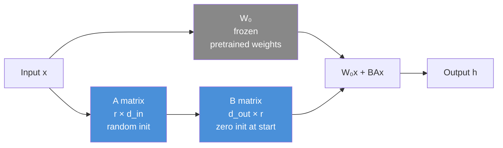
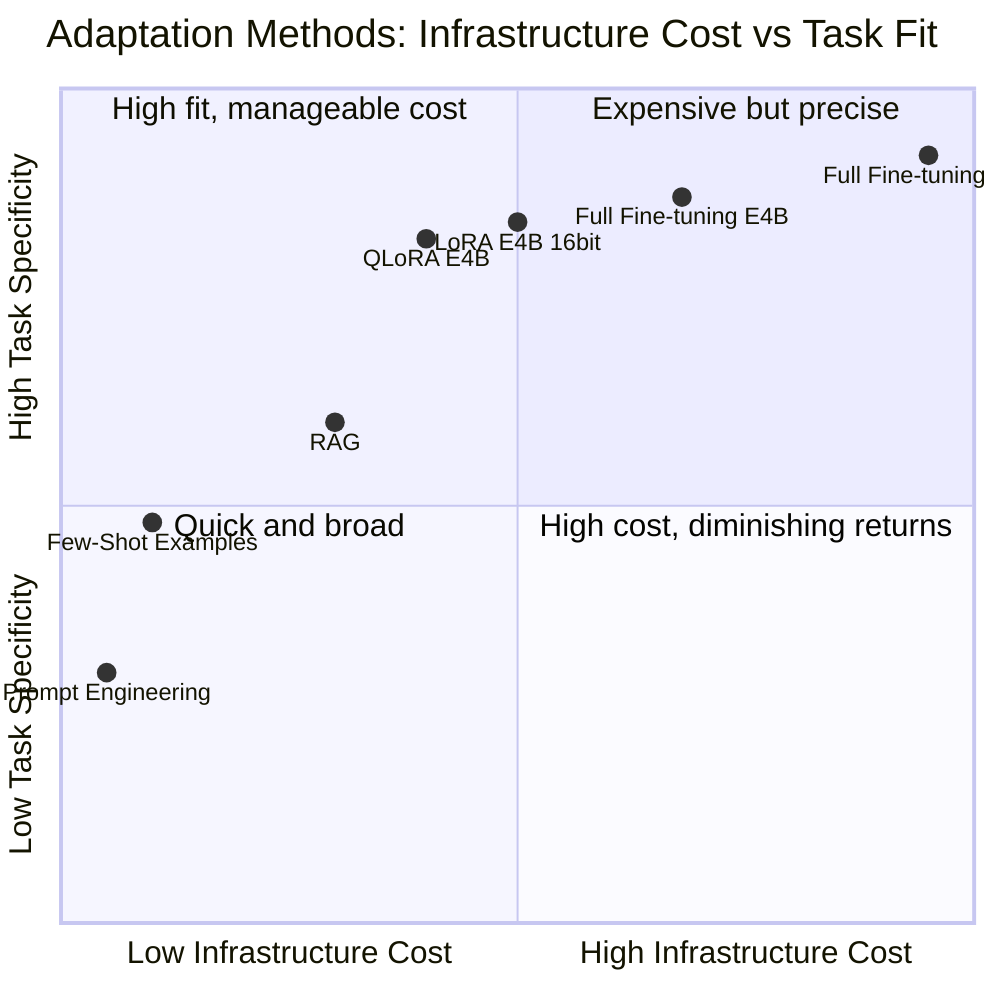
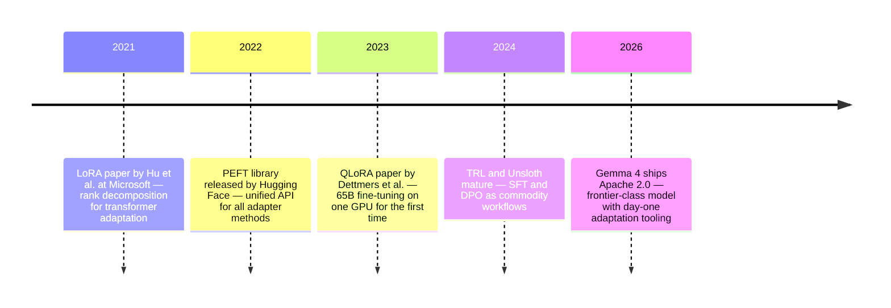

# Fine-tuning Gemma 4: When Prompting Isn't Enough

You've been there. You built a production pipeline around a foundation model. You crafted your system prompt carefully — tone, format, examples. It works about 80% of the time. But that remaining 20% is a problem: the model slips back into its default voice, ignores the output schema you specified, or confidently uses the wrong terminology for your industry. You add more examples to the prompt. The cost goes up. The 20% shrinks but doesn't disappear.

This is where fine-tuning enters the picture.

The question is rarely "should I fine-tune?" as a philosophical choice. It's a practical decision: is the gap between what the model does by default and what your use case needs small enough to close with prompting, or large enough that you need to change the weights? When the gap is structural — it's about how the model represents your domain, not just what instructions you give it — prompting has a ceiling.

On April 2, 2026, Google DeepMind released Gemma 4: four model sizes, Apache 2.0 license, multimodal by default, and day-one fine-tuning support. It's the most capable open model family available for adaptation today, and it's going to be the thread running through everything in this post. We'll use Gemma 4's E4B variant as the primary example — the size that runs comfortably on a single consumer GPU with QLoRA. If you have a bigger machine, the same code scales to the 31B.

---

## Who Gemma 4 Is

Gemma 4 is unusual in that it ships four genuinely different architectures under the same family name — not just the same model at different scales.

The two smaller variants, **E2B** and **E4B**, use a technique Google calls Per-Layer Embeddings (PLE). Instead of a single token embedding at the input, secondary embeddings are injected throughout the decoder layers, giving the model representational depth that you'd normally only find in a much larger model. The E4B has 4.5 billion effective parameters but behaves more like an 8B model on benchmarks. It handles images and audio. It fits in 8–10GB of VRAM with QLoRA.

The two larger variants are architecturally distinct. The **26B-A4B** is a Mixture-of-Experts model: 25 billion total parameters, but only 3.8 billion activate per inference step, routed by a learned gating mechanism. The **31B** is a conventional dense model. Both handle images and video up to 60 seconds.

What matters practically is the benchmark leap. Gemma 3, released a year ago, scored 20.8% on AIME 2026 mathematical reasoning. Gemma 4's 31B scores 89.2% on the same benchmark. On BigBench Extra Hard: Gemma 3 at 19.3%, Gemma 4 31B at 74.4%. This isn't incremental improvement — it reflects the reasoning and chain-of-thought training techniques developed alongside Gemini 3, distilled into an open model.

| Variant | Active Params | Context | Modalities | QLoRA VRAM |
|---|---|---|---|---|
| E2B | 2.3B | 128K | Text, image, audio | ~4GB |
| E4B | 4.5B | 128K | Text, image, audio | ~8GB |
| 26B-A4B | 3.8B active | 256K | Text, image, video | ~20GB |
| 31B | 30.7B | 256K | Text, image, video | ~40GB |

Apache 2.0 means you can fine-tune, deploy, and sell applications built on Gemma 4 without royalties, user count caps, or special licensing agreements. That makes it one of the most genuinely open frontier-class models available.

---

## Three Legitimate Reasons to Fine-tune

Fine-tuning has a reputation for being over-applied. Let's be specific about when it actually helps.

**Style and format consistency.** Foundation models are trained on the entire internet, which means their default voice is the average of all human writing. If your product needs consistently formal medical summaries, consistently casual customer support responses, or JSON output that never deviates from a specific schema — fine-tuning on examples of that exact style works better than system prompts because the model internalizes the pattern rather than following an instruction it can forget.

**Domain vocabulary and grounding.** Models learn from public data. If your domain uses technical terminology that's sparse in public corpora — specialized legal citations, proprietary product codes, internal company nomenclature — the model will either hallucinate plausible-sounding alternatives or ignore the terminology entirely. Fine-tuning on domain documents bakes the vocabulary into the weights.

**Task-specific behavior.** Some tasks require a level of structural adherence that prompt engineering can't reliably achieve at high volume: extracting specific fields from messy documents into typed schemas, generating code in an internal DSL, following a multi-step reasoning format consistently. When the task has a clear input-output structure and you have hundreds of labeled examples, fine-tuning converges on that structure where prompting drifts.

What fine-tuning is *not* a solution for: knowledge retrieval. If the model doesn't know a fact, fine-tuning on examples won't reliably teach it that fact — it teaches patterns, not facts. That's what RAG is for. The two approaches are complementary, not competing: RAG for dynamic factual grounding, fine-tuning for behavioral adaptation.

---

## Why Full Fine-tuning Is Out of Reach

When we say "fine-tune a model," we mean: adjust the weights based on gradient descent on your training data. Conceptually simple. Computationally brutal.

Gemma 4's E4B has approximately 8 billion total parameters. Each parameter stored in 16-bit floating point takes 2 bytes. The weights alone: ~16 GB. But during training you also need:

- **Gradients:** same size as the weights — another ~16 GB
- **Optimizer states:** Adam keeps two momentum terms per parameter — another ~32 GB
- **Activations:** batch size × sequence length × hidden dimension × number of layers

A reasonable estimate for full fine-tuning of the E4B: 80–100 GB of GPU memory. That's 2–3 H100s. For the 31B, you're in 8×H100 territory.

This is the compute regime of well-funded research labs, not individual practitioners or small teams. For most use cases, full fine-tuning is not the right tool — not because it's theoretically wrong, but because it's economically indefensible.

---

## LoRA: The Insight That Changed Everything

Low-Rank Adaptation (LoRA) starts from an observation about how pre-trained model weights behave when fine-tuned. When you take a large pre-trained weight matrix and fine-tune it on a downstream task, the resulting update — the change to the weights — has low intrinsic rank. Most of the gradient update lives in a small subspace.

If the update is low-rank, you don't have to store or compute the full update. You can approximate it as the product of two much smaller matrices:

$$W_{\text{adapted}} = W_0 + \Delta W = W_0 + BA$$

Where $W_0 \in \mathbb{R}^{d \times d}$ is the frozen pre-trained weight, $B \in \mathbb{R}^{d \times r}$ and $A \in \mathbb{R}^{r \times d}$ are the trainable low-rank matrices, and $r \ll d$ is the rank — typically 8 to 64, compared to dimensions of 4,096 to 16,384.

The diagram below shows what this looks like in the forward pass — the frozen path and the trainable LoRA path running in parallel:



The frozen path produces the pre-trained output. The trainable path — A then B — produces a small correction. At initialization, B is zeroed out, so the LoRA adapter starts by producing nothing, and the model begins training from exactly the pre-trained state. This is intentional: it means fine-tuning starts from a stable baseline rather than from random noise added to the weights.

The parameter count for a LoRA adapter with rank 16 applied to all 7 weight matrices in one transformer layer: roughly 2 × 16 × 4096 × 7 ≈ 900K parameters per layer. For a full E4B model with 32 layers, that's ~30 million trainable parameters — about 0.4% of the full model. Training that 0.4% takes a fraction of the memory and compute of training everything.

At inference time, you can either apply adapters on-the-fly (good for serving multiple tasks from one base model) or merge them: $W_{\text{merged}} = W_0 + BA$. The merged model is identical in size to the original and adds zero inference overhead.

---

## QLoRA: LoRA on a Diet

LoRA dramatically reduces the number of trainable parameters. But the frozen base model still needs to live in GPU memory during training. For the E4B at 16-bit precision, that's ~16 GB before the adapters even arrive.

QLoRA (Quantized LoRA) addresses this by quantizing the frozen base weights to 4-bit precision — specifically using a format called NF4 (NormalFloat 4), which is designed for weights that follow a roughly normal distribution. The quantization reduces the frozen model to ~4 GB for the E4B. LoRA adapters are trained on top in 16-bit precision, so gradient computation stays accurate. The base weights stay frozen and quantized throughout training.

The practical result: fine-tuning the E4B goes from requiring ~80 GB of VRAM to requiring ~8–10 GB. An RTX 3060 12GB can handle it. An RTX 4070 is comfortable. An RTX 4090 runs it with room to spare.

The accuracy cost of QLoRA vs full-precision LoRA is real but small — typically 0.5–2% on task-specific benchmarks. For most production use cases, this trade-off is completely acceptable.

---

## Fine-tuning Gemma 4 E4B: The Complete Recipe

The fastest path to fine-tuning Gemma 4 today is **Unsloth**, which provides optimized kernels for Gemma 4's architecture. You'll also need the Hugging Face ecosystem: `transformers`, `peft`, `trl`, `datasets`.

```bash
pip install unsloth transformers peft trl datasets bitsandbytes
```

### Loading the Model with QLoRA

```python
from unsloth import FastLanguageModel
import torch

# E4B instruction-tuned variant, loaded in 16-bit (Unsloth manages quantization internally)
model, tokenizer = FastLanguageModel.from_pretrained(
    model_name="google/gemma-4-E4B-it",
    max_seq_length=2048,
    load_in_4bit=False,    # Unsloth handles quantization via load_in_16bit
    load_in_16bit=True,
    full_finetuning=False, # LoRA mode
)
```

### Attaching the LoRA Adapters

```python
model = FastLanguageModel.get_peft_model(
    model,
    r=16,                  # Rank: 8 for minimal, 16 for general tasks, 64 for specialized domains
    lora_alpha=16,         # Scaling factor — keep equal to r for a clean 1× scale
    lora_dropout=0,        # Dropout on adapter layers (0 works well for most tasks)
    bias="none",
    target_modules=[
        "q_proj", "k_proj", "v_proj", "o_proj",  # Attention
        "gate_proj", "up_proj", "down_proj",       # MLP feedforward
    ],
    use_gradient_checkpointing="unsloth",  # Saves ~30% additional VRAM
    random_state=42,
    max_seq_length=2048,
)
```

With `r=16` and these 7 modules, you're training approximately 0.2% of the model's parameters. Everything else stays frozen.

### Preparing Your Dataset

The most common pattern is **supervised fine-tuning (SFT)**: you have input-output pairs, and you train the model to produce the output given the input. Format your data using Gemma 4's chat template:

```python
from datasets import Dataset

# Your task: converting unstructured clinical notes to structured JSON
examples = [
    {
        "messages": [
            {
                "role": "system",
                "content": "Extract structured data from clinical notes. Return valid JSON only."
            },
            {
                "role": "user",
                "content": "Patient presents with chest pain radiating to left arm, diaphoresis, onset 2 hours ago. BP 140/90, HR 102."
            },
            {
                "role": "assistant",
                "content": '{"symptoms": ["chest pain", "diaphoresis"], "radiation": "left arm", "onset_hours": 2, "vitals": {"bp": "140/90", "hr": 102}}'
            }
        ]
    },
    # ... hundreds more examples
]

dataset = Dataset.from_list(examples)

def format_with_template(example):
    # Apply Gemma 4's chat template — consistency at training time is critical
    # because the same template must be used at inference
    text = tokenizer.apply_chat_template(
        example["messages"],
        tokenize=False,
        add_generation_prompt=False,
    )
    return {"text": text}

dataset = dataset.map(format_with_template)
```

Consistency in the chat template is not optional. If you format training data differently from inference prompts, the model will produce degraded output. Apply `tokenizer.apply_chat_template()` everywhere.

### Training

```python
from trl import SFTTrainer, SFTConfig

trainer = SFTTrainer(
    model=model,
    tokenizer=tokenizer,
    train_dataset=dataset,
    args=SFTConfig(
        per_device_train_batch_size=1,
        gradient_accumulation_steps=4,   # Effective batch size = 4
        warmup_steps=10,
        num_train_epochs=3,              # Watch validation loss — stop when it rises
        learning_rate=2e-4,              # LoRA-specific LR; much higher than full fine-tuning
        optim="adamw_8bit",              # Memory-efficient optimizer
        bf16=torch.cuda.is_bf16_supported(),
        fp16=not torch.cuda.is_bf16_supported(),
        logging_steps=10,
        output_dir="gemma4-clinical-ft",
        dataset_text_field="text",
        max_seq_length=2048,
    ),
)

trainer.train()
```

A few hyperparameters that matter more than the rest:

- **Learning rate 2e-4** is LoRA-specific. Full fine-tuning uses 1e-5 to 5e-5. LoRA adapters start at zero and need a larger step size to converge.
- **Gradient accumulation** lets you simulate a larger batch size without the memory cost. Steps=4 with batch=1 behaves like a batch of 4.
- **3 epochs** is a starting point. Watch validation loss. Overfitting in LoRA often looks like training loss going down while generations start repeating phrases or losing diversity.

### Saving and Deploying

```python
# Save only the LoRA adapters (small — a few hundred MB)
model.save_pretrained("gemma4-clinical-adapters")
tokenizer.save_pretrained("gemma4-clinical-adapters")

# Or merge and save the full model (if you want one artifact to deploy)
model.save_pretrained_merged(
    "gemma4-clinical-merged",
    tokenizer,
    save_method="merged_16bit",
)

# Or export to GGUF for llama.cpp / Ollama deployment
model.save_pretrained_gguf(
    "gemma4-clinical-gguf",
    tokenizer,
    quantization_method="q4_k_m",  # 4-bit quantized, good quality/size balance
)
```

The adapter-only save is ~100–300 MB. The merged model is the same size as the original. For most deployment scenarios, the merged model is simpler — one artifact, no special loading code.

---

## Which Layers to Target

The `target_modules` choice is not arbitrary. Different weight matrices contribute differently depending on your task.

**Attention projections** (`q_proj`, `k_proj`, `v_proj`, `o_proj`) control how the model attends to context. These are the most universally effective modules to adapt — they influence behavior across all task types.

**MLP projections** (`gate_proj`, `up_proj`, `down_proj`) are where much of the factual recall and generation style lives. Including them usually gives better format and vocabulary adaptation at a modest memory cost.

The baseline recommendation — all 7 modules at `r=16` — covers the vast majority of use cases. Where to deviate:

- **Style/tone adaptation only, tight memory budget:** drop the MLP projections. Attention alone handles most behavioral changes.
- **Specialized vocabulary or domain knowledge:** include MLP projections. The feedforward layers encode more of the factual content.
- **Multimodal fine-tuning (adapting image understanding):** include vision layers explicitly. With Unsloth's `FastVisionModel`, you control this separately:

```python
# For multimodal fine-tuning of Gemma 4 E2B/E4B
model = FastVisionModel.get_peft_model(
    model,
    finetune_vision_layers=True,      # Adapt the vision encoder too
    finetune_language_layers=True,
    finetune_attention_modules=True,
    finetune_mlp_modules=True,
    r=16,
    lora_alpha=16,
)
```

For the MoE variants (26B-A4B), use 16-bit LoRA rather than QLoRA if memory allows. The routing mechanism in MoE models is sensitive to weight precision, and the 4-bit quantization noise can affect which expert gets selected.

---

## The Decision Before the Code

Fine-tuning is not always the right answer. The following positions these approaches honestly against each other:



The sweet spot for most production teams is QLoRA on E4B or a comparable model. You get task-specific behavior at a cost that's viable outside hyperscaler compute budgets.

---

## Did It Work? Evaluating Fine-tuning

Training loss going down is necessary but not sufficient. You need to evaluate whether the model actually behaves better on your task.

**Loss curves first.** Plot training and validation loss side by side. Good fine-tuning: both curves decrease, validation slightly higher than training. Overfitting: training keeps decreasing, validation flattens or rises. If this happens, reduce epochs or increase LoRA dropout slightly.

**Qualitative sampling during training.** Every N steps, run the model on a held-out set of prompts and read the outputs. This catches issues that loss won't reveal: the model producing valid-but-wrong JSON, using the right schema structure but wrong field names, or generating fluent text that misses the task entirely.

**Before/after comparison.** Use the same evaluation prompts on the base model and your fine-tuned model. If the improvement isn't obvious on the examples you care about, the fine-tuning may not have converged on the right behavior.

**Regression on general capability.** Fine-tuning can degrade general capabilities — this is catastrophic forgetting, where adapting weights for your narrow task reduces performance on unrelated tasks. If your application also relies on general reasoning, test that too. LoRA significantly reduces this risk compared to full fine-tuning because the base weights stay frozen, but it doesn't eliminate it.

A practical checklist:
- [ ] Validation loss lower than base after training
- [ ] Generated outputs match expected format/schema consistently
- [ ] Model uses correct domain terminology
- [ ] Performance on general capability benchmarks hasn't degraded significantly
- [ ] No repetition loops or degenerate outputs in 50+ sampled generations

---

## The Moment LoRA Became Routine

One more thing worth appreciating: the accessibility of this workflow is recent.



The LoRA paper is from 2021. QLoRA is 2023. What you're reading now is a workflow that didn't exist in its current form three years ago. The idea that you could take a model scoring 89.2% on AIME 2026, load it on a consumer GPU, and adapt it to your domain in a few hours — that's not how AI deployment worked for most of the field's history.

The tooling (Unsloth, PEFT, TRL) has caught up quickly. The limiting factor today is not compute, for most tasks. It's training data quality, evaluation rigor, and being honest about when fine-tuning actually helps versus when a better prompt would suffice.

---

## Honest Limitations

**Data quality dominates everything.** Fine-tuning amplifies patterns in your training data. Inconsistent formatting, wrong labels, or sloppy examples will be faithfully learned. 200 high-quality examples will outperform 10,000 noisy ones. Before spending time on hyperparameter tuning, spend time cleaning your training set.

**Fine-tuning doesn't teach knowledge.** If Gemma 4 doesn't know something factually, fine-tuning on examples won't reliably fix that. It teaches input-output patterns, not factual recall. For knowledge grounding, you still want RAG or, at minimum, providing that information in the context.

**Catastrophic forgetting is real, just less severe with LoRA.** The more specialized your fine-tuning data, the more the model may lose general capability. Test with a broader eval set, not just your task.

**The E4B is the right size for most adaptation tasks.** The 31B is technically more capable, but fine-tuning it requires serious hardware and the improvement over E4B for most narrow tasks is marginal. Start small, validate the workflow, scale up only if the gap justifies it.

**Serving fine-tuned models adds complexity.** A merged fine-tuned model is one artifact but loses the flexibility of applying different adapters to the same base. Adapter-based serving (loading adapters on-demand) is more flexible but requires more infrastructure. Think about this before you commit to a deployment architecture.

---

## Going Deeper

**Books:**
- Tunstall, L., von Werra, L. & Wolf, T. (2022). *Natural Language Processing with Transformers.* O'Reilly Media.
  - Chapter 9 on fine-tuning is the clearest practical treatment of the standard workflow. Written before QLoRA but the conceptual foundations are solid.
- Raschka, S. (2024). *Build a Large Language Model From Scratch.* Manning.
  - Builds a GPT-style model from the ground up and then fine-tunes it. Exceptional for building intuition about what the weights actually represent before you start adapting them.

**Online Resources:**
- [PEFT Documentation](https://huggingface.co/docs/peft) — The Hugging Face PEFT library docs cover LoRA, QLoRA, IA³, and other adapter methods with working code. The LoRA conceptual guide is one of the better write-ups available.
- [Unsloth Gemma 4 Fine-tuning Guide](https://unsloth.ai/docs/models/gemma-4/train) — Day-one documentation for Gemma 4 with Unsloth. Covers text-only and multimodal SFT, saving to GGUF, and common memory issues.
- [Google AI for Developers: Fine-tune Gemma with QLoRA](https://ai.google.dev/gemma/docs/core/huggingface_text_finetune_qlora) — Google's official guide, covering both text and vision fine-tuning for the Gemma family.
- [TRL Documentation](https://huggingface.co/docs/trl) — SFTTrainer, DPOTrainer, and other supervised and reinforcement learning tools. The SFTTrainer examples are directly applicable to Gemma 4.

**Videos:**
- [Fine-tuning LLMs with PEFT and LoRA](https://www.youtube.com/watch?v=Us5ZFp16PaU) by Hugging Face — Walks through the full PEFT workflow with practical examples, covering LoRA config choices and adapter saving.
- [QLoRA: Efficient Finetuning of Quantized LLMs](https://www.youtube.com/watch?v=y9PHWGOa8HA) by Tim Dettmers — The QLoRA author explaining the core ideas, including the NF4 quantization motivation and the 65B-on-one-GPU result.

**Academic Papers:**
- Hu, E. et al. (2022). ["LoRA: Low-Rank Adaptation of Large Language Models."](https://arxiv.org/abs/2106.09685) *ICLR 2022*.
  - The original paper. Section 4 on the rank analysis is particularly valuable — it empirically validates that fine-tuning updates are low-rank, which is the entire justification for the method.
- Dettmers, T. et al. (2023). ["QLoRA: Efficient Finetuning of Quantized LLMs."](https://arxiv.org/abs/2305.14314) *NeurIPS 2023*.
  - Introduces NF4 quantization, double quantization, and paged optimizers. The ablation section on which components matter most is directly useful for practitioners making hardware trade-offs.
- Liu, S. et al. (2024). ["DoRA: Weight-Decomposed Low-Rank Adaptation."](https://arxiv.org/abs/2402.09353) *ICML 2024*.
  - Decomposes weight updates into magnitude and direction components. Often outperforms LoRA with the same parameter budget, particularly on language generation tasks.

**Questions to Explore:**
- If LoRA works because fine-tuning updates are low-rank, does that imply something fundamental about the geometry of skill transfer between pre-training and downstream tasks? Is there a theoretical explanation, or is it empirical coincidence?
- Gemma 4 E4B's Per-Layer Embeddings architecture is different from standard transformer weight matrices. Does the low-rank hypothesis apply equally to PLE embeddings, or are they structured differently enough that LoRA adapts them less efficiently?
- Fine-tuning data quality dominates outcome, but what does "quality" mean precisely? Are there quantifiable signals — perplexity of the training data under the base model, diversity metrics, label consistency — that predict whether a dataset will produce a good fine-tuned model?
- The fine-tuned model and the base model are now different artifacts. How do you handle model updates? When Google releases Gemma 5, your fine-tuned Gemma 4 adapters don't transfer — you need to re-run fine-tuning. Is there a principled way to make adapter training more reusable across base model versions?
- Serving multiple LoRA adapters from a single base model is theoretically efficient. In practice, adapter switching adds latency and the engineering complexity is significant. At what scale does multi-adapter serving actually become economically superior to running separate merged models?
