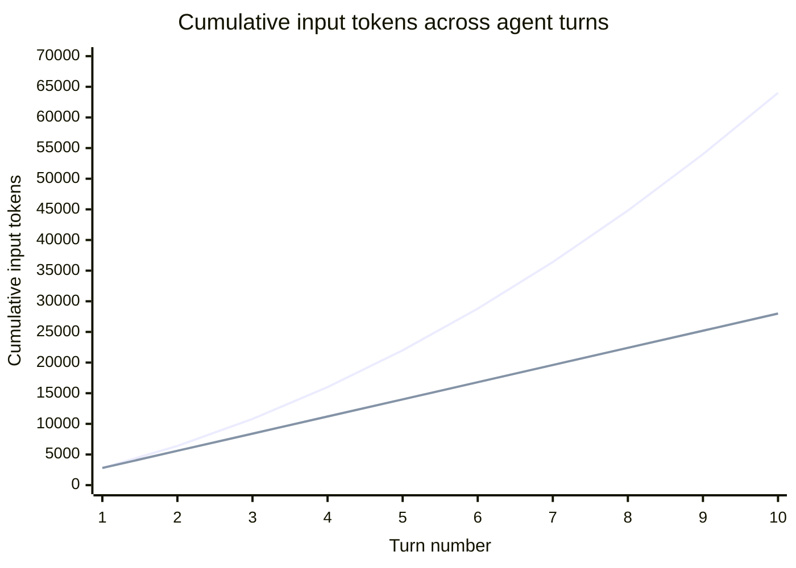
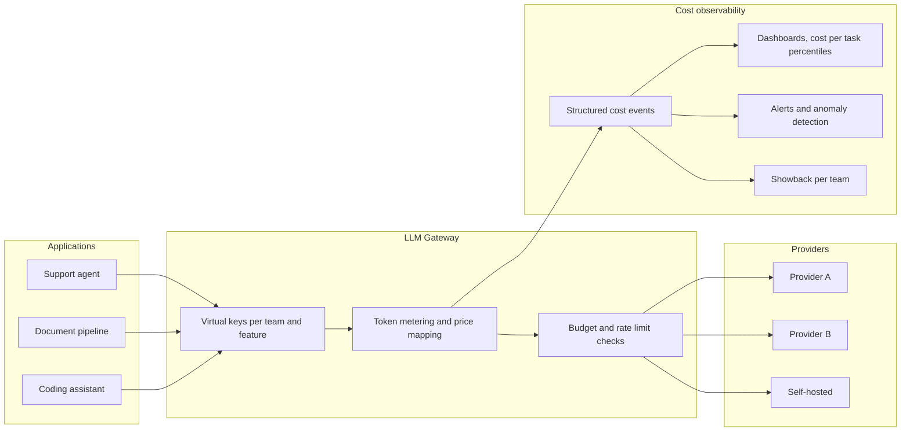
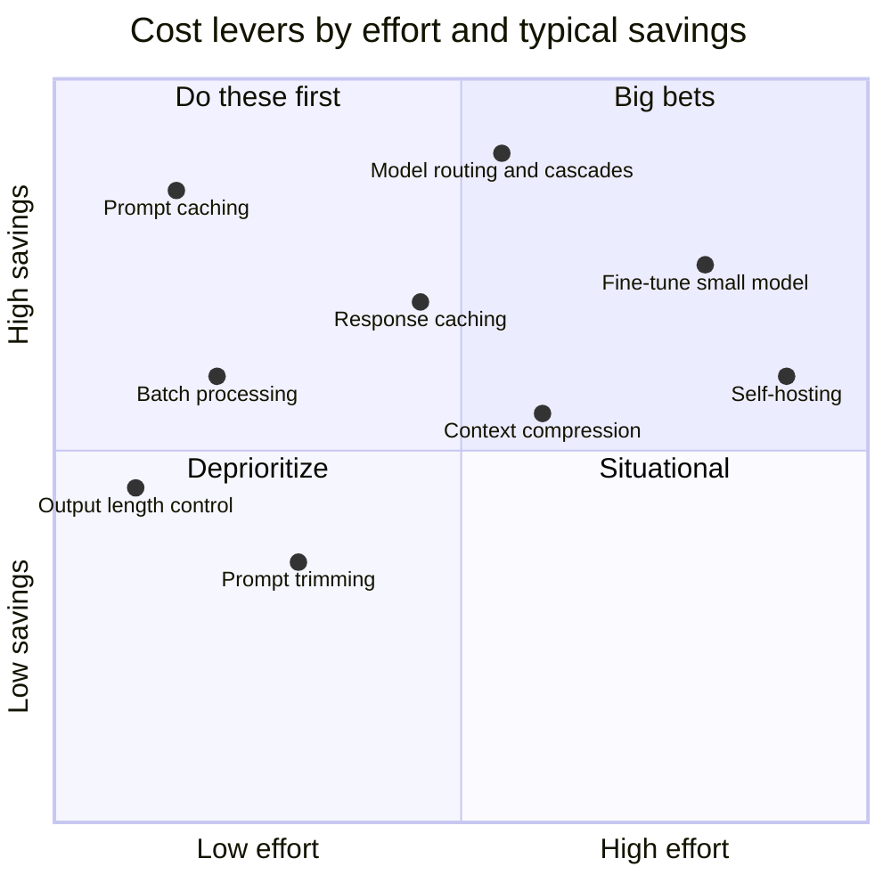
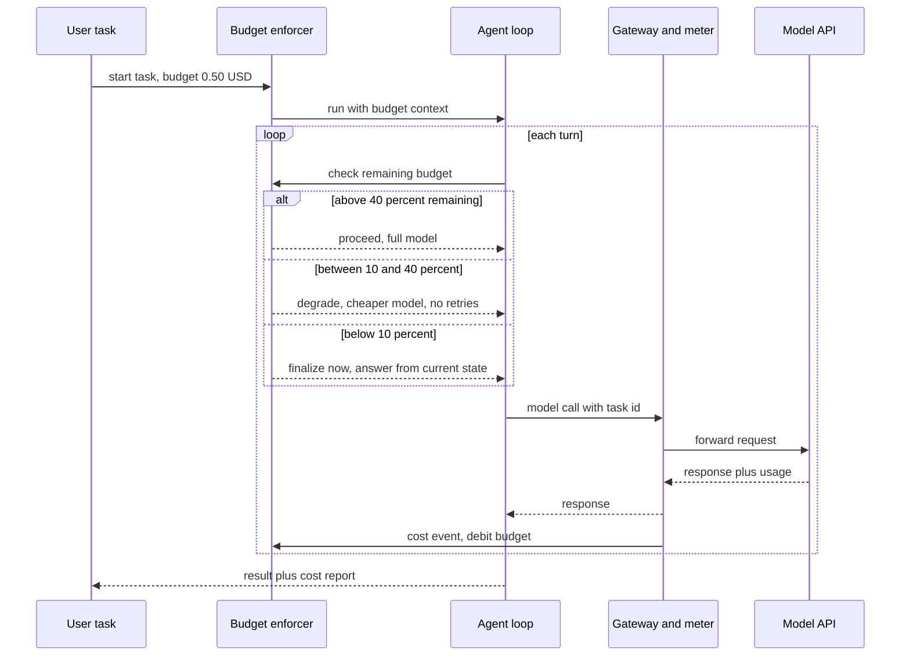

# FinOps for AI Agents: Token Economics, Cost Observability, and a Bill You Can Explain

## The Bill Nobody Could Explain

The invoice arrived on the third of the month, the way invoices do. The platform team's LLM API spend had been hovering around $22,000 per month for two quarters -- predictable enough that nobody looked at it anymore. This month it read $71,400. Traffic was flat. No new features had shipped. No marketing campaign had driven a spike. The finance partner asked a reasonable question: *what happened?* And for eleven days, nobody could answer it.

The eventual post-mortem found three compounding causes, none of which was visible in any dashboard the team owned. First, a routine model upgrade had moved the summarization service from a mid-tier model to the flagship -- a 2x price increase per token that nobody had modeled, because the pull request said "upgrade model" and reviewers checked quality, not cost. Second, a document-processing agent had grown its context: a retrieval change now stuffed 40% more tokens into every prompt, and since agents re-send accumulated context on every turn, that 40% compounded across the loop. Third -- the big one -- a tool-calling agent had developed a retry pathology. A downstream API started returning a new error format, the agent didn't recognize it as terminal, and it retried with the full conversation context. Eight times per task. For three weeks.

None of this was a security incident. Nothing was "down." Latency dashboards were green, quality evals were green, and the system burned an extra $49,000 doing exactly what it was built to do, slightly more often and slightly more expensively than anyone intended.

Here is the thesis of this post: **token spend is the new cloud bill** -- variable, usage-driven, invisible by default, and easy to ignore until it isn't. But it is worse than the cloud bill in one crucial way. Cloud costs scale with infrastructure decisions humans make deliberately: someone provisions the instance, someone sets the autoscaling policy. Agent costs scale with decisions *the software makes autonomously*, at machine speed. A runaway agent loop can burn a month's budget in an hour, and no VM ever did that on its own initiative.

The cloud world already invented the discipline for this problem. It's called FinOps -- the practice of bringing financial accountability and engineering rigor to variable spend. This post applies it to LLM and agent systems, with real numbers, real architecture, and code. The teams that win the next few years of AI products will be the ones that treat cost as an SLO, with the same observability rigor they apply to latency and quality.

## Prerequisites

This post assumes you:

- Have called an LLM API in production and seen a usage/billing page.
- Know roughly how agents work: an LLM in a loop with tools, deciding its own next step. My post on [operating agents at scale](/#/blog/operating-agents-eval-observability-scale) covers the observability side this post builds on.
- Are comfortable with back-of-envelope math. There is LaTeX ahead, but nothing beyond arithmetic and a summation.

Helpful but not required: [the four caching layers in LLM systems](/#/blog/llm-caching-four-layers), since caching is the single biggest optimization lever and I will point to it rather than re-derive it.

A note on numbers: every price in this post is **indicative**. Providers change pricing constantly. The *structure* of the math -- the asymmetries, the ratios, the breakeven logic -- is stable; the constants are not. Check current pricing pages before making decisions.

## Token Economics 101

Before you can manage a cost, you have to understand its shape. LLM API pricing has a specific structure, and most of the surprises in an LLM bill come from one of five structural features that teams didn't internalize.

### The five structural features of token pricing

**1. Input and output are priced asymmetrically.** Output tokens typically cost 3-6x input tokens. Across current major-provider price lists, flagship models cluster around $5 per million input tokens and $25-30 per million output tokens; mid-tier models around $2-3 input and $12-15 output; small models around $0.25-1 input and $1.50-6 output. The asymmetry exists because generation is sequential -- each output token requires a full forward pass -- while input tokens are processed in parallel during prefill. The practical consequence: **a verbose model is an expensive model**, and controlling output length is a real cost lever, not a style preference.

**2. Cached input is dramatically cheaper.** Prompt caching -- where the provider stores the attention state of a repeated prompt prefix -- prices cache *reads* at roughly 10% of the base input rate on most current models (some providers discount 50%, most now 90%). Cache *writes* often cost slightly more than base input (1.25x is common). If your system prompt and reference documents are 8,000 tokens and stable, caching turns them from a tax on every request into a rounding error. This is the mechanism behind the biggest single savings most teams ever realize, and I've covered its mechanics in depth [in the caching post](/#/blog/llm-caching-four-layers).

**3. Batch is half price.** Every major provider offers an asynchronous batch API at ~50% off both input and output, with turnaround measured in hours instead of seconds. Any workload that is not interactive -- nightly document processing, embedding backfills, eval runs, bulk classification -- is leaving money on the table at synchronous prices.

**4. Long context has pricing tiers.** Several providers charge elevated rates once a request crosses a context threshold (commonly 200K tokens): input may double and output rise 1.5x *for the entire request*, not just the excess. A retrieval bug that occasionally stuffs 250K tokens into a prompt doesn't just cost linearly more -- it can flip the whole request into a higher tier.

**5. Thinking tokens bill as output.** Reasoning models emit internal deliberation tokens before the answer. You usually don't see them in full, but you pay for them at the *output* rate -- the expensive rate. A reasoning model that "thinks" for 8,000 tokens to produce a 300-token answer costs you 8,300 output tokens. Reasoning-effort controls are therefore cost controls, and switching a workload to a reasoning model without measuring thinking-token volume is signing a blank check.

### The cost of a single call

The cost equation of one LLM call, in dollars:

$$
C_{\text{call}} = \frac{T_{\text{in}}^{\text{uncached}} \cdot p_{\text{in}} + T_{\text{in}}^{\text{cached}} \cdot p_{\text{cache}} + (T_{\text{out}} + T_{\text{think}}) \cdot p_{\text{out}}}{10^6}
$$

where the $p$ values are prices per million tokens. Concrete example with indicative mid-tier pricing ($3 input, $0.30 cached input, $15 output): a call with a 6,000-token cached system prefix, 2,000 tokens of fresh user context, and an 800-token answer costs

$$
C = \frac{2{,}000 \cdot 3 + 6{,}000 \cdot 0.30 + 800 \cdot 15}{10^6} = \frac{6{,}000 + 1{,}800 + 12{,}000}{10^6} \approx \$0.020
$$

Two cents. Notice where the money went: the 800 output tokens cost more than the 8,000 input tokens combined. This is the asymmetry at work, and it is why "make the model concise" appears later in the optimization levers.

### The cost of an agent task

A single call is the wrong unit for agents. An agent task is $N$ calls in a loop, and -- this is the part that surprises people -- **the conversation context is re-sent on every turn**. The model is stateless; the "conversation" is an illusion maintained by transmitting the entire history each time.

Suppose the system prompt plus tools schema is $S$ tokens, and each turn appends $m$ tokens on average (tool call, tool result, assistant reasoning). The input tokens for turn $k$ are roughly $S + k \cdot m$, so total input across an $N$-turn task is

$$
T_{\text{in}}^{\text{total}} = \sum_{k=1}^{N} (S + k \cdot m) = N \cdot S + m \cdot \frac{N(N+1)}{2}
$$

That second term is **quadratic in the number of turns**. Double the length of an agent's loop and you roughly quadruple the context-accumulation component of its cost. Prompt caching rescues the $N \cdot S$ term (the stable prefix) and, with incremental caching of conversation turns, much of the quadratic term too -- but only if your requests are structured for cache hits, and cached tokens still aren't free.

Here is the shape of that accumulation for a task with $S = 2{,}000$ and $m = 800$, comparing the real quadratic accumulation against the naive linear intuition ("each turn costs about the same"):



By turn 10, the real accumulation is 2.3x the linear estimate, and the gap widens every turn. This is why long-running agent sessions -- coding agents, research agents, anything with memory -- have cost profiles that startle teams whose intuition was trained on chatbots. And it is why the retry pathology in the opening story was so expensive: each retry re-sent the *entire accumulated context*, at the fattest point of the curve.

### Indicative pricing snapshot

For the math throughout this post, here is the landscape in rough strokes (per million tokens, standard synchronous tier; treat as illustrative):

| Tier | Input | Cached input | Output | Typical use |
|---|---|---|---|---|
| Flagship / frontier | $5-10 | $0.50-1.00 | $25-50 | Hard reasoning, final answers |
| Mid-tier workhorse | $2-3 | $0.20-0.30 | $12-15 | Most production tasks |
| Small / fast | $0.25-1 | $0.03-0.10 | $1.50-6 | Routing, extraction, classification |
| Batch (any tier) | 50% of above | -- | 50% of above | Async workloads |

The ratio that matters most: **flagship output is 100-200x small-model input**. Every routing decision that sends easy work to a small model instead of a flagship is a two-orders-of-magnitude decision.

## From Cost per Token to Cost per Task

Cost per token is a procurement number. It tells you what the meter charges, not what anything *costs you*. The unit that survives contact with a business is **cost per unit of work**: per task, per conversation, per resolved ticket, per processed document. This is standard unit-economics thinking, and LLM systems need it more than most software because their marginal cost per interaction is real money, not amortized infrastructure.

Define it explicitly:

$$
C_{\text{task}} = \frac{\text{total LLM spend attributed to the workflow}}{\text{number of completed tasks}}
$$

and then the number your CFO actually cares about, the contribution margin of the AI feature:

$$
\text{Margin}_{\text{task}} = V_{\text{task}} - C_{\text{task}} - C_{\text{infra}} - C_{\text{human review}}
$$

where $V_{\text{task}}$ is the value per task (revenue attributed, or cost of the human alternative displaced). A support agent that resolves a ticket for $0.40 of tokens when a human resolution costs $8 fully loaded has a margin story that writes itself. A research agent that costs $6 per report nobody reads does not -- and no amount of token-level optimization fixes a workflow whose unit economics are wrong.

Three practical consequences of adopting cost-per-task as the unit:

**Denominators matter as much as numerators.** You can lower cost per task by lowering spend *or* by raising completion rate. An agent that burns $0.90 and fails, forcing a retry or a human takeover, has a real cost per *resolved* task far above $0.90. Cost and quality metrics are entangled -- optimizing tokens in a way that drops resolution rate can raise true unit cost. This is the FinOps version of the point I made about eval-driven operations in [the agent operations post](/#/blog/operating-agents-eval-observability-scale): you cannot manage the ratio if you only measure one side of it.

**Distributions matter more than means.** Cost per task is heavy-tailed. In most agent systems I've measured or seen measured, the p50 task is cheap and boring while the p99 task -- the one that spiraled through fourteen tool calls -- costs 20-50x the median. Means hide the pathology; percentiles reveal it. We'll come back to this when we make cost an SLO.

**Build the dashboard before you optimize.** This is the rule that separates FinOps from vibes: *no optimization work until attribution works.* If you cannot say what each feature, agent, and customer segment costs per task, you cannot know which lever is worth pulling, and you cannot verify that pulling it worked. Teams routinely spend a sprint on prompt compression to save 12% while a mispriced model choice is silently costing 3x -- because the compression was visible in the code and the model choice was visible only in a bill nobody could decompose. Measure first. Always.

That rule is exactly where the FinOps framework begins.

## The FinOps Framework, Applied

The FinOps Foundation describes the practice as a continuous loop through three phases: **Inform** (make spend visible and attributable), **Optimize** (identify and act on efficiency opportunities), and **Operate** (govern continuously with policies, budgets, and automation). The phases are not a one-time sequence; you cycle through them as the system and its usage evolve. The framework was built for cloud infrastructure, but it maps onto LLM systems almost without modification -- the meter just counts tokens instead of instance-hours.

### Inform: attribution and metering

You cannot explain a bill you never attributed. The Inform phase for LLM systems means every single API call carries metadata answering four questions: **who** (user, team, customer), **what** (feature, agent, workflow step), **where** (environment: prod, staging, eval runs -- eval spend is real spend), and **why** (task ID, session ID, so costs roll up to units of work).

The architectural insight is that there is exactly one right place to do this: **a gateway between your applications and the model providers**. If every service calls provider APIs directly with its own key, attribution is a heroic log-joining exercise after the fact. If everything flows through a gateway, attribution is a property of the choke point. This is the same argument I made for security in [the bank-grade agent security post](/#/blog/bank-grade-agent-security-iam-gateways) -- the gateway is where identity, policy, and audit live -- and it is not a coincidence: **cost metering and security enforcement want the same choke point.** One place to authenticate, one place to authorize, one place to meter.



The good news is you rarely need to build this. The LLM gateway ecosystem has made cost tracking a first-class feature, and the pattern is consistent across tools -- pick based on your stack, not on cost features, because they all have them:

- **LiteLLM** (open-source proxy) issues *virtual keys* per team, user, or feature; computes the dollar cost of every request from a maintained price map covering 100+ providers; tracks spend per key, user, and team in its database; and supports per-key and per-tag *budgets* with time windows (e.g., "$500 per 30 days on this key, and this key can only spend $10/day on the flagship model"). Tags attached to a key propagate to every request, so feature-level attribution comes free.
- **Helicone** and **Langfuse** approach it from the observability side: proxy or SDK instrumentation that records tokens, computed cost, latency, and your custom properties per request, with session- and user-level rollups -- so cost-per-conversation is a query, not a data-engineering project.
- If you run a cloud provider's model garden, native billing export gets you provider-level costs, but *sub-application attribution still requires request-level metadata* -- the cloud bill will tell you what the model endpoint cost, never what feature spent it.

Whatever tool you choose, the acceptance test for the Inform phase is one sentence: *given last month's bill, can you produce a table of spend by feature, by model, and by customer segment, and does it sum to the invoice?* Until yes, you are not done informing, and any optimization is guesswork.

### Optimize: the levers, ranked

With attribution in place, you know where the money goes. Now the levers -- ranked by the ratio of savings to engineering effort, which is the only ranking that matters in practice.



**Lever 1: Prompt caching (low effort, huge savings).** Structure prompts so stable content -- system instructions, tool schemas, reference documents -- forms an identical prefix, and let the provider's cache turn 90% of your input bill into a discount. For agents, cache the conversation incrementally so each turn only pays full price for the new tokens. This single lever routinely cuts total spend 30-60% on prompt-heavy workloads. I won't re-derive the mechanics here; [the caching post](/#/blog/llm-caching-four-layers) covers all four layers, including this one, in depth.

**Lever 2: Output length control (trivial effort, real savings).** Output is your most expensive token. Set `max_tokens` deliberately per call site instead of inheriting a generous default; instruct models toward structured, bounded outputs (JSON schemas are cost controls); and audit for the classic waste pattern of a model that restates the question, narrates its plan, and apologizes twice before answering. Reasoning-effort settings belong here too: dialing thinking budget down on easy calls directly cuts billed output.

**Lever 3: Batch everything that can wait.** The 50% batch discount requires no cleverness -- only the honesty to admit which workloads are actually asynchronous. Evals, backfills, nightly enrichment, report generation: if a human isn't waiting on the response, synchronous pricing is a voluntary donation.

**Lever 4: Model routing and cascades (moderate effort, the biggest ceiling).** Given the 100-200x spread between small-model input and flagship output, routing is where the largest absolute savings live. Two patterns:

- *Static routing:* classify call sites by difficulty at design time. Extraction, formatting, and classification go to small models; synthesis and hard reasoning go up-tier. Most systems that have never done this exercise find 40-70% of their calls are over-modeled.
- *Cascades:* try the cheap model first, escalate on low confidence. The FrugalGPT line of work formalized this -- a cascade with a learned "is this answer good enough?" scorer matched flagship accuracy at a fraction of the cost on several benchmarks. The engineering challenge is the confidence signal: self-reported confidence is unreliable, so use task-specific verifiers (does the SQL parse and run? does the JSON validate? does a small judge model accept it?) rather than asking the model how it feels.

The routing decision I described in the query-routing context applies here with a price tag attached: every request answered by the wrong tier is either a quality bug or a cost bug.

**Lever 5: Context and retrieval discipline.** The quadratic term in the agent cost equation is driven by $m$, the per-turn context growth. Trim tool results before they enter context (return the 20 relevant rows, not the 4,000-row dump); summarize or truncate old turns past a horizon; cap retrieval depth to what measurably improves answers. Teams tune retrieval for recall and forget every retrieved chunk is re-billed on *every subsequent agent turn* -- a chunk retrieved at turn 2 of a 12-turn task is paid for eleven times.

**Lever 6: Fine-tune small, or self-host -- the capital-intensive end.** For a narrow, high-volume task, a fine-tuned small model can replace a prompted flagship at 10-30x lower marginal cost -- at the price of training pipelines, eval harnesses, and ongoing maintenance. This is a build-vs-buy decision with the same structure I walked through for [Redis and managed infrastructure on GCP](/#/blog/redis-for-ai-buy-vs-build-gcp): the marginal-cost savings are real, and so is the engineering payroll that produces them.

Self-hosting deserves its own math, because the breakeven is misunderstood. A rough model: a GPU (or GPU node) costs $H$ per hour and sustains a throughput of $r$ output-equivalent tokens per second at realistic batch sizes, but you only achieve utilization $u \in (0,1]$. Your effective cost per million tokens is

$$
C_{\text{self}} = \frac{H}{3600 \cdot r \cdot u} \cdot 10^6
$$

Illustrative numbers: an $H = \$4$/hour GPU node serving an open-weights model at $r = 2{,}500$ tokens/sec gives $\$0.44/M$ at 100% utilization -- spectacular against any API price. At $u = 0.10$, which is closer to what bursty, business-hours workloads actually achieve without aggressive multiplexing, it's $\$4.40/M$ *plus* the engineers who keep vLLM patched, capacity planned, and failover working. **Utilization is the entire game.** Self-hosting wins for high, steady, latency-tolerant volume and loses for spiky workloads that leave the GPU idle -- the per-token APIs are, in effect, selling you utilization pooling. If you want to explore the serving stack itself, I've written about [the local inference tooling landscape](/#/blog/local-llm-inference-tools); the FinOps point is just that the breakeven is a utilization equation, not a price-list comparison.

### Operate: budgets, guardrails, kill switches

Inform makes spend visible; Optimize makes it efficient; Operate keeps it that way *continuously and automatically*. This is the phase most teams skip, and it is the phase that would have saved the team in the opening story, because Operate is about catching drift and pathology in hours instead of billing cycles.

The operating controls, in escalating order of force:

**Budgets and alerts.** Every virtual key gets a budget with a time window; every team sees its burn rate. Alert at 60% and 90% of budget *pace* (spending 60% of the monthly budget on day 6 is the alert that matters, not hitting 100% on day 28). Gateway-level budgets make this configuration, not code.

**Rate limits as cost guardrails.** Requests-per-minute and tokens-per-minute limits per key are usually framed as protecting the provider quota; they are equally your first defense against runaway loops. A single agent task has no legitimate reason to issue 400 calls per minute. Set TPM limits per feature scaled to honest need, not to the maximum the provider allows.

**Per-task spend limits and kill switches.** Budgets per month catch drift; budgets *per task* catch pathology. A task that has spent 5x its expected cost is almost never five times more valuable -- it is looping. Enforce a hard per-task ceiling in the agent runtime (code for this in the next section) and wire a kill switch: a feature flag that pauses an agent fleet in seconds, because when the pathological loop is discovered at 2 a.m., "redeploy with a fix" is not an acceptable response latency. This is the same containment logic as the [security guardrails for enterprise agents](/#/blog/enterprise-agents-governance-security-business) -- an agent that can spend without limit is an availability risk to your budget exactly as an agent that can act without limit is a risk to your data.

**Showback, then chargeback.** Once attribution works, publish each team's spend internally (showback). Behavior changes remarkably fast when the platform team stops absorbing everyone's tokens into a shared line item. Mature organizations graduate to chargeback -- spend hits the owning team's actual budget -- at which point cost discussions move from the platform team's escalations to each team's own planning, which is where they belong.

**Cost regression testing in CI.** The most underused control, and my favorite. A prompt change that doubles token consumption is a performance regression exactly like a change that doubles latency -- so test for it. Run a representative task suite in CI, meter tokens per task, and fail the build if cost-per-task rises beyond a threshold against the baseline. This converts cost from something discovered on invoices into something discovered in code review, where the "upgrade model" PR from the opening story would have shown its 2x price tag before merging:

```python
# ci/test_cost_regression.py
import json
import pathlib

import pytest

from myapp.agents import SupportAgent
from myapp.metering import CostMeter

BASELINE = json.loads(pathlib.Path("ci/cost_baseline.json").read_text())
TOLERANCE = 1.15  # fail CI if mean cost per task rises more than 15%

GOLDEN_TASKS = json.loads(pathlib.Path("ci/golden_tasks.json").read_text())


@pytest.mark.costguard
def test_cost_per_task_has_not_regressed():
    meter = CostMeter(price_table="config/prices.yaml")
    agent = SupportAgent(meter=meter)

    for task in GOLDEN_TASKS:
        agent.run(task["input"], task_id=task["id"])

    mean_cost = meter.total_cost_usd / len(GOLDEN_TASKS)
    baseline = BASELINE["mean_cost_per_task_usd"]

    assert mean_cost <= baseline * TOLERANCE, (
        f"Cost regression: ${mean_cost:.4f}/task vs baseline "
        f"${baseline:.4f}/task (+{(mean_cost / baseline - 1):.0%}). "
        "If intentional, update ci/cost_baseline.json in this PR "
        "so the change is reviewed as a cost decision."
    )
```

The error message is the point: it forces the cost change into the diff, where a human approves it deliberately.

## Agent-Specific FinOps: The Hard Case

Everything so far applies to any LLM system. Agents make it harder in four specific ways, and they are worth naming because each one defeats a control that works fine for simple request-response systems:

1. **Autonomous call multiplication.** A chatbot makes one call per user message; an agent makes as many as it decides to. Per-request cost controls don't bound a system that chooses its own request count.
2. **Tool loops.** Retry-on-failure plus a misclassified error equals an unbounded loop -- the opening story's $49,000 pattern. The loop is *locally rational* every iteration; only the aggregate is pathological.
3. **Sub-agent trees.** Orchestrators that spawn sub-agents multiply cost multiplicatively: a coordinator that fans out to five specialists, each running its own multi-turn loop, turns one user request into fifty model calls. Cost attribution must propagate a *task ID through the whole tree*, or the bill decomposes into mush.
4. **Context growth over long sessions.** The quadratic accumulation, compounded by memory systems that keep enriching the prompt. Long-lived agents have a cost curve, not a cost point.

The design answer is to make the agent **budget-aware**: the task budget is an input to the loop, spend is metered at every call, and the agent *degrades gracefully* as it approaches the ceiling -- cheaper model, fewer retries, tighter outputs -- rather than failing at a hard wall or, worse, never noticing. Degradation matters because a task that has consumed 80% of its budget while nearly done should finish cheaply, not die and forfeit the spend already sunk.



Here is that pattern as production-quality middleware. It meters every call, attributes spend to a task ID, enforces a per-task budget with degradation tiers, and emits structured cost events your observability stack can aggregate:

```python
"""Budget-aware cost metering middleware for agent loops.

Wraps every model call with: token metering, price mapping,
task-level attribution, budget enforcement with graceful
degradation, and structured cost-event emission.
"""

from __future__ import annotations

import json
import logging
import time
import uuid
from dataclasses import dataclass, field
from enum import Enum

logger = logging.getLogger("cost_events")


# --- Pricing ---------------------------------------------------------------

@dataclass(frozen=True)
class ModelPrice:
    """USD per million tokens. Load from config, never hardcode in call sites."""
    input_per_m: float
    cached_input_per_m: float
    output_per_m: float


# Indicative prices -- keep in versioned config and update on provider changes.
PRICE_TABLE: dict[str, ModelPrice] = {
    "flagship-model":  ModelPrice(5.00, 0.50, 25.00),
    "workhorse-model": ModelPrice(3.00, 0.30, 15.00),
    "small-model":     ModelPrice(1.00, 0.10, 5.00),
}


@dataclass(frozen=True)
class Usage:
    """Token usage for one call, as reported by the provider."""
    input_tokens: int
    cached_input_tokens: int
    output_tokens: int  # includes thinking tokens: they bill as output

    def cost_usd(self, price: ModelPrice) -> float:
        return (
            self.input_tokens * price.input_per_m
            + self.cached_input_tokens * price.cached_input_per_m
            + self.output_tokens * price.output_per_m
        ) / 1_000_000


# --- Budget policy ----------------------------------------------------------

class BudgetTier(Enum):
    NORMAL = "normal"        # full model, normal retries
    DEGRADED = "degraded"    # cheaper model, no retries, tight max_tokens
    FINALIZE = "finalize"    # one last call to wrap up from current state
    EXHAUSTED = "exhausted"  # hard stop


class BudgetExceededError(RuntimeError):
    """Raised when a call is attempted after the task budget is spent."""


@dataclass
class TaskBudget:
    task_id: str
    limit_usd: float
    spent_usd: float = 0.0

    @property
    def remaining_fraction(self) -> float:
        if self.limit_usd <= 0:
            return 0.0
        return max(0.0, 1.0 - self.spent_usd / self.limit_usd)

    def tier(self) -> BudgetTier:
        r = self.remaining_fraction
        if r <= 0.0:
            return BudgetTier.EXHAUSTED
        if r < 0.10:
            return BudgetTier.FINALIZE
        if r < 0.40:
            return BudgetTier.DEGRADED
        return BudgetTier.NORMAL


# --- Metering middleware ----------------------------------------------------

@dataclass
class CostMeter:
    """Wraps an LLM client; meters, attributes, enforces, and emits."""
    client: object                      # your provider or gateway client
    attribution: dict[str, str]         # team, feature, environment, user
    budgets: dict[str, TaskBudget] = field(default_factory=dict)

    # Degradation policy: which model each tier is allowed to use.
    tier_model: dict[BudgetTier, str] = field(default_factory=lambda: {
        BudgetTier.NORMAL: "workhorse-model",
        BudgetTier.DEGRADED: "small-model",
        BudgetTier.FINALIZE: "small-model",
    })
    tier_max_tokens: dict[BudgetTier, int] = field(default_factory=lambda: {
        BudgetTier.NORMAL: 2048,
        BudgetTier.DEGRADED: 1024,
        BudgetTier.FINALIZE: 512,
    })

    def open_task(self, limit_usd: float, task_id: str | None = None) -> str:
        task_id = task_id or uuid.uuid4().hex
        self.budgets[task_id] = TaskBudget(task_id=task_id, limit_usd=limit_usd)
        return task_id

    def call(self, task_id: str, messages: list[dict], **kwargs) -> object:
        budget = self.budgets[task_id]
        tier = budget.tier()

        if tier is BudgetTier.EXHAUSTED:
            self._emit(task_id, event="budget_exhausted", tier=tier)
            raise BudgetExceededError(
                f"Task {task_id} spent ${budget.spent_usd:.4f} "
                f"of ${budget.limit_usd:.2f} budget."
            )

        # Graceful degradation: the budget tier picks model and output cap.
        model = self.tier_model[tier]
        max_tokens = min(
            kwargs.pop("max_tokens", self.tier_max_tokens[tier]),
            self.tier_max_tokens[tier],
        )

        started = time.monotonic()
        response = self.client.create(
            model=model, messages=messages, max_tokens=max_tokens, **kwargs,
        )
        latency_ms = (time.monotonic() - started) * 1000

        usage = Usage(
            input_tokens=response.usage.input_tokens,
            cached_input_tokens=getattr(response.usage, "cached_tokens", 0),
            output_tokens=response.usage.output_tokens,
        )
        cost = usage.cost_usd(PRICE_TABLE[model])
        budget.spent_usd += cost

        self._emit(
            task_id,
            event="llm_call",
            tier=tier,
            model=model,
            cost_usd=round(cost, 6),
            spent_usd=round(budget.spent_usd, 6),
            input_tokens=usage.input_tokens,
            cached_input_tokens=usage.cached_input_tokens,
            output_tokens=usage.output_tokens,
            latency_ms=round(latency_ms, 1),
        )
        return response

    def _emit(self, task_id: str, **fields) -> None:
        """Structured cost event: one JSON line per call, aggregate downstream."""
        logger.info(json.dumps({
            "task_id": task_id,
            "ts": time.time(),
            **self.attribution,
            **{k: (v.value if isinstance(v, Enum) else v)
               for k, v in fields.items()},
        }))


# --- Usage in an agent loop -------------------------------------------------

def run_agent_task(meter: CostMeter, user_request: str) -> str:
    task_id = meter.open_task(limit_usd=0.50)
    messages = [{"role": "user", "content": user_request}]

    for _turn in range(MAX_TURNS := 15):          # turns cap AND dollar cap
        try:
            response = meter.call(task_id, messages)
        except BudgetExceededError:
            return "Task stopped at budget limit; partial results saved."

        if is_final_answer(response):
            return extract_answer(response)
        messages = append_tool_exchange(messages, response)

    return "Task stopped at turn limit."
```

Design notes worth making explicit:

- **The budget tier chooses the model.** Degradation is enforced *by the middleware*, not requested politely of the agent. An agent prompt that says "be mindful of cost" is a wish; a middleware that swaps in the small model at 40% remaining is a control.
- **Both a dollar cap and a turn cap.** They fail differently: the turn cap catches infinite loops with cheap calls; the dollar cap catches short loops with expensive calls (huge contexts, flagship models). You want both.
- **Sub-agents inherit the parent's `task_id` and debit the same `TaskBudget`.** Otherwise a fan-out orchestrator gives each child a fresh wallet, and the tree's cost is unbounded even though every node is individually bounded.
- **Every event is a JSON line with full attribution.** Cost-per-task percentiles, per-feature rollups, and anomaly alerts are all downstream aggregations of this one event stream. This is the "structured events, not printf" discipline from the observability post, applied to dollars.
- **`FINALIZE` is a feature, not a failure.** An agent told "wrap up now from what you have" usually delivers a usable partial answer for half a cent. An agent killed mid-loop delivers nothing for the full sunk cost.

## Cost as an SLO

Here is where the pieces assemble into an operating philosophy. You already treat latency as an SLO: you track p50/p95/p99, you alert on distribution shift, and an engineer who ships a change that doubles p99 latency expects to hear about it within the hour. Cost deserves *exactly the same treatment*, because it has the same statistical character: per-request variability, heavy tails, and sensitivity to code changes that look innocent in review.

Concretely:

- **Define cost-per-task percentiles as service objectives.** For example: *p50 cost per resolved ticket under $0.08; p95 under $0.60; p99 under $1.50*. The percentile structure matters because agent cost is heavy-tailed -- your p99 is where retry pathologies, context explosions, and routing failures live. A mean-based budget alert fires weeks after a p99 alert would have.
- **Alert on distribution shift, not just totals.** The opening-story retry loop moved p99 cost per task by 8x while the *daily total* crept up slowly enough to stay under naive threshold alerts for weeks. Compare today's cost-per-task distribution against a trailing baseline (even a simple percentile-ratio check catches most pathologies); alert when the shape changes.
- **Put cost on the service dashboard, next to latency.** Not in a finance tool the team opens quarterly -- on the same Grafana board as p95 latency and error rate, per feature, per model, per environment. What the team sees daily, the team manages; what lives in a billing console, nobody manages.

And the cultural point, which matters more than any of the mechanics: **engineers should see the cost of their feature the way they see its latency.** Not because engineers should become accountants, but because cost is now a runtime property of code -- a function of prompt design, model choice, retry policy, and context management, all of which are engineering decisions made in pull requests. The FinOps principle that "everyone takes ownership of their usage" translates here into something very concrete: the person who wrote the retry loop is the only person who could have known it might spiral, and the only person who can fix it well. Give them the meter.

## Gotchas That Will Bite You

A short field guide of failure modes I have seen or narrowly avoided, in rough order of expense:

- **Retries that re-send full context.** The single most expensive bug class in agent systems. Cap retries, use exponential backoff, and classify errors as terminal vs. retryable *explicitly* -- an unknown error is terminal until proven otherwise.
- **Eval and CI spend hiding in the prod bill.** A nightly eval suite over a large golden set can quietly outspend the feature it evaluates. Attribute environments separately, and run evals on the batch API at half price.
- **Thinking tokens on reasoning models.** Billed as output, mostly invisible in casual inspection. Meter them explicitly before and after switching a workload to a reasoning model.
- **Cache-hostile prompt changes.** Injecting a timestamp, request ID, or user name near the *top* of the prompt invalidates the cached prefix on every request. A one-line diff can silently multiply input cost by 10x. Cache hit rate belongs on the dashboard for exactly this reason.
- **The long-context tier flip.** One oversized retrieval result pushes a request over the provider's context threshold and reprices the *entire request* at the elevated tier. Guardrail the context size before the call, not after the invoice.
- **Free-tier extrapolation.** Pilots run on small models, discounts, and low volume. The production bill is not a linear scale-up of the pilot bill; model it from the cost equation, not from the pilot invoice.

## The Startup and the Bank, Again

In the recent security series I kept returning to two characters: the startup that moves fast with agents because it must, and the bank that moves carefully because it must. On security, their situations genuinely differ -- different threat models, different regulators, different blast radii.

On cost, they converge, because both of them get a bill.

The startup dies from burn. Its agent product has negative contribution margin per task and nobody derived the number until the runway conversation; the growth that should have been good news made the hole deeper every week. The bank dies differently -- not from the spend itself, which it can absorb, but from *unexplainable* spend in front of a CFO. A seven-figure AI line item that cannot be decomposed by product, team, and outcome is a governance failure in an institution whose entire business is decomposing money, and it gets the program frozen faster than any model error ever would. The [governance machinery](/#/blog/enterprise-agents-governance-security-business) that approves an agent for production should demand its unit economics alongside its security review.

Same discipline saves both: attribute everything, know your cost per task, put the meter where the engineers can see it, and bound what autonomous systems can spend before they spend it. FinOps is not the finance team's rain dance. It is engineering rigor applied to the one production metric that arrives as an invoice -- and the bill you can explain is the program that survives.

## Going Deeper

**Books:**

- Storment, J.R. & Fuller, M. (2023). *Cloud FinOps: Collaborative, Real-Time Cloud Value Decision Making* (2nd ed.). O'Reilly Media.
  - The canonical text from the FinOps Foundation's founders. The Inform/Optimize/Operate lifecycle, allocation, showback/chargeback, and unit economics chapters transfer to LLM spend almost verbatim.
- Huyen, C. (2025). *AI Engineering: Building Applications with Foundation Models.* O'Reilly Media.
  - The chapters on inference optimization, model routing, and evaluation give the engineering foundations under most of the Optimize levers in this post.
- Beyer, B., Jones, C., Petoff, J., & Murphy, N.R. (2016). *Site Reliability Engineering: How Google Runs Production Systems.* O'Reilly Media.
  - The SLO chapters are the intellectual template for "cost as an SLO" -- error budgets and burn-rate alerting map directly onto spend budgets and cost-pace alerting.
- Kleppmann, M. (2017). *Designing Data-Intensive Applications.* O'Reilly Media.
  - The event-stream and aggregation patterns behind a cost-event pipeline -- structured events, rollups, late-arriving data -- are all here.

**Online Resources:**

- [FinOps Framework -- Phases](https://www.finops.org/framework/phases/) — The FinOps Foundation's definition of Inform, Optimize, and Operate; the source framing this post applies to LLM systems.
- [FinOps for AI Overview](https://www.finops.org/wg/finops-for-ai-overview/) — The Foundation's working-group material on AI-specific cost management, including token-based pricing and forecasting challenges.
- [LiteLLM Spend Tracking documentation](https://docs.litellm.ai/docs/proxy/cost_tracking) — Concrete reference implementation of gateway-level metering: virtual keys, per-key/team/tag budgets, and automatic cost computation across providers.
- [Anthropic API Pricing](https://platform.claude.com/docs/en/about-claude/pricing) — Worth reading in full once, not just the headline numbers: cache write/read tiers, batch discounts, and long-context pricing all live here.
- [Understanding the FinOps Lifecycle](https://www.finout.io/blog/understanding-the-finops-lifecycle-inform-optimize-operate) — A practitioner walkthrough of the three phases with cloud examples that translate cleanly to token spend.

**Videos:**

- [The Challenge of AI Costs: Bringing FinOps Discipline to LLMs and Beyond](https://www.youtube.com/watch?v=Sb8XYDRwBYg) — Why traditional cloud cost management fails for AI workloads and what changes when the billing unit is a token.
- [LLM Cost Optimization in 2025: FinOps Strategies to Reduce AI Spending](https://www.youtube.com/watch?v=gea1nvRcMhc) — A practical tour of the main levers: model selection, prompt caching, and batching.
- [FinOps, AI, and the Cost of Cloud Chaos with J.R. Storment](https://www.youtube.com/watch?v=8bIdO5Uq4ms) — The FinOps Foundation's executive director on how AI spend is reshaping the discipline.

**Academic Papers:**

- Chen, L., Zaharia, M., & Zou, J. (2023). ["FrugalGPT: How to Use Large Language Models While Reducing Cost and Improving Performance."](https://arxiv.org/abs/2305.05176) *arXiv preprint.*
  - The foundational paper on LLM cascades: cheap-model-first with a learned answer-quality scorer, matching flagship accuracy at a fraction of the cost. The formal grounding for Lever 4.
- Ong, I., Almahairi, A., Wu, V., Chiang, W.-L., Wu, T., Gonzalez, J.E., Kadous, M.W., & Stoica, I. (2024). ["RouteLLM: Learning to Route LLMs with Preference Data."](https://arxiv.org/abs/2406.18665) *arXiv preprint.*
  - Learned routing between strong and weak models from preference data, with open-source routers -- the research counterpart to production model routing.
- Pope, R., Douglas, S., Chowdhery, A., et al. (2022). ["Efficiently Scaling Transformer Inference."](https://arxiv.org/abs/2211.05102) *arXiv preprint.*
  - Why inference costs what it costs: the batching, parallelism, and memory-bandwidth tradeoffs that determine the throughput term in the self-hosting breakeven equation.

**Questions to Explore:**

- If agents can degrade gracefully under budget pressure, should budget become a first-class parameter of *every* AI API -- "answer this within $0.10" -- the way deadlines are first-class in RPC systems?
- Chargeback changes behavior, but does per-team cost accountability discourage the exploratory usage that finds the next valuable AI feature? Where is the line between discipline and chilling effect?
- Cost-per-task percentiles assume tasks are comparable units. How should unit economics handle agents whose task difficulty distribution shifts as users learn to delegate harder work to them?
- Self-hosting breakeven is dominated by utilization -- does this inevitably recreate the mainframe-era pattern of internal compute markets, with teams bidding for GPU time on shared clusters?
- If a model provider's price cut instantly changes your product's margin, how much pricing risk is your architecture carrying -- and is multi-provider routing an economic hedge as much as a technical one?
