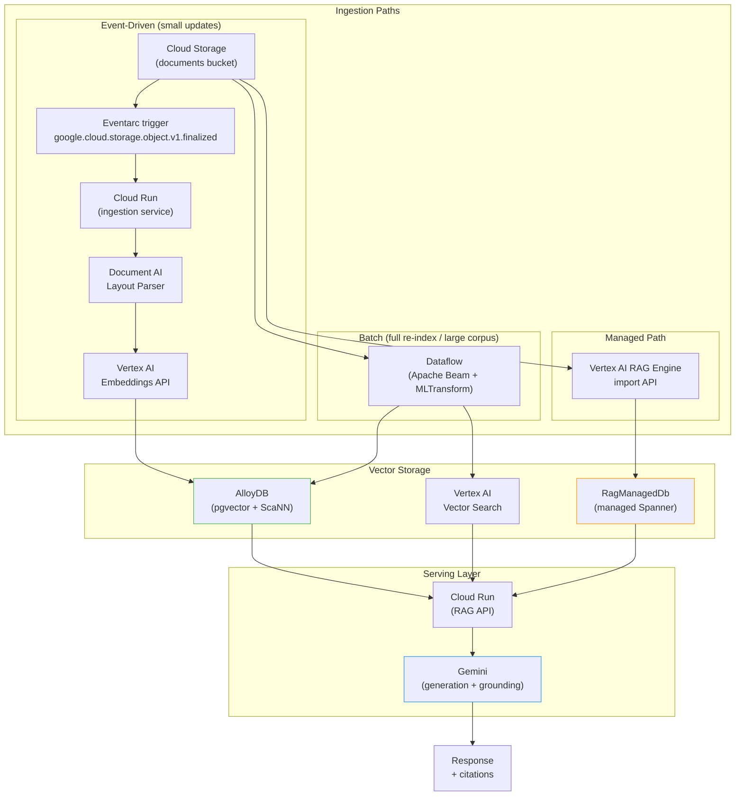

# GCP AI Stack: Vertex AI, AlloyDB, and the Cloud-Native Knowledge Pipeline

## Before the Architecture: An Honest Caveat

Google Cloud's AI marketing is relentless. Every service is "enterprise-ready," every index "production-grade," every integration "seamless." The documentation reads like a press release. So let us start with a counterweight: as of early 2026, the GCP AI stack for knowledge retrieval is genuinely capable and in many places genuinely mature—but it contains a Spanner instance you did not ask for and cannot directly observe, regional availability restrictions that contradict the documentation's confident tone, and at least one service tier that costs more per month than most developers' entire cloud bills before they write a single embedding.

None of this disqualifies GCP for RAG systems. But if you are reading this post to decide whether and how to build on Google's AI stack, you deserve the real picture before you commit.

This post covers the full GCP AI stack for knowledge retrieval: Vertex AI RAG Engine, AlloyDB with pgvector and ScaNN, Document AI for document parsing, Vertex AI Pipelines and Eventarc for orchestration, Cloud Run for serving, Dataflow for large-scale ingestion, and the gcloud CLI commands that tie it together. Every section includes both capabilities and genuine limitations.

---

## Part 1: Vertex AI RAG Engine

### What It Is and Whether It Is Actually GA

The Vertex AI RAG Engine is a managed service that handles the mechanics of retrieval-augmented generation: corpus management, document ingestion from multiple sources, text parsing, chunking, embedding generation, vector indexing, semantic retrieval, and grounding into a generation call. The goal is to let teams build RAG applications without manually orchestrating each layer.

The service went GA—but with a caveat that is buried in the documentation. As of early 2026, RAG Engine is GA in `europe-west3` (Frankfurt) and `europe-west4` (Eemshaven). The three most commonly used US regions—`us-central1`, `us-east1`, and `us-east4`—require allowlist approval. To access them, you contact `vertex-ai-rag-engine-support@google.com`. All other regions, including most of Asia-Pacific and additional European regions, remain in Preview.

This matters. If your application requires data residency in the US, or if your existing GCP infrastructure is in `us-central1`, you may find the "GA" label misleading. You are either on an allowlist or you are in Preview.

### What the RAG Engine Actually Includes

The service pipeline covers four stages:

**Ingestion sources**: Local files, Cloud Storage buckets, Google Drive, Slack channels, Jira projects and queries, SharePoint folders and drives. The breadth is real and the integrations are reasonably well maintained.

**Parsing options**: A default parser (rule-based, no cost), an LLM parser (billed at LLM rates from your project), and a Document AI layout parser (billed at Document AI rates). The Document AI integration is the most capable for complex PDFs with tables and figures, but adds a per-page cost discussed in Part 3.

**Chunking**: Fixed-size chunking at no additional charge. Chunk size and overlap are configurable via `chunk_size` and `chunk_overlap` token parameters. There is no hierarchical or semantic chunking built in—if you need those strategies, you are back to orchestrating them yourself.

**Embedding models**: At the time of writing, embedding model selection is configured per corpus. The native options through Vertex AI include:
- `gemini-embedding-001`: 3072-dimensional output by default (truncatable to 768 or 1536), GA, priced at $0.15 per million tokens ($0.075 batch)
- `text-embedding-005`: 768-dimensional, GA, priced at $0.000025 per 1,000 characters (online), $0.00002 (batch)
- `gemini-embedding-2` (Preview): improved multilingual quality, $0.20 per million tokens

Both `gemini-embedding-001` and `text-embedding-005` support Matryoshka Representation Learning (MRL), meaning you can truncate output dimensions from their defaults without significant quality loss. This matters for storage cost in AlloyDB and Vector Search. All models support over 100 languages and a 2048-token input limit.

**Vector storage backends**: The default is `RagManagedDb`, which provisions a Google-managed Spanner instance. Other supported backends are Vertex AI Vector Search, Vertex AI Feature Store, Weaviate, and Pinecone. There is one immutable constraint: **you cannot change the vector database backend after corpus creation.** Choose wrong on the first deploy and you are rebuilding from scratch.

**Retrieval**: Top-K retrieval with configurable `vector_distance_threshold` and `vector_similarity_threshold`. Hybrid search is available via `hybrid_search.alpha` (0.0 = sparse only, 1.0 = dense only, default 0.5).

**Grounding**: The engine plugs into Gemini generation via `tools.retrieval.vertex_rag_store` in the content generation request.

### The Spanner Hidden Cost

This deserves its own section because it is the biggest gotcha in the entire Vertex AI RAG Engine.

When you use `RagManagedDb` (the default), the service provisions a Google-managed Spanner instance in a Google-tenant project. You pay for that Spanner instance via standard Spanner SKUs. There are two tiers:

**Basic tier**: 100 processing units (0.1 nodes). At Spanner's regional rate of roughly $0.90 per processing unit-hour, this works out to approximately $65/month. The documentation describes it as "cost-effective" and recommends it for "experimentation, small datasets, and latency-insensitive workloads." This is reasonable for prototyping.

**Scaled tier**: Autoscaling from 1 node (1,000 PUs) to 10 nodes (10,000 PUs). A single node at $0.90 × 1,000 × 730 hours = approximately $657/month at baseline, scaling to $6,570/month at the ceiling. This is the tier for production workloads.

The third option is the **Unprovisioned tier**, which deletes the Spanner instance and all data permanently. There is no pause; it is deletion.

Several aspects of this billing model create real friction:

1. The costs do not appear as a distinct "RAG Engine" line item in billing. Developers report difficulty identifying where Spanner charges originate in billing reports.
2. There is no way to monitor the Spanner instance's CPU, I/O, or storage utilization—it is in a Google-tenant project, not yours.
3. If you upload file types the parser cannot handle (CSV files have caused this in the wild), the system may loop on ingestion attempts, generating embedding and Spanner I/O charges without successful indexing.
4. Developers in the Google Developer forums have reported discovering hundreds of dollars in unexpected Spanner charges during proof-of-concept testing.

The bottom line: if you are evaluating cost for a small RAG prototype, the Basic tier ($65/month) is acceptable. If you are considering the Scaled tier for production, you are making a database infrastructure choice with significant ongoing cost implications, with essentially no observability into the underlying resource.

### Retrieval Latency: The 30-Second Problem

Developers in Google's community forums have reported RAG Engine retrieval taking 25-35 seconds via the Vertex AI TypeScript SDK on standard queries. The same queries run in 1-2 seconds in AI Studio. Google's community response suggests the issue may involve how the SDK constructs requests, and recommends streaming, context caching, and concise prompt strategies as mitigations.

The root cause has not been publicly confirmed as a platform defect. But the gap—30 seconds versus 1 second for identical workloads—is large enough that any latency-sensitive application should validate SDK performance end-to-end before committing to this stack.

### What the API Looks Like

The RAG Engine API surface uses REST endpoints against:
```
https://LOCATION-aiplatform.googleapis.com/v1beta1/projects/PROJECT_ID/locations/LOCATION/ragCorpora
```

Note the `v1beta1` path. Some features remain on the beta API even in GA regions.

**Corpus management**:
```bash
# Create a corpus with default (managed Spanner) backend
curl -X POST \
  -H "Authorization: Bearer $(gcloud auth print-access-token)" \
  -H "Content-Type: application/json" \
  "https://${LOCATION}-aiplatform.googleapis.com/v1beta1/projects/${PROJECT_ID}/locations/${LOCATION}/ragCorpora" \
  -d '{
    "display_name": "my-knowledge-corpus",
    "description": "Production knowledge base for customer support"
  }'

# Create a corpus backed by Vertex AI Vector Search
curl -X POST \
  -H "Authorization: Bearer $(gcloud auth print-access-token)" \
  -H "Content-Type: application/json" \
  "https://${LOCATION}-aiplatform.googleapis.com/v1beta1/projects/${PROJECT_ID}/locations/${LOCATION}/ragCorpora" \
  -d '{
    "display_name": "vs-backed-corpus",
    "rag_vector_db_config": {
      "vertex_vector_search": {
        "index": "projects/PROJECT_ID/locations/LOCATION/indexes/INDEX_ID",
        "index_endpoint": "projects/PROJECT_ID/locations/LOCATION/indexEndpoints/ENDPOINT_ID"
      }
    }
  }'
```

**Import files from Cloud Storage**:
```bash
curl -X POST \
  -H "Authorization: Bearer $(gcloud auth print-access-token)" \
  -H "Content-Type: application/json" \
  "https://${LOCATION}-aiplatform.googleapis.com/v1beta1/projects/${PROJECT_ID}/locations/${LOCATION}/ragCorpora/${CORPUS_ID}/ragFiles:import" \
  -d '{
    "import_rag_files_config": {
      "gcs_source": {
        "uris": ["gs://my-bucket/documents/"]
      },
      "rag_file_chunking_config": {
        "fixed_length_chunking": {
          "chunk_size": 512,
          "chunk_overlap": 50
        }
      }
    }
  }'
```

**Retrieve contexts**:
```bash
curl -X POST \
  -H "Authorization: Bearer $(gcloud auth print-access-token)" \
  -H "Content-Type: application/json" \
  "https://${LOCATION}-aiplatform.googleapis.com/v1beta1/projects/${PROJECT_ID}/locations/${LOCATION}:retrieveContexts" \
  -d '{
    "vertex_rag_store": {
      "rag_corpora": ["projects/PROJECT_ID/locations/LOCATION/ragCorpora/CORPUS_ID"],
      "rag_retrieval_config": {
        "top_k": 10,
        "vector_distance_threshold": 0.5
      }
    },
    "query": {
      "text": "What is the refund policy for enterprise customers?"
    }
  }'
```

There is no native `gcloud` CLI subcommand for RAG corpus management—everything goes through the REST API or the Python SDK (`google-cloud-aiplatform`).

### The Grounding API

Grounding in Vertex AI is a broader concept than the RAG Engine. Google offers eight grounding modes:

- **Google Search**: Ground responses in public web results. Limited to 1 million queries per day at the platform level. Each Gemini prompt may generate multiple search queries, so billing accumulates per search call rather than per user prompt.
- **Vertex AI Search**: Ground in a document datastore managed in Vertex AI Agent Builder. The most opaque option—close to a black box over your documents.
- **Vertex AI RAG Engine**: The managed retrieval service described above.
- **Elasticsearch**: Native integration with an existing Elasticsearch index.
- **Custom Search API**: Plug any search endpoint into Gemini grounding.
- **Web Grounding for Enterprise**: A compliance-controlled web index for regulated industries.
- **Google Maps**: Geospatial grounding.
- **Parallel Web Search**: Parallel queries against an LLM-optimized web index.

The Google Search grounding mode is particularly worth understanding: grounding requests are billed separately from generation tokens. A single conversation turn may trigger multiple search queries depending on the model's reasoning, and each query is billed. For high-volume applications, this cost stacks quickly.

Fine-tuned Gemini models cannot use Vertex AI RAG Engine. If your production deployment relies on a fine-tuned model, you need a different retrieval integration path.

### When NOT to Use Vertex AI RAG Engine

The honest answer is that RAG Engine occupies a narrow "sweet spot" that is genuinely useful but has clear boundaries on both sides.

**Do not use it if**:
- You need sub-second retrieval latency—the managed Spanner backend is not optimized for this
- You have sophisticated chunking requirements (hierarchical, semantic, layout-aware)—the built-in options are basic
- Your embedding or reranking pipeline needs custom logic—the managed flow is difficult to extend mid-pipeline
- You need full observability into your vector store—the managed Spanner is a black box
- You are operating in a region outside the short GA list
- You need to query the same vectors from multiple applications—the corpus is tied to the RAG Engine service boundary
- Your data changes frequently—there is no efficient incremental update path without reimporting files

**It is appropriate when**:
- You need to prototype quickly with a small-to-medium corpus (under a few million chunks)
- Your retrieval latency requirements are loose (seconds, not milliseconds)
- You want Google-managed reliability for the vector store without operating AlloyDB or Vector Search yourself
- Your team lacks the expertise to wire together the individual services

---

## Part 2: AlloyDB and Vector Search

### What AlloyDB Is (and Is Not)

AlloyDB is Google Cloud's fully managed PostgreSQL-compatible database, designed for high-performance OLTP workloads. It is architecturally different from Cloud SQL for PostgreSQL: it separates compute from storage, uses a columnar memory engine for analytical acceleration, and now ships Google's own `alloydb_scann` extension for approximate nearest-neighbor vector search.

AlloyDB is **not** a dedicated vector database. It is a relational database with strong vector capabilities. This distinction matters for architecture choices.

### AlloyDB Omni vs. AlloyDB on GCP

**AlloyDB** is the fully managed GCP service—Google operates the hardware, maintenance, backups, HA, and scaling.

**AlloyDB Omni** is a downloadable edition of the same database engine. You can run it on Linux on-premises, on your laptop, on any cloud, or on a Kubernetes cluster. It is powered by the same core engine and supports the same extensions including `alloydb_scann`, `google_ml_integration`, and pgvector. AlloyDB Omni is available in several versioned distributions for containers (currently through 15.12.0) and Kubernetes (currently through 17.5.0).

The practical difference: AlloyDB Omni gives you the same engine without GCP lock-in, at the cost of managing it yourself. For teams that need the vector capabilities but have regulatory requirements preventing GCP data residency, or who are on a different cloud, Omni is a meaningful option.

### pgvector in AlloyDB

AlloyDB ships a customized fork of pgvector pre-installed. The vector data type and distance operators are compatible with standard pgvector, so existing LangChain, LlamaIndex, and SQLAlchemy integrations work with minimal modification.

The key pgvector dimension limitation applies here: due to PostgreSQL's 8KB index page size constraint, vectors with more than 2048 dimensions cannot be indexed with HNSW (the dimension × 4 bytes + overhead overflows the index row size). This affects `gemini-embedding-001` at its full 3072-dimensional output. The practical solutions are:

1. Use MRL to truncate embeddings to 768 or 1536 dimensions before storing
2. Use ScaNN instead of HNSW—ScaNN handles higher dimensions more efficiently
3. Store embeddings in `vector(3072)` columns but avoid creating HNSW indexes on them (falling back to sequential scan)

AlloyDB supports four index types for vector columns:
- **HNSW** (via the pgvector extension): Graph-based ANN, works well for small datasets
- **IVFFlat** (via pgvector): Partition-based, faster to build than HNSW but lower recall
- **ScaNN** (via `alloydb_scann`): Google's tree-quantization ANN algorithm
- Sequential scan (no index): Exact KNN, accurate but O(n) cost

### ScaNN: The Technical Details

ScaNN (Scalable Nearest Neighbors) is a tree-quantization-based ANN algorithm from Google Research, described in the ICML 2020 paper "Accelerating Large-Scale Inference with Anisotropic Vector Quantization." Google extended the algorithm with SOAR (Structured Order for ANN Research), presented at NeurIPS 2023, which introduced redundancy in the index structure to improve recall under update-heavy workloads.

The `alloydb_scann` extension was released in October 2024 and is the default recommended index for AlloyDB AI workloads.

**Benchmark comparisons (AlloyDB whitepaper, BigANN 10M dataset)**:

| Metric | pgvector HNSW | ScaNN (AlloyDB) |
|--------|--------------|-----------------|
| Query latency (fits in memory) | Similar | 4x better |
| Query latency (doesn't fit in memory) | >4 seconds | ~431ms (10x better) |
| Memory footprint | Baseline | 3-4x smaller |
| Index build time | Baseline | 8x faster |
| Write throughput | Baseline | 10x higher |
| Recall@10 (no maintenance, 20x growth) | ~82.7% | ~94.3% (with maintenance) |

The memory advantage is structural: HNSW is a graph where every node must be traversable, requiring the entire graph in memory for good performance. ScaNN partitions vectors into clusters and uses quantization to compress them, so queries scan cluster centroids first and only expand to full vectors for the most promising clusters.

**Critical filtering support difference**: Inline filtering (WHERE clause predicates applied during vector search, not after) is only supported when using the ScaNN index. With HNSW or IVFFlat, PostgreSQL applies filters post-retrieval, which can dramatically reduce recall when filters eliminate most results. For filtered RAG workloads—where you commonly filter by document source, date range, or metadata—ScaNN is functionally superior, not just faster.

**Index creation**:
```sql
-- Enable extensions first
CREATE EXTENSION IF NOT EXISTS vector;
CREATE EXTENSION IF NOT EXISTS alloydb_scann;

-- Add a vector column
ALTER TABLE documents ADD COLUMN embedding vector(768);

-- Create a ScaNN index (requires >10K rows for meaningful benefit)
-- First, set maintenance memory (required before index creation)
SET maintenance_work_mem = '10 GB';

CREATE INDEX ON documents
USING scann (embedding cosine)
WITH (num_leaves = 500);  -- tune based on dataset size

-- For two-level index (up to ~10M vectors)
CREATE INDEX ON documents
USING scann (embedding cosine)
WITH (
  num_leaves = 500,
  quantizer = 'sq8'  -- scalar quantization, good balance
);

-- For three-level index (>100M vectors)
CREATE INDEX ON documents
USING scann (embedding cosine)
WITH (
  num_leaves = 1000,
  num_leaves_to_search = 10,
  max_num_levels = 3
);
```

**Auto-maintenance**: Without maintenance, a ScaNN index degrades as data grows. Partition imbalance causes some partitions to grow far larger than others, and centroid drift causes cluster centers to no longer accurately represent their vectors. The documented thresholds: without auto-maintenance, the index is considered "outdated" when row count exceeds 2x the count at index creation. With auto-maintenance enabled, the threshold is 3x.

Real benchmark data from Google's engineering blog: after 20x data growth, an unmaintained index showed 82.7% Recall@10 versus 94.29% with auto-maintenance active—a gap large enough to matter in production retrieval quality.

Enable auto-maintenance:
```sql
ALTER INDEX my_scann_index SET (auto_maintenance = on);
```

Manual maintenance when needed:
```sql
SELECT scann_index_maintenance('my_scann_index');
```

### The google_ml_integration Extension

The `google_ml_integration` extension (version 1.4.2 or later required) creates a bridge from SQL queries to Vertex AI model endpoints. This is what makes AlloyDB "AlloyDB AI" rather than just "AlloyDB with pgvector."

The extension enables:
- **Embedding generation inline with SQL**: `google_ml.embedding('gemini-embedding-001', text_column)`
- **LLM text generation inline with SQL**: Calls to Gemini models from within queries
- **External model endpoints**: OpenAI, Anthropic, and any Vertex AI-registered endpoint
- **Semantic ranking**: Score query-document relevance directly in SQL

The IAM setup required:
```bash
# Grant AlloyDB service agent access to Vertex AI
gcloud projects add-iam-policy-binding PROJECT_ID \
  --member="serviceAccount:service-PROJECT_NUMBER@gcp-sa-alloydb.iam.gserviceaccount.com" \
  --role="roles/aiplatform.user"
```

Verify the extension version:
```sql
SELECT extversion FROM pg_extension WHERE extname = 'google_ml_integration';
-- Need 1.4.2 or later
```

Generate embeddings inline:
```sql
-- Update table with embeddings from Vertex AI
UPDATE documents
SET embedding = google_ml.embedding(
  'gemini-embedding-001',
  content
)::vector
WHERE embedding IS NULL;

-- Query with inline embedding generation
SELECT
  id,
  title,
  1 - (embedding <=> google_ml.embedding('gemini-embedding-001', $1)::vector) AS similarity
FROM documents
ORDER BY similarity DESC
LIMIT 10;
```

The `$1` parameter is your query text. In production, you typically pre-compute the query embedding and pass it as a parameter to avoid generating it in the database on every request:

```sql
-- Pass a pre-computed embedding as parameter
SELECT id, title, content
FROM documents
ORDER BY embedding <=> $1::vector
LIMIT 10;
```

### Creating an AlloyDB Cluster with gcloud

```bash
# Set variables
export PROJECT_ID="my-project"
export REGION="us-central1"
export CLUSTER_ID="my-alloydb-cluster"
export INSTANCE_ID="my-primary-instance"
export PGPASSWORD="$(openssl rand -base64 24)"

# Create the cluster (PostgreSQL 16 is current default)
gcloud alloydb clusters create $CLUSTER_ID \
  --database-version=POSTGRES_16 \
  --password=$PGPASSWORD \
  --region=$REGION \
  --project=$PROJECT_ID \
  --network=default

# Create the primary instance
gcloud alloydb instances create $INSTANCE_ID \
  --instance-type=PRIMARY \
  --cpu-count=8 \
  --region=$REGION \
  --cluster=$CLUSTER_ID \
  --project=$PROJECT_ID

# For production with CMEK encryption
gcloud alloydb clusters create $CLUSTER_ID \
  --database-version=POSTGRES_16 \
  --password=$PGPASSWORD \
  --region=$REGION \
  --project=$PROJECT_ID \
  --kms-key=KEY_ID \
  --kms-keyring=KEYRING_ID \
  --kms-location=global \
  --kms-project=$PROJECT_ID

# Get the primary instance IP for connection
gcloud alloydb instances describe $INSTANCE_ID \
  --cluster=$CLUSTER_ID \
  --region=$REGION \
  --format="value(ipAddress)"
```

Available CPU counts: 2, 4, 8, 16, 32, 64, 96, 128. High availability doubles compute cost. Machine types can be specified (`n2-highmem-4`, `c4-highmem-4-lssd`, etc.) for specific performance characteristics.

### AlloyDB Pricing: The Real Numbers

AlloyDB is significantly more expensive than Cloud SQL, and understanding exactly why is important for architectural decisions.

**Compute (us-east1, on-demand)**:
- Per vCPU: $54.51/month ($0.0747/hour)
- Per GB memory: $9.24/month ($0.0127/hour)
- Approximately $0.0666/vCPU-hour in us-central1

A common production configuration—8 vCPU primary + read pools + HA:

| Component | vCPUs | RAM | Monthly |
|-----------|-------|-----|---------|
| Primary (HA, 8 vCPU, 64GB) | 8 | 64GB | $436 compute × 2 for HA = ~$872 |
| Read pool (2× 4 vCPU, 32GB) | 4 each | 32GB each | ~$436 total |
| Storage (500GB) | — | — | ~$170 |
| **Total** | | | **~$1,478/month** |

This is before backup storage, networking egress, or transaction log retention beyond 7 days. With a 1-year committed use discount (25% off), that drops to approximately $1,110/month.

For comparison:
- Cloud SQL Enterprise Plus (8 vCPU equivalent HA): approximately $1,060/month
- Cloud SQL Enterprise (8 vCPU equivalent HA): approximately $810/month

The AlloyDB premium buys you: the columnar engine for analytical queries, the `alloydb_scann` extension, the `google_ml_integration` extension, and architectural separation of compute and storage that enables faster scaling. For pure OLTP without vector workloads, the premium is hard to justify. For combined transactional + vector workloads, it is the most cost-effective single-database solution on GCP.

**Storage costs**:
- Data: $0.339/GB/month (approximately 2x Cloud SQL SSD)
- Backup: $0.113/GB/month
- Transaction logs: $0.113/GB/month after the first 7 days

The transaction log cost is a gotcha for write-heavy vector workloads: bulk embedding updates generate significant WAL volume. In a corpus of 10 million embeddings at 768 dimensions, a full re-embedding generates approximately 23GB of WAL. Plan accordingly.

### AlloyDB vs. Cloud SQL with pgvector vs. BigQuery Vector Search

| Capability | AlloyDB | Cloud SQL (pgvector) | BigQuery Vector Search |
|-----------|---------|---------------------|------------------------|
| Max indexed dimensions | >2048 (ScaNN), 2048 (HNSW) | 2048 (HNSW), 2000 (IVFFlat) | 1536 (indexed), unlimited unindexed |
| Index types | ScaNN, HNSW, IVFFlat | HNSW, IVFFlat | Tree-based (internal) |
| Inline filtering | Yes (ScaNN) | No | Yes |
| Write throughput for vectors | High (10x vs HNSW) | Moderate | Serverless (no sustained writes) |
| SQL familiarity | Full PostgreSQL | Full PostgreSQL | Standard SQL |
| Transactional consistency | ACID | ACID | Eventual (query-time) |
| Auto-managed embedding | Yes (google_ml_integration) | Manual | Yes (GENERATE_EMBEDDING function) |
| Pricing model | Continuous compute | Continuous compute | Pay-per-query (on-demand) |
| Best for | Combined OLTP + vector, filtered search | Simple vector search on existing PostgreSQL | Analytics, ad hoc exploration, batch retrieval |

BigQuery's `VECTOR_SEARCH` function is GA and uses on-demand or edition-based compute pricing. The key difference: BigQuery is serverless and analytical, not transactional. It is appropriate when your documents are already in BigQuery and you want semantic search without maintaining a separate service. It is not appropriate for low-latency, high-QPS retrieval in a user-facing application.

The honest guidance: **Use AlloyDB when your application already needs a relational database and you want vector search co-located with business data.** Use a dedicated vector database (Qdrant, Weaviate, Milvus) when vector search is the primary workload and you need the best possible QPS, recall, and filtering performance. Use Cloud SQL with pgvector for simple use cases on existing Cloud SQL infrastructure where AlloyDB's premium is unjustified.

### Where AlloyDB Underperforms vs. Dedicated Vector Databases

Qdrant and Weaviate are purpose-built for vector search. Comparing them to AlloyDB requires acknowledging what each is optimized for.

**Write throughput at scale**: AlloyDB's ScaNN delivers 10x higher write throughput than HNSW, but both are constrained by PostgreSQL's WAL and MVCC overhead. Qdrant's custom storage engine, optimized purely for vector operations, achieves higher sustained write throughput for large-scale ingestion with no MVCC overhead.

**Memory efficiency**: AlloyDB ScaNN is 3-4x more memory efficient than HNSW, which is impressive. But Qdrant uses quantization (scalar, product) that achieves similar compression at the database level, plus on-disk HNSW that can handle datasets much larger than RAM without the significant latency penalty that hits AlloyDB HNSW when indexes overflow memory.

**Filtering performance**: AlloyDB's ScaNN inline filtering is genuinely competitive—it integrates secondary PostgreSQL indexes into the ANN search. Qdrant's payload indexing and pre-filtering have been tuned exclusively for this use case and maintain consistently high recall under complex filter conditions. In benchmarks on Qdrant's public test harness, Qdrant achieves 4x higher QPS than Weaviate for high-recall filtered search, though direct AlloyDB comparisons are not available in public benchmarks.

**Operational simplicity for pure vector workloads**: AlloyDB requires PostgreSQL tuning knowledge, WAL management, connection pooling (PgBouncer), and understanding of the MVCC garbage collection. For teams that just want to ingest vectors and query them, this overhead is real. Dedicated vector databases have simpler operational models for their primary use case.

**The honest conclusion**: AlloyDB is the right choice when you are already using PostgreSQL for your application data and want to avoid operating a separate system. If your workload is exclusively vector search—no relational data, no SQL joins, no ACID transactions on non-vector data—the dedicated databases will outperform AlloyDB in QPS and operational simplicity.

---

## Part 3: The Cloud-Native Knowledge Pipeline

### Recommended Architecture

A production knowledge pipeline on GCP involves several services orchestrated together. The following architecture handles document ingestion, processing, embedding, and serving with event-driven re-indexing.



### Document AI for Parsing

Document AI's Layout Parser combines specialized OCR with Gemini's generative capabilities. It understands document structure—tables, figures, headers, lists—and preserves the contextual relationships between elements during chunking.

**What it does well**:
- Complex tables with merged cells and intricate headers
- Reading order correction for multi-column layouts
- Layout-aware chunking that keeps tables intact
- Figures and charts annotated with textual descriptions (Preview)
- Supported formats: PDF, HTML, DOCX, PPTX, XLSX, XLSM (all GA)

**Real limitations**:
- Online processing: maximum 20MB file size, maximum 15 pages per PDF
- Batch processing: maximum 1GB per PDF, maximum 500 pages per file
- Nested tables: not supported in DOCX/PPTX
- Multi-page table detection: can split tables across chunk boundaries
- Throughput quotas for the Gemini Layout Parser: 120 pages/minute for Gemini 2.0/2.5 Flash, 30 pages/minute for Gemini 2.5 Pro (provisioned tier)
- Academic papers, complex forms, and multi-column layouts remain genuinely challenging—independent benchmarks show no parser exceeds 88% edit similarity on diverse real-world documents

**Pricing (approximate)**:
- Document AI base OCR: $1.50 per 1,000 pages
- Form Parser: $30 per 1,000 pages at baseline
- Layout Parser: $0.10 for 1-10 pages per request, $0.20 for 11-20 pages

At scale, Document AI costs accumulate quickly. Processing 100,000 pages with the Layout Parser at $0.10 per 10-page request = approximately $1,000 in parsing costs alone, before embedding.

When the Vertex AI RAG Engine uses the Document AI Layout Parser, both services bill simultaneously. This is the most capable but also most expensive parsing path.

### The gcloud Project Setup: Full Environment from CLI

```bash
# 1. Set project variables
export PROJECT_ID="my-rag-project"
export PROJECT_NUMBER=$(gcloud projects describe $PROJECT_ID --format='value(projectNumber)')
export REGION="us-central1"

# 2. Enable required APIs
gcloud services enable \
  aiplatform.googleapis.com \
  alloydb.googleapis.com \
  documentai.googleapis.com \
  storage.googleapis.com \
  run.googleapis.com \
  eventarc.googleapis.com \
  dataflow.googleapis.com \
  pubsub.googleapis.com \
  --project=$PROJECT_ID

# 3. Create service accounts
# For the ingestion Cloud Run service
gcloud iam service-accounts create rag-ingestion-sa \
  --display-name="RAG Ingestion Service Account" \
  --project=$PROJECT_ID

# 4. Bind IAM roles
# Ingestion service: read from Storage, write to AlloyDB, call Document AI and embeddings
gcloud projects add-iam-policy-binding $PROJECT_ID \
  --member="serviceAccount:rag-ingestion-sa@${PROJECT_ID}.iam.gserviceaccount.com" \
  --role="roles/storage.objectViewer"

gcloud projects add-iam-policy-binding $PROJECT_ID \
  --member="serviceAccount:rag-ingestion-sa@${PROJECT_ID}.iam.gserviceaccount.com" \
  --role="roles/aiplatform.user"

gcloud projects add-iam-policy-binding $PROJECT_ID \
  --member="serviceAccount:rag-ingestion-sa@${PROJECT_ID}.iam.gserviceaccount.com" \
  --role="roles/documentai.apiUser"

gcloud projects add-iam-policy-binding $PROJECT_ID \
  --member="serviceAccount:rag-ingestion-sa@${PROJECT_ID}.iam.gserviceaccount.com" \
  --role="roles/alloydb.client"

# 5. Grant AlloyDB service agent access to Vertex AI
gcloud projects add-iam-policy-binding $PROJECT_ID \
  --member="serviceAccount:service-${PROJECT_NUMBER}@gcp-sa-alloydb.iam.gserviceaccount.com" \
  --role="roles/aiplatform.user"

# 6. Create Cloud Storage bucket for documents
gcloud storage buckets create gs://${PROJECT_ID}-documents \
  --location=$REGION \
  --uniform-bucket-level-access
```

### Eventarc: Event-Driven Re-Indexing

When a new document lands in Cloud Storage, Eventarc can trigger a Cloud Run service to process and index it. This creates an eventually-consistent knowledge base that stays current without batch re-indexing jobs.

```bash
# Grant Cloud Storage service agent permission to publish to Pub/Sub
SERVICE_ACCOUNT="$(gcloud storage service-agent --project=$PROJECT_ID)"

gcloud projects add-iam-policy-binding $PROJECT_ID \
  --member="serviceAccount:${SERVICE_ACCOUNT}" \
  --role="roles/pubsub.publisher"

# Grant the compute service account the Eventarc event receiver role
gcloud projects add-iam-policy-binding $PROJECT_ID \
  --member="serviceAccount:${PROJECT_NUMBER}-compute@developer.gserviceaccount.com" \
  --role="roles/eventarc.eventReceiver"

# Create the Eventarc trigger: object.finalized → Cloud Run service
gcloud eventarc triggers create document-ingestion-trigger \
  --destination-run-service=rag-ingestion-service \
  --destination-run-region=$REGION \
  --event-filters="type=google.cloud.storage.object.v1.finalized" \
  --event-filters="bucket=${PROJECT_ID}-documents" \
  --service-account="${PROJECT_NUMBER}-compute@developer.gserviceaccount.com" \
  --location=$REGION

# Note: triggers can take up to 2 minutes to become fully functional after creation
```

The ingestion Cloud Run service receives the event, reads the new object from Cloud Storage, calls Document AI for parsing, calls the Vertex AI Embeddings API, and writes to AlloyDB. This service runs to completion and terminates; no idle compute costs.

### Vertex AI Pipelines for Orchestrated Re-Indexing

For full corpus re-indexing—when your embedding model changes or your chunking strategy changes—Eventarc triggers are insufficient. You need an orchestrated batch pipeline. Vertex AI Pipelines (built on Kubeflow Pipelines) provides this.

```bash
# Enable the Vertex AI Pipelines API (part of aiplatform.googleapis.com)
# Grant service account access to run pipelines
gcloud projects add-iam-policy-binding $PROJECT_ID \
  --member="serviceAccount:${PROJECT_NUMBER}-compute@developer.gserviceaccount.com" \
  --role="roles/aiplatform.user"

# Submit a pipeline run
gcloud ai pipelines runs create \
  --project=$PROJECT_ID \
  --region=$REGION \
  --pipeline-template-uri=gs://${PROJECT_ID}-pipelines/rag-reindex-pipeline.yaml \
  --display-name="rag-reindex-$(date +%Y%m%d)" \
  --parameter-values='{"bucket": "my-documents", "embedding_model": "gemini-embedding-001"}'
```

Pipelines are billed at the compute rates for the underlying workers (typically `e2-standard-4` or custom machine types), plus $0.03 per pipeline run (GA pricing). For large corpora, this is significantly more economical than running a persistent service.

### Dataflow for Large-Scale Document Processing

For corpus-scale ingestion—hundreds of thousands of documents, billions of tokens—Dataflow (Apache Beam on GCP) provides autoscaling distributed processing with native integration to AlloyDB and Cloud Storage.

The key pattern for embedding at scale:

```python
import apache_beam as beam
from apache_beam.ml.transforms.base import MLTransform
from apache_beam.ml.transforms.embeddings.vertex_ai import VertexAITextEmbeddings

with beam.Pipeline() as pipeline:
    # Read documents from GCS
    documents = (
        pipeline
        | "ReadFromGCS" >> beam.io.ReadFromText("gs://my-bucket/documents/*.txt")
    )

    # Generate embeddings using Vertex AI (or EmbeddingGemma for on-worker inference)
    embedded = (
        documents
        | "GenerateEmbeddings" >> MLTransform(
            write_artifact_location="gs://my-bucket/artifacts"
        ).with_transform(
            VertexAITextEmbeddings(
                model_name="textembedding-gecko@003",
                columns=["content"]
            )
        )
    )

    # Write to AlloyDB
    embedded | "WriteToAlloyDB" >> WriteToAlloyDB(
        connection_string=ALLOYDB_URI,
        table="documents"
    )
```

Dataflow charges at the worker rate (e2-standard machines, approximately $0.05-0.10/worker-hour) plus a 10% Dataflow management premium. For a 1-million document corpus generating embeddings, a Dataflow job with 20 workers running for 2 hours costs approximately $4-8 in compute—substantially cheaper than running a persistent service.

The 2025 alternative for on-worker inference is Google's EmbeddingGemma (308M parameters), which can run directly on Dataflow workers without remote API calls. This eliminates Vertex AI API quota constraints and reduces latency for large batches, but provides lower embedding quality than Gemini Embedding for complex multilingual content.

### Cloud Run for the RAG API

Cloud Run is the appropriate serving layer for the RAG API. It scales to zero when not in use (no idle compute costs), autoscales under load, and handles the stateless query→retrieve→generate pattern cleanly.

```bash
# Deploy a RAG API service
gcloud run deploy rag-api \
  --image=gcr.io/${PROJECT_ID}/rag-api:latest \
  --region=$REGION \
  --platform=managed \
  --service-account=rag-ingestion-sa@${PROJECT_ID}.iam.gserviceaccount.com \
  --set-env-vars="PROJECT_ID=${PROJECT_ID},REGION=${REGION}" \
  --set-env-vars="ALLOYDB_CONNECTION=projects/${PROJECT_ID}/locations/${REGION}/clusters/my-cluster/instances/my-instance" \
  --memory=2Gi \
  --cpu=2 \
  --min-instances=0 \
  --max-instances=20 \
  --concurrency=80 \
  --timeout=60s \
  --no-allow-unauthenticated
```

The `--min-instances=0` enables true scale-to-zero. For production with latency requirements, set `--min-instances=1` to keep one instance warm. Cloud Run charges $0.00002400/vCPU-second and $0.00000250/GiB-second for requests-based billing, plus a small per-million requests fee. The AlwaysAllocated billing model (needed for min-instances > 0) charges continuously but at half the per-second rate.

---

## Part 4: gcloud CLI Reference for AI/ML

### gcloud vs. bq vs. gcloud storage

Before diving into AI-specific commands, a clarification on the GCP CLI landscape:

**gcloud**: The primary GCP CLI. Handles IAM, compute, Vertex AI, AlloyDB, Cloud Run, Eventarc, and most GCP services. Installed as part of the Google Cloud SDK.

**bq**: The BigQuery-specific CLI. Predates gcloud's BigQuery integration. Handles queries, table management, and job operations for BigQuery. Still actively maintained and faster for BigQuery-specific workflows.

**gsutil**: The legacy Cloud Storage CLI. As of late 2022, Google deprecated gsutil in favor of `gcloud storage`. The `gcloud storage` commands are 33-94% faster than gsutil for common operations (79% faster on 100×100MB file downloads, 94% faster on 10GB single-file downloads). In scripts and documentation, prefer `gcloud storage cp` over `gsutil cp`.

```bash
# Old (deprecated but still works)
gsutil cp gs://bucket/file.pdf ./
gsutil -m cp -r gs://bucket/folder/ ./

# New (preferred)
gcloud storage cp gs://bucket/file.pdf ./
gcloud storage cp -r gs://bucket/folder/ ./

# Check if gsutil is installed (it may warn you to switch)
gsutil version
```

### Vertex AI Model Management

```bash
# List available foundation models
gcloud ai models list \
  --region=$REGION \
  --project=$PROJECT_ID

# Upload a custom model artifact
gcloud ai models upload \
  --region=$REGION \
  --display-name="my-custom-model" \
  --container-image-uri="us-docker.pkg.dev/vertex-ai/prediction/pytorch-gpu.1-13:latest" \
  --artifact-uri="gs://my-bucket/model-artifacts/"

# List endpoints
gcloud ai endpoints list \
  --region=$REGION \
  --project=$PROJECT_ID

# Create an endpoint
gcloud ai endpoints create \
  --region=$REGION \
  --display-name="my-rag-endpoint"

# Get endpoint ID after creation
ENDPOINT_ID=$(gcloud ai endpoints list \
  --region=$REGION \
  --filter="displayName=my-rag-endpoint" \
  --format="value(name)" | head -1 | awk -F/ '{print $NF}')

# Deploy a model to an endpoint
gcloud ai endpoints deploy-model $ENDPOINT_ID \
  --region=$REGION \
  --model=MODEL_ID \
  --display-name="deployed-model-v1" \
  --min-replica-count=1 \
  --max-replica-count=5 \
  --machine-type=n1-standard-4 \
  --traffic-split=0=100

# Send a prediction
gcloud ai endpoints predict $ENDPOINT_ID \
  --region=$REGION \
  --json-request='{"instances": [{"content": "What is the refund policy?"}]}'

# Undeploy a model (important for stopping billing)
gcloud ai endpoints undeploy-model $ENDPOINT_ID \
  --region=$REGION \
  --deployed-model-id=DEPLOYED_MODEL_ID
```

### Vertex AI Vector Search

```bash
# Create a Vector Search index (batch update mode)
gcloud ai indexes create \
  --region=$REGION \
  --display-name="my-vector-index" \
  --metadata-file=index_metadata.json
  # metadata.json specifies dimensions, distanceMeasureType, algorithmConfig

# Deploy index to an endpoint
gcloud ai index-endpoints create \
  --region=$REGION \
  --display-name="my-index-endpoint"

gcloud ai index-endpoints deploy-index INDEX_ENDPOINT_ID \
  --region=$REGION \
  --index=INDEX_ID \
  --deployed-index-id="deployed_index_1" \
  --display-name="deployed-index"

# List indexes and endpoints
gcloud ai indexes list --region=$REGION
gcloud ai index-endpoints list --region=$REGION
```

### BigQuery Vector Search

```bash
# Generate embeddings for a BigQuery table using Vertex AI
bq query --use_legacy_sql=false '
CREATE OR REPLACE TABLE my_dataset.doc_embeddings AS
SELECT
  id,
  content,
  ml_generate_embedding_result AS embedding
FROM ML.GENERATE_EMBEDDING(
  MODEL `my_dataset.embedding_model`,
  (SELECT id, content FROM my_dataset.documents),
  STRUCT(TRUE AS flatten_json_output)
)
'

# Semantic search with VECTOR_SEARCH
bq query --use_legacy_sql=false '
SELECT
  base.id,
  base.content,
  distance
FROM VECTOR_SEARCH(
  TABLE my_dataset.doc_embeddings,
  "embedding",
  (SELECT embedding FROM my_dataset.doc_embeddings WHERE id = "query_doc_id"),
  top_k => 10,
  distance_type => "COSINE"
)
'
```

### AlloyDB CLI Commands

```bash
# List clusters
gcloud alloydb clusters list --region=$REGION

# Describe a cluster
gcloud alloydb clusters describe my-cluster --region=$REGION

# List instances in a cluster
gcloud alloydb instances list \
  --cluster=my-cluster \
  --region=$REGION

# Create a read pool for analytics/vector search queries
gcloud alloydb instances create my-read-pool \
  --instance-type=READ_POOL \
  --cpu-count=4 \
  --read-pool-node-count=2 \
  --region=$REGION \
  --cluster=my-cluster \
  --project=$PROJECT_ID

# Create a backup
gcloud alloydb backups create my-backup-$(date +%Y%m%d) \
  --cluster=my-cluster \
  --region=$REGION \
  --project=$PROJECT_ID
```

---

## Part 5: Honest Criticism

### What GCP AI Services Get Right

Before the criticism: some things are genuinely good.

The `alloydb_scann` extension is technically impressive. The SOAR algorithm advances on the original ScaNN paper meaningfully, and the 10x latency improvement for out-of-memory datasets is not marketing—it reflects real algorithmic efficiency. For teams running combined OLTP and vector workloads in PostgreSQL, this is the best available option on any cloud.

The Document AI Layout Parser's table extraction is best-in-class for managed cloud services. Complex financial tables that break other parsers are handled reliably.

The Eventarc + Cloud Run pattern for event-driven re-indexing is clean, well-documented, and genuinely serverless. The operational burden is low.

EmbeddingGemma's on-worker inference path through Dataflow is an underappreciated architecture: processing embeddings without remote API calls eliminates quota constraints and network latency for large batch jobs.

### What Is Actually Broken or Immature

**The Spanner observability gap is a real problem.** Paying for a Spanner instance that you cannot inspect, monitor, or tune is not "enterprise-ready"—it is a billing black box. Google should expose at minimum storage utilization and processing unit consumption in the billing breakdown. The fact that developers in forums cannot identify where their charges originate is a UX failure.

**The regional restriction contradicts the GA claim.** Three of the most-used US regions requiring allowlist approval while the service is officially "GA" in European regions is a contradiction. Projects started in `us-central1` before the restriction was added may work; new projects require approval. This is poorly communicated in the documentation.

**The vector database lock-in at corpus creation is unforgiving.** You cannot migrate from `RagManagedDb` to Weaviate or from Pinecone to Vector Search without deleting and recreating the corpus. For a managed service designed to reduce operational burden, this is a significant architectural constraint. A migration path should exist.

**Fine-tuned Gemini models cannot use RAG Engine.** This is a significant gap. Teams that fine-tune Gemini for domain-specific reasoning cannot use the managed RAG integration—they need to build their own retrieval pipeline. The documentation mentions this limitation once.

**The 30-second retrieval latency issue has no confirmed fix.** Reports of 25-35 second response times via the TypeScript SDK are not isolated. For a synchronous user-facing application, this is not acceptable. Google's suggested workarounds (streaming, caching) do not address the root cause. This needs investigation or acknowledgment before production deployment.

**AlloyDB pgvector HNSW has the 2048-dimension ceiling.** With `gemini-embedding-001` outputting 3072 dimensions, you must either use MRL truncation or ScaNN. The documentation buries this constraint. Using 3072-dimensional embeddings without truncation means no HNSW index and O(n) sequential scans.

### Vendor Lock-In: The Honest Assessment

GCP AI services create lock-in at multiple layers, with varying severity:

| Layer | Lock-In Severity | Migration Difficulty |
|-------|-----------------|---------------------|
| Vertex AI RAG Engine corpus | High | Requires full re-ingestion |
| RagManagedDb (Spanner) | High | Cannot export vectors directly |
| AlloyDB ScaNN index | Medium | ScaNN is open source; Omni is portable |
| google_ml_integration extension | Medium | Can replace with direct API calls |
| Vertex AI Embeddings API | Low | Embeddings are just float arrays |
| Cloud Run | Low | Standard container interface |
| Eventarc | Low | Can replace with Pub/Sub or custom triggers |
| Gemini model API | Medium | Model outputs are portable; fine-tunes are not |

The highest lock-in is in the managed RAG Engine path, specifically the `RagManagedDb` backend. If you need to migrate off GCP, you cannot export your vectors from the managed Spanner instance in any standard format. You would need to re-run your entire embedding pipeline against a new vector store.

The more portable path: use AlloyDB with ScaNN for vector storage. AlloyDB Omni can run anywhere, and pgvector-format embeddings are standard. You retain the ability to run your database on a different infrastructure if GCP pricing or policy changes make migration necessary.

**The architecture recommendation for avoiding lock-in**: store your embeddings in AlloyDB, use the Vertex AI Embeddings API (low lock-in—you can re-embed with any model), and serve via Cloud Run. Avoid RagManagedDb for production systems where migration is a concern.

### Cost Comparison: Managed vs. Self-Hosted

For a team operating a production RAG system at moderate scale (5 million document chunks, 1,000 QPS peak):

**Managed GCP path (Vertex AI RAG Engine + RagManagedDb Scaled tier)**:
- Spanner Scaled tier (1 node minimum): $657/month
- Vertex AI Embeddings (ongoing, ~10M tokens/day at $0.15/1M): $45/month
- Google Search grounding ($2.50/1,000 grounding requests, 50K/day): ~$3,750/month
- Cloud Run serving: ~$100-200/month
- **Total: ~$4,500-5,000/month**

**Self-managed GCP path (AlloyDB + Cloud Run)**:
- AlloyDB (8 vCPU, HA, 500GB storage): ~$1,500/month
- Vertex AI Embeddings (same scale): $45/month
- Cloud Run serving: ~$100-200/month
- Engineering time for maintenance: variable
- **Total: ~$1,700-1,800/month** (before engineering overhead)

**Self-hosted on GCP (Qdrant on GKE + Cloud Run)**:
- GKE cluster (4× e2-standard-4 for Qdrant): ~$400/month
- Persistent disks for vector storage: ~$100/month
- Vertex AI Embeddings: $45/month
- Cloud Run serving: ~$100-200/month
- **Total: ~$650-750/month** (before engineering overhead)

The managed path's premium buys you: reduced operational burden, Google-managed reliability, and faster time-to-production. The self-hosted path requires maintaining a Kubernetes cluster and operating a vector database. The self-managed AlloyDB path is the middle ground—managed infrastructure with lower ongoing cost than the full RAG Engine stack.

### Workloads That Should Not Use These GCP Services

**Do not use Vertex AI RAG Engine** if:
- You need sub-second retrieval latency at P99
- Your production region is not in the short GA list
- You need to combine fine-tuned Gemini models with managed retrieval
- You need to audit and observe your vector storage (it is in Google's tenant project)
- Your corpus changes frequently (efficient incremental update is not supported)

**Do not use AlloyDB for vector search** if:
- Vector search is your primary workload with no relational data—use a dedicated vector database
- Your embedding dimensionality is 3072 and you cannot truncate—you lose HNSW indexing
- You have a write-dominated vector workload at very high throughput—pgvector WAL overhead accumulates

**Do not use BigQuery Vector Search** if:
- You need low-latency serving (BigQuery is an analytical engine, not an OLTP serving layer)
- You need ACID transactional guarantees alongside vector retrieval

**Do not use GCP AI services at all** if:
- Your data cannot leave your data center (use AlloyDB Omni instead)
- You are on AWS or Azure and cannot justify cross-cloud data transfer costs
- You need maximum control over every layer of the retrieval pipeline
- You are cost-sensitive and have the engineering capacity to self-host (GKE + Qdrant is 6-7x cheaper than managed RAG Engine at scale)

---

## Closing: Go In With Open Eyes

The GCP AI stack for knowledge retrieval in 2025-2026 is mature enough for production, but not uniformly. The technology is real. The operational reality has rough edges that reward knowing what you are walking into.

**Use AlloyDB with ScaNN** when you need a single database for both relational data and vector search, and you want the best managed vector indexing on PostgreSQL. Budget $1,500–2,000/month for a production HA configuration, understand the 2048-dimension HNSW ceiling, enable auto-maintenance, and plan WAL volume for bulk embedding operations.

**Use Vertex AI RAG Engine** when you need to prototype quickly, your latency requirements are in the seconds range, and your team cannot maintain AlloyDB or a separate vector store. Accept that you are paying for a Spanner instance you cannot observe, verify your region is in the GA or allowlist, and treat the Basic tier as prototype-only.

**Build the composable pipeline**—Eventarc for triggers, Cloud Run for serving, Dataflow for batch ingestion, Document AI for parsing—when you want GCP's infrastructure reliability without GCP's AI-specific lock-in. These components are independently billed, composable with any vector store (AlloyDB, Qdrant on GKE, Weaviate), and more portable than the managed RAG Engine path. This architecture deserves more attention than the RAG Engine marketing typically gets.

The CLI is comprehensive and well-maintained. The APIs have stabilized. The documentation improves monthly. The costs are significant and some observability gaps are real. The vendor lock-in is heaviest in the one place—RagManagedDb—where the benefit is weakest relative to the alternatives.

GCP is not the only way to build a cloud-native knowledge pipeline. It is a reasonable way, with a rich set of integrated services that reduce the time from architecture diagram to running system. That value is real. So are the trade-offs. Going in with eyes open is how you capture the first without being surprised by the second.

---

## Going Deeper

**The Papers:**

- Guo, R., Sun, P., Lindgren, E., Geng, Q., Simcha, D., Chern, F., & Kumar, S. (2020). ["Accelerating Large-Scale Inference with Anisotropic Vector Quantization."](https://arxiv.org/abs/1908.10396) *ICML 2020*. — The original ScaNN paper from Google Research. The anisotropic quantization technique is what enables ScaNN's memory efficiency advantage over HNSW. Understanding the algorithm's design choices explains why it handles out-of-memory datasets so much better.

- Sun, P., Simcha, D., Guo, R., & Kumar, S. (2023). ["SOAR: New Algorithms for Even Faster Vector Search with ScaNN."](https://research.google/blog/soar-new-algorithms-for-even-faster-vector-search-with-scann/) *NeurIPS 2023*. — The extension to ScaNN that introduces structured redundancy in the index to maintain recall under streaming updates. This is the key paper behind AlloyDB's auto-maintenance capability.

- Patel, L., Kraft, P., Guestrin, C., & Zaharia, M. (2024). ["ACORN: Performant and Predicate-Agnostic Search Over Vector Embeddings and Structured Data."](https://arxiv.org/abs/2403.04871) arXiv:2403.04871. — Not a GCP paper, but the most rigorous treatment of filtered vector search available. The analysis of why pre-filtering degrades recall explains the AlloyDB ScaNN inline filtering design.

- Patil, S., Zhang, T., Wang, X., & Gonzalez, J. E. (2023). ["Gorilla: Large Language Model Connected with Massive APIs."](https://arxiv.org/abs/2305.15334) arXiv:2305.15334. — Relevant for understanding how grounding and tool use fit into the generation pipeline. The Gorilla approach of connecting LLMs to APIs through retrieval is a precursor to the Vertex AI grounding architecture.

**Books:**

- Huyen, C. *AI Engineering.* O'Reilly Media, 2025. — Chapter 7 covers cloud infrastructure for AI systems with specific attention to the managed vs. self-hosted trade-offs that this post examined. The cost modeling framework in Chapter 5 applies directly to the AlloyDB vs. Qdrant comparison.

- Lakshmanan, V., Robinson, S., & Munn, M. *Practical Machine Learning on Google Cloud Platform.* O'Reilly Media, 2022 (updated editions available). — The most thorough treatment of Vertex AI from a practitioner perspective, covering Pipelines, model deployment, and the broader MLOps infrastructure before the RAG Engine era. Still relevant for the non-RAG parts of the stack.

- Tigani, J., Naidu, S., Chambers, A., & Patterson, D. *Google BigQuery: The Definitive Guide.* O'Reilly Media, 2019 (2nd ed. 2024). — Covers BigQuery including the Vector Search capabilities added in 2023-2024. The analytical architecture chapters are particularly relevant for understanding when BigQuery Vector Search is the right retrieval layer versus AlloyDB.

**Online Resources:**

- [Vertex AI RAG Engine Documentation](https://cloud.google.com/vertex-ai/generative-ai/docs/rag-engine/rag-overview) — The primary reference. Read the billing page carefully before using RagManagedDb. The RAG Engine API reference page has the complete parameter documentation for corpus creation, file import, and retrieval calls.

- [AlloyDB AI Overview](https://cloud.google.com/alloydb/docs/ai/vector-search-overview) — Covers the full vector search capabilities including ScaNN index creation, auto-maintenance, inline filtering, and the `google_ml_integration` extension. The tuning guide for ScaNN indexes is particularly important for production deployments.

- [GCP Reference Architecture: RAG-Capable Application](https://cloud.google.com/architecture/rag-capable-gen-ai-app-using-vertex-ai) — Google's own reference architecture for a production RAG system on GCP. Shows the recommended service topology and wiring.

- [ScaNN for AlloyDB Whitepaper](https://services.google.com/fh/files/misc/scann_for_alloydb_whitepaper.pdf) — Google's April 2024 benchmark paper comparing ScaNN to pgvector HNSW on the BigANN 10M dataset. The specific numbers are from controlled conditions on Google hardware, but the relative performance patterns are directionally accurate.

- [Google Developer Community: Vertex AI RAG Engine discussions](https://discuss.google.dev/c/vertex-ai/rag-engine) — The most honest source of current operational realities. The Spanner cost thread and the 30-second latency thread linked in the text are both worth reading before production deployment.

**Videos:**

- [Google Cloud Next sessions on Vertex AI (2024–2025)](https://cloud.withgoogle.com/next) — Google's annual cloud conference. The 2024 sessions introducing AlloyDB ScaNN and Vector Search 2.0 are available on YouTube and are the most accurate technical explanations of how these services work from the engineers who built them.

- ["AlloyDB AI: Building Intelligent Applications with Integrated ML"](https://www.youtube.com/watch?v=Bnf5DdBuMEI) — Google Cloud developer channel. The live demo of `google_ml_integration` in action is more instructive than the documentation alone.

- ["Building Production RAG on Google Cloud"](https://www.youtube.com/watch?v=j_CxSbMQMhk) from Google Cloud's YouTube channel — Covers the full pipeline from Document AI through embedding to retrieval and generation, with architecture diagrams.

**Questions to Explore:**

- Google's AlloyDB ScaNN is genuinely impressive technically, but benchmark numbers come exclusively from Google's own papers and engineering blogs. No independent peer-reviewed benchmark compares AlloyDB ScaNN against Qdrant or Weaviate under realistic enterprise workloads (concurrent writes + reads, filtered queries at scale, out-of-memory conditions). What would it take to run that benchmark, and what would the results tell you about the market for managed vector databases?

- The Vertex AI RAG Engine's managed Spanner backend provides high availability and Google-managed reliability, but zero observability into the underlying resource. This is a trade-off between operational simplicity and transparency. Is there a principled design philosophy here, or is it an accidental property of how the service was built? What would observability look like without breaking the managed abstraction?

- AlloyDB Omni makes the same vector capabilities available on any infrastructure. If AlloyDB Omni becomes a first-class offering—well-documented, Kubernetes-operator managed, commercially supported—does it change the vendor lock-in calculus for enterprise adopters? What would Google need to invest in Omni to make it a genuine multi-cloud strategy rather than a tactical hedge?

- The EmbeddingGemma on-worker inference pattern (308M parameters running directly on Dataflow workers) represents a fundamentally different architecture than API-based embedding. It eliminates quota constraints and network latency but requires managing model deployment across workers. As smaller, high-quality embedding models become more common, how does this change the economics of large-scale knowledge pipeline construction?

- The GCP CLI for AI services (`gcloud ai`, `gcloud alloydb`) is comprehensive but most RAG-specific operations (corpus management, file import, context retrieval) require REST API calls or the Python SDK—there are no `gcloud rag` subcommands. Infrastructure-as-code tools (Terraform, Pulumi) have partial support. What does full CLl-first AI infrastructure management look like, and which cloud provider is closest to achieving it?
