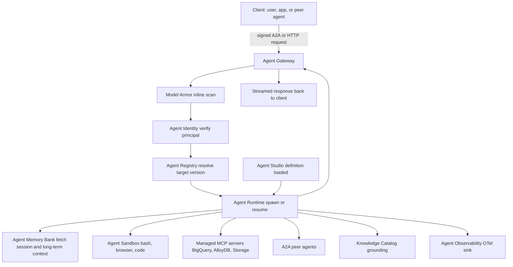
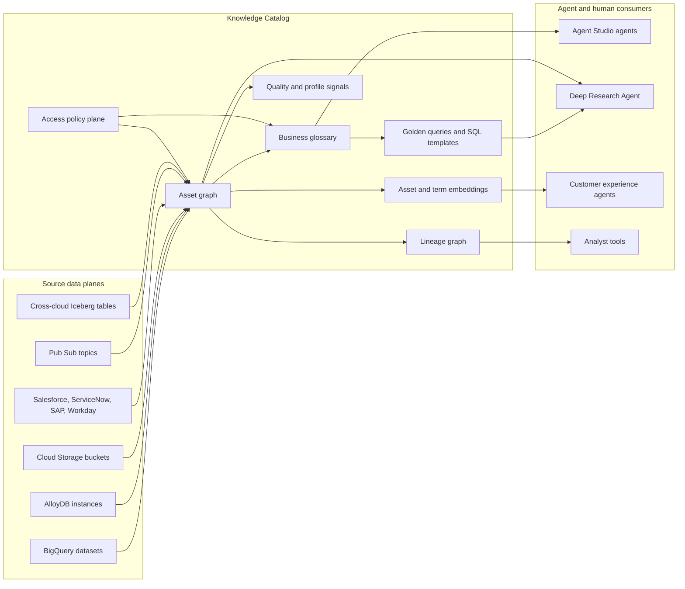
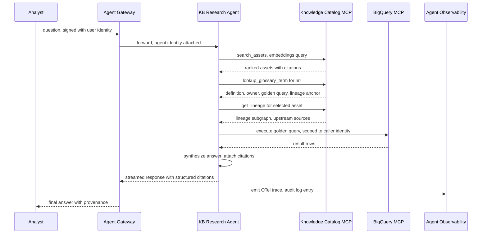
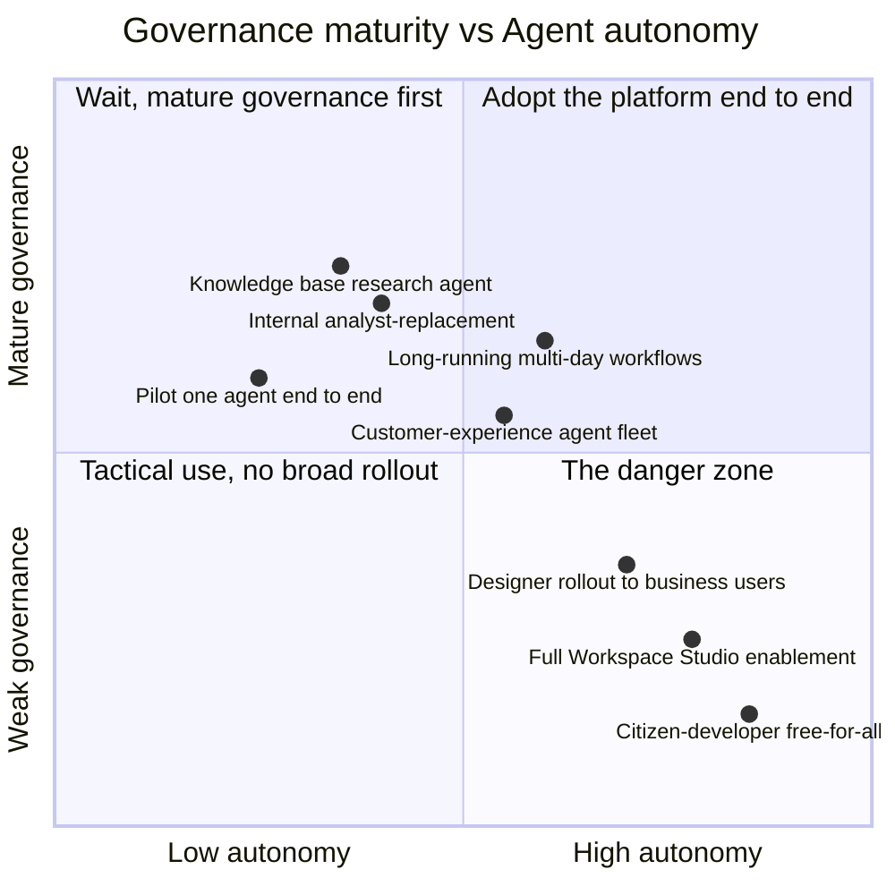

# Gemini Enterprise and the Knowledge Catalog: Two Buildings, Room by Room

In the previous post we walked the floor of Cloud Next 26 end to end: the rebrand of Vertex AI into the Gemini Enterprise Agent Platform, the A2A protocol stabilization, the TPU 8t and 8i split, the Cross-Cloud Lakehouse, the avalanche of 260+ announcements that arrived in roughly ninety minutes of keynote. That post was the map — deliberately wide, deliberately fast, deliberately a little surface-level.

This post is the opposite. It picks two of those boxes and walks you room by room. Of all the things announced, the two that will most reshape a Knowledge Data Engineer's day-to-day work over the next twelve months are not the protocol and not the silicon. They are the Gemini Enterprise Agent Platform itself — understood not as a brand but as a control plane — and the Knowledge Catalog, the rebrand of Dataplex Universal Catalog into something that explicitly positions itself as the semantic spine for agent-grounded enterprise knowledge.

If you are running a corporate knowledge base on GCP, building a vector-DB-backed agent for a financial institution, or wiring a lakehouse against a federated set of business glossaries, these two products are where the marketing and the actual diff in your terraform code overlap most heavily. The rest of Next 26 you can defer reading about. These two you cannot.

I will be opinionated again. Some pieces of the Agent Platform are genuinely production-ready as of mid-2026; others are demoware with a lovely Console icon. Some pieces of the Knowledge Catalog are a graceful evolution of Dataplex; others are aspirational rebrands that will need eighteen months of customer feedback before they earn the name. The job of this post is to draw those lines.

This is also the second of three posts in a sequence. The third will put the Knowledge Catalog directly next to the formal-ontology approach you may already be running, and ask whether the new Google product is just an ontology in different marketing language, or genuinely a different beast. We will not resolve that question here. We will only set it up cleanly.

---

## The Two Buildings Worth Touring

Walking the keynote floor in the previous post, I called sixteen named components inside the Gemini Enterprise Agent Platform. Most of them you will glance at, nod, and never enter. A few you will spend years in. For the Knowledge Data Engineer specifically, two stand out:

1. **Gemini Enterprise Agent Platform itself**, considered as a control plane rather than a feature list. The point of view that matters here is "what is the new system of record for agents in my org, and what does the request path look like end to end?" not "what does the demo on stage show?" When you reduce the platform to its load-bearing components — Studio, ADK, Runtime, Identity, Registry, Gateway, Observability — what you have is a coherent attempt to do for agents what API gateways and service meshes did for microservices a decade ago: make them addressable, governed, observable, and standard-shaped at scale.

2. **Knowledge Catalog** — the rebrand of Dataplex Universal Catalog announced on April 10, 2026, formalized at Next 26 on April 22. This is the semantic surface that agents actually read from when they need to know what a metric means, where a number came from, who is allowed to see it, and how to phrase an SQL query against it. If the Agent Platform is the control plane, the Knowledge Catalog is the data plane for agent-grounded knowledge work. They are designed to work as a pair, and most of the interesting design decisions are at their seam.

The post you are reading sits between two earlier ones — *GCP AI Stack* (what the RAG and vector layer looked like pre-Next 26) and *Ontologies in Production* (what a hand-rolled ontology pipeline looks like) — asking: now that Google has shipped its own version of the second, served on top of the first, *what actually changes for you*?

Let us start with the platform.

---

## Gemini Enterprise Agent Platform: The Control Plane in Detail

The marketing pages for the Agent Platform list components in alphabetical-ish order with a paragraph each. That ordering is a useful index but a terrible mental model. To understand the platform, you have to think about what happens when an agent receives a request. From there, the components arrange themselves into four layers — author, govern, execute, observe — and the wiring between them is what actually matters.

### The four layers and what each replaces

The platform has thirteen named components that show up on the product page. Mentally group them like this:

**Author layer.** This is where agent definitions are produced. Agent Studio is the low-code visual canvas; the Agent Development Kit (ADK) is the code-first SDK. They are intentional siblings: Studio for line-of-business authors, ADK for engineers, both producing the same kind of artifact — a versioned agent definition that the rest of the platform can host. The Agent Garden is a registry of pre-built templates that seed Studio sessions. Together, these three replace what was previously called Vertex AI Agent Builder, plus the loose collection of starter notebooks Google had been shipping in 2025.

**Govern layer.** Agent Identity, Agent Registry, and Agent Gateway. These three are the governance triad and they are the most interesting net-new pieces of the platform. Agent Identity issues a unique cryptographic principal per agent — distinct from any service account, distinct from any human user. Agent Registry catalogs every agent, MCP server, and tool registered against the org and acts as the discovery substrate. Agent Gateway is the runtime ingress and policy-enforcement point for both A2A and MCP traffic; it speaks Model Armor inline. Pre-Next 26, none of these had a real equivalent in Vertex AI: agents inherited service-account identities, were registered by hand in spreadsheets, and were fronted by ad hoc API Gateway or Apigee setups.

**Execute layer.** Agent Runtime, Agent Memory Bank, Agent Sandbox. The runtime is the execution surface, re-engineered for long-running agents that may persist across hours or days, survive restarts, and resume from intermediate state. Memory Bank is the durable, addressable, query-able store of agent context. Agent Sandbox is the hardened execution environment for model-generated code (bash, browser, file). Pre-Next, "running an agent" meant deploying a Cloud Run service that called Gemini and hand-rolling the rest. The execute layer is the platform's attempt to absorb that hand-rolling into a managed surface.

**Observe and improve layer.** Agent Observability, Agent Simulation, Agent Evaluation, Agent Optimizer. Observability captures full reasoning traces over OTel. Simulation replays scenarios against agents under test with deterministic environment fixtures. Evaluation scores live traffic with multi-turn autoraters. Optimizer clusters real-world failures and proposes refined system instructions. This is the analogue of what mature ML platforms do for models — train, evaluate, deploy, monitor — applied to agents, where the unit of evaluation is a multi-step trace.

The first comparison table the post needs is this one — what the new component replaces and what is genuinely net-new:

| Pre-Next 26                              | Gemini Enterprise component        | Net-new vs. relabeled                                            |
|-----------------------------------------|------------------------------------|------------------------------------------------------------------|
| Vertex AI Agent Builder                  | Agent Studio + ADK                 | Largely a relabel, but with first-class A2A and MCP wiring       |
| Vertex AI starter notebooks              | Agent Garden                       | Net-new as a managed catalog                                     |
| Service account per agent                | Agent Identity                     | Net-new principal type, cryptographic ID                         |
| Spreadsheet of agents and ad hoc tools   | Agent Registry                     | Net-new platform service                                         |
| API Gateway / Apigee in front of agents  | Agent Gateway with Model Armor     | Net-new, A2A and MCP-aware control plane                         |
| Cloud Run + custom state machine         | Agent Runtime + Memory Bank        | Net-new managed long-running execution and durable memory        |
| Custom code-execution sidecar            | Agent Sandbox                      | Net-new, hardened by default                                     |
| Cloud Logging + custom dashboards        | Agent Observability                | Largely a relabel of Cloud Trace plus agent-specific instrumentation |
| BYO eval harness                         | Agent Evaluation + Simulation      | Net-new platform-level eval, multi-turn autoraters               |
| Manual prompt iteration                  | Agent Optimizer                    | Net-new, failure-clustering plus instruction refinement          |

### The request path: how the layers wire together

The single most useful thing you can do to understand the platform is trace a request through it. A user — or another agent — wants to ask your knowledge-base agent a question. What happens?



A few things to internalize from that diagram.

First, the **gateway is the only ingress**. Everything that passes between agents in the platform — A2A traffic between peer agents, MCP traffic to managed tools, even synchronous user invocations — goes through the gateway. That is where Model Armor scans for prompt injection, where rate limits are applied, where IAM Deny rules are enforced, and where every request emits an OTel span and a Cloud Audit Log entry. Pre-Next, this layer was either hand-rolled per team or absent.

Second, **Identity is verified before Registry is consulted**. The Agent Identity check happens as the first step inside the gateway, against the cryptographic principal the caller presented. Only after that passes does the registry resolve which version of the target agent should handle the request. This ordering matters: it means policy can be expressed in terms of principal-to-principal pairs ("agents in the fraud-team scope may call agents in the kb-research scope, but not vice versa") rather than in terms of network topology.

Third, **the Runtime is durable**. When the runtime spawns or resumes an agent, it does so with full Memory Bank context attached. A long-running task can checkpoint, the underlying compute can recycle, and the resumed run picks up against the same memory keys. Pre-Next, you got this by hand-rolling Cloud Tasks and Firestore.

Fourth, **observability is unconditional**. The runtime mirrors traces into Agent Observability whether or not your agent code asks for it. You can opt out at the project level for low-sensitivity workloads but the default is on, and traces include the model's intermediate reasoning steps, tool calls, and tool responses. This is, by some distance, the most consequential change for compliance teams.

A minimal Studio-style agent definition, declarative form, looks roughly like this. (API surface based on Google's keynote and product page; final SDK shape may differ at GA.)

```python
# kb_research_agent.py
from google.adk.agents import LlmAgent
from google.adk.tools.mcp_tool import MCPToolset
from google.adk.identity import AgentIdentity

# An agent has its own cryptographic principal, distinct from
# any service account. The runtime issues this at deploy time.
identity = AgentIdentity.bind(
    name="kb-research-agent",
    scopes=["kb.research.read", "knowledge_catalog.lookup"],
)

# Tool surface is composed from managed MCP servers; the agent
# does not own the server implementations.
tools = [
    MCPToolset.from_managed(
        service="bigquery",
        project="finance-kb",
        scope="projects/finance-kb/datasets/research_only",
    ),
    MCPToolset.from_managed(
        service="alloydb",
        instance="kb-alloydb-prod",
        region="us-central1",
        database="documents",
    ),
    MCPToolset.from_managed(
        service="knowledge_catalog",
        project="finance-kb",
    ),
]

agent = LlmAgent(
    name="kb-research-agent",
    model="gemini-3.1-pro",
    description=(
        "Knowledge base research agent. Answers analyst queries by "
        "grounding through the Knowledge Catalog and joining with "
        "structured data in BigQuery and the AlloyDB vector index."
    ),
    tools=tools,
    memory_bank="projects/finance-kb/memoryBanks/research-agent",
    identity=identity,
    expose_a2a=True,
)
```

The interesting line is the last one. `expose_a2a=True` makes this agent discoverable to other agents in the registry. The runtime publishes its Agent Card automatically; the gateway becomes the addressable endpoint; peer agents can call it as a sub-agent. That is the platform's way of turning one agent into a node in a graph rather than an isolated endpoint.

The Studio-side equivalent — the declarative YAML that Studio emits and that ADK can round-trip — looks roughly like the following. The point is that Studio and ADK are two faces of the same artifact:

```python
# Conceptual shape of the Studio-emitted definition
agent_yaml = """
name: kb-research-agent
version: "1.4.0"
model: gemini-3.1-pro
identity:
  scopes: [kb.research.read, knowledge_catalog.lookup]
tools:
  - managed_mcp: bigquery
    scope: projects/finance-kb/datasets/research_only
  - managed_mcp: alloydb
    instance: kb-alloydb-prod
  - managed_mcp: knowledge_catalog
memory_bank: projects/finance-kb/memoryBanks/research-agent
expose_a2a: true
"""
```

### What the Studio/Designer split looks like inside the platform

There is a third authoring surface worth naming briefly: **Agent Designer**, the in-app no-code composer that lives inside the Gemini Enterprise app. Designer produces agents functionally equivalent to those from Studio or ADK — same registry, same runtime, same identity model — but authored in natural language by business users. The wiring is identical; the persona is different.

This is the piece that will land hardest culturally. The first time a business user uses Designer to compose an "expense report summarizer" agent that has read access to Drive, Gmail, and BigQuery — and registers it without an engineering review — you will discover whether your governance is real or theatrical. My recommended posture: enable Designer in pilot tenants only, route every Designer-authored agent through a mandatory Registry approval, and enforce via Identity scopes that Designer agents cannot reach data that has not been explicitly tagged for line-of-business consumption in the Knowledge Catalog.

Which is a perfect segue into the second building.

---

## Knowledge Catalog: The Semantic Spine

If the Agent Platform is the control plane for agent traffic, the Knowledge Catalog is the data plane for agent-grounded *meaning*. The product page positions it as "the universal context engine for the agentic enterprise." That phrase is doing a lot of work; let us unpack it carefully.

### What the Knowledge Catalog actually IS

Knowledge Catalog is the rebrand — effective April 10, 2026, formalized at Next 26 on April 22 — of what was previously called Dataplex Universal Catalog. The rename is not cosmetic. The point is to signal that the product has shifted from "a metadata service for data engineers" to "a context service for agents." The underlying APIs, IAM principals, and gcloud commands remain in the `dataplex` namespace; existing deployments transition transparently. But the product surface, the connectors, and — most importantly — the agent-consumable hooks are reframed around the agent as the primary tenant.

Concretely, Knowledge Catalog is a managed service that maintains, for an enterprise:

- **A federated metadata graph** of data assets across BigQuery, AlloyDB, Cloud Storage, Pub/Sub, Cloud SQL, Spanner, Bigtable, and a growing list of third-party SaaS systems (Salesforce, ServiceNow, SAP, Workday, Palantir Foundry, and a handful more). The graph is built by automatic ingestion of technical metadata and federation with third-party catalogs.
- **A business glossary**: a centralized registry of business terms — "quarterly net revenue retention", "high-risk customer", "in-force premium" — each with a definition, an owner, a steward, a governance policy, and links to the underlying data assets that materialize the term.
- **Lineage**: a directed graph of how data flows, transforms, and is consumed across systems. Lineage is recorded at table, column, and (where instrumented) operation level. Crucially, lineage is queryable per asset and per term, so an agent can ask "what is the lineage of `nrr_q2_2026`" and receive a structured answer it can show in a citation.
- **Data quality signals**: profile statistics, anomaly detections, freshness watermarks, schema-drift detections, all attached to assets and surfaceable through the same query interface as metadata.
- **Embeddings and semantic search**: every cataloged asset is embedded; the catalog supports semantic search with faceted filtering and natural-language queries. This is what powers "find a table that probably represents customer-level fee revenue at month grain" without anyone having to know the table's literal name.
- **Access policies**: every asset and term carries access controls. Crucially, those controls are enforced *at retrieval time inside the catalog*, not just at the underlying store. Two agents asking for the same term get different responses if their identities resolve to different policy outcomes.
- **Agent-consumable hooks**: the catalog ships managed MCP servers — both remote and local — that expose its query surface to agents in the platform's standard tool-call format. This is the line that makes the rebrand more than cosmetic. Agents call the catalog through MCP; identity is propagated; access is filtered; lineage and citations come back inline.

### How it differs from Data Catalog and Dataplex

The lineage of GCP catalog products is dense; the names have changed several times; it pays to draw the line clearly.

- **Data Catalog**, the original product (announced 2019, GA 2020), was a metadata search service. You could register entries, attach tags, and search. It was passive: it knew what assets existed and what tags humans had attached, and that was about it.
- **Dataplex** (announced 2022, GA 2023) added a control plane on top: zones, lakes, automated discovery, data-quality jobs, lineage, business glossary management. Dataplex absorbed Data Catalog's responsibilities and extended them.
- **Dataplex Universal Catalog** (2024) was a rebranding pass that added federation across Google Cloud and selected third-party stores. The same APIs, more sources.
- **Knowledge Catalog** (April 2026) is the agent-tenant rebrand. The federation, lineage, and glossary are still there. What is added is the explicit agent surface: MCP servers, golden queries, semantic-search-with-policy, automatic Gemini-generated descriptions for under-curated assets, and the framing of "context engine for agents" as the primary value proposition.

Roughly 70% of Knowledge Catalog is Dataplex Universal Catalog with new framing. The remaining 30% — agent hooks, golden queries, automatic Gemini description generation, MCP tool exposure — is genuinely net-new and is the part worth designing around.

### What a "context graph" looks like in practice

Marketing pages call the catalog "a dynamic context graph." That phrase is correct but underspecified. What the catalog actually maintains is a graph whose nodes are heterogeneous — assets, terms, lineage edges, policies, owners, embeddings — and whose edges encode semantic and operational relationships:



A few things in that diagram are worth dwelling on.

**Glossary plus golden queries plus lineage is the real magic.** A glossary entry alone is just a definition with an owner. Add golden queries — vetted SQL templates that materialize the term from canonical tables — and you have a metric definition that can be executed. Add lineage and you can show the full provenance from source system to served result. That triple is what makes the catalog usable as an agent-grounding substrate rather than a lookup table.

**Embeddings make discovery natural-language-shaped.** Pre-Knowledge-Catalog, finding the right table required either knowing the schema or running a search against tag fields. With embeddings, an agent can ask "which assets are likely to represent in-force premium at customer grain at month frequency" and get a ranked list, each entry annotated with its glossary mapping. This is the piece that makes agent-driven analytics feel less brittle than first-generation Text-to-SQL.

**Policy is enforced inside the catalog, not just at the store.** When an agent issues a search, the catalog filters results against the calling identity's policy graph before returning them. A row-level secret table is not just inaccessible to query; it is *invisible* to discovery. This is what makes it safe to expose the catalog's MCP server to a citizen-developer agent.

### The agent-consumable hooks: MCP, golden queries, and citations

The most underappreciated property of Knowledge Catalog is the *citation contract*. Every result returned from the catalog's MCP surface includes:

- A canonical asset identifier
- A glossary term reference, if applicable
- A lineage anchor — a pointer to the lineage subgraph that produced the asset
- An access-policy stamp — which policies authorized the result
- A confidence score for any Gemini-generated content (auto-descriptions, suggested golden queries)
- A version key suitable for cache invalidation

An agent that retrieves grounded context from the catalog can therefore emit a response with structured citations:

```python
# Conceptual shape of a citation envelope returned by the catalog
{
    "asset_id": "//bigquery/projects/finance-kb/datasets/risk/tables/nrr_q2",
    "glossary_term": "quarterly_net_revenue_retention@v3",
    "lineage_anchor": "lin-2026-08-21-7af2",
    "applied_policies": ["finance.read", "pii.minimize"],
    "confidence": 0.91,
    "version_key": "kc-rev-19847",
}
```

This is the property that makes Knowledge Catalog consequential for regulated industries. We will return to it shortly.

---

## How an Agent Actually Consumes the Catalog

A diagram of components is one thing; a sequence of calls is another. Here is what actually happens when a user asks a knowledge-base agent a question that requires grounding through the catalog.



A working sketch of the agent code, hedging on SDK surface — these names are plausible projections from the keynote and product page; verify against the GA reference once shipped:

```python
# Inside the agent's reasoning loop
from google.cloud import knowledge_catalog_v1 as kc

# The catalog client picks up the agent's principal automatically
# from the runtime; access policies will be applied per-call.
catalog = kc.KnowledgeCatalogClient()

# Step 1: semantic search across the catalog for relevant assets
search = catalog.search_assets(
    parent="projects/finance-kb/locations/us-central1",
    query="quarterly net revenue retention enterprise customers",
    facets={"asset_type": ["TABLE", "VIEW"], "domain": ["finance"]},
    max_results=8,
)

# Step 2: resolve the canonical glossary term mentioned in the question
term = catalog.lookup_glossary_term(
    parent="projects/finance-kb/locations/us-central1",
    term="quarterly_net_revenue_retention",
    context={
        "fiscal_calendar": "fy2026",
        "scope": "enterprise_customers",
    },
)

# Treat confidence as load-bearing, not decorative.
if term.confidence < 0.85:
    return escalate_to_human("ambiguous metric definition")

# Step 3: pull lineage so the answer can include provenance
lineage = catalog.get_lineage(
    asset=term.canonical_asset,
    direction="UPSTREAM",
    depth=3,
)

# Step 4: execute the golden query through managed BigQuery MCP
sql = term.golden_query.render(
    fiscal_calendar="fy2026",
    scope="enterprise_customers",
)
rows = bigquery_tool.execute(sql, max_rows=100)

# Step 5: emit the response with structured citations
response = {
    "answer": summarize(rows, term.definition),
    "citations": [
        {
            "asset": term.canonical_asset,
            "glossary_term": term.name,
            "lineage_anchor": lineage.anchor_id,
            "policies": term.applied_policies,
            "version": term.version_key,
        }
    ],
}
return response
```

The shape of this code is what makes the difference between a RAG pipeline that an auditor will tolerate and one that will fail a regulatory review. Three points are worth naming explicitly.

**The agent does not pick the SQL.** The golden query is curated and lives in the catalog. The agent renders it with parameters drawn from the question, but does not author the query body. That is what removes the largest single class of Text-to-SQL failure mode: confident-but-wrong joins.

**Lineage is fetched alongside the answer.** Not as a separate audit-time pass. The response contains the lineage anchor, which means a downstream system — a chat UI, a notebook, a regulatory report — can render the provenance without making another call.

**The confidence gate is real.** If the catalog's resolution of the question to a glossary term has low confidence — because the term is ambiguous, the question is novel, or the domain context is missing — the agent declines to act and routes to a human. This is the property the keynote demos do not emphasize and that practitioners must enforce religiously.

What this gives you, in regulated-industry terms, is an answer-with-provenance contract. The agent's response is reproducible, attributable, and policy-stamped. That contract is the precondition for putting an agent in front of an analyst at a bank. Without it, you have a chatbot. With it, you have a tool.

---

## What This Replaces in Today's Stack

For a Vertex AI team running a knowledge-base pattern in production today — call it the AlloyDB-pgvector + Vertex RAG Engine + custom-glossary-in-Sheets + Cloud Logging-for-audit pattern that I described in the prior *GCP AI Stack* post — the natural question is: what survives, what gets folded in, and what gets retired? Here is the comparison.

| Stack concern                | Pre-Next 26 (the stack you have)                                          | With Gemini Enterprise + Knowledge Catalog                                                         | What is not yet clear                                             |
|------------------------------|---------------------------------------------------------------------------|----------------------------------------------------------------------------------------------------|-------------------------------------------------------------------|
| Agent definition             | Vertex AI Agent Builder + custom Cloud Run wrapper                        | Agent Studio or ADK, deployed to Agent Runtime                                                     | Migration tooling for Agent Builder agents                        |
| Agent identity               | Long-lived service account                                                | Agent Identity, cryptographic principal per agent                                                  | Federation with non-GCP identity providers                        |
| Tool layer                   | Hand-rolled MCP servers or direct REST calls                              | Managed MCP servers across 50+ Google services                                                     | Per-region availability, quota propagation                        |
| Vector store                 | AlloyDB + ScaNN, or Vertex Vector Search                                  | Same backends, now reachable through Catalog-mediated discovery                                    | Whether to retire bespoke vector stores in favor of catalog-native indexes |
| Metadata catalog             | Data Catalog or Dataplex with hand-curated glossary                       | Knowledge Catalog with Gemini-augmented glossary and golden queries                                | Quality of auto-generated glossary entries vs. hand-curated ones  |
| Lineage                      | Manual annotation, partial Dataplex coverage                              | Built into Knowledge Catalog, queryable per asset and per term                                     | Granularity for cross-cloud lineage                               |
| Audit and provenance         | Custom logs in Cloud Logging                                              | Structured citations in the agent response, policy stamps inline                                   | Retention defaults and exportability                              |
| Long-running tasks           | Cloud Tasks + Firestore + handwritten state machines                      | Agent Runtime + Memory Bank                                                                        | Cost model for sustained Memory Bank usage                        |
| Evaluation                   | BYO eval harness, often a Python script and a Sheet                       | Agent Simulation + Agent Evaluation, multi-turn autoraters                                         | Whether autorater quality matches your domain harness             |
| Multi-agent orchestration    | LangChain or hand-rolled                                                  | A2A protocol, native in ADK and the Gateway                                                        | Cross-cloud A2A interop in practice                               |
| Cross-cloud data             | Snapshot-and-copy from S3 or Azure Blob                                   | Cross-Cloud Lakehouse Iceberg tables, queryable in place                                           | Cost of remote reads at agent query frequency                     |

The honest reading of that table is that *most* of your stack does not get retired. AlloyDB stays. BigQuery stays. Cloud Run stays for non-agent workloads. What gets folded in is the *connective tissue*: identity, registry, gateway, observability, catalog. The pre-Next 26 stack had this tissue too — it was just hand-rolled, per team, with N implementations across the organization. The Next 26 platform replaces N hand-rolled implementations with one managed surface.

If you want a single principle for migration: **stop owning the connective tissue, and keep owning the data and the agents themselves.**

---

## Governance, Lineage, and Why Regulated Industries Care

It is tempting, reading the press coverage, to dismiss the Knowledge Catalog rebrand as marketing. Most of the technical capabilities — federated metadata, lineage, business glossary, semantic search — existed in some form in Dataplex. The press coverage is not wrong to call it an evolution.

But the press coverage almost universally undersells the governance angle, and that undersell matters disproportionately for teams in regulated industries. Three points are worth making forcefully.

### Lineage as a guardrail, not a feature

In an unregulated context, lineage is a developer convenience: "where did this number come from?" In a regulated context, lineage is a *control*. An auditor does not ask whether your number is right. They ask whether you can show, on demand, the chain of custody from source system to served result, and whether the policies applied at each step are auditable.

Knowledge Catalog's lineage graph is queryable by the agent at answer time, not just by an auditor at review time. That is the difference. An agent that emits an answer with a lineage anchor is one whose output can be reproduced, attributed, and explained. An agent that emits an answer without lineage is one that cannot, and the regulator's question — "show me how this number was computed for this customer on this date" — has no good answer.

This is why I argue, perhaps controversially, that **Knowledge Catalog is the most consequential product in the Next 26 announcement for regulated industries** — more so than the platform itself. The platform makes governance possible. The catalog makes governance *enforceable on a per-answer basis*.

### Business glossary as a vocabulary contract

The glossary is, on the surface, a list of terms and definitions. Underneath, it is a *contract* between the data team and the rest of the business about what words mean. "Quarterly net revenue retention" is not a definition that can be agreed upon in a meeting and then forgotten; it has to be encoded, owned, stewarded, and versioned. When an agent grounds its answer in a glossary term, it is — implicitly — saying "I am using the meaning that this committee, on this date, signed off on."

The catalog's glossary support is not magical. It does not eliminate the labor of glossary curation. But it does provide a single place where that labor materializes into something agents can consume, and it provides versioning so that an answer given today can be traced back to the definition in force when the answer was given.

In my own work, the most repeated failure mode of analyst-replacement agents is *vocabulary drift*: the agent uses today's definition of "active customer" against a question that was implicitly framed against last year's definition, and produces a confidently wrong answer. The catalog does not eliminate this; it makes it detectable.

### Access policies enforced at retrieval

This is the property that makes the catalog safe to expose to a citizen-developer agent. Pre-catalog, the standard practice for sensitive data was either (a) deny the agent access entirely, or (b) grant access at the underlying store and trust the agent's prompt to not leak. The first is overconservative; the second is unsafe.

With Knowledge Catalog, access is enforced at retrieval time, *inside the catalog*, against the calling identity. A row-level-restricted asset is not visible to discovery for an unauthorized identity. A glossary term marked "internal-only" does not appear in a search result. This is the property that turns "we cannot expose the catalog to the customer-experience agent" into "we can, and the catalog will filter the results appropriately."

This shifts the risk model. The risk is no longer "did the agent author over-prompt?" The risk is "did we configure the catalog's policy graph correctly?" That second question has a different shape — it is centralized, auditable, testable. It is, in other words, a question the security team can own.

### The quadrant: where you sit on the governance/autonomy plane

The right way to think about how aggressive to be with these new primitives is along two axes: how mature your governance is, and how autonomous you want your agents to be. The trick is that the platform's promise rewards both axes simultaneously, and the failure modes occur when one outpaces the other.



The quadrant most teams accidentally inhabit is the bottom-right: high agent autonomy, weak governance. Designer agents authoring themselves before the Knowledge Catalog has a populated glossary; Workspace Studio rollouts before access policies are wired in. The fix is not to reduce autonomy. The fix is to grow governance first, then permit autonomy second.

---

## A Migration Sketch for Vertex AI Teams

Suppose you are leading a small Knowledge Data Engineering team at a financial institution, with: one Vertex AI Agent Builder agent serving a Personal Bank knowledge base, one custom RAG pipeline on AlloyDB-pgvector plus Vertex RAG Engine, a Dataplex deployment with partial glossary coverage, and a homegrown evaluation script that runs nightly against a labeled question set. Where do you actually start? Five steps, opinionated, deliberately concrete.

**Step 1: Inventory what you have, mapped to the new surface.**

Take an afternoon. List every agent, every MCP-or-pseudo-MCP wrapper, every Dataplex entry, every glossary term. For each, write a one-line answer to: which Gemini Enterprise component does this become? Which Knowledge Catalog primitive does this become? You will discover, almost certainly, that you have shadow agents nobody quite owns and shadow glossary terms that exist in three places at once. That is the inventory's purpose. The migration plan is built on this inventory.

```python
# Pseudocode: a small inventory script
inventory = {
    "agents": [
        {"name": "personal-bank-kb", "kind": "agent_builder",
         "becomes": "agent_studio + adk + agent_runtime"},
    ],
    "mcp_wrappers": [
        {"service": "alloydb", "owner": "kb-team", "becomes": "managed_mcp"},
        {"service": "bigquery", "owner": "fraud-team", "becomes": "managed_mcp"},
    ],
    "dataplex_entries": 412,
    "glossary_terms": 38,
    "service_accounts_used_by_agents": 5,  # candidates for Agent Identity migration
    "evaluation_harnesses": 1,              # mirror, do not migrate
}
```

**Step 2: Audit your Knowledge Catalog readiness before turning agents loose on it.**

The catalog's ability to ground an agent is a function of its content. An empty catalog is a hallucination machine with citations. Before any agent is wired to the catalog's MCP surface, your data engineering team needs to: (a) populate or audit the glossary for the top 50 business terms, (b) attach golden queries to each, (c) verify that lineage covers the assets those queries hit, (d) configure access policies for sensitive terms.

This step is the labor-intensive one and the one most teams will be tempted to skip. Do not skip it. The marketing pages talk about Gemini-augmented automatic glossary generation. That capability is real. It is also a starting draft, not a finished glossary. Auto-generated entries need stewardship, signoff, and versioning before they can be load-bearing.

**Step 3: Establish business-glossary stewardship as an org function, not a tool deployment.**

This is the unsexy step. Before you flip the agent platform on, decide who owns each domain's glossary, what the change-control process is, how often glossary terms are reviewed, and where the audit trail of definitional changes lives. The catalog gives you the tooling. The org has to provide the labor.

A useful pattern: every glossary term has an owner from the data team and a steward from the business. Changes go through a pull-request-equivalent workflow inside the catalog (or in a YAML repo, if your team prefers, with the catalog as a downstream cache). Quarterly review of high-traffic terms. Versioning enforced at the term level, with version keys propagated into agent citations.

**Step 4: Pilot one agent end-to-end on the new platform.**

Pick the highest-leverage, lowest-blast-radius agent you have. Ideally an internal-facing knowledge-base research agent — analyst-replacement, low transaction risk, high observability. Migrate it through the full new stack: Agent Studio definition, Agent Identity principal, Agent Runtime hosting, Agent Gateway ingress, managed MCP servers for tools, Knowledge Catalog grounding, Agent Observability traces.

Do not migrate the customer-facing agent first. Do not migrate the long-running scheduled agent first. Pilot something where, if it goes wrong on a Tuesday, the worst outcome is an internal Slack thread, not a regulatory inquiry.

While the pilot runs, mirror traces into Agent Observability *and* keep your existing evaluation harness. Mirror, do not migrate. Compare results on the labeled question set across the old and new stacks. Look for divergence in the worst quintile of answers, not the average. The mean will look fine. The tail is where the signal is.

**Step 5: Expand with caution, on a quarterly cadence.**

Q3 2026: pilot agent in production. Q4: second agent, plus first Designer-authored agent under controlled rollout. Q1 2027: customer-facing agent, with explicit risk review. Q2 2027: Workspace Studio for selected business users, gated by Knowledge Catalog access policies.

Twelve months from "we read the keynote" to "we have replaced our connective tissue." It feels slow. It is correctly paced. The teams that compress this into two quarters are the teams whose names appear in retrospective post-mortems eighteen months later.

---

## What to Be Skeptical About

Five things the keynote slides are confident about and that practitioners should hold loose.

**Catalog onboarding cost is opaque.** Auto-generation of descriptions, glossary suggestions, and lineage extraction is real, but none of it produces a finished catalog without human curation. The labor cost of standing up a usable catalog over a heterogeneous data estate is not addressed in any pricing page or keynote demo. Plan for one or more full-time data stewards per domain for the first year.

**Glossary curation labor is the largest hidden cost.** Auto-generated entries never reviewed are worse than no glossary: they give agents definitions nobody signed off on, producing confident-but-wrong answers that look correct because they carry a citation. The catalog's value is proportional to glossary stewardship rigor.

**Multi-cloud catalog reach is partial.** The Cross-Cloud Lakehouse promises zero-copy queries against Iceberg tables in S3 and Azure Blob. The Knowledge Catalog promises federation across SaaS systems. Both are real. Neither is uniform. Specific connector quality varies; some SaaS integrations are read-only metadata; some lineage edges across clouds are coarse-grained at table level rather than column level. Verify your specific source systems before assuming federation is complete.

**Agent Identity is a quiet but consequential lock-in vector.** A2A and MCP are open protocols, governed (in A2A's case) by the Linux Foundation. Agent Identity is not. Once your agents authenticate as Google-issued cryptographic principals and are governed by Cloud IAM, the cost of moving to AWS Bedrock Agents or Azure AI Foundry is no longer "rewrite agent code" but also "rewrite identity, registry, and governance plane." This is intentional and rational on Google's side. It is also a real strategic commitment on yours. Price it in deliberately.

**Confidence scores are easy to ignore and hard to enforce.** Auto-generated descriptions, suggested glossary entries, and term-resolution results all carry confidence scores. The runtime does not enforce thresholds; your agent code must. That discipline — treating confidence as load-bearing — is currently a developer responsibility, and it is the difference between an agent that is regulator-acceptable and one that is not.

A sketch of the kind of platform-level event your governance team should monitor:

```python
# Conceptual shape of an Agent Observability event
{
    "trace_id": "trace-2026-08-21-7f2c",
    "agent": "kb-research-agent",
    "agent_principal": "agents/kb-research-agent@finance-kb.iam.gserviceaccount-equivalent",
    "step": "knowledge_catalog.lookup_glossary_term",
    "input": {"term": "high_risk_customer", "context": {"product": "personal_bank"}},
    "output": {
        "term_resolved": "high_risk_customer_v3",
        "confidence": 0.71,
        "policy_stamps": ["finance.read", "pii.minimize"],
    },
    "latency_ms": 142,
    "policy_decisions": ["allow"],
    "downstream_action": "escalated_to_human",
    "downstream_reason": "confidence_below_threshold",
}
```

The single most useful alert your platform team can configure is: any agent action where confidence is below threshold *and* downstream_action is anything other than `escalated_to_human` or `refused`. That alert catches the exact failure mode that produces a confidently-wrong answer with a citation attached.

---

## Up Next: Catalog vs Ontologies

This post has, deliberately, walked you through the Knowledge Catalog as Google presents it: a context engine, a federated metadata graph, an agent-grounding substrate. That framing is useful. It is also not the only framing.

If you have been around knowledge engineering for any length of time, you may have noticed something. A federated metadata graph with classes and relationships, a business glossary with terms and definitions, lineage and provenance edges, access policies enforced at retrieval, semantic search via embeddings, an MCP surface that lets agents query the graph at runtime — that description, with a few words substituted, describes a *managed ontology platform*. Classes become assets. Properties become lineage edges. Glossary terms become individuals or named concepts. Golden queries become competency questions, executed.

Is the Knowledge Catalog an ontology? Is it ontology-shaped enough to replace your formal-ontology pipeline, or is the resemblance superficial? Does the absence of formal logical semantics — the catalog has no OWL profile, no SHACL shapes, no inference layer — disqualify it from doing what an ontology does, or does it not matter for the agent grounding use case? Where does the catalog earn the name and where does it borrow it?

Those are the questions for the next post. We will put the Knowledge Catalog directly next to the YAML-to-OWL-and-SHACL pipeline I described in *Ontologies in Production: A CI/CD Pipeline for Enterprise Schemas on GCP*, walk through the same banking use case in both, and ask which is the right substrate for your knowledge layer in 2027 and beyond. The answer, if the previous two posts are any indication, will be more nuanced than the keynote suggests.

Until then: pilot the platform, populate your glossary, gate on confidence, and treat the connective tissue as a thing the platform now owns and you do not.

---

## Going Deeper

**Books:**

- Kleppmann, M. (2017). *Designing Data-Intensive Applications.* O'Reilly Media.
  - Knowledge Catalog only makes sense in the context of the broader data-systems literature. The chapters on derived data, batch and stream processing, and consistency models will sharpen your reading of the catalog's lineage and policy primitives.
- Newman, S. (2021). *Building Microservices, 2nd Ed.* O'Reilly Media.
  - The Agent Gateway architecture borrows directly from microservices control-plane patterns. If you have not internalized service meshes, API gateways, and service registries, the agent equivalents will surprise you.
- Allemang, D., Hendler, J., and Gandon, F. (2020). *Semantic Web for the Working Ontologist, 3rd Ed.* ACM Books.
  - The reference for thinking carefully about what an ontology actually is. Read this before the next post in this series — it will make the catalog-vs-ontology comparison much sharper.
- Huyen, C. (2022). *Designing Machine Learning Systems.* O'Reilly Media.
  - Useful background for understanding what platform-level vs application-level concerns are. Read before deciding what to migrate to Agent Runtime versus what to keep in your own runtime.

**Online Resources:**

- [Introducing Gemini Enterprise Agent Platform](https://cloud.google.com/blog/products/ai-machine-learning/introducing-gemini-enterprise-agent-platform) — Primary product blog post, with the full component list and the four-layer framing.
- [Gemini Enterprise Agent Platform product page](https://cloud.google.com/products/gemini-enterprise-agent-platform) — Marketing-level overview, but the section anchors are useful as a reading index.
- [Knowledge Catalog (formerly Dataplex)](https://cloud.google.com/products/knowledge-catalog) — Product page for the catalog, with the agent-grounding framing and the connector list.
- [Knowledge Catalog overview documentation](https://docs.cloud.google.com/dataplex/docs/introduction) — The reference doc for capabilities, APIs, and the Dataplex transition path.
- [Transition from Data Catalog to Knowledge Catalog](https://docs.cloud.google.com/dataplex/docs/transition-to-dataplex-catalog) — Migration mechanics; useful even if you are coming from Dataplex Universal Catalog rather than the older Data Catalog.
- [Knowledge Catalog for AI agents documentation](https://docs.cloud.google.com/dataplex/docs/ai-overview) — The agent-grounding feature set, including golden queries and MCP exposure.
- [Announcing official MCP support for Google services](https://cloud.google.com/blog/products/ai-machine-learning/announcing-official-mcp-support-for-google-services) — Background for how managed MCP servers fit alongside the catalog's MCP surface.
- [Google Cloud Next 2026 wrap-up](https://cloud.google.com/blog/topics/google-cloud-next/google-cloud-next-2026-wrap-up) — The 260-announcement summary; useful as a cross-reference when reading any single product page.

**Videos:**

- [Google Cloud Next '26 Opening Keynote](https://www.youtube.com/watch?v=11PBno-cJ1g) — Watch the agent-platform and data-cloud sections in full for the framing the marketing pages compress.
- [Google Cloud Next '26 Developer Keynote](https://www.youtube.com/watch?v=A01DQ8_xy7Q) — The technical deep-dive, with substantive ADK and Agent Runtime walkthroughs.

**Specifications and Standards:**

- The Model Context Protocol Specification, published by Anthropic at [modelcontextprotocol.io](https://modelcontextprotocol.io/). The transport, capabilities, and resource-sharing primitives are foundational; managed MCP servers and the catalog's MCP surface are implementations against this spec.
- The A2A Protocol Specification (Linux Foundation), published at [a2a-protocol.org](https://a2a-protocol.org/latest/). The agent-card and signed-security-card sections are the parts most relevant to how Identity and Registry interact across organizational boundaries.

**Questions to Explore:**

- If a Knowledge Catalog with mature glossary stewardship and queryable lineage is the practical answer to enterprise grounding, what becomes of formal-ontology-with-OWL-and-SHACL pipelines? Are they replaced, complemented, or simply renamed? (We will tackle this directly in the next post.)
- The catalog enforces access policies at retrieval time. What is the right test harness for verifying that policy graph behaves correctly across thousands of identities and tens of thousands of assets? Is unit testing the catalog itself a viable practice, and what does that look like?
- Confidence scores on Gemini-augmented glossary entries are not enforced by the runtime. Should they be? What would platform-level confidence-gating look like, and what are the failure modes when it is too aggressive vs. too lax?
- Agent Identity is closed; A2A and MCP are open. Is there a future world in which an open Agent Identity standard emerges across clouds, the way OpenID Connect emerged for human identity? Who would have the incentive to build it?
- If 800 agents in a single enterprise becomes a typical scale, what is the minimum viable observability stack that a platform team needs to operate? Are OTel traces alone sufficient, or do we need new primitives for reasoning-trace observability that no current vendor ships?
