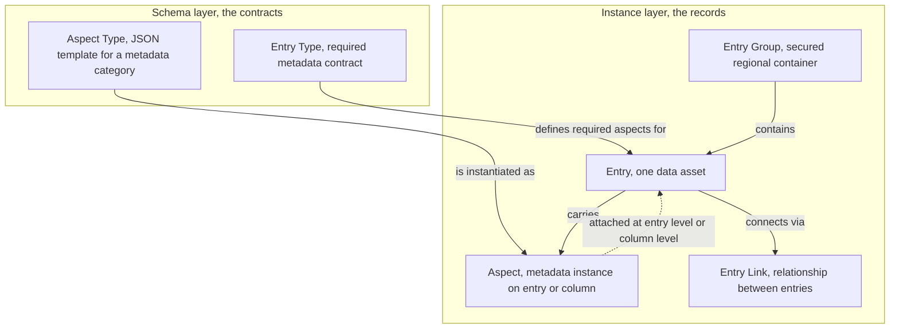
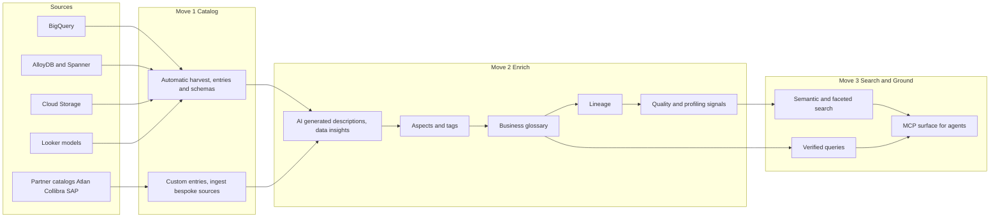
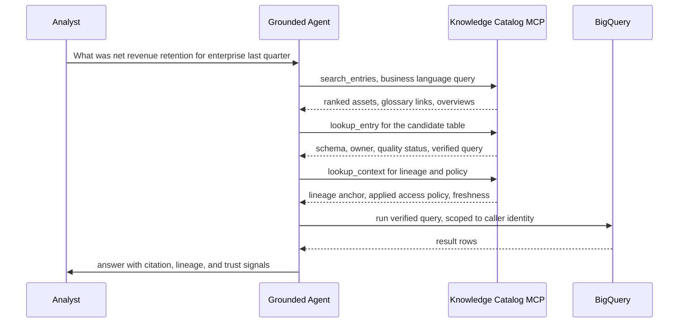
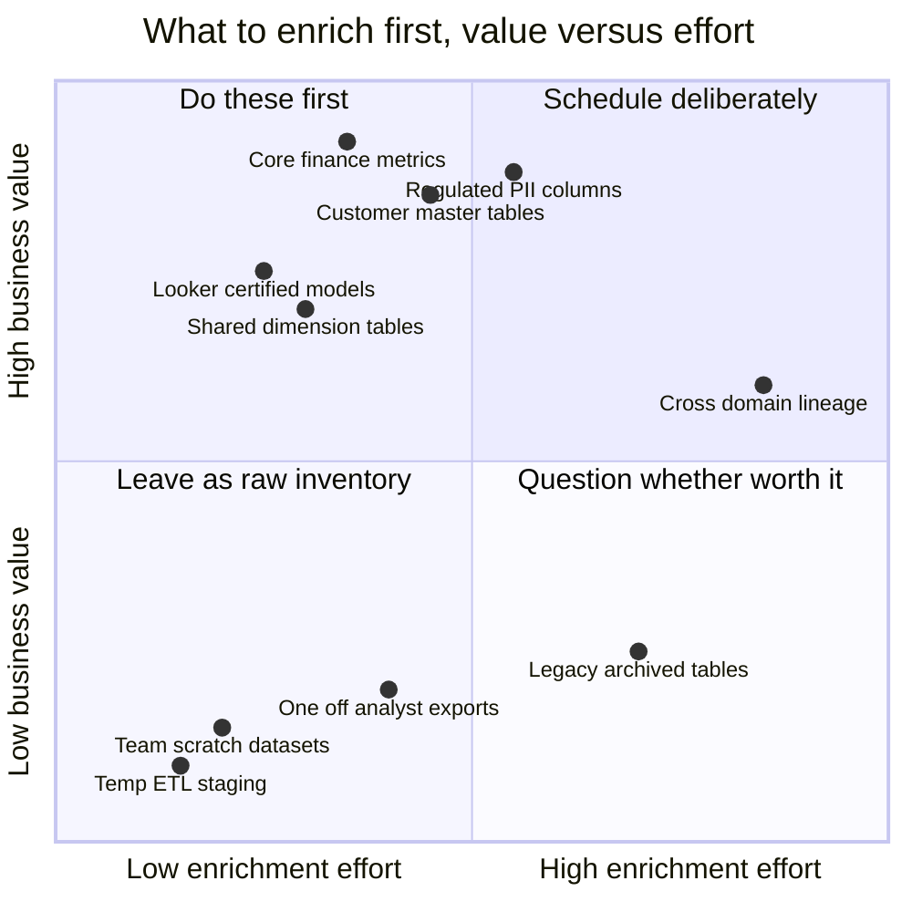

# The Definitive Knowledge Catalog Workshop: Catalog, Enrich, Search

Picture the data estate you actually have, not the one on the architecture slide. Eleven hundred BigQuery tables, a few hundred of which are named `tmp_final_v2_REAL`. Three AlloyDB instances nobody on the current team provisioned. A Cloud Storage bucket of PDFs that is, depending on who you ask, either the source of truth for contracts or a graveyard of superseded drafts. A Looker model with forty measures, six of which compute "revenue" slightly differently. And, looming over all of it, a mandate from someone senior to "put an agent on the data" by the end of the quarter.

If you point a large language model at that estate today, you will get a confident, well-formatted, wrong answer roughly as often as a right one. The model has no way to know that `customers_active` is the table the CRM team trusts and `customers_all` is the one finance abandoned in 2024. It cannot see that the `rev` column in one table is gross and in another is net. It has no lineage, no glossary, no policy. It has tokens.

This post is a workshop. We are going to take that estate and run it through Google's **Knowledge Catalog** three times, once for each of its core moves: **catalog**, **enrich**, and **search**. By the end you will know how to use the service, how it works under the hood, what value it actually delivers, and, just as importantly, where its edges are. This is the practical companion to my earlier [Gemini Enterprise and the Knowledge Catalog deep dive](https://juanlara18.github.io/portfolio/#/blog/gemini-enterprise-knowledge-catalog-deep-dive), which mapped the product as a control plane and a data plane. That post drew the map. This one hands you the tools and walks you through the building room by room. Where the two overlap I will reference rather than repeat, and where the catalog meets the question "is this just an ontology" I will send you to the [catalog vs ontologies piece](https://juanlara18.github.io/portfolio/#/blog/knowledge-catalog-vs-ontologies) rather than relitigate it here.

## A Note on Names, Because Google Has Changed Them Repeatedly

Before we touch a command, we have to settle the naming, because the lineage of names is genuinely confusing and the product you search for in the console may not match the docs you read.

The capability has been rebranded four times in roughly six years. **Data Catalog** arrived around 2019 to 2020 as a passive metadata search service. **Dataplex** (2022 to 2023) wrapped a governance control plane around it: discovery, data quality, lineage, glossary. **Dataplex Universal Catalog** (2024) added federation across Google Cloud and selected third-party stores. And in April 2026 the whole thing was rebranded **Knowledge Catalog**, framed explicitly as "an active, AI-powered context graph" rather than a passive registry.

The single most important practical fact: the rename is a product-surface change, not an API change. The underlying APIs, IAM roles, and CLI commands all still live in the `dataplex` namespace. You will run `gcloud dataplex ...`, import `google-cloud-dataplex`, and hit `dataplex.googleapis.com`. Google's own documentation is explicit that existing Dataplex deployments, APIs, aspects, and configurations transition to Knowledge Catalog with no migration, data movement, or downtime. When this post says "the catalog," it means the thing Google now markets as Knowledge Catalog and ships under the Dataplex API.

| Era | Product name | What it added |
|---|---|---|
| 2019 to 2020 | Data Catalog | Metadata registry plus tag search |
| 2022 to 2023 | Dataplex | Governance control plane, discovery, quality, lineage, glossary |
| 2024 | Dataplex Universal Catalog | Federation across Google Cloud and third-party catalogs |
| April 2026 | Knowledge Catalog | AI context graph, automated enrichment, MCP grounding for agents |

## Prerequisites

This is a lab, so let us be concrete about what you need before you start. You need a Google Cloud project with billing enabled and the Dataplex API, the Data Lineage API, and (if you want auto-generated descriptions) the relevant Gemini in BigQuery features turned on. You need IAM roles in the `roles/dataplex.*` family: `catalogEditor` or `catalogAdmin` for writing entries and aspects, `dataScanEditor` for quality scans, and the glossary roles (`dataplex.glossaryTerms.create` and friends) for vocabulary work. You need at least one real data source registered, ideally BigQuery, because the auto-discovery story is strongest there. And you need a non-trivial amount of patience for indexing, because cataloged assets do not appear instantly; the harvest runs in the background.

One conceptual prerequisite matters more than any IAM grant: be clear, before you start, on whether you are building a catalog for **humans to discover data**, for **agents to ground answers**, or both. The mechanics are the same. The curation bar is wildly different. An agent will act on a mislabeled asset; a human will usually notice the smell and move on.

## The Mental Model: Entries, Aspects, and the Metadata Graph

Everything in the catalog reduces to a small set of resources. Learn these five nouns and the rest of the product is composition.

- **Entry**: the canonical representation of a data asset in the catalog. When you create a BigQuery table, the catalog auto-creates an Entry for it. You do not govern the table directly; you govern its Entry. The Entry is the noun.
- **Entry Group**: a secured container for entries. It defines access control and the regional location for the records inside it. Think of it as a folder with permissions and a home region.
- **Entry Type**: the schema for an entry. It declares which metadata an entry of this type must carry, by referencing a set of required aspect types.
- **Aspect Type**: a JSON template defining a category of structured metadata: its fields, their data types, and which are required. It is the contract that keeps metadata consistent.
- **Aspect**: an instance of an aspect type attached to an entry, a column, or an entry link. Crucially, aspects are stored as parts of the entry resource, not as independent resources. Modifying an aspect modifies its entry.

The relationship between the schema-defining resources and the instance resources is worth seeing as a picture, because the entry-versus-entry-type and aspect-versus-aspect-type distinction trips up almost everyone on day one.



Two design consequences fall out of this model immediately. First, because required aspects are declared on the entry type and cannot be removed once the type is created, the entry type is your governance lever: if every `customer-dataset` entry must carry an ownership aspect and a sensitivity aspect, you encode that as required aspect types on the entry type, and the catalog enforces it at creation. Second, because aspects live inside entries, the natural notification primitive is a metadata change feed on the entry, not a separate event stream per tag. When an aspect changes, the entry changes, and downstream consumers can subscribe to that.

Above this resource model sits the thing the marketing calls the **context graph**: nodes are heterogeneous (entries, glossary terms, lineage nodes, quality scans, policies) and edges encode semantic and operational relationships. The graph is what search and grounding traverse. We will build it up across the three moves. Here is the whole workshop on one diagram before we start.



## Move 1: Catalog

The first move is to get an accurate inventory. The goal of cataloging is not yet meaning; it is presence and structure. What assets exist, what shape are they, where do they live, who can touch them.

### What is catalogued automatically

For first-party Google Cloud sources, most of this is free. The catalog automatically collects technical metadata from BigQuery, AlloyDB for PostgreSQL, Spanner, Cloud SQL, Cloud Storage, and others. "Technical metadata" means the things a machine can read without human judgment: table and column names, data types, schemas, partitioning, table-level statistics, and the system-managed aspects the catalog attaches. There is a Google-managed project (project number `216118709`) that owns the system aspect types you will see attached to harvested entries: `bigquery-table`, `bigquery-dataset`, `cloudsql-instance`, `storage-bucket`, `sensitive-data-protection-profile`, and so on. You do not create these; the harvest does.

The important caveat, the one the demos skip: indexing is asynchronous and not instant. You register a source, and the entries appear minutes to hours later as the background harvest runs. Plan your lab around this. Do not assume a freshly loaded table is searchable the moment the load job finishes.

Under the hood, the harvest is a continuous reconciliation loop, not a one-shot import. For each connected source the catalog polls or subscribes to schema and metadata changes, materializes or updates the corresponding entry, attaches the system-managed aspects appropriate to that source type, and writes the result into the metadata store that backs the context graph. The entry's canonical resource name encodes its provenance, which is why a harvested BigQuery table's entry name embeds the full `bigquery.googleapis.com/projects/.../datasets/.../tables/...` path: the name is the join key between the physical asset and its catalog representation. When the underlying table's schema changes, the next reconciliation pass updates the entry rather than creating a duplicate, and a metadata change feed event fires so downstream consumers know the entry moved. This is the mechanism that lets the catalog claim to be "always on": it is not snapshotting your estate on a schedule, it is tracking it.

### What you catalog manually

Three things require human action. First, **custom sources**. If your asset is not a first-party Google Cloud system, say a MongoDB database, an on-prem warehouse, or an internal service, you bring it in yourself by creating an **entry group**, defining an **entry type** with the required aspect types you want enforced, and then creating **entries** under that group. Second, **structured custom metadata**, the aspects that capture judgment the harvest cannot: ownership, business criticality, retention class, data domain. Third, **relationships** the harvest does not infer, modeled as entry links.

Here is the lab sequence for bringing a custom source under management. Start by defining the contract, an aspect type that says every governed asset must declare an owner, a domain, and a sensitivity level.

```bash
# 1. Define an aspect type: the JSON template that every governed
#    asset of ours must conform to. This is the "contract."
gcloud dataplex aspect-types create data-asset-governance \
  --location=us-central1 \
  --project=workshop-estate \
  --metadata-template-file-name=governance-aspect-template.json

# 2. Create a secured, regional container for our custom entries.
gcloud dataplex entry-groups create operational-systems \
  --location=us-central1 \
  --project=workshop-estate \
  --display-name="Operational systems not native to GCP"
```

The metadata template is where the schema lives. Aspect types use a JSON record template with typed fields and a `constraints` block marking fields required.

```json
{
  "name": "data-asset-governance",
  "type": "record",
  "recordFields": [
    { "name": "data_owner",     "type": "string",
      "constraints": { "required": true } },
    { "name": "data_domain",    "type": "enum",
      "enumValues": [ {"name": "finance"}, {"name": "retail"},
                      {"name": "risk"}, {"name": "marketing"} ],
      "constraints": { "required": true } },
    { "name": "sensitivity",    "type": "enum",
      "enumValues": [ {"name": "public"}, {"name": "internal"},
                      {"name": "confidential"}, {"name": "restricted"} ],
      "constraints": { "required": true } },
    { "name": "update_cadence", "type": "string" }
  ]
}
```

Now create an entry for a bespoke asset and attach the governance aspect to it. The aspect content must conform to the template you just defined, and the catalog validates it on write. This is the difference between an aspect and the old free-form tag: the aspect is schema-checked.

```bash
# Attach the governance aspect to a specific entry. The aspects file
# maps ASPECT_TYPE keys (PROJECT.LOCATION.ASPECT_TYPE_ID) to content.
gcloud dataplex entries update-aspects mongodb-orders-cluster \
  --location=us-central1 \
  --entry-group=operational-systems \
  --project=workshop-estate \
  --aspects=orders-governance.json
```

```json
{
  "workshop-estate.us-central1.data-asset-governance": {
    "data_owner": "team-orders@workshop.example",
    "data_domain": "retail",
    "sensitivity": "confidential",
    "update_cadence": "streaming, sub-minute"
  }
}
```

The Python path through the same operations uses the `CatalogServiceClient` from `google-cloud-dataplex`. The shape below is the stable, documented surface; method names and request types match the `dataplex_v1` client.

```python
# catalog_custom_source.py
from google.cloud import dataplex_v1

client = dataplex_v1.CatalogServiceClient()
parent = "projects/workshop-estate/locations/us-central1"

# Create an entry for a bespoke asset under our entry group.
entry = dataplex_v1.Entry(
    entry_type=f"{parent}/entryTypes/operational-database",
    entry_source=dataplex_v1.EntrySource(
        display_name="MongoDB orders cluster",
        description="Primary OLTP store for the orders domain.",
    ),
)
created = client.create_entry(
    parent=f"{parent}/entryGroups/operational-systems",
    entry_id="mongodb-orders-cluster",
    entry=entry,
)
print(f"Created entry: {created.name}")
```

By the end of Move 1 you have an accurate, queryable inventory: first-party assets harvested automatically, custom assets registered deliberately, and a governance contract enforced by entry types. What you do not yet have is meaning. The catalog knows `daily_stock_summary` exists and has these columns. It does not yet know what "stock" means to your business, where the numbers came from, or whether the table is trustworthy today. That is the next move, and it is where the value compounds.

## Move 2: Enrich

Cataloging tells you what exists. Enrichment tells you what it means, where it came from, and whether to trust it. This is the move that separates a metadata registry from a context graph, and it is the move most teams underinvest in. An empty-of-context catalog is, to borrow a phrase from the deep dive, a hallucination machine with citations.

Enrichment has four workstreams. They reinforce each other, which is why the value compounds rather than adds.

### Descriptions, including AI-generated metadata

The cold-start problem is real: a fresh catalog over a large estate is thousands of entries with cryptic names and no descriptions. Google's answer is **data insights**, powered by Gemini in BigQuery, which automatically generates business context to reduce that cold start. When enabled, it generates table and column descriptions and other context, written into a system **Overview** aspect (`projects/dataplex-types/locations/global/aspectTypes/overview`) on the entry.

Treat AI-generated descriptions exactly as the documentation frames the steward's job: as a draft to be reviewed, curated, and promoted, not as finished truth. The catalog explicitly names "data steward" as a role whose use cases are "reviewing, curating, and promoting AI-generated metadata." Auto-generation gets you from zero to a reviewable draft in minutes; the steward gets you from a draft to something an agent can safely act on.

For sources the built-in insights cannot reach, internal wikis, code repositories, design docs, you build a **custom enrichment agent**. Google ships a reference pattern in the `dataplex-labs` repository: an ADK agent that uses MCP tools to read a knowledge base, an LLM to extract candidate context, and the catalog's CRUD APIs to publish documentation into the Overview aspect, complete with citations. The workflow below is the illustrative shape of that publish step; treat the exact client surface as evolving, but the semantic move is stable: read context, summarize with citations, write to the Overview aspect.

```python
# enrich_from_wiki.py  (illustrative client surface)
# An enrichment agent reads internal docs, drafts an overview,
# and publishes it to the entry's Overview aspect for steward review.
from google.cloud import dataplex_v1

client = dataplex_v1.CatalogServiceClient()
entry_name = ("projects/workshop-estate/locations/us-central1/"
              "entryGroups/@bigquery/entries/"
              "bigquery.googleapis.com/projects/workshop-estate/"
              "datasets/retail/tables/daily_stock_summary")

draft = summarize_with_citations(  # your LLM step over wiki + schema
    schema=client.get_entry(name=entry_name).aspects,
    sources=["wiki/inventory-ops", "repo/etl/stock_summary.sql"],
)

# Publish to the system Overview aspect. The confidence and source
# citations travel with the content so a steward can audit the draft.
overview = {
    "dataplex-types.global.overview": {
        "content": draft.markdown,
        "generated_by": "wiki-enrichment-agent@v2",
        "confidence": draft.confidence,
        "citations": draft.citations,
    }
}
client.update_entry(
    entry=dataplex_v1.Entry(name=entry_name, aspects=overview),
    update_mask={"paths": ["aspects"]},
    aspect_keys=["dataplex-types.global.overview"],
)
```

### Aspects and tags as business context

Beyond descriptions, you apply structured aspects uniformly across assets to capture the judgments that matter to your organization: PII classification, GDPR status, retention class, criticality. This is the same `update-aspects` mechanism from Move 1, now applied at scale and at column granularity. An aspect can be attached to an entire table, to an individual column, or to an entry link. Column-level PII tagging is the load-bearing example: it is what later lets policy hide a column from discovery for the wrong identity.

### The business glossary, your vocabulary contract

The glossary is where enrichment stops being about assets and starts being about concepts. A **glossary** holds **categories** (nestable up to three levels deep) and **terms**. Each term carries a definition, an owner or contact, synonyms, related terms, related entries (links to the assets and columns that materialize the term), and, importantly, data quality rules. The business glossary moved to GA as part of the 2026 push.

Mechanically, glossary terms are themselves entries, living in the special `@dataplex` entry group, which is why you enrich a term by patching its entry just like any other. The lab move is to define the handful of terms your business argues about, "Safety Stock Level," "Net Revenue Retention," "Active Customer," and link each to the columns that compute it.

```bash
# Create a glossary, then a term, then link the term to a column.
gcloud dataplex glossaries create retail-operations \
  --location=us-central1 --project=workshop-estate \
  --display-name="Global Retail Operations Glossary"

gcloud dataplex glossaries terms create safety-stock-level \
  --glossary=retail-operations --location=us-central1 \
  --project=workshop-estate \
  --display-name="Safety Stock Level" \
  --description="Buffer inventory held to mitigate stockout risk from demand and lead-time variability."
```

The reason the glossary is a vocabulary *contract* and not just a dictionary is that the catalog lets data quality rules attach to a term and be inherited by every linked table. When you link a column to the `safety_stock_level` term, that column can automatically inherit the validation rules defined on the term. This is **semantic metadata inheritance**: define the rule once on the concept, enforce it everywhere the concept is materialized. Set `enableCatalogBasedRules` to `true` on a data quality scan and it will pick up rules inherited from linked glossary terms.

### Lineage and quality signals

Lineage is the enrichment workstream that costs you the least and buys you the most, because it is largely automatic. With the Data Lineage API enabled, the catalog tracks data movement across BigQuery, BigLake, Cloud Composer, Cloud Data Fusion, and Vertex AI, at both table and column granularity, and renders it as an interactive graph or list in the console. No PROV-O triples, no manual curation for the supported sources. For unsupported sources you can write lineage events via the API. The payoff shows up in two scenarios we will revisit: impact analysis ("what breaks if I change this column's type") and provenance ("show me the chain from source to this served number").

Quality signals round out the trust story: automatic data profiling produces column statistics; auto data quality runs rule-based and anomaly-detection checks; freshness and schema-drift signals attach to entries. All of it is surfaceable through the same query interface as the rest of the metadata, which means an agent or a human can ask not just "what is this table" but "is it healthy right now."

A short lab for the quality workstream: create a data quality scan that draws its rules from the catalog rather than from a hand-maintained config, so that rules inherited from linked glossary terms are picked up automatically.

```bash
# Create a data quality scan that uses rules attached to catalog
# entries, including rules inherited from linked glossary terms.
gcloud dataplex datascans create data-quality stock-summary-dq \
  --location=us-central1 --project=workshop-estate \
  --data-source-resource="//bigquery.googleapis.com/projects/workshop-estate/datasets/retail/tables/daily_stock_summary" \
  --data-quality-spec-file=dq-spec.yaml
```

```yaml
# dq-spec.yaml  excerpt
rules:
  # Inline rule, evaluated on every run.
  - column: safety_stock_level
    nonNullExpectation: {}
    dimension: COMPLETENESS
# Pull additional rules from catalog entries and linked glossary terms.
catalogPublishingEnabled: true
enableCatalogBasedRules: true
```

The reason this is worth the extra line in the spec is governance economics. Define the completeness and validity expectations once, on the `safety_stock_level` glossary term, and every BigQuery column linked to that term inherits them. You stop maintaining N copies of the same rule across N tables and start maintaining one definition per concept, which is the same compounding logic the glossary brings to vocabulary.

The reason these four workstreams compound rather than add is structural. A description tells you what a table is. A glossary term gives the description a governed, owned definition. A lineage edge tells you where the table's data came from. A quality signal tells you whether to trust it today. Stack all four on one entry and you have moved from "a table exists" to "this trustworthy, owned, defined, traceable asset means X." That stacked context is exactly what makes the third move work.

## Move 3: Search and Ground Agents

Now the payoff. The catalog supports semantic search and faceted filtering with natural-language queries, and it exposes that search surface to agents through the Model Context Protocol. The move splits into two audiences: humans discovering data, and agents grounding answers.

### Search for humans

The console and CLI both expose a structured search syntax over the enriched graph. Because enrichment populated descriptions, glossary links, and aspects, a search can now find assets by business language rather than literal table names. A user who searches for "safety stock" finds `daily_stock_summary` even though the words do not appear in the table name, because the glossary term is linked to its column.

```bash
# Find finance-domain tables tagged confidential, by business meaning.
gcloud dataplex entries search \
  "net revenue retention system=bigquery type=TABLE" \
  --project=workshop-estate

# The structured syntax supports facets on system aspects and
# custom aspects alike, e.g. domain and sensitivity from Move 1.
gcloud dataplex entries search \
  "stock aspect:data-asset-governance.data_domain=retail" \
  --project=workshop-estate
```

What makes this "semantic" rather than keyword matching is the layer beneath the syntax. During enrichment the catalog embeds the descriptive content it accumulates, table and column descriptions, glossary terms, overviews, into a semantic index. A query is embedded with the same model and matched against that index, so "safety stock" retrieves an asset whose description and linked glossary term are about buffer inventory even when the literal phrase is absent. Facets on system and custom aspects then filter the semantic candidates down to the ones that satisfy hard constraints like domain or sensitivity. The result is a ranking that blends meaning (the embedding similarity) with structure (the aspect facets), which is precisely the combination that first-generation tag search could not offer. This is also why enrichment is a prerequisite for good search and not an optional polish step: an unenriched entry contributes almost nothing to the semantic index, so the asset is effectively invisible to meaning-based discovery no matter how important it is.

The same `search_entries` capability is available programmatically. The `dataplex_v1.SearchEntriesRequest` returns ranked results you can page through and post-process.

```python
from google.cloud import dataplex_v1

client = dataplex_v1.CatalogServiceClient()
request = dataplex_v1.SearchEntriesRequest(
    name="projects/workshop-estate/locations/global",
    query="net revenue retention enterprise customers type=TABLE",
    page_size=10,
)
for result in client.search_entries(request):
    print(result.dataplex_entry.name)
```

### Grounding agents through MCP

The grounding story is what makes the 2026 rebrand more than cosmetic. The catalog ships two MCP surfaces, and choosing between them is a deployment decision, not a capability one:

- **Remote MCP server**: a Google-hosted endpoint at `https://dataplex.googleapis.com/mcp`. Use it for cloud-native and serverless agents (Cloud Run) or external managed services, including non-Google agents. No local infrastructure to run.
- **Local MCP Toolbox**: an open-source binary (the `googleapis/mcp-toolbox` project) that proxies between a local IDE or CLI, such as VS Code, Cursor, or the Gemini CLI, and the catalog. Use it for local development and prototyping.

Both expose the same core tools. The ones you will use constantly: `search_entries` (find assets), `lookup_entry` (retrieve a specific entry's schema, quality rules, ownership, and business overview), `search_aspect_types` (find governance classifications), `search_dq_scans` (find quality scans), and `lookup_context`, in preview, which retrieves a pre-formatted rich bundle of metadata about one or more assets along with their relationships in a single call. That last one matters for agents: it collapses several round trips into one context payload.

A minimal MCP Toolbox config wiring the catalog into a local agent or IDE looks like this. The source type is `dataplex`, reflecting the underlying API namespace.

```yaml
# tools.yaml for MCP Toolbox
sources:
  knowledge-catalog:
    kind: dataplex
    project: workshop-estate

toolsets:
  catalog-grounding:
    - dataplex-search-entries
    - dataplex-lookup-entry
    - dataplex-search-aspect-types
    - dataplex-lookup-context
```

The reason this is a grounding substrate and not just a search box is the **verified queries** feature, the catalog's name for vetted, pre-validated SQL that materializes a business concept. Verified queries act as semantic guardrails: rather than letting an agent author a join and hope, the agent retrieves a query that the data team has already validated for a given term. This is the single largest reduction in the confident-but-wrong failure mode of Text-to-SQL, because the agent renders parameters into a trusted query body rather than inventing one.

Here is the full grounding path as a sequence: an analyst asks a question, the agent resolves meaning and assets through the catalog, checks policy and trust, runs a verified query, and answers with provenance.



Notice what the agent did not do: it did not guess which table holds revenue, did not invent SQL, and did not return a number it could not attribute. Every step drew on a different enrichment workstream from Move 2. That is the whole argument for doing the unglamorous enrichment work: the search-and-ground move is only as good as the context underneath it.

## Usability and Practices

You now know the three moves. The harder questions are about judgment: how much to catalog, how to structure it, and what to expect the service to do. This section answers the ones practitioners actually ask.

### Should I catalog everything?

No. The instinct to catalog the entire estate is the most common and most expensive early mistake. Three reasons. First, **cost**: the premium processing tier covers the data exploration workbench, lineage, quality, and profiling, and those run per asset; profiling ten thousand low-value staging tables is real money for no benefit. Second, **noise**: every junk entry in search results lowers the signal for both humans and agents; a catalog where half the hits are `tmp_*` tables trains users to distrust it. Third, **stewardship load**: every cataloged-and-enriched asset implies an owner who keeps it fresh, and stewardship does not scale to infinity.

The discipline is to catalog by value, not by completeness. Harvesting technical metadata broadly is cheap and fine, the inventory is useful. But *enrichment*, the expensive part, should be selective and demand-driven. A simple frame: plot candidate assets by business value and by enrichment effort, and work the high-value quadrants first.



Be exhaustive where the cost of being wrong is regulatory, legal, or financial: the regulated PII, the metrics that appear in board decks, the master data everyone joins to. Be selective everywhere else. Raw harvested inventory is fine for the long tail; reserve glossary terms, verified queries, and curated descriptions for the assets that earn them.

### One catalog or many?

This is a governance-boundary question disguised as an architecture question. The catalog organizes access and region at the entry-group level and is fundamentally project- and organization-scoped, which means your real choice is how to partition entry groups, glossaries, and projects across domains, not whether to run literally one service.

| Dimension | One consolidated catalog | Many federated catalogs by domain |
|---|---|---|
| Discovery | Single search surface, easiest cross-domain find | Each domain searchable, cross-domain needs federation |
| Governance | Central policy, simpler audit | Domain-local policy, matches data-mesh ownership |
| Stewardship | Risk of a central bottleneck team | Each domain owns its glossary and freshness |
| Glossary | One vocabulary, collisions across domains | Per-domain vocabularies, harder to reconcile terms |
| Blast radius | A bad policy change hits everyone | Failures contained to a domain |
| Best fit | Smaller orgs, strong central data team | Large orgs, data mesh, autonomous domains |

The pragmatic answer for most enterprises is a federated model that *feels* like one catalog: separate entry groups and glossaries per domain so ownership and access track the data-mesh boundary, unified by the catalog's federation so discovery still spans domains. Reach for a single consolidated catalog only when the organization is small enough that one central team can credibly steward the whole estate. Note one wrinkle from the [catalog vs ontologies post](https://juanlara18.github.io/portfolio/#/blog/knowledge-catalog-vs-ontologies): a glossary tends to be one taxonomy per project, so if your meaning layer is modular you will flatten it into per-project glossaries while preserving stable identifiers.

### What it solves well

The catalog is genuinely strong at five things: **discovery** (find the right asset by business meaning), **governance** (centralized, auditable policy and classification enforced across engines), **agent grounding** (MCP plus verified queries plus policy at retrieval), **lineage and impact analysis** (automatic, queryable, table and column level), and **onboarding** (a new engineer or a new agent can learn the estate from the catalog instead of from tribal knowledge). These map cleanly to the scenarios the [GCP AI stack post](https://juanlara18.github.io/portfolio/#/blog/gcp-ai-stack-vertex-alloydb-knowledge-pipeline) framed as the connective tissue of a knowledge pipeline.

### What it does NOT solve

Being honest about the boundaries is what separates a useful catalog deployment from a disappointed one.

| You might hope it is | It is not | Use instead |
|---|---|---|
| An ontology or reasoner | It has no formal semantics, no OWL, no inference; it cannot derive that a PremiumCustomer is a RetailCustomer | A domain ontology with a reasoner, mapped into the glossary |
| A data quality engine | It surfaces and orchestrates quality signals but does not fix data or replace a transformation and testing stack | dbt or Dataform tests, pipeline-level validation |
| A semantic layer | It governs definitions and verified queries but is not a metrics-computation engine with joins and aggregations at query time | Looker or LookML, the BI semantic layer |
| A feature store | It catalogs and traces features but does not serve them online with low latency or manage training and serving skew | Vertex AI Feature Store |
| A vector database | It embeds metadata for discovery, not your documents for RAG retrieval | AlloyDB or Vertex Vector Search for content retrieval |

The recurring theme: the catalog is the *map and the governance*, not the *engine*. It tells an agent where the data is, what it means, whether to trust it, and whether it is allowed to read it. It does not compute your metrics, enforce your transformations, serve your features, or reason over your axioms. Architectures fail when teams quietly promote the catalog into one of those roles because it is already there and looks close enough. The single most consequential boundary is the ontology one: the catalog's term graph looks ontology-shaped but cannot reason, a distinction the [catalog vs ontologies post](https://juanlara18.github.io/portfolio/#/blog/knowledge-catalog-vs-ontologies) treats in full.

## Best Practices Checklist

A condensed field guide, earned from the failure modes above.

- **Naming.** Adopt one convention for entry groups, aspect types, and glossary terms before you create the second one. Names are forever in practice; required aspect types on an entry type literally cannot be changed after creation.
- **Ownership and stewardship.** Every enriched asset and every glossary term gets a named owner from the data team and a steward from the business. Stewardship of AI-generated metadata is a job, not a setting. Treat "review and promote auto-generated descriptions" as a recurring task, not a one-time import.
- **Glossary discipline.** One source of truth per concept. Define the term once, attach its quality rules once, and let semantic inheritance propagate. Version definitions and review high-traffic terms on a fixed cadence; vocabulary drift is the quiet killer of agent correctness.
- **Automate enrichment, gate on confidence.** Use data insights and custom enrichment agents to draft at scale, but carry the confidence score and citations with the content and require human promotion before an agent treats a description as load-bearing.
- **Keep it fresh.** Lineage and profiling are only valuable if current. Wire quality scans and metadata change feeds so staleness is visible, and prune dead entries; an out-of-date catalog is worse than none because it is confidently wrong.
- **Govern access at retrieval.** Tag sensitive columns and let the catalog filter discovery by identity, so a restricted asset is invisible, not merely unqueryable, to an unauthorized agent. This is the property that makes it safe to expose the MCP surface broadly.
- **Catalog broadly, enrich selectively.** Harvest the inventory wide and cheap; spend curation effort only where business value justifies it.
- **Draw the boundaries explicitly.** Write down, in your architecture doc, that the catalog is not the ontology, the quality engine, the semantic layer, or the feature store, and name what plays each of those roles. The discipline of saying it prevents the slow-motion failure of the catalog absorbing jobs it cannot do.

## Going Deeper

**Books:**

- Kleppmann, M. (2017). *Designing Data-Intensive Applications.* O'Reilly Media.
  - The systems context for everything the catalog does. The chapters on derived data, batch and stream processing, and consistency sharpen how you read lineage and metadata change feeds.
- Allemang, D., Hendler, J., & Gandon, F. (2020). *Semantic Web for the Working Ontologist* (3rd ed.). ACM Books.
  - Read this to understand precisely what the catalog's glossary is not. It is the reference for the formal modeling the catalog deliberately does not attempt.
- Loshin, D. (2009). *Master Data Management.* Morgan Kaufmann.
  - The pre-AI classic on registries, lineage, ownership, and stewardship. Most of what the catalog markets as new is reframed here as old ideas with better tooling, which is clarifying.
- Reis, J., & Housley, M. (2022). *Fundamentals of Data Engineering.* O'Reilly Media.
  - Strong on governance, metadata, and the data lifecycle as cross-cutting concerns. Useful for placing the catalog within the broader engineering workflow rather than treating it as a bolt-on.

**Online Resources:**

- [Knowledge Catalog overview](https://docs.cloud.google.com/dataplex/docs/introduction) — The authoritative starting point, including the Dataplex-to-Knowledge-Catalog transition statement.
- [Knowledge Catalog for AI agents](https://docs.cloud.google.com/dataplex/docs/ai-overview) — The grounding feature set: data insights, custom enrichment agents, and the remote-versus-local MCP decision.
- [Manage aspects and enrich metadata](https://docs.cloud.google.com/dataplex/docs/enrich-entries-metadata) — The reference for the entry, aspect type, and aspect model used throughout Move 1 and Move 2.
- [Create and use a business glossary](https://docs.cloud.google.com/dataplex/docs/quickstart-business-glossary) — A retail-scenario quickstart that mirrors this workshop's glossary lab.
- [MCP Toolbox for Databases](https://github.com/googleapis/mcp-toolbox) — The open-source local MCP server, with the Knowledge Catalog source and its tool list.
- [Foundational Governance with Dataplex Universal Catalog](https://codelabs.developers.google.com/dataplex-foundational-governance) — A hands-on codelab covering entries, aspect types, and glossaries in the console.

**Videos:**

- [New Data Catalog and Governance in Google Cloud (Dataplex Catalog)](https://www.youtube.com/watch?v=t-rQ7tduYcY) by Nodematic Tutorials — A practical walkthrough of aspects, custom aspect types, and entry types; the clearest short demo of the metadata model from Move 1.
- [Intro to Data Lineage (BigQuery, Vertex, Dataplex on GCP)](https://www.youtube.com/watch?v=NeRqDL0sm9w) by Nodematic Tutorials — A concise tour of automatic lineage across BigQuery, Composer, and Vertex AI, the enrichment workstream from Move 2.

**Whitepapers and Technical References:**

- [Announcing Dataplex data lineage in GA](https://cloud.google.com/blog/products/data-analytics/announcing-dataplex-data-lineage-in-ga) — Google's own technical write-up of the lineage capability, its supported sources, and its extensibility API.
- [Knowledge Catalog client libraries and Dataplex API reference](https://docs.cloud.google.com/dataplex/docs/reference/rpc/google.cloud.dataplex.v1) — The `CatalogService` RPC surface (EntryGroups, EntryTypes, AspectTypes, Entries, EntryLinks) underpinning every code example here.

**Questions to Explore:**

- The catalog's value is proportional to enrichment rigor, yet enrichment is the part with no automatic ROI signal. What is the right metric for "catalog health," and can it be made a first-class, monitored number rather than a vibe?
- Auto-generated descriptions carry confidence scores that the runtime does not enforce. Should promotion to "agent-trusted" be a governed workflow with sign-off, and what does the minimum viable approval process look like at the scale of thousands of entries?
- Verified queries remove the worst Text-to-SQL failure mode, but someone must author and maintain them. As the business changes, how do you detect a verified query that has silently become wrong, and who owns that detection?
- If a federated multi-catalog model matches the data mesh, how do you reconcile genuinely conflicting glossary definitions across domains without recreating the central bottleneck the mesh was meant to avoid?
- The catalog enforces access at retrieval against the calling identity. What is the test harness that proves the policy graph behaves correctly across thousands of identities and tens of thousands of assets, and is unit-testing the catalog itself a viable practice?
