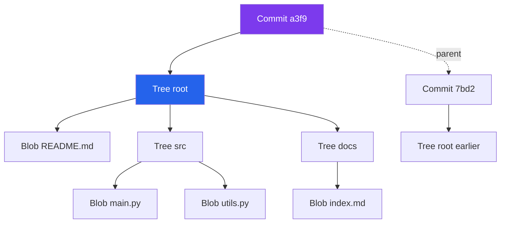
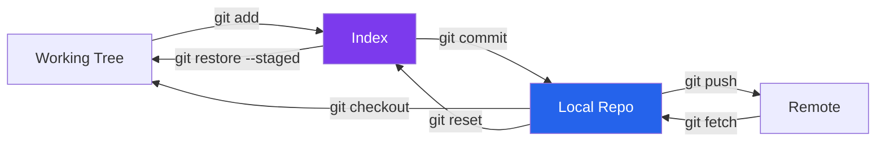
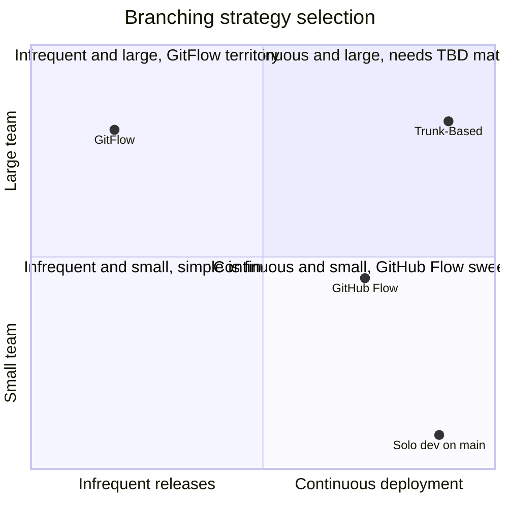
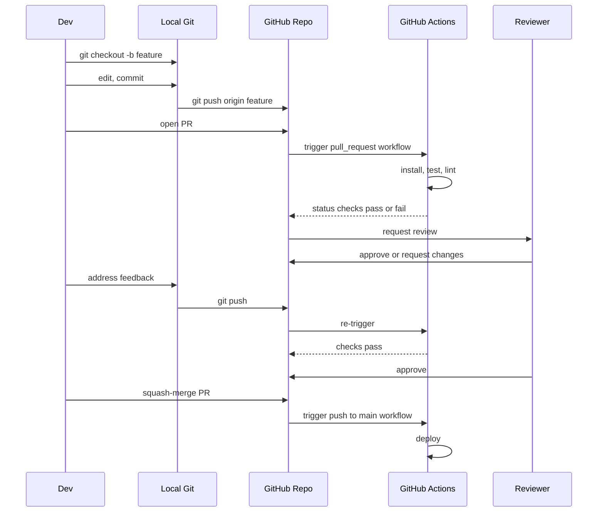
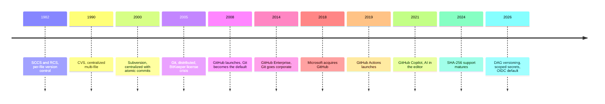

# Git and GitHub: The Complete Mental Model for Working with Code

There's a joke that every developer has the same relationship with Git: you know six commands, you use them on autopilot, and once a year something goes wrong and you Google "git undo everything" in a panic. The joke is funny because it's true, and it's true because Git has a reputation for being impenetrable. That reputation is half-deserved. The interface is a crime against UX. But the underlying data model — the thing all the commands are manipulating — is small, elegant, and worth understanding once so you can stop guessing for the rest of your career.

This is the long version of the Git and GitHub post I wish I'd read in 2015. It covers how Git actually stores your code (four object types, a directed graph, and some pointers), what every command that matters is really doing under the hood, how to recover from the disasters you will eventually cause yourself, the branching strategy debates and which one is right for your team, everything GitHub adds on top of Git (pull requests, reviews, organizations, permissions), GitHub Actions from the ground up with security gotchas, and the dark corners where Git's abstractions leak (LFS, submodules, line endings, case-insensitive filesystems).

It is deliberately long. Git and GitHub are the plumbing of the entire profession, and there is no shortcut to understanding them well. If you're a senior engineer and some of this is review, the middle sections on Actions and disasters may still be worth skimming. If you're learning, read it end to end.

## Part 1 — What Git Actually Is

### The one-sentence summary

Git is a **content-addressable filesystem** with a **history of snapshots** laid out as a **directed acyclic graph**, with a thin layer of **human-readable references** pointing into that graph. Every feature of Git is a consequence of those four nouns. Let's unpack them.

"Content-addressable" means Git stores every piece of data under a key that is derived from the data's hash (historically SHA-1, now transitioning to SHA-256 in newer repos). If you change one byte, the hash changes, so it's a different piece of data with a different address. This sounds esoteric; its consequences are enormous. Renames are free (the content didn't change, so the same blob is reused). Deduplication is automatic (two identical files, even in different directories, are stored once). Corruption is detectable (the hash either matches the content or it doesn't). History is tamper-evident (changing any past commit changes every hash downstream of it).

"History of snapshots" is the part most people get wrong. Git does **not** store diffs between versions. It stores a complete snapshot of your project at every commit. Diffs are computed on demand when you ask for them. This is the opposite of how Subversion or CVS worked, and it's why Git operations on history are so fast: there's no chain of patches to reconstruct.

"Directed acyclic graph" means each commit points to its parent (or parents, for merges), and parents never point back. The whole history of your project is a graph you can walk from any commit back to the root.

"Human-readable references" are branch names, tag names, and `HEAD` — little files in `.git/refs/` that contain a commit hash. "The `main` branch is at commit `a3f9e2b`" means literally that the file `.git/refs/heads/main` contains the string `a3f9e2b`. When you commit, Git updates that file. That's the whole branch concept.

Once you see Git this way, the rest of it is just commands that read and write these four things.

### The four object types

Inside `.git/objects/`, Git stores four kinds of objects. You will hear about all four; only three show up daily.

**Blob.** A blob is the content of a single file. Nothing else. No name, no permissions, no path — just the bytes. A blob is identified by the hash of its content. If you commit `README.md`, Git creates a blob containing the file's bytes and stores it at `.git/objects/a3/f9e2b...` (the first two hex chars are the directory, the rest is the filename, for filesystem efficiency).

**Tree.** A tree represents a directory. It's a list of entries, where each entry is `(mode, type, hash, name)`. The mode is the file permission, the type is `blob` or `tree`, the hash points to another object, and the name is the filename. So a tree is "this directory contains these files (blobs) with these names and these subdirectories (other trees) with those names." Recursively, trees describe the entire filesystem at a point in time.

**Commit.** A commit is a tiny object that points to a single tree (the root of your project at that moment) plus some metadata: the author, the committer, the message, the timestamp, and most importantly, the hash of the parent commit (or commits, for merges). The commit *is* the snapshot — pointing to a tree is pointing to the entire state of the project.

**Tag.** An annotated tag object is a named pointer to another object (usually a commit) with its own metadata (author, message, GPG signature). Most of the time you don't need to care — lightweight tags are just refs with no associated object at all.

The beautiful consequence: **a commit plus recursive tree traversal is a complete project snapshot**, and commits form a DAG, so Git has the entire history of your project as a graph of snapshots, each one a fully formed state you can check out instantly.



### Refs and HEAD

Refs are just files in `.git/refs/` containing a commit hash. Branches live in `.git/refs/heads/`. Tags live in `.git/refs/tags/`. Remote-tracking branches live in `.git/refs/remotes/`. When you run `git branch feature-x`, Git creates a file `.git/refs/heads/feature-x` containing the current commit hash. When you commit on that branch, Git writes the new commit to `.git/objects/` and updates `.git/refs/heads/feature-x` to point at it. That's all that happens.

`HEAD` is a special ref that usually points at a branch ref (this is called "attached HEAD"). `.git/HEAD` contains `ref: refs/heads/main`, which means "HEAD is currently tracking the main branch." When you commit, Git updates HEAD transitively by updating whatever branch it points to. If HEAD contains a commit hash directly instead of a `ref:` line, you're in "detached HEAD" state — you're sitting on a specific commit with no branch pointing at it, and new commits you make will not be reachable from any branch. This is why "detached HEAD" is so scary the first time you see it: the commits you make there are essentially invisible unless you explicitly create a branch before switching away.

### The index: Git's third state

Almost every Git tutorial talks about two states: the working tree (the files on disk) and the repository (committed history). This is wrong. There are three, and the middle one — the **index**, also called the **staging area** — is where most of Git's commands live.

The index is a file at `.git/index` that represents the state of the next commit you're going to make. When you run `git add README.md`, Git reads the current content of `README.md` from your working tree, creates a blob for it in `.git/objects/`, and updates the index to say "the next commit's root tree should contain a blob with this hash under the name README.md." The actual tree and commit objects are only written when you run `git commit`.

This is why `git add` is not the same as "queue this for committing later." It's "snapshot the content now and remember the snapshot in the index." If you `git add`, then edit the file more, then `git commit`, the commit contains the *first* version, not the current one on disk — because you only added that first version to the index. This surprises people once, and then they understand the index forever.

### The three states and the commands that move between them

Every Git operation can be understood as moving data between three places: the working tree, the index, and the repository (plus sometimes a remote).



Once you have this picture in your head, the commands name themselves:

- `git add` moves changes from working tree into the index.
- `git commit` moves the index into a new commit in the repo.
- `git push` uploads commits to a remote.
- `git fetch` downloads commits from a remote into your local repo, without touching your working tree.
- `git pull` is `git fetch` followed by `git merge` (or `git rebase`, depending on config).
- `git checkout` (or `git switch`/`git restore`) copies content from the repo back into the working tree.
- `git reset` moves the current branch ref to a different commit and optionally updates the index and working tree.

Every command in the next section is some combination of these moves.

## Part 2 — Commands That Make Sense Once You Know the Model

I'm going to skip `git init` and `git clone` because they do what they say. The commands worth understanding properly are the ones that confuse people.

### git status, git diff, git log

Three read-only commands you should run constantly.

`git status` compares three things: your working tree vs the index, and your index vs HEAD. It tells you what's modified but not staged, what's staged but not committed, and what's untracked entirely. When something weird is happening, `git status` is always your first move.

`git diff` without arguments compares working tree to index. `git diff --staged` compares index to HEAD. `git diff main..feature-x` compares two commits. These three forms cover 95% of the real diffs you'll want.

`git log` walks the commit DAG from HEAD backwards. The form I actually use is `git log --oneline --graph --decorate --all`, which shows every branch and tag visually. Alias it. Mine is `git lg`. It's the difference between "Git history is incomprehensible" and "Git history is a graph I can read."

### git reset: the command people fear

`git reset` is the most misunderstood command in Git, because it does one thing but has three modes and people confuse it with "undo."

What it actually does: move the current branch's ref to point at a different commit. That's it. The three modes control what else happens.

**`git reset --soft <commit>`** moves the branch ref. Nothing else changes. Your working tree is untouched, your index is untouched. All the changes that *were* in the commits between the old and new positions are now sitting in your index as if you had staged them. This is how you "undo the last commit but keep the changes staged" — `git reset --soft HEAD~1`.

**`git reset --mixed <commit>`** (the default) moves the branch ref *and* updates the index to match the target commit. Your working tree is untouched, so the changes are still there, but they're no longer staged. This is "undo the last commit and unstage the changes" — `git reset HEAD~1`.

**`git reset --hard <commit>`** moves the branch ref, updates the index, *and* overwrites the working tree to match. Any uncommitted changes are destroyed. This is the dangerous one. If you run `git reset --hard` with uncommitted work and no backup, that work is gone from your working tree. It might still be recoverable via reflog (see later), but "might" is not something you want in your workflow.

Rule: **never `--hard` unless you're sure**. Use `--soft` or `--mixed` when you just want to rewind the branch pointer.

### git checkout vs git switch vs git restore

For years, `git checkout` was overloaded: it could switch branches, create branches, restore files, restore a file at a specific commit, enter detached HEAD, and more. Confusing. Git 2.23 (2019) introduced two new commands to split the responsibility:

- `git switch` is "change which branch I'm on." `git switch main`, `git switch -c new-feature`.
- `git restore` is "change files back to some state." `git restore README.md` (revert working tree to index). `git restore --staged README.md` (unstage).

`git checkout` still exists and still does both things, so old muscle memory works. For new users, prefer `switch` and `restore` — they're clearer.

### git merge vs git rebase

These do the same abstract thing (combine the work of two branches) with very different mechanics.

**Merge** creates a new "merge commit" that has two parents: the tip of the current branch and the tip of the branch you're merging in. History becomes a graph with diamond shapes at merge points. Nothing is rewritten. The entire development history is preserved faithfully, warts and all.

**Rebase** takes the commits on your current branch that aren't on the target branch, "replays" them on top of the target branch, and moves the current branch ref to the new tip. History becomes linear. But the commits are rewritten — they have new hashes, new parents, and new timestamps. The original commits still exist in Git's object storage (until garbage collected), but they're no longer reachable from any branch.

Which is better? It depends on who you ask and on the branch. The consensus I've landed on after many team fights:

- **Merge into long-lived shared branches** (like `main`). This preserves the fact that a feature was developed separately and merged as a unit.
- **Rebase your own feature branches onto main** before merging them. This gives you a clean, linear local history to review, keeps the commit history tidy, and lets you resolve conflicts incrementally rather than in one giant merge.
- **Never rebase commits you've already pushed to a shared branch.** Rebasing rewrites history, and if someone else has based work on the old history, you've just created a fork in the timeline they'll have to fix manually.

The "golden rule of rebase" is simple: rewrite history that only you have. Don't rewrite history other people are using.

### git cherry-pick

`git cherry-pick <commit>` takes a specific commit from somewhere else and applies it as a new commit on your current branch. It's the scalpel of Git — useful for backporting a bug fix to a release branch, or for pulling one commit out of a feature branch without taking all of it. The new commit has a different hash than the original because it has a different parent.

### git stash

`git stash` saves your current uncommitted changes (both working tree and index) to a stack, then resets your working tree to clean. You can then switch branches, run tests, whatever, and later `git stash pop` to bring the changes back. It's the "I need to switch context but I'm not ready to commit" tool.

Gotcha: stashes are not in your branch's history. If you forget about a stash for six months and then `git gc`, you might lose it. Don't treat stash as long-term storage; treat it as "I'll come back to this in fifteen minutes."

### git reflog: the safety net

Here is the single most important command for recovering from disasters, and hardly anyone knows about it. Git keeps a log of every time HEAD moves — every commit, checkout, merge, reset, rebase, everything. This log lives in `.git/logs/HEAD` and you view it with `git reflog`. Each entry has a reference like `HEAD@{5}` meaning "where HEAD was 5 moves ago."

If you run `git reset --hard` and destroy commits, those commits are still in `.git/objects/` until garbage collection runs (default: 30 days for unreachable objects, 90 days for older ones). They're just not reachable from any ref. You can find them with `git reflog`, see their hashes, and recover them with `git reset --hard <hash>` or `git checkout <hash>` and create a new branch.

If you take one thing from this whole section, take this: **almost nothing is ever truly lost in Git**. The reflog gives you about a month of "undo" for everything you did locally, as long as you don't actively garbage collect. When in doubt, check the reflog before panicking.

## Part 3 — The Disasters and How to Recover

Every Git user eventually runs into the same handful of catastrophes. Knowing the recovery path in advance is the difference between "oh, that's annoying" and "I lost a day of work."

### "I committed to the wrong branch"

You meant to be on `feature-x` but you were on `main`. You committed. The commit is on `main`.

**Recovery:**
```bash
# while still on main
git log --oneline -1         # note the commit hash, call it <hash>
git reset --soft HEAD~1      # undo the commit on main, keep changes staged
git stash                    # tuck the changes away
git switch feature-x         # go to the right branch
git stash pop                # bring the changes back
git commit -m "..."          # commit properly
```

Alternatively, if you already pushed to main, use `git revert` to undo the push with a new commit, then cherry-pick onto the correct branch.

### "I accidentally `git reset --hard`"

You ran `git reset --hard` and destroyed uncommitted changes or commits.

**Recovery:**
```bash
git reflog                                # find the commit hash from before the reset
git reset --hard HEAD@{1}                 # or whatever entry in the reflog
# or recover a specific commit
git checkout -b recovered <commit-hash>
```

Works as long as the commits existed and reflog still has them (within ~30 days).

### "I force-pushed and someone else's commits are gone"

You ran `git push --force` and erased commits other people had made. Git on the server accepted the push and overwrote the branch.

**Recovery is harder** because the server-side ref has moved, but GitHub keeps a reflog-like history of pushes for every ref. Go to the repo's `Activity` → `Branch` history, find the prior tip, and either:
- Ask the person whose commits were erased to re-push from their local copy (usually the fastest fix), or
- On GitHub Enterprise, use the branch audit log to recover the ref.

**Prevention:** use `git push --force-with-lease` instead of `--force`. `--force-with-lease` only succeeds if the remote is at the commit you *think* it's at. If someone else has pushed in between, the command fails and you don't overwrite them. There is almost never a reason to use `--force` in 2026; `--force-with-lease` should be muscle memory.

### "I have a merge conflict and I don't understand it"

Git shows conflict markers like `<<<<<<< HEAD`, `=======`, `>>>>>>> feature-x` in the conflicting files. The recovery loop:

1. Run `git status` to see which files conflict.
2. Open each conflicting file, find the markers, and decide what the final content should be. The content between `<<<<<<< HEAD` and `=======` is from the current branch; between `=======` and `>>>>>>>` is from the incoming branch.
3. Remove the markers and save.
4. `git add <file>` to mark it resolved.
5. Once all conflicts are resolved, `git commit` (for merges) or `git rebase --continue` (for rebases).

If you get in over your head and want to bail out:
- During merge: `git merge --abort`
- During rebase: `git rebase --abort`
- During cherry-pick: `git cherry-pick --abort`

These restore your working tree to the state before you started the operation.

### "I'm in detached HEAD and I made commits"

You ran `git checkout <commit-hash>` to look at an old version, made some fixes, committed them, and now realize those commits aren't on any branch.

**Recovery:**
```bash
git branch rescue-branch    # creates a branch at HEAD, which is where your commits are
git switch main
git merge rescue-branch     # or cherry-pick, or rebase
```

As long as you do this *before* switching away, the commits are still reachable from HEAD. If you already switched away, use `git reflog` to find the hash and create a branch there.

### "I want to undo a commit that's already been pushed"

Don't rewrite history — use `git revert <commit>`. This creates a new commit that undoes the changes of the target commit. The history stays honest: the bad commit is still there, followed by a revert commit. This is the safe way to back out a mistake on a shared branch.

### "My history is a mess and I want to rewrite it"

Before merging a feature branch, you want to clean up: combine fixup commits, reorder, rewrite messages. Use **interactive rebase**:

```bash
git rebase -i main
```

This opens your editor with a list of commits. For each commit, you can change the action keyword:
- `pick` — use the commit as is
- `reword` — use it but edit the message
- `edit` — stop so you can amend the commit
- `squash` — combine with the previous commit, keeping both messages
- `fixup` — combine with the previous commit, discarding this commit's message
- `drop` — remove the commit entirely

Save, close the editor, and Git replays the commits according to your instructions. This is the single most powerful Git feature for producing clean, reviewable history, and it's entirely local — use it freely on branches you haven't shared yet.

## Part 4 — Branching Strategies

There are dozens of "flows" and a lot of religious war about which is best. Practically speaking, three dominate.

### GitFlow

Introduced by Vincent Driessen in 2010, GitFlow was designed for versioned desktop software with scheduled releases. It has:

- `main` — always the current production release
- `develop` — integration branch for the next release
- `feature/*` — one per feature, branched from and merged back to `develop`
- `release/*` — when `develop` is feature-complete for a release, a `release/*` branch is cut, stabilized, and eventually merged to `main` and back to `develop`
- `hotfix/*` — emergency fixes branched from `main`, merged to both `main` and `develop`

It's structured, ceremonious, and well-suited to shipping versioned installable software where you need multiple releases in flight at once. It is **completely wrong** for most modern web/SaaS teams that deploy continuously and only have one version in production. Even Driessen said in 2020 that GitFlow was probably the wrong default for most teams today.

Use it if: you ship desktop software with multi-version support, you have heavy QA gates, or you're legally required to maintain release branches for compliance.

### GitHub Flow

Much simpler:

- `main` is always deployable
- Create a feature branch from `main`
- Work on it, push it, open a PR
- Review and CI run on the PR
- Merge to `main`, deploy

One long-lived branch, short-lived feature branches, PRs as the review mechanism. This is the default for the vast majority of teams today. It assumes you can deploy from `main` at any time, which assumes you have CI, automated tests, and feature flags for in-flight work. If you have those, GitHub Flow is probably the right answer.

### Trunk-Based Development

Even simpler than GitHub Flow. Everyone commits directly to `main` (or to very short-lived branches merged the same day). Incomplete features live behind feature flags so they can be merged to `main` without being visible to users. DORA research consistently shows that elite-performing engineering teams use trunk-based development.

The catch: trunk-based requires excellent automated testing, feature flag infrastructure, and a team culture comfortable with "my code is on main before it's fully done." If you don't have those, it's a nightmare. If you do, it's the highest-velocity workflow available.



My working rules: start with GitHub Flow. Move to Trunk-Based if you find that PRs are becoming a bottleneck and your CI is trustworthy. Only use GitFlow if you have genuine multi-version support requirements.

## Part 5 — What GitHub Adds on Top

Git is a distributed version control system; GitHub is a platform built around a Git server. Git by itself has no concept of pull requests, reviews, issues, actions, organizations, permissions, or any of the things most people think of as "Git." Those are all GitHub.

### Repositories, forks, and clones

A **repository** on GitHub is a Git repo plus metadata (issues, PRs, wiki, settings). A **clone** is your local copy of a repo (created with `git clone`). A **fork** is a GitHub-level copy of someone else's repo under your account, linked back to the original, used for contributing to projects you don't have write access to.

The fork-and-PR model works like this: you fork a repo, clone your fork locally, make a branch, push it to your fork, open a PR from your fork's branch to the upstream repo's main branch. Maintainers review it and merge (or don't). This is the foundational workflow of open source on GitHub.

### Pull requests

A pull request is a GitHub concept, not a Git concept. When you open a PR, GitHub creates a comparison between your branch and a target branch, runs whatever CI you have configured, collects reviews and comments, and provides a UI for discussing and eventually merging the change. The "merge" button at the bottom can do one of three things depending on the repo's settings:

- **Merge commit** — creates a merge commit on the target branch, preserving the full history of the feature branch. Honest but messy.
- **Squash and merge** — takes all the commits on the feature branch, squashes them into one commit, and adds that commit to the target. Clean history but loses the incremental detail.
- **Rebase and merge** — replays each commit from the feature branch on top of the target. Linear history, preserves individual commits, but rewrites their hashes.

My preference is squash-and-merge for most teams. It keeps `main` history clean with one commit per logical change (one PR = one commit), and the original commits are still viewable in the PR itself if anyone needs to archaeologize. Rebase-and-merge is second choice for teams that want per-commit granularity on main.

### Code review, comments, and approvals

Every PR has a review surface. Reviewers can leave line-by-line comments, suggest specific code changes (which the author can accept with one click), request changes (blocking merge), or approve. GitHub's review system is the de facto standard for how the entire industry does code review, and it's the single most load-bearing quality-control mechanism in most codebases.

A few patterns that separate good PR hygiene from bad:

- **Small PRs are better than large PRs.** A 200-line PR gets reviewed seriously; a 2000-line PR gets rubber-stamped. Split work.
- **Draft PRs exist** for work-in-progress you want feedback on before it's ready for full review. Use them instead of pinging reviewers on branches.
- **Write the PR description like a reviewer is going to read it cold** — because they are. Context, what changed, how to test, screenshots if UI is involved.
- **Respond to every comment**, even with just "done" or "disagreed, here's why." Silence kills reviews.

### Issues, milestones, projects

GitHub also has an issue tracker, milestones (bundles of issues for a release), and Projects (Trello-like kanban boards). Whether you use these or prefer Linear/Jira/Notion is up to you. The main advantage of GitHub Issues is that they're right next to the code and trivially linkable from commits (`Fixes #123` in a commit message auto-closes the issue when merged).

### Organizations, teams, and permissions

A GitHub **organization** is a shared account that owns repositories and members. Members belong to **teams** (you can nest them), and permissions are granted to teams on repos or on specific paths via CODEOWNERS files.

The permissions model is tiered:

- **Read** — can view, clone, and fork
- **Triage** — read plus manage issues and PRs without write access
- **Write** — can push to non-protected branches
- **Maintain** — write plus some admin (no sensitive settings)
- **Admin** — full control of the repo

For orgs, the important machinery is:
- **Branch protection rules** on important branches (require PR, require CI to pass, require reviews, prevent force-pushes, require signed commits).
- **CODEOWNERS** file at the repo root, declaring which teams own which paths. PRs that touch those paths auto-request reviews from the owners.
- **SAML SSO + enforced 2FA** at the org level for security.
- **Audit log** for tracking what members are doing.

If you're running an org, turn on branch protection on `main` from day one. Require at least one review. Require status checks to pass. Prevent force pushes. These settings take five minutes to configure and prevent 90% of the organizational disasters.

## Part 6 — GitHub Actions: CI/CD Native

GitHub Actions is GitHub's built-in CI/CD system. It's configured via YAML files in `.github/workflows/` and runs on GitHub's hosted runners or on self-hosted runners you manage.

### Anatomy of a workflow

A workflow is a YAML file. The minimum is a name, a trigger, and some jobs:

```yaml
name: CI

on:
  push:
    branches: [main]
  pull_request:

jobs:
  test:
    runs-on: ubuntu-latest
    steps:
      - uses: actions/checkout@v4
      - uses: actions/setup-python@v5
        with:
          python-version: "3.12"
      - run: pip install -r requirements.txt
      - run: pytest
```

Key concepts:

- **Workflow** — the entire YAML file
- **Trigger** (`on:`) — what event causes the workflow to run (push, PR, schedule, manual, etc.)
- **Job** — a set of steps that run on a single runner
- **Step** — a single action or shell command
- **Runner** — the virtual machine that executes the job (GitHub provides Ubuntu, Windows, macOS; you can also self-host)
- **Action** — a reusable unit of work, versioned, usually published to the Actions Marketplace

Jobs run in parallel by default. If one job depends on another, use `needs:`:

```yaml
jobs:
  test:
    runs-on: ubuntu-latest
    steps: [...]
  
  deploy:
    needs: test
    runs-on: ubuntu-latest
    if: github.ref == 'refs/heads/main'
    steps: [...]
```

### Triggers

The most common triggers:

- `push` — runs on every push to specified branches
- `pull_request` — runs on PR open, synchronize, or reopen
- `workflow_dispatch` — manual trigger from the UI or API
- `schedule` — cron-style schedule (for nightly jobs)
- `release` — when a release is published
- `workflow_call` — for reusable workflows called by other workflows
- `workflow_run` — chained to the completion of another workflow

You can combine multiple triggers in one workflow, and you can filter by branch, tag, path, and more. The `paths:` filter is especially useful for monorepos — only run the frontend workflow if frontend files changed.

### Matrix builds

When you want to run the same job across multiple configurations:

```yaml
jobs:
  test:
    runs-on: ${{ matrix.os }}
    strategy:
      matrix:
        os: [ubuntu-latest, macos-latest, windows-latest]
        python: ["3.10", "3.11", "3.12"]
    steps:
      - uses: actions/checkout@v4
      - uses: actions/setup-python@v5
        with:
          python-version: ${{ matrix.python }}
      - run: pytest
```

This creates 9 parallel jobs (3 OSes × 3 Python versions). Matrix builds are the bread and butter of cross-platform testing.

### Reusable workflows vs composite actions

Once you have more than a couple of workflows, you want to avoid duplication. Two mechanisms exist:

**Composite actions** are small, reusable units of steps. You define them in an `action.yml` file and reference them like any other action (`uses: ./.github/actions/setup-env`). They're good for small repeated step sequences: "check out, set up Python, install deps." Lightweight.

**Reusable workflows** are entire workflows that other workflows can call via `workflow_call`. They're good for large shared pipelines: "build-test-deploy for any service in our monorepo." Heavier, but support secrets, outputs, and proper versioning.

Rule of thumb from GitHub's own guidance: **composite actions for small repeated steps, reusable workflows for big shared pipelines**. Use both.

A reusable workflow example:

```yaml
# .github/workflows/deploy.yml
name: Reusable Deploy
on:
  workflow_call:
    inputs:
      environment:
        required: true
        type: string
    secrets:
      DEPLOY_TOKEN:
        required: true

jobs:
  deploy:
    runs-on: ubuntu-latest
    environment: ${{ inputs.environment }}
    steps:
      - run: ./deploy.sh --env ${{ inputs.environment }}
        env:
          TOKEN: ${{ secrets.DEPLOY_TOKEN }}
```

```yaml
# .github/workflows/release.yml
jobs:
  deploy-staging:
    uses: ./.github/workflows/deploy.yml
    with:
      environment: staging
    secrets:
      DEPLOY_TOKEN: ${{ secrets.STAGING_DEPLOY_TOKEN }}
```

### Secrets, environments, and OIDC

Secrets in GitHub Actions are stored encrypted and injected into workflows via `${{ secrets.NAME }}`. They come in three scopes:

- **Repository secrets** — available to all workflows in a repo
- **Environment secrets** — scoped to a named environment (like `production`), which can have protection rules (required reviewers, wait timers)
- **Organization secrets** — shared across repos in an org

The modern pattern for cloud credentials is **OIDC (OpenID Connect)** — instead of storing long-lived AWS or GCP credentials as secrets, your workflow presents a short-lived OIDC token to the cloud provider, which exchanges it for temporary credentials. This is dramatically safer: there's no static secret to leak. If you're deploying to AWS/GCP/Azure from Actions and still using static keys, migrate to OIDC. It's a one-time setup and the security win is enormous.

### The CI/PR dance

Here's what the full PR + CI flow looks like in practice:



This is the loop your entire engineering process is built around. Every piece of it is configurable, and the configuration lives in `.github/workflows/` in your repo, versioned alongside your code.

### Security best practices for Actions

Actions are powerful, which means they're also a security surface. The patterns that matter:

**Pin actions to a commit SHA, not a tag.** Tags can be moved; commits can't. `uses: actions/checkout@v4` is a tag reference and the owner of that action can push a new commit under `v4` that contains malicious code. `uses: actions/checkout@11bd71901bbe5b1630ceea73d27597364c9af683` is pinned to a specific commit and cannot be changed under you. For public actions you don't control, always pin to SHA. Dependabot can update pinned SHAs for you.

**Sanitize user input.** Workflow triggers from `pull_request` include user-supplied fields (PR titles, commit messages, branch names). If you interpolate these directly into a `run:` block with `${{ github.event.pull_request.title }}`, an attacker can inject shell commands. Pass user data through environment variables instead: `run: echo "$TITLE"` with `env: { TITLE: ${{ github.event.pull_request.title }} }`.

**Set minimum permissions.** Every workflow gets a `GITHUB_TOKEN` automatically, and by default it has broad write permissions. Add `permissions:` at the top of the workflow and restrict it:

```yaml
permissions:
  contents: read
  pull-requests: write
```

Most workflows only need `contents: read`. Explicit permissions are a cheap, huge defense-in-depth win.

**Use environments with protection rules for production deploys.** Require manual approval, restrict to specific branches, add wait timers. Environments are the right place to gate access to production, not inline `if:` conditions.

**Beware `pull_request_target`.** This trigger runs with the base branch's secrets available — unlike `pull_request`, which runs in a restricted context. `pull_request_target` is useful for certain cases (like auto-labeling PRs), but if you check out the PR's code and run it with `pull_request_target`, you've handed repo write access to anyone who can open a PR. Use with extreme care or not at all.

GitHub's 2026 security roadmap is tightening several of these defaults — scoped secrets, deterministic dependency resolution, stricter permission inheritance for reusable workflows. If you're starting fresh in 2026, lean into these defaults even if they feel restrictive.

## Part 7 — Working in Open Source and Organizations

If you're contributing to an open source project or working in a larger org, there are a few additional mechanisms to know.

### Fork-based contribution

When you don't have write access to a repo, the standard pattern is:

1. Fork the repo to your account (one-click on GitHub).
2. Clone your fork: `git clone git@github.com:<you>/<repo>.git`.
3. Add the original repo as a second remote: `git remote add upstream git@github.com:<original>/<repo>.git`.
4. Create a branch: `git checkout -b my-fix`.
5. Work, commit, push to your fork: `git push origin my-fix`.
6. Open a PR from `<you>:my-fix` to `<original>:main`.

Keep your fork in sync with upstream:

```bash
git fetch upstream
git checkout main
git merge upstream/main
git push origin main
```

### DCO, CLA, and contribution licensing

Many projects require contributors to sign a **DCO (Developer Certificate of Origin)** — a sign-off line in each commit (`Signed-off-by: Your Name <email>`) that attests you have the right to contribute the code. `git commit -s` adds this automatically.

Others require a **CLA (Contributor License Agreement)** — a one-time legal agreement assigning copyright or granting a license to the project. CLAs are typically signed via a bot (CLA Assistant, EasyCLA) that comments on your first PR asking you to agree.

If you're maintaining a project, DCO is lighter-weight and preferred unless your legal context demands a CLA.

### CODEOWNERS and required reviews

A `CODEOWNERS` file at the repo root (or in `.github/`) lets you declare which teams own which paths:

```
# .github/CODEOWNERS
*              @my-org/platform-team
/frontend/     @my-org/frontend-team
/infra/        @my-org/infra-team @my-org/security-team
*.py           @my-org/python-guild
```

Any PR touching `/frontend/` automatically requests review from the frontend team. Combined with branch protection requiring owner review, this scales code review to large orgs without manual dispatching.

### Branch protection: the checklist

For any repo that matters in an organization, branch protection on `main` should include:

- Require a pull request before merging
- Require at least 1 approval (2 for critical repos)
- Dismiss stale approvals when new commits are pushed
- Require review from Code Owners
- Require status checks to pass (list the CI jobs that matter)
- Require branches to be up to date before merging
- Require signed commits (for high-security projects)
- Do not allow force pushes
- Do not allow deletions

These settings exist in `Settings → Branches → Branch protection rules`. Turn them on. The five minutes you spend is the cheapest insurance in engineering.

## Part 8 — Commit Hygiene and Collaboration Practices

A few opinions worth having about how you write and organize commits.

### Commit message conventions

The Conventional Commits format has become the de facto standard:

```
<type>(<scope>): <short summary>

<optional body>

<optional footer>
```

Types: `feat`, `fix`, `docs`, `style`, `refactor`, `perf`, `test`, `build`, `ci`, `chore`, `revert`.

Example:
```
feat(auth): add OIDC login flow for Google Workspace

Introduces a new provider in the auth module that handles the
Google Workspace SSO handshake, plus a migration for the
user_providers table.

Closes #842
```

Tools like `commitlint` can enforce the format in CI. Release tools like `semantic-release` can auto-generate changelogs and version bumps from Conventional Commits. Even without the tooling, consistent commit messages make history readable six months later, which is the whole point.

### Atomic commits

A good commit does one thing. If your commit message would naturally be "X and Y," it's two commits. Atomic commits make `git bisect` work (more on that in a second), make `git revert` safe, and make code review tractable.

Corollary: use `git add -p` (patch mode) to stage hunks selectively. When you've been hacking on something for an hour and have 15 unrelated changes in your working tree, `git add -p` lets you commit them as clean atomic commits instead of one giant blob.

### git bisect: the underrated debugging tool

When a bug appears in your current code but worked three weeks ago, `git bisect` is how you find the commit that introduced it. You mark a known-good commit and a known-bad commit, and Git performs a binary search through the commits in between, asking you to test each midpoint:

```bash
git bisect start
git bisect bad                    # current commit is broken
git bisect good v1.4.0            # this tag was fine
# Git checks out a commit halfway between; you test it
git bisect good                   # or git bisect bad
# repeat until Git identifies the culprit
git bisect reset
```

If your tests are automated, you can fully automate bisect with `git bisect run <test-command>`. Git will run the test at each step and converge on the first failing commit without you lifting a finger. For non-trivial regressions, this turns a day of debugging into fifteen minutes.

### .gitignore and .gitattributes

Two files worth knowing:

- **`.gitignore`** tells Git which files to skip. Never commit build artifacts, secrets, local config, or node_modules. Use `gitignore.io` to generate a sensible starting file for your stack.
- **`.gitattributes`** tells Git how to handle specific files: line endings (`* text=auto eol=lf`), binary detection, merge strategies, and LFS tracking. The single most useful thing is `* text=auto eol=lf` in cross-platform repos to normalize line endings.

## Part 9 — The Dark Corners

A few places where Git's abstractions leak. Knowing them in advance saves real pain.

### Large files and Git LFS

Git is optimized for text files that diff well. When you commit a 200 MB binary, the entire repo has to carry that blob forever, and every clone downloads it. Within a few dozen large binaries, your repo is gigabytes and cloning takes ten minutes.

**Git LFS (Large File Storage)** solves this by storing large files in a separate blob store and keeping only a small pointer in Git. It's a separate tool (`git lfs install`) that hooks into Git's clean/smudge filters. Track patterns with `git lfs track "*.psd"`, and LFS handles the rest.

Gotchas: LFS requires server-side support (GitHub has it, most self-hosted Git servers do too). LFS storage costs money beyond a free quota. Cloning takes longer on first fetch. And once you've added a file to LFS, migrating *out* of LFS is painful. Set up LFS early for any repo that will have large binary assets.

### Submodules: the thing you probably shouldn't use

A Git submodule is a Git repo nested inside another Git repo. The parent repo tracks the submodule by recording a specific commit hash, not by pulling in the content. This sounds useful — until you try to live with it.

Problems: cloning doesn't automatically pull submodules (`git clone --recurse-submodules`). Branches in the parent repo don't naturally bump the submodule commit. Rebasing across submodule boundaries is a nightmare. New contributors universally hate them.

Modern alternatives are almost always better: monorepos with a single history, package managers (pip, npm, cargo) for actual dependencies, or Git subtrees for code you want to vendor. Unless you have a specific reason you need submodules and understand the pain, don't use them.

### Line endings on Windows

Windows uses CRLF (`\r\n`) for line endings; Unix uses LF (`\n`). Git's `core.autocrlf` setting tries to handle this automatically, and failure modes include "every file looks modified" and "my text file is corrupt."

The modern best practice is to set this in `.gitattributes` at the repo level and ignore the per-user `core.autocrlf` setting:

```
* text=auto eol=lf
*.sh text eol=lf
*.bat text eol=crlf
*.png binary
```

This says "normalize text files to LF in the repo, detect binaries automatically, keep `.sh` as LF always, keep `.bat` as CRLF always." Commit this file to the root of any cross-platform repo from day one.

### Case-insensitive filesystems

macOS (by default) and Windows use case-insensitive filesystems. Linux does not. If you commit `README.md` and later also commit `readme.md` from Linux, Git sees two files. On macOS/Windows, checking out both is impossible — the second one overwrites the first. Tests pass on Linux CI and fail on a Mac developer's machine. This is a real source of bugs.

Fix: either set `core.ignorecase = false` and be disciplined about casing, or add a CI check that rejects case collisions.

### The `.git/` directory is sacred

Don't edit files in `.git/` directly unless you know exactly what you're doing. Don't copy `.git/` between machines expecting it to work (it will, but you lose the connection to remotes). Don't commit `.git/` into another repo (yes, people do this). The directory is Git's internal state, and the moment you corrupt it, your repo may be unrecoverable except from backups.

## The Evolution of Version Control

A brief history, because understanding how Git got here clarifies why it is the way it is.



Linus Torvalds wrote Git in April 2005 in about two weeks, after the Linux kernel team lost access to BitKeeper. He was aggressively dismissive of existing options (CVS, Subversion, Mercurial) and designed Git around three principles: speed, distributed trust, and strong integrity via content-addressing. The UX was an afterthought, which is why the commands feel the way they feel. The model is brilliant; the interface is the consequence of "I needed this to work by next week."

GitHub, founded in 2008, is what made Git mainstream. Git before GitHub was kernel-developer tooling; Git after GitHub became the foundation of the modern software industry. The fork-and-PR workflow that now defines open source collaboration did not exist before GitHub created it.

## Honest Limits

Git is not the last word in version control. A few things it genuinely struggles with:

- **Very large repos.** Git's data model scales to gigabytes of text but starts to struggle above 10-20 GB of history. Google, Facebook, and Microsoft all built custom extensions or migrated to different systems (Piper, Mercurial with extensions, VFS for Git). If your repo is hitting these limits, investigate partial clone, sparse checkout, and VFS rather than fighting Git.
- **Binary merge.** Git can't meaningfully merge binary files. Two people editing the same Photoshop file is a lose-lose.
- **Permissions and line-of-business metadata.** Git tracks content, not access control, ticketing, or approval chains. GitHub adds these, but they're above the Git layer.
- **Diff quality on non-code.** Markdown, prose, notebooks, JSON — Git can diff them, but the diffs are often unhelpful. There are better tools for specific formats (nbdime for Jupyter, semantic-diff for JSON).

These are not reasons to avoid Git. They're places where you should consider layering additional tools rather than fighting Git's model.

## Closing

If you read this whole post, you now understand Git and GitHub better than most of the industry does. That's a genuine career asset. The gap between "uses Git from muscle memory and panics when things break" and "can reason about what Git is doing and fix any state" is a surprisingly short learning curve — maybe a week of focused reading and practice — and it compounds forever.

The internals section is the keystone. Once you know that Git is a content-addressed store of blobs, trees, and commits in a DAG with human-readable refs on top, every command stops being magic. Reset, rebase, cherry-pick, merge, reflog — they're all just operations on that graph. The scary ones (reset --hard, rebase, force-push) stop being scary because you understand what they're doing and how to recover when they go wrong.

The GitHub section is the practical layer. Pull requests, reviews, Actions, organizations, branch protection, OIDC — these are the tools you'll actually use every day, and understanding them well is the difference between a team that ships reliably and one that's always firefighting.

Go configure your repo's branch protection. Pin your Actions to commit SHAs. Learn `git reflog`. Practice `git bisect` on a real bug. Set up a `.gitattributes`. These are small investments that pay back for years.

## Going Deeper

**Books:**
- Chacon, S., & Straub, B. (2014). *Pro Git* (2nd ed.). Apress. [Free online](https://git-scm.com/book/en/v2).
  - The canonical Git book, written by two people who work on Git itself. Chapter 10 on Git internals is worth reading in full once — it's the chapter most developers never read and the one that teaches you the model.
- Loeliger, J., & McCullough, M. (2012). *Version Control with Git* (2nd ed.). O'Reilly.
  - An older book but still the best deep reference for Git's command surface. If Pro Git is too introductory, this is the next step.
- Humble, J., & Farley, D. (2010). *Continuous Delivery: Reliable Software Releases through Build, Test, and Deployment Automation.* Addison-Wesley.
  - The book that made trunk-based development and CI/CD mainstream. The chapters on branching strategies and deployment pipelines are required reading for anyone building CI/CD on GitHub Actions.
- Forsgren, N., Humble, J., & Kim, G. (2018). *Accelerate: The Science of Lean Software and DevOps.* IT Revolution Press.
  - The book behind the DORA metrics. Explains why trunk-based development correlates with elite engineering performance, with the data to back it up.

**Online Resources:**
- [Pro Git book, free online](https://git-scm.com/book/en/v2) — The definitive reference. Bookmark chapter 10 on internals.
- [GitHub Docs](https://docs.github.com/) — The official docs are genuinely good, especially the Actions section and the REST/GraphQL API reference.
- [Oh Shit, Git!?!](https://ohshitgit.com/) — A hilarious and practical catalog of common Git disasters and the exact commands to recover. Better than most paid tutorials.
- [Atlassian Git tutorials](https://www.atlassian.com/git/tutorials) — Some of the clearest explanations of merge vs rebase, branching models, and conflict resolution on the web.
- [GitHub Actions Toolkit](https://github.com/actions/toolkit) — The official toolkit for building custom Actions. Worth reading even if you only use actions from the marketplace.

**Videos:**
- [The Art of Git by Aditya Mahajan](https://www.youtube.com/@gitcourse) — A focused series on Git internals with clear diagrams. The episodes on the DAG and the reflog are especially good.
- [GitHub Universe talks](https://www.youtube.com/@GitHub) — GitHub's annual conference. The Actions security deep-dives in recent years are worth watching if you run production workflows.

**Specifications and papers:**
- Torvalds, L., & Hamano, J. C. (2005+). ["Git source code."](https://github.com/git/git) — The canonical Git source tree. Reading `Documentation/technical/` in the Git source is how you learn what the protocol actually does.
- GitHub. (2024). ["The state of the octoverse."](https://github.blog/news-insights/octoverse/) — Annual report on how Git and GitHub are actually used across the industry. Useful for calibrating your practices against the wider population.
- Driessen, V. (2010). ["A successful Git branching model."](https://nvie.com/posts/a-successful-git-branching-model/) — The original GitFlow post. Read it, then read the 2020 note at the top where the author himself suggests you probably shouldn't use it.

**Questions to Explore:**
- Git's DAG model assumes a single authoritative tree for code. What would version control look like for structured artifacts — configuration, knowledge graphs, typed data — where a linear history makes less sense and three-way merges are ambiguous?
- Distributed version control was a response to the BitKeeper crisis and a world of disconnected kernel developers. Does "distributed" still matter in an era where every developer is online all the time and GitHub is effectively the single source of truth?
- If SHA-256 finally becomes the default in Git repos, what security properties change? Are there attacks that were previously theoretical that become practical, or vice versa?
- GitHub Actions has made CI/CD a commodity. Is the next step further integration of AI into the PR workflow (auto-generated PRs, auto-review, auto-merge for trivial changes), or is that already here and I just haven't adjusted my expectations?
- What would "Git for data" actually look like? DVC, lakeFS, and Delta Lake are all attempting it; none has the mindshare Git has. Is there a fundamental reason data version control is harder, or is it just waiting for its Linus Torvalds?
