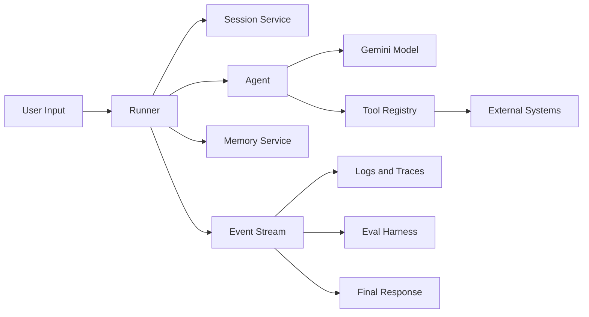
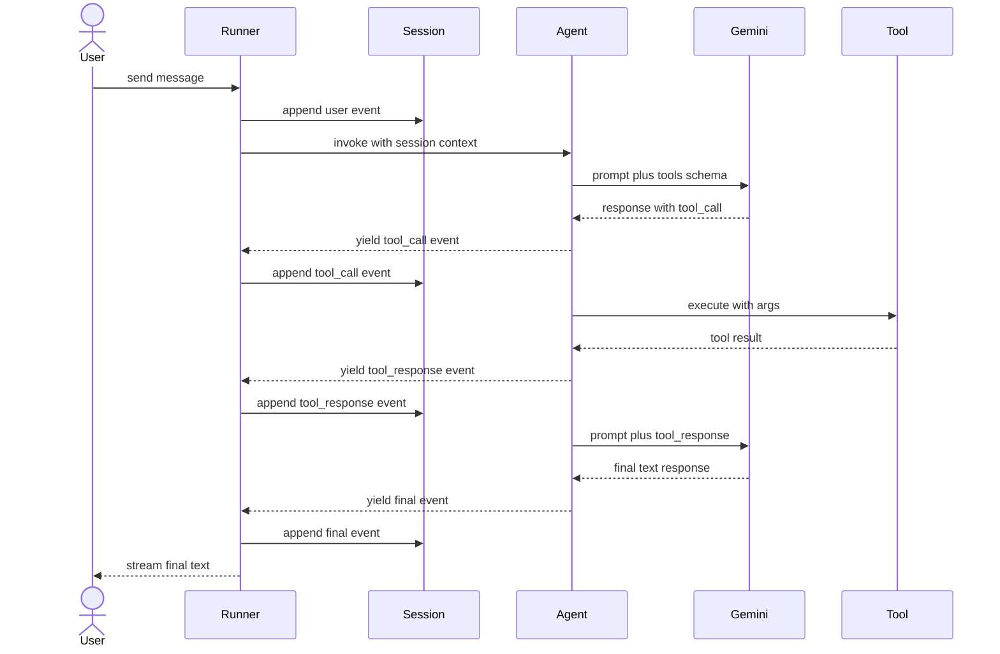
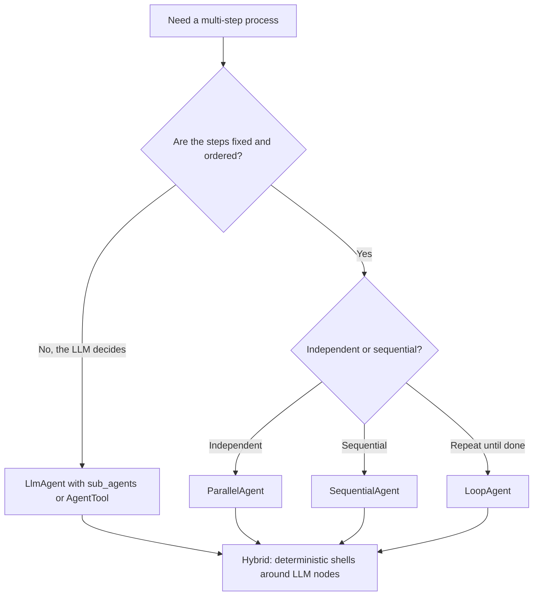
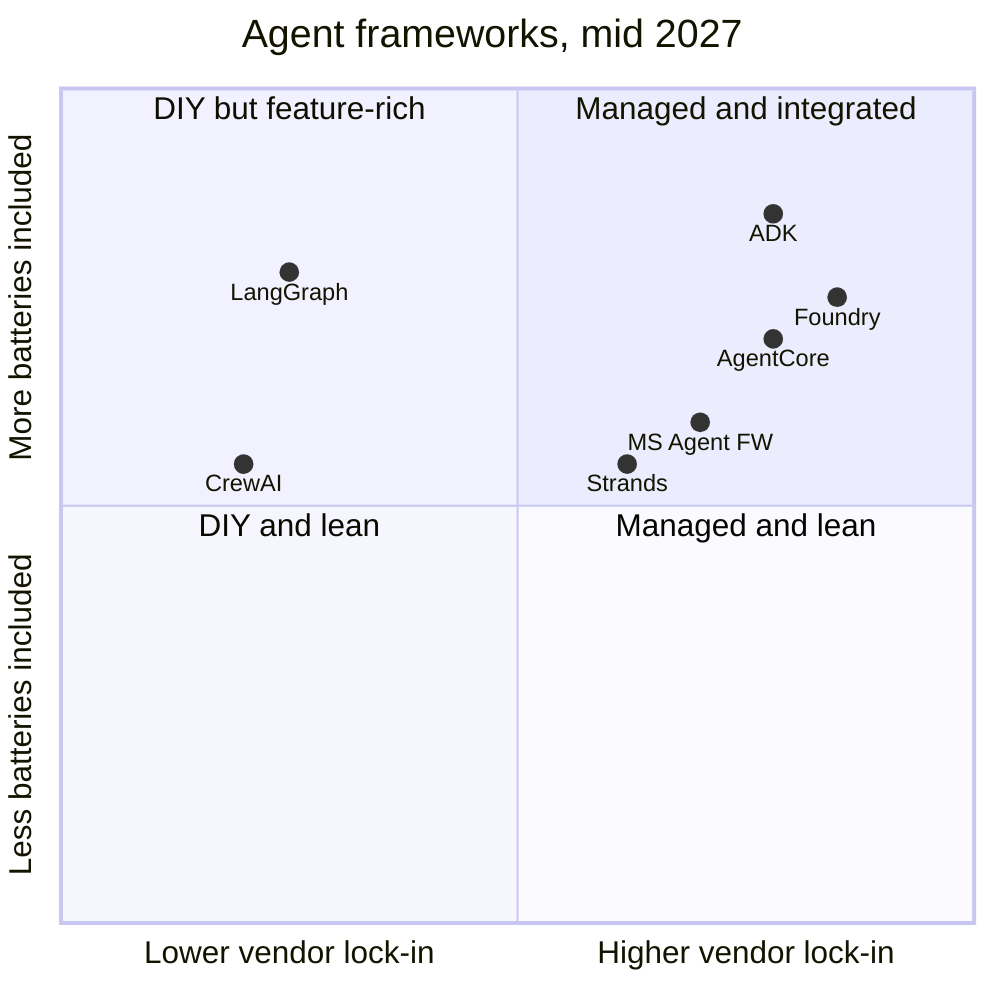

# Google ADK: Building Production Agents from First Principles

The first agent I deployed in anger was a hundred and twelve lines of Python wrapped around a single call to the Gemini API. It ran in a `while` loop. It parsed tool calls out of the model output with a regex. It stored conversation history in a list it pickled to disk every few turns. It worked, in the demo. It worked, on my laptop. It even worked, embarrassingly, for the first three days in production. Then a user asked a follow-up question whose answer required information from a tool the agent had called sixteen turns earlier, and the loop wedged. There was no observability. There was no way to replay the failing transcript. There was no eval suite. There was no way to deploy it without reinventing session storage, retry semantics, and authentication. There was, in retrospect, no agent. There was a script that had been pretending.

The team's first instinct was to add scaffolding. A class for the loop. A module for tool registration. A small abstraction over session state. Three weeks in, we had a half-decent internal framework. Six weeks in, it was clear we had reinvented, badly, what every serious agent team in 2025 was already starting to converge on: a separation of concerns between the agent's *logic*, the *tools* it called, the *session* that held its conversation state, the *runner* that dispatched events between them, and the *memory* that persisted across sessions. By the time we had a fourth concern bolted on (callbacks for guardrails), the right move was obvious. We threw it out and adopted the Agent Development Kit.

This post is the longest single resource I could write on ADK as it stands in mid-2027. It is heavy on code that runs. It is light on marketing. It works through every core abstraction with a small example, then ties everything together in an end-to-end multi-agent system you could lift into a real project. The closing tenth of the post compares ADK honestly with the rest of the field, but the point of the post is depth on ADK, not breadth on agent frameworks.

The audience I have in mind is the engineer who has built one or two agents the script-with-a-loop way, has been bitten in production, and is now picking a framework with their eyes open.

---

## What ADK Actually Is

ADK is Google's open-source toolkit for building, evaluating, and deploying agents. It started as a Python library, was released open-source in 2025, and now has first-party Java, Go, and TypeScript ports as well. It is the same framework Google uses internally to ship the agents inside Agent Engine, the Gemini Enterprise Agent Platform, and a fair chunk of Workspace's agentic features. That last point matters: this is not a sample SDK. The same code path that compiles your agent runs the agents Google bills you for.

The mental model has four pillars. Once you can name them and you understand how they wire together, the rest of the documentation reads as elaboration.

The first pillar is the **Agent**. An agent is the unit of decision-making. ADK has three flavors. `LlmAgent` (also exported as `Agent`) is the default: an LLM-driven agent that decides at runtime which tools to call, which sub-agents to delegate to, and what to say. `WorkflowAgent` is a deterministic counterpart, with three subclasses: `SequentialAgent` runs its children in order, `ParallelAgent` runs them concurrently, and `LoopAgent` re-runs its children until a condition is met. Then there is the escape hatch: `BaseAgent`, which you subclass when you want fully custom orchestration logic.

The second pillar is the **Tool**. A tool is anything an agent can call to take an action or fetch information. ADK supports several tool types: ordinary Python functions become *function tools* automatically; OpenAPI specs become full toolsets; managed Google Cloud services (BigQuery, Spanner, Pub/Sub, Vertex AI Search) ship as first-party tools; remote MCP servers plug in as `MCPToolset`s; and any agent can be passed as a tool to another agent.

The third pillar is the **Session**, with a closely related concept of **State**. A session is one conversation. State is the structured memory of that conversation. Sessions are persisted by a `SessionService`. ADK ships `InMemorySessionService` for development, `DatabaseSessionService` for self-hosted persistence (any SQLAlchemy URL), and `VertexAiSessionService` for managed cloud-side persistence. Long-term, cross-session knowledge lives in **Memory**, served by a `MemoryService` (`InMemoryMemoryService` for dev, `VertexAiMemoryBankService` for production). State is short-term and turn-scoped; memory is long-term and search-backed.

The fourth pillar is the **Runner**. The runner is the engine that ties everything else together. You hand it an agent, a session service, and optionally a memory service. It exposes an `async` API that takes user input and yields a stream of `Event` objects. Every model output, every tool call, every tool response, every state mutation, every error is an event. Logging, observability, evaluation, and deployment all attach to the event stream rather than to the agent itself.



If you take only one diagram from this post, take that one. Every architectural choice ADK makes flows from the decision to put the runner at the center, the agent next to it rather than around it, and the event stream as the universal interface to everything else. It is what makes the same agent code testable on a laptop and deployable to a managed runtime without modification.

---

## Hello, Agent

Enough abstraction. Let us install the thing and run the smallest possible agent.

```bash
# Python 3.11 or newer recommended
python -m venv .venv
source .venv/bin/activate   # Windows: .venv\Scripts\activate

pip install google-adk

# Quick sanity check
adk --version
```

ADK has an opinionated project layout. The `adk` CLI expects each agent to live in its own Python package directory, with an `agent.py` that defines a module-level `root_agent` and an `__init__.py` that re-exports it. The opinion is worth following because it lets `adk run`, `adk web`, `adk eval`, and `adk deploy` all locate your agent without configuration.

```
my_agent/
  __init__.py        # from . import agent
  agent.py           # defines root_agent
  .env               # GOOGLE_API_KEY or VERTEX project
```

The simplest agent that does anything interesting is one with a single function tool.

```python
# my_agent/agent.py
from google.adk.agents import Agent


def get_weather(city: str) -> dict:
    """Return a current weather snapshot for a city.

    Args:
        city: The city name, for example "Bogota" or "Tokyo".

    Returns:
        A dict with status, temperature_c, and conditions.
    """
    # In production this would call a real weather API. The docstring
    # above is what the LLM sees when deciding whether to call this tool,
    # so it pays to write it the way you would write a public API.
    fake_db = {
        "bogota":  {"temperature_c": 14, "conditions": "overcast"},
        "tokyo":   {"temperature_c": 27, "conditions": "humid"},
        "berlin":  {"temperature_c": 18, "conditions": "light rain"},
    }
    record = fake_db.get(city.lower())
    if record is None:
        return {"status": "error", "error_message": f"No data for {city}."}
    return {"status": "ok", "city": city, **record}


root_agent = Agent(
    name="weather_agent",
    model="gemini-2.5-flash",
    description="Answers questions about current weather in supported cities.",
    instruction=(
        "You are a concise weather assistant. When asked about weather, "
        "call get_weather with the city name. If the tool returns an error, "
        "apologize and suggest the user try a different city."
    ),
    tools=[get_weather],
)
```

The `__init__.py` is one line.

```python
# my_agent/__init__.py
from . import agent
```

Two ways to run it. From the parent directory of the package:

```bash
# Interactive terminal session
adk run my_agent

# Browser-based dev UI with an event inspector
adk web
```

`adk web` is the underrated developer-loop tool. It launches a local UI that shows the live event stream, tool calls with arguments and responses, model invocations with token counts, and state diffs after every turn. It is the single biggest reason ADK feels different from a hand-rolled framework once you commit to it: you stop reading print statements and start reading event traces.

There is a programmatic equivalent for tests and notebooks.

```python
import asyncio
from google.adk.runners import Runner
from google.adk.sessions import InMemorySessionService
from google.genai import types

from my_agent.agent import root_agent


async def ask(query: str) -> str:
    session_service = InMemorySessionService()
    runner = Runner(
        app_name="weather_demo",
        agent=root_agent,
        session_service=session_service,
    )
    session = await session_service.create_session(
        app_name="weather_demo", user_id="u-1"
    )
    user_msg = types.Content(role="user", parts=[types.Part(text=query)])

    final = ""
    async for event in runner.run_async(
        user_id="u-1", session_id=session.id, new_message=user_msg
    ):
        if event.is_final_response() and event.content:
            final = event.content.parts[0].text
    return final


print(asyncio.run(ask("What is the weather in Tokyo?")))
```

That is the pattern you will see, with minor variations, throughout this post. Define agents and tools as plain Python objects. Wire them through a runner. Iterate the event stream. Pull the final response out of the last event.

---

## The Agent Loop, Drawn Properly

If you have built agents by hand you already have a mental model for how the loop runs. It is worth writing it out explicitly anyway, because ADK separates four roles that hand-rolled agents tend to conflate.



A few things in that diagram are easy to miss. The runner is the only thing the user talks to. The session is append-only; nothing ever mutates an old event. The agent never holds session state directly; it asks the runner. The model never calls the tool; the agent does, after the runner has logged the intent. Every arrow that crosses an actor boundary is an event, and every event is observable.

The practical consequence is that *every interesting failure becomes a sequence of events you can inspect, replay, and assert against*. When a hand-rolled agent loops infinitely, you get a stack trace and a regex over a log file. When an ADK agent loops infinitely, you get a JSON-serializable list of `tool_call` events you can paste into an evalset and turn into a regression test in five minutes.

---

## Tools in Depth

Tools are where most of an agent's surface area actually lives. ADK supports five styles, and the choice between them is mostly about where the tool's contract is authored.

### Function tools

The default. Any plain Python callable becomes a tool when you pass it in `tools=[...]`. ADK introspects the signature, builds a JSON schema from the type hints, and uses the docstring as the tool description for the LLM. There are three rules worth memorizing.

First, type-hint everything. Untyped arguments default to `string`, which is rarely what you want and silently breaks numeric tools. Second, return a `dict`, not a primitive; the LLM reads the result as structured data and ADK handles serialization. Third, treat the docstring as the prompt for the model. Vague docstrings produce vague tool calls.

```python
from typing import Literal


def transfer_funds(
    from_account: str,
    to_account: str,
    amount_cents: int,
    currency: Literal["USD", "EUR", "COP"] = "USD",
) -> dict:
    """Transfer money between two internal accounts.

    Use this only when the user has explicitly confirmed both account
    numbers and the amount. Amounts are in cents to avoid floating
    point error. Returns a transaction id on success.

    Args:
        from_account: Source account number, format AAA-NNNNNN.
        to_account: Destination account number, same format.
        amount_cents: Integer amount in cents. Must be positive.
        currency: ISO currency code. Defaults to USD.

    Returns:
        On success, a dict with status="ok" and transaction_id.
        On failure, status="error" and a human-readable error_message.
    """
    if amount_cents <= 0:
        return {"status": "error", "error_message": "Amount must be positive."}
    # ... real transfer logic ...
    return {"status": "ok", "transaction_id": "tx-92834"}
```

### OpenAPI tools

When an external service already has an OpenAPI spec, you do not write a wrapper. You hand the spec to ADK and get a toolset.

```python
from google.adk.tools.openapi_tool import OpenAPIToolset

with open("market_api.yaml") as f:
    market_spec = f.read()

market_tools = OpenAPIToolset(spec_str=market_spec, spec_str_type="yaml")
# market_tools is iterable; pass it directly to an agent.
```

This is the path I recommend for any internal microservice your agent calls. The tool definitions stay in lockstep with the API; when the spec changes, the agent's tools change.

### Google Cloud tools

The Google Cloud tools are pre-built integrations for the services agents call most often: BigQuery, Spanner, Cloud Storage, Vertex AI Search, Pub/Sub. They handle authentication via Application Default Credentials and surface idiomatic operations rather than raw REST.

```python
from google.adk.tools.bigquery import BigQueryToolset

bq_tools = BigQueryToolset(
    project_id="finance-knowledge-base",
    # Optional: restrict to a specific dataset for safety.
    allowed_datasets=["compliance_kb"],
)
```

### MCP tools

The Model Context Protocol has become the lingua franca for cross-vendor tool servers. ADK consumes them through `MCPToolset`.

```python
from google.adk.tools.mcp_tool import MCPToolset, StdioServerParameters

# Stdio-launched local MCP server
fs_tools = MCPToolset(
    connection_params=StdioServerParameters(
        command="npx",
        args=["-y", "@modelcontextprotocol/server-filesystem", "/tmp/agent_workspace"],
    )
)

# HTTP/SSE-mounted remote MCP server
from google.adk.tools.mcp_tool import SseServerParameters
search_tools = MCPToolset(
    connection_params=SseServerParameters(url="https://search.internal/mcp"),
)
```

### Agent-as-tool

Any agent can be wrapped as a tool for another agent. This is the building block for orchestration patterns that need explicit delegation rather than the implicit transfer-of-control that `LlmAgent.sub_agents` provides.

```python
from google.adk.tools import AgentTool

# Wrap an existing agent so a parent can call it like any other tool.
research_tool = AgentTool(agent=research_agent)
parent = LlmAgent(
    name="coordinator",
    model="gemini-2.5-pro",
    instruction="Use the research_agent tool for any factual lookup.",
    tools=[research_tool],
)
```

The difference between `sub_agents=[...]` and `tools=[AgentTool(agent=...)]` is subtle but important. With `sub_agents`, the parent transfers control: the child takes over the conversation, may run multiple turns, and may hand control back. With `AgentTool`, the parent stays in control and gets a single response back, the way it would from any function. Use `sub_agents` for true delegation; use `AgentTool` for a structured sub-task whose output you want to compose with other tool results.

---

## Orchestration Patterns

Most non-trivial agents are not single agents. They are small teams. ADK gives you two orthogonal axes for composing them: how decisions are made (LLM-driven or deterministic) and how control flows between them (delegation or workflow).



`SequentialAgent` runs its children in order. Each child writes into the shared session state via an `output_key`, and the next child can read that key in its instructions. This is the right shape for pipelines like "extract entities, then enrich, then summarize."

```python
from google.adk.agents import LlmAgent, SequentialAgent

extract = LlmAgent(
    name="extractor",
    model="gemini-2.5-flash",
    instruction="Extract company tickers from the user's message. Return JSON list.",
    output_key="tickers",
)

enrich = LlmAgent(
    name="enricher",
    model="gemini-2.5-flash",
    instruction=(
        "For each ticker in state.tickers, fetch the latest quote with "
        "the get_quote tool. Return a JSON dict mapping ticker to price."
    ),
    tools=[get_quote],
    output_key="quotes",
)

summarize = LlmAgent(
    name="summarizer",
    model="gemini-2.5-pro",
    instruction=(
        "Given state.tickers and state.quotes, write a one-paragraph "
        "summary of the user's portfolio movement."
    ),
)

pipeline = SequentialAgent(
    name="quote_pipeline",
    sub_agents=[extract, enrich, summarize],
)
```

`ParallelAgent` runs its children concurrently. Each child gets the same input but writes to a different `output_key`. Useful for fan-out: same query, three retrievers, then a downstream agent merges the results.

`LoopAgent` runs its children until any child explicitly signals completion (typically by setting an `escalate` flag in state). Useful for refinement loops: write draft, critique, revise, repeat until the critic accepts.

`LlmAgent` with `sub_agents` is the dynamic counterpart. The parent's prompt declares the sub-agents and their roles; at runtime the LLM decides whether to handle the turn itself or transfer control. The right pattern is almost always *deterministic shells around LLM nodes*. Use workflow agents to encode the steps you know are fixed. Use LLM delegation only inside the steps that genuinely need judgment.

---

## State, Sessions, and Memory

Sessions and state are short-term. Memory is long-term. The boundary between them is one of the most consistently mishandled parts of agent design, so it pays to be precise.

A **Session** is one conversation. It has an id, a user, an app, and an append-only event list. The events carry the entire causal history of the conversation: user messages, model responses, tool calls, tool responses, state mutations. You do not edit a session; you append to it through the runner.

**State** is a structured key-value store scoped to a session. It is for the kind of data the agent or its tools need across turns of *this* conversation: a shopping cart, a working set of documents, a partial form being filled out. Tools mutate state by returning a value with a special `output_key`, by writing through the `ToolContext`, or by being read as `state.<key>` in agent instructions.

**Memory** is the long-term store. It survives across sessions. It is searchable rather than ordered: an agent does not iterate its memory, it queries it. The canonical lifecycle is "session ends, runner ingests session events into memory, future sessions retrieve from memory via a `load_memory` tool or implicit retrieval."

```python
from google.adk.sessions import VertexAiSessionService
from google.adk.memory import VertexAiMemoryBankService
from google.adk.runners import Runner

session_service = VertexAiSessionService(
    project="finance-prod",
    location="us-central1",
    agent_engine_id="projects/finance-prod/locations/us-central1/agentEngines/8273",
)

memory_service = VertexAiMemoryBankService(
    project="finance-prod",
    location="us-central1",
    agent_engine_id="projects/finance-prod/locations/us-central1/agentEngines/8273",
)

runner = Runner(
    app_name="finance_assistant",
    agent=root_agent,
    session_service=session_service,
    memory_service=memory_service,
)
```

The same `root_agent` runs against `InMemorySessionService` on a laptop and `VertexAiSessionService` in production. Nothing about the agent's code changes; only the runner's wiring does. This is the substantive payoff of the four-pillar separation.

A common trap. The `state` dict is *not* a free-form scratchpad. Anything you write there becomes part of every subsequent prompt the LLM sees, in some form, because state is part of session context. Bloated state leaks into the context window and degrades reasoning. The discipline is to write to state only what the next turn or the next sub-agent will read, and to push everything else either into memory or into a side store the tool layer reads on demand.

---

## Callbacks and Guardrails

ADK's callback system is the surgical tool you reach for when you need to intervene in the agent's execution without contorting its core logic. There are six callback hooks: before/after agent, before/after model, before/after tool. Each one receives a context object and a payload, can inspect or modify the payload, and can short-circuit the default behavior by returning a value.

The pattern is most useful for guardrails. Here is a before-model callback that blocks any prompt the agent is about to submit if it contains a string matching a denylist. This is a simplified pattern; in production you would call a content classifier or Model Armor.

```python
from typing import Optional
from google.adk.agents.callback_context import CallbackContext
from google.adk.models import LlmRequest, LlmResponse
from google.genai import types

DENY = ["DROP TABLE", "rm -rf", "exfiltrate"]


def block_unsafe_prompts(
    callback_context: CallbackContext, llm_request: LlmRequest
) -> Optional[LlmResponse]:
    # llm_request.contents holds the conversation as a list of Content.
    last_user = next(
        (c for c in reversed(llm_request.contents) if c.role == "user"), None
    )
    if last_user is None:
        return None
    text = " ".join(p.text for p in last_user.parts if p.text)
    if any(token.lower() in text.lower() for token in DENY):
        return LlmResponse(
            content=types.Content(
                role="model",
                parts=[types.Part(text="I cannot help with that request.")],
            )
        )
    return None  # proceed to model normally
```

The same pattern with a tool callback gives you tool-level guardrails: validate arguments before execution, redact sensitive output before it reaches the model, or replace a result with a safe default if the tool errored. With an after-agent callback you can post-process final responses, attach citations, or write structured logs.

The mental model: callbacks are the place where cross-cutting concerns live. Anything that is *not* the agent's core reasoning but that must run on every turn (logging, redaction, rate limits, content safety, authorization) belongs in a callback, not in the instruction.

---

## Putting It Together: A Personal-Finance Multi-Agent System

We have walked the abstractions in isolation. Time to wire them into something a reader could lift into a real project. The system is a personal-finance research assistant. A coordinator routes the user's question to one of three specialists: a budgeting sub-agent that does math, a market-news sub-agent that calls an external search tool, and a portfolio sub-agent that queries the user's holdings in BigQuery. The system shows agent-as-tool, sub-agent delegation, function tools, a Cloud tool, callbacks, and shared state working in concert.

Directory layout:

```
finance_assistant/
  __init__.py
  agent.py
  budget.py
  market.py
  portfolio.py
  guardrails.py
  .env
```

The four sub-modules each define a focused agent. The top-level `agent.py` composes them.

```python
# finance_assistant/budget.py
from google.adk.agents import LlmAgent


def compute_savings_rate(income_monthly: float, expenses_monthly: float) -> dict:
    """Compute the user's savings rate as income minus expenses over income.

    Args:
        income_monthly: After-tax monthly income.
        expenses_monthly: Total monthly expenses.

    Returns:
        Dict with savings_rate (float between 0 and 1) and surplus_monthly.
    """
    if income_monthly <= 0:
        return {"status": "error", "error_message": "Income must be positive."}
    surplus = income_monthly - expenses_monthly
    return {
        "status": "ok",
        "savings_rate": surplus / income_monthly,
        "surplus_monthly": surplus,
    }


def project_balance(
    starting_balance: float, monthly_contribution: float, years: int, apr: float
) -> dict:
    """Project a balance forward with monthly contributions and compound growth.

    Args:
        starting_balance: Current balance in account currency.
        monthly_contribution: Amount added each month.
        years: Number of years to project.
        apr: Annual percentage rate, expressed as a decimal, for example 0.07.
    """
    months = years * 12
    monthly_rate = apr / 12
    balance = starting_balance
    for _ in range(months):
        balance = balance * (1 + monthly_rate) + monthly_contribution
    return {"status": "ok", "projected_balance": balance, "months": months}


budget_agent = LlmAgent(
    name="budget_agent",
    model="gemini-2.5-flash",
    description=(
        "Specialist in personal-budget calculations. Use for savings rate, "
        "expense planning, and balance projections."
    ),
    instruction=(
        "You answer budget questions by calling the available calculation "
        "tools. Always show the user the inputs you used. If a tool errors, "
        "explain the error in plain language."
    ),
    tools=[compute_savings_rate, project_balance],
)
```

```python
# finance_assistant/market.py
from google.adk.agents import LlmAgent
from google.adk.tools.mcp_tool import MCPToolset, SseServerParameters


# Wire to an internal MCP search server. In prod this might be Vertex AI Search
# exposed over MCP, or a third-party news API behind an MCP wrapper.
search_tools = MCPToolset(
    connection_params=SseServerParameters(url="https://search.internal/mcp")
)


market_agent = LlmAgent(
    name="market_agent",
    model="gemini-2.5-flash",
    description=(
        "Specialist for current market news and ticker context. Use for "
        "questions about recent price movements, news, and macro context."
    ),
    instruction=(
        "Answer market questions by calling the search tools. Always cite "
        "the source URL. If results are older than 48 hours, say so."
    ),
    tools=[search_tools],
    output_key="latest_market_summary",
)
```

```python
# finance_assistant/portfolio.py
from google.adk.agents import LlmAgent
from google.adk.tools.bigquery import BigQueryToolset


portfolio_tools = BigQueryToolset(
    project_id="finance-prod",
    allowed_datasets=["personal_holdings"],
)


portfolio_agent = LlmAgent(
    name="portfolio_agent",
    model="gemini-2.5-pro",
    description=(
        "Specialist for the user's current holdings. Reads from BigQuery "
        "dataset personal_holdings. Use for any question about what the "
        "user owns, current allocations, or realized gains."
    ),
    instruction=(
        "When the user asks about their portfolio, query BigQuery dataset "
        "personal_holdings. Always filter by user_id from session state. "
        "Never expose another user's data."
    ),
    tools=[portfolio_tools],
    output_key="latest_portfolio_snapshot",
)
```

```python
# finance_assistant/guardrails.py
from typing import Any, Optional
from google.adk.agents.callback_context import CallbackContext
from google.adk.tools.tool_context import ToolContext
from google.adk.tools import BaseTool


REDACT_KEYS = {"ssn", "tax_id", "card_number"}


def redact_tool_result(
    tool: BaseTool,
    args: dict,
    tool_context: ToolContext,
    tool_response: dict,
) -> Optional[dict]:
    """Redact sensitive fields from any tool result before the model sees it."""
    if not isinstance(tool_response, dict):
        return None
    redacted = dict(tool_response)
    for k in list(redacted.keys()):
        if k.lower() in REDACT_KEYS:
            redacted[k] = "[REDACTED]"
    return redacted


def log_final_response(
    callback_context: CallbackContext,
) -> Optional[Any]:
    """Cheap structured log on every final response. Wire to Cloud Logging."""
    state = callback_context.state.to_dict()
    print({
        "event": "final_response",
        "user_id": state.get("user_id"),
        "agent": callback_context.agent_name,
    })
    return None
```

Now compose them into a coordinator. The coordinator is itself an `LlmAgent` with three sub-agents. The LLM picks which one to delegate to based on the user's query.

```python
# finance_assistant/agent.py
from google.adk.agents import LlmAgent

from .budget import budget_agent
from .market import market_agent
from .portfolio import portfolio_agent
from .guardrails import redact_tool_result, log_final_response


root_agent = LlmAgent(
    name="finance_coordinator",
    model="gemini-2.5-pro",
    description=(
        "Coordinator for personal-finance questions. Delegates to budget, "
        "market, and portfolio specialists."
    ),
    instruction=(
        "You are the user's personal-finance coordinator. Use these rules.\n"
        "- If the question is about calculations, savings rate, or balance "
        "projections, transfer to budget_agent.\n"
        "- If the question is about market news, prices, or recent events, "
        "transfer to market_agent.\n"
        "- If the question is about the user's holdings, allocations, or "
        "realized gains, transfer to portfolio_agent.\n"
        "- For mixed questions, coordinate: gather context from each "
        "specialist as needed, then synthesize.\n"
        "- Never invent numbers. If a specialist returns no data, say so."
    ),
    sub_agents=[budget_agent, market_agent, portfolio_agent],
    after_tool_callback=redact_tool_result,
    after_agent_callback=log_final_response,
)
```

Run it.

```bash
adk web finance_assistant
```

A representative event trace for the query "Given my current holdings, what is my projected balance in five years if I add $500 a month at 7% APR?" looks like this in the dev UI:

1. `user_message` — the query.
2. `agent_transfer` — coordinator transfers to `portfolio_agent`.
3. `tool_call` — portfolio_agent calls BigQuery.
4. `tool_response` — current holdings, written to `state.latest_portfolio_snapshot`.
5. `agent_transfer` — control returns to coordinator.
6. `agent_transfer` — coordinator transfers to `budget_agent`.
7. `tool_call` — budget_agent calls `project_balance` with the starting balance from state.
8. `tool_response` — projected balance.
9. `final_response` — coordinator synthesizes a one-paragraph answer citing both numbers.

Every one of those events is JSON-serializable. Every one of them can be asserted in an evalset. That is the productionization win.

---

## Streaming and Voice

Most agents live in the request-response world: user sends a message, agent thinks, agent replies. Some agents need to be *bidirectional* in real time: live audio, live video, partial responses, interruption. ADK exposes this through its bidi-streaming surface, which sits on top of the Gemini Live API.

The conceptual difference. In request-response mode, `runner.run_async` takes a single `new_message` and yields events until a final response. In streaming mode, `runner.run_live` opens a long-lived session: you push audio chunks (or text deltas) in over a queue, and you receive partial events out as they happen, including interruptions when the user starts speaking over the model's response.

```python
from google.adk.agents import LlmAgent
from google.adk.runners import Runner
from google.adk.sessions import InMemorySessionService
from google.genai import types

voice_agent = LlmAgent(
    name="voice_concierge",
    model="gemini-2.5-flash-native-audio",  # native audio model
    instruction="You are a voice concierge. Be brief and conversational.",
)

async def voice_session(audio_in_queue, audio_out_callback):
    runner = Runner(
        app_name="concierge",
        agent=voice_agent,
        session_service=InMemorySessionService(),
    )
    session = await runner.session_service.create_session(
        app_name="concierge", user_id="u-1"
    )

    async with runner.run_live(
        user_id="u-1",
        session_id=session.id,
        run_config=types.LiveConnectConfig(response_modalities=["AUDIO"]),
    ) as live:
        # Producer: push raw PCM audio chunks from the mic into the live session.
        async def push_audio():
            async for chunk in audio_in_queue:
                await live.send_realtime(media=chunk, mime_type="audio/pcm")

        # Consumer: stream model audio chunks back to the speaker.
        async def receive_audio():
            async for event in live.events():
                if event.content and event.content.parts:
                    for p in event.content.parts:
                        if getattr(p, "inline_data", None):
                            audio_out_callback(p.inline_data.data)

        await asyncio.gather(push_audio(), receive_audio())
```

Use voice mode when latency budgets are sub-second and the interaction is genuinely conversational. Stick to text streaming when the user is in a chat UI and "the agent's response is appearing as it thinks" is the only real-time requirement.

---

## Evaluation

Agent eval is fundamentally different from prompt eval and the difference is the reason ADK ships its own framework instead of pointing you at HumanEval-style datasets. A prompt eval asks "given this input, did the model produce a good output?" An agent eval asks "given this user goal, did the agent take a sensible *trajectory* of tool calls and sub-agent transfers, and did the final response satisfy the goal?" The trajectory matters because two agents can produce identical final responses by very different paths, one of which costs ten times as much and the other of which is the one you want in production.

ADK encodes this in the **evalset**. An evalset is a JSON file with one or more cases. Each case is a session: an ordered sequence of user queries, the expected tool calls, and the expected final response. Eval runs the agent against the case, captures its actual trajectory and final response, and scores both.

A minimal evalset for the budget agent above:

```json
{
  "name": "budget_basic",
  "eval_cases": [
    {
      "eval_id": "savings_rate_simple",
      "session_input": {
        "app_name": "finance_assistant",
        "user_id": "test-user-1",
        "state": {}
      },
      "conversation": [
        {
          "user_content": {
            "parts": [{"text": "I make 4000 a month and spend 2800. What is my savings rate?"}]
          },
          "intermediate_data": {
            "tool_uses": [
              {
                "name": "compute_savings_rate",
                "args": {"income_monthly": 4000, "expenses_monthly": 2800}
              }
            ]
          },
          "final_response": {
            "parts": [{"text": "Your savings rate is 30 percent, with 1200 surplus per month."}]
          }
        }
      ]
    }
  ]
}
```

Run it from the CLI.

```bash
adk eval finance_assistant tests/evals/budget_basic.evalset.json \
    --print_detailed_results
```

The framework ships several scorers, and the right combination depends on what you actually care about. `tool_trajectory_avg_score` does exact-match on the sequence of tool calls and their arguments; this is the strictest, and the right default for cost-sensitive workflows where the path matters. `response_match_score` uses ROUGE-1 against a reference response, which is too brittle for free-form answers and too generous for structured ones. `final_response_match_v2` is an LLM-as-judge scorer that asks a model whether the agent's response is semantically equivalent to the reference. `rubric_based_final_response_quality_v1` lets you supply your own rubric and have a judge score against it, which is what I reach for whenever the answer is open-ended.

The right discipline is layered. Use trajectory matching as the cheap, fast gate that catches structural regressions. Use rubric or LLM-judge scoring as the slower, expensive gate that catches quality regressions. Run both in CI on every change. Run a stratified sample on every model upgrade.

---

## Deployment

Three deployment targets share the same agent code: Vertex AI Agent Engine, Cloud Run, and GKE. The choice is mostly about how much of the runtime you want to own.

**Agent Engine** is the managed runtime. You hand it your agent and it gives you a URL. It packages your code, provisions session and memory services, exposes the agent over A2A and HTTPS, integrates with Cloud Logging and Cloud Trace, and scales horizontally. You pay per request and per memory-store usage. It is the right default for any agent that does not have unusual infra requirements.

```bash
adk deploy agent_engine \
    finance_assistant \
    --project finance-prod \
    --region us-central1 \
    --display-name "Finance Assistant"
```

**Cloud Run** is the right target when you want a managed container but you also need custom dependencies, sidecars, or a non-standard entrypoint. ADK ships a FastAPI server `get_fast_api_app(...)` that wraps your agent into a deployable web service. You write a Dockerfile, build, and deploy.

```python
# server.py
import os
from google.adk.cli.fast_api import get_fast_api_app

app = get_fast_api_app(
    agents_dir=os.path.dirname(os.path.abspath(__file__)),
    session_service_uri=os.environ.get("DATABASE_URL"),
    allow_origins=["*"],
    web=False,
)
```

```dockerfile
# Dockerfile
FROM python:3.12-slim
WORKDIR /app
COPY . /app
RUN pip install --no-cache-dir google-adk fastapi uvicorn
ENV GOOGLE_GENAI_USE_VERTEXAI=true
CMD ["uvicorn", "server:app", "--host", "0.0.0.0", "--port", "8080"]
```

```bash
gcloud run deploy finance-assistant \
    --source . \
    --region us-central1 \
    --allow-unauthenticated=false
```

**GKE** is the right target when you have hard requirements that the managed surfaces cannot meet: GPU-attached self-hosted models, strict network egress controls, or co-location with another stateful service. The agent code does not change. You build the same container and apply a Deployment.

Observability is uniform across all three. ADK emits OpenTelemetry traces by default; the Agent Engine wires them straight into Cloud Trace, and Cloud Run/GKE deployments need only the standard OTel exporter. Every event becomes a span. The same evalset that drives CI can be replayed against the production trace store to detect regressions in flight.

The A2A endpoint is the other thing worth turning on. With `--a2a` (or `expose_a2a=True` in code), the deployed agent advertises an Agent Card at a well-known path and accepts A2A requests from other agents. This is the substrate for multi-agent systems that span team boundaries: each team's agent is independently versioned, deployed, and discoverable; coordination happens at the protocol layer rather than inside one team's Python.

---

## The Wider Field

ADK is not the only serious agent framework. The honest read on the rest of the landscape, in mid-2027:

| Framework | Author | Style | Runtime story | Strength | Weakness |
|---|---|---|---|---|---|
| ADK | Google | Code-first SDK with workflow agents | Vertex AI Agent Engine, Cloud Run, GKE | Tightest integration with GCP, eval and deploy in one CLI | Most polished on Gemini, less natural with non-Google models |
| Strands Agents | AWS | Code-first Python SDK | Bedrock AgentCore, Lambda, ECS | Model-agnostic, good Bedrock integration | Younger ecosystem |
| Bedrock AgentCore | AWS | Managed runtime, framework-neutral | Serverless on AWS | Strong runtime primitives, durable execution | Tooling story still maturing |
| Azure AI Foundry Agent Service | Microsoft | Managed agent service | Azure-native | Tight Microsoft Graph and Copilot integration | Less open outside Azure |
| LangGraph | LangChain | Graph-as-code orchestration library | DIY or LangSmith | Most flexible orchestration model, mature ecosystem | Heaviest abstraction, many footguns |
| CrewAI | Independent | Role-and-process abstraction | DIY | Fast to prototype team-of-agents patterns | Less control over the agent loop |
| Microsoft Agent Framework | Microsoft | Successor to Semantic Kernel | Azure-friendly | Good .NET story, decent Python | Overlapping APIs during the transition |



Two paragraphs of analysis. The cluster of managed-cloud frameworks (ADK, AgentCore, Foundry) all converge on the same architecture: a code-first SDK plus a managed runtime plus a deploy CLI plus an eval harness plus a memory primitive. They differ mostly in which cloud's identity, billing, and observability stack they assume. If your shop has already standardized on one cloud, the right choice is almost always that cloud's framework. ADK is the strongest of the three if you are on GCP because it ships with the deepest Gemini integration, the smoothest A2A story, and the only first-party voice runtime. AgentCore is gaining ground fast on durable execution. Foundry is the only credible choice if your enterprise lives inside Microsoft Graph.

The independent frameworks (LangGraph, CrewAI) are the right choice for a different problem: when you genuinely need to run across clouds, when you want to switch model vendors quarterly, or when the orchestration shape you need is unusual enough that a managed runtime would be in your way. LangGraph in particular has matured into something close to "the Python expression of Pregel for agents," and it remains the framework I reach for when the right design is a complicated graph rather than a clean hierarchy. The trade is real: you write more glue, you own more of the runtime, you pay your own observability bill. For most agent programs in 2027, the managed-framework path is the productive default and the independent-framework path is the considered escape hatch.

---

## Going Deeper

**Books:**
- Russell, S., and Norvig, P. (2020). *Artificial Intelligence: A Modern Approach (4th ed.).* Pearson.
  - The agent abstraction in ADK descends directly from the AIMA agent-program / agent-function distinction. Chapters 2 and 12 are the classical scaffolding for everything in this post.
- Kleppmann, M. (2017). *Designing Data-Intensive Applications.* O'Reilly.
  - Session and memory services are distributed-systems problems wearing an agent costume. Read the chapters on consistency, replication, and stream processing before designing your own state stores.
- Hohpe, G., and Woolf, B. (2003). *Enterprise Integration Patterns.* Addison-Wesley.
  - Multi-agent orchestration, A2A, and message-driven workflows recapitulate EIP. This book is the unsung prior art.
- Newman, S. (2021). *Building Microservices (2nd ed.).* O'Reilly.
  - Treat each agent as a microservice with a probabilistic CPU. The chapters on service boundaries, deployment, and observability port directly.

**Online Resources:**
- [Agent Development Kit documentation](https://google.github.io/adk-docs/) — Canonical docs, including the quickstart, agent types, tools, sessions, evaluation, and deployment guides.
- [google/adk-python on GitHub](https://github.com/google/adk-python) — Source, release notes, and the sample agents directory worth reading top-to-bottom.
- [Vertex AI Agent Engine documentation](https://cloud.google.com/vertex-ai/generative-ai/docs/agent-engine/overview) — Managed runtime concepts, pricing, and the deployment surface for ADK.
- [Agent2Agent Protocol Specification](https://a2a-protocol.org/latest/specification/) — The normative definition of the A2A protocol, now stewarded by the Linux Foundation.
- [Model Context Protocol specification](https://modelcontextprotocol.io/) — The other half of ADK's interop story; reading the MCP spec is the fastest way to understand what `MCPToolset` actually does.

**Videos:**
- [Agent Development Kit playlist](https://www.youtube.com/@googlecloudtech) on Google Cloud Tech — The official channel maintains an evolving ADK playlist with quickstarts, multi-agent walkthroughs, and deployment demos. Treat published timestamps as the source of truth.
- [Google I/O and Cloud Next session archives](https://cloud.withgoogle.com/next/) — The recorded technical sessions are the canonical cross-reference for the runtime announcements summarized in this post.

**Academic Papers:**
- Yao, S., et al. (2023). ["ReAct: Synergizing Reasoning and Acting in Language Models."](https://arxiv.org/abs/2210.03629) *ICLR.*
  - The paper that named the reason-act-observe loop ADK's `LlmAgent` implements. Read it before designing instructions.
- Schick, T., et al. (2023). ["Toolformer: Language Models Can Teach Themselves to Use Tools."](https://arxiv.org/abs/2302.04761) *NeurIPS.*
  - The conceptual foundation for tool selection as a learned behavior, which is what your function-tool docstrings are training the model to do at inference time.
- Wang, G., et al. (2023). ["Voyager: An Open-Ended Embodied Agent with Large Language Models."](https://arxiv.org/abs/2305.16291) *NeurIPS.*
  - The clearest paper on long-horizon agents with persistent skill memory. The Memory Bank story in ADK is the production version of Voyager's skill library.
- Liu, N., et al. (2023). ["Lost in the Middle: How Language Models Use Long Contexts."](https://arxiv.org/abs/2307.03172) *TACL.*
  - The empirical reason ADK separates short-term state from long-term memory. Bloating session state degrades the model's ability to use it.

**Questions to Explore:**
- Where is the right boundary between deterministic workflow agents and LLM-driven coordinators in your domain? When does adding a `SequentialAgent` shell improve reliability, and when does it just calcify a bad design?
- What is the right unit of memory in your application: per-user, per-project, per-task? Does your `MemoryService` need access controls richer than the session-id boundary?
- How do you assert quality on a final response that is genuinely open-ended, where neither exact match nor ROUGE will work and an LLM judge introduces its own variance? What does a stable rubric look like?
- If you deployed every agent with `--a2a` enabled, what does your organization's *agent topology* look like a year from now? Is that a graph you would design intentionally, or one that would emerge accidentally?
- The four-pillar separation (Agent / Tool / Session / Runner) is one design. What would a different separation look like, and what would it buy you that ADK does not?
