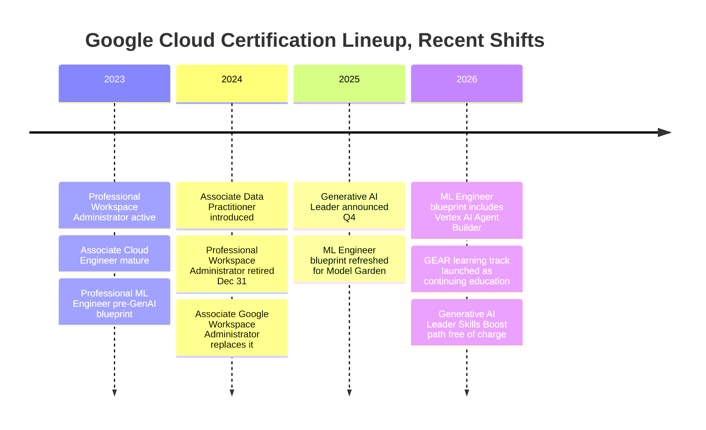
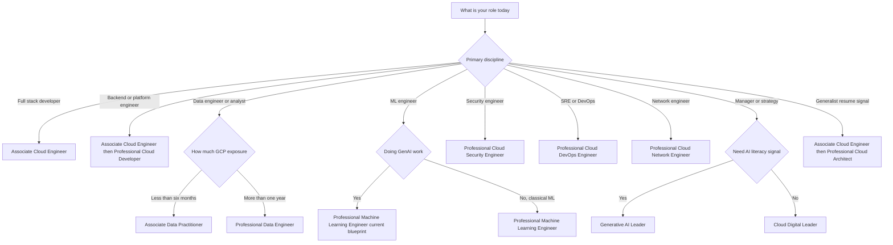
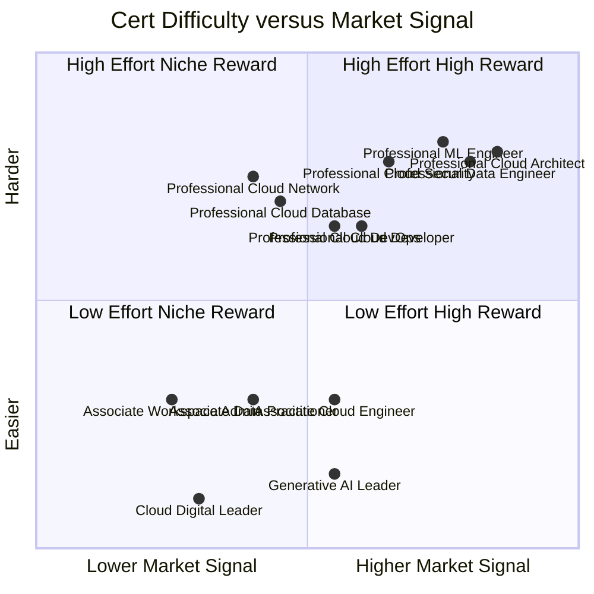
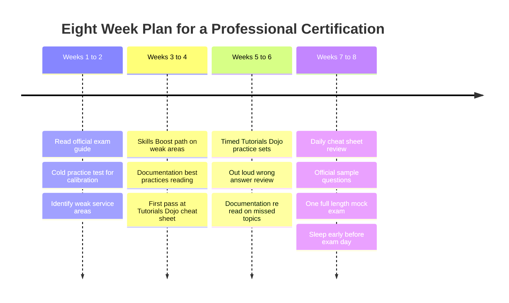

# Google Cloud Certifications in 2026: A Practical Roadmap

A senior engineer I respect asked me last month, with the slightly weary tone people use when they've already decided the answer is no, "do certs even matter anymore?" He was looking at the Google Cloud certification page for the first time in three years and trying to map the new shape of it onto his calendar. He has a public GitHub, a few production systems with his name on them, and a job he likes. He could not tell whether spending six weekends on a Professional exam was a reasonable investment or a vanity exercise.

The honest answer: it depends, the landscape changed more in the last eighteen months than in the previous five years, and most writing about it online is either marketing copy or three years out of date. So this is the post I would have wanted when I started planning my own Google Cloud certification path — a current map of what exists, what is new, what each exam is actually like, what study material correlates with passing rather than with looking studied, and an honest read on who certs help and who they help less.

I am writing this from a specific seat: a Knowledge Data Engineer role at a financial institution since late 2026, on a GCP-first stack covering a vector database proof of concept, lakehouse-resident agents, and a corporate knowledge base. So the Google Cloud certs are not abstract to me. Some describe my day job almost too closely; others describe roles I will never sit in but whose services I touch. That mix is what makes *which* cert the right question — they are not interchangeable, and the cost of picking the wrong one first is mostly opportunity cost.

---

## The Cert Ladder, Current Shape

Google's program has settled, after a few years of churn, into a three-tier structure: Foundational, Associate, Professional. The total active count is thirteen credentials.

The **Foundational** tier has two credentials, both cheaper and shorter than the rest. *Cloud Digital Leader* is the original — a business-and-services overview aimed at non-engineers. *Generative AI Leader*, added in late 2025, is the same shape but for the AI side: a strategic, vendor-aware credential demanding no coding and no console time, only that you understand what Vertex AI, Model Garden, Gemini, and the responsible-AI vocabulary mean and how an organization adopts them. Both are 90-minute exams, 99 USD, three-year validity.

The **Associate** tier is where Google has been most active. Three credentials in 2026:

- *Associate Cloud Engineer* — the longstanding deploy-and-operate exam. Console, `gcloud`, basics of IAM, networking, storage, compute. The right entry point if you actually run things.
- *Associate Data Practitioner* — added in late 2024, now mature. Bridges Cloud Digital Leader and Professional Data Engineer. Six months of hands-on data work is the recommended floor. Covers ingestion, storage choice, BigQuery basics, lightweight governance.
- *Associate Google Workspace Administrator* — replaced the retired Professional Workspace Administrator credential at end of 2024. IT-admin focused.

All three Associate exams are 125 USD, fifty to sixty questions, valid for three years.

The **Professional** tier is the big one. Eight credentials, each 200 USD, two hours, fifty to sixty questions, two-year validity. The list has been remarkably stable, but the *content* of several moved significantly in 2026 — most visibly the Professional Machine Learning Engineer blueprint, which now explicitly covers generative AI on Vertex, Model Garden, Vertex AI Agent Builder, and RAG patterns. If you sat that exam in 2023 and did not recertify, half of what you would now be tested on is new.

There is also a learning track called **GEAR — Gemini Enterprise Agent Ready**. This is not a certification. It is a structured learning program that produces a developer-profile badge, not a Google Cloud Certified credential. Treat it as continuing education.

Here is the full lineup as a table.

| Tier | Credential | Cost USD | Length | Questions | Validity |
|---|---|---|---|---|---|
| Foundational | Cloud Digital Leader | 99 | 90 min | 50 to 60 | 3 years |
| Foundational | Generative AI Leader | 99 | 90 min | 50 to 60 | 3 years |
| Associate | Associate Cloud Engineer | 125 | 120 min | 50 to 60 | 3 years |
| Associate | Associate Data Practitioner | 125 | 90 min | 50 to 60 | 3 years |
| Associate | Associate Google Workspace Administrator | 125 | 120 min | 50 to 60 | 3 years |
| Professional | Cloud Architect | 200 | 120 min | 50 to 60 | 2 years |
| Professional | Cloud Database Engineer | 200 | 120 min | 50 to 60 | 2 years |
| Professional | Cloud Developer | 200 | 120 min | 50 to 60 | 2 years |
| Professional | Cloud DevOps Engineer | 200 | 120 min | 50 to 60 | 2 years |
| Professional | Cloud Network Engineer | 200 | 120 min | 50 to 60 | 2 years |
| Professional | Cloud Security Engineer | 200 | 120 min | 50 to 60 | 2 years |
| Professional | Data Engineer | 200 | 120 min | 40 to 50 | 2 years |
| Professional | Machine Learning Engineer | 200 | 120 min | 50 to 60 | 2 years |

Two structural notes worth absorbing.

First, the **validity periods are not uniform**. Foundational and Associate certs hold for three years; Professional certs for two. If you stack a Professional Cloud Developer and a Professional Data Engineer in the same year, you will be on a two-year recertification treadmill for both — plan for that.

Second, the **renewal exam is shorter and cheaper than the initial exam**. Foundational renewal is 60 USD for 45 minutes; Professional renewal is 100 USD for one hour, twenty questions. The renewal window opens 60 days before expiration. Google has also, on and off, distributed a 50-percent discount code in the renewal window, making effective renewal cost closer to 50 USD for a Professional. Soft benefit, not guarantee.

---

## What's New in 2026

Three changes are worth flagging because they materially affect how to plan a path.

**Generative AI Leader (added Q4 2025) is the cert most people get wrong.** It is *not* a technical AI exam. It is a strategic exam, scoped at the level of "executive who needs to talk credibly to their board about adopting Vertex." 99 USD, 90 minutes, recommended for anyone in any role, with or without hands-on experience. If you are an ML engineer, this is not your cert. If you are a strategy lead, partner-org consultant, or a manager who needs visible AI-literacy signal, it is exactly the cert. The blueprint splits roughly thirty percent fundamentals of generative AI, thirty-five percent Google Cloud's gen AI offerings, with the rest on responsible AI and enterprise adoption. The full Skills Boost learning path for it is currently free, which is unusual.

**Associate Data Practitioner has matured.** When it launched in late 2024 it was thin. By 2026 it has a real curriculum, a structured learning path, and clear differentiation from Professional Data Engineer. Roughly thirty percent of the exam is data preparation and ingestion; the rest splits across analysis, management, and governance. The recommended floor is six months of hands-on Google Cloud data work, which is honest. It is the right cert for a data analyst transitioning to data engineering, or a software engineer pulled toward data work who wants a baseline credential before tackling Professional Data Engineer.

**Professional Machine Learning Engineer was substantially refreshed.** The 2026 blueprint explicitly tests Model Garden, Vertex AI Agent Builder, RAG patterns, generative AI evaluation, and responsible-AI considerations on top of the classical MLOps content. If you took this exam in 2022 or 2023, expect to study for the recertification rather than coast through it. The content shift is real.

What is *not* new and what people keep asking about: **there is no separate "Agent Engineer" Professional certification at the time of writing.** The agent-era content has been folded into the Machine Learning Engineer exam and into the GEAR learning track. If you want a credential that says "I build agents on Vertex," you currently get the Professional ML Engineer cert and the GEAR badge as a pair. Watch the certification page rather than the announcement blog — Google adds credentials there before the marketing catches up.



---

## Exam Mechanics, In Detail

The mechanical details of taking a Google Cloud exam are genuinely uniform across the ladder, with three exceptions I'll call out. Understanding them in advance is worth ten study hours, because the format itself is part of the test.

**Format.** Every Google Cloud certification exam is multiple-choice and multiple-select. No labs, no command-line drills, no live consoles. Professional exams lean heavily on multi-paragraph scenario questions: a fictional company is described in two or three paragraphs, and you pick the most appropriate two-of-five services or the most appropriate single architectural choice. The questions reward reading carefully more than they reward recall. Many wrong answers are wrong because they are plausible but slightly more expensive, slightly less secure, or require maintenance the scenario explicitly disallows.

**Length.** Most Professional exams are 50 to 60 questions in 120 minutes. Professional Data Engineer is the outlier at 40 to 50 questions in the same window. Associate exams sit at 50 to 60 questions in 90 to 120 minutes. Foundational exams are 50 to 60 questions in 90 minutes.

**Passing line.** Google does not publish the passing score for any of the certifications. Third-party prep sites circulate numbers around seventy percent, but that is convention, not policy. The result you receive at the end is pass/fail with no numeric score and no question-level feedback.

**Proctoring.** Two modes: online-proctored (your own room, your own computer, a webcam, a Kryterion proctor) or onsite at a Kryterion test center. The online experience is fine if your environment is quiet and your camera and microphone work. If you have any uncertainty — roommate, unreliable internet, uneven lighting — book a test center. The risk-adjusted cost of an aborted online exam is worse than a half-hour drive.

**Recertification.** Foundational and Associate validity is three years. Professional validity is two. The renewal window opens 60 days before expiration. Renewal exams are about half the questions, half the time, half the price. Expect a 50-percent discount code in the renewal window if your cert is still active — pattern, not guarantee.

**Retake policy.** If you fail: 14 days before a second attempt, 60 days before a third, a calendar year before a fourth. Full price each time. The cost of failing is not just 200 USD, it is two weeks of momentum.

**Languages.** Most exams are English and Japanese. Cloud Digital Leader is the broadest with English, Japanese, Spanish, Portuguese, and French. Most Professional exams are English-only.

| Tier | Initial cost USD | Renewal cost USD | Initial validity | Renewal window |
|---|---|---|---|---|
| Foundational | 99 | 60 | 3 years | 180 days before expiration |
| Associate | 125 | typical pattern is half initial | 3 years | 180 days before expiration |
| Professional | 200 | 100 | 2 years | 60 days before expiration |

---

## Official Learning Paths

Google's official learning real estate has consolidated under one brand: **Skills**, at skills.google. Behind it, what used to be called Google Cloud Skills Boost is still the engine — the same hands-on labs, the same Qwiklabs roots, the same role-based learning paths. The naming has been a moving target for two years now; you will see all three names in the wild.

Each certification has an associated learning path on Skills, a sequence of courses with embedded readings, videos, and hands-on labs in real Google Cloud projects. The labs are the part that matters. They are sandboxed projects with temporary credentials and a scoring engine that grades you on whether you completed the task — provisioned the right resource, configured the right IAM binding, ran the right `gcloud` command. Reading the docs gets you a passing exam score; the labs give you the muscle memory you need to use the cert at work.

**Free vs paid.** Most Skills Boost content is gated behind credits or a subscription (around 29 USD per month or 299 USD per year). Both Foundational learning paths are free, and Google occasionally promotes specific Professional paths to free during launches.

**Innovators credits.** The Google Cloud Innovators program is free to join and members receive 35 unrestricted Skills Boost credits per month. The credits do not roll over. For someone studying one Professional cert at a steady pace, those monthly credits cover the meaningful labs. Sign up before you spend a dollar on the subscription.

**GEAR.** A curated learning track for agent expertise on Gemini and Vertex. Membership gives you no-cost access to a structured curriculum and a developer-profile badge. It is not a Google Cloud Certified credential — do not list it in the certifications section of your resume — but it is a fine continuing-education complement to the Professional Machine Learning Engineer cert.

What the official path *cannot* do: replicate the wordiness and ambiguity of Professional exam scenarios. Skills courses are calmly correct: here is a service, here is its right use, here is a lab. Real exam questions are deliberately messier. That is what third-party practice tests are for.

---

## Study Resources, Honestly Ranked

There is a *lot* of money sloshing around the certification industry, and most of the recommendations you find online are either lightly affiliated content or one person's experience generalized too far. Let me grade resources by what actually correlates with passing — among colleagues, in study groups, and in my own preparation.

The resource that correlates best with passing, by a wide margin, is **scenario-based practice questions taken seriously.** Timed conditions, no notes, honest read of why each wrong answer is wrong. The osmosis pattern of reading explanations passively does not work; what works is forcing yourself to articulate, out loud, why the right answer beats the second-best answer on cost or maintainability or security. That is the muscle the exam tests.

The resource that correlates worst is **YouTube playlists of someone reading exam objectives aloud.** Feels productive, retention is near zero. Use video for *conceptual* topics where a whiteboard helps (Cloud SQL versus Spanner, networking topologies, IAM hierarchy). Avoid it for objectives recitation.

| Resource | What it's good for | What it's not good for | Honest grade |
|---|---|---|---|
| Skills Boost official path | Hands-on muscle memory, conceptual coverage | Exam-style scenario practice | A for skills, B minus for exam prep |
| Google's official sample questions | Calibration; first sense of difficulty | Volume; not enough to study from alone | B plus, but only fifteen questions |
| Tutorials Dojo cheat sheets | Pre-exam dense review; service comparisons | Initial learning when concepts are new | A minus |
| Tutorials Dojo practice tests | High-quality wrong-answer explanations | Coverage breadth on newer exams | A for older exams, B for newest |
| Whizlabs practice tests | Volume; broad catalog | Quality consistency varies sharply | B minus, declining |
| Coursera Google specializations | Structured progression for total beginners | Pace, depth on Professional exams | B for Foundational, C for Professional |
| A Cloud Guru / Pluralsight courses | Solid lecture-style coverage | Outdated faster than other sources | B, watch the publish date |
| Reddit r slash googlecloud and Discord | Recent exam reports, study buddies | Authoritative content | B plus as a calibration signal |
| Official exam guide PDF | Authoritative scope; what to study | Teaching the material | A for scoping, not a teaching resource |
| Reading the Google Cloud documentation | Depth on services you'll be tested on | Time efficiency | A for senior engineers, C for beginners |

A few amplifications.

**Tutorials Dojo** is the third-party study resource that most consistently calibrates to real exam difficulty and style. The wrong-answer explanations are the asset — they articulate exactly the cost-versus-security-versus-maintainability tradeoff that Google's questions reward. Their cheat sheets are the best dense pre-exam review I have found.

**Whizlabs** has more volume but less consistency. Use it as a supplement, not a primary, and skip the courses; only the practice tests are worth paying for.

**Official sample questions** (linked from each certification page) are short — fifteen to twenty questions — and are a calibration tool, not a study tool. Written by the same people who write the exam, so the *style* is right. Save them for the last week.

**The Google Cloud documentation** is a study resource senior engineers undervalue. For a Professional exam, reading the official "best practices" pages for major services — Cloud SQL, Spanner, BigQuery, Cloud Run, GKE, IAM, VPC, Cloud Storage, Pub/Sub — is the highest-density study you can do. The exam quotes that language almost verbatim. If you are studying for Cloud Architect and have not read the [Architecture Framework](https://cloud.google.com/architecture/framework) end-to-end, you are studying around the test instead of through it.

---

## A Decision Tree, By Role

The most common question I get is some variant of "I am X, which cert should I take first?" There is no universal right answer, but there is a defensible answer per role. Here is the decision tree I use.



Commentary on the less obvious branches:

**Full-stack developers should not skip Associate Cloud Engineer**, even if ready for Professional Cloud Developer. The Associate is the cheapest way to get the IAM, networking, and gcloud-CLI fluency the Professional exam *assumes*. People who skip it report the Professional Cloud Developer exam as harder than its blueprint suggests, because the blueprint takes operational basics for granted.

**Data engineers with less than six months of hands-on Google Cloud should take Associate Data Practitioner first.** Real bridge cert, not a vanity one. The Professional Data Engineer exam assumes you have shipped a BigQuery pipeline, used Dataflow non-trivially, and configured DLP. Without that, the Professional exam feels like guessing.

**ML engineers should take Professional Machine Learning Engineer on the current blueprint.** Recertify if yours was earned before Q1 2026; the renewal exam will catch you on Vertex AI Agent Builder and Model Garden if you have not been working with them.

**Security engineers should treat Professional Cloud Security Engineer as a senior credential**, not an entry. It assumes IAM, VPC service controls, and KMS at the level of someone who has deployed them.

**Managers and strategy folks**: Cloud Digital Leader is for people who need to be conversant with the platform; Generative AI Leader is for people who need to be conversant with Vertex and AI strategy specifically. Either is a low-cost, high-signal credential for non-engineers. Neither will impress an engineering team.

**Generalists looking for resume signal** should take Associate Cloud Engineer first, then Professional Cloud Architect. That pair is the most recognized combination in non-GCP-native job markets.

---

## The Honest ROI

Now the part nobody likes to write directly. Who do certs actually help, and who do they help less?

**Certs help most:**

- *Consultants and partner-organization engineers.* Google partner status depends in part on cert counts. If you work at a Premier or Specialization-tier partner, your cert is part of the firm's commercial story, and the firm typically funds the exam and study time. The ROI is the firm's quota, not your career.
- *Early-career engineers.* If your GitHub is thin and your work is under NDA, a cert is the cheapest credible signal you can produce. Hiring managers reading junior or mid-level resumes use certs as a shortlist filter. The marginal value at three years of experience is substantially higher than at ten.
- *Engineers in role transitions.* Moving from a non-cloud role to a cloud role, or from one cloud to another. The lowest-cost way to convince a hiring manager you have done more than read the documentation.
- *Engineers in non-English-speaking job markets.* In many regions a cert carries more weight than a public artifact because hiring processes are credential-driven.

**Certs help less:**

- *Senior engineers with public artifacts.* If you have shipped systems whose names a hiring manager recognizes, or if you have a public blog or open-source contributions in the relevant area, a cert is incremental signal at best. The cost in time is real and the marginal value is small.
- *Engineers at firms that do not value certs.* Many product-engineering organizations give certs essentially zero weight in promotion decisions.
- *Engineers who already do the work the cert validates daily.* You will pass without learning much new. The *learning* ROI is low.

**The soft benefits are real and often underrated.** The single best argument for a Google Cloud cert, especially for a senior engineer, is that the blueprint forces you through services you have never bothered with. I have written about this in the [stack recommendations post](https://juanlara18.github.io/portfolio/#/blog/stack-recommendations-after-100-posts) — most engineers are deep on the four services they use and shallow on the other forty. A Professional cert blueprint walks you through all of them. That breadth has paid me back more than once when I needed to make an architectural call quickly. The Cloud Architect blueprint will make you read about Cloud Spanner even if you never plan to use it. That is genuinely valuable. And for some people, the existence of an exam date is what turns a vague intention to learn GCP into actual learning. The 200 USD is buying you a deadline as much as a credential.



The quadrant above is my read, calibrated against people I have studied with. The y-axis is exam difficulty; the x-axis is market signal in a generalist hiring market. Treat the placement of the Professional Cloud Architect cert as deliberate — it is the hardest exam in the lineup *and* the most universally recognized, which is why it tends to be where senior engineers end up if they do exactly one Professional cert.

---

## A Realistic Study Plan, Four to Eight Weeks

Working engineers typically have ten to fifteen study hours per week, no more. Plan sized for that rate, for a Professional-tier cert:

**Weeks one and two: scoping.** Read the official exam guide PDF cover to cover. Take a practice test cold, before any studying, to calibrate. Write down the three or four service areas where your cold-test score was lowest. Those get most of the next month's hours.

**Weeks three and four: depth.** Work through the Skills Boost learning path selectively. Spend time on labs in weak areas, skip the labs you could do half-asleep. Read the Google "best practices" doc pages for major services. Read the relevant Tutorials Dojo cheat sheet slowly, marking what you cannot reproduce from memory.

**Weeks five and six: practice.** Grind scenario questions. Tutorials Dojo timed sets, in exam mode, three or four times a week. After each set spend an hour reading the wrong-answer explanations out loud. Re-read the relevant doc page after each missed question. By end of week six you should hit the practice-test passing line on three consecutive sets.

**Weeks seven and eight: consolidation.** Review cheat sheets daily. Re-read the official sample questions. Take one full-length practice test under exam conditions three days before the exam. Whatever you miss, study for the next two days, and sleep early the night before.



If you can sustain fifteen hours per week, compress to six weeks. If only eight or nine, stretch to ten and do not try to compress. The thing that fails is not depth, it is fatigue.

A small `gcloud` snippet worth memorizing the shape of, because variants of it appear in many architecture-style questions. The exam does not ask you to type these, but recognizing the patterns is what tells you which answer is the secure-and-cheap one.

```bash
# IAM binding at the project level for a service account
gcloud projects add-iam-policy-binding PROJECT_ID \
  --member="serviceAccount:NAME@PROJECT_ID.iam.gserviceaccount.com" \
  --role="roles/run.invoker" \
  --condition=None

# A Cloud Run deployment that pulls from Artifact Registry
gcloud run deploy SERVICE_NAME \
  --image=REGION-docker.pkg.dev/PROJECT_ID/REPO/IMAGE:TAG \
  --region=REGION \
  --no-allow-unauthenticated \
  --service-account=NAME@PROJECT_ID.iam.gserviceaccount.com
```

The pattern to internalize is the *least-privilege* shape: scoped service account, no public access, image from a private registry. Many wrong answers on Professional Cloud Developer and Cloud Architect exams are the same shape with one of those constraints relaxed. Recognizing the relaxation is recognizing the wrong answer.

---

## Test Day, Mechanics and Gotchas

Online-proctored exams are the default; most gotchas are about your environment rather than the content.

**Before you sit down.** Run the Kryterion system check at least 24 hours before the exam, not five minutes before. Camera, microphone, screen-sharing permissions, and bandwidth all need to be green. The number-one cause of an aborted online exam is not bandwidth — it is the camera permission silently failing after a system update.

**Photo ID.** Government-issued photo ID required. The name on the ID has to match the name you registered with on the certification site exactly. Mismatches result in cancellation; no refund.

**Environment.** Clean desk, closed door, no second monitor connected, no headphones unless approved, no phone in the room. The proctor will ask you to scan the room with your webcam — walls, floor, desk, ceiling. Do this dry-run in your actual exam-day room before exam day.

**During the exam.** You can mark questions for review. Use this. Professional exams are paced at roughly two and a half minutes per question; the wordy scenario questions burn five, the simple service-recall ones burn one. Mark the wordy ones, do all the easy ones, then come back. This single tactical move most reliably moves a borderline pass to a comfortable pass.

**After the exam.** You see "pass" or "fail" on screen. No score, no question-level feedback. The official email confirmation arrives within seven to ten business days with badge claim instructions. Claim the badge on Credly, which is where most professional networks read it from.

**The marketing license.** When you certify, Google grants you a limited license to use a "Google Cloud Certified" badge on your CV, LinkedIn, and personal website. You cannot modify the badge, imply Google endorsement of a product, or use it after expiration. The terms are short and worth reading once.

---

## A Word on AWS and Azure

Cert culture differs across the three clouds in ways that affect how to think about a Google Cloud cert. AWS has the largest cert market by volume, the most third-party study material, and the AWS Solutions Architect is, in many job markets, the default cloud cert hiring managers ask about by name. Azure has invested heavily in role-based bundles and its certs carry weight in enterprise environments where Microsoft was already the incumbent. Google Cloud sits between the two: smaller ecosystem, fewer certs, less third-party noise, and — in my read — the best alignment between exam content and what the platform's senior engineers actually do day-to-day. The Professional Cloud Architect exam in particular has a reputation, even among AWS-centric engineers, for being unusually well-designed. If your career is on GCP, get the Google certs. If you are picking based on market size alone, AWS wins on volume. If you are picking based on which cert most accurately reflects the work, Google's Professional tier is the strongest of the three.

---

## Going Deeper

**Books and Study Guides:**

- Roitman, D. (2024). *Google Cloud Certified Professional Cloud Architect Study Guide.* Sybex.
  - The most current single book for the Cloud Architect track. Pair with Tutorials Dojo cheat sheets.
- Dvorkin, M. & Grumbley, J. (2024). *Official Google Cloud Certified Professional Data Engineer Study Guide.* Sybex.
  - Companion volume for Professional Data Engineer. Strongest on BigQuery and Dataflow, weakest on newer governance and ML topics.
- Boudreau, T. (2025). *Google Cloud Certified Professional Machine Learning Engineer Study Guide.* Sybex.
  - Most up-to-date book covering the post-2025 blueprint changes. Verify against the current exam guide; the AI side moves fastest.

**Online Resources:**

- [Google Cloud Certifications page](https://cloud.google.com/learn/certification) — The canonical source. Always check this page rather than third-party summaries.
- [Google Cloud Skills Boost](https://www.cloudskillsboost.google) — Official labs and learning paths. Innovators credits make most of it free.
- [Cloud Certification Help Center](https://support.google.com/cloud-certification) — Authoritative answers on retake policy, renewal windows, accessibility accommodations.
- [Tutorials Dojo Google Cloud study guides](https://tutorialsdojo.com/google-cloud-gcp-exam-study-guides/) — Cheat sheets and practice tests, the highest-correlation third-party resource I have used.
- [Google Cloud Architecture Framework](https://cloud.google.com/architecture/framework) — Read end-to-end for Cloud Architect. The exam quotes from it.
- [Google Cloud Innovators](https://cloud.google.com/innovators) — Free program with 35 monthly Skills Boost credits.

**Videos:**

- [Google Cloud Tech](https://www.youtube.com/@googlecloudtech) — The official channel. Use selectively for service overviews and architecture explainers.
- [Google for Developers](https://www.youtube.com/@GoogleDevelopers) — Cloud Next talks and Vertex AI sessions; useful conceptual context for the ML Engineer and Generative AI Leader tracks.

**Questions to Explore:**

- Will Google introduce a separate Professional-tier credential for agent engineering, or will the ML Engineer cert continue to absorb that content?
- How would you design a study cadence that captures the breadth benefit of a Professional cert without committing to the two-year recertification treadmill?
- For a senior engineer with no current cert, is the highest-leverage choice still Professional Cloud Architect, or has multi-cloud shifted the calculus toward role-specific Professional certs?
- If certs validate competence, why does the industry persistently undervalue published artifacts as substitutes? What would a portfolio-as-credential system look like in regulated hiring?

