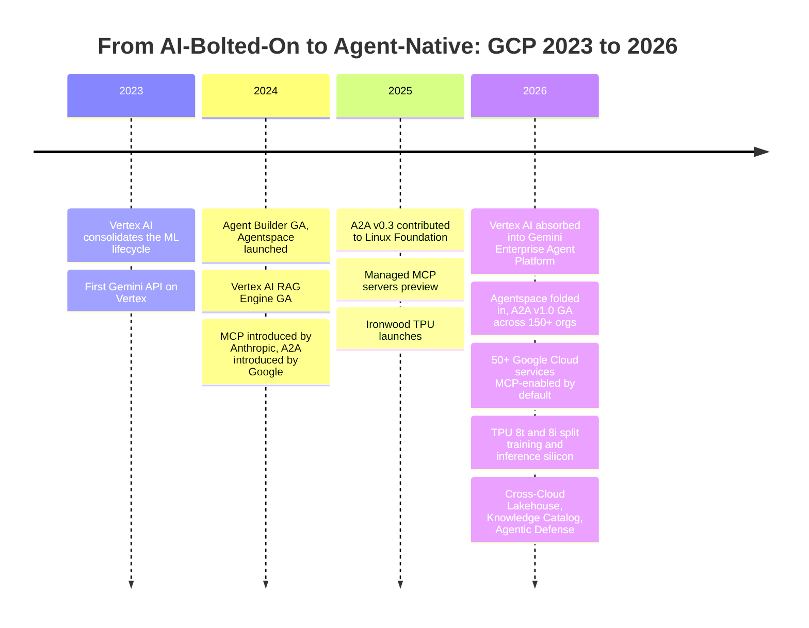
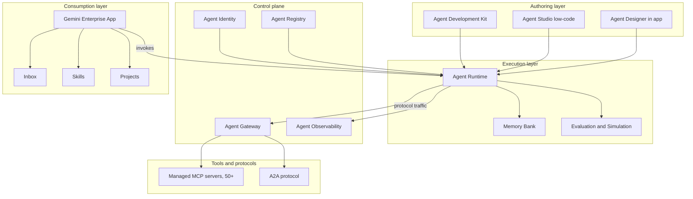
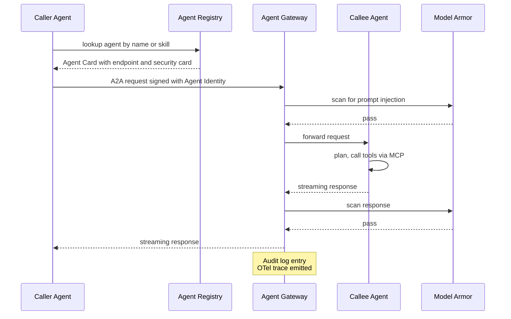
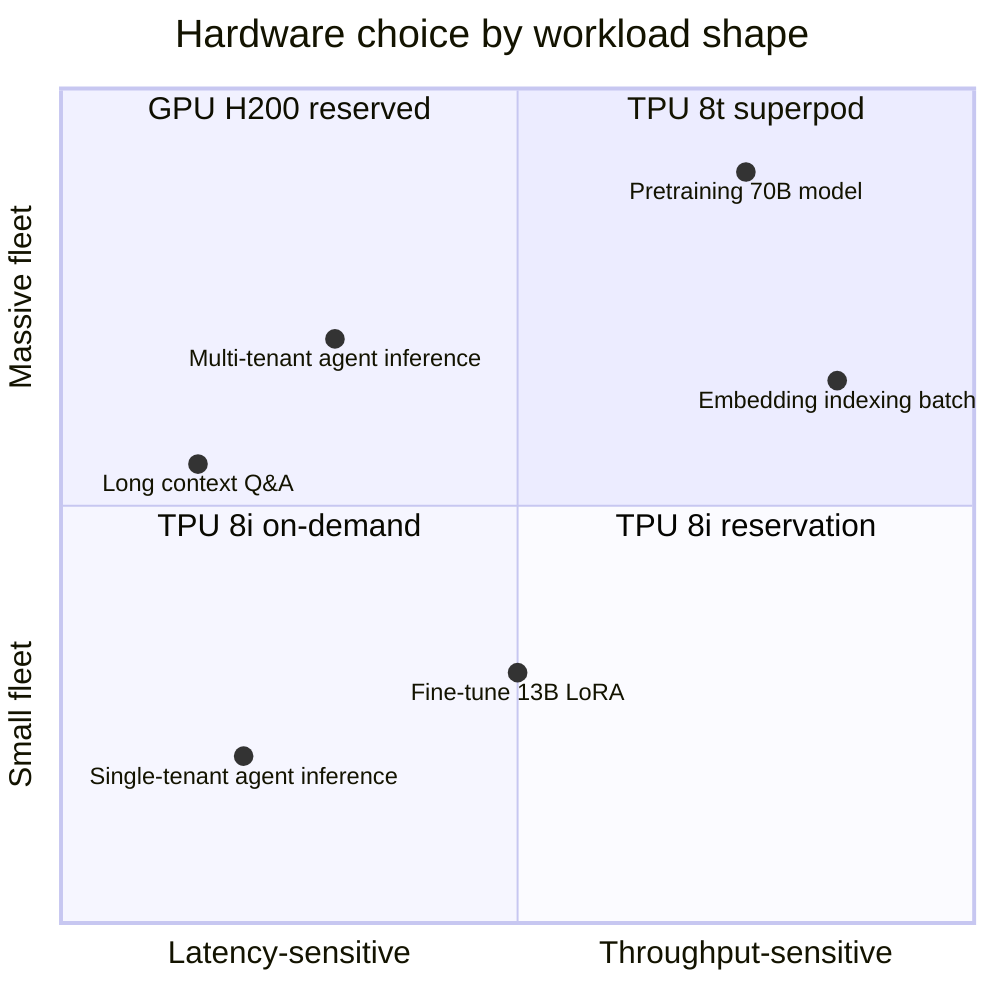
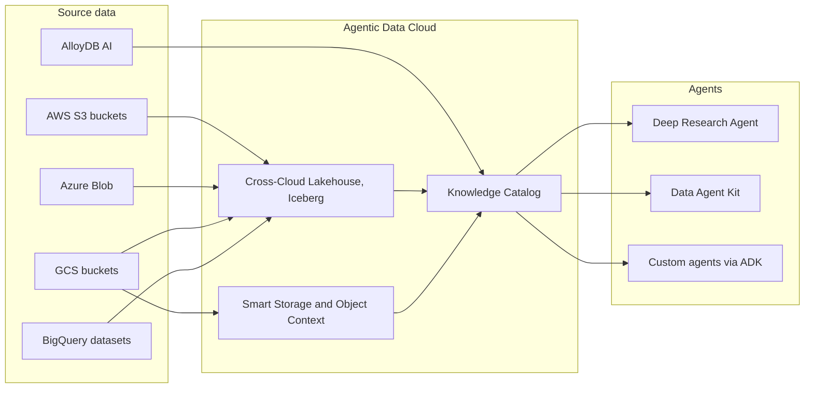
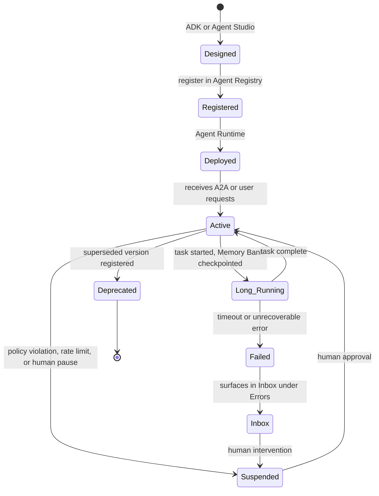

# Google Cloud Next 2026: The Agent-Native Stack, Decoded

On the morning of April 22, 2026, Sundar Pichai walked onstage at the Mandalay Bay Convention Center in Las Vegas and, in roughly the first ten minutes of the opening keynote, quietly retired one of Google Cloud's most heavily marketed brands. Vertex AI — the umbrella that for five years had absorbed every successive generation of GCP machine learning tooling — was no longer the destination. It was, instead, an ingredient inside a larger surface called the **Gemini Enterprise Agent Platform**. Agentspace, the previous year's enterprise search front end, was folded in alongside it. The combined product, Pichai said, was "mission control for the agentic enterprise."

I did not attend Cloud Next 2026. Few of the engineers I work with did. We watched the keynote streams, scrolled through the 260+ announcement deluge in the wrap-up post, and then spent the next two weeks trying to reconcile the marketing with the actual diff in the Console. This post is the result of that reconciliation. It is the most thorough practitioner-oriented walkthrough I could write of what genuinely changed at Next 26, what each new component actually does, and which pieces deserve immediate evaluation versus which deserve a polite "let us see how this lands in six months."

The audience I have in mind is specific: teams already running Vertex AI in production — RAG pipelines, fine-tuned models, custom training jobs, the works — who now have to decide what consolidation, migration, and net-new adoption looks like. If you are a Knowledge Data Engineer at a financial institution running a vector-DB PoC and a corporate knowledge base on GCP, this is your map.

I will be opinionated. Some of these pieces are quietly excellent. Some are press-release-driven and not yet ready. The marketing slides do not distinguish between the two. The job here is to do that.

---

## The Thesis: Agent-Native, Not AI-Bolted-On

Before any of the individual product news, the most important shift at Next 26 was the framing. For the past three years — let us roughly date it from GA Vertex AI Agent Builder in 2024 — every major cloud has been adding "AI features" on top of an existing service catalog. You had your VMs, your databases, your data warehouses, your message queues. Then a sidecar appeared next to each, and that sidecar was branded with whatever the foundation-model fashion of the season was: AI Studio, Copilot, Bedrock Agents, Agent Builder. The shape of the cloud did not change. A new column was added to its product table.

Next 26 is the keynote where Google Cloud stops doing that. Pichai's framing — and Thomas Kurian's, more pragmatically, in the segments that followed — was that the *primary tenant* of the cloud is no longer a human operator running scripts against a fleet of services. It is an agent: a long-running, identity-bearing, multi-step process that calls tools, communicates with other agents, persists memory, accumulates state, and produces business outcomes. Every layer of the stack is being rearchitected around that tenant. Identity. Networking. Storage. Observability. Security. Procurement. The fact that the consolidated agent surface is now branded *above* Vertex rather than *inside* it is the visible artifact of that decision.

You can describe this in three sentences:

1. **2023–2024**: AI is a feature added to existing cloud services.
2. **2025**: AI is a platform (Vertex, Bedrock, Azure AI Foundry) sitting alongside the rest of the cloud.
3. **2026**: The agent is the *primary unit of compute*, and the rest of the cloud is reorganized to serve it.

That is a strong claim. The evidence at Next 26 includes: 50+ Google Cloud services becoming MCP-enabled by default, A2A protocol promoted to first-class transport between agents, an Agent Identity system that issues credentials distinct from human IAM principals, an Agent Gateway that intercepts protocol-level traffic, an Agent Registry as a first-class service catalog, and an Agentic Data Cloud that explicitly sells "zero-copy lakehouse" as a feature *for agents*, not for analysts. The Wiz acquisition was framed as agent security. The TPU 8t and 8i split — training versus inference, in separate silicon — is being justified by agent workloads. Even Workspace got an agent runtime (Workspace Studio).

You may roll your eyes at the framing, and the slide decks are exhausting, but the architectural commitment behind it is real and expensive. Worth understanding regardless of how you feel about the marketing tone.



---

## Gemini Enterprise Agent Platform: A Tour of the Pieces

Let us walk the new platform end to end. The single most useful exercise after the keynote was sitting down with the wrap-up post and listing every named component, then asking, for each, "what previously existing thing does this replace, what is genuinely new, and what would I actually use it for?" Sixteen named components made that list. Here are the ones that matter.

### Agent Studio and the Agent Development Kit

Agent Studio is the low-code visual interface; the Agent Development Kit (ADK) is the code-first SDK. The naming is intentional and worth respecting: Agent Studio is for the citizen-developer line of business user; ADK is for engineers. They produce the same kind of artifact — an agent definition — but the lineage is different.

ADK is the more interesting one. It already existed before Next 26 (it was an open-source SDK released in 2025), but at Next it became the canonical way to author agents *for the platform*, with first-class A2A and managed-MCP support, native integration with Memory Bank, and direct deployability to Cloud Run with the new `--a2a` flag. A minimal agent now looks roughly like this:

```python
from google.adk.agents import LlmAgent
from google.adk.tools.mcp_tool import MCPToolset

# Connect to a Google-managed MCP server for BigQuery
bigquery_tools = MCPToolset.from_managed(
    service="bigquery",
    project="finance-knowledge-base",
)

# Connect to a managed MCP server for AlloyDB (vector store)
alloydb_tools = MCPToolset.from_managed(
    service="alloydb",
    instance="kb-alloydb-prod",
    region="us-central1",
)

agent = LlmAgent(
    name="kb-research-agent",
    model="gemini-3.1-pro",
    description=(
        "Knowledge base research agent. Answers analyst queries by "
        "retrieving from AlloyDB vector store and joining with "
        "structured data in BigQuery."
    ),
    tools=[bigquery_tools, alloydb_tools],
    memory_bank="projects/finance-kb/memoryBanks/research-agent",
)

if __name__ == "__main__":
    agent.serve(port=8080, expose_a2a=True)
```

Two things to notice. First, the agent does not own its tool implementations — it consumes managed MCP servers from the platform. Second, the `expose_a2a=True` flag turns the running agent into something other agents can discover and call as a sub-agent. That is the platform thesis in twenty lines of Python.

### Agent Runtime and Memory Bank

Agent Runtime is the execution surface. Pre-Next, "running an agent on Vertex" meant deploying a Cloud Run service that happened to call the Gemini API; you had to hand-roll session storage, retry logic, long-running task orchestration, and any kind of recovery from process death. Agent Runtime is Google's attempt to make all of that managed. The runtime is *re-engineered for long-running agents* — agents that may persist across hours or days, survive restarts, and resume from intermediate state. Memory Bank is the persistent storage primitive that makes that possible: an addressable, query-able store of agent context that survives between invocations.

This is one of the most underrated announcements in the keynote, and the press coverage almost universally ignored it. Long-running agents have been the painful spot in production deployments for two years; you either built your own state machine on top of Cloud Tasks, or you accepted that any non-trivial workflow eventually drifted, lost context, or timed out. A managed runtime that handles checkpointing, idempotent step replay, and durable memory addresses an entire class of bugs that practitioners have been quietly absorbing.

### Agent Identity, Registry, and Gateway

These three are the governance triad and are best understood together.

**Agent Identity** issues a first-class principal — distinct from a service account, distinct from a user — for each agent. Agents authenticate as themselves, get auditable provenance, and can be permissioned independently of the human who deployed them. This is the piece that turns "an agent is just a service account in a trench coat" into something the security team can actually reason about.

**Agent Registry** is a centralized catalog: every agent, MCP server, and tool registered against the organization shows up in one place. Discovery, versioning, policy attachment, and deprecation flow through it. Practically, it is the artifact that enables an Agent Gateway to exist.

**Agent Gateway** is what Google describes as "air traffic control" for agent traffic. It sits in front of the agent fleet, intercepts both A2A and MCP protocol traffic, enforces policy (rate limits, quota, IAM Deny rules, Model Armor for prompt injection defense), and emits OTel traces and Cloud Audit Log entries for everything that passes through. Conceptually it is API Gateway, but for agent-shaped traffic instead of REST.

The honest take: Agent Identity is genuinely useful from day one. Registry and Gateway are useful proportional to how many agents you have; if you are running three, they are bureaucracy. If you are running three hundred, they are oxygen.

### Agent Observability, Simulation, and Evaluation

Three sibling services for the agent lifecycle.

- **Agent Observability** captures full reasoning traces — the model's intermediate decisions, tool calls, and outputs — and exposes them via OTel-compatible tooling.
- **Agent Simulation** lets you replay scenarios against an agent under test, with deterministic environment fixtures.
- **Agent Evaluation** scores agent runs against quality metrics (correctness, harmlessness, task completion).

The pattern here mirrors what mature ML platforms have for models — train, evaluate, deploy, monitor — but applied to agents, where the unit of evaluation is a multi-step trace rather than a single prediction. If you have built an internal evaluation harness for your agents over the past year, this is the moment to ask whether to migrate or to keep your custom rig. My answer for now: keep your custom rig, but mirror traces into Agent Observability so you can talk to platform-level alerts.

### Agent Designer, Inbox, Skills, Projects

These four are the *consumer-facing* layer of the platform — the parts that show up inside the Gemini Enterprise app, not the parts engineers touch directly.

- **Agent Designer**: low-code, natural-language agent authoring. A flowchart-style canvas, schedule and trigger configuration, no code required. This is the citizen-developer entry point, and it is the piece that will land badly the first time a business user creates an "expense-report-summarizer" agent that has read access to Drive, Gmail, and BigQuery.
- **Inbox**: a unified surface for monitoring agent activity. Notifications grouped into "Needs your input," "Errors," "Completed." This is the most underrated UI primitive of the whole platform. Once you have ten long-running agents, you need an inbox.
- **Skills**: simple `@`-mention shortcuts for repetitive tasks (apply brand guidelines, format a report). Lightweight; not strategically important.
- **Projects**: persistent context containers that group files, agent memory, and conversations. This is Google's answer to ChatGPT Projects and Claude Projects, brought into the enterprise app.

Here is the comparison table that I think is most useful for orienting yourself:

| Old concept (pre-Next 26)         | New component (Gemini Enterprise)        | What changed                                                  |
|-----------------------------------|------------------------------------------|---------------------------------------------------------------|
| Vertex AI Agent Builder           | Agent Studio + ADK                       | Bifurcated low-code and code-first; first-class A2A           |
| Cloud Run + custom state machine  | Agent Runtime + Memory Bank              | Managed long-running execution and durable memory             |
| Service account for the agent     | Agent Identity                           | First-class agent principal, distinct from service accounts   |
| Ad hoc list in a spreadsheet      | Agent Registry                           | Central catalog, policy attachment, version management        |
| API Gateway / Apigee for tools    | Agent Gateway                            | A2A and MCP-aware control plane with Model Armor inline       |
| Cloud Logging + custom dashboards | Agent Observability                      | OTel-native reasoning traces with platform integration        |
| Agentspace (separate product)     | Gemini Enterprise app                    | Folded into one front door; Inbox, Skills, Projects unified   |
| BYO eval harness                  | Agent Evaluation + Simulation            | Platform-level eval; replay against fixtures                  |



---

## A2A: The Protocol That Wants to Be HTTP for Agents

If you only have ten minutes to understand Next 26, spend them on A2A. The Agent-to-Agent protocol — first introduced by Google in 2024, contributed to the Linux Foundation in mid-2025, and bumped to a stable v0.3 with v1.0 GA milestones at Next 26 — is the announcement that has the longest shadow. It is also the one most casually summarized in the press.

The thing to internalize is the *separation of concerns* between A2A and MCP. Both are protocols. Both involve agents. They do not overlap.

- **MCP** (Model Context Protocol, originally introduced by Anthropic) standardizes how an agent talks to *tools and data sources*. The agent is the client; the MCP server is a wrapper around BigQuery, AlloyDB, GitHub, a filesystem, etc.
- **A2A** standardizes how *one agent talks to another agent*. The agents are peers. Each can invoke the other as a sub-agent or delegate a task. There is no "tool" abstraction — both sides reason, plan, and produce results.

A useful mental model: **MCP is HTTP-as-RPC for tool access. A2A is HTTP for agent-to-agent.** Both can run over the same transports (HTTP/JSON-RPC, gRPC), but the semantics and the discovery model differ.

A2A's discovery primitive is the **Agent Card**: a small JSON document describing the agent's capabilities, supported skills, and authentication requirements. An agent fetching another agent's card is the equivalent of an HTTP client doing a `GET /.well-known/openid-configuration` — it learns what is supported before it talks. v0.3 added **signed security cards**, which let agents present cryptographically verifiable identity claims without each side independently maintaining a trust store.

Here is the shape of an A2A invocation, simplified. The key flow:



A toy A2A request body, in the shape ADK produces:

```python
import httpx
from google.adk.identity import get_agent_identity

# The caller agent obtains a signed token from Agent Identity
identity = get_agent_identity()
token = identity.token_for_audience("kb-research-agent.a2a.example.com")

# A2A request: invoke a sub-agent task
request_body = {
    "jsonrpc": "2.0",
    "method": "tasks/send",
    "id": "req-7f2c",
    "params": {
        "task": {
            "id": "task-2026-09-13-001",
            "input": {
                "type": "text",
                "content": (
                    "Summarize Q2 risk filings for ACME Corp. "
                    "Cite source documents."
                ),
            },
            "metadata": {
                "deadline_seconds": 120,
                "memory_scope": "research-2026-q2",
            },
        }
    },
}

resp = httpx.post(
    "https://agents.gateway.example.com/a2a/kb-research-agent",
    json=request_body,
    headers={"Authorization": f"Bearer {token}"},
    timeout=180,
)
resp.raise_for_status()
result = resp.json()
```

A few practitioner-grade notes that the marketing pages skip:

- **A2A is not a magic interop layer.** Two agents both implementing A2A v0.3 can technically talk; whether their *task semantics* line up — what counts as a task, what the response shape means, how memory is scoped — is a contract you still negotiate.
- **The Linux Foundation governance is real and matters.** It means the protocol cannot be unilaterally changed by Google to favor Google products. ServiceNow, Adobe, Twilio, S&P Global, Tyson Foods, Gordon Food Service are listed among the 150+ contributing organizations.
- **The interesting failure mode is not protocol incompatibility but identity sprawl.** When agent A invokes agent B which invokes agent C, and each emits its own audit trail, reconciling who actually authorized what is a non-trivial governance question. The Agent Gateway helps; it does not eliminate the problem.
- **MCP and A2A are converging in practice.** Agent Gateway speaks both. ADK-built agents both expose A2A endpoints and consume MCP tools. If you are starting today, it is reasonable to write your platform such that both protocols are first-class and your agents are simultaneously MCP servers and A2A peers.

---

## Managed MCP Servers Across Google Cloud

The single most boring-sounding but operationally consequential announcement at Next 26 was: **every Google Cloud service is MCP-enabled by default**. Fifty-plus Google-managed MCP servers, with general availability for AlloyDB, Cloud SQL, Spanner, Firestore, Bigtable, BigQuery, Cloud Storage, GKE, Cloud Run, GCE, Pub/Sub, Managed Service for Apache Kafka, Managed Service for Apache Spark, Cloud Logging, Cloud Monitoring, Google Security Operations, Gmail, Drive, Calendar, Chat, Maps Grounding Lite, and more.

To appreciate why this is consequential: prior to Next 26, every team building agents on GCP had to either run their own MCP servers (typically as Cloud Run services wrapping the GCP API) or skip MCP entirely and call REST endpoints directly. Both options work; both produce the same problem at scale, which is that *every team in the organization invents its own glue*. The shape of the AlloyDB-MCP wrapper your fraud team writes does not match the shape your knowledge base team writes. There is no consistent identity, no consistent audit log, no consistent rate limiting. You end up with N implementations of the same wrapper, and no central way to enforce that the agent calling AlloyDB is allowed to.

Managed MCP servers solve this with three properties:

1. **Hosted by Google.** No container to operate. HTTP endpoints with native Cloud IAM auth.
2. **Model Armor inline.** Every request is scanned for indirect prompt injection and data exfiltration patterns, configured at the platform level rather than per-team.
3. **OTel + Cloud Audit Logs by default.** Every tool invocation produces a trace and an audit log entry. This is the piece that makes agent governance actually possible at compliance scale.

A practical configuration looks like this. Suppose your knowledge base agent needs to query BigQuery, retrieve from an AlloyDB vector index, and write results to a Cloud Storage bucket:

```python
from google.adk.tools.mcp_tool import MCPToolset

# Connect to multiple managed MCP servers from one agent
toolsets = [
    MCPToolset.from_managed(
        service="bigquery",
        project="kb-prod",
        # Cloud IAM Deny policy applied at platform level limits
        # this agent to a specific dataset
        scope="projects/kb-prod/datasets/research_only",
    ),
    MCPToolset.from_managed(
        service="alloydb",
        instance="kb-alloydb-prod",
        region="us-central1",
        database="documents",
    ),
    MCPToolset.from_managed(
        service="cloud_storage",
        bucket="kb-research-outputs",
        # Read-write, but Model Armor will scan written content
        # for PII exfiltration attempts
        permissions=["read", "write"],
    ),
]
```

The interesting design choice here is that the IAM policy and Model Armor configuration live with the *MCP server registration*, not with the agent. Two different agents calling the same managed BigQuery MCP server can have completely different access scopes, but they share a single, audit-logged path through Google's infrastructure. That is the property that makes this feasible to operate at thousand-agent scale.

What is genuinely missing as of mid-2026 — and is the place where the marketing is ahead of reality — is documented quotas, regional availability per server, and predictable error semantics. The blog post is upbeat; the supported-products page does not yet list per-region availability for every MCP server, and the rate limits inherit silently from the underlying service quota. You will discover both empirically.

---

## TPU 8t and 8i: Training vs Inference, Finally Split

The TPU announcement is the part of the keynote that the hardware press covered most thoroughly and that the application-layer practitioner should care about most pragmatically. Two things to internalize:

**First, Google split training and inference into separate silicon.** TPU 8t (training) and TPU 8i (inference) are different chips with different architectural emphases. This is the inverse of the prior generation, where Ironwood served both. The reason for the split is the workload reality: training wants peak FLOPs, huge interconnect bandwidth, and the ability to scale out to petabyte-class HBM; inference — especially agentic, multi-step inference — wants low single-token latency, large on-chip SRAM to keep KV caches resident, and a price-performance optimization toward small batch sizes.

**Second, the gen-over-gen jumps are unusually large.** Google reports 3× the processing power of Ironwood for TPU 8t at scale (9,600 chips per superpod), 2× perf-per-watt, and roughly 80% better price-performance for inference on TPU 8i due to the larger SRAM and the new Collectives Acceleration Engine.

A comparison table grounded in what Google announced (numbers per Google's blog and the wrap-up post — verify before committing budget):

| Spec                      | Ironwood (prior gen, training+inference) | TPU 8t (training)        | TPU 8i (inference)       |
|---------------------------|------------------------------------------|--------------------------|--------------------------|
| Workload focus            | General training and inference           | Training only            | Inference only           |
| Max chips per pod         | ~9,000                                   | 9,600                    | 1,152                    |
| Interconnect              | ICI                                      | ICI, doubled bandwidth   | Boardfly topology        |
| Shared HBM per superpod   | ~700 TB                                  | 2 PB                     | n/a                      |
| On-chip SRAM vs prior     | baseline                                 | similar                  | 3x larger                |
| Performance vs Ironwood   | baseline                                 | up to 3x                 | up to 80% better $/perf  |
| Performance per watt      | baseline                                 | up to 2x                 | favorable                |
| Pricing                   | published GA                             | reservation              | reservation              |

What this means in practice for an applications team:

- **For training**, the question is whether you have a workload large enough to saturate a TPU 8t superpod. Most enterprise teams do not. Citadel Securities is reported as having moved to 8t with a 4× speedup and 30% cost reduction; that is a quantitative finance training workload that genuinely scales to that hardware. A typical fine-tune of a 7–13B-parameter model does not.
- **For inference**, TPU 8i is the more relevant chip for almost everyone running production agents. The 3× larger on-chip SRAM is the practical property: it means longer context windows can be served at lower latency without OOMing the KV cache, and concurrent agent traffic (many small batches with shared prefix-caching) maps well onto the architecture. The 80% price-performance claim is the headline; the more honest number to plan around is 2–3× cost reduction for typical agent inference workloads, with the rest depending on how well your workload fits the new collectives acceleration.
- **The cost lever you actually pull** is whether to commit to reservation pricing on 8i for your agent inference fleet. Spot/on-demand will be expensive for the foreseeable future. If you have a steady-state agent workload, reservation is the line item to evaluate first.



---

## The Agentic Data Cloud: Zero-Copy Lakehouse and Knowledge Catalog

The Agentic Data Cloud is the data-and-storage half of the agent thesis, and it is the part most directly relevant to anyone building a knowledge base or analytics agent.

Three pieces matter.

### Cross-Cloud Lakehouse

The Cross-Cloud Lakehouse is built on Apache Iceberg and lets BigQuery (and the Agentic Data Cloud broadly) query data sitting in AWS S3 and Azure Blob Storage *in place*, with no copy. This is the "zero-copy" claim, and unlike most "zero-copy" cloud announcements it appears to be substantively true: the lakehouse maintains a metadata catalog that points at the foreign object storage, and queries run against the underlying Iceberg snapshots without staging copies into GCS first.

The reason this matters *for agents specifically* is the freshness problem. A traditional cross-cloud analytics setup snapshots data from S3 to GCS on some cadence — daily, hourly. An agent making a decision against that snapshot is operating against staleness it cannot see. With zero-copy, the agent's query goes against the live Iceberg snapshot. There is no drift.

### Knowledge Catalog

Knowledge Catalog is the most ambitious data primitive in the announcement and the one whose scope I am most skeptical of. The pitch is a *dynamic context graph* — a system that maintains a semantic understanding of the organization's data: what tables mean, what metrics are canonical, what relationships exist between business entities. Agents query the Knowledge Catalog before they query underlying data, so they reason against business semantics rather than raw schemas.

The audience for this includes any team running a Deep Research Agent (a separate Next 26 announcement that builds on Knowledge Catalog) or wiring agents into BigQuery for analytical questions. If the catalog actually delivers — meaning an agent can ask "what is our quarterly net revenue retention" and get a result that joins the right tables with the right definitions — it is transformative for analyst-replacement workloads. If it delivers a 70% solution that confidently hallucinates the rest, it is dangerous.

A working pattern, hedging:

```python
from google.cloud.dataplex_v2 import KnowledgeCatalogClient

client = KnowledgeCatalogClient()

# Ask the catalog for the canonical definition of a business term
result = client.resolve_term(
    parent="projects/kb-prod/locations/us-central1",
    term="quarterly_net_revenue_retention",
    context={
        "fiscal_calendar": "fy2026",
        "scope": "enterprise_customers",
    },
)

# Result includes the definition, the source tables, the canonical
# join keys, and a confidence score. Treat the confidence score as
# the gate, not a decoration.
if result.confidence < 0.85:
    # Fall back to human-curated metric definition
    metric_def = lookup_metric_in_house("nrr")
else:
    metric_def = result.definition

print(metric_def.sql_template)
```

Treat the confidence score as load-bearing. Any production agent built on Knowledge Catalog should refuse to act below a threshold and route to a human.

### Smart Storage and Object Context API

These two together are the *data lifecycle* counterpart: Smart Storage auto-tags and enriches objects in GCS as they land, and the Object Context API exposes that enrichment to agents on a per-object basis. Practically, when an agent fetches a PDF from a research bucket, the response includes a context envelope: extracted entities, document type, suggested ontological tags. This is what makes it feasible to build agents that reason about file artifacts without each agent re-running a parsing pipeline.

The architectural pattern that emerges from these three pieces is what Google calls — perhaps too aggressively — the *agentic data cloud*. The diagram:



---

## Agentic Defense: Google + Wiz on the Security Side

The Wiz acquisition closed in 2024; Next 26 is the keynote where the integration story moved from corporate-development press release to actual product surface. Three pieces matter here.

**Wiz AI Application Protection Platform (AI-APP)** sits at the perimeter of agent workloads, monitoring for the classes of attack that are unique to agents: indirect prompt injection through retrieved documents, memory poisoning, tool abuse, and exfiltration via legitimate-looking outputs. AI-APP also generates an *AI Bill of Materials* (AI-BOM) that catalogs every model, dataset, and tool an agent depends on, including shadow-IT integrations.

**Google Security Operations agents** — Threat Hunting Agent (preview), Detection Engineering Agent (preview), Third-Party Context Agent (coming soon) — are themselves agents that operate on the SOC. The headline figure Google promotes is a 90%+ reduction in threat mitigation time for SOC operations using these agents.

**Inline Model Armor at Agent Gateway** is the runtime-defense piece. Every protocol-level message into or out of an agent passes through Model Armor; prompt injection patterns, data exfiltration patterns, and policy violations are blocked at the gateway rather than relying on each agent's prompt-engineering hygiene.

The Forrester analysis published after the keynote noted, correctly in my read, that the Threat Hunting Agent is "largely focused on performing retrospective investigations" and that "hypothesis-driven hunting for unknowns is currently out of scope." That is honest. The Wiz integration is real and improves the security posture for agent workloads meaningfully; it does not replace the SOC. Treat it as a force multiplier, not a substitute.

---

## Workspace, Customer Experience, and Project Mariner

A short tour of the surfaces that the application-layer team will care about less but that the rest of the business will hear about more.

**Workspace Studio** is a no-code agent builder inside Workspace. It produces agents that act inside Gmail, Drive, Calendar, Docs, Sheets, Slides — labelling emails, drafting briefings, auto-creating follow-up tasks. The interesting integration is with the Workspace MCP servers (Gmail, Drive, Calendar, Chat, People): Workspace Studio agents are MCP clients of the same servers an external ADK agent could call. The boundary between "agent inside Workspace" and "agent outside Workspace" is intentionally porous.

**Agentic Taskforce** is the umbrella brand for the customer-experience agents: Shopping, Food Ordering, Customer Support, Conversational Insights, Agent Assist, Omnichannel Gateway, Universal Consumer Context, Human-Like Voice. Most of these are vertical-specific and will not affect anyone outside customer-facing teams. The piece that *is* widely relevant is **Omnichannel Gateway**, which persists conversational context across web, mobile, and voice channels — a pattern any team building a customer-facing agent will eventually need.

**Project Mariner**, the DeepMind web-browsing agent, was not a primary keynote item but was substantively updated. Mariner reportedly scores 83.5% on WebVoyager and handles ten concurrent web tasks. The 2026 roadmap includes Mariner Studio (a visual builder), cross-device synchronization, and an agent marketplace. Adoption has lagged the technical capability — partly because the use cases that Mariner makes feasible (multi-step web tasks against arbitrary sites) are also the use cases that businesses are most cautious about deploying without supervision. If you have a workflow that genuinely needs browser automation against external sites, Mariner is now competitive with the web-agent SOTA. If you are looking for an excuse to use it, you will not find one.

---

## The Multi-Model Reality: 200+ Models on One Platform

Vertex AI Model Garden — now nominally inside the Gemini Enterprise Agent Platform — hosts over 200 foundation models. Google's own Gemini family (3.1 Pro, 3.1 Flash, the new audio and music models, the cost-efficient video model). Open-weights models (Llama, Mistral, Qwen, DeepSeek, the Gemma family). Third-party API models, including the Anthropic family — Claude Opus 4.7, Claude Sonnet 4.6, Claude Haiku 4.5 — accessed through native Vertex integrations rather than as a separate API.

The framing matters more than the count. Google's posture, made explicit in Kurian's framing, is that **the agent platform is model-agnostic**. The components — Agent Runtime, Memory Bank, Agent Gateway, Agent Identity, the Knowledge Catalog — work across model providers. The argument is that customers should choose models per task: Gemini 3.1 Flash for high-volume retrieval reranking, Gemini 3.1 Pro for multi-step orchestration, Claude Opus 4.7 for code-heavy long-form reasoning, an open-weights model for sensitive workloads that cannot leave the VPC.

This has been Bedrock's positioning for two years; Vertex catching up is the news. The honest take: if your team is committed to a single model provider, the multi-model breadth is interesting but not load-bearing. If your architecture genuinely benefits from per-task model selection — and most agent architectures do, once they are mature — then the in-platform routing primitives that come with this consolidation are the operational benefit.

A small, working example of swapping models per agent step:

```python
from google.adk.agents import LlmAgent, SequentialAgent

# Step 1: cheap, fast classification
classifier = LlmAgent(
    name="intent-classifier",
    model="gemini-3.1-flash",
    description="Classify user intent into one of 12 categories.",
)

# Step 2: expensive, careful reasoning
reasoner = LlmAgent(
    name="research-reasoner",
    model="claude-opus-4.7@anthropic",  # third-party model, native integration
    description="Multi-step research reasoning over retrieved context.",
)

# Step 3: deterministic structuring
structurer = LlmAgent(
    name="output-structurer",
    model="gemini-3.1-flash",
    description="Format the final response as JSON matching the schema.",
)

pipeline = SequentialAgent(
    name="research-pipeline",
    sub_agents=[classifier, reasoner, structurer],
)
```

That `claude-opus-4.7@anthropic` reference resolves to Anthropic's model accessed through Vertex's native integration, billed through your Google Cloud invoice, audit-logged through Cloud Audit Logs, and gated through the same Agent Gateway. That is the multi-model reality the announcement actually delivered.

---

## So What Should You Actually Do? An Adoption Checklist

Suppose you are a Knowledge Data Engineer at a financial institution. You have a vector-DB PoC running on AlloyDB, a knowledge base agent serving Personal Bank, and a lakehouse-agent pattern in development. Next 26 dropped a 260-announcement avalanche on you. Here is a triage list, opinionated.

**Adopt now (low risk, high payoff):**

1. **Managed MCP servers for AlloyDB, BigQuery, Cloud Storage.** Migrate your existing custom MCP wrappers. The audit logging and Model Armor coverage alone justify the migration. Two engineer-weeks for typical workloads.
2. **Agent Identity for any production agent.** Stop running agents as long-lived service accounts. Issue them their own principals. This is the single biggest governance improvement you can ship in a quarter.
3. **Agent Observability via OTel mirroring.** Even if you keep your in-house evaluation, mirror traces into Agent Observability so you can integrate with the platform's alerting.
4. **TPU 8i reservation for steady-state agent inference.** Run the cost model before committing.

**Pilot in Q3 2026, decide by Q4 (medium risk, medium payoff):**

1. **Agent Runtime + Memory Bank for any agent that runs longer than 10 minutes.** Your custom state machines will not age well. Migrate the longest-running agent first.
2. **Cross-Cloud Lakehouse if you have any data in S3 or Azure Blob.** Stand up a single dataset; verify query semantics and cost; then expand.
3. **A2A for agent-to-agent communication inside your organization.** Pilot with two or three agents that already need to call each other. The Agent Card pattern is the operational primitive to learn.

**Wait six to twelve months (high uncertainty, gated by maturity):**

1. **Knowledge Catalog as a core dependency.** The promise is large. The failure mode is silent confidence. Wait for case studies that include accuracy numbers, not just deployment counts.
2. **Project Mariner / browser agents.** Unless you have an obvious browser-automation workload, this is a solution looking for a problem at your scale.
3. **Workspace Studio for business-user-authored agents.** Wait for organizational policy to catch up. Citizen-developer agent authoring without governance is a breach waiting to happen.

**Avoid jumping into:**

1. Reauthoring stable RAG pipelines just to "agent-ify" them. If your RAG is working, do not break it for the marketing.
2. Migrating off custom evaluation harnesses to Agent Evaluation in production. Mirror, do not migrate.
3. Adopting Gemini Enterprise app for end users without an explicit agent-governance review. The Inbox is excellent UX; an Inbox full of agents nobody knows you authorized is not.



---

## Where the Marketing is Ahead of Reality

Five honest observations a practitioner should hold onto.

**First, "Gemini Enterprise Agent Platform" is a brand, not a product.** What was announced is a *consolidation of branding* and a real but partial integration of components that previously lived in different places. Vertex AI did not vanish; it became an ingredient. Many of the pieces — Agent Identity, Agent Registry, Agent Gateway, Memory Bank — are net-new and will mature on their own timelines. Treat the rebrand as marketing; treat the components individually.

**Second, the governance complexity is real and unaddressed.** Agent Identity gives you principals. Agent Registry gives you a catalog. Agent Gateway gives you policy enforcement. None of these tells you *what good governance looks like* for an organization running 800 agents (the GE Appliances number quoted in the wrap-up). Forrester's question — "How do you measure success?" — does not have a vendor answer. Plan for organizational design, not just product configuration.

**Third, the vendor lock-in via Agent Identity is a genuine concern.** A2A and MCP are open protocols. Agent Identity is not. Once your agents authenticate as Google-issued principals and are governed by Cloud IAM, the cost of moving to AWS Bedrock Agents or Azure AI Foundry is no longer "rewrite the agent code" but also "rewrite the identity and governance plane." This is intentional on Google's side and rational on yours; just price it in.

**Fourth, A2A interoperability is real-but-thin in practice.** v1.0 GA, 150+ organizations, gRPC support — all good. But interop between agents on different platforms is still a contract you negotiate, not a button you press. The protocol speaks; the *task semantics* are not standardized. Plan for integration work, not magic.

**Fifth, the cost story is opaque.** Reservation pricing for TPU 8i is competitive; on-demand is not. Managed MCP servers inherit underlying service costs but add their own per-request charges. Memory Bank pricing was not detailed in the keynote — it was promised "per the standard pricing page" which, as of mid-2026, is partial. Build a cost model before you migrate, not after. The teams that get this wrong will discover it on their Q3 invoice.

The keynote framing — "the end of the AI pilot era" — is the most aggressive piece of rhetoric and the one most worth pushing back on. The pilot era ends when the production era is ready. For some workloads — managed MCP servers, third-party model breadth, TPU 8i inference — the production era is genuinely here. For others — Knowledge Catalog as a core dependency, Workspace Studio for business users, Mariner for general web automation — the pilot era is exactly where they should remain. Take the parts that have shipped. Wait on the parts that have only been demoed.

That is the most useful piece of advice I can give you about Next 26: do not let the consolidation of brand convince you of a consolidation of maturity. The Gemini Enterprise Agent Platform contains both the most production-ready agent infrastructure on any cloud and a half-dozen components that will have their first real customer-facing failure within the next year. Your job is to know which is which.

---

## Going Deeper

**Books:**

- Karpathy, A. and Norvig, P. (Various). *Designing Machine Learning Systems and Foundation Model Engineering* — Composite recommendation; for the adjacent topic of large-scale ML system design that informs how agent platforms are architected, Chip Huyen's *Designing Machine Learning Systems* (O'Reilly, 2022) remains the canonical reference.
  - Read this before you decide whether to migrate to Agent Runtime — it will sharpen your sense of what platform-level versus application-level concerns actually are.
- Newman, S. (2021). *Building Microservices, 2nd Ed.* O'Reilly Media.
  - The Agent Gateway architecture borrows directly from microservices control-plane patterns. If you have not internalized the lessons of API gateways, service meshes, and service registries, the agent equivalents will surprise you.
- Kleppmann, M. (2017). *Designing Data-Intensive Applications.* O'Reilly Media.
  - The Cross-Cloud Lakehouse and Knowledge Catalog announcements only make sense in the context of the broader data-systems literature. Chapters on derived data, batch processing, and stream processing are essential.
- Russell, S. and Norvig, P. (2021). *Artificial Intelligence: A Modern Approach, 4th Ed.* Pearson.
  - The chapters on agents — definitions, architectures, multi-agent systems — provide the conceptual scaffolding that the Gemini Enterprise platform implicitly assumes you understand.

**Online Resources:**

- [Sundar Pichai shares news from Google Cloud Next 2026](https://blog.google/innovation-and-ai/infrastructure-and-cloud/google-cloud/cloud-next-2026-sundar-pichai/) — Primary source for the keynote framing and headline announcements.
- [Welcome to Google Cloud Next '26](https://cloud.google.com/blog/topics/google-cloud-next/welcome-to-google-cloud-next26) — The most complete single-page index of announcements and product names.
- [Google Cloud Next '26 Day 1 recap](https://cloud.google.com/blog/topics/google-cloud-next/next26-day-1-recap) — Detailed day-one product walkthrough; this is the post to bookmark.
- [Google Cloud Next 2026 wrap-up](https://cloud.google.com/blog/topics/google-cloud-next/google-cloud-next-2026-wrap-up) — The 260-announcement summary, including customer momentum stories.
- [Google-managed MCP servers are available for everyone](https://cloud.google.com/blog/products/ai-machine-learning/google-managed-mcp-servers-are-available-for-everyone) — Definitive resource for the managed MCP rollout, including the GA service list and security architecture.
- [Agent2Agent protocol is getting an upgrade](https://cloud.google.com/blog/products/ai-machine-learning/agent2agent-protocol-is-getting-an-upgrade) — The A2A v0.3 announcement and Linux Foundation governance details.
- [Google Cloud Next 2026: The End of the AI Pilot Era](https://www.forrester.com/blogs/google-cloud-next-2026-the-end-of-the-ai-pilot-era/) — Forrester's analytical take, including useful skepticism on Threat Hunting Agent scope.
- [TheNextWeb on Cloud Next 2026: AI agents, A2A protocol, Workspace Studio](https://thenextweb.com/news/google-cloud-next-ai-agents-agentic-era) — Independent press coverage with competitive context.

**Videos:**

- [Google Cloud Next '26 Opening Keynote](https://www.youtube.com/watch?v=11PBno-cJ1g) — The Pichai and Kurian keynote. Watch in full at least once; the narrative arc is the actual product.
- [Google Cloud Next '26 Developer Keynote](https://www.youtube.com/watch?v=A01DQ8_xy7Q) — The technical deep-dive; spend time on the ADK and Agent Runtime sections.
- [Google Cloud Next '26 Keynote: Building the Agentic Enterprise — Every Major Announcement](https://www.youtube.com/watch?v=lsqPct4NnNs) — A condensed walkthrough that is useful for triage.

**Academic Papers and Specifications:**

- The A2A Protocol Specification (Linux Foundation), published at [a2a-protocol.org](https://a2a-protocol.org/latest/). Read the v0.3 stabilization notes and the security card section; these are the parts that change how you build cross-org agent integrations.
- The Model Context Protocol Specification, published by Anthropic at [modelcontextprotocol.io](https://modelcontextprotocol.io/). The transport, capabilities, and resource-sharing primitives are foundational; managed MCP servers are an implementation, not a redefinition.
- Iceberg specification at [iceberg.apache.org/spec](https://iceberg.apache.org/spec/). The Cross-Cloud Lakehouse only makes sense if you understand the snapshot, manifest, and metadata model of Iceberg.

**Questions to Explore:**

- If Agent Identity becomes a de facto standard for agent-to-agent authentication across clouds, what does the federation story look like? Will we have an OpenID Connect equivalent for agents within five years, or will each cloud maintain a closed identity plane?
- The Cross-Cloud Lakehouse claims zero-copy federation. What are the egress economics in practice when an agent's query plan triggers heavy reads from S3 from a BigQuery slot in us-central1? At what query frequency does it become cheaper to just copy?
- A2A standardizes the protocol, but the *task semantics* between agents on different platforms are still negotiated per integration. Should there be a JSON-Schema layer above A2A that standardizes common task shapes (research, summarization, retrieval), and who would govern it?
- If 800 agents in a single enterprise (the GE Appliances number) is now plausible, what is the minimum viable observability stack? OTel traces alone seem insufficient. What new primitives are needed?
- Knowledge Catalog promises business semantics over enterprise data. The honest failure mode is confident hallucination of meaning. What is the equivalent of unit tests for a semantic catalog, and who is responsible for writing them — the data team, the agent team, or a new role we have not invented yet?
