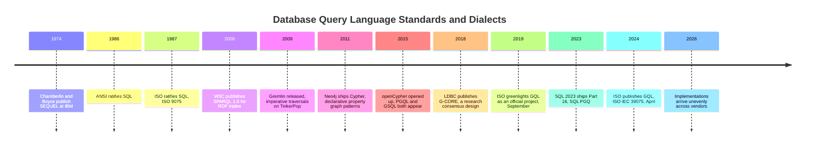
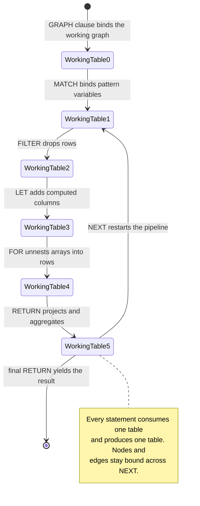
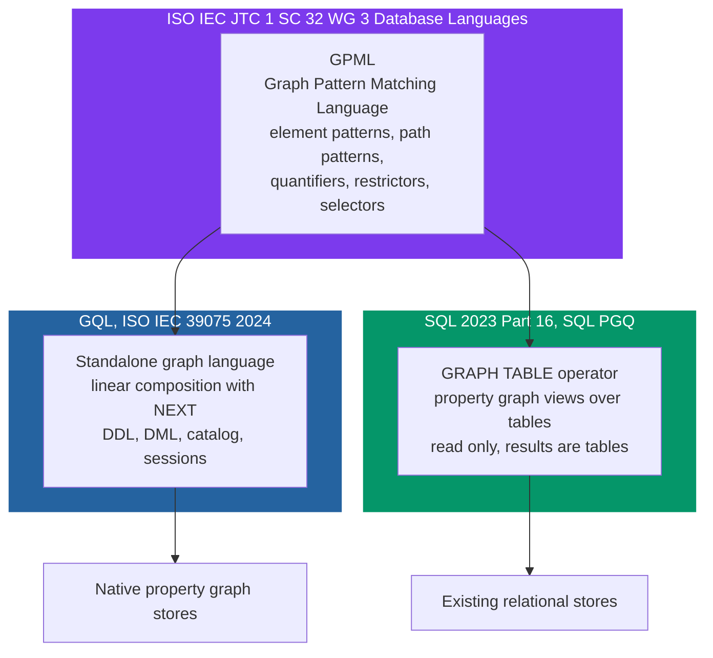
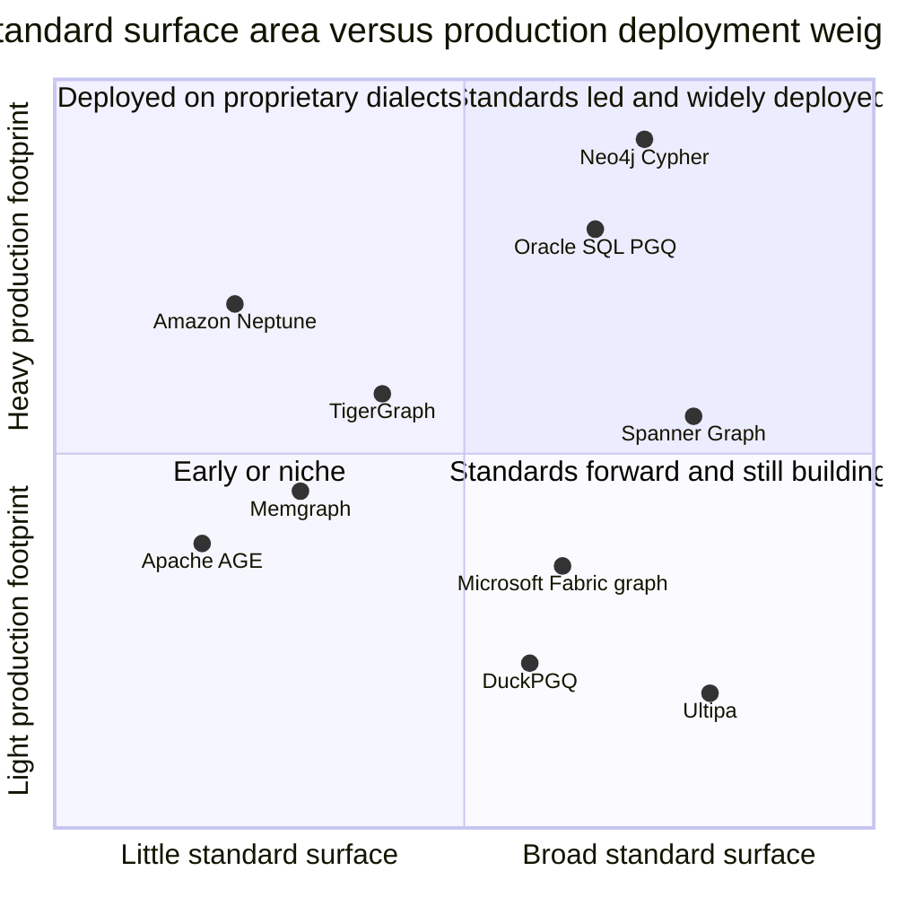

# GQL: The First New ISO Query Language Standard Since SQL

In April 2024, ISO/IEC published a document called ISO/IEC 39075:2024, *Information technology — Database languages — GQL*. It is a complete specification for a declarative query language over property graphs, produced by the same working group that has stewarded SQL for four decades, ratified by fourteen national standards bodies with zero disapprovals.

It is also the first new database query language standard ISO has published since SQL.

SQL became an ANSI standard in 1986 and an ISO standard in 1987. From that ISO ratification to GQL's publication is thirty-seven years. In that time the industry produced object databases, XML databases, the NoSQL wave, columnar analytics, the data lake, the lakehouse, three separate generations of stream processors, and roughly four hundred query dialects. None of them made it through ISO as a sibling database language. GQL did.

And almost nobody noticed. The week the standard was published, the data world was consumed by retrieval-augmented generation and function calling. A press release went out, a few graph vendors blogged, Hacker News had a thread, and the industry moved on. Two years later most senior data engineers I talk to know that "GQL is a thing" and cannot tell you what it standardizes, how it differs from Cypher, or that a second, arguably more consequential standard shipped alongside it inside SQL itself.

This is Part 2 of **Graph Engines Under the Hood**. [Part 1](https://juanlara18.github.io/portfolio/#/blog/graph-engine-internals-index-free-adjacency) dug into storage — index-free adjacency, record layouts, what actually happens on a traversal. This post moves up a layer to the language you write against that storage: what ISO actually standardized, what a Cypher user has to unlearn, why `GRAPH_TABLE` inside plain SQL might matter more to your architecture than GQL itself, and an honest accounting of how much of any of this is really implemented in 2026. Part 3 will use all of it to work through [engine selection](https://juanlara18.github.io/portfolio/#/blog/choosing-a-graph-engine-2026).

## The Fragmentation That Made a Standard Necessary

To understand why a standard was worth ten years of committee work, you have to appreciate how genuinely bad the situation was.

Suppose in 2020 you had built a knowledge graph on Neo4j and written six months of Cypher against it — the kind of pipeline I walked through in [Knowledge Graphs in Practice](https://juanlara18.github.io/portfolio/#/blog/knowledge-graphs-practice). Now you want to move to Amazon Neptune for operational reasons. Neptune spoke Gremlin and SPARQL. Gremlin is not a declarative query language at all; it is an imperative traversal API expressed as a fluent chain of steps. SPARQL is declarative but targets RDF triples, not property graphs — there is no such thing as a property on an edge in RDF without reification gymnastics. Your Cypher does not translate. Your mental model does not translate. Your team's expertise does not translate.

Now suppose instead you wanted to move to TigerGraph. TigerGraph spoke GSQL, invented in Mountain View starting in the summer of 2015 by Andrew Bachoo, Alin Deutsch, and Yu Xu — a language with SQL-flavored syntax and an accumulator-based computation model that has real advantages for analytics and no resemblance to Cypher whatsoever. Or Oracle: PGQL, a property graph language with a `SELECT ... MATCH ... WHERE` shape. Or the LDBC's research language G-CORE, which introduced path-as-first-class-citizen ideas that everybody admired and nobody shipped.

Six languages. Six type systems. Six ways to say "find me a path of length one to four between these two accounts." Zero portability.



Contrast this with the relational world, where the value of a standard is so thoroughly internalized that we forget it exists. A senior data engineer can walk into a shop running Postgres, another running Snowflake, another running BigQuery, and be productive on day one. Window functions work. CTEs work. `GROUP BY` works. The dialects differ at the edges — array handling, JSON operators, `QUALIFY`, date arithmetic — but the core is shared, and critically, *the skills are shared*. You hire for "SQL," not for "Snowflake SQL."

That shared core is worth an enormous amount of money in aggregate, and almost none of it shows up on any vendor's balance sheet. It shows up as reduced hiring risk, reduced migration cost, a training industry that can exist at all, and a negotiating position: if your vendor's pricing gets abusive, the exit is expensive but conceivable.

Graph databases had none of this. Every graph adoption was, structurally, a bet on one vendor's continued existence and pricing discipline. That is a real reason serious enterprises stayed away, and I have sat in the meetings where it was said out loud: *we are not putting the customer entity resolution graph in a language only one company speaks.*

The GQL project was inaugurated as an official ISO project in September 2019, driven by a coalition that included Neo4j, Oracle, TigerGraph, SAP, and the academic Linked Data Benchmark Council. Seven national standards bodies nominated experts: the United States, China, Korea, the Netherlands, the United Kingdom, Denmark, and Sweden. The work happened in ISO/IEC JTC 1/SC 32/WG 3 — Database Languages — which is precisely the committee that maintains SQL.

The balloting record is worth glancing at, because it tells you something about how contested the design was. The first Committee Draft ballot opened in November 2021 and drew over 800 comments by February 2022. A second CD consultation followed in August 2022. The Draft International Standard ballot ran from May to August 2023: twelve approvals, zero disapprovals, eight abstentions, and 493 further comments. The Final Draft International Standard ballot closed in March 2024 with fourteen approvals and zero disapprovals. Publication followed in April 2024.

Roughly thirteen hundred comments across two rounds is not a rubber stamp. It is a decade of argument, and the shape of the resulting language reflects the compromises.

## What GQL Actually Standardizes

GQL is not "Cypher, but ISO." It is a full database language in the sense that SQL is: a data model, a query sub-language, a data definition sub-language, a data manipulation sub-language, a catalog, a session model, transactions, a type system, and a standardized error surface.

Let us take those in turn, and be precise about the boundaries.

### The data model

GQL standardizes the **property graph**. A graph contains nodes and edges. Nodes and edges carry a set of labels and a set of properties, where a property is a name bound to a value of a declared type. Edges connect two nodes and may be **directed or undirected** — and that second option is a genuine model-level feature, not just a pattern-matching convenience. Cypher's data model has only directed relationships; you can *match* without specifying direction, but every relationship in the store has one. GQL's model admits edges that genuinely have no direction.

Importantly, GQL standardizes graphs as *first-class catalog objects*. A GQL session has a working graph and can reference multiple graphs by name. This is not incidental — it is what makes composability possible, and it is one of the sharper departures from the single-graph-per-database assumption that Cypher grew up with.

### Graph pattern matching

The heart of the language is a sub-language the committee calls **GPML**, the Graph Pattern Matching Language. This is where the visual `(node)-[edge]->(node)` syntax lives, and where the interesting design work happened. GPML standardizes:

- **Element patterns** — `(a:Person)`, `[e:TRANSFERS]` — with label expressions that support conjunction, disjunction, and negation, plus inline property filters and `WHERE` clauses.
- **Path patterns** — sequences of element patterns, with direction (`->`, `<-`, `-`, `<->`).
- **Quantified path patterns** — `{1,4}`, `+`, `*`, `?` applied to a path pattern, giving regex-like repetition.
- **Path modes (restrictors)** — `WALK`, `TRAIL`, `SIMPLE`, `ACYCLIC` — which control whether repeated nodes or edges are permitted along a match.
- **Path selectors** — `ANY`, `ALL`, `ANY SHORTEST`, `ALL SHORTEST`, `SHORTEST k` — which control how many matches to keep out of a potentially enormous set.

That third and fourth bullet deserve emphasis, because they solve a problem every graph practitioner has hit. In a graph with cycles, "find paths from A to B of length up to 6" can produce an infinite result set unless you constrain repetition. Every engine had a proprietary answer. Neo4j's variable-length relationships implicitly used trail semantics — no repeated relationships — which is a defensible default that nobody wrote down as a *choice*. GQL makes the choice explicit and nameable, and that is exactly what a standard is for.

### Graph schema

GQL standardizes **graph types**, which are to graphs what a schema is to a set of tables. A graph type declares which node types and edge types may exist, what properties each carries, and what constraints hold.

```gql
CREATE GRAPH TYPE socialType AS {
  ABSTRACT (:Message => {
      id :: UINT64 NOT NULL,
      creationDate :: ZONED DATETIME,
      content :: STRING,
      length :: UINT64
  }),

  (:Person => {
      id :: UINT64 NOT NULL,
      firstName :: STRING,
      lastName :: STRING,
      birthday :: UINT64
  }),

  (:Organization => {
      id :: UINT64 NOT NULL,
      name :: STRING,
      url :: STRING
  }),

  (:University => :Organization),
  (:Company => :Organization),

  (:Post => :Message += { language :: STRING, imageFile :: STRING }),
  (:Comment => :Message),

  (:Person)-[:knows { creationDate :: ZONED DATETIME }]->(:Person),
  (:Person)-[:studyAt { classYear :: UINT64 }]->(:University),
  (:Person)-[:workAt { workFrom :: UINT64 }]->(:Company),

  CONSTRAINT person_pk FOR (n:Person) REQUIRE n.id IS KEY
}
```

Several things in that block are worth pausing on.

The `::` operator declares a property's type. `NOT NULL` is **part of the type**, not a separate constraint — which is a deliberate divergence from SQL, where nullability is a column constraint. In GQL, `STRING` and `STRING NOT NULL` are two different types, and a graph type that declares `(:A { id :: STRING })` alongside `(:B { id :: STRING NOT NULL })` is valid, while one declaring `(:A { id :: STRING })` alongside `(:B { id :: INT })` is not.

The `=>` separates a node type's **key label** from its secondary labels. `(:University => :Organization)` says universities are organizations and inherit organization's properties. The `+=` operator adds properties on top of inherited ones. `ABSTRACT` declares a type that exists purely to structure the hierarchy — you cannot load nodes into it directly.

GQL supports both **closed** graph types, where only declared node and edge types may exist, and **open** graph types, where the declaration is a floor rather than a ceiling. These are separate conformance features in the standard, which means a conforming implementation can offer one without the other. That is a small detail with large practical consequences, and we will come back to it.

### The rest of the language

GQL also standardizes data manipulation (`INSERT`, `SET`, `REMOVE`, `DELETE`, `DETACH DELETE`), a catalog of directories and schemas holding graphs and graph types, sessions with settable parameters and a home graph, transactions (`START TRANSACTION`, `COMMIT`, `ROLLBACK`), and — this one is underrated — a standardized status and error framework called **GQLSTATUS**, modeled on SQLSTATE. Every conforming implementation reports "you referenced an undefined variable" with the same five-character code.

If you have ever written retry logic that regex-matched vendor error strings, you know why this matters.

## Reading Real GQL

Enough architecture. Here is what a GQL query actually looks like. This example is in the shape used by Google's Spanner Graph, one of the more complete GQL implementations shipping today.

```gql
GRAPH FinGraph
MATCH (p:Person)-[o:Owns]->(a:Account)
FILTER a.balance > 10000
RETURN p.name AS owner, a.id AS account_id, a.balance
ORDER BY a.balance DESC
LIMIT 20
```

`GRAPH FinGraph` names the working graph. `MATCH` binds the pattern. `FILTER` — note, not `WHERE` as a standalone clause — removes rows. `RETURN` ends the statement.

Now the interesting part. GQL's execution model is **linear composition**: each statement takes a *working table* as input, transforms it, and hands a working table to the next statement. The `NEXT` keyword chains linear statements together explicitly.

```gql
GRAPH FinGraph
MATCH (:Account)-[:Transfers]->(account:Account)
RETURN account, COUNT(*) AS num_incoming_transfers
GROUP BY account

NEXT

MATCH (account:Account)<-[:Owns]-(owner:Person)
RETURN account.id, owner.name, num_incoming_transfers
```

The first block aggregates incoming transfers per account. `NEXT` pipes the result — including the bound `account` node, not just its properties — into a second block that joins each account back to its owner. This is a pipeline, and it reads like one.

`LET` introduces bindings without the ceremony of a projection:

```gql
GRAPH FinGraph
MATCH (p:Person)-[:Owns]->(a:Account)
LET risk_weight = 1.5, threshold = 50000
FILTER a.balance * risk_weight > threshold
RETURN p.name, a.id, a.balance * risk_weight AS weighted_balance
```

`FOR` unnests arrays, with an optional ordinal:

```gql
GRAPH FinGraph
MATCH (p:Person)-[:Owns]->(a:Account)
FOR tag IN ["kyc", "aml", "sanctions"] WITH OFFSET AS check_order
RETURN p.id, tag AS check_type, check_order
ORDER BY p.id, check_order
```

And here is the pattern-matching machinery doing real work — a quantified path with an explicit restrictor and an explicit selector, which is the kind of query that used to require vendor-specific incantations:

```gql
GRAPH FinGraph
MATCH TRAIL (src:Account)-[t:Transfers]->{1,4}(dst:Account)
WHERE src.id = 'ACC-1001' AND dst.flagged = true
RETURN dst.id AS destination, size(t) AS hops
ORDER BY hops
```

`TRAIL` forbids reusing the same edge within a match, which is what stops a cycle from generating unbounded results. `{1,4}` bounds the repetition. And `t` here is a **group variable** — because it sits inside a quantified pattern, it binds to the *list* of edges traversed rather than a single edge, which is why `size(t)` gives you the hop count.

That last point catches people. In GQL, a variable's arity depends on whether it appears inside a quantifier. Outside, it is a singleton. Inside, it is a group. This is formalized precisely in the standard, and it is the sort of thing that will bite you once and then never again.

Here is the shape of the linear model, since it is the single most important thing to internalize about GQL:



## GQL vs Cypher: What Actually Differs

Neo4j's own framing is that a Cypher user is "95% there." That is roughly right in the way that "French and Spanish are 95% the same" is roughly right — true enough for reading, false enough for writing.

The genuine similarities are structural and deep. Both use the ASCII-art pattern syntax. Both use linear composition rather than SQL's bottom-up nesting. Both use `MATCH` and `RETURN` and `ORDER BY` and `LIMIT` with the same meanings. Cypher's influence on GQL is not in dispute — Stefan Plantikow, the GQL editor, came from Neo4j, and openCypher was contributed explicitly as input to the standardization process.

Here is what actually diverges.

| Concern | Cypher | GQL |
|---|---|---|
| Create data | `CREATE (n:Person {name: 'Ada'})` | `INSERT (n:Person {name: 'Ada'})` |
| Variable-length path | `-[r:KNOWS*1..3]->` | `-[r:KNOWS]->{1,3}` |
| Unbounded path | `-[r:KNOWS*]->` | `-[r:KNOWS]->*` or `->+` |
| Unnest a list | `UNWIND xs AS x` | `FOR x IN xs` |
| Bind an intermediate value | `WITH a, b, expr AS c` | `LET c = expr` |
| Filter mid-pipeline | `WITH ... WHERE ...` | `FILTER ...` |
| Chain query stages | `WITH` (implicit) | `NEXT` (explicit) |
| Path repetition semantics | implicit trail semantics | explicit `WALK` / `TRAIL` / `SIMPLE` / `ACYCLIC` |
| Shortest path | `shortestPath()` function | `ANY SHORTEST`, `ALL SHORTEST`, `SHORTEST k` selectors |
| Schema | constraints and indexes, no closed schema in the language | `CREATE GRAPH TYPE`, open or closed |
| Multiple graphs | one graph per database, `USE` for composite | graphs are catalog objects, session-level working graph |
| Edge direction in the model | always directed | directed or undirected |
| Errors | Neo4j-specific status codes | GQLSTATUS, standardized |

Four of these are worth expanding, because they change how you write rather than just what you type.

**`LET` versus `WITH`.** In Cypher, `WITH` is a projection boundary: everything you want to carry forward must be restated. Forget a variable and it silently vanishes from scope. This is the single most common source of "why is my Cypher returning nothing" bugs I have watched people hit. GQL's `LET` is additive and non-blocking — it adds a binding to the working table and leaves everything else alone. `FILTER` similarly does one job. The result is that GQL pipelines tend to have fewer restated-variable lines and fewer scope accidents.

**Explicit path modes.** Cypher's variable-length relationship patterns have used trail semantics — no repeated relationship — since roughly forever. It is a good default. But it is *implicit*, which means that when you actually need `WALK` semantics (repeated edges allowed, for instance when counting all cycles of length k) or `ACYCLIC` semantics (no repeated node, which is stricter than trail), you are writing workarounds. GQL makes all four modes first-class keywords. Neo4j has since added path-mode syntax to Cypher precisely to converge here.

**Quantifier placement.** Cypher puts the quantifier inside the relationship bracket: `-[r:KNOWS*1..3]->`. GQL puts it *after the path pattern*: `-[r:KNOWS]->{1,3}`. This looks like cosmetic surgery and is not. Because the quantifier applies to a whole path pattern, GQL can quantify multi-element patterns:

```gql
GRAPH FinGraph
MATCH TRAIL (a:Account) ((x)-[:Transfers]->(y) WHERE y.amount_flag = true){2,5} (b:Account)
WHERE a.id = 'ACC-1001'
RETURN b.id
```

That repeats an entire parenthesized sub-pattern, with its own filter, two to five times. Cypher's bracket-internal quantifier structurally cannot express that; the quantified path pattern feature Neo4j added later is Cypher adopting GQL's placement.

**Graph types.** Cypher has property existence constraints, uniqueness constraints, and type constraints, but no way to say "this graph contains exactly these node types and edge types and nothing else." GQL's closed graph types give you that, with an inheritance hierarchy. If you have ever inherited a Neo4j instance where somebody's one-off script introduced a `:person` label alongside `:Person`, you understand the appeal.

The unlearning list for a Cypher user is therefore short but real: `CREATE` becomes `INSERT`, `UNWIND` becomes `FOR`, `WITH` splits into `LET` plus `FILTER` plus `NEXT`, quantifiers move outside the bracket, and path semantics become something you declare rather than something you inherit.

## SQL/PGQ: Graph Queries Without a Graph Database

Now the part of this story that gets least attention and, in my experience advising on architecture, matters most.

While WG3 was building GQL, the same working group added **Part 16 to the SQL standard**. SQL:2023 shipped ISO/IEC 9075-16, titled *Property Graph Queries*, universally abbreviated **SQL/PGQ**.

SQL/PGQ lets you declare a property graph as a **view over existing relational tables**, and then run graph pattern matching over that view from inside an ordinary SQL query. No new database. No ETL. No second copy of your data. No 2 a.m. sync job.

The declaration looks like this:

```sql
CREATE PROPERTY GRAPH snb
VERTEX TABLES (
    Person
        KEY (id)
        LABEL Person
        PROPERTIES (id, firstName, lastName, birthday)
)
EDGE TABLES (
    Person_knows_person
        KEY (person1id, person2id)
        SOURCE KEY (person1id) REFERENCES Person (id)
        DESTINATION KEY (person2id) REFERENCES Person (id)
        LABEL Knows
        PROPERTIES (creationDate)
);
```

Read that carefully. `Person` is a table you already have. `Person_knows_person` is a join table you already have. The `CREATE PROPERTY GRAPH` statement adds *no data* — it declares that these tables should also be interpretable as a graph, with the foreign keys interpreted as edges.

Querying uses a new operator in the `FROM` clause, `GRAPH_TABLE`:

```sql
SELECT firstName, lastName
FROM GRAPH_TABLE (snb
    MATCH (a:Person WHERE a.firstName = 'Jan')-[k:Knows]->(b:Person)
    COLUMNS (b.firstName AS firstName, b.lastName AS lastName)
)
ORDER BY lastName;
```

`GRAPH_TABLE` takes a graph name, a `MATCH` pattern, and a `COLUMNS` clause that projects pattern variables into relational columns. The result is *a table*. It participates in joins, subqueries, CTEs, window functions, `GROUP BY` — everything in SQL. This is the crucial design decision: SQL/PGQ does not create a parallel query universe. It creates a table-valued operator that happens to be very good at pattern matching.

Variable-length traversal and shortest paths work too:

```sql
SELECT hops, firstName
FROM GRAPH_TABLE (snb
    MATCH p = ANY SHORTEST (a:Person WHERE a.id = 933)-[k:Knows]->+(b:Person)
    COLUMNS (path_length(p) AS hops, b.firstName AS firstName)
)
WHERE hops > 2
ORDER BY hops, firstName
LIMIT 25;
```

`->+` is one-or-more repetition. `ANY SHORTEST` is the same path selector GQL uses. `path_length(p)` is one of the standard path functions, alongside `vertices(p)`, `edges(p)`, and `element_id(p)`.

Now consider what this means for a real architecture. You have a customer table, an account table, a transaction table, and a device-fingerprint table in Postgres or Oracle or BigQuery. You want to run a three-hop fraud ring detection query. The conventional answer is: build a graph pipeline, land the data in Neo4j, keep it in sync, operate a second database, secure a second database, back up a second database, and explain to your compliance team why customer data now lives in two places.

The SQL/PGQ answer is: write a `CREATE PROPERTY GRAPH` statement over the tables you already have, and write the fraud query. The engine rewrites the pattern match into joins and runs it through the existing optimizer. Oracle's implementation notes are explicit that SQL/PGQ statements are transformed into regular joins, which means existing execution plan machinery, existing statistics, existing parallelism, existing security.

I want to be careful not to oversell this. Rewriting patterns into joins means SQL/PGQ inherits the join optimizer's behavior on deep traversals, which is exactly the workload where the index-free adjacency machinery from [Part 1](https://juanlara18.github.io/portfolio/#/blog/graph-engine-internals-index-free-adjacency) earns its keep. A six-hop traversal over a hundred-million-edge table is not going to match a native graph engine's traversal performance, and no amount of standardization changes that. SQL/PGQ is the right answer for graph *semantics* over data whose natural home is relational, with traversals in the one-to-four-hop range. It is the wrong answer for a graph-native workload with deep, unbounded traversals.

But an enormous fraction of enterprise "we need a graph database" requests are actually "we need multi-hop join semantics that are readable and that the optimizer can handle," and for those, avoiding a data migration is worth a great deal.

One portability wrinkle to know about: label syntax inside `GRAPH_TABLE` is not uniform across implementations. Oracle spells element patterns as `(v IS Person)` while DuckDB's DuckPGQ extension accepts `(v:Person)`. Same standard, different surface. We will return to what to do about that.

## The Shared Core, and Why the Committee Did It That Way

Here is the design decision that makes both standards more than the sum of their parts.

GQL's pattern matching and SQL/PGQ's pattern matching are **the same sub-language**. Not similar. The same. WG3 specified GPML once and embedded it in two hosts. The 2021 paper that introduced GPML to the research community — authored by eighteen people spanning WG3 and the LDBC, including Deutsch, Francis, Green, Libkin, Plantikow, and Zemke — states it plainly: the identical core of both PGQ and GQL is a graph pattern matching sub-language.



The strategic logic is worth spelling out. If you are a standards body trying to get a graph query language adopted, you face a bootstrapping problem: nobody learns a language with no jobs, and nobody creates jobs for a language nobody knows. By putting the pattern-matching core inside SQL, WG3 gave every SQL developer on earth a low-commitment on-ramp. You learn `MATCH (a)-[e]->(b)` once, in a context where you are already productive, and that knowledge transfers directly to GQL if and when you adopt a native graph store.

It also gives vendors a graduated commitment path. Adding `GRAPH_TABLE` to an existing relational engine is a substantial but bounded piece of work — you are writing a pattern-to-join rewriter, not a new storage engine. Oracle did it. DuckDB's community did it as an extension. Full GQL is a much larger lift.

The two hosts are not identical, though, and the differences are more than syntactic. The most rigorous account is a 2024 paper by Amélie Gheerbrant, Leonid Libkin, Liat Peterfreund, and Alexandra Rogova, which defines simplified core languages — Core GQL and Core PGQ — precisely so the standards can be reasoned about formally.

Their central structural finding: **PGQ evaluates bottom-up; GQL evaluates linearly.** In SQL/PGQ, `GRAPH_TABLE` produces a table and the surrounding SQL applies relational algebra on top of that output — a classic bottom-up composition. In GQL, each clause transforms a table into another table in sequence, pipelined. These produce different natural expressions of the same intent, and the paper works through examples where the translation is non-obvious.

They also establish real inexpressibility results, and these are the kind of thing worth knowing before you commit an architecture. A pattern in either language **cannot** express "find a path where the edge timestamps are increasing." Node-property conditions along a path are easy; edge-property comparisons *between consecutive edges* are not expressible by a one-way path pattern query. They further show there are queries expressible in positive recursive SQL and in linear Datalog that Core GQL cannot express.

And the workarounds do not save you. The authors tested the natural encoding of the increasing-timestamps query on Neo4j and observed timeouts in more than half of trials on graphs with a mere twenty-four nodes.

If your workload involves temporal path constraints — money flowing forward in time through a chain of accounts is the canonical example, and it is a *very* common fraud pattern — you are going to be reaching for a stored procedure or application-side logic regardless of which standard you adopt. Know that going in.

## Adoption in 2026: An Honest Survey

A standard existing is not a standard implemented. Here is where things actually stand as I write this in mid-2026, with the caveat that this is the fastest-moving section of the post and will age worst.

**The structural problem first.** ISO defines the language. ISO ships no reference implementation and no official conformance test suite. Conformance is *self-declared*: a vendor writes a conformance statement listing which features it supports, per the framework in the standard's subclause 24.2. GQL defines a set of mandatory features plus a large body of optional ones — 228 of them. Two vendors can both claim GQL conformance and share very little.

This is not unprecedented. SQL conformance has always worked this way, and SQL's practical portability comes from convergent market pressure rather than from ISO enforcement. But SQL had thirty-seven years to converge. GQL has had two.

**Neo4j** has moved deliberately and is the most legible case because it publishes a conformance appendix. Cypher supports most mandatory GQL features and a substantial portion of the optional ones, with some mandatory features still outstanding. Concretely: GQL-standard notifications arrived in Neo4j 5.23, GQL-standard errors in 5.25, and from 5.26 driver-level errors carry GQLSTATUS codes, status descriptions, and diagnostic records alongside the legacy Neo4j exception. Quantified path patterns and path selectors are in Cypher. Neo4j's public position is that Cypher is converging on GQL rather than being replaced by it — you will keep writing something that looks like Cypher, and it will become progressively more GQL-conformant.

**Google Cloud** shipped GQL as the graph query surface for **Spanner Graph** and for graph in **BigQuery**. This is one of the more complete implementations of the query language: `GRAPH`, `MATCH`, `OPTIONAL MATCH`, `LET`, `FILTER`, `FOR`, `NEXT`, `RETURN`, set operations, quantified patterns, path selectors. Notably, Spanner defines the graph *over relational tables* — the schema DDL is SQL — so it is architecturally a hybrid: SQL/PGQ-style graph-over-tables storage with a GQL query surface. I covered the operational side of this in [Enterprise Knowledge Graphs on GCP](https://juanlara18.github.io/portfolio/#/blog/enterprise-graph-mcp-architecture-gcp).

**Microsoft** shipped graph in Fabric with GQL as its query language, and the documentation is instructive: it presents graph types using standard GQL syntax while noting explicitly that the DDL syntax itself is not currently supported directly. That is a very honest form of the pattern you see everywhere right now — the query surface lands before the schema surface.

**Ultipa** publishes the most detailed conformance declaration I have found from any vendor: 155 of the 228 optional features supported, with named gaps including session management statements, path multiset alternation, and simplified path expressions. Whatever you think of the engine, publishing a feature-by-feature conformance statement is exactly the behavior a standard is supposed to induce, and more vendors should copy it.

**TigerGraph** was a founding participant and the principal advocate for the SQL-flavored side of GQL. It has committed publicly to implementing the standard while continuing to support GSQL and openCypher.

**On the SQL/PGQ side**, Oracle Database has shipped SQL property graphs and `GRAPH_TABLE` since 23ai and carried it forward in 26ai, including tooling integration in SQL Developer. DuckDB has SQL/PGQ through the **DuckPGQ** community extension, which is a genuinely delightful way to learn the syntax — it installs in one command and runs on a laptop. SAP HANA has been an active WG3 participant. Postgres has no native SQL/PGQ; Apache AGE provides openCypher over Postgres, which is a different thing.

**Memgraph, Amazon Neptune, ArangoDB, KuzuDB, FalkorDB** are, as of this writing, primarily openCypher or Gremlin engines with GQL on roadmaps of varying concreteness. PuppyGraph, similarly, ships openCypher and Gremlin with GQL stated as planned.

Here is my read of the landscape, plotted honestly:



The honest summary: **the pattern-matching core is landing broadly; everything above and below it is not.** If you write `MATCH` patterns with quantifiers and path selectors, a growing number of engines will understand you. If you write `CREATE GRAPH TYPE`, session statements, or lean on GQLSTATUS-driven error handling, you are in vendor-specific territory today.

Also worth stating plainly: several things people *assume* are in the standard are not. Graph algorithms — PageRank, community detection, centrality — are entirely out of scope; every algorithm library is proprietary. Indexes are not standardized, exactly as SQL never standardized them. Vector types and similarity search are not in GQL 1, which is awkward given that a large share of 2026 graph deployments exist to serve retrieval pipelines. Full-text search is not standardized. There is no standard wire protocol or driver API — Bolt, HTTP, and gRPC remain vendor territory, so "portable queries" does not imply "portable clients." And the 93 language opportunities the committee deferred during the CD ballots are queued for future editions rather than dead.

## Writing Portable Graph Queries Today

So what do you actually do with this?

My working guidance, in order of how much leverage it gives you:

**1. Treat GPML as the portable subset and everything else as vendor code.** Pattern matching with labels, quantifiers, path modes, and path selectors is the part with real cross-vendor traction. Write your traversals there. Aggregations, window functions, algorithm calls, index hints, and full-text predicates are where dialects diverge — expect to rewrite those.

**2. Prefer `FILTER` and `LET` over `WITH` in new code where your engine supports them.** They are the standard spellings and they are clearer. If your engine only speaks Cypher, at least keep `WITH` usage minimal and mechanical, so translation later is a find-and-replace rather than a rethink.

**3. Declare path semantics explicitly even when the default is what you want.** Writing `MATCH TRAIL (a)-[e]->{1,5}(b)` instead of relying on your engine's implicit trail semantics costs one keyword and documents the intent. When you migrate, the reader knows what was meant.

**4. Isolate the dialect boundary in code.** This is the one that actually saves projects. Do not scatter query strings across your application. Put them behind a thin layer that knows which dialect it is emitting.

```python
"""Minimal dialect boundary for portable graph queries.

The point is not to build a universal translator. It is to make the
vendor-specific surface small, visible, and testable, so a migration
is a bounded change rather than an archaeology project.
"""

from dataclasses import dataclass
from enum import Enum
from typing import Any, Mapping


class Dialect(Enum):
    GQL = "gql"                 # ISO 39075: Spanner Graph, Fabric graph, Ultipa
    CYPHER = "cypher"           # Neo4j, Memgraph, Neptune openCypher
    SQL_PGQ = "sql_pgq"         # Oracle 23ai/26ai, DuckDB via DuckPGQ


@dataclass(frozen=True)
class GraphQuery:
    """One logical query, rendered per dialect.

    Keep the GPML pattern identical across renderings wherever possible.
    Every divergence you are forced to introduce is a portability cost
    you have now made explicit and reviewable in a diff.
    """

    name: str
    gql: str
    cypher: str
    sql_pgq: str

    def render(self, dialect: Dialect) -> str:
        return {
            Dialect.GQL: self.gql,
            Dialect.CYPHER: self.cypher,
            Dialect.SQL_PGQ: self.sql_pgq,
        }[dialect]


FLAGGED_TRANSFER_CHAINS = GraphQuery(
    name="flagged_transfer_chains",
    gql="""
        GRAPH FinGraph
        MATCH TRAIL (src:Account)-[t:Transfers]->{1,4}(dst:Account)
        WHERE src.id = $source_id AND dst.flagged = true
        RETURN dst.id AS destination, size(t) AS hops
        ORDER BY hops
        LIMIT $row_limit
    """,
    cypher="""
        MATCH TRAIL (src:Account)-[t:Transfers]->{1,4}(dst:Account)
        WHERE src.id = $source_id AND dst.flagged = true
        RETURN dst.id AS destination, size(t) AS hops
        ORDER BY hops
        LIMIT $row_limit
    """,
    # Note: label syntax, projection, and row limiting all differ here, and
    # path-mode support varies by engine. Bind an explicit path variable so
    # path_length() has something standard to measure.
    sql_pgq="""
        SELECT destination, hops
        FROM GRAPH_TABLE (fin_graph
            MATCH TRAIL p = (src IS Account)-[t IS Transfers]->{1,4}(dst IS Account)
            WHERE src.id = :source_id AND dst.flagged = true
            COLUMNS (dst.id AS destination, path_length(p) AS hops)
        )
        ORDER BY hops
        FETCH FIRST :row_limit ROWS ONLY
    """,
)


class GraphClient:
    """Wraps a driver so the rest of the app never sees a dialect."""

    def __init__(self, driver: Any, dialect: Dialect) -> None:
        self._driver = driver
        self._dialect = dialect

    def run(self, query: GraphQuery, params: Mapping[str, Any]) -> list[dict]:
        text = query.render(self._dialect)
        # Parameter binding style is itself vendor-specific: $name for
        # Neo4j and Spanner, :name for Oracle, ? for DuckDB. Normalize here,
        # in exactly one place, rather than at every call site.
        return self._driver.execute(text, params)
```

Look at what that file makes visible. The GQL and Cypher renderings are byte-identical in this case — which is the point, and which is only true because we restricted ourselves to GPML. The SQL/PGQ rendering differs in three specific, reviewable ways: labels spelled with `IS` rather than `:`, projection through `COLUMNS` rather than `RETURN`, and `FETCH FIRST` rather than `LIMIT`. Three divergences, all in one file, all testable.

Compare that to the alternative, where the same query is embedded in four services with subtle drift, and a migration means grepping for parentheses.

**5. Ask vendors for their conformance statement, in writing, before you sign.** The standard defines a conformance framework precisely so this question has a real answer. "We support GQL" is marketing. "We support these mandatory features, these 155 of 228 optional features, and here are the named gaps" is engineering. Ultipa publishes one. Neo4j publishes a conformance appendix. Make it a procurement question, because the act of asking is how the market converges.

**6. If your data is already relational, seriously evaluate SQL/PGQ before you buy a graph database.** This is the guidance I give most often and the one most often ignored. The question to ask is not "would a graph model be nicer?" — it usually would. The question is "do my traversals go deeper than four hops, and is traversal throughput my bottleneck?" If the answer is no, `GRAPH_TABLE` over your existing warehouse gives you the query semantics without a second system, a second security boundary, or a sync pipeline. Part 3 will work through this decision in detail.

**7. Do not architect around features that are not shipped.** Closed graph types are excellent and I want them. In 2026 I would not design a data governance strategy that depends on them being enforced by the engine. Write the graph type as documentation, enforce the constraints in your ingestion pipeline, and adopt engine-level enforcement when it lands.

## The Longer Arc

Standards move on a timescale that makes them easy to dismiss. SQL was ratified in 1986 and did not become genuinely portable in practice until well into the 1990s. Nobody in 1988 could have told you that "SQL developer" would be a durable job title for four decades.

GQL is at its 1988. The specification is real, the committee is the same one that has kept SQL coherent since before most of us were writing code, and the governance model means the language will evolve through a process rather than through one vendor's product roadmap. That is worth something even in years where nothing visibly happens.

What I find most clever about the whole effort is the SQL/PGQ hedge. The committee did not bet everything on convincing the world to adopt a new database. They put the interesting half of the language — the pattern matching — inside the language everybody already speaks, running over the data everybody already has. That is how you standardize an idea rather than a product. In ten years I suspect far more graph pattern matching will run through `GRAPH_TABLE` than through native GQL, and the committee will have won anyway, because the semantics will be the same either way.

Part 3 takes all of this and gets concrete about picking an engine.

## Going Deeper

**Books:**

- Robinson, I., Webber, J., & Eifrem, E. (2015). *Graph Databases: New Opportunities for Connected Data* (2nd ed.). O'Reilly Media.
  - The canonical introduction to property graph modeling. Predates GQL entirely, which makes it useful for seeing which ideas the standard formalized and which it left behind.

- Melton, J., & Simon, A. R. (2001). *SQL:1999 — Understanding Relational Language Components*. Morgan Kaufmann.
  - Written by a longtime SQL standard editor. The best available account of how a database language standard is actually constructed and negotiated, which is exactly the process GQL went through twenty years later.

- Needham, M., & Hodler, A. E. (2019). *Graph Algorithms: Practical Examples in Apache Spark and Neo4j*. O'Reilly Media.
  - Useful precisely because it covers the territory GQL explicitly does *not* standardize. Read it to understand what will remain vendor-specific.

- Date, C. J., & Darwen, H. (1996). *A Guide to SQL Standard* (4th ed.). Addison-Wesley.
  - A rigorous, opinionated reading of a language standard by people who thought hard about where it went wrong. The critical posture is the transferable part.

**Online Resources:**

- [gqlstandards.org](https://www.gqlstandards.org/) — The GQL project's own site: scope, feature digests, balloting history, and committee process documents. Start with the Committees and Processes page if you want to understand how WG3 actually operates.
- [ISO/IEC 39075:2024 catalogue entry](https://www.iso.org/standard/76120.html) — The official standard. Paid, and expensive, but the abstract and table of contents are public and tell you the scope precisely.
- [Neo4j GQL conformance appendix](https://neo4j.com/docs/cypher-manual/current/appendix/gql-conformance/) — A live, feature-by-feature account of how one major engine maps onto the standard, including the gaps. The best available model for what a vendor conformance disclosure should look like.
- [Spanner Graph GQL reference](https://docs.cloud.google.com/spanner/docs/reference/standard-sql/graph-query-statements) — Complete, runnable documentation for `GRAPH`, `MATCH`, `LET`, `FILTER`, `FOR`, `NEXT`, and set operations. Currently the most useful place to learn GQL query syntax from working examples.
- [DuckPGQ documentation](https://duckpgq.org/documentation/sql_pgq/) — SQL/PGQ in DuckDB. Installs in one command and runs on a laptop, which makes it the lowest-friction way to get hands on `GRAPH_TABLE` and `CREATE PROPERTY GRAPH`.
- [PGQL language site](https://pgql-lang.org/) — Oracle's pre-standard property graph language, and a direct ancestor of SQL/PGQ. Reading it alongside the standard shows you which design arguments were won and lost.

**Videos:**

- [NODES 2024 — A New Era for Graph Queries: ISO/IEC 39075 GQL](https://www.youtube.com/watch?v=dvK6WgNy5BM) — A walkthrough of the published standard: the property graph model, pattern matching, graph types, and how Cypher relates to GQL.
- [DuckPGQ: SQL/PGQ in DuckDB](https://www.youtube.com/watch?v=Fzci3Ic0RBQ) by Daniël ten Wolde, CWI, at the 19th LDBC TUC meeting — How SQL/PGQ is implemented on top of a relational engine, including the pattern-to-join rewriting that makes the whole approach viable.
- [Unlocking graph analytics in DuckDB with SQL/PGQ](https://www.youtube.com/watch?v=QDdTbhSR2Vo) — A DuckCon lightning talk on running graph workloads without a graph database. Short, concrete, and a good demonstration of the practical argument in this post.

**Academic Papers:**

- Deutsch, A., Francis, N., Green, A., Hare, K., Li, B., Libkin, L., Lindaaker, T., Marsault, V., Martens, W., Michels, J., Murlak, F., Plantikow, S., Selmer, P., van Rest, O., Voigt, H., Vrgoč, D., Wu, M., & Zemke, F. (2021). ["Graph Pattern Matching in GQL and SQL/PGQ."](https://arxiv.org/abs/2112.06217) *arXiv:2112.06217*.
  - Written by WG3 and LDBC members ahead of publication, this is the authoritative description of GPML — the pattern-matching sub-language shared by both standards. If you read one paper here, read this one.

- Gheerbrant, A., Libkin, L., Peterfreund, L., & Rogova, A. (2024). ["GQL and SQL/PGQ: Theoretical Models and Expressive Power."](https://arxiv.org/abs/2409.01102) *arXiv:2409.01102*.
  - Defines Core GQL and Core PGQ as formal objects, establishes that PGQ evaluates bottom-up while GQL evaluates linearly, and proves genuine inexpressibility results — including that neither language can express paths with increasing edge values. The experimental section, where workarounds time out on twenty-four-node graphs, is the part to show your architects.

- Francis, N. (2023). ["A Researcher's Digest of GQL."](https://drops.dagstuhl.de/storage/00lipics/lipics-vol255-icdt2023/LIPIcs.ICDT.2023.1/LIPIcs.ICDT.2023.1.pdf) *26th International Conference on Database Theory (ICDT 2023)*, LIPIcs Vol. 255.
  - A compact, formally careful tour of GQL's semantics written for people who want the mathematics rather than the marketing. The best short technical overview available.

- Angles, R., Arenas, M., Barceló, P., Hogan, A., Reutter, J., & Vrgoč, D. (2017). ["Foundations of Modern Query Languages for Graph Databases."](https://dl.acm.org/doi/10.1145/3104031) *ACM Computing Surveys*, 50(5).
  - The pre-standard survey that mapped the fragmented landscape GQL was created to fix. Read it to understand what the alternatives actually were.

**Questions to Explore:**

- SQL's portability came from decades of market convergence, not from ISO enforcement — no reference implementation, no official test suite, self-declared conformance. GQL inherits exactly that governance model. Does portability emerge faster the second time because the pattern is understood, or does a fragmented market with entrenched incumbents converge more slowly than a young one did in 1990?
- The Gheerbrant et al. results show that path constraints over edge properties — increasing timestamps, monotonically decreasing amounts — are not expressible in either standard, despite being central to fraud detection and provenance analysis. Is that a fixable gap in a future edition, or does adding it break the complexity guarantees that make pattern matching optimizable at all?
- GQL 1 standardizes no vector types and no similarity search, yet a large share of graph deployments in 2026 exist to serve retrieval pipelines. Should a query language standard chase a moving target like embedding search, or is the right answer that vector search belongs in a different layer entirely?
- If most graph pattern matching eventually runs through `GRAPH_TABLE` over relational tables rather than through native GQL engines, what happens to the economic case for native graph databases? Does index-free adjacency remain a durable moat, or does it become the specialized option that only deep-traversal workloads justify?
- Cypher is converging toward GQL rather than being replaced by it, meaning millions of lines of existing Cypher will keep running. At what point does "GQL-conformant Cypher" become indistinguishable from GQL, and does the distinction ever stop mattering to anyone outside a standards committee?
