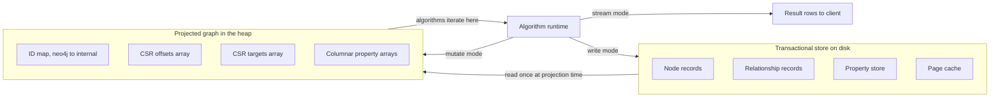
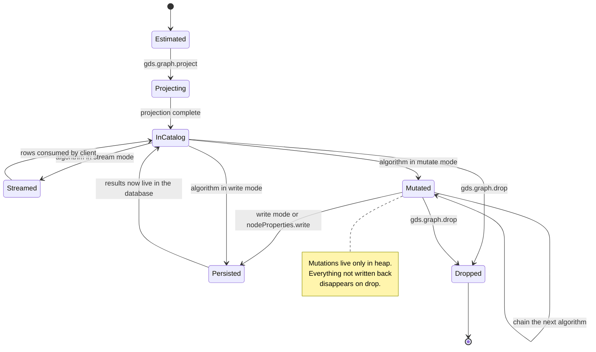
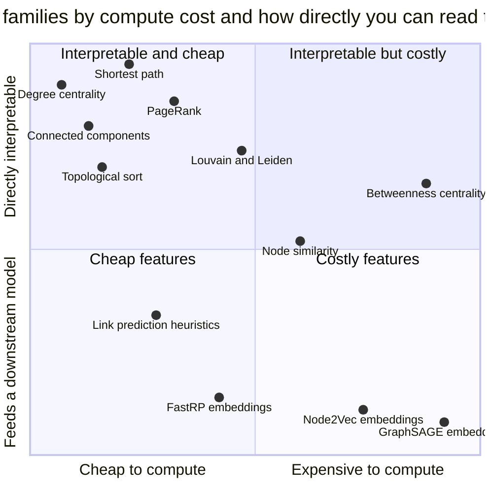
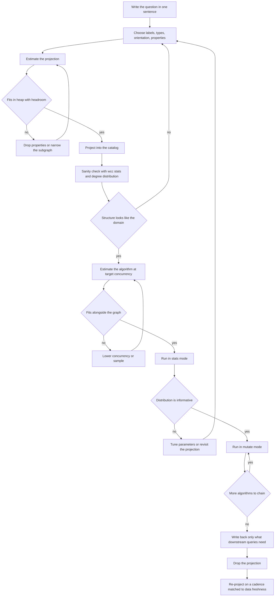

# Graph Analytics at Scale: The GDS Execution Model

The graph had 41 million nodes and just under 200 million relationships — a corporate knowledge graph of people, documents, systems, and transactions, the accumulated wiring of an organization that had been merging companies for fifteen years. Someone wanted to know which internal systems were structurally most important, and the answer, obviously, was PageRank.

PageRank is twenty-five lines of pseudocode. Everybody has implemented it in an afternoon on a toy graph. So they opened a Cypher shell, typed the call, and hit enter.

Twelve minutes later the JVM died. `java.lang.OutOfMemoryError: Java heap space`. Not a timeout, not a bad query plan, not a missing index — the process simply ran out of room to think.

The instinctive reaction is to blame the algorithm or the graph size. Both are wrong. PageRank on 200 million relationships is small by modern standards; a laptop can do it if you set the problem up correctly. What killed that job was everything *around* the mathematics: how the graph got from disk into a form the algorithm could traverse, how much room that form needed, how many threads were each holding a private copy of a score array, and what was supposed to happen to 41 million floating-point numbers once the computation finished.

That is the **execution model**, and it is the actual subject of graph analytics in production. Textbooks teach the algorithm. Nobody teaches the machinery it runs inside, and that machinery is where every real project either works or falls over.

This post is Part 1 of a series on graph analytics in production, and it deliberately spends almost no time on individual algorithms — Part 2 covers centrality and community detection in practice, Part 3 covers node embeddings. Here we build the foundation: how Neo4j's Graph Data Science library represents, projects, computes over, and persists graph results, and how that model is now being unbundled from the database entirely.

For the mathematical intuition behind the measures, the companion post on [network science, communities, and centrality](https://juanlara18.github.io/portfolio/#/blog/network-science-communities-centrality) covers what they *mean*; for how the graph gets built in the first place, [knowledge graphs in practice](https://juanlara18.github.io/portfolio/#/blog/knowledge-graphs-practice) walks the construction pipeline. This post is what happens between those two.

## Why Your Database Is the Wrong Shape for This

Start with a question that sounds naive but isn't: if the graph is already in Neo4j, and Neo4j is a graph database, why can't the algorithm just run against it?

Because "graph database" and "graph analytics engine" are optimized for opposite access patterns, and the gap between them is not a detail — it is an order of magnitude or three.

A transactional graph store is built for **pointer chasing**. You arrive with a starting node, follow a small number of relationships, read some properties, come back. That is the shape of every operational query: *who reports to this person*, *what documents cite this contract*, *what accounts did this device touch in the last hour*. Records live in fixed-size slots on disk, relationships are stored as doubly linked lists so you can walk from a node to its edges without an index lookup, and a page cache keeps hot regions resident. Neo4j calls this index-free adjacency, and it is genuinely excellent — the cost of a hop does not depend on how big the database is.

Now consider what PageRank asks for. It does not want *a* node's neighbors. It wants **every node's neighbors, in order, repeatedly, twenty times**. There is no locality to exploit because there is no hot subset — the whole graph is hot.

Run that against a transactional store and every relationship, on every iteration, costs a record lookup that may miss the page cache, a transaction context with MVCC visibility checks, an object allocation for what the driver hands back, and a second dereference into the property store to read a weight. Four billion of those. The per-record overhead — a few hundred nanoseconds each — *is* the runtime, and the floating-point arithmetic you actually wanted is a rounding error.

Transactional guarantees make it worse, not better. A twenty-iteration PageRank in one transaction forces the store to preserve a consistent snapshot throughout, so the log grows and nothing is reclaimed. You are paying for isolation you do not need — nobody cares whether PageRank saw a write that landed halfway through, because PageRank on a moving graph is meaningless anyway.

This is the fundamental split:

| Dimension | Transactional store | Analytics runtime |
|---|---|---|
| Access pattern | Few nodes, few hops | All nodes, all edges, many passes |
| Working set | Small hot subset | The entire graph |
| Consistency | ACID, MVCC, locks | Snapshot, no isolation needed |
| Representation | Records on disk pages | Packed arrays in memory |
| Cost model | Per query | Per full-graph iteration |
| Concurrency | Many small transactions | Few jobs, many threads each |
| Lifetime | Permanent | Ephemeral |

The resolution is not to make the database faster. It is to build a **second, disposable representation** of the graph, shaped for iteration instead of lookup, and throw it away when you're done. That representation is what GDS calls a projected graph, and the data structure underneath it is CSR.

## CSR: The Representation That Makes Graph Algorithms Fast

Compressed Sparse Row is the single concept that makes the rest of this post make sense. It is also, once you see it, almost embarrassingly simple — which is exactly why it is worth doing properly with a worked example rather than hand-waving.

Take a small directed graph with five nodes, numbered 0 through 4, and seven relationships: `0→1`, `0→3`, `1→2`, `2→0`, `2→3`, `2→4`, and `3→4`.

The obvious representation is an adjacency list — a map from each node to a list of its targets:

```
0 -> [1, 3]
1 -> [2]
2 -> [0, 3, 4]
3 -> [4]
4 -> []
```

Correct, readable, and terrible for performance. In a JVM that is five separate list objects, each with a header, each pointing at a backing array somewhere else in the heap. Walking the graph means chasing pointers into unpredictable memory locations, which means a cache miss on nearly every hop, which means the CPU spends most of its time waiting for RAM.

CSR flattens all of it into **two contiguous arrays**.

The first array, `targets`, is every adjacency list concatenated in node order:

```
targets = [ 1, 3,   2,   0, 3, 4,   4 ]
index      0  1    2    3  4  5    6
```

Seven entries — one per relationship. Node 0's targets first, then node 1's, then node 2's, and so on.

The second array, `offsets`, has one entry per node plus one, and records where each node's slice begins:

```
offsets = [ 0, 2, 3, 6, 7, 7 ]
node        0  1  2  3  4  (end)
```

That's the whole structure. To get the neighbors of node $v$:

$$\text{adj}(v) = \left\{\, \text{targets}[i] \;:\; \text{offsets}[v] \le i < \text{offsets}[v+1] \,\right\}$$

Check it. Node 2: `offsets[2] = 3`, `offsets[3] = 6`, so `targets[3:6] = [0, 3, 4]`. Correct. Node 4: `offsets[4] = 7`, `offsets[5] = 7`, empty slice, correct — a node with no outgoing edges costs nothing beyond its offset entry.

Degree falls out for free, in constant time, with no traversal at all:

$$\deg^{+}(v) = \text{offsets}[v+1] - \text{offsets}[v]$$

Building it takes one pass to count degrees, a prefix sum over those counts to get `offsets`, and a second pass to fill `targets`. Running PageRank on top is where the layout pays off:

```python
import numpy as np


def pagerank_csr(offsets, targets, iterations=20, damping=0.85):
    """PageRank over CSR. The inner loop is one forward scan of `targets`."""
    n = len(offsets) - 1
    scores = np.full(n, 1.0 / n, dtype=np.float64)
    out_degree = np.diff(offsets)

    for _ in range(iterations):
        contributions = np.zeros(n, dtype=np.float64)
        for v in range(n):
            if out_degree[v] == 0:
                continue
            share = scores[v] / out_degree[v]
            for i in range(offsets[v], offsets[v + 1]):
                contributions[targets[i]] += share
        scores = (1.0 - damping) / n + damping * contributions

    return scores
```

The mathematics is the standard formulation:

$$PR^{(k+1)}(v) = \frac{1 - d}{N} + d \sum_{u \in \text{in}(v)} \frac{PR^{(k)}(u)}{\deg^{+}(u)}$$

But look at the memory behavior rather than the formula. The inner loop walks `targets` strictly forward, one element at a time — a pattern the CPU prefetcher recognizes instantly, pulling the next cache lines in before they are requested. `scores` and `out_degree` are dense arrays indexed by node ID. No objects, no locks, no visibility checks, no property store hops. One iteration over 200 million relationships in this layout is a few hundred milliseconds of streaming reads.

That is the entire trick. Not a cleverer algorithm — a memory layout the hardware can actually feed.

### What GDS Adds on Top

GDS uses CSR as the backbone of its in-memory graph store, with four refinements worth knowing because they show up in your memory estimates.

**An ID map.** Neo4j node IDs are sparse — deletions leave gaps, and a 41-million-node database may have IDs running into the hundreds of millions. CSR needs dense IDs from 0 to $|V| - 1$, so the store keeps a bidirectional map. This is why algorithm results come back as internal IDs you have to translate.

**Compressed adjacency lists.** Textbook CSR stores raw target IDs. GDS sorts each list and stores deltas using variable-length integer encoding: neighbors `[1041, 1043, 1049, 2200]` become something closer to `[1041, 2, 6, 1151]`, and small deltas fit in one or two bytes instead of four. It is the "compressed" in CSR doing real work, not just naming.

**Per-type topologies and columnar properties.** Relationships get one CSR per type, so an algorithm restricted to a single type never scans the others. Properties are dense typed arrays indexed by internal ID, so reading a weight mid-traversal is an array index rather than a store lookup.

**Optional inverse indices.** CSR gives outgoing edges only. Algorithms needing incoming edges require a second CSR on the reversed topology, built lazily because it roughly doubles relationship memory — the first place where an innocent-looking configuration choice doubles your bill, and not the last.

## Projection: Choosing the Graph You Actually Compute On

Here is the thing nobody warns you about: **the projection is where most graph analytics projects go wrong**, and they go wrong silently, producing plausible numbers that are simply answers to a different question.

A projection is the act of reading a subgraph out of the database and materializing it as a CSR structure in the **graph catalog** — a named, in-memory registry of projected graphs that lives in the JVM heap for as long as you keep it.



Two mechanisms exist for building one.

### Native Projections

A native projection is declarative: you name the node labels, the relationship types, and the properties you want, and GDS reads them straight from the store using the count store and parallel scans. It is the fast path, and it is what you should reach for by default.

```python
from graphdatascience import GraphDataScience

gds = GraphDataScience(
    "neo4j+s://my-instance.databases.neo4j.io",
    auth=("neo4j", password),
    database="knowledge",
)

G, project_result = gds.graph.project(
    "systems-influence",
    # Node projection: which labels, and which properties to carry along.
    {
        "System": {"properties": ["criticality"]},
        "Team": {"properties": []},
    },
    # Relationship projection: types, orientation, and edge properties.
    {
        "DEPENDS_ON": {
            "orientation": "NATURAL",
            "properties": {"weight": {"defaultValue": 1.0}},
        },
        "OWNS": {"orientation": "REVERSE"},
    },
)

print(f"{G.node_count():,} nodes, {G.relationship_count():,} relationships")
print(f"projection took {project_result['projectMillis']} ms")
```

Three things in that call deserve more attention than they usually get.

**Property inclusion is not free.** Every property you list is a dense array of $|V|$ or $|E|$ elements. Carrying five node properties you never use on a 40-million-node graph costs 1.6 GB of heap for nothing.

**Orientation changes the graph.** `NATURAL` keeps direction as stored, `REVERSE` flips it, `UNDIRECTED` stores each relationship twice — doubling relationship memory and, more importantly, changing the answer. PageRank on an undirected projection of a dependency graph is not "PageRank with less precision," it is a different measure, closer to degree centrality. Louvain and Leiden generally *want* undirected input; path finding usually wants natural direction. Get this wrong and you get numbers that look fine and mean nothing.

**Label selection defines the population.** If you project `System` and `Team` but influence actually flows through `Service` nodes in between, you have not built a sparser graph — you have disconnected it, and every connectivity-based measure is now wrong.

### Cypher Projections

When the subgraph you want cannot be described by labels and types alone — you need a filter on a property, a derived relationship, a computed weight, or a graph assembled from a query rather than a schema — you use a Cypher projection. In current GDS this is expressed as an aggregation inside a Cypher query rather than as a separate procedure, and the Python client exposes it directly:

```python
G, result = gds.graph.cypher.project(
    """
    MATCH (a:Person)-[:AUTHORED]->(d:Document)<-[:AUTHORED]-(b:Person)
    WHERE d.published_at > date('2027-01-01')
      AND a.employee_id < b.employee_id
    WITH a, b, count(DISTINCT d) AS shared
    WHERE shared >= 3
    RETURN gds.graph.project(
        $graph_name,
        a,
        b,
        {
            sourceNodeLabels: labels(a),
            targetNodeLabels: labels(b),
            relationshipType: 'CO_AUTHORED',
            relationshipProperties: { weight: shared }
        },
        { undirectedRelationshipTypes: ['CO_AUTHORED'] }
    )
    """,
    graph_name="coauthorship-2027",
)
```

That query does something a native projection fundamentally cannot: it **derives** a relationship that does not exist in the database. There is no `CO_AUTHORED` edge stored anywhere — it is computed from a two-hop pattern, filtered by a date and a threshold, weighted by how many documents the pair shares. This is the monopartite projection pattern, and it is the most important modeling move in applied graph analytics.

### Monopartite, Bipartite, Multipartite

Real graphs are almost never the graph your algorithm expects. A **monopartite** graph — one node type, one relationship type — is what most classical algorithms assume; PageRank, Louvain, betweenness, and node similarity are all theorized over a single homogeneous vertex set. A **bipartite** graph has two node types with edges only between them: people and documents, customers and products, accounts and merchants. Run community detection on one directly and you get communities mixing both types, which is uninterpretable; run PageRank and the scores are dominated by whichever side has higher average degree. A **multipartite** graph — three or more types — is what your actual knowledge graph looks like: people, teams, systems, documents, incidents, all interconnected.

The standard move is **projecting down to monopartite** by collapsing paths, exactly as the Cypher projection above does. Two people who share three documents become one weighted edge. That is a modeling decision with consequences: you are asserting that co-authorship-through-documents is the relationship worth analyzing, and discarding the documents. Different collapses give different graphs and different answers.

Sometimes keeping the graph heterogeneous is right — GDS supports multiple labels and types in one projection, path finding does not care, and GraphSAGE is explicitly designed for heterogeneous input. But if you are about to run Louvain, decide consciously what your nodes are.

Two rules that have saved me repeatedly:

1. **Write down the question in one sentence before choosing the projection.** "Which internal systems, if they failed, would disrupt the most downstream work?" tells you immediately that you want `System` nodes, `DEPENDS_ON` edges, natural orientation, and a centrality measure — not an undirected everything-graph.
2. **Check the component structure right after projecting.** One `gds.wcc.stats` call tells you whether you accidentally shattered the graph. If your 41-million-node projection has 8 million connected components, you filtered out the connective tissue.

### The Lifecycle

A projected graph moves through a small number of states, and knowing them prevents most catalog-related confusion:



Two properties of this lifecycle bite people.

**A projection is a snapshot.** Read once, never refreshed. Writes to the database afterward are invisible to it, so a projection built on Monday and queried on Friday is answering questions about Monday's graph. No staleness warning, no cache invalidation, no error — just quietly outdated numbers. Either re-project on a schedule, or stamp results with the projection timestamp so downstream consumers know what they are looking at.

**A projection holds heap until dropped.** It is not garbage collected, because the catalog still references it. Graphs are scoped per user, so a colleague's abandoned 30 GB projection is invisible in your catalog listing but very much present in the heap you share. `gds.graph.list()` and a scheduled cleanup are not optional hygiene on a shared instance.

## The Five Execution Modes

Every GDS algorithm exposes the same set of execution modes, and the difference between them is entirely about **where the result goes**. This is the part practitioners get wrong most often, usually by reaching for `write` when they wanted `mutate`, or by streaming 41 million rows to a client that then aggregates them in Python.

| Mode | Result destination | Returns | Use when |
|---|---|---|---|
| `estimate` | Nowhere | Memory forecast | Always, before anything expensive |
| `stats` | Nowhere | Summary statistics, one row | Validating a run, tuning parameters |
| `stream` | The client | One row per node or pair | Small results, or you need everything |
| `mutate` | The in-memory graph | Counts and timings | Chaining algorithms |
| `write` | The Neo4j database | Counts and timings | Results must outlive the projection |

### `estimate`

Appending `.estimate` to any mode gives you a memory forecast without running anything, using node and relationship counts plus your configuration to size every data structure the run would allocate. It costs milliseconds. There is no defensible reason to skip it on a graph you have not run before.

### `stats`

`stats` runs the full computation, throws the per-node results away, and returns only aggregates — score distributions, component counts, modularity, iteration counts, timings.

That sounds wasteful and is actually the most underused mode in the library. It is how you answer "did this work?" before committing to anything. Run Louvain in `stats`, look at the community count and size distribution: if one community holds 94% of nodes, your resolution parameter is wrong or your projection is over-connected — learned in one call, with no writes to undo.

### `stream`

`stream` returns results as rows, exactly like a normal Cypher read. It is right when the result set is naturally small — the top 50 nodes by betweenness, a shortest path between two nodes, the members of one community.

It is wrong when the result set is the size of the graph. Streaming 41 million rows means serializing 41 million records and allocating 41 million Python objects in a process sized for a web service. If you are streaming everything and filtering client-side, you wanted `stats` for the shape or `mutate` for the values.

The idiomatic pattern applies the ordering and limit server-side, inside the Cypher call, so only the rows you want cross the wire.

### `mutate`

`mutate` writes the algorithm's output back into the **projected graph in memory**, as a new node property, relationship property, or relationship type. Nothing touches the database.

This is the mode that makes multi-step analytics possible, and the one most people discover last. Consider a realistic pipeline: compute PageRank, use it as a weight for community detection, then generate embeddings that carry both the score and the community as features. Every step needs the previous step's output.

Without `mutate`, each step means writing to Neo4j and re-projecting — full round trips through disk, minutes each. With `mutate`, intermediates live in the CSR structure and the next algorithm reads them as an array index.

```python
# Step 1: structural importance.
gds.pageRank.mutate(
    G, mutateProperty="pagerank",
    dampingFactor=0.85, maxIterations=20, tolerance=1e-7,
)

# Step 2: communities, weighted by the scores we just computed.
louvain = gds.louvain.mutate(
    G, mutateProperty="communityId",
    relationshipWeightProperty="weight",
    includeIntermediateCommunities=False,
)
print(f"{louvain['communityCount']} communities, "
      f"modularity {louvain['modularity']:.4f}")

# Step 3: embeddings that see the previous results as features.
gds.fastRP.mutate(
    G, mutateProperty="embedding", embeddingDimension=128,
    featureProperties=["pagerank"], randomSeed=42,
)
```

Three algorithms, one projection, zero database writes. The heap cost is three additional property arrays; the time saved is however long two re-projections would have taken.

The catch — and it is a real one — is that mutations are as ephemeral as the graph. Drop the projection and every mutated property is gone. `mutate` is a scratchpad, not storage.

### `write`

`write` persists results to the database as node or relationship properties, using batched parallel writes rather than one transaction per node.

Use it when results need to outlive the projection: when a downstream Cypher query needs to filter on PageRank, when a dashboard reads community IDs, when an application makes decisions based on the scores. Do not use it for intermediates — writing PageRank only to read it back for Louvain is a round trip you already avoided with `mutate`.

The pattern I default to is **mutate everything, write selectively at the end**:

```python
# Only the two properties that downstream consumers actually query.
write_result = gds.graph.nodeProperties.write(
    G,
    node_properties=["pagerank", "communityId"],
    node_labels=["System"],
    concurrency=4,
)
print(f"wrote {write_result['propertiesWritten']:,} properties")
```

Note `concurrency=4` rather than the default. Write-back competes with production traffic for the same store, page cache, and IO budget. On a shared instance, throttling writes is often the difference between a batch job nobody notices and a page at 2am.

## Mapping the Catalog: Eight Families

GDS ships more than 65 algorithms, and learning them individually is the wrong approach. Learn the eight families instead — what problem each solves and what shape of answer it produces — and you can find the right algorithm when you need it and, more usefully, recognize when none of them fit.

**Path finding** answers *how do I get from A to B, and what does it cost?* Dijkstra for weighted shortest paths, A\* when you have a distance heuristic, Yen's for the $k$ shortest alternatives, breadth-first and depth-first for traversal order, minimum-weight spanning tree for cheapest full connection. Output is a path. This is the family where direction and edge weights matter most, and where a careless `UNDIRECTED` projection produces confidently wrong routes.

**Centrality** answers *which nodes matter, and by what definition of matter?* Degree for raw connectivity, PageRank and ArticleRank for propagated influence, betweenness for brokerage and bottlenecks, closeness for reachability, eigenvector for connection-to-important-things, HITS for the hub/authority split. Output is one number per node. The critical insight is that these measures genuinely disagree, and the disagreement is informative — a node with high betweenness and low degree is a bridge, and bridges are usually the interesting ones. Part 2 lives here.

**Community detection** answers *which nodes belong together?* Louvain and its successor Leiden for modularity-based partitioning, Label Propagation when speed beats quality, weakly and strongly connected components for the hard structural question of reachability, triangle count and clustering coefficient for local density, K-core decomposition for peeling a network to its dense center. Output is a community per node. Almost all of these want undirected input.

**Similarity** answers *which nodes resemble each other?* Node Similarity computes Jaccard or overlap over shared neighborhoods; K-Nearest Neighbors works on property vectors rather than topology. Output is typically new relationships, which is why `mutate` matters here — the similarity graph becomes the next algorithm's input. Pairwise similarity is quadratic in the naive case, and the top-$k$ and threshold parameters are what keep it tractable.

**Node embeddings** answer *how do I turn topology into a vector a model can consume?* FastRP for speed via random projection, Node2Vec for random-walk embeddings in the word2vec tradition, GraphSAGE for inductive embeddings that generalize to unseen nodes and can incorporate node features. Output is a fixed-dimension vector per node, destined for a classifier, a clustering step, or a vector index. Part 3 covers this family.

**Topological link prediction** answers *which non-existent edges are likely to appear?* Adamic-Adar, common neighbors, preferential attachment, resource allocation, total neighbors, same-community. These are cheap local heuristics computed over candidate node pairs — functions rather than whole-graph procedures — and they double as features for supervised link prediction pipelines.

**DAG algorithms** answer *what is a valid ordering, and what is the critical path?* Topological sort produces a parallel ordering where every node appears after everything pointing to it; longest path builds on it to run in linear time, supporting weights but not negative ones. For dependency DAGs — build systems, task schedules, data lineage — this family gives exact answers in one pass where general path finding would be exponential.

**The Pregel API** answers *what if none of the above fit?* Pregel is a vertex-centric model: you write what one node does in a superstep — read messages, update state, send to neighbors — and the framework handles partitioning, parallelism, and synchronization. It means writing Java and deploying a plugin, so it is a real commitment, but it is the escape hatch that keeps GDS from being a closed set.

Positioning these families against each other clarifies what you are buying with each:



### Tiers, and What Depending on Alpha Means

GDS labels algorithms by quality tier, and the label is a contract about stability, not correctness. **Production quality** means tested on large graphs, full mode matrix including estimation, documented memory behavior, and compatibility guarantees — a minor upgrade will not change its signature or semantics. **Beta** means the implementation is solid but the interface may still shift: a renamed parameter, a changed default, an added or removed result field. **Alpha** means experimental — it may change substantially, may not support every mode, may lack an estimator, may be removed. Alpha algorithms also tend to be the interesting ones, because new research lands there first.

The practical rule: **you may prototype on alpha, but you may not schedule on alpha without pinning.** If a nightly job depends on an alpha procedure, pin the exact GDS version and keep a fallback path. The failure mode is not a crash at deploy time — it is a job that silently stops running six months later during a routine upgrade, and nobody notices until someone asks why the dashboard has been flat.

## Budgeting Memory Before You Run

Everything GDS computes lives in the JVM heap. Not off-heap, not memory-mapped, not spilled to disk — heap. That single fact determines how graph analytics capacity planning works, and it is why `estimate` is the most valuable procedure in the library.

Total heap during a run is roughly:

$$M_{\text{total}} \approx M_{\text{graph}} + M_{\text{algorithm}} + M_{\text{results}}$$

The projected graph itself:

$$M_{\text{graph}} \approx \underbrace{8(|V| + 1)}_{\text{offsets}} \;+\; \underbrace{c \cdot \omega \cdot |E|}_{\text{adjacency}} \;+\; \underbrace{8 \, p \, |V|}_{\text{node props}} \;+\; \underbrace{8 \, q \, |E|}_{\text{rel props}} \;+\; M_{\text{idmap}}$$

where $\omega$ is the orientation factor — 1 for a directed projection, 2 for undirected or when an inverse index is built — $c$ is the effective bytes per relationship after delta and variable-length compression (typically between 1 and 4, depending on ID locality), $p$ is the number of node properties carried, and $q$ the number of relationship properties.

Read that formula for its levers rather than its precision. Undirected doubles $\omega$. Every carried property adds a full dense array. Relationship properties are the expensive ones because they scale with $|E|$, which is usually an order of magnitude above $|V|$.

Algorithm working memory is separate and depends on the algorithm and, critically, on concurrency:

$$M_{\text{algorithm}} \approx \alpha |V| + \beta |E| + \tau \cdot s$$

where $\tau$ is the concurrency setting and $s$ is per-thread scratch space. PageRank needs two `double` arrays over nodes, so $\alpha \approx 16$ bytes, plus modest per-thread buffers. Betweenness centrality is the cautionary tale: exact betweenness needs per-thread predecessor structures and distance arrays, so $s$ scales with $|V|$, and running it at concurrency 32 can allocate 32 copies of node-sized state. Halving concurrency genuinely halves that term — a slower run that finishes beats a fast run that dies.

In practice you never compute these by hand. You ask:

```python
def budget_projection(gds, node_spec, rel_spec, heap_gb, safety_factor=0.6):
    """Estimate a projection and check it against a heap budget.

    safety_factor leaves room for algorithm working memory, result
    structures, and whatever else already lives in the heap.
    """
    est = gds.graph.project.estimate(node_spec, rel_spec)
    return {
        "required": est["requiredMemory"],
        "heap_pct_max": float(est["heapPercentageMax"]),
        "fits": est["bytesMax"] <= heap_gb * (1024 ** 3) * safety_factor,
        # treeView breaks the total down by data structure -- read it
        # whenever the headline number surprises you.
        "breakdown": est["treeView"],
    }


# The algorithm needs its own budget: the graph fitting does not mean
# the run fits, and per-thread state scales with concurrency.
algo_est = gds.betweenness.mutate.estimate(
    G, mutateProperty="betweenness", concurrency=8,
)
```

That `treeView` field is the part people ignore and shouldn't. It decomposes the estimate by data structure, turning "this needs 47 GB" into "adjacency lists need 12 GB and relationship properties need 33 GB" — which immediately tells you which property to drop.

When the estimate exceeds your heap, you have five moves, roughly in order of what they cost you:

1. **Drop properties you are not using.** Free, and often enough on its own.
2. **Narrow the projection.** Fewer labels, fewer types, a Cypher projection with a filter. The highest-leverage move, and the one that also improves your answer because it forces you to state the question precisely.
3. **Lower concurrency.** Trades wall clock for heap on algorithms with per-thread state.
4. **Sample.** A random-walk or degree-stratified subgraph often gives the same qualitative answer at a fraction of the cost. Some centrality algorithms offer approximate variants with a sampling parameter, which is a better trade than sampling the graph yourself.
5. **Size up.** Sometimes the right answer, and thanks to ephemeral sessions it is now cheap in a way it was not three years ago.

## Serverless Graph Analytics and the End of ETL-into-a-Graph

Everything above assumes an architecture that held for a decade: your data lives in a graph database, GDS runs inside that database's JVM, and analytics competes with transactional traffic for the same heap.

That assumption produced a thoroughly unpleasant pattern. Your data is in BigQuery or Snowflake or Postgres, you want graph analytics on it, so you build a pipeline: extract, transform into nodes and edges, load into Neo4j, project, compute, write back, export. Weeks of engineering, a permanent operational burden, a second copy of your data, and a synchronization problem forever — all to run PageRank once a week.

**Aura Graph Analytics**, introduced in 2025, removes the graph database from that critical path. The unit of compute is a **GDS Session**: an ephemeral, isolated Aura instance that exists only to run graph algorithms, with its own memory allocation and a configurable time-to-live, sharing no memory or compute with your data store. You create it, project into it, compute, write results wherever they need to go, and let it expire.

Sessions come in three flavors depending on where the data lives. **Attached** connects to an AuraDB instance, pulling data over a remote projection and writing results back to the same database. **Self-managed** is the same pattern against a self-hosted Neo4j deployment. **Standalone** is the architecturally significant one: no Neo4j at all — you build the graph in the session directly from tables, DataFrames, or a warehouse, run the algorithms, and write results back to wherever they came from.

Standalone sessions are what "no ETL into a graph database" actually means. No persistent graph to maintain, no sync job, no second source of truth. The graph exists for the duration of the computation and then does not. Graph analytics stops being a platform decision — a database you run, staff, and justify — and becomes a **function you call**.

The workflow in the Python client:

```python
import os
from datetime import timedelta

from graphdatascience.session import (
    AuraAPICredentials,
    DbmsConnectionInfo,
    GdsSessions,
    SessionMemory,
)

sessions = GdsSessions(
    api_credentials=AuraAPICredentials(
        os.environ["AURA_CLIENT_ID"],
        os.environ["AURA_CLIENT_SECRET"],
    )
)

# The session is created on demand and torn down when the TTL expires.
gds = sessions.get_or_create(
    session_name="weekly-influence-scoring",
    memory=SessionMemory.m_8GB,
    db_connection=DbmsConnectionInfo(
        uri=os.environ["NEO4J_URI"],
        username=os.environ["NEO4J_USERNAME"],
        password=os.environ["NEO4J_PASSWORD"],
    ),
    ttl=timedelta(hours=2),
)

try:
    # Remote projection: the query runs on the DBMS, but the graph is
    # materialised in the session's heap, not the database's.
    G, _ = gds.graph.project(
        "systems-influence",
        """
        MATCH (a:System)-[r:DEPENDS_ON]->(b:System)
        RETURN gds.graph.project.remote(a, b, {
            relationshipProperties: { weight: r.criticality }
        })
        """,
    )

    gds.pageRank.mutate(G, mutateProperty="pagerank", dampingFactor=0.85)
    gds.louvain.mutate(G, mutateProperty="communityId",
                       relationshipWeightProperty="weight")

    # Remote write-back sends results to the source database.
    gds.graph.nodeProperties.write(G, ["pagerank", "communityId"])

finally:
    G.drop()
    sessions.delete(session_name="weekly-influence-scoring")
```

For standalone sessions there is no database to project from, so you construct the graph from DataFrames instead — which is how a warehouse-resident dataset becomes a graph without ever landing in a graph database:

```python
# nodes_df:         nodeId, labels, plus property columns
# relationships_df: sourceNodeId, targetNodeId, relationshipType, weight
G = gds.graph.construct(
    graph_name="warehouse-graph",
    nodes=pd.read_gbq(NODE_QUERY, project_id=GCP_PROJECT),
    relationships=pd.read_gbq(EDGE_QUERY, project_id=GCP_PROJECT),
    undirected_relationship_types=["INTERACTS_WITH"],
)

gds.pageRank.stream(G, dampingFactor=0.85).to_gbq(
    f"{DATASET}.system_influence", project_id=GCP_PROJECT,
    if_exists="replace",
)
```

The pricing model matters as much as the API, because it changes what is worth doing. Aura Graph Analytics bills per gigabyte of session RAM per hour — on the order of $0.40 per GB-hour at launch, with a ten-minute minimum on billable events. That converts graph analytics from a fixed cost into a variable one: a 32 GB session running forty minutes costs single-digit dollars, where the previous equivalent was provisioning a 32 GB instance and paying for it around the clock so it could be busy forty minutes a week.

Three consequences follow, and they are all about what becomes *thinkable*. **Oversizing becomes rational** — when the session lives for an hour, asking for 64 GB instead of 32 GB costs a few dollars, so squeezing a projection into whatever instance you happen to have is now a false economy. **Experimentation becomes cheap** — trying four projections to see which produces meaningful communities is four parallel sessions, not four re-projections on shared infrastructure with someone asking why the database is slow. And **isolation becomes structural** rather than a matter of discipline: the oldest hazard in this field, an analytical job eating the heap transactional queries need, cannot happen when the job is not running on production at all.

What you give up is real. Every remote projection is a network transfer of the entire subgraph, so projection time is bounded by bandwidth rather than disk scan speed. Sessions are stateless, so the graph is rebuilt every run — there is no long-lived catalog to reuse. And the model fits batch analytics far better than anything interactive; if you need algorithm results in a request path, you are back to persisting them somewhere fast.

## The Production Workflow, End to End

Everything above assembles into one workflow. It is not complicated, but each step exists because skipping it causes a specific, recurring failure.



The failure each step prevents:

**Write the question down** prevents the most expensive failure of all — computing a correct number that answers a question nobody asked. "Which systems are important" is not a question; "which systems, if unavailable, would block the most downstream teams from working" is, and it fully determines the projection.

**Estimate before projecting** prevents the twelve-minute wait followed by an OOM. It costs milliseconds.

**Sanity check the projection** prevents silent disconnection. A component count and a degree distribution tell you whether the graph you built resembles the domain you meant to model — thirty seconds of work.

**Estimate the algorithm separately** prevents the case where the graph fits comfortably and the run still dies, because betweenness at concurrency 32 allocated more than the graph did.

**Run in `stats` first** prevents parameter disasters at scale. One community holding 94% of nodes, a PageRank distribution with no spread, a similarity graph with zero edges above threshold — all visible in one summary row.

**Chain with `mutate`**, **write selectively**, and **drop the projection** prevent, respectively: the accidental multi-hour pipeline built from write-and-re-project round trips, an operational database polluted with intermediates nobody queries, and the shared-instance heap leak.

**Re-project on a cadence** prevents the staleness problem, quietest failure of them all. A projection is a photograph. Decide how old a photograph you will make decisions from, and either match your schedule to it or publish the timestamp alongside the results.

Here is the whole thing as one function, which is roughly what a scheduled job should look like:

```python
from contextlib import contextmanager
from datetime import datetime, timezone


@contextmanager
def projected_graph(gds, name: str, node_spec, rel_spec, heap_gb: float):
    """Project a graph, guarantee it is dropped, refuse to blow the heap."""
    est = gds.graph.project.estimate(node_spec, rel_spec)
    if est["bytesMax"] > heap_gb * (1024 ** 3) * 0.6:
        raise MemoryError(
            f"projection needs {est['requiredMemory']}, "
            f"exceeds 60% of a {heap_gb} GB heap"
        )

    if gds.graph.exists(name)["exists"]:
        gds.graph.drop(name)

    G, _ = gds.graph.project(name, node_spec, rel_spec)
    try:
        yield G
    finally:
        G.drop(failIfMissing=False)


def score_system_influence(gds, heap_gb=32.0) -> dict:
    node_spec = {"System": {"properties": ["criticality"]}}
    rel_spec = {"DEPENDS_ON": {
        "orientation": "NATURAL",
        "properties": {"weight": {"defaultValue": 1.0}},
    }}

    with projected_graph(gds, "systems-influence",
                         node_spec, rel_spec, heap_gb) as G:
        # Structural sanity: a shattered projection invalidates everything.
        components = gds.wcc.stats(G)
        if components["componentCount"] / G.node_count() > 0.10:
            raise ValueError("projection is disconnected -- check labels")

        # Look before you commit.
        preview = gds.pageRank.stats(G, dampingFactor=0.85, maxIterations=20)
        if not preview["didConverge"]:
            raise ValueError("PageRank did not converge -- raise maxIterations")

        # Chain in memory, write only what downstream queries need.
        gds.pageRank.mutate(G, mutateProperty="pagerank",
                            dampingFactor=0.85, maxIterations=20)
        louvain = gds.louvain.mutate(
            G, mutateProperty="communityId",
            relationshipWeightProperty="weight",
        )
        gds.graph.nodeProperties.write(
            G, ["pagerank", "communityId"],
            node_labels=["System"], concurrency=4,
        )

        return {
            "projected_at": datetime.now(timezone.utc).isoformat(),
            "nodes": G.node_count(),
            "communities": int(louvain["communityCount"]),
            "modularity": float(louvain["modularity"]),
        }
```

Every guard in that function corresponds to something that went wrong once and cost a day.

## What Comes Next

The 41-million-node graph from the opening did eventually get its PageRank scores. The fix was not more memory. It was a native projection restricted to two labels and one relationship type, natural orientation, no properties carried, concurrency dialed down, `stats` first to confirm convergence, `mutate` to chain Louvain, and a selective write of two properties. It ran in under four minutes on the same instance that had died twelve minutes into the naive attempt. The algorithm was identical. Everything around the algorithm was different.

That is the lesson worth carrying. In graph analytics the algorithm is the part that is already solved — somebody implemented Leiden correctly, parallelized it, and tested it on graphs bigger than yours. What is not solved, what is *yours*, is deciding which subgraph encodes your question, how it fits in memory, where the results go, and how stale they are allowed to get.

Part 2, *Centrality and Communities in Practice*, gets into the algorithms themselves: what the centrality measures actually disagree about and why the disagreement is where the insight lives, how Leiden fixed Louvain's disconnected-community defect, and how to choose resolution parameters without staring at modularity scores hoping for a signal. Part 3 covers node embeddings — FastRP, Node2Vec, GraphSAGE — how topology becomes a vector and what breaks when the graph shifts under a model trained on last quarter's structure. Both assume what this post built.

## Going Deeper

**Books:**

- Needham, M., & Hodler, A. E. (2019). *Graph Algorithms: Practical Examples in Apache Spark and Neo4j.* O'Reilly Media.
  - The canonical practitioner reference for this territory, covering path finding, centrality, and community detection with worked examples in both engines.
- Barrasa, J., & Webber, J. (2023). *Building Knowledge Graphs: A Practitioner's Guide.* O'Reilly Media.
  - The complement to this post: where the graph comes from, and the modeling choices that determine whether analytics over it is even possible later.
- Robinson, I., Webber, J., & Eifrem, E. (2015). *Graph Databases: New Opportunities for Connected Data* (2nd ed.). O'Reilly Media.
  - Chapter 6 on internals is the clearest published explanation of index-free adjacency and the record layout that makes transactional traversal fast — precisely the design this post argues is wrong for whole-graph iteration.
- Barabási, A.-L. (2016). *Network Science.* Cambridge University Press.
  - The theoretical foundation. Free online and mathematically serious — the right place to understand why degree distributions are heavy-tailed and what that means for the runtime of every algorithm in the catalog.
- Bader, D. A. (Ed.). (2022). *Massive Graph Analytics.* Chapman and Hall/CRC.
  - Graph processing beyond a single machine. Useful for seeing what GDS is deliberately not trying to be.

**Online Resources:**

- [The Neo4j Graph Data Science Library Manual](https://neo4j.com/docs/graph-data-science/current/) — The primary reference. The syntax overview, projection, and memory estimation pages reward reading end to end rather than searching.
- [Neo4j GDS Python Client Manual](https://neo4j.com/docs/graph-data-science-client/current/) — Docs for the `graphdatascience` package used throughout this post.
- [neo4j/graph-data-science on GitHub](https://github.com/neo4j/graph-data-science) — The source. When docs are ambiguous about memory behavior, the estimation classes are ground truth.
- [Aura Graph Analytics Serverless documentation](https://neo4j.com/docs/graph-data-science/current/installation/aura-graph-analytics-serverless/) — Session types, remote projection, remote write-back, and the operational details of ephemeral compute.
- [Neo4j GraphAcademy](https://graphacademy.neo4j.com/) — Free structured courses on GDS fundamentals and projections, with hands-on sandboxes rather than slides.

**Videos:**

- [Neo4j Live: Graph Algorithms for Data Science](https://www.youtube.com/watch?v=RmfFyuYki0g) by Neo4j — A working session through the main algorithm families with live queries; useful for seeing the projection-to-result loop performed rather than described.
- [Graph Analytics: Graph Algorithms inside Neo4j](https://www.youtube.com/watch?v=fPH-WJ-kEpY) by Neo4j, with Amy Hodler and Michael Hunger — Why graph algorithms need an execution environment separate from the transactional store.
- [Neo4j Live: Graph Data Science 2.0](https://www.youtube.com/watch?v=spmLJ3AHMPY) by Neo4j — The architectural overview of the projection and catalog model that current GDS still rests on.

**Academic Papers:**

- Malewicz, G., Austern, M. H., Bik, A. J. C., Dehnert, J. C., Horn, I., Leiser, N., & Czajkowski, G. (2010). ["Pregel: A System for Large-Scale Graph Processing."](https://dl.acm.org/doi/10.1145/1807167.1807184) *Proceedings of SIGMOD 2010*, 135–146.
  - The paper that defined the vertex-centric model. GDS exposes a Pregel API directly, so this is not history — it is the specification for writing a custom algorithm in the library.
- McSherry, F., Isard, M., & Murray, D. G. (2015). ["Scalability! But at what COST?"](https://www.usenix.org/system/files/conference/hotos15/hotos15-paper-mcsherry.pdf) *Proceedings of HotOS XV.*
  - Demonstrates that many distributed graph processing systems are slower than a competent single-threaded implementation on one laptop. The best calibration available for when you actually need scale-out, and a direct argument for the compact in-memory representation described here.
- Page, L., Brin, S., Motwani, R., & Winograd, T. (1999). ["The PageRank Citation Ranking: Bringing Order to the Web."](http://ilpubs.stanford.edu:8090/422/) *Stanford InfoLab Technical Report.*
  - Worth reading in the original for the sections on computation and convergence, which are about execution rather than mathematics and bear directly on choosing `maxIterations` and `tolerance`.
- Traag, V. A., Waltman, L., & van Eck, N. J. (2019). ["From Louvain to Leiden: guaranteeing well-connected communities."](https://www.nature.com/articles/s41598-019-41695-z) *Scientific Reports*, 9, 5233.
  - Shows that Louvain can produce internally disconnected communities — a defect that shows up in production results — and gives the algorithm that fixes it.

**Questions to Explore:**

- A projection is a snapshot, but graphs change continuously. What would an incrementally maintained projection look like, and at what rate of change does maintaining it become more expensive than rebuilding from scratch?
- The choice of monopartite collapse — which paths become edges, and how they are weighted — determines the answer more than the algorithm does. Is there a principled way to evaluate a projection, or is it irreducibly a modeling judgment that has to be defended in domain terms?
- If ephemeral serverless sessions make graph analytics a function call rather than a platform, what remains as the argument for running a persistent graph database at all? Which workloads genuinely require the graph to be durable and queryable rather than reconstructible on demand?
- Compressed sparse row is optimal for static graphs with dense integer IDs. What representation would you want for a graph that is 90% stable and 10% churning per hour, where a full rebuild is affordable but wasteful?
- Every algorithm in the catalog assumes the graph it receives is the graph that matters. Given that projection choice, orientation, and property selection are all made by a human before the algorithm runs, how much of what we call graph analytics is actually the algorithm, and how much is the modeling that precedes it?
