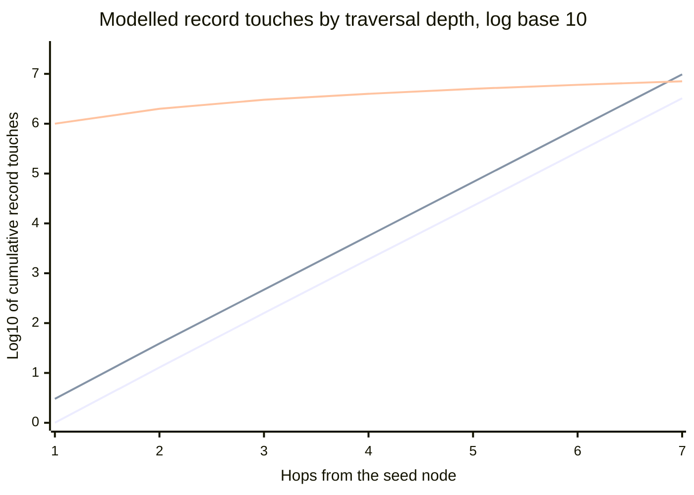
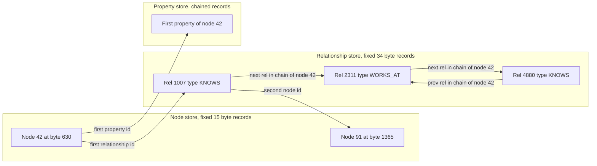
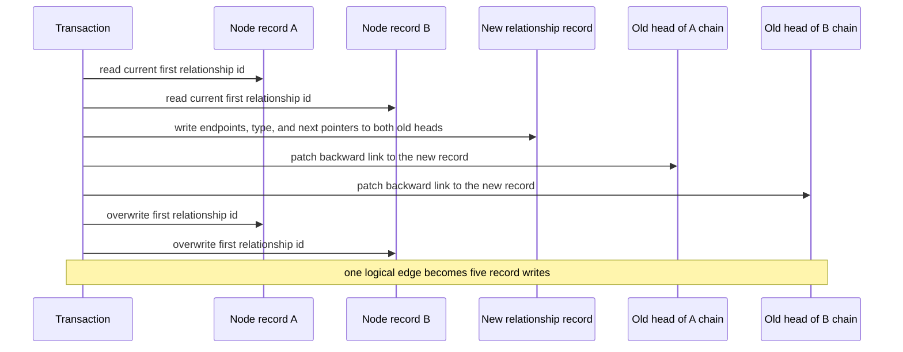
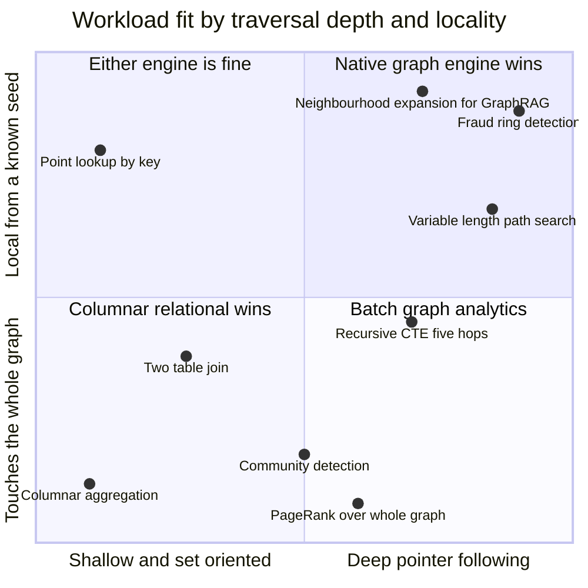

# Inside a Graph Engine: Index-Free Adjacency and Why a Traversal Is Not a Join

The query that started this post was a beneficial-ownership question. A regulator wants to know who ultimately controls an account. The data is a corporate ownership graph: companies own stakes in other companies, natural persons own stakes in companies, and somewhere at the end of a chain of holding vehicles sits a human being whose name goes on a report.

At two hops this is a perfectly ordinary SQL problem. Join `account` to `company`, join `company` to `ownership`, filter for stake above twenty-five percent, done. It runs in single-digit milliseconds on a laptop and nobody thinks about it again.

At five hops it stops being ordinary. The chain now runs through four intermediate holding companies in three jurisdictions, and the same query — expressed as a recursive CTE, indexed exactly the way the documentation says to index it — goes from eight milliseconds to a number I stopped waiting for. Not gradually. It was fine, then it was fine, then the query planner made a different decision at depth four and the whole thing fell off a cliff.

Everyone in this business has that story. And everyone has heard the standard explanation: *graph databases are faster for connected data.* Which is true in roughly the way "electric cars are faster off the line" is true — correct, unhelpful, and hiding all the interesting engineering. The blog has [thirty-nine posts about knowledge graphs and ontologies](https://juanlara18.github.io/portfolio/#/blog/knowledge-graphs-practice), and not one of them explains what the engine is actually doing under the query. This post fixes that.

This is Part 1 of a three-part series, **Graph Engines Under the Hood**. Part 1 is the storage and execution layer: what a hop physically is, why it costs what it costs, and where the standard story is overstated. Part 2 covers query languages — Cypher, GQL, and what a graph query planner does with a pattern. Part 3 covers engine selection: the vendor landscape and how to choose without believing anyone's benchmark. Here we stay strictly below the query language.

## Prerequisites

I am going to assume a few things and point at where to fill gaps rather than re-derive them.

- **You know what a B-tree index is** and roughly why a lookup in one is logarithmic. If "fanout" and "page" are familiar words, you are fine.
- **You know the property graph model**: nodes with labels and properties, typed directed relationships between them. [Knowledge Graphs in Practice](https://juanlara18.github.io/portfolio/#/blog/knowledge-graphs-practice) draws the taxonomy if you want it.
- **You have written a join, and ideally a recursive CTE**, and have some feel for what a query planner is choosing between.
- **You have seen a graph store that is not natively a graph store.** [Spanner Graph](https://juanlara18.github.io/portfolio/#/blog/spanner-graph-for-knowledge-and-agents) is exactly that — a property graph declared as a view over relational tables — and it is a useful contrast throughout.

## What a Join Actually Costs

Let us do the arithmetic honestly, because the honest arithmetic is more interesting than the marketing version.

Model the edge data as a table $E$ with $N$ rows, each row a pair `(src, dst)` plus whatever properties. There is a B-tree index on `src`. The graph has average out-degree $d$ — each node has, on average, $d$ outgoing edges. You start from one known node and want everything reachable in exactly $k$ hops.

### The nested-loop plan

The plan that behaves like a traversal is nested-loop-with-index. For each row in the current frontier, probe the index on `src`, get back the matching rows, and that is your next frontier.

A B-tree probe on a table of $N$ rows with node fanout $b$ costs $\Theta(\log_b N)$ page touches to reach the leaf, plus a scan of however many entries match. The frontier at hop $i$ has roughly $d^i$ elements. So the total work is

$$
C_{\text{NL}}(k) \;=\; \sum_{i=0}^{k-1} d^{\,i}\,\bigl(c_{1}\log_b N + c_{2}\,d\bigr) \;=\; \frac{d^{k}-1}{d-1}\bigl(c_{1}\log_b N + c_{2}\,d\bigr).
$$

Two things fall out of that expression, and the second one is the one people skip.

First, the $d^k$ term: the frontier grows exponentially in depth. That is a property of the *graph*, not of the storage engine. Nothing any database can do makes the five-hop neighbourhood of a well-connected node small. If your query genuinely needs to visit a million nodes, some system is going to visit a million nodes.

Second, the $\log_b N$ term: **this is the part that index-free adjacency removes, and it is a constant factor, not an asymptotic improvement in $k$.** With $N = 10^8$ rows and a realistic B-tree fanout of a few hundred entries per page, $\log_b N$ is about four. Four page touches per probe instead of one. That is a 4x multiplier applied uniformly at every depth. It is real, it compounds through the whole traversal, and it is emphatically not the thousand-fold difference vendor charts imply.

I want to be blunt about that, because the usual telling of this story conflates two separate effects and gets credit for the wrong one. Removing $\log_b N$ makes each hop cheaper by a constant. It does not change the shape of the curve.

### The plan that actually kills you

So where does the cliff come from?

From the *other* plan. The relational optimizer is not obliged to pick nested-loop-with-index, and at depth it frequently does not. It can instead treat the recursive step as a set-oriented join: hash the whole edge table, join it against the working set, materialize the result, repeat. That plan costs roughly

$$
C_{\text{HJ}}(k) \;=\; \Theta\!\bigl(k \cdot N\bigr)
$$

which has a fascinating property: **it is essentially flat in $k$.** Each iteration costs one pass over the table regardless of how deep you are. For a query that touches most of the graph, that is the right plan and it will crush any pointer-chasing engine. For a query that starts from one account and follows five ownership edges, it is catastrophic — you have just scanned a hundred million rows to find eleven.

The optimizer is not being stupid. There genuinely is a crossover depth past which the set-oriented plan wins. The problem is that the optimizer has to *estimate where the crossover is*, and its estimates come from single-column statistics that know nothing about the correlation structure of a graph. Self-joins at depth are the worst case for cardinality estimation: the error compounds multiplicatively with each recursive step, so by hop four the planner's estimate of the frontier size can be off by three orders of magnitude in either direction. When it overestimates, it flips to hash join and you get the cliff.

Here is the three-way comparison, modelled rather than measured — these are work units from the formulas above with $d = 12$, $N = 10^6$, and $\log_b N = 3$, plotted on a log scale. The lines, in declaration order, are: index-free traversal, relational nested-loop-with-index, and relational hash-join.



Read it carefully. The two traversal lines are **parallel** — separated by a constant gap of about half a log unit, which is the 3x index-probe penalty. The hash-join line is nearly **horizontal** and starts enormously high. They cross somewhere around hop six or seven on this graph. Everything interesting about relational-versus-graph performance is contained in that picture: the constant-factor gap between the traversal plans, and the crossover with the scan plan that the optimizer has to find and often does not.

An index-free engine has a third property that the chart cannot show. It does not have a hash-join plan for this query. There is no crossover to misjudge, because there is only one execution strategy. **Predictability, not raw speed, is the larger practical win**, and it is the one that gets you paged at three in the morning less often.

## Index-Free Adjacency: The Core Idea

The phrase comes from Robinson, Webber and Eifrem's *Graph Databases*, and the idea is embarrassingly simple once stated.

In a relational store, the relationship between two rows is a *value*. Row A holds a foreign key whose value happens to equal row B's primary key. To get from A to B you must ask a global structure — an index — "where does the value 91 live?" That question is answered in logarithmic time because the index is a tree over the whole table, and the answer necessarily depends on how big the table is.

In a native graph store, the relationship between two records is a *location*. The node record for A does not contain the value 91; it contains the physical record identifier of a relationship record, and that relationship record contains the physical record identifier of node B. Following the relationship is a dereference. You do not look anything up. You compute an offset and read.

That is the whole idea, and the consequence is stated in one line:

$$
C_{\text{hop}} = \Theta(1) \quad \text{independent of } N.
$$

The cost of one hop depends on the local degree of the node you are standing on and on nothing else in the database. You can grow the graph from ten million relationships to ten billion and the cost of walking from a node to its neighbour does not move. In the relational case it grows as $\log N$, slowly but genuinely, and every hop pays it again.

There is an important asterisk that the standard telling omits, and I would rather you hear it from me. Index-free adjacency guarantees that you do not perform an index lookup. It does **not** guarantee that the neighbour's record is anywhere near yours in memory or on disk. A pointer chase to a cold page is still a page fault, and a page fault costs vastly more than a B-tree descent through hot pages. The theoretical $O(1)$ is a count of *logical* operations; the wall-clock cost is dominated by whether the target record is resident. This is why the modern engineering effort in graph storage has moved almost entirely from "eliminate the index" to "improve locality," and we will see exactly that when we get to Neo4j's block format.

## Inside the Store Files

Abstract pointers are unconvincing. Let us look at what is actually on disk.

Neo4j's classic storage — the format the *Graph Databases* book documents and the one that made index-free adjacency famous — splits the graph across several files, of which the two that matter here are `neostore.nodestore.db` and `neostore.relationshipstore.db`. Both hold **fixed-size records**: 15 bytes for a node, 34 bytes for a relationship.

Fixed size is the entire trick. If every record is exactly the same width, then the record identifier *is* the array index, and the file is an array. Finding record $i$ requires no search structure at all:

$$
\text{offset}(i) \;=\; i \times \text{recordSize}
$$

Node 42 lives at byte 630. Node 4,000,000,001 lives at byte 60,000,000,015. One multiply, one add, one page read. There is no tree to descend, no metadata to consult, no size that this arithmetic depends on. That is what "index-free" means concretely: the identifier-to-location function is arithmetic rather than a data structure.

### The node record

Fifteen bytes buys you surprisingly little, which is the point — the node record is deliberately a stub.

| Bytes | Field | Purpose |
|---|---|---|
| 0 | In-use flag plus high ID bits | Whether the record is live, and overflow bits for the identifiers below |
| 1–4 | First relationship ID | Head of this node's relationship chain |
| 5–8 | First property ID | Head of this node's property chain |
| 9–13 | Label field | Labels inlined if they fit, otherwise a pointer into the dynamic label store |
| 14 | Extra flags | Includes the marker for whether this node is *dense* |

Note what is not here: the node has **one** relationship pointer, not a list. All of a node's relationships hang off a single chain whose head is those four bytes. That single design decision is the source of both the elegance and, later, the pain.

### The relationship record

Thirty-four bytes, and every one of them earns its keep. The layout in the classic format is nine four-byte identifier fields plus two flag bytes:

| Bytes | Field | Purpose |
|---|---|---|
| 0 | In-use flag | Liveness plus high bits |
| 1–4 | First node ID | The source endpoint |
| 5–8 | Second node ID | The target endpoint |
| 9–12 | Relationship type | Pointer into the relationship type token store |
| 13–16 | First node previous relationship | Backward link in the source node's chain |
| 17–20 | First node next relationship | Forward link in the source node's chain |
| 21–24 | Second node previous relationship | Backward link in the target node's chain |
| 25–28 | Second node next relationship | Forward link in the target node's chain |
| 29–32 | Next property ID | Head of this relationship's property chain |
| 33 | Extra flags | Includes whether this record is first in its chain |

One byte plus eight four-byte fields plus one byte is thirty-four. The arithmetic closes exactly, which is a satisfying sanity check on a number that gets quoted constantly and verified rarely.

The four middle fields are the interesting ones. A relationship participates in **two** chains at once — the source node's and the target node's — and it carries the previous and next links for both. So the relationship store is not one linked list; it is a family of interleaved doubly-linked lists, one per node, and every relationship record is simultaneously a member of two of them.

This is why traversal code has a branch in it. When you are walking node 42's chain and you land on a relationship record, you must first ask *which side am I on* before you know which "next" pointer to follow.



Here is a working miniature of that store. It is small enough to read in one sitting and faithful enough that the byte arithmetic actually matches Neo4j's.

```python
"""A miniature index-free adjacency store.

Demonstrates the two properties that make a native graph engine different:
fixed-size records addressed by arithmetic, and relationships held in
per-node doubly-linked lists so that a hop is a dereference, not a lookup.
"""
import struct
from dataclasses import dataclass
from typing import Iterator

# Field-for-field mirror of Neo4j's classic record format.
NODE_FMT = "<B i i 5s B"                 # 1 + 4 + 4 + 5 + 1  = 15 bytes
REL_FMT = "<B i i i i i i i i B"         # 1 + 4 * 8 + 1      = 34 bytes
NODE_SIZE = struct.calcsize(NODE_FMT)    # -> 15
REL_SIZE = struct.calcsize(REL_FMT)      # -> 34
NO_ID = -1


@dataclass(frozen=True)
class NodeRecord:
    in_use: int
    first_rel: int
    first_prop: int
    labels: bytes
    flags: int


@dataclass(frozen=True)
class RelRecord:
    in_use: int
    first_node: int
    second_node: int
    rel_type: int
    first_prev: int
    first_next: int
    second_prev: int
    second_next: int
    next_prop: int
    flags: int


class GraphStore:
    """Two flat record files plus offset arithmetic. No index anywhere."""

    def __init__(self) -> None:
        self.nodes = bytearray()
        self.rels = bytearray()
        self.record_reads = 0  # logical work counter, the only honest metric

    # --- addressing -------------------------------------------------------
    # This is the whole point: id -> byte offset is a multiply, not a search.
    @staticmethod
    def node_offset(node_id: int) -> int:
        return node_id * NODE_SIZE

    @staticmethod
    def rel_offset(rel_id: int) -> int:
        return rel_id * REL_SIZE

    # --- reads ------------------------------------------------------------
    def read_node(self, node_id: int) -> NodeRecord:
        self.record_reads += 1
        off = self.node_offset(node_id)
        return NodeRecord(*struct.unpack_from(NODE_FMT, self.nodes, off))

    def read_rel(self, rel_id: int) -> RelRecord:
        self.record_reads += 1
        off = self.rel_offset(rel_id)
        return RelRecord(*struct.unpack_from(REL_FMT, self.rels, off))

    # --- writes -----------------------------------------------------------
    def create_node(self, labels: bytes = b"\0" * 5) -> int:
        node_id = len(self.nodes) // NODE_SIZE
        self.nodes += struct.pack(NODE_FMT, 1, NO_ID, NO_ID, labels, 0)
        return node_id

    def _patch_node_head(self, node_id: int, rel_id: int) -> None:
        rec = self.read_node(node_id)
        struct.pack_into(
            NODE_FMT, self.nodes, self.node_offset(node_id),
            rec.in_use, rel_id, rec.first_prop, rec.labels, rec.flags,
        )

    def _patch_rel_prev(self, rel_id: int, node_id: int, new_prev: int) -> None:
        """Set the backward link of `rel_id` on whichever side `node_id` sits."""
        r = self.read_rel(rel_id)
        first_prev = new_prev if r.first_node == node_id else r.first_prev
        second_prev = new_prev if r.second_node == node_id else r.second_prev
        struct.pack_into(
            REL_FMT, self.rels, self.rel_offset(rel_id),
            r.in_use, r.first_node, r.second_node, r.rel_type,
            first_prev, r.first_next, second_prev, r.second_next,
            r.next_prop, r.flags,
        )

    def create_relationship(self, src: int, dst: int, rel_type: int) -> int:
        """One logical edge, five physical record writes. Note the cost."""
        rel_id = len(self.rels) // REL_SIZE
        src_head = self.read_node(src).first_rel
        dst_head = self.read_node(dst).first_rel

        # 1. the new record, splicing itself in at the head of both chains
        self.rels += struct.pack(
            REL_FMT, 1, src, dst, rel_type,
            NO_ID, src_head,      # source side: no prev, next is the old head
            NO_ID, dst_head,      # target side: same
            NO_ID, 1,
        )
        # 2-3. the displaced heads now need backward links
        if src_head != NO_ID:
            self._patch_rel_prev(src_head, src, rel_id)
        if dst_head != NO_ID:
            self._patch_rel_prev(dst_head, dst, rel_id)
        # 4-5. both endpoint nodes point at the new head
        self._patch_node_head(src, rel_id)
        self._patch_node_head(dst, rel_id)
        return rel_id

    # --- the traversal primitive -----------------------------------------
    def relationships_of(
        self, node_id: int, rel_type: int | None = None, outgoing: bool = True
    ) -> Iterator[RelRecord]:
        """Walk the node's chain. Cost is O(degree), independent of graph size.

        The branch at the bottom is the consequence of a relationship record
        living in two chains at once: which `next` pointer applies depends on
        which endpoint we arrived from.
        """
        rel_id = self.read_node(node_id).first_rel
        while rel_id != NO_ID:
            rel = self.read_rel(rel_id)
            on_source_side = rel.first_node == node_id
            type_ok = rel_type is None or rel.rel_type == rel_type
            direction_ok = on_source_side == outgoing
            if type_ok and direction_ok:
                yield rel
            rel_id = rel.first_next if on_source_side else rel.second_next

    def neighbours(self, node_id: int, rel_type: int | None = None) -> list[int]:
        return [r.second_node for r in self.relationships_of(node_id, rel_type)]
```

Run a k-hop expansion against that store with `record_reads` reset between depths and you can watch the exact quantity the complexity model predicts. There is no index in the file, no index in the code, and no place where the size of the store enters the cost.

### What fixed size costs you

Fixed-size records are not free either, and the bill comes due in two places.

**Identifier space.** Four bytes is 4.3 billion values, which is not enough, so the format steals high bits from the flag bytes to widen identifiers to thirty-five bits. That caps the classic format at roughly 34 billion nodes and 34 billion relationships. Not a theoretical limit — real deployments hit it, and Neo4j shipped a `high_limit` format specifically to raise it.

**Wasted space and lost locality.** Every node record is fifteen bytes whether the node has three properties or three hundred, because the properties live somewhere else entirely, reachable only by following `first_prop` into a separate file. Reading a node and two of its properties means touching three different files in three different regions of the page cache. Fixed-size records give you perfect addressing and terrible locality, and locality is what actually determines wall-clock time on modern hardware.

Which is precisely why Neo4j 5 introduced the **block format**, now the Enterprise default, with the standard and high-limit record formats deprecated as of 5.23. Block format abandons uniform record widths in favour of variable-size blocks that co-locate a node with its labels, its properties, and — when they fit within the block's budget — its relationships. Neo4j's own documentation puts that budget at roughly ten labels, six or seven properties, and up to five relationships before a node spills into auxiliary storage, and reports on the order of forty percent better performance when the graph is resident in memory.

Read that evolution carefully, because it is the most important thing in this section. The engineering direction of travel over the last decade has been **away from the pure fixed-size-record purity that made index-free adjacency famous, and toward locality.** The identifier still resolves cheaply; it just resolves through a structure now rather than a bare multiplication. The principle survives. The specific implementation that the textbook describes has already been superseded by its own vendor. Anyone who tells you index-free adjacency means "15-byte records" is quoting a version of Neo4j that is deprecated.

## The Price You Pay

### Writes

Look again at `create_relationship` above. One logical edge produced five record writes: the new relationship record, two patches to previously-first relationship records to install their backward links, and two patches to node records to move the chain heads. Deletion is worse — you must unlink from two doubly-linked lists, which means reading the neighbours on both sides and patching four pointer fields.



Compare with the relational equivalent: append one row to a heap, insert one key into each index. B-tree inserts are amortised cheap, they batch beautifully, and bulk loaders can build the tree bottom-up. The graph engine's five scattered writes touch five different pages that are unlikely to be adjacent, and every one of them has to be logged, locked, and eventually flushed.

Three practical consequences follow, and all three show up in production.

**Ingestion is the bottleneck, not query.** Every serious graph database ships a separate offline bulk importer that writes store files directly and bypasses the transactional path entirely, because the transactional path is roughly an order of magnitude too slow for initial load. If your architecture involves continuously streaming millions of edges per hour into a native graph store, measure that path before you commit to it. It is the first thing that breaks.

**Concurrent writes contend on chain heads.** Two transactions creating relationships on the same node both want to overwrite the same four bytes. Historically this made popular nodes a serialisation point. Neo4j addressed it with shared degree locks that avoid exclusive-locking dense nodes for relationship creation, but the underlying tension — a single head pointer is a single shared mutable location — is structural.

**Deletes fragment the store.** Freed records leave holes in the identifier space. The space can be reused, but a store that has churned heavily ends up with its logically adjacent data physically scattered, which attacks the one thing that actually determines performance.

### The supernode problem

Now the failure mode that every graph engineer eventually meets in person.

A node record holds one pointer. All relationships hang off one chain. To answer "give me the outgoing `OWNS` relationships of this node," the naive traversal walks the chain from the head, reads each record, checks type and direction, and moves on. Cost is $\Theta(\text{degree})$, not $\Theta(\text{matching relationships})$.

For a node with twelve relationships that is invisible. For a node with three million, the story changes completely. Consider a country node in a customer graph where every customer has a `RESIDES_IN` edge. Ask for the country's three `REGULATED_BY` relationships and the engine scans three million records to find them. The advertised $O(1)$ hop has quietly become $O(N_{\text{local}})$, and $N_{\text{local}}$ is now the dominant term in your query.

Supernodes are not rare. They are the *expected* outcome of a power-law degree distribution, which is what essentially every real graph has — social graphs, ownership graphs, transaction graphs, code dependency graphs, citation graphs. If your graph has ten million nodes and you have not found the supernode yet, you have not queried it yet.

Three families of mitigation exist, in increasing order of how much they cost you.

**Relationship grouping, done by the engine.** Neo4j marks a node as *dense* once it has ever had fifty or more relationships — the threshold is configurable via `db.relationship_grouping_threshold`, and note the "ever had," since the marker is sticky. A dense node's `first_rel` pointer no longer points at a relationship; it points into a **relationship group store**, a chain of group records with one group per relationship type. Each group carries separate head pointers for outgoing, incoming, and loop relationships of that type. The cost of "outgoing `REGULATED_BY` from this node" becomes $\Theta(T + \delta)$ where $T$ is the number of distinct relationship types on the node and $\delta$ is the degree *within that type and direction*, instead of $\Theta(\text{total degree})$.

This is a genuinely good fix and it handles the common case. It has one blind spot: it partitions by type and direction only. If your supernode has three million relationships all of the same type and direction — which is exactly what a country-to-customer edge looks like — grouping buys you nothing, because they all land in the same group.

**Model refactoring, done by you.** The reliable fix is to make the supernode stop being a supernode by introducing intermediate structure. Insert time-bucket nodes between the hub and the spokes, so that a country connects to twelve month nodes rather than a million customers, and each month node holds a manageable slice. Or promote the relationship itself to a node — a reified `Residency` entity with its own edges — which lets you index its properties and query it as a first-class thing. Both trade schema simplicity for degree control, and both are the right call when the supernode is inherent to your domain rather than accidental.

**Auxiliary indexing.** Modern Neo4j supports relationship property indexes, which lets you find matching relationships without walking a chain — trading write cost and disk for bounded read cost, which is exactly the trade index-free adjacency was supposed to avoid. There is also a serious research line here: Mhedhbi and colleagues' **A+ Indexes** proposes tunable, partitioned and sorted adjacency lists that behave as configurable materialised views over the neighbourhood, letting you pay for sorted access on the edges where it matters and not elsewhere. That framing — adjacency lists as a tunable index rather than a fixed structure — is where I expect this to go.

The honest summary: **index-free adjacency gives you $O(1)$ per hop only under a sparsity assumption about degree that real graphs violate at the tail.** The engineering is all in what you do at the tail.

## When Relational Wins

I have watched too many architecture reviews where somebody says "it's connected data, so graph database," and the room nods. Connectedness is necessary but nowhere near sufficient. Here is the test I actually use.

Define the **locality ratio** for a query as the fraction of the graph the query needs to touch:

$$
\rho \;=\; \frac{d^{\,k}}{N}
$$

where $d^k$ approximates the reachable frontier at depth $k$ and $N$ is the total size of the graph. Then:

- **$\rho \ll 1$** — the query touches a tiny sliver of the data starting from a known seed. Per-hop cost dominates, and the graph engine's constant-factor advantage compounds across every hop. **Graph wins.**
- **$\rho \to 1$** — the query touches most of the graph. You are effectively doing a scan, and a columnar engine will scan far faster than any engine can chase pointers, because scanning is what columnar engines are built for. **Relational wins.**

Three conditions have to hold together for the graph engine to be the right answer: the traversal must be **deep** ($k \geq 3$), it must be **local** ($\rho \ll 1$), and it must start from a **known seed**. Drop any one and the case weakens sharply.

Where a columnar relational engine simply crushes a graph engine:

**Set-oriented aggregation.** `SELECT jurisdiction, SUM(exposure) FROM positions GROUP BY jurisdiction` over two billion rows. Columnar storage reads exactly two columns, run-length and dictionary compressed, processed with vectorised SIMD kernels. A graph engine walks record chains that interleave every property of every node, reading bytes it will throw away. This is not close.

**Joins where both sides are large.** A hash join is $\Theta(N + M)$ with sequential access. Index-driven traversal is $N$ random probes. Random access loses to sequential access by more than an order of magnitude on any storage medium including RAM, so once your "traversal" is really a bulk join, the set-oriented plan is correct and the graph engine has no better one.

**Queries with no seed.** Graph traversal is inherently seeded — you must start *somewhere*. "Find all pairs of accounts sharing a beneficiary" has no starting point; it is a self-join over everything, and that is relational's home ground.

**Shallow, fixed-depth access.** At one or two hops on well-indexed keys, the relational optimizer's forty years of accumulated engineering usually beats a graph engine outright, and you get transactions, tooling, and a talent pool for free.



The top-right quadrant is the only one where a native graph engine is clearly the right tool. The bottom-left is where a warehouse belongs. The bottom-right is neither — whole-graph iterative algorithms like PageRank want a dedicated analytics framework, and running them inside an OLTP graph engine is a common and expensive mistake.

## The Other Architectures

Now the part that most treatments of this topic skip entirely: **not every product called a graph database uses index-free adjacency, and one major family uses a fundamentally different execution model.**

### Layered engines

A large fraction of the market builds a graph API on top of a storage engine that is not graph-native. JanusGraph stores adjacency in Cassandra, HBase, or Bigtable. Amazon Neptune uses its own log-structured storage. Aerospike Graph sits on a key-value store. [Spanner Graph declares a property graph as a view over relational tables](https://juanlara18.github.io/portfolio/#/blog/spanner-graph-for-knowledge-and-agents) and resolves each hop as a key lookup against a distributed key-ordered store.

These pay an extra indirection per hop — often a genuine index lookup, sometimes a network round trip — and in exchange they get horizontal scale-out, an operational story their parent system already solved, and multi-model access to the same data. Whether that trade is good depends entirely on your $\rho$ and your $k$. For bounded traversals at two or three hops over a graph too large for one machine, layered engines are frequently the right answer and the index-free purists are simply wrong. For six-hop variable-length path search from a single seed, the per-hop network cost is fatal.

The interesting recent development is systems that stop choosing. KAIST's **Chimera**, published at VLDB in 2025, keeps a dual store — graph-native and relational — and introduces a *traversal-join operator* that executes graph traversal and relational operations in a single physical operator rather than handing results between two engines. It reports LDBC Social Network Benchmark results between four and 280 times faster than existing systems. The premise is that the graph-versus-relational execution split is an artefact of history rather than a necessity, and I think that premise is going to age well.

### Traversal as matrix multiplication

The genuinely different architecture is linear algebra, and it deserves more attention than it gets.

Represent the graph as an adjacency matrix $A \in \{0,1\}^{n \times n}$ where $A_{ij} = 1$ if an edge runs from $i$ to $j$. Represent your starting set as a sparse row vector $x$ with ones at the seed nodes. Then one hop is a vector-matrix product:

$$
x^{(1)} = x^{(0)} A
$$

and $k$ hops is

$$
x^{(k)} = x^{(0)} A^{k}.
$$

Over the boolean semiring $(\lor, \land)$ this computes exactly reachability. Friends-of-friends is $A^2$. That is not an analogy — it is the same computation, expressed in a different algebra.

FalkorDB is the production system built on this idea: a property graph database that represents its adjacency as sparse matrices and executes traversals as sparse matrix multiplication, using SuiteSparse:GraphBLAS with compressed-sparse-column storage. It maintains one matrix per relationship type plus a type-agnostic adjacency matrix, and represents labels as diagonal matrices — so filtering by label is a diagonal multiply and filtering by type is a choice of which matrix to multiply.

Three consequences make this a genuinely different machine rather than an implementation detail.

**The query optimizer becomes an associativity problem.** Matrix multiplication is associative, so a pattern like `(:Person)-[:VISITS]->(:City)-[:IN]->(:Country)` becomes a chain product $D_{P} V I D_{C}$ that the engine may evaluate in any grouping. For sparse matrices the cost difference between $(AB)C$ and $A(BC)$ can be orders of magnitude, driven by intermediate fill-in. Choosing the multiplication order *is* the join-order problem, restated in a form where decades of sparse-linear-algebra literature apply directly.

**Parallelism is free.** Pointer chasing is inherently serial: you cannot compute the address of the next record until you have read the current one, so the CPU stalls on every dependent load and prefetching cannot help. Sparse matrix multiplication has no such dependency chain. It vectorises, it multi-threads, and it runs on a GPU.

**Multi-source traversal costs nothing extra.** Replace the seed vector $x$ with a seed *matrix* and you are running a multi-source BFS in the same operation. For batch workloads — scoring every account in a portfolio, expanding a hundred GraphRAG seeds at once — this is a structural advantage that pointer chasing cannot match.

The costs are real too. Path *enumeration* is awkward: matrix products give you reachability sets naturally and actual path sequences only with extra machinery. Intermediate fill-in can blow up memory on dense regions. And for a single seed at shallow depth, matrix setup overhead can lose to a pointer chase that touches twelve records.

Here is the model in twenty lines, using SciPy rather than GraphBLAS so it runs anywhere:

```python
"""Traversal as sparse matrix multiplication.

Shows the three properties that matter: hops are products, multi-source is
free, and evaluation order changes cost by orders of magnitude.
"""
import numpy as np
from scipy import sparse


def k_hop_frontier(adj: sparse.csr_matrix, seeds: np.ndarray, k: int) -> np.ndarray:
    """Boolean-semiring BFS. `seeds` is a 0/1 row vector or a matrix of rows."""
    frontier = sparse.csr_matrix(seeds, dtype=bool)
    for _ in range(k):
        frontier = (frontier @ adj).astype(bool)   # one hop = one product
        frontier.eliminate_zeros()
    return frontier


def pattern_cost(matrices: list[sparse.csr_matrix], order: str) -> int:
    """Nonzeros produced by two different associativity choices.

    This is the graph query optimizer's decision, restated as linear algebra:
    the answer is identical, the intermediate size is not.
    """
    a, b, c = matrices
    if order == "left":                 # (A @ B) @ C
        intermediate = a @ b
        return intermediate.nnz + (intermediate @ c).nnz
    intermediate = b @ c                # A @ (B @ C)
    return intermediate.nnz + (a @ intermediate).nnz


if __name__ == "__main__":
    rng = np.random.default_rng(0)
    n = 20_000
    # A power-law-ish graph: a few hubs, most nodes sparse. Realistic tails
    # are what break naive cost models, so do not benchmark on uniform graphs.
    degrees = np.clip((rng.pareto(1.4, n) + 1) * 3, 1, 4000).astype(int)
    rows = np.repeat(np.arange(n), degrees)
    cols = rng.integers(0, n, size=rows.size)
    adj = sparse.csr_matrix(
        (np.ones(rows.size, dtype=bool), (rows, cols)), shape=(n, n)
    )

    # Single seed versus a hundred seeds: same call, same number of products.
    one = sparse.csr_matrix(([True], ([0], [7])), shape=(1, n), dtype=bool)
    many = sparse.csr_matrix(
        (np.ones(100, dtype=bool), (np.arange(100), rng.integers(0, n, 100))),
        shape=(100, n), dtype=bool,
    )
    print("reachable in 3 hops from 1 seed :", k_hop_frontier(adj, one, 3).nnz)
    print("reachable in 3 hops from 100    :", k_hop_frontier(adj, many, 3).nnz)

    label_p = sparse.diags(rng.random(n) < 0.02, format="csr")   # rare label
    label_c = sparse.diags(rng.random(n) < 0.90, format="csr")   # common label
    chain = [label_p, adj, label_c]
    print("left assoc nnz  :", pattern_cost(chain, "left"))
    print("right assoc nnz :", pattern_cost(chain, "right"))
```

Run it and the two associativity orders differ dramatically, because multiplying by the *rare* label matrix first shrinks everything downstream. That is selectivity-driven join ordering, and in the matrix formulation it is literally a choice of parentheses.

## Measuring It Yourself

Every vendor benchmark you will read is true and useless. Here is why, and what to do instead.

**Why they mislead.** The vendor chose the queries, and they chose ones their architecture is good at. They tuned their own system for weeks and the baseline for an afternoon, usually without publishing the baseline's `EXPLAIN` output — so you cannot tell whether the relational system picked a sensible plan or fell into the hash-join trap. They ran warm, fully in memory, which measures RAM rather than storage design. They used a synthetic dataset whose degree distribution is far more uniform than any real graph, which hides the supernode problem entirely. And they sampled seed nodes uniformly at random, which on a power-law graph means almost every seed is a low-degree node and the tail never appears in the numbers.

**What to measure instead.**

**Measure the shape, not a number.** One latency figure tells you nothing. Plot latency against hop count on *your* data and look at the curve. A clean exponential means the engine is doing what you expect. A discontinuity means a plan flip, and you need to know where it is.

**Stratify seeds by degree.** Bucket your nodes by degree — median, p90, p99, p99.9, and the single worst — and report each bucket separately. The p99.9 bucket is your production incident.

**Count logical work, not just time.** Wall-clock time confounds hardware, cache state, and concurrent load. Neo4j's `PROFILE` reports **db hits**; PostgreSQL's `EXPLAIN (ANALYZE, BUFFERS)` reports buffer touches. Those numbers are machine-independent and they tell you what the engine actually did.

**Run cold and warm, and report both.** Warm numbers tell you about steady state. Cold numbers tell you about the morning after a failover.

**Check that the plan is the one you think.** On the relational side, verify the recursive step used an index scan and not a sequential scan plus hash join. Half of "graph beat relational by 400x" results are actually "the optimizer flipped plans and nobody looked."

Here is a harness that does those things:

```python
"""Honest traversal benchmarking: shape, stratification, logical work.

Compares an index-free engine against a relational recursive CTE on the same
data. The point is not to declare a winner; it is to find the depth at which
your relational plan changes shape, and the degree at which your graph engine
stops being O(1) per hop.
"""
from __future__ import annotations

import statistics
import time
from dataclasses import dataclass, field


@dataclass
class HopResult:
    engine: str
    hops: int
    degree_bucket: str
    latencies_ms: list[float] = field(default_factory=list)
    logical_work: list[int] = field(default_factory=list)
    plan_signature: str = ""

    def summary(self) -> dict[str, float | str]:
        ordered = sorted(self.latencies_ms)
        return {
            "engine": self.engine,
            "hops": self.hops,
            "bucket": self.degree_bucket,
            "p50_ms": round(statistics.median(ordered), 2),
            "p95_ms": round(ordered[int(0.95 * (len(ordered) - 1))], 2),
            "median_logical_work": statistics.median(self.logical_work),
            "plan": self.plan_signature,
        }


def stratified_seeds(degree_by_node: dict[int, int], per_bucket: int = 40
                     ) -> dict[str, list[int]]:
    """Sample seeds by degree percentile, not uniformly.

    Uniform sampling on a power-law graph almost never picks a hub, which is
    exactly why uniform-sampled benchmarks never show the supernode problem.
    """
    ranked = sorted(degree_by_node.items(), key=lambda kv: kv[1])
    n = len(ranked)
    cuts = {"p50": 0.50, "p90": 0.90, "p99": 0.99, "p999": 0.999}
    buckets: dict[str, list[int]] = {}
    for name, q in cuts.items():
        lo = max(0, int(q * n) - per_bucket // 2)
        buckets[name] = [node for node, _ in ranked[lo:lo + per_bucket]]
    buckets["max"] = [ranked[-1][0]]          # the worst node, always included
    return buckets


def bench_neo4j(session, seeds: list[int], hops: int, bucket: str) -> HopResult:
    """Uses PROFILE so we capture db hits, not just wall clock."""
    result = HopResult(engine="neo4j", hops=hops, degree_bucket=bucket)
    query = (
        f"PROFILE MATCH (s:Company {{id: $seed}})-[:OWNS*{hops}..{hops}]->(t) "
        "RETURN count(DISTINCT t) AS reached"
    )
    for seed in seeds:
        start = time.perf_counter()
        res = session.run(query, seed=seed)
        list(res)                        # force materialisation before timing ends
        summary = res.consume()
        result.latencies_ms.append((time.perf_counter() - start) * 1000)
        result.logical_work.append(_total_db_hits(summary.profile))
        result.plan_signature = summary.profile["operatorType"]
    return result


def _total_db_hits(plan: dict) -> int:
    return plan.get("dbHits", 0) + sum(
        _total_db_hits(child) for child in plan.get("children", [])
    )


def bench_postgres(conn, seeds: list[int], hops: int, bucket: str) -> HopResult:
    """Captures the chosen plan so a plan flip is visible, not invisible."""
    result = HopResult(engine="postgres", hops=hops, degree_bucket=bucket)
    sql = """
        EXPLAIN (ANALYZE, BUFFERS, FORMAT JSON)
        WITH RECURSIVE walk(node, depth) AS (
            SELECT %s::bigint, 0
            UNION ALL
            SELECT o.owned_id, w.depth + 1
            FROM walk w JOIN ownership o ON o.owner_id = w.node
            WHERE w.depth < %s
        )
        SELECT count(DISTINCT node) FROM walk WHERE depth = %s
    """
    with conn.cursor() as cur:
        for seed in seeds:
            start = time.perf_counter()
            cur.execute(sql, (seed, hops, hops))
            plan = cur.fetchone()[0][0]["Plan"]
            result.latencies_ms.append((time.perf_counter() - start) * 1000)
            result.logical_work.append(_shared_buffers(plan))
            result.plan_signature = _plan_shape(plan)
    return result


def _shared_buffers(plan: dict) -> int:
    own = plan.get("Shared Hit Blocks", 0) + plan.get("Shared Read Blocks", 0)
    return own + sum(_shared_buffers(p) for p in plan.get("Plans", []))


def _plan_shape(plan: dict) -> str:
    """Flattened node-type list. A change here between depths IS the cliff."""
    parts = [plan["Node Type"]]
    for child in plan.get("Plans", []):
        parts.append(_plan_shape(child))
    return " > ".join(parts)


def run_matrix(neo_session, pg_conn, degree_by_node, max_hops: int = 6) -> list[dict]:
    buckets = stratified_seeds(degree_by_node)
    rows = []
    for hops in range(1, max_hops + 1):
        for bucket, seeds in buckets.items():
            rows.append(bench_neo4j(neo_session, seeds, hops, bucket).summary())
            rows.append(bench_postgres(pg_conn, seeds, hops, bucket).summary())
    return rows
```

The two fields that matter most in the output are `plan` and `median_logical_work`. Watch the Postgres `plan` string as hops increase: the depth at which it changes from a nested-loop shape to a hash-join shape is your cliff, and it is a property of your statistics and your data, not of anything you will find in a vendor chart. Watch `median_logical_work` across degree buckets on the graph side: if the `p999` and `max` buckets are orders of magnitude above `p50`, you have supernodes and relationship grouping is not saving you.

One more discipline: **make the working set explicit.** Record the size of the graph, the configured page cache, and the resident set for each engine, and run at least one configuration where the data genuinely does not fit in memory. Almost every published graph benchmark is entirely in-memory, which measures a property that will not hold in your production environment at 3 a.m. six months from now.

## Putting It Together

If you keep five things from this post, make them these.

A join follows a relationship by *value*, which requires asking a global index where that value lives — logarithmic in the size of the data, paid again at every hop. Index-free adjacency follows a relationship by *location*, which requires only a dereference — constant per hop, independent of graph size. That difference is real, and it is a constant factor of roughly three to five, not the orders of magnitude the marketing implies.

The orders of magnitude, when they appear, come from somewhere else: the relational optimizer flipping from a nested-loop plan to a set-oriented plan at depth, because cardinality estimation for recursive self-joins degrades multiplicatively and there is no statistic that captures graph structure. A native graph engine wins partly by being faster and largely by having only one plan to get wrong.

The mechanism is fixed-size records addressed arithmetically, with relationships held in per-node doubly-linked lists that every relationship record participates in twice. That buys perfect addressing and costs locality, write amplification of about five records per edge, and an $O(\text{degree})$ failure mode at supernodes that relationship grouping partially but not fully repairs. Neo4j's own move to the block format is the industry admitting that locality now matters more than addressing purity.

Relational still wins, decisively, whenever the locality ratio $\rho = d^k/N$ approaches one — set-oriented aggregation, large-to-large joins, anything without a seed. Reach for a graph engine when the traversal is deep, local, and seeded, and not merely because the data has relationships in it. All data has relationships in it.

And index-free adjacency is one architecture, not the definition of the category. Layered engines trade per-hop cost for scale-out and operational maturity, and for bounded traversals that is often the right trade. Matrix-based engines re-express traversal as sparse linear algebra, which turns join ordering into an associativity choice, makes parallelism free, and makes multi-source traversal cost the same as single-source. Those are different machines, not different implementations of the same machine.

Part 2 goes up a layer to query languages: Cypher, the ISO GQL standard, and what a graph planner does with a pattern between parsing it and touching a record. Part 3 uses everything from both to answer the question people actually arrive with, which is which engine to run.

## Going Deeper

**Books:**

- Robinson, I., Webber, J., & Eifrem, E. (2015). *Graph Databases: New Opportunities for Connected Data* (2nd ed.). O'Reilly.
  - Chapter 6, "Graph Database Internals," is the canonical source for index-free adjacency and the record layouts in this post. Read it knowing that the specific formats it documents have since been deprecated in favour of block storage — the principle holds, the byte counts are historical.
- Barrasa, J., & Webber, J. (2025). *Building Knowledge Graphs: A Practitioner's Guide.* O'Reilly.
  - The modern companion. Where the 2015 book explains the engine, this one explains what to build on top of it, including the modelling decisions that determine whether you create supernodes.
- Petrov, A. (2019). *Database Internals: A Deep Dive into How Distributed Data Systems Work.* O'Reilly.
  - The B-tree and page-cache chapters are what you need to reason honestly about the $\log_b N$ term, and the storage-engine material makes the locality argument concrete.
- Kepner, J., & Gilbert, J. (Eds.). (2011). *Graph Algorithms in the Language of Linear Algebra.* SIAM.
  - The foundational text for the matrix architecture. If the FalkorDB and GraphBLAS section interested you, this is where the semiring formulation is developed properly.
- Hodler, A. E., & Needham, M. (2019). *Graph Algorithms: Practical Examples in Apache Spark and Neo4j.* O'Reilly.
  - Useful for drawing the line between operational traversal, which belongs in a graph engine, and whole-graph analytics, which mostly does not.

**Online Resources:**

- [Neo4j store formats](https://neo4j.com/docs/operations-manual/current/database-internals/store-formats/) — The authoritative reference on record versus block format, including which formats are deprecated and why block is now the Enterprise default.
- [Understanding Neo4j's data on disk](https://neo4j.com/developer/kb/understanding-data-on-disk/) — The knowledge-base article that enumerates the store files and their record sizes.
- [The FalkorDB design](https://docs.falkordb.com/design/) — A clear, short description of representing a property graph as sparse matrices, one per relationship type, with traversal as matrix multiplication over GraphBLAS.
- [GraphBLAS Pointers](https://github.com/GraphBLAS/GraphBLAS-Pointers) — The community index of specifications, implementations, tutorials, and papers for the linear-algebra approach to graphs.
- [LDBC Social Network Benchmark](https://ldbcouncil.org/benchmarks/snb/) — The only graph benchmark with an audit process. When a vendor cites a number, ask whether it is an audited LDBC result.
- [Graph Modeling: All About Super Nodes](https://medium.com/neo4j/graph-modeling-all-about-super-nodes-d6ad7e11015b) — Practical modelling patterns for taming high-degree nodes before they take down a query.

**Videos:**

- [A Humane Presentation about Graph Database Internals](https://www.youtube.com/watch?v=FkqqaJbrkNQ) by Jim Webber, YOW! September Online 2020 — Neo4j's chief scientist walking through the store files and the relationship chain, from one of the authors of the book above. The single best complement to this post.
- [SuiteSparse:GraphBLAS, MIT CSAIL FastCode Seminar](https://www.youtube.com/watch?v=hCfGCxqUgek) by Tim Davis — The author of SuiteSparse explaining the sparse-matrix kernels that FalkorDB's engine is built on, including why semiring generality buys you so many algorithms from one operation.

**Academic Papers:**

- Kepner, J., Aaltonen, P., Bader, D., Buluç, A., et al. (2016). ["Mathematical Foundations of the GraphBLAS."](https://arxiv.org/abs/1606.05790) *IEEE High Performance Extreme Computing (HPEC) 2016.*
  - The formal definition of graph operations as sparse linear algebra over semirings. Section by section, this is the specification that the matrix-based engines implement.
- Mhedhbi, A., Gupta, P., Khaliq, S., & Salihoglu, S. (2020). ["A+ Indexes: Tunable and Space-Efficient Adjacency Lists in Graph Database Management Systems."](https://arxiv.org/abs/2004.00130) arXiv:2004.00130.
  - Treats adjacency lists as a tunable index with configurable partitioning and sorting rather than a fixed structure. The most interesting research direction for the supernode problem.
- Lee, G., Park, J., & Kim, M.-S. (2025). ["Chimera: A System Design of Dual Storage and Traversal-Join Unified Query Processing for SQL/PGQ."](https://doi.org/10.14778/3705829.3705845) *Proceedings of the VLDB Endowment.*
  - A dual graph-and-relational store with a single operator that performs traversal and join together, reporting four to 280 times speedups on LDBC SNB. The strongest recent argument that the graph-versus-relational split is historical rather than necessary.

**Questions to Explore:**

- If the per-hop advantage of index-free adjacency is a constant factor of three to five, and the exponential frontier growth $d^k$ is shared by every architecture, what fraction of observed graph-versus-relational speedups is actually attributable to storage design rather than to the relational optimizer choosing a bad plan? How would you design an experiment that separates the two cleanly?
- Neo4j's block format trades strict fixed-size addressing for data locality. If locality now dominates, is "index-free adjacency" still the right name for what native graph engines do, or has the defining property quietly become co-location?
- Relationship grouping partitions a dense node's edges by type and direction. Real supernodes often have millions of edges of a *single* type. What would the right partitioning key be — time, property value, target label — and who should choose it, the engine or the modeller?
- Matrix-based execution makes multi-source traversal free and single-source traversal comparatively expensive. As agentic retrieval increasingly issues hundreds of concurrent graph expansions rather than one, does that shift the architectural advantage toward linear algebra engines for the GraphRAG workload specifically?
- Every architecture in this post assumes the graph fits somewhere addressable. What breaks first when a traversal must cross a shard boundary — and is a distributed graph engine better understood as a graph engine with partitioning, or as a distributed key-value store with a graph API?
