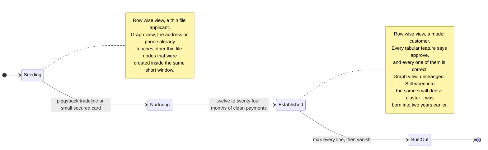
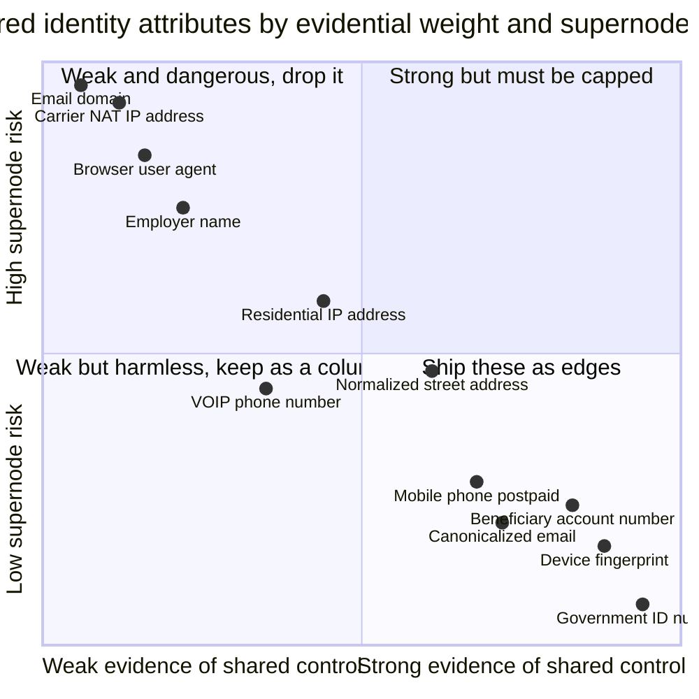
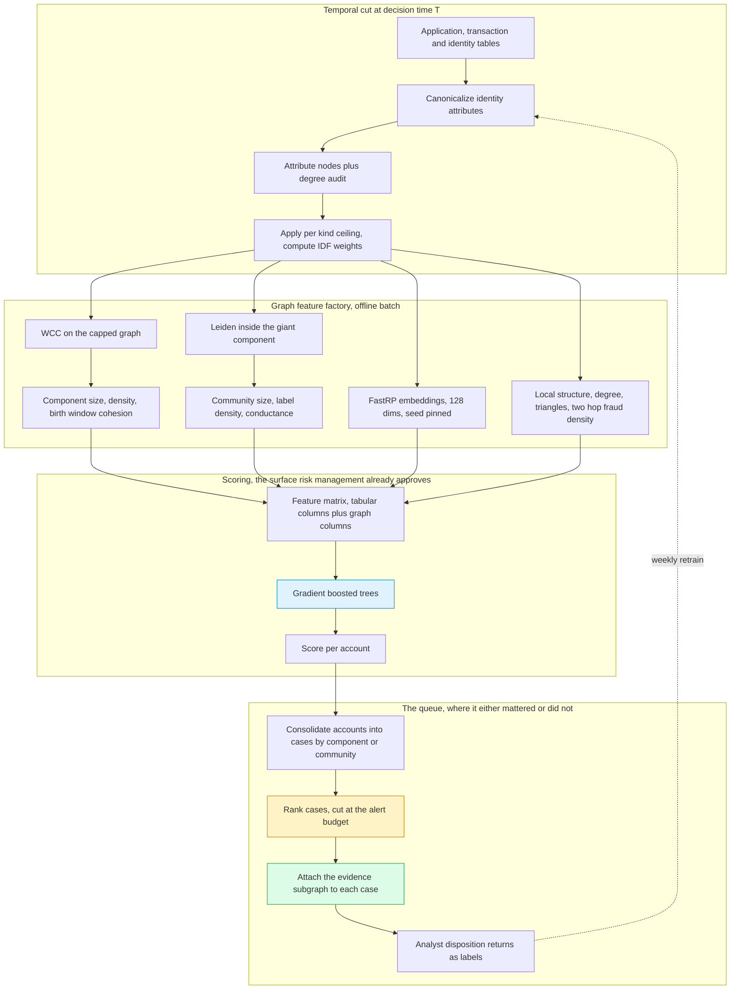
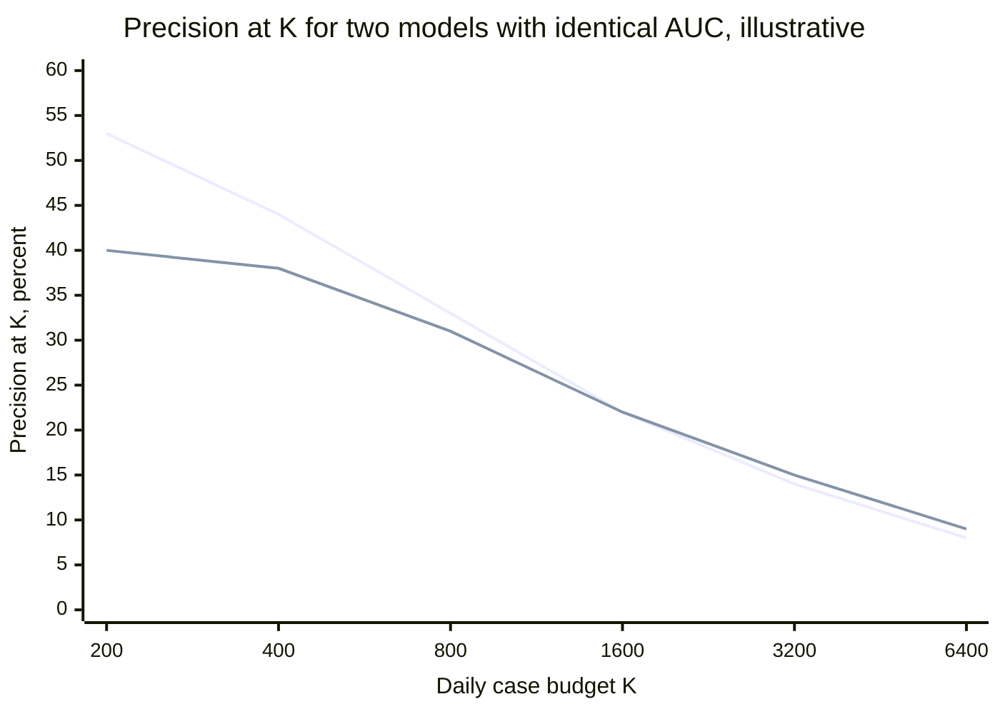

# Graph Fraud Detection: Rings, Synthetic Identity, and the Pipeline That Ships

The application was clean. Thin file, but clean: two years of address history, a mobile number that passed carrier verification, a non-disposable email domain, a device fingerprint our infrastructure had never seen before, and a bureau pull with no derogatory marks. Two hundred and forty tabular features went into the origination model. It returned a probability of default in the second-lowest decile and a fraud score comfortably under threshold. We approved a modest unsecured line.

Six weeks later the line was drawn to zero and the account went silent.

Here is what nobody looked at, because nobody could. The device was genuinely new. But the *canonicalized* mobile number — same subscriber, different formatting, ported to a different carrier eight months earlier — had appeared on three other applications that year. Two of those applicants shared a normalized street address with four more. One of those four listed a beneficiary account that eleven other accounts also paid into. Every one of those eleven had charged off in the preceding nine months.

The account was one hop from a phone number, two hops from an address, four hops from a beneficiary account, and five hops from eleven confirmed losses. In the flat table it was one row among eight million and it looked fine. It *was* fine, on every axis the table measured. The fraud was not in the row. It was in edges the row had no columns for.

That is the argument for graph fraud detection in one anecdote — a composite rather than a case, because the shape matters more than the numbers. This post is about turning that shape into something that runs every night, produces a queue a human team can actually work, and survives contact with a regulator and with an adversary who is reading your decisions and adapting.

This is **Part 5 of Graph Analytics in Production**. [Part 1](https://juanlara18.github.io/portfolio/#/blog/graph-analytics-gds-execution-model) covered the execution model — projections, memory, the in-memory graph as a separate artifact. [Part 2](https://juanlara18.github.io/portfolio/#/blog/centrality-communities-in-practice) covered centrality and community detection, including the instruction to run connected components first and never ship a community ID as a stable key. [Part 3](https://juanlara18.github.io/portfolio/#/blog/node-embeddings-fastrp-node2vec-graphsage) covered node embeddings and the temporal-cut discipline that keeps them honest. Part 4, on link prediction pipelines, is forthcoming. I lean on all of them and re-derive none.

## Four Typologies and What They Look Like in a Graph

"Fraud" is not one problem. It is four problems that share a queue, and they have genuinely different graph signatures. Detecting one with machinery tuned for another is the most common way a graph fraud program produces nothing.

### Fraud rings

An organized group operating multiple identities against the same institution, sharing infrastructure because infrastructure costs money. A ring might run twenty applications, but it does not have twenty devices, twenty verified addresses, twenty phone contracts, and twenty distinct places to send the money. Somewhere in the middle, resources are reused.

The graph signature is a **dense, small, disjoint component**: eight to two hundred account nodes connected through shared attribute nodes, internally far denser than independent attribute sharing would produce, and — critically — sitting *outside* the giant component. A real customer base connected through shared attributes is mostly singletons, plus household clusters of two to six, plus one giant blob generated by residual junk attributes. A tight cluster of thirty accounts that touches nothing else is not a shape legitimate behaviour produces.

### Synthetic identity

A fabricated person built on top of at least one real datum. The Federal Reserve's industry-recommended definition, established in 2018 to stop institutions counting the same thing four different ways, is deliberately broad: "the use of a combination of personally identifiable information (PII) to fabricate a person or entity in order to commit a dishonest act for personal or financial gain." The Fed calls it the fastest-growing type of financial crime in the United States. Neo4j's synthetic-identity writeup repeats an industry estimate that 80% of credit-card fraud losses trace to synthetic identities; Aite Group projected $2.42 billion in unsecured credit losses by 2023, up from roughly $1.63 billion in 2019. Every one of those is an industry estimate rather than a measurement — treat them as directional. What is not in dispute is that the typology is expensive and growing.

What makes synthetic identity structurally different from a ring is **patience**. The identity is seeded, nurtured for twelve to twenty-four months of perfectly clean payment behaviour to build a bureau file, then busted out — every line maxed within days, then silence.



The state diagram carries the operational point. During Nurturing and Established, the row-wise features are not merely uninformative — they are *actively misleading*, because the behaviour they measure is genuinely excellent. That is the product being purchased with two years of patience. The graph position meanwhile does not improve, because it was fixed at seeding time by which attributes the fabricator had available to reuse. **The only feature that stays informative across the whole lifecycle is the topology.** That is a strong claim and it is why synthetic identity is the typology where graph investment pays back hardest.

### First-party fraud

The applicant is a real person, using their real identity, who never intended to repay. No stolen PII, no fabricated person, nothing identity verification will ever flag. Individually indistinguishable from a customer who fell on hard times — the ambiguity that makes it hard to charge and easy to repeat.

The graph signature is **coordination across identities that are each individually genuine**. A group of real people applying in a correlated window, sharing an address or an employer or a beneficiary account, each drawing down a modest line, each defaulting within a similar horizon. Neo4j's first-party fraud material builds exactly this: weakly connected components over shared identifiers to find the islands, then Louvain inside the dense regions to split the islands that got welded together. That two-stage structure is not incidental, and I will come back to it.

### Money laundering layering

The placement-layering-integration triad, where layering is the part with a graph shape. Funds move through a chain of accounts specifically to break the link between origin and destination: circular flows, pass-through accounts holding a balance for hours, fan-out into many small transfers followed by fan-in.

The signature is **directed and temporal**, which makes it the odd one out. Rings and synthetic identity live on an undirected shared-attribute graph; layering lives on a directed money-flow graph where edge direction and timestamp are the whole point. A cycle in an undirected projection of a transfer graph is nearly meaningless. A directed cycle that closes within 72 hours, with amounts decaying by a consistent fee fraction at each hop, is a typology.

| Typology | Graph substrate | Signature | First detection primitive |
|---|---|---|---|
| Fraud ring | Shared attributes, undirected | Dense small component, disjoint from the giant component | WCC, then component size and density |
| Synthetic identity | Shared attributes plus origination time | Small dense cluster born in a narrow window, excellent behaviour | Community detection plus creation-time cohesion |
| First-party fraud | Shared attributes, undirected | Real identities, correlated application window, correlated default | Community detection plus label density in community |
| Layering | Money flow, directed and timestamped | Directed cycles and pass-through chains, short dwell time | Temporal cycle detection, SCC on a time-windowed graph |

Two consequences follow and both are load-bearing.

First, **you need at least two graphs**, not one. Serving rings and layering from a single projection produces a graph bad at both — an undirected union of shared attributes and transfers, where a shortest path hops from a device to a wire to an address and means nothing. Project separately. Part 1 argued projections are cheap and disposable precisely so you can afford this.

Second, **the first detection primitive for three of the four is community structure**, which is why Part 2 is the prerequisite here and why I will not re-derive Leiden.

## Why a Flat Table Cannot See Any of It

Practitioners who have not worked a graph problem usually respond to the above with a reasonable objection: *I can just add the features.* Count of accounts sharing this device. Count of applications on this address in the last 90 days. Days since this phone number first appeared. Those are good features, every mature shop has them, and they are genuinely part of the answer.

They are also the first term of a series that does not converge.

Formally, a row-wise model computes $f(x_v)$ where $x_v \in \mathbb{R}^p$ is built entirely from entity $v$'s own record and aggregates over $v$'s own history. Ring membership is not a function of $x_v$. It is a property of the *induced subgraph* on $v$'s $k$-hop neighbourhood — a different mathematical object, defined over a different domain.

You can approximate it. A one-hop aggregate like "accounts sharing this device" is a path-shaped feature of depth one. To reach depth two you need "accounts sharing an address with an account that shares this device." At depth $k$ over $r$ relation types, the number of distinct path-shaped aggregates is $r^k$. With six attribute types and the five hops my opening anecdote required:

$$6^5 = 7{,}776$$

seven thousand hand-built columns, almost all zero for almost every row, each of which you must define, backfill, monitor for drift, and explain. Nobody does this. People build the depth-one features, sometimes a handful of depth-two features for paths a fraud analyst named in a meeting, and then stop. The stopping point is where the ring lives.

A second, subtler failure survives even generous feature engineering. **Aggregation destroys the arrangement.** "Six accounts share this device" is the same scalar whether those six form a clique that all charged off in the same month, or six unrelated households using a shared machine in a public library. The count carries the *volume* of sharing; the topology carries the *coordination*, and coordination is what you are trying to detect. Any function that reduces a neighbourhood to a scalar before the model sees it has thrown away the signal on purpose.

And a third, which is the deepest. **The label lives on a different entity than the features.** A ring's fraud is a property of the ring. Each member's behaviour is, by construction, inside the normal distribution — that is the entire design goal of running twenty small accounts instead of one large one. You are asking a per-row model to detect a property that has no per-row realization. It is not that the model is not good enough. The quantity is not present in its input.

That is why graph fraud detection is one of the few places in applied ML where the graph is not a nice-to-have. In recommendation, in search, in churn, the graph adds a few points to a model that already works. Here it is the difference between seeing a class of adversary and not.

## Modelling the Graph: Which Shared Attributes Become Edges

Everything now depends on one modelling decision, and teams routinely get it wrong in the first week and spend three months confused about why nothing works.

**Attributes are nodes, not edge properties.** Do not create an `Account -[:SHARES_DEVICE]- Account` edge. Create `Account -[:PRESENTED]-> Device <-[:PRESENTED]- Account`. The bipartite form costs you one hop and buys you three things: the attribute node carries its own properties and degree, you can traverse *from* an attribute to enumerate everything touching it, and — most importantly — you never materialize the pairwise projection. An attribute shared by $d$ accounts implies

$$\binom{d}{2} = \frac{d(d-1)}{2}$$

pairwise edges. A single carrier NAT address shared by 20,000 accounts implies roughly $2 \times 10^8$ edges *from one attribute value*. The bipartite form stores 20,000 edges instead. That is not an optimization, it is the difference between a graph that exists and one that does not.

### Hard, soft, and useless

Attributes are not interchangeable evidence. Sort them by one question: *how strongly does sharing this value imply shared control?*

**Hard identifiers** imply shared control almost by definition. A device fingerprint composed of hardware, OS, font stack, and canvas hash. A government identification number. A beneficiary bank account number. Sharing one of these means the same person, a household, or coordination.

**Soft identifiers** imply shared control weakly and contextually. A normalized street address — decisive for a single-family home, meaningless for a 400-unit building or a mail-forwarding service. A mobile number — strong for a postpaid contract line, weak for VOIP rented by the week. A residential IP, moderate; a carrier-grade NAT IP, nothing at all.

**Useless identifiers** carry no information about control and should never become edges. Email domain. Browser user agent. Employer name at a company with 60,000 staff. Postal code. Dropping them from the graph does not mean discarding them — they remain perfectly good tabular features. The distinction is between *what generates edges* and *what generates columns*, and conflating the two is the most common modelling error I see.



The bottom-right quadrant ships as edges without qualification. The top-right ships with a degree ceiling. The top-left is dropped. The bottom-left stays as tabular columns. The interesting cases migrate between quadrants depending on your market — normalized address is bottom-right in a suburban mortgage book and creeps upward in a dense-urban card portfolio, and if you have not measured where it sits for *your* population you are guessing.

Neo4j's own fraud walkthrough reaches the same conclusion from the other direction. It weights identifier relationships by the inverse of the identifier's degree centrality, "essentially downplaying the importance of identifiers proportional to the number of other users they connect to," on the explicit reasoning that "some identifiers, particularly IP addresses, can connect to hundreds or thousands of users, in which case the identifier may be very generic (like a proxy IP address) and not as relevant to true user identity."

### Inverse document frequency, applied to identity

That inverse-degree weighting has a name, and recognizing it makes the whole thing principled rather than a heuristic. It is **inverse document frequency**. Attribute values are terms, accounts are documents, and the evidential weight of a shared attribute is exactly the surprise of the coincidence:

$$w(a) = \log \frac{N}{d_a}$$

with $N$ the number of accounts and $d_a$ the number of accounts presenting attribute $a$. Two accounts sharing an attribute held by three accounts out of ten million is worth $\log(10^7/3) \approx 15.0$ nats of evidence. Two accounts sharing an attribute held by two million is worth $\log(5) \approx 1.6$. The pairwise affinity is then the sum over shared attributes:

$$s(u,v) = \sum_{a \in A_u \cap A_v} \log \frac{N}{d_a}$$

This is a single defensible weighting scheme across heterogeneous attribute types, it degrades gracefully as an attribute becomes common, and it is exactly the weight to hand to weighted community detection. It also tells you what a degree ceiling *is*: a hard truncation of a weight already heading toward zero. Attributes above the ceiling contribute so little evidence that you may as well not pay for the traversal.

### Canonicalization is upstream and it is where the signal is won

One more thing before the code, because it quietly determines whether any of this works: **the edges only form if the values match.**

`j.doe+bank1@gmail.com` and `jdoe@gmail.com` are the same mailbox. `123 Main St Apt 4B` and `123 MAIN STREET #4B` are the same door. `+1 (415) 555-0142` and `4155550142` are the same line. Without canonicalization those are four distinct attribute nodes and the edges you needed do not exist. Entity resolution sits upstream of the graph, and if it is weak the graph will be sparse in exactly the region where the adversary is deliberately introducing variation.

The counter-risk is symmetric and worse. Over-aggressive canonicalization creates false edges, and Part 2's warning about weakly connected components over same-as edges applies at full force: WCC is transitively brittle, and one false-positive merge welds two clusters together permanently and silently. Fuzzy address matching that collapses `Apt 4B` and `Apt 48` will eventually produce a component holding a meaningful fraction of your customer base, and it will do so without erroring.

## The Supernode Trap

Now the failure that eats graph fraud programs. It deserves its own section because it presents as three unrelated problems and has one cause.

A supernode is an attribute value with enormous degree. In a fraud graph these appear immediately, from mundane sources: the carrier NAT address 40,000 mobile customers egress through, the branch's public IP, the default device fingerprint a badly configured Android build reports identically across a million handsets, the corporate address of a payroll processor, the placeholder phone number `0000000000` that weak form validation let through for two years.

Neo4j's guidance states the traversal consequence plainly: a high-traffic IP address used by thousands of accounts is a supernode, and when a query traverses through it the engine has to evaluate all of its relationships, so query performance degrades sharply. But traversal cost is only the first symptom.

**Traversal cost explodes non-linearly.** A two-hop query from an account through an attribute back out to accounts visits $\sum_a d_a$ nodes, where $a$ ranges over the account's attributes. One supernode with $d_a = 40{,}000$ dominates every other term. At three hops you are enumerating the supernode's neighbours' neighbours and the query does not return.

**Communities flood.** The expensive one, because it fails silently rather than loudly. Modularity-based detection sees a supernode as a massive hub of internal connectivity, and every account touching it gets pulled into one community. You run Leiden, look at the size distribution, and one community holds 38% of the graph. Part 2's rule — a partition with a single community above roughly 10 to 15% of the graph has failed regardless of what modularity says — is exactly the alarm that catches this, and the cause is almost always a supernode you did not cap.

**Embeddings collapse.** Part 3 covered this as `normalizationStrength`. FastRP without degree normalization lets a hub dominate everything it touches, so every account's embedding becomes approximately "I touched the processor." You see it as collapsed effective rank: ask for 128 dimensions, measure the singular value spectrum, find 14.

The fix is a boring audit that belongs in your pipeline as an assertion, not a notebook.

```python
"""Attribute degree audit. Run this BEFORE any projection, every night.

All data in this post is synthetic. Attribute values are salted hashes in
the source system and never appear in the analytical graph in clear form.
"""
import math
import os

import pandas as pd
from graphdatascience import GraphDataScience

gds = GraphDataScience(
    "neo4j+s://graph.risk.internal:7687",
    auth=("neo4j", os.environ["GDS_PASSWORD"]),
    database="fraud",
)

# Degree ceilings are per-attribute-kind because the distributions are
# wildly different. A device fingerprint on 200 accounts is a fraud farm.
# A postal address on 200 accounts is an apartment building.
DEGREE_CEILING = {
    "device_fingerprint": 40,
    "government_id": 6,
    "beneficiary_account": 60,
    "email_canonical": 25,
    "phone_e164": 25,
    "address_normalized": 120,
    "ip_address": 0,        # 0 means: never project this as an edge
    "email_domain": 0,
    "user_agent": 0,
}

audit = gds.run_cypher("""
    MATCH (acct:Account)-[:PRESENTED]->(a:Attribute)
    WITH a.kind AS kind, id(a) AS attr, count(DISTINCT acct) AS degree
    RETURN kind,
           count(*)                              AS distinct_values,
           percentileCont(degree, 0.50)          AS p50,
           percentileCont(degree, 0.99)          AS p99,
           percentileCont(degree, 0.9999)        AS p9999,
           max(degree)                           AS max_degree,
           sum(degree * (degree - 1) / 2)        AS implied_pair_edges
    ORDER BY implied_pair_edges DESC
""")

audit["ceiling"] = audit["kind"].map(DEGREE_CEILING)
audit["over_ceiling"] = audit["max_degree"] > audit["ceiling"]
print(audit.to_string(index=False))

# The assertion that saves you. implied_pair_edges is the size of the
# projection you are NOT building because you kept attributes as nodes.
# If it is above ~1e9 for any single kind, that kind is unusable as an
# edge source no matter what the ceiling says.
blown = audit[audit["implied_pair_edges"] > 1e9]["kind"].tolist()
if blown:
    raise RuntimeError(f"Attribute kinds with catastrophic fan-out: {blown}")
```

`implied_pair_edges` is the column to watch, and it is the number nobody computes. It tells you the size of the account-to-account graph you would have built had you modelled attributes as edges. Seeing it in the billions for `ip_address` on the first run is the fastest way to convince a team that the bipartite model is not pedantry.

With the audit in hand, the projection carries the ceiling and the IDF weight together.

```python
"""Project the shared-attribute graph with a per-kind degree ceiling and
IDF edge weights. Temporal cut per Part 3: nothing after decision time T.
"""
from datetime import datetime


def project_attribute_graph(gds, T: datetime, name: str):
    """Bipartite Account-Attribute graph, capped and IDF weighted.

    The ceiling is applied at projection time rather than in the database,
    so the same underlying graph can serve investigators at full fidelity
    while the analytics projection stays tractable.
    """
    ceilings = [{"kind": k, "cap": c} for k, c in DEGREE_CEILING.items() if c > 0]

    G, meta = gds.graph.cypher.project(
        """
        MATCH (acct:Account)-[p:PRESENTED]->(a:Attribute)
        WHERE p.observed_at <= $T AND acct.opened_at <= $T
        WITH a, count(DISTINCT acct) AS deg
        // Apply the per-kind ceiling. Attributes above it are dropped
        // entirely: their IDF weight is near zero anyway, and their
        // traversal cost is not.
        WITH a, deg,
             [c IN $ceilings WHERE c.kind = a.kind | c.cap][0] AS cap
        WHERE cap IS NOT NULL AND deg <= cap
        WITH a, deg, log(toFloat($N) / deg) AS idf
        MATCH (acct:Account)-[p:PRESENTED]->(a)
        WHERE p.observed_at <= $T AND acct.opened_at <= $T
        RETURN gds.graph.project(
            $name, acct, a,
            { relationshipProperties: { idf: idf } },
            { undirectedRelationshipTypes: ['*'] }
        )
        """,
        params={"T": T, "name": name, "ceilings": ceilings,
                "N": gds.run_cypher(
                    "MATCH (a:Account) WHERE a.opened_at <= $T "
                    "RETURN count(a) AS n", params={"T": T})["n"][0]},
    )
    return G, meta
```

Two details are deliberate. The ceiling is applied *at projection time*, not by deleting data — an investigator on a specific case still wants to see that the account egressed through a carrier NAT, they just do not want that fact to define a community. And the temporal cut is on both the relationship and the node, for the reason Part 3 laid out: cutting edges alone leaves future accounts in the graph as degree-zero islands, and "brand new account" is itself a leaked signal.

## The Pipeline That Ships

Here is the architecture, and I want to state the conclusion first because it is unfashionable: **the graph is a feature factory for gradient-boosted trees.** It is not an end-to-end model. This is the pattern that reaches production in regulated institutions, and I will defend it in a moment.



Three feature families come out of the graph and they do different jobs.

**Component and community aggregates.** Run WCC first, always — Part 2's instruction, and here it is not merely a sanity check, it is the primary ring detector. On a properly capped graph the component size distribution is informative on its own: a mass of singletons, a fat cluster of size two to six that is households, then a tail. Everything in the tail not attached to the giant component is worth a human eye. Then run Leiden *inside* the giant component to find rings attached to it through a single noisy edge, which would otherwise be invisible.

The features that come out are aggregates, not identifiers. Component size. Internal density $2m/[n(n-1)]$. Standard deviation of member opening dates, which is the synthetic-identity tell — a cluster whose members were all created inside a three-week window two years ago is a very different object from a household that accumulated over a decade. Fraction of members with a confirmed prior loss, computed strictly on labels available before $T$. Mean IDF of the internal edges, which separates "these thirty accounts share a device" from "these thirty accounts share an apartment building."

Note what is *not* in that list: the community ID. Part 2 spent a section on why you must never ship a community ID as a stable key, and a fraud model is the worst place to violate it. Ship the aggregates.

**FastRP embeddings.** Part 3 covers the mechanism; they belong here because they capture proximity structure no aggregate I can think to write down would capture. Part 3's opening anecdote was this exact setup — a mature tabular fraud model gaining several points of AUC from 128 unnamed columns produced by a random projection over the transfer graph. Pin the seed, cut the graph at $T$, recompute per fold, never compare vectors across runs.

**Local structural features.** Degree by attribute kind. Triangle count. Two-hop confirmed-fraud density: the fraction of accounts within two hops carrying a pre-$T$ fraud label. That last one is the closest single scalar to what my opening anecdote described, it is cheap, and on most portfolios it is the highest-importance graph feature in the model. Build it first.

```python
"""Assemble the graph feature block for one temporal fold.

Community and component IDs are consumed as aggregates and discarded.
Nothing leaves this function that a downstream system could mistake for
a stable key.
"""
import numpy as np
import pandas as pd

DIM = 128
EMB_COLS = [f"g_frp_{i:03d}" for i in range(DIM)]


def graph_features(gds, G, T) -> pd.DataFrame:
    # --- 1. Components. The primary ring detector. -----------------------
    gds.wcc.mutate(G, mutateProperty="cmp", relationshipWeightProperty=None)
    comp = gds.graph.nodeProperty.stream(G, "cmp").set_index("nodeId")
    sizes = comp["propertyValue"].value_counts()
    giant = sizes.index[0]

    # --- 2. Communities, inside the giant component only. ----------------
    G_giant, _ = gds.graph.filter("giant", G, f"n.cmp = {giant}", "*")
    gds.leiden.mutate(
        G_giant, mutateProperty="comm", gamma=1.0, theta=0.01,
        randomSeed=20280921, concurrency=1,          # reproducible, see Part 2
        relationshipWeightProperty="idf",            # IDF weighted modularity
    )

    # --- 3. Embeddings on the full capped graph. -------------------------
    emb = gds.fastRP.stream(
        G, embeddingDimension=DIM, iterationWeights=[0.0, 1.0, 1.0, 0.5],
        normalizationStrength=-0.8,                  # suppress residual hubs
        relationshipWeightProperty="idf", randomSeed=20280921,
    )
    E = pd.DataFrame(emb["embedding"].tolist(),
                     index=emb["nodeId"], columns=EMB_COLS)

    # --- 4. Cluster aggregates. Labels are strictly pre-T. ---------------
    agg = gds.run_cypher("""
        MATCH (a:Account) WHERE a.opened_at <= $T
        WITH a.cluster_key AS ck, collect(a) AS members
        WITH ck, members, size(members) AS n
        WHERE n >= 2
        UNWIND members AS m
        WITH ck, n,
             stdev(duration.inDays(date($T0), date(m.opened_at)).days) AS open_spread,
             sum(CASE WHEN m.fraud_confirmed_at <= $T THEN 1 ELSE 0 END) AS n_bad
        RETURN ck AS cluster_key, n AS cluster_size,
               open_spread AS cluster_open_date_stdev_days,
               toFloat(n_bad) / n AS cluster_prior_fraud_rate
    """, params={"T": T, "T0": "2020-01-01"})

    # --- 5. Local structure. Cheapest, and usually the strongest. --------
    local = gds.run_cypher("""
        MATCH (a:Account) WHERE a.opened_at <= $T
        OPTIONAL MATCH (a)-[:PRESENTED]->(:Attribute)<-[:PRESENTED]-(b:Account)
        WHERE b <> a AND b.opened_at <= $T
        WITH a, collect(DISTINCT b) AS nbrs
        UNWIND (CASE WHEN size(nbrs) = 0 THEN [null] ELSE nbrs END) AS b
        OPTIONAL MATCH (b)-[:PRESENTED]->(:Attribute)<-[:PRESENTED]-(c:Account)
        WHERE c <> a AND c.opened_at <= $T
        WITH a, size(nbrs) AS deg1,
             count(DISTINCT c) AS deg2,
             count(DISTINCT CASE WHEN c.fraud_confirmed_at <= $T
                                 THEN c END) AS bad2
        RETURN id(a) AS nodeId, deg1 AS g_nbr_1hop, deg2 AS g_nbr_2hop,
               CASE WHEN deg2 = 0 THEN 0.0
                    ELSE toFloat(bad2) / deg2 END AS g_fraud_density_2hop
    """, params={"T": T}).set_index("nodeId")

    out = (local
           .join(E, how="left")
           .assign(g_has_embedding=lambda d: d[EMB_COLS[0]].notna().astype("int8"))
           .fillna({c: 0.0 for c in EMB_COLS}))
    return out.join(_cluster_join(comp, sizes, agg), how="left")
```

### Why not an end-to-end GNN

Because the boring answer is the correct one, and NVIDIA — who have every commercial reason to sell you the exciting one — ship the boring one. Their fraud detection reference architecture uses a GNN to convert transaction data into embeddings which are then fed to an XGBoost model to predict the fraud score. The configuration literally names the composite `GraphSAGE_XGBoost`. Their AI Blueprint for credit card fraud is described the same way: a standard XGBoost approach, augmented with GNN embeddings as additional features, to reduce false positives.

The reasons, in the order they actually bind in a bank:

**Gradient boosting still wins on the tabular block.** Your existing two hundred and forty features are heterogeneous, mixed-type, missing-heavy, and full of the interactions trees capture with almost no tuning. Going end-to-end means giving up your best model for your best features in order to accommodate your supplementary ones.

**Operational surface area.** The feature store, model registry, drift dashboards, challenger framework, model risk documentation, annual validation — all built around a tabular model. An embedding is a set of columns and flows through every one of those unchanged. A GNN is a new serving path, new failure modes, new latency characteristics, and a new eighteen-week conversation with model risk.

**Ablation.** When the score distribution shifts, you drop the graph feature block in one line and see whether the shift follows. End-to-end, structure and features are entangled inside the weights and cannot be separated. In a regulated environment where you will be asked *what changed*, that is not a minor convenience.

NVIDIA's framing of the payoff is refreshingly non-committal, and I quote it because the honesty is instructive: "While specific metrics vary, even a small improvement — such as 1% — could translate into millions of dollars in savings, making GNNs a critical part of fraud detection systems." They decline to publish a headline number. So should you, about your own system, until you have measured it on your own portfolio at your own operating point.

## When a GNN Earns Its Cost

Everything above says gradient boosting on graph features. So when is the expensive option right?

The mechanism is not in scope here — the [graph neural networks post](https://juanlara18.github.io/portfolio/#/blog/graph-neural-networks-learning-structured-data) covers message passing, GCN, and GAT, and this section assumes it. The question here is purely economic.

The literature is clear that GNNs capture relational structure more directly than any fixed feature extraction does. Cheng, Zou, Xiang and Jiang's review in *Frontiers of Computer Science* states that GNNs are "exceptionally adept at capturing complex relational patterns and dynamics within financial networks, significantly outperforming traditional fraud detection methods." What the review does not do — and what I have not found any survey do credibly — is give you a single portable lift number, because reported gains depend entirely on the dataset, the graph construction, and the operating point. Benchmarks on the IEEE-CIS dataset, 590,540 transactions at roughly a 3.5% fraud rate, report a wide spread of AUC figures across GNN variants, and comparing them across papers compares graph constructions more than models.

So here is a decision rule instead of a number. Reach for a GNN when **all three** hold.

**One: the rings are deliberately distributed.** If an adversary spreads a ring across attributes specifically so that no single shared attribute connects more than two members, community detection finds no component. Message passing aggregates over the whole neighbourhood without requiring it to be a dense cluster, so it integrates weak evidence across many paths where a component-size feature sees nothing.

**Two: synthetic identity is the primary threat.** The typology where row-wise features are *correct and misleading* for two years. When the only informative signal is topological, spending more on modelling topology has the clearest return.

**Three: you have rich relationship data.** Multiple relation types, edge attributes, timestamps, directions. A GNN over a graph with one homogeneous undirected edge type is doing an expensive job that FastRP does for almost nothing. Heterogeneous GNNs earn their complexity when the graph is genuinely heterogeneous, and not before.

Against those, the costs compound. Training is slower and needs GPUs you have to justify. Iteration is slower, and iteration speed is what actually determines model quality over a year. Explanation is harder — the next section argues that in a regulated institution this may be disqualifying on its own. And the GNN introduces a failure mode the tree model does not have.

That failure mode has a name: **camouflage**. Dou et al.'s CARE-GNN paper at CIKM 2020 identified two varieties. *Feature camouflage* is a fraudster adjusting their own attributes to look normal. *Relation camouflage* is a fraudster deliberately connecting to legitimate entities so that message passing averages their representation toward benign. The second is specific to GNNs and it is nasty, because the aggregation step that gives the model its power is exactly the step under attack. CARE-GNN's response is a label-aware similarity measure to find informative neighbours plus reinforcement learning to choose how many to aggregate — learning, in effect, not to listen to the camouflage.

Deploy a GNN in fraud and you are signing up to defend against relation camouflage. Deploy graph features into gradient boosting and you are not: your features come from a deterministic algorithm whose behaviour under a given graph perturbation you can characterize directly. That is a real architectural advantage of the boring option and it rarely gets mentioned.

## Precision at the Alert Budget, Not AUC

Now the section that matters most operationally and gets written about least.

An investigations team has a capacity. Some number of cases per analyst per day, times some number of analysts. Call it $K$. It does not flex with your model's recall. If your model produces $3K$ alerts, two thirds of them are not reviewed — they are auto-dispositioned, batch-closed, or they age out of the queue and are closed by a cleanup job at month end. They were never signal; they were noise you paid to generate and then paid again to suppress.

So the operating point is not chosen by a threshold at all. It is chosen by the budget. The threshold is whatever score sits at rank $K$, and the metric is precision at $K$:

$$P@K = \frac{1}{K}\sum_{i=1}^{K} y_{(i)}$$

where $y_{(i)}$ is the label of the item ranked $i$-th by score. And now the observation that reframes the whole evaluation conversation. Recall at the same budget is

$$R@K = \frac{1}{N_+}\sum_{i=1}^{K} y_{(i)} = \frac{K}{N_+} \cdot P@K$$

with $N_+$ the total number of positives in the period. **At a fixed alert budget and a fixed base rate, precision and recall are the same metric up to a constant.** The precision/recall trade-off, which is the axis every fraud discussion is conducted along, does not exist at a fixed capacity. There is one number. You cannot buy recall with precision because there is nothing to buy it with — the queue is full either way.

That identity kills the most common bad argument in fraud modelling, the one that goes *the new model catches 14% more fraud*. At the same $K$, it also has 14% higher precision and is unambiguously better. If the extra catch comes only from expanding $K$, it has not improved anything: it has proposed a hiring plan.



Both lines describe models with the same area under the ROC curve. The upper line at small $K$ is the graph-feature model; the lower is the tabular baseline. They converge, and past $K = 1600$ they cross. If your operation reviews 400 cases a day, the graph model is worth roughly six extra true positives daily out of the same 400 reviews. If it could review 6,400, the two models are indistinguishable and the whole graph pipeline is unjustifiable.

**AUC integrates over thresholds you will never operate at.** It weights the region where you review 40% of your book exactly as heavily as the region where you review 0.005% of it. Two models can share an AUC and have completely different value to you — not a subtlety, but the normal case on an imbalanced problem with a tight budget. Report $P@K$ at your actual $K$ and at $K/2$ and $2K$, and put AUC in an appendix if someone insists.

### The cost asymmetry is not what you think

The standard framing: a false negative costs a charged-off credit line, several thousand dollars. A false positive costs an analyst review, which industry vendor reporting puts in the range of fifteen to fifty dollars per alert. Ratio of several hundred to one. Elkan's classic result on cost-sensitive learning gives the optimal threshold under a cost matrix as

$$p^\star = \frac{c_{FP}}{c_{FP} + c_{FN}}$$

which with those numbers lands around 0.003. Flood the queue.

This is wrong in three ways, and the wrongness is where the operating reality lives.

**The analyst cost is not the false positive cost.** A false positive that reaches a *customer* — a card frozen at a checkout, a declined mortgage payment, an account restriction on a payday — costs a support contact, a retention save, sometimes a churned relationship, and in aggregate a complaint pattern a regulator will eventually ask about. If your action is customer-visible, the fifteen-to-fifty-dollar figure understates the cost by an order of magnitude, and it is not evenly distributed across your customer base, which is its own problem.

**Capacity is fixed, so the marginal alert has zero value and positive cost.** Elkan's threshold assumes every prediction is acted on. Past $K$ they are not. The marginal alert produces no detection and still consumes triage, queue infrastructure, and analyst attention through sheer queue length. Alert fatigue is measurable degradation: industry reporting on AML transaction monitoring routinely puts false positive rates in the 85 to 95 percent range, and a team working at that hit rate loses calibration on the cases that matter.

**Recovery is partial and lagged.** The nominal FN cost is the exposure. The realized cost is exposure net of recovery, discounted, and net of the fact that catching a ring member at hop three often lets you shut the other eleven before they draw. That effect is large and it argues for graph detection specifically: the value of an alert is not the account, it is the *component*.

Which leads to the operational move that produces more improvement than most modelling work: **consolidate accounts into cases**.

A ring of forty accounts, scored individually, produces forty alerts — a tenth of a day's budget for one investigation. Group by component or community, present one case with forty members and a single evidence subgraph, and you have cut queue load by 39 units while *increasing* the information the analyst receives. It is free, it falls out of the pipeline you already built, and I have seen it reduce effective queue volume by a larger factor than any model change in the same year.

```python
"""Evaluate at the alert budget, on cases rather than accounts.

The account-level report is included only to show the gap. It is not the
number your operation experiences.
"""
import numpy as np
import pandas as pd


def queue_report(df: pd.DataFrame, budgets=(200, 400, 800, 1600)) -> pd.DataFrame:
    """df needs: score, y (0/1), case_key (component or community id).

    Accounts with no cluster get a singleton case keyed by account id, so
    every account belongs to exactly one case and nothing is dropped.
    """
    d = df.copy()
    d["case_key"] = d["case_key"].fillna("solo:" + d.index.astype(str))

    # A case scores as its strongest member, and is a true positive if ANY
    # member is confirmed fraud. That matches how an analyst dispositions
    # it: one confirmed member makes the whole case worth having opened.
    cases = d.groupby("case_key").agg(
        score=("score", "max"),
        y=("y", "max"),
        n_accounts=("y", "size"),
        n_bad=("y", "sum"),
    ).sort_values("score", ascending=False)

    total_positive_cases = int(cases["y"].sum())
    total_positive_accts = int(d["y"].sum())

    rows = []
    for K in budgets:
        head = cases.head(K)
        # Case-level: what the analyst queue actually looks like.
        p_at_k = head["y"].mean()
        r_at_k = head["y"].sum() / max(total_positive_cases, 1)
        # Account-level recall: how much exposure those K cases cover.
        acct_recall = head["n_bad"].sum() / max(total_positive_accts, 1)
        # Naive account-ranked queue, for contrast.
        naive = d.nlargest(K, "score")
        rows.append({
            "K": K,
            "case_precision_at_K": round(p_at_k, 4),
            "case_recall_at_K": round(r_at_k, 4),
            "accounts_covered": int(head["n_accounts"].sum()),
            "bad_accounts_caught": int(head["n_bad"].sum()),
            "account_recall_at_K": round(acct_recall, 4),
            "naive_bad_accounts_caught": int(naive["y"].sum()),
        })
    out = pd.DataFrame(rows)
    # Sanity identity from the text: R@K == P@K * K / N_positive.
    assert np.allclose(
        out["case_recall_at_K"],
        out["case_precision_at_K"] * out["K"] / max(total_positive_cases, 1),
        atol=1e-6)
    return out


def lift_over_champion(challenger: pd.DataFrame, champion: pd.DataFrame,
                       K: int) -> dict:
    """The only comparison that should gate a deployment decision."""
    c_new = queue_report(challenger, budgets=(K,)).iloc[0]
    c_old = queue_report(champion, budgets=(K,)).iloc[0]
    return {
        "K": K,
        "extra_bad_accounts_per_day": int(
            c_new["bad_accounts_caught"] - c_old["bad_accounts_caught"]),
        "precision_delta": round(
            c_new["case_precision_at_K"] - c_old["case_precision_at_K"], 4),
        # If this is not clearly positive, the model does not ship, no
        # matter what happened to AUC.
    }
```

## The Subgraph as an Explanation

In a regulated institution you must be able to say why an account was flagged. Not "the model scored it 0.94." Why — to an investigator today, an internal validation team next quarter, and potentially a regulator or a court after that.

Here graph fraud detection has an underrated advantage, and it is not the usual explainability story. The usual story is SHAP values on tabular features, producing sentences like *transaction velocity contributed +0.11 to the score*. That explains the model. It does not explain the account.

A traversal path explains the account:

> This account presented a device fingerprint that four other accounts also presented within a nine-day window. One of those four presented a beneficiary account number that eleven further accounts also paid into. Nine of those eleven charged off between March and August with a combined exposure above two hundred thousand. The path has length four and every edge on it is a factual record from the identity system, with a timestamp.

That is not a proxy for the reasoning. It *is* the reasoning, verifiable edge by edge, and an investigator can act on it without trusting the model at all. Nothing in tabular ML produces anything comparable.

The engineering is worth doing properly, because the gap between a good and a bad evidence subgraph is the gap between an analyst who trusts the queue and one who does not.

```python
"""Evidence subgraph extraction. One per alerted case.

Returns the highest-weight paths from the flagged account to confirmed
prior-loss accounts, with per-edge IDF so the analyst can see which links
carry evidence and which are incidental.
"""

EVIDENCE_QUERY = """
MATCH (a:Account {account_key: $account_key})
CALL {
    WITH a
    MATCH path = (a)-[:PRESENTED*2..8]-(b:Account)
    WHERE b <> a
      AND b.fraud_confirmed_at IS NOT NULL
      AND b.fraud_confirmed_at <= $T
      // every attribute on the path must be under its ceiling, or the
      // path is an artifact of a supernode and is not evidence
      AND all(n IN nodes(path)
              WHERE NOT n:Attribute OR n.degree <= n.kind_ceiling)
    WITH path, b,
         reduce(w = 0.0, n IN nodes(path) |
                w + CASE WHEN n:Attribute
                         THEN log(toFloat($N) / n.degree) ELSE 0.0 END) AS weight
    RETURN path, b, weight
    ORDER BY weight DESC
    LIMIT $max_paths
}
RETURN
  [n IN nodes(path) |
     CASE WHEN n:Attribute
          THEN {type: n.kind, degree: n.degree,
                idf: round(log(toFloat($N) / n.degree), 2)}
          ELSE {type: 'Account', key: n.account_key,
                opened: toString(n.opened_at),
                confirmed_loss: n.fraud_confirmed_at IS NOT NULL} END] AS chain,
  b.account_key   AS terminal_account,
  b.exposure_usd  AS terminal_exposure,
  round(weight, 2) AS evidence_weight
ORDER BY evidence_weight DESC
"""


def build_evidence(gds, account_key: str, T, N: int, max_paths: int = 12):
    paths = gds.run_cypher(EVIDENCE_QUERY, params={
        "account_key": account_key, "T": T, "N": N, "max_paths": max_paths})
    if paths.empty:
        return {"account_key": account_key, "narrative": None, "paths": []}

    # Deduplicate by terminal account: an analyst wants the strongest route
    # to each distinct prior loss, not twelve routes to the same one.
    best = paths.sort_values("evidence_weight", ascending=False) \
                .drop_duplicates(subset=["terminal_account"])
    return {
        "account_key": account_key,
        "n_distinct_prior_losses": int(best.shape[0]),
        "total_linked_exposure": float(best["terminal_exposure"].sum()),
        "shortest_hop_count": int(best["chain"].map(len).min()),
        "narrative": _render_narrative(best.iloc[0]),
        "paths": best.to_dict("records"),
    }
```

Four things in that query do real work.

**The supernode filter is part of the explanation, not just the performance story.** A path routing through a carrier NAT address is not evidence, and presenting it as evidence destroys analyst trust permanently. The first time an investigator opens a case and sees "linked via shared IP address" on an IP with 40,000 accounts, they will discount every subsequent case you send. Filter it in the query.

**IDF is exposed per edge.** The analyst sees the device link carrying weight 12.1 and the address link carrying 4.2, and can weigh them — more useful than a single case score, because it lets a human apply domain knowledge the model does not have.

**Deduplication by terminal account.** Twelve paths to the same charged-off account is one piece of evidence presented twelve times. Four paths to four distinct losses is four pieces of evidence. Getting this wrong makes weak cases look strong.

**Everything is timestamped and pre-decision.** The `fraud_confirmed_at <= $T` filter is the feature pipeline's temporal discipline applied to the explanation. An evidence path relying on a loss confirmed *after* the decision is not a defence of the decision — it is hindsight, and a validation team will find it.

One caution specific to regulated settings. The evidence subgraph explains why an account is *linked*. It does not by itself explain the model's score, and an internal validation function will insist on separating those. The defensible package is both: SHAP-style attribution over the feature block for the model's reasoning, plus the evidence subgraph for the factual basis of the graph features that attribution points at. Presenting only the subgraph invites the accusation that the model is decoration on a rules engine. Presenting only the attribution gives the analyst nothing to act on.

## Adversarial Adaptation and Model Decay

Every model decays. Fraud models decay faster than almost anything else you will deploy, and for a categorically different reason: **the data-generating process is an agent that observes your decisions and optimizes against them.**

Consider what a competent adversary learns from your deployment, with no inside information. They learn which applications get approved and which get declined: a labelled dataset of your decision boundary, delivered free, in real time, at whatever query rate they can afford. If you start declining applications that share a device fingerprint, the marginal cost of a second device is a few hundred dollars and the ring reconfigures within a fortnight. If you catch rings by component size, they split into components of four. The signal does not disappear; it *moves*, specifically away from wherever you last looked.

Three concrete consequences follow.

**Retrain cadence is driven by adversary response time, not data volume.** The usual heuristic — retrain when the population stability index on the score distribution crosses a threshold — is necessary and badly insufficient here, because a competent adaptation is designed to keep your score distribution looking normal. By the time PSI moves, the reconfiguration is complete. Monitor the *composition* of what you catch instead: which attribute kind carried the shortest evidence path, tracked weekly. When device-fingerprint paths drop from 60% of confirmed cases to 20% while total volume holds, the adversary changed infrastructure and your device features are decaying whether or not the score distribution noticed.

**The unreviewed region goes dark and stays dark.** Everything below rank $K$ is never labelled, so you never learn whether it was fraud. Your training data is, strictly, a sample from your previous model's top-$K$ — a feedback loop, meaning the model progressively loses the ability to detect anything its predecessor did not. The fix is a small randomized holdout: one to three percent of the review budget spent on cases sampled from *below* the cut. It costs precision on those reviews by construction, and it is the only unbiased label information about the region where the adversary is currently operating. Institutions that skip it cannot distinguish "fraud went down" from "we stopped being able to see it," and that ambiguity is unresolvable after the fact.

**Graph features decay more slowly, and that is an asset.** "Transaction velocity in the last hour" is controllable by the adversary at near-zero cost — they transact more slowly. "Distance to the nearest confirmed loss" is controllable only by acquiring genuinely disjoint infrastructure: new devices, new addresses, new beneficiary accounts, new phone contracts, all uncorrelated with the old. That carries a real dollar cost and a real setup lag. Graph features are not immune to adaptation, they are *more expensive to evade*. Measure it: track feature importance stability by family month over month, and you will typically find the graph block holding rank while individual behavioural features churn.

The failure mode to watch is subtler than plain decay: the model that keeps scoring well on the population it was trained to catch while a reconfigured typology grows underneath it. Aggregate metrics look fine because the old typology is still there and still being caught. Seeing it requires stratification — report $P@K$ separately by the primary evidence type of each confirmed case, and watch for a stratum whose volume grows while its precision falls. That is an adaptation you have not yet modelled, and it is visible weeks before it reaches a headline metric.

None of this is solvable in the sense of being finished. The honest framing of a fraud program is not "we built a model." It is that you have entered a control loop with a counterparty who is also optimizing, and the deliverable is the loop — pipeline, labelled holdout, retraining cadence, stratified monitoring, analyst feedback path — rather than any particular set of weights. The graph is the part of that loop that makes the adversary's evasion expensive rather than free. That, more than any AUC number, is why it is worth building.

## Going Deeper

**Books:**

- Baesens, B., Van Vlasselaer, V., and Verbeke, W. (2015). *Fraud Analytics Using Descriptive, Predictive, and Social Network Techniques: A Guide to Data Science for Fraud Detection.* Wiley.
  - The only book-length treatment I know that takes network-based fraud detection seriously as engineering rather than as a demo. The social network chapters cover propagation-based scoring and the bipartite modelling this post's attribute-node pattern implements.
- Provost, F. and Fawcett, T. (2013). *Data Science for Business.* O'Reilly Media.
  - Chapters 7 and 8 on expected value and evaluation are the right grounding for the alert budget section, chiefly for the insistence that a model's value is a business quantity, not a curve.
- Hamilton, W. L. (2020). *Graph Representation Learning.* Morgan and Claypool.
  - The reference for the GNN side of the decision above. Chapter 5 on inductive methods is what you need before honestly assessing whether a GNN will serve at your latency.
- Needham, M. and Hodler, A. E. (2019). *Graph Algorithms: Practical Examples in Apache Spark and Neo4j.* O'Reilly Media.
  - The practitioner's reference for the algorithms this pipeline calls. Free from Neo4j, and the community detection chapter covers parameter semantics the docs assume you know.

**Online Resources:**

- [Neo4j Financial Services industry use cases](https://neo4j.com/developer/industry-use-cases/finserv/) — Worked walkthroughs for synthetic identity fraud, first-party fraud, and account takeover, including Cypher for shared-identifier modelling and the IEEE-CIS graph construction.
- [Financial Fraud Detection with Graph Data Science](https://go.neo4j.com/rs/710-RRC-335/images/Neo4j-Financial-Fraud-Detection-GDS-white-paper-EN-A4.pdf) — Neo4j's white paper on the WCC-then-Louvain two-stage pattern, the backbone of the community feature family here.
- [Optimizing Fraud Detection in Financial Services with Graph Neural Networks and NVIDIA GPUs](https://developer.nvidia.com/blog/optimizing-fraud-detection-in-financial-services-with-graph-neural-networks-and-nvidia-gpus/) — The GraphSAGE-plus-XGBoost reference architecture, from a vendor with every incentive to sell the end-to-end version and declining to.
- [safe-graph/graph-fraud-detection-papers](https://github.com/safe-graph/graph-fraud-detection-papers) — Actively maintained bibliography of graph-based fraud, anomaly, and outlier detection work by venue and year. The fastest way to find out whether your idea already has a paper.
- [Elliptic++ dataset](https://github.com/git-disl/EllipticPlusPlus) — 203,769 labelled Bitcoin transactions and 822,942 wallet addresses; the most realistic public financial graph for testing a pipeline like this end to end.

**Videos:**

- [Neo4j Graph Data Science for Fraud Detection](https://www.youtube.com/watch?v=wv4wPkv2ZXY) by Neo4j — How graph data science augments an existing analytics and ML pipeline rather than replacing it, which is exactly the framing of the pipeline section above.
- [Fraud Detection with Graph Features and Graph Neural Networks](https://www.youtube.com/watch?v=FyqBTVzmp0Q) by SF Big Analytics — A practitioner's treatment, unusually direct about class imbalance and label scarcity, the two constraints that shape everything here.
- [Neo4j Transaction Graph Demo: How to Uncover Fraud](https://www.youtube.com/watch?v=Z1-qTE2Iji4) by Neo4j — Short and visual. Useful mainly for showing a non-technical stakeholder what a ring looks like when you draw it, which is a surprisingly effective way to get a project funded.

**Academic Papers:**

- Dou, Y., Liu, Z., Sun, L., Deng, Y., Peng, H., and Yu, P. S. (2020). ["Enhancing Graph Neural Network-based Fraud Detectors against Camouflaged Fraudsters."](https://arxiv.org/abs/2008.08692) *CIKM 2020.* DOI: 10.1145/3340531.3411903.
  - The camouflage paper. Introduces the feature-camouflage versus relation-camouflage distinction and the label-aware neighbour selection that responds to it. Read before deploying any GNN into an adversarial setting.
- Cheng, D., Zou, Y., Xiang, S., and Jiang, C. (2025). ["Graph Neural Networks for Financial Fraud Detection: A Review."](https://arxiv.org/abs/2411.05815) *Frontiers of Computer Science.*
  - The current survey, organized as a unified framework over methods. Good for orientation and for its treatment of deployment considerations, which most surveys skip.
- Van Vlasselaer, V., Eliassi-Rad, T., Akoglu, L., Snoeck, M., and Baesens, B. (2017). ["GOTCHA! Network-Based Fraud Detection for Social Security Fraud."](https://pubsonline.informs.org/doi/10.1287/mnsc.2016.2489) *Management Science*, 63(9), 3090–3110.
  - Time-weighted propagation on a bipartite company-resource network, evaluated on a real national dataset. The closest published analogue to this post's shared-attribute model, and one of very few papers with an honest operational evaluation.
- Akoglu, L., Tong, H., and Koutra, D. (2015). ["Graph Based Anomaly Detection and Description: A Survey."](https://arxiv.org/abs/1404.4679) *Data Mining and Knowledge Discovery*, 29(3), 626–688.
  - Pre-dates the GNN wave, which is why it is worth reading. Systematizes the structural anomaly patterns — near-cliques, stars, bipartite cores — that component-level features are still detecting.
- Elmougy, Y. and Liu, L. (2023). ["Demystifying Fraudulent Transactions and Illicit Nodes in the Bitcoin Network for Financial Forensics."](https://arxiv.org/abs/2306.06108) *KDD 2023.*
  - Introduces Elliptic++ and demonstrates that features derived from the address-to-address and address-transaction graphs improve detection of illicit transactions and illicit actors simultaneously. A clean worked example of graph-as-feature-factory on public data.
- Elkan, C. (2001). ["The Foundations of Cost-Sensitive Learning."](https://cseweb.ucsd.edu/~elkan/rescale.pdf) *IJCAI 2001*, 973–978.
  - Six pages deriving the optimal threshold under a cost matrix. Worth reading precisely so you understand its assumptions, and why a capacity-constrained queue violates them.

**Questions to Explore:**

- At a fixed alert budget, precision and recall collapse into one metric and the precision-recall trade-off vanishes entirely. Almost all fraud research optimizes AUC or F1, neither of which is that metric. Is the literature optimizing a quantity no operating institution experiences — and what would a benchmark designed around a capacity constraint look like?
- Graph features are expensive to evade because evasion requires acquiring real infrastructure. That suggests a design principle: prefer features with high evasion cost even at the price of raw predictive power. Could you formalize *evasion cost per unit of lift* and select features by it, and what would that do to a decay curve?
- The unreviewed region below rank K is never labelled, so the training set samples the previous model's beliefs. A randomized holdout fixes the bias at a known cost. Is there a principled way to set the holdout fraction — an explore-exploit formulation where the exploration budget is driven by the adversary's adaptation rate rather than by a hyperparameter?
- A traversal path is a good explanation of a link but not of a score. If regulators eventually demand explanations of *decisions* rather than of models, does graph evidence become the primary artifact, and the model merely the ranking function deciding which evidence to surface?
- Rings, synthetic identities, and layering are three names for one underlying act: coordinating multiple identities under a single controller. We detect them with three pipelines because their graph substrates differ. Is there one formulation — controller inference over a heterogeneous temporal graph — that subsumes all three, and is the reason nobody ships one theoretical or merely organizational?
