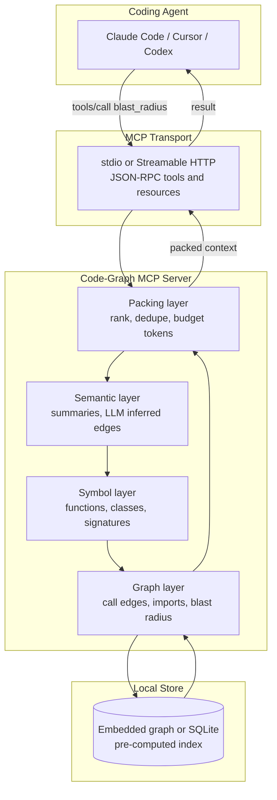
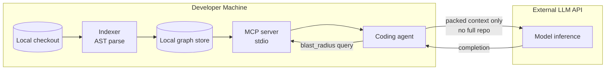
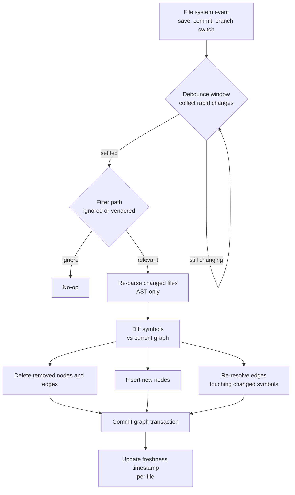
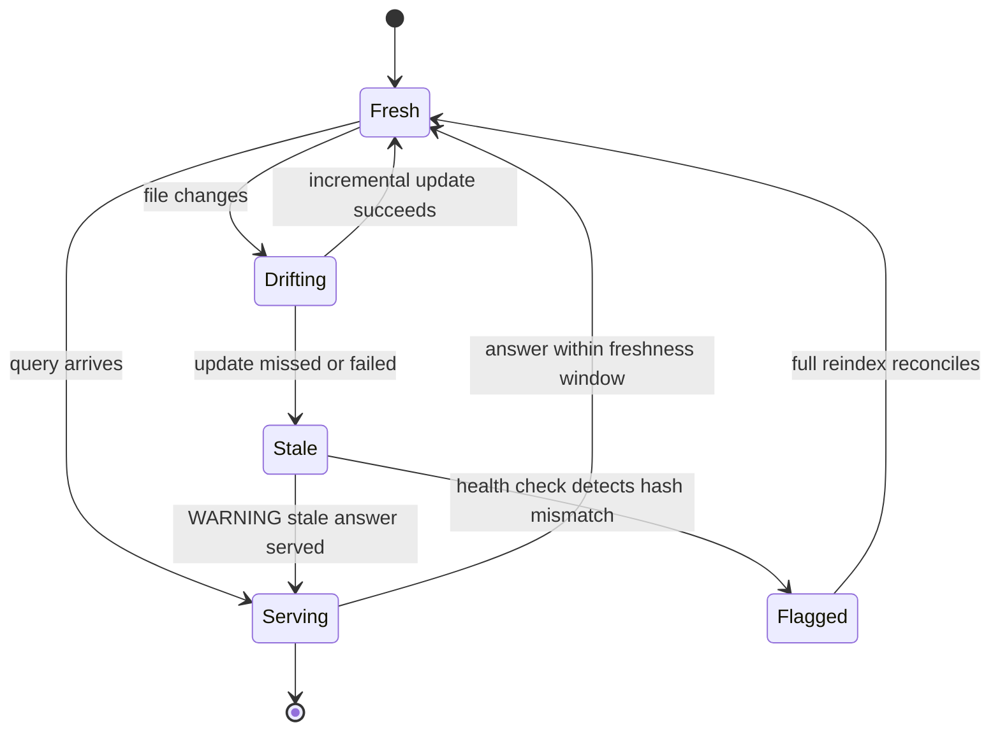

# The Graph Layer in Production: MCP, Local-First, and Build vs Buy

A truss bridge is an honest structure. You can see every load path. Nothing is hidden behind cladding; the diagonals and verticals are right there, each one carrying a force you could compute with a pencil. When a truss bridge fails, it usually fails at a joint you could have inspected, under a load someone could have predicted. That transparency is the whole point. You trust it because you can trace how the weight moves from the deck to the piers.

The graph layer for agents is supposed to be that kind of structure. Over four posts, this series has argued that grep and embeddings are the wrong primitives for giving a coding agent an understanding of a codebase, and that what you actually want is a graph: nodes for symbols, edges for the relationships between them, queried deterministically. We built the graph, we queried it, we gave it memory. What we have not done yet is the unglamorous part that decides whether any of it survives contact with a real team. How does the graph get *served* to the agent? Where does it live? How does it stay current as the code changes underneath it? What does it cost, who should build it, and — the question nobody wants to ask after four posts of enthusiasm — when should you not build it at all?

This is the finale, and it is deliberately the least romantic post in the series. It is about production: the serving layer, the freshness problem, the cost model, the build-versus-buy decision, the failure modes you will actually hit, and the honest cases where the whole apparatus is overkill. If the earlier posts were about whether the graph layer *works*, this one is about whether it *ships*.

Let me recap the arc quickly, because the finale only makes sense against it.

In [part one](https://juanlara18.github.io/portfolio/#/blog/agent-graph-layer-why-grep-embeddings-fell-short) I argued that the two dominant ways agents find code — lexical search and vector similarity — both fail at the thing that matters most, which is *structure*. Grep finds strings; it does not know that `charge()` calls `authorize()` which reads `PaymentConfig`. Embeddings find things that sound similar; they do not know what actually depends on what. The proposal was a third primitive: a graph of the codebase, queried by relationship rather than by keyword or by cosine distance.

[Part two](https://juanlara18.github.io/portfolio/#/blog/repo-to-graph-ast-vs-llm-extraction) was about building that graph, and specifically the tension between two extraction strategies: parse the code with a compiler-grade AST and get precise, cheap, deterministic edges, or ask an LLM to read the code and infer richer semantic relationships at higher cost and lower determinism. The conclusion was a layered one — AST for the skeleton, LLM for the connective tissue you cannot parse.

[Part three](https://juanlara18.github.io/portfolio/#/blog/querying-code-graphs-blast-radius-localization) turned the graph into answers: blast-radius queries ("if I change this function, what breaks"), fault localization, neighborhood retrieval that hands the agent exactly the symbols it needs and nothing more. This is where the graph earns its keep, because a good neighborhood query replaces a dozen exploratory file reads with one call.

[Part four](https://juanlara18.github.io/portfolio/#/blog/graph-memory-temporal-agents-graphiti-cognee) extended the idea from static structure to *memory* — temporal graphs that let an agent remember what it learned about your system across sessions, using the same graph substrate that tools like Graphiti and Cognee are built on.

Four posts, one claim: agents need a graph layer. Now we ship it.

---

## The Serving Layer: Why MCP Won

You have a graph. It lives in some store — an embedded graph database, a SQLite file, a Neo4j instance. The agent lives somewhere else: inside Claude Code, inside Cursor, inside Codex, inside whatever harness your team standardized on. Between the graph and the agent there is a gap, and the interesting engineering question of 2026 is what fills that gap.

For a brief period the answer was "nothing coherent." Every code-intelligence tool shipped its own plugin for every editor. If you wanted graph context in Cursor you installed the Cursor extension; if you wanted it in a different agent you were out of luck or writing glue. This is the classic N-times-M integration problem: N tools, M agents, and someone maintaining N times M connectors that all rot at different rates. It is the same problem that USB solved for peripherals and that language servers solved for editor tooling. The pattern always resolves the same way — you invent a *protocol*, and then tools and clients only have to speak the protocol.

For agent context, that protocol is the [Model Context Protocol](https://juanlara18.github.io/portfolio/#/blog/model-context-protocol). I have written about [MCP as a concept](https://juanlara18.github.io/portfolio/#/blog/model-context-protocol) and about [building enterprise MCP servers](https://juanlara18.github.io/portfolio/#/blog/mcp-production-enterprise), so I will not re-explain the whole thing. What matters here is why it became the natural home for graph context specifically.

MCP is, at its core, a small JSON-RPC protocol with three primitives — **tools** (actions the agent can call), **resources** (read-only data the agent can pull), and **prompts** (reusable templates) — and two standard transports: **stdio** for local processes and **Streamable HTTP** for remote ones. That is nearly the entire surface area. The genius is in the smallness. A code-graph server does not need to know whether it is talking to Claude Code or Cursor or a custom agent; it exposes a `blast_radius` tool and a `neighborhood` tool, describes them with JSON schemas, and any MCP-speaking client can call them. The N-times-M problem collapses to N-plus-M: each tool speaks MCP once, each client speaks MCP once.

Look at what the real code-graph tools actually did, because they converged on this independently. CodeGraphContext describes itself, in its own repository, as "an MCP server plus a CLI tool that indexes local code into a graph database to provide context to AI assistants." Its setup wizard detects and configures VS Code, Cursor, Windsurf, Zed, Claude, Gemini CLI, and Codex — one server, many clients, exactly the payoff MCP promises. colbymchenry's codegraph is "for Claude Code, Codex, Gemini, Cursor, OpenCode" and exposes a single primary MCP tool that returns "the relevant symbols' verbatim source grouped by file, plus the call paths between them and a blast-radius summary." Different projects, same architecture: build the graph once, serve it over MCP, let every agent drink from it.

### The Layered Stack, Served Over One Transport

The thing MCP lets you do cleanly is serve a *layered* context stack behind a single interface. The graph layer is not one thing; it is a stack, and the transport hides the layering from the client.



At the bottom is the **graph** itself — the raw nodes and edges from part two, the call graph and import graph and inheritance graph. Above it sits a **symbol layer** that resolves graph nodes to concrete source: the actual function body, its signature, its docstring. Above that, an optional **semantic layer** — LLM-generated summaries, the inferred edges that AST parsing cannot produce. And at the top, a **packing layer** whose entire job is to take the raw graph query result and turn it into something that fits a context budget: rank the neighborhood by relevance, deduplicate, drop the low-value nodes, and return verbatim source for the ones that survive.

The client never sees this stack. It calls one tool, `blast_radius("charge_customer")`, and gets back a packed, ranked, token-budgeted answer. All the layering happens server-side, behind the transport. This is the real reason MCP won for graph context: it lets you evolve a sophisticated multi-layer retrieval pipeline without ever renegotiating the contract with the agent. The tool signature is stable; the intelligence behind it can get arbitrarily deep.

---

## Local-First vs Hosted: The No-Egress Default

Here is the design decision that separates a toy from a tool your company will actually let you run: *where does the code live while it is being indexed, and where does the graph live while it is being queried?*

The winning pattern, across essentially every serious tool in this space, is **pre-computed on-device with no code egress**. The graph is built on the developer's machine, from the developer's local checkout, and stored in a local embedded database. When the agent asks a structural question, the answer is computed locally and only the *answer* — a small, packed neighborhood of relevant symbols — is ever sent anywhere. The full codebase never leaves the machine to be indexed by a remote service.

The tools say this loudly because it is their main selling point. colbymchenry's codegraph advertises "100% Local," and is explicit: "No data leaves your machine. No API keys. No external services. SQLite database only." CodeGraphContext runs its graph database "embedded (FalkorDB Lite, KuzuDB) or via self-hosted Docker" and states plainly that "no code is transmitted externally." This is not an accident of implementation. It is the load-bearing feature.

Think about why from the perspective of the person who has to approve it. Proprietary source code is, for most companies, among the most sensitive assets they own. It encodes the product, the trade secrets, the security posture, and often regulated logic. A tool that requires you to upload your entire repository to a third-party service so it can build a graph is, for a large class of organizations, a non-starter before the first meeting ends. Legal will not sign it. Security will not sign it. The compliance team has a checklist and "sends all our source to an external indexer" fails the checklist on the first line.

A local-first tool sidesteps that entire conversation. The security story becomes trivial to tell: the code is indexed by a process running on the same machine that already has the code checked out, using the same permissions the developer already has, and nothing new leaves the building. You are not expanding the blast radius of a breach. You are not creating a new copy of the crown jewels in someone else's cloud. The graph is a local derivative of files the developer already possesses.



Notice the one arrow that does leave the machine: the packed context the agent chooses to send to the model, which is the same context it would have sent anyway by reading files. The graph does not add egress; it *reduces* it, because a good neighborhood query sends fewer, more relevant symbols than a naive agent that reads ten files hoping one is relevant. Local-first plus MCP is, if anything, a privacy *improvement* over the grep-and-read baseline.

### When Hosted Is Actually Justified

Local-first is the default, not a religion. There are real cases where a hosted or shared team graph earns its complexity.

The first is **scale that a laptop cannot hold**. Potpie is explicitly aimed at "enterprises with sprawling, deeply interconnected systems, starting around a million lines of code and scaling far beyond that," and builds its property graph in a Neo4j instance. At that size, and especially across dozens of interdependent repositories, the graph is genuinely large and the indexing genuinely expensive. Rebuilding it on every developer's machine is wasteful; a shared, centrally maintained graph amortizes the cost across the team.

The second is **cross-repository and organizational context**. A local graph knows about the repo you have checked out. It does not know that a function in *this* service is called by a different team's service two repositories over, because that code is not on your disk. If the value you need is precisely the cross-service blast radius — the "who else in the whole company depends on this API" question — you need a graph that spans repositories, and that graph has to live somewhere central.

The third is **shared memory and provenance**. If you want the temporal, learned memory from part four to be a *team* asset — the accumulated understanding of the system, not just one developer's — it has to be hosted. One engineer's local graph memory does not help the next engineer.

The honest framing is a spectrum, not a binary. Most teams should start local-first because it is cheaper, safer, and faster to adopt, and it clears compliance without a fight. You graduate to a hosted or hybrid graph only when you hit a concrete wall: the repo is too big for a laptop, or the question you need to answer inherently spans repositories, or the memory needs to be shared. If you cannot name which wall you hit, you have not hit one.

---

## Freshness: The Number One Failure Mode

Here is the thing that kills graph-layer deployments, and it is not accuracy and it is not latency. It is **staleness**.

A code graph is a snapshot. The moment it is built, it begins to drift from the code it describes, because the code is changing continuously — every save, every commit, every merge, every branch switch. A graph that says `charge_customer` calls `authorize_payment` is worth a great deal when it is true and actively dangerous when it is false. A stale graph does not fail loudly. It fails by confidently returning a blast radius that omits the three call sites added yesterday, and the agent, trusting the graph, makes a change that breaks them. The agent was not wrong to trust the graph. The graph was wrong to be old.

This is why every serious tool in the space treats freshness as a first-class concern rather than an afterthought, and why the interesting engineering is in the *update* path, not the initial build.

There are two ways to keep a graph current, and the difference between them is the difference between a tool developers tolerate and one they abandon.

**Full reindex** rebuilds the entire graph from scratch. It is simple, it is always correct, and it is the right thing to do exactly once — on first index — and occasionally as a periodic reconciliation to heal any drift. As a response to a single file changing, it is absurd: re-parsing a million-line codebase because someone edited one function is a coffee-break-length operation, and no one will run a tool that makes them wait.

**Incremental update** reindexes only what changed. When a file is saved, you re-parse that file, diff its symbols against the graph, and surgically update the affected nodes and edges — delete the ones that no longer exist, add the new ones, and re-resolve the edges that touch the changed symbols. This is the pattern that makes the graph feel live. colbymchenry's codegraph does exactly this: its "file watcher uses native OS events (FSEvents/inotify/ReadDirectoryChangesW) with debounced auto-sync," so "the graph stays current as you code, zero config," with a default debounce window of about two seconds so a flurry of saves collapses into one update. CodeGraphContext offers the same shape through a `watch` command that will "watch directories for changes and automatically update the graph in real-time."



The subtlety that separates a correct incremental updater from a buggy one is **edge re-resolution**. Deleting and re-adding nodes for the changed file is easy. The hard part is that an edge is a relationship between two nodes, and a change in file A can invalidate an edge that lives conceptually "at" file B. If you rename `authorize_payment` to `authorize_charge`, every call site in every other file now points at a symbol that no longer exists. A naive incremental updater that only re-parses the file you edited will miss all those dangling call edges and leave the graph internally inconsistent. The correct approach re-resolves the edges that *touch* the changed symbols, following them outward one hop, even into files that were not themselves edited. This is where roll-your-own implementations quietly go wrong, and it is worth testing explicitly.

There is also a middle strategy worth naming: **commit-triggered reindex** rather than save-triggered. Save-triggered updates give you a graph that tracks your working tree in real time, which is what you want during active development. Commit-triggered updates give you a graph that tracks the committed history, which is cleaner for a shared or CI-hosted graph where you do not want half-written functions polluting the index. Many hosted setups run incremental updates on the save path locally and a reconciling reindex on the commit or merge path centrally. The right choice depends on whether the graph is a personal working aid or a shared source of truth.

Whatever you choose, instrument staleness. Every node should carry the timestamp and content hash of the file it came from. Then "is this graph fresh" becomes a query you can answer, and a stale answer becomes something you can detect and flag rather than a silent lie the agent acts on.

---

## The Cost Model: When the Graph Pays for Itself

Let me make the economics concrete, because "graphs are good" is not a budget line and someone will eventually ask you to justify the machinery.

The graph layer has two costs and one benefit, and the whole decision is whether the benefit clears the costs.

The **first cost is indexing** — building the graph in the first place. This is a one-time cost per repository (the initial full index) plus a small recurring cost per change (the incremental updates). For AST-based extraction the initial index is cheap: parsing is fast, deterministic, and free of API calls. A moderately large repository indexes in seconds to low minutes on a developer laptop. If you added an LLM-based semantic layer on top, the initial index gets more expensive because you are paying for inference over the codebase, but it is still one-time and cacheable. Incremental updates are nearly free — you re-parse a handful of files per change.

The **second cost is query-time overhead** — the graph query itself, plus the packing. This is small: a graph traversal over a local store is a millisecond-scale operation, and the packing is cheap logic. Negligible next to model inference.

The **benefit is token savings at query time**, and this is the number that matters. Without a graph, an agent explores. It greps, it reads a file, decides it is not the right one, reads another, follows an import, reads a third. Each of those reads dumps a whole file into the context window, most of which is irrelevant. The agent burns tokens — and wall-clock time, and tool calls — discovering structure that a graph already knows. With a graph, the agent asks one blast-radius question and gets back exactly the relevant symbols, verbatim, packed to a budget. The reported effect is large: colbymchenry's codegraph cites benchmarks across seven real-world codebases showing "58% fewer tool calls, 22% faster, file reads cut to roughly zero." Treat any single vendor's specific percentages as directional rather than gospel, but the *shape* is consistent across the field and matches first principles: replacing exploratory reads with targeted retrieval saves the tokens you would have spent exploring.

Here is the back-of-envelope. Let $C_{index}$ be the amortized indexing cost per query — the one-time build plus incremental updates, divided over all the queries the graph will serve in its lifetime. Let $C_{query}$ be the per-query graph overhead, and $S$ the tokens saved per query by avoiding exploratory reads, converted to dollars. The graph pays for itself when:

$$
S > C_{index} + C_{query}
$$

The reason this almost always resolves in the graph's favor on an active repository is that $C_{index}$ is a fixed cost divided by a large and growing number of queries. Index once, query thousands of times, and the amortized per-query indexing cost rounds to nothing. Meanwhile $S$ — the savings from not making the agent re-derive the call graph on every single question — recurs on every query. Fixed cost amortized toward zero, recurring benefit that does not amortize away: that is the classic shape of an investment that pays off, and it pays off faster the more the repository is queried.

Which immediately tells you where it does *not* pay off. If the repository is queried rarely — a script you touch twice a year — the denominator under $C_{index}$ stays small and the amortization never happens. If the repository is tiny, $S$ itself is tiny because there was barely any structure to explore. The cost model is not just an argument for the graph; read the other direction, it is the argument for *when to skip it*, which we will get to.

---

## Build vs Buy: A Decision Framework

You are convinced the graph layer is worth it for your team. Now: do you build it or adopt one? This is the decision I see teams agonize over, usually badly, so let me give it structure.

The build-versus-buy call for a code-graph MCP server lives on two axes. One is **how specialized your needs are** — do you need standard call-graph and blast-radius answers, or do you have exotic requirements like a bespoke language, a custom edge type, or a proprietary framework the off-the-shelf parsers do not understand? The other is **how much you value control and integration depth** versus **time-to-value**.

```mermaid
quadrantChart
    title Build vs buy for a code graph server
    x-axis Standard needs --> Specialized needs
    y-axis Optimize for speed --> Optimize for control
    quadrant-1 Fork and extend a tool
    quadrant-2 Build in house
    quadrant-3 Adopt a tool as is
    quadrant-4 Buy a platform
    Solo side project: 0.15, 0.20
    Typical product team: 0.30, 0.35
    Polyglot monorepo: 0.55, 0.55
    Bespoke language stack: 0.80, 0.75
    Regulated enterprise: 0.60, 0.85
    Platform team offering: 0.45, 0.80
```

The default recommendation for most teams is **buy, or rather adopt** — start with an existing open-source tool. The reason is that the boring parts of a code-graph server are genuinely hard and already solved. Robust multi-language AST parsing, incremental file watching that correctly re-resolves edges, MCP wiring for a dozen clients, an embedded graph store that does not corrupt itself — that is a lot of undifferentiated engineering, and CodeGraphContext, colbymchenry's codegraph, Potpie, and others have already paid for it. CodeGraphContext alone claims 23 languages and 20-plus MCP tools. You are not going to out-engineer that on a Tuesday, and if you try, you are spending senior time re-solving solved problems instead of on your product.

You **build** when you have a requirement the tools structurally cannot meet. A proprietary language or DSL the parsers do not support. An edge type that encodes something specific to your architecture — say, a "publishes-to-topic" relationship in an event-driven system — that no general tool models. A compliance constraint so strict that you cannot run third-party code against your source at all and must own every line of the indexer. These are real, but they are rarer than engineers' enthusiasm for building suggests. Be honest about whether you are in this quadrant or just want to be.

The pragmatic middle is **fork and extend**: adopt an open-source tool for the 80% that is standard — the parsing, the MCP transport, the watcher — and add your specialized edges or language support on top. This captures most of the leverage of buying with most of the control of building, and it is where a lot of serious teams land. The whole ecosystem being open-source and MCP-native makes this genuinely viable in a way it was not two years ago.

Here is the framework as a table, because trade-off tables are how these decisions actually get made in a room:

| Situation | Recommendation | Why |
|---|---|---|
| Solo dev, standard languages | Adopt as-is | Zero engineering, immediate value, local-first clears every concern |
| Product team, mainstream stack | Adopt as-is | The tools cover your languages; spend your time on the product |
| Polyglot monorepo, some odd languages | Fork and extend | Base tool for the common case, add parsers for the long tail |
| Bespoke language or custom edge semantics | Build | No tool models your structure; ownership is the point |
| Regulated enterprise, no third-party code on source | Build or self-hosted fork | Compliance forbids running external indexers |
| Platform team serving many internal teams | Buy a platform or fork and host | Shared, cross-repo, hosted graph is a product in itself |

The meta-point: the existence of a healthy open-source ecosystem has moved the default. A few years ago, "graph layer for agents" meant building everything. Today the honest default is adopt-first, build-only-when-you-must, and the burden of proof is on the person who wants to build.

---

## A Minimal Code-Graph MCP Server

Enough architecture. Let me make "served over MCP" concrete with a small, correct implementation: an MCP server that answers a blast-radius and a neighborhood query over a pre-built call graph. This is deliberately illustrative — a production server adds the packing layer, the incremental watcher, and real language parsing — but everything here is real and runnable, and it shows exactly how the pieces connect.

We will assume the graph was already built (that was part two) and is available as a simple adjacency structure: for each symbol, the set of symbols it calls and the set that call it. In production this comes out of your AST extractor and lives in an embedded store; here I load it from JSON so the shape is obvious.

```python
# graph_server.py
"""A minimal code-graph MCP server.

Serves blast-radius and neighborhood queries over a pre-built call graph.
The graph is assumed already indexed (see part two); we only serve it.
Transport is stdio, so an MCP client launches this as a local subprocess and
no source code ever leaves the machine.
"""
from __future__ import annotations

import json
from collections import deque
from dataclasses import dataclass, field
from pathlib import Path

from mcp.server.fastmcp import FastMCP

mcp = FastMCP("code-graph")


@dataclass
class CodeGraph:
    """A directed call graph over symbols.

    callers[x]  -> symbols that call x   (incoming edges: who depends on x)
    callees[x]  -> symbols that x calls  (outgoing edges: what x depends on)
    location[x] -> "path:line" for the symbol's definition
    """
    callers: dict[str, set[str]] = field(default_factory=dict)
    callees: dict[str, set[str]] = field(default_factory=dict)
    location: dict[str, str] = field(default_factory=dict)

    @classmethod
    def load(cls, path: Path) -> "CodeGraph":
        raw = json.loads(path.read_text(encoding="utf-8"))
        callees: dict[str, set[str]] = {}
        callers: dict[str, set[str]] = {}
        location: dict[str, str] = {}
        for node in raw["nodes"]:
            name = node["symbol"]
            callees.setdefault(name, set())
            callers.setdefault(name, set())
            location[name] = node.get("location", "unknown")
        for edge in raw["edges"]:
            src, dst = edge["from"], edge["to"]
            # An edge from src to dst means src calls dst.
            callees.setdefault(src, set()).add(dst)
            callers.setdefault(dst, set()).add(src)
            # Ensure endpoints exist even if only referenced by an edge.
            callees.setdefault(dst, set())
            callers.setdefault(src, set())
            location.setdefault(src, "unknown")
            location.setdefault(dst, "unknown")
        return cls(callers=callers, callees=callees, location=location)

    def exists(self, symbol: str) -> bool:
        return symbol in self.location


# Load once at startup. In production this is an embedded graph store kept
# fresh by an incremental file watcher, not a static file read at boot.
GRAPH_PATH = Path(__file__).parent / "call_graph.json"
GRAPH = CodeGraph.load(GRAPH_PATH)


def _bfs(adjacency: dict[str, set[str]], start: str, max_depth: int) -> dict[str, int]:
    """Breadth-first traversal returning each reachable symbol and its depth.

    Used for both directions: pass `callers` for upstream impact (blast radius)
    or `callees` for downstream dependencies (what a symbol relies on).
    """
    seen: dict[str, int] = {start: 0}
    queue: deque[str] = deque([start])
    while queue:
        node = queue.popleft()
        depth = seen[node]
        if depth >= max_depth:
            continue
        for neighbor in adjacency.get(node, ()):  # empty set if leaf
            if neighbor not in seen:
                seen[neighbor] = depth + 1
                queue.append(neighbor)
    del seen[start]  # the query symbol itself is not part of its own radius
    return seen


@mcp.tool()
def blast_radius(symbol: str, max_depth: int = 3) -> str:
    """Find everything affected if you change a symbol.

    Traverses incoming call edges: these are the symbols that transitively
    depend on `symbol`, i.e. the code that could break if you change it.

    Args:
        symbol: Fully qualified symbol name, e.g. "billing.charge_customer".
        max_depth: How many call hops to traverse outward. Keep small; the
            radius grows fast and most real impact is within two or three hops.
    """
    if not GRAPH.exists(symbol):
        return (
            f"Symbol '{symbol}' not found in the graph. "
            f"It may be misspelled, or the graph may be stale for this file."
        )

    max_depth = max(1, min(max_depth, 6))  # clamp to keep results bounded
    impacted = _bfs(GRAPH.callers, symbol, max_depth)
    if not impacted:
        return f"Nothing depends on '{symbol}'. Changing it is locally contained."

    # Group by depth so the agent sees direct callers before distant ones.
    by_depth: dict[int, list[str]] = {}
    for name, depth in impacted.items():
        by_depth.setdefault(depth, []).append(name)

    lines = [f"Blast radius of '{symbol}' ({len(impacted)} symbols affected):", ""]
    for depth in sorted(by_depth):
        hop = "direct caller" if depth == 1 else f"{depth} hops upstream"
        lines.append(f"## {hop}")
        for name in sorted(by_depth[depth]):
            lines.append(f"- {name}  [{GRAPH.location[name]}]")
        lines.append("")
    return "\n".join(lines).rstrip()


@mcp.tool()
def neighborhood(symbol: str, max_depth: int = 1) -> str:
    """Return the local context around a symbol for the agent to reason over.

    Combines both directions: what the symbol calls (its dependencies) and
    what calls it (its dependents). This is the targeted retrieval that
    replaces a dozen exploratory file reads with one call.

    Args:
        symbol: Fully qualified symbol name.
        max_depth: Hops in each direction. Depth 1 is the immediate neighborhood.
    """
    if not GRAPH.exists(symbol):
        return f"Symbol '{symbol}' not found in the graph."

    max_depth = max(1, min(max_depth, 3))
    upstream = _bfs(GRAPH.callers, symbol, max_depth)    # depends on symbol
    downstream = _bfs(GRAPH.callees, symbol, max_depth)  # symbol depends on

    lines = [f"Neighborhood of '{symbol}'  [{GRAPH.location[symbol]}]", ""]
    lines.append("### This symbol calls (its dependencies):")
    lines += (
        [f"- {n}  [{GRAPH.location[n]}]" for n in sorted(downstream)]
        or ["- (nothing; it is a leaf)"]
    )
    lines.append("")
    lines.append("### Called by (its dependents):")
    lines += (
        [f"- {n}  [{GRAPH.location[n]}]" for n in sorted(upstream)]
        or ["- (nothing; it is an entry point or dead code)"]
    )
    return "\n".join(lines)


@mcp.resource("graph://health")
def graph_health() -> str:
    """Expose graph freshness so the agent can distrust a stale index.

    A real server compares per-file content hashes against disk here. Even a
    crude node count and load time lets a client detect an empty or broken graph.
    """
    return json.dumps(
        {
            "symbols": len(GRAPH.location),
            "edges": sum(len(v) for v in GRAPH.callees.values()),
            "source": str(GRAPH_PATH),
        },
        indent=2,
    )


if __name__ == "__main__":
    # stdio transport: the MCP client launches this as a local subprocess.
    # Nothing listens on a port; nothing leaves the machine.
    mcp.run(transport="stdio")
```

A few things about this sketch are worth calling out, because they are the parts that generalize.

The **two tools mirror the two graph directions**, and that is not incidental — it is the whole reason a graph beats grep. `blast_radius` walks incoming edges (who depends on me) and answers the change-safety question. `neighborhood` walks both directions and answers the give-me-context question. Both are trivial breadth-first traversals over an adjacency map, which is the point: once the graph exists, the queries are cheap and deterministic. There is no model in the loop, no similarity threshold to tune, no chance of a hallucinated match.

The **depth clamp** matters more than it looks. Blast radius grows combinatorially — go deep enough on a central utility function and the radius is the entire codebase, which is useless. Bounding depth and grouping results by hop distance gives the agent the signal it actually needs: the direct callers first, the distant ripples last, and a hard ceiling so a query over `log()` does not return ten thousand nodes.

The **health resource** is the freshness hook from the previous section, made concrete. Exposing graph metadata as an MCP resource lets a well-behaved agent check whether the graph is real and current before trusting a blast-radius answer. A production version compares per-file hashes against disk and reports which files are stale; even this crude version lets a client notice an empty or corrupt graph instead of silently reasoning over nothing.

And the **transport is stdio**, one line at the bottom, which is the entire local-first story in code. The client launches this file as a subprocess and talks to it over standard input and output. There is no server listening on a port, no network hop, no code leaving the machine. That single design choice is what makes the whole thing pass a security review without a meeting.

To wire it into Claude Code, the configuration is exactly the shape you would expect from an MCP server:

```json
{
  "mcpServers": {
    "code-graph": {
      "command": "python",
      "args": ["/abs/path/to/graph_server.py"]
    }
  }
}
```

That is it. The agent now has `blast_radius` and `neighborhood` as tools it can call, backed by a graph that never leaves the laptop. Everything else in this post — the packing layer, the incremental watcher, the semantic edges — is elaboration on this skeleton. If you want the full picture of how Claude Code discovers and uses tools like these, the [complete guide](https://juanlara18.github.io/portfolio/#/blog/claude-code-complete-guide) walks through the client side.

---

## Failure Modes and Observability

A graph layer in production fails in specific, recognizable ways. Knowing them in advance is the difference between a tool your team trusts and one they quietly stop using after it burns them once. Here are the four that actually happen.

**Stale nodes.** We covered this as the number one failure mode and it deserves repeating here as an operational concern, because it is the one that erodes trust fastest. A node that describes a function that was deleted or renamed yesterday is worse than no node: the agent gets a confident, wrong answer and acts on it. The defense is the freshness instrumentation — per-node content hashes, a health resource, and a policy that a query over a file whose hash does not match disk returns a staleness warning rather than a stale answer. You want the graph to be able to say "I do not know, I am out of date for this file" instead of lying.

**Hallucinated edges.** This is the specific risk of the semantic layer from part two — the LLM-inferred edges. AST edges are ground truth; a parser does not invent a call that is not there. But if you asked a model to infer relationships the parser could not see, the model can confidently assert an edge that does not exist — a "this function conceptually depends on that config" that is plausible and false. The defense is provenance: tag every edge with how it was derived (AST versus inferred), let queries filter to high-confidence edges, and treat inferred edges as hints to verify rather than facts to trust. Never let an inferred edge masquerade as a parsed one.

**Over-retrieval.** The graph makes retrieval so easy that it becomes tempting to return too much. A neighborhood query at depth three over a well-connected symbol can pull in half the codebase, and now you have reintroduced the exact problem the graph was supposed to solve — a context window stuffed with mostly irrelevant code, except now you are also paying for the graph. This is what the packing layer exists to prevent: rank by relevance, enforce a token budget, and return the high-value neighborhood rather than the complete one. A graph without a packing discipline is a firehose.

**Graph drift.** Distinct from staleness of individual nodes, drift is the slow accumulation of inconsistency in the graph as a whole — orphaned edges from incremental updates that missed a re-resolution, nodes that no longer correspond to anything, edges pointing at deleted symbols. Incremental updating is where this creeps in, because every incremental update that does not perfectly re-resolve edges leaves a little residue. The defense is periodic full reindexing as reconciliation: incremental updates for speed during the day, a from-scratch rebuild on a schedule to heal the accumulated drift and guarantee the graph converges back to ground truth.



What to monitor, concretely. Track the **freshness lag** — the distribution of time between a file changing and its graph nodes updating; if the tail grows, your watcher is falling behind. Track **query latency**, because a sudden spike usually means the graph grew unbounded or an over-retrieval query is walking too deep. Track the **stale-answer rate** — how often a query hits a node whose hash does not match disk — which is your single best signal that the update path is broken. And track **tool-call reduction**, the benefit metric from the cost model, because if the agents are not actually making fewer exploratory reads, the graph is not earning its keep and you should know that too. Observability here is not optional polish. It is how you notice the graph has quietly become a liability before it burns a developer.

---

## When Not to Graphify

After a five-post series arguing for the graph layer, the most useful thing I can tell you is when to skip it. Enthusiasm for an architecture is not a reason to deploy it, and the honest senior take is that a large fraction of codebases do not need a graph at all.

**Small repositories.** If the whole codebase fits comfortably in the model's context window, the graph is pure overhead. The agent can just read everything and reason over it directly. There is no exploration to save, because there is nothing to explore — the structure is right there in the window. The cost model makes this precise: $S$, the savings from avoiding exploratory reads, is near zero when there is barely anything to read. Below some threshold — and it keeps rising as context windows grow — grep and read is not just adequate, it is *better*, because it is simpler and has no freshness problem. Do not graphify a repository you could paste into a single prompt.

**Solo projects and small teams.** The graph earns its amortized indexing cost by being queried many times. A project one person touches occasionally does not generate the query volume to amortize the setup, the freshness maintenance, and the operational surface. The exception is if you are adopting a zero-config local tool that indexes in seconds and watches automatically — then the cost is low enough that even modest benefit clears it. But standing up bespoke graph infrastructure for a solo side project is the textbook case of solving a problem you do not have.

**Throwaway and short-lived code.** Prototypes, spikes, one-off scripts, anything with a lifespan measured in days. The graph is an investment that pays back over the life of the codebase. Code that will not live long enough to be queried much never repays the investment. If you are going to delete it next week, do not index it.

**Rapidly churning code where freshness cannot keep up.** There is a pathological regime where the code changes so fast, and in such large sweeps — a big refactor, a mid-migration codebase — that the graph is stale more often than it is fresh. In that regime the graph's confident-but-wrong failure mode dominates its benefit, and you are better off with the agent reading current files directly than trusting a snapshot that is perpetually behind. This is temporary; when the churn settles, graphify. But during the storm, do not.

The unifying principle is the one that has run through this whole series and through everything I believe about senior engineering: **match the machinery to the problem.** The graph layer is a genuinely powerful tool for large, long-lived, actively-developed, heavily-queried codebases worked on by teams — which describes most serious production systems, which is exactly why the tooling ecosystem exploded. It is overkill for small, solo, throwaway, or violently churning code. The skill is not knowing how to build a graph layer. It is knowing which of those two situations you are in, and having the discipline to skip the impressive machinery when the boring approach wins.

That is the whole series in one sentence. Agents need structural understanding of code; a graph is the right primitive for it; you build it with AST plus selective LLM inference, query it for blast radius and neighborhoods, give it memory over time, and serve it over MCP, local-first, kept fresh by incremental updates — *when the codebase is big enough and lives long enough to deserve it.* The bridge is honest because you can see every load path. Build the graph layer the same way: transparent, deterministic where it can be, instrumented for the failure modes, and never larger than the load requires.

---

## Going Deeper

**Books:**
- Kleppmann, M. (2017). *Designing Data-Intensive Applications.* O'Reilly.
  - The freshness, incremental-update, and reconciliation problems in this post are special cases of the derived-data and change-data-capture patterns Kleppmann treats in depth. A code graph is a derived dataset that must stay in sync with a source of truth.
- Robinson, I., Webber, J., & Eifrem, E. (2015). *Graph Databases* (2nd ed.). O'Reilly.
  - The foundational treatment of property graphs, traversal, and when a graph model beats the alternatives. Directly relevant to choosing and operating the store under your graph layer.
- Nygard, M. (2018). *Release It!* (2nd ed.). Pragmatic Bookshelf.
  - On building systems that survive production. The failure-mode and observability sections of this post are Nygard's stability-patterns mindset applied to a graph-serving component.

**Online Resources:**
- [CodeGraphContext on GitHub](https://github.com/CodeGraphContext/CodeGraphContext) — An MCP server plus CLI that indexes local code into a graph database, with a file watcher for freshness and setup wizards for a dozen MCP clients. The clearest reference implementation of the local-first pattern.
- [colbymchenry/codegraph on GitHub](https://github.com/colbymchenry/codegraph) — A 100% local, pre-indexed code knowledge graph with native-OS file watching and debounced auto-sync, exposing a single blast-radius-and-neighborhood MCP tool. A tight example of the packing-plus-transport idea.
- [Potpie on GitHub](https://github.com/potpie-ai/potpie) — A Neo4j-backed code knowledge graph aimed at large, multi-repository enterprise codebases. The reference point for when a hosted, cross-repo graph is justified over local-first.
- [MCP Transports Specification](https://modelcontextprotocol.io/specification/2025-03-26/basic/transports) — The official spec for stdio and Streamable HTTP, the two transports every graph server chooses between.

**Videos:**
- [Model Context Protocol explained (Anthropic)](https://www.youtube.com/results?search_query=anthropic+model+context+protocol+explained) — Anthropic's own walkthrough of why MCP exists and how tools, resources, and prompts fit together. Grounds the serving-layer section.
- [Neo4j GraphAcademy on YouTube](https://www.youtube.com/@neo4j) — Neo4j's channel of graph-modeling and Cypher tutorials; useful if you fork or build on a Neo4j-backed graph like Potpie's.

**Academic Papers:**
- Ouyang, S., et al. (2025). ["Knowledge Graph Based Repository-Level Code Generation."](https://arxiv.org/abs/2505.14394) *arXiv:2505.14394.*
  - Represents repositories as graphs to improve retrieval and code generation on repository-level tasks. Direct evidence that the graph primitive outperforms flat retrieval at scale.
- Ouyang, S., et al. (2024). ["RepoGraph: Enhancing AI Software Engineering with Repository-level Code Graph."](https://arxiv.org/abs/2410.14684) *arXiv:2410.14684.*
  - Builds a repository-level code graph and shows it improves a model's ability to understand and modify code contextually. The research backbone for why blast-radius and neighborhood queries help agents.

**Questions to Explore:**
- The cost model assumes indexing amortizes over many queries. As context windows keep growing, the repository size at which grep-and-read beats a graph keeps rising. Where is that crossover today, and does the graph layer have a shrinking or a growing addressable set of codebases?
- Incremental edge re-resolution is the hardest correctness problem in a live graph. Could you formalize a proof that an incremental updater converges to the same graph a full reindex would produce, and use that as a test oracle?
- Local-first solves code egress but not model egress — the packed context still goes to a hosted model. Does a graph layer make on-device or self-hosted models more viable by shrinking the context they need to be useful?
- Hallucinated edges from an LLM semantic layer are a trust problem. Is there a principled way to assign calibrated confidence to an inferred edge, so the packing layer can include or exclude it by a threshold rather than a binary?
- If every developer runs a local graph and a central team runs a hosted cross-repo graph, you have two sources of truth that can disagree. What is the right reconciliation model between a personal working-tree graph and a shared committed-history graph?
