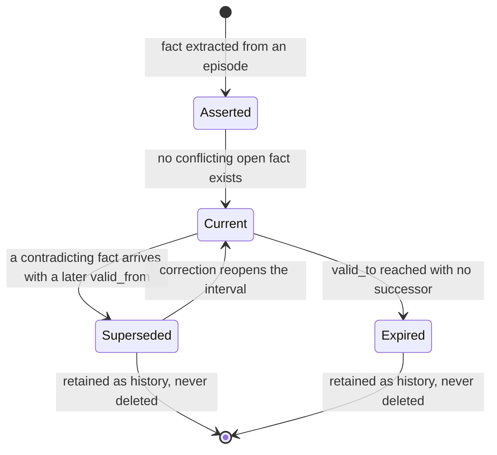
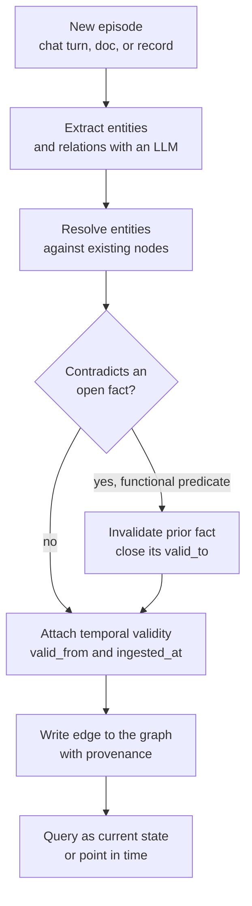
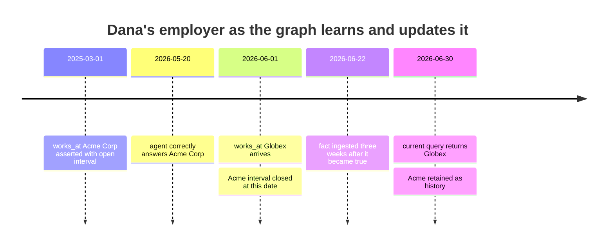

# Graph Memory: Giving Agents a Temporal Knowledge Graph

## The Assistant That Kept Remembering a Fact That Stopped Being True

A personal assistant agent at a wealth-management firm had one job that its users loved: it remembered things. You told it once that you preferred morning meetings, that your spouse handled the household budget, that you worked at a company called Acme, and it never made you say it twice. It stored every interaction as embeddings in a vector store and pulled the most similar past snippets into context on each new turn. For six months it felt like magic.

Then one of its users changed jobs. She mentioned the new employer in passing during a call — "now that I'm at Globex, my equity vesting schedule is different" — and the agent nodded along in that turn. But the next morning, and the morning after that, and for weeks, it kept greeting her with references to Acme. It congratulated her on an Acme earnings report. It pre-filled a form with the Acme address. The old fact would not die, because the vector store had no concept of a fact *dying*. It had a hundred embedded snippets that said "Acme" and one that said "Globex," and cosine similarity has no opinion about which one is *current*. It only knows which one is *similar*. Ask "where does she work?" and both light up. The retriever, faithfully, returned the wrong one about as often as the right one.

This is not a bug you fix with a better embedding model or a higher `top_k`. It is a category error. The team had built the agent a photographic memory of everything it had ever heard and no ability to know that some of what it heard had since become false. **Similarity is not currency, and a pile of similar text is not a model of the world.**

This is the fourth post in *The Graph Layer for Agents*. The series argues that a lot of what agents need is not more model, but more *structure* around the model — and that the natural shape of that structure is a graph. [Part one](https://juanlara18.github.io/portfolio/#/blog/agent-graph-layer-why-grep-embeddings-fell-short) framed why grep and embeddings alone fall short. Parts two and three graphed *code* — building a graph of your codebase and querying it so an agent can navigate a repository the way a senior engineer does. This post makes a hard turn. It is about graphing not the code, but the agent's own **knowledge and memory over time**: the facts it accumulates about users, systems, and the world, and how those facts change, contradict each other, and expire.

It is the companion to [Agent Memory and Retrieval: From Embeddings to Production RAG](https://juanlara18.github.io/portfolio/#/blog/agent-memory-and-retrieval-embeddings-to-rag), which built the vector-and-RAG substrate in full. That post is the foundation; read it first if the words "cosine," "chunking," or "lost in the middle" are fuzzy. This one is about the mechanism that starts where the vector store's honesty runs out: a *temporal knowledge graph* as agent memory, where a fact is not just text you retrieve but a typed relationship with a lifespan.

## The Limit of Vector Memory

Let's be precise about what a vector memory *is*, because its failure follows directly from its design.

Long-term memory built on embeddings is, mechanically, retrieval over an ever-growing pile of past interactions. Each conversation snippet gets embedded and stored. On a new turn, you embed the current situation, find the nearest neighbors in that pile, and paste them into context. It is RAG pointed inward — instead of retrieving from a document corpus, you retrieve from the agent's own history. The [embeddings-to-RAG post](https://juanlara18.github.io/portfolio/#/blog/agent-memory-and-retrieval-embeddings-to-rag) covers this substrate end to end, and for an enormous fraction of applications it is exactly the right tool. If your agent needs to recall "what did the user say they cared about," fuzzy similarity retrieval over embedded history is cheap, simple, and good enough.

It breaks on three specific things, and they are the three things that matter most for an agent that operates over time.

**It cannot represent change.** An embedding of "I work at Acme" and an embedding of "I work at Globex" are two independent points in space. Nothing connects them. Nothing in the vector store says the second *replaces* the first. Both persist, both are retrievable, and the store has no notion that one of them is now false. Storing a new fact does not retract the old one; it just adds a second neighbor. The [geometry of embedding space](https://juanlara18.github.io/portfolio/#/blog/embeddings-geometry-of-meaning) is beautiful at answering "what is near this?" and structurally incapable of answering "what superseded this?"

**It cannot represent contradiction.** Two snippets that flatly disagree — "the API deprecated `/v2/transfers` in version 3" and "use `/v2/transfers` for all transfer operations" — sit near each other precisely *because* they are about the same topic. Semantic similarity, the thing that makes retrieval work, is exactly what makes contradictory facts co-retrieve. The retriever hands the model both and the model picks one, often the wrong one, with total confidence. You cannot prompt your way out of this; the instruction "prefer recent information" operates on text, but recency is not a property of text, it is a property of *when the fact was true*, which the vector store never recorded.

**It cannot represent relationships that compose.** "Dana's manager is Raj" and "Raj approved the vendor" are two snippets. The question "did Dana's manager approve the vendor?" requires *joining* them across a shared entity. Vector similarity has no join. This is the multi-hop problem, and it is the same reason plain RAG needs a graph layer for relational questions — a theme developed in [knowledge graphs in practice](https://juanlara18.github.io/portfolio/#/blog/knowledge-graphs-practice). Memory is not exempt from it. An agent's knowledge of a user is intrinsically relational: people have managers, accounts have owners, systems have versions, and versions have predecessors.

The unifying diagnosis: **a vector store models similarity, not truth, and not time.** It is a superb index over unstructured text and a poor model of an evolving world. When your agent's job is to recall *stated preferences*, that gap is invisible. When its job is to reason about *facts that change* — employment, prices, versions, policy, relationships, status — the gap is the whole ballgame. The stale-fact problem is not an edge case; it is the default behavior of similarity retrieval applied to a changing world.

## Memory vs Context vs RAG: The Taxonomy That Ends the Confusion

Before going further, we need to kill an ambiguity that wrecks design conversations. People say "memory" to mean at least three different things, and they argue past each other because of it. Here is the taxonomy I use.

| Property | Context window | RAG / retrieval | Agent memory |
|---|---|---|---|
| What it is | The tokens in the current prompt | On-demand lookup from an external corpus | The agent's persistent, evolving record of what it knows |
| Lifespan | One inference call | Per query, stateless | Across turns, sessions, and time |
| Source of truth | Whatever you put there this call | An external document store you own | The accumulated interaction and observation history |
| Persistence | None, gone after the call | The corpus persists; the retrieval does not | The whole point is to persist and update |
| Handles change over time | Only what you paste in | Only if the corpus is versioned | This is its core job, if built for it |
| Typical substrate | The model's input buffer | Vector index over documents | Vector store, or a temporal knowledge graph |
| Failure mode | Overflow, lost-in-the-middle | Retrieves similar-but-stale text | Remembers facts that stopped being true |

Read the table as a progression of ambition. **Context** is the model's working memory for exactly one call; when the call ends it is gone. **RAG** extends the model's reach to a corpus it doesn't hold in weights, but each retrieval is stateless — RAG does not remember that it retrieved something yesterday. **Memory** is the thing that persists and, crucially, *changes*: it is where the agent's model of you and your world lives between conversations.

The confusion comes from the fact that memory is often *implemented with* RAG (retrieve over embedded history) and *delivered through* context (paste the retrieved memories into the prompt). So the three collapse into one pipeline in practice, and people conclude they are the same thing. They are not. RAG is a *retrieval mechanism*. Memory is a *stateful abstraction* that may or may not use retrieval underneath. The moment you need memory to model change — not just recall similar text — you have outgrown "memory = vector RAG" and you need something that represents time and supersession explicitly. That something is a temporal knowledge graph.

## Temporal Knowledge Graphs: Modeling a World That Changes

A knowledge graph represents facts as typed edges between entities: `(Dana) -[works_at]-> (Acme)`. That already fixes the relational problem — you can traverse from Dana to her employer to that employer's approvers. What a *temporal* knowledge graph adds is the dimension the vector store threw away: **when**.

### Two Clocks, Not One

The key idea, imported from decades of database research, is that every fact has not one timestamp but two. This is the **bi-temporal model**, and the terminology traces to Richard Snodgrass's work that shaped the SQL:2011 standard.

- **Valid time** is when the fact is true *in the world*. Dana worked at Acme from March 2025 until June 2026. That interval is a property of reality, independent of when anyone recorded it.
- **Transaction time** (also called ingestion or system time) is when the fact was *recorded in your system*. You might not have learned Dana changed jobs until she mentioned it three weeks later. The valid-time change happened on June 1; the transaction-time record happened on June 22.

Keeping both is what lets an agent answer two genuinely different questions that a single timestamp conflates:

1. "Where did Dana work in September 2025?" — a *valid-time* query about the world. Answer: Acme.
2. "What did we *believe* about Dana's employer as of June 15, 2026?" — a *transaction-time* query about our own knowledge. Answer: still Acme, because we hadn't learned about Globex yet.

That second question is not academic. It is exactly what you need when you audit an agent's decision. "Why did the agent send this to the Acme address on June 15?" — because on June 15, given everything it had been told, Acme *was* the current fact. The agent was not wrong; it was operating on the knowledge it had. Bi-temporality is what turns "the agent hallucinated" into "the agent acted correctly on stale input, and here is exactly when the input updated." Martin Fowler's essay on bitemporal history is the canonical gentle introduction if you want the database-side depth.

### Invalidation, Not Deletion

Here is the design decision that separates a temporal knowledge graph from a mutable key-value store, and it is the heart of the whole approach.

When Dana changes jobs, you do **not** overwrite `works_at = Acme` with `works_at = Globex`. You do **not** delete the Acme edge. Instead you *close* the Acme edge's valid interval — set its `valid_to` to June 1, 2026 — and add a new Globex edge with `valid_from` June 1, 2026 and an open-ended `valid_to`. The Acme fact is now *invalidated*: no longer current, but still present, still queryable, still part of the history.

Deletion destroys the ability to answer question two above. Invalidation preserves it. This is the same instinct as an accounting ledger, which never erases a transaction but posts a compensating one, or a git history, which never rewrites the past but appends. The past is data. An agent that reasons about a user over years needs the past intact, both to audit its own behavior and to notice patterns ("this user changes jobs every eighteen months") that a store holding only the present cannot see.



The lifecycle above is what every fact in the graph moves through. Note two things. First, `Superseded` and `Expired` are *terminal for currency* but not for existence — the edge lives on with a closed interval. Second, there is a path back from `Superseded` to `Current`: sometimes you learn that a supersession was itself wrong (the "new employer" was a rumor), and because you invalidated rather than deleted, you can reopen the old interval instead of reconstructing a fact you threw away.

## Graphiti: Real-Time Temporal Graphs Built for Agents

The clearest production embodiment of these ideas is [Graphiti](https://github.com/getzep/graphiti), an open-source framework from the team behind Zep. It bills itself as building real-time knowledge graphs for AI agents, and the "real-time" part is the load-bearing word: unlike batch graph-construction pipelines, Graphiti incrementally updates the graph as new information arrives, without recomputing the whole thing.

The mechanics map directly onto everything above. Graphiti ingests raw data as **episodes** — a chat message, a document, a structured record — treated as the ground-truth stream from which everything else derives. From each episode it uses an LLM to extract entities and relationships, then writes them into a graph with an explicit **bi-temporal model**: it tracks both when an event occurred (valid time) and when it was ingested (transaction time), and every relationship edge carries explicit validity intervals. When new information contradicts an existing edge, Graphiti *invalidates* the old edge by closing its interval rather than deleting it, preserving the full temporal history — exactly the invalidation-not-deletion discipline from the previous section, implemented for you.

Retrieval is deliberately not pure vector search. Graphiti combines three mechanisms — **semantic embeddings, BM25 keyword search, and graph traversal** — into a hybrid query, so a lookup can be both fuzzy (semantically similar) and structural (following typed edges) and lexical (exact terms) at once. The design goal it states is low-latency, high-precision retrieval that does not lean on an LLM to summarize the graph at query time, which keeps the hot path fast. It runs on graph backends including Neo4j, FalkorDB, and Amazon Neptune.

For this series, the most relevant piece is that Graphiti ships an **MCP server**. Through the [Model Context Protocol](https://juanlara18.github.io/portfolio/#/blog/model-context-protocol), a client like Claude or Cursor can use Graphiti's memory as a set of tools: add an episode, retrieve entities, run a hybrid search over the temporal graph. This is the pattern the whole *Graph Layer* series keeps returning to — the graph is not welded into the model, it is exposed as a tool the agent calls. The agent doesn't need to know Graphiti exists; it calls a `search_memory` tool and gets back facts that are already time-resolved to the current state, with the superseded ones filtered out unless it asks for history. The temporal reasoning lives in the memory layer, not in the prompt.

The academic backbone is worth knowing: the [Zep paper](https://arxiv.org/abs/2501.13956) (Rasmussen et al., 2025) describes this architecture and reports gains over a MemGPT baseline on the Deep Memory Retrieval benchmark and on LongMemEval, particularly on cross-session synthesis — the tasks where "remember and update across time" is the whole point. Treat the numbers as evidence that the approach is sound on memory-heavy tasks, not as a promise about your workload.

## Cognee and the Ecosystem

Graphiti is one point in a fast-moving landscape. The other end of the design space is [Cognee](https://github.com/topoteretes/cognee), an open-source AI memory platform that leans harder on *structured extraction and ontology*. Where Graphiti's center of gravity is temporal edges, Cognee's is turning messy input into a validated, typed knowledge graph.

Cognee organizes its work as a pipeline it calls **ECL — Extract, Cognify, Load**. Extract pulls content from source data; Cognify is the step that classifies documents, chunks text, and uses an LLM to extract entities and relationships into a graph; Load writes the result into the backing stores. It combines *vector embeddings and a graph* rather than choosing one, so a fact is both semantically searchable and structurally connected. The distinctive piece is **ontology-based validation**: Cognee can align extracted entities to an ontology (with RDF/OWL support) and deduplicate them, which matters enormously in domains like finance, medicine, and law where the same entity shows up under five or ten different surface names and must be resolved to one canonical node. That entity-resolution step — deciding that "Acme," "Acme Corp," and "Acme Corporation" are one node, not three — is the unglamorous work that determines whether a knowledge-graph memory is coherent or a pile of near-duplicate nodes.

Around these two sit a cluster of frameworks, and it is worth being clear about how they differ rather than lumping them together as "agent memory."

| Tool | Center of gravity | Temporal model | Shape | Best when |
|---|---|---|---|---|
| **Graphiti / Zep** | Real-time temporal knowledge graph | Explicit bi-temporal, edge-level validity | Library plus managed platform | Facts change over time and history must be auditable |
| **Cognee** | Extraction plus ontology into vector and graph | Evolving graph, ontology-driven resolution | Open-source pipeline | You need typed, deduplicated entities from messy sources |
| **Mem0** | A memory layer you bolt onto an existing agent | Fact-level add and update, lighter temporal | Memory service with a clean API | You want to add persistent memory fast, minimal lock-in |
| **Letta (MemGPT)** | An agent runtime with memory as a first-class OS concept | Self-editing memory tiers | Full agent framework | You are building agent-native apps and want integrated memory |

A few honest notes so you don't overclaim from this table. **Mem0** is positioned as the low-friction option: a memory layer with a clean API boundary that you attach to whatever agent framework you already use, which makes it the pragmatic default when "remember the user" is a feature you want to ship this week rather than an architecture you want to own. Its lock-in is minimal precisely because it does one thing. **Letta**, the descendant of the MemGPT research, is the opposite bet: memory is baked into an agent *runtime* inspired by operating-system memory management, with in-context and out-of-context tiers the agent edits via tool calls. That is powerful and also architectural lock-in — your agent lives inside Letta. **Zep** is the managed, enterprise-scale product built on Graphiti. None of these is strictly better; they occupy different points on the trade-off between "drop-in memory service" and "own the whole memory-and-runtime stack," and between "recall similar text" and "model an evolving world." Match the tool to which of those problems you actually have.

## Build the Mental Model: A Tiny Temporal-Fact Graph

The fastest way to internalize invalidation-not-deletion is to build the smallest thing that does it. What follows is a compact but production-shaped temporal-fact store on top of `networkx`. It is not a replacement for Graphiti — it has no LLM extraction, no embeddings, no persistence — but it makes the *mechanism* concrete: bi-temporal validity, contradiction handling, a current-state query, and a point-in-time query. If you understand this, you understand what the frameworks are doing underneath.

```python
from __future__ import annotations

from dataclasses import dataclass, field, replace
from datetime import date, datetime, timezone

import networkx as nx

# A fact with no known expiry is "valid until further notice."
# Using a real sentinel date keeps every interval comparison uniform.
FOREVER = date(9999, 12, 31)


@dataclass(frozen=True)
class Fact:
    """One typed, time-bounded assertion: subject --predicate--> object.

    Two clocks, per the bi-temporal model:
      - valid_from / valid_to : when the fact is true IN THE WORLD (valid time)
      - ingested_at           : when WE recorded it (transaction time)
    """
    subject: str
    predicate: str
    obj: str
    valid_from: date
    valid_to: date = FOREVER
    ingested_at: datetime = field(
        default_factory=lambda: datetime.now(timezone.utc)
    )
    source: str = ""  # provenance: which episode produced this fact

    def is_valid_on(self, when: date) -> bool:
        """True if this fact holds in the world on `when` (half-open interval)."""
        return self.valid_from <= when < self.valid_to

    def is_open(self) -> bool:
        """True if the fact has no recorded end, i.e. currently in force."""
        return self.valid_to == FOREVER


# Predicates that can hold exactly ONE value at a time. A new value here
# contradicts and supersedes the old one. Multi-valued predicates (e.g.
# "knows", "tagged_with") are NOT in this set and simply accumulate.
FUNCTIONAL_PREDICATES = {"works_at", "lives_in", "current_version", "status"}
```

The `Fact` is frozen — facts are immutable events, and "changing" one means appending a corrected copy, never mutating in place. The bi-temporal split is right there in the fields. Now the store:

```python
class TemporalFactGraph:
    """A bi-temporal knowledge-graph memory.

    Facts are edges in a networkx MultiDiGraph. The authoritative list of
    facts lives in `self.facts`; each graph edge carries the integer id of
    its fact so traversal and temporal state stay in sync. Contradictions on
    functional predicates INVALIDATE the prior fact (close its interval)
    rather than deleting it, so history is always recoverable.
    """

    def __init__(self, aliases: dict[str, str] | None = None) -> None:
        self.g = nx.MultiDiGraph()
        self.facts: list[Fact] = []
        # Minimal entity resolution: surface form (lowercased) -> canonical id.
        # Real systems do this with embeddings + an ontology; this is the shape.
        self.aliases = {k.lower(): v for k, v in (aliases or {}).items()}

    def _resolve(self, name: str) -> str:
        """Map a surface name to its canonical entity id."""
        return self.aliases.get(name.strip().lower(), name.strip())

    def _open_fids(self, subject: str, predicate: str) -> list[int]:
        """Ids of currently-in-force facts for this subject and predicate."""
        return [
            i for i, f in enumerate(self.facts)
            if f.subject == subject and f.predicate == predicate and f.is_open()
        ]

    def _invalidate(self, fid: int, at: date) -> None:
        """Close a fact's validity interval. This is the whole trick:
        we never delete, we bound. The edge and its history remain."""
        self.facts[fid] = replace(self.facts[fid], valid_to=at)

    def add(self, fact: Fact) -> Fact:
        """Ingest a fact: resolve entities, handle contradiction, store."""
        fact = replace(
            fact,
            subject=self._resolve(fact.subject),
            obj=self._resolve(fact.obj),
        )

        # Contradiction handling. For a single-valued predicate, any open
        # fact with a DIFFERENT object is now stale: close it at the moment
        # the new fact becomes valid. Same object -> no contradiction, skip.
        if fact.predicate in FUNCTIONAL_PREDICATES:
            for fid in self._open_fids(fact.subject, fact.predicate):
                prior = self.facts[fid]
                if prior.obj != fact.obj and prior.valid_from <= fact.valid_from:
                    self._invalidate(fid, at=fact.valid_from)

        fid = len(self.facts)
        self.facts.append(fact)
        self.g.add_edge(
            fact.subject, fact.obj, key=fid, predicate=fact.predicate, fid=fid
        )
        return fact

    def current(
        self,
        subject: str | None = None,
        predicate: str | None = None,
        today: date | None = None,
    ) -> list[Fact]:
        """Facts true in the world right now. This is what the agent reads."""
        today = today or date.today()
        subject = self._resolve(subject) if subject else None
        return [
            f for f in self.facts
            if f.is_valid_on(today)
            and (subject is None or f.subject == subject)
            and (predicate is None or f.predicate == predicate)
        ]

    def as_of(self, when: date, subject: str | None = None) -> list[Fact]:
        """Point-in-time query: what was true in the world on `when`.
        This is the question a pure vector store cannot answer at all."""
        subject = self._resolve(subject) if subject else None
        return [
            f for f in self.facts
            if f.is_valid_on(when)
            and (subject is None or f.subject == subject)
        ]

    def history(self, subject: str, predicate: str) -> list[Fact]:
        """The full timeline for one relationship, superseded facts included."""
        subject = self._resolve(subject)
        return sorted(
            (f for f in self.facts
             if f.subject == subject and f.predicate == predicate),
            key=lambda f: f.valid_from,
        )
```

Now watch the stale-fact problem *not happen*. Dana changes jobs; the API deprecates an endpoint. Both are functional-predicate contradictions, and both supersede cleanly while keeping history:

```python
kg = TemporalFactGraph(
    aliases={
        "acme": "Acme Corp",
        "acme corporation": "Acme Corp",
        "globex": "Globex Inc",
    }
)

# --- Dana's employment over time ---
kg.add(Fact("Dana", "works_at", "Acme", date(2025, 3, 1), source="ep-14"))
# ...months pass, the agent correctly says "Acme"...
# Then Dana mentions the change. valid_from is when it became true in the world,
# even though ingested_at (now) is three weeks later.
kg.add(Fact("Dana", "works_at", "Globex", date(2026, 6, 1), source="ep-88"))

# --- An API's current version over time ---
kg.add(Fact("transfers-api", "current_version", "v2", date(2025, 1, 1)))
kg.add(Fact("transfers-api", "current_version", "v3", date(2026, 3, 15)))

# What the agent reads TODAY (assume today is 2026-06-30):
today = date(2026, 6, 30)
print("Current employer:",
      [f.obj for f in kg.current("Dana", "works_at", today=today)])
# -> ['Globex Inc']   (Acme was invalidated, not deleted)

print("Current API version:",
      [f.obj for f in kg.current("transfers-api", "current_version", today=today)])
# -> ['v3']

# The audit question a vector store cannot answer:
print("Employer as of 2025-09-01:",
      [f.obj for f in kg.as_of(date(2025, 9, 1), "Dana")])
# -> ['Acme Corp']   (history is intact and queryable)

# The full timeline, supersessions included:
for f in kg.history("Dana", "works_at"):
    end = "present" if f.is_open() else f.valid_to.isoformat()
    print(f"  {f.obj}: {f.valid_from} to {end}  (from {f.source})")
# -> Acme Corp: 2025-03-01 to 2026-06-01  (from ep-14)
# -> Globex Inc: 2026-06-01 to present     (from ep-88)
```

Three properties fell out of the design, and they are exactly the three things the vector store could not do. **Change** is represented: `works_at` moved from Acme to Globex with a hard boundary. **Contradiction** is resolved: `current` returns one employer, not both, because the contradicting fact closed the old interval. **History** is preserved: `as_of` and `history` reconstruct the past, because invalidation kept it. The alias map, crude as it is, stands in for the entity-resolution step that Cognee does with ontologies — without it, "Acme" and "Acme Corp" would be two unrelated nodes and the supersession would never fire.

The ingest path — resolve, detect contradiction, invalidate, attach validity, store — is the same shape every temporal-memory framework implements, just with an LLM doing extraction and a real graph database underneath.



The pipeline reads left to nothing controversial: everything before the diamond is turning unstructured input into candidate facts, and everything after it is the temporal bookkeeping that a vector store skips. The contradiction check is the fork in the road. Skip it and you have a vector store with extra steps. Include it and you have memory that tracks truth.

And the reason the whole thing is worth the trouble is captured in one timeline — the story from the opening, now with the graph doing its job:



The gap between June 1 (valid time) and June 22 (transaction time) is the bi-temporal model earning its keep. A single-clock system would either backdate the knowledge it didn't have or lose the real-world date. Two clocks record both truths.

## When Graph Memory Earns Its Cost

Now the senior-engineer part, which is mostly a warning: **most applications do not need any of this, and reaching for it first is a classic over-engineering trap.**

A temporal knowledge graph is not free. You pay an LLM call per episode to extract entities and relations, which is a real cost multiplier on ingestion. You take on entity resolution, which is genuinely hard — get it wrong and your graph fragments into near-duplicate nodes that break every traversal. You run and operate a graph database. You debug extraction failures, where the LLM invents a relation that was never stated, and resolution failures, where it merges two people who share a name. You accept that the whole apparatus has more moving parts, more latency on the write path, and more ways to be subtly wrong than a vector store has. Against all that, a vector store is a single well-understood component that a large team already knows how to run.

So start with the vector store. The [embeddings-to-RAG memory post](https://juanlara18.github.io/portfolio/#/blog/agent-memory-and-retrieval-embeddings-to-rag) is the right default, and for most agents it is also the final answer. Reach for a temporal knowledge graph only when you can check specific boxes:

- **Facts genuinely change, and stale facts cause real harm.** Employment, prices, versions, account status, policy, org structure. If your agent recalls mostly *stable* preferences ("prefers concise answers"), similarity retrieval is fine — those facts don't expire.
- **You must answer point-in-time or audit questions.** "What did the agent know when it made this decision?" If regulators, incident reviews, or reconciliation ever ask this, bi-temporality is not a luxury, it is a requirement, and bolting it on later means reconstructing history you never stored.
- **The questions are relational and multi-hop.** "Did anyone in Dana's reporting chain approve a vendor she also uses?" No `top_k` answers that; a traversal does.
- **Contradiction resolution is part of correctness, not a nicety.** When the cost of confidently stating a superseded fact is a compliance breach or a bad financial decision, "the retriever returned both and the model guessed" is not an acceptable failure mode.

If you check none of these, a temporal knowledge graph is architecture cosplay — impressive on a diagram, a liability in an on-call rotation. If you check two or more, it stops being optional, and the question shifts from *whether* to *build versus buy*: Graphiti or Cognee or Zep will almost always beat a hand-rolled graph, because entity resolution and incremental temporal updates are exactly the parts that are deceptively hard to get right, and exactly the parts those frameworks have already solved.

There is also a middle path that too few teams consider: **vector memory for recall, graph memory for the facts that change.** Store the fuzzy, stable, "what does this user care about" material as embeddings, and reserve the temporal graph for the small set of high-stakes, evolving, relational facts. Most of an agent's memory is genuinely well-served by similarity search. The graph is for the handful of facts where being wrong about *time* is expensive. Hybrid is usually the mature answer, and it keeps the graph small enough to resolve entities reliably.

## What Part Five Covers

This post gave the agent a memory that models an evolving world. The final post in *The Graph Layer for Agents* takes everything from the series — code graphs, graph queries, and this temporal memory — into **production**: how these graphs are served at low latency, kept fresh as code and knowledge change, evaluated so you know the memory is actually helping, and operated without the silent recall decay and entity drift that turn a clever graph into an on-call nightmare. The mechanisms here are the easy part. Running them so an agent stays *reliably* smart over months is the hard part, and it is where part five lives.

## Going Deeper

**Books:**

- Snodgrass, R. T. (2000). *Developing Time-Oriented Database Applications in SQL.* Morgan Kaufmann.
  - The foundational treatment of valid time versus transaction time by the researcher who shaped the field. Everything modern temporal-graph memory does with validity intervals descends from this.
- Kleppmann, M. (2017). *Designing Data-Intensive Applications.* O'Reilly.
  - Not about agents, but the definitive account of why append-only, event-sourced designs beat destructive updates, which is precisely the invalidation-not-deletion argument at the core of this post.
- Robinson, I., Webber, J., & Eifrem, E. (2015). *Graph Databases* (2nd ed.). O'Reilly.
  - Grounds the graph-modeling side: nodes, typed relationships, and traversal patterns that make a knowledge graph queryable rather than just storable.

**Online Resources:**

- [Graphiti (getzep/graphiti) on GitHub](https://github.com/getzep/graphiti) — the open-source temporal knowledge graph framework, including the bi-temporal model and the MCP server for Claude and Cursor.
- [Cognee (topoteretes/cognee) on GitHub](https://github.com/topoteretes/cognee) — the open-source AI memory platform with the ECL pipeline and ontology-based entity resolution.
- [Bitemporal History](https://martinfowler.com/articles/bitemporal-history.html) by Martin Fowler — the clearest short explanation of why two clocks beat one, from the database perspective.
- [Graphiti: Knowledge Graph Memory for an Agentic World](https://neo4j.com/blog/developer/graphiti-knowledge-graph-memory/) on the Neo4j developer blog — a walkthrough of how episodes become temporal edges.

**Videos:**

- [Zep: A Temporal Knowledge Graph Architecture for Agent Memory](https://www.youtube.com/watch?v=NBZGieN8S6E) by Preston Rasmussen (Zep) — a talk on the architecture behind Graphiti and the bi-temporal design.
- [Stateful Agents: Full Workshop with Charles Packer of Letta and MemGPT](https://www.youtube.com/watch?v=E0k9Ppq6yXY) — the runtime-centric view of agent memory, a useful contrast to the graph-centric one.

**Academic Papers:**

- Rasmussen, P., Paliychuk, P., Beauvais, T., Ryan, J., & Chalef, D. (2025). ["Zep: A Temporal Knowledge Graph Architecture for Agent Memory."](https://arxiv.org/abs/2501.13956) *arXiv:2501.13956.*
  - The paper behind Graphiti. Read the benchmark sections to see where temporal memory beats a flat baseline and, just as importantly, where the gains concentrate: cross-session synthesis.
- Packer, C., Wooders, S., Lin, K., Fang, V., Patil, S. G., Wu, I., & Gonzalez, J. E. (2023). ["MemGPT: Towards LLMs as Operating Systems."](https://arxiv.org/abs/2310.08560) *arXiv:2310.08560.*
  - The OS-inspired, self-editing memory design that became Letta. The counterpoint to the graph approach: manage memory in tiers the agent edits, rather than in an external temporal graph.

**Questions to Explore:**

- If invalidation preserves every superseded fact forever, when does a memory graph become a privacy liability — and how do you reconcile "keep all history for audit" with a user's right to be forgotten?
- Entity resolution is the make-or-break step. Where is the boundary between merging too aggressively (collapsing two real people) and too timidly (fragmenting one entity into duplicates), and can that boundary be learned rather than hand-tuned?
- The LLM that extracts facts can invent relationships that were never stated. How do you evaluate the *fidelity* of a memory graph, not just the *recall* of its queries?
- Most agent memory is well-served by a vector store. As models get better at reasoning over long contexts, does the case for an explicit temporal graph shrink, or does the audit requirement keep it permanently necessary?
- If an agent's model of you is a graph that changes over time, who owns that graph, who can inspect it, and what does it mean to be able to read the story an agent has quietly written about your life?
