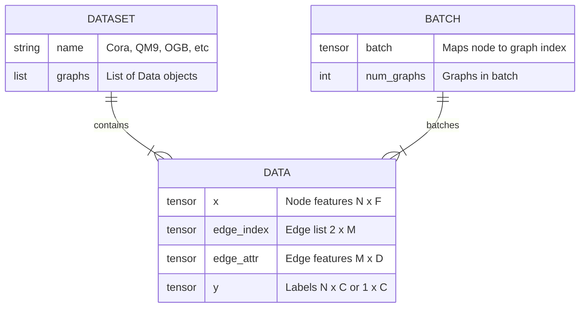
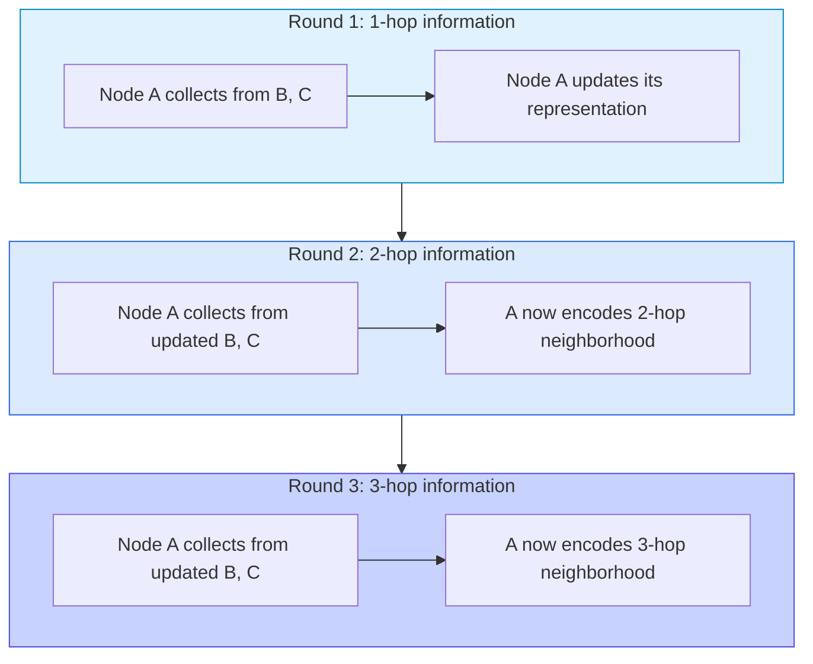
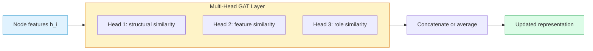
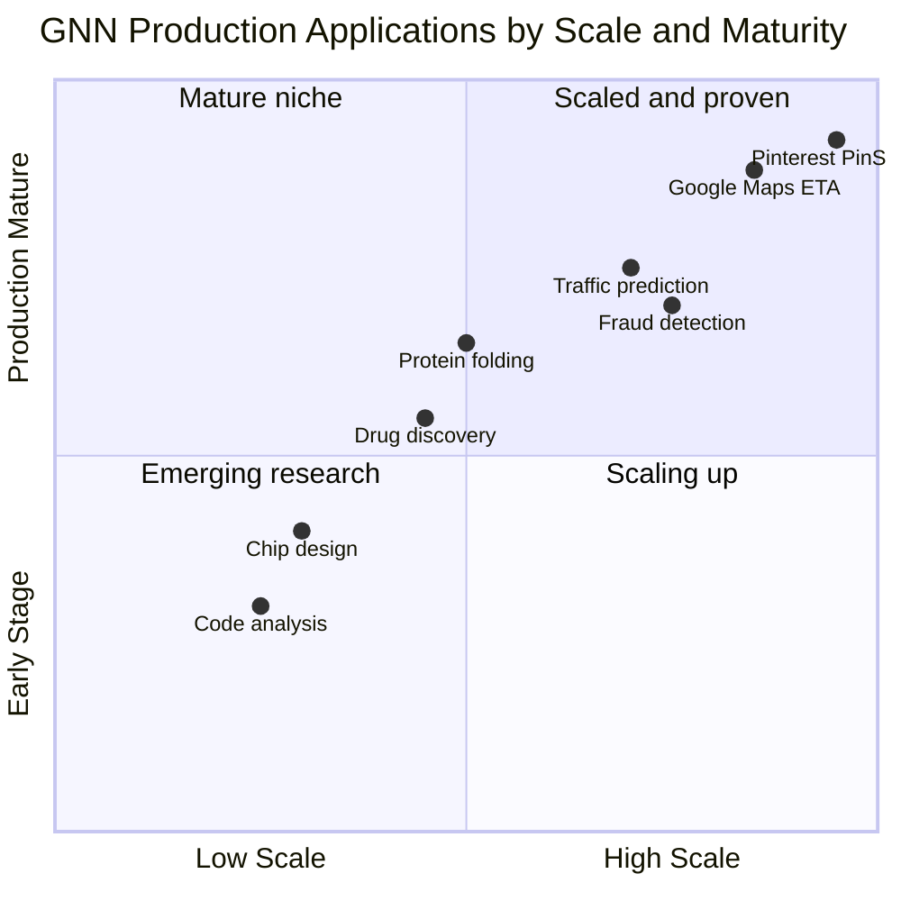

# Graph Neural Networks: Learning on Structured Data

A molecule is not a row in a spreadsheet. Neither is a social network, a road map, a financial transaction chain, or the dependency tree of a software project. These things have *structure* — atoms bonded to atoms, people connected to people, intersections linked by roads — and that structure carries information that vanishes the moment you flatten it into a feature vector and feed it to XGBoost.

For years, the workaround was manual feature engineering: compute the degree of each node, extract triangle counts, hand-craft centrality measures, then pass those scalars to a traditional model. It worked, sort of, the way transcribing a symphony into a table of note frequencies sort of preserves the music. You get the parts but lose the arrangement.

Graph Neural Networks changed this. They learn directly on graph-structured data, propagating information along edges, aggregating neighborhood signals, and producing representations that respect the topology of the input. Since Kipf and Welling's foundational GCN paper in 2017, the field has exploded: Graph Attention Networks, GraphSAGE, message passing neural networks, graph transformers, and dozens of variants. More importantly, GNNs have shipped. Pinterest uses them to recommend pins to 450 million users. Google Maps uses them to predict your ETA. Financial institutions use them to catch fraud rings that rule-based systems miss entirely.

This post is the practitioner's guide to GNNs. We will start from why graphs need special treatment, build the message passing intuition that unifies all GNN variants, walk through the three architectures that matter most (GCN, GAT, GraphSAGE), and end with production code in PyTorch Geometric. If you have read the [knowledge graphs post](/blog/knowledge-graphs-practice) on this blog, you already know how to build and query graph structures with Neo4j and GraphRAG. This post answers the next question: how do you *learn* from them?

## Why Graphs?

Consider three datasets:

**A social network.** 10 million users, each with profile features (age, location, interests). The edges — friendships, follows, interactions — encode who influences whom. Predicting whether a user will churn depends less on their own features and more on whether their close friends have already left.

**A molecule.** Caffeine has 24 atoms connected by 25 bonds. Each atom has properties (element type, charge, hybridization). Whether caffeine binds to a particular receptor depends on the 3D arrangement of those atoms — the graph structure *is* the data.

**A transaction network.** Millions of accounts sending money to each other. A single fraudulent transaction looks normal in isolation. But zoom out and you see the pattern: account A sends to B, B sends to C, C sends back to A, all within 30 minutes, all in amounts just below the reporting threshold. The fraud lives in the graph, not in any single row.

In all three cases, the relational structure between entities carries as much signal as the entities themselves. Traditional ML models cannot consume this structure natively. You can engineer features from it — degree, clustering coefficient, PageRank — but you are deciding in advance what structural patterns matter. GNNs learn those patterns from data.

### Why not just use an adjacency matrix as input to an MLP?

Tempting, but it fails for three reasons:

1. **Scale.** A graph with 10 million nodes produces a $10^7 \times 10^7$ adjacency matrix. That is 100 trillion entries. It does not fit in memory.
2. **Permutation variance.** Reorder the rows and columns (which is just relabeling nodes) and the matrix looks completely different. An MLP would treat it as different input, but it represents the same graph.
3. **Sparsity.** Real-world graphs are sparse — most entries are zero. Dense matrix operations waste computation on non-edges.

GNNs solve all three: they operate locally (no full adjacency matrix needed), they are permutation-equivariant by construction, and they process only existing edges.

### The representation learning angle

If you have read the [embeddings post](/blog/embeddings-representation-learning) on this blog, you know that representation learning is about finding vector spaces where similar things are close together. Word2Vec does this for words. Autoencoders do it for images. GNNs do it for nodes in graphs.

Early graph embedding methods — DeepWalk (2014), Node2Vec (2016) — learned node embeddings by running random walks and treating the walk sequences like sentences in Word2Vec. This worked surprisingly well but had a fatal limitation: the embeddings were transductive. Train on graph $G$, and you get embeddings for the nodes in $G$. Add a new node? You need to retrain. Change the graph? Retrain. This is fine for static graphs but useless for Pinterest, where new pins are uploaded every second.

GNNs replaced this with inductive embedding: instead of memorizing a lookup table of embeddings, the model learns a *function* that takes any node's features and neighborhood and produces an embedding. New node? Run the function. Changed graph? Run the function again. No retraining needed (at least for architectures like GraphSAGE that are fully inductive).

## From Graphs to Tensors

Before a neural network can touch a graph, we need to represent it numerically. Here is the standard representation used by every modern GNN framework:

**Node feature matrix** $X \in \mathbb{R}^{N \times F}$, where $N$ is the number of nodes and $F$ is the feature dimension. Row $i$ is the feature vector of node $i$. For a social network, this might be a user embedding. For a molecule, it encodes atom type, charge, and hybridization as a one-hot or learned vector.

**Edge index** $E \in \mathbb{Z}^{2 \times M}$, where $M$ is the number of edges. Each column is a pair $(i, j)$ meaning "there is an edge from node $i$ to node $j$." This is the COO (coordinate) sparse format — far more memory-efficient than a dense adjacency matrix.

**Edge features** (optional) $E_{\text{attr}} \in \mathbb{R}^{M \times D}$, where $D$ is the edge feature dimension. Bond type in a molecule, transaction amount in a financial graph, time delay between interactions.

**Adjacency matrix** $A \in \{0, 1\}^{N \times N}$, where $A_{ij} = 1$ if there is an edge from $i$ to $j$. Useful for math but rarely stored explicitly — the edge index is what frameworks actually use.

In PyTorch Geometric, all of this lives in a single `Data` object:

```python
import torch
from torch_geometric.data import Data

# A small graph: 4 nodes, 4 edges (undirected = 8 directed)
x = torch.tensor([
    [1.0, 0.0],  # Node 0 features
    [0.0, 1.0],  # Node 1 features
    [1.0, 1.0],  # Node 2 features
    [0.0, 0.0],  # Node 3 features
], dtype=torch.float)

# Edges in COO format (source, target)
# Undirected edges stored as two directed edges
edge_index = torch.tensor([
    [0, 1, 1, 2, 2, 3, 3, 0],  # source nodes
    [1, 0, 2, 1, 3, 2, 0, 3],  # target nodes
], dtype=torch.long)

data = Data(x=x, edge_index=edge_index)
print(data)
# Data(x=[4, 2], edge_index=[2, 8])
print(f"Nodes: {data.num_nodes}, Edges: {data.num_edges}")
# Nodes: 4, Edges: 8
```

This representation is the universal interface. Every GNN architecture — GCN, GAT, GraphSAGE, graph transformers — consumes exactly this structure. The architecture only changes what happens *during* message passing.



## The Message Passing Framework

Every GNN architecture you will encounter — GCN, GAT, GraphSAGE, GIN, MPNN, and dozens more — is a specific instantiation of a single framework: **message passing**. Understanding this framework means understanding all GNNs at once.

The idea is simple. Each node starts with its own feature vector. Then, in a series of rounds, every node:

1. **Collects messages** from its neighbors (what did my neighbors just tell me?)
2. **Aggregates** those messages into a single vector (how do I combine all this information?)
3. **Updates** its own representation based on the aggregation and its current state (what should I become, given what I have learned?)

After $K$ rounds of message passing, each node's representation encodes information from its $K$-hop neighborhood. One round: immediate neighbors. Two rounds: neighbors of neighbors. Three rounds: three hops away.

Formally, the $k$-th layer of a message passing neural network computes:

$$m_i^{(k)} = \bigoplus_{j \in \mathcal{N}(i)} \phi\left(h_i^{(k-1)}, h_j^{(k-1)}, e_{ij}\right)$$

$$h_i^{(k)} = \psi\left(h_i^{(k-1)}, m_i^{(k)}\right)$$

Where:
- $h_i^{(k)}$ is the representation of node $i$ at layer $k$ (with $h_i^{(0)} = x_i$, the input features)
- $\mathcal{N}(i)$ is the set of neighbors of node $i$
- $\phi$ is the **message function** (what information to send)
- $\bigoplus$ is the **aggregation operator** (how to combine messages — sum, mean, max)
- $\psi$ is the **update function** (how to produce the new node state)
- $e_{ij}$ are optional edge features between nodes $i$ and $j$

Different GNN architectures are different choices for $\phi$, $\bigoplus$, and $\psi$. That is it. The framework is the same. The functions inside are what vary.



### Why message passing works

Think about it from the molecule perspective. A carbon atom bonded to three hydrogens and one oxygen is in a very different chemical environment than a carbon bonded to two carbons and two hydrogens. After one round of message passing, both carbon nodes have the same *atom type* feature, but different *aggregated neighborhood* features. After two rounds, they encode the broader molecular context. The GNN learns that these distinct neighborhoods predict different properties.

The same logic applies to social networks (a user surrounded by churners is at risk), fraud detection (a clean account receiving from five newly created accounts is suspicious), and any domain where local structure matters.

### For graph-level tasks: readout

When the task is to classify or regress on the *entire graph* (predict molecular toxicity, classify a document graph), we need a single vector for the whole graph. The **readout** function aggregates all node representations:

$$h_G = \text{READOUT}\left(\{h_i^{(K)} \mid i \in G\}\right)$$

Common readout functions: mean pooling, sum pooling, max pooling, or learned hierarchical pooling. Sum pooling preserves graph-size information (larger graphs produce larger vectors); mean pooling normalizes it away. The choice depends on whether graph size is a relevant signal.

## GCN: The Foundational Layer

Graph Convolutional Networks, introduced by Kipf and Welling in their 2017 paper "Semi-Supervised Classification with Graph Convolutional Networks," are the architecture that launched the modern GNN era. The paper has over 25,000 citations and remains the default starting point.

The GCN layer is a specific, elegant instantiation of the message passing framework:

$$h_i^{(k)} = \sigma\left(\sum_{j \in \mathcal{N}(i) \cup \{i\}} \frac{1}{\sqrt{\deg(i)} \cdot \sqrt{\deg(j)}} \cdot W^{(k)} h_j^{(k-1)}\right)$$

Breaking this down:

- **Self-loop inclusion** $(\mathcal{N}(i) \cup \{i\})$: Each node includes its own features in the aggregation. Without this, a node's own identity would be lost after message passing.
- **Symmetric normalization** $\left(\frac{1}{\sqrt{\deg(i)} \cdot \sqrt{\deg(j)}}\right)$: Neighbors are weighted by the inverse square root of their degree product. High-degree nodes contribute less per message (they are "diluted"), preventing them from dominating.
- **Shared weight matrix** $(W^{(k)})$: A learnable linear transformation applied to all neighbor features. This is what the GCN actually learns.
- **Nonlinearity** $(\sigma)$: Typically ReLU. Applied after aggregation.

The spectral motivation behind this normalization comes from graph signal processing — specifically, a first-order approximation of spectral graph convolutions using Chebyshev polynomials. But in practice, you can think of it as a smart averaging: each node becomes the weighted average of its neighborhood, where weights account for node popularity.

### GCN strengths and limitations

| Aspect | Assessment |
|--------|-----------|
| Simplicity | Extremely simple — one matrix multiply per layer |
| Computational cost | Low — linear in the number of edges |
| Expressiveness | Limited — treats all neighbors identically (isotropic) |
| Inductive capability | Weak — relies on fixed graph structure during training |
| Deep stacking | Prone to over-smoothing after 2-3 layers |

The isotropic nature is both GCN's strength (simplicity, efficiency) and its weakness (it cannot learn that some neighbors matter more than others). That limitation motivated the next architecture.

## GAT: Attention on Graphs

If you have read the [attention mechanism post](/blog/attention-mechanism-neural-networks) on this blog, the idea behind Graph Attention Networks will feel familiar. The core insight of GAT, introduced by Velickovic et al. in 2018, is simple: **not all neighbors are equally important, so let the network learn how much to attend to each one**.

Instead of using fixed normalization weights (like GCN's degree-based weighting), GAT computes a *learned attention coefficient* for every edge:

$$\alpha_{ij} = \frac{\exp\left(\text{LeakyReLU}\left(\vec{a}^T [W h_i \| W h_j]\right)\right)}{\sum_{k \in \mathcal{N}(i)} \exp\left(\text{LeakyReLU}\left(\vec{a}^T [W h_i \| W h_k]\right)\right)}$$

Where:
- $W$ is a shared weight matrix (like GCN)
- $\vec{a}$ is a learnable attention vector
- $\|$ denotes concatenation
- The softmax normalizes attention scores across all neighbors of node $i$

The updated node representation is then:

$$h_i^{(k)} = \sigma\left(\sum_{j \in \mathcal{N}(i)} \alpha_{ij} W h_j^{(k-1)}\right)$$

### Multi-head attention

Just like in transformers, GAT uses multiple attention heads to stabilize learning and capture different types of relationships:

$$h_i^{(k)} = \Big\|_{m=1}^{M} \sigma\left(\sum_{j \in \mathcal{N}(i)} \alpha_{ij}^m W^m h_j^{(k-1)}\right)$$

Each head learns a different attention pattern. One head might attend to structural neighbors, another to feature-similar neighbors. The outputs are concatenated (intermediate layers) or averaged (final layer).



### When GAT beats GCN

GAT outperforms GCN when the importance of neighbors varies significantly. In a citation network, a paper citing a seminal work and a paper citing an obscure tangent should not contribute equally to the cited paper's representation. In a social network, a user's close friend and a random follower carry different signals. GAT learns these distinctions; GCN cannot.

The tradeoff is compute: attention scores require pairwise computation across all edges, making GAT roughly 2-3x slower than GCN for the same graph. On dense graphs with high average degree, this gap widens.

| Architecture | Neighbor weighting | Compute cost | Best for |
|-------------|-------------------|-------------|----------|
| GCN | Fixed, degree-based | Low | Homogeneous neighborhoods |
| GAT | Learned attention | Medium | Heterogeneous neighborhoods |

## GraphSAGE: Sampling for Scale

GCN and GAT share a critical limitation: they require the entire graph to be in memory during training. For the Cora citation network (2,708 nodes), that is fine. For Pinterest's pin-board graph (3 billion nodes, 18 billion edges), it is impossible.

GraphSAGE (SAmple and aggreGatE), introduced by Hamilton, Ying, and Leskovec in 2017, solves this with two key innovations:

### 1. Neighborhood sampling

Instead of aggregating *all* neighbors, GraphSAGE samples a fixed-size subset at each layer. A typical configuration samples 25 neighbors in the first layer and 10 in the second. This bounds the computation graph to a manageable size regardless of the full graph's scale.

### 2. Inductive learning

GCN learns a fixed embedding for each node in a specific graph — it cannot generalize to new, unseen nodes. GraphSAGE learns an *aggregation function* that can be applied to any node with features, even one that did not exist during training. This is why Pinterest can embed a newly uploaded pin without retraining the entire model.

The GraphSAGE update rule:

$$h_{\mathcal{N}(i)}^{(k)} = \text{AGGREGATE}_k\left(\{h_j^{(k-1)} : j \in \mathcal{S}(\mathcal{N}(i))\}\right)$$

$$h_i^{(k)} = \sigma\left(W^{(k)} \cdot [h_i^{(k-1)} \| h_{\mathcal{N}(i)}^{(k)}]\right)$$

Where $\mathcal{S}(\mathcal{N}(i))$ is a random sample from the neighborhood. The aggregation function can be mean, LSTM, max-pool, or any permutation-invariant function.

### Mini-batching on graphs

GraphSAGE's sampling enables mini-batch training on graphs — something impossible with vanilla GCN. The process works backward:

1. Pick a batch of target nodes
2. For each target, sample its first-hop neighbors
3. For each first-hop neighbor, sample its second-hop neighbors
4. Perform message passing on this subgraph

This is how PinSage (Pinterest's production GNN) processes a graph with 3 billion nodes: it never loads the full graph. Each mini-batch touches only a small subgraph.

### The PinSage connection

PinSage, Pinterest's production recommender GNN, is essentially GraphSAGE with three engineering refinements:

1. **Importance-based neighbor sampling.** Instead of sampling neighbors uniformly, PinSage runs short random walks from each node and samples neighbors weighted by visit frequency. Nodes visited more often during random walks are more "structurally important" and get sampled preferentially. This is a cheap approximation to attention that works at billion-node scale.

2. **Curriculum training.** PinSage starts training on easy examples (very similar pin pairs) and progressively introduces harder negatives. This stabilizes early training and produces better final embeddings.

3. **Producer-consumer architecture.** CPU workers sample neighborhoods and construct mini-batch computation graphs. GPU workers consume these batches and run the forward/backward pass. This decouples the I/O-bound sampling from the compute-bound training, saturating both CPU and GPU.

The result: PinSage generates dense embeddings for 3 billion pins, which feed into nearest-neighbor retrieval for recommendations, ads, and shopping. A/B tests showed 25-30% engagement improvements — one of the largest single-model lifts in Pinterest's history.

### Comparing the three architectures

| Feature | GCN | GAT | GraphSAGE |
|---------|-----|-----|-----------|
| Aggregation | Weighted mean, degree-based | Weighted sum, attention-based | Flexible: mean, LSTM, pool |
| Scalability | Full graph in memory | Full graph in memory | Mini-batch, sampled |
| Inductive | No: transductive only | Partially: attention transfers | Yes: fully inductive |
| Edge features | No | Possible with edge attention | Possible with concat |
| Typical layers | 2-3 | 2-3 | 2-3 |
| Relative speed | Fast | Medium | Fast per batch |

## Beyond Nodes: Graph-Level Tasks

So far, we have discussed node-level tasks: classify each node, given the graph. But many real-world problems require predictions about entire graphs. Is this molecule toxic? Will this program crash? Is this social network a bot ring?

For graph-level tasks, the pipeline is:

1. Run $K$ rounds of message passing to compute final node representations
2. Apply a **readout** (pooling) function to collapse all node representations into a single graph vector
3. Pass the graph vector through an MLP for classification or regression

### Pooling strategies

**Global mean/sum/max pooling.** The simplest approach: aggregate all node representations with a single operation.

$$h_G = \frac{1}{|V|} \sum_{i \in V} h_i^{(K)}$$

Mean pooling treats all nodes equally. Sum pooling preserves size information (a molecule with 50 atoms gets a larger vector than one with 10 atoms). Max pooling captures the most salient node.

**Hierarchical pooling.** Methods like DiffPool and SAGPool learn to coarsen the graph in stages, clustering nodes into supernodes and pooling iteratively. This preserves hierarchical structure that flat pooling loses.

**Attention-based pooling.** Compute attention weights over all nodes and use them for a weighted sum. Lets the model focus on the nodes that matter most for the graph-level prediction.

### Molecular property prediction example

In drug discovery, each molecule is a graph: atoms are nodes (with features for element type, charge, aromaticity), bonds are edges (with features for bond type, stereochemistry). The task is to predict properties like solubility, toxicity, or binding affinity from the molecular graph.

The QM9 dataset contains 130,000 molecules with 19 quantum-chemical properties. State-of-the-art GNN models achieve mean absolute errors below 1 kcal/mol on energy predictions — chemical accuracy sufficient for screening drug candidates. This is why GNNs have become standard tools in computational chemistry, with companies like Recursion Pharmaceuticals and Relay Therapeutics deploying them in production drug discovery pipelines.

Here is a minimal graph-level classification pipeline using PyG's built-in molecular datasets:

```python
from torch_geometric.datasets import TUDataset
from torch_geometric.loader import DataLoader
from torch_geometric.nn import GCNConv, global_mean_pool
import torch
import torch.nn.functional as F

# MUTAG: 188 molecular graphs, binary classification (mutagenic or not)
dataset = TUDataset(root="/tmp/MUTAG", name="MUTAG")
print(f"Graphs: {len(dataset)}, Classes: {dataset.num_classes}")
print(f"Node features: {dataset.num_node_features}")

# Train/test split
torch.manual_seed(42)
perm = torch.randperm(len(dataset))
train_dataset = dataset[perm[:150]]
test_dataset = dataset[perm[150:]]

train_loader = DataLoader(train_dataset, batch_size=32, shuffle=True)
test_loader = DataLoader(test_dataset, batch_size=32)


class GraphClassifier(torch.nn.Module):
    def __init__(self, in_channels, hidden_channels, out_channels):
        super().__init__()
        self.conv1 = GCNConv(in_channels, hidden_channels)
        self.conv2 = GCNConv(hidden_channels, hidden_channels)
        self.conv3 = GCNConv(hidden_channels, hidden_channels)
        self.lin = torch.nn.Linear(hidden_channels, out_channels)

    def forward(self, x, edge_index, batch):
        # Node-level message passing
        x = F.relu(self.conv1(x, edge_index))
        x = F.relu(self.conv2(x, edge_index))
        x = self.conv3(x, edge_index)
        # Graph-level readout: average all node embeddings per graph
        x = global_mean_pool(x, batch)  # [batch_size, hidden_channels]
        x = F.dropout(x, p=0.5, training=self.training)
        x = self.lin(x)
        return x


model = GraphClassifier(dataset.num_node_features, 64, dataset.num_classes)
optimizer = torch.optim.Adam(model.parameters(), lr=0.01)

# Training loop for graph classification
for epoch in range(1, 201):
    model.train()
    total_loss = 0
    for batch in train_loader:
        optimizer.zero_grad()
        out = model(batch.x, batch.edge_index, batch.batch)
        loss = F.cross_entropy(out, batch.y)
        loss.backward()
        optimizer.step()
        total_loss += loss.item() * batch.num_graphs

    # Evaluate
    if epoch % 50 == 0:
        model.eval()
        correct = 0
        for batch in test_loader:
            pred = model(batch.x, batch.edge_index, batch.batch).argmax(dim=1)
            correct += (pred == batch.y).sum().item()
        acc = correct / len(test_dataset)
        print(f"Epoch {epoch} | Loss: {total_loss/len(train_dataset):.4f} | "
              f"Test Acc: {acc:.4f}")
```

The key difference from node classification: the `batch` vector. When PyG batches multiple graphs into a single large graph, the `batch` tensor tracks which node belongs to which original graph. The `global_mean_pool` function uses this to compute per-graph pooled representations. Without this, you would average across all nodes in the batch as if they were one graph — a common mistake.

## PyTorch Geometric in Practice

Theory is useful. Running code is better. Let us build a full GNN pipeline for node classification on the Cora citation network — the most widely used GNN benchmark.

### The dataset

Cora contains 2,708 scientific publications classified into 7 categories. Each publication is represented by a bag-of-words feature vector (1,433 dimensions). Citation links between papers form the edges (10,556 total). The task: given a small number of labeled papers, classify the rest.

```python
from torch_geometric.datasets import Planetoid
import torch
import torch.nn.functional as F
from torch_geometric.nn import GCNConv, GATConv, SAGEConv

# Load the Cora dataset
dataset = Planetoid(root="/tmp/Cora", name="Cora")
data = dataset[0]  # Cora is a single graph

print(f"Nodes: {data.num_nodes}")            # 2708
print(f"Edges: {data.num_edges}")            # 10556
print(f"Features per node: {data.num_node_features}")  # 1433
print(f"Classes: {dataset.num_classes}")     # 7
print(f"Training nodes: {data.train_mask.sum().item()}")  # 140
print(f"Validation nodes: {data.val_mask.sum().item()}")  # 500
print(f"Test nodes: {data.test_mask.sum().item()}")       # 1000
```

Only 140 labeled nodes for training — about 5% of the graph. This is the semi-supervised setting that makes GNNs powerful: they propagate label information through the graph structure.

### Model: a two-layer GCN

```python
class GCN(torch.nn.Module):
    def __init__(self, in_channels, hidden_channels, out_channels, dropout=0.5):
        super().__init__()
        self.conv1 = GCNConv(in_channels, hidden_channels)
        self.conv2 = GCNConv(hidden_channels, out_channels)
        self.dropout = dropout

    def forward(self, x, edge_index):
        # First message passing layer
        x = self.conv1(x, edge_index)
        x = F.relu(x)
        x = F.dropout(x, p=self.dropout, training=self.training)
        # Second message passing layer
        x = self.conv2(x, edge_index)
        return x  # Raw logits, shape [num_nodes, num_classes]
```

### Training loop

```python
def train_gnn(model, data, epochs=200, lr=0.01, weight_decay=5e-4):
    """Standard GNN training loop for node classification."""
    optimizer = torch.optim.Adam(
        model.parameters(), lr=lr, weight_decay=weight_decay
    )

    best_val_acc = 0
    best_model_state = None

    for epoch in range(1, epochs + 1):
        # Training
        model.train()
        optimizer.zero_grad()
        out = model(data.x, data.edge_index)
        loss = F.cross_entropy(out[data.train_mask], data.y[data.train_mask])
        loss.backward()
        optimizer.step()

        # Validation
        model.eval()
        with torch.no_grad():
            pred = model(data.x, data.edge_index).argmax(dim=1)
            val_acc = (pred[data.val_mask] == data.y[data.val_mask]).float().mean()

            if val_acc > best_val_acc:
                best_val_acc = val_acc
                best_model_state = model.state_dict().copy()

        if epoch % 50 == 0:
            train_acc = (pred[data.train_mask] == data.y[data.train_mask]).float().mean()
            print(f"Epoch {epoch:03d} | Loss: {loss:.4f} | "
                  f"Train: {train_acc:.4f} | Val: {val_acc:.4f}")

    # Restore best model and evaluate on test set
    model.load_state_dict(best_model_state)
    model.eval()
    with torch.no_grad():
        pred = model(data.x, data.edge_index).argmax(dim=1)
        test_acc = (pred[data.test_mask] == data.y[data.test_mask]).float().mean()

    return test_acc.item()
```

### Running all three architectures

```python
class GAT(torch.nn.Module):
    def __init__(self, in_channels, hidden_channels, out_channels,
                 heads=8, dropout=0.6):
        super().__init__()
        self.conv1 = GATConv(in_channels, hidden_channels, heads=heads,
                             dropout=dropout)
        self.conv2 = GATConv(hidden_channels * heads, out_channels, heads=1,
                             concat=False, dropout=dropout)
        self.dropout = dropout

    def forward(self, x, edge_index):
        x = F.dropout(x, p=self.dropout, training=self.training)
        x = self.conv1(x, edge_index)
        x = F.elu(x)
        x = F.dropout(x, p=self.dropout, training=self.training)
        x = self.conv2(x, edge_index)
        return x


class GraphSAGEModel(torch.nn.Module):
    def __init__(self, in_channels, hidden_channels, out_channels, dropout=0.5):
        super().__init__()
        self.conv1 = SAGEConv(in_channels, hidden_channels)
        self.conv2 = SAGEConv(hidden_channels, out_channels)
        self.dropout = dropout

    def forward(self, x, edge_index):
        x = self.conv1(x, edge_index)
        x = F.relu(x)
        x = F.dropout(x, p=self.dropout, training=self.training)
        x = self.conv2(x, edge_index)
        return x


# Compare all three architectures on Cora
results = {}
for name, ModelClass, kwargs in [
    ("GCN", GCN, {"in_channels": 1433, "hidden_channels": 64,
                   "out_channels": 7}),
    ("GAT", GAT, {"in_channels": 1433, "hidden_channels": 8,
                   "out_channels": 7, "heads": 8}),
    ("GraphSAGE", GraphSAGEModel, {"in_channels": 1433, "hidden_channels": 64,
                                    "out_channels": 7}),
]:
    model = ModelClass(**kwargs)
    acc = train_gnn(model, data)
    results[name] = acc
    print(f"{name} Test Accuracy: {acc:.4f}")

# Typical results on Cora:
# GCN:       ~0.815
# GAT:       ~0.830
# GraphSAGE: ~0.810
```

### Prerequisites and gotchas

**Prerequisites.** You need PyTorch 2.0+ and PyTorch Geometric 2.5+. Install with:

```python
# Install PyTorch first (check pytorch.org for your CUDA version)
# Then install PyG
# pip install torch-geometric
# pip install pyg-lib torch-scatter torch-sparse -f https://data.pyg.org/whl/torch-2.0.0+cu118.html
```

**Gotcha: the installation.** PyG's C++ extensions must match your exact PyTorch and CUDA versions. If you get cryptic import errors, the versions are mismatched. Use the wheel selector at `https://data.pyg.org/whl/` to find the right combination.

**Gotcha: undirected edges.** PyG expects undirected graphs to have edges in both directions. If you load a graph and forget to add reverse edges, message passing only flows one way. Use `torch_geometric.utils.to_undirected()`.

**Gotcha: feature scaling.** GCN's normalization assumes well-scaled features. If node features have wildly different magnitudes, apply batch normalization or standardize before the first layer.

**Gotcha: transductive vs. inductive splits.** Cora's standard split is transductive — the test nodes are present in the graph during training, just unlabeled. In an inductive setting (like PPI), test graphs are entirely unseen. Make sure your evaluation matches your deployment scenario.

**Testing.** Always report mean and standard deviation over at least 10 random seeds. GNN training is notoriously sensitive to initialization — a single run can be misleading by 2-3 percentage points. The Open Graph Benchmark (OGB) standardizes this practice.

## Where GNNs Ship in Production

GNNs are not a research curiosity. They power some of the largest-scale ML systems in production today.

### Pinterest: PinSage

Pinterest's PinSage is arguably the most cited example of GNNs in production. Operating on a graph with 3 billion pins and 18 billion edges (pins saved to boards), PinSage generates embeddings for every pin used to power related-pin recommendations, ad targeting, and shopping suggestions.

Key engineering decisions that made it work at scale:
- **Random-walk-based neighbor sampling** (weighted by visit frequency, not uniform)
- **Producer-consumer training architecture** (CPU sampling, GPU training in parallel)
- **Importance pooling** using random walk visit counts as attention proxies
- A/B tests showed **25-30% improvement in user engagement** over prior deep learning methods

### Google Maps: ETA prediction

Google DeepMind partnered with the Google Maps team to deploy a GNN for estimated time of arrival prediction. The road network is naturally a graph (intersections as nodes, road segments as edges). The GNN models spatiotemporal interactions across "supersegments" — sequences of connected road segments with predictable traffic patterns.

Results: **up to 50% reduction in negative ETA outcomes** in cities like Sydney, Berlin, Jakarta, and Tokyo compared to the previous production baseline. The model uses MetaGradients (from reinforcement learning) to stabilize training across the highly uneven distribution of route queries.

### Financial fraud detection

This is where GNNs have perhaps the highest ROI. Traditional fraud detection treats each transaction independently — a random forest scores one transaction at a time. GNNs see the *network*: accounts, transactions, devices, IP addresses, all connected.

NVIDIA's GNN-based fraud detection blueprint, integrated with AWS SageMaker, Cloudera, and Dell platforms, achieves sub-second inference on transaction graphs. Amazon's GraphStorm framework enables real-time GNN inference through SageMaker endpoints. The key advantage: GNNs detect **collusive fraud** (rings of accounts working together) and **synthetic identity fraud** (fabricated identities connected to real ones) that point-wise models cannot see.

U.S. consumers lost $12.5 billion to fraud in 2024 — a 25% year-over-year increase. Financial institutions increasingly adopt GNNs because the fraudsters have learned to evade feature-based models, but they cannot easily disguise the graph structure of their operations.

### Drug discovery

GNNs have become standard tools in computational drug discovery. Molecules are graphs; predicting molecular properties from graph structure is a direct application. Companies like Recursion Pharmaceuticals use GNN-based virtual screening to evaluate millions of candidate molecules before synthesizing any of them, dramatically reducing the cost of the discovery pipeline.

Recent results on the QM9 molecular benchmark show GNNs achieving chemical accuracy (below 1 kcal/mol error) on quantum-chemical property predictions, sufficient for real drug screening applications.



## When NOT to Use GNNs

GNNs are powerful, but they are not universal. Here is when you should reach for something else.

### Tabular data without meaningful graph structure

If your data is genuinely tabular — rows of independent observations with no relational structure — forcing it into a graph (e.g., k-nearest-neighbor graphs on features) rarely outperforms gradient boosted trees. The graph adds complexity without adding signal.

### Small datasets

GNNs have many parameters and need enough data to learn meaningful aggregation patterns. If your graph has 100 nodes and 200 edges, classical graph algorithms (shortest path, centrality measures, community detection) combined with a simple classifier will likely outperform a GNN and be far more interpretable.

### The over-smoothing problem

This is the most fundamental limitation. As you stack GNN layers, node representations become increasingly similar — they converge toward a common vector, losing the distinctive features that make classification possible. By layer 5-6, most GNN architectures produce nearly identical representations for all nodes.

The root cause is mathematical: each message passing round is a smoothing operation (akin to a low-pass filter on the graph signal). Stack enough smoothing operations, and all signals converge. This means:

- **GNNs are inherently shallow.** Most practical GNNs use 2-3 layers. Contrast this with CNNs (50-100 layers) or transformers (24-96 layers).
- **Long-range dependencies are hard.** If two nodes are 10 hops apart, a 2-layer GNN cannot propagate information between them.
- **Over-squashing compounds the problem.** Information from a node's exponentially growing receptive field must be compressed into a fixed-size vector, creating a bottleneck.

Mitigations exist and are worth knowing:

- **Residual connections** (like ResNet): add the input of each layer to its output, preserving original features. Helps in practice but does not fully solve the problem — recent work shows residual GNNs still lose distinguishing information, just more slowly.
- **Jumping Knowledge (JK) Networks**: concatenate or max-pool representations from *all* layers, not just the last one. The model can then select the right "depth" of information per node.
- **DropEdge**: randomly remove edges during training (like dropout for graphs). Slows the smoothing process by reducing the effective connectivity.
- **Graph Transformers**: replace local message passing with global attention, allowing any node to attend to any other node. Models like GPS (General Powerful Scalable) and Graphormer bypass the over-smoothing problem entirely but sacrifice the locality inductive bias that makes GNNs efficient.

The fundamental tension remains: depth gives you range, but smoothing takes away resolution. Most practitioners find that 2-3 layers with JK connections or residual links hit the sweet spot for the majority of tasks.

### When the graph changes too fast

If your graph topology changes every second (real-time social media interactions, high-frequency trading networks), maintaining a GNN in production becomes an engineering challenge. Each topology change requires recomputing neighborhoods and potentially re-running inference. Temporal GNN variants exist but add significant complexity.

### Decision framework

Before building a GNN, ask:

1. **Is there a natural graph?** If you have to construct the graph artificially (e.g., k-NN on tabular features), the answer is probably no.
2. **Does the relational structure carry signal beyond node features?** Run an ablation: train an MLP on node features alone. If it performs comparably to a GNN, the graph structure is not helping.
3. **Is the graph large enough to benefit from learned aggregation?** Below ~1,000 nodes, hand-crafted graph features often suffice.
4. **Can you tolerate the engineering complexity?** GNN training pipelines are more complex than standard deep learning. If a simpler model achieves 95% of the performance, ship the simpler model.

## Going Deeper

**Books:**
- Hamilton, W. L. (2020). *Graph Representation Learning.* Morgan and Claypool.
  - The definitive textbook by the GraphSAGE co-inventor. Covers spectral methods, message passing, and generative models for graphs with mathematical rigor and practical examples.
- Bronstein, M. M., Bruna, J., Cohen, T., and Velickovic, P. (2021). *Geometric Deep Learning: Grids, Groups, Graphs, and Geodesics.* MIT Press.
  - Unifies CNNs, GNNs, and transformers under a single geometric framework. The most intellectually ambitious book in the space.
- Ma, Y. and Tang, J. (2021). *Deep Learning on Graphs.* Cambridge University Press.
  - Practical and comprehensive. Covers both node-level and graph-level tasks with extensive coverage of pooling strategies and real-world applications.

**Online Resources:**
- [PyTorch Geometric Documentation](https://pytorch-geometric.readthedocs.io/) — The primary framework for GNN research and prototyping. Tutorials, API reference, and example implementations for all major architectures.
- [Open Graph Benchmark (OGB)](https://ogb.stanford.edu/) — Standardized, large-scale benchmark datasets with leaderboards. The MNIST of graph ML — if you want to compare architectures fairly, use OGB.
- [Stanford CS224W Course Materials](https://cs224w.stanford.edu/) — Lecture slides, assignments, and project examples from Jure Leskovec's graduate course on machine learning with graphs.
- [Distill.pub: A Gentle Introduction to Graph Neural Networks](https://distill.pub/2021/gnn-intro/) — Interactive visualizations that build intuition for message passing, aggregation, and GNN expressiveness.

**Videos:**
- [Stanford CS224W: Machine Learning with Graphs](https://youtube.com/playlist?list=PLoROMvodv4rPLKxIpqhjhPgdQy7imNkDn) by Jure Leskovec — Full lecture series covering graph representation learning, GNN architectures, and applications. The gold standard for GNN education.
- [Graph Attention Networks (GAT) - GNN Paper Explained](https://www.classcentral.com/course/youtube-graph-attention-networks-gat-gnn-paper-explained-127013) by Aleksa Gordic (The AI Epiphany) — Deep walkthrough of the GAT paper with connections to transformers, multi-head attention mechanics, and implementation details. Endorsed by the paper's first author.

**Academic Papers:**
- Kipf, T. N. and Welling, M. (2017). ["Semi-Supervised Classification with Graph Convolutional Networks."](https://arxiv.org/abs/1609.02907) *ICLR 2017.*
  - The paper that launched modern GNNs. Introduces the spectral-to-spatial simplification that makes graph convolutions practical. Read this first.
- Velickovic, P., Cucurull, G., Casanova, A., Romero, A., Lio, P., and Bengio, Y. (2018). ["Graph Attention Networks."](https://arxiv.org/abs/1710.10903) *ICLR 2018.*
  - Brings attention mechanisms to graphs. The connection to transformers is not accidental — both compute weighted aggregations over sets of vectors.
- Hamilton, W. L., Ying, R., and Leskovec, J. (2017). ["Inductive Representation Learning on Large Graphs."](https://arxiv.org/abs/1706.02216) *NeurIPS 2017.*
  - Introduces GraphSAGE and the sampling-based training paradigm that made billion-scale GNNs possible. The direct ancestor of PinSage.
- Derrow-Pinion, A. et al. (2021). ["ETA Prediction with Graph Neural Networks in Google Maps."](https://arxiv.org/abs/2108.11482) *CIKM 2021.*
  - Rare example of a detailed production GNN deployment paper. Covers the engineering challenges — training stability, MetaGradients, supersegment construction — that academic papers skip.

**Questions to Explore:**
- If message passing is fundamentally a smoothing operation, is there a theoretical ceiling on what GNNs can learn, and does this ceiling bind before or after practical utility is exhausted?
- Graph transformers replace local message passing with global attention. Does this make them "not really GNNs," and does the distinction matter if they work better?
- As knowledge graphs grow to billions of triples (see the [knowledge graphs in practice post](/blog/knowledge-graphs-practice)), can GNNs learn to reason over them the way symbolic systems do — or are neural and symbolic approaches permanently complementary?
- Most GNN benchmarks use static, homogeneous graphs. Real-world graphs are dynamic, heterogeneous, and noisy. How much of the benchmark-to-production gap is a data problem versus a model problem?
- The node embedding space learned by a GNN encodes structural similarity. How does this relate to the embedding spaces from language models (see the [embeddings post](/blog/embeddings-representation-learning)) — and can we meaningfully compose them?
