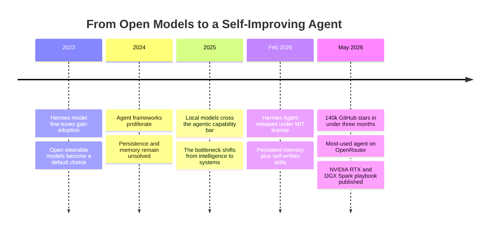
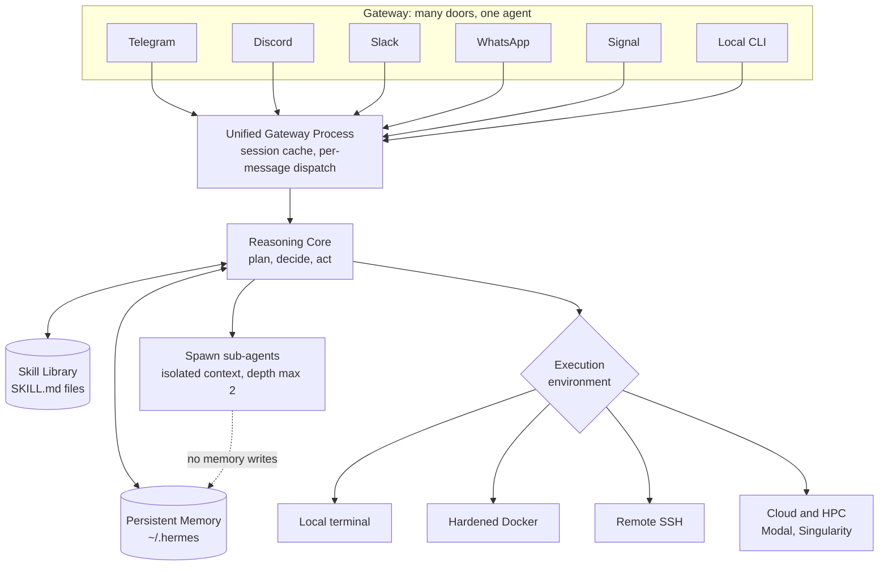
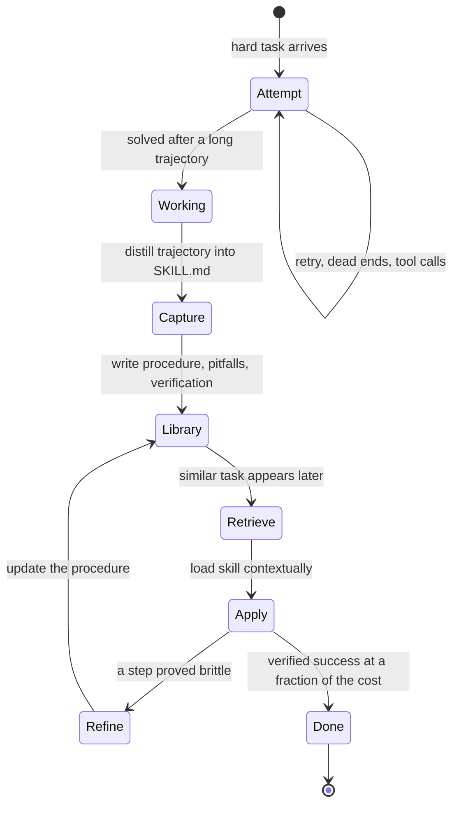
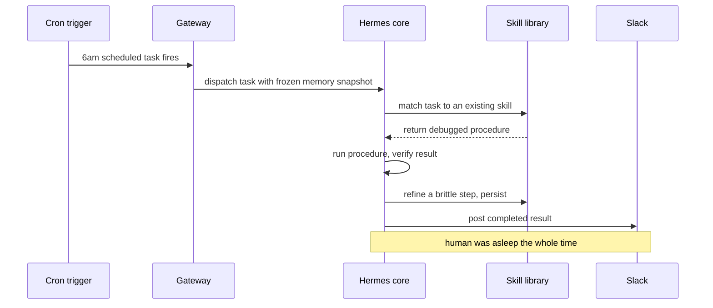

# Hermes: The Self-Improving Agent That Remembers

## An Agent That Is Better Tomorrow Than It Is Today

Almost every agent you have ever used is born amnesiac and dies amnesiac. It wakes into an empty context window, does its work, and when the session closes it forgets your name, your repository layout, the fact that your deploy script needs a VPN, and the painful three-hour detour it took last Tuesday to discover that. Tomorrow it will take the same detour. The agent that solved your problem and the agent you talk to next week are, in every way that matters, different entities wearing the same weights.

Hermes was built to break that pattern. Released in February 2026 by Nous Research, it is an open-source, self-hosted autonomous agent whose entire thesis fits in one sentence: **an agent should get more capable the longer it runs.** Not because its weights change—they do not—but because it accumulates two things that survive the death of a session. It remembers you. And after it solves something hard, it writes down *how*, in a reusable procedure it can load the next time a similar task appears.

That combination struck a nerve. Hermes crossed 140,000 GitHub stars in under three months and, per the NVIDIA RTX AI Garage blog that covered it in May 2026, became the most-used agent globally on OpenRouter. Those are not chatbot numbers. They are the numbers of a tool that people leave running.

This post is an anatomy. We will trace why a lab famous for open *models* decided to ship an *agent*, how the always-on server is actually wired, what lives inside the `~/.hermes/` directory that makes memory real, and the mechanics of the self-improvement loop—which is genuinely clever and also, in a specific and important sense, not what the word "self-improving" makes you think. Then we will run local, look at what people are actually doing with it, and spend real time on the hard questions, because an always-on agent that rewrites its own instructions and holds a durable memory is a fascinating idea and a large attack surface at the same time.

Both things are true. Let us hold both.

## Why a Model Lab Built an Agent

Nous Research earned its reputation on fine-tunes. The Hermes family of open models—instruction-tuned descendants of Llama, Mistral, and Qwen bases—became a default choice for people who wanted a capable, steerable, openly licensed model they could actually run. If your instinct is "a lab like that builds models, not products," you are reasoning correctly about the last decade. So the interesting question is what changed.

The honest framing is that by late 2025 the model was no longer the bottleneck for most agentic work. Open weights had gotten good enough that a 30B-class model running locally could plan, call tools, and write code competently. What people kept hitting instead was a *systems* wall. The agent was smart in the moment and useless across time. Every serious agentic workflow re-solved the same problems from scratch, every session, forever. The gap was not intelligence. The gap was **memory and the compounding of capability**.

That is a peculiar gap for a model lab to notice, and a very natural one. When you spend your days generating training data and running reinforcement-learning experiments, you feel the absence of persistence acutely: your agents produce enormous amounts of hard-won procedural knowledge and then throw all of it away. If you could capture that knowledge as reusable artifacts *and* as trajectories you could later train on, you would close two loops at once—the agent improves its behavior in the field, and you improve the model in the lab. Hermes is what that realization looks like when you ship it.

The positioning is deliberate and, frankly, pointed: **MIT licensed, zero telemetry, zero data collection, no cloud lock-in.** In an era where most capable agents are hosted products that phone home, Hermes is a daemon that lives on your infrastructure and answers to no one. That is a philosophical stance as much as a technical one, and it is inseparable from the memory thesis. An agent you trust to remember everything about you is an agent that had better not be shipping that memory to someone else's server. The privacy posture is not a feature bolted onto the memory design. It is a precondition for it.



## Architecture: The Always-On Server and Its Gateway

The first thing to internalize is that Hermes is not a chatbot and not an IDE copilot. It is a **persistent server process**. You install it, it runs as a systemd service, and it stays up. It is there at 3 a.m. when a cron trigger fires. It is there when a message lands in a Slack channel. The default assumption is not "the human opens a session," it is "the agent is always alive and occasionally the human interacts with it." That inversion drives every other design decision.

Sitting in front of the reasoning core is a **unified gateway**. This is the single most underrated part of the architecture, because it is what turns a clever loop into something you actually live with. The gateway is a long-running process that speaks five messaging platforms natively—Telegram, Discord, Slack, WhatsApp, and Signal—plus a local CLI, and it multiplexes all of them onto the same agent with the same memory. You can start a task from your phone on Signal during a commute, and continue it from a Slack thread at your desk, and the agent does not experience these as two conversations. It is one agent reachable through many doors.

That sounds trivial and is not. Shared channels break naive agents because the agent has no idea who said what. Hermes handles this with sender-preserving group sessions, so a message in a busy Slack channel carries per-message attribution into the agent's context. Without that, a group chat is an undifferentiated stream and the agent cannot reason about who it is even talking to.

Behind the gateway, work runs in one of several **execution environments**, chosen per task:

- **Local terminal** — direct execution on the host, maximum power, maximum trust required.
- **Docker** — security-hardened containers for when you want the agent to run code without handing it the keys to the host.
- **SSH** — the agent operates on a remote server as if it were local.
- **Cloud and HPC backends** — via Modal and Singularity, for bursting heavy jobs onto rented or institutional compute.

And when a task is large enough to decompose, the agent spawns **parallel sub-agents**. Delegation creates a child agent with its own isolated context and its own terminal session, running one branch of the work while the parent continues. Crucially, the children are deliberately declawed: a sub-agent cannot delegate further, cannot write to memory, and cannot execute arbitrary code, and delegation is capped at a maximum depth of two. This is a good instinct. Uncontrolled recursive delegation is how you turn one runaway agent into a fork bomb of runaway agents, and letting a transient child scribble into the durable memory store is how you poison the well. The blast radius is bounded by construction.



The whole thing is designed to be boring in the operational sense. It installs with a single `curl` command, registers as a systemd unit, and comes back up on reboot. Boring is the correct aesthetic for something you intend to leave running for months.

## Persistent Memory: What `~/.hermes/` Actually Holds

Here is where we have to be careful, because "memory" is the most abused word in agent marketing. Most systems that claim memory mean *retrieval*: they embed your past messages into a vector store and pull semantically similar chunks back into the prompt when relevant. That is useful, and Hermes does a version of it, but it is not the whole story and it is not the interesting part.

Open up `~/.hermes/` and you find two distinct things, and the distinction is the whole point.

The first is a pair of **plaintext markdown files** under `~/.hermes/memories/`. There is a `MEMORY.md`—the agent's own working notes, capped at roughly 2,200 characters, about 800 tokens. And there is a `USER.md`—a durable profile of *you*, capped at roughly 1,375 characters, about 500 tokens. These are not conversation logs. They are a compressed, curated model of your preferences, your projects, your environment, and the standing facts the agent has decided are worth carrying into every future session. This is much closer to how a good colleague remembers you than how a search index does. A colleague does not re-read the transcript of every conversation you have ever had; they hold a small, dense summary—"prefers Python, hates Kubernetes, deploy needs the VPN, is in Bogotá"—and act on it.

The size caps look almost comically small until you understand *why* they are small. Every token of recalled context is two things at once: a token of prompt-injection surface, and a token of system prompt that cannot be cached. A bloated memory file is both a security liability and a latency tax on every single turn. By keeping the always-injected profile tiny and dense, Hermes keeps the recurring cost of "remembering you" almost free. This is a genuinely good engineering call, and it is the opposite of the "just stuff everything into a giant context window" reflex.

The implementation details reward attention. Writes to the memory files are guarded by **file locking**—`fcntl` on Unix, `msvcrt` on Windows—because multiple agent processes may be alive at once and you cannot have two of them clobbering the same profile. And there is a **frozen-snapshot** discipline: the memory is read once at the start of a session and frozen for the duration. Mid-session writes hit disk but do *not* mutate the current prompt. That preserves the model provider's prefix cache—the expensive, cacheable front of the prompt stays byte-stable through the whole session—while still durably persisting what the agent learned for *next* time. It is a small pattern with a large payoff, and it is exactly the kind of thing you only discover by running an agent for real over long horizons.

The second thing in `~/.hermes/` is the **conversation history**, stored in SQLite with full-text search and LLM-assisted summarization. This is the retrieval layer, and it is where the "recall a conversation from three months ago" capability lives. Ask Hermes what you decided about the caching strategy back in April and it queries the store, pulls the relevant exchange, and reconstructs the context. This *is* RAG-flavored memory—but notice it is deliberately separated from the profile. The tiny always-on `USER.md` is identity; the large searchable SQLite store is episodic recall. Different jobs, different mechanisms, different costs.

That two-tier split is the thing most "agent memory" implementations get wrong. They collapse identity and recall into one vector store and then wonder why the agent is both forgetful about who you are and expensive on every turn. Hermes keeps them apart:

```python
from dataclasses import dataclass
from pathlib import Path
import sqlite3

MEMORY_CHAR_CAP = 2200   # agent working notes, roughly 800 tokens
USER_CHAR_CAP = 1375     # user profile, roughly 500 tokens


@dataclass
class HermesMemory:
    """A two-tier memory: a tiny always-injected identity layer,
    and a large searchable episodic layer. They are NOT the same store."""

    root: Path  # typically ~/.hermes

    # --- Tier 1: identity. Small, dense, injected into every prompt. ---
    def load_identity(self) -> str:
        """Read USER.md at session start. Frozen for the session so the
        provider prefix cache stays stable across turns."""
        user = (self.root / "memories" / "USER.md").read_text(encoding="utf-8")
        return user

    def update_profile(self, patch: str) -> None:
        """Persist a durable fact about the user. Guarded by a file lock
        because several agent processes may write concurrently. The write
        lands on disk but does not mutate the CURRENT session prompt."""
        path = self.root / "memories" / "USER.md"
        with _locked(path):                      # fcntl on Unix, msvcrt on Windows
            current = path.read_text(encoding="utf-8")
            merged = _merge_and_compress(current, patch, cap=USER_CHAR_CAP)
            if _passes_injection_scan(merged):   # reject poisoned writes
                path.write_text(merged, encoding="utf-8")

    # --- Tier 2: episodic recall. Large, searchable, pulled on demand. ---
    def recall(self, query: str, k: int = 5) -> list[str]:
        """Full-text search over months of conversation history."""
        db = sqlite3.connect(self.root / "history.db")
        rows = db.execute(
            "SELECT snippet(messages, 0, '', '', '...', 12) "
            "FROM messages WHERE messages MATCH ? "
            "ORDER BY rank LIMIT ?",
            (query, k),
        ).fetchall()
        return [r[0] for r in rows]
```

The difference from a stateless context window is obvious: nothing survives a context window. The difference from RAG-only memory is subtler but decisive. RAG-only memory can *find* what you said; it cannot hold a stable, curated sense of who you are without re-deriving it from scratch every time. Hermes gives you both, and keeps the cheap thing cheap.

It is worth dwelling on why the curated profile matters more than it looks. Retrieval is reactive: it can only surface something if the current query is similar enough to trigger a match. But a great deal of what makes an agent feel like it *knows* you is not query-triggered at all—it is standing context that should color every response whether or not you mention it. That your production database is read-replica-only from the agent's account. That you want commit messages under seventy-two characters. That "the pipeline" means the specific Airflow DAG you argued about last month, not pipelines in general. None of that reliably surfaces through semantic search, because you rarely restate it. It has to be *held*. The `USER.md` profile is where the agent holds it, and the discipline of keeping it small forces the agent to decide what is actually load-bearing about you rather than hoarding everything. Compression is not a limitation here; it is the mechanism by which the agent forms a point of view about who you are.

The write path deserves one more look, because it encodes a subtle correctness property. When the agent decides to update your profile mid-session, that write lands on disk immediately but does not alter the prompt the current session is running against. At first this seems backwards—why not use the new knowledge right away? Because mutating the live prompt would invalidate the provider's prefix cache and, worse, introduce a class of bug where the agent's behavior changes unpredictably in the middle of reasoning about something. By deferring the effect to the next session, Hermes gets a clean semantics: within a session the agent's identity model is stable and cacheable; between sessions it evolves. Durability without mid-flight surprises. That is the kind of decision you only make after an agent has burned you in production, and its presence in the design is a tell that Hermes was built by people who actually ran the thing at length.

## The Self-Improvement Loop: SKILL.md and the agentskills Standard

Now the core thesis. Memory of *you* is valuable. Memory of *how to do things* is transformative, and it is what "self-improving" actually refers to.

When Hermes finishes a genuinely hard task—one with a long trajectory of tool calls, dead ends, and eventually a working procedure—it does something unusual. It opportunistically captures that trajectory as a **skill**: a `SKILL.md` file with YAML frontmatter, written to the skill library. The file is not a transcript. It is a *distilled procedure*: the steps that worked, the pitfalls it hit and how to avoid them, and verification steps to confirm the result. Next time a similar task shows up, the agent loads that skill contextually—so it does not bloat every prompt with tools it does not need—and follows a procedure it has *already debugged*.

This is the compounding loop. Solve something once the hard way; encode the lesson; pay a fraction of the cost forever after. The skill can be refined during subsequent use—if a step turns out to be brittle, the agent updates it—and it persists across sessions and reboots. Hermes ships with 40+ curated built-in skills spanning MLOps, GitHub workflows, diagramming, media, and productivity, and then grows an unbounded set of auto-created ones shaped by whatever you actually do.

The format is not proprietary. Skills conform to the open **agentskills.io** standard, which means they are portable: you can browse and install community skills with a single command, version-pin them, and share your own. Skills are GitHub-backed. And the design principle underneath is worth stating plainly, because it is the single most important sentence for understanding what this system is: **skills are data, not code.** A skill influences the agent's prompt. It does not modify the agent's Python source, and it does not touch the model's weights. You can open any skill in a text editor, read exactly what the agent will do, edit it, or delete it. It is fully auditable procedural memory.



Here is a sketch of what the schema and the loop look like, stripped to essentials:

```python
from dataclasses import dataclass, field
from datetime import datetime


@dataclass
class Skill:
    """A SKILL.md file: distilled procedural memory, not a transcript.
    Compatible with the agentskills.io open standard."""
    name: str                       # invoked later as /name <args>
    trigger: str                    # when this skill is relevant
    steps: list[str]                # the procedure that worked
    pitfalls: list[str]             # what went wrong and how to avoid it
    verification: list[str]         # how to confirm the result is correct
    created: datetime = field(default_factory=datetime.utcnow)
    uses: int = 0                   # refined during use, not at training time


def self_improvement_step(agent, task):
    """The compounding loop. Note: NO weight update happens here.
    Improvement is accumulation of procedural memory, full stop."""
    skill = agent.skills.match(task)          # already know how to do this?
    if skill is not None:
        result = agent.run_with(skill, task)  # follow a debugged procedure
        if result.hit_a_snag:
            skill.steps = agent.repair(skill.steps, result)  # refine in place
            agent.skills.save(skill)          # persist the refinement
        return result

    # No skill yet: solve it the hard way, then capture the lesson.
    trajectory = agent.solve_from_scratch(task)
    if trajectory.succeeded and trajectory.was_nontrivial:
        new_skill = agent.distill(trajectory)  # trajectory -> procedure
        if agent.verify(new_skill):            # gate before it enters the library
            agent.skills.save(new_skill)
    return trajectory.result
```

Read the comment on that function twice, because it is the honest center of this whole post. **No weights change.** When Hermes "improves itself," it is not doing gradient descent. It is accumulating and refining a library of text files that steer its behavior. This is *procedural memory*—the same category as a human writing themselves a runbook—not *learning* in the parametric sense. That distinction is not a knock. Procedural memory that compounds is enormously valuable and far cheaper and safer than continual fine-tuning. But if you read "self-improving agent" and pictured a model that gets smarter by rewriting its own neurons, adjust the picture. The agent gets more *effective* because it stops repeating its own mistakes. It does not get more *intelligent*. Those are different axes, and conflating them is how hype metastasizes.

There is a deeper loop available for people who *do* want weight changes, and Hermes supports it—but it is a separate, deliberate act, which we will get to when we talk about MLOps.

## Going Local: vLLM, DGX Spark, and Qwen MoE

Everything above runs against whatever model you point it at. Hermes is aggressively model-agnostic: native OAuth to the **Nous Portal**, 200+ models through **OpenRouter**, any custom **OpenAI-compatible endpoint**, and—the option that makes the privacy thesis real—**local inference via vLLM or Ollama**. You can run the entire always-on, memory-holding, skill-writing agent without a single token ever leaving your machine.

That is where the NVIDIA partnership enters, because a fully local always-on agent has a hardware problem: it needs to think at all hours without melting or costing a fortune. NVIDIA's answer, documented in their RTX AI Garage coverage and the companion DGX Spark playbook, is that this is exactly the workload their local silicon is for. **DGX Spark** is a compact standalone machine with 128GB of unified memory and roughly 1 petaflop of AI performance, and NVIDIA's claim is that it can run 120-billion-parameter mixture-of-experts models all day. Tensor Cores push inference throughput up so that Hermes can, in their words, refine one of its own skills in seconds rather than minutes.

The model story is the more interesting half. The efficiency of modern MoE architectures has bent the curve hard. Per NVIDIA's figures, a **Qwen 3.6 35B MoE** runs in about 20GB of memory and surpasses the previous generation's 120B-class dense models that needed 70GB or more, and a **Qwen 3.6 27B dense** model reportedly matches the accuracy of a 400B-parameter predecessor at roughly one-sixteenth the size. Whatever discount you apply to vendor benchmarks, the direction is unmistakable: the class of model that can competently drive an agent now fits on a machine that sits under your desk. That is the fact that makes local Hermes not a toy.

There is a real synergy between the hardware and the self-improvement loop, and it is easy to miss. Skill refinement is a small, frequent operation—read a procedure, notice it snagged, rewrite two steps, save. On a slow remote endpoint with network latency, that friction discourages the agent from refining aggressively. On a local box where a refinement round-trip is seconds, the loop tightens. The agent can afford to improve its skills constantly because improving them is cheap. Local inference does not just protect privacy. It changes how often the compounding loop actually fires.

| Deployment | Where the model runs | Privacy | Best for |
|---|---|---|---|
| Nous Portal | Nous-hosted | Data leaves host | Quick start, no infra |
| OpenRouter | Third-party hosted | Data leaves host | Breadth, 200+ models |
| Custom endpoint | Your inference server | Depends on you | Existing infra, control |
| Local vLLM or Ollama | Your machine | Nothing leaves | The privacy thesis, always-on |
| DGX Spark | Local dedicated box | Nothing leaves | 24/7 local MoE, fast skill refinement |

## What People Are Actually Doing With It

The demos are one thing. The uses that survive contact with real work are more telling, and a few of them are genuinely surprising for an "assistant." Here are the ones with substance behind them.

**Generating its own training data.** This is the use that closes the loop back to why a model lab built this in the first place. Hermes ships with a batch trajectory generation mode: it runs headlessly against a task set with parallel workers and checkpointing, exporting the full sequences of observations, tool calls, and responses in ShareGPT format. Those trajectories are exactly what you need to fine-tune a model—supervised data for SFT, or preference pairs for DPO, or full sequences to rate for RLHF-style PPO. Hermes bundles Atropos RL environments, the same research toolchain Nous uses internally, so the pipeline is deploy agents on tasks, collect trajectories, filter and rate them, run the RL update, redeploy the improved model. **This** is the loop that touches weights, and notice that it is a separate, intentional MLOps workflow—not the everyday skill-writing loop. The everyday loop grows procedural memory; this loop grows a model. Keeping them distinct is the right mental model, and it is the thing most breathless coverage smears together.

**Running a genuinely unsupervised improvement loop on a local model.** Because trajectory collection is always active and refinement is cheap on local hardware, people run Hermes on a 30B-class model for days at a stretch, letting it accumulate skills against a recurring workload without babysitting each step. The agent that finishes the week is measurably more effective at that specific workload than the one that started it—not because it got smarter, but because it stopped re-deriving the same procedures. This is the closest thing to the headline promise that actually holds up, and it holds up precisely because it is procedural, not parametric.

**Cron-driven always-on automations.** The systemd-plus-cron combination is what turns Hermes from a tool you invoke into a service that acts. A scheduled task fires at 6 a.m., the agent checks a data source, runs a procedure it wrote for itself last month, and posts the result to a Slack channel before you are awake. The always-on server is not a gimmick; it is the substrate that makes autonomous, unattended workflows possible.

**Cross-platform relay.** The unified gateway means a single agent, with a single memory, is reachable from every messaging surface you use. Kick off a long-running job from Signal, get the completion notice on Telegram, continue the follow-up in a Slack thread—one continuous agent, not five disconnected bots. Mundane-sounding, genuinely sticky in practice, because it removes the friction of context-switching between where you are and where the agent is.

A useful way to feel the difference is to imagine each of these workflows on a conventional stateless agent. The training-data generation would work, but every run would start from a cold prompt with no accumulated procedures, so the trajectories would be noisier and less consistent. The unsupervised improvement loop would not exist at all—there is nothing to improve if nothing persists. The cron automations would fire, but each firing would re-derive its approach from scratch, paying full cost every morning. The cross-platform relay would fracture into five disconnected bots with five disconnected memories. Persistence is not one feature among many in these use cases. It is the load-bearing wall. Remove it and every one of them either collapses or degrades to something you have already seen a hundred times.

Notice the through-line. The uses that stick are the ones that exploit *persistence*—of memory, of skills, of the process itself. That is the differentiator doing its job.



## The Hard Questions of Self-Improving Autonomy

Everything above is the case for Hermes, and it is a strong one. Now the case against complacency—because an always-on server that holds a durable memory, rewrites its own instructions, and can execute code is one of the more consequential things you can install, and the community's enthusiasm has outrun its scrutiny. None of what follows is a reason not to use it. All of it is a reason to use it with your eyes open.

**Skill-quality drift.** The compounding loop assumes each captured skill is *good*. But a skill is distilled from a single successful trajectory, and a trajectory can succeed for the wrong reasons—a hardcoded path that happens to exist on your machine, an assumption that holds today and breaks next quarter, a "verification step" that checks the wrong thing. Once written, that skill becomes the agent's default approach, applied confidently to future tasks. Bad procedures do not announce themselves; they quietly become the house style. And skills refine skills: a flawed step gets patched by another trajectory that inherited the flaw. Without periodic human audit of the skill library, you are trusting a system to be its own quality gate, and the published architecture describes capture and refinement far more thoroughly than it describes *validation*. There is a verification gate before a skill enters the library, but "did this procedure work once" is a weak proxy for "is this procedure correct."

**Memory poisoning.** This is the sharp one, and to Hermes's credit the designers clearly saw it coming. Durable memory is the single most attractive target for an attacker, because it is the one channel that persists influence across every future session. Convince the agent, once, to write a malicious instruction into `USER.md` or a booby-trapped step into a skill, and you have compromised not a session but the agent's entire future. Hermes defends this with an **injection scanner** on every memory write—looking for prompt-injection patterns, exfiltration indicators, and SSH-backdoor signatures—and extends the same scanning to context files like `AGENTS.md`, `.cursorrules`, and `SOUL.md`, including hidden-unicode checks. That is a serious, thoughtful defense. It is also a pattern-matcher in an adversarial game, and pattern-matchers lose to novel patterns. The threat model is acknowledged and mitigated, not solved, and anyone running Hermes on untrusted inputs should treat the memory store as a security boundary, not a convenience.

**The gap between the word and the mechanism.** We have said it plainly and will say it once more, because it is the most common misunderstanding: "self-improving" here means *accumulating procedural memory*, not *updating weights*. The everyday Hermes gets more effective at things it has done before. It does not get more intelligent, more general, or better at things it has never seen. This is a feature, not a failing—procedural memory is cheaper, safer, auditable, and reversible in ways continual fine-tuning is not. But the marketing borrows the connotations of the stronger claim while delivering the weaker, more useful one, and a lot of the internet has bought the stronger claim wholesale. Calibrate your expectations to the mechanism, not the slogan.

**Verification of auto-created skills is the unsolved core.** Follow the two failure modes above to their intersection and you arrive at the real open problem. The system's value depends entirely on the quality of self-created skills, and there is no strong, automated way to verify that a skill is correct, safe, and general before it becomes the agent's default behavior. "You can open any skill and delete it" is honest and useful—the artifacts are auditable data, not opaque weights—but it puts the verification burden on a human who, by the design's own always-on premise, is often not watching. This is not a Hermes-specific flaw. It is the central unsolved problem of self-improving agents in general, and the active research literature on procedural memory and evolving-memory governance exists precisely because nobody has cracked it. Hermes deserves credit for making the artifacts inspectable. It has not, because no one has, made them trustworthy without inspection.

**The always-on server as attack surface.** Step back from the software to the deployment. You have installed a persistent daemon, running as a privileged service, reachable through five external messaging platforms, holding durable state, capable of executing code and SSHing into other machines. Every one of those is a capability, and every capability is an attack surface. A compromised messaging account is now a channel into your agent. A permissive execution environment is now a foothold on your host. The hardened-Docker and declawed-sub-agent decisions show the designers thinking about blast radius, which is exactly right. But the safe way to run Hermes is the paranoid way: least-privilege execution environments, the memory store treated as untrusted, messaging channels locked down, and periodic human review of what the agent has written about you and taught itself to do. The convenience of "it is always there" and the risk of "it is always there" are the same sentence.

Hold the whole picture. Hermes is the most coherent attempt yet to build an agent that compounds—that remembers you, learns your procedures, and stops wasting your time re-solving solved problems, all on infrastructure you own with nothing phoning home. That is a real and impressive achievement, and the adoption numbers are earned. It is also a durable-state, self-modifying, always-on system whose central safety problem—verifying what it teaches itself—is genuinely unsolved, by Hermes and by everyone else. The right response to both facts is not cynicism and not credulity. It is to run it, benefit from it, and audit it like the powerful thing it is.

## Going Deeper

**Books:**
- Huyen, C. (2025). *AI Engineering: Building Applications with Foundation Models.* O'Reilly.
  - The best current systems-level treatment of building on top of foundation models; the chapters on evaluation and agent patterns are directly relevant to reasoning about skill quality and verification.
- Kleppmann, M. (2017). *Designing Data-Intensive Applications.* O'Reilly.
  - Not about agents at all, which is the point: Hermes's memory design is a durable-state problem, and Kleppmann's treatment of durability, concurrency, and consistency is exactly the lens the frozen-snapshot and file-locking decisions demand.
- Minsky, M. (1986). *The Society of Mind.* Simon & Schuster.
  - A prescient frame for thinking about intelligence as an accumulation of specialized procedures rather than a monolith, which is essentially what the skill library is doing in practice.
- Russell, S., & Norvig, P. (2020). *Artificial Intelligence: A Modern Approach* (4th ed.). Pearson.
  - The reference for agent architectures, learning agents, and the distinction between an agent that improves its behavior and one that improves its knowledge.

**Online Resources:**
- [Hermes Agent documentation](https://hermes-agent.nousresearch.com/docs/) — The official docs; start at Quickstart and read the memory and skills sections closely.
- [NousResearch/hermes-agent on GitHub](https://github.com/NousResearch/hermes-agent) — The MIT-licensed source; the memory and skill-manager tools are worth reading directly.
- [agentskills.io](https://agentskills.io/) — The open skill standard Hermes conforms to, and the community skill registry.
- [Hermes Unlocks Self-Improving AI Agents, Powered by NVIDIA RTX PCs and DGX Spark](https://blogs.nvidia.com/blog/rtx-ai-garage-hermes-agent-dgx-spark/) — NVIDIA's own writeup, source for the hardware and model figures cited here.
- [NVIDIA dgx-spark-playbooks on GitHub](https://github.com/NVIDIA/dgx-spark-playbooks) — Reproducible setups for running always-on local agents on DGX Spark.

**Videos:**
- [Hermes Agent First Look — Nous Research's Self-Improving AI Agent (Quickstart Walkthrough)](https://www.youtube.com/watch?v=UEszjeHEeSo) — A hands-on tour of installation and the docs; good for grounding the architecture in what the tool actually feels like.
- [I Spent a Week Inside Nous Hermes: 20 Hidden Agent Features](https://www.youtube.com/watch?v=PMPYUCu3opU) — Usefully clarifies the distinction between the Hermes open-weight models and the Hermes Agent, and surfaces less-documented behavior.

**Academic Papers:**
- Various. (2026). ["Managing Procedural Memory in LLM Agents: Control, Adaptation, and Evaluation."](https://arxiv.org/abs/2606.23127) *arXiv preprint.*
  - Directly relevant to the skill-drift and verification questions; formalizes what it means to control and evaluate the kind of procedural memory Hermes accumulates.
- Various. (2025). ["From Raw Experience to Skill Consumption: A Systematic Study of Model-Generated Agent Skills."](https://arxiv.org/abs/2605.23899) *arXiv preprint.*
  - A systematic look at exactly the capture-and-reuse loop at the center of Hermes, including where auto-generated skills help and where they mislead.
- Various. (2026). ["Governing Evolving Memory in LLM Agents: Risks, Mechanisms, and the Stability and Safety Governed Memory Framework."](https://arxiv.org/abs/2603.11768) *arXiv preprint.*
  - The research counterpart to the memory-poisoning section; proposes governance mechanisms for durable, self-modifying agent memory.
- Various. (2026). ["A Survey on the Evolution of LLM Agent Memory."](https://arxiv.org/abs/2605.06716) *arXiv preprint.*
  - Situates Hermes's two-tier design within the broader design space of agent memory systems.

**Questions to Explore:**
- If a skill is only ever validated by "it worked once," what would a real correctness gate for auto-created procedures look like, and who or what runs it in an always-on, unattended system?
- Procedural memory that compounds versus weights that update: which axis actually matters more for the tasks you care about, and are we over-indexing on the more impressive-sounding one?
- Where is the line between a memory store that is a convenient feature and one that is a security boundary, and does the average Hermes user know which side of that line they are on?
- If two agents share skills through an open standard like agentskills.io, does a flawed-but-popular skill propagate like a bug in a shared library, and what is the equivalent of a security patch?
- An agent that remembers everything about you and answers to no external server is a privacy dream and a single point of catastrophic failure at once. Which of those properties will people actually optimize for as these systems mature?
