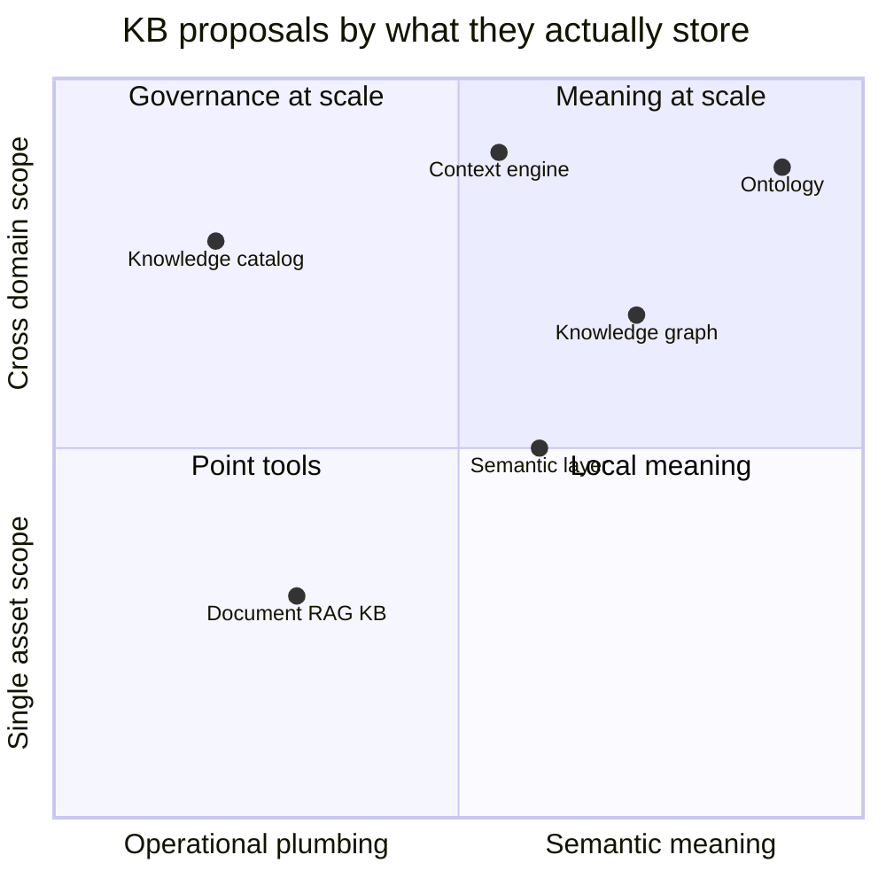
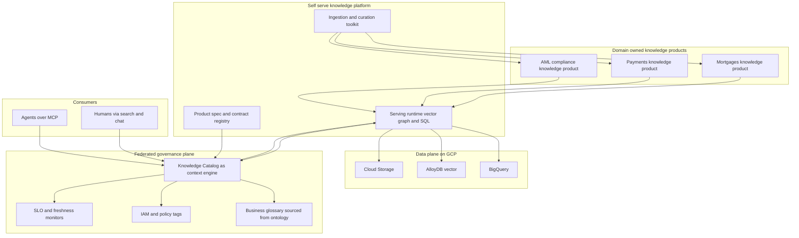
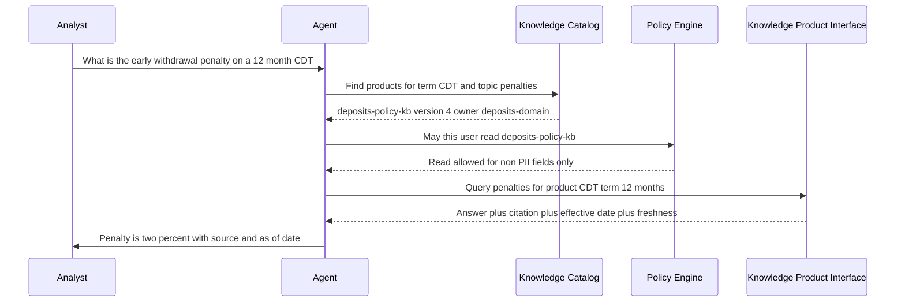
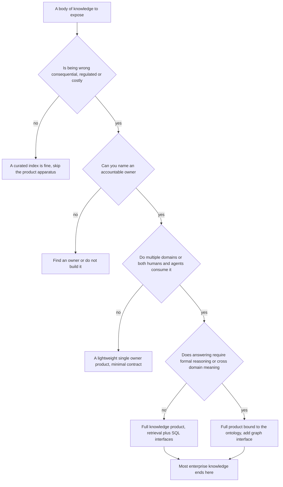

# Knowledge as a Product: What a Knowledge Base Really Is, and How Large Organizations Should Build One

There is an apothecary near where I grew up that has not changed its fittings in a hundred years. Behind the counter is a wall of small drawers and glass jars, each one labeled in a steady hand: the contents, the date it was filled, the initials of the person who filled it. The pharmacist can reach for any one of them without thinking, because each jar is a known, owned, dated thing. Out back there is a different room. It is full of cardboard boxes that suppliers dropped off, half of them unlabeled, some opened, some not, a few past their date. Nobody reaches into the back room to fill a prescription. They reach for the wall.

Most enterprise knowledge bases are the back room with a search engine pointed at it. We dumped everything into a vector store, indexed it, put a chat box in front, and called the back room a knowledge base because you can now ask it questions. It answers. It even answers confidently. But no pharmacist would dispense from it, and no regulator would accept "the model retrieved it from somewhere in the boxes" as an answer to "where did this come from and who is accountable for it."

This post is an argument for the wall. The thesis is simple to state and harder to earn: in a large organization with many business lines, flows, and processes, knowledge has to be treated **as a product** — a curated, owned, versioned, discoverable thing on a shelf — not as a heap of documents wired to an embedding model. The discipline for doing this already exists. It was developed for analytical data under the name *data mesh*, and the parts of it that matter transfer almost cleanly to knowledge. The rest of this post is about which parts transfer, which do not, and how to build the result on a cloud platform without recreating the very monolith you were trying to escape.

## What this post is not (and where to go for those)

This blog has two long posts about building knowledge bases that I am deliberately not going to repeat.

The [enterprise knowledge bases post](https://juanlara18.github.io/portfolio/#/blog/enterprise-knowledge-bases) is about the *architecture inside one knowledge base*: chunking hierarchies, contextual retrieval, permission-aware retrieval, the failure modes that show up when a demo meets real access-control hierarchies. The [knowledge base curation post](https://juanlara18.github.io/portfolio/#/blog/knowledge-base-curation) is about the *cleanup lifecycle* within a corpus: triage, token budgets, deduplication, freshness pruning, quality gates. Both are about getting one knowledge base right.

This post is one level up. It is about the *organization* of knowledge across an entire enterprise: how you decompose it, who owns the pieces, what contract each piece exposes, and how dozens of those pieces compose into something an agent or a human can navigate. Those posts told you how to fill a jar correctly. This one is about the wall, the labels, the ledger of who filled which jar, and the rule that a jar with no owner does not go on the shelf. If you have not read those two, read them first; the curation lifecycle in particular is the *inside* of every knowledge product this post describes.

## Prerequisites and assumptions

I am going to assume a specific kind of reader and a specific kind of organization, because the advice changes completely with scale.

- **You work in a large entity with many domains.** A bank with retail, mortgages, payments, cards, wealth, treasury, risk, and compliance. A hospital network. An insurer. If you are a five-person startup, most of this is overkill; skip to the decision section, conclude "not yet," and go build the back room, because at your scale the back room is fine.
- **Some of your knowledge is consequential and regulated.** Being wrong has legal, financial, or safety costs. This is what justifies the overhead of product thinking. If nobody is harmed by a stale answer, do not pay for an SLA.
- **You have, or will have, both human and agent consumers.** The same knowledge serves a contact-center employee and an autonomous agent deciding whether to flag a transaction. Building for agents is not optional; it changes the interface.
- **You are comfortable with the surrounding concepts.** Retrieval-augmented generation, embeddings, the difference between a vector store and a graph, the rough shape of cloud data platforms. If a term lands cold, the cross-links throughout point to the posts that cover it.

One more assumption, the load-bearing one: **the cost of being wrong is high enough that discoverability, ownership, and trust are worth paying for.** Everything below is the bill for that.

## Pillar 1: What people actually mean by "knowledge base" today

Walk into five architecture reviews and you will hear "knowledge base" used five ways. The arguments that follow are usually not disagreements about implementation; they are people using the same two words for genuinely different artifacts. Before you can treat knowledge as a product, you have to be honest about what is on the table. There are six competing proposals, and the most important thing to understand is that they are not substitutes. They compose.

**The document / RAG knowledge base.** A vector store full of chunked text, retrieved by embedding similarity, stuffed into a prompt. This is what most people mean when they say "knowledge base" in 2027, because it is what the demos use. It is genuinely good at fuzzy recall over prose: "what does the policy say about X." It is genuinely bad at everything that requires knowing *which* version, *whose* document, or *whether the answer is even true.* It has no native notion of meaning, identity, or time. Left alone it becomes the back room.

**The knowledge graph.** Entities and typed relations: a `Customer` *holds* an `Account`, an `Account` *is governed by* a `Regulation`. Stored in a property graph like Neo4j or in RDF triples. It is unmatched at multi-hop relationship questions — "which compliance requirements touch products that this customer holds" — and at entity resolution. It is expensive to populate, brittle when the extraction pipeline drifts, and useless for the long-tail prose questions that vector search handles trivially. The [knowledge graphs in practice post](https://juanlara18.github.io/portfolio/#/blog/knowledge-graphs-practice) covers the construction reality in full.

**The knowledge catalog.** An asset registry: where data lives, what each asset contains, who owns it, its lineage, its access policy, its glossary terms. Google's Knowledge Catalog (the product formerly called Dataplex), Collibra, DataHub. It is the governance and discovery plane. It is superb at "where is our customer data and am I allowed to read it" and has *nothing* to say about what `Customer` means in a formal sense or whether two facts contradict each other. It describes assets, not meaning.

**The semantic layer.** Metric and entity definitions expressed as code: what "active customer" means, how "revenue" is computed, which join produces it. LookML, dbt metrics, BigQuery measures. It gives you one canonical definition of a business concept so that the agent and the analyst use the same numbers. The [LookML semantic layer post](https://juanlara18.github.io/portfolio/#/blog/lookml-semantic-layer-data-modeling) makes the case that this is what turns SQL into a product. It is scoped to analytics, though; it does not model prose policy or open-world relationships.

**The ontology / taxonomy layer.** A formal model of meaning: classes, properties, axioms, a controlled vocabulary. OWL, RDF, SKOS. This is the only one of the six that can *reason* — derive new facts, detect contradictions, align two organizations' models. It is also the slowest and most expensive to build, and it needs specialists. The [ontologies post](https://juanlara18.github.io/portfolio/#/blog/ontologies-building-knowledge-bases) is the primer; the [catalog-versus-ontology post](https://juanlara18.github.io/portfolio/#/blog/knowledge-catalog-vs-ontologies) is the careful argument for why it is not interchangeable with the catalog.

**The context engine.** The newest entry, and the one with the most marketing attached. The promise is a single governed interface that unifies all of the above and hands an agent exactly the right context for a task. Google now positions the Knowledge Catalog explicitly as a "universal context engine." It is the right *ambition*. The risk is that "unify everything behind one surface" quietly becomes "a god-object that owns everything and is owned by no domain" — which is the monolith this whole post is trying to avoid.

Here is the landscape in a single table. The GCP column is one concrete instantiation; the categories are vendor-neutral.

| Proposal | What it stores | Strong at | Weak at | GCP instantiation |
|---|---|---|---|---|
| Document / RAG KB | Chunked text plus embeddings | Fuzzy QA over unstructured prose | No meaning, no version, no truth signal | Vertex AI RAG Engine, AlloyDB vector, Vector Search |
| Knowledge graph | Entities and typed relations | Multi-hop relations, entity resolution | Costly to build, brittle extraction | Spanner Graph, Neo4j on GKE |
| Knowledge catalog | Asset metadata, lineage, glossary, policy | Discovery, governance, access, lineage | No reasoning; describes assets not meaning | Knowledge Catalog (formerly Dataplex) |
| Semantic layer | Metric and entity definitions as code | One canonical business definition | Scoped to analytics, model-bound | LookML, BigQuery measures, dbt |
| Ontology / taxonomy | Classes, axioms, controlled vocabulary | Formal reasoning, contradiction detection | Slow, expensive, needs specialists | Triple store on GKE, OWL files in GCS plus CI |
| Context engine | A governed interface over all the above | One surface for agents | Young; can become an unowned god-object | Knowledge Catalog as context engine plus MCP |

The plot below positions the six by what they are actually *for*: the horizontal axis runs from operational plumbing to semantic meaning, the vertical from single-asset scope to enterprise scope. Nothing sits in the same place, which is the point.



The mistake the back room makes is choosing one of these and pretending it is all of them. A vector store is not a governance plane. A catalog cannot reason. An ontology cannot tell you whether the table behind it was refreshed this morning. The mature answer is to *compose* them — and the unit of composition, the thing that bundles a slice of each into something ownable, is the knowledge product.

## Pillar 2: What a "knowledge product" actually is

The word "product" gets thrown around loosely, so let me earn it rather than assert it. The most useful definition comes by analogy to the data-product literature, so we start there and then adapt.

### The borrowed definition

In 2019 Zhamak Dehghani argued that the reason large enterprises drown in their own data is not a tooling problem but an *organizational* one: a central team owns all the pipelines, becomes the bottleneck, and is too far from the domains to know what the data means. Her answer, data mesh, rests on four principles, and they are worth stating precisely because each one transfers:

1. **Domain-oriented ownership.** The team closest to the data owns it, including its quality, schema, and SLAs.
2. **Data as a product.** A dataset is not a byproduct of a pipeline; it is a product with consumers, a documented interface, and quality guarantees.
3. **Self-serve data platform.** A domain-agnostic platform lets teams build and publish products without becoming infrastructure experts or waiting on a central queue.
4. **Federated computational governance.** Global standards are enforced by code across all products, so the mesh behaves as one interoperable ecosystem rather than a pile of incompatible silos.

The literature also gives the data product a concrete usability bar, usually written as the acronym DATSIS: a data product must be **D**iscoverable, **A**ddressable, **T**rustworthy, **S**elf-describing, **I**nteroperable, and **S**ecure. And it gives it a structural definition — the *architectural quantum*: the smallest unit that can be independently deployed and managed, bundling its data, metadata, code, and the policies that govern it.

If you have read the [data silos post](https://juanlara18.github.io/portfolio/#/blog/data-silos-breaking-information-barriers), this is familiar ground; that post argued for federation over centralization for analytical data. Here I want to make the move that post did not: take this discipline and apply it to *knowledge*, which is messier than data because so much of it is unstructured prose, tacit expertise, and rules that only exist in someone's head.

### The adapted definition

A **knowledge product** is a curated, owned, versioned, governed unit of organizational knowledge, exposed through a documented interface, with explicit consumers, defined boundaries, quality and freshness guarantees, and a feedback loop. Unpacking each clause, because each one is a place teams cut corners:

- **Curated.** Someone decided what goes in and what stays out. This is the entire content of the [curation post](https://juanlara18.github.io/portfolio/#/blog/knowledge-base-curation): triage, dedup, conflict resolution, freshness. A knowledge product is curated by construction; an indexed folder is not.
- **Owned.** A named data owner who is *accountable* for the meaning and a steward who is *responsible* for the upkeep. No owner, no product. This is the single rule that separates the wall from the back room.
- **Versioned.** It has a version, a changelog, and a deprecation policy. Consumers can pin to a version and will not be silently handed a different answer next quarter.
- **Governed.** Access is enforced, reads are audited, classification is explicit. This is where the [DAMA-DMBOK governance framework](https://juanlara18.github.io/portfolio/#/blog/dama-dmbok-data-governance) lives: the knowledge product is the unit those eleven knowledge areas attach to.
- **Documented interface.** It exposes a contract — typed inputs, typed outputs, an access policy — not a raw vector store. For agents, the interface is a tool; we will get to MCP shortly.
- **Explicit consumers and boundaries.** It knows who it is for and, crucially, what it is *not* for. "This answers what the policy says; it does not answer a specific customer's balance." The out-of-scope list is as important as the scope.
- **Quality and freshness guarantees.** Stated as SLOs: re-verified within N days, this fraction of answers carry a citation, this coverage of in-scope documents. Not aspirations; monitored numbers.
- **A feedback loop.** Consumers can report that an answer was wrong, and that signal reaches the owner. A product without a feedback loop decays invisibly.

Now I can earn the apothecary metaphor instead of just invoking it. A labeled jar is a knowledge product: its contents are curated (someone decided what goes in it), it is owned (the initials), it is dated (the fill date), it is discoverable (the label and its place on the wall), it has a boundary (it contains this and not that), and it is trustworthy precisely *because* of all of the above. The back room of unlabeled boxes is a document dump: it might contain the same substances, but you cannot dispense from it, because nothing tells you what is in the box, who is accountable for it, or whether it has gone off.

### Three things, side by side

The distinctions are sharp enough to tabulate.

| Property | Raw document dump | Data product | Knowledge product |
|---|---|---|---|
| Primary content | Files in a store | Structured analytical datasets | Curated knowledge, often unstructured plus structured |
| Owner | Usually none | Domain data owner | Domain knowledge owner plus steward |
| Interface | A folder or a vector index | Tables, an output port, a contract | A governed retrieval, graph, or SQL interface, often an agent tool |
| Consumers | Whoever finds it | Analysts, BI, downstream products | Humans and agents answering questions and making decisions |
| Truth signal | None | Schema and quality tests | Citations, effective dates, groundedness checks |
| Unit of meaning | The file | The schema | The concept, bound to an ontology term |
| Failure mode | Stale, duplicated, unauthorized leakage | Schema drift, broken contract | Confidently wrong, unsourced, or out of date |

A knowledge product is *not* just a data product with prose in it. The differences are real. A data product's contract is mostly about schema and rows; a knowledge product's contract is also about *provenance and meaning* — every answer needs a citation and an effective date, and the product is bound to a concept in the ontology so that "what is a deposit product" has one definition across the bank. A data product can often be validated by tests on its columns; a knowledge product needs *groundedness* checks, because the failure mode is not a null value, it is a fluent, plausible, wrong sentence. That is a harder thing to guarantee, and it is why the contract has to be richer.

### The contract, as an artifact

Product thinking that stops at a slide deck is theater. The artifact that makes a knowledge product real is its spec — a *data contract* in the sense Andrew Jones popularized and PayPal open-sourced for data mesh: a human- and machine-readable agreement covering fundamentals, schema, quality, SLA, security, and stakeholders. Here is one for a deposits-policy product at our running example, the Personal Bank.

```yaml
# knowledge-products/deposits-policy-kb/product.yaml
# A knowledge product spec for the Personal Bank deposits domain.
# Authored by the domain, reviewed in CI, published to the Knowledge Catalog.
apiVersion: knowledge-product/v1
id: deposits-policy-kb
version: 4.2.0
display_name: "Deposits Policy Knowledge"
domain: personal-bank.deposits
status: published            # draft | published | deprecated | retired

ownership:
  data_owner: "Head of Deposits Products"      # accountable, signs off on meaning
  data_steward: "team-deposits-knowledge"      # responsible, maintains it daily
  on_call: "deposits-knowledge@bank.example.com"
  raci:
    accountable: "Head of Deposits Products"
    responsible: "team-deposits-knowledge"
    consulted: ["legal", "compliance-aml"]
    informed: ["retail-distribution", "contact-center"]

purpose:
  consumers: ["contact-center-agent", "branch-staff", "deposits-research-agent"]
  use_case: >
    Answer questions about deposit product rules: rates, penalties,
    eligibility, and the procedures that govern them. Source of truth
    for what the policy says, not for any given customer's balance.
  out_of_scope:
    - "Per-customer account data (see deposits-accounts-data-product)"
    - "Marketing copy and sales scripts"

boundaries:
  source_systems: ["legal-sharepoint/deposits", "policy-hub/deposits"]
  bound_to_ontology: "banking#DepositProduct"   # meaning lives in the ontology
  excludes_pii: true

interfaces:
  - type: retrieval          # governed RAG over curated chunks
    protocol: mcp
    tool: "deposits_policy.search"
  - type: graph              # entity and relation lookups
    protocol: mcp
    tool: "deposits_policy.related"
  output_schema:
    answer: string
    citations: "list[{document_id, section, effective_date}]"
    as_of: datetime
    confidence: float

quality:
  freshness_slo: "every source re-verified within 90 days"
  staleness_alert_after_days: 120
  coverage_target: "0.95 of in-scope policy documents indexed"
  groundedness_target: "0.97 of answers carry a valid citation"
  eval_suite: "evals/deposits-policy-competency-questions.yaml"

access:
  classification: internal
  read_scopes: ["role/contact-center", "role/branch", "role/deposits-research"]
  pii_columns: []            # none; this product is policy text only
  audit: cloud-audit-logs

lifecycle:
  published_at: "2027-09-30"
  review_cadence_days: 90
  deprecation_policy: >
    A superseding version is announced 30 days before the prior version
    retires. Consumers pinned to a retired version get a hard error, never
    a silent fallback to a different answer.
  successor: null
```

This file is the product. Everything else — the vector index, the graph, the prompts — is implementation detail behind the contract. When the contract is in Git and reviewed like code, the knowledge product inherits versioning, review, and audit for free, and an automated platform step can publish its catalog entry from this single source.

## Pillar 3: Designing knowledge products for a huge entity

A bank does not have *a* knowledge base. It has hundreds of distinct knowledge needs, and the design question is how to carve them into products without producing either six giant unmanageable products or six hundred tiny ones nobody can find. Three rules of thumb, learned the expensive way.

### Decompose by domain and process, not by document type

The instinct is to organize knowledge by *format* — a "policies KB," a "procedures KB," a "FAQ KB." This is wrong, because it cuts across the grain of ownership. Nobody owns "all policies." The Head of Deposits owns deposit policies; the Head of Cards owns card policies. Organize by domain (the business line) and within it by process (the thing people actually do), because that is where ownership and source-of-truth expertise live.

The unit test for a product boundary is the same one data mesh uses: **a knowledge product should map to a domain that has a clear owner and a coherent set of consumers.** "Deposits policy" passes — there is a Head of Deposits, and the consumers are contact-center and branch staff asking deposit questions. "All bank knowledge" fails — no single owner, every consumer. "The early-withdrawal-penalty paragraph" fails the other way — too small to own independently, it belongs inside the deposits product.

### Split a small Core from many Domains

There is cross-cutting knowledge that every domain depends on: what a `Customer` is, what `KYC` requires, the meaning of the bank's regulatory entities. If every domain models these independently, they will drift, and you will be back to three different answers to "how much did we sell" — the silo problem in [knowledge form](https://juanlara18.github.io/portfolio/#/blog/data-silos-breaking-information-barriers). The pattern that works is the same Core + Domains split the [modular ontologies post](https://juanlara18.github.io/portfolio/#/blog/modular-ontologies-core-domains-pattern) derives for enterprise schemas: a small, stable core of shared concepts owned by a central enablement team, ringed by domain products owned by the business lines.

The operational rule from that post is worth restating, because it governs the split here too: **a concept belongs in Core only if more than one domain depends on it and its definition is stable.** Everything else stays in a domain product. The Core is deliberately small. The moment the central team starts pulling domain-specific knowledge into the Core "for consistency," you are rebuilding the monolith.

### Map products to the people who are the source of truth

The hardest part of enterprise knowledge is not the documents — it is the tacit knowledge in people's heads, the exceptions and judgment calls that never got written down. The [data silos post](https://juanlara18.github.io/portfolio/#/blog/data-silos-breaking-information-barriers) flagged this as the thing you lose when you break a silo. Product thinking gives it a home: every knowledge product names a **knowledge owner** (accountable for the meaning) and a **domain steward** (responsible for keeping it current), and the contract carries a RACI so the consulted and informed parties are explicit.

This is not bureaucracy for its own sake. It answers the auditor's question that the [DMBOK post](https://juanlara18.github.io/portfolio/#/blog/dama-dmbok-data-governance) opens with — *who approved the ingestion of that document, and when* — by construction. The RACI in the contract is the answer. When the contact-center agent gets a wrong answer about deposit penalties, the feedback loop routes to `team-deposits-knowledge`, who can consult Legal, and the fix ships as version 4.2.1 with a changelog. Ownership is what turns a wrong answer from an unattributable system failure into a tracked incident with a named owner.

A useful design exercise: for each major business process, write one sentence — "to answer questions about X, a consumer needs knowledge from owner Y, bounded by Z." If you cannot name Y, you have found a knowledge product with no owner, which means either you assign one or you do not build it. Both are acceptable outcomes. Building it anyway, with no owner, is not.

## Pillar 4: Centralizing in the cloud without recreating a monolith

Here is the tension that kills most enterprise knowledge programs. Leadership, reasonably, wants *one place* to find knowledge — "I should be able to ask one system anything." Engineering, reasonably, knows that one central team owning all knowledge becomes the bottleneck that the [data silos post](https://juanlara18.github.io/portfolio/#/blog/data-silos-breaking-information-barriers) warned about: every change waits in a queue, the central team is too far from each domain to keep its knowledge correct, and within a year the domains route around it with shadow knowledge bases. You centralize and you get a monolith; you decentralize and you get silos again.

Data mesh's resolution applies directly: **centralize the catalog and the governance, federate the ownership and the storage.** What you centralize is *discoverability and policy* — one place to find any product and one place that enforces who can read what. What you federate is *the products themselves* — each owned, built, and operated by its domain on a shared self-serve platform. The river-confluence framing from the [catalog-versus-ontology post](https://juanlara18.github.io/portfolio/#/blog/knowledge-catalog-vs-ontologies) is the same shape: separate layers that meet at a defined seam and stay separate everywhere else.

### The three-part architecture



Three layers, three different owners:

- **Domain knowledge products** are owned by the business lines. Each is the architectural quantum: its curated content, its contract, its serving config, bundled together. The mortgages team owns the mortgages product end to end. The [GCP knowledge pipeline post](https://juanlara18.github.io/portfolio/#/blog/gcp-ai-stack-vertex-alloydb-knowledge-pipeline) is the inside of one of these boxes — how a single product is actually built on Vertex AI RAG Engine and AlloyDB vector.
- **The self-serve platform** is owned by a central platform team, and it is deliberately *domain-agnostic*: ingestion and curation tooling, a contract registry, a serving runtime that can stand up vector, graph, and SQL interfaces from a product spec. It contains no domain knowledge. Its job is to make publishing a new product a self-service action, not a ticket.
- **The federated governance plane** is the Knowledge Catalog plus the glossary plus IAM plus the SLO monitors. This is the one place everything is discoverable and the one place policy is enforced. On GCP this is the Knowledge Catalog acting as the context engine: it harvests metadata from every product, holds the business glossary (sourced one-directionally from the ontology, per the [catalog-versus-ontology arc](https://juanlara18.github.io/portfolio/#/blog/knowledge-catalog-vs-ontologies)), and respects IAM so an agent only retrieves what it is authorized to see.

The honest trade-off: this is more moving parts than a single central knowledge base, and the platform team is real ongoing cost. What you buy for that cost is the absence of the bottleneck. Domains ship knowledge products without waiting on the center; the center governs without having to understand every domain's content. The federation is not free, but the monolith is more expensive — it just hides the cost in queue latency and shadow systems until it is too late to unwind.

### How agents and RAG consume a product through a governed interface

The interface is where product thinking stops being abstract. An agent must not reach into a domain's raw vector store. It goes through the product's contract, which is exposed as a tool — and in 2027 the lingua franca for that is the [Model Context Protocol](https://juanlara18.github.io/portfolio/#/blog/model-context-protocol). Google now ships a managed MCP endpoint for the Knowledge Catalog precisely so agents can discover and query governed context without anyone hand-rolling a server; the [enterprise MCP post](https://juanlara18.github.io/portfolio/#/blog/mcp-production-enterprise) covers the auth and audit layer that makes this safe in a bank.

The sequence below is one agent answering one question, going through the governed path. Note where meaning, policy, and content are each resolved by a different layer — and note that an answer without a citation is treated as a miss, not a best-effort guess.



The client that does this is small, and the discipline is entirely in what it refuses to do. It never touches storage directly. It checks authorization against the contract. It refuses to serve from a deprecated version. It rejects an answer that arrives without a citation.

```python
# kp_client.py
# A thin client an agent uses to consume a knowledge product through its
# governed interface. The agent never touches the raw vector store; it goes
# through the product's contract, which enforces access, returns citations,
# and refuses to answer from a retired version.
from dataclasses import dataclass
from datetime import datetime, timezone

from knowledge_platform import Catalog, PolicyEngine, ProductRegistry


@dataclass
class GroundedAnswer:
    text: str
    citations: list[dict]
    as_of: datetime
    product_id: str
    product_version: str


class KnowledgeProductError(RuntimeError):
    """Raised when a product is unreachable, deprecated, or off limits."""


def ask_knowledge_product(
    question: str,
    *,
    concept: str,            # e.g. "banking#DepositProduct"
    principal: str,          # the calling user or agent identity
    catalog: Catalog,
    policy: PolicyEngine,
    registry: ProductRegistry,
) -> GroundedAnswer:
    # 1. Discovery: ask the catalog which product owns this concept.
    products = catalog.find_products(concept=concept, status="published")
    if not products:
        raise KnowledgeProductError(f"No published product for {concept}")
    product = products[0]  # the catalog ranks by ownership and trust score

    # 2. Authorization: resolve the caller's scopes against the contract.
    decision = policy.check(principal=principal, product=product.id, action="read")
    if not decision.allowed:
        raise KnowledgeProductError(f"{principal} not authorized for {product.id}")

    # 3. Contract enforcement: never serve from a retired version.
    contract = registry.contract(product.id, product.version)
    if contract.status in {"deprecated", "retired"}:
        raise KnowledgeProductError(
            f"{product.id} v{product.version} is {contract.status}; "
            "pin to a supported version"
        )

    # 4. Consumption: call the product's own governed interface, which applies
    #    field-level masking from the policy decision and always returns
    #    citations and an as-of timestamp.
    result = product.interface("retrieval").search(
        query=question,
        allowed_fields=decision.allowed_fields,
        require_citation=True,
    )

    # 5. Trust: an answer without a citation is a miss, not a best-effort guess.
    if not result.citations:
        raise KnowledgeProductError(
            f"{product.id} returned an ungrounded answer; refusing to pass it on"
        )

    return GroundedAnswer(
        text=result.answer,
        citations=result.citations,
        as_of=result.as_of or datetime.now(timezone.utc),
        product_id=product.id,
        product_version=product.version,
    )
```

Two things deserve emphasis. First, *meaning is resolved separately from content*: the `concept` is an ontology IRI, not a keyword, so "CDT" and "term deposit" and "certificate of deposit" all resolve to the same product because they map to the same class. The ontology supplies the meaning; the catalog supplies the location; the product supplies the answer. This is the [ontology-to-toolbox](https://juanlara18.github.io/portfolio/#/blog/ontology-to-agent-toolbox) discipline applied at the product boundary. Second, *the policy decision shapes the answer*, not just whether the call is allowed — `allowed_fields` masks PII the caller cannot see, so the same product serves different consumers different views without the agent having to know the rules.

For structured questions — "what was deposit volume last quarter" — the product's interface is a text-to-SQL endpoint over a [semantic layer](https://juanlara18.github.io/portfolio/#/blog/lookml-semantic-layer-data-modeling) rather than retrieval over prose; the [text-to-SQL post](https://juanlara18.github.io/portfolio/#/blog/text-to-sql) covers that path. The contract is the same shape; only the interface type differs. This is the composition from Pillar 1 made concrete: one product can expose retrieval, graph, and SQL interfaces, each backed by a different one of the six proposals, all behind one governed contract.

## Pillar 5: Lifecycle, governance, and the operating model

A product that is born and never tended is just a dump with a nicer birth certificate. The hard, unglamorous, and most-skipped pillar is keeping knowledge products alive — and this is as much an operating-model problem as a technical one.

### The catalog entry is the living record

Each product publishes a catalog entry, and unlike the static spec, this record is *alive*: it carries the current freshness status and the rolling trust metrics. This is what an agent or a human sees when they discover the product, and it is what tells them whether to trust it.

```yaml
# As surfaced in the Knowledge Catalog and to agents over MCP.
catalog_entry:
  id: deposits-policy-kb
  display_name: "Deposits Policy Knowledge"
  kind: knowledge-product
  version: 4.2.0
  domain: personal-bank.deposits
  owner: "Head of Deposits Products"
  steward: "team-deposits-knowledge"
  glossary_terms:
    - iri: "http://bank.example.com/ontology/banking#DepositProduct"
      label: "Deposit Product"
    - iri: "http://bank.example.com/ontology/banking#EarlyWithdrawalPenalty"
      label: "Early Withdrawal Penalty"
  interfaces: ["mcp:deposits_policy.search", "mcp:deposits_policy.related"]
  classification: internal
  freshness:
    slo_days: 90
    last_full_refresh: "2027-10-14"
    status: fresh           # fresh | stale | quarantined
  trust:
    groundedness_30d: 0.981
    consumer_satisfaction_30d: 0.92
    queries_30d: 41207
    open_incidents: 0
  lineage:
    upstream: ["legal-sharepoint/deposits", "policy-hub/deposits"]
    backed_by: ["alloydb:kb_deposits.chunks", "gcs://kb-deposits/curated"]
  links:
    spec: "git://knowledge-products/deposits-policy-kb/product.yaml"
    runbook: "https://wiki.bank.example.com/kb/deposits/runbook"
```

### Freshness and deprecation

Freshness is the failure mode the [curation post](https://juanlara18.github.io/portfolio/#/blog/knowledge-base-curation) treats in depth — the slow rot where a system that was 95% accurate at launch is 80% accurate six months later because the world changed and the documents did not. Product thinking adds the missing piece: the freshness SLO is *in the contract* and *monitored against the catalog entry*, so staleness is an alert with an owner, not a surprise an auditor finds.

Deprecation is the part nobody plans for and everybody needs. A knowledge product is replaced over time. The contract's deprecation policy is the rule that a superseding version is announced before the prior one retires, and that a consumer pinned to a retired version gets a *hard error*, never a silent fallback to a different answer. Silent fallback is how a contact-center agent ends up quoting last year's penalty without anyone noticing. Ownership transfer — when a domain reorganizes and a product changes hands — is the same discipline: a tracked handover of the contract, the runbook, and the on-call, not an orphaned product that quietly goes stale.

### Measuring whether a product is used and trusted

The metric that matters is not "is the system up." It is "do people use this product, and do they trust it." Both are observable. Usage is `queries_30d` and the breadth of distinct consumers. Trust is harder but not unmeasurable: groundedness (the fraction of answers carrying a valid citation, which an LLM-as-judge harness can score), consumer satisfaction (the thumbs-up signal from the feedback loop), and open incidents.

It helps to roll these into a single product trust score, defined explicitly rather than by vibe. With freshness ratio $f$, groundedness $g$, usage-weighted satisfaction $u$, and an open-incident penalty $o$:

$$ T = w_f f + w_g g + w_u u - w_o\, o $$

with weights summing to one over the positive terms and $o$ normalized to the product's query volume so that one incident on a low-traffic product hurts more than one incident on a heavily used one. The exact weights are a domain decision — a compliance product weights groundedness near-totally, an internal engineering wiki tolerates more — but the point of writing it down is that the catalog can *rank* products by $T$, surface the ones decaying below threshold, and route consumers to the trustworthy one when two products overlap. A product whose $T$ is sliding is a product whose owner gets paged before a regulator notices.

### The operating model is the real deliverable

None of this works as pure technology. The reference operating model for knowledge-as-a-product in a regulated enterprise has four roles, and they map onto the data-mesh principles:

- **Domain knowledge owners and stewards** (domain ownership) own products end to end. This is where the [DMBOK](https://juanlara18.github.io/portfolio/#/blog/dama-dmbok-data-governance) data-steward role lives.
- **A central platform team** (self-serve platform) owns the toolkit, the contract registry, and the serving runtime — and *owns no knowledge*.
- **A federated governance council** (federated computational governance) sets the global standards — the contract schema, the classification scheme, the minimum SLOs, the ontology binding rule — and enforces them in CI, not in meetings.
- **A small core-knowledge team** (the Core in Core + Domains) owns the shared concepts and the ontology, and guards the line against domains pulling their specifics into the Core.

The deliverable of a knowledge-as-a-product program is not a knowledge base. It is this operating model plus the platform that makes it self-service. The knowledge bases — the products — are produced by the model, continuously, by the domains. That inversion is the whole idea.

## Gotchas and anti-patterns

The failure modes here are predictable enough to name, and most of them feel like progress while they are happening.

**A central team trying to own all knowledge.** The most common and most expensive. A well-meaning "knowledge office" decides it will build *the* enterprise knowledge base. It becomes the bottleneck the [data silos post](https://juanlara18.github.io/portfolio/#/blog/data-silos-breaking-information-barriers) describes, it is too far from each domain to keep content correct, and domains build shadow knowledge bases to route around it. The cure is the federated model: the center owns the platform and the governance, never the content.

**Treating it as a one-time migration.** "We will ingest everything in Q3 and launch." Knowledge is not migrated; it is *operated*. A program scoped as a migration produces a snapshot that is stale before the launch party ends. Scope it as standing capacity — domains continuously publishing and tending products — or do not start.

**No owners.** A product with no named owner is a dump with a contract file. If you cannot name the accountable owner, you have not found a product; you have found a gap. Assign an owner or do not build it. This single rule eliminates most of the back room.

**Product thinking in name only.** The team renames its folders "data products," draws a mesh diagram, and changes nothing about ownership, contracts, or SLOs. The vocabulary is adopted; the discipline is not. The test is whether a consumer can read a product's contract, pin a version, see its freshness, and report a bad answer to a named owner. If not, it is theater.

**Letting the context engine become an unowned god-object.** The seductive version of the previous anti-pattern. "Unify everything behind the Knowledge Catalog" quietly becomes "one surface that owns all knowledge and is owned by no domain." The catalog should be the *discovery and governance plane over* owned products, not a product itself. Keep the line drawn.

**Collapsing meaning into the catalog.** The [catalog-versus-ontology post](https://juanlara18.github.io/portfolio/#/blog/knowledge-catalog-vs-ontologies) is the long argument; the short version is that the catalog describes assets and cannot reason. Encoding business rules as catalog tag taxonomies, or skipping the ontology because "the catalog handles meaning," produces a large metadata footprint and no formal model of your domain. Bind products to ontology terms; do not let the glossary pretend to be the ontology.

**Over-producting trivial knowledge.** The symmetric error. Not everything deserves a contract and an SLO. A team that wraps every FAQ in a full product spec drowns in ceremony. Reserve the apparatus for knowledge whose wrongness is consequential. The decision section is exactly about where that line sits.

## How to decide

Product thinking is overhead, and overhead is only worth it past a threshold. Use this to find the threshold rather than applying the apparatus uniformly.



The pragmatic reading: most knowledge in a large regulated enterprise lands at "full product," a meaningful slice that touches formal rules also binds to the ontology and exposes a graph interface, a long tail of low-stakes internal knowledge stays a curated index and is perfectly fine that way, and anything you cannot find an owner for does not get built. The art is not applying the maximum everywhere; it is matching the apparatus to the cost of being wrong.

A second decision worth front-loading: **start with the regulated, high-stakes domains, not the easy ones.** The temptation is to product-ize the internal IT wiki first because it is low-risk. But the wiki is exactly the knowledge that does *not* justify the overhead, so you learn the apparatus on a case that does not need it and never feel the payoff. Start where wrongness is expensive — deposits policy, AML, the things a regulator asks about — because that is where the contract, the citations, and the owner earn their cost on day one.

## Synthesis: the wall, not the back room

Strip everything above to its load-bearing claim. A knowledge base is not a place you put documents. It is a *shelf of products*, each one curated, owned, dated, bounded, and trustworthy, discoverable through one catalog and governed by one policy plane, produced continuously by the domains that hold the expertise and operated on a platform the center provides but does not fill. The pharmacist's wall, not the supplier's back room.

The data-mesh discipline transfers because the underlying problem is the same one Dehghani diagnosed: at enterprise scale, the bottleneck is organizational, and the fix is to push ownership to the domains while centralizing only discoverability and governance. Knowledge is harder than data because so much of it is prose, tacit expertise, and rules in someone's head — which is exactly why the contract has to carry provenance and meaning, not just schema, and why every answer needs a citation and an effective date. The six proposals from Pillar 1 do not compete; they compose, and the knowledge product is the unit of composition that bundles a slice of each behind one governed interface.

If you build the operating model — domain owners, a self-serve platform, a federated governance council, a small core team — the knowledge bases produce themselves. If you skip the model and build the technology, you get the back room with a chat box, and in a regulated enterprise that is not an asset. It is a liability waiting for an audit. Build the wall. Label the jars. Name the person who filled each one. That is what a knowledge base really is.

---

## Going Deeper

**Books:**

- Dehghani, Z. (2022). *Data Mesh: Delivering Data-Driven Value at Scale.* O'Reilly Media. — The source text for everything in Pillar 2. Read it for data; the translation to knowledge is the work of this post, but the four principles and the data-product definition are hers, stated more carefully than any summary.
- Jones, A. (2023). *Driving Data Quality with Data Contracts.* Packt Publishing. — The practical manual for the contract artifact at the center of the knowledge product. The chapters on schema, change management, and ownership map almost one-to-one onto the YAML spec above.
- DAMA International. (2017). *DAMA-DMBOK: Data Management Body of Knowledge* (2nd ed.). Technics Publications. — The governance reference. The eleven knowledge areas are the disciplines that attach to each knowledge product; treat it as the checklist for what a mature governance plane must cover.
- Kleppmann, M. (2017). *Designing Data-Intensive Applications.* O'Reilly Media. — Not about knowledge at all, but the foundation for understanding why federated storage with centralized governance is a coherent design and why lineage and freshness are the same class of problem as replication and change data capture.
- Loshin, D. (2009). *Master Data Management.* Morgan Kaufmann. — Pre-dates the agentic vocabulary entirely, which is the point: the registry, lineage, ownership, and stewardship concerns the modern catalog inherits are decades old. A useful antidote to treating any of this as new.

**Online Resources:**

- [Data Mesh Principles and Logical Architecture](https://martinfowler.com/articles/data-mesh-principles.html) — Dehghani's canonical article on Martin Fowler's site. The clearest free statement of the four principles and the DATSIS usability characteristics.
- [Google Cloud Knowledge Catalog (formerly Dataplex)](https://cloud.google.com/products/knowledge-catalog) — The product page for the context engine referenced throughout the GCP sections, including the managed MCP endpoint for agent consumption and the metadata-permission-respecting search.
- [PayPal data contract template](https://github.com/paypal/data-contract-template) — The open-sourced YAML contract that PayPal uses in its own data mesh. The structure (fundamentals, schema, quality, SLA, security, stakeholders) is the skeleton of the knowledge product spec.
- [Open Data Contract Standard (Bitol, Linux Foundation)](https://github.com/bitol-io/open-data-contract-standard) — The community standard that grew out of the PayPal template. Worth adopting rather than inventing your own contract schema.
- [Open Data Mesh, Data Product Descriptor Specification](https://dpds.opendatamesh.org/) — A technology-independent spec for describing a data product, including the architectural-quantum framing and the promise-based trust model that informs the trust-score discussion.

**Videos:**

- [Introduction to Data Mesh](https://www.youtube.com/watch?v=_bmYXWCxF_Q) by Zhamak Dehghani (Thoughtworks) — The 35-minute primer from the originator. The clearest articulation of why centralized data platforms fail at scale and what the four principles are responding to.
- [Data Mesh, Now](https://www.youtube.com/watch?v=VKDMz8op3VM) by Zhamak Dehghani (Thoughtworks) — Her three-years-in retrospective, including the misunderstandings the industry built around the concept. Useful precisely because it names the anti-patterns, several of which reappear here in knowledge form.
- [What is Data Mesh?](https://www.youtube.com/watch?v=_bmYXl-Yve4) by IBM Technology — A concise whiteboard explainer if you want the principles in ten minutes before committing to the book.

**References:**

- Dehghani, Z. (2019). ["How to Move Beyond a Monolithic Data Lake to a Distributed Data Mesh."](https://martinfowler.com/articles/data-monolith-to-mesh.html) martinfowler.com. — The original essay that named the paradigm. The argument against the central data team as bottleneck is the direct ancestor of this post's argument against a central knowledge team.
- Jones, A. (2021–2026). ["Data Contracts."](https://andrew-jones.com/categories/data-contracts/) andrew-jones.com. — The running body of writing from the person who coined the term, including the working definition used here: a data contract is an agreed interface between the producers of data and its consumers.

**Questions to Explore:**

- A knowledge product binds to an ontology term for its meaning. When the ontology itself changes — a class is split, a definition tightened — every product bound to it inherits a meaning change it did not author. What is the right propagation discipline, and who is accountable when a downstream product's answers shift because an upstream definition moved?
- The trust score $T$ lets a catalog rank overlapping products and route consumers to the trustworthy one. But ranking creates a feedback loop: the top-ranked product gets more traffic, more feedback, and more reasons to stay on top, while a better but newer product starves. How do you design the ranking so it does not ossify?
- Data products serve analysts and other products; knowledge products serve agents that act. When an agent makes a consequential decision grounded in a knowledge product, the chain of evidence spans the agent's run trace, the product's citations, and the ontology's definitions. What is the minimum viable cross-layer audit artifact a regulator would accept, and which role in the operating model produces it?
- The Core + Domains split keeps shared concepts small and stable. But business reality drifts: a concept that was domain-specific becomes cross-cutting, or vice versa. What is the governance process for *promoting* a concept into the Core or *demoting* one out of it, and how do you do it without breaking the products bound to it?
- Most of an enterprise's hardest knowledge is tacit — the exceptions and judgment calls in experts' heads. Product thinking gives that knowledge an owner, but it does not extract it. Is there a defensible loop where agent interactions with a domain steward progressively externalize tacit knowledge into the product, or does the irreducibly tacit part set a hard ceiling on what any knowledge base can ever contain?
