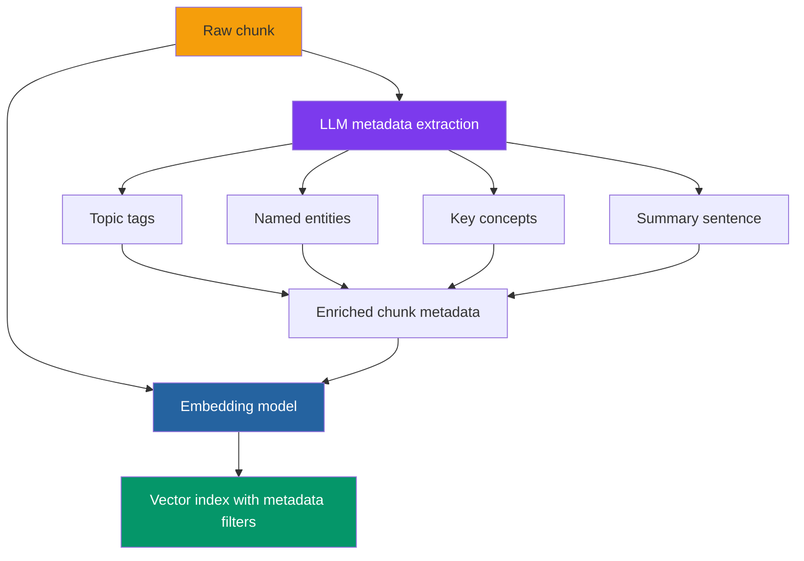
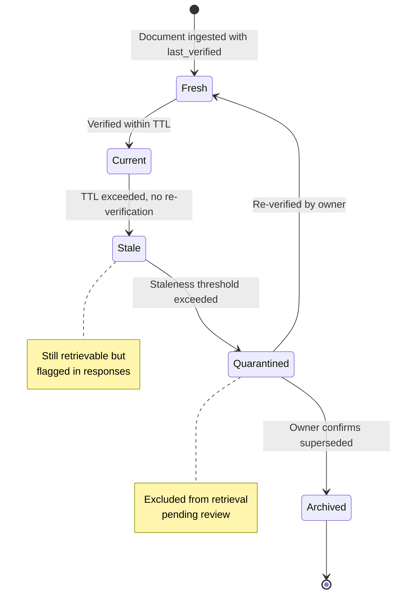

# Curating Knowledge Bases: The Unglamorous Work That Makes RAG Actually Work

There's a question that never appears in RAG tutorials: *should this document even be in the knowledge base?*

Tutorials start with a folder of PDFs. They run them through a chunker, embed the chunks, toss them into a vector database, and demonstrate a query that returns the right answer. The implicit assumption is that every document deserves to be indexed, that every paragraph carries signal, and that the retrieval layer will sort out relevance at query time.

In production, this assumption is catastrophic. Real enterprise document collections contain conflicting versions of the same policy. They contain drafts that were never finalized. They contain a 200-page compliance manual where 195 pages are boilerplate and 5 pages contain the actual rules. They contain documents from 2019 that describe a process the organization abandoned in 2022. They contain a spreadsheet exported as PDF where the table structure is destroyed and the embedding model sees only a soup of numbers without headers.

When you index everything without curation, you don't get a knowledge base. You get a haystack with a search engine that confidently returns straws.

This post is about the work that happens before the embedding model ever sees a token — and the ongoing maintenance that keeps a knowledge base accurate after deployment. It's not glamorous. There are no flashy demos. But it's the difference between a RAG system that works in production and one that slowly poisons decisions with outdated, duplicated, or truncated information.

## The Curation Lifecycle

Knowledge base curation isn't a one-time preprocessing step. It's a continuous lifecycle with distinct phases, each addressing a different failure mode.

```mermaid
flowchart LR
    subgraph Ingestion["1. Ingestion"]
        A[Document discovery] --> B[Triage and filtering]
        B --> C[Format normalization]
    end
    subgraph Preparation["2. Preparation"]
        C --> D[Metadata enrichment]
        D --> E[Token budget check]
        E --> F[Chunking]
    end
    subgraph Quality["3. Quality"]
        F --> G[Deduplication]
        G --> H[Conflict detection]
        H --> I[Quality scoring]
    end
    subgraph Maintenance["4. Maintenance"]
        I --> J[Freshness monitoring]
        J --> K[Staleness pruning]
        K --> L[Re-ingestion triggers]
        L --> A
    end

    style Ingestion fill:#4a90d9,color:#fff
    style Preparation fill:#2563a0,color:#fff
    style Quality fill:#7c3aed,color:#fff
    style Maintenance fill:#059669,color:#fff
```



Most teams invest everything in phase 2 (preparation) — chunking strategies, embedding models — and skip phases 1, 3, and 4 entirely. The result is a knowledge base that's technically built but operationally fragile. Let's fix that.

## Phase 1: Document Triage — What Gets In

The single highest-leverage curation decision is deciding what *not* to index. Every document you exclude is noise that will never pollute a retrieval result.

### The Triage Questions

For every document (or document collection) entering the knowledge base, ask:

1. **Is this the authoritative version?** If there are multiple versions of the same policy, only the current one should be indexed. Superseded versions should be archived, not embedded.

2. **Is this still valid?** A document from 2020 describing a process that changed in 2023 will generate confidently wrong answers. Check with the document owner.

3. **Does this contain actionable knowledge?** Meeting minutes, draft proposals, and email threads often contain opinions and discussion — not facts. Unless your knowledge base explicitly serves historical context, exclude these.

4. **Is this machine-readable?** Scanned PDFs without OCR, images of tables, handwritten notes — these produce garbage when chunked and embedded. Either run OCR preprocessing or exclude them.

5. **Does this duplicate another source?** If the same information exists in a policy document and a training slide deck, index the policy (authoritative) and skip the slide deck (derivative).

### Building a Triage Scorecard

For organizations with large document collections, automate the triage with a scoring system:

```python
from dataclasses import dataclass
from datetime import datetime, timedelta


@dataclass
class DocumentScore:
    path: str
    authority_score: float      # 0-1: is this the canonical source?
    freshness_score: float      # 0-1: how recent is the last verified date?
    extractability_score: float # 0-1: can we extract clean text?
    uniqueness_score: float     # 0-1: how much does this overlap with existing docs?

    @property
    def total(self) -> float:
        weights = {
            "authority": 0.35,
            "freshness": 0.25,
            "extractability": 0.25,
            "uniqueness": 0.15,
        }
        return (
            self.authority_score * weights["authority"]
            + self.freshness_score * weights["freshness"]
            + self.extractability_score * weights["extractability"]
            + self.uniqueness_score * weights["uniqueness"]
        )

    @property
    def decision(self) -> str:
        if self.total >= 0.7:
            return "INDEX"
        elif self.total >= 0.4:
            return "REVIEW"  # human decides
        return "EXCLUDE"


def score_freshness(last_verified: datetime, ttl_days: int = 365) -> float:
    """Score from 1.0 (just verified) to 0.0 (expired)."""
    age = (datetime.now() - last_verified).days
    return max(0.0, 1.0 - (age / ttl_days))
```

The threshold of 0.7 is a starting point. Calibrate it against your domain: a legal knowledge base should be more aggressive (0.8+) because outdated legal advice is dangerous. An internal wiki for engineering best practices can be more permissive (0.5+) because stale-but-directionally-correct advice is better than no advice.

### The Document Inventory

Before building anything, run an inventory. For every document source (SharePoint, Confluence, Google Drive, S3 bucket, database exports), record:

| Field | Why It Matters |
|-------|---------------|
| `source_system` | Where the document lives. Determines the ingestion connector. |
| `owner` | Who is responsible for accuracy. No owner = no accountability = no trust. |
| `last_verified` | When someone last confirmed this is still correct. Not `last_modified` — a formatting change doesn't verify content. |
| `classification` | Public, internal, confidential, restricted. Determines access control at retrieval time. |
| `domain` | Which business area this covers (HR, finance, engineering, legal). Enables domain-filtered retrieval. |
| `ttl_days` | How long before this document should be re-verified. Financial data: 30 days. HR policies: 180 days. Engineering guides: 365 days. |
| `format` | PDF, DOCX, HTML, Markdown, spreadsheet. Determines the extraction pipeline. |

Documents without an owner or a `last_verified` date should be flagged for review, not silently indexed. A knowledge base built on unverified documents is a liability — it will produce answers that *look* authoritative but might be years out of date.

## Phase 2: The Token Budget — Why Your Chunks Get Silently Truncated

This is the gap the user intuition was pointing to, and it's one of the most underappreciated problems in RAG systems. Every embedding model has a maximum token limit. Text beyond that limit is silently truncated — the model never sees it, the embedding doesn't represent it, and the retrieval system acts as if those words don't exist.

### The Limits

| Model | Max Tokens | Dimensions | What Gets Truncated |
|-------|-----------|------------|-------------------|
| **OpenAI text-embedding-3-small** | 8,191 | 1,536 | Anything beyond ~6,000 words |
| **OpenAI text-embedding-3-large** | 8,191 | 3,072 | Same limit, higher quality per token |
| **Cohere embed-v3** | 512 | 1,024 | Anything beyond ~380 words |
| **Cohere embed-v4** | 128,000 | 1,024 | Effectively unlimited for single docs |
| **Voyage 4 Large** | 32,000 | 1,024 | Anything beyond ~24,000 words |
| **BGE-M3** | 8,192 | 1,024 | Anything beyond ~6,000 words |

The danger is asymmetric: **you don't get an error when truncation happens.** The API accepts your 12,000-token chunk, silently truncates it to 8,191 tokens, and returns an embedding that represents only the first two-thirds of your text. The last third — which might contain the conclusion, the exceptions to a rule, or the critical qualifying clause — is invisible to retrieval.

### The Math You Must Do

Before choosing a chunking strategy, calculate the token budget:

```python
import tiktoken


def check_token_budget(
    text: str,
    model: str = "text-embedding-3-small",
    max_tokens: int = 8191,
) -> dict:
    """Check if text fits within the embedding model's token limit."""
    enc = tiktoken.encoding_for_model(model)
    tokens = enc.encode(text)
    token_count = len(tokens)

    return {
        "token_count": token_count,
        "max_tokens": max_tokens,
        "fits": token_count <= max_tokens,
        "overflow": max(0, token_count - max_tokens),
        "utilization": token_count / max_tokens,
        "truncated_pct": max(0, (token_count - max_tokens) / token_count * 100),
    }


# Check a real chunk
result = check_token_budget(my_chunk_text)
if not result["fits"]:
    print(f"WARNING: {result['overflow']} tokens will be silently truncated "
          f"({result['truncated_pct']:.1f}% of content lost)")
```

**The rule:** your chunk size (in tokens) must always be strictly smaller than your embedding model's context window. If you're using `text-embedding-3-small` (8,191 tokens), your chunks should be at most 7,500 tokens to leave a safety margin — and in practice, 512-1,024 tokens is where most benchmarks show optimal retrieval performance.

### Why Chunk Boundaries Matter More Than Chunk Size

Token budgets tell you the *maximum* size. But where you cut matters more than how much you cut. A chunk that splits a sentence in half produces two fragments — neither of which makes sense to the embedding model.

Consider this passage from an HR policy:

> *Employees who have completed their probationary period of 90 days are entitled to 15 days of annual leave per calendar year, prorated for partial years. Employees who have not yet completed probation are entitled to 5 days.*

If your chunker splits after "prorated for partial years," the second chunk starts with "Employees who have not yet completed probation are entitled to 5 days." Without the first sentence's context, this chunk retrieves incorrectly for queries like "how many vacation days do new employees get?" — it answers 5 days but doesn't explain the probation condition.

**Boundary strategies, ranked by effectiveness:**

| Strategy | How It Works | Best For |
|----------|-------------|----------|
| **Recursive character splitting** | Split on paragraphs, then sentences, then words | General-purpose default |
| **Semantic splitting** | Use an embedding model to detect topic shifts within a document | Long-form documents with multiple topics |
| **Section-aware splitting** | Respect document structure (headers, numbered sections) | Technical documentation, policies |
| **Sliding window** | Fixed-size chunks with N% overlap between consecutive chunks | Dense documents where context bleeds across boundaries |

The sliding window approach deserves special attention. A 10-20% overlap means that the boundary content appears in two chunks — increasing your storage by 10-20%, but ensuring that sentences split by a boundary are still complete in at least one chunk. For most production systems, **512-token chunks with 50-token overlaps** strike the right balance between completeness and storage cost.

```python
from langchain_text_splitters import RecursiveCharacterTextSplitter

splitter = RecursiveCharacterTextSplitter(
    chunk_size=512,
    chunk_overlap=50,
    separators=["\n\n", "\n", ". ", " "],  # paragraph > newline > sentence > word
    length_function=lambda t: len(tiktoken.encoding_for_model(
        "text-embedding-3-small"
    ).encode(t)),
)

chunks = splitter.split_text(document_text)
```

Note the `length_function` override: by default, LangChain counts *characters*, not tokens. Without this fix, your "512-token" chunks might actually be 600+ tokens, pushing them past the embedding model's limit.

### The Cohere Trap

Cohere's embed-v3 models have a 512-token limit — far shorter than OpenAI or Voyage. If you designed your chunking for OpenAI's 8K window and then switch to Cohere, **every chunk over 512 tokens gets truncated**. This happens in production more often than you'd think — teams change embedding models without recalculating their token budgets. The fix: always validate chunk sizes against the target model's limit *before* embedding, not after.

### Chunk Size vs. Retrieval Quality

Recent benchmarks (Vectara, February 2026) tested chunking strategies across 50 academic papers. The findings challenge the "bigger is better" intuition:

| Chunk Size | Retrieval Accuracy | Notes |
|-----------|-------------------|-------|
| 128 tokens | 58% | Too small — lacks context for the LLM |
| 256 tokens | 63% | Acceptable for highly structured documents |
| 400-512 tokens | 69% | **Sweet spot for most use cases** |
| 1,024 tokens | 64% | Diminishing returns — diluted relevance |
| 2,048 tokens | 59% | Worse than 512 — too much noise per chunk |

The optimal range is 400-512 tokens with 10-20% overlap. This isn't a universal law — highly structured documents (legal contracts, technical specs) benefit from larger chunks that preserve section integrity, while short-form content (FAQ entries, support tickets) works better with smaller chunks. But 400-512 is the default you should start from, adjusting only when you have evidence.

## Contextual Enrichment: Fixing the Orphan Chunk Problem

Even with perfect chunk sizes, chunking creates a fundamental problem: chunks lose their context. A chunk that says "The company's revenue grew by 3% over the previous quarter" is useless without knowing *which company* and *which quarter*.

Anthropic's **Contextual Retrieval** technique (2024) addresses this directly. Before embedding, each chunk is sent to an LLM along with the full source document. The LLM generates a concise context summary — "This chunk is from Acme Corp's Q3 2025 earnings report, discussing revenue performance" — which is prepended to the chunk text before embedding.

The results are significant: contextual embeddings alone reduced retrieval failure rate by 35%. Combined with BM25, the reduction reached 49%. With reranking added, failures dropped by 67%.

```python
from anthropic import Anthropic

client = Anthropic()

CONTEXT_PROMPT = """
You are processing a chunk from a larger document. 
Generate a brief context statement (1-2 sentences) that identifies:
- What document this chunk comes from
- What specific topic or section it addresses
- Any key entities (companies, dates, regulations) mentioned

Document title: {title}
Full document (for reference): {full_document}

Chunk to contextualize:
{chunk}

Context statement:
"""


def contextualize_chunk(
    chunk: str, full_document: str, title: str
) -> str:
    """Prepend contextual summary to a chunk before embedding."""
    response = client.messages.create(
        model="claude-haiku-4-5-20251001",  # cheap and fast
        max_tokens=150,
        messages=[{
            "role": "user",
            "content": CONTEXT_PROMPT.format(
                title=title,
                full_document=full_document[:50_000],  # truncate very long docs
                chunk=chunk,
            ),
        }],
    )
    context = response.content[0].text
    return f"{context}\n\n{chunk}"
```

**The cost trade-off:** contextual enrichment requires one LLM call per chunk. For a 10,000-chunk corpus, that's ~$2-5 using Claude Haiku. For 100,000 chunks, ~$20-50. It's a one-time cost at ingestion — not per query — and the retrieval quality improvement typically justifies it within days.

**When to skip it:** If your documents are self-contained (each chunk has clear entity references and dates within the chunk itself), contextual enrichment adds cost without meaningful benefit. Test with a sample before rolling it out across the entire corpus.

## Metadata: The Information Your Chunks Should Carry But Usually Don't

A chunk without metadata is a fact without provenance. You might retrieve it, but you can't verify it, filter it, or explain why the system chose it.

### Essential Metadata Fields

Every chunk in your knowledge base should carry:

```python
chunk_metadata = {
    # Provenance
    "source_document": "hr-policy-v3.2.pdf",
    "source_page": 14,
    "source_section": "3.2 Leave Entitlements",
    "document_owner": "HR Operations",
    "last_verified": "2026-08-15",

    # Classification
    "domain": "hr",
    "sensitivity": "internal",
    "document_type": "policy",  # policy, procedure, reference, training

    # Freshness
    "ingested_at": "2026-09-01T10:30:00Z",
    "ttl_days": 180,
    "expires_at": "2027-03-01T10:30:00Z",

    # Quality
    "chunk_token_count": 487,
    "extractability_score": 0.92,  # how clean was the text extraction?
    "has_tables": False,
    "has_code": False,
    "language": "en",
}
```

### LLM-Generated Metadata

Beyond structural metadata, recent research shows that LLM-generated semantic metadata significantly improves retrieval. A 2026 paper accepted at IEEE CAI demonstrated that enriching chunks with AI-generated tags — topic labels, entity mentions, key concepts — improved retrieval precision by 15-25% over raw text embeddings.

The enrichment pipeline:



At retrieval time, metadata enables **filtered search**: instead of searching the entire index, you search within `domain = "hr" AND document_type = "policy" AND expires_at > now()`. This eliminates entire categories of irrelevant results before the vector similarity calculation even runs.

## Deduplication: The Problem Nobody Wants to Solve

Enterprise document collections are riddled with near-duplicates. The same policy exists as a PDF in SharePoint, a wiki page in Confluence, and a slide in a training deck. They're not identical — formatting differs, the wiki might have a paragraph added, the slide summarizes rather than quotes — but they represent the same underlying knowledge.

When you embed all three, retrieval returns multiple results that say the same thing, wasting context window tokens and diluting the signal from genuinely distinct information.

### Three Levels of Deduplication

**Level 1: Exact duplicates** — identical content. Detect with content hashing (SHA-256 on normalized text). Fast, cheap, catches copies across file systems.

**Level 2: Near-duplicates** — same content with minor edits (formatting, typos, added/removed paragraphs). Detect with MinHash LSH (Locality-Sensitive Hashing) — creates compact signatures that can be compared at scale. Milvus 2.6 has this built in natively.

**Level 3: Semantic duplicates** — different wording expressing the same facts. Detect by comparing embeddings with cosine similarity. If two chunks from different documents have similarity > 0.92, they likely convey the same information. Keep the one from the more authoritative source.

```python
from datasketch import MinHash, MinHashLSH


def detect_near_duplicates(
    documents: list[dict], threshold: float = 0.8
) -> list[tuple]:
    """Find near-duplicate document pairs using MinHash LSH."""
    lsh = MinHashLSH(threshold=threshold, num_perm=128)
    minhashes = {}

    for doc in documents:
        mh = MinHash(num_perm=128)
        # Shingle the text into 3-word n-grams
        words = doc["text"].lower().split()
        for i in range(len(words) - 2):
            shingle = " ".join(words[i:i+3])
            mh.update(shingle.encode("utf-8"))
        minhashes[doc["id"]] = mh

        try:
            lsh.insert(doc["id"], mh)
        except ValueError:
            pass  # duplicate key — already a near-duplicate

    # Find all duplicate pairs
    duplicates = []
    for doc_id, mh in minhashes.items():
        matches = lsh.query(mh)
        for match in matches:
            if match != doc_id:
                duplicates.append((doc_id, match))

    return duplicates
```

### Conflict Resolution

Deduplication reveals a harder problem: what do you do when two authoritative documents *contradict* each other? The 2024 travel policy says "maximum hotel rate: $200/night." The 2025 addendum says "$250/night for tier-1 cities." Both are current. Both are official.

Options:

1. **Merge with precedence rules** — later documents override earlier ones. Simple but dangerous if the later document is a partial update, not a full replacement.
2. **Keep both with metadata flags** — tag the conflict and let the LLM at query time acknowledge the ambiguity: "Policy X says $200, but the 2025 addendum updated this to $250 for tier-1 cities."
3. **Escalate to a human** — flag contradictions for domain expert resolution before indexing. Slowest but safest for high-stakes domains.

For most organizations, option 2 is the pragmatic choice. The retrieval system returns both chunks with their dates and sources, and the LLM synthesizes the response acknowledging the evolution. This is more honest than silently picking one version.

## Freshness: The Slow Rot You Don't Notice

A knowledge base that was 95% accurate at launch is 80% accurate six months later — not because the system degraded, but because the world changed and the documents didn't. New policies replaced old ones. Products were discontinued. Regulations were updated. The knowledge base still confidently retrieves the old information because nobody told it to stop.

### Freshness Architecture

Every document needs a freshness lifecycle:



### Implementing TTL-Based Freshness

```python
from datetime import datetime, timedelta


# TTL policies by document type
TTL_POLICIES = {
    "financial_report": timedelta(days=30),
    "product_documentation": timedelta(days=90),
    "hr_policy": timedelta(days=180),
    "engineering_guide": timedelta(days=365),
    "regulatory_compliance": timedelta(days=90),
    "training_material": timedelta(days=365),
}


def classify_freshness(
    last_verified: datetime,
    doc_type: str,
    now: datetime | None = None,
) -> str:
    """Classify a document's freshness status."""
    now = now or datetime.now()
    ttl = TTL_POLICIES.get(doc_type, timedelta(days=180))
    age = now - last_verified

    if age <= ttl:
        return "FRESH"
    elif age <= ttl * 1.5:
        return "STALE"       # still retrievable, flagged
    else:
        return "QUARANTINED"  # excluded from retrieval


def freshness_audit(chunks: list[dict]) -> dict:
    """Audit the freshness of all chunks in the knowledge base."""
    results = {"FRESH": 0, "STALE": 0, "QUARANTINED": 0}
    for chunk in chunks:
        status = classify_freshness(
            last_verified=chunk["metadata"]["last_verified"],
            doc_type=chunk["metadata"]["document_type"],
        )
        results[status] += 1

    total = sum(results.values())
    print(f"Fresh: {results['FRESH']}/{total} ({results['FRESH']/total*100:.1f}%)")
    print(f"Stale: {results['STALE']}/{total} ({results['STALE']/total*100:.1f}%)")
    print(f"Quarantined: {results['QUARANTINED']}/{total}")

    if results["FRESH"] / total < 0.80:
        print("WARNING: Less than 80% of knowledge base is fresh")

    return results
```

**The 80% rule:** if less than 80% of your knowledge base is fresh (within TTL), the system is degrading. Run this audit weekly. Automate it as a CI job. If freshness drops below threshold, alert the document owners.

### What to Do With Stale Content

Don't delete stale content. Demote it:

1. **At retrieval time**, apply a freshness penalty to similarity scores. A stale chunk needs to be significantly more relevant than a fresh chunk to surface.
2. **In the response**, flag stale sources: "This information is from a document last verified 14 months ago. Please confirm with [document owner] before acting on it."
3. **In the audit**, track which stale documents are still being retrieved. If a stale document appears in 50+ retrievals per week, it's critical — prioritize its re-verification.

## Quality Scoring: Rating Chunks Before They Enter the Index

Not all chunks are created equal. A well-written paragraph from a policy document is a high-quality chunk. A garbled table extracted from a poorly scanned PDF is a low-quality chunk. Both get embedded the same way, but the garbled table will pollute retrieval results.

### Automated Quality Signals

| Signal | How to Measure | Threshold |
|--------|---------------|-----------|
| **Text extractability** | Character-level noise ratio (non-ASCII, garbled sequences) | Reject if noise > 15% |
| **Language coherence** | Perplexity score from a small language model | Reject if perplexity > 500 |
| **Information density** | Ratio of unique content words to total words | Flag if < 0.3 (boilerplate) |
| **Structural integrity** | Does the chunk start/end at sentence boundaries? | Flag if truncated mid-sentence |
| **Token count** | Actual token count vs. embedding model limit | Reject if overflow > 0 |
| **Duplicate ratio** | Cosine similarity to existing chunks | Flag if > 0.92 with any existing chunk |

### The Pre-Indexing Gate

Combine these signals into a quality gate that runs before any chunk enters the vector index:

```python
def quality_gate(chunk: dict, existing_embeddings=None) -> tuple[bool, list[str]]:
    """Decide whether a chunk meets quality standards for indexing."""
    issues = []

    text = chunk["text"]
    tokens = count_tokens(text)

    # Token budget check
    if tokens > 8000:
        issues.append(f"Token overflow: {tokens} tokens exceeds 8,000 limit")

    if tokens < 50:
        issues.append(f"Too short: {tokens} tokens — likely a fragment")

    # Noise check
    non_ascii = sum(1 for c in text if ord(c) > 127 and not c.isalpha())
    noise_ratio = non_ascii / max(len(text), 1)
    if noise_ratio > 0.15:
        issues.append(f"High noise: {noise_ratio:.0%} non-standard characters")

    # Boilerplate check
    words = text.lower().split()
    unique_ratio = len(set(words)) / max(len(words), 1)
    if unique_ratio < 0.3:
        issues.append(f"Low information density: {unique_ratio:.0%} unique words")

    # Sentence boundary check
    if text and not text.rstrip().endswith((".", "!", "?", ":", '"', ")")):
        issues.append("Chunk does not end at a sentence boundary")

    passed = len(issues) == 0
    return passed, issues
```

Run this on every chunk before embedding. Log the rejections. Review them weekly to calibrate thresholds — if you're rejecting 30% of your chunks, either your extraction pipeline is broken or your thresholds are too aggressive.

## Format-Aware Extraction: Not All Documents Are Created Equal

Before chunking or metadata enrichment can happen, you need clean text. And "clean text" is deceptively hard to get from enterprise documents.

### The Format Problem

Different document formats break in different ways:

| Format | Common Failures | Mitigation |
|--------|----------------|------------|
| **PDF (digital)** | Tables lose structure, headers repeat on every page, footnotes mix into body text | Use layout-aware extractors (PyMuPDF, Unstructured.io) that detect tables and headers separately |
| **PDF (scanned)** | OCR errors, especially on low-quality scans. Handwriting is unreliable. | Run OCR quality checks; reject pages with confidence below 70% |
| **DOCX/Word** | Track changes and comments get extracted as content. Embedded images are invisible. | Strip revisions programmatically; extract image captions if available |
| **PowerPoint** | Speaker notes vs. slide text ambiguity. Diagrams are invisible. | Extract both slide text and notes; tag which is which in metadata |
| **Spreadsheets** | Rows become meaningless without headers. Formulas export as static values. | Convert to markdown tables preserving headers; note formula presence |
| **HTML/Confluence** | Navigation, sidebars, and templates pollute the content. Macros render as placeholders. | Use readability-style extraction; expand macros before extracting |

The critical insight: **extraction quality sets a ceiling on retrieval quality.** A perfectly chunked, perfectly embedded chunk of garbage text is still garbage. Teams that skip extraction quality in favor of sophisticated retrieval architectures are optimizing the wrong layer.

### A Practical Extraction Pipeline

```python
from pathlib import Path


def extract_document(path: Path) -> dict:
    """Route documents to format-specific extractors."""
    suffix = path.suffix.lower()

    extractors = {
        ".pdf": extract_pdf,        # PyMuPDF with table detection
        ".docx": extract_docx,      # python-docx, strip tracked changes
        ".pptx": extract_pptx,      # slide text + speaker notes
        ".xlsx": extract_spreadsheet,  # markdown tables with headers
        ".html": extract_html,      # readability extraction
        ".md": extract_markdown,    # already clean, just read
    }

    extractor = extractors.get(suffix)
    if not extractor:
        return {"text": "", "quality": 0.0, "error": f"Unsupported format: {suffix}"}

    result = extractor(path)

    # Post-extraction quality check
    result["extractability_score"] = score_extraction_quality(result["text"])

    if result["extractability_score"] < 0.5:
        result["flag"] = "LOW_QUALITY_EXTRACTION"

    return result


def score_extraction_quality(text: str) -> float:
    """Score 0-1 based on text cleanliness."""
    if not text.strip():
        return 0.0

    checks = []

    # Garbled character ratio
    garbled = sum(1 for c in text if ord(c) > 127 and not c.isalpha())
    checks.append(1.0 - min(garbled / max(len(text), 1), 1.0))

    # Sentence completeness (ends with proper punctuation)
    sentences = [s.strip() for s in text.split(".") if s.strip()]
    if sentences:
        complete = sum(1 for s in sentences if len(s.split()) >= 3)
        checks.append(complete / len(sentences))

    # Word length distribution (garbled text has unusual word lengths)
    words = text.split()
    if words:
        avg_len = sum(len(w) for w in words) / len(words)
        checks.append(1.0 if 3 < avg_len < 12 else 0.5)

    return sum(checks) / len(checks) if checks else 0.0
```

The extraction pipeline should run *once* and cache its results. Re-extracting from source on every ingestion cycle wastes compute and introduces inconsistency if the extractor is updated between runs.

## Monitoring Curation Health in Production

Curation isn't done when you deploy. A knowledge base without monitoring is a knowledge base that silently decays. You need three categories of metrics:

### Coverage Metrics

Track what percentage of your organization's knowledge is actually in the knowledge base:

- **Source coverage**: How many of your document sources (SharePoint sites, Confluence spaces, S3 buckets) are connected to the ingestion pipeline?
- **Document coverage**: Of the documents in connected sources, what percentage has been indexed? What percentage was excluded at triage, and why?
- **Temporal coverage**: What's the distribution of `last_verified` dates? If 40% of your corpus was last verified more than a year ago, you have a freshness problem.

### Quality Metrics

Monitor the health of what's already indexed:

- **Freshness ratio**: Percentage of chunks in FRESH status (target: above 80%)
- **Duplicate ratio**: Percentage of chunks flagged as near-duplicates (target: below 5%)
- **Quality gate rejection rate**: Percentage of incoming chunks rejected by the quality gate. A sudden spike means either the source quality dropped or the extraction pipeline broke.
- **Average chunk token count**: If this drifts significantly, something changed in the chunking configuration or the document characteristics.

### Retrieval-Linked Metrics

The most important metrics tie curation to actual retrieval quality:

- **Empty retrieval rate**: How often does a query return zero relevant results? This signals coverage gaps — the knowledge base doesn't contain what users are asking about.
- **Stale retrieval rate**: How often does a query return chunks in STALE status? Rising stale retrieval means users are getting outdated information.
- **Conflict retrieval rate**: How often does a query return contradictory chunks? This signals unresolved conflicts in the corpus.
- **User feedback signals**: If your RAG system has a thumbs-up/thumbs-down mechanism, correlate negative feedback with chunk metadata. You'll find patterns — "all the bad answers come from chunks extracted from scanned PDFs" — that point directly at curation failures.

```python
def curation_health_report(knowledge_base) -> dict:
    """Generate a curation health dashboard."""
    chunks = knowledge_base.get_all_chunks()
    total = len(chunks)

    fresh = sum(1 for c in chunks
                if classify_freshness(c["last_verified"], c["doc_type"]) == "FRESH")
    stale = sum(1 for c in chunks
                if classify_freshness(c["last_verified"], c["doc_type"]) == "STALE")

    report = {
        "total_chunks": total,
        "freshness_ratio": fresh / total,
        "staleness_ratio": stale / total,
        "avg_token_count": sum(c["token_count"] for c in chunks) / total,
        "low_quality_count": sum(1 for c in chunks
                                 if c.get("extractability_score", 1) < 0.5),
    }

    # Health verdict
    if report["freshness_ratio"] >= 0.8 and report["low_quality_count"] / total < 0.05:
        report["status"] = "HEALTHY"
    elif report["freshness_ratio"] >= 0.6:
        report["status"] = "DEGRADED"
    else:
        report["status"] = "CRITICAL"

    return report
```

Run this report weekly. Pipe it to Slack, email, or your team's dashboard. The moment someone asks "is our knowledge base reliable?" you should have numbers, not anecdotes.

## The Curation Checklist

Before deploying any knowledge base to production, run through this checklist. Each item represents a failure mode that has cost real organizations real money.

**Document triage:**
- [ ] Every document has an owner and a `last_verified` date
- [ ] Superseded versions are excluded, not just de-prioritized
- [ ] Documents without clear provenance are flagged, not silently indexed
- [ ] Non-machine-readable documents (scanned images without OCR) are excluded or preprocessed

**Token budget:**
- [ ] Chunk sizes are validated against the embedding model's token limit
- [ ] No chunk exceeds 90% of the model's context window
- [ ] A chunk size change requires re-validation against the target model
- [ ] If you switch embedding models, you recalculate all chunk sizes

**Metadata:**
- [ ] Every chunk carries: source document, page/section, owner, last_verified, domain, classification
- [ ] TTL policies are defined per document type
- [ ] Metadata enables filtered retrieval (not just stored but queryable)

**Quality:**
- [ ] A pre-indexing quality gate rejects garbled, truncated, or duplicate chunks
- [ ] Near-duplicate detection runs at ingestion time
- [ ] Contradictory documents are flagged and resolved before indexing

**Freshness:**
- [ ] Automated freshness audits run on a schedule (weekly minimum)
- [ ] Stale content is demoted in retrieval scoring, not silently served
- [ ] Quarantined content is excluded from retrieval pending review
- [ ] Document owners are notified when their content approaches TTL expiry

**Ongoing:**
- [ ] Re-ingestion triggers exist for updated source documents
- [ ] Coverage metrics track what percentage of the corpus is indexed
- [ ] Retrieval quality is monitored (not just system uptime)

## Going Deeper

**Books:**
- Huyen, C. (2022). *Designing Machine Learning Systems.* O'Reilly.
  - Covers data quality, feature engineering, and the data-centric perspective that applies directly to knowledge base curation. Chapter 4 on training data quality is essential reading.
- Reis, J. & Housley, M. (2022). *Fundamentals of Data Engineering.* O'Reilly.
  - The data infrastructure and lifecycle perspective. Data curation for knowledge bases is a specialization of data engineering principles.
- Polyzotis, N. et al. (2019). *Data Validation for Machine Learning.* MLSys.
  - Google's framework for data validation in ML pipelines. The principles (schema validation, anomaly detection, drift monitoring) apply directly to knowledge base maintenance.

**Online Resources:**
- [Anthropic: Contextual Retrieval](https://www.anthropic.com/news/contextual-retrieval) — The original blog post describing the contextual enrichment technique. Includes implementation details and benchmark results.
- [OpenAI Cookbook: Embedding Long Inputs](https://cookbook.openai.com/examples/embedding_long_inputs) — Official guide for handling texts that exceed embedding model token limits. Covers truncation and chunking strategies.
- [Best Chunking Strategies for RAG in 2026](https://www.firecrawl.dev/blog/best-chunking-strategies-rag) — Comprehensive benchmark of 7 chunking strategies across real-world datasets.
- [Data Governance for RAG](https://enterprise-knowledge.com/data-governance-for-retrieval-augmented-generation-rag/) — Enterprise Knowledge's framework for governing RAG data sources. Covers metadata standards, access control, and audit trails.

**Videos:**
- [Knowledge Graphs and Graph Databases Explained](https://youtu.be/p4W56HYaO_s) — Relevant for understanding how structured knowledge graphs complement curated document knowledge bases.

**Academic Papers:**
- Barnett, S. et al. (2024). ["Seven Failure Points When Engineering a Retrieval Augmented Generation System."](https://arxiv.org/abs/2401.05856) *arXiv:2401.05856*.
  - Systematic analysis of where RAG systems fail. Four of the seven failure points relate directly to curation: missing content, incorrect chunking, not in context, and not extracted.
- Anthropic. (2024). ["Contextual Retrieval."](https://www.anthropic.com/news/contextual-retrieval) Blog post.
  - Describes the contextual embedding technique that reduces retrieval failures by 35-67%. Essential for the metadata enrichment phase.
- Gao, Y. et al. (2024). ["Retrieval-Augmented Generation for Large Language Models: A Survey."](https://arxiv.org/abs/2312.10997) *arXiv:2312.10997*.
  - Comprehensive survey covering the full RAG pipeline. Section 3 on data preparation is directly relevant to curation.

**Questions to Explore:**
- If contextual enrichment reduces retrieval failures by 67%, why don't all production RAG systems use it — is the per-chunk LLM cost the real barrier, or is it the engineering complexity of integrating it into existing pipelines?
- Should knowledge bases have an explicit "right to be forgotten" — where outdated documents are not just demoted but permanently removed from the index, even if this creates gaps in coverage?
- As embedding models get longer context windows (Cohere's 128K, Voyage's 32K), does the concept of "chunk size optimization" become obsolete — or does the chunking serve a purpose beyond fitting within token limits?
- If 42% of enterprise AI initiatives fail due to data quality rather than model quality, is the industry's focus on better models and retrieval algorithms a misallocation of attention relative to the curation problem?
- Can curation itself be fully automated with LLMs — document triage, quality scoring, conflict detection, freshness monitoring — or is human judgment in the loop irreplaceable for high-stakes knowledge bases?
