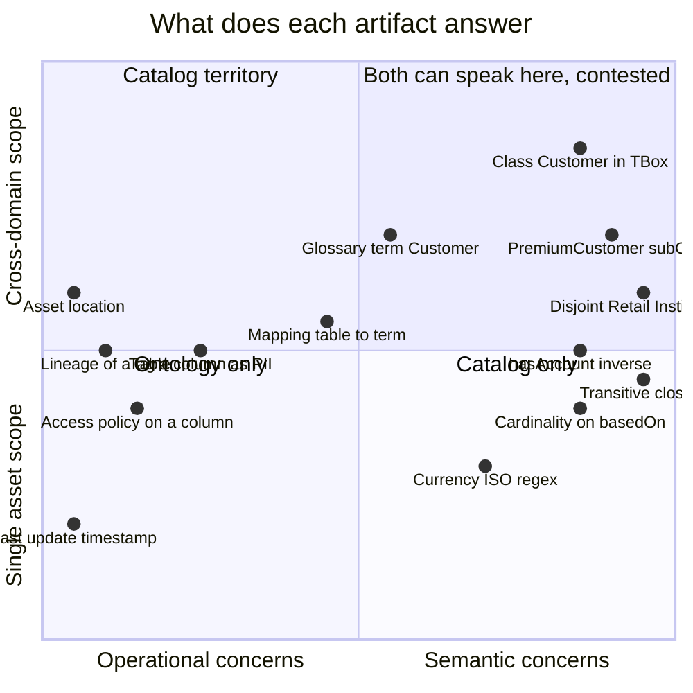
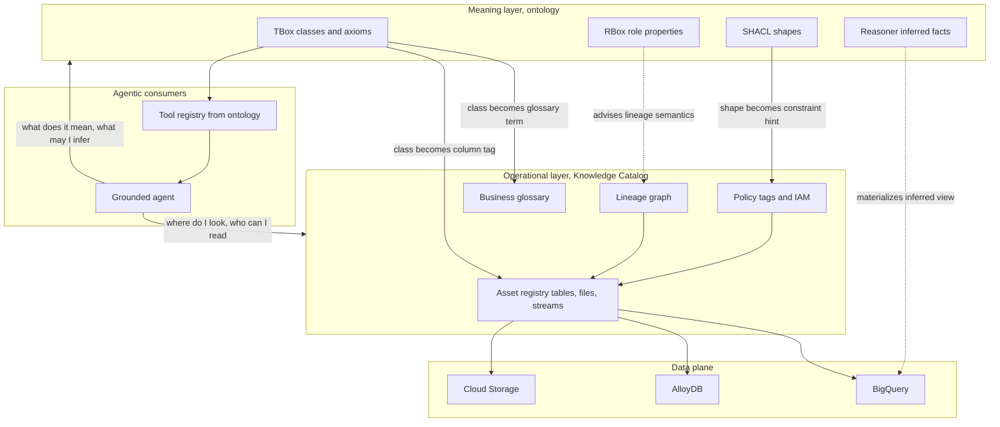
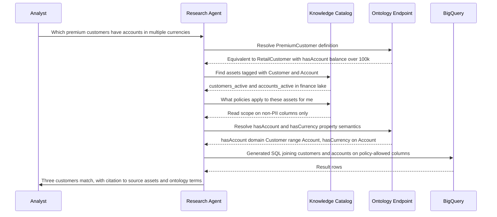
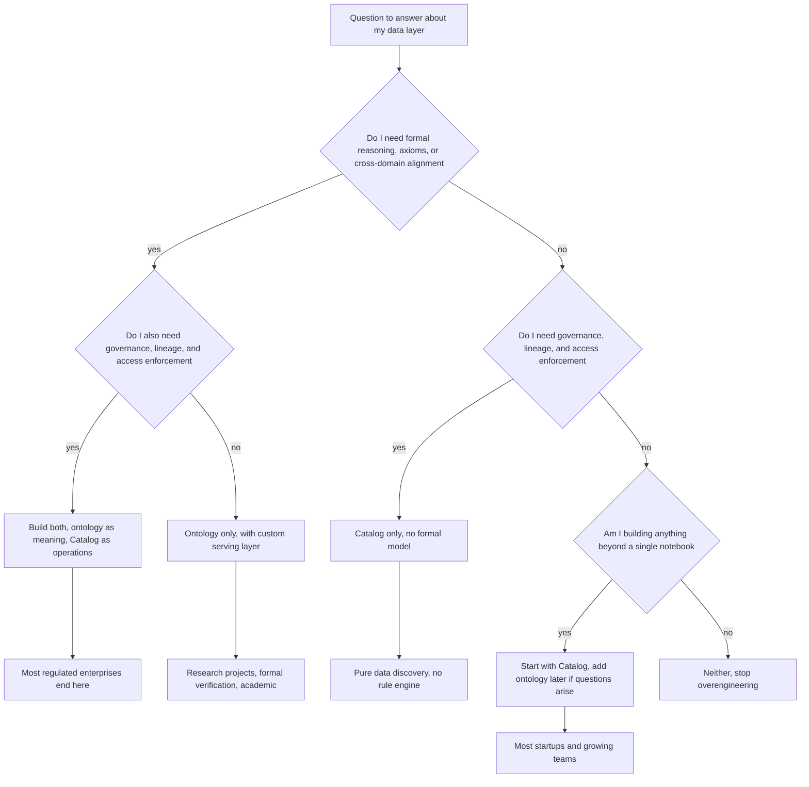

# Knowledge Catalog vs Ontologies: A Confluence, Not a Replacement

We promised, at the end of the previous post, that we would put these two side by side. The promise has been overdue for several thousand words across this arc. A team I sat with last spring spent ninety minutes arguing about whether to fund a new enterprise ontology now that "the Catalog handles all that." Half the team had read the Knowledge Catalog launch blog and concluded the ontology project was redundant. The other half had spent two years building the ontology and could not articulate, on the spot, why the Catalog was not a replacement. The meeting ended without a decision.

The meeting ended without a decision because the question was wrong. Knowledge Catalog and ontologies do not compete. They answer overlapping but genuinely different questions. A mature enterprise knowledge layer typically needs both, with a clear interface between them, and the most expensive failure mode in this space is letting one silently take over the other's responsibilities until you discover, six months later, that you have neither a defensible semantic model nor a trustworthy asset registry. This post is about that distinction, drawn carefully enough that the next ninety-minute meeting on this topic in your organization can end in twenty.

## The Series So Far

Across the previous three posts in this arc we covered the operational primitives the modern agentic stack requires: the [agent guardrails field guide](https://juanlara18.github.io/portfolio/#/blog/agent-guardrails-field-guide) for what to enforce around any production agent; the [Google Cloud Next 2026 agent-native stack](https://juanlara18.github.io/portfolio/#/blog/google-cloud-next-2026-agent-native-stack) for what Google launched and what to actually adopt; and the Gemini Enterprise plus Knowledge Catalog deep dive for the data primitives the platform now exposes to agents. This is the closing piece, the one that braids the Catalog thread back into the long-running ontology thread the blog has been pulling on for nearly a year.

## Two Different Questions

Strip every word of marketing off both products and you get to the kernel of what each one actually does.

A **domain ontology** answers a question about *meaning*. What is a Customer in our company. What relationships connect a Customer to an Account, a Product to a Regulation, a Transaction to a Branch. Which of those relationships are functional, which are transitive, which imply membership in another class. Given a set of facts and a set of axioms, what new facts must logically follow. The ontology is a formal, declarative theory of the domain. Its native tool is logic.

A **Knowledge Catalog** answers a question about *operations*. Where does our data physically live. What does each asset contain. Who owns it. What lineage produced it. Which agents and humans are allowed to read it, under what conditions. What business glossary terms are attached to which assets. Given an agent that needs to ground a question in real data, which assets are relevant and which can it actually reach. The Catalog is an asset registry plus a governance plane plus an access control plane. Its native tool is metadata.

These two questions overlap at exactly one place: both can attach a description to a thing. An ontology says "a Customer is a natural or legal person who holds a relationship with the bank, characterized by these attributes and relationships." A Catalog says "the `customers_active` BigQuery table contains rows representing customers, joined to the business term Customer in the glossary, owned by the CRM team, last updated forty seven minutes ago, accessible to agents in this project under this IAM scope." Both sentences mention "customer." Only one of them is a definition.

The rest of the time, the questions diverge. The ontology has nothing to say about access policies. The Catalog has nothing to say about what `equivalentClass` means or how a reasoner derives that a `PremiumCustomer` is a `RetailCustomer`. The ontology cannot tell you whether the table backing the `Customer` instances is fresh or stale. The Catalog cannot tell you whether two facts in the data are logically inconsistent under the schema's axioms.

The cleanest mental picture I have for the relationship is the one in the header. A river is the meaning layer; another river is the operational layer; they meet at a confluence and continue downstream as a single, navigable system. Neither river is the other. Neither replaces the other. The water from each is identifiable inside the merged flow if you know where to look. And the confluence is the most interesting point on the map, because that is where the architecture actually lives.

## Side-by-Side Comparison

Here is the long table. I have used this table in three architecture reviews in the last six months and watched it land every time. Print it out, tape it to a wall, point at it when the next person tells you the Catalog has made the ontology obsolete.

| Dimension | Domain Ontology (OWL/RDF, TBox/ABox) | Knowledge Catalog (Google Dataplex Universal Catalog era) |
|---|---|---|
| Primary question | What do these things mean and how do they relate | Where does our data live and how do we reach it safely |
| Representation language | OWL 2, RDF, RDFS, SHACL, Turtle | Catalog-native asset records plus business glossary plus tags |
| Formal semantics | Description Logic, model-theoretic; full inference | None. Descriptive metadata, not formal logic |
| Inference and reasoning | HermiT, Pellet, ELK; deductive closure over axioms | None. Search, lineage traversal, policy resolution |
| Schema vs instance distinction | TBox for terminology; ABox for assertions; RBox for relations | Asset schemas plus instance records; lineage over assets |
| Governance enforcement | Out of scope; an ontology is descriptive, not enforcing | First-class: IAM, Data Loss Prevention, lineage policies, masked views |
| Access policies | Cannot express access control natively | Native, integrated with Cloud IAM and DLP |
| Glossary management | Implicit in class and property names plus rdfs comments | First-class business glossary with term governance |
| Lineage | None natively; provenance via PROV-O if you choose | First-class, populated from BigQuery, Dataflow, Dataform, GCS |
| Vendor coupling | None. W3C standards portable across triple stores | Strong. The Catalog is a Google Cloud product |
| Change management | Slow. Schema releases on weeks-to-months cadence | Continuous. Asset metadata refreshes from pipelines |
| Tooling maturity | Forty plus years of academic and industrial tooling | Five plus years as Dataplex and now consolidated as Knowledge Catalog |
| Agent readiness | Requires careful translation into tools or prompt context | Designed to be queried directly by agents, with grounding hooks |
| Audit story | What you build on top of your triple store | Native Cloud Audit Logs for every read, write, and policy decision |
| Cost to build | High. Domain workshops, expert curation, tooling | Lower. Auto-populated from existing assets and pipelines |
| Cost to operate | Moderate. Reasoner runs, SHACL validation in CI | Pay-per-asset and pay-per-read; managed by Google |
| Time to first useful answer | Months. The first ontology release is the milestone | Days. Onboard a project and the Catalog populates itself |
| Failure mode | Drift between schema and data when nobody runs the reasoner | Confidently mislabeled assets when nobody curates the glossary |
| What dies if you skip it | Cross-domain coherence and reasoning over rules | Discoverability, governance, lineage, agent grounding |

Two patterns are worth pointing out before we leave the table. The ontology row that says *cost to build, high* is almost always cited as a reason to skip the ontology entirely, and that is the single most expensive shortcut in this space. The high cost buys you a thing the Catalog cannot give you regardless of price: a formal, vendor-portable, deductively closed model of your domain. The Catalog row that says *vendor coupling, strong* is almost always cited as a reason to roll your own catalog, and that is also a mistake. You are not going to build lineage from BigQuery, Dataflow, and Dataform yourself, not in the budget that gives you a real outcome inside two years.

The two rows that matter most in practice are *change management* and *failure mode*. They tell you why the two things have to be separated even when they cooperate.

## Where They Overlap

Both can give an agent a controlled vocabulary. Both can answer "what is a Customer in our company" at the level of a sentence. Both can act as grounding context for a retrieval call. The overlap is real, and it is exactly the surface where the marketing for the Catalog is most likely to convince you that the ontology is unnecessary.

Mermaid does not natively render Venn diagrams, but a quadrant chart laid out by the kind of question the artifact answers makes the overlap visible. The northeast quadrant is the contested ground. Most concepts sit cleanly in one of the other three.



The plot makes one thing immediate. The right hand side, the deep-semantic side, is where ontologies are not optional. The left-bottom corner, the per-asset operational corner, is where the Catalog is irreplaceable. The contested quadrant in the upper middle is where most teams either fail to choose or, worse, choose both badly.

A more direct way to see the overlap is to ask of every concept in your knowledge layer: would I want a reasoner to derive new facts about this, or would I want lineage and policy attached to it? If the answer is the first, it belongs in the ontology side. If the answer is the second, it belongs in the Catalog side. If the answer is both, you are looking at a concept that needs to live in both with a clear synchronization arrow between them.

## Where Ontologies Remain Irreplaceable

The first three years of every "we have a Catalog now, do we still need the ontology" debate I have seen end with the answer: yes, you still need the ontology, because the things the ontology gives you cannot be replaced.

**Formal reasoning.** A reasoner over an OWL ontology will tell you, given the axioms `PremiumCustomer ≡ RetailCustomer ∧ ∃hasAccount.(balance ≥ 100_000)` and `RetailCustomer ⊓ InstitutionalCustomer ≡ ⊥`, that no instance can be classified as both a `PremiumCustomer` and an `InstitutionalCustomer` without rendering the entire knowledge base inconsistent. The Catalog will not tell you that. It cannot tell you that. It does not have a notion of inconsistency. It has a notion of "this asset has these tags."

**Axiomatization and contradiction detection.** When two domain experts independently model their corner of the business and the resulting axioms are mutually inconsistent, a reasoner will surface that the moment the two ontologies are merged. The Catalog will happily list both definitions in the glossary and let downstream consumers pick one. The contradiction surfaces in production, in a query that returns the wrong thing for a regulator.

**Transitive closure and role hierarchies.** If your ontology says `hasSubsidiary` is transitive, asking for "all subsidiaries of company X" returns the closure across arbitrary depth. The Catalog has no concept of role hierarchies; whatever closure you want over its lineage graph you implement yourself.

**OWL DL inference.** Cardinality constraints, disjointness, equivalence under restrictions, property characteristics. Each of these is a tool for encoding business logic so precisely that the system can verify the data conforms to the rules without anyone writing a custom validator. The Catalog has tags and policies. It does not have axioms.

**Cross-domain alignment.** If your bank merges with another bank, both with their own ontologies, the W3C standards give you a vocabulary for declaring `acme:Customer owl:equivalentClass beta:Client` and pulling the two domain models into a coherent merged view. The Catalogs of the two banks have no standard for declaring equivalence; they have asset-level mappings you wire up by hand.

**Decades of standards.** The W3C published RDF in 1999, OWL in 2004, OWL 2 in 2009, SHACL in 2017. The OBO Foundry has been coordinating biomedical ontologies since 2007. FIBO has been the financial industry's reference ontology since 2010. The body of accumulated knowledge — books, papers, tools, reasoners, validators, methodologies — is enormous and portable across vendors. The Catalog is one vendor's product, on its own roadmap, with its own pricing.

The summary, sharper than I should probably write it: if your problem genuinely needs deduction from rules, no Catalog will substitute. The Catalog is built on a relational and graph database under the hood, and it can answer many questions about your data. It cannot reason. Reasoning is the ontology's job.

A small SPARQL example for a question only the ontology answers:

```sparql
# Which clients are inferred to be PremiumCustomers under the
# ontology's axioms, given their actual account balances? The
# answer comes from the reasoner classifying instances under
# the equivalentClass restriction; no metadata system can do this.
PREFIX bnk: <http://bank.example.com/ontology/banking#>
PREFIX rdf: <http://www.w3.org/1999/02/22-rdf-syntax-ns#>

SELECT ?client ?taxId WHERE {
  ?client rdf:type bnk:PremiumCustomer .
  ?client bnk:taxId ?taxId .
}
ORDER BY ?taxId
```

That query asks for instances of a class that is *defined by an axiom*. The reasoner materializes the membership. The query is one line of SPARQL. The capability behind it is forty years of description logic.

## Where Knowledge Catalog Is Genuinely Better

Now the other side, told just as honestly.

**Lineage from production pipelines.** When a BigQuery view is created from a Dataflow job that reads from three Cloud Storage buckets and a Pub/Sub topic, the Catalog records that lineage automatically. No human curates it. No PROV-O triples are minted. The lineage graph is alive, accurate, and queryable. An ontology, no matter how lovingly built, has nothing equivalent. You could build it, but you would be reinventing what the Catalog already has, on a budget that will never let you finish.

**Live access policies.** When a column is tagged as PII, the Catalog enforces masking on read for principals without the right scope. The ontology cannot enforce policy; it is a descriptive artifact, not an active control plane. If you want access enforcement on top of an ontology you build it yourself, typically as a thin layer above your triple store, and you are responsible for proving to your auditors that it works.

**Agent identity integration.** When an agent authenticates as a first-class principal and queries the Catalog, the Catalog knows which assets the agent is allowed to see, which terms it is allowed to resolve, and what the audit trail looks like for that decision. The ontology has no notion of agent identity. The Catalog was built into a stack where agents are the primary tenant.

**Cost of building and maintaining.** A serious enterprise ontology — for a bank, an insurer, a healthcare system — is a multi-quarter investment with a small team of trained ontology engineers. The Catalog populates itself from the existing infrastructure on day one. Over the lifetime of the system, the maintenance cost of an ontology is genuinely high; the maintenance cost of a Catalog mostly tracks the size of the underlying infrastructure rather than the size of the conceptual model.

**Time to grounded agent.** A team that turns the Catalog on for its project today can have an agent grounded against real assets, with policy enforcement and lineage attribution, within a week. A team that starts the ontology from scratch is months from the first useful run. The Catalog wins on velocity by an order of magnitude.

A pseudocode sketch of an asset lookup against the Catalog, hedged because the SDK shapes are still solidifying as of mid-2026:

```python
# catalog_lookup.py
# Hedge: Knowledge Catalog SDK shapes are evolving; treat client
# class names and method signatures here as illustrative. The
# semantic shape is stable: ask the catalog what it knows about
# a thing, and get back a record with lineage, policy, and tags.
from google.cloud.dataplex_v2 import KnowledgeCatalogClient

client = KnowledgeCatalogClient()

# Look up an asset by its canonical resource name. The result
# bundles schema, lineage, policy tags, and any glossary terms
# attached to columns. Every call is audit-logged automatically.
asset = client.get_asset(
    name="projects/kb-prod/locations/us-central1/"
         "lakes/finance/zones/curated/assets/customers_active",
)

print(f"Owner: {asset.owners}")
print(f"Last refreshed at: {asset.last_modified_time}")
for column in asset.schema.columns:
    glossary_terms = [t.term for t in column.glossary_terms]
    policy_tags = [t.display_name for t in column.policy_tags]
    print(f"{column.name}: terms={glossary_terms} policies={policy_tags}")

# A separate call asks the lineage graph what produced this asset.
lineage = client.get_lineage(target=asset.name, depth=3)
for edge in lineage.edges:
    print(f"{edge.source} -> {edge.target} via {edge.process}")
```

That snippet is operationally critical and conceptually impossible inside an ontology. The ontology can describe what a `Customer` is. It cannot tell you which specific BigQuery table the bank uses to store customer rows, who owns it, when it was last refreshed, or whether the agent calling it is allowed to read the unmasked email column. The Catalog can. That is the asymmetry.

## The Honest Hybrid: A Reference Architecture

The architecture that actually works in practice — that I have either shipped or sat very close to people who have shipped — is the one in the diagram below. The ontology lives as the meaning layer. The Catalog lives as the operational layer. The arrow runs from the ontology into the Catalog: concepts in the ontology become glossary terms in the Catalog, classes become asset tags, and the Catalog references the ontology by IRI rather than copying the definition. The reverse arrow does not exist. The Catalog does not push asset metadata back into the ontology, because the ontology should not depend on what tables happen to exist.



The key observation, the one most often missed, is that the ontology and the Catalog cooperate at exactly two seams. The first seam is the *glossary mapping*: every class in the ontology that the business cares about ends up as a business glossary term in the Catalog, with a stable IRI as its canonical identifier. The second seam is the *tag mapping*: columns in BigQuery tables get tagged with the ontology class they instantiate. Those are the only two artifacts that need to be kept in sync. Everything else in each layer is independent, and the independence is the point.

A glossary mapping in YAML, of the kind we discussed in the [ontology production pipeline post](https://juanlara18.github.io/portfolio/#/blog/ontology-production-pipeline-gcp), is the thing your CI emits when the ontology compiles:

```yaml
# build/glossary-mapping.yaml
# Generated by the ontology compiler. Consumed by a Cloud Build
# step that posts terms to the Knowledge Catalog. The IRI is the
# stable identity; the catalog's term ID is a local index.
namespace: "http://bank.example.com/ontology/banking#"
version: "2.3.0"
terms:
  - iri: "http://bank.example.com/ontology/banking#Customer"
    display_name: "Customer"
    description: "Natural or legal person holding a relationship with the bank."
    category: "core"
    governance:
      data_steward: "team-customer-data"
  - iri: "http://bank.example.com/ontology/banking#PremiumCustomer"
    display_name: "Premium Customer"
    description: "Retail customer with at least one account balance over 100k EUR."
    category: "retail"
    inferred_by: "reasoner"
    parent_iri: "http://bank.example.com/ontology/banking#RetailCustomer"
  - iri: "http://bank.example.com/ontology/banking#Account"
    display_name: "Account"
    description: "Ledger of transactions under a product, owned by a Customer."
    category: "core"
```

And the Python that pushes it, hedging on the SDK:

```python
# publish_glossary.py
# Pushes ontology classes into the Knowledge Catalog as business
# glossary terms. The IRI is the join key both sides agree on.
import yaml
from google.cloud.dataplex_v2 import KnowledgeCatalogClient

client = KnowledgeCatalogClient()
GLOSSARY = "projects/kb-prod/locations/us-central1/glossaries/banking"

with open("build/glossary-mapping.yaml", encoding="utf-8") as f:
    mapping = yaml.safe_load(f)

for term in mapping["terms"]:
    client.upsert_glossary_term(
        parent=GLOSSARY,
        term_id=term["iri"].rsplit("#", 1)[1].lower(),
        body={
            "display_name": term["display_name"],
            "description": term["description"],
            "category": term["category"],
            # The ontology IRI is recorded as the canonical identity.
            "external_identity": term["iri"],
            "ontology_version": mapping["version"],
        },
    )
```

The dance is one-directional. The ontology compiles, the glossary publishes, and from that point downstream consumers can ask the Catalog "what is a Customer" and get an answer that is a Catalog term, but whose source of truth is the ontology IRI. If you ever need to know what the term *means*, you follow the IRI back to the ontology. If you need to know *where to find data about it*, you stay in the Catalog and traverse to the assets tagged with the term.

## How an Agent Query Traverses Both

The interaction sequence is the clearest way to see the cooperation. Picture an analyst asking a research agent: "Which premium customers have accounts denominated in more than one currency?" The agent does not know which BigQuery tables hold customers, or what `PremiumCustomer` means, or whether the analyst is even allowed to see customer email addresses. It needs both layers to answer responsibly.



Two arrows in that sequence are load-bearing. The agent calls the ontology endpoint to learn what `PremiumCustomer` *means*. The agent calls the Catalog to learn where the data *lives* and what it is *allowed to read*. Neither layer can answer the other layer's question. Both arrows have to fire for the agent to produce a defensible answer.

Designing an agent so it asks meaning questions of the ontology and operational questions of the Catalog, and never the reverse, is the single most important architectural discipline in this space.

## Anti-Patterns

Five anti-patterns dominate the failures I have personally seen or had described to me by close colleagues. They map closely onto the failure modes of the comparison table.

**Anti-pattern one: trying to do reasoning inside the Catalog.** Teams discover that the Catalog has tags, that tags can be hierarchical, and that you can attach arbitrary policy on top. They start encoding business rules as elaborate tag taxonomies. Six months later they have a tag tree four levels deep that nobody understands, that does not cleanly map to any class hierarchy, and that fails the moment a rule needs to depend on a value rather than a label. The Catalog is not a reasoner. Stop trying.

**Anti-pattern two: trying to enforce access in the ontology.** Teams add OWL annotations like `accessibleBy: "team-retail"` to classes and properties, and write a custom validator that refuses to serve triples to principals outside the named team. The validator becomes a parallel access-control system, divergent from the IAM the rest of the company uses. Audit asks "who has access to customer data" and gets two different answers from two different systems. Stop. Enforce access in the Catalog, where it belongs.

**Anti-pattern three: maintaining a glossary in two places without a single source of truth.** Two glossaries, one in the ontology's `rdfs:comment` strings and another in the Catalog's business glossary, edited independently by different teams. Every six months a regulator asks the bank to define `Customer` and the bank produces two different definitions from two different systems, and the project to reconcile them takes a quarter. The single source of truth is the ontology. The Catalog reads from it, not the other way round.

**Anti-pattern four: using OWL/RDF when flat tags would suffice — or using flat tags when you actually need OWL inference.** This is the symmetric mistake. Teams that overuse OWL to model a glossary that has no axioms, no subsumption, and no inferred facts pay the cost of OWL with none of the benefit; a Schema.org-style flat tag model would do the job. Teams that use flat tags to model what is genuinely a deductive theory — financial product hierarchies, regulatory rule chains, drug interaction graphs — discover that they cannot answer questions that require reasoning, and they end up either adding ad hoc rule code or accepting wrong answers.

**Anti-pattern five: letting the Catalog become the de facto schema.** This is the slow-motion failure. The team turns on the Catalog. The Catalog populates itself from existing tables. The auto-generated tags are sort-of okay. People start building agents against the Catalog. The ontology, which was not yet finished, is deprioritized. A year later the Catalog has eight thousand assets, twelve hundred glossary terms, and zero formal definitions; the ontology has six classes in a Turtle file nobody has touched in eleven months. The bank now has an enormous metadata footprint and no formal model of its own domain. The reasoning capability is gone. The cross-domain alignment story is gone. The vendor lock-in is total. This is the most expensive of the anti-patterns, and it is also the one that feels most like progress while it is happening.

A summary table of the anti-patterns and their cures:

| Anti-pattern | What you are actually doing | Cure |
|---|---|---|
| Reasoning inside the Catalog | Encoding rules as tag taxonomies | Move axioms into the ontology, keep tags shallow |
| Enforcement in the ontology | Building a parallel access control plane | Enforce access in the Catalog, period |
| Two-place glossary | Editing definitions in two systems | Make the ontology the source, Catalog reads it |
| Wrong tool for the model | Flat where deduction is needed, OWL where flat is enough | Map the model to the question, not to the technology |
| Catalog as de facto schema | Replacing meaning with metadata | Fund the ontology project; do not skip it |

## A Decision Tree

When does a team genuinely need each artifact, and when do they need both. The flowchart below condenses three years of architecture-review meetings into the only set of questions that have actually mattered.



The honest answer for almost every regulated enterprise — banks, insurers, healthcare systems, pharmaceutical companies, government — is the leftmost path: both. The honest answer for most startups is the second from the right: start with the Catalog, add the ontology when the questions you cannot answer with metadata become painful enough to fund the project. The honest answer for a personal blog is the rightmost path: stop. The middle paths are real but rare; *ontology only* is academic and *catalog only* is appropriate when no part of your domain has rule-based semantics worth reasoning over, which is rarer than people think.

## What About Google's Underlying Knowledge Graph

A subtle question deserves its own section, because it comes up in every architecture meeting after the third one. Google has a knowledge graph. It is the thing that powers Search, Assistant, and the various surfaces that need entity-level semantic understanding. Knowledge Catalog sits on top of internal data structures that are graph-shaped, and parts of the public Knowledge Catalog API expose graph traversal primitives. So is Google's underlying knowledge graph an ontology by another name? Does it substitute for the domain ontology you might otherwise build?

No, on both counts.

The graph beneath the Catalog is *structural metadata*, not domain semantics. It records that this asset has these columns; that this column has this lineage; that this principal has this scope; that this glossary term is attached to this column. None of those edges are axiomatic in the description-logic sense. They are facts about facts. They do not let you derive new facts about the world; they let you navigate the asset registry as a graph rather than a flat list.

Google's other knowledge graph — the public-web one that grounds Search — is a domain ontology of sorts, in the loose sense that it has a schema (largely Schema.org) and millions of entities. It is not your domain ontology. It does not know what your bank means by `PremiumCustomer`. It cannot reason over your bank's product hierarchy. It has no axioms about your business rules. Even if you could plug into it, it would not answer the questions a domain ontology answers, because the domain it covers is a different domain.

The trap, which I have watched serious engineers fall into, is the assumption that the Catalog's graph plus Google's public graph somehow equals an enterprise ontology. They do not. They sum to "a structural metadata graph plus a general-purpose web entity graph." Neither of those is a formal model of your bank's domain, and combining them does not produce one. If you need an ontology, you still have to build the ontology.

There is a related confusion worth naming. Some Catalog implementations expose a *semantic graph* feature, where business terms can be related by user-defined predicates — `hasParent`, `synonymOf`, `relatedTo`, `composedOf`. That graph looks ontology-shaped, and teams sometimes treat it as one. It is not. The predicates are not axiomatic; they are tags on edges. There is no reasoner. There is no model theory. There is no way to ask "given these axioms and these instances, what must necessarily be true." The Catalog's term graph is genuinely useful for navigation, search, and surfacing related concepts in a UI. It is genuinely insufficient as a substitute for an ontology, and the gap shows up the first time you ask a question that requires deduction rather than navigation. Treat the term graph as what it is: a richer-than-flat metadata tagging system. Do not promote it in your architecture diagrams to "the ontology."

A short query against the Catalog's graph, for contrast with the SPARQL example earlier:

```python
# This traverses the Catalog's structural graph from a glossary
# term out to the assets it tags. The graph is real, but it is
# operational, not semantic. It cannot answer 'is a PremiumCustomer
# also a RetailCustomer'; it can answer 'which assets are tagged
# with PremiumCustomer'. Different question.
results = client.traverse(
    start=("glossary_term",
           "projects/kb-prod/.../glossaries/banking/terms/customer"),
    edges=["taggedAssets", "lineageDownstream"],
    max_depth=2,
)
for node in results:
    print(f"{node.kind} {node.name}")
```

That is a navigation query. It is useful. It is not inference. The line stays drawn.

## A Practical Takeaway for Regulated Domains

If you are reading this from a financial institution, a hospital, an insurer, or a regulator, the practical answer is unambiguous. You need both layers, with a clear interface between them, and you should structure the work so you do not pretend you can skip either one.

Start the ontology for the regulated domain. The slice of your business where the rules are explicit, written down, audited, and consequential — products, customer concepts, regulatory entities, compliance taxonomies — is exactly the slice where formal modelling pays for itself. The ontology does not have to cover every concept in your bank to be valuable; it has to cover the concepts where the cost of being wrong is regulatory or legal. That is a small, bounded, high-stakes vocabulary, and a serious team can deliver a useful first release in a quarter.

Let the Catalog handle the governance, the lineage, the access plumbing, and the agent-grounding. Do not build a parallel asset registry. Do not invent a custom lineage system. Do not write your own access policy enforcer. Use what the Catalog gives you, configure it carefully, and treat its guarantees as the operational floor of your knowledge layer.

Put a clear interface between them. The interface is the glossary mapping plus the column-level tag mapping, both generated from the ontology compiler in CI, both pushed into the Catalog by an automated step, both versioned alongside the ontology release. The interface is small enough to fit in a YAML file. Put it under version control. Make a single team responsible for it. Treat changes to the interface as TBox-equivalent changes — slow cadence, careful review, full integration tests.

A final summary table, the kind I print and put in front of a director who has thirty seconds:

| Need | Use |
|---|---|
| Formal definitions of business concepts | Ontology |
| Reasoning over rules, classification, contradiction detection | Ontology |
| Cross-domain alignment with another organization | Ontology |
| Discovery of where data lives | Catalog |
| Lineage from production pipelines | Catalog |
| Access policies with audit | Catalog |
| Agent grounding against real assets | Catalog |
| Agent reasoning about meaning | Ontology, exposed via tools or context |
| Glossary terms in business apps | Catalog, sourced from ontology |
| Tag a column as PII | Catalog |
| Subsumption hierarchy for products | Ontology, mirrored as glossary |
| Versioned semantic releases | Ontology, propagated to Catalog |

There is one more practical observation worth recording. Most banks do not have one ontology; they have several, organized along the lines covered in the [modular ontologies post](https://juanlara18.github.io/portfolio/#/blog/modular-ontologies-core-domains-pattern) — a small core, ringed by domain modules. The Catalog interface complicates this slightly. A glossary in the Catalog is typically organized as one taxonomy with categories, not as a multi-module orbit. You publish one merged glossary per project, not one glossary per ontology module. The compiler step that emits the glossary mapping has to flatten the modular ontology into a single namespace of terms, while preserving the IRI of each term so the meaning layer remains modular even though the operational projection is flat. That is a small adapter, but missing it causes problems on day one of the integration: terms collide, categories blur, ownership becomes ambiguous. Spec the adapter early.

A second observation, on TBox/ABox separation, draws on the [TBox/ABox post](https://juanlara18.github.io/portfolio/#/blog/tbox-abox-schema-facts-distinction) earlier in this series. The Catalog is naturally TBox-ish at the glossary level — a term is schema, not data — but it is also naturally ABox-ish at the asset level — a `customers_active` table is an instance of the `Customer` concept, not a class. The cleanest mental model is that the Catalog's glossary terms align with TBox concepts in the ontology, and the Catalog's asset records align with ABox-instance metadata, and the column-level tags are where the two meet. Once you draw that alignment, the Catalog's structure stops looking ontology-shaped and starts looking metadata-shaped, which is what it actually is. The mismatch most teams stumble on is treating the glossary as if it were a TBox, expecting it to support reasoning, and being disappointed when it does not. The glossary mirrors the TBox; it is not the TBox.

## Wrapping the Arc

Across the four posts in this arc we covered, in sequence:

- **What to enforce around any production agent**, from the [agent guardrails field guide](https://juanlara18.github.io/portfolio/#/blog/agent-guardrails-field-guide) — the controls without which no other layer matters.
- **What Google launched at Cloud Next 2026 and what to actually adopt**, from the [agent-native stack walkthrough](https://juanlara18.github.io/portfolio/#/blog/google-cloud-next-2026-agent-native-stack) — the new platform components and where the marketing got ahead of the maturity.
- **What Gemini Enterprise plus Knowledge Catalog look like up close**, the data primitives the platform now exposes to agents, the lineage and policy story, the interface points where the Catalog meets the rest of the agentic data cloud.
- **How those primitives compose with the ontology work the blog has been pulling on for the better part of a year**, this post — the side-by-side, the overlaps, the substitutions, the anti-patterns, the honest hybrid.

What is still open, and what I owe a future post on, includes: the ontology-to-glossary CI pipeline in production detail, with a real demonstration repository; the cost of hybrid operation across both layers, with numbers from a real workload rather than vendor claims; the migration path from a vendor catalog product to a self-hosted alternative if the lock-in becomes painful; the role of property graphs (Neo4j, Spanner Graph) as a third layer that some teams add between the ontology and the Catalog; and the harder question of how regulators will eventually treat agent-driven decisions whose grounding draws from both layers.

For now, the rule of thumb that fits on an index card is the one I started with. The Catalog and the ontology are not competitors. They are answers to overlapping but different questions. A mature knowledge layer needs both, with a clear arrow from the ontology into the Catalog, and the most expensive failure mode is letting either one quietly take over the other's job. Draw the arrow. Hold the line. Ship both.

## Going Deeper

**Books:**

- Baader, F., Calvanese, D., McGuinness, D. L., Nardi, D., & Patel-Schneider, P. F. (Eds.). (2007). *The Description Logic Handbook: Theory, Implementation, and Applications* (2nd ed.). Cambridge University Press.
  - The canonical reference for the formal semantics behind OWL. The chapters on TBox, ABox, RBox, and reasoning are exactly the capabilities the Catalog cannot give you and the ontology must.
- Allemang, D., Hendler, J., & Gandon, F. (2020). *Semantic Web for the Working Ontologist: Effective Modeling for Linked Data, RDFS, and OWL* (3rd ed.). ACM Books.
  - The most practical book on building ontologies with RDF and OWL. Read the SHACL chapters before you negotiate your interface with any operational catalog.
- Arp, R., Smith, B., & Spear, A. D. (2015). *Building Ontologies with Basic Formal Ontology.* MIT Press.
  - The methodology book. Worth reading even if you never use BFO, because it argues for the discipline of separating ontological commitment from implementation, which is exactly the discipline this post argues for between meaning and operations.
- Hogan, A., Blomqvist, E., Cochez, M., et al. (2021). *Knowledge Graphs.* Morgan & Claypool. Also available on arXiv as 2003.02320.
  - Survey-shaped, covers the interaction between ontologies and the surrounding metadata, lineage, and machine-learning ecosystems. The chapters on quality and governance dovetail with the Catalog side of this post.
- Loshin, D. (2009). *Master Data Management.* Morgan Kaufmann.
  - The data-management classic that pre-dates the agentic-AI vocabulary but covers the registry, lineage, governance, and ownership concerns that the modern Knowledge Catalog inherits. If the Catalog feels like new ideas, this book will reframe them as old ideas with new packaging.

**Online Resources:**

- [W3C OWL 2 Web Ontology Language Document Overview (Second Edition)](https://www.w3.org/TR/owl2-overview/) — The authoritative starting point for the formal semantics this post invokes whenever the word "reasoning" appears.
- [W3C SHACL: Shapes Constraint Language](https://www.w3.org/TR/shacl/) — The validation specification that sits at the meaning-versus-operations seam. Most of the production ontology work in this arc references SHACL.
- [Google Cloud Dataplex Universal Catalog documentation](https://cloud.google.com/dataplex/docs/introduction) — The product page and reference for the Catalog component referenced here as "Knowledge Catalog." The product naming is in flux; the underlying capabilities are stable.
- [Apache Iceberg specification](https://iceberg.apache.org/spec/) — Background for the cross-cloud lakehouse layer that sits beneath the Catalog and is a prerequisite for understanding how zero-copy federation interacts with the Catalog's lineage graph.
- [FIBO: Financial Industry Business Ontology](https://spec.edmcouncil.org/fibo/) — The reference example of a real, large, modular enterprise ontology. The single best counter-evidence against the claim that "the Catalog has made ontologies obsolete."

**Videos:**

- [Knowledge Graphs and Graph Databases Explained](https://youtu.be/p4W56HYaO_s) — A clear introduction to where ontologies, knowledge graphs, and metadata catalogs sit relative to one another. The first ten minutes are the most useful for orienting newcomers to the distinction.
- [Ontologies in Neo4j: Semantics and Knowledge Graphs](https://neo4j.com/videos/ontologies-in-neo4j-semantics-and-knowledge-graphs-jesus-barrasa/) by Jesús Barrasa — A working demonstration of how an OWL ontology lands in a property-graph world while keeping the schema and operational concerns separate. The same instinct as this post, in a different stack.

**Academic Papers:**

- Gruber, T. (1993). ["A Translation Approach to Portable Ontology Specifications."](https://tomgruber.org/writing/ontolingua-kaj-1993.pdf) *Knowledge Acquisition*, 5(2), 199–220.
  - The paper that gave the field its working definition of an ontology. Worth reading in 2027 for the same reason it was worth reading in 1993: it draws the line between ontological commitment and implementation, which is the line this post argues you must hold.
- Patel-Schneider, P. F., & Horrocks, I. (2007). ["A Comparison of Two Modelling Paradigms in the Semantic Web."](https://doi.org/10.1016/j.websem.2006.10.005) *Journal of Web Semantics*, 5(4), 240–250.
  - Direct treatment of the modelling-paradigm distinctions that show up here as "reasoning lives in the ontology, governance lives in the Catalog." A useful sharpening of the intuition.
- Hogan, A., Blomqvist, E., Cochez, M., et al. (2020). ["Knowledge Graphs."](https://arxiv.org/abs/2003.02320) arXiv:2003.02320.
  - The survey article whose book version is in the Books list. The sections on metadata, provenance, and quality assessment are particularly relevant to the Catalog side of the architecture discussed here.

**Questions to Explore:**

- If the Catalog becomes the de facto identity layer for assets across an enterprise, but the ontology remains the de facto identity layer for concepts, how do you express that a regulator's concept (say "client of record under directive X") maps to a moving target of assets over time? What is the right artifact for that mapping, and which side of the architecture owns it?
- W3C OWL is open-world; SHACL is closed-world; the Catalog's policy engine is closed-world but operational rather than semantic. When an agent's question requires reasoning across all three, where does the contradiction surface, and which layer is responsible for catching it?
- If two organizations with their own ontologies and their own Catalogs need to merge their knowledge layers — say a bank acquisition — does the merger happen at the ontology layer (alignment) or the Catalog layer (asset reconciliation), and how do you design the transition so neither layer breaks during the handover?
- The Catalog's lineage graph is populated automatically from production pipelines. The ontology's TBox is curated by humans on a slow cadence. Is there a defensible architecture in which the ontology itself is partially populated from the Catalog's lineage — for example, deriving subsumption candidates from observed schema evolution — without violating the discipline argued for in this post?
- A regulator asks: "Show me the chain of evidence that justifies how this agent's decision used customer data." The evidence spans the ontology (definitions, rules), the Catalog (assets, lineage, policy), and the agent's run trace (which calls hit which layer). What is the minimum viable cross-layer audit artifact, and who in the organization is accountable for producing it?
