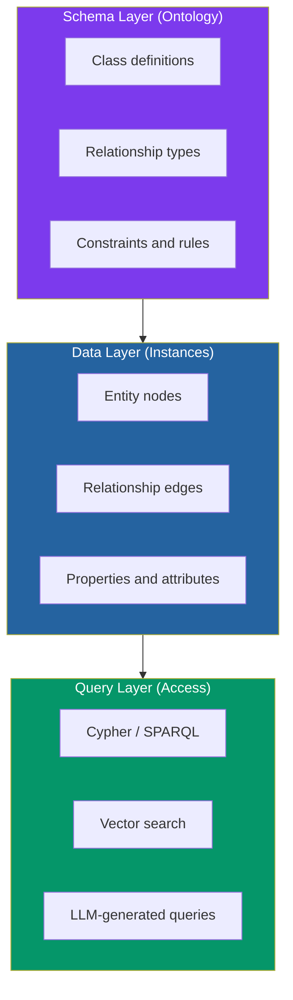
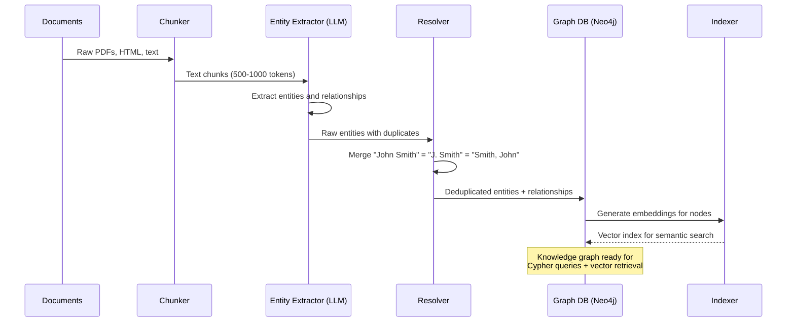
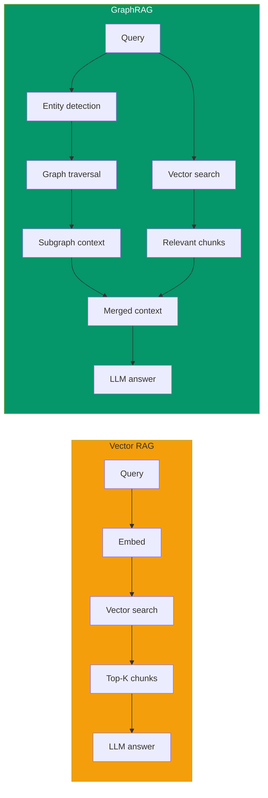
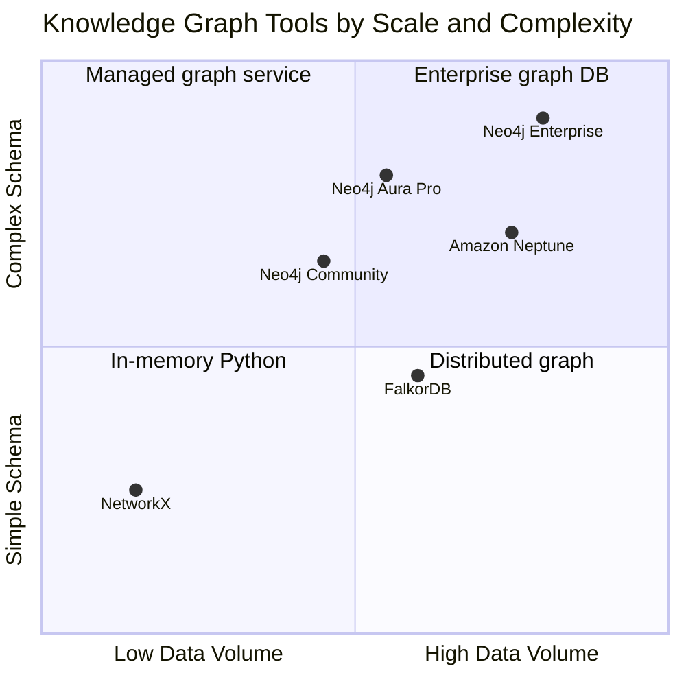

# Knowledge Graphs in Practice: From Documents to Queryable Intelligence

If you've read the [ontologies post](/blog/ontologies-building-knowledge-bases) in this blog, you know what an ontology is: a formal specification of the concepts, relationships, and rules that define a domain. If you've read the [enterprise knowledge bases post](/blog/enterprise-knowledge-bases), you know *why* structured knowledge matters at scale. But there's a gap between "here's a beautifully designed ontology in Protégé" and "here's a system that answers questions about 50,000 documents." That gap is the knowledge graph.

A knowledge graph is what happens when you populate an ontology with real data — millions of entities, relationships, and properties extracted from documents, databases, and APIs. It's the difference between a city's zoning plan and the city itself: the plan tells you where buildings can go; the knowledge graph *is* the buildings, the streets, the plumbing, and the people inside.

And in 2026, the construction process has changed fundamentally. What once required months of manual annotation by domain experts can now be accomplished in days using LLMs for entity extraction. The `neo4j-graphrag` Python package (v1.14.1, March 2026) lets you go from a pile of PDFs to a queryable knowledge graph in under 100 lines of code. Microsoft's GraphRAG has matured from a $33K proof-of-concept to a production system with 90% cost reductions. And 40% of organizations now query knowledge graphs as part of their RAG pipelines, up from near zero two years ago.

This post is the practitioner's guide. We'll build a knowledge graph from scratch, query it, connect it to a RAG pipeline, and confront the gotchas that tutorials conveniently skip.

## What a Knowledge Graph Actually Is

Before we build one, let's be precise about what we're building. The term "knowledge graph" gets thrown around loosely — sometimes meaning a property graph in Neo4j, sometimes an RDF triplestore, sometimes just "a database with relationships." Here's the taxonomy:

| Concept | Structure | Query Language | Best For |
|---------|-----------|---------------|----------|
| **Relational database** | Tables, rows, foreign keys | SQL | Structured, predictable data |
| **Document store** | JSON/BSON documents | MongoDB queries | Semi-structured, nested data |
| **Graph database** | Nodes and edges | Cypher, Gremlin | Relationship-heavy data, traversals |
| **RDF triplestore** | Subject-predicate-object triples | SPARQL | Semantic web, ontology reasoning |
| **Knowledge graph** | Entities + typed relationships + ontology | Cypher or SPARQL | Structured knowledge with inference |

A knowledge graph is a graph database *plus* a semantic layer. The semantic layer — whether it's a formal OWL ontology or a lightweight schema — defines what *types* of entities exist, what relationships are valid between them, and what constraints apply. Without that layer, you have a property graph. With it, you have a knowledge graph.

The following diagram shows the three layers that compose a knowledge graph:



### The Property Graph Model

Most production knowledge graphs use the **property graph model** (as opposed to RDF triples). In a property graph:

- **Nodes** represent entities. Each node has one or more labels (types) and key-value properties. Example: `(:Company {name: "Acme Corp", founded: 2019})`.
- **Relationships** connect nodes. Each relationship has a type and direction, and can carry properties too. Example: `(:Person)-[:WORKS_AT {since: 2020}]->(:Company)`.
- **Properties** are key-value pairs attached to nodes or relationships. They store attributes — names, dates, scores, descriptions.

This model is intuitive because it maps directly to how we think about domains: *things* (nodes) connected by *relationships* (edges) with *attributes* (properties). The schema layer (ontology) sits on top, defining which labels, relationship types, and constraints are valid.

### Knowledge Graphs in the Wild

Knowledge graphs aren't theoretical — they're the backbone of products you use daily:

- **Google Knowledge Graph** — 500+ billion facts, powers the info panels in search results
- **Amazon Product Graph** — connects products, reviews, categories, and purchasing patterns for recommendation
- **LinkedIn Knowledge Graph** — maps professionals, companies, skills, and job openings across 1 billion members
- **Wikidata** — 100+ million structured items, the open knowledge graph behind Wikipedia infoboxes

In enterprise settings, adoption reached 27% in late 2025, with finance, healthcare, and manufacturing leading. The organizations that do adopt report 300-320% ROI — mostly from improved search accuracy, regulatory compliance automation, and cross-silo data integration.

## The Construction Pipeline

Building a knowledge graph from unstructured documents follows a five-stage pipeline. Each stage has multiple approaches — from fully manual to fully automated — with predictable trade-offs in quality, cost, and speed.



**Stage 1: Document ingestion** — Load PDFs, HTML pages, text files. Extract clean text. Handle tables, headers, metadata.

**Stage 2: Chunking** — Split documents into LLM-digestible pieces (500-1,000 tokens). Overlap between chunks prevents entity mentions from being split mid-sentence.

**Stage 3: Entity and relationship extraction** — The core step. An LLM reads each chunk and outputs structured entities (nodes) and relationships (edges). This is where quality and cost are determined.

**Stage 4: Entity resolution** — The deduplication problem. "IBM," "International Business Machines," and "IBM Corp." are the same entity. Resolution can be rule-based (string similarity), embedding-based (cosine similarity on entity names), or LLM-assisted.

**Stage 5: Graph construction and indexing** — Write the deduplicated entities and relationships to Neo4j. Generate vector embeddings for node properties to enable semantic search alongside structured queries.

## Prerequisites and Environment

### What You Need

- **Python 3.10+**
- **Neo4j** — either Neo4j Aura (free tier: 50,000 nodes, 175,000 relationships, no credit card) or a local instance via Docker
- **An LLM API key** — OpenAI, Google Vertex AI, or any provider supported by neo4j-graphrag
- **No GPU required** — all computation happens via API calls and graph operations

### Installation

```bash
pip install neo4j-graphrag==1.14.1 neo4j==5.28.1 openai==1.82.0
```

For local Neo4j (alternative to Aura):

```bash
docker run -d --name neo4j \
  -p 7474:7474 -p 7687:7687 \
  -e NEO4J_AUTH=neo4j/your-password \
  -e NEO4J_PLUGINS='["apoc"]' \
  neo4j:2026.01.4-community
```

### Where to Run

| Environment | Cost | Notes |
|------------|------|-------|
| **Neo4j Aura Free** | $0 | 50K nodes, 175K relationships. No time limit. Best for learning and prototyping. |
| **Local Docker** | $0 | Unlimited size. Requires local machine with 2GB+ RAM for Neo4j. |
| **Neo4j Aura Professional** | ~$65/month | Production-ready. Automated backups, monitoring. |
| **Google Colab + Aura Free** | $0 | Run Python in Colab, connect to Aura. Good for experimentation without local setup. |

Start with Aura Free or local Docker. Move to Aura Professional when you need persistence, backups, and team access.

## Building a Knowledge Graph From Documents

Let's build a knowledge graph from a set of documents. We'll use the `neo4j-graphrag` package, which provides `SimpleKGPipeline` — a high-level abstraction that handles chunking, extraction, resolution, and writing in a single call.

### Step 1: Define the Schema

Before extracting anything, define the entity types and relationship types your graph should contain. This is where the ontology work from the [previous post](/blog/ontologies-building-knowledge-bases) pays off — you're not guessing at categories, you're implementing a design.

```python
# Schema definition — the types of entities and relationships to extract
NODE_TYPES = [
    {"label": "Company", "description": "A business organization or corporation"},
    {"label": "Person", "description": "An individual human being"},
    {"label": "Product", "description": "A product, service, or offering"},
    {"label": "Technology", "description": "A technology, framework, or tool"},
    {"label": "Regulation", "description": "A law, regulation, or compliance standard"},
]

RELATIONSHIP_TYPES = [
    {"label": "WORKS_AT", "description": "A person works at a company"},
    {"label": "DEVELOPS", "description": "A company or person develops a product or technology"},
    {"label": "COMPETES_WITH", "description": "Two companies or products compete"},
    {"label": "REGULATED_BY", "description": "A company or product is regulated by a standard"},
    {"label": "USES", "description": "A company or product uses a technology"},
    {"label": "PARTNERS_WITH", "description": "Two companies have a partnership"},
]

# Valid relationship patterns — constrain which entities can connect
PATTERNS = [
    ("Person", "WORKS_AT", "Company"),
    ("Company", "DEVELOPS", "Product"),
    ("Company", "DEVELOPS", "Technology"),
    ("Company", "COMPETES_WITH", "Company"),
    ("Product", "COMPETES_WITH", "Product"),
    ("Company", "REGULATED_BY", "Regulation"),
    ("Product", "REGULATED_BY", "Regulation"),
    ("Company", "USES", "Technology"),
    ("Product", "USES", "Technology"),
    ("Company", "PARTNERS_WITH", "Company"),
]
```

The schema descriptions matter — they guide the LLM during extraction. A vague description like "Thing" produces vague entities. A specific description like "A law, regulation, or compliance standard" produces targeted, useful nodes.

### Step 2: Initialize the Pipeline

```python
import asyncio
from neo4j import GraphDatabase
from neo4j_graphrag.embeddings.openai import OpenAIEmbeddings
from neo4j_graphrag.llm import OpenAILLM
from neo4j_graphrag.experimental.pipeline.kg_builder import SimpleKGPipeline

# Connect to Neo4j (Aura or local)
NEO4J_URI = "neo4j+s://xxxxx.databases.neo4j.io"  # Aura
NEO4J_USER = "neo4j"
NEO4J_PASSWORD = "your-password"

driver = GraphDatabase.driver(NEO4J_URI, auth=(NEO4J_USER, NEO4J_PASSWORD))

# Initialize LLM and embedder
llm = OpenAILLM(
    model_name="gpt-4o",  # or any model with structured output support
    model_params={"temperature": 0, "response_format": {"type": "json_object"}},
)

embedder = OpenAIEmbeddings(model="text-embedding-3-small")

# Build the pipeline
kg_pipeline = SimpleKGPipeline(
    llm=llm,
    driver=driver,
    embedder=embedder,
    entities=NODE_TYPES,
    relations=RELATIONSHIP_TYPES,
    potential_schema=PATTERNS,
    from_pdf=False,  # we'll pass text directly
)
```

### Step 3: Feed Documents and Build the Graph

```python
# Example documents (in production, load from files or a document store)
documents = [
    """
    Acme Corp, founded by Jane Rodriguez in 2019, develops CloudSync,
    an enterprise data synchronization platform. CloudSync uses Apache Kafka
    for event streaming and is deployed on Google Cloud Platform. The company
    recently partnered with DataFlow Inc to integrate real-time analytics.
    Acme Corp competes with SyncTech in the enterprise middleware space.
    Both companies are regulated by SOC 2 compliance standards.
    """,
    """
    DataFlow Inc, led by CTO Marcus Chen, specializes in real-time data
    pipelines. Their flagship product, StreamEngine, uses Apache Flink
    for stream processing. Marcus Chen previously worked at Google where
    he contributed to the Dataflow service. DataFlow Inc is regulated by
    GDPR for its European operations.
    """,
]


async def build_graph():
    for i, doc in enumerate(documents):
        print(f"Processing document {i + 1}/{len(documents)}...")
        result = await kg_pipeline.run_async(text=doc)
        print(f"  Extracted {result.result.get('node_count', 0)} nodes, "
              f"{result.result.get('relationship_count', 0)} relationships")


asyncio.run(build_graph())
```

Each document makes one or more LLM calls. For the two short documents above, expect ~$0.01-0.02 in API costs. For a 10,000-document corpus, budget $50-200 depending on document length and model choice.

### Step 4: Verify the Graph

After construction, verify the graph in Neo4j Browser (http://localhost:7474 for local, or Aura console for cloud):

```cypher
// Count all nodes and relationships
MATCH (n) RETURN count(n) AS nodes;
MATCH ()-[r]->() RETURN count(r) AS relationships;

// See all entity types
MATCH (n) RETURN DISTINCT labels(n) AS types, count(n) AS count;

// See all relationship types
MATCH ()-[r]->() RETURN DISTINCT type(r) AS rel_type, count(r) AS count;
```

## Querying With Cypher

Cypher is Neo4j's query language — a pattern-matching language that reads like ASCII art. Nodes are `()`, relationships are `-->`, and properties are `{}`. If you know SQL, Cypher will feel familiar but more expressive for graph traversals.

### Basic Patterns

```cypher
// Find all companies and what they develop
MATCH (c:Company)-[:DEVELOPS]->(p)
RETURN c.name AS company, labels(p)[0] AS type, p.name AS product;

// Find a person and their company
MATCH (p:Person)-[:WORKS_AT]->(c:Company)
RETURN p.name AS person, c.name AS company;

// Find competitors
MATCH (a:Company)-[:COMPETES_WITH]->(b:Company)
RETURN a.name AS company_a, b.name AS company_b;
```

### Multi-Hop Traversals

This is where knowledge graphs shine — questions that require traversing multiple relationships:

```cypher
// Which technologies are used by companies that compete with Acme Corp?
MATCH (acme:Company {name: "Acme Corp"})-[:COMPETES_WITH]-(competitor:Company)
MATCH (competitor)-[:DEVELOPS]->(product)-[:USES]->(tech:Technology)
RETURN competitor.name AS competitor,
       product.name AS product,
       tech.name AS technology;

// Find all regulations that apply to companies using Apache Kafka
MATCH (c:Company)-[:USES|DEVELOPS*1..2]->(:Technology {name: "Apache Kafka"})
MATCH (c)-[:REGULATED_BY]->(r:Regulation)
RETURN DISTINCT c.name AS company, r.name AS regulation;
```

### Aggregation and Analytics

```cypher
// Most connected entities (degree centrality)
MATCH (n)
WITH n, size([(n)--() | 1]) AS degree
RETURN labels(n)[0] AS type, n.name AS entity, degree
ORDER BY degree DESC
LIMIT 10;

// Companies with the most technology dependencies
MATCH (c:Company)-[:USES|DEVELOPS*1..2]->(t:Technology)
RETURN c.name AS company, count(DISTINCT t) AS tech_count, 
       collect(DISTINCT t.name) AS technologies
ORDER BY tech_count DESC;
```

### Text-to-Cypher With LLMs

For non-technical users, you can generate Cypher queries from natural language using an LLM:

```python
from neo4j_graphrag.generation import GraphRAG
from neo4j_graphrag.retrievers import Text2CypherRetriever

# Create a Text-to-Cypher retriever
retriever = Text2CypherRetriever(
    driver=driver,
    llm=llm,
    neo4j_schema=None,  # auto-detects from the database
)

# Ask a question in natural language
result = retriever.search(query_text="Which companies use Apache Kafka?")
print(result.items)
```

The LLM generates a Cypher query from the natural language question, executes it against the graph, and returns structured results. This is the bridge that makes knowledge graphs accessible to business users.

## LLM-Powered Entity Extraction: The Quality-Cost Trade-off

The extraction step determines the quality of everything downstream. Let's be honest about the trade-offs.

### What Works Well

LLM extraction excels at:
- **Named entity recognition**: People, companies, products — 89-92% precision and recall in recent benchmarks.
- **Explicit relationships**: "Jane works at Acme" → `(Jane)-[:WORKS_AT]->(Acme)`. Direct statements are extracted reliably.
- **Schema-guided extraction**: When you provide entity and relationship types (as we did above), the LLM stays focused on what matters.

### What Doesn't Work Well

- **Implicit relationships**: "After leaving Google, Marcus founded DataFlow" — the LLM may miss the implicit `PREVIOUSLY_WORKED_AT` relationship.
- **Coreference resolution**: "The company" in paragraph 3 refers to which company? LLMs handle this within a chunk but struggle across chunk boundaries.
- **Numeric precision**: Dates, financial figures, and measurements are frequently mangled. Always validate numeric properties post-extraction.
- **Consistency across documents**: The same entity might be extracted as "Apache Kafka," "Kafka," and "kafka" from different documents. Entity resolution is essential.

### Cost Estimation

| Corpus Size | Documents | Estimated API Cost | Time (gpt-4o) |
|------------|-----------|-------------------|---------------|
| Small | 100 docs | $1-5 | 5-10 min |
| Medium | 1,000 docs | $10-50 | 30-60 min |
| Large | 10,000 docs | $50-200 | 4-8 hours |
| Enterprise | 100,000 docs | $500-2,000 | 2-5 days |

**Cost reduction strategies:**
- **Tiered extraction**: Use a cheaper model (GPT-4o-mini, Claude Haiku) for initial extraction, then a stronger model for validation passes on uncertain entities. This cuts costs by 60-70% with minimal quality loss.
- **Batch deduplication**: Extract in batches and deduplicate between batches to avoid redundant LLM calls on entities already in the graph.
- **Aggressive caching**: Cache extraction results keyed by document hash. If a document hasn't changed, skip re-extraction entirely.
- **Schema-guided filtering**: The tighter your schema (fewer entity types, stricter relationship patterns), the fewer tokens the LLM needs to process and the less noise enters the graph. A focused schema with 5 entity types outperforms a broad schema with 20 types in both cost and quality.
- **Chunk size tuning**: Larger chunks (1,000 tokens) require fewer LLM calls but may miss fine-grained entities. Smaller chunks (300 tokens) catch more entities but cost more. Experiment to find the sweet spot for your domain — for most corpora, 500-800 tokens works well.

## From Knowledge Graph to GraphRAG

A knowledge graph sitting in Neo4j is useful for structured queries. But the real power comes when you combine it with LLM-powered retrieval — GraphRAG.

The evolution from standard RAG to GraphRAG follows a clear progression:



**Vector RAG** finds text chunks that are semantically similar to the query. It works for factual questions ("What is our refund policy?") but fails for relational questions ("Which products are available to premium customers in LATAM who hold USD accounts?").

**GraphRAG** adds a graph traversal step: it identifies entities in the query, traverses the knowledge graph to find related entities and relationships, and merges this structured context with vector search results before sending everything to the LLM.

### Implementing GraphRAG With neo4j-graphrag

```python
from neo4j_graphrag.retrievers import HybridCypherRetriever
from neo4j_graphrag.generation import GraphRAG

# Hybrid retriever: combines vector search + graph traversal
retriever = HybridCypherRetriever(
    driver=driver,
    vector_index_name="entity_embeddings",
    fulltext_index_name="entity_fulltext",
    retrieval_query="""
        // Start from the matched node, traverse 2 hops
        MATCH (node)-[r*1..2]-(related)
        WITH node, collect(DISTINCT {
            entity: related.name,
            type: labels(related)[0],
            relationship: type(r[0])
        }) AS context
        RETURN node.name AS name,
               labels(node)[0] AS type,
               node.text AS text,  
               context
    """,
)

# GraphRAG pipeline
rag = GraphRAG(
    retriever=retriever,
    llm=llm,
)

# Ask a question
response = rag.search(
    query_text="What technologies does Acme Corp use and who are their competitors?",
    retriever_config={"top_k": 5},
)
print(response.answer)
```

The `retrieval_query` is the key differentiator. Instead of returning isolated text chunks, it traverses the graph from matched nodes, collecting related entities and relationships. The LLM receives both the raw text and the structured context — entities, types, and relationships — which dramatically reduces hallucinations.

### When GraphRAG Wins (and When It Doesn't)

The decision to use GraphRAG depends on the *type* of questions your users ask. Here's the practical decision framework:

**Use Vector RAG when:**
- Questions are factual and self-contained: "What is our return policy?"
- Answers live in a single document or chunk
- Speed matters more than relationship awareness
- Your corpus is small (under 1,000 documents) — the graph overhead isn't worth it

**Use GraphRAG when:**
- Questions involve relationships: "Which teams are affected by this policy change?"
- Answers require combining information from multiple documents
- You need to trace provenance: "How did we arrive at this conclusion?"
- Your domain has rich interconnections (compliance, supply chain, organizational knowledge)

**Use Hybrid (Vector + Graph) when:**
- User query types vary — some factual, some relational
- You need a fallback: if graph traversal finds nothing, vector search catches it
- You want structured context (from the graph) to ground the LLM's response while vector search provides textual evidence

Most production systems land on hybrid. The graph doesn't replace vector search — it augments it with structured context that the LLM can reason over.

### The Numbers

The performance gap between Vector RAG and GraphRAG is well-documented:

| Metric | Vector RAG | GraphRAG | Improvement |
|--------|-----------|----------|-------------|
| Accuracy (enterprise benchmarks) | 32% | 86% | +168% |
| Hallucination rate | Baseline | -40% (with ontology grounding) | Significant |
| Relational query accuracy | Low | High | Night and day |
| Indexing cost (10K docs) | ~$5 | ~$50-200 | 10-40x higher |
| Query latency | 200-500ms | 500ms-2s | 2-4x slower |

GraphRAG is not universally better. It's specifically better for **relational** and **multi-hop** questions. For simple factual retrieval ("What is X?"), vector RAG is faster, cheaper, and often sufficient. The decision framework: use vector RAG as the baseline, add GraphRAG for use cases where relationship-awareness matters.

### LazyGraphRAG: The Cost-Effective Middle Ground

Microsoft's LazyGraphRAG (2025) offers a compelling alternative: it combines vector similarity search with graph traversal using iterative deepening, achieving answer quality comparable to full GraphRAG at **0.1% of the indexing cost** and **700x lower query costs** for global searches. If your corpus is large but your budget isn't, LazyGraphRAG is worth evaluating before committing to full graph construction.

## Scaling: When to Use What

Not every knowledge graph needs Neo4j. Here's a practical sizing guide:



| Tool | Nodes | Use Case | Cost |
|------|-------|----------|------|
| **NetworkX** (Python) | Under 100K | Prototyping, graph algorithms, analysis. In-memory only, no persistence. | Free |
| **Neo4j Community** (Docker) | Under 1M | Development, small production. Single instance, no clustering. | Free |
| **Neo4j Aura Free** | Under 50K | Learning, prototyping. Managed, no maintenance. | Free |
| **Neo4j Aura Professional** | Under 10M | Production workloads. Managed, backups, monitoring. | ~$65/month |
| **FalkorDB** | Under 5M | Redis-based, ultra-low latency. Good for real-time applications. | Free (self-hosted) |
| **Amazon Neptune** | 10M+ | AWS-native, SPARQL + Gremlin. Enterprise compliance. | Pay-per-use |
| **Neo4j Enterprise** | 100M+ | Full clustering, causal consistency, advanced analytics. | License |

**The honest recommendation:** Start with Neo4j Aura Free for prototyping. Move to Neo4j Community on Docker for development. Graduate to Aura Professional or Enterprise when you need persistence, backups, and team access. Only consider Neptune or distributed options when you're genuinely at tens of millions of nodes.

## Known Gotchas

Save yourself the debugging hours:

- **Entity resolution is the hardest step.** LLM extraction is the flashy part, but deduplication is where quality is won or lost. "IBM," "IBM Corp.," "International Business Machines," and "ibm" should all be one node. The `neo4j-graphrag` package includes basic resolution, but production systems need custom rules plus embedding-based matching.

- **Chunk boundaries break relationships.** If entity A is mentioned in chunk 1 and entity B in chunk 3, and the relationship between them spans chunks 2-3, the LLM may miss it. Overlapping chunks help but don't solve it completely. For critical relationships, consider full-document extraction (expensive but thorough).

- **Graph schema evolution is painful.** Unlike a document store where you can add fields freely, renaming a relationship type in Neo4j requires migrating every edge of that type. Design the schema carefully upfront — the ontology work matters.

- **Neo4j's APOC plugin is almost always needed.** Core Cypher covers 80% of use cases, but for batch imports, date parsing, text functions, and graph algorithms, you'll need the APOC (Awesome Procedures On Cypher) library. Install it from the start.

- **Vector indexes are separate from graph indexes.** Neo4j supports vector indexes (since v5.11), but they're separate from the standard graph indexes. You need both: graph indexes for Cypher queries, vector indexes for semantic search. Configure both during setup, not as an afterthought.

- **LLM extraction costs scale linearly.** Every document requires at least one LLM call. A 100,000-document corpus means 100,000+ API calls. Budget for this, cache aggressively, and use cheaper models for initial passes.

- **The "too many relationships" problem.** Extracting *everything* the LLM finds produces a noisy graph. An entity like "Google" might connect to hundreds of other entities, making traversals slow and results cluttered. The schema constraints (the `PATTERNS` list in our code) exist to prevent this — they tell the LLM *which* relationships to extract, not just *any* relationships.

- **Neo4j Aura Free has limits that bite.** 50,000 nodes sounds like a lot, but a medium-sized document corpus (1,000 documents) can easily produce 20,000-50,000 entities. You'll hit the ceiling faster than expected. Plan your upgrade path before starting.

- **Graph visualization is not graph understanding.** Neo4j Bloom and the Browser produce beautiful visualizations, but a graph with 10,000 nodes rendered on screen is meaningless — it's a hairball. Use Cypher queries for analysis, visualization only for small subgraphs (under 200 nodes).

## The Knowledge Graph Maintenance Problem

Building the graph is the easy part. *Keeping it accurate* is the hard part. Documents change, entities evolve, relationships expire. A knowledge graph that was correct in January drifts by March.

The maintenance loop requires:

1. **Change detection** — monitor source documents for updates. When a document changes, flag its entities and relationships for re-extraction.
2. **Incremental re-extraction** — don't rebuild the whole graph. Extract entities only from changed documents, then merge changes into the existing graph.
3. **Stale relationship pruning** — if a source document is deleted or superseded, the relationships it produced should be marked as stale or removed.
4. **Coverage monitoring** — track what percentage of your corpus is represented in the graph. A drop means new documents aren't being ingested.

In practice, most teams run the extraction pipeline on a schedule — daily or weekly — against changed documents only. Full rebuilds from scratch are reserved for major schema changes, ontology revisions, or significant data source migrations.

## Testing Your Knowledge Graph

A knowledge graph you can't verify is a liability, not an asset. Run these checks after construction:

```cypher
// Check for orphan nodes (no relationships)
MATCH (n) WHERE NOT (n)--() 
RETURN labels(n)[0] AS type, count(n) AS orphans;

// Check for duplicate entities (potential resolution failures)
MATCH (n) 
WITH labels(n)[0] AS type, toLower(n.name) AS normalized, collect(n) AS nodes
WHERE size(nodes) > 1
RETURN type, normalized, size(nodes) AS duplicates
ORDER BY duplicates DESC;

// Validate relationship patterns match schema
MATCH (a)-[r]->(b)
WITH labels(a)[0] AS from_type, type(r) AS rel, labels(b)[0] AS to_type, count(*) AS cnt
RETURN from_type, rel, to_type, cnt
ORDER BY cnt DESC;

// Check graph connectivity — what percentage of nodes are reachable from any starting node?
MATCH (n)
WITH count(n) AS total
MATCH (start) WHERE NOT ()-[]->(start) // root nodes
WITH start, total LIMIT 1
CALL apoc.path.subgraphNodes(start, {maxLevel: 10}) YIELD node
RETURN count(node) * 100.0 / total AS reachable_pct;
```

If orphans exceed 10%, your extraction is missing relationships. If duplicates are high, entity resolution needs tuning. If reachable percentage is low, the graph is fragmented — you may have multiple disconnected components that need bridging entities.

## Going Deeper

**Books:**
- Robinson, I. & Webber, J. (2015). *Graph Databases: New Opportunities for Connected Data.* O'Reilly, 2nd edition.
  - The definitive introduction to property graphs and Neo4j. Covers data modeling, Cypher, and use cases. Still relevant despite the 2015 date — the fundamentals haven't changed.
- Allemang, D., Hendler, J., & Gandon, F. (2020). *Semantic Web for the Working Ontologist.* ACM Press, 3rd edition.
  - If you want the RDF/SPARQL perspective rather than property graphs. Covers how ontologies and knowledge graphs intersect in the semantic web stack.
- Barrasa, J., Hodler, A., & Webber, J. (2021). *Knowledge Graphs: Data in Context for Responsive Businesses.* O'Reilly.
  - Practical guide to building knowledge graphs with Neo4j. Covers the construction pipeline, NLP extraction, and enterprise deployment.
- Hogan, A. et al. (2021). *Knowledge Graphs.* Springer.
  - Academic comprehensive reference — creation, enrichment, quality assessment, and applications. 370 pages of everything you need.

**Online Resources:**
- [Neo4j GraphRAG Python Documentation](https://neo4j.com/docs/neo4j-graphrag-python/current/) — Complete API reference for the `neo4j-graphrag` package used in this post. Includes examples for SimpleKGPipeline, retrievers, and generation.
- [GraphAcademy: Knowledge Graph and GraphRAG Courses](https://graphacademy.neo4j.com/knowledge-graph-rag/) — Free interactive courses from Neo4j covering knowledge graph construction and GraphRAG pipelines.
- [Microsoft GraphRAG](https://www.microsoft.com/en-us/research/project/graphrag/) — Microsoft Research's project page for GraphRAG. Documentation, paper, and open-source code.
- [Cypher Query Language Reference](https://neo4j.com/docs/cypher-manual/current/introduction/) — Official Cypher manual from Neo4j. Essential reference for writing graph queries.

**Videos:**
- [Knowledge Graphs and Graph Databases Explained](https://youtu.be/p4W56HYaO_s) — Clear overview of how knowledge graphs differ from traditional databases and where they fit in modern data architectures.

**Academic Papers:**
- Hogan, A. et al. (2021). ["Knowledge Graphs."](https://arxiv.org/abs/2003.02320) *ACM Computing Surveys*, 54(4).
  - The 70-page survey that defines the field. Covers representation, creation, enrichment, and quality assessment. Essential background reading.
- Edge, D. et al. (2024). ["From Local to Global: A Graph RAG Approach to Query-Focused Summarization."](https://arxiv.org/abs/2404.16130) *arXiv:2404.16130*.
  - The Microsoft paper that introduced GraphRAG. Describes the hierarchical community approach that achieves 86% accuracy on enterprise benchmarks.
- Ristoski, P. et al. (2025). ["Ontology Learning and Knowledge Graph Construction."](https://arxiv.org/abs/2511.05991) *arXiv:2511.05991*.
  - Compares ontology-guided KG construction approaches and their impact on RAG performance. Database-derived ontologies match text-derived ones at lower cost.

**Questions to Explore:**
- If LLM-based entity extraction achieves 90% precision, what happens to the 10% of wrong entities that enter the graph — do they compound into systemic errors through graph traversals?
- As knowledge graphs grow beyond millions of nodes, does the cost of maintaining consistency eventually exceed the value of having structured relationships — and is that the real ceiling on adoption?
- Can knowledge graphs become self-healing — using the same LLMs that built them to detect and correct ontology drift, resolution failures, and stale relationships?
- If LazyGraphRAG achieves comparable quality at 0.1% of the cost, what justifies building a full knowledge graph rather than using on-demand graph construction at query time?
- Is the 27% enterprise adoption rate for knowledge graphs a sign of immaturity or a signal that 73% of organizations genuinely don't need structured relationships for their use cases?
