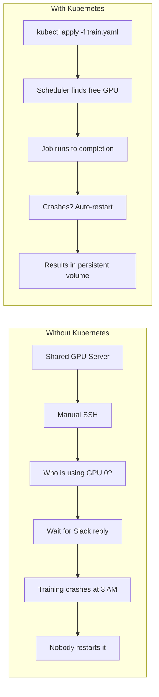
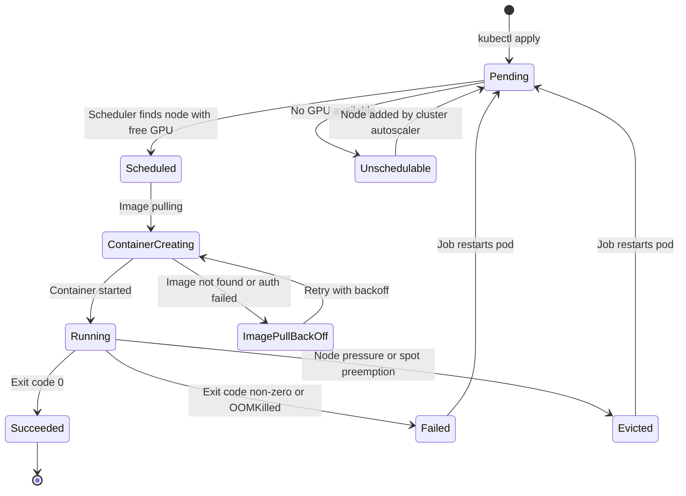
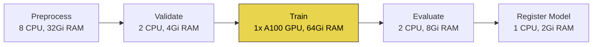
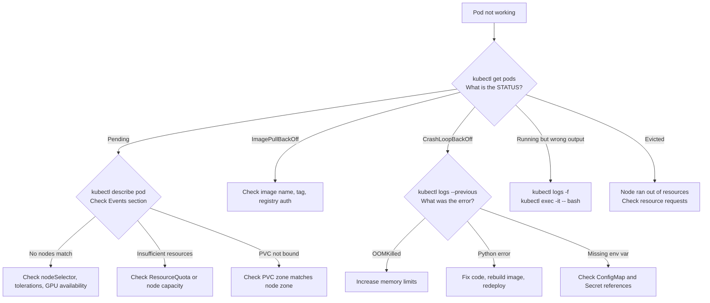

# Kubernetes for ML Engineers: The Minimum Subset You Actually Need

## The "Just Run the Notebook" Tragedy

You have a model that trains in four hours on a single A100. The training script is clean, the Dockerfile is production-grade, the metrics are solid. You push the container to a registry and ask the infrastructure team to run it.

Three days later, nothing has happened. The GPU node is occupied by another team's experiment that has been running for a week. There is no queue. There is no preemption policy. There is no way to know when the GPU will be free. Your colleague suggests you "just run the notebook on your laptop for now."

This is the moment most ML engineers first encounter Kubernetes -- not because they want to learn another tool, but because the alternative is waiting indefinitely for a shared GPU or running production training on a laptop with 8 GB of RAM.

The situation gets worse at scale. Two data scientists sharing one GPU server can coordinate over Slack. Ten data scientists sharing a pool of eight GPUs cannot. At that point, you need a scheduler -- something that accepts work requests, tracks resource availability, queues jobs, handles failures, and enforces fairness. You need, reluctantly, Kubernetes.

The problem is that Kubernetes was designed by infrastructure engineers for infrastructure engineers. The official documentation assumes you care about control planes, etcd consensus, and the inner workings of the kubelet. You do not. You care about three things: training models on GPUs without waiting in line, serving predictions without managing servers, and running pipelines that do not break at 2 AM.

This post covers the subset of Kubernetes that addresses those three concerns. Nothing more. If you have read the companion post on [Docker for ML engineers](/blog/field-notes/docker-for-ml-engineers), you already have the foundation -- containers, images, registries. Kubernetes is what happens when you need to run those containers at scale, on shared infrastructure, with GPUs.

## Prerequisites: Where to Practice

Before touching any YAML, you need a cluster. You have two paths:

**Local development** -- install [minikube](https://minikube.sigs.k8s.io/) or [kind](https://kind.sigs.k8s.io/). Both create a single-node Kubernetes cluster on your laptop. Minikube is simpler; kind (Kubernetes in Docker) is faster and more lightweight. Neither supports real GPU scheduling, but they are perfect for learning the API objects and debugging YAML.

```bash
# Option A: minikube
brew install minikube    # macOS; see docs for Linux/Windows
minikube start --memory 4096 --cpus 4

# Option B: kind
brew install kind
kind create cluster --name ml-sandbox
```

**Cloud clusters** -- for real GPU work, use Google Kubernetes Engine (GKE) or Amazon Elastic Kubernetes Service (EKS). Both provide managed control planes, GPU node pools, and autoscaling. GKE is slightly easier to start with; EKS gives you more control. As of April 2026, both support Kubernetes 1.35 (the current stable release) with 1.34 and 1.33 also under active support.

Either way, you interact with the cluster through a single CLI tool: `kubectl`. Every command in this post uses it.

```bash
# Verify your cluster is reachable
kubectl cluster-info
kubectl get nodes
```

## Why Kubernetes for ML -- Concretely

Skip the sales pitch. Here is what Kubernetes actually solves for an ML engineer:

**GPU sharing without spreadsheets.** Without Kubernetes, GPU allocation is tribal knowledge -- someone maintains a spreadsheet or a Slack channel listing who is using which GPU. Kubernetes treats GPUs as a schedulable resource. You declare `nvidia.com/gpu: 1` in your pod spec, and the scheduler finds a node with a free GPU. No spreadsheet. No waiting for a Slack reply.

**Jobs that retry on failure.** Training runs crash. OOM errors, spot instance evictions, network timeouts. A Kubernetes Job restarts your container automatically. A bare `docker run` on a VM does not.

**Serving without port management.** When you deploy a model as a service, Kubernetes assigns it a stable internal DNS name, load-balances across replicas, and restarts unhealthy containers. You do not manage ports, health checks, or process supervisors.

**Reproducibility through declarative config.** Every resource in Kubernetes is described by a YAML file. That file goes in version control. Six months later, anyone can recreate the exact same deployment by running `kubectl apply -f`.

**Autoscaling that matches demand.** The Horizontal Pod Autoscaler can scale your inference service from 2 replicas to 20 based on CPU, memory, or custom metrics like request latency. When demand drops, it scales back down. You do not write autoscaling logic. You declare a target metric and a range, and Kubernetes handles the rest.

**Isolation between teams.** Namespaces and resource quotas prevent one team's runaway experiment from starving everyone else. Without them, the person who submits the most aggressive job gets all the GPUs, and everyone else waits. With them, each team gets a guaranteed allocation, and the cluster enforces it automatically.



## The 10 Objects You Actually Touch

Kubernetes has hundreds of resource types. You need about ten. Here they are, in order of how often you will use them.

### Pod: The Atomic Unit

A Pod is one or more containers that share a network and storage context. In practice, most of your Pods will contain a single container. Think of a Pod as "one running instance of your Docker image."

You almost never create Pods directly. You create higher-level objects -- Deployments, Jobs -- that create Pods for you. But understanding Pods matters because every debugging command targets them. When you run `kubectl logs`, you are reading a Pod's logs. When you run `kubectl exec`, you are opening a shell in a Pod. When something goes wrong, `kubectl describe pod` is almost always your first move.

```yaml
# You rarely write this directly, but this is what a Pod looks like
apiVersion: v1
kind: Pod
metadata:
  name: test-gpu
  namespace: ml-team
spec:
  containers:
    - name: pytorch-test
      image: pytorch/pytorch:2.6.0-cuda12.6-cudnn9-runtime
      command: ["python", "-c", "import torch; print(torch.cuda.is_available())"]
      resources:
        limits:
          nvidia.com/gpu: 1  # Request one GPU
  restartPolicy: Never
```

### Deployment: For Long-Running Services

A Deployment manages a set of identical Pods and ensures the desired number are always running. If a Pod crashes, the Deployment replaces it. If you update the container image, the Deployment performs a rolling update -- replacing Pods one by one so there is no downtime.

Use Deployments for model serving endpoints, monitoring dashboards, API gateways -- anything that should be running continuously.

```yaml
apiVersion: apps/v1
kind: Deployment
metadata:
  name: sentiment-api
  namespace: ml-team
spec:
  replicas: 3
  selector:
    matchLabels:
      app: sentiment-api
  template:
    metadata:
      labels:
        app: sentiment-api
    spec:
      containers:
        - name: model-server
          image: registry.example.com/sentiment:v2.1.0
          ports:
            - containerPort: 8080
          resources:
            requests:
              cpu: "500m"      # 0.5 CPU cores
              memory: "2Gi"
            limits:
              cpu: "2"
              memory: "4Gi"
          readinessProbe:
            httpGet:
              path: /health
              port: 8080
            initialDelaySeconds: 30
            periodSeconds: 10
```

### Service: Stable Networking

A Service gives a set of Pods a stable IP address and DNS name. Without it, you would need to track individual Pod IPs, which change every time a Pod restarts.

```yaml
apiVersion: v1
kind: Service
metadata:
  name: sentiment-api
  namespace: ml-team
spec:
  selector:
    app: sentiment-api    # Routes to Pods with this label
  ports:
    - port: 80            # External port
      targetPort: 8080    # Container port
  type: ClusterIP         # Internal only; use LoadBalancer for external
```

After applying this, any Pod in the cluster can reach your model at `http://sentiment-api.ml-team.svc.cluster.local`. Kubernetes handles the DNS. You can also use the short form `http://sentiment-api` from within the same namespace, or `http://sentiment-api.ml-team` from a different namespace. The full `.svc.cluster.local` suffix is rarely needed in practice.

Three Service types matter:
- **ClusterIP** (default): internal access only. Use for model-to-model communication or internal APIs.
- **LoadBalancer**: provisions a cloud load balancer with a public IP. Use for exposing a model endpoint externally. Simple but expensive -- one load balancer per Service.
- **NodePort**: exposes the Service on a static port on every node. Rarely used in practice; LoadBalancer or Ingress is almost always better.

### Ingress: External Access

An Ingress exposes Services to the outside world -- mapping domain names and URL paths to internal Services. Think of it as a reverse proxy managed by Kubernetes.

```yaml
apiVersion: networking.k8s.io/v1
kind: Ingress
metadata:
  name: ml-ingress
  namespace: ml-team
  annotations:
    nginx.ingress.kubernetes.io/rewrite-target: /
spec:
  rules:
    - host: ml-api.example.com
      http:
        paths:
          - path: /sentiment
            pathType: Prefix
            backend:
              service:
                name: sentiment-api
                port:
                  number: 80
```

For most ML work, you will not write Ingress resources yourself. Your platform team manages them, or you use a managed load balancer (GKE's Gateway, AWS ALB controller). Know that Ingress exists; do not lose sleep over configuring it.

### PersistentVolumeClaim (PVC): Data That Survives Pod Death

Pods are ephemeral. When a Pod dies, its local filesystem dies with it. PVCs request persistent storage that outlives any individual Pod -- essential for training data, model checkpoints, and experiment logs.

```yaml
apiVersion: v1
kind: PersistentVolumeClaim
metadata:
  name: training-data
  namespace: ml-team
spec:
  accessModes:
    - ReadOnlyMany       # Multiple Pods can read simultaneously
  resources:
    requests:
      storage: 100Gi
  storageClassName: standard-rwo
---
# Using the PVC in a Pod
apiVersion: v1
kind: Pod
metadata:
  name: train-resnet
spec:
  containers:
    - name: trainer
      image: registry.example.com/resnet-trainer:latest
      volumeMounts:
        - mountPath: /data
          name: training-data
        - mountPath: /checkpoints
          name: checkpoints
  volumes:
    - name: training-data
      persistentVolumeClaim:
        claimName: training-data
    - name: checkpoints
      persistentVolumeClaim:
        claimName: model-checkpoints
```

**Critical gotcha:** PVCs are zone-bound on most cloud providers. If your PVC is in `us-central1-a` and your GPU node is in `us-central1-b`, the Pod cannot mount the volume. Always ensure your PVC and GPU node pool are in the same zone, or use a multi-zone storage class.

### ConfigMap and Secret: Configuration Without Rebuilding Images

A ConfigMap stores non-sensitive configuration (hyperparameters, feature flags, endpoint URLs). A Secret stores sensitive data (API keys, database passwords, model registry tokens). Both inject values into your containers as environment variables or mounted files.

```yaml
apiVersion: v1
kind: ConfigMap
metadata:
  name: training-config
  namespace: ml-team
data:
  LEARNING_RATE: "0.001"
  BATCH_SIZE: "64"
  EPOCHS: "50"
  WANDB_PROJECT: "sentiment-v2"
---
apiVersion: v1
kind: Secret
metadata:
  name: api-keys
  namespace: ml-team
type: Opaque
data:
  WANDB_API_KEY: "base64-encoded-key-here"    # echo -n 'key' | base64
  MODEL_REGISTRY_TOKEN: "base64-encoded-token"
---
# Referencing both in a Deployment
spec:
  containers:
    - name: trainer
      envFrom:
        - configMapRef:
            name: training-config
        - secretRef:
            name: api-keys
```

This pattern means you never bake credentials or hyperparameters into your Docker image. Change the ConfigMap, restart the Pod, and the new values take effect. This is a fundamental shift from the "edit the config file on the server" approach -- configuration is versioned, auditable, and separate from the application code.

A common workflow for hyperparameter sweeps: create multiple ConfigMaps (`training-config-lr001`, `training-config-lr0001`), each with different values, and submit separate Jobs referencing each one. This is crude compared to tools like Optuna, but it works for quick A/B comparisons without any additional infrastructure.

**Important caveat about Secrets:** Kubernetes Secrets are base64-encoded, not encrypted. Anyone with read access to the namespace can decode them. For production environments, use a secrets manager (GCP Secret Manager, AWS Secrets Manager, HashiCorp Vault) and inject secrets through a CSI driver or init container. The built-in Secret object is fine for development; it is not a security boundary.

### Job: Run to Completion

A Job runs a container until it succeeds (exits with code 0) or exhausts its retry budget. This is the resource type you will use most for training.

```yaml
apiVersion: batch/v1
kind: Job
metadata:
  name: train-sentiment-v2
  namespace: ml-team
spec:
  backoffLimit: 3            # Retry up to 3 times on failure
  activeDeadlineSeconds: 14400  # Kill after 4 hours
  template:
    spec:
      containers:
        - name: trainer
          image: registry.example.com/sentiment-trainer:v2.1.0
          command: ["python", "train.py"]
          resources:
            limits:
              nvidia.com/gpu: 1
              memory: "32Gi"
            requests:
              cpu: "4"
              memory: "16Gi"
          envFrom:
            - configMapRef:
                name: training-config
            - secretRef:
                name: api-keys
          volumeMounts:
            - mountPath: /data
              name: training-data
            - mountPath: /checkpoints
              name: checkpoints
      volumes:
        - name: training-data
          persistentVolumeClaim:
            claimName: training-data
        - name: checkpoints
          persistentVolumeClaim:
            claimName: model-checkpoints
      restartPolicy: OnFailure
      nodeSelector:
        cloud.google.com/gke-accelerator: nvidia-tesla-a100
```

### CronJob: Scheduled Pipelines

A CronJob creates Jobs on a schedule. Use it for nightly retraining, hourly batch inference, or periodic data preprocessing.

```yaml
apiVersion: batch/v1
kind: CronJob
metadata:
  name: nightly-retrain
  namespace: ml-team
spec:
  schedule: "0 2 * * *"          # 2 AM daily
  concurrencyPolicy: Forbid       # Don't start new if previous still running
  successfulJobsHistoryLimit: 5
  failedJobsHistoryLimit: 3
  jobTemplate:
    spec:
      backoffLimit: 2
      template:
        spec:
          containers:
            - name: retrain
              image: registry.example.com/retrain-pipeline:latest
              resources:
                limits:
                  nvidia.com/gpu: 1
          restartPolicy: OnFailure
```

### HorizontalPodAutoscaler (HPA): Scaling With Demand

The HPA adjusts the number of replicas in a Deployment based on observed metrics. For inference services, this is how you handle traffic spikes without overprovisioning.

```yaml
apiVersion: autoscaling/v2
kind: HorizontalPodAutoscaler
metadata:
  name: sentiment-api-hpa
  namespace: ml-team
spec:
  scaleTargetRef:
    apiVersion: apps/v1
    kind: Deployment
    name: sentiment-api
  minReplicas: 2
  maxReplicas: 20
  metrics:
    - type: Resource
      resource:
        name: cpu
        target:
          type: Utilization
          averageUtilization: 70
```

The HPA checks metrics every 15 seconds (configurable), computes the desired replica count, and scales the Deployment accordingly. For GPU-based inference, you typically use custom metrics (like request queue depth or p99 latency) instead of CPU utilization -- a GPU inference pod can be at 10% CPU utilization while the GPU is saturated at 100%.

The HPA only scales Pods -- it assumes nodes exist to run them. The **cluster autoscaler** is a separate component that handles adding or removing actual nodes when the HPA requests more Pods than the cluster can currently fit. The two work together: HPA says "I need 10 replicas," the cluster autoscaler notices there are only enough nodes for 6, and provisions new nodes to handle the remaining 4. On GKE, the cluster autoscaler is built in. On EKS, most teams now use Karpenter, which is faster and more flexible than the older Cluster Autoscaler component.

### Namespace and ResourceQuota: Team Boundaries

Namespaces partition a cluster into logical units. ResourceQuotas limit how much each namespace can consume. Together, they prevent one team from monopolizing the cluster.

```yaml
apiVersion: v1
kind: Namespace
metadata:
  name: ml-team
---
apiVersion: v1
kind: ResourceQuota
metadata:
  name: ml-team-quota
  namespace: ml-team
spec:
  hard:
    requests.cpu: "32"
    requests.memory: "128Gi"
    limits.cpu: "64"
    limits.memory: "256Gi"
    requests.nvidia.com/gpu: "4"   # Team can use up to 4 GPUs
    persistentvolumeclaims: "10"
```

## GPU Scheduling in Practice

GPU scheduling is where Kubernetes becomes genuinely useful for ML engineers -- and where the most frustrating gotchas hide.

### The Basics: Requesting GPUs

The NVIDIA device plugin (or the more comprehensive NVIDIA GPU Operator) exposes GPUs as the schedulable resource `nvidia.com/gpu`. When you request it in your pod spec, the Kubernetes scheduler finds a node with available GPUs.

```yaml
resources:
  limits:
    nvidia.com/gpu: 1    # Whole GPUs only -- no fractions natively
```

Key constraint: unlike CPU and memory, native GPU requests are whole integers only. You cannot request `0.5` of a GPU through the standard device plugin. This creates an efficiency problem -- an inference workload using 2 GB of a 40 GB A100 wastes 38 GB. This is the single biggest source of GPU waste in Kubernetes clusters, and the industry is actively working on solutions (Dynamic Resource Allocation in Kubernetes 1.34+ aims to support fractional GPU assignments, though it is still maturing).

One more detail: GPUs can only be specified in the `limits` section of a resource spec. You can omit `requests` (Kubernetes will set it equal to the limit), but you cannot request a different number of GPUs than you limit to. This is different from CPU and memory, where requests and limits can diverge.

### Node Selectors and Taints

In a heterogeneous cluster with T4s, A10s, and A100s, you need to ensure your training Job lands on the right GPU type. Node selectors and tolerations handle this.

```yaml
spec:
  nodeSelector:
    cloud.google.com/gke-accelerator: nvidia-tesla-a100
  tolerations:
    - key: nvidia.com/gpu
      operator: Exists
      effect: NoSchedule
```

**GKE gotcha:** GKE automatically applies the taint `nvidia.com/gpu=present:NoSchedule` to GPU node pools. If your pod spec does not include the matching toleration, the pod will remain in `Pending` state indefinitely. The error message does not make this obvious -- it just says "no nodes available."

**EKS gotcha:** EKS does not add GPU taints by default. You need to configure them manually via the node group's launch template or use the `eks.amazonaws.com/nodegroup` label for targeting.

### GPU Sharing: Time-Slicing and MPS

For inference workloads that underutilize GPUs, NVIDIA provides two sharing mechanisms:

**Time-slicing** divides a GPU's time across multiple pods. Configure it through the GPU Operator by defining a ConfigMap:

```yaml
apiVersion: v1
kind: ConfigMap
metadata:
  name: gpu-sharing-config
  namespace: gpu-operator
data:
  any: |-
    version: v1
    sharing:
      timeSlicing:
        resources:
          - name: nvidia.com/gpu
            replicas: 4    # Each physical GPU appears as 4 schedulable units
```

With this config, a node with 2 physical GPUs advertises 8 `nvidia.com/gpu` resources. Each pod gets time-sliced access rather than exclusive ownership.

**Multi-Process Service (MPS)** provides finer-grained sharing with better isolation than time-slicing, particularly useful for inference workloads. MPS allows multiple CUDA processes to share a GPU simultaneously (true concurrency) rather than taking turns (time-slicing). The benefit is lower latency for each workload; the cost is that a crash in one process can affect others sharing the GPU. MPS requires NVIDIA Volta architecture or newer and is less widely supported on managed platforms.

**Which to choose?** Time-slicing is safer and simpler -- start there. MPS is better for latency-sensitive inference workloads where you need multiple small models to share a GPU efficiently. Neither provides memory isolation; a workload that allocates all GPU memory will still starve its neighbors. For true memory isolation, you need Multi-Instance GPU (MIG), which is only available on A100 and H100 GPUs and physically partitions the GPU into independent instances.



## Training with Jobs -- and Argo When Jobs Are Not Enough

### Single-Step Training: Jobs Are Sufficient

For most training runs, a Kubernetes Job is all you need. You specify the container, the GPU resources, the PVC mounts, and the retry policy. The scheduler handles placement, and the Job controller handles restarts.

```bash
# Submit the training job
kubectl apply -f train-sentiment-v2.yaml

# Watch progress
kubectl get jobs -n ml-team -w

# Stream logs from the training pod
kubectl logs -f job/train-sentiment-v2 -n ml-team

# Check GPU utilization on the node (if you have access)
kubectl exec -it train-sentiment-v2-xxxxx -n ml-team -- nvidia-smi
```

Typical output:

```
NAME                  COMPLETIONS   DURATION   AGE
train-sentiment-v2    0/1           2m15s      2m15s

# After completion:
train-sentiment-v2    1/1           3h42m      3h42m
```

### Multi-Step Pipelines: Enter Argo Workflows

Jobs handle single-step tasks. Real ML pipelines have multiple steps with dependencies: download data, preprocess, validate, train, evaluate, register model, deploy. Each step might need different resources -- data preprocessing needs high CPU, training needs GPUs, evaluation needs neither.

Argo Workflows is the standard tool for this. It is a Kubernetes CRD that orchestrates multi-step, containerized workflows as directed acyclic graphs (DAGs).

```yaml
apiVersion: argoproj.io/v1alpha1
kind: Workflow
metadata:
  name: training-pipeline
  namespace: ml-team
spec:
  entrypoint: ml-pipeline
  templates:
    - name: ml-pipeline
      dag:
        tasks:
          - name: preprocess
            template: preprocess-step
          - name: validate
            template: validate-step
            dependencies: [preprocess]
          - name: train
            template: train-step
            dependencies: [validate]
          - name: evaluate
            template: evaluate-step
            dependencies: [train]
          - name: register
            template: register-step
            dependencies: [evaluate]

    - name: preprocess-step
      container:
        image: registry.example.com/preprocess:latest
        command: ["python", "preprocess.py"]
        resources:
          requests:
            cpu: "8"
            memory: "32Gi"

    - name: validate-step
      container:
        image: registry.example.com/validate:latest
        command: ["python", "validate.py"]

    - name: train-step
      container:
        image: registry.example.com/trainer:latest
        command: ["python", "train.py"]
        resources:
          limits:
            nvidia.com/gpu: 1
            memory: "64Gi"
      nodeSelector:
        cloud.google.com/gke-accelerator: nvidia-tesla-a100
      tolerations:
        - key: nvidia.com/gpu
          operator: Exists
          effect: NoSchedule

    - name: evaluate-step
      container:
        image: registry.example.com/evaluate:latest
        command: ["python", "evaluate.py"]

    - name: register-step
      container:
        image: registry.example.com/register:latest
        command: ["python", "register_model.py"]
```



Argo gives you retry logic per step, conditional execution, parameter passing between steps, artifact storage, and a web UI that shows pipeline status. It is to Kubernetes Jobs what Airflow is to cron -- the same underlying idea, with the orchestration layer that makes it manageable at scale.

The key advantage over Airflow for ML workloads: each Argo step runs in its own container on Kubernetes, so you get native GPU scheduling, PVC access, and resource isolation. Airflow can orchestrate Kubernetes Jobs too (via the KubernetesPodOperator), but Argo was designed for this from the start, and the developer experience reflects it. You define workflows in YAML, submit them with `argo submit`, and the Argo controller handles the rest.

For hyperparameter sweeps, Argo's `withItems` and `withParam` constructs let you fan out multiple training runs in parallel, each with different parameters, and collect the results into a single comparison step:

```bash
# Submit a workflow
argo submit training-pipeline.yaml -n ml-team

# Watch progress
argo watch training-pipeline -n ml-team

# List recent workflows
argo list -n ml-team
```

### Distributed Training: Multi-Node Jobs

For models too large to fit on a single GPU, you need distributed training across multiple nodes. Kubernetes does not natively understand distributed training -- it treats each Pod independently. To coordinate multi-node training (PyTorch DistributedDataParallel, DeepSpeed, FSDP), you have a few options:

- **Kubeflow Training Operator (PyTorchJob):** Creates a set of coordinated Pods with the right environment variables (`MASTER_ADDR`, `MASTER_PORT`, `WORLD_SIZE`, `RANK`) pre-configured. This is the most common approach.
- **Volcano Scheduler:** Provides gang scheduling -- ensuring all Pods for a distributed job start simultaneously rather than one at a time. Without gang scheduling, you risk deadlocks where half the Pods are running and waiting for the other half, which cannot start because the running Pods are consuming all available GPUs.
- **Manual coordination:** Set up a headless Service for Pod discovery and pass rank/world-size through environment variables. Works, but brittle.

```yaml
# PyTorchJob example (requires Kubeflow Training Operator)
apiVersion: kubeflow.org/v1
kind: PyTorchJob
metadata:
  name: distributed-training
  namespace: ml-team
spec:
  pytorchReplicaSpecs:
    Master:
      replicas: 1
      template:
        spec:
          containers:
            - name: pytorch
              image: registry.example.com/dist-trainer:latest
              resources:
                limits:
                  nvidia.com/gpu: 1
    Worker:
      replicas: 3
      template:
        spec:
          containers:
            - name: pytorch
              image: registry.example.com/dist-trainer:latest
              resources:
                limits:
                  nvidia.com/gpu: 1
```

This creates 4 Pods (1 master + 3 workers), each with one GPU, and sets up the environment variables so PyTorch's `init_process_group` works without manual configuration.

### When to Use What

| Scenario | Tool | Why |
|----------|------|-----|
| Single training run | Job | Simple, built-in, no extra dependencies |
| Nightly retraining | CronJob | Built-in scheduling, no external orchestrator |
| Multi-step pipeline | Argo Workflow | DAG dependencies, per-step resources, retries |
| Hyperparameter search | Argo + parallel steps | Fan-out multiple training runs, collect results |
| Distributed training | PyTorchJob (Kubeflow) | Gang scheduling, env var setup, multi-node coordination |
| Event-driven pipeline | Argo Events + Workflow | Trigger on new data in GCS/S3, model registry updates |

## Serving with KServe -- or Just a Deployment

### The Simple Path: Deployment + Service

For many inference workloads, a plain Deployment and Service are sufficient. You containerize your model server (FastAPI, Flask, Triton), deploy it, and expose it through a Service. This is the approach to start with.

```yaml
apiVersion: apps/v1
kind: Deployment
metadata:
  name: fraud-detector
  namespace: ml-team
spec:
  replicas: 3
  selector:
    matchLabels:
      app: fraud-detector
  template:
    metadata:
      labels:
        app: fraud-detector
    spec:
      containers:
        - name: model
          image: registry.example.com/fraud-model:v1.3.0
          ports:
            - containerPort: 8080
          resources:
            requests:
              cpu: "2"
              memory: "4Gi"
            limits:
              cpu: "4"
              memory: "8Gi"
          livenessProbe:
            httpGet:
              path: /health
              port: 8080
            initialDelaySeconds: 60
            periodSeconds: 15
          readinessProbe:
            httpGet:
              path: /ready
              port: 8080
            initialDelaySeconds: 30
            periodSeconds: 10
```

This gives you: rolling updates, automatic restarts on crash, load balancing across replicas, and integration with HPA for autoscaling. For many teams, this is enough forever.

### The Advanced Path: KServe

KServe (formerly KFServing, now a CNCF incubating project) adds ML-specific features on top of the Deployment + Service pattern:

- **Scale to zero** -- inference pods shut down when idle and cold-start on the first request. Saves money on underutilized models.
- **Canary rollouts** -- route a percentage of traffic to a new model version before full rollout.
- **Multi-model serving** -- pack multiple models into a single inference server to share GPU memory.
- **Transformer pipelines** -- chain pre/post-processing steps with the model server.
- **Standard inference protocol** -- REST and gRPC APIs following the Open Inference Protocol (V2).

```yaml
apiVersion: serving.kserve.io/v1beta1
kind: InferenceService
metadata:
  name: fraud-detector
  namespace: ml-team
spec:
  predictor:
    model:
      modelFormat:
        name: sklearn
      storageUri: "gs://ml-models/fraud-detector/v1.3.0"
      resources:
        requests:
          cpu: "2"
          memory: "4Gi"
        limits:
          cpu: "4"
          memory: "8Gi"
```

That is the entire spec. KServe handles the Deployment, Service, Ingress, autoscaling, health checks, and readiness gates. You point it at a model artifact in cloud storage, and it creates a serving endpoint.

For LLM serving specifically, KServe now integrates with vLLM and llm-d for optimized performance -- handling KV cache management, continuous batching, and efficient GPU memory utilization out of the box. The `LLMInferenceService` CRD (a newer addition alongside the original `InferenceService`) is purpose-built for generative AI workloads.

The trade-off is complexity. KServe depends on Knative (or the Kubernetes Gateway API), Istio or another service mesh, and cert-manager. Installing and maintaining these components is a platform engineering task. If your organization already has KServe installed, use it -- it is genuinely excellent. If not, start with a plain Deployment and migrate later. The migration path is clean -- your model code does not change, only the Kubernetes manifests that wrap it.

| Feature | Deployment + Service | KServe |
|---------|---------------------|--------|
| Setup complexity | Low | High (requires Knative/Gateway API, mesh) |
| Scale to zero | No | Yes |
| Canary deployments | Manual (two Deployments) | Built-in percentage routing |
| Multi-model serving | Manual | Built-in |
| Model format support | You build the server | Sklearn, XGBoost, PyTorch, TF, ONNX, vLLM |
| GPU support | Yes | Yes, with optimized memory management |
| When to use | Starting out, simple models | Many models, cost-sensitive, need canary |

## Helm Charts: Templated Kubernetes

Before moving to debugging, a brief note on Helm. Helm is the package manager for Kubernetes -- it lets you template YAML files with variables and install complex applications as a single unit.

You will encounter Helm in two contexts:

1. **Installing tools** -- KServe, Argo Workflows, Prometheus, and the NVIDIA GPU Operator are all installed via Helm charts.
2. **Packaging your own deployments** -- once you have more than three YAML files for a single application, Helm templates reduce duplication.

```bash
# Install the NVIDIA GPU Operator via Helm
helm repo add nvidia https://helm.ngc.nvidia.com/nvidia
helm repo update
helm install gpu-operator nvidia/gpu-operator \
  --namespace gpu-operator --create-namespace

# Install Argo Workflows
helm repo add argo https://argoproj.github.io/argo-helm
helm install argo-workflows argo/argo-workflows \
  --namespace argo --create-namespace
```

You do not need to write Helm charts to be productive with Kubernetes. You need to know how to `helm install` and `helm upgrade` the tools your platform depends on. Writing charts is a platform engineering skill -- useful, but not in the minimum subset.

## Debugging: The Commands You Will Use 100 Times a Day

This section is the most practically valuable part of this post. Memorize these.

### The Big Four

```bash
# 1. What is happening right now?
kubectl get pods -n ml-team
# NAME                             READY   STATUS             RESTARTS   AGE
# sentiment-api-7d9f8b6c4d-abc12  1/1     Running            0          2h
# sentiment-api-7d9f8b6c4d-def34  1/1     Running            0          2h
# train-job-xyz99                  0/1     ImagePullBackOff   0          5m

# 2. Why is this pod broken?
kubectl describe pod train-job-xyz99 -n ml-team
# Events:
#   Warning  Failed     2m    kubelet  Failed to pull image "registry.example.com/trainer:v2.1.0":
#                                       unauthorized: authentication required
#   Warning  Failed     2m    kubelet  Error: ImagePullBackOff

# 3. What is my container printing?
kubectl logs train-sentiment-v2-abc12 -n ml-team
kubectl logs -f train-sentiment-v2-abc12 -n ml-team     # stream (follow)
kubectl logs train-sentiment-v2-abc12 -n ml-team --previous  # crashed container

# 4. Get inside the container
kubectl exec -it sentiment-api-7d9f8b6c4d-abc12 -n ml-team -- /bin/bash
# Now you can run nvidia-smi, check file mounts, test network connectivity
```

### The Supporting Cast

```bash
# Port-forward to test a service locally
kubectl port-forward svc/sentiment-api 8080:80 -n ml-team
# Now curl http://localhost:8080/predict works from your laptop

# Watch resources in real time
kubectl top pods -n ml-team
# NAME                             CPU(cores)   MEMORY(bytes)
# sentiment-api-7d9f8b6c4d-abc12  250m         1.8Gi
# sentiment-api-7d9f8b6c4d-def34  380m         2.1Gi

# Get all resources in a namespace
kubectl get all -n ml-team

# Delete a stuck job
kubectl delete job train-sentiment-v2 -n ml-team

# Force-delete a pod stuck in Terminating
kubectl delete pod stuck-pod-name -n ml-team --grace-period=0 --force

# Check events (newest first) -- the single most useful debugging command
kubectl get events -n ml-team --sort-by='.lastTimestamp'

# View resource quotas and current usage
kubectl describe resourcequota ml-team-quota -n ml-team
```

### The Debugging Flowchart

When a pod is not working, follow this decision tree:



## Gotchas: The Problems That Will Waste Your Afternoon

These are the issues that documentation glosses over and Stack Overflow questions cluster around.

### Image Pull Loops

**Symptom:** Pod stuck in `ImagePullBackOff` or `ErrImagePull`.

**Causes, in order of likelihood:**
1. Typo in the image name or tag.
2. The image is in a private registry and the cluster does not have credentials. Create an `imagePullSecret` and reference it in the pod spec.
3. The image exists but was built for a different architecture (you built on ARM Mac, the cluster runs AMD64).

```yaml
# Fix for private registries
spec:
  imagePullSecrets:
    - name: registry-credentials
  containers:
    - name: trainer
      image: registry.example.com/trainer:v2.1.0
```

```bash
# Create the secret
kubectl create secret docker-registry registry-credentials \
  --docker-server=registry.example.com \
  --docker-username=user \
  --docker-password=token \
  -n ml-team
```

**Debugging tip:** Run `kubectl describe pod <name>` and look at the Events section. The error message will tell you exactly which image failed and why. For architecture mismatches, the error is particularly unhelpful ("exec format error") -- if you see this, check that your image was built for `linux/amd64`, not `linux/arm64`.

### OOM Kills

**Symptom:** Pod status shows `OOMKilled`. Container exits with code 137.

**What happened:** The container used more memory than its `resources.limits.memory` value. Kubernetes kills it immediately -- no graceful shutdown.

**Fix:** Either increase the memory limit or reduce your batch size. Check `kubectl describe pod` for the exact memory limit that was exceeded. For PyTorch training, remember that GPU memory (`nvidia.com/gpu`) and system memory (`memory`) are separate limits -- an OOMKilled status almost always means *system* RAM, not GPU VRAM. GPU OOM produces a CUDA error in your logs, not a pod status change.

### PVC Zone Mismatch

**Symptom:** Pod stuck in `Pending`. Events show `volume node affinity conflict`.

**What happened:** Your PersistentVolumeClaim is provisioned in availability zone A, but the only node with a free GPU is in zone B. Persistent disks (GCE PD, EBS) cannot cross zones.

**Fixes:**
- Create your PVC in the same zone as your GPU node pool.
- Use a regional or multi-zone storage class (available on GKE as `premium-rwo`, on EKS with EFS).
- Use cloud storage (GCS, S3) instead of PVCs for large datasets -- mount with a CSI driver or download at container start.

### Spot/Preemptible Node Evictions

**Symptom:** Training job interrupted after several hours. Pod status: `Evicted` or node shows `NotReady`.

**What happened:** Spot instances (AWS) or preemptible VMs (GCP) are 60-90% cheaper but can be reclaimed at any time. Long training jobs are particularly vulnerable.

**Mitigations:**
- Use checkpointing. Save model state every N epochs to a PVC or cloud storage.
- Set `backoffLimit` on your Job so it restarts automatically.
- Use a mix of spot and on-demand nodes. Run training on spot with checkpointing; run serving on on-demand.

### RBAC: "Forbidden" Errors

**Symptom:** `Error from server (Forbidden): pods is forbidden: User "system:serviceaccount:ml-team:default" cannot list resource "pods" in API group "" in the namespace "ml-team"`.

**What happened:** Kubernetes RBAC (Role-Based Access Control) restricts what each user or service account can do. The default service account in a namespace has almost no permissions. This is a security feature, not a bug -- but the error messages are cryptic and do not suggest the fix.

**Fix for development:** Ask your cluster admin to create a RoleBinding granting your service account the necessary permissions. Do not ask for `cluster-admin` -- that grants full access to the entire cluster, and no security-conscious admin will grant it. Request the minimum: create/delete Jobs, read Pods, read/write PVCs.

```yaml
apiVersion: rbac.authorization.k8s.io/v1
kind: Role
metadata:
  name: ml-engineer
  namespace: ml-team
rules:
  - apiGroups: ["batch"]
    resources: ["jobs", "cronjobs"]
    verbs: ["create", "delete", "get", "list", "watch"]
  - apiGroups: [""]
    resources: ["pods", "pods/log", "pods/exec"]
    verbs: ["get", "list", "watch", "create"]
  - apiGroups: [""]
    resources: ["persistentvolumeclaims"]
    verbs: ["get", "list", "create", "delete"]
```

## GKE vs. EKS: A Practical Comparison

Both work. The differences are in defaults and ergonomics.

| Aspect | GKE | EKS |
|--------|-----|-----|
| GPU node pools | Built-in, auto-installs NVIDIA drivers | Requires GPU AMI or GPU Operator |
| GPU taints | Auto-applied on GPU nodes | Manual configuration required |
| Autoscaler | Integrated, fast (30-60s decisions) | Karpenter recommended over Cluster Autoscaler |
| Storage | PD CSI driver pre-installed | EBS CSI driver needs manual install |
| Networking | GKE Gateway is excellent | AWS Load Balancer Controller is mature |
| Spot GPUs | Preemptible VMs, Spot Pods | Spot Instances, well-integrated with Karpenter |
| Managed cost | Free control plane (Autopilot) or $74/mo (Standard) | $74/mo per cluster |
| K8s version lag | Usually 1-2 weeks behind upstream | 2-4 weeks behind upstream |

**GKE-specific tip:** Use GKE Autopilot for inference workloads. It manages the nodes entirely -- you only define pods. For training with specific GPU types, Standard mode gives you more control over node pools.

**EKS-specific tip:** Use Karpenter instead of the older Cluster Autoscaler. Karpenter provisions nodes in seconds rather than minutes, supports multiple instance types in a single NodePool, and handles GPU instances natively.

## What to Skip Unless You Become a Platform Engineer

Kubernetes is vast. Here is what you can safely ignore as an ML engineer:

**Cluster administration.** You do not need to understand etcd, the API server, the scheduler's scoring algorithm, or how to bootstrap a cluster from scratch. Use a managed service.

**Custom Resource Definitions (CRDs).** You consume CRDs (KServe's InferenceService, Argo's Workflow) but you do not need to write them. That is a platform engineering task.

**Service meshes (Istio, Linkerd).** These handle mTLS, traffic shaping, and observability between services. Valuable for microservice architectures, irrelevant for most ML workloads.

**Network policies.** Fine-grained network segmentation between pods. Security-critical for multi-tenant platforms, but your platform team configures these.

**Admission controllers and OPA/Gatekeeper.** Policy enforcement for what can be deployed. Platform concern.

**StatefulSets.** Ordered, persistent pod identities for databases and distributed systems. If you are running a database on Kubernetes, you have already gone deeper than this guide intends.

**DaemonSets.** Run one pod per node -- used for log collectors, monitoring agents, the GPU device plugin itself. You benefit from them but do not create them.

**Operators.** Custom controllers that manage complex applications. The GPU Operator, Argo Workflows controller, and KServe controller are all operators. You install them; you do not write them.

The honest summary: most ML engineers interact with Kubernetes through five `kubectl` commands (`apply`, `get`, `logs`, `describe`, `delete`) and four YAML shapes (Job, Deployment, Service, PVC). Everything else is either handled by your platform team or automated by tools like Argo and KServe. Learn those five commands cold, understand the ten objects in this post, and you will be productive on any Kubernetes cluster you encounter.

## Going Deeper

**Books:**
- Hightower, K., Burns, B., and Beda, J. (2022). *Kubernetes: Up and Running.* 3rd edition. O'Reilly Media.
  - The standard introduction. Start here if you want to go beyond the minimum subset. Chapter 12 on Jobs is particularly relevant for ML workloads.
- Luksa, M. (2024). *Kubernetes in Action.* 2nd edition. Manning Publications.
  - More detailed than Hightower. Covers the internals without assuming you are a platform engineer. The networking chapters clarify Service and Ingress better than any blog post.
- Gift, N. and Deza, A. (2023). *Practical MLOps: Operationalizing Machine Learning Models.* O'Reilly Media.
  - Less Kubernetes-specific, more MLOps-holistic. Good for understanding where Kubernetes fits in the broader deployment pipeline.
- Hausenblas, M. and Schimanski, S. (2019). *Programming Kubernetes.* O'Reilly Media.
  - Only relevant if you want to write operators or custom controllers. Skip unless you are moving into platform engineering.

**Online Resources:**
- [Kubernetes Official Documentation](https://kubernetes.io/docs/) -- The tasks section is better than the concepts section for practical learning. Start with "Run a Job" and "Deploy an App."
- [KServe Documentation](https://kserve.github.io/website/) -- Complete reference for model serving on Kubernetes, including examples for every major framework.
- [Argo Workflows Documentation](https://argo-workflows.readthedocs.io/en/latest/) -- The examples directory in the GitHub repo is more instructive than the docs themselves.
- [NVIDIA GPU Operator Documentation](https://docs.nvidia.com/datacenter/cloud-native/gpu-operator/latest/getting-started.html) -- Installation and configuration for GPU scheduling, time-slicing, and MPS.
- [Kubernetes GPU Scheduling Guide](https://kubernetes.io/docs/tasks/manage-gpus/scheduling-gpus/) -- Official reference for GPU resource requests, device plugins, and node labeling.

**Videos:**
- [Kubernetes in 100 Seconds, then Explained Further](https://www.youtube.com/watch?v=PziYflu8cB8) by Fireship -- The fastest possible overview if you are starting from zero.
- [KServe: Production ML Serving on Kubernetes](https://www.youtube.com/watch?v=FX6naJLfg0k) by CNCF -- KubeCon talk covering the architecture and use cases of KServe for real-world inference.
- [Running GPU Workloads on GKE](https://www.youtube.com/watch?v=tnVp7xfCRVY) by Google Cloud -- Walkthrough of GPU node pools, taints, and autoscaling on GKE.

**Academic Papers:**
- Burns, B., Grant, B., Oppenheimer, D., Brewer, E., and Wilkes, J. (2016). ["Borg, Omega, and Kubernetes."](https://research.google/pubs/pub44843/) *Communications of the ACM*, 59(5).
  - The history behind Kubernetes, from Google's internal cluster management systems. Explains the design decisions that shaped the API you use today.
- Verma, A., Pedrosa, L., Korupolu, M., Oppenheimer, D., Tune, E., and Wilkes, J. (2015). ["Large-scale Cluster Management at Google with Borg."](https://research.google/pubs/pub43438/) *Proceedings of the European Conference on Computer Systems (EuroSys)*.
  - The Borg paper. Kubernetes is Borg's open-source descendant. Reading this paper explains why Kubernetes works the way it does.
- Weng, Q., Xiao, W., Yu, Y., et al. (2022). ["MLaaS in the Wild: Workload Analysis and Scheduling in Large-Scale Heterogeneous GPU Clusters."](https://www.usenix.org/conference/nsdi22/presentation/weng) *NSDI 2022*.
  - Analysis of real GPU cluster workloads at Alibaba. Reveals the scheduling challenges that Kubernetes GPU scheduling aims to solve.

**Questions to Explore:**
- If Kubernetes makes GPU sharing efficient, why do most organizations still report GPU utilization below 30%? Is this a tooling problem or an incentive problem?
- At what team size does the operational overhead of Kubernetes exceed the cost of just buying dedicated GPU servers for each researcher?
- Will serverless GPU platforms (Modal, Replicate, RunPod) make Kubernetes irrelevant for ML inference, or will they converge on Kubernetes under the hood?
- How should fractional GPU scheduling evolve -- should it be a cluster-level concern (as with DRA in Kubernetes 1.34+) or an application-level concern (as with vLLM's memory management)?
- As models grow larger and require multi-node training (FSDP, DeepSpeed), does Kubernetes' pod-per-container model become a liability rather than an asset?
