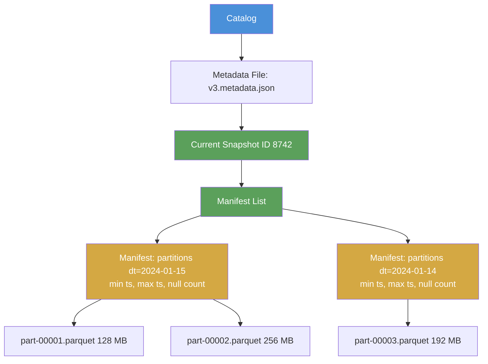
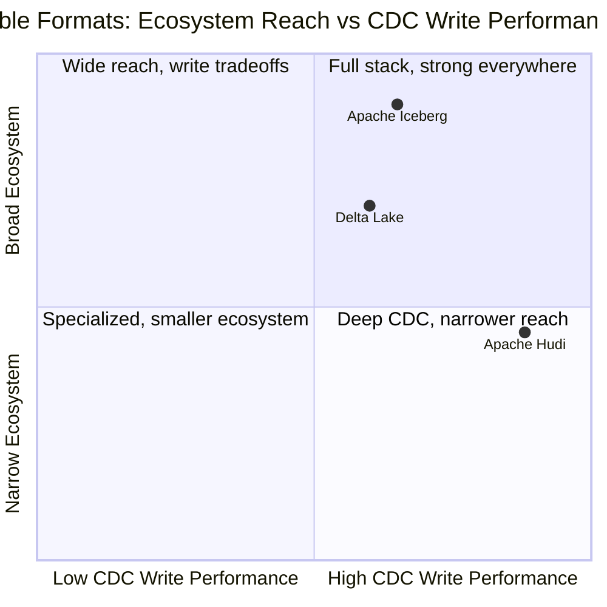
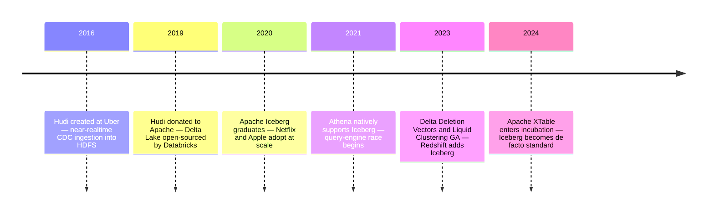

# Lakehouse Architecture: How Open Table Formats Fixed the Data Lake's Original Sin

It's 2am. Your on-call page fires. The executive dashboard is showing revenue numbers from last night, not today's. You dig in, and find the real culprit: a Spark job was mid-commit when the BI tool ran its query. Half the partition overwrote successfully. The other half? Still the old data. A reader caught the table in a fundamentally inconsistent state, and nobody got an error — the query just silently returned whatever was there.

This is the data lake's original sin: no atomicity. No isolation. No guarantee that what you read reflects a coherent snapshot of anything.

Data lakes made a seductive promise. Store everything on S3 or GCS in open formats — Parquet, CSV, JSON — at a fraction of warehouse prices. Push the schema definition to query time (schema-on-read). Keep raw data forever. Run any compute engine you want against it. Sounds liberating.

In practice, it turned into a data swamp. The same flexibility that made lakes attractive made them dangerous: any writer could overwrite any file at any moment, deleting records required rewriting entire partitions (so GDPR compliance became a multi-hour job), and the query planner had no idea how many rows were in a file until it opened the file and counted. The economics were real, but the reliability wasn't.

The lakehouse pattern is the reconciliation: keep the cheap object storage and the open formats, but add a metadata and transaction layer on top of the files. Don't move the data. Don't adopt a proprietary format. Just make the storage system smart enough to guarantee ACID semantics.

Three formats emerged to do exactly this: **Apache Iceberg**, **Delta Lake**, and **Apache Hudi**. They take different approaches and have different strengths, but they all solve the same core problem. Understanding how they work — not just what they do — is what separates an engineer who can pick the right one from an engineer who just copies a blog post.

---

## The Five Ways a Data Lake Betrays You

Before we can appreciate the solutions, we need to understand the exact failure modes. They're more specific than "lakes are bad."

**Phantom reads during writes.** Object stores have no concept of a transaction. When a Spark job writes a large dataset, it creates files incrementally. A reader that starts between the first and last file write sees a table in mid-flight. The data isn't corrupted — each individual file is valid — but the table as a whole is inconsistent. In a relational database, this is prevented by isolation levels. In a raw data lake, there's no mechanism for it at all.

**No row-level deletes for GDPR compliance.** GDPR Article 17 gives individuals the right to erasure. On a data lake, "delete this user's records" means: find every partition that might contain that user's data, rewrite each partition file from scratch with that user's rows removed, replace the old files. For a large event log spread across thousands of partitions, this is a multi-hour batch job. And you can't run it while anyone is reading the table.

**Schema drift without enforcement.** A data lake accepts any file you throw at it. A producer that accidentally renames a column, changes a type, or drops a field writes successfully to the same S3 prefix, and the next reader gets a schema mismatch error — or worse, silently reads nulls. There's no schema registry, no enforcement, no versioning.

**No statistics for query planning.** Query engines like Trino or Athena can dramatically reduce scan cost if they know: "this file only contains rows where `country = 'US'`" or "this file has a minimum `ts` of yesterday." But raw Parquet files on S3 don't have a metadata index. The planner has to open each file to discover what's in it, or skip planning altogether and scan everything. The result: queries that read 10× more data than necessary.

**The small file explosion.** Every micro-batch write creates new files. A Spark streaming job writing every 5 minutes creates 288 files per day per partition. After a year, a moderately busy table has millions of files. Opening and reading millions of small Parquet files is catastrophically slow compared to reading hundreds of large ones — each file open is a separate S3 API call with its own latency floor.

These aren't edge cases. They're structural properties of a file-based storage system with no coordination layer. The lakehouse formats address all five.

---

## The Core Insight: Metadata as the Transaction Layer

The lakehouse idea is conceptually elegant. You don't change the Parquet files. You don't move anything to a different storage system. Instead, you add a **metadata layer** — a set of files that track what data files exist, what's in them, and which set of files constitutes the "current table state."

The metadata layer does three things:

1. **Tracks snapshots** — each write produces a new snapshot. Readers always read a snapshot, never a partially-written state.
2. **Stores statistics** — min/max values, null counts, row counts per file, so query planners can skip files without opening them.
3. **Enables atomic commits** — a write either appears in the metadata as a complete snapshot, or it doesn't appear at all. There's no intermediate state.

This is, fundamentally, how relational databases work too — just implemented on top of object storage instead of a dedicated storage engine. The three formats differ in how they implement this metadata layer, not in whether they have one.

---

## Apache Iceberg: The Metadata Hierarchy

Iceberg was created at Netflix to handle tables at a scale that broke Hive. It became an Apache project in 2017 and graduated to top-level status in 2020. By 2023, it had become the de facto industry standard, with native support from AWS (Athena, Redshift, S3 Tables), Google Cloud (BigQuery external tables), Snowflake (via Polaris catalog), and Databricks.

The Iceberg metadata hierarchy has five layers. Understanding it explains every feature that follows.

The diagram below shows how a single query prunes from catalog to the data files it actually needs to read:



The **catalog** maps table names to physical metadata file locations. The **metadata file** is a JSON document containing the schema, partition spec, and a list of all snapshots. Each **snapshot** points to a **manifest list** — a Parquet file containing one entry per manifest, with partition ranges and column statistics aggregated for fast pruning. Each **manifest** lists the actual data files for a subset of partitions, with detailed per-file statistics. At the bottom: your ordinary Parquet files.

A query like `WHERE dt = '2024-01-15'` never touches the data files until it has filtered through manifest list → manifests. The planner reads only what the statistics say could match.

### Hidden Partitioning

Hive partitioning embeds partition columns in the directory structure: `s3://bucket/table/dt=2024-01-15/`. This works, but forces you to include partition columns in every query predicate, and makes changing the partition scheme a full table rewrite.

Iceberg's hidden partitioning records partition information exclusively in the metadata layer. The query `WHERE ts >= '2024-01-15'` automatically maps to the `days(ts)` partition transform — the planner prunes at the manifest level without any special syntax. You can add new partition specs (say, switching from `days(ts)` to `hours(ts)` for a high-volume table) without rewriting existing data. New files use the new spec; old files use the old spec; the planner handles both.

```sql
-- Create a table with hidden partitions
CREATE TABLE prod.db.events (
    event_id bigint,
    user_id bigint,
    event_type string,
    ts timestamp,
    payload string
) USING iceberg
PARTITIONED BY (bucket(16, user_id), days(ts));

-- This query uses both partition transforms automatically
SELECT count(*) FROM prod.db.events
WHERE ts >= '2024-01-15'
  AND user_id = 12345;
-- Iceberg prunes to bucket partition for user_id=12345
-- and days partition for ts >= 2024-01-15
-- No need to write WHERE dt = '2024-01-15'
```

### Time Travel

Every write creates a new snapshot. Snapshots are never deleted (until explicitly vacuumed). This means you can query any historical state of the table:

```sql
-- Query the table as of a specific timestamp
SELECT * FROM prod.db.events
TIMESTAMP AS OF '2024-01-15 10:30:00'
WHERE event_type = 'purchase';

-- Query a specific snapshot by ID
SELECT * FROM prod.db.events
VERSION AS OF 8742;

-- See all snapshots
SELECT * FROM prod.db.events.snapshots;
```

Time travel is how you audit, debug, and roll back. That 2am dashboard incident? With Iceberg, you'd find the snapshot that existed before the failed write and query from it.

### Copy-on-Write vs Merge-on-Read

When you UPDATE or DELETE a row in Iceberg, there are two strategies:

**Copy-on-Write (COW):** The engine reads the affected file, applies the change, and writes an entirely new file. The old file is marked deleted in the next snapshot. Reads are fast because every file is fully self-consistent. Writes are expensive — updating one row in a 1 GB file produces a new 1 GB file.

**Merge-on-Read (MOR):** The change is written as a separate delete file. Future reads must merge the base file with its delete files to reconstruct the current state. Writes are fast; reads are slower (until compaction cleans up accumulated delete files).

For append-heavy analytical tables, COW is the right default. For CDC-style tables with frequent updates and deletes, MOR prevents write amplification. Both are only available with Iceberg format v2 — v1 is append-only.

---

## Delta Lake: The Transaction Log

Delta Lake came out of Databricks in 2019 and was open-sourced under the Linux Foundation. It solved the same problems as Iceberg but with a different implementation: instead of a layered metadata hierarchy, Delta uses a single append-only transaction log.

Every write to a Delta table appends a JSON file to the `_delta_log` directory:

```
_delta_log/
  00000000000000000000.json   ← initial table creation
  00000000000000000001.json   ← first write: 3 files added
  00000000000000000002.json   ← second write: 2 files added, 1 removed
  ...
  00000000000000000010.parquet ← checkpoint: full state at commit 10
```

Each JSON file is a list of actions: `add` (new file), `remove` (file deleted), `metaData` (schema change), `protocol` (format version). To reconstruct the current table state, a reader replays all actions since the last checkpoint. Because checkpoints are created every 10 commits by default, the replay is fast even for tables with thousands of commits.

ACID comes from optimistic concurrency control: two concurrent writers both try to append to the log. The first one succeeds. The second one detects a conflict at commit time and either retries (if the conflict is resolvable — they wrote to different partitions) or fails with a clean error message. No half-written state is ever visible.

### MERGE INTO: The Upsert Workhorse

Delta Lake's MERGE INTO statement handles the most common CDC pattern — upsert — in a single atomic operation:

```python
from delta.tables import DeltaTable

target = DeltaTable.forPath(spark, "s3://warehouse/users")

# source_df contains changed records from the CDC stream
target.alias("target").merge(
    source_df.alias("source"),
    "target.user_id = source.user_id"
).whenMatchedUpdate(
    condition="source.updated_at > target.updated_at",
    set={
        "name": "source.name",
        "email": "source.email",
        "updated_at": "source.updated_at"
    }
).whenNotMatchedInsert(
    values={
        "user_id": "source.user_id",
        "name": "source.name",
        "email": "source.email",
        "updated_at": "source.updated_at"
    }
).execute()
# Entire operation is one atomic commit in the transaction log
```

### Liquid Clustering

For several years, the way to tune Delta Lake query performance was ZORDER BY — a multi-column data skipping strategy that co-locates related data. It worked, but it had a painful flaw: ZORDER isn't incremental. Every time you ran OPTIMIZE with ZORDER, it rewrote the entire table.

**Liquid Clustering**, released as GA in 2023, replaces ZORDER entirely. Instead of a one-time layout pass, Liquid Clustering incrementally reorganizes data on every OPTIMIZE run — only touching the files that need it. You declare clustering keys once:

```sql
CREATE TABLE prod.events
CLUSTER BY (user_id, event_date);
```

And run `OPTIMIZE prod.events` on whatever schedule makes sense. Delta figures out which files are out-of-order and rewrites only those. No full-table rewrites, no partition management, compatible with streaming appends.

### Deletion Vectors

Before Deletion Vectors (introduced in Delta Lake 2.3.0), deleting rows required rewriting entire Parquet files — the same COW problem as Iceberg. Deletion Vectors change this: instead of rewriting the file, Delta writes a small companion file (a RoaringBitmap encoding the row positions to skip) and marks those rows as logically deleted.

```sql
-- Enable deletion vectors on an existing table
ALTER TABLE prod.events
SET TBLPROPERTIES ('delta.enableDeletionVectors' = true);

-- This DELETE now writes a small deletion vector instead of rewriting files
DELETE FROM prod.events WHERE user_id = 12345;
```

The actual file remains intact until VACUUM runs. For GDPR compliance, Deletion Vectors + VACUUM gives you both fast deletions (the bitmap write) and eventual physical removal (the VACUUM job).

---

## Apache Hudi: CDC as a First-Class Citizen

Hudi was born at Uber in 2016 to solve a specific problem: ingesting database CDC streams into a data lake with near-real-time latency. When your operational PostgreSQL database has millions of updates per minute, how do you keep your analytical copy current without full table scans?

Apache Hudi (Hadoop Upserts Deletes and Incrementals) was donated to the Apache Software Foundation in 2019. Its design priorities are different from Iceberg and Delta: it's optimized for high-frequency upserts and CDC workloads, with incremental processing as a first-class feature.

The COW vs MOR trade-off is more prominent in Hudi than in either Iceberg or Delta, because Hudi was built for mixed workloads where write cost genuinely matters:

| | Copy-on-Write | Merge-on-Read |
|---|---|---|
| **Update mechanism** | Full file rewrite | Append delta log entry |
| **Write latency** | Higher | Lower |
| **Read performance** | Fast — no merge needed | Slower — must merge base + logs |
| **Best for** | Append-heavy, analytical | High-frequency updates, CDC |
| **Compaction** | Built-in | Requires scheduled job |

Hudi's upsert syntax is distinctive — it uses Spark write options rather than SQL:

```python
hudi_options = {
    "hoodie.table.name": "users",
    "hoodie.datasource.write.recordkey.field": "user_id",
    "hoodie.datasource.write.partitionpath.field": "partition_date",
    "hoodie.datasource.write.operation": "upsert",
    "hoodie.datasource.write.table.type": "COPY_ON_WRITE",
    "hoodie.table.ordering.fields": "updated_at",
    # Hudi's small file management: opportunistically merge files
    # under 100MB into larger ones during upserts
    "hoodie.parquet.small.file.limit": "104857600",
}

cdc_df.write \
    .format("hudi") \
    .mode("append") \
    .options(**hudi_options) \
    .save("s3://warehouse/users")
```

Note that `mode("append")` with `operation: upsert` means "don't overwrite the table, merge these records into it." This is the pattern that distinguishes Hudi from a simple file writer.

Hudi also introduced **incremental reads** — a way to read only the records that changed since a given commit, rather than scanning the whole table. For CDC pipelines where you want to propagate changes downstream, this is significantly more efficient than table scanning:

```python
# Read only changes since commit timestamp
incremental_df = spark.read \
    .format("hudi") \
    .option("hoodie.datasource.query.type", "incremental") \
    .option("hoodie.datasource.read.begin.instanttime", "20240115000000") \
    .load("s3://warehouse/users")
```

---

## Picking the Right Format: An Honest Comparison

The three formats have genuine differences, and the right choice depends on where you're building and what your primary workload is.

The following diagram positions them on two dimensions that actually matter for most teams:



**Choose Iceberg if:** You're building a multi-cloud or cloud-agnostic architecture. Your data needs to be readable from BigQuery, Snowflake, Athena, Trino, Spark, and DuckDB — simultaneously, without conversion. Iceberg's REST catalog abstraction is the most engine-agnostic, and its metadata design is the cleanest for cross-engine interoperability. AWS, Google Cloud, and Snowflake have all made Iceberg their preferred open format. If you're starting from scratch in 2026, Iceberg is the defensible default.

**Choose Delta Lake if:** You're deep in the Databricks ecosystem and Spark is your primary engine. Delta's transaction log design is battle-tested at enormous scale, and features like Liquid Clustering and Change Data Feed are mature and well-integrated with Databricks Unity Catalog. The flip side: Delta is more tightly coupled to Databricks than Iceberg is to any single vendor, and non-Spark engines need plugins that have historically lagged.

**Choose Hudi if:** Your primary workload is CDC ingestion from operational databases. Hudi's MOR tables, incremental reads, and automatic small file management were built specifically for this pattern. Uber, Robinhood, and Amazon use Hudi at scale for exactly this case. Outside of CDC-heavy pipelines, Hudi's ecosystem is narrower — it's the specialist in a world that increasingly favors generalists.

A clarifying note on convergence: **Apache XTable** (formerly OneTable, now Apache-incubating) provides metadata translation between all three formats without rewriting data. If you write Hudi today but need BigQuery to read it as Iceberg, XTable can sync the metadata bidirectionally. This reduces the lock-in cost of choosing any single format — but the translation adds operational complexity, so it's best treated as an escape hatch, not a primary architecture.

---

## The Timeline: Three Formats, One Decade

These formats didn't appear simultaneously. Understanding the timeline explains why Iceberg is now dominant despite arriving after Hudi and Delta:



Hudi was first and solved a real problem. Delta benefited from Databricks' distribution. Iceberg won the ecosystem war by building the cleanest abstraction and getting AWS, Google, and Snowflake to commit to it as their open format of choice.

---

## Query Engines: Who Reads What

The lakehouse value proposition collapses if only one query engine can read your data. Here's the current state:

| Engine | Iceberg | Delta Lake | Hudi |
|---|---|---|---|
| **Spark** | Native | Native | Native |
| **Trino / Athena** | Native | Via plugins | Via manifest |
| **Flink** | Native | Connector | Connector |
| **DuckDB** | Via extension | Via extension | Limited |
| **BigQuery** | External tables | Preview | — |
| **Snowflake** | Via Polaris catalog | Via manifests | — |
| **Redshift** | GA (Nov 2023) | Via plugin | — |

DuckDB is worth highlighting because it's increasingly used for local development and notebook-scale analytics against cloud-stored data:

```sql
-- Install and load the Iceberg extension (run once)
INSTALL iceberg FROM core_nightly;
LOAD iceberg;

-- Create a secret for S3 access
CREATE SECRET (
    TYPE s3,
    KEY_ID 'AKIA...',
    SECRET 'wJalr...',
    REGION 'us-east-1'
);

-- Query an Iceberg table directly from S3
SELECT
    event_type,
    count(*) AS event_count,
    count(DISTINCT user_id) AS unique_users
FROM iceberg_scan('s3://warehouse/events/metadata/v3.metadata.json')
WHERE ts >= '2024-01-01'
GROUP BY event_type
ORDER BY event_count DESC;
```

This pattern — DuckDB reading Iceberg from S3 for exploratory analysis, Spark for heavy ETL, BigQuery for dashboards — is how multi-engine architectures work in practice. The open format is what makes it possible.

---

## When to Stay With the Warehouse

The lakehouse is a compelling architecture, but it's not always the right choice. A managed warehouse like BigQuery, Snowflake, or Redshift is often the better answer, and being honest about this matters.

**Stay with the managed warehouse if:**

You have a team of analysts who primarily write SQL and don't want to think about compaction, partition evolution, or snapshot expiration. The operational surface of a lakehouse is real — you need to run OPTIMIZE jobs, manage metadata, handle schema migrations. A managed warehouse does all of this for you.

Your data fits within the warehouse's economics. If you're running queries against a few terabytes and your team is smaller than five engineers, the cost of S3 + compute is not dramatically lower than BigQuery on-demand pricing after you factor in the engineering time to operate the lakehouse.

You don't need data portability. If all your workloads run in the same cloud, in the same analytics stack, the open format advantage is theoretical. Proprietary formats come with deep integration and better tooling from the vendor.

**Choose the lakehouse if:**

Your data is genuinely large and access patterns are irregular — terabytes that are queried occasionally, not continuously. The separation of storage and compute means you pay for compute only when you need it.

You need to run multiple query engines against the same data. Analytics in BigQuery, ML training in Spark, ad-hoc exploration in DuckDB — this is the lakehouse's natural habitat.

GDPR or data residency requirements make row-level deletes from analytical data a regular operation. Managed warehouses have limited support for this; Iceberg and Delta do it well.

Your data needs to outlive any single vendor. Open formats mean you can migrate engines without migrating data.

---

## Going Deeper

**Books:**
- Reis, J. & Housley, M. (2022). *Fundamentals of Data Engineering.* O'Reilly Media.
  - Comprehensive treatment of the data engineering landscape including storage systems, query engines, and the warehouse vs lake tradeoff. Chapter 6 on storage is particularly relevant as context for lakehouse architecture.
- Kleppmann, M. (2017). *Designing Data-Intensive Applications.* O'Reilly Media.
  - Chapter 3 on storage engines provides the foundational concepts — LSM trees, B-trees, column-oriented storage — that explain why the lakehouse metadata designs work the way they do.
- Armbrust, M. et al. (2021). *Delta Lake: The Definitive Guide.* O'Reilly Media.
  - Written by the Delta Lake creators. Dense but authoritative on the transaction log design, MERGE semantics, and schema enforcement mechanisms.

**Online Resources:**
- [Apache Iceberg Documentation](https://iceberg.apache.org/docs/latest/) — The official docs are unusually readable. The "Spec" section explains the metadata format at a level of detail that makes the hidden partitioning and snapshot design fully understandable.
- [Delta Lake Documentation](https://docs.delta.io/latest/) — The Delta Lake protocol spec is open-source; reading it alongside the docs gives you the full picture of how the transaction log achieves ACID.
- [Dremio: Comparison of Data Lake Table Formats](https://www.dremio.com/blog/comparison-of-data-lake-table-formats-apache-iceberg-apache-hudi-and-delta-lake/) — One of the most honest format comparisons available. Dremio has commercial skin in the game (they back Iceberg), but the technical comparisons are substantive.
- [Apache XTable Documentation](https://xtable.apache.org/) — The incubating project for cross-format metadata translation. Useful if you need to support multiple formats at an organization level.

**Videos:**
- [Apache Iceberg: An Architectural Look Under the Covers](https://www.youtube.com/watch?v=N4gAi_zpN88) by Alex Merced — Walks through the metadata hierarchy in detail, explaining how manifest lists and manifests enable partition pruning. One of the clearest technical explanations of Iceberg's design.
- [Delta Lake Internals](https://www.youtube.com/watch?v=LJtShrQqYZY) by Databricks — Deep dive into the transaction log design, checkpoint format, and how optimistic concurrency control handles concurrent writers.

**Academic Papers:**
- Armbrust, M. et al. (2020). ["Delta Lake: High-Performance ACID Table Storage over Cloud Object Stores."](https://vldb.org/pvldb/vol13/p3411-armbrust.pdf) *VLDB*, Vol. 13.
  - The original Delta Lake paper. Describes the transaction log design and the performance evaluation against raw Parquet. The benchmarks against Hive and Parquet on S3 are instructive.
- Zaharia, M. et al. (2021). ["Lakehouse: A New Generation of Open Platforms that Unify Data Warehousing and Advanced Analytics."](https://www.cidrdb.org/cidr2021/papers/cidr2021_paper17.pdf) *CIDR 2021*.
  - The paper that named the lakehouse pattern. Armbrust, Zaharia, and colleagues describe the full vision: open formats, Delta-style ACID, metadata for statistics-based pruning, and the argument for why this converges warehouse and lake capabilities.

**Questions to Explore:**
- As Iceberg becomes the de facto standard and clouds natively support it, does the distinction between "lakehouse" and "managed warehouse" become meaningless? If BigQuery reads your Iceberg files as first-class external tables, what exactly separates it from a managed warehouse?
- Deletion Vectors and MOR tables make it practical to delete rows, but they're eventually cleaned up by compaction. In a regulatory context where deletion must be provably complete, is "logically deleted but physically present until VACUUM" sufficient? What does GDPR's "undue delay" provision mean when applied to column-oriented storage?
- Open table formats solve the read problem (any engine can read Parquet + metadata), but the write problem remains: concurrent writers from different engines to the same Iceberg table is still an open challenge. How will this evolve?
- If Apache XTable can translate between Iceberg, Delta, and Hudi transparently, does format choice become a pure operational preference rather than an architectural one? Or does cross-format translation always introduce subtle semantic differences (snapshot IDs, partition transforms, equality delete semantics) that matter at the edges?
- The lakehouse was conceived as "cheap storage + warehouse features." Cloud storage prices have dropped consistently for a decade. At some price point, does the economic argument for a lakehouse over a managed warehouse disappear entirely?
