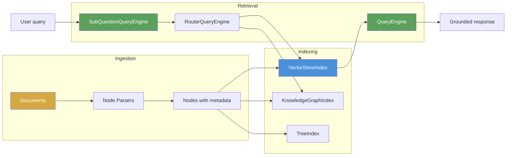
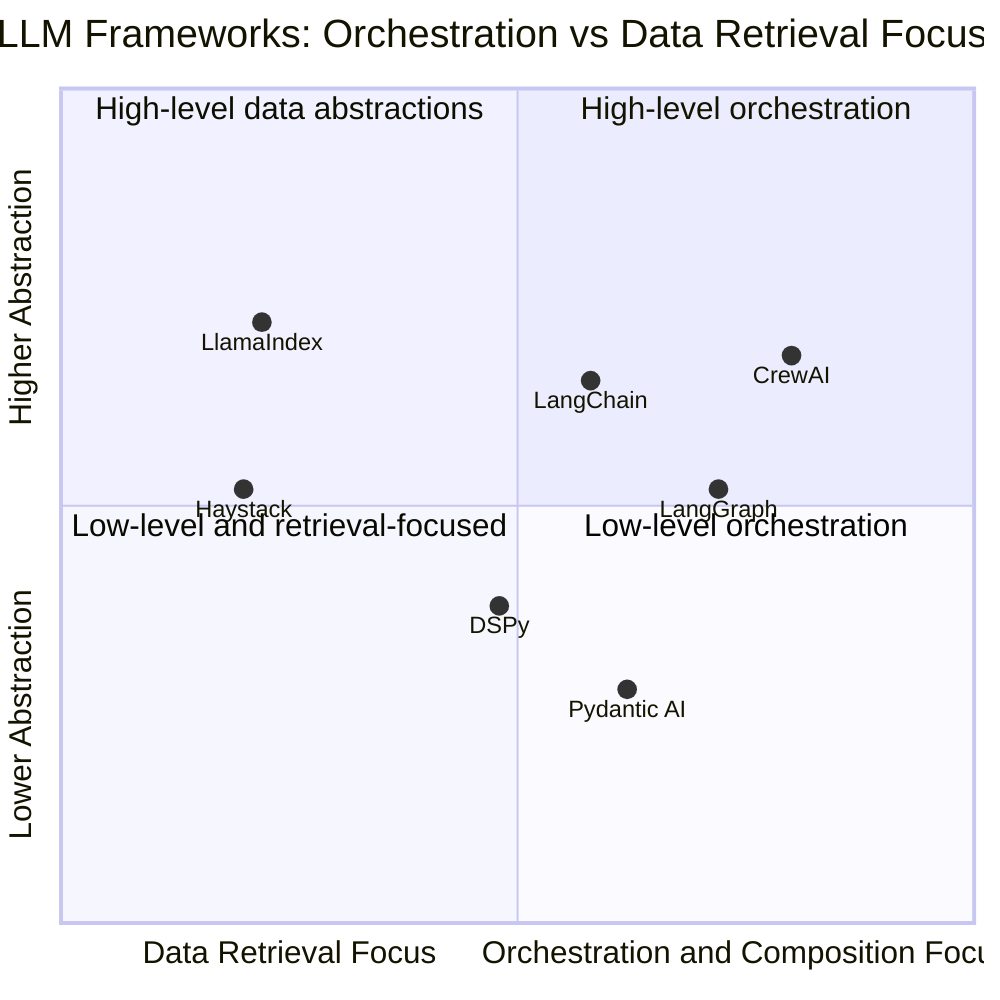
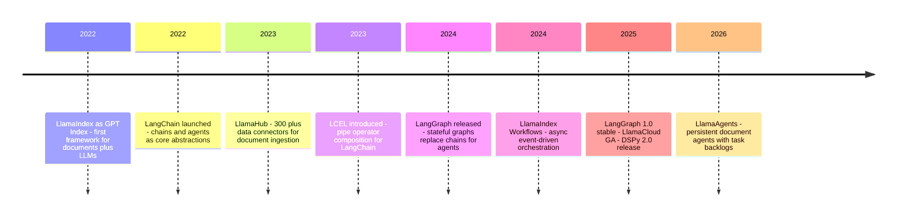

# LlamaIndex vs LangChain: Choosing Your LLM Framework in 2026

Every engineer building a production LLM application eventually faces the same question: LlamaIndex or LangChain? Both can build a RAG pipeline. Both can run tool-using agents. Both have hundreds of integrations. Both are actively maintained with frequent releases. So the comparison that used to be clean — "LlamaIndex for retrieval, LangChain for orchestration" — has blurred considerably.

But blurring isn't convergence. The frameworks still have different centers of gravity, different default abstractions, and different things they make easy versus things they make you compose from scratch. The choice isn't about capability — it's about which framework's mental model fits the problem you're solving. Choose the one that fights you and you'll spend weeks wrestling with abstractions that weren't designed for your use case. Choose the one that fits and the defaults get you 80% of the way there.

This post works through the real difference between the two, what each one makes easy that the other makes hard, how the newer alternatives (DSPy, Haystack, CrewAI, Pydantic AI) answer different questions entirely, and how to make the choice with confidence rather than by gut feeling or community trend.

One thing this post deliberately does not do: pretend there's a single right answer. The honest conclusion is that the best choice depends on what you're building — and understanding both frameworks deeply enough to recognize the fit is more valuable than any comparison table.

---

## Two Answers to the Same Question

In 2022, Jerry Liu built GPT Index — later renamed LlamaIndex — because he was frustrated that building a RAG system required so much custom infrastructure. Every time you wanted to connect a document collection to a language model, you had to write the same ingestion, chunking, embedding, retrieval, and context assembly code from scratch. LlamaIndex's first design decision was: make retrieval the core abstraction.

In the same year, Harrison Chase built LangChain because he wanted a framework that let you chain arbitrary LLM operations together — not just retrieval, but any composition of models, tools, and data sources. LangChain's first design decision was: make the pipeline the core abstraction.

These founding decisions still explain the frameworks today. Four years of development have added capabilities to both — LlamaIndex now has agents and workflow orchestration; LangChain now has richer retrieval — but the defaults still reveal the original vision. LlamaIndex defaults toward making retrieval correct and sophisticated. LangChain defaults toward making composition flexible and expressive.

The practical consequence: **with LlamaIndex, advanced retrieval patterns work out of the box; with LangChain, you compose them yourself from smaller pieces**. Neither is objectively better. One minimizes code for retrieval use cases; the other maximizes control for diverse use cases.

---

## LlamaIndex: The Data-Centric View

LlamaIndex thinks of the problem in layers: first ingest documents into nodes, then build indexes over those nodes, then use query engines to retrieve and respond. Each layer has rich built-in options that encode retrieval best practices.



### Documents and Nodes

In LlamaIndex, every piece of data starts as a `Document`. Documents get split into `Node` objects by node parsers. Each Node carries the text chunk, a reference back to its source document, and arbitrary metadata. The metadata is first-class — it gets indexed, filtered on, and passed alongside chunks to the language model.

```python
from llama_index.core import SimpleDirectoryReader
from llama_index.core.node_parser import HierarchicalNodeParser, get_leaf_nodes
from llama_index.core.schema import MetadataMode

# Load documents with automatic metadata extraction
documents = SimpleDirectoryReader(
    "./data",
    recursive=True,
    file_metadata=lambda filepath: {
        "source": filepath,
        "created_at": "2026-01",
    }
).load_data()

# Hierarchical chunking: creates parent-child node relationships
# Parent nodes: 512 tokens (for context), child nodes: 128 tokens (for precision)
node_parser = HierarchicalNodeParser.from_defaults(
    chunk_sizes=[512, 128]
)
nodes = node_parser.get_nodes_from_documents(documents)
leaf_nodes = get_leaf_nodes(nodes)

print(f"Documents: {len(documents)}, Nodes: {len(nodes)}, Leaf nodes: {len(leaf_nodes)}")
```

**Hierarchical chunking** is a good example of LlamaIndex's philosophy. The intuition: retrieve at the leaf level (small, precise chunks) but pass the parent context to the language model (larger, more coherent context). This "auto-merging" approach consistently improves answer quality for multi-paragraph questions without requiring custom retrieval logic.

### Query Engines: Retrieval as a First-Class Abstraction

The `QueryEngine` is LlamaIndex's central abstraction. It wraps the full pipeline — retrieval, re-ranking, context assembly, and LLM invocation — in a single interface that hides complexity while exposing what matters.

```python
from llama_index.core import VectorStoreIndex, StorageContext
from llama_index.core.postprocessor import SentenceTransformerRerank
from llama_index.vector_stores.chroma import ChromaVectorStore
import chromadb

# Build and persist an index
chroma_client = chromadb.PersistentClient(path="./chroma_db")
chroma_collection = chroma_client.get_or_create_collection("knowledge_base")
vector_store = ChromaVectorStore(chroma_collection=chroma_collection)
storage_context = StorageContext.from_defaults(vector_store=vector_store)

index = VectorStoreIndex(
    nodes=leaf_nodes,
    storage_context=storage_context,
)

# Create a query engine with built-in re-ranking
# This would require 3 separate components in LangChain
reranker = SentenceTransformerRerank(
    model="cross-encoder/ms-marco-MiniLM-L-2-v2",
    top_n=3
)

query_engine = index.as_query_engine(
    similarity_top_k=10,       # Retrieve 10 candidates
    node_postprocessors=[reranker],  # Re-rank to top 3
    response_mode="compact",   # Synthesize into a concise response
)

response = query_engine.query("What are the key findings from Q4?")
print(response)
print("\nSources:")
for node in response.source_nodes:
    print(f"  - {node.metadata.get('source')} (score: {node.score:.3f})")
```

The same pipeline in LangChain requires assembling: a vector retriever, a cross-encoder re-ranker, a context document combiner, a prompt template, and an LLM. LlamaIndex provides the same functionality with fewer lines not because it's magic, but because retrieval is its first-class use case and these patterns are built in.

### Sub-Question Decomposition and Routers

LlamaIndex's most distinctive feature is built-in query decomposition. Two patterns stand out:

**RouterQueryEngine** routes queries to the appropriate index or engine based on metadata descriptions. You describe each data source, and the LLM decides which one to query:

```python
from llama_index.core.query_engine import RouterQueryEngine
from llama_index.core.selectors import LLMSingleSelector
from llama_index.core.tools import QueryEngineTool

# Two specialized indexes: one for financial data, one for legal documents
finance_tool = QueryEngineTool.from_defaults(
    query_engine=finance_query_engine,
    description="Use this for financial reports, revenue data, and quarterly results.",
)
legal_tool = QueryEngineTool.from_defaults(
    query_engine=legal_query_engine,
    description="Use this for contracts, compliance documents, and legal filings.",
)

router_engine = RouterQueryEngine(
    selector=LLMSingleSelector.from_defaults(),
    query_engine_tools=[finance_tool, legal_tool],
)

# The LLM selects finance_query_engine for this query automatically
response = router_engine.query("What was our revenue in the Q3 earnings report?")
```

**SubQuestionQueryEngine** breaks a complex question into sub-questions, answers each against the appropriate source, then synthesizes a final answer:

```python
from llama_index.core.query_engine import SubQuestionQueryEngine

sub_question_engine = SubQuestionQueryEngine.from_defaults(
    query_engine_tools=[finance_tool, legal_tool],
    use_async=True,   # Sub-questions run concurrently
)

# This query gets decomposed automatically:
# Sub-Q1: "What was Q3 revenue?" -> finance engine
# Sub-Q2: "Are there legal restrictions on disclosing this?" -> legal engine
# Synthesis: combines both answers
response = sub_question_engine.query(
    "Compare our Q3 revenue to what's disclosed in the shareholder agreement."
)
```

Building sub-question decomposition in LangChain requires custom agent code. In LlamaIndex, it's two lines.

### LlamaParse and LlamaCloud

LlamaIndex has invested significantly in the ingestion problem. **LlamaParse** is their proprietary document parser that handles PDFs with complex layouts — multi-column formats, embedded tables, charts with captions, mixed text and images — producing clean markdown output that's dramatically better for downstream chunking than naive PDF extraction.

```python
from llama_parse import LlamaParse
from llama_index.core import SimpleDirectoryReader

parser = LlamaParse(
    result_type="markdown",      # Structured markdown output
    parsing_instruction="Extract all tables in markdown format. Preserve column headers.",
    use_vendor_multimodal_model=True,  # Use vision model for complex layouts
)

documents = SimpleDirectoryReader(
    "./pdfs",
    file_extractor={".pdf": parser}
).load_data()
```

**LlamaCloud** is the managed hosted version — document parsing, index hosting, and retrieval as a service. For teams that don't want to manage vector database infrastructure, LlamaCloud handles the operational complexity. The managed offering is the most visible sign of LlamaIndex's commercial direction.

### LlamaIndex Workflows: Agents Without the Graph

For more complex, multi-step pipelines, LlamaIndex added **Workflows** — an event-driven orchestration system where steps communicate by emitting typed events that other steps listen for:

```python
from llama_index.core.workflow import Workflow, StartEvent, StopEvent, step, Event
from typing import Optional

class RetrievalCompleteEvent(Event):
    results: list[str]

class AnswerEvent(Event):
    answer: str

class RAGWorkflow(Workflow):
    @step
    async def retrieve(self, event: StartEvent) -> RetrievalCompleteEvent:
        query = event.get("query")
        # Query the index
        results = await index.aquery(query)
        return RetrievalCompleteEvent(results=[str(n) for n in results.source_nodes])

    @step
    async def synthesize(self, event: RetrievalCompleteEvent) -> StopEvent:
        # Generate final answer from retrieved context
        answer = await llm.acomplete(
            f"Context: {event.results}\n\nAnswer the question based on the context."
        )
        return StopEvent(result=str(answer))

workflow = RAGWorkflow(timeout=60, verbose=True)
result = await workflow.run(query="What are the key findings?")
```

Workflows are async-first, which lets multiple retrieval steps run concurrently. The event-driven model maps naturally to "gather information from multiple sources, then synthesize." The limitation compared to LangGraph: state persistence across workflow runs is less mature, and debugging complex multi-agent interactions is harder without LangSmith-equivalent tooling.

---

## LangChain: The Orchestration-Centric View

LangChain's central metaphor is composition. The `|` operator in LCEL (LangChain Expression Language) turns components into pipelines. Every component — a retriever, a prompt template, a language model, an output parser — implements the same `Runnable` interface, which means they compose cleanly.

```python
from langchain_openai import ChatOpenAI, OpenAIEmbeddings
from langchain_chroma import Chroma
from langchain_core.prompts import ChatPromptTemplate
from langchain_core.output_parsers import StrOutputParser
from langchain_core.runnables import RunnablePassthrough

llm = ChatOpenAI(model="gpt-4o", temperature=0)
embeddings = OpenAIEmbeddings(model="text-embedding-3-small")

vectorstore = Chroma(
    persist_directory="./chroma_db",
    embedding_function=embeddings
)
retriever = vectorstore.as_retriever(search_kwargs={"k": 6})

# The | operator composes runnables into a pipeline
# Each step is explicit; the pipeline is readable as a data flow
rag_chain = (
    {"context": retriever, "question": RunnablePassthrough()}
    | ChatPromptTemplate.from_messages([
        ("system", "Answer based on the context:\n\n{context}"),
        ("human", "{question}")
    ])
    | llm
    | StrOutputParser()
)

# Streaming, async, and parallel branches all work because Runnable is the base
for chunk in rag_chain.stream("What are the key Q4 findings?"):
    print(chunk, end="", flush=True)
```

The LCEL approach makes the pipeline's structure explicit. You can read a chain like a data flow diagram — input flows through retrieval, into the prompt template, through the model, and out as a string. This explicitness is a genuine advantage for complex multi-step pipelines where you want to understand exactly what's happening.

### LangGraph: When Pipelines Need State

LangGraph (now the production standard for LangChain agent work) replaces linear chains with directed graphs where nodes are functions and edges are conditional transitions. The core innovation is **typed state** that persists through the graph:

```python
from langchain_openai import ChatOpenAI
from langgraph.graph import StateGraph, END
from langgraph.checkpoint.sqlite import SqliteSaver
from typing import TypedDict, Annotated
import operator

class AgentState(TypedDict):
    messages: Annotated[list, operator.add]   # Append-only message list
    retrieved_docs: list[str]
    retry_count: int

def retrieve_node(state: AgentState) -> AgentState:
    query = state["messages"][-1].content
    docs = retriever.invoke(query)
    return {"retrieved_docs": [d.page_content for d in docs]}

def should_retry(state: AgentState) -> str:
    if state["retry_count"] < 2 and len(state["retrieved_docs"]) == 0:
        return "retrieve"  # Retry retrieval
    return "generate"       # Move to generation

builder = StateGraph(AgentState)
builder.add_node("retrieve", retrieve_node)
builder.add_node("generate", generate_node)
builder.add_conditional_edges("retrieve", should_retry)
builder.set_entry_point("retrieve")

# Persistent checkpointing — survives restarts, enables human-in-the-loop
memory = SqliteSaver.from_conn_string(":memory:")
graph = builder.compile(checkpointer=memory)
```

LangGraph's persistent checkpointing is its key production advantage. A workflow that runs for minutes (or hours, for long autonomous agents) can be interrupted, inspected, and resumed. Human-in-the-loop patterns — where an agent pauses to wait for human approval before a consequential action — are first-class features. Time-travel debugging lets you replay any execution from any checkpoint with modified state.

This is what LlamaIndex Workflows doesn't yet match in maturity.

### LangSmith: The Observability Advantage

LangSmith is LangChain's hosted observability platform. Every LLM call, tool invocation, retrieval step, and chain execution is automatically traced. You can inspect token usage, latency per step, the exact prompts sent to each model, and compare across runs.

```python
# One environment variable enables full tracing
import os
os.environ["LANGCHAIN_TRACING_V2"] = "true"
os.environ["LANGCHAIN_API_KEY"] = "ls-..."

# All subsequent LangChain operations are automatically traced
result = rag_chain.invoke("What are the Q4 findings?")
# -> Visible in LangSmith UI with full provenance
```

For teams debugging production failures, LangSmith makes it possible to trace exactly which retrieval step returned irrelevant documents or which prompt template produced an off-format response. LlamaIndex offers integrations with Arize Phoenix, Langfuse, and Weights & Biases, but requires more assembly to get comparable coverage.

---

## The Convergence Problem

Both frameworks have added capabilities the other started with. LlamaIndex now has agents (LlamaAgents), workflow orchestration, and integrations for tools. LangChain now has LCEL retrieval patterns, semantic chunking, and document loaders competitive with LlamaHub. In 2024-2026, they've grown toward each other.

But this doesn't mean they're equivalent. The defaults still reveal priorities. Consider building a system that answers questions over a knowledge base of 1,000 PDFs with complex layouts:

**With LlamaIndex:** Load PDFs through LlamaParse, hierarchical chunk with HierarchicalNodeParser, build a VectorStoreIndex, add a SentenceTransformerRerank postprocessor to the query engine, done. Each step has a sensible default; the hard parts (chunking strategy, re-ranking) are built-in.

**With LangChain:** Load PDFs (choose from 20 document loaders), chunk (TextSplitter, SemanticChunker, or custom), embed (OpenAIEmbeddings or other), store in a vector store, build a retriever, add a cross-encoder re-ranker (compose from separate library), build a chain combining retriever and prompt. More steps, more control, more ability to swap each component for a different implementation.

The LangChain approach is genuinely better if you need to swap the retriever for a custom BM25 implementation, combine vector and keyword retrieval with custom weights, or replace the re-ranker with a task-specific model. The LlamaIndex approach is better if you want those best practices working immediately without hand-assembling the pipeline.

The decision rule: **if retrieval quality is the hardest part of your problem, start with LlamaIndex**. If orchestration flexibility — connecting many different data sources, models, and tools in complex conditional flows — is the hardest part, start with LangChain + LangGraph.

---

## The Broader Ecosystem: Four More Answers

LlamaIndex and LangChain are not the only options. Three other frameworks take genuinely different approaches that are worth understanding.



### DSPy: Programming, Not Prompting

DSPy (Declarative Self-improving Python) takes a fundamentally different approach. Instead of composing pipelines of LLM calls with hand-crafted prompts, you declare what you want the program to do and let a compiler optimize the prompts:

```python
import dspy

class RAGSignature(dspy.Signature):
    """Answer questions based on retrieved context."""
    context: list[str] = dspy.InputField(desc="Relevant passages")
    question: str = dspy.InputField()
    answer: str = dspy.OutputField(desc="Detailed answer with reasoning")

class RAGProgram(dspy.Module):
    def __init__(self):
        self.retrieve = dspy.Retrieve(k=5)
        self.generate = dspy.ChainOfThought(RAGSignature)

    def forward(self, question: str):
        context = self.retrieve(question).passages
        return self.generate(context=context, question=question)

# Compile: the optimizer tunes prompts automatically against your evaluation set
optimizer = dspy.BootstrapFewShot(metric=answer_correctness)
compiled_rag = optimizer.compile(RAGProgram(), trainset=training_examples)
```

DSPy is the right tool when your prompts are the bottleneck and you have labeled evaluation data. Instead of writing and iterating on prompts manually, you define the task signature and let the optimizer find prompts that maximize your metric. It's not a RAG framework or an agent framework — it's a systematic way to improve LLM program performance. The learning curve is steeper than LlamaIndex or LangChain, but the payoff is automatically optimized, reproducible pipelines.

### Haystack: Search-Native

Haystack (by deepset) approaches LLM applications from a search engineering background. It uses a "pipeline as directed graph" model where nodes are processing components and edges are data flows. The design decisions reflect a team that spent years building production search systems: document preprocessing is a first-class concern, hybrid retrieval (BM25 + semantic) is built-in, and evaluation tooling is deeply integrated.

Haystack's sweet spot is applications where search engineering practices matter — hybrid retrieval with carefully tuned BM25 weights, custom document preprocessing pipelines, enterprise search patterns. It has a smaller community than LlamaIndex or LangChain but arguably more battle-tested search components.

### CrewAI: Role-Based Agents

CrewAI builds multi-agent systems around "crews" — groups of AI agents with defined roles, goals, and tools that collaborate on tasks. The design philosophy is explicit human-organizational analogies: a Researcher agent, an Analyst agent, a Writer agent working together like a team.

```python
from crewai import Agent, Task, Crew

researcher = Agent(
    role="Senior Research Analyst",
    goal="Uncover comprehensive information about {topic}",
    backstory="You are an expert at synthesizing information from multiple sources.",
    tools=[search_tool, read_file_tool],
)

writer = Agent(
    role="Content Strategist",
    goal="Craft compelling reports based on research findings",
    backstory="You transform complex research into clear, actionable reports.",
)

research_task = Task(
    description="Research {topic} and identify key trends",
    expected_output="Comprehensive report with citations",
    agent=researcher,
)

crew = Crew(agents=[researcher, writer], tasks=[research_task, write_task])
result = crew.kickoff(inputs={"topic": "Q4 market performance"})
```

CrewAI is simpler than LangGraph for multi-agent patterns but less flexible. It's the right choice for teams that want role-based agent collaboration without implementing a full state graph. The role/goal/backstory abstraction is also effective for prompting — it's a simple form of system prompt engineering.

### Pydantic AI: Type Safety First

Pydantic AI, from the creators of Pydantic, brings type safety to LLM applications. Every LLM call is defined with typed inputs, typed outputs, and validated tool schemas. The framework is newer but growing quickly among teams with strong type discipline:

```python
from pydantic_ai import Agent
from pydantic import BaseModel

class ExtractionResult(BaseModel):
    company_name: str
    revenue_q4: float | None
    key_risks: list[str]

agent = Agent(
    "openai:gpt-4o",
    output_type=ExtractionResult,  # Validated, typed output
    system_prompt="Extract structured data from financial reports.",
)

result = await agent.run("Q4 revenue was $2.3B, down 4% YoY due to supply chain issues.")
print(result.data.revenue_q4)   # 2300000000.0 — typed float
print(result.data.key_risks)    # ["supply chain issues"] — typed list
```

Pydantic AI is the most developer-ergonomic framework for tasks that produce structured output. The validation layer catches LLM output errors before they reach your application logic. For tasks with well-defined schemas — document extraction, classification, structured data generation — it significantly reduces the boilerplate of output parsing and validation.

---

## The Framework Timeline



---

## Making the Decision

Rather than a framework scoring table, here's the honest decision guide based on what you're building:

**Use LlamaIndex if:**
- Your core challenge is document retrieval quality — getting the right chunks back for complex questions
- You're ingesting many heterogeneous document formats and need serious PDF/table parsing
- You want hierarchical chunking, auto-merging, or sub-question decomposition without writing those systems yourself
- Your agents are primarily document-processing agents rather than general tool-using agents
- You prefer fewer, richer abstractions over many small composable pieces

**Use LangChain + LangGraph if:**
- You're building stateful agents with long-running workflows, human-in-the-loop steps, or recovery requirements
- You need production observability out of the box with LangSmith
- Your application connects many different non-retrieval components (APIs, custom tools, databases, code execution)
- You're working with a team that has existing LangChain investment
- You want maximum control over every component in the pipeline and are comfortable with more assembly

**Use DSPy if:**
- You have a well-defined task with labeled evaluation data
- You're spending significant time manually iterating on prompts
- You want your prompting decisions to be systematic and reproducible rather than intuitive
- Performance on a specific metric matters more than interpretability of the prompts

**Use CrewAI if:**
- Your application maps naturally to multiple specialized roles collaborating
- You want quick multi-agent setup without learning a full graph framework
- The task structure is relatively linear (research → analysis → output) rather than complex conditional

**Use Pydantic AI if:**
- Your LLM interactions produce structured output and you want type safety throughout
- You already use Pydantic extensively in your codebase
- Output validation and schema enforcement is a primary concern

**Build custom if:**
- Your use case is narrow enough that a framework's general abstractions add more overhead than value
- Performance requirements are strict enough that framework overhead matters
- You need to deeply control the retrieval pipeline in ways that fight the framework's defaults

---

## The Hybrid Pattern That Actually Works in Production

One observation from 2025-2026 production deployments: many teams don't choose one framework. They use LlamaIndex as the knowledge layer and LangGraph as the orchestration layer, connecting them through LangGraph's tool-calling mechanism:

```python
from langchain_core.tools import tool
from llama_index.core.query_engine import RouterQueryEngine

# Wrap a LlamaIndex query engine as a LangChain tool
@tool
def search_knowledge_base(query: str) -> str:
    """Search the internal knowledge base for relevant information."""
    response = router_engine.query(query)
    return str(response)

# Use it in a LangGraph agent
from langgraph.prebuilt import create_react_agent

agent = create_react_agent(
    model=ChatOpenAI(model="gpt-4o"),
    tools=[search_knowledge_base, web_search_tool, calculator_tool],
    checkpointer=memory,
)
```

This pattern lets each framework do what it does best: LlamaIndex handles the complexity of document retrieval (chunking, embedding, re-ranking, sub-question decomposition) while LangGraph handles the complexity of agent state management, persistence, and multi-step orchestration. The two frameworks don't compete — they compose.

---

## Going Deeper

**Books:**
- Loeber, M. & Ayres, T. (2024). *Developing Apps with GPT-4 and ChatGPT.* O'Reilly Media.
  - Chapter 5 on retrieval augmented generation covers the components that LlamaIndex and LangChain are both built around. Understanding the lower-level implementation makes framework choices more intentional.
- Liu, J. & Chase, H. (2024). *Building LLM Apps with LlamaIndex and LangChain.* Packt Publishing.
  - Written by the creators of both frameworks. Despite obvious bias, it's the most authoritative explanation of the design decisions behind each framework's abstractions.

**Online Resources:**
- [LlamaIndex Documentation](https://docs.llamaindex.ai/) — The component architecture overview is the best starting point. Read the query engine section before any other to understand LlamaIndex's model.
- [LangChain LCEL Documentation](https://python.langchain.com/docs/expression_language/) — The "Why LCEL" page explains the composability design decision clearly.
- [LangGraph Documentation](https://langchain-ai.github.io/langgraph/) — Focus on the persistence and checkpointing section — this is what differentiates LangGraph from simpler agent frameworks.
- [DSPy Documentation](https://dspy.ai/) — The "Getting Started" is deceptively simple; the "Optimizers" section is where DSPy's actual value becomes clear.
- [LlamaCloud](https://cloud.llamaindex.ai/) — The managed offering for teams that want LlamaIndex's retrieval quality without infrastructure management.

**Videos:**
- [LlamaIndex Core Concepts](https://www.youtube.com/watch?v=cNMYeW2mpBs) by Jerry Liu — The creator walking through the node, index, and query engine abstractions. The 20-minute version covers the design decisions behind each choice.
- [LangGraph From Scratch](https://www.youtube.com/watch?v=R-o_a6dvzQM) by LangChain — Builds a stateful agent from first principles, explaining why the state graph model improves on chains for production agents.

**Academic Papers:**
- Lewis, P. et al. (2020). ["Retrieval-Augmented Generation for Knowledge-Intensive NLP Tasks."](https://arxiv.org/abs/2005.11401) *NeurIPS 2020*.
  - The original RAG paper. Both LlamaIndex and LangChain are implementations of the RAG pattern, and reading the paper explains the retrieval-generation tension that shapes both frameworks' design.
- Khattab, O. et al. (2023). ["DSPy: Compiling Declarative Language Model Calls into Self-Improving Pipelines."](https://arxiv.org/abs/2310.03714) *ICLR 2024*.
  - The DSPy paper. The framing of "LLM programs" versus "LLM pipelines" is genuinely clarifying for understanding where DSPy fits relative to LlamaIndex and LangChain.

**Questions to Explore:**
- Both LlamaIndex and LangChain are converging toward agent orchestration. If they become functionally equivalent in five years, what was the value of having two separate frameworks during this transitional period — did competition accelerate innovation, or did fragmentation slow ecosystem maturity?
- LlamaIndex's query engine abstractions make it easy to build good RAG systems without understanding the underlying retrieval mechanics. Is this a feature or a problem? Does it produce engineers who can't debug when the defaults fail?
- DSPy's compiler-optimized prompts are more reproducible than hand-crafted prompts but less interpretable. For regulated industries where model decisions must be explainable, does DSPy's opacity matter — or is a compiled prompt more auditable than a human-written one?
- The hybrid pattern (LlamaIndex for retrieval, LangGraph for orchestration) is increasingly common in production. Does this mean both frameworks won, or that neither framework was designed correctly for the full problem?
- Framework choices compound over time through training data, tutorials, and community patterns. If most AI engineers learn LangChain first because it has the larger community, does that create path dependency that keeps the community from adopting better alternatives even when they exist?
