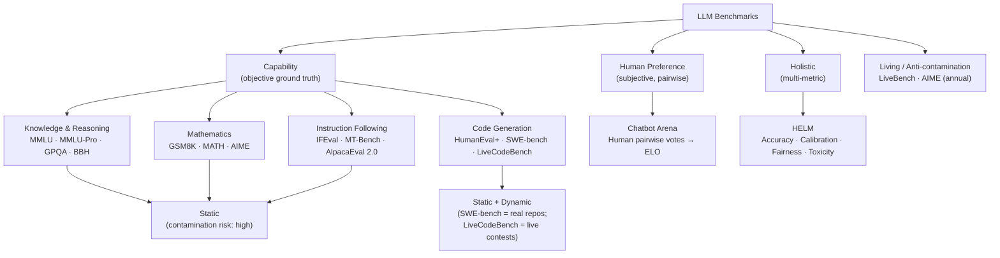
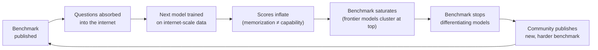

# LLM Benchmarks: A Field Guide to Reading the Leaderboards

The announcement lands on a Tuesday morning. A new model has topped the leaderboard. The blog post includes a chart showing it outperforming every competitor on three benchmarks, with bars in the company's brand colors. By Wednesday, a competing lab publishes their own chart—different benchmarks, also in their brand colors, also showing their model on top. By Friday, a third company posts a thread explaining why both charts are misleading.

Everyone is technically correct. No one is telling you what you actually need to know.

This is the second post in the Benchmarks series. Where the [first post](./vector-db-benchmarks) focused on vector databases—systems with well-defined inputs, outputs, and algorithmic tradeoffs—this post addresses a harder evaluation problem: measuring the capabilities of systems that produce open-ended language. The measurement problem here is not just technical. It is epistemological. What does it mean for a language model to be better than another? Better at what? According to whom? Measured how?

The answer, as always in empirical science, is: it depends on which measuring instrument you use, who calibrated it, and what it was designed to detect.

---

## The Benchmark Ecosystem: Why There Are So Many

A language model is not a single function. It is a system that can write poetry, solve differential equations, debug Python, summarize legal documents, pass medical licensing exams, and refuse to help with dangerous requests—sometimes in the same conversation. No single benchmark can measure all of this. Any benchmark that tries to measure everything measures none of it well.

This is the first reason there are so many benchmarks: the space of tasks is genuinely large, and different tasks demand different evaluation methodologies.

The second reason is the contamination problem, which we will examine in detail shortly: once a benchmark becomes the standard, it becomes a training target. Models trained after a benchmark's publication tend to score higher—not always because they are more capable, but because their training data includes the benchmark questions. The solution is to keep creating new benchmarks faster than models can absorb them.

The third reason is that there is a fundamental disagreement about what "better" means. Academic benchmarks measure capability against objective ground truth. Human preference benchmarks measure whether humans prefer one model's output over another's. These are related but not identical—a model can be objectively more accurate and yet less preferred by users who find its responses cold or verbose.

Understanding the ecosystem requires understanding these three tensions: breadth vs. depth, contamination vs. stability, capability vs. preference. Every benchmark sits somewhere in this space.

---

## The Contamination Problem: Why Numbers Alone Are Not Enough

Before examining any specific benchmark, this must be understood clearly, because it frames every number that follows.

When a benchmark is published, its questions become part of the public internet. When the next generation of models is trained on internet-scale data, they absorb those questions. A model that has seen a question during training—even once—is not demonstrating generalization when it answers it correctly. It is demonstrating memorization. This is **training data contamination**, and it is the most significant quality problem in LLM evaluation.

Contamination produces predictable artifacts:

**Score inflation over time.** Benchmark scores for new models consistently exceed what a naive extrapolation of capability improvements would predict. MMLU, published in 2020, saw scores jump from ~40% (GPT-3) to ~87-90% (frontier models in 2024) over four years—a rate of improvement that strains credibility as a pure capability gain.

**Saturation.** Once contamination is widespread, a benchmark stops differentiating models. GSM8K (grade-school math) now sees frontier models scoring above 95%. Whether one model scores 96% and another 97% tells you essentially nothing about their practical math capabilities. The benchmark is saturated.

**Performance gaps between similar tasks.** A contaminated model may score 90% on MMLU while scoring 65% on MMLU-Pro—a harder, less-contaminated version of the same knowledge domain. The gap reveals that the high MMLU score reflects benchmark familiarity more than underlying capability.

**Decontamination is harder than it sounds.** The common approach—checking whether benchmark questions appear verbatim in training data—catches direct copies but misses paraphrases, reformulations, and questions reconstructed from answers that were in training data. Benchmarks with structured, templated questions are particularly vulnerable.

The practical implication: when reading any benchmark result, ask how recently the benchmark was published, whether the model being evaluated was trained after publication, and whether harder or less-public variations show the same score. The most trustworthy benchmarks are either continuously updated with new questions or operate in domains where internet-scale contamination is structurally difficult.

---

## Knowledge and Reasoning Benchmarks

### MMLU: Massive Multitask Language Understanding

**Published by:** Dan Hendrycks, Collin Burns, et al. (UC Berkeley), 2020
**Paper:** [arxiv.org/abs/2009.03300](https://arxiv.org/abs/2009.03300)
**Leaderboard:** [paperswithcode.com/sota/multi-task-language-understanding-on-mmlu](https://paperswithcode.com/sota/multi-task-language-understanding-on-mmlu)

MMLU is the benchmark that made LLM evaluation mainstream. It covers 57 academic subjects—from elementary mathematics and US history to professional medicine, law, and clinical knowledge—in a 4-choice multiple-choice format. The full test contains approximately 14,000 questions across three splits (dev, validation, test).

The original motivation was compelling: rather than testing narrow capabilities, evaluate whether a model has absorbed the kind of broad factual and reasoning knowledge that any educated person should have. Human expert baselines were established per subject, giving a meaningful point of comparison.

**Metric:** Accuracy (fraction of correct answers). The 4-choice format gives a 25% random baseline.

**What it measures well:** Breadth of factual knowledge and basic reasoning across many domains. Useful as a rough signal that a model has not catastrophically failed in some knowledge area. Enables subject-by-subject breakdowns that reveal domain-specific weaknesses.

**What it does not measure:** Open-ended reasoning, multi-step problem solving, practical task completion, refusal behavior, or anything requiring generation rather than selection. Getting MMLU right requires knowing the answer, not producing it—a meaningfully different cognitive task.

**The saturation and contamination situation:** MMLU is heavily saturated. Frontier models from every major lab now score in the 85-90% range. Gains between generations are measured in fractions of a percentage point. The benchmark was first published in 2020, which means five years of internet-scraped training data have absorbed it thoroughly. Differences at this score range are within measurement noise for most practical purposes.

| Model (as of benchmark's last major update) | MMLU Score |
|----------------------------------------------|-----------|
| Random baseline | 25.0% |
| Average non-expert human | ~34% |
| GPT-3 (2020) | 43.9% |
| Expert human average | ~89.8% |
| Frontier models (2024–2025) | 85–91% |

**When to consult it:** As a sanity check. If a model scores below ~75% on MMLU, something is wrong. Above ~80%, the differences are too noisy and contamination-affected to be informative about real capability differences.

---

### MMLU-Pro: The Harder Successor

**Published by:** TIGER-Lab, 2024
**Paper:** [arxiv.org/abs/2406.01574](https://arxiv.org/abs/2406.01574)
**Leaderboard:** [huggingface.co/spaces/TIGER-Lab/MMLU-Pro](https://huggingface.co/spaces/TIGER-Lab/MMLU-Pro)

MMLU-Pro addresses two of the original MMLU's main weaknesses. First, it increases the number of choices from 4 to 10, which reduces the impact of random guessing and test-taking strategies that exploit the 4-choice format. Second, the questions are sourced from harder academic materials, college-level textbooks, and professional exams, with distractors designed to require genuine reasoning rather than elimination of obviously wrong answers.

The result is a benchmark where chain-of-thought reasoning matters significantly—models that reason step-by-step outperform those that attempt direct answer prediction.

**Metric:** Accuracy with 10 choices (10% random baseline).

**What it reveals:** The gap between an MMLU score and an MMLU-Pro score is diagnostic. A model that scores 88% on MMLU and 60% on MMLU-Pro has a larger contamination-to-capability ratio than one that scores 88% on MMLU and 72% on MMLU-Pro. The Pro version is harder to game by memorization alone.

| Model | MMLU | MMLU-Pro | Gap |
|-------|------|----------|-----|
| GPT-4o | ~88% | ~72% | 16pp |
| Claude 3.5 Sonnet (2024) | ~88% | ~72% | 16pp |
| Gemini 1.5 Pro | ~85% | ~69% | 16pp |
| Llama 3.1 70B | ~83% | ~56% | 27pp |

*(Scores are representative of mid-2025 results; consult the leaderboard for current figures.)*

The larger the gap between MMLU and MMLU-Pro, the more a model's MMLU score reflects benchmark familiarity rather than general reasoning capability.

---

### GPQA: Graduate-Level Google-Proof Q&A

**Published by:** David Rein et al. (NYU, Anthropic, DeepMind), 2023
**Paper:** [arxiv.org/abs/2311.12022](https://arxiv.org/abs/2311.12022)
**Leaderboard:** [paperswithcode.com/sota/question-answering-on-gpqa](https://paperswithcode.com/sota/question-answering-on-gpqa)

GPQA is the benchmark for measuring genuine expert-level reasoning. Each question was written by a PhD-level expert in biology, chemistry, or physics, and was specifically designed so that non-experts who Google the question cannot reliably answer it. Questions require multi-step domain reasoning, not just factual recall.

The design is validated empirically: non-experts with internet access score around 34%—barely above random (25%)—while domain experts score between 65% and 74% on questions outside their specific subfield. This means GPQA has genuine headroom: scoring above expert-human performance on GPQA is a meaningful signal.

GPQA Diamond is the hardest subset: 198 questions filtered for maximum difficulty and unambiguity.

**Metric:** Accuracy on the Diamond subset is the standard reporting target.

**What it measures:** Deep scientific reasoning, multi-step expert knowledge synthesis, resistance to surface-level pattern matching. The "google-proof" design means models that score high cannot have done so by memorizing web pages.

**What it reveals about the frontier:** GPQA is currently the most informative capability benchmark at the frontier because it has genuine headroom and meaningful human baselines. The delta between a model's GPQA score and the expert-human range is a cleaner signal than MMLU percentages.

| Model | GPQA Diamond | Notes |
|-------|-------------|-------|
| Expert human (own domain) | ~74% | Upper bound for comparison |
| Non-expert + Google | ~34% | Confirms benchmark validity |
| GPT-4o (mid-2024) | ~50–53% | Below expert human |
| Claude 3.5 Sonnet (2024) | ~59–65% | Approaching expert human |
| o1-preview (2024) | ~73–78% | Near expert human range |
| o3 / advanced reasoning models | ~80%+ | Above typical expert human |

**When to consult it:** When you need to understand whether a model can reason through genuinely hard domain-specific problems—medical, scientific, technical. The single most informative benchmark for research assistants, scientific search, and domain-expert augmentation tools.

---

### BIG-Bench Hard (BBH)

**Published by:** Suzgun et al. (Google Research), 2022
**Paper:** [arxiv.org/abs/2210.09261](https://arxiv.org/abs/2210.09261)

BIG-Bench (Beyond the Imitation Game Benchmark) was Google's attempt to create tasks that were difficult enough to remain challenging as models improved. From the 204 original BIG-Bench tasks, BIG-Bench Hard (BBH) extracted the 23 tasks where models performed below human baselines even after extended effort—tasks involving multi-step reasoning, logical deduction, algorithmic reasoning, and causal inference.

BBH is particularly useful for evaluating chain-of-thought reasoning improvements, because few-shot CoT prompting significantly improves performance on most BBH tasks, and the delta between direct prompting and CoT prompting varies meaningfully across models.

**Metric:** Accuracy, with separate tracking for direct prompting vs. chain-of-thought.

**What it measures:** Systematic multi-step reasoning, algorithmic thinking, tracking of logical state across steps. Less contaminated than MMLU because the tasks are more unusual and less represented in standard training corpora.

---

## Mathematics Benchmarks

Mathematics benchmarks occupy a special place because mathematical reasoning is both objectively verifiable and genuinely hard to fake through memorization alone. A model that can solve novel mathematical problems it has never seen is demonstrating something real.

### GSM8K: Grade School Math

**Published by:** Cobbe et al. (OpenAI), 2021
**Paper:** [arxiv.org/abs/2110.14168](https://arxiv.org/abs/2110.14168)

GSM8K contains 8,500 grade-school-level math word problems requiring multi-step arithmetic reasoning—the kind of problems that involve reading comprehension, unit tracking, and multi-step calculation, but no advanced mathematics. A typical problem: "A store sells apples in bags of 6 and oranges in bags of 4. If you buy 3 bags of each, how many pieces of fruit do you have in total?"

GSM8K was a meaningful benchmark in 2021, when frontier models scored around 40-50%. It is now saturated. Every frontier model scores above 95%, and the difference between 96% and 97% tells you nothing useful. GSM8K is still worth including in evaluations as a baseline sanity check—a model that fails GSM8K reliably has serious problems—but it no longer differentiates capable models.

**Metric:** Exact match on the final numerical answer.

**Saturation status:** Fully saturated. Use for baseline checks only.

---

### MATH: Competition Mathematics

**Published by:** Hendrycks et al. (UC Berkeley), 2021
**Paper:** [arxiv.org/abs/2103.03874](https://arxiv.org/abs/2103.03874)
**Leaderboard:** [paperswithcode.com/sota/math-word-problem-solving-on-math](https://paperswithcode.com/sota/math-word-problem-solving-on-math)

MATH is a qualitatively harder benchmark: 12,500 competition mathematics problems drawn from AMC 8/10/12, AIME, and other competitions. Problems span five difficulty levels (1-5) across seven subjects: algebra, counting and probability, geometry, intermediate algebra, number theory, pre-algebra, and pre-calculus.

Unlike GSM8K, MATH requires genuine mathematical knowledge—facility with algebraic manipulation, geometric reasoning, combinatorial arguments, number-theoretic properties—not just multi-step arithmetic. Level 4 and 5 problems are hard enough that the average human with a college degree cannot solve them reliably.

**Metric:** Exact match on the final answer (typically a number, expression, or simplified form). The grading is automated using symbolic comparison, which introduces occasional mismatches on equivalent forms.

**What it reveals:** The trajectory of model improvement on MATH has been striking and genuine. GPT-3 scored ~5%. GPT-4 reached ~52%. Models with extended thinking/reasoning capabilities pushed above 70-80% on the full dataset. This progression on a hard, relatively uncontaminated benchmark is more meaningful than the same model's MMLU improvement over the same period.

| Model | MATH (full) | MATH (Level 5 only) |
|-------|------------|---------------------|
| GPT-3 | ~5% | ~2% |
| GPT-4 (2023) | ~52% | ~35% |
| GPT-4o (2024) | ~76% | ~55% |
| Claude 3.5 Sonnet (2024) | ~71% | ~50% |
| o1-preview (2024) | ~85% | ~70% |
| o3 / advanced reasoning | ~90%+ | ~85% |

**When to consult it:** Whenever mathematical reasoning is part of your application—tutoring systems, financial modeling, scientific computing, anything involving symbolic manipulation. MATH Level 4-5 specifically distinguishes reasoning models from standard models.

---

### AIME: American Invitational Mathematics Examination

**Published by:** Mathematical Association of America, annually
**Relevant to models:** 2024–present
**Reference:** [artofproblemsolving.com/wiki/index.php/AIME](https://artofproblemsolving.com/wiki/index.php/AIME)

AIME is not a benchmark designed for AI evaluation—it is a competition exam for high school mathematicians, published annually. Each exam contains 15 problems; scores are integers from 0 to 15. AIME problems are hard: the average high school participant (already selected for mathematical ability) scores 5-7.

AIME has become an informal standard for measuring frontier mathematical reasoning precisely because it is genuinely hard, updated annually (preventing contamination), and has meaningful human baselines. A model that scores 12-15 on AIME is demonstrating mathematical reasoning that exceeds most human mathematicians.

**Metric:** Number of correct answers out of 15 (integers 000–999, exact match).

**Why it matters:** AIME is the benchmark that revealed the qualitative capability jump in reasoning models. Standard models (GPT-4, Claude 3 Sonnet) score 4-8 on AIME. Models trained with extended reasoning (o1, o3, DeepSeek-R1) score 12-15—sometimes achieving perfect scores on recent exams. This gap is the clearest empirical evidence that reasoning training is a qualitatively different capability, not incremental improvement.

| Model type | AIME 2024 (approx.) |
|-----------|---------------------|
| Average AIME qualifier (human) | 5–8 |
| GPT-4o / Claude 3.5 Sonnet | 6–9 |
| o1-preview | 12–13 |
| o3 (reported) | 14–15 |
| Top human performers | 14–15 |

---

## Code Generation Benchmarks

### HumanEval and HumanEval+

**Published by:** Chen et al. (OpenAI), 2021
**Paper:** [arxiv.org/abs/2107.03374](https://arxiv.org/abs/2107.03374)
**HumanEval+:** [EvalPlus, arxiv.org/abs/2305.01210](https://arxiv.org/abs/2305.01210)

HumanEval contains 164 hand-written Python programming problems. Each problem provides a function signature, a docstring describing the task, and a set of test cases. The model must generate a correct implementation.

The metric is **pass@k**: the probability that at least one of k sampled solutions passes all test cases. pass@1 (does the first attempt succeed?) is the standard reported figure; pass@10 and pass@100 measure what happens with multiple attempts.

HumanEval was a meaningful benchmark in 2021-2022. By 2024, it was largely saturated—top models score above 88-92% pass@1. HumanEval+ (from EvalPlus) addresses the main weakness of the original: many of the original test cases were too simple, allowing incorrect implementations that passed all tests. HumanEval+ adds substantially more test cases per problem, revealing that models scoring 88% on HumanEval may only score 76% on HumanEval+ because their solutions did not handle edge cases correctly.

**Metric:** pass@1 (fraction of problems where the first sample passes all tests).

**Saturation status:** Original HumanEval is saturated. HumanEval+ is a better signal, though also trending toward saturation. For serious code capability evaluation, prefer SWE-bench or LiveCodeBench.

---

### SWE-bench: Real Software Engineering

**Published by:** Jimenez et al. (Princeton, University of Chicago), 2023
**Paper:** [arxiv.org/abs/2310.06770](https://arxiv.org/abs/2310.06770)
**Leaderboard:** [swe-bench.github.io](https://swe-bench.github.io)

SWE-bench is qualitatively different from HumanEval. Rather than isolated function implementation, it presents real GitHub issues from 12 popular Python repositories (Django, Flask, NumPy, Pandas, Scikit-learn, etc.) and asks: given the issue description and the codebase, generate a patch that resolves the issue and passes the repository's existing test suite.

This is software engineering as it actually exists—understanding a large existing codebase, localizing a bug in context, reasoning about the consequences of a change, and producing a diff that integrates cleanly. The evaluation is automated but extremely meaningful: a solution either passes the repository's real tests or it does not.

**SWE-bench Verified** is a subset of 500 instances reviewed by human software engineers to confirm that the problem statement is unambiguous and the reference solution is correct.

**Metric:** Percentage of resolved instances (% Resolved).

**Why it matters:** SWE-bench directly measures the capability that matters most for coding assistants and autonomous engineering agents. The gap between HumanEval scores and SWE-bench scores is the clearest indicator of how far a model's coding capability extends beyond pattern-matching into real engineering.

| Model / Agent | SWE-bench Verified (% Resolved) |
|--------------|----------------------------------|
| GPT-4o (zero-shot, no scaffolding) | ~4–8% |
| Claude 3.5 Sonnet (zero-shot) | ~10–15% |
| SWE-agent + GPT-4 (scaffolded agent) | ~18–23% |
| Best published agentic approaches (2025) | ~45–60% |

The large gap between zero-shot models and scaffolded agents reveals that code generation capability and software engineering capability are different skills. A model with a great HumanEval score but poor zero-shot SWE-bench performance is good at writing isolated functions but struggles with the contextual reasoning that real codebases demand.

---

### LiveCodeBench

**Published by:** Jain et al. (University of Illinois, UC Berkeley), 2024
**Paper:** [arxiv.org/abs/2403.07974](https://arxiv.org/abs/2403.07974)
**Leaderboard:** [livecodebench.github.io](https://livecodebench.github.io)

LiveCodeBench addresses HumanEval's contamination problem directly: it continuously collects new programming problems from LeetCode, AtCoder, and CodeForces, filtering for problems published after a specified cutoff date. This means the benchmark can be evaluated against truly unseen problems—the model cannot have encountered them during training.

The benchmark tracks scores across different time windows, allowing you to see how a model performs on problems published in different periods. A model that scores well on problems from 2022-2023 but poorly on problems from late 2024 is exhibiting clear contamination effects.

**Metric:** pass@1 on new contest problems, tracked by publication date window.

**When to consult it:** When you need a contamination-resistant measure of coding capability, particularly for competitive programming tasks.

---

## Instruction Following and Alignment

Capability benchmarks measure what a model *can* do. Instruction following benchmarks measure whether a model *does what it is told*—whether it respects format constraints, structural requirements, length limits, and explicit instructions. These are different skills.

### IFEval: Instruction Following Evaluation

**Published by:** Zhou et al. (Google DeepMind), 2023
**Paper:** [arxiv.org/abs/2311.07911](https://arxiv.org/abs/2311.07911)

IFEval tests a model's ability to follow verifiable formatting and structural instructions. Each prompt contains explicit constraints: "respond with exactly three bullet points," "include the word 'sustainability' in every paragraph," "write a JSON object with these exact keys," "use fewer than 500 words." The constraints are chosen so compliance can be verified programmatically without human judgment.

IFEval distinguishes between models that understand what to do and models that actually do it. A model can achieve high MMLU scores (demonstrating knowledge of what follows instructions means) while failing IFEval (failing to execute the constraint in practice). For production applications where output format is critical—structured data extraction, template completion, constrained generation—IFEval is more informative than any capability benchmark.

**Metric:** Prompt-level and instruction-level accuracy (fraction of prompts and individual instructions satisfied).

---

### MT-Bench: Multi-Turn Conversations

**Published by:** Zheng et al. (LMSys, UC Berkeley), 2023
**Paper:** [arxiv.org/abs/2306.05685](https://arxiv.org/abs/2306.05685)

MT-Bench evaluates model quality on 80 two-turn conversations across eight categories: writing, roleplay, extraction, reasoning, math, coding, STEM, and humanities. The second turn in each conversation asks a follow-up question that requires integrating the first answer—testing whether the model can maintain coherent context across turns.

The evaluation uses **GPT-4 as judge**: GPT-4 rates each response on a 1-10 scale. This is one of the first widely adopted instances of LLM-as-judge evaluation, which has become a standard methodology for quality assessment that would otherwise require expensive human annotation.

**Metric:** Average score (1-10) from GPT-4 judge, per category and overall.

**Key limitation:** GPT-4-as-judge inherits GPT-4's biases. It tends to prefer longer, more structured responses, and shows a mild preference for outputs stylistically similar to GPT-4's own outputs. Models that generate verbose, well-formatted responses score higher than equivalently correct but more concise models. MT-Bench scores should not be compared between evaluation runs that use different GPT-4 versions as judge.

---

### AlpacaEval and AlpacaEval 2.0

**Published by:** Dubois et al. (Stanford Tatsu-Lab), 2023
**Paper:** [arxiv.org/abs/2404.04475](https://arxiv.org/abs/2404.04475)
**Leaderboard:** [tatsu-lab.github.io/alpaca_eval](https://tatsu-lab.github.io/alpaca_eval)

AlpacaEval compares model outputs against a reference model (originally text-davinci-003) on 805 diverse instructions, using GPT-4 as judge. The metric is win rate—the fraction of cases where GPT-4 prefers the tested model over the reference.

AlpacaEval 2.0 addresses a critical weakness: models learned to game AlpacaEval by generating longer responses, since GPT-4-as-judge showed a systematic preference for verbosity. AlpacaEval 2.0 introduces **length-controlled win rate**, which adjusts the win rate to account for response length. A model that wins by being verbose gets penalized; a model that wins despite being concise gets rewarded.

**Metric:** Win rate (v1) or length-controlled win rate (v2) vs. reference model.

**When to consult it:** As a fast, cheap signal of general conversational quality and instruction following. It correlates reasonably well with human preference. The length-controlled version is the only valid one to use—raw win rates are meaningless due to the length bias.

---

## Holistic Evaluation: HELM

**Published by:** Liang et al. (Stanford CRFM), 2022
**Paper:** [arxiv.org/abs/2211.09110](https://arxiv.org/abs/2211.09110)
**Leaderboard:** [crfm.stanford.edu/helm/latest](https://crfm.stanford.edu/helm/latest)

HELM (Holistic Evaluation of Language Models) takes a different approach from every other benchmark: instead of measuring a single capability and reporting a single number, it measures models across many scenarios and many metrics simultaneously.

A HELM evaluation produces a profile: for a given model, HELM reports accuracy, calibration, robustness, fairness, bias, toxicity, and efficiency across dozens of scenarios. This multi-metric approach reveals tradeoffs that single-number benchmarks obscure—a model may be highly accurate but poorly calibrated (confidently wrong), or accurate but unfair across demographic groups, or efficient but biased.

**Key scenarios in HELM:**
- Question answering (NaturalQuestions, TriviaQA, BoolQ)
- Summarization (CNN/DailyMail, XSUM)
- Text classification (IMDB, Amazon, Civil Comments)
- Information retrieval (MS-MARCO)
- Mathematical reasoning (GSM8K, MATH)
- Coding (HumanEval)
- Toxicity (RealToxicityPrompts)
- Bias measurement (BBQ—Bias Benchmark for QA)

**Metric:** Not a single number. A normalized mean across scenarios per model, but the disaggregated results are more informative than the aggregate.

**What it reveals:** Models optimized for capability benchmarks often perform poorly on calibration and bias metrics. HELM makes this visible. A model that looks impressive on MMLU but shows high demographic bias in BBQ, or that is poorly calibrated (confidently wrong) despite high accuracy, has a profile that matters for production deployment.

**When to consult it:** When fairness, safety, and calibration matter to your application—content moderation, user-facing products, high-stakes decision support. HELM is the most comprehensive single reference for a multi-dimensional model assessment.

---

## Human Preference: LMSYS Chatbot Arena

**Published by:** Zheng et al. (LMSys, UC Berkeley), ongoing since 2023
**Paper:** [arxiv.org/abs/2403.04132](https://arxiv.org/abs/2403.04132)
**Leaderboard:** [chat.lmsys.org](https://chat.lmsys.org) / [leaderboard.lmsys.org](https://leaderboard.lmsys.org)

Chatbot Arena takes a fundamentally different approach: it measures what humans actually prefer, not what academic benchmarks score. Two models respond anonymously to the same prompt submitted by a real user. The user votes for the better response. Over millions of such votes, a Bradley-Terry model computes ELO ratings for each model.

**Why this matters:** Chatbot Arena reveals the gap between academic capability and user preference. A model that scores marginally below a competitor on MMLU but produces responses that users prefer 55% of the time in head-to-head comparisons is the better model for user-facing applications—full stop. Academic benchmark scores are proxies; human preference is the actual target.

**Metric:** ELO score (Bradley-Terry model from human pairwise preferences).

**Category-specific ELO:** Arena now publishes category-specific rankings (coding, math, creative writing, instruction following), which are more informative than the aggregate.

**Limitations that matter:**

*Selection bias in prompts.* Arena users self-select their questions. They skew toward English, toward technical questions, toward use cases of people who are already using AI. The user population is not representative of every deployment context.

*Response length bias.* Like GPT-4-as-judge, human judges in Arena show a preference for longer, more detailed responses. Models that generate verbose answers tend to score slightly higher than their actual quality warrants. Arena has acknowledged this and is developing mitigation strategies.

*Gaming through system prompts.* Some model providers deploy models on Arena with elaborately tuned system prompts. The model you interact with on Arena may not be the same model you access via API.

*Not an objective capability test.* A model can rank highly in Arena by being pleasant and agreeable rather than accurate. There is documented evidence that models optimized for Arena ELO learned to be sycophantic.

Despite these limitations, Chatbot Arena ELO is the single best proxy for general user-facing quality when you cannot run your own evaluation. The category-specific rankings are particularly valuable.

---

## Living Benchmarks: Built to Resist Contamination

### LiveBench

**Published by:** White, Dettmers, et al., 2024
**Paper:** [arxiv.org/abs/2406.19314](https://arxiv.org/abs/2406.19314)
**Leaderboard:** [livebench.ai](https://livebench.ai)

LiveBench is the most direct engineering response to the contamination problem. Questions are sourced from recent publications, news, and competition problems with a known publication date. The benchmark is updated monthly, and questions are dated so you can evaluate models only on questions published after their training cutoff.

LiveBench covers six categories: math, coding, reasoning, language comprehension, instruction following, and data analysis. All questions have verifiable, non-subjective answers—no LLM judge is required.

**Metric:** Accuracy on verifiably correct answers, by category and date window.

**The key use:** Compare models using only questions published after both models' training cutoffs. If model A was trained on data through January 2025 and model B through March 2025, compare them on questions from April 2025 onward. This is the closest available approximation to a truly fair benchmark.

---

## The Full Benchmark Reference Table

This table is a reference snapshot. Scores change with every new model release—consult the linked leaderboards for current figures.

| Benchmark | Domain | Format | Who Made It | Contamination Risk | Saturated? | Best For |
|-----------|--------|--------|-------------|-------------------|------------|----------|
| MMLU | General knowledge | 4-choice MCQ | UC Berkeley | Very High | Yes | Sanity checks only |
| MMLU-Pro | General knowledge | 10-choice MCQ | TIGER-Lab | Medium | Partially | Knowledge breadth |
| GPQA Diamond | Expert science | 4-choice MCQ | NYU/Anthropic | Low | No | Expert reasoning |
| BIG-Bench Hard | Reasoning | Various | Google | Low | No | Systematic reasoning |
| GSM8K | Grade math | Open answer | OpenAI | Very High | Yes | Baseline only |
| MATH | Competition math | Open answer | UC Berkeley | Medium | Partially | Math capability |
| AIME | Hard competition math | Integer answer | MAA (annual) | Very Low | No | Frontier math |
| HumanEval+ | Code (isolated) | Code generation | EvalPlus | High | Partially | Basic coding |
| SWE-bench Verified | Software engineering | Patch generation | Princeton | Low | No | Agentic coding |
| LiveCodeBench | Code (live) | Code generation | UIUC/Berkeley | Very Low | No | Uncontaminated coding |
| IFEval | Instruction following | Constrained gen | Google | Low | No | Production compliance |
| MT-Bench | Multi-turn chat | Open-ended | LMSys | Low | No | Conversational quality |
| AlpacaEval 2.0 | General instruction | LLM-judged | Stanford | Low | No | Fast quality signal |
| HELM | Holistic | Multi-task | Stanford CRFM | Medium | No | Fairness + calibration |
| Chatbot Arena | Human preference | Pairwise vote | LMSys | N/A | No | User-facing quality |
| LiveBench | Mixed | Verifiable | livebench.ai | Very Low | No | Fresh, fair comparison |
| SimpleQA | Factuality | Short answer | OpenAI | Low | No | Hallucination rate |

---

## How to Choose the Right Benchmark for Your Task

The question is never "which model is best?" The question is "which model is best **for my specific use case**?" These are different questions with different answers.

### For knowledge-intensive RAG and search systems

Lead with **GPQA Diamond** and **MMLU-Pro**. If your system answers domain-specific questions in science, medicine, or law, GPQA is the most relevant signal. MMLU-Pro's broader coverage handles mixed domains. Supplement with **HELM** if you need calibration and bias measurement for high-stakes deployments.

Ignore raw MMLU—the scores are too compressed and contaminated to be informative at the frontier.

### For coding assistants and developer tools

Use **SWE-bench Verified** as your primary signal. Pass@1 on isolated functions (HumanEval) does not predict whether a model can navigate a real codebase. Supplement with **LiveCodeBench** for a contamination-resistant check, and add **IFEval** if output format compliance matters for your tool.

### For mathematical applications

**MATH Level 4-5** and **AIME** are the signals that differentiate models. GSM8K is useless at the frontier. If extended reasoning models are relevant to your application, the AIME scores are the clearest differentiator.

### For user-facing conversational products

**Chatbot Arena category-specific ELO** (not aggregate—find the category matching your use case) plus **AlpacaEval 2.0 length-controlled win rate** for a reproducible complement. If your product requires specific output formats or structured data, add **IFEval**.

### For any production deployment with fairness requirements

Run **HELM** for the full multi-metric profile. Accuracy alone is insufficient when you need to understand calibration (is the model confidently wrong?), demographic bias (does it treat different groups differently?), and toxicity exposure.

### For comparing models fairly when their training cutoffs differ

Use **LiveBench** with a date filter that restricts to questions published after both models' training cutoffs. This is currently the closest thing to a contamination-free general evaluation.

---

## Reading a Benchmark Result Critically: A Checklist

Before any benchmark score influences a decision, run it through this checklist.

**Who published the result?** Results published by the model's own developers deserve more scrutiny than results from independent evaluators. This is not an accusation of dishonesty—it is acknowledgment of the structural incentive to present results favorably through selection of benchmarks, configurations, and comparison baselines.

**Which prompting strategy was used?** Few-shot vs. zero-shot, chain-of-thought vs. direct, with or without a system prompt. The same model can vary by 10-20 percentage points on the same benchmark under different prompting strategies. Results are not comparable unless prompting strategies are matched.

**Was the evaluation independent?** If the evaluation used GPT-4 as judge, who deployed the GPT-4 used for judging, and which version? If human evaluation, how were annotators recruited and instructed?

**What is the comparison baseline?** A model that is "30% better than baseline" needs you to know what baseline it used. text-davinci-003 in 2024 is not a meaningful baseline. GPT-4o is.

**Is the benchmark relevant to your task?** High MMLU-Pro score from a model you want to use for code review tells you very little. SWE-bench from the same model tells you something. Match benchmarks to intended use.

**Has the benchmark been gamed before?** MMLU is heavily contaminated. AlpacaEval v1 was gamed by verbosity. Arena ELO has been influenced by system prompt optimization. A benchmark's history of gaming attempts tells you how much its current scores should be trusted.

---

## The Reflexive Problem: Goodhart's Law in Evaluation

There is a final problem with benchmarks that sits above all the specific issues discussed: once a measure becomes a target, it ceases to be a good measure.

This is Goodhart's Law, and it operates at every level of LLM development. Labs optimize their models for the benchmarks that matter for reputation. When MMLU was the prestige metric, training procedures and data mixes were adjusted to improve MMLU performance. When Chatbot Arena ELO became the prestige metric, training was adjusted to improve Arena ELO—which turned out to include adjusting for verbosity and style preferences of Arena voters.

This is not fraud. It is rational behavior in a competitive landscape where benchmark performance is a proxy for quality, and improving the proxy is faster than improving the underlying quality. The result is that every adopted benchmark has a shelf life. As soon as it becomes standard, the gap between what it measures and what it is supposed to measure begins to widen.

The most honest response to this is to treat benchmark scores as Bayesian evidence rather than ground truth: each benchmark is one noisy signal that updates your estimate of a model's capability in a direction. Multiple benchmarks together, with different methodologies and different potential gaming strategies, provide stronger evidence than any single benchmark. And your own evaluation on your own tasks—even a small, informal evaluation—is worth more than any published benchmark when it comes to predicting performance in your specific deployment.

---

## What Comes Next in the Series

This post and the vector database benchmarks post form the first two pillars of the Benchmarks series. The series will continue with:

**Embedding Model Benchmarks (MTEB):** The Massive Text Embedding Benchmark covers 58 datasets across 8 task types—retrieval, classification, clustering, reranking, and more. Choosing the right embedding model is not a matter of picking the top of the MTEB leaderboard; it is a matter of matching the task distribution of MTEB to your actual retrieval workload. Many teams deploy embedding models that rank highly on general MTEB but perform poorly on their specific domain.

**RAG System Evaluation End-to-End:** RAGAS, ARES, TruLens, and the emerging standard of LLM-judged answer quality evaluation. How to measure whether your retrieval system actually improves the answers your language model produces, rather than measuring retrieval and generation in isolation.

**Inference Infrastructure Benchmarks:** vLLM throughput, latency under load, speculative decoding, quantization effects on quality. How to measure the serving infrastructure that delivers model capabilities to users, and how those measurements interact with the model-quality benchmarks covered here.

Each post in this series carries a changelog when significant updates are made—benchmark landscapes change quickly, and a reference that stops being updated stops being useful.

---

Benchmarks are maps. They represent territory—model capability, user preference, task-specific performance—but they are not the territory itself. A map made in 2021 is still a map, and it will still help you navigate, but it will also have roads that no longer exist and miss roads that were built after printing.

The skill is not memorizing the current leaderboard. The skill is knowing which map to use for which journey, knowing when a map was last updated, knowing who drew it and what they were trying to show, and knowing when you have reached the edge of what any existing map can tell you and must navigate by direct observation instead.

The model that scores highest on every benchmark published in 2024 is not necessarily the model that best serves your users in 2026. The evaluation that tells you the most is usually the one you design yourself, on your data, for your task—informed by everything the public benchmarks have taught you about what to look for.

---

## Going Deeper

**Papers:**

- Hendrycks, D., et al. (2020). [Measuring Massive Multitask Language Understanding.](https://arxiv.org/abs/2009.03300) *arXiv:2009.03300.* — The MMLU paper. Read it for the motivation and methodology, not the results (which are now outdated). The subject taxonomy and the argument for breadth-of-knowledge evaluation remain relevant.

- Rein, D., et al. (2023). [GPQA: A Graduate-Level Google-Proof Q&A Benchmark.](https://arxiv.org/abs/2311.12022) *arXiv:2311.12022.* — The most careful benchmark design paper of recent years. The analysis of why Google-proofing matters and how expert-human calibration was established is methodologically instructive for anyone designing evaluations.

- Jimenez, C., et al. (2023). [SWE-bench: Can Language Models Resolve Real-World GitHub Issues?](https://arxiv.org/abs/2310.06770) *arXiv:2310.06770.* — The paper that shifted the coding evaluation conversation from isolated function generation to real software engineering. The task design and evaluation methodology are the key contributions.

- Zheng, L., et al. (2023). [Judging LLM-as-a-Judge with MT-Bench and Chatbot Arena.](https://arxiv.org/abs/2306.05685) *arXiv:2306.05685.* — Introduces the LLM-as-judge methodology and the Arena framework. Critical reading for understanding both MT-Bench and the human preference evaluation approach.

- Liang, P., et al. (2022). [Holistic Evaluation of Language Models.](https://arxiv.org/abs/2211.09110) *arXiv:2211.09110.* — The HELM paper. The argument for multi-metric holistic evaluation over single-number leaderboards is the most important conceptual contribution.

- White, J., et al. (2024). [LiveBench: A Challenging, Contamination-Free LLM Benchmark.](https://arxiv.org/abs/2406.19314) *arXiv:2406.19314.* — The contamination-resistant benchmark design. Read this alongside the Hendrycks MMLU paper to understand how benchmark design has evolved in response to contamination.

- Dubois, Y., et al. (2024). [Length-Controlled AlpacaEval: A Simple Way to Debias Automatic Evaluators.](https://arxiv.org/abs/2404.04475) *arXiv:2404.04475.* — An important case study in how benchmarks get gamed (verbosity bias in AlpacaEval v1) and how to fix it (length-controlled win rate). Useful for anyone designing evaluations.

**Leaderboards to Bookmark:**

- [LMSYS Chatbot Arena Leaderboard](https://chat.lmsys.org) — Human preference ELO, with category breakdowns. The most reliable signal for general user-facing quality.

- [LiveBench.ai](https://livebench.ai) — Contamination-resistant, monthly-updated benchmark. Use this for fair model comparisons when training cutoffs differ.

- [HELM Leaderboard (Stanford CRFM)](https://crfm.stanford.edu/helm/latest) — Multi-metric holistic evaluation. Use when you need fairness and calibration data alongside accuracy.

- [SWE-bench Leaderboard](https://swe-bench.github.io) — The definitive coding-in-context benchmark. Updated as new agent systems are submitted.

- [Papers With Code MMLU](https://paperswithcode.com/sota/multi-task-language-understanding-on-mmlu) and [GPQA](https://paperswithcode.com/sota/question-answering-on-gpqa) — Aggregated results from academic papers. Useful for tracking model-by-model breakdowns.

- [Open LLM Leaderboard (Hugging Face)](https://huggingface.co/spaces/HuggingFaceH4/open_llm_leaderboard) — Community-maintained evaluation of open-weight models on standardized benchmarks. Essential for evaluating Llama, Mistral, Gemma, and other open models.

**Videos:**

- ["The State of LLM Evaluation"](https://www.youtube.com/watch?v=pC8XWlx3jZw) — Conference talk by Nathan Lambert covering contamination, benchmark design, and the limits of current evaluation methodology. The most substantive overview of what is broken in LLM evaluation and what is being done about it.

- ["How to Evaluate LLMs"](https://www.youtube.com/watch?v=1aKY8EJ_3Dg) by Andrej Karpathy — A practitioner's perspective on the gap between benchmark performance and real capability. Karpathy's framing of what "understanding" means in LLMs is useful context for interpreting evaluation results.

**Questions to Explore:**

If contamination is structural—large-scale internet training inevitably absorbs published benchmarks—is the solution dynamic benchmarks, held-out private test sets, or something else entirely? What would an evaluation framework look like that is immune to Goodhart's Law? Is "immune to Goodhart's Law" even achievable, or does any measure, once adopted as a standard, become a target? And if human preference benchmarks like Chatbot Arena are the ground truth, what does it mean that humans prefer sycophantic responses—is optimizing for human preference a path toward capability or away from it?
