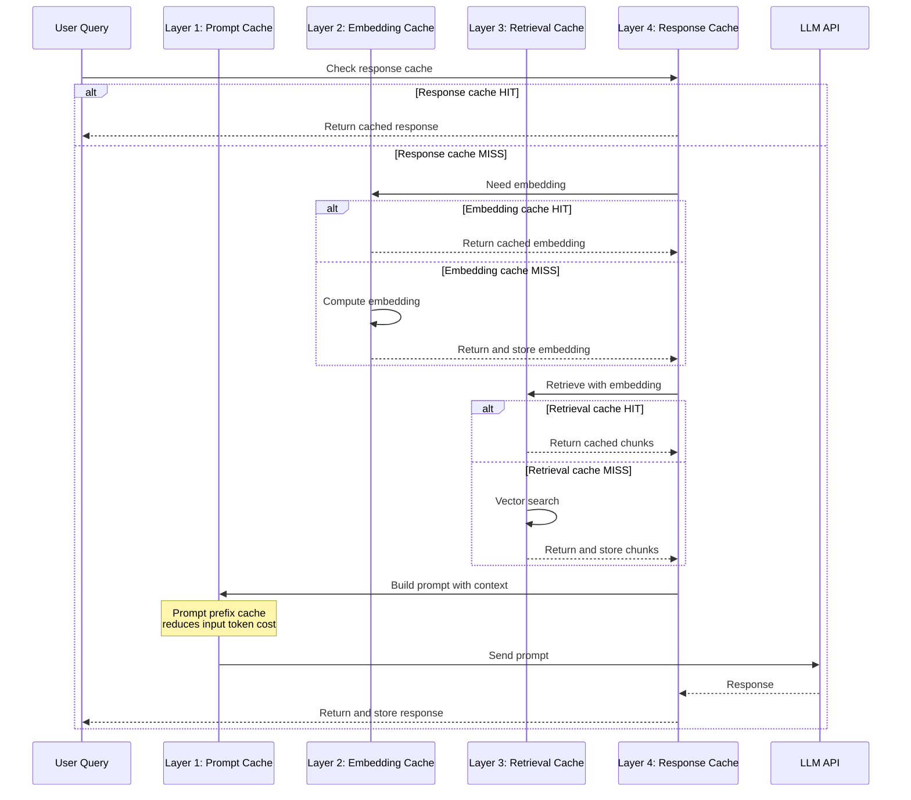
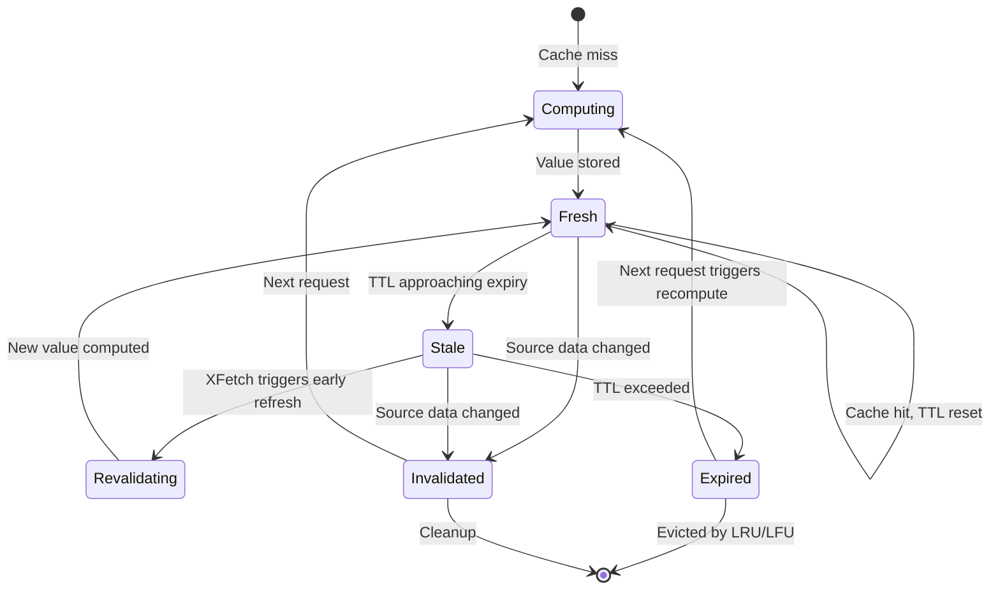
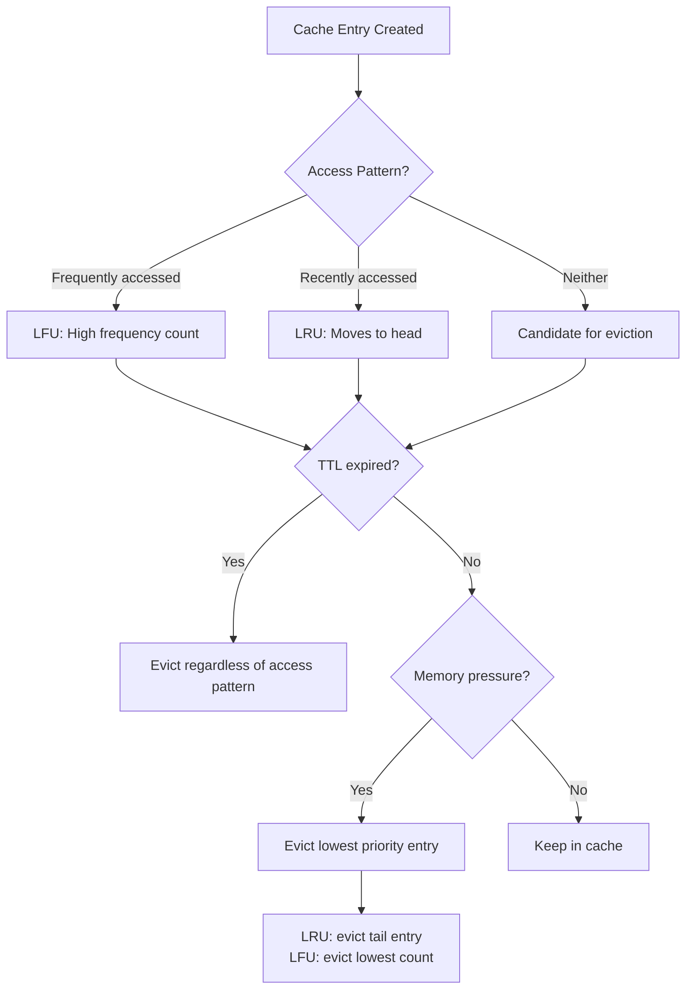
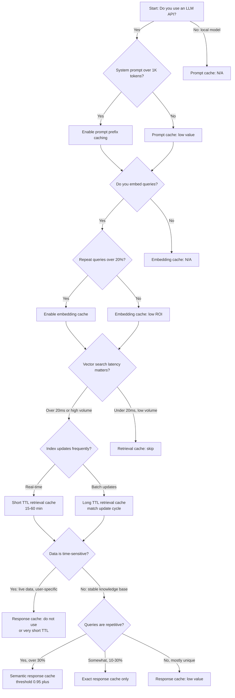

# Caching in LLM Systems: Four Layers That Actually Move the Needle

## The Invoice That Changed Everything

A team I know ran a customer-support RAG pipeline for three months before anyone looked at the token bill carefully. The system answered roughly 4,000 questions per day. Most were variations on the same forty topics: password resets, billing disputes, shipping timelines, return policies. The system dutifully embedded each question, retrieved five chunks from the vector store, assembled a prompt with a 3,200-token system instruction and the retrieved context, and sent the whole thing to the LLM. Every single time. The monthly API cost was north of $18,000.

They added caching at three layers over a long weekend. Prompt prefix caching cut the per-request input cost on the system instruction by 90%. An embedding cache eliminated redundant vectorization calls. A semantic response cache with a similarity threshold of 0.95 intercepted repeat questions before they ever hit the LLM. The bill dropped to roughly $5,400 -- a 70% reduction -- and median latency fell from 2.1 seconds to 0.4 seconds for cache hits.

Phil Karlton famously quipped that "there are only two hard things in Computer Science: cache invalidation and naming things." LLM systems make both harder. The inputs are natural language, so "the same request" is a fuzzy concept. The outputs are stochastic, so "the right answer" depends on when you ask. The costs are denominated in tokens, not CPU cycles, so the calculus of what to cache and for how long is fundamentally different from caching a REST endpoint.

This post maps the four cache layers that matter in a production LLM application, explains the mechanics of each, and gives you a decision framework for when to deploy them.

## Why LLM Caching Is Not REST Caching

Before we get into the layers, it is worth understanding why generic caching intuition breaks down in LLM systems.

In a traditional web application, you cache the response to a deterministic function of the request. Given the same URL, headers, and query parameters, the backend produces the same JSON. Cache keys are straightforward. Invalidation is event-driven: the underlying data changes, you bust the cache. Staleness is binary -- the cached response is either current or it is not.

LLM systems violate every one of these assumptions.

**Inputs are high-dimensional and fuzzy.** The "request" to an LLM is a prompt that might be 4,000 tokens long. Two prompts that differ by a single word might produce identical answers. Two prompts that look identical might produce different answers because the model is non-deterministic at temperature > 0. Exact-match cache keys work, but they miss the vast majority of cache-hit opportunities.

**Costs are asymmetric.** In REST caching, the saved resource is CPU time or database IOPS. In LLM caching, the saved resources are token costs (often $1-15 per million input tokens), GPU inference time, and rate-limit headroom. A single cache hit on a 10,000-token prompt saves more money than a thousand cache hits on a REST endpoint.

**Staleness is probabilistic.** A cached LLM response is not "stale" in the same way a cached database row is stale. If the underlying knowledge base has not changed and the question is the same, the cached response is as good as a fresh one. But if the user is asking about something time-sensitive -- "what is the current status of my order?" -- a cached response from five minutes ago is worse than useless.

**The pipeline has multiple cacheable stages.** A REST API is typically a single function call. An LLM pipeline has at least four stages -- prompt construction, embedding, retrieval, and generation -- each of which can be cached independently with different keys, different TTLs, and different invalidation strategies.



Let us walk through each layer.

## Layer 1: Prompt Prefix Cache

### How It Works

Every major LLM provider now offers some form of prompt prefix caching. The idea is simple: if the beginning of your prompt is identical across requests, the provider caches the key-value attention states computed for that prefix so subsequent requests skip recomputation.

**Anthropic's prompt caching** works by marking sections of your prompt with a `cache_control` parameter. When the first request processes a block marked with `{"type": "ephemeral"}`, Claude computes the attention KV-cache for that prefix and stores it. Subsequent requests that share the same prefix read from cache. The cached prefix must be at least 1,024 tokens for Claude Sonnet and 2,048 tokens for Claude Opus. Cache entries have either a 5-minute TTL (default) or a 1-hour TTL, refreshed on each hit. As of early 2027, cache writes cost 1.25x the base input token price for the 5-minute tier and cache reads cost 0.1x -- a 90% discount on input tokens. Since February 2026, cache isolation is at the workspace level.

**OpenAI's cached inputs** work automatically -- no special API parameters needed. The system detects repeated prefixes of 1,024 tokens or more and caches them. Cached input tokens receive a 50% discount on most models and up to 90% on the GPT-5 family. You can check whether caching kicked in by inspecting the `usage.prompt_tokens_details.cached_tokens` field in the response.

### Cache-Aware Prompt Design

The key insight for both providers is that **prompt structure determines cache efficiency**. The prefix must be identical byte-for-byte. This means you want static content at the front and variable content at the back.

```python
import anthropic

client = anthropic.Anthropic()

# The system prompt and reference docs are static -- put them first
# and mark them for caching
SYSTEM_PROMPT = """You are a customer support agent for Acme Corp.
You answer questions based on the provided documentation.
Always cite the specific document section in your answer.
If you are unsure, say so rather than guessing."""

REFERENCE_DOCS = open("support_docs.txt").read()  # ~8,000 tokens

def answer_question(user_question: str) -> str:
    response = client.messages.create(
        model="claude-sonnet-4-20250514",
        max_tokens=1024,
        system=[
            {
                "type": "text",
                "text": SYSTEM_PROMPT,
                "cache_control": {"type": "ephemeral"},
            }
        ],
        messages=[
            {
                "role": "user",
                "content": [
                    {
                        "type": "text",
                        "text": REFERENCE_DOCS,
                        "cache_control": {"type": "ephemeral"},
                    },
                    {
                        "type": "text",
                        "text": f"Question: {user_question}",
                        # No cache_control here -- this part varies
                    },
                ],
            }
        ],
    )
    return response.content[0].text
```

The anti-pattern is putting variable content -- timestamps, user IDs, session metadata -- before the static content. Every time the variable prefix changes, the cache misses. I have seen systems that prepend `"Current time: 2027-01-21T14:32:07Z"` at the top of the system prompt, which guarantees a cache miss every second.

### Gotchas

**Minimum token thresholds.** Anthropic requires at least 1,024 tokens in the cached block for Sonnet models and 2,048 for Opus. If your system prompt is only 500 tokens, prefix caching will not activate. The fix: include your reference documentation or few-shot examples in the cached prefix to push it over the threshold.

**Cache is per-model.** Switching between `claude-sonnet-4-20250514` and `claude-opus-4-20250514` means separate caches. If you route different query types to different models, each model maintains its own prefix cache.

**TTL is use-it-or-lose-it.** The 5-minute TTL resets on each cache hit, but if traffic drops (nights, weekends), the cache evicts and the next request pays the write cost again. For bursty workloads, the 1-hour TTL tier (at 2x write cost) may be more cost-effective despite the higher write price.

**Order of messages matters.** In multi-turn conversations, the prompt prefix cache only works if the conversation history is appended at the end. If you reconstruct the messages array in a different order across requests -- say, by re-sorting by relevance or inserting a new system message in the middle -- the prefix diverges and the cache misses. The discipline is: static content first, conversation history in append-only order, new user message last.

**Measuring prefix cache performance.** Both Anthropic and OpenAI return cache hit information in the API response. For Anthropic, check the `usage.cache_read_input_tokens` and `usage.cache_creation_input_tokens` fields. Track the ratio of cache reads to total input tokens over time to understand your effective savings.

## Layer 2: Embedding Cache

### The Problem

Every RAG query starts by embedding the user's question into a dense vector. Embedding API calls are cheap individually -- roughly $0.02-0.10 per million tokens for modern models -- but at scale they add up, and more importantly they add latency. A round-trip to an embedding API takes 50-200ms. If you are processing 100,000 queries per day and 40% are near-duplicates, that is 40,000 unnecessary API calls adding 2-8 seconds of cumulative wait time per batch and roughly $80-400/month in unnecessary costs.

### Content-Hash Keying

The natural cache key for an embedding is the content hash of the input text. If the same text has been embedded before, the embedding is deterministic (embedding APIs are deterministic at the same model version), so we can return the cached vector.

```python
import hashlib
import json
import redis
import numpy as np
from openai import OpenAI

client = OpenAI()
cache = redis.Redis(host="localhost", port=6379, db=0)

EMBEDDING_MODEL = "text-embedding-3-small"
CACHE_PREFIX = f"emb:{EMBEDDING_MODEL}:"
CACHE_TTL = 86400 * 7  # 7 days

def get_embedding(text: str) -> list[float]:
    """Get embedding with content-hash caching."""
    # Normalize whitespace before hashing
    normalized = " ".join(text.split())
    content_hash = hashlib.sha256(normalized.encode("utf-8")).hexdigest()
    cache_key = f"{CACHE_PREFIX}{content_hash}"

    # Check cache
    cached = cache.get(cache_key)
    if cached is not None:
        return json.loads(cached)

    # Cache miss: call the API
    response = client.embeddings.create(
        input=[normalized],
        model=EMBEDDING_MODEL,
    )
    embedding = response.data[0].embedding

    # Store in cache with TTL
    cache.setex(cache_key, CACHE_TTL, json.dumps(embedding))
    return embedding
```

Notice the model name is part of the cache key prefix. This is critical for invalidation.

### Model-Version Invalidation

When you upgrade your embedding model -- say from `text-embedding-3-small` to a hypothetical `text-embedding-4-small` -- every cached embedding becomes invalid. The vectors live in different spaces; mixing them produces nonsensical similarity scores.

The simplest invalidation strategy is to include the model identifier in the cache key prefix, as shown above. When you change `EMBEDDING_MODEL`, the prefix changes, and all old keys become unreachable (they will eventually be evicted by Redis's LRU policy or TTL expiry).

A more aggressive approach for large-scale migrations is to maintain a model version registry:

```python
MODEL_REGISTRY = {
    "text-embedding-3-small": {
        "version": "v3s-2024",
        "dimensions": 1536,
        "deprecated": False,
    },
    "text-embedding-3-large": {
        "version": "v3l-2024",
        "dimensions": 3072,
        "deprecated": False,
    },
}

def invalidate_model_cache(model_name: str):
    """Delete all cached embeddings for a specific model."""
    pattern = f"emb:{model_name}:*"
    cursor = 0
    while True:
        cursor, keys = cache.scan(cursor, match=pattern, count=1000)
        if keys:
            cache.delete(*keys)
        if cursor == 0:
            break
```

### When Embedding Caching Pays Off

Embedding caching has the highest ROI in systems with repetitive inputs: customer support (same questions phrased similarly), internal search (employees searching for the same documents), and batch processing (re-embedding a corpus that has only partially changed). It has low ROI in systems where every query is unique and never repeated -- exploratory research tools, for example.

## Layer 3: Retrieval Cache

### Exact Retrieval Cache

The next cacheable stage is the retrieval step itself: given a query embedding, find the top-k nearest neighbors in the vector store. Vector search is not free -- it involves scanning an index, computing distances, and sorting results. For large indices (millions of vectors), this can take 10-50ms per query.

An exact retrieval cache stores the mapping from query embedding (or its hash) to the list of retrieved document IDs and scores. If the same query embedding appears again, we skip the vector search entirely.

```python
def get_retrieval_cache_key(embedding: list[float], top_k: int) -> str:
    """Create a cache key from the embedding vector."""
    # Hash the embedding values for a compact key
    emb_bytes = np.array(embedding, dtype=np.float32).tobytes()
    emb_hash = hashlib.sha256(emb_bytes).hexdigest()
    return f"retrieval:{top_k}:{emb_hash}"

def cached_retrieval(
    embedding: list[float],
    top_k: int = 5,
    ttl: int = 3600,
) -> list[dict]:
    """Retrieve top-k documents with caching."""
    cache_key = get_retrieval_cache_key(embedding, top_k)

    cached = cache.get(cache_key)
    if cached is not None:
        return json.loads(cached)

    # Cache miss: do the actual vector search
    results = vector_store.similarity_search_by_vector(
        embedding, k=top_k
    )
    serialized = [
        {"id": r.metadata["doc_id"], "score": r.score, "text": r.page_content}
        for r in results
    ]
    cache.setex(cache_key, ttl, json.dumps(serialized))
    return serialized
```

The TTL for retrieval caches should be tied to your index update frequency. If you re-index documents nightly, a 12-hour TTL is reasonable. If your index updates in real-time, you need event-driven invalidation: when a document is added, updated, or deleted, invalidate all retrieval cache entries that might be affected. In practice, most teams take the simpler route of a short TTL (15-60 minutes) rather than building fine-grained invalidation.

### Semantic Retrieval Cache

Exact retrieval caching only helps when the exact same embedding appears again. But what about semantically similar queries? "How do I reset my password?" and "I forgot my password, how to reset it?" produce different embeddings but should retrieve the same documents.

A semantic retrieval cache uses a secondary vector index over cached query embeddings. When a new query arrives, you first search this secondary index. If a cached query is within a similarity threshold, you return its cached retrieval results.

```python
from redis.commands.search.field import VectorField, TextField
from redis.commands.search.query import Query

# Set up a Redis vector index for cached queries
def setup_semantic_cache_index():
    """Create a Redis vector index for semantic cache lookups."""
    schema = (
        TextField("$.query", as_name="query"),
        VectorField(
            "$.embedding",
            "FLAT",
            {
                "TYPE": "FLOAT32",
                "DIM": 1536,
                "DISTANCE_METRIC": "COSINE",
            },
            as_name="embedding",
        ),
    )
    cache.ft("semantic_cache_idx").create_index(
        schema, definition={"prefix": ["sem_cache:"]}
    )

def semantic_cache_lookup(
    query_embedding: list[float],
    similarity_threshold: float = 0.95,
) -> list[dict] | None:
    """Check if a semantically similar query has cached results."""
    query_vector = np.array(query_embedding, dtype=np.float32).tobytes()

    q = (
        Query("*=>[KNN 1 @embedding $vec AS score]")
        .sort_by("score")
        .return_fields("query", "score")
        .dialect(2)
    )
    results = cache.ft("semantic_cache_idx").search(
        q, query_params={"vec": query_vector}
    )

    if results.total > 0:
        best = results.docs[0]
        # Redis returns cosine distance; convert to similarity
        similarity = 1 - float(best.score)
        if similarity >= similarity_threshold:
            cached_result = cache.get(f"sem_cache:{best.id}:result")
            if cached_result:
                return json.loads(cached_result)
    return None
```

The similarity threshold is the critical parameter. Set it too low (0.85) and you will serve irrelevant cached results -- "How do I cancel my subscription?" matching "How do I upgrade my subscription?" Set it too high (0.99) and the cache rarely hits. In practice, 0.93-0.96 works well for most domains, but you should tune it on your actual query distribution.

Tools like **GPTCache** (by Zilliz) provide this pattern out of the box. GPTCache uses embedding algorithms to convert queries into vectors, stores them in a vector store (Milvus, FAISS, or others), and uses a similarity evaluator to decide whether a cached result is close enough. The reported hit rates range from 61-69% across diverse query categories, with precision above 97%.

**LangChain's RedisSemanticCache** offers a similar abstraction using Redis as the vector backend, integrating directly with LangChain's LLM chain abstractions.

## Layer 4: Response Cache

### The Biggest Savings

The response cache sits at the outermost layer. If we can return a cached final answer without touching the embedding API, vector store, or LLM at all, we save the maximum cost and latency. This is also the layer where the cache key problem is hardest.

### Exact Response Cache

The simplest version caches the final response keyed on the exact query string:

```python
def cached_rag_query(user_question: str) -> str:
    """Full RAG pipeline with response caching."""
    # Normalize the question
    normalized = user_question.strip().lower()
    cache_key = f"response:{hashlib.sha256(normalized.encode()).hexdigest()}"

    cached = cache.get(cache_key)
    if cached is not None:
        return cached.decode("utf-8")

    # Full pipeline: embed -> retrieve -> generate
    embedding = get_embedding(user_question)
    context_chunks = cached_retrieval(embedding, top_k=5)
    context = "\n\n".join(c["text"] for c in context_chunks)

    response = client.chat.completions.create(
        model="gpt-4.1",
        messages=[
            {"role": "system", "content": SYSTEM_PROMPT},
            {
                "role": "user",
                "content": f"Context:\n{context}\n\nQuestion: {user_question}",
            },
        ],
        temperature=0,  # Deterministic for cacheability
    )
    answer = response.choices[0].message.content

    cache.setex(cache_key, 3600, answer)
    return answer
```

Note `temperature=0`. If you are caching responses, you want deterministic outputs so the cached answer is representative of what the model would produce on a fresh call. At temperature > 0, the model might produce a different (but equally valid) answer, making the cache key semantics murky.

### Semantic Response Cache

Just as with retrieval caching, exact-match response caching misses near-duplicate queries. A semantic response cache embeds the query and checks a vector index of previously cached queries. If a sufficiently similar query has a cached response, return it.

The architecture is identical to the semantic retrieval cache described above, but the cached value is the final response string rather than a list of retrieved documents. The threshold is typically set slightly higher (0.95-0.97) because returning the wrong final answer is more damaging than returning slightly suboptimal retrieved chunks.

### TTL and Invalidation

Response cache TTLs depend on the volatility of the underlying data:

| Data Type | Suggested TTL | Invalidation Strategy |
|-----------|--------------|----------------------|
| Static documentation | 24-72 hours | Event-driven on doc update |
| Product catalog | 1-4 hours | Event-driven on catalog change |
| User-specific data | No cache, or 5-15 min | Per-user cache partition |
| Real-time data (stock prices, order status) | Do not cache | N/A |
| General knowledge (no RAG) | 7-30 days | Model version change |

The safest invalidation strategy combines TTL with event-driven busting. Set a TTL as a backstop, but also invalidate when you know the underlying data has changed:

```python
def invalidate_responses_for_document(doc_id: str):
    """When a source document changes, invalidate related responses."""
    # Find all response cache entries that used this document
    pattern = f"response_docs:{doc_id}:*"
    cursor = 0
    while True:
        cursor, keys = cache.scan(cursor, match=pattern, count=1000)
        for key in keys:
            response_key = cache.get(key)
            if response_key:
                cache.delete(response_key)
            cache.delete(key)
        if cursor == 0:
            break
```

This requires tracking which source documents contributed to each cached response -- a form of provenance tracking that adds complexity but prevents serving answers based on outdated information.

### Staleness vs. Cost

There is an unavoidable tension between cache freshness and cost savings. Aggressive caching (long TTLs, low similarity thresholds) maximizes cost savings but increases the risk of serving stale or irrelevant answers. Conservative caching (short TTLs, high thresholds) minimizes risk but captures fewer savings.

The right trade-off depends on the cost of being wrong. A customer-support bot that gives a slightly outdated answer about return policies is annoying. A medical information system that gives outdated drug interaction information is dangerous. A creative writing assistant where every response is unique by design gains nothing from response caching.

## Eviction, Stampedes, and Negative Caching

### Cache Entry Lifecycle

Before discussing eviction strategies, it helps to see the full lifecycle of a cache entry in an LLM system. Unlike a web cache where entries are either present or absent, LLM cache entries move through several states that affect how the system behaves.



The "Stale" state is where most of the interesting design decisions happen. A stale-while-revalidate policy serves from this state while refreshing in the background. XFetch probabilistically transitions from Stale to Revalidating before the TTL expires. Without either mechanism, the entry sits in Stale until it expires and triggers a stampede.

### Eviction Strategies

The standard eviction policies apply to LLM caches, but their relative merits differ from traditional systems.

**LRU (Least Recently Used)** is the default for Redis and works well for most LLM caches. Frequently asked questions stay in cache; rare one-off queries get evicted. The main drawback is that a burst of unique queries can flush the cache of frequently-accessed entries.

**LFU (Least Frequently Used)** is better for workloads with a strong power-law distribution -- a few queries account for most traffic. Redis supports LFU natively via `maxmemory-policy allkeys-lfu`. This protects popular cache entries from being evicted by a sudden burst of unique queries.

**TTL-based expiry** is essential for LLM caches because staleness is a real concern. Even with LRU or LFU, you should set TTLs to ensure that cached answers do not survive past the point where the underlying data has changed.



### Cache Stampede Protection

A cache stampede occurs when a popular cache entry expires and hundreds of concurrent requests all see the miss simultaneously, all trying to recompute the value at once. In traditional systems, this means redundant database queries. In LLM systems, it means redundant LLM API calls -- which are expensive, slow, and rate-limited.

**Single-flight (request coalescing)** is the most effective mitigation. When the first request sees a cache miss, it sets a lock. Subsequent requests for the same key wait for the first request to complete and share its result.

```python
import threading
import time

class SingleFlightCache:
    """Cache with single-flight stampede protection."""

    def __init__(self, redis_client: redis.Redis):
        self.cache = redis_client
        self._locks: dict[str, threading.Event] = {}
        self._results: dict[str, str] = {}
        self._lock = threading.Lock()

    def get_or_compute(
        self, key: str, compute_fn, ttl: int = 3600
    ) -> str:
        # Check cache first
        cached = self.cache.get(key)
        if cached is not None:
            return cached.decode("utf-8")

        with self._lock:
            # Double-check after acquiring lock
            cached = self.cache.get(key)
            if cached is not None:
                return cached.decode("utf-8")

            # Check if another thread is already computing
            if key in self._locks:
                event = self._locks[key]
            else:
                event = threading.Event()
                self._locks[key] = event
                event = None  # Signal that we are the leader

        if event is not None:
            # Wait for the leader to finish
            event.wait(timeout=30)
            result = self._results.get(key)
            if result is not None:
                return result
            # Leader failed; fall through to compute ourselves

        try:
            result = compute_fn()
            self.cache.setex(key, ttl, result)
            with self._lock:
                self._results[key] = result
                if key in self._locks:
                    self._locks[key].set()
        finally:
            with self._lock:
                self._locks.pop(key, None)
                # Clean up results after a short delay
                # to allow waiting threads to read

        return result
```

**Probabilistic early recomputation (XFetch)** is an elegant alternative from Vattani, Chierichetti, and Lowenstein (2015). Instead of waiting for the TTL to expire, each request independently decides -- with probability that increases as expiry approaches -- whether to recompute the cached value early. This spreads recomputation over time so no single moment triggers a stampede.

The XFetch algorithm is particularly well-suited to LLM caches because the cost of a single redundant recomputation (one extra LLM call) is high, so preventing even a few redundant calls during a stampede window is valuable.

**Stale-while-revalidate** is the pragmatic middle ground: serve the stale cached value immediately while triggering an asynchronous background refresh. The user gets a fast response (even if slightly stale), and the cache is updated for subsequent requests. This pattern trades freshness for latency and works well when "slightly stale" is acceptable.

### Negative Caching

Not every query has an answer. A user might ask about a product you do not sell, a document that does not exist, or a topic outside your knowledge base. Without negative caching, these queries hit the full pipeline every time -- embedding, retrieval, generation -- only to produce the same "I don't have information about that" response.

Negative caching stores the fact that a query produced no useful result:

```python
NEGATIVE_CACHE_TTL = 1800  # 30 minutes -- shorter than positive cache

def cached_rag_with_negative(user_question: str) -> str:
    normalized = user_question.strip().lower()
    cache_key = f"response:{hashlib.sha256(normalized.encode()).hexdigest()}"

    cached = cache.get(cache_key)
    if cached is not None:
        value = cached.decode("utf-8")
        if value == "__NEGATIVE__":
            return "I don't have information about that topic."
        return value

    # Full pipeline
    embedding = get_embedding(user_question)
    context_chunks = cached_retrieval(embedding, top_k=5)

    # Check if retrieval found anything relevant
    max_score = max(c["score"] for c in context_chunks) if context_chunks else 0
    if max_score < 0.3:  # No relevant documents found
        cache.setex(cache_key, NEGATIVE_CACHE_TTL, "__NEGATIVE__")
        return "I don't have information about that topic."

    # Generate response
    answer = generate_response(user_question, context_chunks)
    cache.setex(cache_key, 3600, answer)
    return answer
```

The negative cache TTL should be shorter than the positive cache TTL. If you add new documents to your knowledge base, you want previously-unanswerable questions to be retried relatively quickly.

## Measuring What Matters

You cannot optimize what you do not measure. For each cache layer, track three metrics:

### Hit Rate

The hit rate is the percentage of requests served from cache. But the aggregate hit rate is less useful than the per-layer hit rate, because each layer has different cost implications.

```python
import time
from dataclasses import dataclass, field

@dataclass
class CacheMetrics:
    """Track cache performance per layer."""
    hits: int = 0
    misses: int = 0
    latency_sum_ms: float = 0
    cost_saved_usd: float = 0

    @property
    def hit_rate(self) -> float:
        total = self.hits + self.misses
        return self.hits / total if total > 0 else 0

    @property
    def avg_latency_ms(self) -> float:
        total = self.hits + self.misses
        return self.latency_sum_ms / total if total > 0 else 0

metrics = {
    "prompt_prefix": CacheMetrics(),
    "embedding": CacheMetrics(),
    "retrieval": CacheMetrics(),
    "response": CacheMetrics(),
}

def record_cache_event(
    layer: str, hit: bool, latency_ms: float, cost_saved: float = 0
):
    m = metrics[layer]
    if hit:
        m.hits += 1
        m.cost_saved_usd += cost_saved
    else:
        m.misses += 1
    m.latency_sum_ms += latency_ms
```

### Cost Savings

Translate hit rates into dollars. This requires knowing the per-request cost at each layer:

| Layer | Cost per Miss | Typical Hit Rate | Monthly Savings (10K queries/day) |
|-------|--------------|-----------------|-----------------------------------|
| Prompt prefix | ~$0.003-0.01 per 5K token prefix | 85-95% | $750-2,700 |
| Embedding | ~$0.0001 per query | 30-60% | $10-20 |
| Retrieval | ~$0.001-0.005 per search | 20-50% | $60-750 |
| Response | ~$0.01-0.05 per generation | 15-40% | $450-6,000 |

The response cache typically dominates cost savings because LLM generation is the most expensive step. But the prompt prefix cache often has the highest hit rate because the system prompt and reference docs are identical across all requests.

### Staleness

Staleness is harder to measure. One approach: periodically sample cached responses, regenerate them fresh, and compare. If the fresh response differs materially from the cached one, the cache entry is stale. Define "materially" based on your domain -- for factual Q&A, you might use an LLM-as-judge to rate whether the two answers are semantically equivalent.

```python
def measure_staleness(sample_size: int = 100) -> float:
    """Sample cached responses and check for staleness."""
    stale_count = 0
    keys = cache.keys("response:*")

    import random
    sample_keys = random.sample(
        [k for k in keys], min(sample_size, len(keys))
    )

    for key in sample_keys:
        cached_response = cache.get(key).decode("utf-8")
        if cached_response == "__NEGATIVE__":
            continue

        # Regenerate fresh (expensive -- only do this for sampling)
        query_hash = key.decode().split(":")[1]
        # Look up original query from a reverse index
        original_query = cache.get(f"query_reverse:{query_hash}")
        if not original_query:
            continue

        fresh_response = full_pipeline_no_cache(original_query.decode())

        # Use LLM-as-judge for semantic comparison
        judge_response = client.chat.completions.create(
            model="gpt-4.1-mini",
            messages=[
                {
                    "role": "system",
                    "content": "Compare two answers. Reply SAME if "
                    "semantically equivalent, DIFFERENT if not.",
                },
                {
                    "role": "user",
                    "content": f"Answer A: {cached_response}\n\n"
                    f"Answer B: {fresh_response}",
                },
            ],
            temperature=0,
        )
        if "DIFFERENT" in judge_response.choices[0].message.content:
            stale_count += 1

    return stale_count / len(sample_keys) if sample_keys else 0
```

## When to Cache What

Not every system needs all four layers. The following decision tree helps you pick:



And a summary table:

| Consideration | Prompt Prefix | Embedding | Retrieval | Response |
|--------------|---------------|-----------|-----------|----------|
| Implementation effort | Minimal (API param) | Low (hash + KV store) | Medium | Medium-High |
| Latency reduction | 30-50% on input processing | 50-200ms per query | 10-50ms per query | Entire pipeline (1-5s) |
| Cost reduction | Up to 90% on input tokens | Minor | Minor-Moderate | Major |
| Invalidation complexity | None (TTL only) | Low (model version) | Medium (index updates) | High (data changes) |
| Risk of stale results | None | None | Low-Medium | High |
| Best for | All API-based LLM systems | High-volume RAG | High-volume, stable index | Repetitive query patterns |
| Skip when | Local models, short prompts | Low volume, unique queries | Real-time index, low latency | Time-sensitive, unique queries |

## Prerequisites, Testing, and Operational Advice

### Prerequisites

**Redis or equivalent KV store.** All four application-level caches (layers 2-4) need a fast key-value store. Redis is the most common choice because it supports TTL, LRU/LFU eviction, and the RediSearch module for vector similarity. Alternatives include Memcached (simpler, no persistence), DragonflyDB (Redis-compatible, better multi-threaded performance), or even a local Python dictionary for prototyping.

**Observability.** Before adding caches, instrument your pipeline to measure per-stage latency and cost. Without a baseline, you cannot prove the caches are helping.

**Deterministic generation settings.** Set `temperature=0` if you plan to cache responses. Non-deterministic outputs make cache semantics ambiguous.

### Testing Caches

**Unit tests.** Test cache hit/miss paths independently. Mock the LLM and embedding APIs to verify that cached values are returned and that cache misses trigger the real API.

**Integration tests.** Verify that cache invalidation works: update a document, confirm the retrieval and response caches are busted, confirm the next query produces a fresh answer.

**Load tests.** Simulate a cache stampede by sending 1,000 concurrent requests for the same query after a cache flush. Verify that your single-flight logic limits the actual LLM calls to one (or a small number).

**Staleness tests.** Run the staleness measurement procedure periodically in production. Alert if the stale rate exceeds your threshold (5% is a reasonable starting point for most applications).

### Operational Gotchas

**Memory budgets.** Embeddings are large. A 1,536-dimensional float32 embedding is 6 KB. Caching 1 million embeddings requires roughly 6 GB of Redis memory. Budget accordingly and set `maxmemory` with an appropriate eviction policy.

**Cache warming.** After a deploy or Redis restart, all caches are cold. The first few minutes will have high latency and cost. For systems with predictable query patterns, consider warming the cache by replaying recent queries on startup.

**Multi-tenant isolation.** If your system serves multiple tenants, cache keys must include the tenant ID. Otherwise, tenant A might receive a cached response computed from tenant B's documents. This is both a correctness bug and a security vulnerability.

```python
def tenant_cache_key(tenant_id: str, query_hash: str) -> str:
    return f"response:{tenant_id}:{query_hash}"
```

## Going Deeper

**Books:**
- Martin Kleppmann. (2017). *Designing Data-Intensive Applications.* O'Reilly.
  - Chapter 5 on replication and Chapter 12 on future directions cover caching consistency in distributed systems with clarity unmatched by any other reference.
- Alex Xu. (2022). *System Design Interview: An Insider's Guide, Volume 2.* Byte Code LLC.
  - Includes a dedicated chapter on distributed cache design with practical trade-off analysis.
- Chip Huyen. (2025). *AI Engineering: Building Applications with Foundation Models.* O'Reilly.
  - Covers LLM application architecture including caching strategies in production inference pipelines.

**Online Resources:**
- [Anthropic Prompt Caching Documentation](https://platform.claude.com/docs/en/build-with-claude/prompt-caching) -- Official docs covering cache_control parameters, minimum token thresholds, TTL tiers, and pricing multipliers.
- [OpenAI Prompt Caching](https://openai.com/index/api-prompt-caching/) -- OpenAI's announcement and documentation for automatic prompt prefix caching with pricing details.
- [Redis Semantic Caching Guide](https://redis.io/blog/what-is-semantic-caching/) -- Practical walkthrough of building semantic caches with Redis and vector similarity search.
- [GPTCache GitHub Repository](https://github.com/zilliztech/GPTCache) -- Open-source semantic cache for LLMs with support for multiple vector stores and similarity evaluators.

**Videos:**
- [Prompt Caching with Claude](https://www.youtube.com/watch?v=jFb5MsODfP0) by Anthropic -- Walkthrough of prompt caching implementation with the Claude API, including cost and latency benchmarks.
- [Caching for Generative AI](https://www.youtube.com/watch?v=kn7n0sYGDMA) by Redis -- Architectural overview of caching layers in LLM applications using Redis as the backend.
- [Building Production LLM Apps](https://www.youtube.com/watch?v=ma4gEB1Gmog) by AI Engineer -- Conference talk covering caching as part of a broader production LLM deployment strategy.

**Academic Papers:**
- Vattani, A.; Chierichetti, F.; Lowenstein, K. (2015). ["Optimal Probabilistic Cache Stampede Prevention."](https://cseweb.ucsd.edu/~avattani/papers/cache_stampede.pdf) *VLDB Endowment*, 8(8).
  - The foundational paper on the XFetch algorithm for probabilistic early recomputation -- directly applicable to LLM cache stampede prevention.
- Zhu, B.; Fang, Y. et al. (2024). ["GPT Semantic Cache: Reducing LLM Costs and Latency via Semantic Embedding Caching."](https://arxiv.org/abs/2411.05276) *arXiv:2411.05276*.
  - Empirical evaluation of semantic caching for LLM applications, reporting 61-69% cache hit rates with precision above 97%.
- Bang, J. et al. (2023). ["GPTCache: An Open-Source Semantic Cache for LLM Applications."](https://openreview.net/pdf?id=ivwM8NwM4Z) *OpenReview*.
  - Architecture and design of GPTCache, covering the cache manager, similarity evaluator, and vector store integration.

**Questions to Explore:**
- At what query volume does the operational complexity of a four-layer cache stack exceed the cost savings from the caching itself, and how do you find that crossover point for your system?
- Could a learned cache admission policy -- a small model that predicts whether a query will be repeated -- outperform static TTL-based policies for LLM workloads?
- How does semantic caching interact with retrieval-augmented generation when the underlying corpus is continuously updated -- is there a principled way to bound the staleness of semantically-cached responses?
- What happens to cache effectiveness as LLM APIs continue to drop in price -- does caching become less valuable, or does it shift from cost optimization to latency optimization?
- Is there an analog of the CAP theorem for LLM caches, where you must choose between consistency (fresh answers), availability (fast responses), and cost efficiency?
