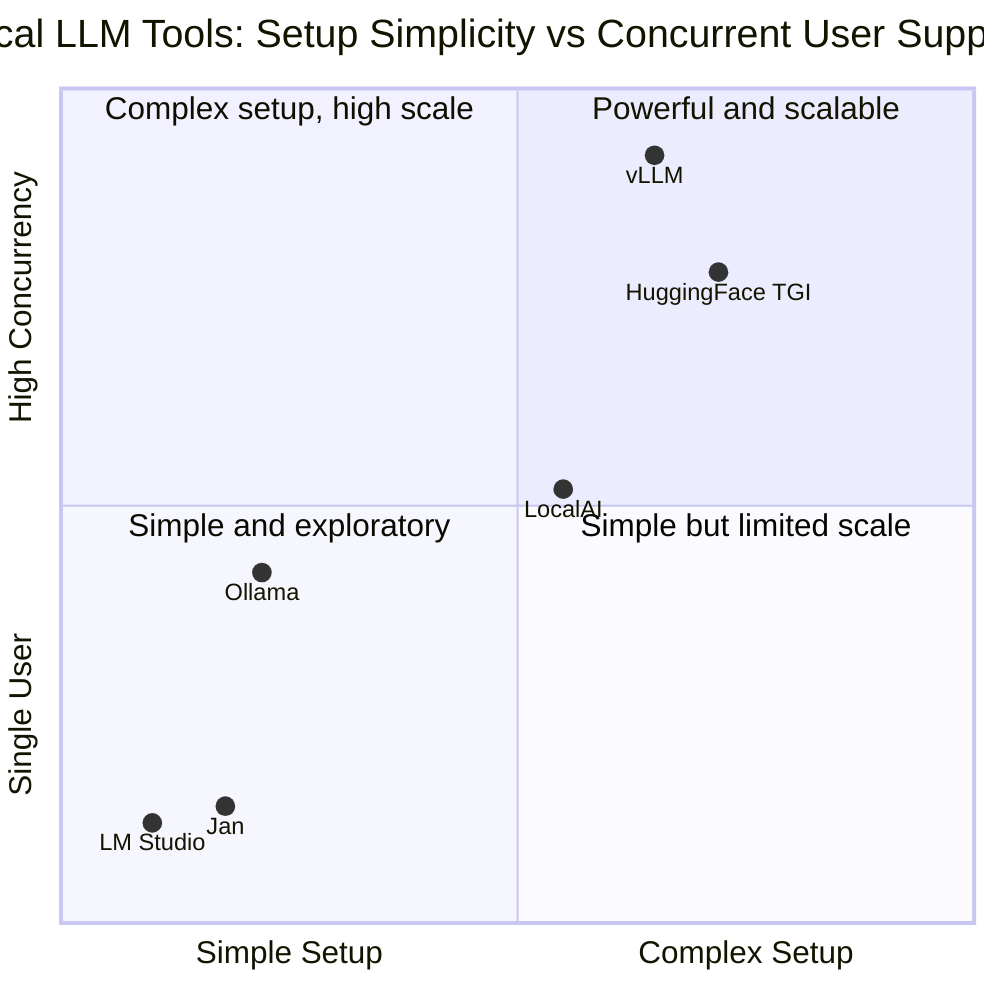
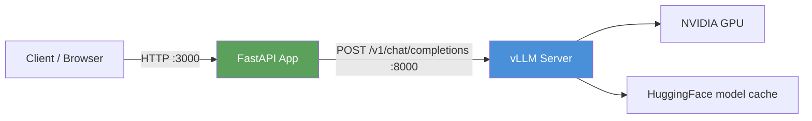
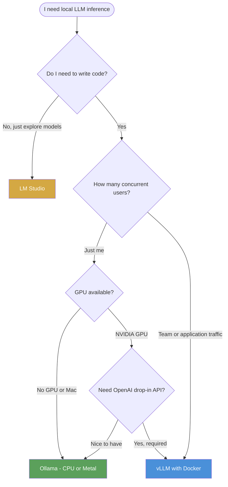
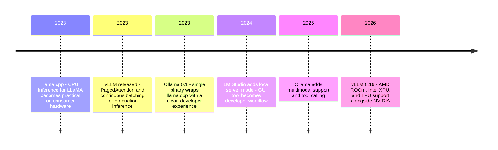

# The AI Engineer's Inference Toolkit: Ollama, vLLM, LM Studio, and Docker

There are exactly three situations where you should stop calling the cloud API and run a model locally.

**Privacy:** Your customer data, your patient records, your internal documents can't leave your infrastructure. An API call to an external LLM is data leaving your control, regardless of what the terms of service say.

**Cost:** At scale, API costs compound. A million tokens a day at $0.002/thousand tokens is $730 a month. A used H100 amortized over two years and running a model continuously is often cheaper, and at high volume, dramatically cheaper.

**Control:** You want a specific model version frozen in production, or a fine-tuned model that doesn't exist on any API, or you need guaranteed latency that doesn't depend on external rate limits.

If any of these apply, you're in the business of running inference locally. And the question then is not whether to do it but which tool to use — because the options have matured significantly and the right choice depends heavily on your context.

This post covers the three tools every AI engineer should know: **LM Studio** for exploration, **Ollama** for development, and **vLLM** for production. Each occupies a distinct part of the workflow. The goal is not to crown a winner but to explain what each does well, what each requires, and how to compose them into a working local stack using Docker.

---

## A Quick Map of the Landscape

Before getting into individual tools, it helps to position them against each other. These aren't interchangeable — they're different layers of the same stack:



The pattern is simple: as you move right and up, you get more performance and scale, but you give up simplicity. LM Studio requires no command line. Ollama requires a few CLI commands. vLLM requires Docker, a CUDA-capable GPU, and some comfort with YAML. The right choice is the simplest one that meets your requirements.

---

## LM Studio: Exploration Without Code

LM Studio is a desktop application for Mac, Windows, and Linux. You download it, open it, and you're running local models. No terminal, no pip install, no CUDA configuration. It's the tool you point at a non-technical colleague and say "use this to evaluate whether the 7B model understands our domain."

What you can do with LM Studio that matters for engineers:

**Model discovery and download.** LM Studio's search interface indexes models from Hugging Face and lets you filter by parameter count, quantization level, and hardware requirements. It estimates whether a model will fit in your available RAM before you download it. For exploration, this beats `huggingface-cli download` by a significant margin in experience.

**Chat and comparison.** The built-in chat interface has a side-by-side mode that lets you prompt two models simultaneously and compare responses. This is the fastest way to evaluate which model size is worth running for a given task before committing to a deployment.

**Local API server.** LM Studio can expose an OpenAI-compatible API on `localhost:1234`. This is useful for quick prototyping — you can point an existing OpenAI SDK client at LM Studio without any code changes:

```python
from openai import OpenAI

# Point the client at LM Studio instead of OpenAI
client = OpenAI(
    base_url="http://localhost:1234/v1",
    api_key="not-needed",  # LM Studio doesn't require authentication
)

response = client.chat.completions.create(
    model="gemma-4-e4b-it",  # Whatever model is loaded in LM Studio
    messages=[{"role": "user", "content": "Summarize this document..."}],
)
print(response.choices[0].message.content)
```

**The format it uses: GGUF.** LM Studio loads GGUF files — the format from llama.cpp that packs quantized weights into a single file. The "Q4_K_M" or "Q8_0" suffix on model files describes the quantization level: Q4 is 4-bit (smallest, fastest, some quality loss), Q8 is 8-bit (larger, better quality), F16 is full precision (largest, best quality, often doesn't fit on consumer hardware). LM Studio shows you the tradeoffs.

When to use LM Studio: evaluating models before committing to a deployment, giving non-engineers access to local LLMs, and rapid prototyping sessions where you want to test prompts without writing any infrastructure.

When not to use it: production serving (it's a desktop app), Docker deployments, automated workflows.

---

## Ollama: The Developer's Workhorse

Ollama is a CLI-first inference tool that packages llama.cpp into a clean developer experience. A single binary manages model downloads, version pinning, and a REST API that's always running in the background. If LM Studio is for exploring, Ollama is for building.

### Getting Started

```bash
# Install (Mac, Linux)
curl -fsSL https://ollama.com/install.sh | sh

# Or on Mac via Homebrew
brew install ollama

# Pull and run a model — Ollama handles the download
ollama pull gemma3:12b          # ~8GB download for the 12B variant
ollama run gemma3:12b           # Interactive chat in the terminal

# List what you've downloaded
ollama list

# Show running models and their memory usage
ollama ps
```

Once Ollama is running, it exposes a REST API at `http://localhost:11434`. The API is OpenAI-compatible, so your existing code needs only a `base_url` change:

```python
from openai import OpenAI

client = OpenAI(
    base_url="http://localhost:11434/v1",
    api_key="ollama",  # Required by the SDK format, not validated by Ollama
)

# Works exactly like the OpenAI API
response = client.chat.completions.create(
    model="gemma3:12b",
    messages=[
        {"role": "system", "content": "You are a helpful assistant."},
        {"role": "user", "content": "Explain PagedAttention in one paragraph."},
    ],
    stream=True,  # Streaming works too
)

for chunk in response:
    print(chunk.choices[0].delta.content or "", end="", flush=True)
```

### Modelfiles: Custom Behavior in Two Lines

Ollama has a concept called Modelfiles — a Dockerfile-like syntax for configuring a model's default behavior. This is where Ollama differentiates from just running llama.cpp directly:

```dockerfile
# Modelfile for a custom code review assistant
FROM gemma3:12b

SYSTEM """
You are a senior software engineer reviewing pull requests. You:
- Point out only substantive issues, not style preferences
- Explain the risk of each issue you identify
- Suggest the specific change needed
- Keep responses under 200 words
"""

PARAMETER temperature 0.3
PARAMETER num_ctx 8192
```

```bash
ollama create code-reviewer -f Modelfile
ollama run code-reviewer
```

Now `code-reviewer` is a named model in your Ollama library with its defaults baked in. You can share the Modelfile with your team and everyone runs the same configuration.

### Ollama with Docker

Running Ollama in Docker is useful when you want the same environment on every machine in your team, or when you're building a multi-service application:

```yaml
# docker-compose.yml
services:
  ollama:
    image: ollama/ollama:latest
    ports:
      - "11434:11434"
    volumes:
      - ollama-models:/root/.ollama  # Persist downloaded models
    environment:
      - OLLAMA_MODELS=/root/.ollama/models
    deploy:
      resources:
        reservations:
          devices:
            - driver: nvidia
              count: all
              capabilities: [gpu]
    restart: unless-stopped

  # Pull a model on startup using a one-shot service
  model-puller:
    image: curlimages/curl:latest
    depends_on:
      - ollama
    command: >
      sh -c "sleep 10 &&
             curl -s http://ollama:11434/api/pull
             -d '{\"name\": \"gemma3:12b\"}'"
    restart: on-failure

volumes:
  ollama-models:
```

The `model-puller` service is a pattern worth knowing: Ollama doesn't pre-load a model by default in Docker, so you need a one-shot pull after the service starts. The 10-second sleep gives Ollama time to initialize before the curl hits it.

For CPU-only environments (no GPU), drop the `deploy` section entirely. Ollama will fall back to CPU inference, which is slower but functional on most hardware.

---

## vLLM: When You Mean Business

Ollama is excellent for one developer. When you need to serve a team — or build a PoC that will handle concurrent requests from an application — the performance difference becomes decisive.

On a single NVIDIA A100-40GB running Llama 3.1 8B, a Red Hat benchmarking study found:
- **Ollama:** 41 tokens/second peak throughput
- **vLLM:** 793 tokens/second peak throughput

At 50 concurrent users, vLLM delivered roughly 6x total throughput with stable p99 latency. Ollama's p99 latency became erratic at 20+ concurrent requests.

The reason is architectural.

### PagedAttention: Why vLLM Is Fast

Standard LLM inference allocates KV cache memory (the intermediate attention states for each token in a sequence) as a contiguous block per request. If you reserve memory for a 2,048-token sequence but the actual response is 200 tokens, 90% of that allocation sits idle and unavailable for other requests. With many concurrent requests, the GPU memory becomes fragmented — lots of small gaps that can't be used.

vLLM's PagedAttention borrows virtual memory design from operating systems. KV cache is divided into fixed-size blocks (pages), and logical cache positions are mapped to non-contiguous physical blocks on demand. Memory fragmentation drops dramatically. The same GPU can hold more concurrent sequences, which means more concurrent users at similar latency.

Combined with continuous batching — processing tokens from multiple requests in the same forward pass rather than waiting for one request to finish before starting another — vLLM achieves 2–4x more throughput on the same hardware compared to naively serving one request at a time.

### Running vLLM with Docker

vLLM publishes official Docker images matched to CUDA versions. The image name pattern is `vllm/vllm-openai:latest`.

**Prerequisites:**

```bash
# NVIDIA Container Toolkit is required for GPU access from Docker
curl -fsSL https://nvidia.github.io/libnvidia-container/gpgkey | \
    sudo gpg --dearmor -o /usr/share/keyrings/nvidia-container-toolkit-keyring.gpg

sudo apt-get install -y nvidia-container-toolkit
sudo nvidia-ctk runtime configure --runtime=docker
sudo systemctl restart docker

# Verify Docker can see the GPU
docker run --rm --gpus all nvidia/cuda:12.1-base nvidia-smi
```

**Single container quickstart:**

```bash
docker run --runtime nvidia --gpus all \
    -v ~/.cache/huggingface:/root/.cache/huggingface \
    -p 8000:8000 \
    --ipc=host \
    -e HF_TOKEN=hf_your_token \
    vllm/vllm-openai:latest \
    --model google/gemma-3-12b-it \
    --host 0.0.0.0 \
    --port 8000 \
    --gpu-memory-utilization 0.90
```

Three flags deserve explanation:
- `--ipc=host`: Required for shared memory between processes during inference. Skip it and vLLM will crash with IPC errors.
- `-v ~/.cache/huggingface:/root/.cache/huggingface`: Persists downloaded model weights. Without this, vLLM re-downloads the model on every container start — a 10–50GB download each time.
- `--gpu-memory-utilization 0.90`: How much of the GPU VRAM to allocate for the KV cache. The remaining 10% is reserved for model weights and activations. Tuning this up increases concurrent capacity; tuning it down prevents OOM crashes on smaller GPUs.

**Production Docker Compose:**

```yaml
# docker-compose.yml
services:
  vllm:
    image: vllm/vllm-openai:latest
    runtime: nvidia
    ports:
      - "8000:8000"
    volumes:
      - huggingface-cache:/root/.cache/huggingface
    environment:
      - HF_TOKEN=${HF_TOKEN}
    ipc: host
    deploy:
      resources:
        reservations:
          devices:
            - driver: nvidia
              count: all
              capabilities: [gpu]
        limits:
          memory: 32G
    command: >
      --model google/gemma-3-12b-it
      --host 0.0.0.0
      --port 8000
      --gpu-memory-utilization 0.90
      --max-model-len 8192
    healthcheck:
      test: ["CMD", "curl", "-f", "http://localhost:8000/health"]
      interval: 30s
      timeout: 10s
      retries: 3
      start_period: 300s  # Model loading takes 3-5 minutes
    restart: unless-stopped

volumes:
  huggingface-cache:
```

The `start_period: 300s` on the health check is critical. vLLM takes 3–5 minutes to load a 12B model and build the KV cache — if the health check starts immediately, it will fail and Docker will restart the container in a loop.

### Using vLLM as an OpenAI Drop-in

vLLM exposes `/v1/chat/completions`, `/v1/completions`, and `/v1/embeddings` — the same paths as OpenAI's API. Switching an existing application to vLLM is one line:

```python
from openai import OpenAI

# Before: cloud API
# client = OpenAI(api_key="sk-...")

# After: local vLLM, zero other code changes
client = OpenAI(
    base_url="http://localhost:8000/v1",
    api_key="not-required",
)

response = client.chat.completions.create(
    model="google/gemma-3-12b-it",  # Must match --model in your vLLM config
    messages=[{"role": "user", "content": "Review this PR..."}],
    temperature=0.2,
    max_tokens=512,
)
```

This pattern — the base_url swap — is the key to building PoCs that can move between local and cloud deployment without code changes. The application doesn't know or care whether it's talking to OpenAI or a local vLLM server.

---

## The Format Problem: GGUF vs Safetensors

There's a source of confusion that trips up most engineers the first time they try to swap models between tools: **Ollama and LM Studio use GGUF, vLLM uses safetensors (or PyTorch bin files).**

GGUF is llama.cpp's format. It packages quantized weights into a single file optimized for CPU inference with optional GPU offloading. This is why Ollama can run on a Mac or a machine without a discrete GPU. The tradeoff: quantization introduces small quality losses, and the format doesn't support all advanced serving features.

vLLM does not support GGUF. It loads models in their native Hugging Face format — safetensors or PyTorch `.bin` files, in full or quantized (GPTQ, AWQ) precision. These are what you get when you clone a model from Hugging Face with `hf_transfer`.

**In practice, this means:**

| You want to... | Use |
|---|---|
| Run Gemma 4 E4B on a MacBook | Ollama (`ollama pull gemma4:e4b`) |
| Run Gemma 4 E4B on an RTX 4090 server | vLLM (`--model google/gemma-4-E4B-it`) |
| Use the same GGUF file in both | Not possible — re-download in the right format |
| AWQ-quantized model for smaller VRAM | vLLM with `--quantization awq` |

The Ollama model library (`ollama.com/library`) maintains GGUF conversions of popular models so you don't need to convert them yourself. vLLM models come directly from Hugging Face.

---

## Building a Local LLM PoC with Docker Compose

Here's the pattern for a proof-of-concept that is production-shaped from day one: a local vLLM server behind a simple API layer, everything containerized, ready to swap the `base_url` to go from local to cloud.

The architecture is straightforward:



```yaml
# docker-compose.yml for a local LLM PoC
services:
  vllm:
    image: vllm/vllm-openai:latest
    runtime: nvidia
    ports:
      - "8000:8000"
    volumes:
      - huggingface-cache:/root/.cache/huggingface
    environment:
      - HF_TOKEN=${HF_TOKEN}
    ipc: host
    deploy:
      resources:
        reservations:
          devices:
            - driver: nvidia
              count: 1
              capabilities: [gpu]
    command: >
      --model google/gemma-3-12b-it
      --host 0.0.0.0
      --port 8000
      --gpu-memory-utilization 0.90
      --max-model-len 4096
    healthcheck:
      test: ["CMD", "curl", "-f", "http://localhost:8000/health"]
      interval: 30s
      start_period: 300s
    restart: unless-stopped

  app:
    build: ./app
    ports:
      - "3000:3000"
    environment:
      - LLM_BASE_URL=http://vllm:8000/v1
      - LLM_MODEL=google/gemma-3-12b-it
    depends_on:
      vllm:
        condition: service_healthy  # Wait for model to load before starting app
    restart: unless-stopped

volumes:
  huggingface-cache:
```

And the application reads the configuration from environment variables — so swapping to cloud deployment is a one-line `.env` change:

```python
# app/main.py
import os
from fastapi import FastAPI
from openai import OpenAI

app = FastAPI()

# These come from environment — local vs production is a config change, not a code change
llm_client = OpenAI(
    base_url=os.getenv("LLM_BASE_URL", "https://api.openai.com/v1"),
    api_key=os.getenv("LLM_API_KEY", "not-required"),
)
model = os.getenv("LLM_MODEL", "gpt-4o")

@app.post("/analyze")
async def analyze(text: str):
    response = llm_client.chat.completions.create(
        model=model,
        messages=[
            {"role": "system", "content": "You are a document analyzer."},
            {"role": "user", "content": text},
        ],
        max_tokens=512,
    )
    return {"result": response.choices[0].message.content}
```

```bash
# Local development: point at your vLLM container
LLM_BASE_URL=http://localhost:8000/v1 LLM_MODEL=google/gemma-3-12b-it

# Production: point at OpenAI or Anthropic or your cloud vLLM
LLM_BASE_URL=https://api.openai.com/v1 LLM_API_KEY=sk-...
```

This is the PoC pattern that scales. You validate the product logic locally with full control over the model, and when you're ready to move to production you change a config variable.

---

## When Does Tool Choice Actually Matter?

The benchmark gap between Ollama and vLLM is real — 793 vs 41 tokens/sec on an A100 is a 19x difference. But it only matters at scale.

For a single developer running queries interactively, both feel instant for models up to 12B. The human attention span is the bottleneck, not the inference throughput.

The crossover point is roughly **5 concurrent users**. Below that, Ollama's simpler setup is a better trade-off. Above that, vLLM's continuous batching starts mattering, and the p99 latency difference becomes noticeable.

Here's the practical guidance:

| Situation | Recommended Tool |
|---|---|
| Exploring models, no code | LM Studio |
| Local dev, single developer | Ollama |
| Team PoC, 2-10 concurrent users | vLLM with Docker |
| Production serving, 10+ users | vLLM with Docker, consider multi-GPU |
| Mac with Apple Silicon | Ollama (excellent Metal support) |
| Sensitive data, no internet | Either Ollama or vLLM, air-gapped Docker |
| Fine-tuned model in GGUF format | Ollama with custom Modelfile |
| Fine-tuned model in safetensors | vLLM with local volume mount |

---

## The Decision Tree



---

## The Ecosystem in Context



Three years ago, running a 7B model locally required significant CUDA expertise and manual model conversion. Today, `ollama run gemma3:12b` works on any developer machine with 8GB of RAM, and a production-grade inference server is a `docker compose up` away. The barrier has dropped from "you need a ML engineer to set this up" to "any backend developer can do this in an afternoon."

---

## Going Deeper

**Books:**
- Tunstall, L., von Werra, L. & Wolf, T. (2022). *Natural Language Processing with Transformers.* O'Reilly Media.
  - Chapters on model deployment and quantization provide the background for understanding why GGUF quantization works as well as it does and where the quality floor sits.
- Pereiro, P. (2024). *LLM Engineer's Handbook.* Packt Publishing.
  - Covers the full spectrum from model selection to production serving, including dedicated sections on local inference and the tradeoffs between serving frameworks.

**Online Resources:**
- [Ollama Documentation](https://docs.ollama.com/) — The Modelfile reference and REST API docs are tightly written. The Docker section covers GPU, CPU, and Apple Silicon configurations.
- [vLLM Documentation](https://docs.vllm.ai/) — Start with the Docker deployment guide, then the serving configuration reference for `--tensor-parallel-size` and `--gpu-memory-utilization` tuning. The performance tuning guide is worth reading before you go to production.
- [Ollama vs. vLLM: Performance Benchmarking](https://developers.redhat.com/articles/2025/08/08/ollama-vs-vllm-deep-dive-performance-benchmarking) by Red Hat — The benchmark with GuideLLM methodology and Llama 3.1 8B results on A100. The methodology is sound and the results are honest about where Ollama is adequate.
- [GGUF Format Specification](https://github.com/ggerganov/ggml/blob/master/docs/gguf.md) — If you need to understand why GGUF and safetensors aren't interchangeable, this is the technical explanation.

**Videos:**
- [Getting Started with Ollama](https://www.youtube.com/watch?v=1IuOFB5P-Cc) by Fireship — 7-minute overview covering install, model pull, and the API. Good first introduction before going deeper.
- [vLLM: Easy, Fast, and Cheap LLM Serving](https://www.youtube.com/watch?v=5ZlavKF_98U) by the vLLM team — Walkthrough of PagedAttention's design and the performance results. Covers the multi-GPU and quantization configurations.

**Academic Papers:**
- Kwon, W. et al. (2023). ["Efficient Memory Management for Large Language Model Serving with PagedAttention."](https://arxiv.org/abs/2309.06180) *SOSP 2023*.
  - The PagedAttention paper. Section 3's explanation of KV cache memory management and the OS virtual memory analogy is one of the clearer systems papers in recent ML research.

**Questions to Explore:**
- Ollama and vLLM are optimized for NVIDIA GPUs, but Apple Silicon and AMD ROCm are both gaining ground. Will the quantization and serving landscape look fundamentally different in two years if Apple's M-series chips continue closing the performance gap on transformer inference?
- The `base_url` swap pattern makes it easy to move between local and cloud LLMs. But the model is also different — a local Gemma 3 is not the same as cloud GPT-4o. How do you design applications that degrade gracefully when the local model is less capable?
- Ollama's Modelfile pattern makes it easy to version-control model configuration. vLLM's configuration lives in Docker Compose. Neither has a clear story for "rollback this inference configuration to last week's version." What would production ML config management look like if it treated model configuration with the same rigor as application code?
- As hardware improves and models get more efficient, the performance gap between Ollama and vLLM will likely shrink. Is the future one tool that handles both development and production, or will the use-case split persist?
