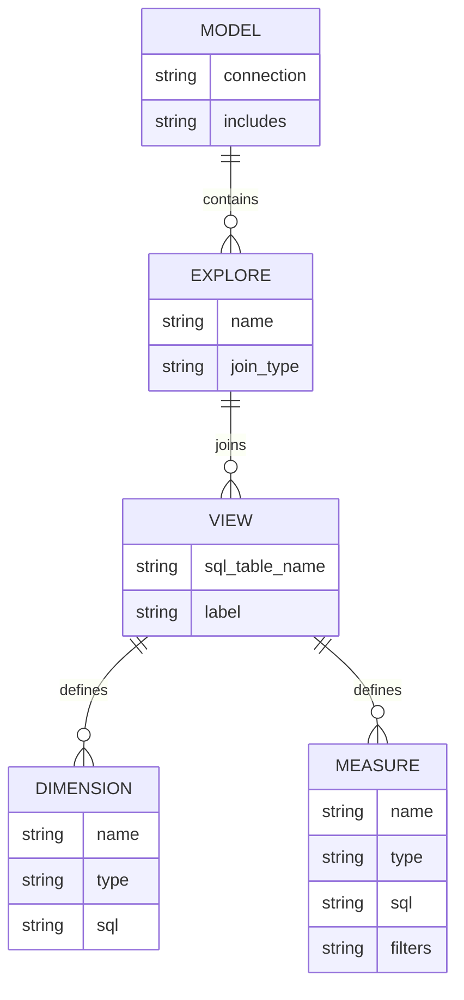
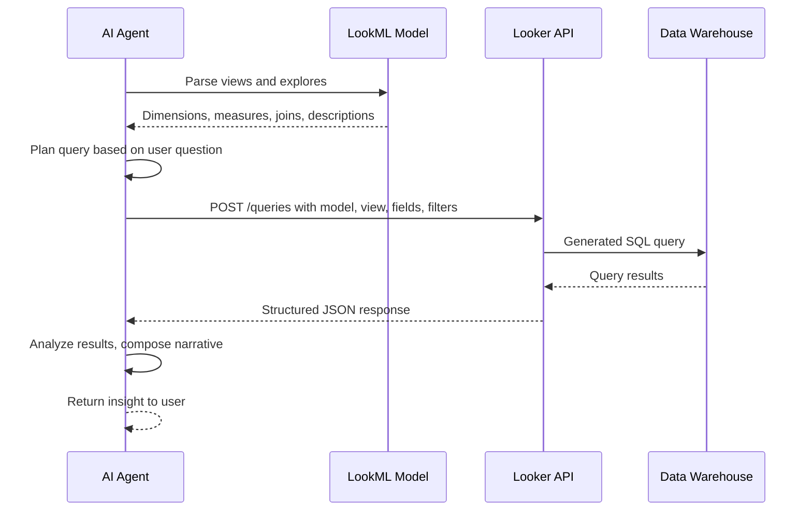
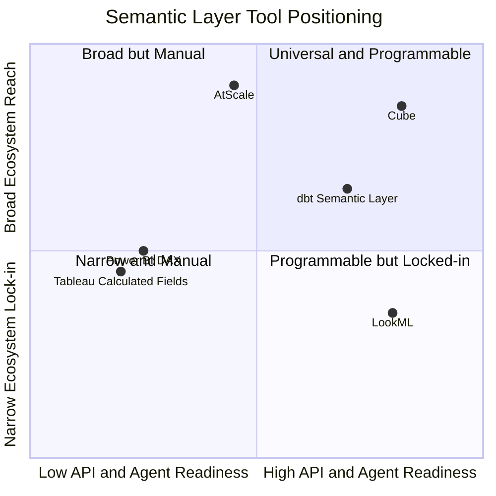
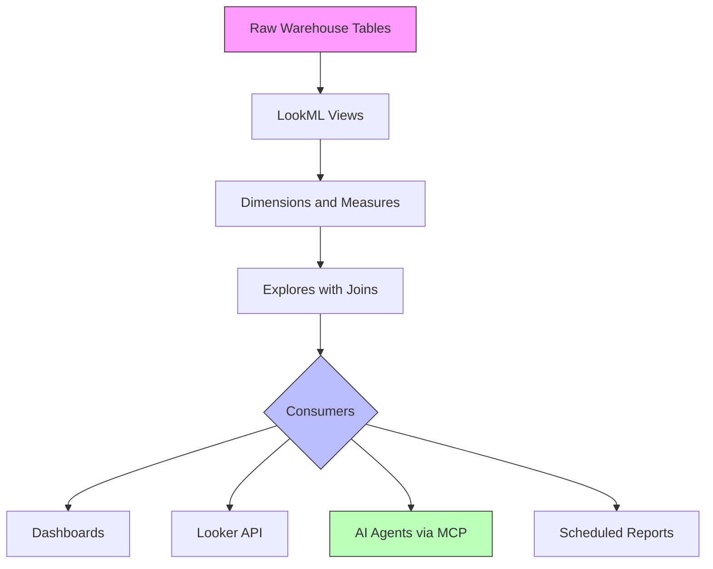

# LookML: The Semantic Layer That Turns SQL Into a Product

## The Gap Between Data and Decisions

You have a data warehouse. It is full of tables -- hundreds of them, maybe thousands. They have names like `stg_orders_v3`, `dim_customer_20240801`, `fct_revenue_daily_agg`. Some of them are documented. Most are not. The column `amt` in one table means gross revenue. In another, it means net. In a third, nobody remembers.

A product manager walks over and asks: "What was our churn rate last quarter?"

The analyst opens a SQL editor, spends forty minutes figuring out which tables to join, which date column to trust, whether `is_active` means what it sounds like, and whether the `canceled_at` field is populated consistently. They write a query. It produces a number. The PM takes it to a meeting.

Next week, a different analyst gets the same question. They write a different query. They get a different number.

This is the translation layer problem. Raw SQL tables are not products. They are raw material. Between the warehouse and the business, something needs to define what "churn rate" means, which tables feed it, and how it should be calculated -- once, in one place, so that every downstream consumer gets the same answer.

That something is a **semantic layer**. And one of the most mature, opinionated implementations of it is **LookML**, the modeling language behind Google's Looker platform.

This post is not a Looker dashboard tutorial. It is about LookML as a *language* -- what it models, why code-based semantics beat GUI-configured ones, and why the rise of AI agents makes this architectural choice more consequential than ever.

---

## What Is a Semantic Layer?

A semantic layer is an abstraction that sits between your data warehouse and your data consumers. It translates physical database structures -- tables, columns, joins -- into business concepts: metrics, dimensions, relationships. It answers the question: *what does this data mean?*

The concept is not new. Business Objects had a "universe" layer in the 1990s. Cognos had its "Framework Manager." MicroStrategy had its logical data model. The idea was always the same: don't make business users think in SQL. Give them a curated, governed vocabulary where "revenue" means one thing, joins are pre-defined, and access control is centralized.

These early implementations worked, after a fashion. They reduced the number of wrong answers floating around the organization. But they had deep structural flaws.

First, they were **GUI-configured**. You pointed and clicked to define joins, dragged columns to create metrics, and saved everything in a proprietary binary format that lived on a server somewhere. Version control was nonexistent. Collaboration meant hoping nobody else was editing the same model at the same time. When something broke, you could not `git blame` to find out what changed.

Second, they were **monolithic**. The semantic layer was inseparable from the BI tool. If you used Business Objects, your metric definitions lived in Business Objects. If you switched to Tableau, you started over from scratch. Your semantic layer was not an asset -- it was a hostage.

Third, they were **opaque to automation**. There was no API to query the semantic model, no way for another system to discover what metrics were available, no programmatic access to metric definitions. The semantic layer served human eyes looking at a GUI. That was it.

The modern semantic layer movement, which gained momentum around 2020-2023, rethinks all of this. Metrics should be:

- **Defined in code**, not in a GUI
- **Version-controlled** in Git, with pull requests and code review
- **Tested** with CI/CD, just like application code
- **Consumed** through APIs, not just through a single BI tool

This is the "analytics as code" philosophy. And LookML was arguably the first production-grade implementation of it.

### Why a Semantic Layer Matters

Without a semantic layer, every consumer re-derives metrics independently:

| Consumer | Calculates "Revenue" As |
|----------|------------------------|
| Analyst A | `SUM(amount) WHERE status = 'completed'` |
| Analyst B | `SUM(amount) WHERE status IN ('completed', 'pending')` |
| Dashboard | `SUM(gross_amount) - SUM(refunds)` |
| Data Science | `SUM(net_amount) FROM a different table entirely` |

Four consumers, four definitions, four numbers. The executive looking at these reports does not see a data platform -- they see chaos.

A semantic layer enforces a single definition:

```yaml
# Pseudocode -- the concept applies across tools
metric:
  name: revenue
  description: "Net revenue from completed orders, excluding refunds"
  calculation: SUM(order_items.net_amount)
  filters:
    - order.status = 'completed'
  time_grains: [day, week, month, quarter, year]
```

Define it once. Every dashboard, every API call, every agent query gets the same number.

---

## LookML: Anatomy of a Modeling Language

LookML is a declarative language for defining data models. It is not SQL -- it *generates* SQL. You describe the structure of your data, and Looker compiles your descriptions into optimized queries at runtime.

A LookML project lives in a Git repository. It consists of several file types:

- **Model files** (`.model.lkml`) -- define database connections and Explores
- **View files** (`.view.lkml`) -- define tables, dimensions, and measures
- **Explore files** -- define how views join together
- **Dashboard files** (`.dashboard.lookml`) -- define dashboards as code

Let's walk through each concept.

### Views: The Foundation

A view maps to a database table (or a derived table). It defines the fields that users can query.

```lookml
view: orders {
  sql_table_name: analytics.fct_orders ;;

  dimension: order_id {
    primary_key: yes
    type: number
    sql: ${TABLE}.order_id ;;
  }

  dimension: customer_id {
    type: number
    sql: ${TABLE}.customer_id ;;
  }

  dimension_group: created {
    type: time
    timeframes: [raw, date, week, month, quarter, year]
    sql: ${TABLE}.created_at ;;
  }

  dimension: status {
    type: string
    sql: ${TABLE}.status ;;
  }

  dimension: amount {
    type: number
    sql: ${TABLE}.amount ;;
    value_format_name: usd
  }

  measure: total_revenue {
    type: sum
    sql: ${amount} ;;
    filters: [status: "completed"]
    value_format_name: usd
    description: "Sum of order amounts for completed orders only"
  }

  measure: order_count {
    type: count
    drill_fields: [order_id, customer_id, created_date, amount]
  }

  measure: average_order_value {
    type: number
    sql: ${total_revenue} / NULLIF(${order_count}, 0) ;;
    value_format_name: usd
  }
}
```

Notice several things. The `${TABLE}` substitution operator references the underlying table. The `${amount}` syntax references other fields within the same view. The `dimension_group` with type `time` automatically generates multiple time-based dimensions from a single timestamp column -- you get `created_date`, `created_week`, `created_month`, and so on without writing each one manually.

This is the core value proposition: define the logic once, and the platform generates the permutations.

### Dimensions vs. Measures

The distinction is fundamental:

- **Dimensions** are columns you group by. They appear in the `GROUP BY` clause. Customer name, order date, product category -- these are dimensions.
- **Measures** are aggregations. They use functions like `SUM`, `COUNT`, `AVG`, `MIN`, `MAX`. Revenue, order count, average order value -- these are measures.

LookML enforces this distinction at the model level. You cannot accidentally use a measure as a group-by column. This prevents an entire class of analytical errors.



### Explores: Joining Views Together

An Explore defines a queryable dataset -- one or more views joined together. It is the entry point for user queries.

```lookml
explore: orders {
  label: "Order Analysis"
  description: "All completed and pending orders with customer details"

  join: customers {
    type: left_outer
    relationship: many_to_one
    sql_on: ${orders.customer_id} = ${customers.customer_id} ;;
  }

  join: products {
    type: left_outer
    relationship: many_to_one
    sql_on: ${orders.product_id} = ${products.product_id} ;;
  }

  join: order_items {
    type: left_outer
    relationship: one_to_many
    sql_on: ${orders.order_id} = ${order_items.order_id} ;;
  }

  always_filter: {
    filters: [orders.created_date: "last 90 days"]
  }
}
```

The `relationship` parameter is critical. It tells Looker whether a join is one-to-one, many-to-one, one-to-many, or many-to-many. Looker uses this metadata to generate correct SQL -- specifically, to decide whether aggregations need to be fanned out or deduplicated. Getting the relationship wrong is one of the most common LookML bugs, and it produces silently incorrect numbers.

The `always_filter` parameter is a governance mechanism. It ensures that every query against this Explore includes a date filter, preventing accidental full-table scans that could cost thousands of dollars on a large BigQuery dataset.

### Derived Tables: Computed Layers

Sometimes the table you need does not exist in the warehouse. Derived tables let you define computed tables within LookML -- either as SQL queries or as native LookML constructs.

**SQL-based derived table:**

```lookml
view: customer_lifetime_value {
  derived_table: {
    sql:
      SELECT
        customer_id,
        MIN(created_at) AS first_order_date,
        MAX(created_at) AS latest_order_date,
        COUNT(DISTINCT order_id) AS lifetime_orders,
        SUM(amount) AS lifetime_revenue
      FROM analytics.fct_orders
      WHERE status = 'completed'
      GROUP BY 1
    ;;

    persist_for: "24 hours"
  }

  dimension: customer_id {
    primary_key: yes
    type: number
    sql: ${TABLE}.customer_id ;;
  }

  measure: avg_lifetime_value {
    type: average
    sql: ${TABLE}.lifetime_revenue ;;
    value_format_name: usd
  }
}
```

**Persistent Derived Tables (PDTs)** are the production version. Instead of running the derived query on every request, Looker materializes the result into a physical table in your database and regenerates it on a schedule. This is Looker's version of incremental materialization -- conceptually similar to dbt's incremental models.

```lookml
derived_table: {
  sql: ... ;;
  datagroup_trigger: daily_etl
  indexes: ["customer_id"]
}
```

The `datagroup_trigger` ties the PDT refresh to a broader caching strategy. When the `daily_etl` datagroup fires (typically triggered by checking whether new data has arrived), all PDTs and cached queries tied to that datagroup are regenerated.

### Models: Tying It All Together

A model file defines a database connection and lists the Explores available to users.

```lookml
connection: "production_bigquery"

include: "/views/**/*.view.lkml"
include: "/explores/**/*.explore.lkml"

datagroup: daily_etl {
  sql_trigger: SELECT MAX(loaded_at) FROM analytics.etl_log ;;
  max_cache_age: "24 hours"
}

explore: orders {
  # ... explore definition
}

explore: customer_health {
  # ... another explore for a different business domain
}
```

Multiple models can point to the same database connection, offering different views of the data to different teams. The marketing model might expose campaign and attribution Explores. The finance model exposes revenue recognition and billing Explores. Same warehouse, different curated windows.

---

## From Power BI Drag-and-Drop to Code-Defined Analytics

If you have worked with Power BI -- and many data teams have -- the LookML approach will feel fundamentally different. The contrast is instructive.

### The GUI Paradigm

Power BI is built around a visual authoring experience. You connect to data sources through a GUI. You drag fields onto a canvas. You configure visuals by clicking through property panels. Metrics are defined in DAX formulas attached to specific reports or datasets. Relationships between tables are drawn as lines on a diagram.

This works well for individual analysts building individual reports. But it creates structural problems at scale:

**Metric drift.** When metric definitions live inside individual reports, different reports inevitably define the same metric differently. There is no single source of truth for "monthly recurring revenue" -- there are twelve copies, each slightly different.

**No version control.** Power BI files (`.pbix`) are binary. You cannot `git diff` them meaningfully. You cannot do pull request reviews of metric changes. When someone changes a calculation, you find out when the numbers look wrong in a meeting.

**Collaboration friction.** Multiple people cannot edit the same Power BI report simultaneously in the way developers collaborate on code. The Power BI Service offers some shared dataset capabilities, but the authoring model remains fundamentally single-user.

**Testing is manual.** There is no CI pipeline that validates your DAX calculations against expected outputs before deployment.

### The Code Paradigm

LookML flips each of these:

| Aspect | Power BI | LookML |
|--------|----------|--------|
| Metric definition | DAX in each report | Centralized in view files |
| Version control | Binary .pbix files | Git with full diff support |
| Code review | Not practical | Standard PR workflow |
| Testing | Manual spot-checks | Automated with CI/CD |
| Collaboration | Single-user authoring | Branch-based, like software |
| Deployment | Publish to service | Git merge triggers deploy |
| API access | Limited REST API | Full programmatic control |
| Metric governance | By convention | Enforced by the platform |

This is not a knock on Power BI -- it is a different design philosophy. Power BI optimizes for the single analyst's productivity. LookML optimizes for organizational consistency and engineering rigor. The right choice depends on your team's maturity, scale, and whether you treat analytics as a craft or as a codebase.

### The Version Control Advantage

Consider what a metric change looks like in each paradigm.

**Power BI:** An analyst opens the report, modifies a DAX measure, publishes. If another analyst notices the numbers changed and asks why, the first analyst either remembers or does not. There is no commit message, no diff, no audit trail beyond the Power BI activity log (which shows *who* published, but not *what* changed).

**LookML:**

```
commit abc123f
Author: Maria Chen <maria@company.com>
Date:   Wed May 7 14:22:01 2027 -0500

    Update revenue measure to exclude test orders

    Previously included orders where customer_type = 'internal_test',
    inflating monthly revenue figures by ~2.3%.

diff --git a/views/orders.view.lkml b/views/orders.view.lkml
--- a/views/orders.view.lkml
+++ b/views/orders.view.lkml
@@ measure: total_revenue {
     type: sum
     sql: ${amount} ;;
-    filters: [status: "completed"]
+    filters: [status: "completed", customer_type: "-internal_test"]
     value_format_name: usd
   }
```

The change is traceable, reviewable, and reversible. This is not a marginal improvement -- it is a fundamentally different governance model.

---

## The Agentic Future: Why Code-Based Semantics Win

Here is where the argument for code-based semantic layers becomes urgent. The BI industry is entering what Google, Databricks, and others are calling the "agentic era" -- a shift from humans clicking through dashboards to AI agents programmatically querying, analyzing, and even composing analytics artifacts.

By the end of 2026, analysts at Gartner and elsewhere predict that over 40% of enterprise applications will include task-specific AI agents. In analytics, this means agents that can answer questions like "Why did retention drop in Q1?" not by pulling up a pre-built dashboard, but by autonomously exploring the data, running queries, generating visualizations, and composing narratives.

This changes the calculus for semantic layer architecture. The question is no longer "which tool makes analysts most productive?" It is: **which architecture is legible to machines?**

Think about what an AI agent needs. It needs to understand what data is available, what metrics are defined, how tables relate to each other, and what business rules apply. It needs this information in a structured, parseable format -- not embedded in a GUI's internal state. It needs to compose queries programmatically, not simulate mouse clicks. And it needs to do this through an API that returns structured results, not screenshots of dashboards.

Code-based semantic layers satisfy every one of these requirements. GUI-based tools satisfy almost none.

### Why GUI-Based BI Resists Automation

Consider what an AI agent would need to do to generate a report in Power BI:

1. Understand the Power BI data model (stored in a proprietary binary format)
2. Navigate the GUI programmatically (or use a limited REST API)
3. Compose DAX formulas (a domain-specific language with complex evaluation context semantics)
4. Configure visual properties through an API that was designed for human interaction
5. Publish the result

Every step requires working around a system designed for human point-and-click interaction. Power BI does have APIs, but they were designed for administration and embedding, not for agentic composition.

### Why LookML Is Agent-Native

Now consider the same task with LookML and the Looker API:

1. **Read the model.** LookML files are plain text. An agent can parse them, understand every dimension, measure, Explore, and join relationship. The semantic model is fully machine-readable.

2. **Understand the vocabulary.** Dimensions and measures have names, types, descriptions, and SQL definitions. An agent knows that `total_revenue` is a `SUM` of `amount` where `status = 'completed'`. No guessing.

3. **Compose queries via API.** The Looker API lets you programmatically create and run queries by specifying a model, an Explore, fields, filters, and sorts -- all as structured JSON.

4. **Generate new artifacts.** Dashboards, Looks (saved queries), and even new LookML Explores can be created through the API or by generating LookML code.



### A Practical Agent Architecture

Here is what an agent that leverages Looker's semantic layer might look like in practice:

```python
import looker_sdk

# Initialize the SDK -- credentials from looker.ini or environment
sdk = looker_sdk.init40()

def discover_model(model_name: str) -> dict:
    """Let the agent discover what's available in a LookML model."""
    explores = sdk.lookml_model_explore(model_name, fields="name,description")
    model_info = {}
    for explore in explores:
        explore_detail = sdk.lookml_model_explore(
            model_name,
            explore.name,
            fields="fields"
        )
        model_info[explore.name] = {
            "dimensions": [
                {"name": f.name, "type": f.type, "description": f.description}
                for f in explore_detail.fields.dimensions
            ],
            "measures": [
                {"name": f.name, "type": f.type, "description": f.description}
                for f in explore_detail.fields.measures
            ],
        }
    return model_info


def agent_query(
    model: str,
    explore: str,
    fields: list[str],
    filters: dict = None,
    sorts: list[str] = None,
    limit: int = 500,
) -> list[dict]:
    """Execute a query against the Looker semantic layer."""
    query = sdk.create_query(
        body=looker_sdk.models40.WriteQuery(
            model=model,
            view=explore,
            fields=fields,
            filters=filters or {},
            sorts=sorts or [],
            limit=str(limit),
        )
    )
    result = sdk.run_query(query.id, result_format="json")
    return result


# Example: agent discovers the model, then queries it
model_info = discover_model("ecommerce")
# Agent now knows every dimension, measure, and their descriptions
# It can reason about which fields answer the user's question

results = agent_query(
    model="ecommerce",
    explore="orders",
    fields=["orders.created_month", "orders.total_revenue", "orders.order_count"],
    filters={"orders.created_date": "last 12 months"},
    sorts=["orders.created_month desc"],
)
```

The key insight is that the agent never writes SQL. It works at the semantic level -- selecting named dimensions and measures from a governed model. This means:

- **No SQL injection risk.** The agent composes queries from predefined building blocks.
- **Consistent metrics.** The agent uses the same metric definitions as every human user.
- **Governed access.** Looker's permission model controls what the agent can see.
- **Self-documenting.** The LookML descriptions tell the agent what each field means.

### Looker's Own Agentic Features

Google is leaning into this vision directly. In 2025-2026, Looker has shipped several agentic capabilities:

**Conversational Analytics (GA).** Users ask questions in natural language. Looker's Gemini-powered engine translates them into structured queries against the LookML model. According to Google, the semantic layer reduces data errors in natural language queries by roughly two-thirds compared to querying raw SQL directly.

**Data Agents with Multi-Explore Support.** Agents can now reason across up to five different Looker Explores simultaneously, performing cross-domain analysis without manual table joins.

**Model Context Protocol (MCP).** Looker is implementing MCP to connect its semantic layer with external AI applications. This allows other AI systems to "interview" a Looker instance -- retrieve metric definitions, understand data relationships, and query data through the governed semantic layer.

**Conversational Analytics API.** Developers can embed natural-language query functionality in custom applications, internal tools, or agent workflows through a dedicated API.

This is not hypothetical. The infrastructure for agent-driven analytics already exists. The question is whether your semantic layer is structured to support it.

### The Architecture Pattern: Agent with Semantic Guardrails

The most robust pattern for agent-driven analytics combines three layers:

1. **Semantic layer as the source of truth.** The LookML model (or dbt, or Cube) defines what metrics exist, how they are calculated, and who can access them. The agent reads this, not the raw schema.

2. **API as the execution engine.** The agent composes queries by selecting from the semantic layer's vocabulary and submits them through the API. It never generates raw SQL against the warehouse directly.

3. **Governance as the constraint.** Row-level security, column-level permissions, and access grants in the semantic layer apply to agent queries just as they apply to human queries. The agent cannot see data that its associated user is not permitted to see.

This pattern eliminates the most dangerous failure mode of text-to-SQL systems: generating syntactically valid SQL that returns the wrong answer because the agent misunderstood a column name, applied the wrong filter, or missed a business rule. When the agent works at the semantic level, the business rules are baked in.

---

## The Semantic Layer Landscape

LookML is not the only option. The semantic layer market has expanded significantly, and each tool makes different trade-offs.

### dbt Semantic Layer and MetricFlow

dbt's semantic layer, powered by MetricFlow, reached general availability in October 2024. Metrics are defined in YAML files inside your dbt project:

```yaml
semantic_models:
  - name: orders
    defaults:
      agg_time_dimension: order_date
    entities:
      - name: order_id
        type: primary
      - name: customer_id
        type: foreign
    measures:
      - name: revenue
        expr: amount
        agg: sum
    dimensions:
      - name: order_date
        type: time
      - name: status
        type: categorical

metrics:
  - name: monthly_revenue
    type: simple
    type_params:
      measure: revenue
    filter: |
      {{ Dimension('orders__status') }} = 'completed'
```

**Strengths:** Tight integration with dbt's transformation layer. If you already use dbt for modeling, adding semantic definitions is a natural extension. Same Git workflow, same PR reviews, same CI/CD pipeline. MetricFlow is also the engine behind the emerging Open Semantic Interchange (OSI) standard, backed by dbt Labs, Snowflake, and Salesforce.

**Limitations:** Younger than LookML. The ecosystem of BI tools that can consume dbt metrics natively is still growing. You need a dbt Cloud account for the hosted API. The learning curve for MetricFlow's entity-based modeling is steeper than it initially appears -- getting the entity relationships right is similar to getting LookML join relationships right, but with less tooling to help you debug.

A significant development in this space is the **Open Semantic Interchange (OSI)** initiative, launched in 2025 by dbt Labs, Snowflake, and Salesforce. OSI aims to standardize semantic layer definitions in a vendor-neutral YAML format, using MetricFlow as its declarative specification. If successful, this would allow metric definitions to be portable across tools -- you could define a metric once and consume it in Looker, Tableau, Power BI, or any OSI-compatible tool. Whether this achieves real adoption or joins the graveyard of data standards remains to be seen.

### Cube

Cube takes an API-first middleware approach. It sits between your warehouse and every downstream consumer, exposing metrics through REST, GraphQL, SQL, MDX, and DAX interfaces.

```javascript
// Cube schema definition
cube('Orders', {
  sql: `SELECT * FROM analytics.fct_orders`,

  measures: {
    totalRevenue: {
      type: 'sum',
      sql: 'amount',
      filters: [{ sql: `${CUBE}.status = 'completed'` }],
    },
    count: {
      type: 'count',
    },
  },

  dimensions: {
    createdAt: {
      type: 'time',
      sql: 'created_at',
    },
    status: {
      type: 'string',
      sql: 'status',
    },
  },
});
```

**Strengths:** Multi-protocol access means any BI tool can connect. Excellent caching layer. Open-source core. Strong embedded analytics story. Works across any data warehouse.

**Limitations:** Adds another service to your architecture. The caching layer is powerful but adds operational complexity.

### AtScale

AtScale positions itself as a universal semantic layer -- vendor-agnostic infrastructure that works across any data warehouse and connects to any BI tool via standard MDX/DAX/SQL protocols. It was recognized as a leader in the 2025 GigaOm Radar Report for semantic layers.

**Strengths:** Enterprise-grade. Works with existing BI investments (Power BI, Tableau, Excel) without migration. Strong governance features.

**Limitations:** Enterprise pricing. Heavier operational footprint. Less developer-friendly than code-first alternatives.

### Comparison Matrix



| Feature | LookML | dbt / MetricFlow | Cube | AtScale |
|---------|--------|-----------------|------|---------|
| Definition language | LookML | YAML | JavaScript/YAML | GUI + YAML |
| Git-native | Yes | Yes | Yes | Partial |
| API access | Full REST API | dbt Cloud API | REST, GraphQL, SQL | XMLA, SQL |
| Multi-tool consumption | Looker only | Growing ecosystem | Any BI tool | Any BI tool |
| Caching layer | PDTs, datagroups | dbt Cloud caching | Built-in | Built-in |
| Open source | No | MetricFlow is OSS | Core is OSS | No |
| Agent readiness | High | Medium-high | High | Medium |
| Market adoption | 28% enterprise | 18% dbt-native teams | 12% embedded | 3% enterprise MDX |

### Warehouse-Native Semantic Layers

It is worth noting that the major cloud data warehouses are building their own semantic layers. Snowflake has Cortex Analyst with its semantic model YAML files. Databricks has Unity Catalog with AI/BI Genie. Google BigQuery has its own data modeling features alongside Looker integration.

These warehouse-native approaches have the advantage of zero additional infrastructure -- the semantic layer lives inside the warehouse you already run. The disadvantage is deeper vendor lock-in than even LookML: your metric definitions become inseparable from your warehouse choice.

### When to Use What

The honest assessment: LookML is the most mature code-based semantic layer, but it locks you into the Looker ecosystem. If you are already on Google Cloud and committed to Looker, it is excellent. If you need to serve multiple BI tools from a single metric layer, Cube or AtScale offer broader reach. If you are a dbt shop and want your semantic definitions next to your transformation code, MetricFlow is the natural choice. If you want to minimize infrastructure, your warehouse's native semantic features might be enough to start.

No choice is permanent. The emergence of standards like OSI suggests that metric portability is on the horizon. But today, the choice still implies trade-offs.

---

## Building Your First LookML Project

Let's walk through the structure of a real LookML project -- not toy examples, but the patterns you would use in production.

### Project Structure

```
my_project/
  manifest.lkml           # Project-level settings
  models/
    ecommerce.model.lkml   # Model definition
  views/
    core/
      orders.view.lkml
      customers.view.lkml
      products.view.lkml
    derived/
      customer_ltv.view.lkml
      cohort_analysis.view.lkml
  explores/
    order_analysis.explore.lkml
    customer_health.explore.lkml
  dashboards/
    executive_summary.dashboard.lookml
  tests/
    order_count_positive.lkml
```

Organize views into subdirectories by domain or by whether they reference physical tables (`core/`) versus derived tables (`derived/`). This scales better than dumping everything into a single directory.

### A Complete View with Production Patterns

```lookml
view: customers {
  sql_table_name: analytics.dim_customers ;;

  # --- Primary Key ---
  dimension: customer_id {
    primary_key: yes
    type: number
    sql: ${TABLE}.customer_id ;;
    hidden: yes
  }

  # --- Descriptive Dimensions ---
  dimension: full_name {
    type: string
    sql: CONCAT(${TABLE}.first_name, ' ', ${TABLE}.last_name) ;;
    group_label: "Customer Info"
  }

  dimension: email {
    type: string
    sql: ${TABLE}.email ;;
    group_label: "Customer Info"
    tags: ["pii"]
  }

  dimension: segment {
    type: string
    sql: ${TABLE}.customer_segment ;;
    description: "Customer segment: enterprise, mid-market, or smb"
  }

  dimension_group: signup {
    type: time
    timeframes: [raw, date, week, month, quarter, year]
    sql: ${TABLE}.created_at ;;
  }

  # --- Derived Dimensions ---
  dimension: days_since_signup {
    type: number
    sql: DATE_DIFF(CURRENT_DATE(), ${signup_date}, DAY) ;;
  }

  dimension: tenure_bucket {
    type: tier
    tiers: [30, 90, 180, 365]
    style: integer
    sql: ${days_since_signup} ;;
    description: "Customer tenure grouped into buckets"
  }

  # --- Measures ---
  measure: customer_count {
    type: count
    drill_fields: [customer_id, full_name, email, segment, signup_date]
  }

  measure: avg_days_since_signup {
    type: average
    sql: ${days_since_signup} ;;
    value_format_name: decimal_0
  }
}
```

Note the patterns: `hidden: yes` on primary keys (users should not select raw IDs), `group_label` for organizing related fields in the Explore UI, `tags: ["pii"]` for data governance, `drill_fields` for defining what users see when they click on a count, and `tier` dimensions for automatic bucketing.

### Data Tests

LookML supports built-in data tests -- assertions that run as part of your CI pipeline:

```lookml
test: order_count_is_positive {
  explore_source: orders {
    column: count { field: orders.order_count }
  }
  assert: {
    expression: ${orders.order_count} > 0 ;;
  }
}

test: revenue_matches_source {
  explore_source: orders {
    column: total_rev { field: orders.total_revenue }
    filters: [orders.created_date: "2027-04"]
  }
  assert: {
    expression: ${total_rev} > 0 ;;
  }
}
```

These tests validate that your semantic layer produces sensible results. They catch issues like broken PDT refreshes, upstream schema changes, or misconfigured joins before users see broken dashboards.

---

## Pitfalls and Production Lessons

After working with semantic layers in production, certain patterns recur. Here are the ones that matter most.

### 1. Fanout Joins: The Silent Killer

The most dangerous LookML bug is a misconfigured `relationship` parameter. If you declare a join as `many_to_one` when it is actually `one_to_many`, Looker will not warn you -- it will silently produce inflated numbers.

```lookml
# WRONG: if one order has many line items, this inflates order counts
join: order_items {
  relationship: many_to_one  # Should be one_to_many
  sql_on: ${orders.order_id} = ${order_items.order_id} ;;
}
```

The fix: always verify your join cardinality with a SQL query before writing the LookML. Count distinct keys on both sides of the join. If the right side has more rows per key, it is `one_to_many`.

### 2. PDT Cascading Failures

Persistent Derived Tables that depend on other PDTs create dependency chains. If the upstream PDT fails to rebuild, the downstream one uses stale data -- and there is no loud failure signal.

**Mitigation:** Use `datagroup_trigger` consistently so all related PDTs refresh in the correct order. Monitor PDT build times and set alerts for builds that exceed expected duration.

### 3. Explore Sprawl

Left unchecked, LookML projects accumulate Explores like a kitchen accumulates utensils. Each new request becomes a new Explore, and soon users face a menu of thirty options with overlapping, confusing names.

**Mitigation:** Treat Explores like API endpoints. Each one should serve a clear business domain. Use the `hidden: yes` parameter on Explores that are only used as building blocks for other Explores. Review your Explore list quarterly.

### 4. The "Just Add a Dimension" Trap

It is easy to add fields to views. Too easy. Over time, views accumulate dozens of dimensions that were added for one-off requests and never cleaned up. This slows down the Explore UI and confuses users.

**Mitigation:** Use `hidden: yes` aggressively for fields that are only used in derived calculations. Track which fields are actually queried using Looker's System Activity Explores, and prune unused fields quarterly.

### 5. Cache Invalidation

Looker's caching is powerful but requires active management. The `persist_for` and `datagroup_trigger` parameters control when cached results expire. If your datagroup check query is wrong or too broad, you get either stale data (if cache persists too long) or excessive warehouse costs (if cache invalidates too frequently).

```lookml
# Good: specific check that detects new data arrival
datagroup: orders_etl {
  sql_trigger: SELECT MAX(loaded_at) FROM analytics.etl_log
               WHERE table_name = 'fct_orders' ;;
  max_cache_age: "24 hours"
}

# Bad: too broad, invalidates cache on any ETL run
datagroup: any_data_change {
  sql_trigger: SELECT MAX(loaded_at) FROM analytics.etl_log ;;
  max_cache_age: "1 hour"
}
```

### 6. Not Testing Join Logic

Many teams write LookML views with thorough dimension and measure definitions but never test the join logic between Explores. The result: two Explores that join the same views produce different numbers because the join conditions differ subtly.

**Mitigation:** Write data tests that compare aggregated measures across Explores. If `order_analysis` and `customer_360` both expose `orders.total_revenue`, they should produce the same number for the same date range. If they do not, your join logic has diverged.

### 7. Ignoring the SQL Tab

Looker's Explore UI has a SQL tab that shows the generated query. Many LookML developers never look at it. This is a mistake -- the generated SQL is where performance problems and logical errors become visible. A dimension that appears simple in LookML might generate a correlated subquery that scans the entire table. A derived table that looks efficient might produce a query plan with multiple full table scans.

**Mitigation:** Make it a code review practice to inspect the generated SQL for any new or modified Explore. Check the query plan in your warehouse's query history.

### 8. Governance at Scale

As your LookML project grows, governance becomes critical:

- **Naming conventions.** Establish them early. `total_revenue` vs `revenue_total` vs `sum_of_revenue` -- pick one pattern and enforce it.
- **Description fields.** Every measure should have a `description` that explains what it calculates and what filters apply. This is not optional -- it is what makes the model self-documenting and agent-readable.
- **Access grants.** Use LookML access grants to restrict sensitive fields. PII fields tagged with `tags: ["pii"]` can be hidden from users who do not have the appropriate permissions.



---

## Going Deeper

**Books:**

- Tristan Handy et al. (2023). *The Analytics Engineering Guide.* dbt Labs.
  - The foundational text on treating analytics as a software engineering discipline. Covers the philosophy behind semantic layers, metric definitions, and the dbt approach to data modeling.

- Maxime Beauchemin. (2020). *The Rise of the Data Engineer.* Self-published / blog series.
  - Beauchemin (creator of Apache Airflow and Superset) outlines why data engineering became a distinct discipline and why semantic layers are a natural evolution of the data platform.

- Ralph Kimball and Margy Ross. (2013). *The Data Warehouse Toolkit: The Definitive Guide to Dimensional Modeling.* 3rd Edition, Wiley.
  - The classic reference for dimensional modeling. LookML views and Explores map directly to Kimball's dimension and fact table concepts. Understanding this foundation makes LookML design significantly more intuitive.

- Carl Anderson. (2015). *Creating a Data-Driven Organization.* O'Reilly.
  - Practical guide to building data culture, including the organizational patterns that make semantic layers successful. Covers governance, metric definitions, and cross-team alignment.

**Online Resources:**

- [LookML Terms and Concepts](https://cloud.google.com/looker/docs/lookml-terms-and-concepts) -- Google's official reference. The authoritative source for understanding views, Explores, dimensions, measures, and derived tables.

- [dbt Semantic Layer Documentation](https://docs.getdbt.com/docs/build/about-metricflow) -- MetricFlow's approach to metric definitions, with comparisons to other semantic layer tools.

- [Cube.js Documentation](https://cube.dev/docs) -- Cube's API-first semantic layer. Particularly relevant for teams that need multi-tool consumption of a single metric layer.

- [Semantic Layers: A Buyer's Guide](https://davidsj.substack.com/p/semantic-layers-a-buyers-guide) -- David Jayatillake's independent comparison of semantic layer tools. Covers the trade-offs between LookML, dbt, Cube, and AtScale with real adoption data.

**Videos:**

- [What is LookML?](https://www.youtube.com/watch?v=fSWZBhNvaBs) by Google Cloud -- Official introduction to LookML concepts, covering views, Explores, and the development workflow. A good starting point for visual learners.

- [The Semantic Layer Explained](https://www.youtube.com/watch?v=Gu0KBSbGB4I) by dbt Labs -- Covers the semantic layer concept, why it matters for analytics teams, and how MetricFlow implements it within the dbt ecosystem.

**Academic Papers:**

- Alon Halevy. (2001). ["Answering queries using views: A survey."](https://doi.org/10.1007/s007780100054) *The VLDB Journal*, 10(4), 270-294.
  - The foundational academic work on query rewriting over views -- the theoretical basis for what semantic layers do when they translate business queries into warehouse SQL.

- Surajit Chaudhuri and Umeshwar Dayal. (1997). ["An Overview of Data Warehousing and OLAP Technology."](https://doi.org/10.1145/248603.248616) *ACM SIGMOD Record*, 26(1), 65-74.
  - The classic survey of OLAP and data warehousing concepts. Understanding the conceptual lineage from OLAP cubes to modern semantic layers provides important context for why tools like LookML exist.

**Questions to Explore:**

- If semantic layers standardize metric definitions, does that eliminate the analytical creativity that comes from exploring data with fresh eyes? Is there a tension between governance and discovery?

- As AI agents become primary consumers of semantic layers, should metric descriptions be optimized for machine comprehension rather than human readability? What would a machine-readable metric ontology look like?

- The semantic layer market is fragmenting -- LookML, dbt, Cube, warehouse-native layers from Snowflake and Databricks. Will the industry converge on a standard like the Open Semantic Interchange, or will semantic layers remain balkanized?

- If an AI agent can programmatically generate LookML Explores and compose Looker API queries, what is the role of the analytics engineer? Does it shift from writing models to curating and governing the models that agents produce?

- Could a bidirectional semantic layer work -- not just translating business questions into SQL, but also translating new data patterns back into business-language alerts, without human configuration?
