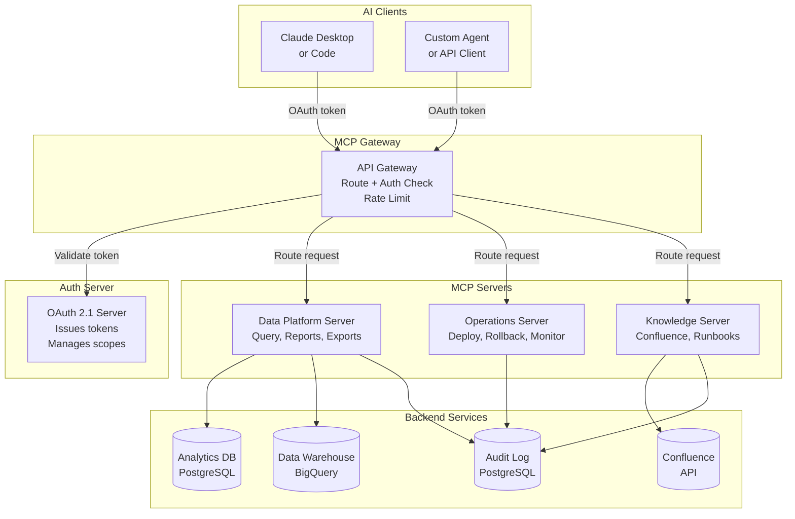
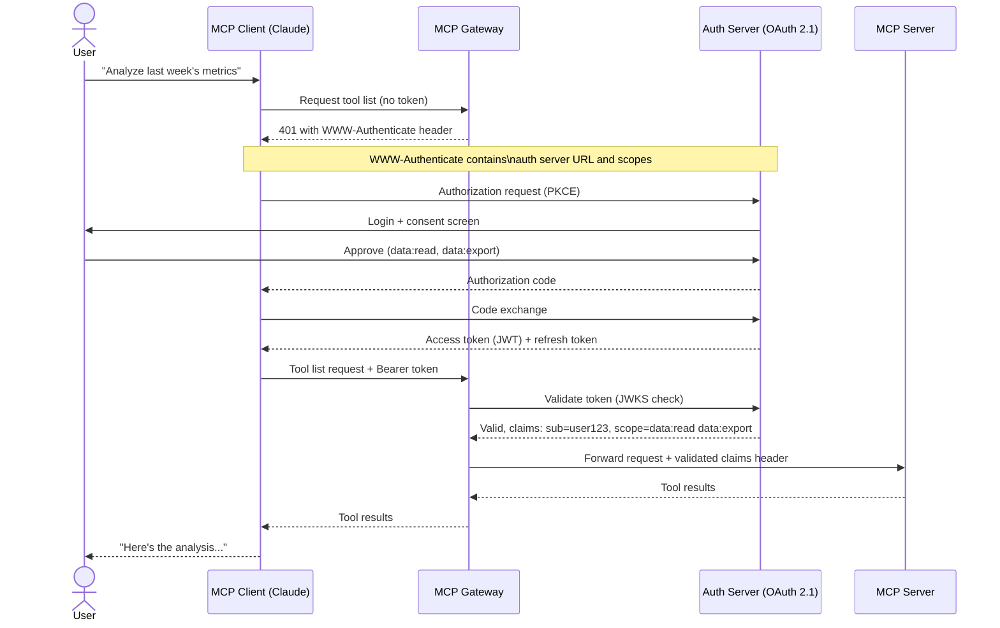

# Building Enterprise MCP Servers: From Prototype to Production

The first MCP server you build takes about twenty minutes. You install the SDK, write a function, add a decorator, run `fastmcp dev`, and Claude Desktop is calling your code. It's a genuinely satisfying experience — the kind that makes you immediately think about what you'll connect next.

The second MCP server is harder. Now you need two tools talking to the same database, and you're managing connection state. The third server needs to be accessible to your whole team, not just running on your laptop. The fourth needs authentication — only certain users should be able to call certain tools. By the fifth, you're asking questions the getting-started documentation doesn't answer: How do I deploy this as a Docker container? How do I rotate secrets without restarting? What happens when a tool call fails partway through a workflow? How do I audit what the AI did and when?

This post picks up where the concept introduction leaves off. We're building a production MCP server: one that handles authentication with OAuth 2.1, enforces per-tool authorization scopes, ships with middleware for logging and rate limiting, supports multi-tenant isolation, and deploys as a container behind an MCP gateway. The use case is an internal enterprise data platform — the kind of server that actually matters to a company.

---

## What "Enterprise-Ready" Means for MCP

A prototype MCP server has three concerns: does the tool do the right thing, does the schema describe it accurately, and does the AI call it correctly. A production MCP server adds five more:

**Authentication**: Who is calling? Is this request coming from an authorized agent or client?

**Authorization**: What are they allowed to do? Can this agent read sensitive data? Can it write? Can it delete?

**Observability**: What happened? Full audit trail of every tool call, with which user, which tool, which arguments, and what outcome.

**Resilience**: What happens when upstream services fail? The server should handle errors gracefully, return actionable error messages (not stack traces), and not leak information.

**Deployment**: How does the server run in production? How does a new team member connect to it? How do you upgrade it without downtime?

These aren't extras. In a company, an AI agent that can call tools has real authority. It can query sensitive data. It can trigger actions. The minimal security posture for a system with real authority is: authentication, scoped authorization, and audit logging.

---

## The Architecture We're Building

Before writing code, the target architecture:



The key design decision: **the MCP gateway sits in front of all servers**. It handles token validation (calling the auth server), routing, and rate limiting. Each MCP server focuses on its domain. No server handles auth independently — they trust the gateway's validation and read scope claims from the forwarded JWT.

This is the June 2025 MCP spec revision's central security recommendation: separate the **authorization server** (issues and validates tokens) from the **resource server** (your MCP server, which validates tokens and enforces access). Don't conflate the two.

---

## Project Structure

```
data-platform-mcp/
├── src/
│   └── data_platform/
│       ├── __init__.py
│       ├── server.py          # FastMCP server, lifespan, mounts
│       ├── tools/
│       │   ├── __init__.py
│       │   ├── query.py       # SQL query tools
│       │   ├── reports.py     # Report generation tools
│       │   └── exports.py     # Data export tools
│       ├── resources/
│       │   ├── __init__.py
│       │   └── schemas.py     # Database schema resources
│       ├── prompts/
│       │   ├── __init__.py
│       │   └── analysis.py    # Analysis prompt templates
│       ├── middleware/
│       │   ├── __init__.py
│       │   ├── auth.py        # JWT validation + scope enforcement
│       │   ├── audit.py       # Audit logging middleware
│       │   └── rate_limit.py  # Per-client rate limiting
│       ├── auth/
│       │   ├── __init__.py
│       │   └── tokens.py      # Token validation logic
│       └── config.py          # Settings via pydantic-settings
├── tests/
│   ├── test_tools.py
│   ├── test_middleware.py
│   └── conftest.py
├── Dockerfile
├── docker-compose.yml
└── pyproject.toml
```

This layout separates concerns cleanly: tools, resources, and prompts are domain logic; middleware is infrastructure; auth is security. The server file wires them together.

---

## The Server Foundation: Lifespan and Configuration

Everything that should live for the server's lifetime — database pools, HTTP clients, cache connections — belongs in the lifespan context manager. This is critical for performance: opening a connection on every tool call is expensive and fragile.

```python
# src/data_platform/config.py
from pydantic_settings import BaseSettings, SettingsConfigDict

class Settings(BaseSettings):
    model_config = SettingsConfigDict(env_file=".env", env_file_encoding="utf-8")
    
    # Database
    db_url: str
    db_pool_size: int = 10
    db_max_overflow: int = 20
    
    # Data Warehouse
    bigquery_project: str
    bigquery_dataset: str
    
    # Auth
    jwt_issuer: str
    jwt_audience: str
    jwks_url: str  # URL to fetch public keys — rotates automatically
    
    # Audit
    audit_db_url: str
    
    # Server
    server_name: str = "data-platform"
    server_version: str = "1.0.0"

settings = Settings()
```

```python
# src/data_platform/server.py
from contextlib import asynccontextmanager
from typing import AsyncIterator

import asyncpg
from fastmcp import FastMCP
from google.cloud import bigquery

from .config import settings
from .middleware.auth import AuthMiddleware
from .middleware.audit import AuditMiddleware
from .middleware.rate_limit import RateLimitMiddleware
from .tools.query import query_tools
from .tools.reports import report_tools
from .tools.exports import export_tools
from .resources.schemas import schema_resources
from .prompts.analysis import analysis_prompts


@asynccontextmanager
async def lifespan(server: FastMCP) -> AsyncIterator[dict]:
    """Initialize shared resources for the server lifetime."""
    # Analytics DB pool
    analytics_pool = await asyncpg.create_pool(
        settings.db_url,
        min_size=2,
        max_size=settings.db_pool_size,
    )
    
    # Audit DB pool (separate database — audit writes must never be blocked)
    audit_pool = await asyncpg.create_pool(
        settings.audit_db_url,
        min_size=2,
        max_size=5,
    )
    
    # BigQuery client (uses ADC — Application Default Credentials)
    bq_client = bigquery.Client(project=settings.bigquery_project)
    
    try:
        yield {
            "analytics_pool": analytics_pool,
            "audit_pool": audit_pool,
            "bq_client": bq_client,
        }
    finally:
        await analytics_pool.close()
        await audit_pool.close()
        bq_client.close()


# Create the server
mcp = FastMCP(
    name=settings.server_name,
    version=settings.server_version,
    lifespan=lifespan,
)

# Register middleware (order matters: auth → rate limit → audit → tool)
mcp.add_middleware(AuthMiddleware(
    jwks_url=settings.jwks_url,
    issuer=settings.jwt_issuer,
    audience=settings.jwt_audience,
))
mcp.add_middleware(RateLimitMiddleware(requests_per_minute=60))
mcp.add_middleware(AuditMiddleware())

# Mount tool/resource/prompt modules
mcp.import_server("query", query_tools)
mcp.import_server("reports", report_tools)
mcp.import_server("exports", export_tools)
mcp.import_server("schemas", schema_resources)
mcp.import_server("analysis", analysis_prompts)
```

---

## Authentication: OAuth 2.1 and JWT Validation

As of June 2025, the MCP specification mandates OAuth 2.1 for HTTP-based transports. The MCP server acts as an OAuth **resource server**: it validates tokens but does not issue them. Token issuance is the authorization server's job (your company's IdP — Okta, Auth0, Azure AD, or an internal service).

```python
# src/data_platform/auth/tokens.py
import time
from functools import lru_cache

import httpx
import jwt
from jwt import PyJWKClient

from ..config import settings


class TokenValidator:
    """Validates JWTs from the authorization server."""
    
    def __init__(self):
        # PyJWKClient fetches and caches JWKS, auto-rotates when keys change
        self._jwks_client = PyJWKClient(
            settings.jwks_url,
            cache_jwk_set=True,
            lifespan=300,  # Re-fetch keys every 5 minutes
        )
    
    def validate(self, token: str) -> dict:
        """
        Validate a JWT and return its claims.
        Raises jwt.InvalidTokenError on any failure.
        """
        signing_key = self._jwks_client.get_signing_key_from_jwt(token)
        
        payload = jwt.decode(
            token,
            signing_key.key,
            algorithms=["RS256", "ES256"],
            audience=settings.jwt_audience,
            issuer=settings.jwt_issuer,
            options={
                "require": ["exp", "iat", "sub", "scope"],
                "verify_exp": True,
            },
        )
        return payload
    
    def has_scope(self, claims: dict, required_scope: str) -> bool:
        """Check if the token includes a required scope."""
        scopes = claims.get("scope", "").split()
        return required_scope in scopes


_validator = TokenValidator()


def get_validator() -> TokenValidator:
    return _validator
```

The middleware uses this validator to authenticate every incoming request:

```python
# src/data_platform/middleware/auth.py
import logging
from typing import Any, Callable

from fastmcp.middleware import Middleware, MiddlewareContext
from jwt import InvalidTokenError

from ..auth.tokens import get_validator

logger = logging.getLogger(__name__)


class AuthMiddleware(Middleware):
    """
    Validates OAuth 2.1 Bearer tokens on every request.
    Attaches decoded claims to context for downstream use.
    """
    
    def __init__(self, jwks_url: str, issuer: str, audience: str):
        self.jwks_url = jwks_url
        self.issuer = issuer
        self.audience = audience
    
    async def __call__(
        self,
        context: MiddlewareContext,
        call_next: Callable,
    ) -> Any:
        validator = get_validator()
        
        # Extract Bearer token from the Authorization header
        auth_header = context.request_headers.get("Authorization", "")
        if not auth_header.startswith("Bearer "):
            return self._unauthorized("Missing or malformed Authorization header")
        
        token = auth_header[len("Bearer "):]
        
        try:
            claims = validator.validate(token)
        except InvalidTokenError as e:
            logger.warning("Token validation failed: %s", str(e))
            return self._unauthorized("Invalid or expired token")
        
        # Attach claims to context for downstream middleware and tools
        context.state["jwt_claims"] = claims
        context.state["subject"] = claims.get("sub", "unknown")
        context.state["tenant_id"] = claims.get("tenant_id")  # Custom claim
        
        return await call_next(context)
    
    def _unauthorized(self, message: str) -> dict:
        return {
            "error": {
                "code": -32001,
                "message": message,
            }
        }
```

Now individual tools can enforce per-scope authorization without re-validating the token — the claims are already in context:

```python
# src/data_platform/tools/query.py
import json
import logging

import asyncpg
from fastmcp import FastMCP, Context
from fastmcp.exceptions import ToolError

logger = logging.getLogger(__name__)

query_tools = FastMCP("query-tools")


def _require_scope(ctx: Context, scope: str) -> None:
    """Raise ToolError if the caller doesn't have the required scope."""
    claims = ctx.state.get("jwt_claims", {})
    scopes = claims.get("scope", "").split()
    if scope not in scopes:
        logger.warning(
            "Scope denied: subject=%s required=%s granted=%s",
            claims.get("sub"), scope, scopes,
        )
        raise ToolError(
            f"This tool requires the '{scope}' scope. "
            f"Contact your administrator to request access."
        )


@query_tools.tool()
async def run_analytics_query(
    sql: str,
    limit: int = 1000,
    ctx: Context = None,
) -> str:
    """
    Execute a read-only SQL query against the analytics database.
    Returns results as JSON. Maximum 1000 rows.
    
    Args:
        sql: A SELECT query. INSERT, UPDATE, DELETE, and DDL are not permitted.
        limit: Maximum number of rows to return (max 1000).
    """
    _require_scope(ctx, "data:read")
    
    # Validate the query is read-only
    normalized = sql.strip().upper()
    forbidden = ("INSERT", "UPDATE", "DELETE", "DROP", "CREATE", "ALTER", "TRUNCATE")
    if not normalized.startswith("SELECT") or any(w in normalized for w in forbidden):
        raise ToolError(
            "Only SELECT queries are permitted. "
            "Data modification requires a different tool with write scope."
        )
    
    # Enforce limit in the query
    limit = min(limit, 1000)
    safe_sql = f"SELECT * FROM ({sql}) AS _q LIMIT {limit}"
    
    pool: asyncpg.Pool = ctx.state["analytics_pool"]
    tenant_id = ctx.state.get("tenant_id")
    
    try:
        async with pool.acquire() as conn:
            # Row-level security: set the tenant context for RLS policies
            if tenant_id:
                await conn.execute(
                    "SET LOCAL app.tenant_id = $1", tenant_id
                )
            rows = await conn.fetch(safe_sql)
    except asyncpg.PostgresError as e:
        # Don't leak internal error messages — they may contain schema info
        logger.error("Query failed for subject=%s: %s", ctx.state.get("subject"), e)
        raise ToolError(
            f"Query execution failed: {e.pgcode or 'QUERY_ERROR'}. "
            "Check your SQL syntax and column names."
        )
    
    if not rows:
        return "Query returned no results."
    
    # Serialize to JSON-friendly structure
    result = [dict(row) for row in rows]
    return json.dumps(result, default=str, indent=2)


@query_tools.tool()
async def get_table_preview(
    table_name: str,
    rows: int = 5,
    ctx: Context = None,
) -> str:
    """
    Preview the first N rows of a table.
    
    Args:
        table_name: Schema-qualified table name (e.g. 'public.events')
        rows: Number of rows to preview (max 20)
    """
    _require_scope(ctx, "data:read")
    
    # Whitelist approach: only allow alphanumeric + underscore + dot
    import re
    if not re.fullmatch(r'[a-zA-Z0-9_.]+', table_name):
        raise ToolError("Invalid table name format.")
    
    rows = min(rows, 20)
    return await run_analytics_query(
        f"SELECT * FROM {table_name}",
        limit=rows,
        ctx=ctx,
    )
```

Notice three things: scope enforcement happens at the function level (`_require_scope`); SQL injection is mitigated by wrapping queries in a subquery with LIMIT and validating read-only intent; tenant isolation uses PostgreSQL row-level security policies triggered by a session variable. The MCP layer doesn't try to build its own data access control — it leverages what the database already provides.

---

## Audit Logging: The Enterprise Non-Negotiable

Every tool call in an enterprise system needs a complete audit trail. Not just for security — for debugging AI workflows, for compliance (GDPR, SOC 2, HIPAA), and for understanding what your agents are actually doing.

```python
# src/data_platform/middleware/audit.py
import json
import logging
import time
from typing import Any, Callable

from fastmcp.middleware import Middleware, MiddlewareContext

logger = logging.getLogger(__name__)


class AuditMiddleware(Middleware):
    """
    Records every tool call with timing, subject, inputs, and outcome.
    Writes to a dedicated audit table — failure here must not block the tool call.
    """
    
    async def __call__(
        self,
        context: MiddlewareContext,
        call_next: Callable,
    ) -> Any:
        start_time = time.monotonic()
        subject = context.state.get("subject", "anonymous")
        tenant_id = context.state.get("tenant_id", "default")
        
        # Capture method and tool name
        method = getattr(context, "method", "unknown")
        tool_name = None
        if method == "tools/call":
            tool_name = context.request_params.get("name")
        
        error_code = None
        result_size = None
        
        try:
            result = await call_next(context)
            if isinstance(result, dict) and "error" in result:
                error_code = result["error"].get("code")
            elif isinstance(result, str):
                result_size = len(result)
            return result
        except Exception as e:
            error_code = "EXCEPTION"
            raise
        finally:
            elapsed_ms = int((time.monotonic() - start_time) * 1000)
            
            # Write audit entry asynchronously — don't block response
            audit_entry = {
                "subject": subject,
                "tenant_id": tenant_id,
                "method": method,
                "tool_name": tool_name,
                "elapsed_ms": elapsed_ms,
                "error_code": error_code,
                "result_size_bytes": result_size,
            }
            
            # Fire-and-forget audit write
            try:
                audit_pool = context.state.get("audit_pool")
                if audit_pool:
                    async with audit_pool.acquire() as conn:
                        await conn.execute(
                            """
                            INSERT INTO mcp_audit_log
                                (subject, tenant_id, method, tool_name,
                                 elapsed_ms, error_code, result_size_bytes, created_at)
                            VALUES ($1, $2, $3, $4, $5, $6, $7, NOW())
                            """,
                            subject, tenant_id, method, tool_name,
                            elapsed_ms, error_code, result_size,
                        )
            except Exception as audit_err:
                # Audit failures are logged but never propagate to the caller
                logger.error("Audit write failed: %s", audit_err)
```

The audit table schema:

```sql
CREATE TABLE mcp_audit_log (
    id           BIGSERIAL PRIMARY KEY,
    subject      TEXT NOT NULL,         -- JWT sub claim: user or service account
    tenant_id    TEXT,                  -- For multi-tenant isolation
    method       TEXT NOT NULL,         -- e.g., "tools/call"
    tool_name    TEXT,                  -- e.g., "run_analytics_query"
    elapsed_ms   INTEGER,
    error_code   TEXT,
    result_size_bytes INTEGER,
    created_at   TIMESTAMPTZ NOT NULL DEFAULT NOW()
);

CREATE INDEX ON mcp_audit_log (subject, created_at);
CREATE INDEX ON mcp_audit_log (tenant_id, created_at);
CREATE INDEX ON mcp_audit_log (tool_name, created_at);
```

With this in place, your security team can answer "what did this agent do between 14:00 and 16:00 on Tuesday" with a simple query.

---

## Dynamic Resources: Schema and Context Discovery

Resources in MCP are how the AI client learns what's available before deciding what to call. For a data platform, the most valuable resources are database schemas — exposing them lets the AI write better SQL without hallucinating table names.

```python
# src/data_platform/resources/schemas.py
from fastmcp import FastMCP, Context

schema_resources = FastMCP("schema-resources")


@schema_resources.resource("schema://tables")
async def list_available_tables(ctx: Context) -> str:
    """
    List all tables accessible to the current user in the analytics database.
    Use this before writing queries to know what data is available.
    """
    pool = ctx.state["analytics_pool"]
    tenant_id = ctx.state.get("tenant_id")
    
    async with pool.acquire() as conn:
        if tenant_id:
            await conn.execute("SET LOCAL app.tenant_id = $1", tenant_id)
        
        rows = await conn.fetch("""
            SELECT
                table_schema,
                table_name,
                pg_size_pretty(pg_total_relation_size(
                    quote_ident(table_schema) || '.' || quote_ident(table_name)
                )) AS size,
                (SELECT reltuples::BIGINT
                 FROM pg_class
                 WHERE oid = (quote_ident(table_schema) || '.' || quote_ident(table_name))::regclass
                ) AS approx_rows
            FROM information_schema.tables
            WHERE table_schema NOT IN ('pg_catalog', 'information_schema')
            ORDER BY table_schema, table_name
        """)
    
    lines = ["# Available Tables\n"]
    current_schema = None
    for row in rows:
        if row["table_schema"] != current_schema:
            current_schema = row["table_schema"]
            lines.append(f"\n## Schema: {current_schema}\n")
        lines.append(
            f"- **{row['table_name']}** "
            f"(~{row['approx_rows']:,} rows, {row['size']})"
        )
    
    return "\n".join(lines)


@schema_resources.resource("schema://tables/{table_name}")
async def get_table_schema(table_name: str, ctx: Context) -> str:
    """
    Get the full schema for a specific table including column types,
    constraints, and foreign key relationships.
    """
    import re
    if not re.fullmatch(r'[a-zA-Z0-9_.]+', table_name):
        return "Invalid table name."
    
    schema, _, tbl = table_name.rpartition(".")
    schema = schema or "public"
    
    pool = ctx.state["analytics_pool"]
    async with pool.acquire() as conn:
        columns = await conn.fetch("""
            SELECT
                column_name,
                data_type,
                is_nullable,
                column_default,
                character_maximum_length
            FROM information_schema.columns
            WHERE table_schema = $1 AND table_name = $2
            ORDER BY ordinal_position
        """, schema, tbl)
        
        if not columns:
            return f"Table '{table_name}' not found or not accessible."
        
        lines = [f"# Schema: {table_name}\n\n| Column | Type | Nullable | Default |",
                 "|--------|------|----------|---------|"]
        for col in columns:
            type_str = col["data_type"]
            if col["character_maximum_length"]:
                type_str += f"({col['character_maximum_length']})"
            nullable = "YES" if col["is_nullable"] == "YES" else "NO"
            default = col["column_default"] or ""
            lines.append(f"| {col['column_name']} | {type_str} | {nullable} | {default} |")
        
        return "\n".join(lines)
```

Dynamic resource URIs — `schema://tables/{table_name}` — let the AI client fetch the schema for any specific table it's about to query. This is context injection done right: the AI gets exactly the structural information it needs, on demand, without you stuffing an entire database schema into the system prompt.

---

## Prompts: Encoding Domain Expertise

Prompts are the most underused MCP primitive. They're pre-defined templates that activate a specific mode of reasoning — the AI equivalent of "open this runbook when you see an incident."

```python
# src/data_platform/prompts/analysis.py
from fastmcp import FastMCP
from fastmcp.prompts import Message

analysis_prompts = FastMCP("analysis-prompts")


@analysis_prompts.prompt()
def analyze_metric_decline(
    metric_name: str,
    start_date: str,
    end_date: str,
    percentage_drop: float,
) -> list[Message]:
    """
    Systematic analysis template for investigating a metric decline.
    Guides the model through root cause analysis with structured queries.
    """
    return [
        Message(role="user", content=f"""
You are a data analyst investigating a metric decline. 

**Situation**: {metric_name} dropped by {percentage_drop:.1f}% 
between {start_date} and {end_date}.

Follow this systematic process:

1. **Confirm the decline**: Use `run_analytics_query` to verify the numbers are real 
   (check for data pipeline issues first).

2. **Segment the decline**: Break down {metric_name} by all available dimensions 
   (geography, product, user segment, channel). Which segments drove the drop?

3. **Check for external events**: Query the `events_log` table for deployments, 
   outages, or campaigns in this period.

4. **Isolate the root cause**: Based on segments and events, form and test hypotheses 
   with targeted queries.

5. **Quantify impact**: For each contributing factor, estimate its share of the total decline.

6. **Summarize findings**: Present a clear narrative with supporting data.

Start by confirming the decline, then proceed through each step.
""")
    ]


@analysis_prompts.prompt()
def write_sql_for_question(question: str) -> list[Message]:
    """
    Bootstrap a SQL analysis from a natural language question.
    Instructs the model to inspect the schema before writing any query.
    """
    return [
        Message(role="user", content=f"""
Your task is to answer this data question with SQL:

**Question**: {question}

**Process**:
1. Fetch `schema://tables` to see what tables are available.
2. For relevant tables, fetch `schema://tables/{{table_name}}` to see columns.
3. Write a SQL query. Use CTEs for complex logic — one CTE per step.
4. Run the query with `run_analytics_query`.
5. Interpret the results and answer the original question clearly.

Do not guess table or column names. Always inspect the schema first.
""")
    ]
```

A prompt like `analyze_metric_decline` encodes weeks of analytical process development. Instead of prompting the AI from scratch every time a metric drops, you activate this prompt and it follows a systematic methodology that your team has validated.

---

## The OAuth Flow: How Clients Authenticate

Understanding how a client gets a token is essential for debugging authentication failures.



The MCP server itself never handles login — it only validates the tokens the gateway has already verified. This keeps the server's responsibility narrow and auditable.

---

## Rate Limiting and Resilience

Without rate limiting, a misbehaving agent or a prompt injection attack can spam your tools until a backend service falls over.

```python
# src/data_platform/middleware/rate_limit.py
import time
from collections import defaultdict
from typing import Any, Callable

from fastmcp.middleware import Middleware, MiddlewareContext
from fastmcp.exceptions import ToolError


class RateLimitMiddleware(Middleware):
    """
    Token bucket rate limiter per subject.
    Requests beyond the limit get a clear error, not a silent failure.
    """
    
    def __init__(self, requests_per_minute: int = 60):
        self.rate = requests_per_minute / 60.0  # tokens per second
        self.max_tokens = requests_per_minute
        self._buckets: dict[str, tuple[float, float]] = defaultdict(
            lambda: (self.max_tokens, time.monotonic())
        )
    
    async def __call__(
        self,
        context: MiddlewareContext,
        call_next: Callable,
    ) -> Any:
        # Only rate-limit tool calls, not list requests
        if getattr(context, "method", "") != "tools/call":
            return await call_next(context)
        
        subject = context.state.get("subject", "anonymous")
        tokens, last_update = self._buckets[subject]
        
        # Refill tokens based on time elapsed
        now = time.monotonic()
        elapsed = now - last_update
        tokens = min(self.max_tokens, tokens + elapsed * self.rate)
        
        if tokens < 1.0:
            retry_after = int((1.0 - tokens) / self.rate) + 1
            raise ToolError(
                f"Rate limit exceeded. "
                f"You are making too many tool calls. "
                f"Please wait {retry_after} seconds before retrying."
            )
        
        self._buckets[subject] = (tokens - 1.0, now)
        return await call_next(context)
```

For production, replace the in-memory `defaultdict` with Redis so rate limits persist across server restarts and work correctly in multi-instance deployments.

---

## Testing: MCP Inspector and Pytest

Never deploy an MCP server you haven't tested. The tools are the interface — test them like an API.

**Development testing** with the MCP Inspector:

```bash
# Launch your server with the interactive inspector
fastmcp dev src/data_platform/server.py

# The Inspector opens in your browser:
# - Browse all registered tools, resources, and prompts
# - Call tools with custom inputs and inspect raw JSON-RPC responses
# - Test error paths by passing invalid arguments
```

**Unit testing** with pytest — test tool logic without a real database or HTTP server:

```python
# tests/conftest.py
import pytest
import asyncpg
from fastmcp import FastMCP, Context
from unittest.mock import AsyncMock, MagicMock


@pytest.fixture
def mock_context():
    """Context with in-memory state, no real DB or auth."""
    ctx = MagicMock(spec=Context)
    
    # Simulate an authenticated user with data:read scope
    ctx.state = {
        "jwt_claims": {
            "sub": "user:test123",
            "scope": "data:read data:export",
            "tenant_id": "tenant-a",
        },
        "subject": "user:test123",
        "tenant_id": "tenant-a",
    }
    return ctx


@pytest.fixture
def mock_pool():
    """Asyncpg pool mock that returns configurable results."""
    pool = AsyncMock(spec=asyncpg.Pool)
    conn = AsyncMock(spec=asyncpg.Connection)
    pool.acquire.return_value.__aenter__ = AsyncMock(return_value=conn)
    pool.acquire.return_value.__aexit__ = AsyncMock(return_value=None)
    return pool, conn
```

```python
# tests/test_tools.py
import json
import pytest

from data_platform.tools.query import run_analytics_query, get_table_preview


@pytest.mark.asyncio
async def test_read_only_enforcement(mock_context):
    """DELETE queries must be rejected."""
    with pytest.raises(Exception, match="Only SELECT queries"):
        await run_analytics_query(
            sql="DELETE FROM events WHERE id = 1",
            ctx=mock_context,
        )


@pytest.mark.asyncio
async def test_scope_enforcement(mock_context):
    """Tool call must fail if required scope is missing."""
    mock_context.state["jwt_claims"]["scope"] = "data:export"  # No data:read
    
    with pytest.raises(Exception, match="data:read"):
        await run_analytics_query(
            sql="SELECT 1",
            ctx=mock_context,
        )


@pytest.mark.asyncio
async def test_limit_enforcement(mock_context, mock_pool):
    """Query results must be capped at 1000 rows."""
    pool, conn = mock_pool
    mock_context.state["analytics_pool"] = pool
    
    # Simulate DB returning 3 rows
    conn.fetch.return_value = [
        {"id": i, "value": f"row_{i}"} for i in range(3)
    ]
    
    result = await run_analytics_query(
        sql="SELECT id, value FROM events",
        limit=2000,  # Over the cap
        ctx=mock_context,
    )
    
    # The SQL sent to the DB must include LIMIT 1000
    call_args = conn.fetch.call_args[0][0]
    assert "LIMIT 1000" in call_args
    
    rows = json.loads(result)
    assert len(rows) == 3
```

---

## Deployment: Container and Gateway

The server runs as a container behind an MCP gateway. The gateway handles TLS termination, token validation, and routing.

```dockerfile
# Dockerfile
FROM python:3.12-slim

WORKDIR /app

RUN pip install uv

COPY pyproject.toml uv.lock ./
RUN uv sync --frozen --no-dev

COPY src/ ./src/

# Run the server with Streamable HTTP transport (production standard)
CMD ["uv", "run", "fastmcp", "run", "src/data_platform/server.py", \
     "--transport", "streamable-http", \
     "--port", "8080", \
     "--host", "0.0.0.0"]
```

```yaml
# docker-compose.yml
services:
  mcp-data-platform:
    build: .
    ports:
      - "8080:8080"
    environment:
      DB_URL: ${DB_URL}
      AUDIT_DB_URL: ${AUDIT_DB_URL}
      BIGQUERY_PROJECT: ${BIGQUERY_PROJECT}
      BIGQUERY_DATASET: ${BIGQUERY_DATASET}
      JWT_ISSUER: ${JWT_ISSUER}
      JWT_AUDIENCE: ${JWT_AUDIENCE}
      JWKS_URL: ${JWKS_URL}
      GOOGLE_APPLICATION_CREDENTIALS: /secrets/gcp-key.json
    volumes:
      - ${GCP_KEY_PATH}:/secrets/gcp-key.json:ro
    healthcheck:
      test: ["CMD", "curl", "-f", "http://localhost:8080/health"]
      interval: 30s
      timeout: 10s
      retries: 3
      start_period: 15s
    restart: unless-stopped
    deploy:
      resources:
        limits:
          memory: 512M
          cpus: "0.5"

  # MCP Gateway — routes to multiple MCP servers, validates tokens centrally
  mcp-gateway:
    image: docker/mcp-gateway:latest
    ports:
      - "443:443"
    environment:
      AUTH_SERVER_URL: ${AUTH_SERVER_URL}
    volumes:
      - ./gateway-config.yaml:/config/gateway.yaml:ro
    depends_on:
      - mcp-data-platform
```

```yaml
# gateway-config.yaml
servers:
  - name: data-platform
    url: http://mcp-data-platform:8080
    path_prefix: /data
    required_scopes: [data:read]
  
  - name: operations
    url: http://mcp-operations:8081
    path_prefix: /ops
    required_scopes: [ops:read]
    
  - name: knowledge
    url: http://mcp-knowledge:8082
    path_prefix: /docs
    required_scopes: [docs:read]

rate_limiting:
  global: 1000 req/min
  per_subject: 100 req/min

audit:
  enabled: true
  destination: postgresql://${AUDIT_DB_URL}/mcp_gateway_audit
```

With this configuration, your entire team connects to a single gateway endpoint. Clients use OAuth to get tokens scoped to the servers they need. The gateway routes requests to the right MCP server. No one needs to know the internal server addresses.

---

## Connecting from Claude Code

Once deployed, connecting Claude Code to your enterprise MCP gateway is one configuration change:

```json
// .claude/settings.json or ~/.claude/settings.json
{
  "mcpServers": {
    "enterprise-data": {
      "type": "http",
      "url": "https://mcp.yourcompany.com/data",
      "headers": {
        "Authorization": "Bearer ${ENTERPRISE_MCP_TOKEN}"
      }
    },
    "enterprise-ops": {
      "type": "http",
      "url": "https://mcp.yourcompany.com/ops",
      "headers": {
        "Authorization": "Bearer ${ENTERPRISE_MCP_TOKEN}"
      }
    }
  }
}
```

Developers set `ENTERPRISE_MCP_TOKEN` in their environment (managed by your secrets tool — 1Password, Vault, AWS Secrets Manager). The token carries their identity and scopes. The gateway validates it. The MCP server trusts the gateway. One connection, all the tools, audit trail for everything.

---

## What to Build Next

A production MCP server is a platform, not a project. Once the foundation is solid, the patterns above scale to:

**Server composition**: FastMCP's `import_server` and `mount` let you combine specialized sub-servers into one endpoint. A single `enterprise://data` server can mount a reporting sub-server, an export sub-server, and a metadata sub-server — each maintained by a different team.

**Streaming responses**: For long-running operations (exporting 100K rows, generating a multi-sheet report), use `ctx.stream()` to send progressive results. The client receives each chunk as it's ready rather than waiting for the entire operation.

**Tool versioning**: As you add or change tools, version them explicitly. Tools with `name="run_query_v2"` let you deprecate old tools gracefully without breaking existing agent workflows that reference the old name.

**Semantic routing via LLM**: At the gateway level, you can add an LLM-based router that reads the incoming request's natural language context and routes it to the most appropriate MCP server — even when the client doesn't know which server has the tool. This is how multi-server MCP deployments eventually evolve: a routing layer with semantic understanding, backed by specialized servers that do one thing well.

---

## Going Deeper

**Books:**
- Kleppmann, M. (2017). *Designing Data-Intensive Applications.* O'Reilly.
  - The authoritative guide on building reliable backend systems — the principles apply directly to MCP server backends.
- Newman, S. (2019). *Monolith to Microservices.* O'Reilly.
  - Useful framing for the MCP server decomposition question: when to build one server vs several specialized ones.

**Online Resources:**
- [MCP Authorization Spec — Official Tutorial](https://modelcontextprotocol.io/docs/tutorials/security/authorization) — The spec's own guide on OAuth 2.1 for MCP, including Protected Resource Metadata (RFC 9728).
- [FastMCP Middleware Documentation](https://gofastmcp.com/servers/middleware) — Complete middleware API with logging, rate limiting, and error handling templates.
- [FastMCP 2.13 Release Notes](https://www.jlowin.dev/blog/fastmcp-2-13) — Storage, security, and scale improvements — the current state of the framework.
- [Docker MCP Gateway](https://www.docker.com/blog/mcp-gateway/) — Docker's open-source gateway with container isolation per server.
- [Cloudflare — Build a Remote MCP Server](https://developers.cloudflare.com/agents/guides/remote-mcp-server/) — Deploying MCP servers to Cloudflare Workers with built-in OAuth.
- [GitGuardian — OAuth for MCP: Emerging Enterprise Patterns](https://blog.gitguardian.com/oauth-for-mcp-emerging-enterprise-patterns-for-agent-authorization/) — Detailed treatment of the auth server vs resource server separation and per-tool scopes.

**Videos:**
- [Anthropic — MCP Deep Dive at AI Dev NYC 2025](https://www.youtube.com/results?search_query=anthropic+MCP+deep+dive+2025) — Protocol internals and the roadmap from Anthropic engineers.

**Academic Papers / Specs:**
- Hardt, D. (2012). ["The OAuth 2.0 Authorization Framework."](https://datatracker.ietf.org/doc/html/rfc6749) *RFC 6749.* IETF.
  - The foundational OAuth spec. OAuth 2.1 (the version MCP requires) is a consolidation that removes the unsafe flows.
- Jones, M., Bradley, J., & Sakimura, N. (2015). ["JSON Web Token."](https://datatracker.ietf.org/doc/html/rfc7519) *RFC 7519.* IETF.
  - JWT specification. Essential for understanding what's in the tokens you're validating.

**Questions to Explore:**
- The MCP spec separates authorization server from resource server. In a large enterprise with hundreds of MCP servers, should each server validate tokens independently via JWKS, or should a central gateway be the single validation point? What are the consistency, latency, and failure mode trade-offs?
- Tool schemas are the AI's API contract — they determine what the model can call and how. What's the right versioning strategy for MCP tools as your platform evolves? Semver? Deprecation windows? How do you handle a model that has cached an old tool schema?
- Prompt injection is a real attack vector for MCP servers: malicious content in a database row could instruct the AI to call delete tools. What validation and sandboxing strategies make sense at the MCP server layer?
- As MCP server fleets grow, the "right tool for this question" problem becomes a routing problem. What's the correct architecture: have the client enumerate all tools across all servers, or have a semantic router decide which server to query before the client sends a request?
- RBAC (role-based access control) via JWT scopes works for human users whose roles change slowly. AI agents may need more dynamic authorization — different permissions per task, per conversation context, or per data classification. How should MCP authorization evolve to support agent-specific trust models?
