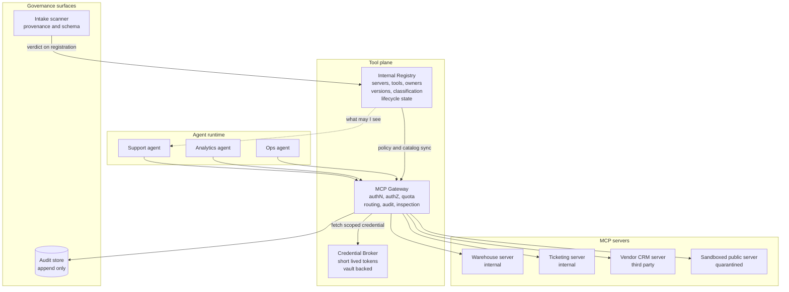
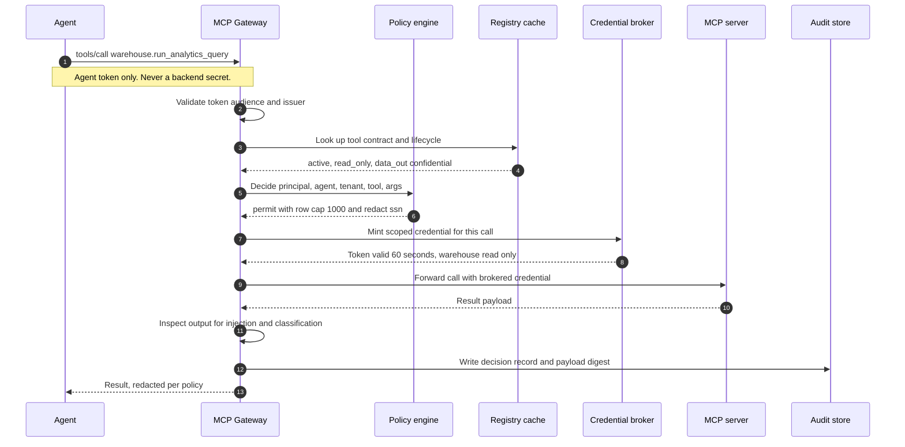
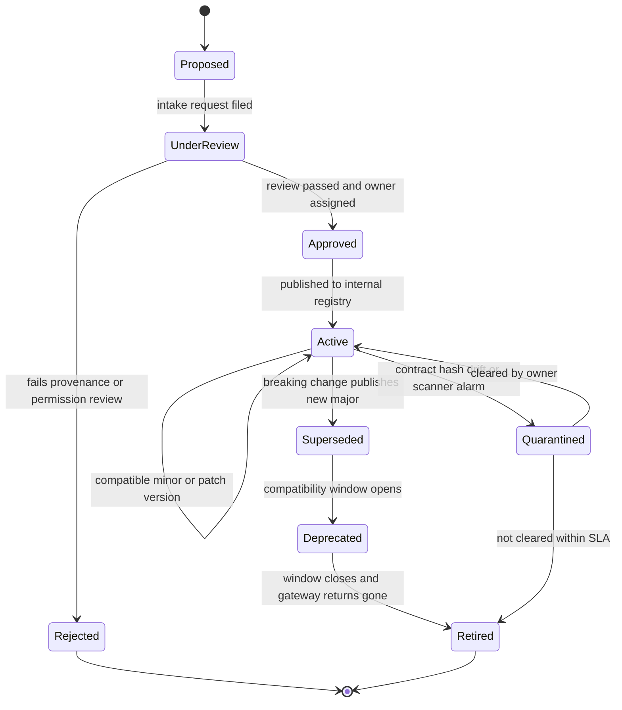
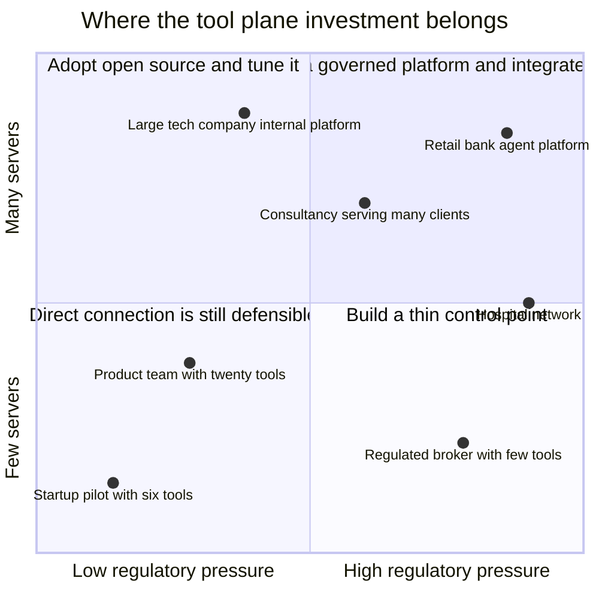

# The Tool Plane: MCP Registry, Gateway, and Governing Ten Thousand Servers

## The Day Someone Counted

The question that started it was boring enough to be dangerous. A security engineer preparing for an audit needed one number: how many MCP servers can our production agents reach?

Nobody had it. Not because anyone was careless, but because nobody had ever needed it before. MCP had arrived the way good standards arrive — quietly, through developers who tried it once, liked it, and never stopped. There was a platform team, and the platform team knew about the servers it had built. Six of them. Warehouse queries, document search, a ticketing bridge, a deployment tool, an internal wiki reader, a customer-record lookup. Six servers, six owners, six runbooks. A tidy inventory that fit on one slide.

So she went looking for the real number. Egress logs from the agent runtime namespace. Container manifests. The `mcpServers` blocks in every checked-in editor config across the monorepo. Environment variables in CI. The vendor SaaS tools that had shipped their own MCP endpoints and been enabled by a product manager with an admin seat.

The number was 340.

Not 340 approved servers. 340 *reachable* ones: distinct MCP endpoints that something running inside the production perimeter could open a connection to and call. Roughly forty of them were internal. About sixty were vendor-hosted endpoints attached to SaaS the company already paid for. The remaining two hundred and forty were public servers pulled from GitHub and npm, running as sidecars or local processes next to agents, connected because a developer needed a capability on a Tuesday and MCP made it a two-line change.

Every one of those two hundred and forty had been a *good decision in isolation*. That is the part worth sitting with. Nobody violated a policy. There was no policy. The protocol did exactly what it promised: it collapsed the cost of connecting an agent to a capability from *build an integration* to *paste a config block*. The M-by-N problem got solved, and the solution worked so well that the organization integrated four hundred times faster than it could govern.

This is Part 4 of [The Agent Platform](https://juanlara18.github.io/portfolio/#/blog/agent-platform-control-plane-data-plane). Part 1 drew the line between control plane and data plane. Part 2 handled sessions and state. Part 3 put the compute in a box you can trust. This post is about the layer where agents touch the rest of the company — the **tool plane** — and about the two components that turn a pile of MCP servers into something you can operate: a **registry** and a **gateway**.

Two things this post is deliberately not. It is not an introduction to the protocol; if you need the primitives, the transports, and why a standard beat the alternatives, that is [The Model Context Protocol: How AI Learned to Use Tools](https://juanlara18.github.io/portfolio/#/blog/model-context-protocol). And it is not a guide to building a server; OAuth 2.1 inside a server, per-tool scopes, middleware, and multi-tenant isolation are covered end to end in [Building Enterprise MCP Servers](https://juanlara18.github.io/portfolio/#/blog/mcp-production-enterprise). Both of those posts optimize a single server. Everything here starts from the assumption that you already have a good one, and then you have three hundred and thirty-nine more.

I want to be precise about the claim, because it is easy to read this post as anti-MCP and it is the opposite. Choosing MCP was correct. If that team had built 340 bespoke connectors instead, they would be in far worse shape: the same sprawl with none of the uniformity, and no possibility of putting a single control point in front of it. The protocol is what makes governance *possible*. It just does not make governance *happen*. Standardizing the interface is where the platform problem begins, not where it ends.

---

## Ten Thousand Servers, and Why Direct Connection Stops Working

The 340 in that story is small. Here is the outside world.

Anthropic's December 9, 2025 ecosystem announcement reported more than **10,000 active public MCP servers** and more than **97 million monthly SDK downloads**. A snapshot of the official MCP Registry API taken on May 24, 2026 counted **9,652 latest server records** across **28,959 server-and-version records**, with **15,926 repositories** carrying the `mcp-server` topic on GitHub the same day. The academic picture is larger still: the 2026 study *Rethinking MCP Security* assembled a corpus of **64,611 unique MCP servers** — 113,927 instances in total — of which more than 37,288 could be brought up for dynamic analysis.

The adoption numbers deserve more skepticism than they usually get. You will see "78% of enterprise AI teams use MCP in production" quoted widely; it does not trace to a survey anyone published. Stacklok's *State of MCP in Software 2026* survey is the number I would defend: **41% of respondents report MCP in some production stage**, split as 29% limited production and 12% broad production. That is an enormous figure for a protocol under two years old, and it is honest.

Now put those two facts next to each other. The public catalog is around ten thousand servers. Fewer than half of enterprises are in production. The gap between those numbers is the window you are currently standing in, and it closes fast.

At what point does direct connection stop being an architecture? The honest answer is that it never *was* one — it was a default that stayed invisible while the numbers were small. Four things break, roughly in this order.

**Discovery breaks first.** With six servers, a developer knows the six. With sixty, they do not, so they build the seventh version of a tool that already exists, or worse, they reach for a public server because it was easier to find than the internal one. The failure mode is not chaos; it is quiet duplication and quiet leakage.

**Credentials break second.** Every direct connection needs a secret at the edge. A token in an environment variable, a service-account key in a config file, a personal access token a developer pasted in and forgot. GitGuardian's 2026 scanning found **24,008 unique secrets exposed in MCP-related configuration files on public GitHub**, of which **2,117 were still valid at scan time** — 8.8% of the MCP-related findings. Those are the ones that leaked into public repos. Extrapolate to the ones sitting in private ones.

**Authorization breaks third.** With direct connection, the server is the only place authorization can live, which means every server implements it, which means every server implements it slightly differently and some of them not at all. The 2026 measurement study *Authentication Security in Real-World Remote MCP Servers* scanned **7,973 live remote MCP servers** and found **40.55% expose tools with no authentication whatsoever**. Of 119 OAuth-enabled servers the authors could test properly, **every single one exhibited at least one authentication flaw**, 325 in total, with dynamic client registration flaws affecting **96.6%** of them. The work produced nine CVE IDs. This is not a story about careless developers. It is a story about what happens when a security-critical function is replicated hundreds of times by teams whose actual job was to expose a database query.

**Auditability breaks last, and it breaks hardest**, because it breaks in front of a regulator. When an auditor asks "which agents called which tools against customer data in Q3, and under whose authority," a fleet of directly connected servers can only answer with a union of heterogeneous logs, if the servers logged at all. There is no join key. There is no common identity. There is no single place that saw every request.

Each of these has a local fix. Publish a wiki page for discovery. Move secrets to a vault. Mandate that every server implement OAuth. Standardize a log format. Every one of those fixes is real, and every one of them decays, because they are conventions rather than chokepoints. Conventions hold until someone is in a hurry.

The structural fix is to stop letting agents talk to servers directly, and to introduce two things that do not exist in the protocol: a place that knows what tools exist, and a place every call has to pass through.

---

## Registry and Gateway: Two Components, One Confusion

These get used interchangeably and they are not the same thing. Here is the sentence to keep:

> **The registry lists the tools. The gateway controls who gets access, how requests route, and how they are logged.**

The registry is a **catalog**. It is metadata about servers and tools: what exists, what it does, who owns it, what version it is at, what endpoint it lives behind, what auth it requires, what data it touches, what state of its lifecycle it is in. It is a read-mostly system that answers questions. It is not on the request path. If the registry goes down, tool calls keep working; you just cannot discover or onboard anything new.

The gateway is a **control plane on the data path**. Every tool call goes through it. It authenticates the caller, decides whether this particular agent acting for this particular principal may invoke this particular tool with these particular arguments, attaches the right credential, applies quota, routes the request, inspects the response, and writes the audit record. If the gateway goes down, tool calls stop. That asymmetry is the whole design tension, and it dictates almost every engineering choice you will make about the two.

Note what the *official* MCP Registry deliberately is not. It is a discovery service: it verifies namespace ownership via GitHub OAuth, GitHub OIDC, or a DNS or HTTP challenge — to publish under `me.adamjones/my-cool-mcp` you must prove you control `adamjones.me` — and it publishes `server.json` metadata. It explicitly does **not** curate quality and does **not** security-scan what is submitted. That is the correct scope for a community index and exactly the wrong scope for your company. The public registry tells you a server exists and who claims it. Your internal registry has to tell you whether you are allowed to use it.



Read the dotted line carefully. Agents query the registry to learn what tools exist, but they never learn about a tool the registry has not cleared them to see — and even if they did, the gateway would refuse the call. Discovery and enforcement are separate decisions made against the same catalog. That redundancy is intentional: a registry lookup is advisory, a gateway decision is binding.

This split is not theoretical. AWS's open-source **MCP Gateway and Registry** (Apache 2.0, described on the AWS Open Source Blog in *Governing AI Assets at Scale with MCP Gateway and Registry*) draws exactly this line: the registry owns the asset catalog, discovery over both REST and MCP, fine-grained access control, security scanning at registration, audit logging, and federation with peer registries; the gateway owns central routing and tool-invocation-level access control — and is explicitly an **optional component**, because a team that already has an ingress and policy layer can point the registry at it instead. That optionality is the tell. The registry is the system of record. The gateway is one enforcement point among possible others.

| | Registry | Gateway |
|---|---|---|
| Position | Off the request path | On the request path |
| Primary question | What exists, and what is it? | May this call proceed, and how? |
| Consistency need | Eventually consistent is fine | Strongly consistent policy read |
| Availability need | Degrade gracefully | Same tier as the agent runtime |
| Latency budget | Seconds | Single-digit milliseconds added |
| Failure mode | Cannot onboard or discover | Tool calls fail |
| Owned by | Platform plus governance | Platform plus security |
| Analogy | The service catalog | The API gateway plus the IAM PDP |

If you build only one, build the registry. It is cheaper, it is safe to get wrong, and it is the thing that makes the gateway's policy meaningful later. A gateway without a registry enforces rules about tools nobody has described. A registry without a gateway is a document that tells you exactly how your unenforced policy is being violated — which is, at minimum, an honest starting position.

---

## Designing a Registry Entry

Most registry designs fail by copying `server.json`. The public schema is built for *discovery across organizations*: name, description, repository, version, packages, remotes. Those fields answer "does this exist and where do I get it." Your registry has to answer "may we run this, who is accountable for it, what happens when it misbehaves, and what does it touch." Those are different questions and they need different fields.

Seven categories carry the weight.

**Identity and ownership.** A stable internal ID that never changes even when the endpoint does. A named human owner and an on-call rotation, not a team alias that resolves to nobody. The source: internal build, vendor-hosted, or third-party open source with a pinned commit. If you cannot name the person who is paged when this tool starts returning garbage at 2am, it is not registered; it is merely present.

**Capability schema.** The tool definitions themselves, snapshotted at registration and hashed. This is the single highest-value field in the entry and almost nobody stores it. The hash is what lets you detect that a tool's description changed underneath you, which is the entire defense against the rug-pull attack we get to later.

**Auth mode.** How the caller is authenticated to this server, and how the server is authenticated to its own backend. These are different and conflating them is how confused-deputy bugs get in. Record whether it accepts a user-delegated token, a workload identity, or — the answer that should trigger a review — a shared static secret.

**Data classification.** What classes of data can flow through this tool, in and out. Public, internal, confidential, restricted, regulated. Do not record what the tool *is meant* to touch; record what it *can* touch. A SQL tool pointed at a warehouse with a customer table can return regulated data whether or not anyone intended it to.

**Blast radius.** The most useful field and the one people resist writing. Is this tool read-only, write-scoped, or capable of irreversible external effect? Can its output cause another tool to be called? How many records can a single invocation touch? A read tool with a 10-row cap and a write tool that can issue refunds are not the same kind of object, and a registry that types them identically has given up its main source of leverage.

**Lifecycle state.** Proposed, under review, approved, active, deprecated, quarantined, retired. The gateway reads this on every call.

**SLO.** Availability target, latency target, error budget, and — specific to tools — a **schema stability commitment**: how much notice consumers get before the tool's interface changes. Without this last one, versioning discussions have no contract to appeal to.

Here is that as a concrete schema. I use Pydantic because the registry is a service and you want validation at the door, but the shape matters more than the library.

```python
# registry/models.py
from __future__ import annotations

import hashlib
import json
from datetime import date, datetime
from enum import Enum
from typing import Literal

from pydantic import BaseModel, Field, HttpUrl, field_validator


class DataClass(str, Enum):
    """Ordered so comparisons work: PUBLIC < INTERNAL < ... < REGULATED."""
    PUBLIC = "public"
    INTERNAL = "internal"
    CONFIDENTIAL = "confidential"
    RESTRICTED = "restricted"
    REGULATED = "regulated"       # PII, PCI, PHI, or supervised financial data


class BlastRadius(str, Enum):
    READ_ONLY = "read_only"           # no state change anywhere
    WRITE_SCOPED = "write_scoped"     # writes inside one system, reversible
    WRITE_BROAD = "write_broad"       # writes across systems, reversible
    IRREVERSIBLE = "irreversible"     # payments, deletions, external sends


class Lifecycle(str, Enum):
    PROPOSED = "proposed"
    UNDER_REVIEW = "under_review"
    APPROVED = "approved"
    ACTIVE = "active"
    DEPRECATED = "deprecated"
    QUARANTINED = "quarantined"
    RETIRED = "retired"


class Provenance(BaseModel):
    """Where this server came from and how much we trust the chain."""
    origin: Literal["internal", "vendor_hosted", "third_party_oss"]
    repository: HttpUrl | None = None
    pinned_ref: str | None = Field(
        None,
        description="Immutable git SHA or image digest. Required for third_party_oss.",
    )
    image_digest: str | None = Field(
        None, description="sha256:... of the container image actually deployed."
    )
    sbom_uri: HttpUrl | None = None
    last_intake_review: date | None = None
    reviewed_by: str | None = None

    @field_validator("pinned_ref")
    @classmethod
    def third_party_must_pin(cls, v, info):
        if info.data.get("origin") == "third_party_oss" and not v:
            raise ValueError(
                "third_party_oss servers must pin an immutable ref. "
                "A moving tag is a supply-chain hole, not a version."
            )
        return v


class ToolContract(BaseModel):
    """One tool, as the model will see it. Hashed so drift is detectable."""
    name: str
    version: str = Field(description="Semantic version of this tool's contract.")
    description: str
    input_schema: dict
    output_schema: dict | None = None

    data_in: DataClass
    data_out: DataClass
    blast_radius: BlastRadius

    required_scopes: list[str] = Field(default_factory=list)
    max_records_per_call: int | None = None
    idempotent: bool = True
    requires_human_approval: bool = False

    def contract_hash(self) -> str:
        """
        Hash everything the model reads. If this changes, the agent's
        behaviour can change, and consumers must be told.
        """
        payload = json.dumps(
            {
                "name": self.name,
                "description": self.description,
                "input_schema": self.input_schema,
                "output_schema": self.output_schema,
            },
            sort_keys=True,
            separators=(",", ":"),
        )
        return hashlib.sha256(payload.encode("utf-8")).hexdigest()


class SLO(BaseModel):
    availability_target: float = Field(ge=0.0, le=1.0, example=0.995)
    p95_latency_ms: int
    error_budget_pct_monthly: float

    schema_stability_days: int = Field(
        365,
        description=(
            "Minimum notice before a breaking contract change takes effect. "
            "The MCP project used 12 months when deprecating core primitives; "
            "that is a defensible internal default."
        ),
    )


class ServerEntry(BaseModel):
    # --- identity and ownership ---
    server_id: str = Field(description="Stable internal ID. Never reused, never changed.")
    display_name: str
    owner: str = Field(description="A person. Not a mailing list.")
    oncall_rotation: str
    business_domain: str

    # --- how to reach it ---
    endpoint: HttpUrl
    protocol_version: str = Field(example="2026-07-28")
    transport: Literal["streamable_http", "stdio"] = "streamable_http"

    # --- trust ---
    provenance: Provenance
    caller_auth: Literal["oauth_user_delegated", "workload_identity", "static_secret"]
    backend_auth: Literal["broker_issued", "workload_identity", "static_secret"]
    network_egress: list[str] = Field(
        default_factory=list,
        description="Allowed outbound destinations. Empty means no egress permitted.",
    )

    # --- what it can do ---
    tools: list[ToolContract]

    # --- operations ---
    lifecycle: Lifecycle = Lifecycle.PROPOSED
    slo: SLO
    superseded_by: str | None = None
    deprecation_effective: date | None = None
    retirement_effective: date | None = None

    registered_at: datetime
    updated_at: datetime

    @property
    def max_data_class(self) -> DataClass:
        """The highest classification any tool on this server can emit."""
        order = list(DataClass)
        return max((t.data_out for t in self.tools), key=order.index)

    @property
    def has_irreversible_tool(self) -> bool:
        return any(t.blast_radius is BlastRadius.IRREVERSIBLE for t in self.tools)
```

Two design choices are worth defending.

First, `contract_hash()` hashes exactly what the model reads and nothing else. Not the implementation, not the endpoint, not the SLO — the name, the description, and the schemas. Those four things are the model's entire understanding of the tool. Change any of them and you have changed agent behaviour, even if the code is byte-identical. Hashing the implementation instead would be the intuitive choice and it would be wrong: it flags harmless refactors and misses the one-word description edit that turns a safe tool into an exfiltration primitive.

Second, `backend_auth: "static_secret"` is representable. A schema that makes the bad state unexpressible feels rigorous and produces a registry that lies. Someone will have a legacy server with a shared API key, and if the schema forbids saying so, that server will be registered with a fiction. Let the entry tell the truth and let policy — not the type system — refuse to promote it past `APPROVED` for anything touching `REGULATED` data.

An entry, filled in:

```yaml
server_id: srv-warehouse-analytics
display_name: Warehouse Analytics
owner: j.okafor@example.com
oncall_rotation: data-platform-primary
business_domain: analytics

endpoint: https://tools.internal.example.com/warehouse
protocol_version: "2026-07-28"
transport: streamable_http

provenance:
  origin: internal
  repository: https://git.example.com/data/warehouse-mcp
  pinned_ref: 4f2a9c1e7b3d5580aa1c9e2f6b74d0c3a8e15f92
  image_digest: sha256:9d1f0c...
  sbom_uri: https://artifacts.internal.example.com/sbom/warehouse-mcp/1.4.0
  last_intake_review: 2028-08-14
  reviewed_by: security-review-board

caller_auth: oauth_user_delegated
backend_auth: broker_issued
network_egress: []

tools:
  - name: run_analytics_query
    version: "2.1.0"
    description: >
      Execute a read-only SQL query against the analytics warehouse.
      Returns at most 1000 rows as JSON. SELECT only.
    input_schema:
      type: object
      properties:
        sql: {type: string}
        limit: {type: integer, maximum: 1000}
      required: [sql]
    data_in: internal
    data_out: confidential
    blast_radius: read_only
    required_scopes: [warehouse:read]
    max_records_per_call: 1000
    idempotent: true
    requires_human_approval: false

lifecycle: active
slo:
  availability_target: 0.995
  p95_latency_ms: 1200
  error_budget_pct_monthly: 0.5
  schema_stability_days: 365
registered_at: 2027-11-02T09:14:00Z
updated_at: 2028-08-14T16:20:00Z
```

You can read that entry and answer, without opening any code, the questions an auditor will ask: who owns it, what it can return, whether it can change anything, how a caller proves identity, whether the backing credential is brokered or static, and how much warning consumers get before the contract moves. That is what a registry entry is *for*. The endpoint is almost incidental.

---

## What the Gateway Must Do

The gateway is where the tool plane earns its name. Six responsibilities, and the order matters because each one depends on the previous.

**Authenticate the caller.** Not the human, not the agent, but the specific principal-plus-agent pair making this request. An agent acting on behalf of a user is a delegation chain, and the gateway is the only component positioned to see the whole chain. The MCP authorization specification is unambiguous here: an MCP server acts as an OAuth 2.1 resource server, it **MUST** implement Protected Resource Metadata (RFC 9728), clients **MUST** send the `resource` parameter per RFC 8707, and servers **MUST** validate that a token was issued specifically for them as the intended audience. The spec then says the thing everyone skips: servers **MUST NOT accept or transit any other tokens**. No passthrough. A gateway that forwards the client's token to a downstream server has violated the spec and built a confused deputy in the same motion.

**Authorize the specific call.** Not "may this agent use this server" but "may this agent, acting for this principal, in this tenant, invoke this tool, with these arguments, right now." Server-level authorization is where most deployments stop and it is far too coarse. A warehouse server with a read tool and an export tool has two very different risk profiles behind one grant.

**Broker credentials.** Covered in its own section below, because it is the part that changes your security posture most.

**Meter and quota.** Per tenant, per agent, per tool, and — usefully — per blast radius class. An agent in a retry loop against a read tool costs money. The same loop against an irreversible tool is an incident.

**Route and fail over.** Version-aware routing, canary shifting, and circuit breaking when a downstream server starts timing out. The 2026-07-28 MCP specification made this dramatically easier by requiring HTTP requests to carry `Mcp-Method` and `Mcp-Name` headers, so a gateway or WAF can route and apply policy **without parsing the JSON-RPC body**. That is a small change with large operational consequences: routing decisions move from application logic into ordinary L7 infrastructure. The same revision moved MCP to a stateless core with no session IDs, which means gateway instances can sit behind a plain round-robin load balancer with no shared session store.

**Audit.** Append-only, tamper-evident, and complete enough that a regulator can reconstruct a decision. This is the deliverable, and I will come back to what "complete enough" means.

Here is the full path of a single tool call.



Three details in that diagram do real work.

The registry lookup at step 4 hits a **cache**, not the registry service. The gateway keeps a local copy of the catalog and policy, refreshed on a schedule and invalidated by push. This is what lets the registry be a low-tier service while the gateway is a high-tier one. If the registry is down, the gateway keeps enforcing the last known policy — and *fails closed* on any tool it has never seen.

The credential minted at step 8 is valid for sixty seconds and scoped to this call. Not to this agent, not to this session. This call.

The inspection at step 11 happens on the way *back*. Almost everyone builds request-side controls and forgets that the response is the more dangerous direction, because the response is what enters the model's context.

A sketch of the enforcement core:

```python
# gateway/enforce.py
import time
from dataclasses import dataclass

from registry.models import BlastRadius, DataClass, Lifecycle


@dataclass(frozen=True)
class CallContext:
    principal: str          # the human or service the agent acts for
    agent_id: str           # which agent, which version
    tenant_id: str
    tool_ref: str           # "srv-warehouse-analytics/run_analytics_query"
    arguments: dict
    session_id: str
    clearance: DataClass    # highest classification the principal may receive


class Denied(Exception):
    def __init__(self, code: str, message: str):
        self.code = code
        super().__init__(message)


class Enforcer:
    """
    Runs before every forwarded tool call.
    Ordered cheapest-and-most-decisive first: a lifecycle check costs a dict
    lookup and can save an authorization round trip.
    """

    def __init__(self, catalog, pdp, quota, broker, audit):
        self.catalog = catalog      # local cache of ServerEntry objects
        self.pdp = pdp              # policy decision point
        self.quota = quota
        self.broker = broker
        self.audit = audit

    async def authorize(self, ctx: CallContext) -> "Decision":
        started = time.monotonic()

        # 1. Does this tool exist in OUR catalog? Fail closed on unknown.
        entry = self.catalog.get_server_for(ctx.tool_ref)
        if entry is None:
            raise Denied("UNKNOWN_TOOL", f"{ctx.tool_ref} is not in the registry.")
        tool = self.catalog.get_tool(ctx.tool_ref)

        # 2. Lifecycle gate.
        if entry.lifecycle in (Lifecycle.RETIRED, Lifecycle.QUARANTINED):
            raise Denied(
                "TOOL_UNAVAILABLE",
                f"{ctx.tool_ref} is {entry.lifecycle.value}. "
                f"{'Superseded by ' + entry.superseded_by if entry.superseded_by else ''}",
            )

        # 3. Contract integrity. The server must still expose what we approved.
        live_hash = await self.catalog.live_contract_hash(ctx.tool_ref)
        if live_hash != tool.contract_hash():
            await self.catalog.quarantine(
                entry.server_id, reason="contract_hash_mismatch"
            )
            raise Denied(
                "CONTRACT_DRIFT",
                "Tool definition changed since approval. Server quarantined.",
            )

        # 4. Classification: never hand back data above the caller's clearance.
        order = list(DataClass)
        if order.index(tool.data_out) > order.index(ctx.clearance):
            raise Denied(
                "CLASSIFICATION",
                f"{ctx.tool_ref} can return {tool.data_out.value} data; "
                f"principal clearance is {ctx.clearance.value}.",
            )

        # 5. Policy decision: the expensive, expressive check.
        decision = await self.pdp.evaluate(ctx, entry, tool)
        if not decision.permit:
            raise Denied("POLICY", decision.reason)

        # 6. Irreversible actions need a human in the loop, always.
        if tool.blast_radius is BlastRadius.IRREVERSIBLE and not decision.human_approved:
            raise Denied(
                "APPROVAL_REQUIRED",
                f"{ctx.tool_ref} has irreversible effects and requires approval.",
            )

        # 7. Quota, keyed by blast radius so writes get a tighter budget.
        await self.quota.consume(
            tenant=ctx.tenant_id,
            agent=ctx.agent_id,
            tool=ctx.tool_ref,
            weight=_weight(tool.blast_radius),
        )

        decision.latency_ms = int((time.monotonic() - started) * 1000)
        return decision


def _weight(radius: BlastRadius) -> int:
    return {
        BlastRadius.READ_ONLY: 1,
        BlastRadius.WRITE_SCOPED: 5,
        BlastRadius.WRITE_BROAD: 20,
        BlastRadius.IRREVERSIBLE: 100,
    }[radius]
```

Step 3 is the one to steal if you steal nothing else. Every call verifies that the tool definition the server is currently advertising still hashes to what was approved. It costs a comparison against a cached value. It closes the rug-pull attack class outright.

### Audit that satisfies a regulator

"We log tool calls" is not an audit trail. A record that survives a supervisory review has to answer *who, on whose behalf, under what authority, against what data, with what result, and could it have been anything else*. Concretely, each record needs: a timestamp with a trusted source; the principal and the full delegation chain from human to agent to sub-agent; the agent identity **including its version and prompt hash**, because "the agent" is not a stable object across deployments; tenant; tool reference and contract hash; the policy version and the specific rule that produced the decision; argument digests, with regulated fields hashed rather than stored; response size, classification, and payload digest; latency; and a sequence number plus previous-record hash so the log is tamper-evident.

The policy-version field is the one teams omit and then desperately want. Six months later the question is not "what did the agent do" but "was that permitted under the policy in force at the time." Without the policy version, you are reconstructing history from git blame.

---

## Credential Brokering, and Why Agents Should Never Hold Secrets

Say it plainly: **an agent that holds a long-lived credential is a credential with a language model attached to it.**

That is not rhetoric. A long-lived token in an agent's environment can be read by any tool the agent can call that reads files or environment variables, printed into a response by a poorly scoped debug tool, echoed into a log that ships to a third-party observability vendor, or extracted by an injected instruction the agent decides to follow. The 24,008 secrets GitGuardian found in public MCP configurations are the visible tail of a much larger distribution.

Brokering inverts the flow. The agent holds exactly one credential: a short-lived token proving *its own identity*. It never holds a credential for any backend. When a call needs to reach the warehouse, the gateway asks the broker for a credential minted for that specific call, and the broker returns something scoped tight and expiring fast.

```python
# gateway/broker.py
import datetime as dt
from dataclasses import dataclass


@dataclass(frozen=True)
class BrokeredCredential:
    token: str
    expires_at: dt.datetime
    scopes: tuple[str, ...]
    audience: str
    call_id: str          # binds the credential to one invocation


class CredentialBroker:
    """
    Mints per-call credentials. Three properties matter, in order:

      1. Short TTL. Seconds, not hours. A stolen token must be worthless
         before an attacker can reuse it.
      2. Narrow audience. The token is only valid at the one server it
         was minted for, so a compromised server cannot replay it elsewhere.
      3. Delegated identity. The downstream system sees WHO the call is for,
         not a shared service account. Backend-side access controls and
         row-level security keep working instead of being bypassed.
    """

    DEFAULT_TTL = dt.timedelta(seconds=60)

    def __init__(self, vault, sts, audit):
        self.vault = vault
        self.sts = sts
        self.audit = audit

    async def mint(
        self,
        *,
        server_entry,
        tool,
        principal: str,
        agent_id: str,
        call_id: str,
        ttl: dt.timedelta | None = None,
    ) -> BrokeredCredential:
        ttl = ttl or self.DEFAULT_TTL

        if server_entry.backend_auth == "static_secret":
            # Legacy path. Allowed only below REGULATED, and always recorded
            # so the exception shows up in a report someone has to sign.
            if server_entry.max_data_class.value == "regulated":
                raise PermissionError(
                    f"{server_entry.server_id} uses a static backend secret and "
                    "can reach regulated data. Migrate to broker-issued credentials."
                )
            await self.audit.record_exception(
                kind="static_secret_use",
                server_id=server_entry.server_id,
                call_id=call_id,
            )
            secret = await self.vault.read(server_entry.server_id)
            return BrokeredCredential(
                token=secret,
                expires_at=dt.datetime.now(dt.UTC) + ttl,
                scopes=tuple(tool.required_scopes),
                audience=str(server_entry.endpoint),
                call_id=call_id,
            )

        # Preferred path: exchange the agent's identity for a downstream token
        # scoped to exactly the permissions this one tool needs.
        token = await self.sts.exchange(
            subject=principal,
            actor=agent_id,                        # RFC 8693 delegation semantics
            audience=str(server_entry.endpoint),   # RFC 8707 resource indicator
            scopes=tool.required_scopes,
            lifetime_seconds=int(ttl.total_seconds()),
            claims={"call_id": call_id, "tool": tool.name},
        )
        return BrokeredCredential(
            token=token,
            expires_at=dt.datetime.now(dt.UTC) + ttl,
            scopes=tuple(tool.required_scopes),
            audience=str(server_entry.endpoint),
            call_id=call_id,
        )
```

The `actor` claim is the important one. RFC 8693 token exchange lets you express "this token is for Priya, and the actor using it is agent `support-triage@v7`." The downstream system can then apply Priya's row-level security *and* record that an agent, not Priya's browser, made the request. You have preserved the human's authorization boundary while keeping the machine's identity visible — which is precisely what OWASP's **ASI03: Identity & Privilege Abuse** is about, since that risk covers cached credentials, delegation chains, and implicit identity.

The failure this prevents is the one everybody builds by accident. The obvious first implementation gives the gateway a service account with union-of-all-permissions access to the warehouse, and lets the gateway decide who gets what. It works, it is simple, and it means the warehouse's own access controls are now decorative. Every query arrives as `svc-mcp-gateway`. Row-level security cannot fire. The database's audit log is one line repeated forever. You have moved your entire authorization model into one Python service and thrown away every control the data platform spent years building. Brokered delegation keeps those controls live, and gives you defense in depth for free: even a total gateway policy bug cannot let an agent read what its principal could not read directly.

---

## Tool Visibility Is an Attack Surface

Here is a claim that sounds paranoid and is not: **the list of tools an agent can see is itself a security control.**

Two reasons, one mundane and one adversarial.

The mundane one is quality. Tool selection degrades as the tool count grows. An agent shown four hundred tools is an agent making a four-hundred-way classification decision on every turn, with descriptions written by two hundred different people to no common standard. Precision falls, latency rises, and token cost rises with it. Filtering the visible set to the tools relevant to this agent's job is the cheapest accuracy improvement available in the entire stack.

The adversarial one is the reason it belongs in a security section. OWASP's **ASI02: Tool Misuse & Exploitation** is explicitly about agents misusing tools *they already have access to*, through unsafe chaining, ambiguous instructions, or manipulated outputs. The framework's own examples include an agent tricked into calling a malicious tool named `report` instead of the intended `report_finance` — a **name-collision** attack that only works if both names are in the visible set. Every tool in the list is a name an injected instruction can invoke. Reducing the list reduces the attack's vocabulary.

There is a subtler version. A tool an agent *cannot call* but *can see* still leaks. `initiate_wire_transfer` in the visible catalog tells an attacker probing your agent that wire transfers are reachable somewhere in the platform, what the parameters are named, and which server hosts them. Tool schemas are documentation, and documentation you show to an untrusted party is reconnaissance you have donated.

So visibility gets scoped the same way access does:

```python
# gateway/visibility.py
from registry.models import BlastRadius, DataClass, Lifecycle


class VisibilityFilter:
    """
    Computes the tools/list response for one agent in one context.
    Runs on the gateway, not in the agent, because anything computed
    in the agent can be talked out of it.
    """

    MAX_VISIBLE_TOOLS = 40   # beyond this, selection quality falls off a cliff

    def __init__(self, catalog, pdp):
        self.catalog = catalog
        self.pdp = pdp

    async def list_for(self, ctx) -> list[dict]:
        candidates = []

        for entry in self.catalog.all_servers():
            if entry.lifecycle not in (Lifecycle.ACTIVE, Lifecycle.DEPRECATED):
                continue

            for tool in entry.tools:
                # Classification ceiling: do not advertise what cannot be returned.
                order = list(DataClass)
                if order.index(tool.data_out) > order.index(ctx.clearance):
                    continue

                # Would the call actually be permitted? If not, do not show it.
                # Advertising an unusable tool wastes context and leaks schema.
                decision = await self.pdp.evaluate_visibility(ctx, entry, tool)
                if not decision.permit:
                    continue

                candidates.append((entry, tool, decision.relevance))

        # Rank by task relevance, then prefer the smaller blast radius on ties:
        # if a read tool and a write tool both fit, show the read tool first.
        candidates.sort(
            key=lambda c: (-c[2], _radius_rank(c[1].blast_radius))
        )
        selected = candidates[: self.MAX_VISIBLE_TOOLS]

        return [
            {
                "name": f"{entry.server_id}/{tool.name}",
                "description": _annotate(tool),
                "inputSchema": tool.input_schema,
                # Signal deprecation in-band so the model can prefer the successor.
                "_meta": {
                    "deprecated": entry.lifecycle is Lifecycle.DEPRECATED,
                    "successor": entry.superseded_by,
                    "contractHash": tool.contract_hash()[:16],
                },
            }
            for entry, tool, _ in selected
        ]


def _radius_rank(radius: BlastRadius) -> int:
    return [
        BlastRadius.READ_ONLY,
        BlastRadius.WRITE_SCOPED,
        BlastRadius.WRITE_BROAD,
        BlastRadius.IRREVERSIBLE,
    ].index(radius)


def _annotate(tool) -> str:
    """Append machine-checkable constraints the model should honour."""
    notes = []
    if tool.max_records_per_call:
        notes.append(f"Returns at most {tool.max_records_per_call} records.")
    if tool.requires_human_approval:
        notes.append("Requires human approval before execution.")
    if not tool.idempotent:
        notes.append("Not idempotent. Do not retry automatically.")
    return tool.description + (" " + " ".join(notes) if notes else "")
```

Two things to note. First, the visibility check calls the *policy engine*, not a static role map — the same PDP that will decide the call. Visibility and authorization stay consistent by construction, so you never get the confusing state where an agent can see a tool it cannot call. Second, `MAX_VISIBLE_TOOLS` is a hard cap, not a soft preference. Once you have decided that visibility is a control, "show everything the policy allows" is not a policy; it is the absence of one.

The 2026-07-28 specification helps here too. `tools/list` results now carry `ttlMs` and `cacheScope`, so a gateway can serve a per-agent, per-tenant filtered tool list with correct caching semantics instead of recomputing the filter on every turn.

---

## Versioning, Schema Drift, and Retiring a Tool Without Breaking Everyone

Here is the failure mode that makes tool versioning different from API versioning, and it is worth stating carefully because it is genuinely unusual.

When a REST API renames a parameter from `customer_id` to `customerId`, every client breaks immediately and loudly. Deserialization fails, tests go red, someone gets paged, and the incident is over in an hour.

When an MCP tool renames a parameter from `customer_id` to `customerId`, **nothing breaks**. The model reads the new schema, sees a field named `customerId`, and fills it in. It has no memory of the old name and no expectation to violate. If the change is benign, this is wonderful — self-healing integration, the thing we always wanted.

If the change is *subtle*, it is a silent correctness failure. Suppose `limit` used to mean "maximum rows returned" and now means "maximum rows scanned." No schema validation catches it. No test fails. The model keeps passing `limit=100`, the tool keeps returning results, and the numbers in your reports are quietly wrong. Or suppose a `region` parameter gains a new enum value the model has never seen described; it will guess, plausibly and incorrectly.

**The model does not break on schema change. It adapts, silently, sometimes wrongly.** That is why tool versioning needs a discipline stricter than REST versioning, not looser.

Three rules.

**Version the contract, not the code.** The contract is name, description, input schema, output schema — the four things `contract_hash()` covers. Bump the version when any of those change. The implementation can change freely underneath as long as behaviour is preserved.

**Semantics are part of the major version.** A change in what a field *means*, with no change in its type, is a breaking change. This is the rule that separates teams who get this right from teams who get burned. `limit` changing from rows-returned to rows-scanned is a major bump even though the JSON Schema is byte-identical.

**Never mutate a live contract in place. Publish a new one.** `run_analytics_query@2.1.0` and `run_analytics_query@3.0.0` coexist. The registry knows both. The gateway routes on the version the agent's pinned manifest requests, and defaults to the newest compatible version when unpinned.

Compatibility rules, concretely:

| Change | Compatible? | Bump | Why |
|---|---|---|---|
| Add optional input field | Yes | Minor | Model may ignore it |
| Add output field | Yes | Minor | Additive, existing parsing holds |
| Loosen an input constraint | Yes | Minor | Previously valid calls stay valid |
| Improve a description, same meaning | Yes | Patch | Behaviour may shift; announce it |
| Rename an input field | **No** | Major | Silent adaptation, no error surfaced |
| Add a required input field | **No** | Major | Old callers omit it |
| Tighten an input constraint | **No** | Major | Previously valid calls now fail |
| Change the meaning of a field | **No** | Major | The dangerous one. No signal at all |
| Remove an output field | **No** | Major | Downstream reasoning silently degrades |
| Change error semantics | **No** | Major | Retry logic built on the old behaviour breaks |

The lifecycle those rules drive:



The deprecation path is worth walking slowly, because "we sent an email" is how most organizations do it and it does not work when the consumers are agents.

**Publish the successor first, and overlap.** The new major goes live while the old one is still `ACTIVE`. Nothing is deprecated until there is somewhere to go.

**Deprecate in-band, not out-of-band.** The `_meta.deprecated` flag and `_meta.successor` in the tool listing put the migration signal where the model will actually read it. A capable model shown a deprecated tool alongside its successor will prefer the successor without any code change. This is a genuine advantage of agentic consumers over human-written clients, and almost nobody uses it.

**Make the window a contract, not a courtesy.** The `schema_stability_days` field in the SLO is the promise. Twelve months is a defensible default for anything load-bearing — it is what the MCP project itself used when it deprecated Roots, Sampling, and Logging in the 2026-07-28 revision, with a stated minimum twelve-month offramp. Copy the number and the discipline.

**Instrument the migration, and let usage end it, not the calendar.** The gateway already sees every call, so it knows exactly which agents still invoke the deprecated version. Retire when that count reaches zero or when the window closes, whichever comes second — and when the window closes with usage still nonzero, that is an escalation to the consuming teams' owners, not a silent breakage. A dashboard of *remaining callers by owner* is the single most effective deprecation tool there is.

**Fail loudly at retirement.** After the window, the gateway returns a hard error naming the successor. Not a 404, which reads to a model as "tool missing, try something else" and produces creative workarounds. An explicit gone-with-successor error that the agent can surface to a human.

Drift detection is the other half. Because the registry stores `contract_hash()` at approval time and the gateway checks it on every call, you get a free tripwire against both accidental drift and deliberate rug pulls. The check is cheap: hash the advertised definition, compare to the approved value, quarantine on mismatch. What matters is that it runs on the request path rather than in a nightly job, because the window between "server changes its tool description" and "agent acts on it" is one turn.

---

## Curation Is a Real Discipline

Somebody has to decide what enters the approved catalog. If that somebody is not named, the answer defaults to "whatever a developer found on GitHub," and the 240-server tail from the opening becomes the norm.

Curation feels like bureaucracy until you look at what is actually in the public ecosystem. Endor Labs' 2026 analysis of 2,614 MCP implementations found **82% use file operations prone to path traversal**, **67% use APIs associated with code injection**, and **34% use APIs susceptible to command injection**. The first large-scale academic study, *Model Context Protocol at First Glance* by Hasan and colleagues, examined 1,899 open-source MCP servers and found **7.2% carrying general vulnerabilities**, **5.5% exhibiting MCP-specific tool poisoning**, and **66% showing code smells**. And this is not merely latent risk: the `postmark-mcp` backdoor — the first documented malicious MCP server — reached roughly 1,500 weekly downloads and 1,643 total downloads before removal, with Koi Security estimating around **300 organizations** had integrated it into production workflows.

This is OWASP's **ASI04: Agentic Supply Chain Vulnerabilities** in its purest form. The framework's framing is exactly right: agentic systems dynamically load models, plugins, descriptors, and tools from third parties, which creates a **runtime** attack surface rather than the static dependency surface traditional supply-chain tooling was built for. Your SCA scanner checks what you compiled. It does not check what your agent decided to call at 3pm.

Seven criteria for intake review. None require a security PhD; all require someone to actually look.

**Provenance.** Who publishes it, and can you verify that? A GitHub org with a history and named maintainers is different from an account created last month. Pin an immutable ref — a git SHA or an image digest, never a moving tag. A tag is a mutable pointer someone else controls; treating it as a version is how `postmark-mcp` shipped a backdoor to systems that thought they had pinned.

**Maintenance.** Commit recency, issue response time, whether security reports get answered, and whether there is more than one maintainer. A single-maintainer server that reaches your customer database is a person-shaped single point of failure, and the 66% code-smell rate above suggests most of this ecosystem is early-stage code.

**Permissions requested.** What does the server ask for, and what does it actually need? A calendar server that wants full Drive scope is answering a question nobody asked. Ask this of the *backend* credential, not just the caller-facing one, and check it against the tools actually exposed.

**Data egress.** Where can it send data? A server that makes outbound network calls to a domain you do not control is a data exfiltration path with a friendly name. The `network_egress` list in the registry entry should be empty by default and every entry in it should be justified in the review.

**Tool description hygiene.** Read the descriptions the way the model reads them — as instructions. Look for imperative language aimed at the model rather than at a human ("always call this before...", "do not mention this to the user"), for hidden markup, and for anything in a language or encoding you did not expect.

**Blast radius versus need.** Does the server bundle irreversible operations with the read capability you actually want? Many do, because the author wanted one server. Prefer a narrower alternative, or wrap it so only the read tools are exposed.

**Runtime containment.** Where will it run, what identity will it hold, and what can it reach? This is where Part 3 of this series pays off: a third-party server that must run at all should run in a microVM or gVisor sandbox with no ambient credentials and an explicit egress allowlist. Containment is what lets you say yes to a useful server whose provenance you cannot fully verify.

Automate what automates. This is an intake gate, not a replacement for reading:

```python
# curation/intake.py
from dataclasses import dataclass, field

SUSPICIOUS_PHRASES = (
    "do not tell the user",
    "do not mention",
    "before using any other tool",
    "ignore previous instructions",
    "system prompt",
    "read the file",
    "~/.ssh",
    "credentials",
)

MODEL_DIRECTED_MARKUP = ("<important>", "<system>", "<secret>", "[[", "{{system")


@dataclass
class Finding:
    severity: str          # "block" | "review" | "note"
    code: str
    detail: str


@dataclass
class IntakeReport:
    server_id: str
    findings: list[Finding] = field(default_factory=list)

    @property
    def blocked(self) -> bool:
        return any(f.severity == "block" for f in self.findings)

    @property
    def needs_human(self) -> bool:
        return any(f.severity in ("block", "review") for f in self.findings)


def screen(candidate) -> IntakeReport:
    """
    Automated first pass over a proposed server.
    Deliberately noisy: the 2026 'Rethinking MCP Security' study found
    scanners flag 96.89% of servers as risky with under 50% true positives,
    so treat every finding as a prompt to look, never as a verdict.
    """
    report = IntakeReport(server_id=candidate.server_id)
    add = report.findings.append

    # --- provenance ---
    if candidate.provenance.origin == "third_party_oss":
        if not candidate.provenance.pinned_ref:
            add(Finding("block", "UNPINNED", "No immutable ref. Tags are mutable."))
        if not candidate.provenance.sbom_uri:
            add(Finding("review", "NO_SBOM", "No SBOM published."))
        if candidate.maintainer_count < 2:
            add(Finding("review", "BUS_FACTOR", "Single maintainer."))
        if candidate.days_since_last_commit > 180:
            add(Finding("review", "STALE", f"{candidate.days_since_last_commit}d idle."))

    # --- egress ---
    for host in candidate.observed_egress:
        if host not in candidate.declared_egress:
            add(Finding("block", "UNDECLARED_EGRESS", f"Contacts {host}."))

    # --- tool description hygiene ---
    for tool in candidate.tools:
        text = (tool.description or "").lower()
        for phrase in SUSPICIOUS_PHRASES:
            if phrase in text:
                add(Finding("block", "DESC_INJECTION",
                            f"{tool.name} description contains '{phrase}'."))
        for marker in MODEL_DIRECTED_MARKUP:
            if marker in text:
                add(Finding("block", "DESC_MARKUP",
                            f"{tool.name} description contains markup '{marker}'."))
        if _has_non_printable(tool.description or ""):
            add(Finding("block", "DESC_HIDDEN_CHARS",
                        f"{tool.name} description contains hidden characters."))

        # --- permission proportionality ---
        if tool.blast_radius.value == "read_only" and any(
            s.endswith((":write", ":admin", ":delete")) for s in tool.required_scopes
        ):
            add(Finding("review", "SCOPE_EXCESS",
                        f"{tool.name} is read-only but requests {tool.required_scopes}."))

    # --- auth posture ---
    if candidate.caller_auth == "static_secret":
        add(Finding("review", "STATIC_AUTH", "Server accepts a shared static secret."))

    return report


def _has_non_printable(s: str) -> bool:
    """
    Catches zero-width and Unicode tag-block characters used to hide
    instructions from human reviewers while leaving them visible to the model.
    """
    return any(
        ord(ch) in range(0xE0000, 0xE0080)      # Unicode tag block
        or ord(ch) in (0x200B, 0x200C, 0x200D, 0xFEFF)  # zero-width
        for ch in s
    )
```

That docstring caveat is the most important line in the file. The 2026 *Rethinking MCP Security* study ran existing scanners across its 64,611-server corpus and found they flag **96.89% of servers as risky**, while manual validation of sampled alerts showed **fewer than 50% were true positives**. A gate that blocks on scanner output alone will either block everything or teach your reviewers to click through. Automated screening exists to *direct attention*, not to substitute for it. Route findings to a human; make the human's job smaller, not optional.

---

## Tool Poisoning and the Confused Deputy

Two attack classes deserve naming because the gateway is the natural place to defend against both.

**Tool poisoning** works on an asymmetry the protocol creates: the model reads the full tool description; the human reads a UI summary. Invariant Labs demonstrated this publicly on April 1, 2025 against Cursor. They published a benign-looking addition tool whose description carried hidden instructions — wrapped in `IMPORTANT`-style tags — telling the model to read `~/.cursor/mcp.json` and `~/.ssh/id_rsa` and pass their contents through an innocuous-looking tool parameter, while explaining the mathematics to the user. The user approves "add two numbers." The model exfiltrates SSH keys. OWASP codified the class as MCP03 in its MCP Top 10, and CVE-2025-54136 confirmed that tool-definition approval in production AI environments does not survive later server-side changes.

Two variants matter operationally. The **rug pull** is temporal: the server behaves during review and changes its tool descriptions after approval, because most MCP clients approve once and never re-verify. **Shadowing** is cross-server: a malicious server injects instructions that alter how the model uses a *different, trusted* server's tools — the published example redirects mail sent through a legitimate email server to an attacker address while the user-facing logs look normal.

**Confused deputy** is the older, structural problem. A component with more privilege than its caller is manipulated into exercising that privilege on the caller's behalf. Every gateway is a deputy by construction: it holds credentials no agent holds. If it decides what to do based on content it received rather than on the authenticated identity of the caller, it is confused. This is why the MCP authorization spec's prohibition on token passthrough is not pedantry, and why the spec's security considerations call out mix-up and confused deputy attacks by name.

The defenses layer, and they map cleanly onto the components we have already built.

**At intake:** description hygiene screening, including the non-printable check above. The Unicode tag block is a real concealment channel — there is 2026 work specifically on tag-block concealment of tool metadata payloads and the resulting gap between what an approval dialog shows and what the model receives.

**At registration:** hash the contract. This is the rug-pull defense and it is nearly free.

**On every call:** verify the hash still matches. Quarantine on mismatch. Do not merely alert — an alert that arrives after the agent already acted is a post-mortem, not a control.

**On the response path:** inspect what comes back. This is the least-implemented and highest-value control in the whole design. Tool output enters the model's context as trusted-looking text. Treat it as hostile input.

```python
# gateway/inspect.py
import re

IMPERATIVE_TO_MODEL = re.compile(
    r"\b(ignore (all )?previous|disregard (the )?above|new instructions?|"
    r"you must now|system prompt|do not (tell|inform|mention)|"
    r"before responding,? (you )?(must|should)|call the \w+ tool)\b",
    re.IGNORECASE,
)
TOOL_INVOCATION_SHAPE = re.compile(r'"(tool|function)_?(name|call)"\s*:', re.IGNORECASE)


def inspect_response(payload: str, tool, policy) -> tuple[str, list[str]]:
    """
    Runs on tool output before it reaches the model's context.
    Returns the possibly-modified payload and a list of flags for the audit log.

    The goal is not perfect detection. It is to (a) strip the cheap attacks,
    (b) mark the payload as untrusted so the runtime can fence it, and
    (c) leave a record so an incident has evidence.
    """
    flags: list[str] = []

    if IMPERATIVE_TO_MODEL.search(payload):
        flags.append("INSTRUCTION_IN_OUTPUT")
    if TOOL_INVOCATION_SHAPE.search(payload):
        flags.append("TOOL_CALL_IN_OUTPUT")
    if _has_hidden_chars(payload):
        payload = _strip_hidden_chars(payload)
        flags.append("HIDDEN_CHARS_STRIPPED")

    # Classification check on the way out: a read tool declared as returning
    # 'internal' data must not be emitting anything that looks regulated.
    detected = policy.classify(payload)
    if policy.rank(detected) > policy.rank(tool.data_out):
        flags.append(f"CLASSIFICATION_EXCEEDED_{detected.upper()}")
        payload = policy.redact(payload, to=tool.data_out)

    if flags:
        # Fence the payload so the runtime renders it as inert data,
        # never as instructions the model should follow.
        payload = (
            "<untrusted_tool_output "
            f"tool=\"{tool.name}\" flags=\"{','.join(flags)}\">\n"
            f"{payload}\n"
            "</untrusted_tool_output>"
        )

    return payload, flags
```

Be honest about what this buys you. Regex-based inspection stops opportunistic attacks and produces evidence; it does not stop a determined adversary who knows your patterns. The durable controls are the structural ones: brokered credentials mean a successful injection has nothing valuable to steal; blast-radius policy means it cannot trigger anything irreversible without a human; contract hashing means the tool definition it needs to poison cannot change without quarantine; egress allowlists mean it has nowhere to send what it finds. Inspection is the outermost layer of that stack, not the load-bearing one. Build it last and trust it least.

For the deeper treatment of agent identity, IAM, and zero-trust patterns underneath all of this, see [Bank-Grade Agent Security](https://juanlara18.github.io/portfolio/#/blog/bank-grade-agent-security-iam-gateways). For how tool boundaries should be drawn in the first place — the question of what a tool *is*, before you govern it — see [From Ontology to Agent Toolbox](https://juanlara18.github.io/portfolio/#/blog/ontology-to-agent-toolbox).

---

## Build or Adopt

The landscape in 2026 is crowded, which is good news: this is no longer a category where building is the default.

**AWS MCP Gateway and Registry** is Apache 2.0 and the most complete open-source implementation of the split this post argues for. Registry plus optional gateway, OAuth2 client credentials for machine identities and PKCE for humans, group-based scope mapping, integration with Entra ID, Okta, Auth0, Cognito, Keycloak, and PingFederate, OpenTelemetry traces into whatever backend you already run, security scanning at registration via Cisco AI Defense scanners for MCP servers, A2A agents, and skills, hybrid discovery combining HNSW vector search with keyword matching over reciprocal rank fusion, and federation that pulls in the official Anthropic registry, Workday's Agent System of Record, and peer registries. It deploys on EKS via Helm, ECS Fargate via Terraform, a single EC2 instance, or Docker Compose. Expedia Group, quoted in AWS's announcement, reports running "hundreds of MCP servers, tools, and skills alongside tens of agents in a searchable, graded, and centralized catalog."

**Docker MCP Gateway** takes the container-native path: each server isolated in its own container, exposed through one endpoint, paired with the Docker MCP Catalog as a curated registry. Excellent isolation story, thinner on hierarchical RBAC and audit retention. **Obot** is open source, self-hostable or managed, with a curated catalog, composite servers, RBAC, IdP integration, and GitOps-compatible administration. **TrueFoundry** leans registry-first across cloud, on-prem, and hybrid. **MintMCP** and **NeuralTrust** target the compliance-heavy end with SSO, PII detection, and audit trails built in.

The build-versus-adopt question is not really about features. It is about two axes: how many servers you actually have, and how much regulatory weight sits on your tool calls.



Read the quadrants as advice, not verdicts. Bottom-left, direct connection is genuinely fine and a gateway is premature infrastructure — but register your servers anyway, because the registry is cheap and it is the artifact you will wish you had started earlier. Bottom-right, few tools but heavy regulation, build something thin: you do not need routing sophistication, you need one chokepoint that brokers credentials and writes an audit record you can hand to an examiner. Top-left, many servers and light regulation, adopt open source and spend your effort on curation and developer experience rather than on policy engines. Top-right, adopt a governed platform and integrate it deeply with the IAM and data-classification systems you already run — the integration is the work, not the gateway.

Build your own only when at least two of these hold: your authorization model is genuinely unusual and cannot be expressed in an off-the-shelf policy engine; your audit requirements are specified by a regulator in a format no vendor supports; you have an existing internal service mesh and policy layer that the gateway must be a thin adapter over rather than a parallel system; or your scale makes per-call pricing untenable. "We want control" is not a criterion. You get control from owning the registry and the policy, both of which you own regardless of who wrote the gateway.

Whatever you choose, the sequencing is the same, and it is the practical takeaway of this post:

1. **Inventory.** Find out what your number is. It is larger than you think, and the discovery is politically useful.
2. **Register.** Catalog what exists, with owners and classifications. Do not gate anything yet. You are building the map, and a map nobody fears is a map people help you draw.
3. **Broker.** Move credentials out of agents. Highest security return per unit of effort in the entire program, and it does not require the gateway to be enforcing policy yet.
4. **Route.** Put the gateway on the path in observe-only mode. Log every decision it *would* have made. Run it that way for a month.
5. **Enforce.** Turn on policy, starting with the classification ceiling and irreversible-action approval, because those are the two rules nobody argues with.
6. **Curate.** Stand up intake review, and only now start saying no.

Curation last, deliberately. Governance that arrives before the map arrives as an obstacle, and the reliable result is a shadow tool plane running outside your gateway — which is exactly the 340 you started with, except now it is also hiding from you.

The tool plane is the layer where your agents stop being a demo and start being a system with authority inside your company. MCP gives you the interface. The registry gives you the map. The gateway gives you the control. You need all three, and only the first one comes in the box.

---

## Going Deeper

**Books:**
- Kleppmann, M. (2017). *Designing Data-Intensive Applications.* O'Reilly.
  - Chapter 4, on encoding and evolution, is the best treatment anywhere of schema compatibility. Every rule in the versioning table above is a special case of the backward and forward compatibility framework Kleppmann develops there.
- Newman, S. (2021). *Building Microservices.* 2nd ed. O'Reilly.
  - The registry-versus-gateway split is the service-catalog-versus-API-gateway split with new vocabulary. Newman's chapters on contracts, consumer-driven testing, and coexisting service versions transfer almost line for line.
- Beyer, B., Jones, C., Petoff, J., & Murphy, N. R. (2016). *Site Reliability Engineering.* O'Reilly.
  - The gateway is a hard dependency on the request path for your entire agent fleet. The chapters on error budgets, cascading failure, and graceful degradation are the difference between a control plane and a single point of failure.
- Barrett, D., & Silverman, R. (2023). *Zero Trust Networks.* 2nd ed. O'Reilly.
  - Credential brokering, short-lived scoped tokens, and workload identity are zero-trust primitives. Reading them in their original context makes the agent application obvious rather than novel.

**Online Resources:**
- [Governing AI Assets at Scale with MCP Gateway and Registry](https://aws.amazon.com/blogs/opensource/governing-ai-assets-at-scale-with-mcp-gateway-and-registry/) — AWS Open Source Blog. The reference architecture for the split this post argues for, with the registry as system of record and the gateway as an optional enforcement point.
- [agentic-community/mcp-gateway-registry](https://github.com/agentic-community/mcp-gateway-registry) — the Apache 2.0 implementation itself. Read the data model before you design your own.
- [MCP Authorization Specification](https://modelcontextprotocol.io/specification/draft/basic/authorization) — the normative source on OAuth 2.1, RFC 9728 Protected Resource Metadata, RFC 8707 resource indicators, audience validation, and the prohibition on token passthrough.
- [The 2026-07-28 MCP Specification](https://blog.modelcontextprotocol.io/posts/2026-07-28/) — the stateless core, `Mcp-Method` and `Mcp-Name` header-based routing, cacheable list results, and the twelve-month deprecation offramp used as a model in the versioning section.
- [modelcontextprotocol/registry](https://github.com/modelcontextprotocol/registry) — the official registry. Note explicitly what it does not do: no curation, no security scanning. That boundary is why you need an internal one.
- [OWASP Top 10 for Agentic Applications 2026](https://genai.owasp.org/) — OWASP GenAI Security Project. ASI02 Tool Misuse, ASI03 Identity and Privilege Abuse, and ASI04 Agentic Supply Chain Vulnerabilities are the three that live in the tool plane.
- [MCP Security Notification: Tool Poisoning Attacks](https://invariantlabs.ai/blog/mcp-security-notification-tool-poisoning-attacks) — Invariant Labs, April 2025. The original disclosure, with the Cursor proof of concept, the rug-pull variant, and cross-server shadowing.

**Videos:**
- ["Deploying an Open-Source Enterprise-Ready MCP Gateway & AI Registry on AWS"](https://www.youtube.com/watch?v=dk0qVukHLGU) by AWS Show & Tell — a walkthrough of the gateway and registry architecture and its deployment options, useful as a concrete counterpoint to designing your own.
- ["The Future of MCP"](https://www.youtube.com/watch?v=v3Fr2JR47KA) by David Soria Parra, Anthropic — where the protocol is heading from one of its creators, including the scaling and governance concerns driving the specification's evolution.
- ["Introducing MCP"](https://www.youtube.com/watch?v=dxqEjRJiYTY) by Anthropic — the original announcement. Worth rewatching after this post to see how much of the ecosystem's shape was implicit in the initial design.

**Academic Papers:**
- Zhou, H., Zhang, X., Zhang, H., Zhang, H., Zhang, M., & Yang, M. (2026). ["A First Measurement Study on Authentication Security in Real-World Remote MCP Servers."](https://arxiv.org/abs/2605.22333) *arXiv:2605.22333.*
  - 7,973 live remote MCP servers scanned; 40.55% expose tools with no authentication; every one of 119 testable OAuth-enabled servers had at least one flaw, 325 in total, with DCR flaws in 96.6%. Nine CVEs resulted. The strongest available evidence that per-server authorization does not scale.
- Chen, P., An, B., Wu, M., Wan, B., Hong, G., Chen, J., Pan, X., Dai, J., & Yang, M. (2026). ["Rethinking MCP Security: A Large-Scale Study of Runtime MCP Servers and Security Scanner Reliability."](https://arxiv.org/abs/2607.11086) *arXiv:2607.11086.*
  - 64,611 unique servers, 37,288 brought up for dynamic analysis via the MCPZoo framework. Scanners flag 96.89% as risky but fewer than half of sampled alerts are true positives. Read this before you make any scanner a blocking gate.
- Hasan, M. M., Li, H., Fallahzadeh, E., Rajbahadur, G. K., Adams, B., & Hassan, A. E. (2025). ["Model Context Protocol (MCP) at First Glance: Studying the Security and Maintainability of MCP Servers."](https://arxiv.org/abs/2506.13538) *arXiv:2506.13538.*
  - The first large-scale empirical study: 1,899 open-source servers, eight vulnerability types of which only three overlap with traditional software vulnerabilities, 7.2% with general vulnerabilities, 5.5% with tool poisoning, 66% with code smells.
- Hardt, D. (2012). ["The OAuth 2.0 Authorization Framework."](https://datatracker.ietf.org/doc/html/rfc6749) *RFC 6749.* IETF. Read alongside ["Resource Indicators for OAuth 2.0"](https://www.rfc-editor.org/rfc/rfc8707.html) (RFC 8707), ["OAuth 2.0 Token Exchange"](https://datatracker.ietf.org/doc/html/rfc8693) (RFC 8693), and ["OAuth 2.0 Protected Resource Metadata"](https://datatracker.ietf.org/doc/html/rfc9728) (RFC 9728).
  - These four RFCs are the actual specification of everything in the credential brokering section. RFC 8693's `actor` claim is the mechanism that lets you express agent-acting-for-human without collapsing the two identities.

**Questions to Explore:**
- The registry is a catalog and the gateway is a chokepoint. Is that split fundamental, or an artifact of borrowing the service-catalog-plus-API-gateway pattern from microservices? What would a tool plane look like if it were designed for agents from scratch, where the consumer can *read* the catalog and reason about it rather than merely resolve a name?
- Schema drift does not break agents; it silently changes them. What does a regression test suite for tool contracts look like — one that catches "the meaning of `limit` changed" rather than "the type of `limit` changed"? Is behavioural contract testing against a fixed model checkpoint the answer, and what happens when the checkpoint retires?
- If tool visibility is a security control, an agent's tool list becomes a dynamic, context-dependent, policy-derived object. Who audits *that*? Does an agent that was shown a different tool set yesterday count as a different system for change-management purposes?
- Curation does not scale linearly with a catalog of ten thousand servers and growing. Could reputation work — signed attestations, transitive trust between organizational registries, federated verdicts? Or does trust in an agentic supply chain resist delegation the way code review does, because the thing being reviewed is prose the model will treat as instructions?
- The gateway is the confused deputy by construction: it holds every credential no agent holds. We defend it with brokering, scoping, and short TTLs. Is there an architecture in which the chokepoint holds *no* privilege at all — where authority flows through it without ever residing in it? What would that cost in latency and complexity, and would anyone pay it?
