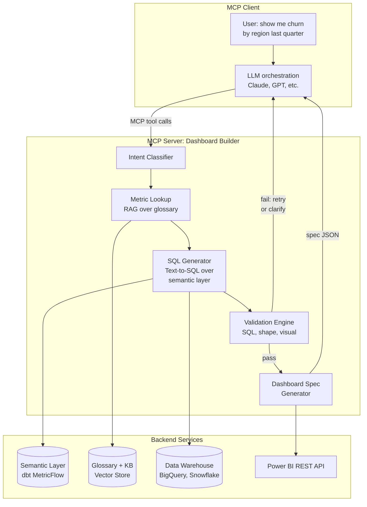
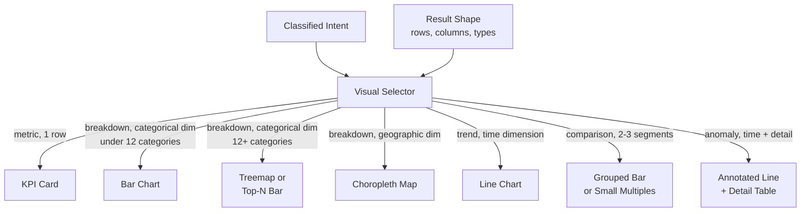
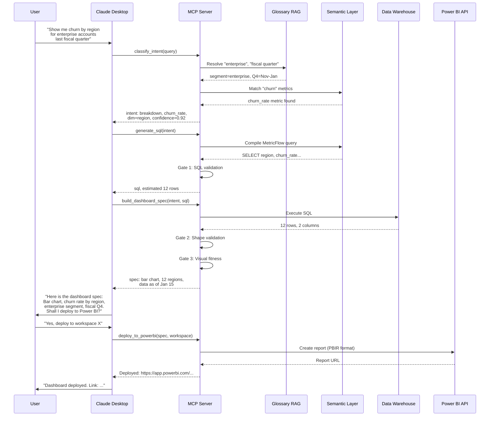
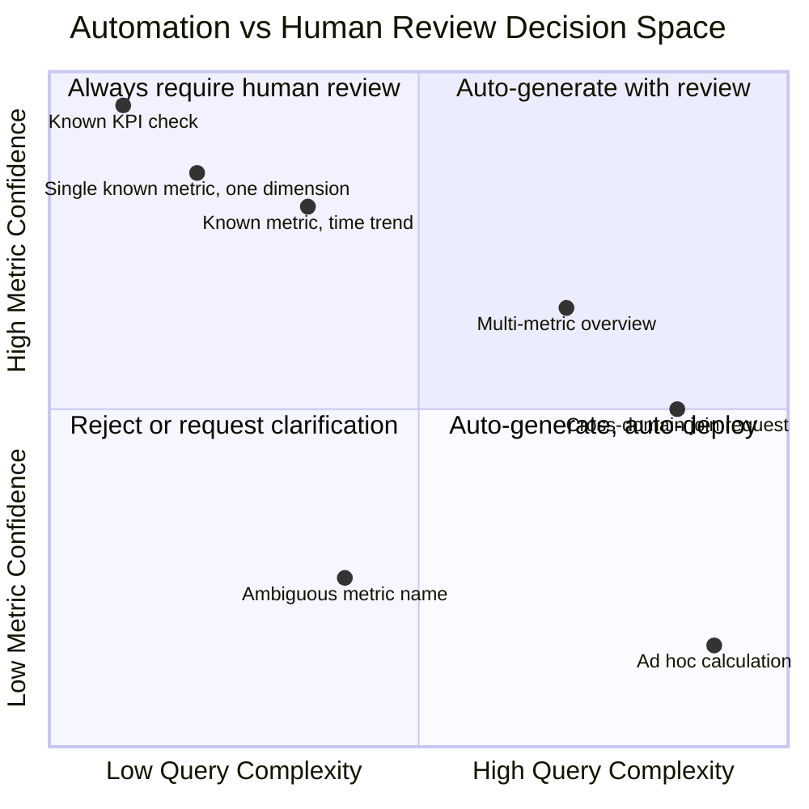

# Designing an MCP Server That Turns Natural Language into Power BI Dashboards

## Three Hard Problems in a Trench Coat

"Show me churn by region last quarter."

Seven words. A manager says them during a Monday stand-up, and by Friday someone has spent twenty hours building a dashboard. Not because the visualization is complex -- a bar chart with twelve bars would do -- but because the actual work hides behind the apparent simplicity.

Problem one: **what does churn mean?** In this company, is it logo churn (lost accounts) or revenue churn (lost MRR)? Does it count customers who downgraded or only those who fully cancelled? Is a seasonal pause counted as churn? Somewhere, in a Confluence page last updated eighteen months ago, someone defined it. Or didn't. The analyst guesses and builds the wrong chart.

Problem two: **where does the data live?** The churn metric involves a join between `subscriptions`, `payments`, and `customer_regions`. The region field lives in a dimension table that was renamed during last quarter's warehouse migration. The SQL is not trivial, and it must be correct -- not just executable, but semantically correct against the business definition.

Problem three: **what should the dashboard look like?** A bar chart, a map, a table? Should it show absolute numbers or percentages? Should it include a time trend or just the latest quarter? These choices depend on what the user actually wants to understand, which is rarely stated explicitly.

This post is about designing a system that handles all three problems -- and exposes the solution through the Model Context Protocol so any MCP-capable client (Claude Desktop, a custom agent, a Slack bot) can call it. The key insight: we do not give the LLM free rein over raw warehouse tables. Every step is grounded against a curated semantic layer, a glossary, and a set of validation gates. The LLM is powerful, but it operates on rails.

---

## Prerequisites

Before diving in, what you need to follow along and eventually build this:

- **Python 3.11+** and the [`mcp` SDK](https://github.com/modelcontextprotocol/python-sdk) (v1.25+)
- A **dbt project** with MetricFlow semantic layer definitions (or an equivalent semantic layer -- Cube, AtScale, or even a well-documented YAML glossary)
- **Power BI Pro or Premium** workspace with REST API access (service principal or delegated auth)
- Familiarity with the MCP primitives: tools, resources, and prompts (covered in [The Model Context Protocol: How AI Learned to Use Tools](/blog/field-notes/model-context-protocol))
- A working **text-to-SQL** setup or willingness to build one (see [Text-to-SQL: Bridging Natural Language and Structured Data](/blog/field-notes/text-to-sql))

---

## Why MCP (and Not a Custom Plugin)

You could build this as a standalone API. A Flask endpoint that takes natural language input and returns a dashboard. It would work. But you would be building a UI, managing conversation state, handling multi-turn clarification, and wiring up authentication -- all before writing the interesting logic.

The Model Context Protocol removes that overhead. MCP defines a standard interface between an AI client (the host application, like Claude Desktop) and your server. Your server declares what it can do -- its **tools**, **resources**, and **prompts** -- and any MCP client can discover and invoke them. The conversation management, the multi-turn refinement, the UI: all handled by the client. You focus on the domain logic.

Three specific reasons MCP is the right choice here:

**Tool composition.** A dashboard request is not a single operation. It decomposes into metric lookup, SQL generation, result validation, and spec construction. MCP tools compose naturally -- the LLM can call `list_metrics`, then `generate_sql`, then `build_dashboard_spec` in sequence, using the output of each to feed the next. The client manages this orchestration.

**Resource exposure.** Your semantic layer -- metric definitions, glossary terms, table schemas -- can be exposed as MCP resources. The LLM reads them to ground its reasoning. When a user says "churn," the LLM first reads the `metrics://churn_rate` resource to learn the exact definition, the source table, and the valid dimensions before attempting anything.

**Prompt templates.** Standardized prompt templates ensure consistent behavior. A `generate_dashboard` prompt template can include the company's visualization style guide, preferred color palette, and naming conventions. This is not prompt engineering in the traditional sense -- it is structured, versionable configuration.

The protocol also gives you portability. Today the server works with Claude Desktop. Tomorrow, with any agent framework that speaks MCP -- and as of early 2026, that includes OpenAI's Agents SDK, Cursor, Windsurf, VS Code, and dozens of others.

---

## Architecture Overview

The system has five layers, each with a clear responsibility:



The flow: the user's natural language request enters the MCP server via a tool call. The intent classifier determines what kind of analytical question it is. The metric lookup component grounds the request against the glossary. The SQL generator produces a query over the semantic layer (never raw warehouse tables). The validation engine checks the SQL, the result shape, and the visual fitness. If everything passes, the dashboard spec generator produces a structured specification that can be sent to Power BI's REST API. If anything fails, the server returns a structured error so the LLM can retry or ask the user for clarification.

---

## The Semantic Layer as Grounding

This is the most important architectural decision in the entire system: **the LLM never writes SQL against raw warehouse tables.**

Why? Because raw warehouse tables are a minefield. Column names like `cust_reg_cd` are ambiguous. Tables are denormalized in ways that encode business logic invisibly. A `status` column might have twelve possible values, and the mapping between status codes and business concepts (active, churned, paused, suspended) lives in someone's head or in a Jira ticket from 2023.

Instead, the LLM operates over a **semantic layer** -- a curated abstraction that provides:

- **Metric definitions**: `churn_rate = count(customers where status changed to 'cancelled' in period) / count(customers active at period start)`, with the exact SQL materialized by MetricFlow or your semantic layer engine
- **Dimension catalog**: valid dimensions for each metric (region, product_line, segment, cohort_month), with their data types and allowed values
- **Join paths**: how tables connect, which keys to use, which grain to expect
- **Time semantics**: what "last quarter" means (calendar quarter? fiscal quarter?), which timezone, which grain (daily, weekly, monthly)

### dbt MetricFlow as the Foundation

The dbt Semantic Layer, powered by MetricFlow, is the most mature open-source option for this. Metrics are defined as code in YAML:

```yaml
# models/metrics/revenue_metrics.yml
metrics:
  - name: churn_rate
    label: "Monthly Churn Rate"
    description: >
      Percentage of active customers at the start of the month
      who cancelled by the end of the month. Excludes seasonal
      pauses and downgrades.
    type: ratio
    numerator:
      name: churned_customers
      filter:
        - "{{ TimeDimension('subscription__cancelled_at', 'month') }}"
    denominator:
      name: active_customers_start
    dimensions:
      - region
      - product_line
      - customer_segment
    time_grains:
      - day
      - week
      - month
      - quarter
```

This definition is the ground truth. When the LLM asks "what is churn?" the MCP server does not hallucinate an answer -- it reads this YAML, parses it, and returns the exact definition, valid dimensions, and supported time grains. MetricFlow handles the SQL generation for the metric itself; the LLM's job is to compose the right metric call with the right filters and dimensions.

### The Glossary RAG Layer

Metrics alone are not enough. Users say things like "top accounts," "enterprise segment," "LATAM region," "last fiscal quarter." These terms need to resolve to specific filter values or dimension members.

The glossary is a knowledge base of business terminology, stored in a vector database and exposed as an MCP resource:

```python
# Glossary entries stored in vector DB (ChromaDB, Pinecone, etc.)
glossary_entries = [
    {
        "term": "enterprise segment",
        "definition": "Customers with ARR > $100K",
        "sql_filter": "customer_segment = 'enterprise'",
        "synonyms": ["enterprise accounts", "large accounts", "enterprise tier"]
    },
    {
        "term": "LATAM",
        "definition": "Latin America region",
        "sql_filter": "region IN ('BR', 'MX', 'AR', 'CO', 'CL', 'PE')",
        "synonyms": ["Latin America", "LatAm", "South America"]
    },
    {
        "term": "fiscal quarter",
        "definition": "Company fiscal year starts February 1",
        "resolution": "Q1=Feb-Apr, Q2=May-Jul, Q3=Aug-Oct, Q4=Nov-Jan",
        "note": "Differs from calendar quarter"
    }
]
```

When the user says "show me churn for enterprise accounts in LATAM last fiscal quarter," the RAG layer resolves each term before any SQL is generated. The LLM receives structured context: `churn_rate` metric, filtered by `customer_segment = 'enterprise'` and `region IN ('BR', 'MX', ...)`, for `fiscal_q4_2026` (November 2026 through January 2027).

No guessing. No hallucination. Every term is grounded.

---

## Intent Classification: What Is the User Actually Asking?

Not every natural language request maps to the same analytical pattern. "Show me churn by region" is a breakdown. "Is churn getting worse?" is a trend. "Why did churn spike in November?" is an anomaly investigation. Each requires different SQL, different visualizations, and different validation logic.

The intent classifier is the first tool the LLM calls. It categorizes the request into one of five analytical intents:

| Intent | Example | SQL Pattern | Default Visual |
|---|---|---|---|
| **Metric** | "What's our churn rate?" | Single aggregate, no GROUP BY | KPI card / scoreboard |
| **Breakdown** | "Churn by region" | GROUP BY on 1-2 dimensions | Bar chart, treemap |
| **Trend** | "Churn over the last 6 months" | GROUP BY time dimension | Line chart, area chart |
| **Comparison** | "Churn: enterprise vs SMB" | GROUP BY with segment filter | Grouped bar, small multiples |
| **Anomaly** | "Why did churn spike in Q3?" | Time series + drill-down | Annotated line + detail table |

The classifier does not need to be perfect. Its output is a structured hint that guides downstream components -- the SQL generator knows whether to include a time dimension, and the visualization selector knows whether to start with a line chart or a bar chart. If the classification is ambiguous, the server returns a clarification request to the LLM, which can ask the user.

```python
from dataclasses import dataclass
from enum import Enum

class AnalyticalIntent(Enum):
    METRIC = "metric"
    BREAKDOWN = "breakdown"
    TREND = "trend"
    COMPARISON = "comparison"
    ANOMALY = "anomaly"

@dataclass
class ClassifiedIntent:
    intent: AnalyticalIntent
    metrics: list[str]          # e.g., ["churn_rate"]
    dimensions: list[str]       # e.g., ["region"]
    time_range: str | None      # e.g., "last_quarter"
    filters: dict[str, str]     # e.g., {"segment": "enterprise"}
    confidence: float           # 0.0 to 1.0
    ambiguity_note: str | None  # If confidence < threshold
```

The confidence score matters. When it drops below 0.7, the server does not guess -- it returns a structured clarification request. "Did you mean revenue churn or logo churn?" is infinitely better than silently building the wrong dashboard.

---

## Text-to-SQL Over a Curated Semantic Layer

With the intent classified and terms grounded, the system generates SQL. But this is not free-form text-to-SQL over raw warehouse tables. It is constrained SQL generation over the semantic layer.

The approach has two paths, depending on your semantic layer:

### Path A: MetricFlow Handles the SQL

If you use dbt's semantic layer with MetricFlow, the "SQL generation" step is actually a MetricFlow API call. The LLM's job is to compose the correct metric query parameters:

```python
# The LLM composes this structured request, not raw SQL
metric_query = {
    "metrics": ["churn_rate"],
    "group_by": ["metric_time__quarter", "region"],
    "where": [
        "{{ TimeDimension('metric_time', 'quarter') }} >= '2026-10-01'",
        "{{ TimeDimension('metric_time', 'quarter') }} <= '2026-12-31'"
    ],
    "order_by": ["-metric_time__quarter", "region"]
}

# MetricFlow generates the actual SQL -- joins, aggregations, filters
# The LLM never touches raw table names or column names
result_sql = metricflow_client.compile(metric_query)
```

This is dramatically safer than raw text-to-SQL. MetricFlow knows the join paths, the aggregation logic, the time spine. The LLM cannot hallucinate a column name because it only references metric names and dimension names that exist in the semantic model.

### Path B: Constrained SQL Generation

If you do not use MetricFlow (perhaps your semantic layer is Cube, LookML, or a custom YAML definition), the LLM generates SQL, but constrained to the vocabulary of the semantic layer:

```python
def generate_constrained_sql(
    intent: ClassifiedIntent,
    schema_context: dict,
    glossary_context: list[dict]
) -> str:
    """
    Generate SQL constrained to semantic layer vocabulary.
    The LLM receives only:
    - Metric definitions with their SQL fragments
    - Valid dimension names and their table.column mappings
    - Valid filter values from the glossary
    - Join paths between entities
    
    It does NOT receive:
    - Raw warehouse table names
    - Column names not in the semantic model
    - Schema details outside the curated context
    """
    system_prompt = f"""
    You are a SQL generator. You may ONLY use the following:
    
    METRICS (use these SQL fragments, do not invent calculations):
    {schema_context['metrics']}
    
    DIMENSIONS (these are the only valid GROUP BY columns):
    {schema_context['dimensions']}
    
    FILTERS (resolved from user terms):
    {glossary_context}
    
    JOIN PATHS (use exactly these joins):
    {schema_context['joins']}
    
    Generate a single SQL query. Do not reference any table or column
    not listed above. If a requested dimension is not available for
    the requested metric, return an error explaining which dimensions
    are valid.
    """
    # ... LLM call with structured output parsing
```

The key constraint: the LLM's context window contains only the semantic model vocabulary, not the raw warehouse schema. It literally cannot reference a table it does not know about.

### Why This Matters: The Hallucinated Column Problem

In unconstrained text-to-SQL, the most common failure mode is the hallucinated column. The LLM generates `SELECT customer_churn_flag FROM users` -- but the column is actually called `is_churned` and it lives in the `subscription_events` table. The query fails, or worse, it runs against a different column with a similar name and returns wrong results silently.

By constraining the vocabulary, hallucinated columns become structurally impossible. The LLM can only reference columns in its context. If it tries to reference something that does not exist, the prompt structure catches it before any SQL is executed.

---

## Dashboard Spec Generation

The SQL returns data. Now the system needs to decide how to present it. This is where most "text-to-dashboard" systems fail -- they either hardcode a single visualization type or let the LLM free-associate, producing charts that are technically correct but analytically useless.

The dashboard spec is an intermediate representation -- a structured JSON object that describes the visualization independently of any BI tool. Think of it as a Vega-Lite-flavored specification that can be translated into Power BI, Tableau, or any other target.

### The Visual Fitness Matrix

The system uses the classified intent and the result shape (number of dimensions, number of rows, data types) to select the appropriate visualization:



### The Spec Format

```python
@dataclass
class DashboardSpec:
    title: str
    description: str
    pages: list["PageSpec"]
    filters: list["FilterSpec"]
    refresh_schedule: str | None
    data_freshness: str  # "as of 2027-01-15 06:00 UTC"

@dataclass
class PageSpec:
    title: str
    visuals: list["VisualSpec"]
    layout: str  # "single", "side-by-side", "grid-2x2"

@dataclass
class VisualSpec:
    visual_type: str  # "bar", "line", "kpi", "table", "map"
    title: str
    subtitle: str | None
    data_query: str  # The generated SQL or metric query
    encoding: dict   # Axis mappings
    # Example encoding:
    # {
    #   "x": {"field": "region", "type": "nominal"},
    #   "y": {"field": "churn_rate", "type": "quantitative", "format": ".1%"},
    #   "color": {"field": "segment", "type": "nominal"}
    # }
    sort: dict | None
    conditional_formatting: list[dict] | None

@dataclass
class FilterSpec:
    dimension: str
    filter_type: str  # "single_select", "multi_select", "date_range"
    default_value: str | None
```

This spec is tool-agnostic. The Power BI integration layer translates it into the Power BI Enhanced Report Format (PBIR), but the same spec could target Tableau, Looker, or a custom React dashboard. The separation keeps the analytical logic clean and the deployment target swappable.

---

## Validation: The Three Gates

Before any spec reaches Power BI, it passes through three validation gates. This is where the system earns trust. An AI-generated dashboard that is wrong is worse than no dashboard at all -- it creates false confidence in incorrect numbers.

### Gate 1: SQL Validation

The generated SQL is checked before execution:

```python
def validate_sql(sql: str, semantic_model: dict) -> ValidationResult:
    """
    Checks:
    1. Syntax: parse the SQL (sqlglot or similar)
    2. Vocabulary: every table/column reference exists in semantic model
    3. Join correctness: joins follow declared paths
    4. Aggregation: GROUP BY matches SELECT (no silent aggregation errors)
    5. Time range: date filters are syntactically valid and within data range
    """
    errors = []
    
    # Parse and extract references
    parsed = sqlglot.parse_one(sql)
    tables = extract_table_references(parsed)
    columns = extract_column_references(parsed)
    
    # Check every reference against semantic model
    for col in columns:
        if col not in semantic_model["allowed_columns"]:
            errors.append(f"Column '{col}' not in semantic model")
    
    # Check join paths
    joins = extract_joins(parsed)
    for join in joins:
        if not semantic_model.has_valid_path(join.left, join.right):
            errors.append(f"No valid join path: {join.left} -> {join.right}")
    
    return ValidationResult(
        passed=len(errors) == 0,
        errors=errors,
        sql=sql
    )
```

### Gate 2: Result Shape Validation

After execution, the result shape is checked against expectations:

- Does the result have the expected number of dimensions?
- Are there too many rows for the chosen visual? (A bar chart with 500 bars is not useful.)
- Are there null values in critical columns?
- Do percentages sum to reasonable values?
- Is the time range complete? (Missing months might indicate a data pipeline issue, not zero values.)

```python
def validate_result_shape(
    result: pd.DataFrame,
    intent: ClassifiedIntent,
    visual_type: str
) -> ValidationResult:
    errors = []
    warnings = []
    
    # Row count checks
    if visual_type == "bar" and len(result) > 20:
        warnings.append(
            f"Bar chart with {len(result)} bars. "
            f"Consider Top-N or treemap."
        )
    
    if visual_type == "kpi" and len(result) != 1:
        errors.append(
            f"KPI card expects 1 row, got {len(result)}. "
            f"Check aggregation."
        )
    
    # Null checks on metric columns
    metric_cols = [c for c in result.columns if c in intent.metrics]
    for col in metric_cols:
        null_pct = result[col].isnull().mean()
        if null_pct > 0.3:
            warnings.append(
                f"Column '{col}' is {null_pct:.0%} null. "
                f"Possible data freshness issue."
            )
    
    # Time completeness for trends
    if intent.intent == AnalyticalIntent.TREND:
        time_col = next(
            (c for c in result.columns if "time" in c.lower()), None
        )
        if time_col:
            gaps = detect_time_gaps(result[time_col])
            if gaps:
                warnings.append(
                    f"Missing time periods: {gaps}. "
                    f"Data pipeline may be behind."
                )
    
    return ValidationResult(
        passed=len(errors) == 0,
        errors=errors,
        warnings=warnings
    )
```

### Gate 3: Visual Fitness Validation

The final gate checks whether the chosen visualization actually serves the analytical intent:

| Check | Rule | Action if Failed |
|---|---|---|
| Category count | Bar chart with more than 15 categories | Switch to Top-N or treemap |
| Time granularity | Daily trend over 3 years (1000+ points) | Aggregate to weekly or monthly |
| Numeric range | Y-axis range spans 6+ orders of magnitude | Switch to log scale or split visuals |
| Dimension cardinality | Color encoding with 20+ distinct values | Collapse to Top-5 + "Other" |
| Data density | Scatter plot with 3 points | Switch to table |

These rules are not cosmetic preferences. They are analytical fitness checks. A bar chart with 200 bars communicates nothing. A line chart with two data points suggests a trend that does not exist. The validation engine catches these before the dashboard reaches a decision-maker.

---

## The MCP Server Skeleton

Here is the server implementation using the official MCP Python SDK. The server exposes five tools, two resources, and one prompt template:

```python
from mcp.server.fastmcp import FastMCP
from dataclasses import asdict
import json

# Initialize the MCP server
mcp = FastMCP(
    "dashboard-builder",
    version="0.3.0",
    description="Translates natural language into grounded Power BI dashboard specs"
)

# --- Resources: expose semantic layer metadata ---

@mcp.resource("metrics://catalog")
async def get_metrics_catalog() -> str:
    """
    Returns the full metrics catalog from the semantic layer.
    Each metric includes its definition, valid dimensions,
    supported time grains, and owner.
    """
    catalog = await semantic_layer.list_metrics()
    return json.dumps(catalog, indent=2)


@mcp.resource("glossary://terms")
async def get_glossary() -> str:
    """
    Returns the business glossary. Each term includes its
    definition, SQL filter equivalent, and synonyms.
    """
    terms = await glossary_store.list_all()
    return json.dumps(terms, indent=2)


# --- Tools: the core workflow ---

@mcp.tool()
async def classify_intent(
    user_query: str
) -> dict:
    """
    Classify a natural language analytics request into a
    structured intent: metric, breakdown, trend, comparison,
    or anomaly. Returns the classified intent with resolved
    metric names, dimensions, filters, and confidence score.
    
    Call this FIRST for any dashboard request.
    """
    # Ground terms against glossary via RAG
    grounded_terms = await glossary_store.resolve(user_query)
    
    # Match metrics from semantic layer
    matched_metrics = await semantic_layer.match_metrics(user_query)
    
    # Classify the analytical intent
    intent = await intent_classifier.classify(
        query=user_query,
        grounded_terms=grounded_terms,
        available_metrics=matched_metrics
    )
    
    return asdict(intent)


@mcp.tool()
async def list_metrics(
    search_query: str = "",
    category: str = ""
) -> list[dict]:
    """
    Search the metrics catalog. Returns metric definitions
    including SQL logic, valid dimensions, and time grains.
    Use this to verify metric availability before generating
    a dashboard.
    """
    metrics = await semantic_layer.search_metrics(
        query=search_query,
        category=category
    )
    return metrics


@mcp.tool()
async def generate_sql(
    intent: dict,
    use_metricflow: bool = True
) -> dict:
    """
    Generate SQL for the classified intent. If use_metricflow
    is True, compiles a MetricFlow query (recommended).
    Otherwise, generates constrained SQL over the semantic layer.
    
    Returns the SQL, estimated row count, and column schema.
    """
    classified = ClassifiedIntent(**intent)
    
    if use_metricflow:
        query = build_metricflow_query(classified)
        sql = await metricflow_client.compile(query)
    else:
        sql = await constrained_sql_generator.generate(classified)
    
    # Validate before returning (Gate 1)
    validation = validate_sql(sql, semantic_model)
    if not validation.passed:
        return {
            "status": "error",
            "errors": validation.errors,
            "suggestion": "Review intent classification and retry"
        }
    
    # Dry-run for shape estimation
    shape = await warehouse.explain(sql)
    
    return {
        "status": "ok",
        "sql": sql,
        "estimated_rows": shape["estimated_rows"],
        "columns": shape["columns"]
    }


@mcp.tool()
async def build_dashboard_spec(
    intent: dict,
    sql: str,
    title: str = "",
    style_preferences: dict | None = None
) -> dict:
    """
    Generate a complete dashboard specification from a classified
    intent and validated SQL. Executes the SQL, validates the
    result shape, selects the appropriate visualization, and
    produces a deployment-ready spec.
    
    Returns the full DashboardSpec as JSON, or validation errors
    if the result shape is unsuitable.
    """
    classified = ClassifiedIntent(**intent)
    
    # Execute SQL
    result = await warehouse.execute(sql)
    
    # Validate result shape (Gate 2)
    visual_type = select_visual(classified, result)
    shape_validation = validate_result_shape(
        result, classified, visual_type
    )
    if not shape_validation.passed:
        return {
            "status": "error",
            "errors": shape_validation.errors,
            "warnings": shape_validation.warnings
        }
    
    # Build spec
    spec = DashboardSpec(
        title=title or generate_title(classified),
        description=generate_description(classified),
        pages=[PageSpec(
            title="Overview",
            visuals=[build_visual_spec(
                classified, result, visual_type, style_preferences
            )],
            layout="single"
        )],
        filters=build_filters(classified),
        refresh_schedule=None,
        data_freshness=f"as of {await warehouse.last_refresh()}"
    )
    
    # Validate visual fitness (Gate 3)
    fitness = validate_visual_fitness(spec, result)
    if fitness.warnings:
        spec = apply_fitness_corrections(spec, fitness)
    
    return {
        "status": "ok",
        "spec": asdict(spec),
        "warnings": shape_validation.warnings + fitness.warnings,
        "data_freshness": spec.data_freshness
    }


@mcp.tool()
async def deploy_to_powerbi(
    spec: dict,
    workspace_id: str,
    dry_run: bool = True
) -> dict:
    """
    Deploy a dashboard spec to Power BI. In dry_run mode
    (default), validates the spec against the Power BI API
    without creating anything. Set dry_run=False to create
    the report.
    
    Returns the report URL on success.
    """
    dashboard_spec = DashboardSpec(**spec)
    
    # Convert spec to PBIR format
    pbir = convert_to_pbir(dashboard_spec)
    
    if dry_run:
        validation = await powerbi_client.validate_report(
            pbir, workspace_id
        )
        return {
            "status": "dry_run",
            "valid": validation.is_valid,
            "issues": validation.issues
        }
    
    # Deploy
    report = await powerbi_client.create_report(
        pbir, workspace_id
    )
    return {
        "status": "deployed",
        "report_url": report.url,
        "report_id": report.id
    }


# --- Prompt template: structured generation guidance ---

@mcp.prompt()
async def dashboard_request(user_query: str) -> str:
    """
    Structured prompt template for dashboard generation.
    Includes the company style guide and workflow steps.
    """
    return f"""
    The user wants a dashboard. Follow these steps exactly:
    
    1. Call classify_intent with the user's query
    2. If confidence < 0.7, ask the user to clarify
    3. Call list_metrics to verify metric availability
    4. Call generate_sql with the classified intent
    5. Call build_dashboard_spec with the intent and SQL
    6. Present the spec to the user for review
    7. Only call deploy_to_powerbi after user confirmation
    
    Style guide:
    - Use the company color palette (blues and grays)
    - Always include data freshness timestamp
    - Title format: "Metric Name by Dimension - Time Range"
    - Include a summary KPI card above any detailed visual
    
    User query: {user_query}
    """
```

### Running the Server

```python
# Run with stdio transport (for Claude Desktop)
if __name__ == "__main__":
    mcp.run(transport="stdio")

# Or with SSE transport (for remote access)
# mcp.run(transport="sse", host="0.0.0.0", port=8080)
```

Claude Desktop configuration (`claude_desktop_config.json`):

```json
{
  "mcpServers": {
    "dashboard-builder": {
      "command": "python",
      "args": ["-m", "dashboard_builder.server"],
      "env": {
        "DBT_CLOUD_TOKEN": "your-token",
        "POWERBI_CLIENT_ID": "your-client-id",
        "POWERBI_TENANT_ID": "your-tenant-id",
        "WAREHOUSE_CONNECTION": "bigquery://project/dataset"
      }
    }
  }
}
```

---

## The Request Lifecycle: End to End

Let's trace a complete request through the system:



Notice the human-in-the-loop step. The system does not auto-deploy. It presents the spec, the user reviews it, and only then does deployment happen. For high-confidence, well-understood requests, you could add an auto-deploy flag. But the default should always be review-first.

---

## Integrating with Power BI: REST API and PBIR

The final mile is getting the dashboard spec into Power BI. There are two approaches, and the choice depends on your organization's Power BI maturity.

### Approach 1: PBIR (Enhanced Report Format)

As of early 2026, Power BI's Enhanced Report Format (PBIR) is the default for new reports. PBIR is a publicly documented, JSON-based format where each visual, page, and bookmark is a separate file in a folder structure. This is the correct target for programmatic report generation.

```
my-dashboard.Report/
  definition/
    report.json           # Report-level settings
    pages/
      page-001/
        page.json         # Page layout
        visuals/
          visual-001/
            visual.json   # Visual definition (type, encoding, data)
          visual-002/
            visual.json
  definition.pbir         # Root manifest
```

The `visual.json` for a bar chart looks like this (simplified):

```json
{
  "visual": {
    "visualType": "barChart",
    "objects": {
      "categoryAxis": {
        "properties": {
          "showAxisTitle": { "expr": { "Literal": { "Value": "true" } } }
        }
      }
    },
    "dataRoleMapping": {
      "category": { "items": [{ "queryRef": "region" }] },
      "measure": { "items": [{ "queryRef": "churn_rate" }] }
    }
  }
}
```

The `convert_to_pbir()` function in our server translates the tool-agnostic `DashboardSpec` into this folder structure.

### Approach 2: REST API with Semantic Model Binding

For organizations using the Power BI REST API, the workflow is:

1. **Create or connect to a semantic model** (the Power BI dataset backed by your warehouse)
2. **Push the report definition** via the Reports API
3. **Set up scheduled refresh** if not using DirectQuery

```python
async def deploy_via_rest_api(
    spec: DashboardSpec,
    workspace_id: str,
    semantic_model_id: str
) -> dict:
    """Deploy dashboard spec via Power BI REST API."""
    
    # Convert spec to PBIR folder structure
    pbir_files = convert_to_pbir(spec)
    
    # Create report in workspace
    response = await powerbi_client.post(
        f"/v1.0/myorg/groups/{workspace_id}/reports",
        json={
            "name": spec.title,
            "datasetId": semantic_model_id
        }
    )
    report_id = response["id"]
    
    # Update report definition with PBIR content
    await powerbi_client.post(
        f"/v1.0/myorg/groups/{workspace_id}/reports/{report_id}"
        f"/updateReportContent",
        json={"definition": pbir_files}
    )
    
    return {
        "report_id": report_id,
        "url": f"https://app.powerbi.com/groups/{workspace_id}"
               f"/reports/{report_id}"
    }
```

### TMDL for Semantic Model Definitions

If your Power BI deployment includes semantic model management, the Tabular Model Definition Language (TMDL) provides a text-based, source-control-friendly format for model definitions. Your MCP server can expose a tool that generates TMDL alongside the report definition, ensuring the semantic model and the visualization stay in sync.

---

## Production Gotchas

Building the happy path is the easy part. Here are the problems that surface after the first week in production.

### Metric Definition Drift

Your dbt semantic layer defines `churn_rate` one way. But the finance team has been using a different formula in their Excel models for three years. When the AI-generated dashboard shows 4.2% churn and finance says it's 5.1%, nobody trusts the system.

**Mitigation**: Every dashboard spec includes a "Metric Definitions" section -- a text block that shows exactly how each metric was calculated, linking back to the semantic layer definition. Transparency is the only antidote to drift. Additionally, the MCP server can expose a `compare_metric_definitions` tool that shows differences between the semantic layer definition and known alternative definitions in the glossary.

### Hallucinated Column Names

Even with a constrained vocabulary, LLMs occasionally generate plausible-sounding column names that do not exist. The column `customer_lifetime_value` sounds reasonable, but the actual column is `ltv_usd` in the semantic model.

**Mitigation**: Gate 1 (SQL validation) catches this. But prevention is better than detection. The system prompt should include an explicit instruction: "You may ONLY use the column names listed above. Do not infer, guess, or construct column names." Additionally, using MetricFlow's compilation (Path A) makes this structurally impossible -- the LLM never references columns directly.

### Timezone Handling

"Last quarter" in New York starts at a different UTC timestamp than "last quarter" in Singapore. If your warehouse stores timestamps in UTC (as it should), the semantic layer must handle timezone conversion. This is especially treacherous for daily metrics -- a transaction at 11 PM EST on March 31 is an April 1 transaction in UTC.

**Mitigation**: The glossary should include timezone policy. The semantic layer should declare a canonical timezone for all time-based metrics. The MCP server should include the timezone in every response: "Data shown in US Eastern Time (ET). Last quarter = October 1 - December 31, 2026."

### Data Freshness Signaling

The user asks for "revenue today" at 9 AM. The data warehouse last refreshed at midnight. The dashboard shows yesterday's data. The user thinks it includes today's transactions.

**Mitigation**: Every dashboard spec includes a `data_freshness` field. The server checks the last refresh timestamp from the warehouse and includes it in the response. If the data is more than 24 hours stale, the server adds a warning. The LLM can then tell the user: "This data is current as of January 14 at 11:00 PM ET. Today's transactions are not yet included."

```python
async def check_data_freshness(table: str) -> FreshnessResult:
    """Check when a table was last updated."""
    last_update = await warehouse.get_last_modified(table)
    staleness = datetime.utcnow() - last_update
    
    return FreshnessResult(
        last_update=last_update,
        staleness_hours=staleness.total_seconds() / 3600,
        is_stale=staleness > timedelta(hours=24),
        warning=f"Data is {staleness.total_seconds()/3600:.1f}h old"
            if staleness > timedelta(hours=24) else None
    )
```

### Multi-Metric Dashboards

A user says "give me a sales overview." That is not one metric -- it is revenue, order count, average order value, conversion rate, and maybe a funnel. The system needs to decompose this into multiple metric queries, each validated independently, and compose them into a multi-page or multi-visual dashboard.

**Mitigation**: The intent classifier should recognize "overview" and "summary" as multi-metric intents. The server returns a list of matched metrics and asks the user to confirm which ones to include before generating SQL for each.

### Permission Boundaries

Not everyone should see every metric. The intern should not be able to generate a dashboard showing salary distributions by department. Your MCP server needs to integrate with your organization's access control.

**Mitigation**: The `list_metrics` and `generate_sql` tools should accept a user identity (passed via MCP context or JWT) and filter metrics and dimensions based on permissions. Metrics the user cannot access should not appear in search results at all -- not shown as "access denied," but simply absent. You do not reveal what you protect.

---

## When to Trust the System (and When Not To)

The confidence score from the intent classifier serves as a rough decision boundary, but the real question is more nuanced: when should this system operate autonomously, and when should it defer to a human?



The bottom-left quadrant -- low complexity, low confidence -- is where the system should ask for clarification rather than guess. "Did you mean revenue churn or customer churn?" is a one-sentence question that prevents a twenty-minute correction cycle.

The top-right quadrant -- high complexity, high confidence -- is where human review adds the most value. The system is confident about the metrics but the query is complex enough that a wrong visualization choice or missed filter could mislead a decision-maker. Auto-generate the spec, but present it for review before deploying.

---

## Going Deeper

**Books:**
- Reis, J. & Housley, M. (2022). *Fundamentals of Data Engineering.* O'Reilly Media.
  - Chapters on semantic layers and data modeling provide the conceptual foundation for why grounded generation matters more than free-form SQL.
- Kleppmann, M. (2017). *Designing Data-Intensive Applications.* O'Reilly Media.
  - The sections on derived data and stream processing inform how to think about data freshness and pipeline latency in dashboard systems.
- Kimball, R. & Ross, M. (2013). *The Data Warehouse Toolkit.* 3rd Edition, Wiley.
  - The definitive reference on dimensional modeling -- understanding star schemas and conformed dimensions is essential for building a semantic layer that supports NL-to-dashboard.
- Few, S. (2012). *Show Me the Numbers.* 2nd Edition, Analytics Press.
  - The visual fitness rules in this post draw heavily on Few's principles of analytical display -- which chart for which data shape, and why.

**Online Resources:**
- [Model Context Protocol Specification](https://modelcontextprotocol.io/) -- The official MCP spec, including tool, resource, and prompt definitions, transport protocols, and the latest security recommendations.
- [MCP Python SDK Documentation](https://modelcontextprotocol.github.io/python-sdk/) -- Reference docs for the `mcp` package. Start with the FastMCP quickstart for server implementation.
- [dbt Semantic Layer Documentation](https://docs.getdbt.com/docs/use-dbt-semantic-layer/dbt-sl) -- How MetricFlow defines metrics, dimensions, and entities. Essential reading if you are building the semantic layer that grounds the MCP server.
- [Power BI Enhanced Report Format (PBIR)](https://learn.microsoft.com/en-us/power-bi/developer/embedded/projects-enhanced-report-format) -- Microsoft's documentation on the JSON-based report format that enables programmatic report generation.
- [dbt MCP Server](https://docs.getdbt.com/blog/introducing-dbt-mcp-server) -- dbt Labs' official MCP server for exposing semantic layer metadata to AI agents. A reference implementation worth studying.

**Videos:**
- [Building MCP Servers with Python](https://www.youtube.com/results?search_query=building+mcp+servers+python+2025) by Anthropic -- Official walkthrough of the Python SDK, including tool definition patterns and transport configuration.
- [Semantic Layer for AI: MetricFlow Deep Dive](https://www.youtube.com/results?search_query=metricflow+semantic+layer+ai+2025) by dbt Labs -- How MetricFlow compiles metric queries and why it matters for LLM-powered analytics.
- [Power BI REST API and PBIR](https://www.youtube.com/results?search_query=power+bi+pbir+rest+api+programmatic) by Microsoft Power BI -- Demonstrates programmatic report creation using the new PBIR format.

**Academic Papers:**
- Li, H., et al. (2024). ["Can LLM Already Serve as A Database Interface? A BIg Bench for Large-Scale Database Grounded Text-to-SQLs."](https://arxiv.org/abs/2305.03111) *NeurIPS 2024.*
  - The BIRD benchmark paper. Essential reading for understanding how semantic grounding (evidence annotations) improves text-to-SQL accuracy.
- Yu, T., et al. (2024). ["Spider 2.0: Evaluating Language Models on Real-World Enterprise Text-to-SQL Workflows."](https://arxiv.org/abs/2411.07763) *ICLR 2025 Oral.*
  - Demonstrates the massive gap between academic and enterprise SQL complexity. The 36% best-system accuracy on enterprise queries motivates the constrained-generation approach.
- Biswal, A., et al. (2025). ["Text2SQL is Not Enough: Unifying AI and Databases with TAG."](https://vldb.org/cidrdb/papers/2025/p11-biswal.pdf) *CIDR 2025.*
  - Proposes Table-Augmented Generation as a superset of text-to-SQL, arguing that many analytical questions require computation beyond what SQL can express. Directly relevant to dashboard generation where the visualization layer adds analytical logic.

**Questions to Explore:**
- If the semantic layer guarantees metric correctness, does the LLM still add value beyond intent parsing and visualization selection -- or could a traditional NLU system do this without a language model?
- How do you version-control dashboard specs alongside metric definitions, so that a change to the churn formula automatically invalidates or updates all dashboards that use it?
- At what point does an NL-to-dashboard system create a false sense of data literacy -- users generating charts they cannot interpret, making decisions based on visualizations they do not fully understand?
- Could the validation gates themselves be learned rather than rule-based -- training a model on thousands of dashboard reviews to predict which specs will be sent back for revision?
- What happens to organizational data culture when anyone can generate a dashboard in thirty seconds -- does it democratize insight, or does it flood the workspace with conflicting, unreviewed visualizations?
