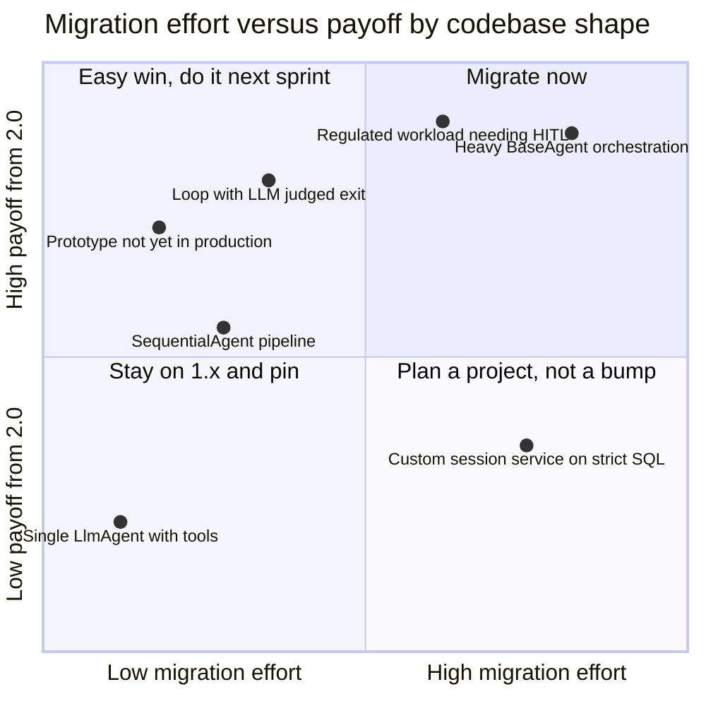
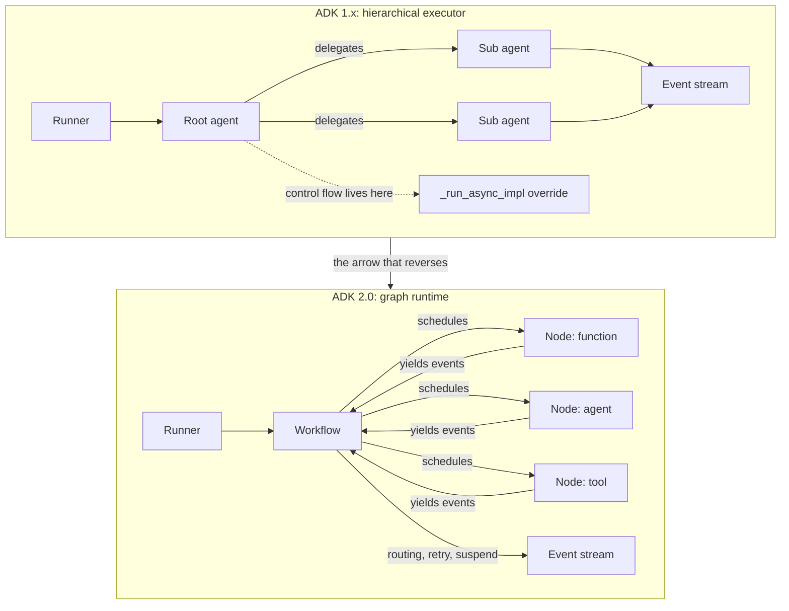
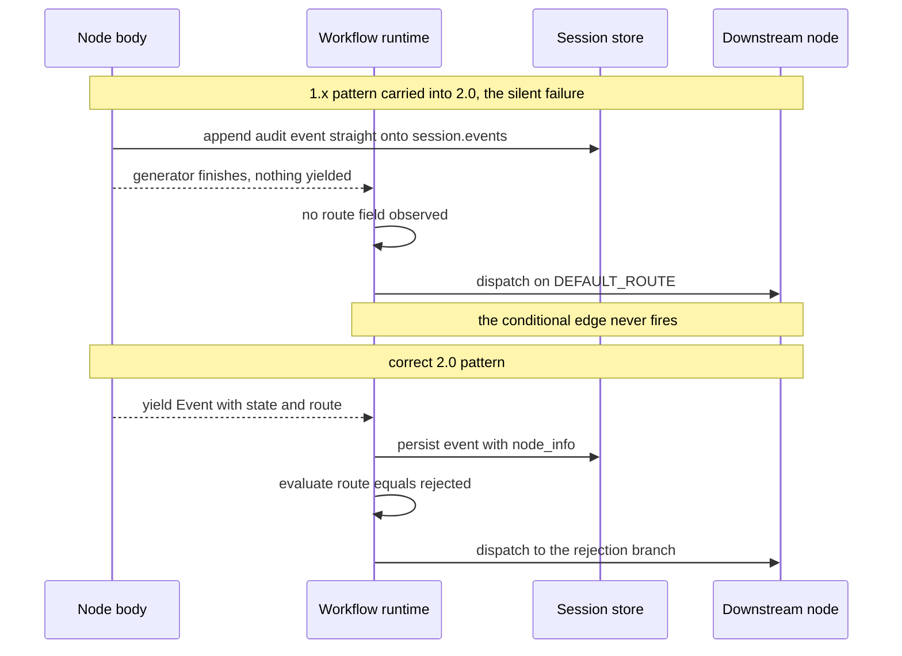
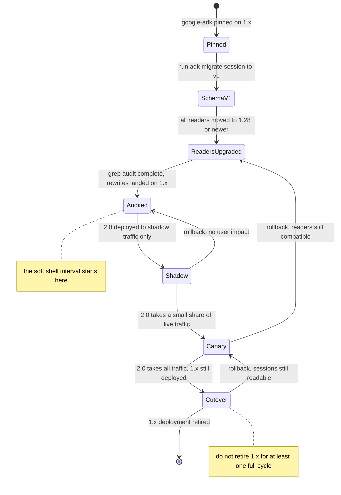

# Migrating from ADK 1.x to 2.0: The Breaking Changes That Actually Break You

A cicada does not molt halfway. The old exoskeleton splits along the back and comes off whole, and for a few hours afterwards the animal is pale, soft, and completely defenseless. It cannot fly. It cannot run. Everything that made it a functioning insect is temporarily suspended while the new shell hardens. The molt is not the risk. The interval is.

Migrating a production agent from ADK 1.x to 2.0 has the same shape, and the same failure mode: teams try to do it incrementally, end up with a codebase that is neither one thing nor the other, and discover that the halfway state does not announce itself. That is the whole reason this post exists. Enough of the metaphor.

Here is what you actually need to know before you touch anything.

**Three of the breaking changes in ADK 2.0 do not raise an exception.** Your code imports cleanly, your tests pass, your health checks stay green, and the behavior is wrong:

1. If you subclassed `BaseAgent` and overrode `_run_async_impl()` to implement custom orchestration, **the graph runtime bypasses your override.** No `NotImplementedError`, no deprecation warning at import time. Your carefully written routing logic simply does not run.
2. If you appended events directly to the session — `ctx.session.events.append(...)` or `enqueue_event` — those events **stop participating in graph routing.** They may still land in the transcript. The edge that was supposed to fire off them does not fire.
3. If you wrapped a node body in `except Exception:` to log and continue, you have **silently disabled the framework's retry machinery** for that node. And if you reached for `except BaseException:` to be thorough, you have also broken human-in-the-loop pausing, because the interrupt the framework uses to suspend a graph is an exception and you just swallowed it.

A fourth change does raise, loudly, and in the worst possible place: the `Event` schema gained new fields, and if you run a strict relational schema underneath a custom session service, inserts start failing in production while your local SQLite dev loop is perfectly happy.

None of this is a reason to panic, and — importantly — none of it is a reason to migrate this quarter. The 1.x line is still maintained. Let's start there, because "when" is a better first question than "how."

---

## Prerequisites

This post assumes you have shipped at least one ADK agent and understand sessions, events, tools, and the runner. If any of that is fuzzy, read [Google ADK: Building Production Agents from First Principles](https://juanlara18.github.io/portfolio/#/blog/google-adk-agent-development-deep-dive) first — it covers the 1.x mental model that this post is about dismantling.

If you want to understand what the 2.0 graph runtime *is* rather than what it breaks, read the companion piece, [ADK Graph Workflows: Deterministic Orchestration for Agents](https://juanlara18.github.io/portfolio/#/blog/adk-graph-workflows-deterministic-orchestration). This post deliberately does not re-explain workflows; it explains the transition.

You will also want: a checkout of your agent code you can grep, read access to whatever database backs your sessions, and the ability to stand up a second deployment of your service. That last one is not optional if you are running anything customer-facing.

---

## The Version Landscape as of August 2026

Before any technical decision, get the facts about what is actually released and supported, because the discourse around ADK 2.0 is noisier than the release notes.

| Fact | Value |
| --- | --- |
| Latest `google-adk` (2.x) | 2.6.3, released 2026-08-07 |
| Latest `google-adk` (1.x) | 1.38.0, released 2026-08-07 |
| Python 2.0 GA | 2026-05-19 |
| Go 2.0 GA | 2026-06-30 |
| Release cadence | roughly bi-weekly on both lines |
| Python requirement | 3.10 or newer per the PyPI metadata |

Read the first two rows again. **1.38.0 and 2.6.3 shipped on the same day.** The 1.x branch is not in a deprecation grace period, not receiving security-only patches, not abandoned. It is being released in lockstep with 2.x. Whatever pressure you feel to migrate is not coming from Google's release engineering.

Pinning, therefore, is a real strategy and not a delaying tactic:

```bash
# Stay on the maintained 1.x line. This is a supported choice, not technical debt.
pip install "google-adk~=1.0"

# Or be explicit, which I prefer for anything deployed:
pip install "google-adk==1.38.0"

# Move to 2.x when you have decided to, not when a transitive dependency decides for you:
pip install "google-adk~=2.0"
```

The compatible-release operator `~=1.0` allows 1.38, 1.39, and so on, but will never resolve to 2.0. If your `requirements.txt` currently says `google-adk` with no specifier, you do not have a version strategy — you have a race condition with your next `docker build`.

### Should you migrate yet?

The honest answer depends on the shape of your codebase far more than on the size of it. Two variables dominate: how much *custom orchestration* you wrote, and how *rigid* your session storage is.



The two quadrants people get wrong are opposite corners. A single `LlmAgent` with a handful of function tools gains almost nothing from the graph runtime — it has no routing to make deterministic — so migrating it is cheap but pointless; do it when you happen to be in the file. Conversely, a custom `BaseSessionService` over a hand-rolled, strictly typed Postgres schema is *expensive* to migrate and the payoff is modest, because the thing you would gain is orchestration determinism and your problem is storage. Pin that one and revisit.

The clear yes cases are workloads where an LLM is currently making a routing decision that a `bool` should be making, and workloads that need durable human-in-the-loop pausing. Those are exactly the problems 2.0 was built to solve.

---

## Why 2.0 Broke Compatibility At All

Short version, because the *why* only matters insofar as it predicts the *what*.

ADK 1.x had a hierarchical agent executor. A root agent ran, possibly delegated to sub-agents, and the shape of execution was a tree walked at runtime. Control flow lived inside agent code — in `_run_async_impl`, in `SequentialAgent`'s ordering, in an `LlmAgent` deciding which sub-agent to hand off to. The framework's job was to run the tree and stream events out of it.

ADK 2.0 replaced that with a graph. Agents, tools, and plain functions are all **nodes**; edges are declared up front; and transitions are evaluated programmatically rather than by asking a model what to do next. Google's own framing is blunt about the motivation: LLMs are slow, expensive, and high-variance orchestrators, and in enterprise settings they get stuck in loops, skip business logic due to hallucination, and fail without raising clean exceptions.

Once the framework owns the graph, three things become framework responsibilities that used to be yours:

- **Routing.** The runtime needs to know which edge fires. That means it needs to be the one observing node outputs, which means event emission has to flow through it.
- **Retry and timeout.** The runtime schedules nodes, so it can re-schedule them. That means it needs to see exceptions.
- **Suspension and resumption.** A graph can pause at a node awaiting human input and resume later, possibly in a different process. That means the interrupt has to propagate.

Every silent breaking change is downstream of one of those three. Your override is bypassed because the runtime, not your class, decides what executes. Your appends stop routing because the runtime routes on yielded events. Your exception handler eats retries because retries are evaluated on exceptions that reach the runtime. The pattern is consistent: **1.x let you own the control flow; 2.0 owns it, and anything you wrote that assumed otherwise is now inert.**



The arrow that matters is the one between the subgraphs. In 1.x, events flow *out* of agents to the runner. In 2.0, nodes yield events *back into* the workflow, which then decides what happens next. Every migration problem is a place where your code still assumes the 1.x direction.

---

## Breaking Change 1: Your Orchestration Override Is Bypassed

This is the expensive one, because the code that breaks is the code you were proudest of.

### What 1.x looked like

The canonical 1.x escape hatch was subclassing `BaseAgent` and implementing `_run_async_impl`, whose signature is:

```python
async def _run_async_impl(self, ctx: InvocationContext) -> AsyncGenerator[Event, None]:
```

A realistic example — a document review agent that drafts, checks a compliance rule in code, and either loops or proceeds:

```python
# ADK 1.x
from typing import AsyncGenerator

from google.adk.agents import BaseAgent, LlmAgent
from google.adk.agents.invocation_context import InvocationContext
from google.adk.events import Event


class ReviewOrchestrator(BaseAgent):
    """Custom orchestration: draft, validate in code, retry up to 3 times."""

    drafter: LlmAgent
    finalizer: LlmAgent

    async def _run_async_impl(
        self, ctx: InvocationContext
    ) -> AsyncGenerator[Event, None]:
        for attempt in range(3):
            async for event in self.drafter.run_async(ctx):
                yield event

            draft = ctx.session.state.get("draft", "")
            if self._passes_compliance(draft):
                ctx.session.state["attempts"] = attempt + 1
                async for event in self.finalizer.run_async(ctx):
                    yield event
                return

            ctx.session.state["feedback"] = "Missing required disclosure clause."

        raise RuntimeError("Draft failed compliance after 3 attempts.")

    def _passes_compliance(self, draft: str) -> bool:
        return "disclosure" in draft.lower()
```

That is good 1.x code. It puts the branching decision in Python rather than in a prompt, which is exactly the instinct 2.0 was designed to reward. It is also the code most at risk, because in 2.0 the graph runtime does not call it.

### What breaks, precisely

In 2.0, `BaseAgent` subclasses `BaseNode`. The runtime schedules nodes; it does not walk a tree of agents asking each one to run itself. The migration documentation states that legacy execution methods, `_run_async_impl()` and `generate_content()` among them, are bypassed, and directs you to move custom logic into the standardized `BeforeAgentCallback` and `AfterAgentCallback` interfaces instead.

Worth being precise about the tension here, because the docs are not perfectly consistent and you should test rather than trust: the custom-agents page still documents the `BaseAgent` subclassing pattern, with an advisory that "starting in ADK 2.0, agent-based workflows using `BaseAgent` have been superseded by more flexible workflow structures." "Superseded" and "bypassed" are different claims. My reading, and what I would verify first on your own codebase, is that a `BaseAgent` subclass instantiated as a plain agent may still execute, while the same subclass placed inside a `Workflow` has its orchestration ignored in favor of the declared edges. **Do not take my word for it. Write the assertion test in the testing section below and find out for your version.**

### What the 2.0 rewrite looks like

The rewrite is not a port. It is a re-expression: pull the routing decision out of the class and into an edge.

```python
# ADK 2.0
from google.adk import Agent, Event, Workflow
from google.adk.workflow import DEFAULT_ROUTE

drafter = Agent(
    name="drafter",
    instruction=(
        "Draft the client memo. If manager feedback is present, "
        "incorporate it: {feedback?}"
    ),
    output_key="draft",
)

finalizer = Agent(
    name="finalizer",
    instruction="Format the approved draft as a final client memo: {draft}",
)


def check_compliance(draft: str):
    """The routing decision, now an edge condition rather than an if-statement."""
    if "disclosure" not in draft.lower():
        yield Event(
            state={"feedback": "Missing required disclosure clause."},
            route="revise",
        )
    else:
        yield Event(message="Compliance check passed.")


root_agent = Workflow(
    name="review_workflow",
    edges=[
        ("START", drafter, check_compliance),
        (check_compliance, {"revise": drafter, DEFAULT_ROUTE: finalizer}),
    ],
)
```

Three things to notice. The `for attempt in range(3)` loop disappeared — the cycle is now the `"revise"` edge pointing back at `drafter`, and bounding it is a runtime concern rather than a Python concern. The state write moved into the yielded `Event` rather than a direct mutation. And `check_compliance` receives `draft` as a typed parameter, injected by the framework from the upstream node's output.

That parameter injection is worth dwelling on, because it is the single most pleasant thing about 2.0 and the thing that makes the rewrite feel less like a chore. Official samples show nodes reading state three ways: as an injected parameter named after a state key, via `ctx.state["key"]` on an injected `Context`, and by yielding `Event(state={...})` to write. All three are supported; the parameter form is the one that documents itself.

### How to detect it in an existing codebase

Grep is your migration audit tool. These are the patterns that need eyes on them:

```bash
# Custom orchestration overrides: the highest-risk category.
rg -n "_run_async_impl|_run_live_impl|async def generate_content" --type py

# BaseAgent subclasses, including indirect ones.
rg -n "class \w+\(BaseAgent\)|class \w+\(.*BaseAgent.*\)" --type py

# Templated workflow agents, which are superseded rather than broken.
rg -n "SequentialAgent|ParallelAgent|LoopAgent" --type py

# Any place you call run_async on a sub-agent yourself.
rg -n "\.run_async\(" --type py
```

Triage the results into three buckets. `_run_async_impl` hits are **rewrites**. `SequentialAgent` and `ParallelAgent` hits are **mechanical ports** to a `Workflow` with chained edges, and they usually take under an hour each. `LoopAgent` hits are somewhere in between, because the exit condition is the interesting part and it often deserves promotion to a real routing function.

A subtlety: `rg` will not find orchestration hidden in a callback that mutates state to influence a later agent's prompt. If you have a `before_agent_callback` that sets `ctx.state["next_step"]` and an instruction that branches on it, that is orchestration too, and it survives the migration only by accident.

---

## Breaking Change 2: Your Event Appends Stop Routing

### What 1.x let you do

In 1.x, the session's event list was, practically speaking, a list. Plenty of production code reached in and appended to it — to inject a synthetic tool result, to record an audit marker, to insert a system note the model would see on the next turn.

```python
# ADK 1.x
from google.adk.events import Event
from google.genai import types


async def _run_async_impl(self, ctx):
    result = await self._call_pricing_api(ctx.session.state["sku"])

    # Injecting a synthetic event straight into the transcript.
    audit = Event(
        author=self.name,
        content=types.Content(
            role="model",
            parts=[types.Part(text=f"Pricing looked up: {result}")],
        ),
    )
    ctx.session.events.append(audit)

    async for event in self.responder.run_async(ctx):
        yield event
```

### What breaks

The 2.0 migration guidance is explicit: do not append events directly to the session, and do not call `enqueue_event` directly. Events must be **explicitly yielded** from nodes so the framework can manage them.

The word "manage" is doing a lot of work there, so let's be concrete about what the framework does with a yielded event that it cannot do with an appended one. It reads `route` to pick the outgoing edge. It reads `output` to feed the downstream node's typed input. It reads `state` to apply a state delta transactionally with the node's completion. It stamps `node_info` so the event can be attributed to a position in the graph. An appended event bypasses all four. It is a string in a list.

This is the most insidious of the three silent failures, because appended events *still appear in the transcript*. Your dev UI shows them. Your logs show them. The only symptom is that a conditional edge never fires, and the graph takes the default path — which, in a well-written workflow, is the happy path. So your agent gets *more* successful-looking and *less* correct at the same time.



### The rewrite

```python
# ADK 2.0
from google.adk import Event


def look_up_pricing(sku: str):
    """Yield, do not append. The runtime reads route and state off the event."""
    result = _call_pricing_api(sku)

    # An audit marker the model will see, plus a state write, plus a route,
    # all in one event the runtime can act on.
    yield Event(
        message=f"Pricing looked up for {sku}: {result.price}",
        state={"unit_price": result.price, "price_source": result.source},
        route="in_stock" if result.available else "backordered",
    )
```

Sync generators are fine — the framework handles both `return` and `yield`, and it will wrap a bare return value in an `Event` for you. From the official `node_output` sample, all three of these are valid node bodies:

```python
def generate_string_output(node_input: str):
    """Returns a plain string. The framework wraps it in an Event."""
    return f"Processed input: {node_input}"


def generate_event_output(node_input: str):
    """Returns an Event explicitly, for control over the output field."""
    return Event(output=f"Event wrapped output: {node_input}")


def consume_typed_output(node_input: TopicDetails):
    """Pydantic model injected and coerced automatically from upstream output."""
    return f"Title: {node_input.title}"
```

### Detection

```bash
# Direct session mutation. Every hit is a bug in 2.0.
rg -n "session\.events\.append|events\.append\(|enqueue_event" --type py

# Direct state mutation outside a node that receives ctx. Review, do not
# blanket-replace: ctx.state["k"] = v is legal inside a 2.0 node.
rg -n "session\.state\[[^]]+\] *=" --type py
```

The first pattern is a hard failure list. Every hit must become a yielded `Event`. The second is a review list: mutating `ctx.state` inside a 2.0 node is explicitly supported — the official `state` sample does exactly that — but mutating `session.state` from outside a node, in a callback or a service layer, is the same class of mistake as appending events.

---

## Breaking Change 3: Your Exception Handler Eats the Framework's Retries

### The 1.x habit

Defensive `try`/`except` around anything touching a network was not just acceptable in 1.x, it was correct. The framework did not retry your node for you, so you retried it yourself or you degraded gracefully.

```python
# ADK 1.x
import logging

logger = logging.getLogger(__name__)


def fetch_credit_score(customer_id: str) -> dict:
    try:
        return _bureau_client.score(customer_id)
    except Exception as exc:  # the habit
        logger.warning("Bureau lookup failed for %s: %s", customer_id, exc)
        return {"status": "unavailable", "score": None}
```

### What breaks

In 2.0, retry is a runtime feature attached to nodes. Every `BaseNode` carries an optional `retry_config`, and the runtime decides whether to re-run a node **by inspecting the exception that escapes it**. Catch the exception and the runtime sees a successful node that returned a degraded payload. There is nothing to retry.

`RetryConfig`, as of the 2.x line, has these fields:

| Field | Default | Meaning |
| --- | --- | --- |
| `max_attempts` | 5 | Total attempts including the first |
| `initial_delay` | 1.0 | Seconds before the first retry |
| `max_delay` | 60.0 | Ceiling on the computed delay |
| `backoff_factor` | 2.0 | Multiplier per attempt |
| `jitter` | 1.0 | Randomness factor applied to the delay |
| `exceptions` | `None` | Which exception types to retry; `None` means all |

The delay is `initial_delay * (backoff_factor ** (attempt_count - 1))`, capped at `max_delay`, with a random offset in the range `[-jitter * delay, +jitter * delay]`. `RetryConfig(max_attempts=0)` is treated as no retries.

The `BaseException` variant is worse than the `Exception` variant. The migration guide's phrasing is worth quoting: never catch `BaseException` unless you are explicitly re-raising. The reason is that the runtime signals graph suspension — a node pausing to await human input — through an exception the docs name `NodeInterruptedError`. Catch `BaseException` and you have converted "pause this workflow and wait for a human" into "log a warning and carry on." In a regulated workflow where the pause *is* the control, that is not a bug, it is an audit finding.

### The rewrite

```python
# ADK 2.0
from urllib.error import HTTPError

from google.adk import Context, Event
from google.adk.workflow import RetryConfig, node


@node(
    retry_config=RetryConfig(
        max_attempts=4,
        initial_delay=0.5,
        backoff_factor=2.0,
        # Retry only what is actually transient. A 400 is not transient.
        exceptions=[HTTPError, TimeoutError],
    ),
    timeout=15.0,
)
def fetch_credit_score(ctx: Context, customer_id: str):
    """Let it raise. The runtime owns the retry decision."""
    if ctx.attempt_count > 1:
        yield Event(message=f"Retrying bureau lookup, attempt {ctx.attempt_count}")

    score = _bureau_client.score(customer_id)  # raises on failure, deliberately
    yield Event(state={"credit_score": score}, output=score)
```

`ctx.attempt_count` is real and useful — the official `retry` sample uses exactly this pattern to emit progress on each attempt. `timeout` is a `BaseNode` field, and exceeding it raises `NodeTimeoutError`, which is what saves you from a stalled LLM stream hanging a graph forever.

If you genuinely need graceful degradation — and sometimes you do, because a missing credit score should not fail an entire application — the 2.0 way is to let the node exhaust its retries and route the failure, not to swallow it:

```python
# Narrow catch, after the retries have had their chance, with an explicit route.
@node(retry_config=RetryConfig(max_attempts=4, exceptions=[HTTPError]))
def fetch_credit_score(customer_id: str):
    score = _bureau_client.score(customer_id)
    yield Event(state={"credit_score": score}, route="scored")


def handle_bureau_outage(node_input: str):
    """A separate node on the failure edge. Degradation is a graph decision."""
    yield Event(
        message="Credit bureau unavailable. Routing to manual underwriting.",
        route="manual_review",
    )
```

The principle generalizes: **in 2.0, failure handling is topology, not control flow.** If you find yourself writing `try`/`except` to decide what happens next, that decision belongs on an edge.

### Detection

```bash
# Broad catches. Each one is a suppressed retry until proven otherwise.
rg -n "except Exception|except BaseException|except:" --type py

# Bare pass or log-and-continue, the worst offenders.
rg -n -A2 "except (Exception|BaseException)" --type py | rg -n "pass|logger\.(warning|error)"
```

Triage rule I have found workable: any `except Exception` inside something that will become a node is guilty until proven innocent. Any `except BaseException` anywhere in agent code is guilty, period. Handlers in your web framework, your CLI entry point, and your background job wrapper are fine — the constraint is about node bodies.

---

## Breaking Change 4: The Event Schema and the Database Work

This is the change that raises exceptions, and it is the one teams underestimate by the largest factor. Everything above is a code review. This is a schema migration, in production, on a table that is being written to.

### What changed

ADK 2.0 adds two fields to the core `Event` schema: `node_info`, which carries the node's position and metadata in the graph, and `output`, which carries the node's structured workflow output. In Python the full `Event` surface now includes `content`, `author`, `invocation_id`, `actions`, `output`, `node_info`, `long_running_tool_ids`, `error_code`, and `error_message`.

Whether this hurts depends entirely on how your session service stores events:

- **JSON blob storage** — the whole `Event` serialized into one column. New fields land automatically. Nothing to do.
- **Column-per-field storage** — a strict relational schema with one column per event field. Inserts fail on the unknown fields. This is the one that pages you.
- **Managed storage** — handled for you by the platform.

If you wrote a custom `BaseSessionService`, you are in the second bucket whether you meant to be or not, and you also need to check any *downstream* consumer: the analytics job that reads the events table, the validator in your evaluation harness, the Pydantic model in your transcript exporter. Anything that does strict schema validation on an event payload will start rejecting valid events.

### Do the v0 to v1 schema migration first

Here is the ordering trap. There are **two** independent migrations in play, and people conflate them.

The first is the `DatabaseSessionService` schema change from `v0` to `v1`, which landed back in ADK Python **1.22.0** and moved event storage from pickle-based serialization to JSON-based serialization. Under `v1`, the entire `Event` is serialized into a single `event_data` column alongside a small set of indexed scalar columns for filtering, and a `adk_internal_metadata` table tracks `schema_version`. Crucially, **`v1` storage absorbs new `Event` fields without any schema change at all.** That is the whole point of the design: it eliminates column drift with upstream releases.

So if you are still on `v0`, the 2.0 event-schema problem largely solves itself by doing the `v0`-to-`v1` migration *while still on 1.x*. That migration cannot happen in place — `v1` restructures the events table — so ADK ships a CLI that reads from the old database and writes to a new one. It requires ADK Python 1.22.1 or newer:

```bash
# SQLite
adk migrate session \
  --source_db_url=sqlite:///source.db \
  --dest_db_url=sqlite:///dest.db

# PostgreSQL
adk migrate session \
  --source_db_url=postgresql://localhost:5432/adk_v0 \
  --dest_db_url=postgresql://localhost:5432/adk_v1
```

Afterwards, point your `DatabaseSessionService` at the `dest_db_url`. Because the migration writes to a *new* database, your `v0` database remains intact, which makes this the safest step in the entire process and a genuinely reversible one.

The tables ADK manages, for orientation when you go looking: `app_states`, `user_states`, `sessions`, `events`, and `adk_internal_metadata` in the `v1` schema.

### The asymmetric compatibility fact that makes staged rollout possible

This is the single most useful sentence in the ADK 2.0 release notes, and I have not seen it quoted enough:

> Sessions generated by ADK 2.0 are readable by ADK 1.28+ — extra fields are ignored — but are incompatible with older 1.x versions.

Unpack it, because it defines your rollout order:

- A 2.0 writer and a **1.28-or-newer** reader can share a session database. The reader ignores `node_info` and `output`.
- A 2.0 writer and a **pre-1.28** reader cannot. The reader chokes.
- The asymmetry means you must **upgrade all readers to 1.28+ before you deploy the first 2.0 writer.**

That gives you a genuinely safe cutover sequence with a working rollback at every step, which is the closest thing to a partial molt that this migration allows.



The rollback edges are the point of that diagram. Every arrow going left is a path you can actually take, *because* readers were upgraded first. Skip the `ReadersUpgraded` state and those arrows disappear; the migration becomes one-way, and a bad canary means a data-compatibility incident rather than a deploy revert.

### Real-world Postgres gotchas

One field report from a team upgrading on Cloud SQL Postgres is worth relaying, with the caveat that these are community findings rather than documented behavior, so verify against your own version before acting:

- The connection URL scheme had to change from `postgresql://` to `postgresql+asyncpg://` for 2.0's async paths, which then broke synchronous SQLAlchemy code elsewhere in their stack that could not parse the driver suffix. They added a normalization layer.
- Two columns that 2.0 read unconditionally were absent from their 1.x database, and the symptom was silent HTTP 500s on chat operations while health checks stayed green:

```sql
ALTER TABLE events ADD COLUMN IF NOT EXISTS input_transcription jsonb;
ALTER TABLE events ADD COLUMN IF NOT EXISTS output_transcription jsonb;
```

The general lesson, independent of those specific columns: **run the 2.0 binary against a restored copy of your production database before you run it against production.** A schema mismatch in a session store does not fail at import time, it fails at the first write, and if your error handling is generous it fails as a 500 with no useful log line.

---

## The Go Story

Go ADK 2.0 went GA on 2026-06-30, and its migration is mechanically noisier than Python's but conceptually simpler, because Go's compiler catches almost everything.

**The import path moved.** Semantic import versioning means the module path itself changes:

```bash
go get google.golang.org/adk/v2
```

```go
// Before
import "google.golang.org/adk/session"

// After
import "google.golang.org/adk/v2/session"
import "google.golang.org/adk/v2/workflow"
```

This is a find-and-replace across your imports, and the compiler will not let you miss one. The release notes also raise the minimum toolchain to Go 1.25 or newer.

**`session.NewEvent` gained a context parameter.** It is now the first argument:

```go
// ADK Go 2.0
ev := session.NewEvent(ctx, ctx.InvocationID())
```

Again, a compile error rather than a silent failure. Nice.

**The `Event` struct gained five fields**, and this is where you should look hardest if you serialize events yourself:

| Field | Type | Purpose |
| --- | --- | --- |
| `IsolationScope` | `string` | Restricts event visibility in LLM history |
| `Routes` | `[]string` | Conditional edge dispatch |
| `RequestedInput` | `*RequestInput` | Human-in-the-loop pause signal |
| `Output` | `any` | Node workflow output |
| `NodeInfo` | `*NodeInfo` | Node metadata |

Note `IsolationScope`, which has no direct Python analogue in the migration notes and is genuinely useful: it is how you keep a verbose sub-agent's execution history out of a downstream agent's context window.

**Custom agents move to callbacks**, same as Python: agents implement graph node contracts rather than standalone `Run` methods, and custom logic goes into `BeforeAgentCallback` and `AfterAgentCallback`.

**What you gain on the Go side** is a `workflow` package with typed node constructors, and the ergonomics are good:

```go
upper := workflow.NewFunctionNode("upper", upperFn, cfg)
suffix := workflow.NewFunctionNode("suffix", suffixFn, cfg)
edges := workflow.Chain(workflow.Start, upper, suffix)
wf, _ := workflowagent.New(workflowagent.Config{
    Name:  "simple_sequence_workflow",
    Edges: edges,
})
```

Beyond function nodes there are agent, tool, join, dynamic, workflow, and parallel-worker node types, and edges compose into sequential chains, conditional routers, fan-out/fan-in, nested subgraphs, and loops. LLM agents gained three execution modes — `Chat`, `Task`, and `SingleTurn` — with helper tools (`finish_task`, `single_turn`, `task`) installed automatically based on the agent's role. Human-in-the-loop arrives through `workflow.NewRequestInputEvent()`, and any node can pause the graph; resumption happens by **handoff**, where the answer flows directly onward, or **re-entry**, where the paused node re-runs with the response.

Go v2.1.0 tightened the programming model further by merging `ToolContext` and `CallbackContext` into a single `agent.Context`. If you are migrating anyway, migrate to 2.1 or newer rather than 2.0.0 — the context unification is exactly the kind of change you do not want to do twice. That release also added an agent registry with REST transport and discovery for agents and MCP servers, a name-based model registry, and a BigQuery analytics plugin.

---

## The Migration Playbook

Order of operations, assuming a production Python service. Each step is designed to be independently deployable and independently revertible.

**Step 0. Pin, before anything else.** Change `google-adk` to `google-adk==1.38.0` in your lockfile and deploy that. You cannot run a controlled migration from a floating version.

**Step 1. Migrate session storage to the v1 schema, while still on 1.x.** Run `adk migrate session` into a fresh database, point your service at it, deploy, and watch for a full traffic cycle. This is the step that makes the 2.0 event-schema change a non-event, and it is fully reversible because your `v0` database is untouched.

**Step 2. Upgrade every reader to 1.28 or newer.** Inventory anything that touches the session database: the agent service, the analytics job, the eval harness, the admin console, the transcript exporter, that one Cloud Function someone wrote. All of them, on 1.28+, before any 2.0 writer exists. This step buys you every rollback arrow in the state diagram above.

**Step 3. Run the grep audit and fix what you can on 1.x.** Several of the 2.0-correct patterns are also valid 1.x patterns, which means you can land them before the version bump and shrink the risky diff:

- Replacing `session.events.append` with proper event emission: do it now.
- Narrowing `except Exception` to specific exception types: do it now.
- Removing `except BaseException` entirely: do it now.
- Flattening `SequentialAgent` chains into explicit steps: prepare now, port at Step 4.
- Rewriting `_run_async_impl` orchestration into edges: this one requires 2.0, so it waits.

**Step 4. Bump to 2.x on a branch and rewrite the orchestration.** This is the only step where you have a genuinely broken intermediate state, so keep it short and keep it on a branch. Bump to the latest 2.x rather than 2.0.0 — the whole point of migrating late is inheriting the fixes.

**Step 5. Shadow deploy.** Stand up the 2.0 build alongside the 1.x build, pointed at the *same* session database, taking mirrored traffic and discarding its responses. This is the highest-value step in the playbook and the one most often skipped. Because 1.x readers at 1.28+ tolerate 2.0-written sessions, you can genuinely run both against one store. Compare event streams for the same input and diff them.

**Step 6. Canary, cutover, and wait.** Small traffic share, then full traffic, keeping the 1.x deployment warm for at least one full business cycle. A week of green dashboards is not the same as a month-end close having run through the new code.

### Running both versions side by side

Two ADK major versions cannot coexist in one Python environment, so the side-by-side has to be at the process boundary. In practice that means two container images and a router:

```python
# Router service, framework-agnostic. Both targets speak HTTP, not Python imports.
import os
import hashlib

ADK1_URL = os.environ["AGENT_V1_URL"]
ADK2_URL = os.environ["AGENT_V2_URL"]
CANARY_PERCENT = int(os.environ.get("CANARY_PERCENT", "0"))


def route_for(session_id: str) -> str:
    """Sticky by session. A conversation must never switch versions mid-flight."""
    bucket = int(hashlib.sha256(session_id.encode()).hexdigest(), 16) % 100
    return ADK2_URL if bucket < CANARY_PERCENT else ADK1_URL
```

Stickiness by session, not by request, is the non-negotiable part. A conversation that starts on 1.x and continues on 2.0 will produce a session whose earlier events lack `node_info` and whose later events have it — which is fine for storage but confusing for anything reasoning about the transcript, and it makes your shadow-traffic diffs meaningless.

---

## Gotchas

**Retry counts do not survive a human-in-the-loop pause.** If a workflow suspends for human input and resumes, the per-node attempt counter resets to 1. A node configured for 3 attempts can therefore attempt considerably more than 3 times across a long-lived, repeatedly-suspended workflow. If your node has side effects, this matters, and idempotency keys are the answer.

**`RetryConfig(exceptions=None)` retries everything.** Including your `ValueError` from bad input, which will never succeed on a second attempt and will burn `max_attempts * initial_delay * backoff_factor` seconds of wall clock proving it. Always enumerate the transient exception types.

**A `LoopAgent` port is where the LLM-versus-code question actually bites.** In 1.x, loop exit conditions were often "ask the model whether we are done." Porting that faithfully to 2.0 reproduces the exact non-determinism the graph runtime exists to eliminate. Take the opportunity to make the exit condition a function.

**The dev loop hides schema problems.** `InMemorySessionService` and SQLite-backed dev databases will never reproduce a strict-schema insert failure. Restore a production snapshot and run against it, or you will find the problem in production.

**Templated workflow agents are superseded, not removed.** `SequentialAgent`, `ParallelAgent`, and `LoopAgent` still exist. This is a mercy for large codebases — you do not have to port all of them in one pass — but it is also a trap, because a half-ported codebase where some pipelines are `SequentialAgent` and some are `Workflow` is exactly the soft-shell state to avoid. Port a whole service at a time, not a whole codebase at a time.

**Check whether your evaluation data survives.** The migration notes flag session, memory, and evaluation storage as all being touched by the 2.0 schema change. Evaluation datasets are the asset teams forget to inventory, and losing your golden transcripts mid-migration removes the one instrument that would tell you whether the migration worked.

**Pin the minor version, not just the major.** `google-adk~=2.0` will happily move you from 2.4 to 2.6 between builds, and on a bi-weekly release cadence with a 2.x line still evolving, that is more churn than you want during a cutover.

---

## Testing the Migration

The specific thing to test is not "does the agent work." It is "did any of the three silent failures happen." That requires assertions about the *event stream*, not about the final response, because the final response is exactly what stays plausible while the routing is wrong.

**Assert that your override actually runs.** This is the test that resolves the "bypassed versus superseded" ambiguity for your version, and you should write it before you trust either reading:

```python
import pytest


@pytest.mark.asyncio
async def test_custom_orchestration_is_actually_invoked(runner, session):
    """If this passes on 1.x and fails on 2.0, your override is being bypassed."""
    calls = []

    orchestrator = ReviewOrchestrator(name="review", drafter=..., finalizer=...)
    original = orchestrator._passes_compliance
    orchestrator._passes_compliance = lambda d: (calls.append(d), original(d))[1]

    async for _ in runner.run_async(session=session, new_message="Draft the memo"):
        pass

    assert calls, "Compliance check never ran. The graph runtime bypassed it."
```

**Assert on routes, not on text.** Collect the event stream and assert the graph took the path you expect:

```python
@pytest.mark.asyncio
async def test_noncompliant_draft_routes_to_revision(runner, session):
    events = [
        e
        async for e in runner.run_async(
            session=session, new_message="Draft a memo with no disclosure"
        )
    ]

    # node_info is the 2.0 field that tells you where an event came from.
    visited = [e.node_info.name for e in events if e.node_info is not None]
    assert visited.count("drafter") >= 2, "Revision loop did not fire"
    assert "finalizer" in visited, "Never reached the finalizer"
```

If `node_info` is `None` on events you expected the runtime to stamp, that is your signal that something is emitting events outside the graph — breaking change 2, caught by a test rather than by a customer.

**Assert that retries happen.** Force a transient failure and count attempts:

```python
@pytest.mark.asyncio
async def test_transient_failure_is_retried_by_the_runtime(runner, session, monkeypatch):
    attempts = {"n": 0}

    def flaky(customer_id: str):
        attempts["n"] += 1
        if attempts["n"] < 3:
            raise TimeoutError("bureau timeout")
        return {"score": 720}

    monkeypatch.setattr("myagent.nodes._bureau_client.score", flaky)

    async for _ in runner.run_async(session=session, new_message="Check credit"):
        pass

    assert attempts["n"] == 3, (
        "Expected the runtime to retry. If this is 1, something caught the "
        "exception before the runtime saw it."
    )
```

That assertion message is the one I would put in every migrated repository. `assert attempts == 3` failing with `attempts == 1` is the entire third breaking change, compressed into one line.

**Diff event streams between versions.** During shadow deployment, capture the event stream from both builds for the same input and compare the sequence of node visits and state deltas, ignoring `node_info` and `output` which will only exist on one side. Divergence in the *sequence* is a routing bug. Divergence only in text is the model being a model.

**Run one test against a restored production database.** Not a fixture. A restore. The schema failures only exist there.

---

## What You Get Once You Are Through It

Briefly, because the companion post covers this properly.

You get routing decided by code instead of by inference, which removes both a latency hop and a source of variance from every branch in your agent. You get retry, timeout, and backoff as declarative node configuration rather than as `try`/`except` scaffolding you maintain. You get durable human-in-the-loop pausing, with handoff and re-entry as distinct, supported resumption semantics — which for anything with an approval step is the difference between a real workflow and a demo. You get state isolation, so a verbose sub-agent's execution history does not silently consume a downstream agent's context window. And you get the graph itself as an artifact: something you can render, review, and reason about, rather than orchestration logic distributed across a dozen `_run_async_impl` methods.

For how to actually build with all of that, see [ADK Graph Workflows: Deterministic Orchestration for Agents](https://juanlara18.github.io/portfolio/#/blog/adk-graph-workflows-deterministic-orchestration).

The one-line version of everything above: **the code changes are a week and the schema changes are a quarter, and the failures that will hurt you are the three that do not raise.** Pin your version, migrate your session storage first, upgrade your readers before your writers, and do not leave your codebase in the soft-shell state any longer than you have to.

---

## Going Deeper

**Books:**

- Hohpe, G., & Woolf, B. (2003). *Enterprise Integration Patterns: Designing, Building, and Deploying Messaging Solutions.* Addison-Wesley.
  - The 2.0 event model is a message-routing problem wearing an agent costume. Content-based router, message translator, and dead letter channel are all patterns you will re-derive during this migration if you have not read them.
- Feathers, M. (2004). *Working Effectively with Legacy Code.* Prentice Hall.
  - The seam concept is exactly what you need for Step 5 of the playbook. Feathers is also the best available treatment of how to add tests to code you are about to change, which is the entire skill this migration demands.
- Kleppmann, M. (2017). *Designing Data-Intensive Applications.* O'Reilly.
  - Chapter 4 on encoding and evolution is the theory behind the asymmetric session compatibility rule. Forward and backward compatibility, and why a reader that ignores unknown fields is a design decision rather than an accident.
- Nygard, M. (2018). *Release It! Design and Deploy Production-Ready Software* (2nd ed.). Pragmatic Bookshelf.
  - Circuit breakers, bulkheads, and timeouts, which is precisely the vocabulary `RetryConfig` and node timeouts are implementing. Also the best case in print for why swallowing exceptions is a stability antipattern.
- Humble, J., & Farley, D. (2010). *Continuous Delivery.* Addison-Wesley.
  - The canary and expand-contract patterns that Steps 1 through 6 are an instance of. Worth reading specifically for the discipline of making every migration step independently revertible.

**Online Resources:**

- [Welcome to ADK 2.0](https://adk.dev/2.0/) — The official landing page, including the Python and Go 1.x breaking-change lists. Short, and the only fully authoritative source on this topic.
- [ADK 2.0 documentation in the adk-docs repository](https://github.com/google/adk-docs/blob/main/docs/2.0/index.md) — The same content in the repo, which is useful because you can watch it change with `git log`.
- [Why we built ADK 2.0](https://developers.googleblog.com/why-we-built-adk-20/) — Google's own rationale, and the clearest statement of the workflow-versus-agent decision criteria.
- [Announcing ADK Go 2.0](https://developers.googleblog.com/announcing-adk-go-20/) — Node constructors, agent modes, HITL, and the handoff-versus-re-entry distinction.
- [Session database schema migration](https://google.github.io/adk-docs/sessions/session/migrate/) — The `adk migrate session` CLI reference. Read this before Step 1.
- [ADK 2.0 workflow samples](https://github.com/google/adk-python/tree/main/contributing/samples/workflows) — Twenty-plus runnable samples covering retry, routing, HITL, state, dynamic fan-out, and nested workflows. Every code pattern in this post is derived from these.
- [adk-python CHANGELOG](https://github.com/google/adk-python/blob/main/CHANGELOG.md) — The only reliable way to know what actually changed between 2.4 and 2.6, which matters when you are pinning.

**Videos:**

- [ADK Community Call, March 2026: ADK 2.0 alpha, Workflows, Agent Modes, Restate Integration](https://www.youtube.com/watch?v=bPngDY7EuOQ) — The design discussion before GA, which is where the reasoning behind the breaking changes is most explicit.
- [ADK Community Call, May 2026: Python 2.0 GA, Kotlin and Android, Agents CLI, Skills](https://www.youtube.com/watch?v=vbqKmK0rArI) — The GA call. Useful for the migration questions asked live by people who had already tried it.
- [What is Google ADK 2.0 Workflow Runtime?](https://www.youtube.com/watch?v=lLsXATh6dwQ) — A shorter conceptual overview of the runtime change, if you want the graph model explained before reading code.

**Academic Papers:**

- Sculley, D., Holt, G., Golovin, D., Davydov, E., Phillips, T., Ebner, D., Chaudhary, V., Young, M., Crespo, J.-F., & Dennison, D. (2015). ["Hidden Technical Debt in Machine Learning Systems."](https://papers.nips.cc/paper/5656-hidden-technical-debt-in-machine-learning-systems) *Advances in Neural Information Processing Systems 28.*
  - Glue code, pipeline jungles, and configuration debt. A 1.x codebase full of `_run_async_impl` orchestration is a textbook instance, and this paper is the best available argument for why the migration is worth doing even when nothing is currently broken.
- Yao, S., Zhao, J., Yu, D., Du, N., Shafran, I., Narasimhan, K., & Cao, Y. (2022). ["ReAct: Synergizing Reasoning and Acting in Language Models."](https://arxiv.org/abs/2210.03629) arXiv:2210.03629.
  - The paper that made LLM-as-orchestrator the default. Reading it alongside Google's rationale for 2.0 is instructive: 2.0 is in large part an argument about where the ReAct loop should *stop* being in charge.
- Parnas, D. L. (1972). ["On the Criteria To Be Used in Decomposing Systems into Modules."](https://dl.acm.org/doi/10.1145/361598.361623) *Communications of the ACM*, 15(12), 1053-1058.
  - Fifty years old and exactly on point. The 1.x-to-2.0 change is a reassignment of which decisions the framework hides and which it exposes, and Parnas is still the sharpest available framework for evaluating whether that reassignment was correct.

**Questions to Explore:**

- If a framework can silently ignore code you wrote, is that a bug in the framework or a missing capability in the language? What would ADK have to add — a `@final` marker, an import-time registry check, a deprecation shim that raises — to make breaking change 1 loud instead of silent, and why do frameworks so rarely do this?
- The asymmetric compatibility rule (2.0 sessions readable by 1.28+, not by earlier) is what makes a staged rollout possible. Should forward-compatibility windows like this be a *documented contract* with a stated support horizon, the way API deprecation policies are, rather than a sentence in release notes?
- ADK 2.0's core claim is that deterministic code should route and LLMs should reason. Where exactly is that boundary? A compliance check on a string is obviously code. A judgment about tone is obviously the model. What is the principled test for the cases in between, and does the existence of a cheap fast model change the answer?
- Retry counts reset across a human-in-the-loop pause. Is that the right default? Persisting the count makes the retry budget global to the workflow, which is more predictable but means a workflow suspended for three days can exhaust its retries on stale infrastructure state. Which failure would you rather explain?
- Maintaining 1.x and 2.x in lockstep is generous and expensive. What does it cost a framework team to hold two major lines open, and at what point does that generosity start harming users by removing the pressure that would have gotten them onto the better architecture sooner?
