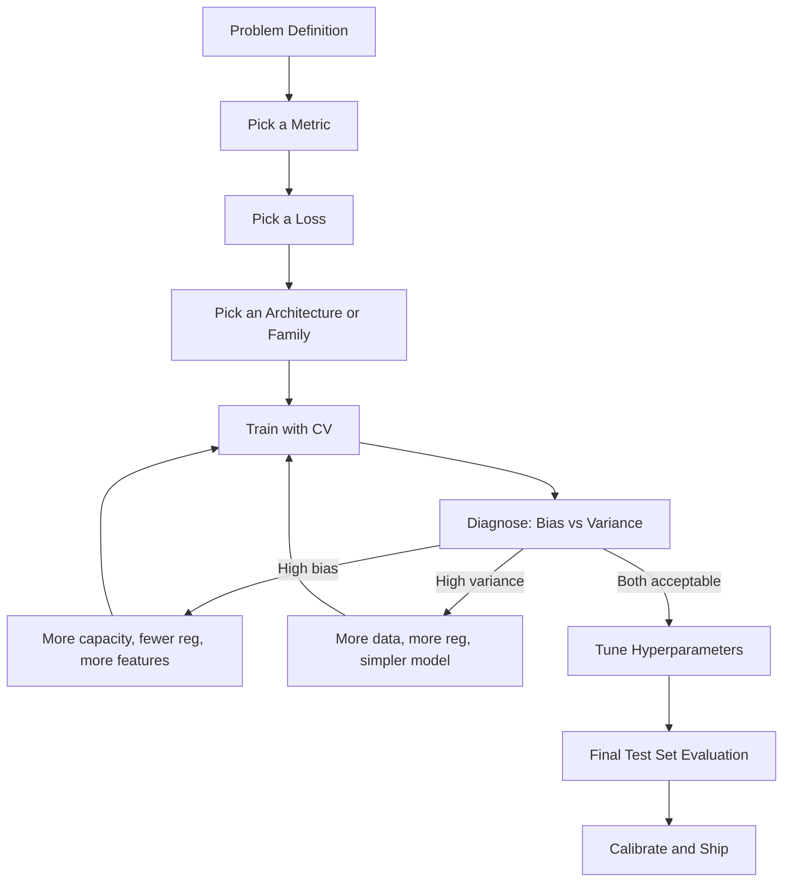
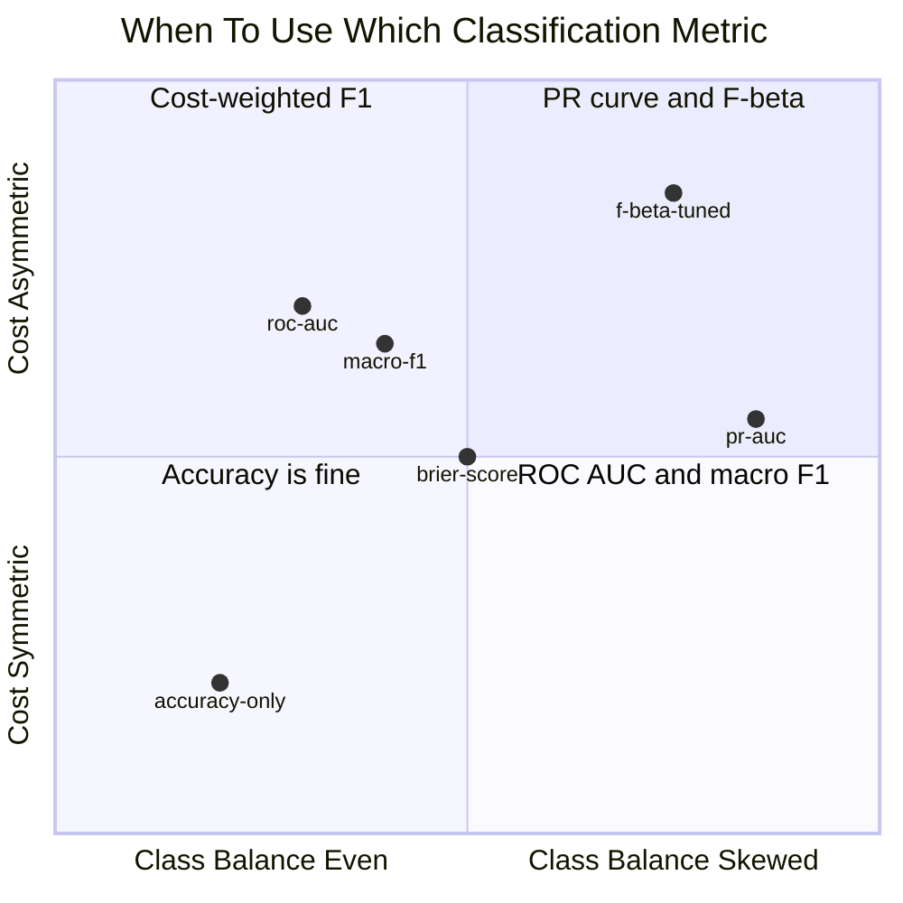
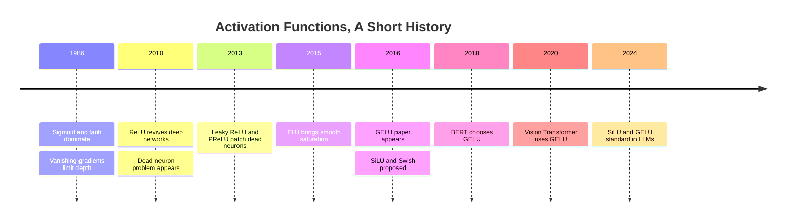
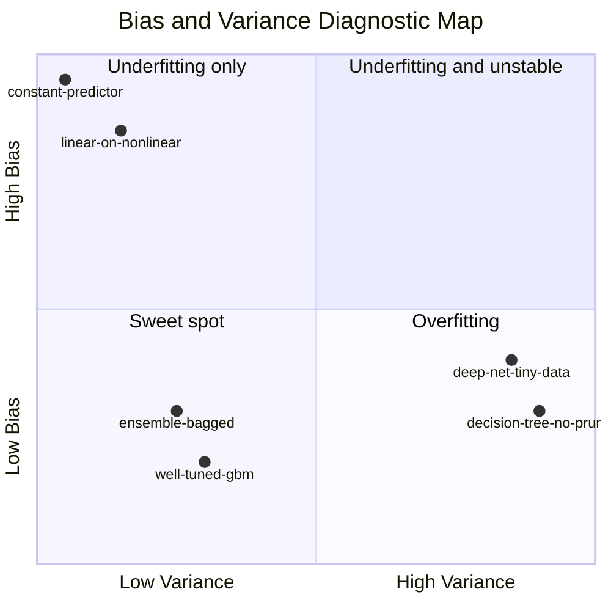
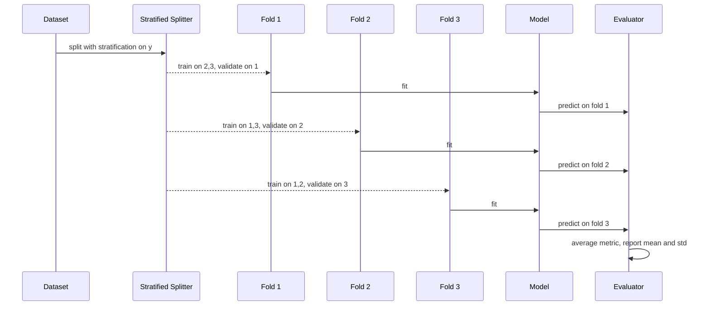

# ML Cert Review, Part I: How Models Learn and How We Measure Them

A week ago I [walked through the Google Cloud cert ladder](https://juanlara18.github.io/portfolio/#/blog/google-cloud-certifications-2026-roadmap) and the analogous shape on AWS and Azure. The conclusion of that post was, more or less: *pick the one that maps to the role you actually do, then put six weekends on the calendar*. This post is for the morning of weekend one.

Because here is the uncomfortable thing about every modern ML certification, whether it is the Google Professional ML Engineer, the AWS ML Specialty, or the Azure AI Engineer Associate. They will all happily test you on Vertex AI Agent Builder, on SageMaker Pipelines, on prompt flow in Azure AI Foundry, on RAG patterns and evaluation harnesses. But the bar to clear before you get to any of that is roughly the same bar that the 2016 versions of these exams asked for: confusion matrices, cross-entropy, ReLU, k-fold, gradient boosting, PCA. The classical-ML floor has not moved. The exams have piled new content on top of it. They have not removed the floor.

So this is Part I of a two-part dense refresher. Part I is the floor: how supervised models actually learn, what loss surfaces actually look like, how we measure success when accuracy is a trap, what the bias-variance decomposition really says, and the dozen-or-so classical algorithms whose names you need to be able to deploy in a sentence. Part II, which goes up next week, will cover deep learning specifics, training at scale, NLP and the transformer family, reinforcement learning, and the explainability and responsible-AI surface that has crept into every cert blueprint in the last two years.

If you can read this Part I post, nod along, and explain any of its sections to a colleague unprompted, the classical-ML half of the exam is essentially free points. That is the goal.

---

## The Terrain

Before we start, a one-paragraph map. We will go performance metrics first, because every other decision in this post is downstream of "what does success look like, and how do you know you achieved it." Then loss functions, because the loss is the thing your model actually optimizes and the metric is the thing your stakeholders actually care about, and the relationship between the two is more interesting than most courses admit. Then activation functions, where the historical arc from sigmoid to GELU is genuinely instructive about why deep learning works at all. Then the bias-variance decomposition and the diagnostic toolkit you use to read learning curves. Then feature engineering, selection, and dimensionality reduction. Then evaluation strategies, including the leakage pit traps that ruin more exam answers than any other topic. Then ensembles, where most of the gradient-boosting math lives. Then the classical algorithm zoo with a one-paragraph cheat sheet for each. Then a forward look at Part II.



Keep this loop in mind. Every section below sits on one of those nodes.

---

## Performance Metrics, Starting with Classification

The single most common cert trap in classification is the imbalance trap. A fraud-detection dataset is 0.5 percent fraud, 99.5 percent legitimate. A model that predicts "legitimate" for every transaction scores 99.5 percent accuracy. It is also useless. So the first habit to build is: when someone shows you an accuracy number, ask about the class distribution before you congratulate them.

The confusion matrix is the foundation. For binary classification:

|                  | Predicted Positive | Predicted Negative |
|------------------|--------------------|--------------------|
| Actual Positive  | TP                 | FN                 |
| Actual Negative  | FP                 | TN                 |

From these four cells, every binary classification metric you care about is a ratio.

- **Accuracy**: $(TP + TN) / N$. Use only when classes are balanced and error costs are symmetric.
- **Precision**: $TP / (TP + FP)$. Of the items I flagged as positive, what fraction actually were? High when false positives are expensive.
- **Recall** (also called sensitivity, or true positive rate): $TP / (TP + FN)$. Of the items that actually were positive, what fraction did I catch? High when false negatives are expensive.
- **Specificity** (true negative rate): $TN / (TN + FP)$. Mostly used as the y-axis complement in ROC curves.

Precision and recall trade off. You can always raise one by sacrificing the other; you tune that trade-off with the decision threshold. F1 is their harmonic mean:

$$F_1 = \frac{2 \cdot P \cdot R}{P + R}$$

The harmonic mean penalizes the smaller of the two numbers more than the arithmetic mean would, which is why it is the right summary when neither precision nor recall alone tells the story. F-beta generalizes:

$$F_\beta = (1 + \beta^2) \cdot \frac{P \cdot R}{\beta^2 \cdot P + R}$$

When $\beta > 1$ recall matters more; when $\beta < 1$ precision matters more. Cancer screening is famously $F_2$ territory: missing a true case is worse than a false alarm. Spam classifiers are $F_{0.5}$ territory: false positives that block a legitimate email are worse than missing a spam.

### PR vs ROC: when each lies

The two curves you sweep across thresholds are precision-recall (PR) and receiver-operating-characteristic (ROC). They look similar. They behave very differently under class imbalance.

ROC plots true positive rate against false positive rate. Both axes are normalized by class size, so under heavy imbalance the false positive rate stays small even when your model is generating an absurd number of false positives in absolute terms. AUC under ROC stays optically high. PR plots precision against recall. Precision is sensitive to the absolute count of false positives. Under imbalance, PR is brutally honest about how many junk flags your model is producing.

The cert rule of thumb: when classes are balanced or roughly so, ROC and AUC are fine. When the positive class is below ten percent of the data, prefer PR and the area under PR. When the positive class is below one percent, ROC will lie to you and PR will not.

```python
from sklearn.datasets import make_classification
from sklearn.linear_model import LogisticRegression
from sklearn.model_selection import train_test_split
from sklearn.metrics import (
    precision_recall_curve, roc_curve, average_precision_score, roc_auc_score,
    precision_score, recall_score, f1_score, fbeta_score, classification_report,
)

X, y = make_classification(
    n_samples=20000, weights=[0.99, 0.01], n_features=20,
    n_informative=8, random_state=42,
)
X_tr, X_te, y_tr, y_te = train_test_split(X, y, stratify=y, test_size=0.25, random_state=0)

model = LogisticRegression(max_iter=2000, class_weight="balanced").fit(X_tr, y_tr)
proba = model.predict_proba(X_te)[:, 1]

# Threshold-free summaries
print("ROC AUC :", roc_auc_score(y_te, proba))
print("PR  AUC :", average_precision_score(y_te, proba))

# Threshold-dependent: sweep, then pick a threshold from PR
prec, rec, thr = precision_recall_curve(y_te, proba)
# Choose the threshold that maximizes F2 (recall-leaning)
import numpy as np
beta = 2.0
fscores = (1 + beta**2) * (prec * rec) / (beta**2 * prec + rec + 1e-12)
best = np.argmax(fscores[:-1])  # last point has no threshold
chosen = thr[best]
y_hat = (proba >= chosen).astype(int)

print(f"Chosen threshold: {chosen:.3f}")
print(f"F1: {f1_score(y_te, y_hat):.3f}  F2: {fbeta_score(y_te, y_hat, beta=2):.3f}")
print(classification_report(y_te, y_hat, digits=3))
```

Two things to notice in that snippet. First, `class_weight="balanced"` reweights the loss so the model does not collapse onto the majority class. Second, the threshold is not 0.5. The default of 0.5 is almost always wrong on imbalanced problems. Picking the threshold is part of the model.

### Calibration

A separate question from "is the model accurate?" is "are the probabilities the model outputs actually probabilities?" If the model says 0.8 and the true frequency among such items is 0.6, the ranking might still be useful but the number is lying. Calibration matters whenever you feed model output into a downstream cost calculation, an expected-value decision, or a threshold the business wants stated as a percent.

Two metrics to know:

- **Brier score**: $\frac{1}{N}\sum (p_i - y_i)^2$. Mean squared error between predicted probability and true label. Lower is better.
- **Expected Calibration Error (ECE)**: bin predictions by predicted probability, compute the gap between average predicted probability and observed positive rate per bin, weight by bin size, sum the absolute gaps. ECE near zero means well calibrated.

Tree ensembles and SVMs are notoriously badly calibrated; neural networks have gotten worse over the last decade as they got bigger. The standard fixes are Platt scaling (a logistic regression on the logits, recommended for small calibration sets) and isotonic regression (non-parametric, recommended when you have more calibration data, prone to overfitting). `sklearn.calibration.CalibratedClassifierCV` wraps both.

### Multi-class

For multi-class, you compute precision, recall, and F1 per class and then aggregate. The three aggregations every cert tests:

- **Macro**: simple average across classes. Treats every class as equally important. Use when you care about all classes.
- **Micro**: pool all TP, FP, FN globally then compute. Equivalent to accuracy in single-label classification. Use when you care about overall correctness.
- **Weighted**: like macro, but weight each class's score by its support. Compromise position. Use when you care about real-world rate-of-being-right but want some sensitivity to per-class behavior.

The sneaky exam question is: which aggregation should you cite for an imbalanced multi-class problem where you actually care about the rare classes? Macro. Weighted will be dominated by the majority class, micro will be too. Macro forces you to look at the rare classes.

### Regression metrics, briefly

For regression:

- **MAE**, mean absolute error: $\frac{1}{N}\sum |y_i - \hat{y}_i|$. Robust to outliers; in dollars or whatever the unit is.
- **MSE**, mean squared error: $\frac{1}{N}\sum (y_i - \hat{y}_i)^2$. Penalizes large errors quadratically; outliers dominate.
- **RMSE**: $\sqrt{MSE}$. Same scale as the target. Most commonly reported.
- **R-squared**: $1 - \frac{\sum (y_i - \hat{y}_i)^2}{\sum (y_i - \bar{y})^2}$. Fraction of variance explained, comparing to the baseline of "always predict the mean." Ranges from $-\infty$ to 1. Negative means your model is worse than predicting the mean.
- **MAPE**, mean absolute percentage error: $\frac{1}{N}\sum |y_i - \hat{y}_i| / |y_i|$. Reads well in business reporting. Lies when $y_i$ is near zero.

The lying behaviors to flag on the exam: RMSE under heavy outliers (one bad point dominates), R-squared on a non-linear true relationship (can be high while the residual structure is obviously wrong), and MAPE on time series with seasonal lows near zero (one quiet weekend can blow up your number). When a metric looks too good or too bad, plot the residuals before you trust it.



---

## Loss Functions, and Why They Are Not Metrics

A loss function is what gradient descent optimizes. A metric is what stakeholders read. They are not the same thing, and pretending otherwise is the mistake that produces models that train beautifully and ship badly.

The deep reason they differ: the loss has to be differentiable (or at least subdifferentiable) and well behaved as a function of model parameters; the metric only has to be informative. Accuracy is not differentiable. F1 is not differentiable. AUC is not differentiable. So you cannot directly optimize them. Instead you optimize a *surrogate* loss whose minimum coincides, ideally, with the maximum of your metric.

When the surrogate is well chosen, the relationship is tight: minimizing cross-entropy approximately maximizes log-likelihood and produces calibrated probabilities, from which any threshold-based metric can be tuned afterwards. When the surrogate is poorly chosen, you optimize the wrong thing for hours and wonder why your eval numbers are flat.

### Regression losses

- **MSE / L2**: $\sum (y - \hat{y})^2$. Convex, smooth, differentiable everywhere. Heavily punishes large errors. The natural choice when residuals are roughly Gaussian. Mathematically equivalent to maximum likelihood under a Gaussian noise model.
- **MAE / L1**: $\sum |y - \hat{y}|$. Robust to outliers, but not differentiable at zero so optimization is slightly trickier. The right choice when your data has heavy tails. Equivalent to MLE under a Laplace noise model.
- **Huber loss**: quadratic for small residuals, linear for large ones. The hybrid. Used when you want MSE behavior near the optimum and MAE robustness against outliers. Has a hyperparameter $\delta$ that sets the switch point.
- **Quantile loss / pinball loss**: optimizes a specified quantile of the predictive distribution. Use it when you need a prediction interval, not a point estimate.

### Classification losses

- **Binary cross-entropy** (also called log loss):

$$\mathcal{L} = -\frac{1}{N}\sum_{i=1}^{N} \left[ y_i \log p_i + (1 - y_i)\log(1 - p_i) \right]$$

This is the workhorse. Convex in the logit, calibrated by construction, and produces gradients that are large when the model is confidently wrong and small when it is right. The connection to the metric: minimizing log loss is equivalent to maximizing the likelihood of the data under a Bernoulli model, which is what you actually want for probability outputs.

- **Categorical cross-entropy**: same idea, generalized to multi-class via softmax.
- **Focal loss** (Lin et al. 2017): cross-entropy multiplied by $(1 - p_t)^\gamma$, which down-weights examples the model already classifies well. Designed for object detection where the dataset is dominated by easy negatives. Useful any time class imbalance is severe and the easy-negative population is drowning the gradient signal.
- **Hinge loss**: $\max(0, 1 - y \cdot \hat{y})$ where $y \in \{-1, +1\}$. The SVM's loss. Produces a margin classifier; gradients are nonzero only for examples that are inside or wrong-side-of the margin.
- **Triplet / contrastive losses**: for embedding learning. Triplet loss pulls anchor and positive together while pushing anchor and negative apart by a margin: $\max(0, d(a,p) - d(a,n) + m)$. Contrastive loss is the pairwise sibling. Used for retrieval, face verification, and most modern dual-encoder architectures.

A custom PyTorch loss looks like this:

```python
import torch
import torch.nn as nn
import torch.nn.functional as F

class FocalLoss(nn.Module):
    """Binary focal loss for imbalanced classification.
    Lin et al., Focal Loss for Dense Object Detection, ICCV 2017.
    """
    def __init__(self, alpha: float = 0.25, gamma: float = 2.0):
        super().__init__()
        self.alpha = alpha
        self.gamma = gamma

    def forward(self, logits: torch.Tensor, targets: torch.Tensor) -> torch.Tensor:
        # logits and targets shape: [batch]
        bce = F.binary_cross_entropy_with_logits(logits, targets.float(), reduction="none")
        p = torch.sigmoid(logits)
        p_t = p * targets + (1 - p) * (1 - targets)
        alpha_t = self.alpha * targets + (1 - self.alpha) * (1 - targets)
        focal = alpha_t * (1 - p_t).pow(self.gamma) * bce
        return focal.mean()
```

Two implementation notes worth memorizing. First, `binary_cross_entropy_with_logits` is numerically more stable than computing sigmoid then BCE separately. Always prefer the fused version. Second, never write your softmax by hand for cross-entropy: use `cross_entropy` directly on logits.

| Problem type           | Standard loss             | When to switch                     |
|------------------------|---------------------------|------------------------------------|
| Regression, Gaussian   | MSE                       | Outliers --> Huber or MAE          |
| Regression, intervals  | Quantile / pinball        | When you need uncertainty bounds   |
| Binary classification  | BCE / log loss            | Severe imbalance --> focal         |
| Multi-class            | Categorical cross-entropy | Severe imbalance --> class weights |
| Margin classifier      | Hinge                     | Used inside SVMs                   |
| Embedding / retrieval  | Triplet or InfoNCE        | Default for dual encoders          |
| Ranking                | LambdaRank, ListNet       | When the metric is NDCG            |

---

## Activation Functions: A Brief History

The activation function is the nonlinearity inside each neuron. Without it, a deep network is a stack of linear maps, which is itself just one linear map; activations are what make depth useful. The history of activations is a history of fixing the vanishing-gradient problem.

### Sigmoid and tanh

The original choice, $\sigma(x) = 1/(1 + e^{-x})$, squashes input into (0, 1). It is biologically motivated, smooth, and differentiable. It also has two problems that killed deep networks for two decades. First, its gradient $\sigma(x)(1 - \sigma(x))$ peaks at 0.25 and is near zero for any input that is even modestly large in magnitude. Stack ten of these and the gradient that reaches the bottom layer is something like $0.25^{10} \approx 10^{-6}$. Layers do not learn. Second, sigmoid output is not zero-centered, which biases gradient updates and slows convergence.

Tanh fixed the zero-centering. Same vanishing problem.

### ReLU

Nair and Hinton in 2010 popularized $\text{ReLU}(x) = \max(0, x)$. The gradient is exactly 1 for positive inputs and exactly 0 for negative ones. No vanishing for active neurons. Combined with better initialization and batch normalization, ReLU is the single biggest practical reason deep learning started working. The catch: dead neurons. If a unit's input becomes consistently negative, its gradient is permanently zero and it never updates. In a healthy network this is fine; in a poorly initialized one a meaningful fraction of neurons die.

### Leaky ReLU, PReLU, ELU

These all attack the dead-neuron problem.

- **Leaky ReLU**: $\max(\alpha x, x)$ with $\alpha$ fixed at 0.01.
- **PReLU**: same shape, but $\alpha$ is learned per channel.
- **ELU**: smooth saturating curve for negative inputs, $\alpha(e^x - 1)$. Cleaner gradients near zero.

In practice, all three are minor improvements. Plain ReLU continues to work fine in most CNNs.

### GELU and SiLU/Swish

The transformer era settled on smoother activations. **GELU** (Gaussian Error Linear Unit) is $x \cdot \Phi(x)$ where $\Phi$ is the standard normal CDF. It can be read as a stochastic regularizer that probabilistically zeros out small inputs. **SiLU**, also called Swish, is $x \cdot \sigma(x)$. Both are smooth, near-ReLU for large positive inputs, and quietly negative for moderately negative inputs. Empirically they outperform ReLU in transformer architectures by a small but consistent margin and are now standard in BERT, GPT, ViT, LLaMA, and essentially every modern LLM. The intuition for why they work better in transformers is fuzzy; the empirical evidence is not.

### Softmax

Softmax is not really an activation in the same sense; it is the final-layer normalizer that turns logits into a probability distribution over classes:

$$\text{softmax}(z)_i = \frac{e^{z_i}}{\sum_j e^{z_j}}$$

Use it on the final layer of a multi-class classifier. Use sigmoid on the final layer of a binary classifier or a multi-label classifier where labels are independent. Use no activation on the final layer of a regression model.



| Activation | Output range | Pros | Cons | Use today |
|------------|--------------|------|------|-----------|
| Sigmoid    | (0, 1)       | Smooth, probabilistic | Vanishing gradients, not zero-centered | Final layer of binary classifier |
| Tanh       | (-1, 1)      | Zero-centered | Still vanishes | Sometimes RNN gates |
| ReLU       | [0, inf)     | No saturation for x positive, fast | Dead neurons | CNNs, default hidden layers |
| Leaky ReLU | (-inf, inf)  | No dead neurons | One more hyperparameter | When ReLU is dying |
| GELU       | (-inf, inf)  | Smooth, empirically strong | Slightly slower | Transformers |
| SiLU/Swish | (-inf, inf)  | Smooth, empirically strong | Slightly slower | Transformers, modern LLMs |
| Softmax    | simplex      | Probability distribution | Numerically tricky for large z | Final layer of multi-class classifier |

---

## Bias-Variance and the Diagnostic Toolkit

The bias-variance decomposition is the cleanest single lens for understanding why a model is failing. Under squared-error loss, for a fixed input $x$ and a model $\hat{f}$ trained on a random dataset, the expected error decomposes as:

$$\mathbb{E}\left[(y - \hat{f}(x))^2\right] = \underbrace{\big(\mathbb{E}[\hat{f}(x)] - f(x)\big)^2}_{\text{bias}^2} + \underbrace{\mathbb{E}\big[(\hat{f}(x) - \mathbb{E}[\hat{f}(x)])^2\big]}_{\text{variance}} + \underbrace{\sigma^2}_{\text{irreducible noise}}$$

The bias term measures how much the model's average prediction deviates from the truth: it is wrong on average, regardless of the data sample. High bias means the model is too simple to capture the true function, and the cure is *more capacity*. The variance term measures how much the model's prediction wobbles across different training samples: it is unstable, and a different dataset would have produced a noticeably different model. High variance means the model is memorizing noise, and the cure is *less capacity, more data, or stronger regularization*. The irreducible noise is the floor: you cannot beat it without changing the problem.

### Reading learning curves

The bias-variance picture is theoretical. The practical version is the learning curve: train error and validation error as a function of training set size. Three patterns to recognize:

- **High bias / underfitting**: train error is high *and* validation error is high, and both have plateaued. More data will not help. Add capacity.
- **High variance / overfitting**: train error is low, validation error is much higher, and the gap is wide and not closing. More data might help. Regularize, add dropout, simplify, or get more data.
- **Just right**: train and validation errors are close to each other and to your target; both curves are flat at the right of the plot. Stop and ship.

Validation curves (error vs hyperparameter) are the second diagnostic. Sweep one hyperparameter; the train curve typically improves monotonically as capacity grows; the validation curve is U-shaped. The minimum of the U is your operating point.

```python
import numpy as np
import matplotlib.pyplot as plt
from sklearn.model_selection import learning_curve
from sklearn.ensemble import GradientBoostingClassifier
from sklearn.datasets import make_classification

X, y = make_classification(n_samples=8000, n_features=20, n_informative=10, random_state=0)

train_sizes, train_scores, val_scores = learning_curve(
    GradientBoostingClassifier(n_estimators=200, max_depth=3, random_state=0),
    X, y,
    cv=5,
    train_sizes=np.linspace(0.1, 1.0, 8),
    scoring="neg_log_loss",
    n_jobs=-1,
)

train_mean = -train_scores.mean(axis=1)
val_mean = -val_scores.mean(axis=1)

plt.plot(train_sizes, train_mean, label="Train log loss")
plt.plot(train_sizes, val_mean, label="Validation log loss")
plt.xlabel("Training samples"); plt.ylabel("Log loss"); plt.legend()
plt.title("Learning curve, gradient boosting")
plt.show()

gap = val_mean[-1] - train_mean[-1]
print(f"Final train: {train_mean[-1]:.3f}  val: {val_mean[-1]:.3f}  gap: {gap:.3f}")
print("High variance" if gap > 0.05 else "Acceptable" if val_mean[-1] < 0.4 else "High bias")
```

### Regularization: the standard arsenal

When variance is your problem, regularization is almost always your tool.

- **L2 / Ridge**: penalty $\lambda \|w\|_2^2$. Shrinks coefficients toward zero, doesn't zero them out. Closed form for linear regression. Equivalent to a Gaussian prior on the weights.
- **L1 / Lasso**: penalty $\lambda \|w\|_1$. Produces sparsity: coefficients go exactly to zero. Equivalent to a Laplace prior.
- **Elastic net**: $\lambda_1 \|w\|_1 + \lambda_2 \|w\|_2^2$. Combines both. Use when you have many correlated features and L1 alone selects arbitrarily among them.
- **Dropout**: at training time, zero out activations independently with probability $p$. At test time, do not. Mathematically a form of model averaging over a combinatorial number of subnetworks.
- **Early stopping**: monitor validation loss, stop when it stops improving. Implicit regularization; equivalent in many settings to L2.
- **Data augmentation**: artificially expand the training set with label-preserving transformations. The cheapest variance reducer in computer vision and audio; under-applied in tabular ML.



---

## Feature Engineering and Selection

Algorithms get the headlines; features pay the rent. Most production tabular ML wins are feature wins.

### Scaling and encoding

Tree-based models do not need scaling; they care about ranks, not magnitudes. Linear models, distance-based models (k-NN, k-means), and any neural network with a smooth optimizer absolutely do.

- **Standardization**: $(x - \mu) / \sigma$. Default for most tabular ML.
- **Min-max normalization**: $(x - \min) / (\max - \min)$. Use when you need bounded input, e.g., for image pixels.
- **Robust scaler**: $(x - \text{median}) / \text{IQR}$. Use when you have outliers and standardization would be dragged around by them.

Categorical encoding is where leakage and dimension blowup hide.

- **One-hot encoding**: a column per category. Fine for low cardinality. Explodes for high cardinality.
- **Target encoding** (also called mean encoding): replace each category with the mean target value within that category. Powerful, but a leakage trap: must be computed only on training folds, never on the test fold.
- **Leave-one-out encoding**: target encoding excluding the current row. Reduces leakage further.
- **Hashing trick**: hash category strings to a fixed number of buckets. Unbeatable on memory; loses interpretability.
- **Embeddings**: learned low-dimensional vector per category. Standard inside neural networks.

Interaction features (products, ratios) and polynomial features encode nonlinearities for linear models. Trees discover these interactions automatically; for linear or sparse linear models, you have to construct them.

### Selection: filter, wrapper, embedded

Three families.

- **Filter**: rank features against the target without consulting any model. Mutual information, Pearson correlation, chi-squared for categorical-vs-categorical, ANOVA F-test for categorical-vs-continuous. Cheap, model-agnostic, easy to over-trust.
- **Wrapper**: train models with subsets of features and pick the best. Recursive Feature Elimination (RFE), forward selection, backward elimination. Expensive but model-aware.
- **Embedded**: the model selects features as part of training. L1 regression, tree-based feature importance, attention weights. Best of both worlds when applicable.

In practice: start with a quick filter pass to drop obvious noise, train a tree-based model, read its feature importance as your embedded selection, then iterate. Wrappers are mostly for the cert exam.

### Dimensionality reduction: PCA derivation

Principal Component Analysis is the most-tested dim-reduction method on every cert exam. It is worth knowing the derivation.

Given mean-centered data $X \in \mathbb{R}^{N \times d}$, the empirical covariance matrix is $\Sigma = \frac{1}{N - 1} X^\top X$. We seek a unit vector $w$ that maximizes the variance of the projection $Xw$. That variance is:

$$\text{Var}(Xw) = \frac{1}{N - 1} (Xw)^\top (Xw) = w^\top \Sigma w$$

Maximize subject to $\|w\| = 1$. The Lagrangian gives:

$$\Sigma w = \lambda w$$

So the optimal $w$ is an eigenvector of $\Sigma$, and the variance captured is the corresponding eigenvalue. The top-$k$ principal components are the top-$k$ eigenvectors. That is the entire algorithm.

```python
import numpy as np

def pca_from_scratch(X: np.ndarray, k: int):
    """Return top-k principal components and the projected data."""
    # Center
    mu = X.mean(axis=0)
    Xc = X - mu

    # Covariance and eigendecomposition
    cov = (Xc.T @ Xc) / (X.shape[0] - 1)
    eigvals, eigvecs = np.linalg.eigh(cov)  # ascending order, real-symmetric

    # Take top k, descending
    idx = np.argsort(eigvals)[::-1][:k]
    components = eigvecs[:, idx]              # shape (d, k)
    explained = eigvals[idx] / eigvals.sum()

    Z = Xc @ components                       # projection
    return Z, components, explained

rng = np.random.default_rng(0)
X = rng.normal(size=(500, 6)) @ rng.normal(size=(6, 6))
Z, comps, var = pca_from_scratch(X, k=2)
print("Explained variance ratio:", var)
print("Projected shape:", Z.shape)
```

For numerical stability on real data, use SVD of $X$ rather than eigendecomposition of $X^\top X$; sklearn's `PCA` does this for you.

PCA's siblings:

- **LDA** (Linear Discriminant Analysis): supervised. Finds projections that maximize between-class variance over within-class variance. Use when you have class labels and want a low-dimensional representation that preserves class separability.
- **t-SNE**: nonlinear, optimizes a probabilistic match between high-dim and low-dim neighborhoods. Excellent for visualization. *Bad* for downstream modeling: distances in t-SNE space have no global meaning, only local.
- **UMAP**: similar idea, faster, preserves more global structure than t-SNE. Better default for visualization in 2026 and arguably useful as a feature transform in a pinch.

The cert rule: PCA for dimensionality reduction as preprocessing, LDA when you have labels and want supervised projection, t-SNE/UMAP for visualization only.

---

## Model Evaluation: Splits, CV, and Leakage

Every ML cert tests you on cross-validation. The exam questions are 80 percent "spot the leakage" and 20 percent "name the right CV variant."

### Split strategies

- **Train / val / test**: simplest. Train on the train split, tune on val, report on test exactly once. The danger is "tuning on test by accident" via repeated peeking.
- **k-fold CV**: split into $k$ folds, train on $k-1$, validate on the held-out one, rotate, average. Standard $k$ is 5 or 10.
- **Stratified k-fold**: enforces that each fold has the same class distribution as the whole dataset. Mandatory for imbalanced classification.
- **Leave-one-out**: $k = N$. High variance, expensive, almost never the right choice on real datasets.
- **Group k-fold**: when rows are grouped (multiple measurements per patient, multiple sessions per user), split by group so the same group never appears in both train and validation. Failure to do this is the most common silent leakage source in healthcare and behavioral data.
- **Time-series CV**: never randomize. Always train on the past, validate on the future. The variant called *purged k-fold* (de Prado) leaves a gap between train and test and embargoes the periods immediately around the validation set; standard in finance.



```python
import numpy as np
from sklearn.model_selection import StratifiedKFold, cross_val_score
from sklearn.pipeline import Pipeline
from sklearn.preprocessing import StandardScaler
from sklearn.linear_model import LogisticRegression
from sklearn.datasets import make_classification

X, y = make_classification(n_samples=5000, weights=[0.85, 0.15], random_state=0)

# Pipeline so scaling is fit per-fold, not on the whole dataset (leakage trap)
pipe = Pipeline([
    ("scaler", StandardScaler()),
    ("clf", LogisticRegression(max_iter=2000, class_weight="balanced")),
])

cv = StratifiedKFold(n_splits=5, shuffle=True, random_state=0)
scores = cross_val_score(pipe, X, y, cv=cv, scoring="average_precision", n_jobs=-1)
print(f"PR AUC: {scores.mean():.3f} +/- {scores.std():.3f}")
```

The `Pipeline` is the load-bearing detail. If you scale the entire dataset before splitting, scaling parameters leak validation statistics into training. Same for any feature engineering, target encoding, imputation, or feature selection. *Anything that consults the target or the marginals must be fit per fold*.

### Hyperparameter tuning

Three approaches, in increasing order of sophistication.

- **Grid search**: enumerate the cross product of values. Wasteful in high dimensions, exhaustive in low.
- **Random search** (Bergstra and Bengio): sample uniformly. Provably better than grid search when only a few hyperparameters matter.
- **Bayesian optimization** (Optuna is the standard 2026 library): build a surrogate model of the validation-score function and use it to propose the next configuration. Worth the setup cost on expensive training jobs.

The deeper move: nested cross-validation. Outer CV estimates the generalization error; inner CV picks hyperparameters. Computationally expensive, statistically clean. Most teams skip the outer loop and pretend their reported number is unbiased; cert exams will sometimes call this out.

### Bootstrap confidence intervals

When you want a confidence interval around a single number, bootstrap: resample the test set with replacement many times, recompute the metric on each resample, take the 2.5 and 97.5 percentiles. Quick, distribution-free, valid for almost any metric.

---

## Ensembles

Ensembles are the single biggest source of "free" performance on tabular data. The taxonomy:

- **Bagging** trains many models on bootstrap resamples of the data, in parallel, and averages. *Reduces variance*. The classic implementation is the random forest (Breiman 2001), which adds feature subsampling on top of bootstrapping.
- **Boosting** trains models sequentially, each correcting the errors of its predecessors. *Reduces bias*. AdaBoost was the original (Freund and Schapire, 1995); gradient boosting (Friedman 2001) is the modern formulation; XGBoost (Chen and Guestrin 2016), LightGBM, and CatBoost are the production-grade implementations.
- **Stacking / blending**: train multiple base learners, then train a meta-model on their out-of-fold predictions. Reduces both, at the cost of substantial complexity.

### Gradient boosting in algebraic form

Friedman's setup. We want a function $F(x)$ that minimizes expected loss $\mathbb{E}[L(y, F(x))]$. Build it greedily as an additive expansion:

$$F_M(x) = \sum_{m=1}^{M} \nu \cdot h_m(x)$$

where $h_m$ is a weak learner (typically a regression tree) and $\nu$ is the learning rate. At iteration $m$, fit $h_m$ to the negative gradient of the loss with respect to the current ensemble's prediction:

$$r_{im} = -\left[\frac{\partial L(y_i, F(x_i))}{\partial F(x_i)}\right]_{F = F_{m-1}}$$

For squared loss, $r_{im} = y_i - F_{m-1}(x_i)$, so each round literally fits the residuals. For log loss, the residuals are $y_i - \sigma(F_{m-1}(x_i))$. The learning rate $\nu$ (also called shrinkage) is typically small, around 0.05 to 0.1, which means you need many trees but each tree contributes little, which is the dual of L2 regularization in function space.

XGBoost adds a second-order term. Where Friedman's gradient boosting uses just the gradient, XGBoost takes a second-order Taylor expansion of the loss around the current prediction, fitting each tree to minimize:

$$\sum_i \left[g_i \cdot h(x_i) + \frac{1}{2} h_i \cdot h(x_i)^2\right] + \Omega(h)$$

where $g_i$ is the gradient, $h_i$ the Hessian, and $\Omega(h)$ a regularization term on tree complexity (number of leaves, sum of squared leaf weights). This is the math that makes XGBoost both fast and well regularized, and it is the answer to the cert question "what makes XGBoost different from gradient boosting?"

```python
import xgboost as xgb
from sklearn.datasets import fetch_california_housing
from sklearn.model_selection import train_test_split

X, y = fetch_california_housing(return_X_y=True)
X_tr, X_te, y_tr, y_te = train_test_split(X, y, test_size=0.2, random_state=0)

model = xgb.XGBRegressor(
    n_estimators=2000,
    max_depth=6,
    learning_rate=0.05,
    subsample=0.8,
    colsample_bytree=0.8,
    reg_lambda=1.0,
    early_stopping_rounds=50,
    eval_metric="rmse",
    tree_method="hist",
    random_state=0,
)
model.fit(X_tr, y_tr, eval_set=[(X_te, y_te)], verbose=False)
print(f"Best iteration: {model.best_iteration}")
print(f"Best RMSE     : {model.best_score:.3f}")
```

The same pattern works on LightGBM and CatBoost; LightGBM uses leaf-wise tree growth and is faster on wide tabular data, CatBoost handles categorical features natively without one-hot encoding. The cert rule: XGBoost as the default, LightGBM if speed matters, CatBoost if you have many high-cardinality categorical features and limited preprocessing budget.

When does boosting overfit? When you set `n_estimators` too high without early stopping, when your learning rate is too high so each tree corrects too aggressively, or when you let trees grow too deep so each weak learner is no longer weak. The configuration triple of low learning rate, moderate tree depth, and early stopping on validation log loss is the boring answer that wins.

---

## The Classical Algorithm Zoo

A fast tour. One paragraph each: what it is, the math, when to reach for it, how it fails.

**Linear regression**. Fit $\hat{y} = w^\top x + b$ by minimizing MSE. Closed form: $\hat{w} = (X^\top X)^{-1} X^\top y$. The baseline for any regression problem; if a more complex model cannot beat regularized linear regression, the more complex model is wrong. Fails when the true relationship is nonlinear or features are highly correlated (multicollinearity blows up the normal equations).

**Logistic regression**. Same architecture, sigmoid on top, log-loss objective. No closed form; fit by gradient descent or iteratively reweighted least squares. The right baseline for binary classification, and surprisingly hard to beat on small tabular problems. Fails on nonlinear class boundaries and very high dimensions without regularization.

**Decision trees**. Recursively split the input space to minimize a node-level impurity measure. Classification: Gini impurity $1 - \sum p_k^2$ or entropy $-\sum p_k \log p_k$. Regression: variance. Interpretable. Fast. Wildly high variance: a tiny change in training data produces a different tree. Almost never used alone in production; almost always inside a forest or a boosted ensemble.

**Random forests**. Bag many decision trees, each on a bootstrap sample, each splitting on a random subset of features at each node. Extremely strong baseline on tabular data, robust, low maintenance. Fails when individual trees cannot capture the signal at all (high-frequency interactions in extreme high dimensions).

**Support vector machines**. Find the hyperplane that maximizes margin between classes. The dual formulation lets you replace inner products with kernel evaluations: $K(x, x') = \phi(x)^\top \phi(x')$, the kernel trick. RBF kernel for nonlinear boundaries. Excellent on small-to-medium clean datasets with informative features. Fails on large datasets (the dual is $O(N^2)$) and on noisy data.

**Naive Bayes**. Apply Bayes' rule with the naive assumption that features are conditionally independent given the class. Trains in one pass, predicts in microseconds. Surprisingly competitive on text classification because the independence assumption is approximately right for word counts. Fails when features have strong dependencies.

**k-Nearest Neighbors**. Predict using the labels of the $k$ closest training examples. No training, slow inference, no model. Useful as a baseline and for interpretable predictions. Fails in high dimensions (curse of dimensionality: distances become meaningless) and on large datasets without tree-based indexing.

**k-means clustering**. Partition $n$ points into $k$ clusters by minimizing within-cluster sum of squares. Lloyd's algorithm: assign points to the nearest centroid, recompute centroids, repeat. Fast, simple. Two famous gotchas: the result depends on initialization (use k-means++), and you must specify $k$ in advance (use the elbow method or silhouette score). Fails on non-spherical clusters and on clusters of varying density.

**DBSCAN**. Density-based clustering. Two parameters: a neighborhood radius $\epsilon$ and a minimum points threshold. Points with enough neighbors are core; clusters grow by walking the density-connected core points; stragglers become noise. Discovers arbitrary cluster shapes, decides $k$ for you, labels outliers. Fails when clusters have very different densities and on high-dimensional data where the radius parameter loses meaning.

**Hierarchical clustering**. Build a tree of clusters by either merging (agglomerative) or splitting (divisive). Linkage criteria: single, complete, average, Ward. Output is a dendrogram you can cut at any height. Useful when you want to understand the cluster hierarchy itself, not just a flat partition. Fails on large datasets ($O(N^2)$ memory).

**Gaussian Mixture Models**. Soft clustering: model the data as a mixture of $k$ Gaussian components, each with its own mean and covariance. Fit with Expectation-Maximization. Returns probabilistic cluster assignments rather than hard labels. Useful when clusters overlap or have elliptical shapes. Fails when the Gaussian assumption is wrong or when $k$ is misspecified.

| Problem                     | First reach                | Second reach                |
|-----------------------------|----------------------------|-----------------------------|
| Tabular regression          | Regularized linear regression | XGBoost / LightGBM       |
| Tabular binary classification | Logistic regression      | XGBoost / LightGBM          |
| Tabular multi-class         | Logistic / softmax         | LightGBM with multi-class   |
| Small clean dataset         | Linear or RBF SVM          | Random forest               |
| Text classification         | Naive Bayes baseline       | Linear SVM, then transformer|
| Clustering, spherical       | k-means++                  | GMM                         |
| Clustering, arbitrary shape | DBSCAN                     | HDBSCAN                     |
| Visualization               | PCA                        | UMAP                        |
| Anomaly detection           | Isolation Forest           | One-class SVM               |
| Recommendation, baseline    | Matrix factorization       | Two-tower neural model      |

This table is the closest thing to a cheat sheet you should commit to memory before any cert exam.

---

## Setting Up Part II

What is *not* in this post, deliberately, because it belongs in Part II:

- **Deep learning specifics**: backpropagation in mechanical detail, optimizers (SGD with momentum, Adam, AdamW, Lion, Muon), normalization (batch, layer, group, RMS), initialization (Xavier, Kaiming), the architectures (CNN, RNN/LSTM, transformer, encoder-decoder, decoder-only).
- **Training at scale**: distributed data parallelism, model parallelism, ZeRO sharding, mixed precision, gradient accumulation, checkpointing.
- **NLP and the transformer family**: tokenization (BPE, WordPiece, SentencePiece), attention math, BERT vs GPT vs T5 lineage, embeddings, retrieval-augmented generation, fine-tuning vs prompting.
- **Reinforcement learning**: Markov decision processes, policy vs value methods, Q-learning, policy gradient, PPO, RLHF and DPO.
- **Model interpretability and responsible AI**: SHAP, LIME, integrated gradients, feature attribution, fairness metrics, bias audits, the new responsible-AI sections that all three major certs added between 2024 and 2026.

The shape of Part II will be roughly the same as this one: dense, math-friendly, code-heavy, opinionated. The cert blueprints have shifted noticeably toward the deep-learning and generative-AI side over the last two years, and Part II is where that content lives. But every piece of it sits on the foundation we just walked through. If you cannot read a confusion matrix or write the bias-variance decomposition, you cannot reason about why your transformer's calibration is off or why your LoRA fine-tune is overfitting. Same vocabulary. Different scale.

The cert calendar stays the same. Pick your cert, pick six weekends, and use the first weekend on the floor. This post is the floor. Part II is the ceiling.

---

## Going Deeper

**Books:**

- Hastie, T., Tibshirani, R., and Friedman, J. (2009). *The Elements of Statistical Learning, 2nd Edition.* Springer.
  - The canonical reference for everything in this post. Chapters 7 (model assessment), 9 (additive models and trees), 10 (boosting), and 14 (unsupervised learning) are exactly your cert prep.
- Bishop, C. M. (2006). *Pattern Recognition and Machine Learning.* Springer.
  - Mathematically heavier than Hastie. Read it for the Bayesian perspective on regularization, EM, and mixture models. Chapter 3 on linear models is the cleanest derivation of regularization I know.
- James, G., Witten, D., Hastie, T., and Tibshirani, R. (2021). *An Introduction to Statistical Learning, 2nd Edition.* Springer.
  - The gentler sibling of ESL. Code examples in R and Python, no measure theory. A reasonable starting point if Hastie feels heavy on first read.
- Ng, A. (2018). *Machine Learning Yearning.* Self-published, available free.
  - Not a textbook. A short collection of practical heuristics for diagnosing and fixing real ML systems. The bias-variance diagnostic chapters are worth re-reading the night before any exam.
- Murphy, K. P. (2022). *Probabilistic Machine Learning: An Introduction.* MIT Press.
  - The 2020s update of Bishop. Available free as a draft PDF. Currently the best single-volume reference for both the classical and the modern material.

**Online Resources:**

- [scikit-learn user guide](https://scikit-learn.org/stable/user_guide.html) — Read top to bottom over a long weekend. Sections 1 (supervised learning), 3 (model selection), and 6 (preprocessing) cover roughly half of any ML cert blueprint.
- [Google Professional ML Engineer exam guide](https://cloud.google.com/learn/certification/machine-learning-engineer) — The canonical blueprint. Use it as a checklist against this post.
- [AWS Machine Learning Specialty exam guide](https://aws.amazon.com/certification/certified-machine-learning-specialty/) — Reads remarkably similar to the GCP guide on the classical-ML side.
- [fast.ai Practical Deep Learning for Coders](https://www.fast.ai/) — Top-down rather than bottom-up. Useful as a counterweight to the textbook approach, especially for the Part II material.

**Videos:**

- [Stanford CS229 Machine Learning](https://www.youtube.com/playlist?list=PLoROMvodv4rMiGQp3WXShtMGgzqpfVfbU) by Andrew Ng — The full classical ML curriculum, derivations and all. Lectures 2 through 5 (linear and logistic regression, generalized linear models, GDA and Naive Bayes) are particularly worth re-watching the week before an exam.
- [3Blue1Brown channel](https://www.youtube.com/c/3blue1brown) by Grant Sanderson — The Essence of Linear Algebra and the Neural Networks playlists are the visual intuition that textbooks deliberately avoid. Watch before tackling the PCA derivation.

**Academic Papers:**

- Friedman, J. H. (2001). ["Greedy Function Approximation: A Gradient Boosting Machine."](https://projecteuclid.org/journals/annals-of-statistics/volume-29/issue-5/Greedy-function-approximation-A-gradient-boosting-machine/10.1214/aos/1013203451.full) *The Annals of Statistics*, 29(5), 1189-1232.
  - The original gradient boosting paper. Surprisingly readable. The TreeBoost section is the algorithm every modern boosting library implements with second-order extensions.
- Chen, T., and Guestrin, C. (2016). ["XGBoost: A Scalable Tree Boosting System."](https://arxiv.org/abs/1603.02754) *Proceedings of the 22nd ACM SIGKDD*, 785-794.
  - The XGBoost paper. The second-order Taylor expansion and the regularized objective are the math behind why XGBoost dominated tabular ML competitions for the back half of the 2010s.
- Breiman, L. (2001). ["Random Forests."](https://link.springer.com/article/10.1023/A:1010933404324) *Machine Learning*, 45(1), 5-32.
  - The random forest paper. The OOB error analysis is genuinely useful in production: it gives you a generalization estimate without holding out a separate validation set.
- Bergstra, J., and Bengio, Y. (2012). ["Random Search for Hyper-Parameter Optimization."](https://www.jmlr.org/papers/v13/bergstra12a.html) *JMLR*, 13, 281-305.
  - The paper that retired grid search. Worth reading once if only to internalize the geometric argument for why random search beats grid search whenever a few hyperparameters dominate.

**Questions to Explore:**

- Most cert blueprints still test PCA, but in production the dimensionality reduction step is increasingly replaced by learned embeddings or by feeding raw features into a model that handles dimensionality internally (gradient boosting, transformers). When is PCA still the right tool, and when is reaching for it a sign you are building the wrong pipeline?
- The bias-variance decomposition is theoretically clean for squared loss. How does it generalize, or fail to generalize, for cross-entropy, hinge loss, or the asymmetric losses used in cost-sensitive classification?
- Calibration and discrimination are mathematically distinct, and most modern deep models score high on AUC while being badly calibrated. If your downstream system uses model probabilities for expected-value calculations, which one matters more, and what does that imply for how you choose between an XGBoost ensemble and a neural network on the same problem?
- Cert exams overweight the classical algorithm zoo because it is enumerable, but production ML in 2027 is dominated by gradient boosting on tabular data and transformers on everything else. Is the cert content out of step with practice, or is the breadth itself the point?
- The transition from sigmoid to ReLU to GELU/SiLU was driven by empirical results, not by theory. What does that pattern suggest about how the next activation revolution will look, and why have we not seen one in the last decade?
