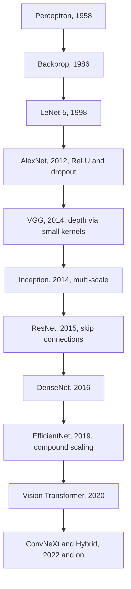
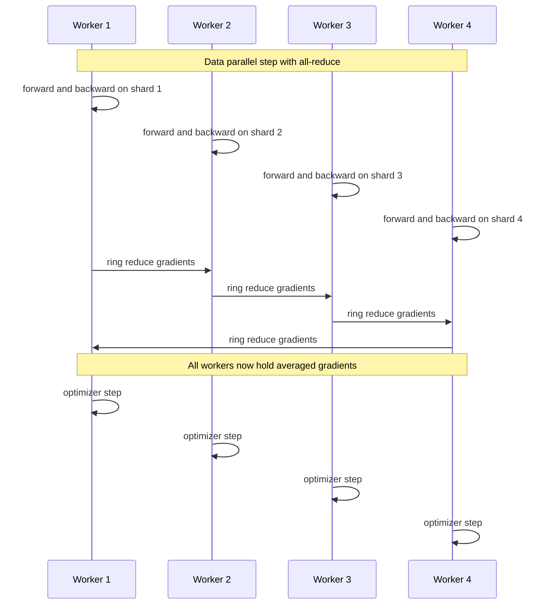
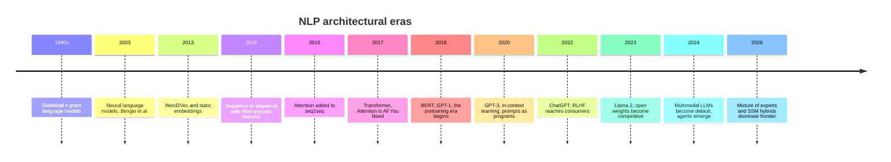
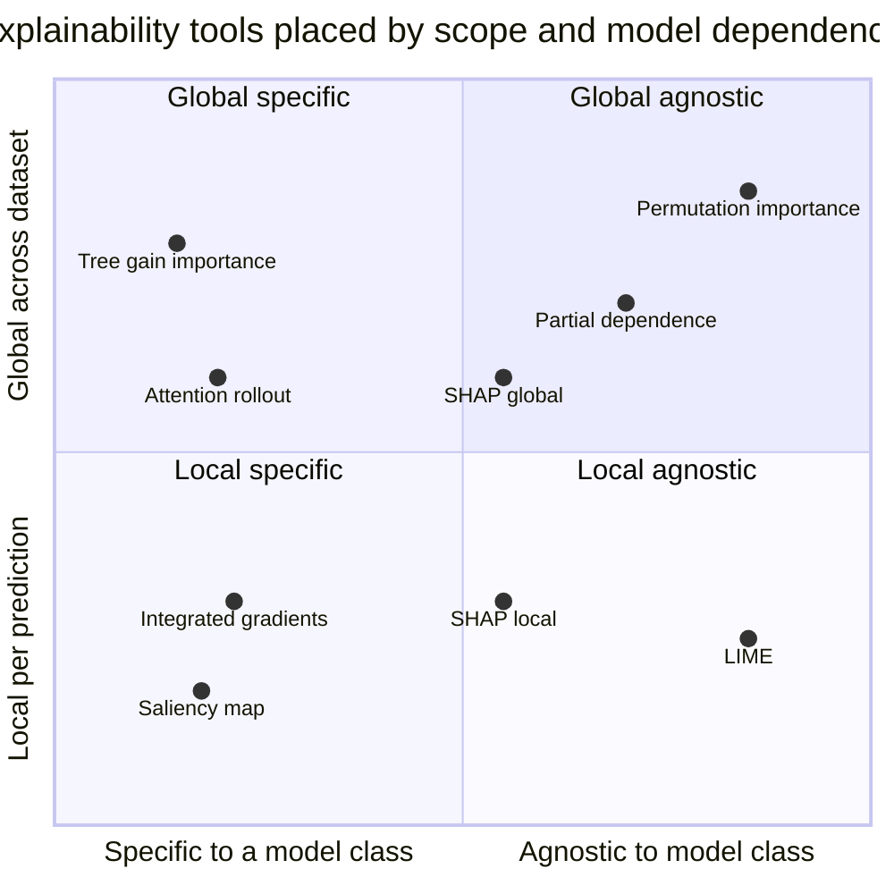

# ML Cert Review, Part II: Deep Learning, Scale, NLP, RL, and Explainability

## The Second Half of the Blueprint

Part I closed the classical chapter. Loss functions, metrics, the bias-variance frame, feature engineering, evaluation protocols, and the family of algorithms you can fit in a notebook on a laptop. That part of the cert blueprint is solvable with a clear head and a couple of evenings.

This is the second half. And it is where the modern stack actually lives.

If a Google Professional ML Engineer or AWS ML Specialty exam looks intimidating, it is rarely because of decision trees. It is because the blueprint asks you to reason about a CNN that was trained on eight GPUs with mixed precision, fine-tuned with LoRA, served behind a quantization-aware inference path, monitored with SHAP-based drift detection, and then explained to a non-technical risk committee. Every one of those layers is a decade of research compressed into a bullet point.

Part II is dense on purpose. The cert wants surveying knowledge: the inductive biases, the standard recipes, the trade-off tables, the failure modes. We will move quickly and stop only where the math is the actual exam question. Where this blog already has a deep-dive, I will point at it and keep moving.

## The Part II Terrain

The territory we are crossing has eleven sections. Deep learning core (universal approximation, why depth, why normalization). Convolutional networks. Recurrent networks. Regularization. Optimizers and schedulers. Architectures beyond CNN and RNN. ML at scale. The NLP fast tour. The reinforcement learning fast tour. Explainability. And the tooling map.

Each section gets weight roughly proportional to its share of a typical cert blueprint. CNNs and regularization get more space than RL because that is how the questions distribute. The closing section condenses all of it into the one-page cheat sheet you should carry into the exam room.


## Deep Learning Core

A neural network is a parameterized function that interleaves linear transformations with element-wise nonlinearities. That is the entire definition. Everything else is engineering: how deep, how wide, what nonlinearity, how to regularize, how to optimize, how to feed data into it.

The theoretical justification for the whole enterprise is the **universal approximation theorem**. A feedforward network with a single hidden layer and a non-polynomial activation can approximate any continuous function on a compact set to arbitrary precision, provided it has enough hidden units. This was proven for sigmoid activations by Cybenko in 1989 and generalized by Hornik shortly after.

But "enough hidden units" hides a lot. The theorem is silent on **how many** units, on whether you can find the weights with gradient descent, and on how the model will generalize to data outside the training set. In practice, a single very wide hidden layer is a terrible architecture. The width required to fit complex functions blows up exponentially in the input dimension.

This is where **depth** earns its keep. A deep network composes simple transformations. Each layer learns features at a different level of abstraction: edges become textures become parts become objects. The same function that takes an exponential number of units in a shallow network can be represented with a polynomial number of units when stacked. Depth is a representational efficiency argument, not just a marketing slogan.

The price of depth is twofold. First, gradients have to flow backwards through every layer, and the chain rule multiplies derivatives. Vanishing or exploding gradients become real bugs. Second, the loss landscape is non-convex and full of saddle points, plateaus, and sharp minima. The optimizer matters far more than it does for a logistic regression.

The historical arc of deep learning is largely a story of **how we kept depth from breaking**. Better activations (ReLU instead of sigmoid). Better initialization (Xavier, Kaiming). Better normalization (batch, layer, group). Better skip connections (residual networks). Better optimizers (Adam, AdamW). Each of these is a hack that bought us another order of magnitude of depth.



For the cert, internalize this: **ReLU plus batchnorm plus residual connections plus Adam-family optimizer is the default recipe**. Anything that deviates from this default needs a reason.

## Convolutional Networks

The fundamental insight of a CNN is that the operation that applies to one part of an image should apply identically to every other part. A vertical edge detector at the top-left corner is the same vertical edge detector at the bottom-right. This is **translation equivariance**, and it is enforced by **weight sharing** across spatial positions.

A convolutional layer slides a small kernel across the input. The kernel is a tensor of shape `(out_channels, in_channels, k_h, k_w)`. At each spatial position, it computes a dot product with a patch of the input and produces one output value per output channel. The same kernel weights are reused at every position.

Three knobs control the spatial geometry:

- **Kernel size** (`k_h`, `k_w`): the receptive field of one application. 3x3 is the workhorse.
- **Stride**: how far the kernel jumps between positions. Stride 1 keeps spatial resolution; stride 2 halves it.
- **Padding**: zero-padding around the input so the output spatial size is controllable. `padding="same"` preserves spatial dimensions when stride is 1.

The output spatial size for a 1D convolution is `floor((W + 2P - K) / S) + 1`, where `W` is input size, `P` is padding, `K` is kernel, `S` is stride. The 2D version applies the formula independently to height and width. Memorize it for the exam.

**Pooling** layers downsample spatial dimensions. Max pooling takes the maximum over each kernel window; average pooling takes the mean. Modern architectures often replace pooling with stride-2 convolutions, but the cert blueprint still expects you to know both.

The architectural arc:

| Architecture | Year | Depth | Key idea |
|---|---|---|---|
| LeNet-5 | 1998 | 7 | First successful conv net, digits |
| AlexNet | 2012 | 8 | ReLU, dropout, GPU training, ImageNet |
| VGG | 2014 | 16 to 19 | Stack 3x3 convs, depth via small kernels |
| Inception | 2014 | 22 | Multi-scale parallel branches |
| ResNet | 2015 | 18 to 152 | Skip connections, learn residuals |
| DenseNet | 2016 | up to 264 | Dense skip connections from every prior layer |
| EfficientNet | 2019 | scaled | Compound scaling of depth, width, resolution |

The single most important idea on this list is the **residual connection** from ResNet (He et al., 2015). Instead of learning `H(x)`, the layer learns `F(x) = H(x) - x` and produces `F(x) + x`. The skip connection guarantees gradient flow even when `F` produces tiny values, which solved the empirical paradox that adding more layers used to make networks worse, not better. The skip is a single line of code and unlocked depth from 22 to 152.

A small modern CNN in PyTorch with batchnorm and dropout, the kind you would scribble on the exam to anchor your understanding:

```python
import torch
import torch.nn as nn

class SmallCNN(nn.Module):
    def __init__(self, num_classes: int = 10):
        super().__init__()
        # Two conv blocks, each: conv -> bn -> relu -> pool
        self.features = nn.Sequential(
            nn.Conv2d(3, 32, kernel_size=3, padding=1),
            nn.BatchNorm2d(32),
            nn.ReLU(inplace=True),
            nn.MaxPool2d(2),                       # 32x32 -> 16x16

            nn.Conv2d(32, 64, kernel_size=3, padding=1),
            nn.BatchNorm2d(64),
            nn.ReLU(inplace=True),
            nn.MaxPool2d(2),                       # 16x16 -> 8x8
        )
        self.classifier = nn.Sequential(
            nn.AdaptiveAvgPool2d(1),               # global avg pool
            nn.Flatten(),
            nn.Dropout(p=0.3),
            nn.Linear(64, num_classes),
        )

    def forward(self, x: torch.Tensor) -> torch.Tensor:
        return self.classifier(self.features(x))

model = SmallCNN(num_classes=10)
x = torch.randn(8, 3, 32, 32)
logits = model(x)               # shape: (8, 10)
```

That is the canonical shape of a question on the exam: given input shape, kernel, stride, padding, what is the output shape. Run the formula, count the parameters, move on.

## Recurrent Networks

Where CNNs encode the inductive bias of spatial locality, RNNs encode the inductive bias of **sequential structure with shared parameters across time**. The same transition function applies at every time step. The hidden state carries information forward.

The vanilla RNN forward pass is:

$$
h_t = \sigma(W_{hh} h_{t-1} + W_{xh} x_t + b_h)
$$
$$
y_t = W_{hy} h_t + b_y
$$

Backpropagation through time (BPTT) unrolls the recurrence and applies the chain rule. Because the same $W_{hh}$ multiplies every gradient on the path back through time, the gradient at step $t$ contains a factor proportional to $W_{hh}^{t}$ pre-multiplied by activation derivatives. If the dominant eigenvalue of this product is less than one, gradients **vanish** as you go back. If it is greater than one, they **explode**. Either way, learning long-range dependencies in vanilla RNNs is hard.

The fix is gating. **LSTMs** (Hochreiter and Schmidhuber, 1997) introduce a separate cell state $C_t$ that is preserved by additive updates rather than multiplicative ones. Three gates regulate the flow:

$$
f_t = \sigma(W_f [h_{t-1}, x_t] + b_f) \quad \text{forget gate}
$$
$$
i_t = \sigma(W_i [h_{t-1}, x_t] + b_i) \quad \text{input gate}
$$
$$
o_t = \sigma(W_o [h_{t-1}, x_t] + b_o) \quad \text{output gate}
$$
$$
\tilde{C}_t = \tanh(W_C [h_{t-1}, x_t] + b_C)
$$
$$
C_t = f_t \odot C_{t-1} + i_t \odot \tilde{C}_t
$$
$$
h_t = o_t \odot \tanh(C_t)
$$

The key trick is the cell state update: $C_t = f_t \odot C_{t-1} + i_t \odot \tilde{C}_t$. When the forget gate is near 1 and the input gate near 0, information is preserved exactly. The gradient flows through the cell state with a coefficient close to 1, defeating the vanishing problem.

**GRUs** (Cho et al., 2014) merge the forget and input gates into a single update gate, drop the separate cell state, and trade a small amount of expressiveness for fewer parameters and faster training:

$$
z_t = \sigma(W_z [h_{t-1}, x_t]) \quad \text{update gate}
$$
$$
r_t = \sigma(W_r [h_{t-1}, x_t]) \quad \text{reset gate}
$$
$$
\tilde{h}_t = \tanh(W [r_t \odot h_{t-1}, x_t])
$$
$$
h_t = (1 - z_t) \odot h_{t-1} + z_t \odot \tilde{h}_t
$$

A minimal LSTM forward pass in PyTorch, just to see the shapes:

```python
import torch
import torch.nn as nn

# input:   (batch, seq_len, input_size)
# output:  (batch, seq_len, hidden_size)
# h_n, c_n: (num_layers, batch, hidden_size)
lstm = nn.LSTM(input_size=64, hidden_size=128, num_layers=2, batch_first=True)

batch, seq_len = 4, 50
x = torch.randn(batch, seq_len, 64)
output, (h_n, c_n) = lstm(x)

print(output.shape)   # torch.Size([4, 50, 128])
print(h_n.shape)      # torch.Size([2, 4, 128])
print(c_n.shape)      # torch.Size([2, 4, 128])
```

For the cert, the takeaway is short: vanilla RNNs vanish, LSTMs and GRUs gate the gradient through additive cell-state updates, and Transformers eventually replaced both for most production sequence tasks. RNNs are still useful when the input is genuinely streaming and the latency budget rules out attention over the full history, but expect transformer questions to dominate.

## Regularization for Deep Nets

Classical regularization is L1, L2, and "use less data on a smaller model." Deep nets need a richer toolkit because they routinely have more parameters than training samples and overfit aggressively without help.

**Dropout** (Srivastava et al., 2014). During training, each unit is set to zero with probability $p$ and rescaled by $1/(1-p)$ to keep expectations stable. This breaks co-adaptation: no unit can rely on any specific other unit being present. The bias-variance frame: dropout adds bias (the network sees a degraded version of itself), reduces variance (the implicit ensemble of subnetworks averages out idiosyncratic patterns). Standard rates are 0.1 to 0.3 for transformers, 0.5 for older fully-connected layers.

**Batch normalization** (Ioffe and Szegedy, 2015). For each mini-batch, normalize each feature to zero mean and unit variance, then apply learnable affine parameters $\gamma$ and $\beta$:

$$
\hat{x}_i = \frac{x_i - \mu_B}{\sqrt{\sigma_B^2 + \epsilon}} \quad ; \quad y_i = \gamma \hat{x}_i + \beta
$$

The original paper framed it as fixing "internal covariate shift," but later analyses (Santurkar et al.) showed the real benefit is **smoothing the loss landscape**, which lets you use a higher learning rate without divergence. The exam-relevant gotcha is that batchnorm has different behavior in training and eval mode. In training, it normalizes by the current batch statistics. In eval, it uses running averages collected during training. Forgetting `model.eval()` at inference is one of the most common production bugs in CV.

**Layer normalization** (Ba, Kiros, Hinton, 2016) normalizes across features within a single sample instead of across the batch, which makes it batch-size independent and friendly to RNNs and transformers. **Group normalization** (Wu and He, 2018) splits channels into groups and normalizes within each group, which works well for tiny batches typical in segmentation and detection.

| Norm | Normalizes over | Best for | Batch dependence |
|---|---|---|---|
| BatchNorm | Batch and spatial | CNNs with large batches | Strong, problematic in eval |
| LayerNorm | Features per sample | Transformers, RNNs | None |
| GroupNorm | Channel groups per sample | Small batch CV | None |
| InstanceNorm | Per sample per channel | Style transfer, GANs | None |

**Weight decay** is the modern name for L2 regularization on the weights, but the AdamW paper (Loshchilov and Hutter, 2019) makes a critical distinction: in adaptive optimizers like Adam, adding $\lambda \|w\|^2$ to the loss does not give you the same update as subtracting $\lambda w$ from the parameters at each step, because the adaptive learning rate scales L2-derived gradients differently from raw weights. **Decoupled weight decay**, applied as a separate parameter shrinkage step, is the correct generalization. Use AdamW, not Adam-with-L2, for transformers.

**Data augmentation** is regularization by domain knowledge. For images: random crops, flips, color jitter, RandAugment, AutoAugment. For text: synonym substitution, back-translation, masked-language-model paraphrasing. For audio: time stretching, pitch shifting, SpecAugment. The augmentations encode invariances we want the model to respect.

**Early stopping** monitors validation loss and halts when it stops improving. Cheap, effective, and a strong baseline against more elaborate schemes.

**Label smoothing** softens one-hot targets from $[0, 0, 1, 0]$ to $[0.025, 0.025, 0.925, 0.025]$ for $\epsilon = 0.1$ on a 4-class problem. The cross-entropy now has a non-zero target for every class, which prevents the model from driving the logit for the correct class toward infinity. Calibration improves and models tend to generalize slightly better.

**Mixup** (Zhang et al., 2018) and **CutMix** (Yun et al., 2019) construct training samples by linearly interpolating pairs of inputs and their labels (mixup) or by pasting a patch of one image into another and proportionally mixing labels (cutmix). Both regularize by training the model to behave linearly between samples.

## Optimizers and Learning-Rate Schedules

Optimizers are how the parameters move through the loss landscape. The five you must know cold:

**SGD with momentum** keeps an exponential moving average of past gradients:

$$
v_t = \mu v_{t-1} + g_t \quad ; \quad \theta_{t+1} = \theta_t - \eta v_t
$$

Momentum $\mu$ is typically 0.9. The update accumulates persistent gradient directions and damps oscillations. **Nesterov momentum** evaluates the gradient at the look-ahead point $\theta_t - \eta \mu v_{t-1}$, which gives slightly better convergence on convex problems and a small empirical lift on deep nets.

**Adam** (Kingma and Ba, 2015) maintains exponential moving averages of both the gradient ($m_t$) and the squared gradient ($v_t$):

$$
m_t = \beta_1 m_{t-1} + (1 - \beta_1) g_t
$$
$$
v_t = \beta_2 v_{t-1} + (1 - \beta_2) g_t^2
$$
$$
\theta_{t+1} = \theta_t - \eta \frac{\hat{m}_t}{\sqrt{\hat{v}_t} + \epsilon}
$$

with bias-corrected estimates $\hat{m}_t = m_t / (1 - \beta_1^t)$ and $\hat{v}_t = v_t / (1 - \beta_2^t)$. Defaults: $\beta_1 = 0.9$, $\beta_2 = 0.999$, $\epsilon = 10^{-8}$. Adam adapts the learning rate per parameter, which makes it dramatically less sensitive to the learning rate than SGD.

**AdamW** (Loshchilov and Hutter, 2019) is Adam with decoupled weight decay. This is the default for transformers. RMSProp is essentially Adam without momentum, useful in some RL settings.

**Lion** (Chen et al., 2023) was discovered through evolutionary search over symbolic optimizer expressions. It updates with the **sign of a momentum-smoothed gradient**, which gives every parameter the same step magnitude. Memory footprint is half of Adam's. It tends to need a smaller learning rate but matches or beats AdamW on diffusion models and LLMs at scale.

**Sophia** (Liu et al., 2023) is a scalable second-order optimizer that uses a light-weight diagonal Hessian estimate as a preconditioner. It reports roughly 2x speedup on GPT-2 pretraining over Adam at the same final loss.

| Optimizer | Memory | Convergence | Hyperparam sensitivity | Best for |
|---|---|---|---|---|
| SGD with momentum | 1x | Steady | High to learning rate | CV when you have time to tune |
| Adam | 2x | Fast | Low | Default for everything else |
| AdamW | 2x | Fast | Low | Transformers, NLP, LLMs |
| RMSProp | 2x | Fast | Medium | Some RL setups |
| Lion | 1x | Fast | Medium, smaller lr | Diffusion, large LM training |
| Sophia | 2x to 3x | Fastest reported | Medium | LM pre-training |

A flat learning rate is rarely optimal. Schedules matter:

- **Step decay**: drop LR by a factor every N epochs. Old-school, still works.
- **Cosine annealing**: smoothly decay from $\eta_{\max}$ to $\eta_{\min}$ following half a cosine wave. Strong default for vision and LMs.
- **Warmup**: start at a tiny LR and ramp up linearly for the first few thousand steps. Crucial for transformer training because Adam's variance estimates are unreliable early on.
- **OneCycle**: ramp up, then cosine down. Empirically excellent on CV.
- **Linear decay with warmup**: the canonical LLM schedule.

A real AdamW with linear warmup followed by cosine annealing, the recipe you would use for a transformer:

```python
import torch
from torch.optim import AdamW
from torch.optim.lr_scheduler import LambdaLR
import math

model = ...  # your model
optimizer = AdamW(
    model.parameters(),
    lr=3e-4,
    betas=(0.9, 0.95),       # 0.95 for LM training is common
    weight_decay=0.1,
)

num_warmup_steps = 2000
num_training_steps = 100_000

def lr_lambda(step: int) -> float:
    if step < num_warmup_steps:
        return step / max(1, num_warmup_steps)
    progress = (step - num_warmup_steps) / max(1, num_training_steps - num_warmup_steps)
    return 0.5 * (1.0 + math.cos(math.pi * progress))

scheduler = LambdaLR(optimizer, lr_lambda=lr_lambda)

for step in range(num_training_steps):
    # forward, loss, backward
    optimizer.step()
    scheduler.step()
    optimizer.zero_grad(set_to_none=True)
```

The default cert answer is: **AdamW plus warmup plus cosine decay for transformers, SGD with momentum plus step decay for ResNet-style CV**. Lion or Sophia if the question explicitly mentions memory or compute efficiency at scale.

## Beyond CNN and RNN

The exam is unlikely to drill you on transformer math (Part I covered the basics, and the user's [Attention Is All You Need](https://juanlara18.github.io/portfolio/#/blog/attention-is-all-you-need) post goes deeper than any cert blueprint). What you need is the survey-level map of the post-RNN architectural landscape.

**Transformers**. The encoder block is self-attention plus feedforward, both wrapped in residual connections and layer normalization. Self-attention is the parallel computation of:

$$
\text{Attention}(Q, K, V) = \text{softmax}\left(\frac{QK^T}{\sqrt{d_k}}\right) V
$$

Three flavors based on which masking is used: encoder-only (BERT family, bidirectional, classification and embedding), decoder-only (GPT family, causal, generation), and encoder-decoder (T5, original Transformer, sequence-to-sequence). The user's posts on [BERT](https://juanlara18.github.io/portfolio/#/blog/bert-pre-training-bidirectional-transformers) and [T5](https://juanlara18.github.io/portfolio/#/blog/t5-text-to-text-transfer-transformer) cover the variants in detail.

**State Space Models and Mamba**. SSMs replace attention with a linear recurrence whose parameters are learned. The Mamba (Gu and Dao, 2023) variant adds **input-dependent selection** to the SSM dynamics, recovering some of the content-addressable behavior of attention while keeping linear time complexity in sequence length. Mamba scales to 1M-token contexts where transformers choke on the quadratic attention. Deeper coverage in the user's [Mamba post](https://juanlara18.github.io/portfolio/#/blog/mamba-selective-state-spaces).

**Mixture of Experts**. An MoE layer replaces a single feedforward block with $E$ parallel feedforward "experts" plus a gating network that routes each token to the top-$k$ experts (typically $k=2$). Total parameter count is high, active parameter count per token is low. Switch Transformer, Mixtral 8x7B, GPT-4 (rumored), DeepSeek V3 all use MoE.

**Diffusion models**. The core idea is to learn the **score** (gradient of the log-density) of a data distribution by training a network to denoise progressively-noised samples. At inference, you start from pure noise and iteratively denoise with the learned score. Diffusion dominates image and video generation as of 2027 and has spread to 3D, molecular design, and even language with discrete diffusion.

For the cert, you do not need to derive the diffusion ELBO. You need to know which family solves which problem and the rough compute-vs-quality trade-off.

## ML at Scale

This is the section where infrastructure questions live. Cert blueprints lean heavily on it because cloud certs are, ultimately, infrastructure exams.

**Data parallelism**. Replicate the model on each device, split the batch across devices, average gradients across devices each step. The simplest scheme. Works as long as the model fits in a single device's memory.

**Model parallelism**. Split the model itself across devices when it does not fit. Two flavors. **Tensor parallelism** splits individual matrix multiplications across devices (Megatron-style). **Pipeline parallelism** assigns different layers to different devices and pipelines micro-batches through them.

**ZeRO and FSDP**. ZeRO (Zero Redundancy Optimizer, Rajbhandari et al., 2019) shards optimizer states, gradients, and parameters across devices, reducing per-device memory by a factor equal to the number of devices. PyTorch's FSDP (Fully Sharded Data Parallel) is the production-grade implementation of ZeRO-3 in the PyTorch ecosystem.

| Strategy | What it splits | Memory reduction | Communication | Best for |
|---|---|---|---|---|
| Data parallel | Batch | None | All-reduce on grads | Model fits per device |
| Tensor parallel | Matmuls | Per-device weights cut | Heavy intra-layer | Single-host, dense models |
| Pipeline parallel | Layers | Per-device activations cut | Pipeline bubbles | Many devices, sequential layers |
| ZeRO-3 / FSDP | Optimizer, grads, params | Up to N-fold | All-gather and reduce-scatter | Very large models on commodity GPUs |
| 3D parallelism | All three | Maximum | Highest | Frontier-scale training |



A canonical PyTorch all-reduce snippet, the moving piece behind data parallel training:

```python
import os
import torch
import torch.distributed as dist

def setup():
    dist.init_process_group(backend="nccl")
    torch.cuda.set_device(int(os.environ["LOCAL_RANK"]))

def all_reduce_average(tensor: torch.Tensor) -> torch.Tensor:
    """Average a tensor across all ranks in the default process group."""
    dist.all_reduce(tensor, op=dist.ReduceOp.SUM)
    tensor /= dist.get_world_size()
    return tensor

setup()
local_grad = torch.randn(1024, device="cuda")
averaged = all_reduce_average(local_grad)
# Every rank now holds the same averaged tensor.
```

**Mixed precision**. Train weights and activations in fp16 or bf16, keep a master copy of weights in fp32 for the optimizer step. fp16 is faster on older GPUs but has a tiny dynamic range and needs loss scaling to avoid underflow. bf16 has the dynamic range of fp32 with the precision of fp16 and is the default on Ampere and newer NVIDIA GPUs and on TPUs. fp8 is starting to appear on H100 and B100 for inference and selective training, with format-specific scaling factors.

**Framework comparison**:

| | PyTorch | TensorFlow | JAX |
|---|---|---|---|
| Execution model | Eager by default, compile on demand | Graph by default in TF 1, eager in TF 2 | Functional, JIT-compiled |
| Production maturity | Very high, dominant in research and increasingly production | Highest in TF Serving, TFLite, mobile | Lower, mostly Google ecosystem |
| Distributed training | FSDP, DDP, native | tf.distribute, mature | pjit, GSPMD, mature on TPU |
| Best at | Research velocity, ecosystem | Mobile and edge, TF Serving | TPU, scientific computing, very large models |
| Sharp edge | Less mature graph compiler than JAX | API churn historically | Steeper learning curve, NumPy-like but functional |

The cert default: **PyTorch unless the question mentions TPU (then JAX) or mobile and edge inference (then TFLite)**. The user's deeper [PyTorch vs TensorFlow post](https://juanlara18.github.io/portfolio/#/blog/pytorch-tensorflow-deep-learning-frameworks) covers the trade-offs at production depth.

**Online and incremental learning**. Batch training assumes the dataset is static. Online learning updates the model with each incoming sample. Incremental learning sits in between, updating with small mini-batches as new data arrives. The challenges are **concept drift** (the data distribution changes) and **catastrophic forgetting** (the model overfits to recent data and loses old knowledge). Standard techniques: replay buffers, elastic weight consolidation, distillation from a frozen teacher.

**Big-data ML frameworks**:

- **Spark MLlib**: classical ML algorithms scaled across a Spark cluster. Strong for ETL plus model training in the same pipeline.
- **Apache Beam**: unified batch and streaming, deploys to Dataflow on GCP, Spark, Flink. Good for feature engineering at scale.
- **Ray**: actor model for distributed Python. Ray Train wraps PyTorch and TensorFlow distribution. Ray Tune does HPO.
- **Dask**: out-of-core NumPy and pandas, for when your data does not fit in memory but does not warrant a Spark cluster.

## NLP Fast Tour

NLP is one full cert blueprint section by itself. The fast tour:

**Tokenization** turns text into integer IDs. Three subword schemes dominate:

- **BPE (Byte Pair Encoding)**: greedily merge the most frequent adjacent pairs. Used by GPT-2, GPT-3, GPT-4, Llama.
- **WordPiece**: like BPE but the merge criterion maximizes likelihood under a unigram language model. Used by BERT.
- **SentencePiece**: language-agnostic BPE or unigram, treats text as raw byte stream. Used by T5, mBART, many multilingual models.

All three trade off vocabulary size against sequence length. Larger vocabularies mean shorter sequences and more parameters in the embedding table.

**Embeddings** map tokens to dense vectors. Static embeddings (Word2Vec, GloVe, FastText) assign one vector per token regardless of context. Contextual embeddings (BERT, modern LMs) produce vectors that depend on surrounding text. The user's [Embeddings, Geometry of Meaning](https://juanlara18.github.io/portfolio/#/blog/embeddings-geometry-of-meaning) post covers the geometry.

**Encoder vs decoder vs encoder-decoder**:

- **Encoder-only** (BERT, RoBERTa, DeBERTa, modern embedding models): bidirectional self-attention, trained with masked language modeling. Strong for classification, embeddings, retrieval.
- **Decoder-only** (GPT, Llama, Claude, Gemini): causal self-attention, trained autoregressively. Strong for generation. Has eaten most of the field.
- **Encoder-decoder** (T5, BART, original Transformer): cross-attention from decoder to encoder. Strong for translation and summarization where input and output are clearly distinct.



**Fine-tuning vs RAG vs prompting**. Three ways to specialize an LLM:

- **Prompting**: change the input, not the model. Cheapest. Works when the model already knows the task and just needs instruction.
- **RAG (Retrieval-Augmented Generation)**: keep the model frozen, retrieve relevant context at inference, prepend it to the prompt. The right answer when the knowledge is private, large, or changes frequently. The user's series on [RAG building production systems](https://juanlara18.github.io/portfolio/#/blog/rag-building-production-systems) and [advanced patterns](https://juanlara18.github.io/portfolio/#/blog/rag-advanced-patterns) is the deeper read.
- **Fine-tuning**: update the model's weights on task data. Full fine-tuning is expensive; LoRA and QLoRA are the parameter-efficient defaults. The user's posts on [fine-tuning Gemma 4 with LoRA and QLoRA](https://juanlara18.github.io/portfolio/#/blog/fine-tuning-gemma4-lora-qlora) and [fine-tuning embeddings](https://juanlara18.github.io/portfolio/#/blog/fine-tuning-embeddings) cover the practice.

The cert decision tree: prompt first, RAG second, fine-tune last. Fine-tuning is the answer when you have stable task data and need a behavior that prompting cannot reliably elicit.

## Reinforcement Learning Fast Tour

RL formalizes learning from interaction. The standard setting is a **Markov Decision Process** $(S, A, P, R, \gamma)$: states $S$, actions $A$, transition kernel $P(s' | s, a)$, reward $R(s, a)$, discount factor $\gamma \in [0, 1]$. The agent picks actions to maximize expected discounted return $\mathbb{E}[\sum_t \gamma^t R_t]$.

**Value vs policy methods**:

- **Value methods** learn $Q(s, a)$, the expected return from taking action $a$ in state $s$ and following the optimal policy thereafter. The policy is implicit: pick the action that maximizes $Q$.
- **Policy methods** learn the policy $\pi(a | s)$ directly. The agent samples actions from $\pi$ and updates $\pi$ in directions that increase return.
- **Actor-critic methods** combine both: an actor learns the policy, a critic learns the value function and provides a low-variance baseline for the actor's gradient.

**Q-learning**. Off-policy, value-based, model-free. The Bellman update is:

$$
Q(s_t, a_t) \leftarrow Q(s_t, a_t) + \alpha \left[ r_{t+1} + \gamma \max_{a'} Q(s_{t+1}, a') - Q(s_t, a_t) \right]
$$

Deep Q-Networks (Mnih et al., 2013, 2015) parameterize $Q$ with a neural network, add experience replay (sample old transitions to break correlation) and a target network (a slowly-updated copy of $Q$ for the bootstrap target).

**REINFORCE**. The vanilla policy gradient. The gradient of the expected return is:

$$
\nabla_\theta J(\theta) = \mathbb{E}_{\tau \sim \pi_\theta} \left[ \sum_t \nabla_\theta \log \pi_\theta(a_t | s_t) \cdot R_t \right]
$$

REINFORCE is unbiased but high-variance. Subtracting a baseline (often a value function estimate) reduces variance.

**PPO** (Proximal Policy Optimization, Schulman et al., 2017) constrains the policy update so the new policy does not stray too far from the old one. The clipped surrogate objective:

$$
L^{CLIP}(\theta) = \mathbb{E}_t \left[ \min(r_t(\theta) A_t, \text{clip}(r_t(\theta), 1 - \epsilon, 1 + \epsilon) A_t) \right]
$$

where $r_t(\theta) = \pi_\theta(a_t|s_t) / \pi_{\theta_{\text{old}}}(a_t|s_t)$ and $A_t$ is the advantage. PPO is the workhorse policy gradient algorithm.

**DPO** (Direct Preference Optimization, Rafailov et al., 2023) sidesteps RL entirely for the preference-learning case. It rewrites the RLHF objective as a pure classification loss on preference pairs, eliminating the need for an explicit reward model and PPO loop. Faster, more stable, and now the default for many alignment pipelines.

**Model-based vs model-free**. Model-free agents (most of the above) learn the policy or value function from raw experience. Model-based agents learn a model of the environment dynamics and plan against it. Model-based is sample-efficient when the model is accurate; brittle when it is not.

**RLHF** is the RL pattern most engineers actually meet. The pipeline: (1) supervised fine-tuning on demonstration data, (2) train a reward model from human preference comparisons, (3) optimize the policy against the reward model with PPO. DPO collapses steps 2 and 3 into one. The user's deeper coverage is in [Reinforcement Learning, First Principles](https://juanlara18.github.io/portfolio/#/blog/reinforcement-learning-first-principles), [Reinforcement Learning In Practice](https://juanlara18.github.io/portfolio/#/blog/reinforcement-learning-in-practice), and [RLHF and DPO](https://juanlara18.github.io/portfolio/#/blog/rlhf-dpo-alignment).

For the cert, internalize the four-line table:

| Method | On/off policy | Value/policy | Notes |
|---|---|---|---|
| Q-learning | Off | Value | Discrete actions, replay buffer |
| REINFORCE | On | Policy | Vanilla policy gradient, high variance |
| PPO | On | Both, actor-critic | Workhorse, clipped objective |
| DPO | Off | Policy via classification | Preference learning without RL |

## Explainability

Explainability is increasingly cert territory because it is increasingly regulatory territory. Two distinctions matter most.

**Local vs global**. A local explanation tells you why the model predicted what it did for a specific input. A global explanation tells you what the model has learned overall.

**Model-agnostic vs model-specific**. Agnostic methods treat the model as a black box and only need predictions. Specific methods exploit model internals (gradients, attention weights, tree structure) for finer-grained or cheaper explanations.



**Feature importance from trees**. Two flavors. **Gain-based importance** sums the gain (loss reduction) attributed to each feature when it splits a node. Fast, computed during training, but biased toward high-cardinality features. **Permutation importance** measures how much the model's score on a held-out set degrades when you randomly permute one feature column. Slower but unbiased.

**SHAP** (Lundberg and Lee, 2017). Built on Shapley values from cooperative game theory. The Shapley value of feature $i$ for a prediction is its average marginal contribution across all possible orderings of features:

$$
\phi_i = \sum_{S \subseteq F \setminus \{i\}} \frac{|S|!\,(|F| - |S| - 1)!}{|F|!} \left[ f(S \cup \{i\}) - f(S) \right]
$$

The SHAP additive property is the cert-tested formula. For any prediction $f(x)$, the SHAP values sum exactly to the difference between the prediction and the expected prediction:

$$
f(x) = \mathbb{E}[f(X)] + \sum_{i=1}^{F} \phi_i
$$

This is **local accuracy**: the explanation reconstructs the prediction. Combined with **missingness** and **consistency**, it uniquely determines Shapley values among additive feature attribution methods. TreeSHAP (for tree ensembles) computes exact SHAP values in polynomial time; KernelSHAP approximates them for any model.

```python
import shap
import xgboost as xgb

X_train, y_train, X_test, y_test = ...   # tabular data
model = xgb.XGBClassifier().fit(X_train, y_train)

# TreeSHAP for trees, exact and fast
explainer = shap.TreeExplainer(model)
shap_values = explainer.shap_values(X_test)

# Local explanation: which features pushed prediction up or down
shap.force_plot(explainer.expected_value, shap_values[0], X_test.iloc[0])

# Global explanation: feature ranking aggregated across all samples
shap.summary_plot(shap_values, X_test)
```

**LIME** (Ribeiro et al., 2016). Locally fit a sparse linear model to the black-box predictions in a neighborhood of the input. The interpretable surrogate is the explanation. LIME is model-agnostic, fast, and the linear coefficients have a natural reading. Its weakness is sensitivity to the perturbation distribution: slightly different sampling can give substantially different explanations.

```python
import lime
import lime.lime_tabular

explainer = lime.lime_tabular.LimeTabularExplainer(
    training_data=X_train.values,
    feature_names=X_train.columns.tolist(),
    class_names=["negative", "positive"],
    mode="classification",
)
exp = explainer.explain_instance(
    X_test.iloc[0].values,
    model.predict_proba,
    num_features=10,
)
exp.show_in_notebook()
```

**Integrated Gradients** (Sundararajan et al., 2017). For a differentiable model $f$ and an input $x$, attribute the prediction to features by integrating the gradient along a straight-line path from a baseline $x'$ to $x$:

$$
\text{IG}_i(x) = (x_i - x'_i) \int_{\alpha=0}^{1} \frac{\partial f(x' + \alpha(x - x'))}{\partial x_i} \, d\alpha
$$

In practice you approximate the integral with a Riemann sum over 50 to 200 steps. IG satisfies two clean axioms: **Sensitivity** (a feature that changes the prediction must get nonzero attribution) and **Implementation Invariance** (functionally identical models receive identical attributions).

```python
import torch

def integrated_gradients(model, x, baseline=None, steps=50):
    """Compute integrated gradients of model output w.r.t. input."""
    if baseline is None:
        baseline = torch.zeros_like(x)
    alphas = torch.linspace(0, 1, steps).view(-1, *([1] * x.ndim))
    interpolated = baseline + alphas * (x - baseline)         # (steps, ...)
    interpolated.requires_grad_(True)
    output = model(interpolated)                              # (steps, num_classes)
    pred_class = output[-1].argmax()
    target = output[:, pred_class].sum()
    grads = torch.autograd.grad(target, interpolated)[0]      # (steps, ...)
    avg_grads = grads.mean(dim=0)
    return (x - baseline) * avg_grads
```

**Saliency maps** are simpler: just $|\nabla_x f(x)|$. Cheap. Often noisy. SmoothGrad adds Gaussian noise to the input and averages the saliency, which gives cleaner maps.

**Attention visualization caveats**. Attention weights are tempting as explanations because they are right there in the model. They are also misleading. Multiple papers (Jain and Wallace 2019; Wiegreffe and Pinter 2019) showed that attention weights can be re-routed without changing predictions and that they do not correlate well with gradient-based importance. Attention is a useful diagnostic, not an explanation.

**Explanation vs audit**. An explanation tells a human why a model produced a specific output. An audit verifies that the model satisfies a property (no demographic bias, monotonicity in a regulated feature, calibrated probability). Explanations are inputs to audits, not substitutes for them.

| Tool | Local or global | Agnostic or specific | Strength |
|---|---|---|---|
| Tree gain importance | Global | Tree-specific | Free during training |
| Permutation importance | Global | Agnostic | Honest, slow |
| SHAP | Both | Mostly agnostic, fast for trees | Theoretically grounded |
| LIME | Local | Agnostic | Fast, intuitive coefficients |
| Integrated Gradients | Local | Differentiable models | Two clean axioms |
| Saliency maps | Local | Differentiable models | Cheapest, often noisy |
| Attention | Local | Transformer-specific | Visual, but not faithful |

## The Tooling Map

Cert questions on tools tend to take the form "which service does X." The honest answer is one paragraph of mental map.

For experiment tracking, **TensorBoard** is the cheap default that ships with PyTorch and TensorFlow; **Weights & Biases** is the hosted SaaS with team features; **MLflow** is the open-source standard you self-host when policy requires it. For end-to-end platforms, **Vertex AI Workbench** is GCP's managed notebook plus pipelines plus model registry; **SageMaker** is the AWS equivalent; **Azure ML** is Microsoft's. For explainability tooling beyond the libraries above, the **What-If Tool** lets you slice predictions interactively and **LIT** (Language Interpretability Tool) does the same for NLP. For hyperparameter optimization, **Optuna** is the lightweight Python default and **Ray Tune** is the distributed sibling. For data versioning, **DVC** tracks large data files in git-friendly metadata; **lakeFS** does the same at the data-lake layer. The cert decision rule is simple: pick the option whose name shares a logo with the cloud the question is on, unless the question explicitly asks about open-source or multi-cloud, in which case lean toward MLflow plus DVC plus Ray.

## Closing the Series: The Day Before

Two parts, twelve hours of reading, one exam tomorrow. What stays in the cheat sheet?

From Part I: the metric for the problem (precision and recall for imbalanced, RMSE for regression with outlier sensitivity, log-loss for calibrated probabilities), the bias-variance frame for diagnosing under- and over-fitting, and the right cross-validation scheme (stratified for classification, time-aware for time series).

From Part II:

- ReLU plus batchnorm plus residual is the default deep architecture.
- AdamW plus warmup plus cosine is the default training recipe for transformers.
- BatchNorm in eval mode uses running averages; never forget `model.eval()`.
- Data parallel first, FSDP when memory is tight, tensor or pipeline only when you must.
- Mixed precision is bf16 by default unless the question specifies older hardware.
- Prompt then RAG then fine-tune.
- AdamW plus PPO or DPO for RL plus LLM alignment.
- SHAP for tabular, Integrated Gradients for differentiable models, LIME when you need a fast linear surrogate.

If a question still feels ambiguous after that mental pass, pick the answer that mentions a managed service from the cloud the cert is for. AWS, GCP, and Azure all want you to know their flavor of the same cake. The cake is what Part II of the series taught you. The flavor is what their docs add on top.

Good luck. The blueprint is finite, the recipes are stable, and the field will look very different by your next recertification cycle. Both halves of this review will keep you oriented when it does.

## Going Deeper

**Books:**
- Goodfellow, I., Bengio, Y., and Courville, A. (2016). *Deep Learning.* MIT Press.
  - The canonical reference for the math of neural networks. Chapters 6 to 9 are the cert sweet spot. Free online at deeplearningbook.org.
- Sutton, R. S., and Barto, A. G. (2018). *Reinforcement Learning: An Introduction* (2nd ed.). MIT Press.
  - The standard reference for RL fundamentals. Chapters 3 to 6 cover MDPs, dynamic programming, Monte Carlo, and TD learning at the depth a cert expects.
- Zhang, A., Lipton, Z. C., Li, M., and Smola, A. J. (2023). *Dive into Deep Learning.* Cambridge University Press.
  - Code-first textbook with PyTorch, MXNet, and TensorFlow implementations of every chapter. Excellent companion to Goodfellow when you want to run things rather than derive them.
- Molnar, C. (2024). *Interpretable Machine Learning* (2nd ed.).
  - The single best survey of explainability methods, with a practitioner's lens. Free online at christophm.github.io/interpretable-ml-book.
- Huyen, C. (2022). *Designing Machine Learning Systems.* O'Reilly.
  - The system-design reference for the production half of cert blueprints: data, training, deployment, monitoring.

**Online Resources:**
- [PyTorch Tutorials](https://pytorch.org/tutorials/) — official, frequently updated, covers everything from autograd to FSDP.
- [Stanford CS231n, Convolutional Neural Networks for Visual Recognition](https://cs231n.stanford.edu/) — the lecture notes are still the cleanest CNN explanation on the open internet.
- [Hugging Face NLP Course](https://huggingface.co/learn/nlp-course) — practical transformer-era NLP, with code, free.
- [Google Cloud, Professional ML Engineer exam guide](https://cloud.google.com/learn/certification/machine-learning-engineer) — the canonical blueprint for the most popular ML cert in 2027.
- [AWS Certified Machine Learning Specialty exam guide](https://aws.amazon.com/certification/certified-machine-learning-specialty/) — the canonical AWS counterpart.

**Videos:**
- [Andrej Karpathy on YouTube](https://www.youtube.com/@AndrejKarpathy) — the Zero to Hero series rebuilds backprop, transformers, and tokenization from scratch. The single best video resource for deep learning intuition.
- [3Blue1Brown, Neural Networks playlist](https://www.youtube.com/playlist?list=PLZHQObOWTQDNU6R1_67000Dx_ZCJB-3pi) — visual and rigorous. Watch the gradient descent and backprop episodes the night before the exam.

**Academic Papers:**
- He, K., Zhang, X., Ren, S., and Sun, J. (2015). ["Deep Residual Learning for Image Recognition."](https://arxiv.org/abs/1512.03385) *arXiv:1512.03385.*
  - The skip connection that unlocked depth from 22 to 152 layers and reframed every CNN architecture that came after.
- Ioffe, S., and Szegedy, C. (2015). ["Batch Normalization: Accelerating Deep Network Training by Reducing Internal Covariate Shift."](https://arxiv.org/abs/1502.03167) *ICML 2015.*
  - The paper that made it routine to use a 10x larger learning rate without divergence.
- Srivastava, N., Hinton, G., Krizhevsky, A., Sutskever, I., and Salakhutdinov, R. (2014). ["Dropout: A Simple Way to Prevent Neural Networks from Overfitting."](https://www.jmlr.org/papers/v15/srivastava14a.html) *JMLR* 15, 1929-1958.
  - The simplest, most enduring regularization technique in deep learning.
- Kingma, D. P., and Ba, J. (2015). ["Adam: A Method for Stochastic Optimization."](https://arxiv.org/abs/1412.6980) *ICLR 2015.*
  - The optimizer that became the default and stayed there for a decade.
- Loshchilov, I., and Hutter, F. (2019). ["Decoupled Weight Decay Regularization."](https://arxiv.org/abs/1711.05101) *ICLR 2019.*
  - The fix that made AdamW the canonical optimizer for transformers.
- Lundberg, S., and Lee, S. (2017). ["A Unified Approach to Interpreting Model Predictions."](https://arxiv.org/abs/1705.07874) *NeurIPS 2017.*
  - The Shapley-value framework that unified six prior explanation methods under one set of axioms.
- Ribeiro, M. T., Singh, S., and Guestrin, C. (2016). ["Why Should I Trust You? Explaining the Predictions of Any Classifier."](https://arxiv.org/abs/1602.04938) *KDD 2016.*
  - The local-surrogate idea that opened model-agnostic explanation as a research field.
- Sundararajan, M., Taly, A., and Yan, Q. (2017). ["Axiomatic Attribution for Deep Networks."](https://arxiv.org/abs/1703.01365) *ICML 2017.*
  - Integrated Gradients, derived from two clean axioms with a Riemann-sum implementation.

**Questions to Explore:**
- Why does depth give exponential representational efficiency on some functions but not others, and is there a clean characterization of the functions that benefit?
- BatchNorm, LayerNorm, and GroupNorm all "work," but they normalize over different axes. Is there a unifying account of why normalization helps optimization, beyond the original internal-covariate-shift framing the original paper now disavows?
- AdamW won for transformers, Lion wins for diffusion at scale, Sophia claims a 2x speedup on LM pre-training. Is there a deeper invariant explaining why the optimal optimizer depends on the loss landscape geometry in ways we still cannot predict from first principles?
- SHAP, LIME, and Integrated Gradients can disagree about which feature mattered most for the same prediction. When this happens, which one is right, and what experimental setup would adjudicate?
- RLHF turned out to be more about the supervised-fine-tuning step than the RL step in many post-mortems. Is "RL" the right framing for human-preference alignment, or is alignment a different problem that we are still forcing into RL clothing?
