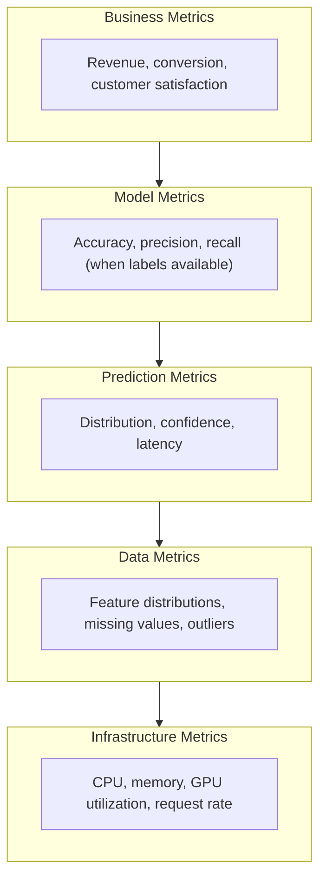

# Metrics, Evaluation, and Monitoring: Ensuring ML Models Actually Work

## The Uncomfortable Truth

Your model achieved 95% accuracy on the test set. The loss curve converged beautifully. The confusion matrix looks balanced. You deploy to production, celebrate briefly, and move on to the next project.

Three months later, customer complaints start appearing. Predictions that made sense in development now seem random. The model that worked so well has silently failed—and nobody noticed until users did.

This scenario is not hypothetical. It is the default outcome for ML systems without proper evaluation and monitoring. The gap between "works in notebook" and "works in production" is vast, and bridging it requires understanding not just what to measure, but when, how, and what to do when the numbers change.

This post covers the complete lifecycle of model evaluation. We start with the fundamentals—choosing metrics that align with your actual goals. We then explore the nuances of proper evaluation: stratification, cross-validation, and the statistical rigor that separates reliable results from noise. Finally, we tackle the challenges of production: detecting drift, monitoring performance, and knowing when to retrain.

This is the knowledge that separates ML projects that launch from ML projects that last.

## Part I: Choosing the Right Metrics

### The Metric Selection Problem

Every ML problem has dozens of potential metrics. Choosing the right ones is not a technical decision—it is a translation of business goals into mathematical objectives.

The first question is not "which metric is best?" but rather "what does failure look like, and how costly is each type?"

Consider fraud detection:
- **False positive**: A legitimate transaction is blocked. Customer is inconvenienced, might call support, might abandon purchase.
- **False negative**: Fraudulent transaction is approved. Direct financial loss, potential chargeback, damaged trust.

These costs are asymmetric. A false negative might cost $500 in direct loss; a false positive might cost $5 in support time. Optimizing for raw accuracy ignores this asymmetry entirely.

### Classification Metrics: The Complete Picture

For classification problems, the confusion matrix is the foundation from which all metrics derive.

```
                    Predicted
                 Positive  Negative
Actual Positive    TP        FN
       Negative    FP        TN
```

From these four values, we derive:

| Metric | Formula | When to Use |
|--------|---------|-------------|
| Accuracy | (TP+TN) / Total | Balanced classes, equal error costs |
| Precision | TP / (TP+FP) | When false positives are costly |
| Recall (Sensitivity) | TP / (TP+FN) | When false negatives are costly |
| Specificity | TN / (TN+FP) | When true negatives matter |
| F1 Score | 2 * (P*R) / (P+R) | Balance between precision and recall |
| F-beta | (1+b^2) * (P*R) / (b^2*P + R) | Weighted balance (b>1 favors recall) |

```python
from sklearn.metrics import (
    accuracy_score, precision_score, recall_score, f1_score,
    confusion_matrix, classification_report
)

def evaluate_classifier(y_true, y_pred, y_prob=None):
    """Comprehensive classification evaluation."""
    
    results = {
        'accuracy': accuracy_score(y_true, y_pred),
        'precision': precision_score(y_true, y_pred, average='weighted'),
        'recall': recall_score(y_true, y_pred, average='weighted'),
        'f1': f1_score(y_true, y_pred, average='weighted'),
    }
    
    # Confusion matrix
    cm = confusion_matrix(y_true, y_pred)
    results['confusion_matrix'] = cm
    
    # Per-class report
    results['classification_report'] = classification_report(
        y_true, y_pred, output_dict=True
    )
    
    # If probabilities available, compute probability-based metrics
    if y_prob is not None:
        from sklearn.metrics import roc_auc_score, average_precision_score, log_loss
        
        # Handle multiclass
        if len(y_prob.shape) > 1 and y_prob.shape[1] > 2:
            results['roc_auc'] = roc_auc_score(y_true, y_prob, multi_class='ovr')
        else:
            prob_positive = y_prob[:, 1] if len(y_prob.shape) > 1 else y_prob
            results['roc_auc'] = roc_auc_score(y_true, prob_positive)
            results['average_precision'] = average_precision_score(y_true, prob_positive)
        
        results['log_loss'] = log_loss(y_true, y_prob)
    
    return results
```

### Beyond Accuracy: Probability Calibration

A classifier might predict "80% probability of fraud" but be wrong 50% of the time at that confidence level. This is a calibration problem.

Well-calibrated probabilities are essential when:
- You need to rank predictions by confidence
- Downstream systems make decisions based on probability thresholds
- You combine predictions from multiple models

```python
from sklearn.calibration import calibration_curve
import numpy as np

def assess_calibration(y_true, y_prob, n_bins=10):
    """Assess probability calibration."""
    
    prob_true, prob_pred = calibration_curve(y_true, y_prob, n_bins=n_bins)
    
    # Expected Calibration Error (ECE)
    bin_sizes = np.histogram(y_prob, bins=n_bins, range=(0, 1))[0]
    bin_sizes = bin_sizes / len(y_prob)
    ece = np.sum(bin_sizes * np.abs(prob_true - prob_pred))
    
    return {
        'ece': ece,
        'prob_true': prob_true,
        'prob_pred': prob_pred,
        'is_well_calibrated': ece < 0.05  # Rule of thumb
    }
```

### Imbalanced Classes: The Silent Killer

In most real-world problems, classes are not balanced. Fraud is rare. Diseases are (hopefully) uncommon. Equipment failures are infrequent. Standard accuracy fails catastrophically here.

Consider a dataset with 99% negative and 1% positive examples. A model that always predicts negative achieves 99% accuracy—and is completely useless.

**Metrics for imbalanced data:**

| Metric | Advantage |
|--------|-----------|
| Precision-Recall AUC | Focuses on positive class, ignores true negatives |
| F1 Score | Balances precision and recall without TN |
| Matthews Correlation Coefficient | Symmetric, uses all four quadrants |
| Cohen's Kappa | Accounts for chance agreement |
| Balanced Accuracy | Average of recall per class |

```python
from sklearn.metrics import (
    precision_recall_curve, auc, 
    matthews_corrcoef, cohen_kappa_score,
    balanced_accuracy_score
)

def imbalanced_metrics(y_true, y_pred, y_prob=None):
    """Metrics specifically for imbalanced classification."""
    
    results = {
        'balanced_accuracy': balanced_accuracy_score(y_true, y_pred),
        'mcc': matthews_corrcoef(y_true, y_pred),
        'cohen_kappa': cohen_kappa_score(y_true, y_pred),
    }
    
    if y_prob is not None:
        precision, recall, _ = precision_recall_curve(y_true, y_prob)
        results['pr_auc'] = auc(recall, precision)
    
    return results
```

### Regression Metrics: Measuring Continuous Error

For regression, the question is not "right or wrong" but "how far off?"

| Metric | Formula | Properties |
|--------|---------|------------|
| MAE | mean(\|y - y_pred\|) | Robust to outliers, interpretable |
| MSE | mean((y - y_pred)^2) | Penalizes large errors more |
| RMSE | sqrt(MSE) | Same units as target |
| MAPE | mean(\|y - y_pred\| / y) * 100 | Percentage error, fails near zero |
| R^2 | 1 - SS_res / SS_tot | Proportion of variance explained |
| Adjusted R^2 | Accounts for number of features | Compare models with different features |

```python
from sklearn.metrics import (
    mean_absolute_error, mean_squared_error, r2_score,
    mean_absolute_percentage_error
)
import numpy as np

def evaluate_regressor(y_true, y_pred):
    """Comprehensive regression evaluation."""
    
    mae = mean_absolute_error(y_true, y_pred)
    mse = mean_squared_error(y_true, y_pred)
    rmse = np.sqrt(mse)
    r2 = r2_score(y_true, y_pred)
    
    # MAPE with protection for zeros
    non_zero_mask = y_true != 0
    if non_zero_mask.sum() > 0:
        mape = mean_absolute_percentage_error(
            y_true[non_zero_mask], y_pred[non_zero_mask]
        )
    else:
        mape = np.inf
    
    # Median absolute error (robust)
    median_ae = np.median(np.abs(y_true - y_pred))
    
    # Error distribution
    errors = y_pred - y_true
    
    return {
        'mae': mae,
        'mse': mse,
        'rmse': rmse,
        'r2': r2,
        'mape': mape,
        'median_ae': median_ae,
        'error_std': errors.std(),
        'error_skew': float(pd.Series(errors).skew()),
    }
```

### Ranking Metrics: When Order Matters

In recommendation systems, search engines, and information retrieval, the ranking of results matters more than individual predictions.

| Metric | What It Measures |
|--------|------------------|
| NDCG@K | Quality of top-K ranking with graded relevance |
| MAP@K | Mean average precision at K |
| MRR | Reciprocal rank of first relevant result |
| Hit Rate@K | Was any relevant item in top K? |
| Precision@K | Precision among top K results |
| Recall@K | Proportion of relevant items in top K |

```python
import numpy as np

def ndcg_at_k(relevances, k):
    """Normalized Discounted Cumulative Gain at K."""
    relevances = np.array(relevances)[:k]
    
    if len(relevances) == 0:
        return 0.0
    
    # DCG
    discounts = np.log2(np.arange(2, len(relevances) + 2))
    dcg = np.sum(relevances / discounts)
    
    # Ideal DCG
    ideal_relevances = np.sort(relevances)[::-1]
    idcg = np.sum(ideal_relevances / discounts)
    
    if idcg == 0:
        return 0.0
    
    return dcg / idcg

def mrr(rankings):
    """Mean Reciprocal Rank."""
    reciprocal_ranks = []
    for ranking in rankings:
        for i, is_relevant in enumerate(ranking, 1):
            if is_relevant:
                reciprocal_ranks.append(1.0 / i)
                break
        else:
            reciprocal_ranks.append(0.0)
    
    return np.mean(reciprocal_ranks)
```

### NLP Metrics: Text Generation and Understanding

Natural Language Processing tasks require specialized metrics.

**For text generation (translation, summarization):**

| Metric | What It Measures | Limitations |
|--------|------------------|-------------|
| BLEU | N-gram overlap with reference | Ignores meaning, favors short outputs |
| ROUGE-L | Longest common subsequence | Surface-level matching |
| METEOR | Includes synonyms and stemming | Still surface-level |
| BERTScore | Semantic similarity via embeddings | Computationally expensive |
| BLEURT | Learned metric trained on human judgments | Requires specific training |

```python
from evaluate import load

# Using Hugging Face evaluate library
bleu = load("bleu")
rouge = load("rouge")
bertscore = load("bertscore")

def evaluate_text_generation(predictions, references):
    """Evaluate text generation quality."""
    
    results = {}
    
    # BLEU
    bleu_result = bleu.compute(
        predictions=predictions, 
        references=[[r] for r in references]
    )
    results['bleu'] = bleu_result['bleu']
    
    # ROUGE
    rouge_result = rouge.compute(
        predictions=predictions, 
        references=references
    )
    results['rouge1'] = rouge_result['rouge1']
    results['rouge2'] = rouge_result['rouge2']
    results['rougeL'] = rouge_result['rougeL']
    
    # BERTScore
    bertscore_result = bertscore.compute(
        predictions=predictions,
        references=references,
        lang="en"
    )
    results['bertscore_f1'] = np.mean(bertscore_result['f1'])
    
    return results
```

### LLM-Specific Metrics: Evaluating the New Paradigm

Large Language Models require new evaluation approaches. Traditional metrics fail to capture reasoning quality, factual accuracy, and instruction following.

**For LLM evaluation:**

| Metric | What It Measures |
|--------|------------------|
| Perplexity | Model confidence (lower is better) |
| MMLU | Multi-task language understanding |
| HellaSwag | Commonsense reasoning |
| TruthfulQA | Factual accuracy |
| HumanEval | Code generation ability |
| MT-Bench | Multi-turn conversation quality |

**For RAG (Retrieval-Augmented Generation) systems:**

| Metric | What It Measures |
|--------|------------------|
| Faithfulness | Does answer use only retrieved context? |
| Answer Relevance | Is the answer relevant to the question? |
| Context Relevance | Are retrieved documents relevant? |
| Context Precision | How precise is the retrieval? |
| Context Recall | Is all needed information retrieved? |

```python
# Using RAGAS for RAG evaluation
from ragas import evaluate
from ragas.metrics import (
    faithfulness,
    answer_relevancy,
    context_precision,
    context_recall
)

def evaluate_rag_system(questions, answers, contexts, ground_truths):
    """Evaluate a RAG system using RAGAS metrics."""
    
    from datasets import Dataset
    
    eval_dataset = Dataset.from_dict({
        "question": questions,
        "answer": answers,
        "contexts": contexts,
        "ground_truth": ground_truths
    })
    
    result = evaluate(
        eval_dataset,
        metrics=[
            faithfulness,
            answer_relevancy,
            context_precision,
            context_recall
        ]
    )
    
    return result
```

### Computer Vision Metrics

Vision tasks have their own specialized metrics.

**Object Detection:**

| Metric | What It Measures |
|--------|------------------|
| IoU (Intersection over Union) | Overlap between predicted and true boxes |
| mAP@0.5 | Mean Average Precision at IoU threshold 0.5 |
| mAP@0.5:0.95 | mAP averaged over IoU thresholds 0.5 to 0.95 |
| AP per class | Average precision for each object class |

**Semantic Segmentation:**

| Metric | What It Measures |
|--------|------------------|
| Pixel Accuracy | Proportion of correctly classified pixels |
| Mean IoU | Average IoU across all classes |
| Dice Coefficient | Similar to F1 for segmentation |
| Boundary IoU | IoU computed only at boundaries |

```python
def compute_iou(box1, box2):
    """Compute IoU between two bounding boxes."""
    # box format: [x1, y1, x2, y2]
    
    x1 = max(box1[0], box2[0])
    y1 = max(box1[1], box2[1])
    x2 = min(box1[2], box2[2])
    y2 = min(box1[3], box2[3])
    
    intersection = max(0, x2 - x1) * max(0, y2 - y1)
    
    area1 = (box1[2] - box1[0]) * (box1[3] - box1[1])
    area2 = (box2[2] - box2[0]) * (box2[3] - box2[1])
    
    union = area1 + area2 - intersection
    
    return intersection / union if union > 0 else 0

def mean_iou_segmentation(pred_masks, true_masks, num_classes):
    """Compute mean IoU for semantic segmentation."""
    ious = []
    
    for cls in range(num_classes):
        pred_cls = pred_masks == cls
        true_cls = true_masks == cls
        
        intersection = np.logical_and(pred_cls, true_cls).sum()
        union = np.logical_or(pred_cls, true_cls).sum()
        
        if union > 0:
            ious.append(intersection / union)
    
    return np.mean(ious) if ious else 0
```

## Part II: Proper Evaluation Methodology

### The Cardinal Sin: Training on Test Data

The most common evaluation mistake is information leakage from test data into training. This happens in subtle ways:
- Feature engineering using statistics from the entire dataset
- Hyperparameter tuning on the test set
- Preprocessing (scaling, encoding) fit on all data
- Feature selection using target information

```python
from sklearn.model_selection import train_test_split
from sklearn.preprocessing import StandardScaler
from sklearn.pipeline import Pipeline

# WRONG: Fit scaler on all data
scaler = StandardScaler()
X_scaled = scaler.fit_transform(X)  # Information leakage!
X_train, X_test = train_test_split(X_scaled, ...)

# RIGHT: Use pipeline or fit only on training data
X_train, X_test, y_train, y_test = train_test_split(X, y, ...)

pipeline = Pipeline([
    ('scaler', StandardScaler()),
    ('model', SomeModel())
])

pipeline.fit(X_train, y_train)  # Scaler fit only on training
score = pipeline.score(X_test, y_test)  # Clean evaluation
```

### The Three-Way Split

For serious ML projects, you need three sets:

| Set | Purpose | Size |
|-----|---------|------|
| Training | Model learning | 60-80% |
| Validation | Hyperparameter tuning, model selection | 10-20% |
| Test | Final, unbiased performance estimate | 10-20% |

The test set should be touched only once—at the very end, after all decisions are made. If you tune based on test performance, you are overfitting to the test set.

```python
from sklearn.model_selection import train_test_split

# Two-stage split
X_temp, X_test, y_temp, y_test = train_test_split(
    X, y, test_size=0.15, random_state=42, stratify=y
)

X_train, X_val, y_train, y_val = train_test_split(
    X_temp, y_temp, test_size=0.18, random_state=42, stratify=y_temp
)

# Result: ~70% train, ~15% val, ~15% test
```

### Cross-Validation: Robust Performance Estimation

When data is limited, cross-validation provides more reliable estimates than a single train-test split.

```python
from sklearn.model_selection import (
    cross_val_score, StratifiedKFold, 
    TimeSeriesSplit, GroupKFold
)

# Standard K-Fold (stratified for classification)
cv = StratifiedKFold(n_splits=5, shuffle=True, random_state=42)
scores = cross_val_score(model, X, y, cv=cv, scoring='f1_weighted')
print(f"F1: {scores.mean():.3f} (+/- {scores.std() * 2:.3f})")

# Time series (no shuffling, respects temporal order)
cv_ts = TimeSeriesSplit(n_splits=5)
scores_ts = cross_val_score(model, X, y, cv=cv_ts, scoring='neg_mean_squared_error')

# Grouped (e.g., same user never in both train and test)
cv_group = GroupKFold(n_splits=5)
scores_group = cross_val_score(model, X, y, cv=cv_group, groups=user_ids)
```

### Statistical Significance: When Is a Difference Real?

If model A scores 0.85 and model B scores 0.87, is B actually better? Maybe. Maybe not.

```python
from scipy import stats
import numpy as np

def compare_models(scores_a, scores_b, alpha=0.05):
    """Compare two models using paired t-test."""
    
    # Paired t-test (same CV folds)
    t_stat, p_value = stats.ttest_rel(scores_a, scores_b)
    
    # Effect size (Cohen's d)
    diff = np.array(scores_b) - np.array(scores_a)
    cohens_d = diff.mean() / diff.std()
    
    return {
        'mean_diff': diff.mean(),
        'p_value': p_value,
        'significant': p_value < alpha,
        'cohens_d': cohens_d,
        'interpretation': interpret_effect_size(cohens_d)
    }

def interpret_effect_size(d):
    d = abs(d)
    if d < 0.2:
        return "negligible"
    elif d < 0.5:
        return "small"
    elif d < 0.8:
        return "medium"
    else:
        return "large"
```

### Stratification and Representation

Your test set must represent production data. This seems obvious but is violated constantly.

**Common stratification failures:**
- Class imbalance not preserved
- Temporal patterns ignored (training on future data)
- Geographic regions missing
- Edge cases underrepresented
- Seasonal variations not captured

```python
from sklearn.model_selection import train_test_split

# Stratify by target (for classification)
X_train, X_test, y_train, y_test = train_test_split(
    X, y, test_size=0.2, stratify=y, random_state=42
)

# For multiple stratification columns, create a combined key
df['strat_key'] = df['region'].astype(str) + '_' + df['category'].astype(str)
train_df, test_df = train_test_split(
    df, test_size=0.2, stratify=df['strat_key']
)
```

## Part III: When Models Fail in Production

### The Drift Problem

Models are trained on historical data but predict on future data. When the future differs from the past, performance degrades. This is drift.

**Types of drift:**

| Type | What Changes | Example |
|------|--------------|---------|
| Data Drift | Input feature distributions | User demographics shift |
| Concept Drift | Relationship between X and y | What "fraud" looks like changes |
| Covariate Shift | P(X) changes, P(y\|X) stays same | New product categories |
| Prior Probability Shift | P(y) changes | Fraud rate increases |
| Label Drift | Target distribution changes | Customer churn rate spikes |

```mermaid
gantt
    title Model Lifecycle and Drift
    dateFormat X
    axisFormat %s
    
    section Training
    Training Data    :done, 0, 1
    
    section Production
    Stable Performance    :active, 1, 2
    Drift Begins          :crit, 2, 3
    Failure Mode          :crit, 3, 4
```



### Detecting Data Drift

Data drift detection compares the distribution of features in production to the training distribution.

**Statistical tests for drift:**

| Test | Best For | Sensitivity |
|------|----------|-------------|
| Kolmogorov-Smirnov | Continuous features | High |
| Chi-Square | Categorical features | Medium |
| Population Stability Index (PSI) | Overall distribution | Low-Medium |
| Jensen-Shannon Divergence | Probability distributions | Medium |
| Wasserstein Distance | Distribution shape | High |

```python
from scipy import stats
import numpy as np

def detect_drift(reference_data, current_data, threshold=0.05):
    """Detect drift using KS test for continuous features."""
    
    results = {}
    
    for column in reference_data.columns:
        ref = reference_data[column].dropna()
        cur = current_data[column].dropna()
        
        if ref.dtype in ['float64', 'int64']:
            # Kolmogorov-Smirnov for continuous
            statistic, p_value = stats.ks_2samp(ref, cur)
            results[column] = {
                'test': 'ks',
                'statistic': statistic,
                'p_value': p_value,
                'drift_detected': p_value < threshold
            }
        else:
            # Chi-square for categorical
            ref_counts = ref.value_counts(normalize=True)
            cur_counts = cur.value_counts(normalize=True)
            
            # Align categories
            all_cats = set(ref_counts.index) | set(cur_counts.index)
            ref_aligned = [ref_counts.get(c, 0) for c in all_cats]
            cur_aligned = [cur_counts.get(c, 0) for c in all_cats]
            
            # Add small epsilon to avoid division by zero
            epsilon = 1e-10
            ref_aligned = np.array(ref_aligned) + epsilon
            cur_aligned = np.array(cur_aligned) + epsilon
            
            statistic, p_value = stats.chisquare(cur_aligned, ref_aligned)
            results[column] = {
                'test': 'chi2',
                'statistic': statistic,
                'p_value': p_value,
                'drift_detected': p_value < threshold
            }
    
    return results

def population_stability_index(expected, actual, bins=10):
    """Calculate PSI for a single feature."""
    
    # Create bins from expected distribution
    breakpoints = np.percentile(expected, np.linspace(0, 100, bins + 1))
    breakpoints[0] = -np.inf
    breakpoints[-1] = np.inf
    
    expected_counts = np.histogram(expected, breakpoints)[0]
    actual_counts = np.histogram(actual, breakpoints)[0]
    
    # Convert to proportions
    expected_props = expected_counts / len(expected)
    actual_props = actual_counts / len(actual)
    
    # Avoid log(0)
    expected_props = np.clip(expected_props, 1e-10, 1)
    actual_props = np.clip(actual_props, 1e-10, 1)
    
    psi = np.sum((actual_props - expected_props) * np.log(actual_props / expected_props))
    
    return {
        'psi': psi,
        'interpretation': 'no drift' if psi < 0.1 else 'moderate drift' if psi < 0.2 else 'significant drift'
    }
```

### Detecting Concept Drift

Concept drift is harder—the relationship between inputs and outputs changes, but you might not have immediate labels to verify.

**Approaches:**

1. **Monitor prediction distribution**: If predictions shift dramatically, something changed
2. **Track confidence scores**: Dropping confidence suggests model uncertainty
3. **Use proxy labels**: When true labels are delayed, use related signals
4. **Error rate monitoring**: When labels arrive, compare to baseline

```python
def detect_concept_drift_proxy(
    model,
    reference_predictions,
    current_data,
    threshold_std=2.0
):
    """Detect potential concept drift using prediction distribution."""
    
    # Get current predictions
    current_predictions = model.predict_proba(current_data)[:, 1]
    
    # Compare to reference
    ref_mean = reference_predictions.mean()
    ref_std = reference_predictions.std()
    
    cur_mean = current_predictions.mean()
    
    # Z-score of difference
    z_score = abs(cur_mean - ref_mean) / ref_std
    
    return {
        'reference_mean': ref_mean,
        'current_mean': cur_mean,
        'z_score': z_score,
        'drift_detected': z_score > threshold_std,
        'confidence_drop': current_predictions.max(axis=1).mean() < 0.7  # Example threshold
    }
```

### Why Models Degrade Over Time

Understanding the causes helps you anticipate and prevent drift:

| Cause | Example | Prevention |
|-------|---------|------------|
| Changing user behavior | COVID changed shopping patterns | Regular retraining |
| Seasonal variations | Holiday spending | Include seasonal features |
| Competitor actions | New competitor changes market | Monitor external signals |
| Data pipeline bugs | Feature computation changed | Data validation tests |
| Feature deprecation | Third-party API removed | Feature availability monitoring |
| Adversarial adaptation | Fraudsters learn to evade | Continuous model updates |
| Population shift | New user demographics | Stratified monitoring |

## Part IV: Production Monitoring Systems

### What to Monitor

A production ML system requires monitoring at multiple levels:



### Building a Monitoring Pipeline

```python
from dataclasses import dataclass
from datetime import datetime
from typing import Dict, List, Optional
import numpy as np

@dataclass
class PredictionLog:
    timestamp: datetime
    request_id: str
    features: Dict[str, float]
    prediction: float
    confidence: float
    latency_ms: float
    model_version: str

class ModelMonitor:
    def __init__(self, reference_data, alert_config):
        self.reference_data = reference_data
        self.reference_stats = self._compute_stats(reference_data)
        self.alert_config = alert_config
        self.prediction_buffer: List[PredictionLog] = []
    
    def _compute_stats(self, data):
        """Compute reference statistics for each feature."""
        stats = {}
        for col in data.columns:
            if data[col].dtype in ['float64', 'int64']:
                stats[col] = {
                    'mean': data[col].mean(),
                    'std': data[col].std(),
                    'min': data[col].min(),
                    'max': data[col].max(),
                    'quantiles': data[col].quantile([0.01, 0.05, 0.5, 0.95, 0.99]).to_dict()
                }
        return stats
    
    def log_prediction(self, log: PredictionLog):
        """Log a prediction for monitoring."""
        self.prediction_buffer.append(log)
        
        # Check immediate alerts
        alerts = self._check_immediate_alerts(log)
        if alerts:
            self._send_alerts(alerts)
    
    def _check_immediate_alerts(self, log: PredictionLog) -> List[str]:
        """Check for issues that need immediate attention."""
        alerts = []
        
        # Latency alert
        if log.latency_ms > self.alert_config.get('max_latency_ms', 1000):
            alerts.append(f"High latency: {log.latency_ms}ms")
        
        # Confidence alert
        if log.confidence < self.alert_config.get('min_confidence', 0.5):
            alerts.append(f"Low confidence: {log.confidence}")
        
        # Feature range alerts
        for feature, value in log.features.items():
            if feature in self.reference_stats:
                ref = self.reference_stats[feature]
                if value < ref['quantiles'][0.01] or value > ref['quantiles'][0.99]:
                    alerts.append(f"Feature {feature} out of range: {value}")
        
        return alerts
    
    def compute_batch_metrics(self, window_hours=1) -> Dict:
        """Compute metrics over a time window."""
        cutoff = datetime.now() - timedelta(hours=window_hours)
        recent = [p for p in self.prediction_buffer if p.timestamp > cutoff]
        
        if not recent:
            return {}
        
        predictions = [p.prediction for p in recent]
        confidences = [p.confidence for p in recent]
        latencies = [p.latency_ms for p in recent]
        
        return {
            'prediction_mean': np.mean(predictions),
            'prediction_std': np.std(predictions),
            'confidence_mean': np.mean(confidences),
            'confidence_below_threshold': sum(c < 0.5 for c in confidences) / len(confidences),
            'latency_p50': np.percentile(latencies, 50),
            'latency_p95': np.percentile(latencies, 95),
            'latency_p99': np.percentile(latencies, 99),
            'request_count': len(recent),
        }
    
    def _send_alerts(self, alerts: List[str]):
        """Send alerts through configured channels."""
        # Implement: Slack, PagerDuty, email, etc.
        for alert in alerts:
            print(f"ALERT: {alert}")
```

### ML Monitoring Tools

The ecosystem has matured significantly. Key tools in 2025:

| Tool | Focus | Open Source? |
|------|-------|--------------|
| Evidently | Data and model monitoring | Yes |
| NannyML | Performance estimation without labels | Yes |
| Arize | Full observability platform | No (commercial) |
| WhyLabs | Data and model monitoring | No (commercial) |
| Fiddler | Model monitoring and explainability | No (commercial) |
| Seldon Alibi Detect | Drift detection algorithms | Yes |
| Great Expectations | Data validation | Yes |

```python
# Using Evidently for drift detection
from evidently.report import Report
from evidently.metric_preset import DataDriftPreset, TargetDriftPreset

def generate_drift_report(reference_df, current_df, target_column=None):
    """Generate an Evidently drift report."""
    
    report = Report(metrics=[
        DataDriftPreset(),
    ])
    
    report.run(
        reference_data=reference_df,
        current_data=current_df
    )
    
    # Get drift scores
    drift_results = report.as_dict()
    
    return {
        'dataset_drift': drift_results['metrics'][0]['result']['dataset_drift'],
        'drift_share': drift_results['metrics'][0]['result']['drift_share'],
        'drifted_columns': [
            col for col, data in drift_results['metrics'][0]['result']['drift_by_columns'].items()
            if data['drift_detected']
        ]
    }
```

### Setting Up Alerts

Not all drift requires action. Configure thresholds based on business impact:

```python
@dataclass
class AlertConfig:
    # Data drift
    psi_warning: float = 0.1
    psi_critical: float = 0.2
    
    # Prediction distribution
    prediction_mean_shift_std: float = 2.0
    confidence_drop_threshold: float = 0.1
    
    # Performance (when labels available)
    accuracy_drop_threshold: float = 0.05
    f1_drop_threshold: float = 0.05
    
    # Latency
    latency_p99_warning_ms: float = 500
    latency_p99_critical_ms: float = 1000
    
    # Volume
    request_rate_drop_percent: float = 50
    error_rate_threshold: float = 0.01

def evaluate_alerts(metrics: Dict, config: AlertConfig) -> List[Dict]:
    """Evaluate metrics against alert thresholds."""
    alerts = []
    
    if metrics.get('psi', 0) > config.psi_critical:
        alerts.append({
            'level': 'critical',
            'type': 'data_drift',
            'message': f"PSI {metrics['psi']:.3f} exceeds critical threshold"
        })
    elif metrics.get('psi', 0) > config.psi_warning:
        alerts.append({
            'level': 'warning',
            'type': 'data_drift',
            'message': f"PSI {metrics['psi']:.3f} exceeds warning threshold"
        })
    
    if metrics.get('accuracy_drop', 0) > config.accuracy_drop_threshold:
        alerts.append({
            'level': 'critical',
            'type': 'performance',
            'message': f"Accuracy dropped by {metrics['accuracy_drop']:.2%}"
        })
    
    return alerts
```

## Part V: Deployment Strategies for Validation

### Shadow Mode Deployment

Before fully deploying a new model, run it in shadow mode: the old model serves production traffic, but the new model makes predictions that are logged but not served.

```python
class ShadowDeployment:
    def __init__(self, production_model, shadow_model):
        self.production_model = production_model
        self.shadow_model = shadow_model
        self.comparison_logs = []
    
    def predict(self, features):
        """Make prediction with both models, serve only production."""
        
        # Production prediction (served to user)
        prod_pred = self.production_model.predict(features)
        
        # Shadow prediction (logged only)
        shadow_pred = self.shadow_model.predict(features)
        
        # Log comparison
        self.comparison_logs.append({
            'features': features,
            'production_prediction': prod_pred,
            'shadow_prediction': shadow_pred,
            'agreement': prod_pred == shadow_pred
        })
        
        return prod_pred  # Only production is served
    
    def analyze_shadow_performance(self, true_labels):
        """Compare shadow to production when labels are available."""
        
        prod_preds = [log['production_prediction'] for log in self.comparison_logs]
        shadow_preds = [log['shadow_prediction'] for log in self.comparison_logs]
        
        from sklearn.metrics import accuracy_score, f1_score
        
        return {
            'production_accuracy': accuracy_score(true_labels, prod_preds),
            'shadow_accuracy': accuracy_score(true_labels, shadow_preds),
            'agreement_rate': sum(p == s for p, s in zip(prod_preds, shadow_preds)) / len(prod_preds),
            'shadow_improvement': accuracy_score(true_labels, shadow_preds) - accuracy_score(true_labels, prod_preds)
        }
```

### A/B Testing for ML Models

A/B testing provides statistical rigor for model comparison in production.

```python
import numpy as np
from scipy import stats

class ABTest:
    def __init__(self, control_model, treatment_model, traffic_split=0.5):
        self.control = control_model
        self.treatment = treatment_model
        self.traffic_split = traffic_split
        self.control_results = []
        self.treatment_results = []
    
    def assign_variant(self, user_id: str) -> str:
        """Deterministic assignment based on user ID."""
        hash_value = hash(user_id) % 100
        return 'treatment' if hash_value < self.traffic_split * 100 else 'control'
    
    def predict(self, user_id: str, features):
        variant = self.assign_variant(user_id)
        
        if variant == 'treatment':
            pred = self.treatment.predict(features)
        else:
            pred = self.control.predict(features)
        
        return pred, variant
    
    def record_outcome(self, variant: str, outcome: float):
        """Record the outcome (e.g., conversion, revenue)."""
        if variant == 'treatment':
            self.treatment_results.append(outcome)
        else:
            self.control_results.append(outcome)
    
    def analyze(self, metric='conversion'):
        """Analyze A/B test results."""
        
        control = np.array(self.control_results)
        treatment = np.array(self.treatment_results)
        
        # T-test for means
        t_stat, p_value = stats.ttest_ind(treatment, control)
        
        # Effect size
        pooled_std = np.sqrt((control.std()**2 + treatment.std()**2) / 2)
        cohens_d = (treatment.mean() - control.mean()) / pooled_std
        
        # Confidence interval for difference
        se = np.sqrt(control.var()/len(control) + treatment.var()/len(treatment))
        ci_95 = (treatment.mean() - control.mean() - 1.96*se,
                 treatment.mean() - control.mean() + 1.96*se)
        
        return {
            'control_mean': control.mean(),
            'treatment_mean': treatment.mean(),
            'relative_lift': (treatment.mean() - control.mean()) / control.mean(),
            'p_value': p_value,
            'significant': p_value < 0.05,
            'cohens_d': cohens_d,
            'confidence_interval_95': ci_95,
            'sample_size_control': len(control),
            'sample_size_treatment': len(treatment),
        }
```

### Canary Releases

Gradually roll out new models to catch issues before full deployment:

```python
class CanaryRelease:
    def __init__(self, stable_model, canary_model, initial_traffic=0.01):
        self.stable = stable_model
        self.canary = canary_model
        self.canary_traffic = initial_traffic
        self.canary_metrics = {'errors': 0, 'requests': 0, 'latencies': []}
        self.stable_metrics = {'errors': 0, 'requests': 0, 'latencies': []}
    
    def predict(self, features, request_id: str):
        import random
        import time
        
        use_canary = random.random() < self.canary_traffic
        model = self.canary if use_canary else self.stable
        metrics = self.canary_metrics if use_canary else self.stable_metrics
        
        try:
            start = time.time()
            pred = model.predict(features)
            latency = (time.time() - start) * 1000
            
            metrics['requests'] += 1
            metrics['latencies'].append(latency)
            
            return pred, 'canary' if use_canary else 'stable'
        
        except Exception as e:
            metrics['errors'] += 1
            metrics['requests'] += 1
            raise
    
    def should_rollback(self) -> bool:
        """Check if canary should be rolled back."""
        
        if self.canary_metrics['requests'] < 100:
            return False  # Not enough data
        
        canary_error_rate = self.canary_metrics['errors'] / self.canary_metrics['requests']
        stable_error_rate = self.stable_metrics['errors'] / max(1, self.stable_metrics['requests'])
        
        # Rollback if canary error rate is significantly higher
        if canary_error_rate > stable_error_rate + 0.01:  # 1% threshold
            return True
        
        # Check latency
        if self.canary_metrics['latencies']:
            canary_p99 = np.percentile(self.canary_metrics['latencies'], 99)
            stable_p99 = np.percentile(self.stable_metrics['latencies'], 99) if self.stable_metrics['latencies'] else canary_p99
            
            if canary_p99 > stable_p99 * 1.5:  # 50% latency increase
                return True
        
        return False
    
    def increase_traffic(self, increment=0.05):
        """Gradually increase canary traffic if healthy."""
        if not self.should_rollback():
            self.canary_traffic = min(1.0, self.canary_traffic + increment)
```

## Part VI: When to Retrain

### Triggers for Retraining

| Trigger | Detection Method | Urgency |
|---------|------------------|---------|
| Performance drop | Metric monitoring | High |
| Significant data drift | Statistical tests | Medium |
| Concept drift | Performance + drift | High |
| Scheduled | Time-based | Low |
| New features available | Manual/automated | Low |
| Business requirement change | Manual | Varies |

### Retraining Strategies

```python
from enum import Enum
from datetime import datetime, timedelta

class RetrainStrategy(Enum):
    SCHEDULED = "scheduled"  # Fixed intervals
    TRIGGERED = "triggered"  # Based on metrics
    CONTINUOUS = "continuous"  # Streaming updates
    HYBRID = "hybrid"  # Combination

class RetrainController:
    def __init__(
        self,
        strategy: RetrainStrategy,
        scheduled_interval_days: int = 30,
        performance_threshold: float = 0.05,
        drift_threshold: float = 0.2
    ):
        self.strategy = strategy
        self.scheduled_interval = timedelta(days=scheduled_interval_days)
        self.performance_threshold = performance_threshold
        self.drift_threshold = drift_threshold
        self.last_retrain = datetime.now()
        self.baseline_performance = None
    
    def should_retrain(
        self,
        current_performance: float,
        drift_score: float
    ) -> tuple[bool, str]:
        """Determine if retraining is needed."""
        
        reasons = []
        
        # Scheduled check
        if self.strategy in [RetrainStrategy.SCHEDULED, RetrainStrategy.HYBRID]:
            if datetime.now() - self.last_retrain > self.scheduled_interval:
                reasons.append("scheduled_interval_exceeded")
        
        # Performance check
        if self.strategy in [RetrainStrategy.TRIGGERED, RetrainStrategy.HYBRID]:
            if self.baseline_performance is not None:
                perf_drop = self.baseline_performance - current_performance
                if perf_drop > self.performance_threshold:
                    reasons.append(f"performance_drop_{perf_drop:.2%}")
        
        # Drift check
        if self.strategy in [RetrainStrategy.TRIGGERED, RetrainStrategy.HYBRID]:
            if drift_score > self.drift_threshold:
                reasons.append(f"drift_score_{drift_score:.2f}")
        
        return len(reasons) > 0, ", ".join(reasons) if reasons else "none"
```

## Quick Reference: Metrics by Problem Type

### Classification

| Scenario | Primary Metrics | Secondary Metrics |
|----------|-----------------|-------------------|
| Balanced classes | Accuracy, F1 | Precision, Recall |
| Imbalanced | PR-AUC, F1 | MCC, Balanced Accuracy |
| High FP cost | Precision | F1, Accuracy |
| High FN cost | Recall | F1, PR-AUC |
| Probability needed | Log Loss, Brier | Calibration Error |
| Ranking matters | AUC-ROC | PR-AUC |

### Regression

| Scenario | Primary Metrics | Secondary Metrics |
|----------|-----------------|-------------------|
| Standard | RMSE, MAE | R^2 |
| Outliers present | MAE, Median AE | Huber Loss |
| Relative error matters | MAPE | sMAPE |
| Scale varies | R^2, MAPE | Normalized RMSE |

### NLP

| Task | Primary Metrics |
|------|-----------------|
| Classification | F1, Accuracy |
| NER | Span F1, Entity-level F1 |
| Translation | BLEU, COMET |
| Summarization | ROUGE, BERTScore |
| Generation | Perplexity, Human Eval |
| RAG | Faithfulness, Answer Relevancy |

### Computer Vision

| Task | Primary Metrics |
|------|-----------------|
| Classification | Accuracy, Top-5 Accuracy |
| Detection | mAP@0.5, mAP@0.5:0.95 |
| Segmentation | mIoU, Dice |
| Instance Seg | AP, PQ (Panoptic Quality) |

---

## Summary

Evaluation and monitoring are not afterthoughts—they are core infrastructure for ML systems that work in the real world.

The key principles:

1. **Choose metrics that align with business goals**, not just technical convenience
2. **Evaluate rigorously**: proper splits, cross-validation, statistical significance
3. **Monitor everything**: data, predictions, performance, infrastructure
4. **Detect drift before it causes failures**: statistical tests, alerting thresholds
5. **Deploy carefully**: shadow mode, A/B testing, canary releases
6. **Know when to retrain**: triggers, strategies, automation

A model that works today may fail tomorrow. The difference between ML projects that deliver value and those that become liabilities is not the algorithm—it is the infrastructure for knowing whether they work.

Build that infrastructure.

---

## Going Deeper

**Books:**

- Zheng, A. (2015). *Evaluating Machine Learning Models.* O'Reilly (free online). — A concise, practical guide to offline evaluation—train/test splits, cross-validation, statistical testing, and the business alignment of metrics. Short enough to read in an afternoon, valuable enough to reference constantly.

- Kleppmann, M. (2017). *Designing Data-Intensive Applications.* O'Reilly. — Chapters 8 and 11 on distributed systems reliability and stream processing directly apply to building robust model monitoring pipelines.

- Sculley, D., et al. (2015). *Rules of Machine Learning: Best Practices for ML Engineering.* Google. — A 43-rule guide from Google engineers, many of which concern evaluation and monitoring pitfalls. [Free online.](https://developers.google.com/machine-learning/guides/rules-of-ml)

**Videos:**

- ["A Recipe for Training Neural Networks"](https://karpathy.github.io/2019/04/25/recipe/) by Andrej Karpathy — A legendary blog post (with companion talk) detailing how to evaluate what is actually wrong with a model. The most practical debugging framework available for deep learning.

- ["ML Monitoring"](https://www.youtube.com/c/EvidentlyAI) by Evidently AI (YouTube channel) — A series of short, practical videos on drift detection, data quality monitoring, and production metrics. Directly applicable to the tools discussed in this post.

- ["Beyond Accuracy: Behavioral Testing of NLP Models"](https://www.youtube.com/watch?v=VqiTtdY58Ts) by Marco Tulio Ribeiro — The CheckList paper talk. Demonstrates how test suites for linguistic capabilities catch failure modes that aggregate accuracy metrics miss entirely.

**Online Resources:**

- [Evidently AI Documentation](https://docs.evidentlyai.com/) — The most comprehensive open-source monitoring framework. The "reports" documentation shows exactly what drift metrics are available and how to interpret them.
- [NannyML Documentation](https://nannyml.readthedocs.io/) — Specializes in performance estimation without ground truth labels. Their tutorial on CBPE is the clearest explanation of label-free monitoring available.
- [Arize AI Blog](https://arize.com/blog/) — Consistently high-quality writing on production ML observability, embedding drift, and ranking metrics.

**Key Papers:**

- Ribeiro, M.T., Wu, T., Guestrin, C., & Singh, S. (2020). ["Beyond Accuracy: Behavioral Testing of NLP Models with CheckList."](https://arxiv.org/abs/2005.04118) *ACL 2020*. — Introduces the checklist methodology for systematic capability testing. Demonstrates that models scoring 90%+ on benchmarks fail on trivially simple capabilities.

- Rabanser, S., Günnemann, S., & Lipton, Z. (2019). ["Failing Loudly: An Empirical Study of Methods for Detecting Dataset Shift."](https://arxiv.org/abs/1810.11953) *NeurIPS 2019*. — The most thorough empirical comparison of drift detection methods. Reveals which statistical tests work on tabular data and which are fooled by distribution shifts in practice.

- Gama, J., et al. (2014). ["A Survey on Concept Drift Adaptation."](https://arxiv.org/abs/1010.4784) *ACM Computing Surveys*, 46(4). — The canonical survey on concept drift: types, detection algorithms, and adaptation strategies.

**Questions to Explore:**

When is accuracy an honest metric and when is it misleading? How do you design an evaluation framework for a model that makes rare but high-impact mistakes? What is the difference between data drift, concept drift, and model drift—and does that distinction matter for your monitoring strategy?

