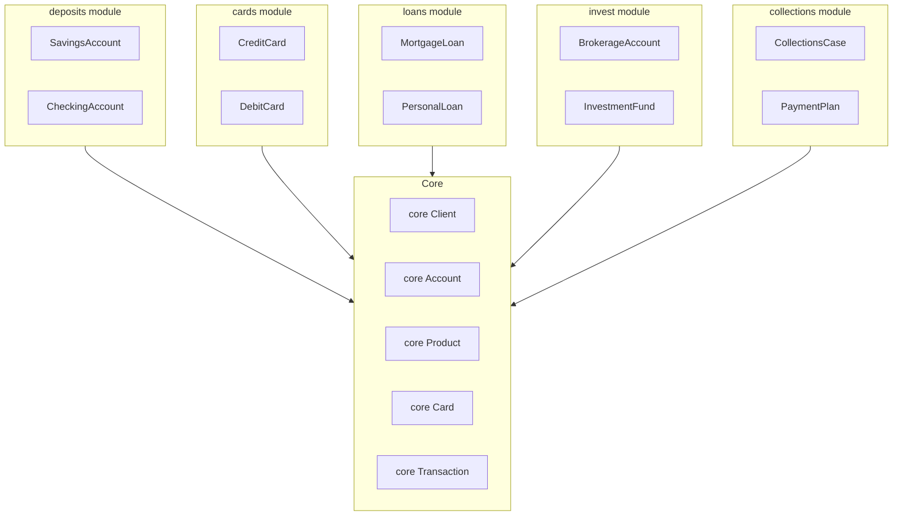
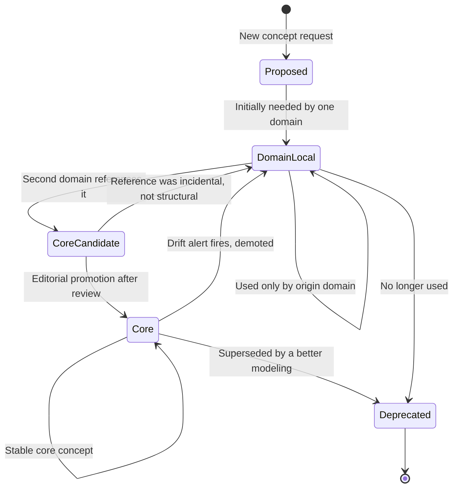
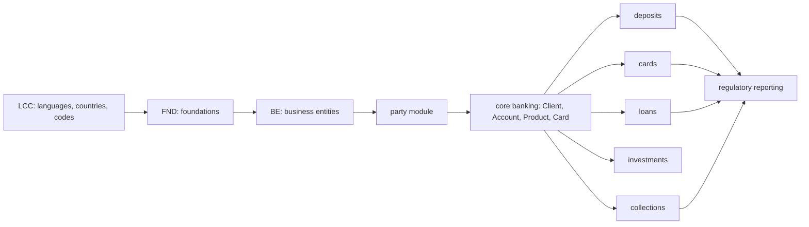
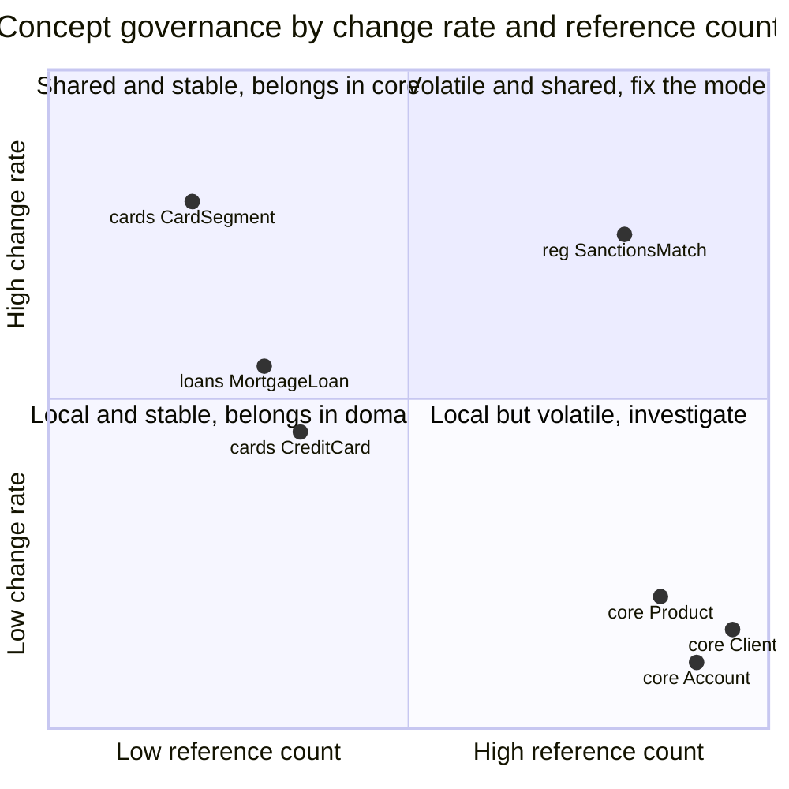

# Modular Ontologies: The Core + Domains Pattern for Enterprise Knowledge Graphs

A bank I worked with last year tried to version-control its enterprise ontology the way a small startup versions a `schema.sql` file. Every concept — `Client`, `Branch`, `MortgageLoan`, `CollectionsCase`, `CreditCard`, `InvestmentFund`, `SanctionsWatchlist`, everything — lived in a single 12,000-line Turtle file called `bank.ttl`. The file was owned, in theory, by the Data Architecture team. In practice it was owned by whoever had opened a pull request most recently.

The mortgage people wanted to add `BalloonPayment`. The cards people wanted to add `DigitalWalletBinding`. The compliance people wanted to retire `SanctionsHit` in favor of `SanctionsMatch` with a different attribute set. Three teams, three pull requests, all against the same file, all sitting in review for weeks because every change touched the same merge-conflict surface. The cards team eventually gave up and started maintaining a parallel `cards-extensions.ttl` in their own repo. The mortgage team did the same. Within two quarters the bank had one official ontology nobody fully trusted and four unofficial ontologies nobody had governance over. The corporate knowledge base agent that was supposed to answer "what products does this client hold?" was quietly pulling from whichever file loaded first.

The failure was not the concepts. The concepts were reasonable. The failure was that nobody had decided, ahead of time, which concepts belonged in the shared core and which belonged in domain modules — and without that decision, every concept drifted toward the center of gravity of whichever team wrote it first.

This post is about the pattern that serious enterprise ontology projects converge to once they hit that wall. It is not a monolith and it is not a federation. It is **Core + Domains**: a small, disciplined core of genuinely cross-cutting concepts, plus a ring of domain modules that import the core and evolve on their own release cadence. FIBO does this. The OBO Foundry does this. Schema.org did this, unlearned it, and is relearning it. The pattern matters because it has operational rules — not just style preferences — and those rules tell you exactly where a new concept should go.

We will ground everything in banking. The author works as a Knowledge Data Engineer at a financial institution, and the examples come from the real design surface: `Client`, `Account`, `Product`, `Branch`, `MortgageLoan`, `CreditCard`, `InvestmentProduct`, `CollectionsCase`. You will leave with a rule of thumb that fits on an index card — *any concept referenced by two or more domain modules belongs in core* — plus two implementations, a reference-counting tool that flags promotion candidates automatically, and a governance alert for when your core is drifting.

## Three Options and Their Trade-offs

Before we can motivate Core + Domains we have to respect the two options it replaces. A real team will have tried at least one of them.

**Option 1: the monolith.** One file, every concept, one release. This is what most ontologies look like on day one, and it is honestly fine when the ontology has forty classes and one author. Grep works. Diffs are readable. There is no import graph to reason about. The problem is that the monolith does not scale along any of the three axes an enterprise hits. It does not scale with concept count (a thousand-class file is unreviewable). It does not scale with team count (merge conflicts are the bottleneck). And it does not scale with release cadence (the mortgage team ships quarterly, the compliance team ships on a regulator's timetable, and they are sharing a file).

**Option 2: the federation of silos.** One file per domain, no shared core. Each team owns its own ontology. `mortgage.ttl`, `cards.ttl`, `investments.ttl`. This is where the first bank landed after giving up on the monolith, and it looks clean for about a month. Then the mortgage team defines `Client` with six attributes. The cards team defines `Client` with nine, three of which overlap. The investments team defines `Customer` (with an `r`) to mean what the other two mean by `Client`. Now you have three incompatible definitions of the most central concept in your business, and every integration point — the RAG system, the customer-360 dashboard, the agent toolbox — has to pick one or translate between all three.

**Option 3: Core + Domains.** One small core file (`core.ttl`) with the concepts every domain needs: `Client`, `Account`, `Product`, `Branch`, `Employee`, `Transaction`, plus the relations that connect them. Each domain module (`mortgage.ttl`, `cards.ttl`, `investments.ttl`, `collections.ttl`) imports the core and adds concepts that are specific to it. `MortgageLoan subClassOf core:Product`. `CreditCard subClassOf core:Product`. The core evolves slowly and carefully; domains evolve at their own pace.

Here is the comparison that belongs on the whiteboard when your team is picking:

| Dimension | Monolith | Federation of silos | Core + Domains |
|---|---|---|---|
| Concept count ceiling | 50–200 | Unlimited per silo, inconsistent across | Core stays small, domains scale independently |
| Review bottleneck | Every PR hits one file | Per-team, no coordination | Core PRs rare and reviewed carefully; domain PRs independent |
| Term duplication | None | High — same concept defined three ways | Near zero — core defines once, domains reuse |
| Reuse across agents | Whatever is in the monolith | Per-silo, fragmented | Core powers shared agents; domain modules power specialist agents |
| Release cadence | Single cadence for all concepts | Each silo independent | Core slow, domains fast |
| Onboarding cost | High — read 12,000 lines | Medium per domain, no shared mental model | Core is the onboarding doc; domains are reference material |
| Governance focus | Everyone on everything | No one on anything | Clear: one body governs core, domain owners govern modules |

The monolith optimises for simplicity at small scale. The federation optimises for team autonomy at the cost of semantic integrity. Core + Domains is the pattern you reach for when both things matter — and in any organisation larger than one team, both things always matter.

## How FIBO Does It

The Financial Industry Business Ontology is the canonical example of Core + Domains in the financial industry. FIBO is the EDM Council's standard, published as OWL, and the 2025 Q4 production release contains roughly 2,400 classes across about 194 ontology files organised into a multi-level directory structure of domains, sub-domains, and modules.

The top-level domains FIBO exposes are stable and small:

- **FND (Foundations).** General-purpose concepts: agents, relationships, utilities, contracts, dates, addresses. Everything else imports from here.
- **BE (Business Entities).** Legal entities, corporations, partnerships, ownership structures — the who of finance.
- **FBC (Financial Business and Commerce).** Markets, products, services — the what.
- **SEC (Securities).** Equities, debt, funds, cash instruments.
- **DER (Derivatives).** Interest rate swaps, options, futures.
- **IND (Indices and Indicators).** Benchmarks, market indices.
- **LOAN (Loans).** Mortgages, commercial loans, retail credit.
- **LCC (Languages, Countries, Codes).** Reference data that every domain needs.

There are more, but the shape is the point. LCC and FND are the ring closest to the sun. Everything imports them. BE and FBC sit in the next orbit and are imported by the instrument-specific domains. SEC, DER, LOAN, IND live on the outside, importing the inner orbits but not each other.

The import graph is not by convention — it is enforced in OWL via `owl:imports` declarations at the top of every ontology file. A LOAN ontology that wants to refer to `be:LegalEntity` has to import the relevant BE file; a BE ontology that wants `fnd:Agreement` has to import the relevant FND file. The IRIs follow a strict pattern:

```
https://spec.edmcouncil.org/fibo/ontology/<Domain>/<Module>/<Ontology>/<Resource>
```

So `fibo-be-le-lp:LegalEntity` lives at `https://spec.edmcouncil.org/fibo/ontology/BE/LegalEntities/LegalPersons/LegalEntity`. The IRI is the module boundary. You cannot refer to a concept without pulling in the module that owns it.

What FIBO decided to put in its core is worth staring at. `Agent`, `Party`, `LegalPerson`, `Agreement`, `Contract`, `Address`, `DatePeriod` — concepts that literally every financial instrument ends up referencing. What FIBO left out of its core is also instructive. `Mortgage`, `CreditCard`, `FutureContract`, `InterestRateSwap` — none of them live in FND or BE. They live in the domain modules that need them.

The rule FIBO is implicitly applying is the one we will make explicit in a moment: *if two or more domains need the concept, promote it to core; otherwise, keep it local.* The work of the FIBO editors is, to a first approximation, enforcing this rule against a constant pressure of domain teams wanting to put their pet concept in FND.

## How OBO Foundry Does It

OBO Foundry is the biomedical analogue, and although the subject matter is different the shape is the same. OBO coordinates hundreds of ontologies — Gene Ontology, Human Phenotype Ontology, Disease Ontology, Chemical Entities of Biological Interest, many more — around a shared set of stewardship principles. The two that matter for modularity are:

**Unique IRIs per term, reused via import.** The OBO Foundry principle is that any ontology reusing a term from another ontology must reuse the original IRI rather than minting a local copy. Concretely, this means if your ontology wants to reference a chemical entity, you use the ChEBI IRI and you import ChEBI via `owl:imports`. You do not copy the concept into your file. This is a modularity discipline dressed up as a naming convention, and it is the mechanism that prevents the federation-of-silos failure from happening.

**A small shared core.** Most OBO ontologies ultimately reuse terms from BFO (the Basic Formal Ontology) or RO (the Relations Ontology). These play the role of FND in FIBO — general-purpose upper-level concepts like continuant, occurrent, participates-in, has-part. Any ontology that wants to make formal statements about biological processes anchors them to the BFO/RO primitives.

The OBO editorial working group publishes principles, reviews candidate ontologies against them, and maintains a dashboard showing which ontologies satisfy which principles. Principle 19, adopted recently, codifies stability of term meaning — a term IRI cannot change its definition without a version bump. This is the governance analogue of semantic versioning for ontologies: core terms are a public contract, and changing them is a breaking change.

The takeaways for any enterprise modeler are three:

1. **IRIs are the module boundary.** Not files, not directories. IRIs. If your core defines `core:Client` and a domain module wants to talk about clients, it references `core:Client` by IRI. It does not redefine it.
2. **Reuse beats redefinition.** The OBO principle "reuse rather than copy" is the single most important discipline for avoiding concept drift across modules.
3. **Governance is explicit.** There is an editorial body. There are principles. There is a dashboard. Modularity without governance degrades into federation-of-silos within a year.

## The Operational Rule

Here is the rule, and it really does fit on an index card:

> **A concept belongs in core if and only if it is referenced by two or more domain modules. Otherwise it belongs in the domain module that references it.**

The symmetric half matters as much as the positive half. If only one domain module references a concept, *it does not belong in core* — even if it feels general. `MortgageAmortizationSchedule` sounds general until you notice that only the LOAN domain ever touches it; it belongs in LOAN, not core. The converse pressure — the one that kills most core ontologies — is teams wanting their concept in core because being in core feels prestigious. The rule is a defence against that.

The reason the rule works is that it is operationally measurable. You can write a script that, given a compiled ontology, counts how many domain modules reference each concept. Concepts referenced by two or more are core candidates. Concepts in core referenced by only one domain are *demotion* candidates — they drifted into core and should be moved out. Let's build that script. A small reference-count tool, using rdflib, that walks the compiled graph:

```python
# reference_counter.py
"""
Count how many distinct domain modules reference each concept.
Output: per-concept table with domain-reference counts and a
promote/demote/ok recommendation.
"""
from collections import defaultdict
from pathlib import Path
from typing import Iterable
import rdflib
from rdflib import RDF, RDFS, OWL, URIRef

MODULE_ANN = URIRef("http://example.org/meta#module")

def load_graph(ttl_files: Iterable[Path]) -> rdflib.Graph:
    g = rdflib.Graph()
    for f in ttl_files:
        g.parse(f, format="turtle")
    return g

def module_of(concept: URIRef, g: rdflib.Graph) -> str | None:
    """Return the module annotation for a concept, if any."""
    for _, _, o in g.triples((concept, MODULE_ANN, None)):
        return str(o)
    return None

def domain_references(g: rdflib.Graph) -> dict[URIRef, set[str]]:
    """
    For each concept, collect the set of DOMAIN modules that reference it
    in any subject or object position outside its own module.
    A 'reference' is any triple where the concept appears and the triple's
    subject belongs to a different module.
    """
    refs: dict[URIRef, set[str]] = defaultdict(set)
    for s, p, o in g:
        if not isinstance(s, URIRef):
            continue
        s_module = module_of(s, g)
        if s_module is None or s_module == "core":
            # Only count references originating from a domain module.
            continue
        for term in (p, o):
            if isinstance(term, URIRef) and term != s:
                refs[term].add(s_module)
    return refs

def recommend(concept: URIRef, home: str, domains: set[str]) -> str:
    n = len(domains)
    if home == "core" and n <= 1:
        return f"DEMOTE: only {n} domain references — move out of core"
    if home != "core" and n >= 2:
        return f"PROMOTE: {n} domain references — move to core"
    return "OK"

if __name__ == "__main__":
    import sys
    g = load_graph(Path(p) for p in sys.argv[1:])
    refs = domain_references(g)
    rows = []
    for concept in set(g.subjects(RDF.type, OWL.Class)):
        home = module_of(concept, g) or "unknown"
        domains = refs.get(concept, set())
        rows.append((str(concept), home, len(domains), recommend(concept, home, domains)))
    rows.sort(key=lambda r: (r[3] != "OK", -r[2]))
    print(f"{'concept':<60} {'home':<12} {'refs':<5} recommendation")
    for concept, home, n, rec in rows[:50]:
        print(f"{concept:<60} {home:<12} {n:<5} {rec}")
```

Run this against your compiled ontology in CI. The output is a promotion/demotion worklist. Concepts that show up as PROMOTE are candidates for core; concepts that show up as DEMOTE in core are probably living in the wrong place. The review is still a human decision — the rule is a heuristic, not a mandate — but the tool tells you where to focus.

At the first bank this post opened with, the first run of a tool like this surfaced seven concepts that were clearly domain-specific plus two — `ProductFee` and `CustomerConsent` — that were nominally domain-scoped but referenced by four modules each. Moving those out and in, respectively, was the day the ontology started feeling like a ring rather than a blob.

## Bridge Entities: The Hard Cases

Not every concept is a clean core-or-domain decision. Some concepts genuinely sit at the boundary. Banking has three that I see argued over in every project:

**`Account`.** Is an account a core concept or a domain concept? It is referenced by savings products (a `SavingsAccount` is-a `Account`), loan products (a `LoanAccount` tracks a loan's principal and payments), card products (a `CardAccount` backs a credit card's balance), investment products (a `BrokerageAccount`). The rule says: referenced by four domains, promote to core. But the *subclasses* are domain-specific — `SavingsAccount` belongs to the retail-deposits domain, `LoanAccount` to LOAN, `CardAccount` to cards. The resolution is that `core:Account` is the abstract parent, and each domain owns its subclass. This is exactly how FIBO handles the analogue with `Contract`: the abstract is in FND, the specialisations live in the domain that cares.

**`Client`.** Same story with a wrinkle. The concept is unambiguously core — every domain references it. But `Client` is also where the most regulatory metadata accumulates (KYC attributes, PEP flags, sanctions status, tax residency). Some of that metadata is cross-cutting (every domain cares whether a client is on a sanctions list). Some is domain-specific (whether a client has opted into marketing is a retail concern, not a corporate-banking one). The way FIBO resolves this is to split the concept along the attribute axis: `core:Client` has the identifying attributes and the universal ones, and domain extensions attach domain-specific data properties via separate ontology files. The concept is in core; the specialised attribute sets are in the domains.

**`Card`.** This one looks obviously like a cards-domain concept until you notice the corporate-banking team issues purchasing cards and the wealth-management team issues platinum cards tied to investment accounts. Once three domains touch `Card`, it promotes. The subclasses — `CreditCard`, `DebitCard`, `PurchasingCard`, `VirtualCard` — stay in their respective domains.

The worked example, in a YAML-augmented Turtle:

```turtle
# core.ttl
@prefix core: <http://example.org/bank/core#> .
@prefix meta: <http://example.org/meta#> .
@prefix owl:  <http://www.w3.org/2002/07/owl#> .
@prefix rdfs: <http://www.w3.org/2000/01/rdf-schema#> .

core:Client a owl:Class ;
    rdfs:label "Client" ;
    rdfs:comment "Any natural or legal person with a banking relationship." ;
    meta:module "core" .

core:Account a owl:Class ;
    rdfs:label "Account" ;
    rdfs:comment "Ledger of movements under a product, owned by a client." ;
    meta:module "core" .

core:Product a owl:Class ;
    rdfs:label "Product" ;
    rdfs:comment "A financial offering of the bank." ;
    meta:module "core" .

core:Card a owl:Class ;
    rdfs:subClassOf core:Product ;
    meta:module "core" .

core:holds a owl:ObjectProperty ;
    rdfs:domain core:Client ;
    rdfs:range  core:Account ;
    meta:module "core" .
```

```turtle
# cards.ttl
@prefix core:  <http://example.org/bank/core#> .
@prefix cards: <http://example.org/bank/cards#> .
@prefix meta:  <http://example.org/meta#> .
@prefix owl:   <http://www.w3.org/2002/07/owl#> .
@prefix rdfs:  <http://www.w3.org/2000/01/rdf-schema#> .

<http://example.org/bank/cards> a owl:Ontology ;
    owl:imports <http://example.org/bank/core> .

cards:CreditCard a owl:Class ;
    rdfs:subClassOf core:Card ;
    meta:module "cards" .

cards:DebitCard a owl:Class ;
    rdfs:subClassOf core:Card ;
    meta:module "cards" .

cards:hasCreditLimit a owl:DatatypeProperty ;
    rdfs:domain cards:CreditCard ;
    rdfs:range  xsd:decimal ;
    meta:module "cards" .
```

Three things to notice. First, the `meta:module` annotation makes the module membership explicit at the concept level — the reference-counter script reads it. Second, the `owl:imports` declaration pulls the core ontology into the cards ontology so that `core:Card` is a resolvable IRI, not a dangling reference. Third, every domain concept is either a specialisation of something in core (`cards:CreditCard subClassOf core:Card`) or has its domain in a core concept (`cards:hasCreditLimit` has `cards:CreditCard` as domain, which is ultimately a `core:Product`). The domain module sits on top of the core; it never duplicates it.

## Two Implementations

There are two practical ways to implement Core + Domains. Both work. They trade off differently on author ergonomics versus strictness.

### Implementation A: `owl:imports` with IRIs

This is the FIBO and OBO approach. Each module is a standalone ontology file with its own IRI. Domain modules declare `owl:imports` for the modules they depend on. A loader pulls everything together:

```python
# load_with_imports.py
"""
Load an enterprise ontology composed of a core module and one or more
domain modules, resolving owl:imports recursively. Uses rdflib.
"""
from pathlib import Path
import rdflib
from rdflib import OWL, URIRef

# A mapping from ontology IRI to local file location. In production this
# would typically be an HTTP resolver or a content-addressable store.
IRI_TO_FILE = {
    "http://example.org/bank/core":     Path("core.ttl"),
    "http://example.org/bank/cards":    Path("cards.ttl"),
    "http://example.org/bank/loans":    Path("loans.ttl"),
    "http://example.org/bank/deposits": Path("deposits.ttl"),
    "http://example.org/bank/invest":   Path("invest.ttl"),
}

def load_with_imports(root_iri: str) -> rdflib.Graph:
    """Load the ontology at root_iri and transitively all its imports."""
    merged = rdflib.Graph()
    visited: set[str] = set()
    frontier: list[str] = [root_iri]

    while frontier:
        iri = frontier.pop()
        if iri in visited:
            continue
        visited.add(iri)
        path = IRI_TO_FILE.get(iri)
        if path is None:
            raise ValueError(f"No local file registered for {iri}")
        g = rdflib.Graph().parse(path, format="turtle")
        for _, _, imported in g.triples((URIRef(iri), OWL.imports, None)):
            frontier.append(str(imported))
        merged += g

    return merged

if __name__ == "__main__":
    g = load_with_imports("http://example.org/bank/cards")
    print(f"Loaded {len(g)} triples from cards + transitive imports")
    # A simple consistency check: every subject declared in cards should
    # either be in the cards namespace or be a core concept we imported.
    for s in set(g.subjects()):
        if isinstance(s, URIRef) and "bank/cards" in str(s):
            # Cards-namespace subjects are fine as-is.
            continue
```

The strengths of this approach: IRIs are the module boundary, which matches what OWL tooling expects. Protege, rdflib, OWL API reasoners all understand `owl:imports`. Tools like the HermiT reasoner can do incremental reasoning when only one module has changed. The weakness is that authors have to maintain the IRIs by hand and keep the imports graph acyclic — and writing raw Turtle is not everyone's idea of a good Monday.

### Implementation B: YAML + `meta:module` + compile step

A lighter variant, which I have seen work well in smaller teams, is to author the ontology in a single YAML file (or a few YAML files by logical area) where every concept has a `module` annotation, then run a build step that emits per-module Turtle. Authors never write `owl:imports` by hand; the compiler does it.

```yaml
# bank.ontology.yaml
concepts:
  Client:
    module: core
    label: "Client"
    comment: "Any natural or legal person with a banking relationship."
  Account:
    module: core
    parent: Thing
  Product:
    module: core
  Card:
    module: core
    parent: Product
  CreditCard:
    module: cards
    parent: Card
  DebitCard:
    module: cards
    parent: Card
  MortgageLoan:
    module: loans
    parent: Product
  SavingsAccount:
    module: deposits
    parent: Account

properties:
  holds:
    module: core
    domain: Client
    range: Account
  hasCreditLimit:
    module: cards
    domain: CreditCard
    range: decimal
  hasPrincipal:
    module: loans
    domain: MortgageLoan
    range: decimal
```

The compile step reads this, groups by module, and emits one Turtle file per module with the right `owl:imports`:

```python
# compile_modules.py
"""
Read a single-file YAML ontology where every concept and property has a
`module` annotation. Emit one Turtle file per module, adding owl:imports
declarations for the modules a concept's parents or property ranges
depend on.
"""
from collections import defaultdict
from pathlib import Path
import yaml

BASE = "http://example.org/bank"

def detect_dependencies(module: str, concepts: dict, properties: dict,
                        home: dict) -> set[str]:
    deps: set[str] = set()
    for name, spec in concepts.items():
        if spec.get("module") != module:
            continue
        parent = spec.get("parent")
        if parent and parent in home and home[parent] != module:
            deps.add(home[parent])
    for name, spec in properties.items():
        if spec.get("module") != module:
            continue
        for slot in ("domain", "range"):
            target = spec.get(slot)
            if target in home and home[target] != module:
                deps.add(home[target])
    return deps

def emit_turtle(module: str, concepts: dict, properties: dict,
                home: dict, out_dir: Path) -> Path:
    deps = detect_dependencies(module, concepts, properties, home)
    lines: list[str] = []
    lines.append(f"@prefix {module}: <{BASE}/{module}#> .")
    lines.append("@prefix core:  <" + BASE + "/core#> .")
    lines.append("@prefix meta:  <http://example.org/meta#> .")
    lines.append("@prefix owl:   <http://www.w3.org/2002/07/owl#> .")
    lines.append("@prefix rdfs:  <http://www.w3.org/2000/01/rdf-schema#> .")
    lines.append("")
    lines.append(f"<{BASE}/{module}> a owl:Ontology ;")
    imports = [f"    owl:imports <{BASE}/{dep}>" for dep in sorted(deps)]
    if imports:
        lines.append(" ;\n".join(imports) + " .")
    else:
        lines.append("    .")
    lines.append("")
    for name, spec in concepts.items():
        if spec.get("module") != module:
            continue
        parent = spec.get("parent")
        parent_iri = ("core:" + parent if parent in home and home[parent] == "core"
                      else f"{home.get(parent, module)}:{parent}") if parent else None
        lines.append(f"{module}:{name} a owl:Class ;")
        if parent_iri:
            lines.append(f"    rdfs:subClassOf {parent_iri} ;")
        if spec.get("label"):
            lines.append(f'    rdfs:label "{spec["label"]}" ;')
        lines.append(f'    meta:module "{module}" .')
        lines.append("")
    out = out_dir / f"{module}.ttl"
    out.write_text("\n".join(lines), encoding="utf-8")
    return out

def compile_ontology(yaml_path: Path, out_dir: Path) -> list[Path]:
    raw = yaml.safe_load(yaml_path.read_text(encoding="utf-8"))
    concepts, properties = raw["concepts"], raw["properties"]
    home = {n: s["module"] for n, s in concepts.items()}
    home.update({n: s["module"] for n, s in properties.items()})
    modules = set(home.values())
    out_dir.mkdir(parents=True, exist_ok=True)
    return [emit_turtle(m, concepts, properties, home, out_dir) for m in sorted(modules)]

if __name__ == "__main__":
    import sys
    outputs = compile_ontology(Path(sys.argv[1]), Path(sys.argv[2]))
    for p in outputs:
        print(p)
```

This approach trades OWL-native tooling for author ergonomics. Reviewers diff the YAML, not the generated Turtle. The compile step is deterministic, so the generated files go in CI artifacts rather than source control. The weakness is that you have opted out of the OWL-tool ecosystem at authoring time — Protege does not edit your YAML, HermiT does not reason over it, and you have to trust your compiler. For many enterprise teams that is a reasonable trade, especially when the ontology is still growing and clarity of the source-of-truth matters more than reasoner friendliness.

Most teams I have worked with end up doing a hybrid: author in YAML, compile to per-module Turtle, commit both, and have CI verify the compiled Turtle against the generated files on every pull request so the authored source stays canonical.

## The Topology

Here is what the Core + Domains topology looks like for the banking ontology we have been building. The core is in the middle; the domain modules orbit it; domains do not import each other, only the core:



The picture is deliberately spare. Every arrow is an `owl:imports` edge. There is no horizontal arrow between domain modules. When collections needs to reference a mortgage (to open a case on a delinquent loan), it does so through the core: `collections:CollectionsCase` has an `appliesToAccount` relation whose range is `core:Account`, and the specific `LoanAccount` subclass is resolved at instance time. This is the discipline that keeps the dependency graph acyclic and the modules independently releasable.

## How Concepts Migrate Over Time

A concept is not born in its final location. It migrates. Any real ontology goes through the following lifecycle for every non-trivial concept:



The transitions that matter in practice are the two middle ones. `DomainLocal` to `CoreCandidate` happens automatically — the reference counter flags it. `CoreCandidate` to `Core` happens through human review: the editorial body looks at the reference pattern, decides whether the second domain's use is structural or incidental (a one-off join versus a genuine need), and promotes. The reverse transition, `Core` to `DomainLocal`, is less common but happens when a concept that looked general turns out to be domain-specific once the domain it "belongs to" matures enough to notice. The demotion is rare, but when it fires it is almost always correct.

## A Real Banking Dependency Graph

The abstract topology above is cleaner than any real project. Here is what the dependency graph looked like in the bank whose story opened this post, after eighteen months of Core + Domains:



Three observations. First, there are two rings of "core-ness": LCC/FND are the absolute core, and the bank-specific core sits one ring out. That is fine — you will almost always end up with a layered core. Second, the regulatory-reporting module imports multiple domain modules. This is the one place horizontal edges between domains are acceptable: a reporting module that explicitly exists to aggregate across domains. Keep it to one such module and name it honestly. Third, collections imports core but not cards or loans directly — it refers to `core:Account` and uses polymorphism. This discipline keeps the graph a tree-with-one-aggregator rather than a full mesh.

## The 70% Stability Ratio

There is one governance alert that is worth wiring up from day one, because when it fires it tells you something important. Call it the 70% stability ratio: over any rolling year, the core should keep at least 70% of its concepts unchanged. If more than 30% of core concepts are either added, removed, or have their attributes or superclass changed, the line between core and domains is wrong — probably because concepts that are really domain-specific have been smuggled into core.

The alert is easy to compute. Compare the set of core concept IRIs and their key attributes at time T-1year and time T. Count the ones that are still there and unchanged. Divide by the total at T-1year. If the ratio is below 0.7, open a review ticket.

The threshold is not magic. It is a calibration choice: too lax and you miss real drift; too strict and you block legitimate evolution. 70% works because the core of a mature enterprise ontology should be genuinely slow-moving — the concepts that deserve to be in core are the ones whose definitions are stable across business-cycle timescales. If `Client` is changing every six months, the problem is not that `Client` is volatile; the problem is that you are putting client-segmentation attributes (which *are* volatile) into the `Client` definition rather than into a retail-segmentation module that has `Client` as a dependency.

A reasonable quadrant to visualise the governance surface:



The top-right quadrant is where emergencies live. `SanctionsMatch` in the example is referenced widely (every transactional module has to check it) but also changes often (regulators keep revising). A concept in that quadrant is the hardest kind of modeling problem: the answer is not "promote to core" and not "leave in a domain" but usually "split into a stable core concept and a volatile extension module." The change rate is the signal that tells you the concept has two different things jammed together.

## Tying This to Agent Tooling

The payoff for doing Core + Domains right shows up when the ontology starts driving agent tooling. A previous post on this blog, [From Ontology to Agent Toolbox](https://juanlara18.github.io/portfolio/#/blog/ontology-to-agent-toolbox), walked through how every class and relation in an ontology becomes a typed tool for an LLM agent. Core + Domains makes that mapping substantially cleaner:

- **The core ontology's concept names become stable tool IDs.** `search_client`, `get_account`, `lookup_product` are tools that span every agent in the organisation, because `Client`, `Account`, and `Product` are in the core and never change their IRIs. Tools built on core concepts have long lives.
- **Domain modules map to specialist agent toolboxes.** A cards-specialist agent loads the core tools plus the cards-module tools (`list_card_perks`, `get_credit_limit`). A loans-specialist agent loads the core tools plus the loans-module tools. The agent registry becomes a module-aware composition rather than a monolithic tool list.
- **Loading only the modules an agent needs keeps the tool surface small.** Every tool in the system prompt is a candidate the model has to consider; past twelve or fifteen entries, smaller models start picking the wrong one. Core + Domains gives you a principled way to deliver a ten-tool surface for a customer-support agent and a twenty-tool surface for an internal analyst, while keeping both agents speaking the same underlying ontology.

This is the payoff. The modular ontology is not just a documentation artifact for humans. It is the substrate every downstream capability composes on, and modularity at the ontology layer becomes modularity at the agent layer.

## Prerequisites

Before you commit to Core + Domains on a real ontology:

- **Pick your implementation and commit to it.** Mixed-mode is painful. Either author in Turtle with `owl:imports`, or author in YAML and generate Turtle. Do not do both.
- **Name your editorial body.** Core changes need two reviewers, one of whom is not the author. Domain changes need one reviewer, typically the domain owner. Put this in CODEOWNERS the day you split the monolith, not the year after.
- **Version the core on its own cadence.** Semantic-versioning the core is non-negotiable. Domain modules depend on specific major versions of core. A breaking change to core is a major bump; an addition is minor; a clarification is patch.
- **Have a reference-count CI job.** Run the reference counter on every pull request. Post the diff: which concepts changed reference counts, which crossed the promote/demote threshold.
- **Have a stability-ratio alert.** Compute the 70% ratio nightly, alert when it drops below.

## Gotchas

A few traps I or colleagues have personally fallen into:

- **The "everything is general" drift.** Teams want their concept in core because core is where the interesting work feels like it happens. Push back. Core is where *cross-cutting* work happens. Domain-specific work in core is pollution.
- **Circular imports.** Cards needs a concept from loans? Loans needs a concept from cards? Stop. One of them belongs in core, or there is a third module that belongs between them. Never let two domains import each other.
- **Bridge concepts without a home.** `ClientFeedback` — is it core? customer experience? retail? Having a concept with no clear home is a signal that your module taxonomy is wrong. Add a module or merge two, but do not leave it orphaned; orphaned concepts reliably end up duplicated in three places six months later.
- **Imports that happen at runtime but not at build time.** If you use `owl:imports` in production but do not validate the import graph in CI, you will discover a circular dependency when the reasoner crashes on an instance you needed to classify. Validate always.
- **Module boundaries that do not match team boundaries.** If the loans team owns loans and the cards team owns cards but a single third team owns both `core:Product` and `core:Card`, that is fine — as long as the third team's remit is explicitly "the core." If instead everyone is editing core, core is just a new monolith with smaller fonts.

## Testing

Three layers, all boring, all required.

**Module-level unit tests.** For each module, load it with its imports and assert expected classes exist. These are fast and catch accidental concept renames:

```python
def test_cards_module_loads_and_has_creditcard():
    g = load_with_imports("http://example.org/bank/cards")
    credit_card = URIRef("http://example.org/bank/cards#CreditCard")
    assert (credit_card, RDF.type, OWL.Class) in g
    # CreditCard must be a subclass of core:Card.
    card = URIRef("http://example.org/bank/core#Card")
    assert (credit_card, RDFS.subClassOf, card) in g
```

**Reference-count golden tests.** For each concept, assert a minimum or maximum number of referencing modules. A concept in core that drops below two domain references should fail the test; a concept in a domain that exceeds one domain reference should fail the test.

**Dependency-graph acyclicity test.** Compute the module import graph from the compiled ontology and assert it is a DAG. Use NetworkX or a hand-written DFS. This catches circular imports before they reach production. It is one function and thirty lines, and I have seen it save a team twice.

## Going Deeper

**Books:**

- Allemang, D., Hendler, J., & Gandon, F. (2020). *Semantic Web for the Working Ontologist* (3rd ed.). ACM Books.
  - The canonical treatment of RDF, RDFS, and OWL with a modeling-first orientation. The chapters on inference and OWL constructs are where the reasoning capabilities this post takes for granted are explained from first principles.

- Stuckenschmidt, H., Parent, C., & Spaccapietra, S. (eds.) (2009). *Modular Ontologies: Concepts, Theories and Techniques for Knowledge Modularization.* Springer LNCS 5445.
  - The survey volume on modular ontology theory. Part I analyzes properties and criteria for modularization; Part II covers techniques for extracting modules from larger ontologies; Part III treats collaborative linking. The academic grounding for why Core + Domains works.

- Hogan, A., Blomqvist, E., Cochez, M., et al. (2021). *Knowledge Graphs.* Morgan & Claypool (also on arXiv).
  - Survey-shaped, practical, and covers the interplay between ontologies, knowledge graphs, and machine learning. Particularly useful for understanding how modularity interacts with the query and reasoning layers.

- Kendall, E. F., & McGuinness, D. L. (2019). *Ontology Engineering.* Morgan & Claypool.
  - Shorter than Allemang, more applied than Stuckenschmidt. Good on the pragmatics of ontology projects in regulated industries.

**Online Resources:**

- [FIBO specification homepage](https://spec.edmcouncil.org/fibo/) — The canonical FIBO reference. The module diagram and the per-domain ontology catalogs are the best worked example of Core + Domains in finance.

- [FIBO GitHub repository](https://github.com/edmcouncil/fibo) — Source of truth for the FIBO ontology files, including the `ONTOLOGY_GUIDE.md` that spells out naming conventions and import patterns.

- [OBO Foundry principles](https://obofoundry.org/principles/fp-000-summary.html) — The stewardship principles that govern OBO ontology modularity, including the reuse-by-IRI discipline discussed in this post.

- [Schema.org extension documentation](https://schema.org/docs/extension.html) — Official documentation for hosted and external extensions to Schema.org, a useful counterpoint to FIBO's more structured modularity.

- [Protege short courses and tutorials](https://protege.stanford.edu/short-courses.php) — Stanford's official training resources for Protege, the de facto OWL editor. Covers modular imports and ontology development workflow.

**Videos:**

- [Tool Use with Claude](https://www.youtube.com/watch?v=CEmiZbw05ZA) by Anthropic — Walks through the tool schema and multi-turn tool loops that the "ontology as agent blueprint" perspective ultimately targets.

- [Building GraphRAG Apps with Neo4j](https://www.youtube.com/watch?v=knDDGYHnnSI) by Neo4j — Practical GraphRAG patterns where a modular ontology powers the retriever layer. Shows how ontology structure maps to queryable shapes in production.

**Academic Papers:**

- Gruber, T. R. (1993). ["A Translation Approach to Portable Ontology Specifications."](https://doi.org/10.1006/knac.1993.1008) *Knowledge Acquisition*, 5(2), 199–220.
  - The foundational paper. Contains the famous definition of an ontology as "a specification of a conceptualization." Worth reading for anyone designing one, even thirty-plus years later — the core insight about portability across representation systems is exactly the modern case for modular ontologies.

- Shimizu, C., Hirt, Q., & Hitzler, P. (2019). ["MODL: A Modular Ontology Design Library."](https://arxiv.org/abs/1904.05405) arXiv:1904.05405.
  - A curated collection of ontology design patterns with a modular-composition flavor. The complement to the theoretical Stuckenschmidt volume: what patterns actually work when you compose a domain ontology from smaller pieces.

- Smith, B., Ashburner, M., Rosse, C., et al. (2007). ["The OBO Foundry: coordinated evolution of ontologies to support biomedical data integration."](https://doi.org/10.1038/nbt1346) *Nature Biotechnology*, 25(11), 1251–1255.
  - The paper that introduced the OBO Foundry coordination model. Specifically addresses how modular ontologies from independent teams can remain interoperable through shared stewardship and IRI reuse.

**Questions to Explore:**

- If you inherit a monolithic ontology with a thousand classes, what is the minimum-viable first cut into Core + Domains? Can you do it without reasoning about every concept, or do you have to read the whole file first?

- The "two or more domains" rule is a heuristic. What would a principled promotion criterion look like that accounted for *how* domains reference a concept — passing reference versus structural dependency?

- In a multi-tenant enterprise (a bank with wholly separate subsidiaries, say), should each subsidiary have its own core, or should there be a group-level meta-core that all subsidiary cores import?

- How does Core + Domains interact with data contracts? If every core concept is a data contract across all domains, is the core a semantic boundary or a data-platform boundary or both?

- When the core ontology itself needs to evolve (a new `core:Party` replaces `core:Client`), what is the migration pattern that lets domain modules upgrade at their own pace rather than as a big-bang release?
