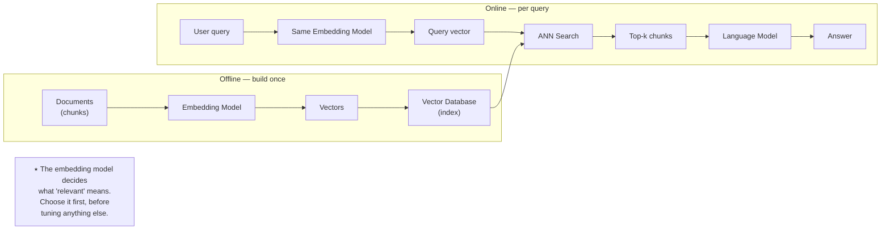
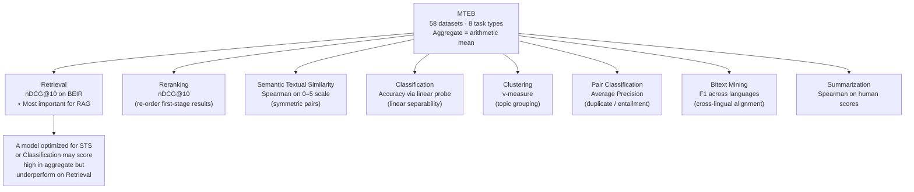
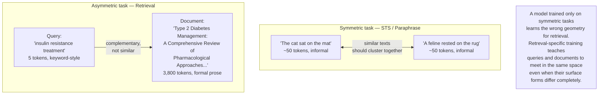
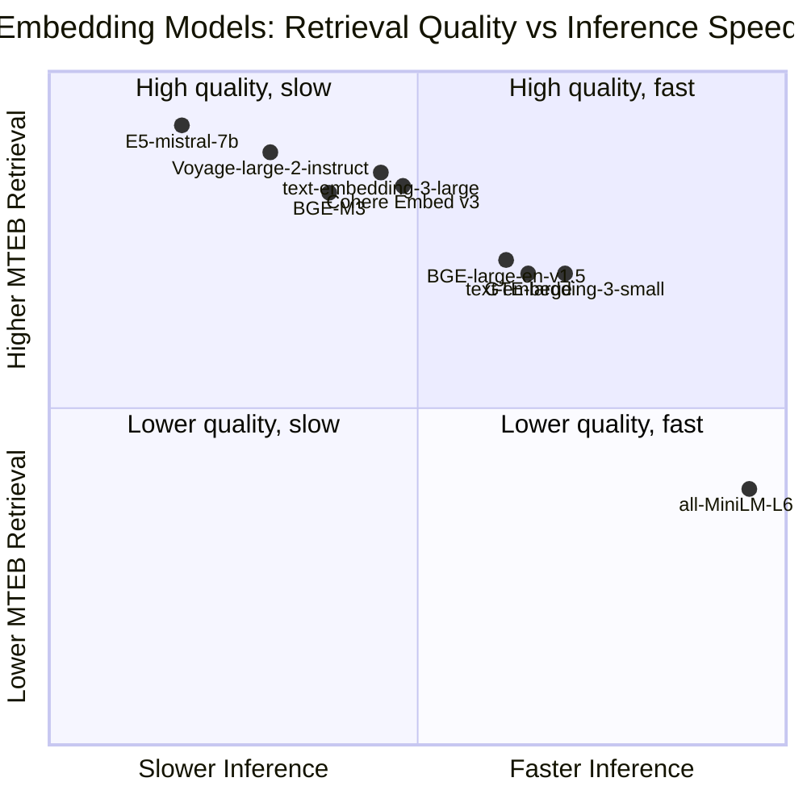
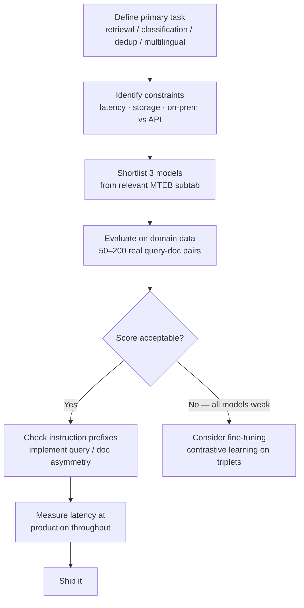

# MTEB: Choosing the Right Embedding Model for Your Task

Every RAG system begins with the same decision: which embedding model encodes your documents. Get it right and your retrieval is sharp, context-aware, and fast to iterate on. Get it wrong and no amount of tuning your vector database, your chunking strategy, or your generation prompt will fix a retrieval layer that cannot find the right documents.

The decision is harder than it appears. The embedding model landscape has dozens of serious options — OpenAI's text-embedding series, Cohere Embed, models from the E5 family, BGE, GTE, Nomic Embed, Voyage AI, and a growing list of open-weight alternatives. Each has a leaderboard page, a blog post claiming strong results, and a marketing chart positioned to imply superiority.

There is one benchmark that attempts to cut through this: the **Massive Text Embedding Benchmark**, known as MTEB. It is the closest thing to a standard in embedding model evaluation, and like all standards, it is genuinely useful and genuinely incomplete. Understanding what it measures — and what it deliberately does not — is the difference between choosing the right model and choosing the most-marketed one.

This post is the third in the [Benchmarks series](./vector-db-benchmarks). It assumes you are building production systems that use embeddings for retrieval, and that you want to understand the evaluation, not just the leaderboard position.

---

## What Embeddings Are Actually Being Asked to Do

Before examining any benchmark, it helps to be precise about what an embedding model's job is in production.

The [embeddings post](../research/embeddings-geometry-of-meaning) in this blog covers the mathematical foundations — from Word2Vec's discovery that meaning has geometry, through BERT's contextual representations, to Sentence-BERT's fixed-size sentence vectors. The short version: an embedding model maps text to a fixed-size vector such that similar texts map to similar vectors (close in cosine or dot-product space).

But "similar" is doing enormous work in that sentence. Similar how? Similar in topic? Similar in intent? Similar in factual content? Similar in writing style? A user query and a relevant document may share no vocabulary at all but be semantically aligned. A question and its answer are not paraphrases of each other, yet an embedding model used for RAG needs to pull them close in the same space.

This is the fundamental challenge of embedding evaluation: **the notion of similarity depends entirely on the task**. A good embedding for information retrieval is not necessarily a good embedding for detecting duplicate questions, for grouping documents by topic, for classifying text by sentiment, or for ranking re-ordered candidates. These tasks require different geometric properties from the embedding space.

MTEB was built to measure all of them simultaneously.



---

## What MTEB Is

**Published by:** Muennighoff, N., et al. (Hugging Face, Cohere), 2022
**Paper:** [arxiv.org/abs/2210.07316](https://arxiv.org/abs/2210.07316)
**Leaderboard:** [huggingface.co/spaces/mteb/leaderboard](https://huggingface.co/spaces/mteb/leaderboard)

MTEB is a meta-benchmark: it aggregates evaluation across 58 datasets (now expanded beyond the original paper) covering 8 distinct task types, spanning multiple languages and domains. A model's aggregate MTEB score is the average of its performance across all these datasets — and this aggregate number is what most leaderboard comparisons display.

The aggregate number is useful. But the per-task breakdown is where the real information lives.

The eight task types, and what they actually measure:

| Task | What It Measures | Example |
|------|-----------------|---------|
| **Retrieval** | Given a query, rank a corpus of documents | "What causes insulin resistance?" → find relevant PubMed abstracts |
| **Reranking** | Given candidates from a first-stage retrieval, reorder by relevance | Sort 100 BM25 results by semantic relevance |
| **Semantic Textual Similarity (STS)** | Score pairs of sentences on a 0–5 similarity scale | "A cat sat on the mat" vs. "A feline rested on a rug" |
| **Classification** | Use embeddings as features for a linear classifier | Sentiment classification of product reviews |
| **Clustering** | Group texts by topic without labels | Separate 10,000 news headlines into coherent clusters |
| **Pair Classification** | Predict whether a text pair is a duplicate, entailment, or paraphrase | Are these two StackOverflow questions asking the same thing? |
| **Bitext Mining** | Find translation pairs across languages | Match English sentences to their French equivalents |
| **Summarization** | Score how well a summary represents a source document | Rate machine-generated summary quality |

Notice the range. Bitext mining rewards a different geometric property than clustering. STS rewards symmetry and fine-grained similarity gradients. Retrieval rewards asymmetric alignment between short queries and long documents. Classification rewards linear separability, not just proximity.



A model that perfectly arranges its embedding space for one task may actively harm performance on another. The MTEB aggregate score is the arithmetic mean across all of these — which means a model can rank highly overall while being mediocre on the tasks that matter for your specific application.

---

## The Retrieval Task: The Most Important One for RAG

For engineers building RAG systems, the retrieval task is the one that matters most, and MTEB's treatment of it deserves careful attention.

MTEB retrieval is evaluated primarily using **BEIR** (Benchmarking Information Retrieval) — a collection of 18 datasets covering diverse domains and query types:

| Dataset | Domain | Query Type |
|---------|--------|-----------|
| MSMARCO | Web search | Short queries, web passages |
| HotpotQA | Wikipedia | Multi-hop reasoning questions |
| NFCorpus | Medical | Complex biomedical queries |
| NQ (Natural Questions) | Wikipedia | Real Google search questions |
| FEVER | Wikipedia | Fact-checking claims |
| DBPedia | Entities | Entity-centric queries |
| SCIDOCS | Scientific papers | Paper-to-paper citation |
| SciFact | Scientific claims | Claim verification in biomedical |
| Quora | Duplicate questions | Short, informal queries |
| CQADupStack | StackExchange | Technical Q&A |
| ArguAna | Arguments | Counter-argument retrieval |
| Climate-FEVER | Climate science | Fact-checking in domain |
| TREC-COVID | COVID-19 | Biomedical emergency queries |
| Touché-2020 | Arguments | Argumentative retrieval |

**Metric:** nDCG@10 (Normalized Discounted Cumulative Gain at rank 10). This rewards putting the most relevant results highest in the list, with a logarithmic discount for lower positions.

The diversity of BEIR is its strength and its complication. A model that scores well on MSMARCO (web search queries against web passages) may fail on NFCorpus (biomedical) or SciFact (scientific claims). Domain match between training data and target domain is often more predictive of performance than the model's overall MTEB score.

### The Asymmetry Problem

Retrieval has a structural property that most other embedding tasks don't: **queries and documents are not the same type of text**. A query is short, often incomplete, conversational: "insulin resistance treatment options." A document is long, formal, dense: a 4,000-word clinical review paper.

Models trained primarily on symmetric similarity tasks (STS, paraphrase detection, classification) will not naturally handle this asymmetry well. They learn a space where similar texts cluster together — which is correct when comparing two documents. But a short question and a long answer are not similar texts; they are complementary texts, and the model needs to learn a different geometric relationship.

This is why retrieval-specific training makes a large difference. Models trained with contrastive learning on (query, relevant document) pairs explicitly learn the asymmetric relationship. Models fine-tuned on MSMARCO or NQ handle short queries against long documents significantly better than models of equivalent size trained only on symmetric tasks.

Instruction-following embeddings — like E5-instruct, which prepend a task-specific instruction ("Represent this passage for retrieval:") before encoding — are a response to this asymmetry. The instruction shifts the model's encoding into a query-appropriate or document-appropriate mode. This works well when you control both the query and document encoding, which you do in a RAG pipeline.



---

## How to Read the Leaderboard

The MTEB leaderboard at [huggingface.co/spaces/mteb/leaderboard](https://huggingface.co/spaces/mteb/leaderboard) is updated continuously as new models are submitted. The default view shows overall average scores. Here is what to look for beyond the aggregate.

### Step 1: Filter by Task Type

Click on the "Retrieval" tab rather than reading the aggregate. The retrieval-specific ranking often differs substantially from the overall ranking. Some models that rank top-10 overall rank outside the top-20 on retrieval specifically, because their high aggregate scores are driven by strong STS or classification performance.

For RAG, you care about retrieval. Look at the retrieval tab.

### Step 2: Check the Embedding Dimensionality

Higher-dimensional embeddings are not always better, but they tend to capture more nuance. The tradeoff is cost: storing and computing over 3,072-dimensional vectors costs roughly 6× more than 512-dimensional vectors in memory and compute. MTEB now shows dimensionality per model.

For most production RAG systems:
- **512–768 dimensions**: efficient, good for large-scale deployments, slight quality tradeoff
- **1024–1536 dimensions**: the current sweet spot — strong quality at reasonable cost
- **3072+ dimensions**: marginal quality gains at significant cost; rarely worth it unless your task is extremely sensitive to retrieval precision

### Step 3: Check the Max Sequence Length

MTEB retrieval evaluation typically uses chunks under 512 tokens. But your documents may be longer. Embedding models have a maximum context window, and text exceeding it is truncated (silently, in most implementations). A model with a 512-token maximum is unsuitable for embedding long documents without aggressive chunking.

Models with larger context windows (4K–8K tokens) allow more flexible chunking strategies and better capture long-range context within a document. Check the model card for `max_seq_length` before committing to a model.

### Step 4: Check the Model Size and Latency

MTEB's leaderboard shows model size in parameters. The quality difference between a 7B-parameter model and a 130M-parameter model on retrieval is often smaller than you expect — embedding models are not language models, and scale helps less dramatically. More parameters means more RAM, more inference cost, and higher latency per embedding request.

For high-throughput systems (embedding thousands of documents per minute), inference speed often matters more than marginal quality differences. The top models by quality are not always the right models for throughput-constrained deployments.

### Step 5: Look for the Domain Overlap

The 18 BEIR datasets span diverse domains, but they are not representative of all domains equally. BEIR is heavily weighted toward web text (MSMARCO), Wikipedia (HotpotQA, NQ, FEVER), and scientific text (SciFact, SCIDOCS, NFCorpus).

If your domain is financial documents, legal contracts, customer support tickets, or internal enterprise knowledge, the BEIR score tells you less than you might hope. A model that scores 0.62 nDCG@10 on BEIR may perform differently on your specific domain because the vocabulary, writing style, and semantic relationships in your domain differ from the benchmark's training distribution.

---

## The Models Worth Knowing

A snapshot of the embedding models that have consistently performed well across MTEB retrieval as of mid-2025. Scores shift with every new release — the leaderboard is the authoritative current reference.

### Open-Weight Models

| Model | Retrieval nDCG@10 | Dimensions | Max Tokens | Notes |
|-------|-------------------|-----------|-----------|-------|
| E5-mistral-7b-instruct | ~56–59% | 4096 | 32768 | Large, instruction-tuned, best quality open |
| BGE-M3 | ~55–57% | 1024 | 8192 | Multi-lingual, multi-granularity, hybrid search support |
| E5-large-v2 | ~52–54% | 1024 | 512 | Strong general-purpose, efficient |
| GTE-large | ~52–54% | 1024 | 512 | Good quality, small footprint |
| Nomic-embed-text-v1.5 | ~51–54% | 768 (Matryoshka) | 8192 | Long context, open-source weights |
| BGE-large-en-v1.5 | ~51–54% | 1024 | 512 | Widely used baseline, reliable |
| all-MiniLM-L6-v2 | ~41–43% | 384 | 256 | Fast, small, good for high throughput |

### Proprietary / API Models

| Model | Retrieval nDCG@10 | Dimensions | Notes |
|-------|-------------------|-----------|-------|
| OpenAI text-embedding-3-large | ~55–57% | 3072 (reducible) | High quality, costly, Matryoshka dimensions |
| OpenAI text-embedding-3-small | ~51–53% | 1536 | Cost-efficient OpenAI option |
| Cohere Embed v3 | ~55–58% | 1024 | Separate query/document models |
| Voyage-large-2-instruct | ~56–59% | 1024 | Strong on retrieval, instruction-based |
| Cohere Embed Multilingual v3 | ~54–56% | 1024 | Best multilingual option |

*(Scores are representative of mid-2025 results on the BEIR subset of MTEB. Consult the leaderboard for current figures.)*

**Reading these numbers carefully:** The difference between 0.56 and 0.59 nDCG@10 on BEIR is an average across 15+ datasets spanning completely different domains. On your specific domain, the difference may be larger in either direction. These numbers are starting points for selection, not final verdicts.

The quality-vs-speed tradeoff cuts across both open-weight and proprietary models — the right choice depends heavily on where your workload sits:



---

## What MTEB Does Not Measure

Knowing the limits of a benchmark is as important as knowing what it measures. MTEB has several systematic gaps that matter for production RAG.

### Domain-Specific Performance

MTEB's retrieval datasets are primarily English, primarily web/Wikipedia/scientific. Financial, legal, medical, and enterprise knowledge domains are underrepresented. A model that scores 0.58 on MTEB retrieval may score 0.45 on your internal documents and 0.71 on a different model that specializes in your domain.

The strongest signal here: if your application is in a specialized domain, evaluate candidate models on a small held-out set of your own documents and queries before committing. Even 50 (query, relevant document) pairs from your real data will be more predictive than MTEB's aggregate score.

### Long-Document Embedding Quality

MTEB's retrieval evaluation uses relatively short passages (typically under 512 tokens). For systems that embed entire pages, articles, or chapters, models need to capture the overall semantic content of long text, not just a 512-token window. Long-context models (Nomic-embed-text-v1.5, BGE-M3) and chunking strategies interact with this in ways that MTEB does not measure.

### Query-Document Asymmetry in Your Domain

BEIR datasets have their own query length distributions. Your queries may be different — conversational, single-keyword, highly technical, or multi-sentence. The model that handles MSMARCO queries well may not handle your users' query patterns equally well.

### Latency at Production Scale

MTEB measures embedding quality, not embedding speed. In a RAG system that embeds documents offline (batch indexing), latency is less critical. In a system that embeds queries in real time (as part of serving), query embedding latency adds directly to response time. A model that scores 3 points higher on MTEB but takes 40ms per query embedding (vs. 4ms for the smaller alternative) may be the wrong choice for a latency-sensitive application.

### Instruction-Tuned vs. Non-Instruction Models at Inference Time

Instruction-tuned models (E5-instruct, Voyage-large-2-instruct) require different prefixes for query and document encoding. If your pipeline encodes both queries and documents identically, you lose a significant portion of these models' quality advantage. MTEB evaluations for instruction models use the correct prefixes — but production systems that don't follow the same convention will underperform relative to MTEB.

This is an easy mistake to make: you pick the model with the best MTEB score, fail to implement the instruction prefixes correctly, and observe retrieval quality that is worse than a simpler model that doesn't need them.

---

## Matryoshka Embeddings: One Model, Many Sizes

Recent embedding models have introduced a training technique called **Matryoshka Representation Learning (MRL)** that changes the cost-quality tradeoff significantly.

A Matryoshka model trains with a joint objective across multiple embedding sizes simultaneously: the first 256 dimensions form a good embedding, the first 512 dimensions form a better embedding, the first 1024 dimensions form an even better embedding. You can truncate the embedding at any point and still get a useful representation — like nesting dolls, each size contains the previous.

This matters for production in a concrete way. You can build a system that stores full 1536-dimension embeddings during indexing, uses 768-dimension truncated embeddings for fast approximate retrieval (cutting storage and search cost roughly in half), and then re-scores the top candidates with the full 1536-dimension embeddings. You get most of the quality of the large model at a fraction of the retrieval cost.

OpenAI's text-embedding-3 series, Nomic-embed-text-v1.5, and several open models support this. The API for text-embedding-3 exposes a `dimensions` parameter that truncates at the specified size. The quality at truncated sizes is substantially better than training a separate small model would achieve.

For systems with very large document corpora (tens of millions of vectors), Matryoshka models provide a practical path to reducing storage costs without training a separate smaller model or accepting a large quality penalty.

---

## A Framework for Choosing an Embedding Model

**Step 1: Define the primary task.**

Are you building dense retrieval for RAG? Semantic deduplication of documents? A classification pipeline that uses embeddings as features? Multi-lingual search across several languages? These are different tasks with different MTEB subtabs. Start with the right subtab.

**Step 2: Identify your constraints.**

- What is your inference latency budget for query encoding?
- What is your storage budget per embedding (dimensions × bytes × document count)?
- Are you encoding in real time or offline?
- Do you need multilingual support?
- Can you call an API, or do you need on-premise / open-weight models?

**Step 3: Shortlist 3 models from the relevant MTEB subtab that fit your constraints.**

Look at the top 10 models on the retrieval subtab, filter by dimensionality and max sequence length, and eliminate models whose inference cost doesn't fit your budget.

**Step 4: Evaluate on your domain data.**

Create a small evaluation set from your actual data: 50–200 (query, relevant document) pairs, ideally drawn from real user queries if you have them. Compute nDCG@10 or hit rate@5 on this set for each shortlisted model. This step frequently changes the ranking compared to MTEB.

```python
from sentence_transformers import SentenceTransformer
from sentence_transformers.evaluation import InformationRetrievalEvaluator

# Your domain evaluation data
queries = {
    "q1": "What are the side effects of metformin in elderly patients?",
    "q2": "How does transformer attention differ from RNN memory?",
    # ... more queries
}

corpus = {
    "d1": "Metformin is generally well-tolerated in older adults, though...",
    "d2": "Self-attention mechanisms allow the model to directly relate...",
    # ... your documents
}

# Mapping: which documents are relevant to which queries
relevant_docs = {
    "q1": {"d1"},
    "q2": {"d2"},
    # ...
}

# Evaluate a candidate model
model = SentenceTransformer("BAAI/bge-large-en-v1.5")
evaluator = InformationRetrievalEvaluator(
    queries, corpus, relevant_docs, name="domain-eval"
)
result = evaluator(model)
print(result)  # ndcg@10, mrr@10, recall@10, etc.
```

**Step 5: Check for instruction-following requirements and implement them correctly.**

If your shortlisted models are instruction-tuned, read the model card for the recommended query and document prefixes and implement them from the start. The difference can be 3–5 nDCG points.

```python
# E5-instruct style — different prefixes for query and document
query_prefix = "Instruct: Retrieve relevant passages to answer the question\nQuery: "
doc_prefix = "passage: "

query_embedding = model.encode(query_prefix + query)
doc_embedding = model.encode(doc_prefix + document)
```

**Step 6: Re-evaluate latency and cost at your expected production throughput.**

Measure actual inference time on your hardware for your batch sizes. If query encoding is on the critical path, this number matters more than MTEB quality differences of 1–2 points.



---

## When to Fine-Tune Instead of Selecting

If your domain evaluation shows that all candidate models perform significantly worse than MTEB suggests, fine-tuning may be worth the investment. The threshold is roughly: if the best off-the-shelf model scores below 0.45 nDCG@10 on your domain evaluation but you know the information is retrievable (a human annotator can find it), fine-tuning is likely to close a significant gap.

The modern fine-tuning approach for embedding models uses **contrastive learning** on (query, positive document, hard negative document) triplets. Hard negatives — documents that look superficially similar but are not relevant — force the model to learn fine-grained distinctions that matter in your domain.

```python
from sentence_transformers import SentenceTransformer, InputExample, losses
from torch.utils.data import DataLoader

# Training data: (query, positive_doc, hard_negative_doc)
train_examples = [
    InputExample(texts=[
        "metformin side effects elderly",
        "In elderly patients, metformin use is associated with...",   # relevant
        "Metformin is a biguanide class medication used for type 2...", # hard negative
    ]),
    # ...
]

model = SentenceTransformer("BAAI/bge-large-en-v1.5")
train_dataloader = DataLoader(train_examples, shuffle=True, batch_size=16)

# MultipleNegativesRankingLoss is the standard for retrieval fine-tuning
train_loss = losses.MultipleNegativesRankingLoss(model)
model.fit(
    train_objectives=[(train_dataloader, train_loss)],
    epochs=3,
    warmup_steps=100,
    output_path="./fine-tuned-model"
)
```

You do not need massive amounts of data for domain adaptation. 1,000–5,000 high-quality training pairs often produce meaningful improvements on domain-specific retrieval, particularly when the domain vocabulary is specialized (medical, legal, engineering).

The infrastructure required for this is modest: a single GPU can fine-tune a 340M-parameter model in a few hours. The investment pays off when retrieval quality directly determines product quality — which is every RAG system.

---

## The MTEB Multilingual Track

MTEB includes a multilingual extension covering 52 languages and 10 task types. The top models here — BGE-M3, Cohere Embed Multilingual v3, E5-multilingual — are trained specifically for cross-lingual alignment, meaning you can embed a query in English and retrieve relevant documents in Spanish, French, or German from the same vector space.

For multilingual RAG systems, the relevant subtab on the MTEB leaderboard is "Multilingual" rather than the default English-focused view. The overall MTEB score is primarily English-weighted; a model's multilingual performance often diverges significantly from its English-only score.

**BGE-M3** is worth specific mention for multilingual workloads: it supports dense, sparse (BM25-like), and combined retrieval from a single model in 100 languages. For RAG systems that need both semantic and keyword matching across multiple languages, it is currently the most capable open-weight option.

---

## Connecting Back: MTEB, BEIR, and the Vector Database Decision

The [vector database benchmarks post](./vector-db-benchmarks) established that choosing a vector database involves understanding index types, recall-throughput tradeoffs, and which benchmarks reflect your workload. The embedding model decision sits upstream of all of that.

The combination matters: a retrieval system's quality is the product of the embedding model's semantic precision and the vector database's recall accuracy. A model that achieves 0.58 nDCG@10 on BEIR, run through a vector database configured for recall@10 = 0.99, will retrieve better results than the same model through a database configured for recall@10 = 0.90. But a 0.58 model through a well-configured database will still underperform a 0.62 model through the same database on your specific domain — if the 0.62 model was trained on data that resembles your domain.

The correct evaluation order: embedding model first (because it determines what the retrieved results can be), vector database configuration second (because it determines how well those results can be found at scale).

---

The leaderboard will update every few weeks. New models will claim new top positions. The evaluation discipline described here will not change: start with the task type, check the model against your domain, measure latency against your constraints, and implement instruction prefixes when they exist.

The arrows in the benchmark landscape all point in the same direction — toward the question your system actually needs to answer. The benchmark's job is to help you aim. Your job is to build the target.

---

## Going Deeper

**Papers:**

- Muennighoff, N., Tazi, N., Magne, L., & Reimers, N. (2022). [MTEB: Massive Text Embedding Benchmark.](https://arxiv.org/abs/2210.07316) *arXiv:2210.07316.* — The foundational MTEB paper. Read the task descriptions and dataset tables carefully — understanding what each task type measures is more valuable than the model rankings, which go stale quickly.

- Thakur, N., Reimers, N., Rücklé, A., Srivastava, A., & Gurevych, I. (2021). [BEIR: A Heterogeneous Benchmark for Zero-shot Evaluation of Information Retrieval Models.](https://arxiv.org/abs/2104.08663) *NeurIPS 2021.* — The benchmark underlying MTEB retrieval. The paper's analysis of why models that perform well on MSMARCO often fail on domain-specific datasets is essential reading for any serious RAG builder.

- Wang, L., Yang, N., Huang, X., Jiao, B., Yang, L., Jiang, D., Majumder, R., & Wei, F. (2022). [Text Embeddings by Weakly-Supervised Contrastive Pre-training.](https://arxiv.org/abs/2212.03533) *arXiv:2212.03533.* — The E5 paper. Explains how large-scale weakly supervised pre-training on (title, body) pairs from the web produces embeddings that generalize well to diverse retrieval tasks. The training methodology is worth understanding independently of the benchmark results.

- Kusupati, A., Bhatt, G., Rege, A., Wallingford, M., Sinha, A., Ramanujan, V., Howard-Snyder, H., Chen, K., Kakade, S., Jain, P., & Farhadi, A. (2022). [Matryoshka Representation Learning.](https://arxiv.org/abs/2205.13147) *NeurIPS 2022.* — The MRL paper. The insight that embeddings can be nested at multiple granularities is simple, non-obvious, and practically important. Read sections 1–3 for the core idea.

- Xiao, S., Liu, Z., Zhang, P., & Muennighoff, N. (2023). [C-Pack: Packaged Resources to Advance General Chinese Embedding.](https://arxiv.org/abs/2309.07597) *arXiv:2309.07597.* — The BGE paper. Notable for its analysis of the role of negative mining quality on retrieval performance — hard negatives are the most important ingredient in embedding model training, and this paper explains why.

- Günther, M., Ong, J., Mohr, I., Abdessalem, A., Abel, T., Akram, M. K., Guzman, S., Mastrapas, G., Sturua, S., Wang, B., Werk, M., Wang, N., & Ravishankar, H. (2023). [Jina Embeddings 2: 8192-Token General-Purpose Text Embeddings for Long Documents.](https://arxiv.org/abs/2310.19923) *arXiv:2310.19923.* — A practical investigation of long-context embedding challenges. Explains why naive extension of short-context models to long documents fails and what architectural choices are required.

**Leaderboards and Tools:**

- [MTEB Leaderboard](https://huggingface.co/spaces/mteb/leaderboard) — The authoritative current ranking. Use the task-type tabs (Retrieval, Clustering, STS, etc.) rather than the aggregate view. Filter by max sequence length and model size for practical comparisons.

- [BEIR Benchmark](https://github.com/beir-cellar/beir) — The code for running BEIR evaluations locally. Use this to evaluate candidate models on your own domain-specific data using the same methodology as MTEB retrieval.

- [Sentence-Transformers Library](https://www.sbert.net/) — The standard library for working with embedding models in Python. Includes utilities for model evaluation (`InformationRetrievalEvaluator`), fine-tuning, and production deployment.

- [Massive Text Embedding Benchmark GitHub](https://github.com/embeddings-benchmark/mteb) — The MTEB code repository. Contains task definitions, dataset configurations, and submission scripts. If you want to evaluate a custom or internal model, this is the starting point.

**Questions to Explore:**

The MTEB aggregate score rewards breadth — a model that is good at everything scores higher than a model that is excellent at one thing. Is breadth the right optimization target for a production system with a specific task? What would a domain-specialized MTEB look like — one that measured only the task types and domains relevant to a particular industry? And given that most frontier embedding models are now trained on overlapping large-scale web datasets, how much of the performance differences on MTEB reflect genuine architectural or training innovations, versus the specific mix of data used — and how would you design an experiment to distinguish between them?
