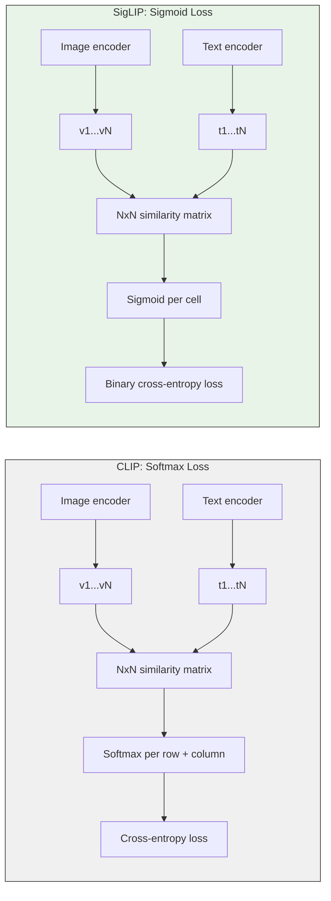
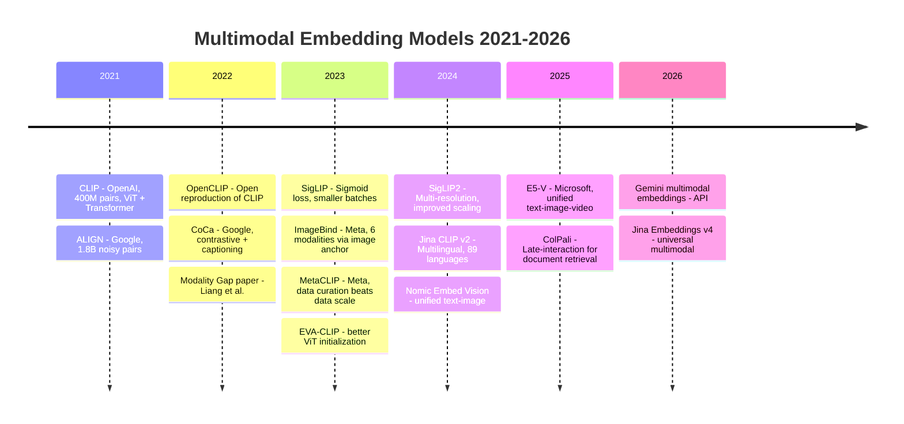
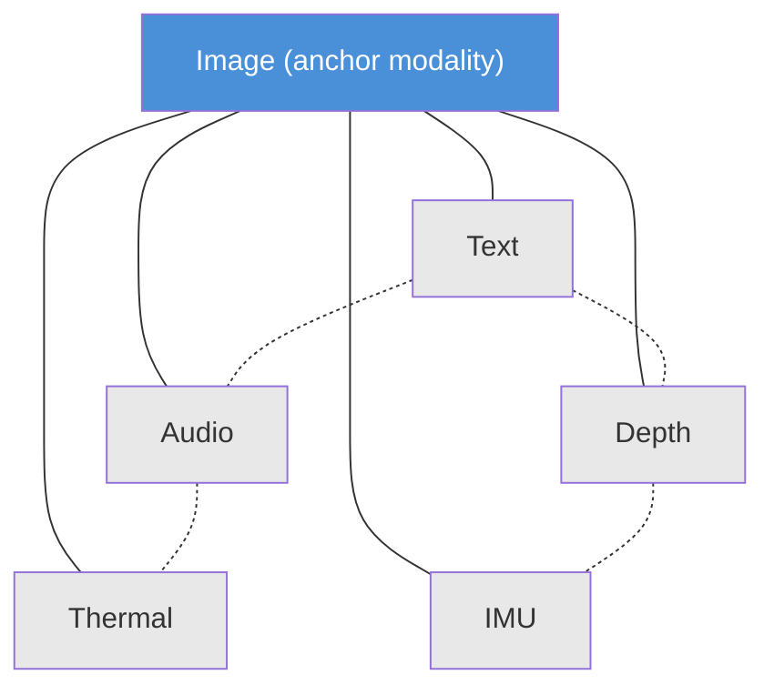
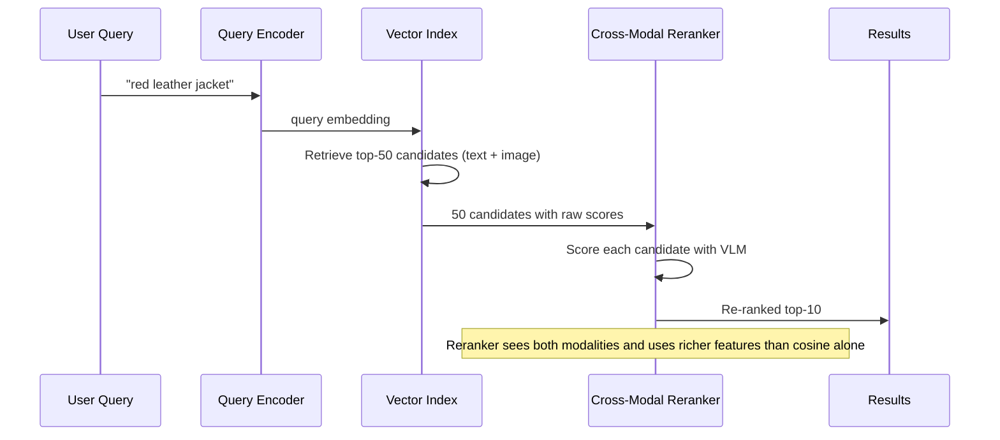

# Multimodal Embeddings: One Vector Space for Everything, and the Metric Problem Nobody Talks About

Here is the sales pitch, and it is genuinely beautiful. Take a photograph and a sentence. Pass each through an encoder. Get two vectors in the same space. If the sentence describes the photograph, the vectors are close. If not, they are far. Now extend this to audio clips, video frames, depth maps, thermal images. One embedding space to rule them all. Search anything with anything. The math is just cosine similarity.

I bought this pitch completely in 2022, when I first wired CLIP into a retrieval pipeline for a product catalog. Text query in, image results out, and the results were shockingly good for the first hundred queries. Then we started measuring. Recall@10 for text-to-image was 74%. Decent. But image-to-text was 58%. And when we mixed modalities in a single index — images and text chunks together, ranked by the same cosine score — the results were incoherent. Images dominated the top-k for some queries; text dominated for others. The ranking had nothing to do with relevance and everything to do with the geometry of the embedding space itself.

That was my introduction to the **modality gap**, and it changed how I think about multimodal retrieval. The single-vector-space idea is not wrong. It is incomplete. And the gap between the idea and a working production system is where most of the interesting engineering lives.

This post covers the full arc: how contrastive image-text training works and why SigLIP fixed what was broken in the original CLIP loss, the model landscape from 2021 through 2026, what happens when you go beyond two modalities, why cosine similarity lies to you across modalities, the retrieval patterns that actually work in production, a working code example you can run in Colab, and the honest limits of the whole approach.

## Prerequisites

You should be comfortable with embeddings, cosine similarity, and basic PyTorch. If you have read [MTEB: Choosing the Right Embedding Model](/blog/field-notes/mteb-embedding-benchmarks) and [Fine-Tuning Embeddings](/blog/field-notes/fine-tuning-embeddings), you have all the background you need.

**To run the code examples**, you will need a GPU runtime. Free options:

- **Google Colab** — select Runtime > Change runtime type > T4 GPU
- **Kaggle Notebooks** — enable GPU in Settings > Accelerator
- **Lightning.ai Studios** — free GPU tier available

Install: `pip install transformers torch pillow requests`

## How Contrastive Image-Text Training Works

Before we get to the problems, we need to understand the mechanism clearly, because the problems are baked into the mechanism.

The idea behind CLIP (Radford et al., 2021) is disarmingly simple. You have a batch of $N$ image-text pairs scraped from the internet — alt text and the image it describes. Each image goes through a vision encoder (a Vision Transformer or ResNet), producing a vector $\mathbf{v}_i \in \mathbb{R}^d$. Each text goes through a separate text encoder (a standard transformer), producing a vector $\mathbf{t}_i \in \mathbb{R}^d$. Both are projected to the same dimensionality $d$ and L2-normalized to the unit hypersphere. Now you have an $N \times N$ matrix of cosine similarities:

$$S_{ij} = \mathbf{v}_i^\top \mathbf{t}_j$$

The diagonal entries are the matching pairs. Everything off-diagonal is a negative. The loss treats each row as a classification problem — "which text matches this image?" — and each column as the reverse — "which image matches this text?" — using a standard cross-entropy (softmax) loss with a learnable temperature $\tau$:

$$\mathcal{L}_\text{CLIP} = -\frac{1}{2N} \sum_{i=1}^{N} \left[ \log \frac{e^{S_{ii}/\tau}}{\sum_{j=1}^{N} e^{S_{ij}/\tau}} + \log \frac{e^{S_{ii}/\tau}}{\sum_{j=1}^{N} e^{S_{ji}/\tau}} \right]$$

This is the InfoNCE loss applied symmetrically to both directions (image-to-text and text-to-image). The key innovation is that no human labels are required — the supervision comes entirely from the co-occurrence of images and their alt text on the web. OpenAI trained CLIP on 400 million image-text pairs (the WIT dataset, never publicly released), and the resulting model, CLIP ViT-L/14, achieved 76.2% zero-shot accuracy on ImageNet — matching a supervised ResNet-50 that had been trained directly on ImageNet's 1.28 million labeled examples, without seeing a single one. Across 30+ benchmarks spanning OCR, action recognition, geo-localization, and fine-grained classification, CLIP demonstrated that contrastive pre-training on web-scale data produces representations that transfer broadly.

The dual-encoder architecture is crucial to understanding both the power and the limitations. The image encoder and text encoder are completely separate networks. They share no weights. The only thing connecting them is the contrastive loss, which aligns their output spaces. This means the two encoders can develop very different internal representations as long as the outputs end up in roughly the same vector space. "Roughly" is doing a lot of work in that sentence, as we will see when we get to the modality gap.

### The Problem with Softmax: Why Batches Had to Be Enormous

The softmax normalization creates a coupling between all $N^2$ pairs in the batch. Every negative in the batch affects the gradient for every positive. This means the loss quality improves with batch size — CLIP used 32,768. That is an enormous batch. It requires distributing the similarity matrix across many accelerators and performing all-gather operations to synchronize the full $N \times N$ matrix. Training is expensive, engineering is painful, and small teams cannot reproduce it.

### SigLIP: The Sigmoid Fix

Zhai et al. (2023) asked: what if we drop the softmax entirely? Instead of treating each row as a classification problem, treat each cell in the matrix as a binary classification: is this pair a match or not?

$$\mathcal{L}_\text{SigLIP} = -\frac{1}{N^2} \sum_{i=1}^{N} \sum_{j=1}^{N} \left[ y_{ij} \log \sigma(S_{ij}/\tau) + (1 - y_{ij}) \log(1 - \sigma(S_{ij}/\tau)) \right]$$

where $y_{ij} = 1$ if $i = j$ (matching pair) and $y_{ij} = 0$ otherwise, and $\sigma$ is the sigmoid function.

This changes everything in practice:

1. **No global normalization.** Each pair's gradient is independent. No all-gather needed.
2. **Smaller batches work.** A SigLIP-Base model trained with batch size 4,096 on four TPUv4 chips matches CLIP-Base trained with batch size 32,768. SigLIP-Large achieves 84.5% ImageNet zero-shot accuracy at batch size 20,480.
3. **Simpler distributed training.** You can chunk the similarity matrix and process it in parallel without synchronization barriers.

The intuition is clean: softmax forces a competition among all negatives for each anchor. That competition is useful when negatives are informative, but in a random batch of 32,768, most negatives are trivially easy — a cat photo and a sentence about tax law are obviously not a match. Sigmoid treats each pair on its own merits, and easy negatives produce near-zero gradients automatically. The model focuses its learning on the hard cases without needing a giant batch to find them.



SigLIP is now the default loss for new multimodal embedding models. If you are starting a project in 2026, you should be using a SigLIP-family model unless you have a specific reason not to.

## The Model Landscape: 2021 to 2026

The space has moved fast. Here is the lineage that matters for practitioners.



A few entries deserve attention:

**OpenCLIP** (2022) reproduced CLIP's training with open data and open weights. This was the critical unlock that let the community iterate on the idea without depending on OpenAI. The LAION community assembled LAION-5B, a dataset of 5.85 billion image-text pairs filtered from Common Crawl, and trained OpenCLIP models on it. OpenCLIP ViT-G/14 trained on LAION-2B (a curated 2-billion-pair subset) reached 80.1% zero-shot ImageNet, surpassing the original CLIP. The entire training recipe, data pipeline, and model weights are open, which means you can fine-tune it for your domain.

**MetaCLIP** (Xu et al., 2023) showed that data curation matters more than data scale. Rather than simply collecting more data, the MetaCLIP team reverse-engineered CLIP's curation strategy and found that algorithmically balancing the training distribution — ensuring that each concept is represented proportionally using metadata derived from CLIP's own concept vocabulary — yields better representations than throwing more raw data at the problem. MetaCLIP achieved 70.8% zero-shot ImageNet with ViT-B on 400M pairs, beating CLIP's 68.3% on the same architecture and data budget. When scaled to 2.5 billion pairs, MetaCLIP ViT-H reached 80.5%. The lesson is important: garbage in, garbage out, even at web scale. A smaller, well-curated dataset beats a larger, noisy one.

**Jina CLIP v2** (2024) solved a problem that most CLIP models ignore: multilingual support. The standard CLIP text encoder is English-only, which means non-English queries produce poor embeddings. Jina CLIP v2 replaced the text encoder with a Jina XLM-RoBERTa model (561M parameters) trained on 29 languages, paired it with an EVA02-L14 vision encoder (304M parameters), and trained the whole system with a multi-task objective that handles both text-text and text-image retrieval. The result is a single model that supports 89 languages and performs competitively with English-only models on English benchmarks while vastly outperforming them on non-English queries. For production systems serving international users, this is often the right default choice.

**SigLIP2** (2024) extended SigLIP with multi-resolution training and improved scaling recipes. The model processes images at multiple resolutions during training, which improves performance on tasks that require fine-grained detail (like OCR and small-object recognition) without sacrificing performance on coarse semantic tasks. SigLIP2-SO400M achieves state-of-the-art performance across a range of vision-language benchmarks.

### The Comparison That Actually Matters

| Model | Zero-shot IN | Text-Image R@1 (Flickr30k) | Batch Size | Open Weights | Multilingual |
|---|---|---|---|---|---|
| CLIP ViT-L/14 | 76.2% | 87.2% | 32,768 | No (weights available) | No |
| OpenCLIP ViT-G/14 | 80.1% | 92.6% | 79,104 | Yes | No |
| SigLIP-Large | 84.5% | 91.1% | 20,480 | Yes | No |
| MetaCLIP ViT-B | 70.8% | 82.1% | 4,096 | Yes | No |
| Jina CLIP v2 | 67.4% | 89.7% | 8,192 | Yes | 89 languages |

Note: ImageNet zero-shot numbers are not directly comparable across ViT sizes. Compare within the same backbone. The SigLIP-Large vs OpenCLIP ViT-G comparison is across different model sizes.

## Beyond Text and Image: ImageBind and the Six-Modality Dream

Most CLIP-family models handle two modalities: text and image. Girdhar et al. (2023) at Meta asked whether you could extend this to six: images, text, audio, depth, thermal, and IMU data.

The key insight in ImageBind is that you do not need paired data between all modality combinations. You only need image-paired data for each modality. Images act as a **binding modality** — a bridge. If images and text share a space (via CLIP), and images and audio share a space (via audio-image pairs), then text and audio are transitively aligned, even though the model never saw a single text-audio pair during training.



Solid lines are directly trained. Dashed lines are emergent through the image anchor.

This is elegant, and it works surprisingly well for zero-shot cross-modal retrieval. You can search for audio using text, or find thermal images using depth maps, without ever having trained on those specific pairings. ImageBind demonstrated emergent zero-shot recognition across all 15 possible modality pairs, even though only 6 were directly trained (each non-image modality paired with images).

But there is a catch, and it is a significant one: the transitive alignment is weaker than direct alignment. Text-to-audio retrieval through the image bridge is noisier than text-to-image retrieval, because the alignment errors compound through two hops instead of one. The embedding space is not uniformly occupied — each modality clusters in its own region, and the distances between clusters are not semantically meaningful in the same way that within-cluster distances are. A cosine similarity of 0.4 between a text embedding and an image embedding does not mean the same thing as a cosine similarity of 0.4 between a text embedding and an audio embedding.

This is the modality gap, and it is the central problem of this post.

## The Modality Gap: Why Cosine Similarity Lies to You

Liang et al. (2022) documented a geometric phenomenon that should make every multimodal retrieval engineer uncomfortable. In CLIP's embedding space, text embeddings and image embeddings do not intermingle. They occupy separate, narrow cones on the unit hypersphere, separated by a consistent angular gap.

This is not a bug in CLIP. It is an emergent property of contrastive training combined with deep network initialization. The paper identifies two causes:

**Initialization geometry.** Deep neural networks, at initialization, map all inputs to a narrow cone in representation space. The text encoder and the image encoder start in different cones (different architectures, different initializations). Training pulls matching pairs closer, but the contrastive loss does not force the cones to merge — it only requires that within each cone, matching pairs are closer than non-matching pairs.

**Temperature and the loss landscape.** The temperature parameter $\tau$ in the contrastive loss controls how much the model "cares" about fine-grained similarity. Lower temperatures amplify differences, creating sharper clusters. But sharper clusters within each modality also means the gap between modalities persists — the loss reaches a low value without the cones merging.

### What This Means in Practice

Imagine you have a unified index containing both image embeddings and text-chunk embeddings from a product catalog. A user searches for "red leather jacket." You compute the query embedding and do top-10 by cosine similarity.

Here is what happens:

1. The query embedding lives in the text cone.
2. Text-chunk embeddings in the index also live in the text cone.
3. Image embeddings live in the image cone.
4. Cosine similarity within the text cone (query to text chunks) operates on a scale of roughly $[0.15, 0.45]$.
5. Cosine similarity across the gap (query to images) operates on a scale of roughly $[0.20, 0.35]$.
6. The ranges overlap, but the distributions are different. A "highly relevant" image might score 0.33, while a "somewhat relevant" text chunk scores 0.35.
7. Top-k returns the text chunk. The user never sees the jacket photo.

The failure mode is subtle: the system returns plausible-looking results, and naive accuracy metrics do not catch it because they are computed within-modality on academic benchmarks. Cross-modal retrieval in a mixed index is a fundamentally different problem than single-modality retrieval, and the standard benchmarks do not measure it.

### Measuring the Gap

You can measure the modality gap in your own model with a few lines of code. Embed a set of matched image-text pairs, compute the centroid of each modality, and measure the cosine distance between centroids:

```python
import torch
import numpy as np

def measure_modality_gap(image_embeddings, text_embeddings):
    """
    Measure the angular gap between image and text embedding distributions.
    Both inputs should be L2-normalized numpy arrays of shape (N, D).
    """
    img_centroid = image_embeddings.mean(axis=0)
    txt_centroid = text_embeddings.mean(axis=0)

    # Normalize centroids
    img_centroid = img_centroid / np.linalg.norm(img_centroid)
    txt_centroid = txt_centroid / np.linalg.norm(txt_centroid)

    cosine_sim = np.dot(img_centroid, txt_centroid)
    angular_gap_degrees = np.degrees(np.arccos(np.clip(cosine_sim, -1, 1)))

    # Also measure within-modality spread
    img_self_sim = (image_embeddings @ img_centroid).mean()
    txt_self_sim = (text_embeddings @ txt_centroid).mean()

    return {
        "cosine_similarity_between_centroids": float(cosine_sim),
        "angular_gap_degrees": float(angular_gap_degrees),
        "image_self_similarity": float(img_self_sim),
        "text_self_similarity": float(txt_self_sim),
    }
```

Typical values for CLIP ViT-L/14: centroid cosine similarity around 0.65-0.70, angular gap around 45-50 degrees. For SigLIP models, the gap is somewhat smaller (around 35-40 degrees) but still substantial. For ImageBind, the gap varies by modality pair — image-text is tightest, image-IMU is widest. The gap never fully closes in any contrastive model I have tested.

The practical implication is stark: you cannot treat cosine similarity as a universal relevance score across modalities. A score of 0.35 from a text-to-image comparison does not mean the same thing as 0.35 from a text-to-text comparison. Any system that mixes modalities in a single ranked list without accounting for this will produce unreliable rankings. The scores are on different scales, drawn from different distributions, and the gap between the distributions shifts with the specific model, the data domain, and even the query type.

## Production Retrieval Patterns: What Actually Works

Given the modality gap, how do you build a retrieval system that handles mixed-modality queries and documents? Here are the patterns I have seen work, ordered from simplest to most effective.

### Pattern 1: Separate Indexes, Merge at Query Time

The simplest approach: maintain one vector index for images and one for text. At query time, search both, normalize the scores, and merge the results.

```python
def multimodal_search(query_embedding, image_index, text_index, k=10):
    """Search separate indexes and merge results with score normalization."""
    img_results = image_index.search(query_embedding, k=k)
    txt_results = text_index.search(query_embedding, k=k)

    # Normalize scores to [0, 1] within each modality
    img_scores = normalize_scores(img_results.scores)
    txt_scores = normalize_scores(txt_results.scores)

    # Merge and re-rank
    all_results = []
    for doc_id, score in zip(img_results.ids, img_scores):
        all_results.append(("image", doc_id, score))
    for doc_id, score in zip(txt_results.ids, txt_scores):
        all_results.append(("text", doc_id, score))

    return sorted(all_results, key=lambda x: x[2], reverse=True)[:k]


def normalize_scores(scores):
    """Min-max normalization within a result set."""
    if len(scores) == 0:
        return scores
    min_s, max_s = scores.min(), scores.max()
    if max_s - min_s < 1e-8:
        return np.ones_like(scores)
    return (scores - min_s) / (max_s - min_s)
```

This is crude but effective for many use cases. The key insight is that score distributions differ across modalities, so you must normalize before merging. Without normalization, one modality dominates.

### Pattern 2: Named Vectors (Qdrant) / Multi-Vector (Weaviate)

Modern vector databases have native support for multiple embedding spaces per document. Qdrant's named vectors let you store a text embedding and an image embedding for the same document, then query against either or both:

```python
from qdrant_client import QdrantClient
from qdrant_client.models import (
    Distance, VectorParams, NamedVector, PointStruct
)

client = QdrantClient("localhost", port=6333)

# Create collection with named vectors
client.create_collection(
    collection_name="products",
    vectors_config={
        "text": VectorParams(size=768, distance=Distance.COSINE),
        "image": VectorParams(size=768, distance=Distance.COSINE),
    },
)

# Upsert a document with both embeddings
client.upsert(
    collection_name="products",
    points=[
        PointStruct(
            id=1,
            vector={
                "text": text_embedding.tolist(),
                "image": image_embedding.tolist(),
            },
            payload={"name": "Red Leather Jacket", "price": 299.99},
        )
    ],
)

# Query against the image vector specifically
results = client.search(
    collection_name="products",
    query_vector=NamedVector(name="image", vector=query_embedding.tolist()),
    limit=10,
)
```

Weaviate offers a similar capability with target vectors, and Vespa supports multi-vector retrieval with custom ranking expressions. This pattern sidesteps the modality gap by keeping the search within a single modality's subspace, then using payload-level joins to retrieve the full multi-modal document.

### Pattern 3: Late Fusion with Reranking

The most robust pattern I have deployed: use vector search for candidate retrieval, then apply a cross-modal reranker that can reason about text-image relevance with a richer model.



The reranker can be a vision-language model (VLM) like a small fine-tuned LLaVA or even a CLIP model used in a different way — instead of comparing embeddings, you feed the query text and each candidate image directly into the model and get a relevance score. This is expensive (you are running inference $N$ times for $N$ candidates), so you use vector search to narrow from millions to 50-100 candidates, then rerank.

This is the same retrieve-then-rerank pattern used in text retrieval (BM25 + cross-encoder), adapted for multimodal. It works because the reranker does not suffer from the modality gap — it processes both modalities jointly, not in separate encoders.

### Pattern 4: Hybrid Search with BM25 on OCR/Captions

For document-heavy use cases (product catalogs, medical records, scanned forms), a surprisingly effective pattern is to run OCR or captioning on images, index the extracted text alongside the image embedding, and use BM25 on the text side with vector search on the image side. This is particularly powerful because BM25 excels at exact-match queries (part numbers, model codes, regulatory references) where embedding similarity is weakest.

The implementation is straightforward: for every image in your corpus, generate a text caption using a VLM and extract any text via OCR. Index the original image embedding, the caption embedding, and the raw caption text. At query time, run BM25 against the raw text and vector search against the embeddings, then fuse the results using Reciprocal Rank Fusion (RRF) or a learned combination weight.

```python
def hybrid_multimodal_search(query, bm25_index, vector_index, alpha=0.6):
    """
    Hybrid search combining BM25 on captions/OCR with vector similarity.
    alpha controls the weight: 1.0 = pure vector, 0.0 = pure BM25.
    """
    # BM25 on caption text
    bm25_results = bm25_index.search(query, k=50)
    bm25_scores = {doc_id: 1.0 / (rank + 60)  # RRF constant = 60
                   for rank, (doc_id, _) in enumerate(bm25_results)}

    # Vector search on embeddings
    query_emb = encode_query(query)
    vec_results = vector_index.search(query_emb, k=50)
    vec_scores = {doc_id: 1.0 / (rank + 60)
                  for rank, (doc_id, _) in enumerate(vec_results)}

    # Fuse
    all_doc_ids = set(bm25_scores.keys()) | set(vec_scores.keys())
    fused = {
        doc_id: alpha * vec_scores.get(doc_id, 0)
                + (1 - alpha) * bm25_scores.get(doc_id, 0)
        for doc_id in all_doc_ids
    }
    return sorted(fused.items(), key=lambda x: x[1], reverse=True)
```

Vespa has first-class support for this pattern with its rank profiles, letting you define BM25 + vector fusion in configuration rather than application code. Weaviate and Qdrant also support hybrid search natively.

| Pattern | Complexity | Handles Gap | Latency | Best For |
|---|---|---|---|---|
| Separate indexes + merge | Low | Partially | Low | Quick proof of concept |
| Named vectors | Medium | Yes | Low | Production multi-modal |
| Late fusion + reranker | High | Yes | Medium | Quality-critical apps |
| Hybrid BM25 + vector | Medium | Yes | Low | Document-heavy use cases |

## A Working Example: SigLIP Image-Text Search

Here is a complete, runnable example that builds a small image-text search system using SigLIP. This runs in Google Colab on a T4 GPU.

```python
"""
Multimodal image-text search with SigLIP.
Run in Google Colab with T4 GPU.
pip install transformers torch pillow requests
"""

import torch
import requests
import numpy as np
from PIL import Image
from transformers import AutoProcessor, AutoModel

# Load SigLIP model and processor
model_name = "google/siglip-base-patch16-224"
model = AutoModel.from_pretrained(model_name).eval().cuda()
processor = AutoProcessor.from_pretrained(model_name)


def encode_images(image_urls: list[str]) -> np.ndarray:
    """Encode a list of images from URLs into normalized embeddings."""
    images = []
    for url in image_urls:
        img = Image.open(requests.get(url, stream=True).raw).convert("RGB")
        images.append(img)

    inputs = processor(images=images, return_tensors="pt", padding=True)
    inputs = {k: v.cuda() for k, v in inputs.items()}

    with torch.no_grad():
        embeddings = model.get_image_features(**inputs)

    # L2 normalize
    embeddings = embeddings / embeddings.norm(dim=-1, keepdim=True)
    return embeddings.cpu().numpy()


def encode_texts(texts: list[str]) -> np.ndarray:
    """Encode a list of text queries into normalized embeddings."""
    inputs = processor(text=texts, return_tensors="pt", padding=True)
    inputs = {k: v.cuda() for k, v in inputs.items()}

    with torch.no_grad():
        embeddings = model.get_text_features(**inputs)

    embeddings = embeddings / embeddings.norm(dim=-1, keepdim=True)
    return embeddings.cpu().numpy()


def search(query: str, image_embeddings: np.ndarray,
           image_labels: list[str], top_k: int = 5) -> list:
    """Search image embeddings with a text query."""
    query_emb = encode_texts([query])
    similarities = (query_emb @ image_embeddings.T).squeeze(0)

    top_indices = similarities.argsort()[::-1][:top_k]
    return [
        {"label": image_labels[i], "score": float(similarities[i])}
        for i in top_indices
    ]


# --- Example usage ---
# Unsplash image URLs (small, public domain)
image_urls = [
    "https://images.unsplash.com/photo-1574158622682-e40e69881006?w=224",  # cat
    "https://images.unsplash.com/photo-1587300003388-59208cc962cb?w=224",  # dog
    "https://images.unsplash.com/photo-1506744038136-46273834b3fb?w=224",  # landscape
    "https://images.unsplash.com/photo-1504674900247-0877df9cc836?w=224",  # food
    "https://images.unsplash.com/photo-1541701494587-cb58502866ab?w=224",  # abstract
]
labels = ["cat", "dog", "landscape", "food plate", "abstract art"]

# Build the "index"
print("Encoding images...")
image_embs = encode_images(image_urls)
print(f"Image embeddings shape: {image_embs.shape}")

# Search
queries = ["a fluffy pet", "mountain scenery", "delicious meal"]
for q in queries:
    results = search(q, image_embs, labels, top_k=3)
    print(f"\nQuery: '{q}'")
    for r in results:
        print(f"  {r['label']}: {r['score']:.4f}")

# Measure the modality gap on this tiny dataset
text_embs = encode_texts(labels)
gap = np.dot(
    image_embs.mean(axis=0) / np.linalg.norm(image_embs.mean(axis=0)),
    text_embs.mean(axis=0) / np.linalg.norm(text_embs.mean(axis=0)),
)
print(f"\nModality gap (centroid cosine sim): {gap:.4f}")
print(f"Angular gap: {np.degrees(np.arccos(np.clip(gap, -1, 1))):.1f} degrees")
```

This example is intentionally minimal. In production, you would replace the numpy dot product with a proper vector index (Qdrant, Weaviate, FAISS), add batched encoding for large corpora, and implement the reranking pattern described above.

## Gotchas: The Things That Bite You

These are the failure modes I have hit in production, roughly in order of how much time they wasted.

### 1. The Modality Gap Strikes at Mixed Indexes

Already covered in depth, but worth repeating: if you put image embeddings and text embeddings in the same index and search with cosine, your top-k will be dominated by whichever modality happens to be closer to the query in absolute cosine terms. **Always normalize scores per modality before merging**, or use separate indexes.

### 2. Image Preprocessing Is Not Optional

CLIP-family models are sensitive to image resolution and aspect ratio. Most expect 224x224 or 384x384 square crops. If you feed a 4000x3000 photo resized to 224x224, you lose detail. If you center-crop a product image and crop out the product, you lose the subject entirely.

Best practice: use the model's processor (it handles resizing and normalization correctly), but also be aware of what it is doing. SigLIP's processor uses a bilinear resize to the model's expected resolution. For high-resolution images where detail matters, consider tiling — split the image into overlapping patches, encode each, and store multiple vectors per image.

### 3. Text Length Limits Are Real

CLIP-family text encoders have a maximum token length — typically 77 tokens for CLIP and OpenCLIP, and 64 for SigLIP. If your text is longer, it gets silently truncated. This means a 500-word product description gets reduced to the first ~50 words. If the important information (model number, color, material) is at the end of the description, the embedding misses it entirely.

Solutions: truncate intelligently (put the most important information first), or chunk long text and encode each chunk separately.

### 4. Normalization Matters More Than You Think

Some models output unnormalized embeddings. If you forget to L2-normalize before computing cosine similarity, you are actually computing a scaled dot product, and the magnitudes carry spurious information. Always normalize. Check your model's documentation — `get_image_features` and `get_text_features` in HuggingFace transformers do **not** normalize by default for most CLIP models.

### 5. Temperature Scaling Differs Between Models

CLIP uses a learnable temperature (typically around $\tau = 0.01$), while SigLIP uses a learnable bias and temperature. If you fine-tune or distill and forget to carry over the temperature, your similarity scores will be miscalibrated. Raw cosine similarity from different models are not comparable.

### 6. The Caption Fallback Is Underrated

When cross-modal retrieval quality is not meeting your bar, the simplest and often most effective fix is: generate captions for all images using a VLM (LLaVA, GPT-4V, Gemini), embed the captions with a text embedding model, and do text-to-text retrieval. You lose the ability to search by visual similarity, but you gain all the precision of mature text retrieval systems, including BM25, exact match, and semantic search with proven text embedding models.

This is not a hack. It is a legitimate architectural choice for many production systems, and it eliminates the modality gap problem entirely because all embeddings are in the text modality.

## Honest Limits

Multimodal embeddings are powerful, but they have real limits that no amount of engineering can fully paper over:

**Cross-modal retrieval is inherently harder than within-modal.** A text description of an image captures semantic content but not visual style, composition, or texture. An image captures visual content but not the conceptual framing a text might emphasize. The shared embedding space must compromise, and it does.

**Fine-grained distinctions are weak.** CLIP-family models are excellent at broad semantic matching ("a dog on a beach") but struggle with compositional queries ("a red ball to the left of a blue cube") and fine-grained attributes ("a 2019 Honda Civic LX vs. a 2020 Honda Civic EX"). This is a fundamental limitation of the contrastive training objective — it optimizes for matching, not for compositional reasoning.

**The modality gap does not disappear with more data.** Liang et al. (2022) showed that the gap is a structural property of contrastive training, not a data insufficiency. Models trained on more data have better within-modality representations, but the gap persists. Some recent work on alignment fine-tuning reduces the gap, but it does not eliminate it.

**Audio and video embeddings are less mature.** ImageBind demonstrated the concept, but production-quality audio-text and video-text embedding models are still less robust than image-text models. The training data for audio-image pairs is smaller and noisier than for text-image pairs, and the resulting embeddings reflect this. Expect lower recall, more failure modes, and less consistent cross-modal alignment. If audio retrieval is critical to your application, consider specialized audio embedding models (CLAP for audio-text, for example) rather than general-purpose multimodal models.

**Embedding-only retrieval is not a complete solution.** For high-stakes applications (medical image search, legal document retrieval, e-commerce product discovery), embedding search should be a candidate retrieval stage, not the final answer. Always pair it with a reranker or a human in the loop. The precision ceiling of embedding-only retrieval in a mixed-modality setting is lower than what most teams need, and a lightweight reranking step can recover 5-15 points of NDCG.

**Domain shift kills performance silently.** CLIP-family models are trained on web-scraped data. If your images look like web photos (well-lit, centered subjects, natural scenes), the embeddings are strong. If your images are X-rays, satellite imagery, manufacturing defect photos, or microscopy slides, performance drops sharply. Domain-specific fine-tuning or domain-specific models (BiomedCLIP for medical, GeoRSCLIP for remote sensing) are necessary for specialized domains.

## Where This Is Going

The trajectory is clear. In 2021, multimodal embeddings were a research breakthrough. In 2026, they are a standard component in retrieval systems, with production-ready models, database support, and established patterns for handling their limitations.

Three directions I am watching:

**Native multimodal transformers.** Models like Gemini and GPT-4o process all modalities in a single transformer, without separate encoders. Their internal representations are not afflicted by the modality gap because there is no separate encoding step — the modalities are fused from the first layer. As these models become available for embedding extraction (Gemini's multimodal embeddings API, for example), the gap problem may become a historical footnote.

**Late-interaction retrieval (ColPali and successors).** Instead of compressing an image into a single vector, late-interaction models store a set of patch-level embeddings per image and compute similarity using MaxSim over the patch set. For a query with $m$ tokens and an image with $n$ patches, the similarity is:

$$\text{MaxSim}(q, d) = \sum_{i=1}^{m} \max_{j=1}^{n} \mathbf{q}_i^\top \mathbf{d}_j$$

This preserves fine-grained detail — individual patches can match individual query tokens — and has shown strong results on document retrieval benchmarks where the document is a page image (slides, PDFs, invoices). The cost is more storage (hundreds of vectors per document instead of one) and more computation at query time, but it sidesteps the information bottleneck of compressing an entire image into a single 768-dimensional vector.

**Learned modality-specific projections.** Rather than one shared space, maintain modality-specific spaces with learned projections between them. When searching text-to-image, project the query into the image space. When searching image-to-text, project the query into the text space. This is more complex to train and deploy, but it directly addresses the gap by acknowledging that the spaces are different and learning an explicit translation.

The underlying lesson is one I keep re-learning: elegant abstractions ("one vector space for everything!") are starting points, not endpoints. The real engineering happens when the abstraction meets production data, and the work is in building systems that are honest about where the abstraction breaks.

The good news is that we now have both the understanding (the modality gap is well-characterized) and the tools (multi-vector databases, hybrid search, cross-modal rerankers) to build multimodal retrieval systems that work. The one-vector-space dream is not dead. It just needs to be paired with engineering that respects the geometry.

## Going Deeper

**Books:**
- Bishop, C. M. & Bishop, H. (2024). *Deep Learning: Foundations and Concepts.* Springer.
  - Thorough treatment of representation learning and contrastive objectives with modern notation
- Jurafsky, D. & Martin, J. H. (2024). *Speech and Language Processing.* 3rd ed. (draft).
  - Chapter on vector semantics provides essential background on embedding spaces and similarity metrics
- Goodfellow, I., Bengio, Y. & Courville, A. (2016). *Deep Learning.* MIT Press.
  - The chapters on representation learning remain the best explanation of why learned features form manifolds
- Zhou, Z.-H. (2021). *Machine Learning.* Springer.
  - Clear coverage of metric learning foundations that underpin contrastive training

**Online Resources:**
- [OpenCLIP GitHub Repository](https://github.com/mlfoundations/open_clip) — Reference implementation, pre-trained checkpoints, and training recipes for open CLIP models
- [SigLIP Model Card on Hugging Face](https://huggingface.co/google/siglip-large-patch16-384) — Model weights, usage examples, and benchmark results for the large SigLIP variant
- [ImageBind GitHub Repository](https://github.com/facebookresearch/ImageBind) — Official code and pre-trained model for six-modality embeddings
- [Lilian Weng, "Contrastive Representation Learning"](https://lilianweng.github.io/posts/2021-05-31-contrastive/) — Excellent walkthrough of contrastive learning objectives from triplet loss to InfoNCE

**Videos:**
- [Yannic Kilcher, "CLIP: Connecting Text and Images"](https://www.youtube.com/watch?v=T9XSU0pKX2E) by Yannic Kilcher — Detailed paper walkthrough with practical commentary on what CLIP actually learns
- [Jay Alammar, "The Illustrated CLIP"](https://www.youtube.com/watch?v=OZF1t_Hieq8) by Jay Alammar — Visual explanation of contrastive pre-training and the dual-encoder architecture
- [Andrej Karpathy, "Let's build CLIP"](https://www.youtube.com/watch?v=eHyA3TFGmgo) by Andrej Karpathy — Building CLIP from scratch, with emphasis on the training loop and loss function

**Academic Papers:**
- Radford, A. et al. (2021). ["Learning Transferable Visual Models From Natural Language Supervision."](https://arxiv.org/abs/2103.00020) *ICML 2021.*
  - The original CLIP paper that started the modern multimodal embedding era
- Zhai, X. et al. (2023). ["Sigmoid Loss for Language Image Pre-Training."](https://arxiv.org/abs/2303.15343) *ICCV 2023.*
  - SigLIP's sigmoid loss achieves better performance at smaller batch sizes, making training accessible
- Liang, W. et al. (2022). ["Mind the Gap: Understanding the Modality Gap in Multi-modal Contrastive Representation Learning."](https://arxiv.org/abs/2203.02053) *NeurIPS 2022.*
  - The definitive study on why modalities occupy separate subspaces, with mathematical analysis
- Girdhar, R. et al. (2023). ["ImageBind: One Embedding Space To Bind Them All."](https://arxiv.org/abs/2305.05665) *CVPR 2023.*
  - Six-modality embeddings using images as a binding modality
- Xu, H. et al. (2023). ["Demystifying CLIP Data."](https://arxiv.org/abs/2309.16671) *ICLR 2024 Spotlight.*
  - MetaCLIP shows that data curation outperforms data scale for contrastive pre-training
- Koukounas, A. et al. (2024). ["jina-clip-v2: Multilingual Multimodal Embeddings for Text and Images."](https://arxiv.org/abs/2412.08802) *arXiv preprint.*
  - Multilingual multimodal embeddings supporting 89 languages in a single model

**Questions to Explore:**
- If native multimodal transformers eliminate the modality gap by processing all modalities jointly, does the concept of a "shared embedding space" become unnecessary, or does it evolve into something else?
- Is the modality gap a bug to fix or a feature that reflects a genuine difference in the information content of different modalities?
- Can we build retrieval systems that reason about *which* modality would best answer a query, rather than searching all modalities and hoping the scores are comparable?
- As multimodal embeddings improve, will the captioning fallback become obsolete, or will text remain the universal interface for precision retrieval?
- What happens to evaluation methodology when the standard benchmarks measure within-modality performance but production systems need cross-modal reliability?
